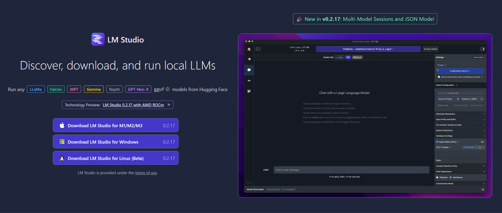
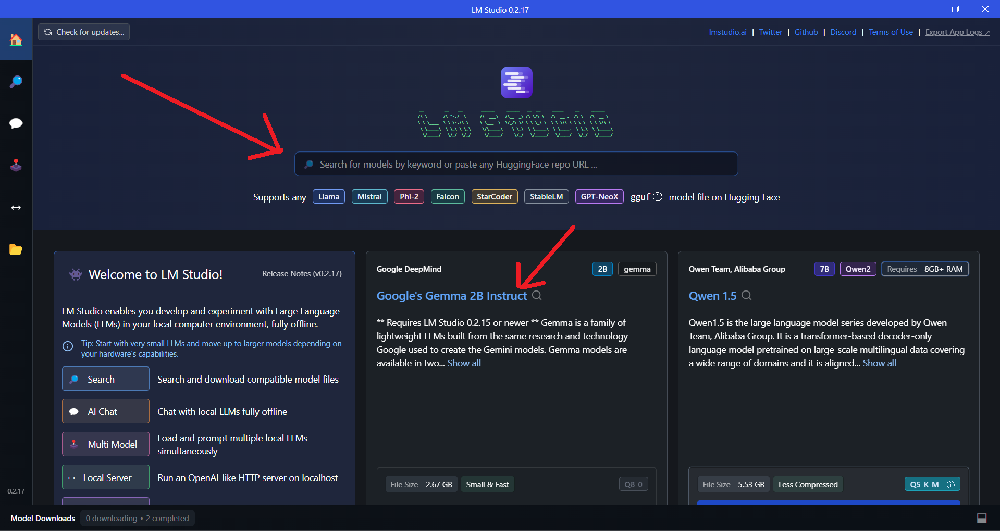
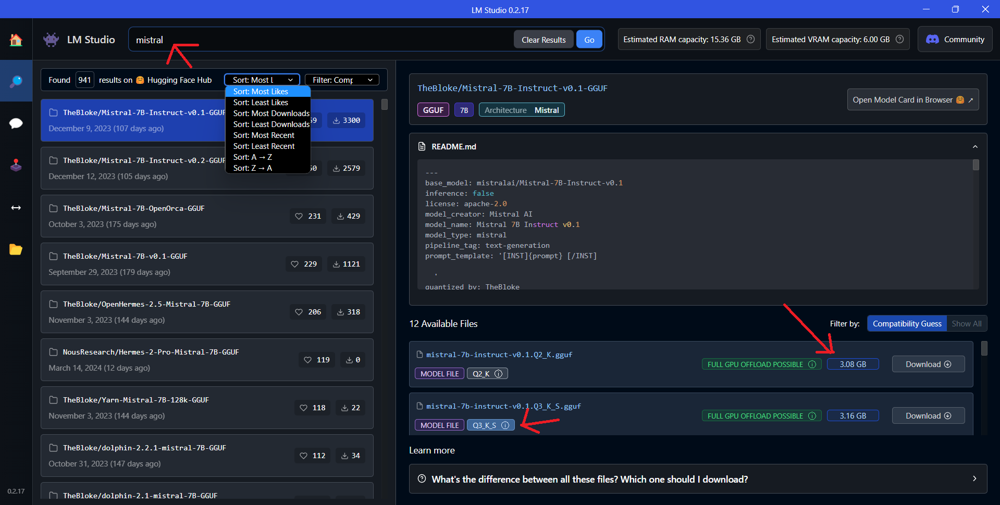
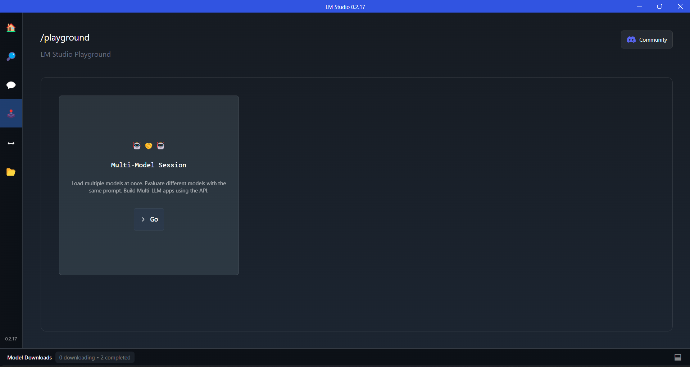
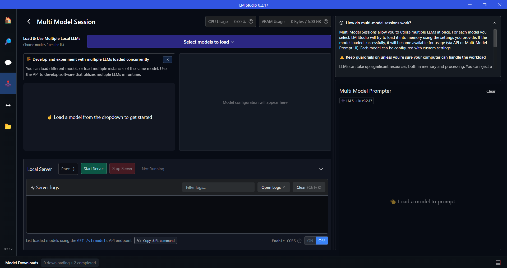
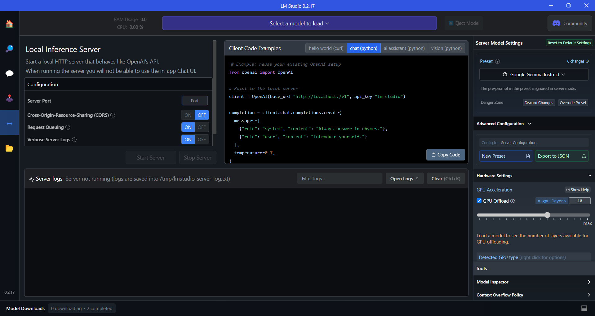
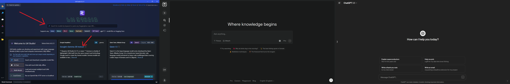

Taken from my [LinkedIn article](https://www.linkedin.com/pulse/discovering-lm-studio-gateway-private-locally-hosted-ai-thyagarajan-j0off/?trackingId=nC61UnjnTbaviLZjLm%2BUXA%3D%3D).

---

*I'm thrilled to embark on this new journey of writing my first ever article!* It's an exciting step forward, and I can't wait to share my thoughts and insights with all of you. As someone deeply passionate about technology and its ever-evolving landscape, I'm eager to explore the boundless possibilities that lie ahead. **This article marks the beginning of what I hope will be an enriching and rewarding experience**, allowing me to contribute to the ongoing discourse while continuously learning and growing. *Let's dive in!*

---

In the ever-evolving landscape of artificial intelligence, the need for privacy, security, and control over our data has become paramount. As groundbreaking technologies like [ChatGPT](https://chat.openai.com) integrate themselves into our daily routines, there is a growing demand for secure alternatives that prioritize data protection. Enter [LM Studio](https://lmstudio.ai/) - a cutting-edge software solution that empowers users to run Large Language Models (LLMs) locally on their laptops or desktops, providing a secure alternative to cloud-based AI applications.

---

LM Studio is a game-changer, offering a seamless way to harness the power of AI while ensuring that your sensitive information remains securely stored on your device, rather than being processed on remote servers. With its user-friendly interface, LM Studio simplifies the process of installing and managing a variety of AI models, making it accessible to users of all skill levels, from developers and researchers to hobbyists and businesses.

### What is LM Studio?

LM Studio is a cutting-edge platform that empowers users to harness the power of LLMs directly on their local machines, without the need for an internet connection! It provides a user-friendly interface that simplifies the process of downloading, configuring, and utilizing these powerful AI models.

At its core, LM Studio acts as a bridge between users and the vast ecosystem of open-source LLMs available from sources like [Hugging Face](https://huggingface.co/). With LM Studio, you can effortlessly access these state-of-the-art models, all while enjoying the convenience of an intuitive chat-based user interface or by interacting with the models through an OpenAI-compatible local server.

Whether you're a researcher exploring the boundaries of generative AI, a developer building innovative applications, or an enthusiast curious about the potential of LLMs, LM Studio provides a seamless and secure platform to unlock the full capabilities of these cutting-edge technologies, all within the confines of your local machine.

### Setting up LM Studio

Getting started with LM Studio is easy, thanks to its user-friendly installation process. To begin, simply visit the [LM Studio website](https://lmstudio.ai/) and choose the appropriate version for your operating system (Windows, macOS, or Linux). One of the standout features is the relatively small download size of just 402 MB, making it a lightweight solution that won't strain your system resources.

Once the download is complete, open the installer and follow the straightforward on-screen instructions. LM Studio's installation process is designed to be intuitive and hassle-free, ensuring that even those new to working with LLMs can get up and running quickly.

Within minutes, you'll have LM Studio up and running on your machine, ready to unlock the full potential of locally hosted AI models. The seamless installation process is just one of the many advantages that LM Studio offers, prioritizing accessibility and ease of use for a wide range of users.

### Using LM Studio

Alrighty, now that we've covered the installation process, it's time to dive into the software itself! Upon launching LM Studio, you'll be greeted by the main landing page. Let's take a moment to explore its interface and functionality.

The first step is to select an LLM to install. LM Studio provides two convenient options for this - you can choose from the community-suggested models listed in the main window, or you can use the search bar to find any model available on HuggingFace as shown in the Landing page image above. It's worth noting that HuggingFace *currently* hosts an impressive collection of 565,239 models, giving you a vast array of choices to explore.

Regardless of whether you opt for a community-suggested model or search for one on your own, LM Studio displays the size of the installation/download file. This information is crucial as it allows you to ensure that you have sufficient storage space before proceeding with the download.

The Compatibility Guess feature (*located to the right of the Sort filter button*) checks your system's specifications and presents the models that are *likely to run smoothly* on your computer.

It's important to note that larger models tend to be *more accurate* but may have *slower performance*, depending on the capabilities and speed of your computer. Additionally, you'll find that most of these models are quantized.

> *Note: Quantization refers to the process of using lower-precision numbers, such as 8-bit integers, instead of 32-bit floating-point values, to represent the weights and activations in the model. This technique reduces memory usage and speeds up inference on your computer's hardware. While quantization can slightly reduce model accuracy compared to a full-precision version, it offers significant memory savings and faster inference times. Think of it like how MP3s are compressed audio files or JPEGs are compressed image files – although they are of lower quality, the difference is often negligible. In the case of LLMs, the "Q" number you see in the listing represents the level of quantization, with lower numbers indicating more quantization and higher numbers indicating less quantization.*
>
*More information relating to Quantization [here](https://towardsdatascience.com/introduction-to-weight-quantization-2494701b9c0c).*

### Open Source LLM Models

**LM Studio** provides a user-friendly interface for browsing and selecting from a constantly growing library of LLMs. Whether you're interested in models specialized for specific tasks or domains, or you prefer more general-purpose language models, LM Studio's diverse collection ensures that you'll find options tailored to your unique needs.

Once you've chosen your desired LLM, LM Studio offers an intuitive real-time chat interface. Navigate to the **AI Chat section** in the sidebar, enabling you to engage in natural language conversations with the model. Simply type your message into the chat window, and the LLM will respond accordingly, providing insightful answers, creative suggestions, or task assistance, depending on your prompts.

To enhance your experience, LM Studio features a convenient sidebar that displays real-time CPU consumption and RAM usage, giving you valuable insights into your system's performance.

Moreover, LM Studio simplifies the process of managing your downloaded LLM models. If you no longer require a particular model, you can effortlessly remove it with a single click, thanks to LM Studio's intuitive interface for ejecting or deleting models. This feature helps you maintain an organized workspace and frees up valuable storage space on your local machine, ensuring optimal performance at all times.

---

### **Demo Preview** (YouTube)

---

# Playground/Multi-Agent Mode

**LM Studio's** latest v0.2.17 update introduces a game-changing feature that takes your AI experience to new heights - **Multi-Agent Mode**, also known as the **Playground**! This addition empowers you to load and prompt multiple LLMs simultaneously, unlocking a world of possibilities for collaborative AI workflows.

With Multi-Agent Mode, you can seamlessly load and interact with several instances of the same model or combine multiple different models, each with its own unique strengths and capabilities. This feature opens up new avenues for exploring advanced AI techniques, such as ensemble modeling, where the collective intelligence of multiple models can be harnessed to tackle complex tasks more effectively.

---

### **Playground/Multi-Model Session Sidebar Option**

---

The beauty of Multi-Agent Mode lies in its flexibility and ease of use. You can leverage this functionality either through LM Studio's intuitive **Multi-Model Prompter** user interface or via the powerful API, which allows you to develop software that utilizes multiple LLMs in runtime.

Configuring Multi-Agent Mode is a breeze. LM Studio allows you to load different models or multiple instances of the same model, each with its own customizable settings. For every model you select, LM Studio will attempt to load it into memory using the provided configurations. If the model loads successfully, it becomes available for usage, either through the **Multi-Model Prompter UI** or via the API, enabling seamless integration into your workflows.

A more in-depth explanation is provided by [Matthew Berman](https://www.youtube.com/@matthew_berman) on his latest [video](https://www.youtube.com/watch?v=4fdZwKg9IbU&t=357s).

---

### **Detailed Multi-Model Session**

---

# Local Inference Server

For those seeking even greater flexibility and control over their AI workflows, LM Studio offers a powerful feature: the **Local Inference Server**. This functionality allows you to host LLMs on your own server, providing unparalleled control and privacy over your AI environment.

The Local Inference Server enables you to start a local HTTP server that behaves like OpenAI's API, making it easy to integrate with existing applications or workflows that rely on the OpenAI API. With just a few clicks, you can spin up the server and begin hosting your LLMs, providing seamless access to your locally hosted models.

---

### **Local Inference Server Feature**

---

This feature is particularly invaluable for organizations and individuals who prioritize data privacy and security. By hosting LLMs on their own servers, companies can provide access to these powerful models within their organization while maintaining complete control over sensitive data. Similarly, individuals who value privacy can leverage the Local Inference Server to create a self-contained AI environment, free from the concerns associated with cloud-based services.

For companies and individuals interested in using LM Studio in a professional setting, the LM Studio website provides a [Google form link](https://docs.google.com/forms/d/e/1FAIpQLSd-zGyQIVlSSqzRyM4YzPEmdNehW3iCd3_X8np5NWCD_1G3BA/viewform?usp=sf_link) specifically for this purpose.

---

## Advantages

- **Complete data privacy and security** by running LLMs locally on your machine.
- **Ability to operate entirely offline** without internet connectivity.
- **Support for a vast library** of open-source LLM models from Hugging Face and other sources.
- **Option to enable GPU acceleration** for improved inference speed.
- **User-friendly interface** for seamless model installation, configuration, and management.
- **Real-time chat interface** for natural language interactions with LLMs.
- **Local Inference Server** for hosting LLMs on your own server, providing enhanced control.
- **Remote access to hosted models**, facilitating collaborative work.
- **Built-in error logging and troubleshooting tools** for easy debugging.

## Limitations and Challenges

- **System resource requirements** (CPU, RAM, storage) for running larger LLM models.
- **Limited to models compatible** with the user’s hardware specifications.
- **Potential for performance bottlenecks** when running multiple LLMs simultaneously.
- **Learning curve for configuring and optimizing local LLM setups**.

---

## Conclusion

In the rapidly evolving landscape of artificial intelligence, **LM Studio** emerges as a game-changing solution that revolutionizes the way we interact with LLMs.

From its user-friendly interface and seamless installation process to its extensive library of open-source LLM models, LM Studio provides a comprehensive and accessible platform for exploring the boundless possibilities of generative AI.

While LM Studio's local processing approach offers unparalleled privacy and security, it's essential to consider the hardware requirements and potential performance limitations compared to cloud-based services. Users may need to invest time in learning and optimizing their local LLM setups to ensure optimal performance, balancing the trade-offs between privacy, control, and computational resources.

Moreover, the user interface (UI) plays a pivotal role in the success and growth of AI software. A prime example is [Perplexity](https://www.perplexity.ai/), renowned for its intuitive and visually appealing UI. The seamless integration of features, clarity in navigation, and aesthetically pleasing design contribute to Perplexity's widespread adoption and acclaim within the AI community. A comparison between Perplexity's UI and that of other platforms, such as ChatGPT and LM Studio, underscores the importance of an exceptional UI in driving user engagement and satisfaction.

---

### **UIs of LM Studio (left), Perplexity (center), and ChatGPT (right)**

---

Join the [LM Studio's Discord server](https://discord.com/invite/aPQfnNkxGC) to connect with fellow AI enthusiasts, share ideas, and stay updated on the latest LM Studio news and developments. You can also follow them on [Twitter](https://twitter.com/LMStudioAI) and [GitHub](https://github.com/lmstudio-ai) for more insights, tips, and discussions.

Feel free to reach out with any questions, doubts, or insights you'd like to share.
