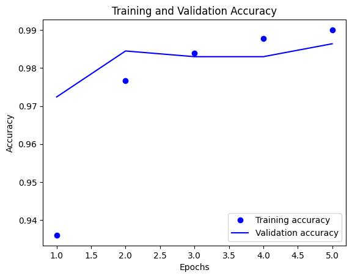

# Build and Train a Convolutional Neural Network (CNN) and Explore Different Layers

## Table of Contents
- [Aim](#aim)
- [Prerequisite](#prerequisite)
- [Steps](#steps)
  - [Step 1: Load the MNIST dataset into your notebook](#step-1-load-the-mnist-dataset-into-your-notebook)
  - [Step 2: Pre-processing and prepare the data for giving to the CNN](#step-2-pre-processing-and-prepare-the-data-for-giving-to-the-cnn)
    - [Step 2a: Encoding the classes using one hot encoder](#step-2a-encoding-the-classes-using-one-hot-encoder)
    - [Step 2b: Normalize the features](#step-2b-normalize-the-features)
  - [Step 3: Building the convolutional network model](#step-3-building-the-convolutional-network-model)
    - [Step 3a: You may choose the layers](#step-3a-you-may-choose-the-layers)
    - [Step 3b: Print the summary and note the number of neurons and parameters of the model](#step-3b-print-the-summary-and-note-the-number-of-neurons-and-parameters-of-the-model)
    - [Step 3c: Compile the model and train it using the training data](#step-3c-compile-the-model-and-train-it-using-the-training-data)
  - [Step 4: Vary the number of layers and repeat step 3](#step-4-vary-the-number-of-layers-and-repeat-step-3)
  - [Step 5: Implement the architecture of LeNet 5](#step-5-implement-the-architecture-of-lenet-5)
  - [Step 6: Finally note which network gives you the best performance](#step-6-finally-note-which-network-gives-you-the-best-performance)

## Aim
To build and train a Convolutional Neural Network (CNN) on the MNIST dataset and explore the application of different layers.

## Prerequisite
- Python Programming
- TensorFlow/Keras
- Convolutional Neural Networks (CNNs)
- MNIST dataset

## Steps

### Step 1: Load the MNIST dataset into your notebook
Load the MNIST dataset to begin the data processing and modeling steps.

### Step 2: Pre-processing and prepare the data for giving to the CNN

#### Step 2a: Encoding the classes using one hot encoder
Convert the class labels into a binary matrix representation using one hot encoding.

#### Step 2b: Normalize the features
Normalize the pixel values of the images to a range between 0 and 1.

### Step 3: Building the convolutional network model

#### Step 3a: You may choose the layers
Select and add layers to the CNN model as per requirement, including convolutional layers, pooling layers, and dense layers.

#### Step 3b: Print the summary and note the number of neurons and parameters of the model
Display the summary of the CNN model architecture and note the number of neurons and parameters for each layer.

#### Step 3c: Compile the model and train it using the training data
Compile the CNN model with appropriate loss function, optimizer, and metrics. Train the model using the training dataset, and include validation data for evaluation during training.

### Step 4: Vary the number of layers and repeat step 3
Experiment by adding or removing layers from the CNN model architecture and observe the impact on model performance.

### Step 5: Implement the architecture of LeNet 5
Implement the specific architecture of LeNet 5, a classic CNN architecture designed for handwritten digit recognition.

### Step 6: Finally note which network gives you the best performance
Compare the performance of different CNN architectures (varying layers and LeNet 5) based on metrics such as accuracy and loss to determine which network performs the best for the MNIST dataset.


```python
# import libraries
import tensorflow as tf
import numpy as np
import matplotlib.pyplot as plt
from keras import Sequential

from keras.layers import Conv2D, Flatten, Input, MaxPooling2D, Flatten, AveragePooling2D, Dense
from keras.models import Model
from sklearn.preprocessing import OneHotEncoder
```

# Task 1: Load the MNIST dataset into your notebook

```python
# loading a dataset
mnist = tf.keras.datasets.mnist
(X_train,y_train),(X_test,y_test) = mnist.load_data()
```

    Downloading data from https://storage.googleapis.com/tensorflow/tf-keras-datasets/mnist.npz
    11490434/11490434 [==============================] - 0s 0us/step

```python
X_train.shape
```

    (60000, 28, 28)

```python
y_train.shape
```

    (60000,)

```python
X_test.shape
```

    (10000, 28, 28)

```python
y_test.shape
```

    (10000,)

# Task 2: Pre-processing and prepare the data for giving to the CNN.
### a. Encoding the classes using one hot encoder.
### b. Normalize the features.

```python
# normalizing
X_train = X_train / 255.0
X_test = X_test / 255.0
```

```python
ohe = OneHotEncoder(sparse = False)
y_train = ohe.fit_transform(y_train.reshape(-1,1))
y_test  = ohe.fit_transform(y_test.reshape(-1,1))
```

    /usr/local/lib/python3.10/dist-packages/sklearn/preprocessing/_encoders.py:868: FutureWarning: `sparse` was renamed to `sparse_output` in version 1.2 and will be removed in 1.4. `sparse_output` is ignored unless you leave `sparse` to its default value.
      warnings.warn(
    /usr/local/lib/python3.10/dist-packages/sklearn/preprocessing/_encoders.py:868: FutureWarning: `sparse` was renamed to `sparse_output` in version 1.2 and will be removed in 1.4. `sparse_output` is ignored unless you leave `sparse` to its default value.
      warnings.warn(

```python
# Reshaping the dataset
# Building the input vector into 4D tensor (i.e 1) ([0] means keeping the first dimension as it is)
X_train = X_train.reshape(X_train.shape[0], 28, 28, 1)
X_test = X_test.reshape(X_test.shape[0], 28, 28, 1)
```

```python
X_train[0].shape
```

    (28, 28, 1)

# Task 3: Building the convolutional network model.
### a. You may choose the layers.
### b. Print the summary and note the number of neurons and parameters of the model.
### c. Compile the model and train it using the training data.

```python
input = Input(shape = (28, 28, 1))
x = Conv2D(filters = 64,    # total no of filters
           kernel_size = 3, # size of the filters
           activation = 'relu')(input)
x = MaxPooling2D()(x)
x = Conv2D(filters = 128,
           kernel_size = 3,
           activation = 'relu')(x)
x = MaxPooling2D()(x)
x = Conv2D(filters = 32,
           kernel_size = 3,
           activation = 'relu')(x)
x = MaxPooling2D()(x) # 3D matrix data
x = Flatten()(x)      # Connecting to a Dense NN
output = Dense(10,activation = 'softmax')(x)
```

```python
model = Model(inputs=input, outputs = output)
```

```python
model.summary()
```

    Model: "model"
    _________________________________________________________________
     Layer (type)                Output Shape              Param #   
    =================================================================
     input_1 (InputLayer)        [(None, 28, 28, 1)]       0         
                                                                     
     conv2d (Conv2D)             (None, 26, 26, 64)        640       
                                                                     
     max_pooling2d (MaxPooling2  (None, 13, 13, 64)        0         
     D)                                                              
                                                                     
     conv2d_1 (Conv2D)           (None, 11, 11, 128)       73856     
                                                                     
     max_pooling2d_1 (MaxPoolin  (None, 5, 5, 128)         0         
     g2D)                                                            
                                                                     
     conv2d_2 (Conv2D)           (None, 3, 3, 32)          36896     
                                                                     
     max_pooling2d_2 (MaxPoolin  (None, 1, 1, 32)          0         
     g2D)                                                            
                                                                     
     flatten (Flatten)           (None, 32)                0         
                                                                     
     dense (Dense)               (None, 10)                330       
                                                                     
    =================================================================
    Total params: 111722 (436.41 KB)
    Trainable params: 111722 (436.41 KB)
    Non-trainable params: 0 (0.00 Byte)
    _________________________________________________________________

```python
model.compile(optimizer = 'adam',
             loss= 'categorical_crossentropy',
             metrics=['accuracy'])
history = model.fit(X_train, y_train, validation_data = (X_test, y_test), epochs =5)
```

    Epoch 1/5
    1875/1875 [==============================] - 137s 72ms/step - loss: 0.2087 - accuracy: 0.9360 - val_loss: 0.0903 - val_accuracy: 0.9724
    Epoch 2/5
    1875/1875 [==============================] - 130s 69ms/step - loss: 0.0745 - accuracy: 0.9767 - val_loss: 0.0543 - val_accuracy: 0.9845
    Epoch 3/5
    1875/1875 [==============================] - 128s 69ms/step - loss: 0.0518 - accuracy: 0.9839 - val_loss: 0.0585 - val_accuracy: 0.9830
    Epoch 4/5
    1875/1875 [==============================] - 132s 70ms/step - loss: 0.0387 - accuracy: 0.9879 - val_loss: 0.0608 - val_accuracy: 0.9830
    Epoch 5/5
    1875/1875 [==============================] - 128s 68ms/step - loss: 0.0310 - accuracy: 0.9901 - val_loss: 0.0418 - val_accuracy: 0.9864

```python
score = model.evaluate(X_test, y_test)
print('Test Loss:', score[0])
print('Test accuracy:', score[1])
```

    313/313 [==============================] - 6s 19ms/step - loss: 0.0418 - accuracy: 0.9864
    Test Loss: 0.04178265482187271
    Test accuracy: 0.9864000082015991

# Task 4: Vary the number of layers and repeat step 3.

```python
input = Input(shape = (28, 28, 1))
x = Conv2D(filters = 64,
           kernel_size = 3,
           activation = 'relu')(input)
x = AveragePooling2D()(x)
x = Conv2D(filters = 128,
           kernel_size = 3,
           activation = 'relu')(x)
x = AveragePooling2D()(x)
x = Conv2D(filters = 32,
           kernel_size = 3,
           activation = 'relu')(x)
x = AveragePooling2D()(x)
x = Flatten()(x)
output = Dense(10,activation = 'softmax')(x)
```

```python
model1 = Model(inputs=input, outputs = output)
```

```python
model1.summary()
```

    Model: "model_1"
    _________________________________________________________________
     Layer (type)                Output Shape              Param #   
    =================================================================
     input_2 (InputLayer)        [(None, 28, 28, 1)]       0         
                                                                     
     conv2d_3 (Conv2D)           (None, 26, 26, 64)        640       
                                                                     
     average_pooling2d (Average  (None, 13, 13, 64)        0         
     Pooling2D)                                                      
                                                                     
     conv2d_4 (Conv2D)           (None, 11, 11, 128)       73856     
                                                                     
     average_pooling2d_1 (Avera  (None, 5, 5, 128)         0         
     gePooling2D)                                                    
                                                                     
     conv2d_5 (Conv2D)           (None, 3, 3, 32)          36896     
                                                                     
     average_pooling2d_2 (Avera  (None, 1, 1, 32)          0         
     gePooling2D)                                                    
                                                                     
     flatten_1 (Flatten)         (None, 32)                0         
                                                                     
     dense_1 (Dense)             (None, 10)                330       
                                                                     
    =================================================================
    Total params: 111722 (436.41 KB)
    Trainable params: 111722 (436.41 KB)
    Non-trainable params: 0 (0.00 Byte)
    _________________________________________________________________

```python
model1.compile(optimizer = 'adam',
             loss= 'categorical_crossentropy',
             metrics=['accuracy'])
history2 = model1.fit(X_train, y_train, validation_data = (X_test, y_test), epochs =5)
```

    Epoch 1/5
    1875/1875 [==============================] - 136s 72ms/step - loss: 0.2872 - accuracy: 0.9108 - val_loss: 0.1054 - val_accuracy: 0.9673
    Epoch 2/5
    1875/1875 [==============================] - 122s 65ms/step - loss: 0.1079 - accuracy: 0.9670 - val_loss: 0.0788 - val_accuracy: 0.9746
    Epoch 3/5
    1875/1875 [==============================] - 116s 62ms/step - loss: 0.0812 - accuracy: 0.9754 - val_loss: 0.0696 - val_accuracy: 0.9786
    Epoch 4/5
    1875/1875 [==============================] - 115s 61ms/step - loss: 0.0638 - accuracy: 0.9813 - val_loss: 0.0521 - val_accuracy: 0.9850
    Epoch 5/5
    1875/1875 [==============================] - 114s 61ms/step - loss: 0.0547 - accuracy: 0.9830 - val_loss: 0.0628 - val_accuracy: 0.9799

```python
history_dict = history.history
accuracy_values = history_dict['accuracy']
val_accuracy_values = history_dict['val_accuracy']

epochs = range(1, len(accuracy_values) + 1)

plt.plot(epochs, accuracy_values, 'bo', label='Training accuracy')
plt.plot(epochs, val_accuracy_values, 'b', label='Validation accuracy')
plt.title('Training and Validation Accuracy')
plt.xlabel('Epochs')
plt.ylabel('Accuracy')  # Corrected label to 'Accuracy'
plt.legend()
plt.show()
```

    

    

```python
score = model1.evaluate(X_test, y_test)
print('Test Loss:', score[0])
print('Test accuracy:', score[1])
```

    313/313 [==============================] - 6s 18ms/step - loss: 0.0628 - accuracy: 0.9799
    Test Loss: 0.06281796842813492
    Test accuracy: 0.9799000024795532

# Task 5: Implement the architecture of LeNet 5.

```python
# LeNet architecture
inputs = Input(shape = (28, 28, 1))
x = Conv2D(filters = 6,
           kernel_size = (5, 5),
           activation = 'tanh', padding ='same', strides = 1)(inputs)
x = AveragePooling2D(strides=2,
                     pool_size =(2, 2))(x)
x = Conv2D(filters = 16,
           kernel_size = (5, 5),
           activation = 'tanh', padding='valid')(x)
x = AveragePooling2D(strides=2,
                 pool_size =(2, 2))(x)
x = Flatten()(x)
x = Dense(120, activation = 'tanh')(x)
x = Dense(84, activation='tanh')(x)
outputs = Dense(10, activation = 'softmax')(x)
```

```python
lenet = Model(inputs=inputs, outputs = outputs)
lenet.summary()
```

    Model: "model_2"
    _________________________________________________________________
     Layer (type)                Output Shape              Param #   
    =================================================================
     input_3 (InputLayer)        [(None, 28, 28, 1)]       0         
                                                                     
     conv2d_6 (Conv2D)           (None, 28, 28, 6)         156       
                                                                     
     average_pooling2d_3 (Avera  (None, 14, 14, 6)         0         
     gePooling2D)                                                    
                                                                     
     conv2d_7 (Conv2D)           (None, 10, 10, 16)        2416      
                                                                     
     average_pooling2d_4 (Avera  (None, 5, 5, 16)          0         
     gePooling2D)                                                    
                                                                     
     flatten_2 (Flatten)         (None, 400)               0         
                                                                     
     dense_2 (Dense)             (None, 120)               48120     
                                                                     
     dense_3 (Dense)             (None, 84)                10164     
                                                                     
     dense_4 (Dense)             (None, 10)                850       
                                                                     
    =================================================================
    Total params: 61706 (241.04 KB)
    Trainable params: 61706 (241.04 KB)
    Non-trainable params: 0 (0.00 Byte)
    _________________________________________________________________

```python
lenet.compile(optimizer = 'adam',
             loss= 'categorical_crossentropy',
             metrics=['accuracy'])
history3 = lenet.fit(X_train, y_train, validation_data = (X_test, y_test), epochs =5)
```

    Epoch 1/5
    1875/1875 [==============================] - 43s 23ms/step - loss: 0.2280 - accuracy: 0.9322 - val_loss: 0.1025 - val_accuracy: 0.9681
    Epoch 2/5
    1875/1875 [==============================] - 42s 23ms/step - loss: 0.0836 - accuracy: 0.9740 - val_loss: 0.0680 - val_accuracy: 0.9771
    Epoch 3/5
    1875/1875 [==============================] - 47s 25ms/step - loss: 0.0583 - accuracy: 0.9820 - val_loss: 0.0651 - val_accuracy: 0.9783
    Epoch 4/5
    1875/1875 [==============================] - 43s 23ms/step - loss: 0.0442 - accuracy: 0.9862 - val_loss: 0.0525 - val_accuracy: 0.9840
    Epoch 5/5
    1875/1875 [==============================] - 42s 23ms/step - loss: 0.0365 - accuracy: 0.9878 - val_loss: 0.0564 - val_accuracy: 0.9834

```python
score = lenet.evaluate(X_test, y_test)
print('Test Loss:', score[0])
print('Test accuracy:', score[1])
```

    313/313 [==============================] - 3s 11ms/step - loss: 0.0564 - accuracy: 0.9834
    Test Loss: 0.056421563029289246
    Test accuracy: 0.9833999872207642

# Task 6: Finally note which network gives you the best performance.
#### Model 1 gives us the highest Test accuracy of 98.5%

## Learning Outcomes/Conclusion

1. **Data Preprocessing**: Understanding the essential data preprocessing steps, including one-hot encoding for class labels and feature normalization, to prepare data for deep learning.

2. **CNN Model Construction**: Building and training Convolutional Neural Networks (CNNs) with different layer configurations, gaining practical knowledge in network architecture design.

3. **Layer Variation Impact**: Discovering the effect of varying the number of layers in a CNN on model performance, which can help in making informed design choices.

4. **LeNet-5 Implementation**: Implementing the LeNet-5 architecture, a classic CNN design, to explore its structure and applications in image recognition tasks.

5. **Performance Evaluation**: Evaluating and comparing the performance of different network architectures on the MNIST dataset, with Model 1 identified as the best-performing model for the task.

