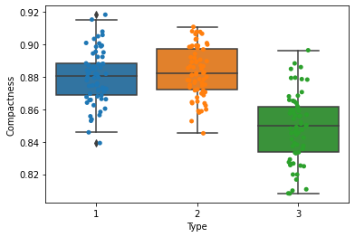

# Data Visualization Techniques

This README file provides instructions and information for understanding and implementing data visualization techniques. The following tasks will be performed using Python programming and various libraries:

## Table of Contents
1. [Aim](#aim)
2. [Prerequisite](#prerequisite)
3. [Outcome](#outcome)
4. [Theory](#theory)
5. [Task 1: Exploring Data Visualization](#task-1)
6. [Tasks 2-15: Various Plots and Analysis](#tasks-2-15)

<a name="aim"></a>
## Aim
The aim of this project is to understand and implement data visualization techniques.

<a name="prerequisite"></a>
## Prerequisite
In order to complete this experiment, you should have prior knowledge of Python programming, Pandas library, Numpy library, Matplotlib, and Seaborn library.

<a name="outcome"></a>
## Outcome
After successfully completing this experiment, you will be able to:
- Read different types of data files (csv, excel, text file, etc.).
- Understand the usage of different Python libraries for plotting data.
- Plot data using different types of plots.
- Can be found [here](https://github.com/Haleshot/AI-ML/blob/master/Data_Visualization_Techniques_Plots/Data_Visualization_Techniques_Plots.ipynb).

<a name="theory"></a>
## Theory
Data visualization is a form of visual communication that involves creating and studying visual representations of data. It helps in understanding patterns, trends, and relationships within the data. In this project, we will be using Matplotlib and Seaborn libraries for data visualization.

### Matplotlib
Matplotlib is a widely used Python library for data visualization. It provides a comprehensive set of plotting tools and supports various types of plots such as scatter plots, bar charts, line plots, box plots, and more.

### Seaborn
Seaborn is a Python library based on Matplotlib that provides a high-level interface for creating attractive and informative statistical graphics. It simplifies the process of creating visually pleasing plots and supports advanced features like categorical plots, violin plots, joint plots, and more.

### Common Types of Plots
In this project, we will be using the following common types of plots for data visualization:

- Scatter Plot: A scatter plot visualizes the relationship between two continuous variables by displaying individual data points on a two-dimensional plane.
- Pair Plot: A pair plot creates a grid of scatter plots to visualize the relationships between multiple variables in a dataset.
- Box Plot: A box plot displays the distribution of quantitative data, showing the median, quartiles, and outliers.
- Violin Plot: A violin plot combines a box plot with a kernel density estimation to visualize the distribution of data.
- Distribution Plot: A distribution plot displays the distribution of a single variable using a histogram or a kernel density estimate.
- Joint Plot: A joint plot combines two distribution plots and a scatter plot to visualize the relationship between two variables.
- Bar Chart: A bar chart represents categorical data using rectangular bars with heights or lengths proportional to the values they represent.
- Line Plot: A line plot displays data points connected by straight lines, commonly used to show trends over time.

<a name="task-1"></a>
## Task 1: Exploring Data Visualization
Perform the following tasks to explore data visualization techniques:

1. Read the "seeds.csv" file into a DataFrame.
2. Explore the dataset using the head and describe functions.
3. Find the number of samples per type and plot a histogram for the count.

<a name="tasks-2-15"></a>
## Tasks 2-15: Various Plots and Analysis
Perform the following tasks to create different plots and analyze the dataset:

2. Plot a scatter plot for Kernel Width vs Length and write your inference.
3. Plot a joint plot to understand the relation between Perimeter and Compactness and write your inference.
4. Plot a scatter plot to compare Perimeter and Compactness with different types having different colors (use legend).
5. Plot a box plot to understand the correlation between Compactness and Type.
6. Plot box and strip plots to understand the correlation between Compactness and Type and state your inference.
7. Plot box and strip plots to understand the correlation between Perimeter and Type.
8. Plot violin and strip subplots to understand the correlation between Compactness and Type and state your inference.
9. Plot kernel density estimation plots to understand the correlation between Compactness and Type and state your inference.
10. Plot a pair plot to understand all characteristics with Type being the main parameter and state your inference.
11. Plot a pair plot to understand all characteristics with Type being the main parameter, using KDE instead of a histogram in diagonal subplots.
12. Plot an Andrews curve to display the separability of data according to Type.
13. Plot a bar plot for the given X and Y values.
    - X = [2, 8, 10]
    - Y = [11, 16, 9]
    - X2 = [2, 3, 6]
    - Y2 = [4, 16, 9]

Please follow the instructions above to perform the data visualization tasks using the provided libraries.


```python
# import libraries
import matplotlib.pyplot as plt
import numpy as np
import pandas as pd
import seaborn as sns
```

```python
# Reading the File:
df = pd.read_csv("/content/seeds.csv")
```

```python
df
```

  <div id="df-6bad123f-9656-4c50-be55-0f05064ad2c4">
    <div class="colab-df-container">
      <div>
<style scoped>
    .dataframe tbody tr th:only-of-type {
        vertical-align: middle;
    }

    .dataframe tbody tr th {
        vertical-align: top;
    }

    .dataframe thead th {
        text-align: right;
    }
</style>
<table border="1" class="dataframe">
  <thead>
    <tr style="text-align: right;">
      <th></th>
      <th>Area</th>
      <th>Perimeter</th>
      <th>Compactness</th>
      <th>Kernel.Length</th>
      <th>Kernel.Width</th>
      <th>Asymmetry.Coeff</th>
      <th>Kernel.Groove</th>
      <th>Type</th>
    </tr>
  </thead>
  <tbody>
    <tr>
      <th>0</th>
      <td>15.26</td>
      <td>14.84</td>
      <td>0.8710</td>
      <td>5.763</td>
      <td>3.312</td>
      <td>2.221</td>
      <td>5.220</td>
      <td>1</td>
    </tr>
    <tr>
      <th>1</th>
      <td>14.88</td>
      <td>14.57</td>
      <td>0.8811</td>
      <td>5.554</td>
      <td>3.333</td>
      <td>1.018</td>
      <td>4.956</td>
      <td>1</td>
    </tr>
    <tr>
      <th>2</th>
      <td>14.29</td>
      <td>14.09</td>
      <td>0.9050</td>
      <td>5.291</td>
      <td>3.337</td>
      <td>2.699</td>
      <td>4.825</td>
      <td>1</td>
    </tr>
    <tr>
      <th>3</th>
      <td>13.84</td>
      <td>13.94</td>
      <td>0.8955</td>
      <td>5.324</td>
      <td>3.379</td>
      <td>2.259</td>
      <td>4.805</td>
      <td>1</td>
    </tr>
    <tr>
      <th>4</th>
      <td>16.14</td>
      <td>14.99</td>
      <td>0.9034</td>
      <td>5.658</td>
      <td>3.562</td>
      <td>1.355</td>
      <td>5.175</td>
      <td>1</td>
    </tr>
    <tr>
      <th>...</th>
      <td>...</td>
      <td>...</td>
      <td>...</td>
      <td>...</td>
      <td>...</td>
      <td>...</td>
      <td>...</td>
      <td>...</td>
    </tr>
    <tr>
      <th>194</th>
      <td>12.19</td>
      <td>13.20</td>
      <td>0.8783</td>
      <td>5.137</td>
      <td>2.981</td>
      <td>3.631</td>
      <td>4.870</td>
      <td>3</td>
    </tr>
    <tr>
      <th>195</th>
      <td>11.23</td>
      <td>12.88</td>
      <td>0.8511</td>
      <td>5.140</td>
      <td>2.795</td>
      <td>4.325</td>
      <td>5.003</td>
      <td>3</td>
    </tr>
    <tr>
      <th>196</th>
      <td>13.20</td>
      <td>13.66</td>
      <td>0.8883</td>
      <td>5.236</td>
      <td>3.232</td>
      <td>8.315</td>
      <td>5.056</td>
      <td>3</td>
    </tr>
    <tr>
      <th>197</th>
      <td>11.84</td>
      <td>13.21</td>
      <td>0.8521</td>
      <td>5.175</td>
      <td>2.836</td>
      <td>3.598</td>
      <td>5.044</td>
      <td>3</td>
    </tr>
    <tr>
      <th>198</th>
      <td>12.30</td>
      <td>13.34</td>
      <td>0.8684</td>
      <td>5.243</td>
      <td>2.974</td>
      <td>5.637</td>
      <td>5.063</td>
      <td>3</td>
    </tr>
  </tbody>
</table>
<p>199 rows × 8 columns</p>
</div>
      <button class="colab-df-convert" onclick="convertToInteractive('df-6bad123f-9656-4c50-be55-0f05064ad2c4')"
              title="Convert this dataframe to an interactive table."
              style="display:none;">

  <svg xmlns="http://www.w3.org/2000/svg" height="24px"viewBox="0 0 24 24"
       width="24px">
    <path d="M0 0h24v24H0V0z" fill="none"/>
    <path d="M18.56 5.44l.94 2.06.94-2.06 2.06-.94-2.06-.94-.94-2.06-.94 2.06-2.06.94zm-11 1L8.5 8.5l.94-2.06 2.06-.94-2.06-.94L8.5 2.5l-.94 2.06-2.06.94zm10 10l.94 2.06.94-2.06 2.06-.94-2.06-.94-.94-2.06-.94 2.06-2.06.94z"/><path d="M17.41 7.96l-1.37-1.37c-.4-.4-.92-.59-1.43-.59-.52 0-1.04.2-1.43.59L10.3 9.45l-7.72 7.72c-.78.78-.78 2.05 0 2.83L4 21.41c.39.39.9.59 1.41.59.51 0 1.02-.2 1.41-.59l7.78-7.78 2.81-2.81c.8-.78.8-2.07 0-2.86zM5.41 20L4 18.59l7.72-7.72 1.47 1.35L5.41 20z"/>
  </svg>
      </button>

  <style>
    .colab-df-container {
      display:flex;
      flex-wrap:wrap;
      gap: 12px;
    }

    .colab-df-convert {
      background-color: #E8F0FE;
      border: none;
      border-radius: 50%;
      cursor: pointer;
      display: none;
      fill: #1967D2;
      height: 32px;
      padding: 0 0 0 0;
      width: 32px;
    }

    .colab-df-convert:hover {
      background-color: #E2EBFA;
      box-shadow: 0px 1px 2px rgba(60, 64, 67, 0.3), 0px 1px 3px 1px rgba(60, 64, 67, 0.15);
      fill: #174EA6;
    }

    [theme=dark] .colab-df-convert {
      background-color: #3B4455;
      fill: #D2E3FC;
    }

    [theme=dark] .colab-df-convert:hover {
      background-color: #434B5C;
      box-shadow: 0px 1px 3px 1px rgba(0, 0, 0, 0.15);
      filter: drop-shadow(0px 1px 2px rgba(0, 0, 0, 0.3));
      fill: #FFFFFF;
    }
  </style>

      <script>
        const buttonEl =
          document.querySelector('#df-6bad123f-9656-4c50-be55-0f05064ad2c4 button.colab-df-convert');
        buttonEl.style.display =
          google.colab.kernel.accessAllowed ? 'block' : 'none';

        async function convertToInteractive(key) {
          const element = document.querySelector('#df-6bad123f-9656-4c50-be55-0f05064ad2c4');
          const dataTable =
            await google.colab.kernel.invokeFunction('convertToInteractive',
                                                     [key], {});
          if (!dataTable) return;

          const docLinkHtml = 'Like what you see? Visit the ' +
            '<a target="_blank" href=https://colab.research.google.com/notebooks/data_table.ipynb>data table notebook</a>'
            + ' to learn more about interactive tables.';
          element.innerHTML = '';
          dataTable['output_type'] = 'display_data';
          await google.colab.output.renderOutput(dataTable, element);
          const docLink = document.createElement('div');
          docLink.innerHTML = docLinkHtml;
          element.appendChild(docLink);
        }
      </script>
    </div>
  </div>

```python
# Size
df.size
```

    1592

```python
# Shape
df.shape
```

    (199, 8)

```python
# Data Types
df.dtypes
```

    Area               float64
    Perimeter          float64
    Compactness        float64
    Kernel.Length      float64
    Kernel.Width       float64
    Asymmetry.Coeff    float64
    Kernel.Groove      float64
    Type                 int64
    dtype: object

```python
df.head
```

    <bound method NDFrame.head of       Area  Perimeter  Compactness  Kernel.Length  Kernel.Width  \
    0    15.26      14.84       0.8710          5.763         3.312   
    1    14.88      14.57       0.8811          5.554         3.333   
    2    14.29      14.09       0.9050          5.291         3.337   
    3    13.84      13.94       0.8955          5.324         3.379   
    4    16.14      14.99       0.9034          5.658         3.562   
    ..     ...        ...          ...            ...           ...   
    194  12.19      13.20       0.8783          5.137         2.981   
    195  11.23      12.88       0.8511          5.140         2.795   
    196  13.20      13.66       0.8883          5.236         3.232   
    197  11.84      13.21       0.8521          5.175         2.836   
    198  12.30      13.34       0.8684          5.243         2.974   
    
         Asymmetry.Coeff  Kernel.Groove  Type  
    0              2.221          5.220     1  
    1              1.018          4.956     1  
    2              2.699          4.825     1  
    3              2.259          4.805     1  
    4              1.355          5.175     1  
    ..               ...            ...   ...  
    194            3.631          4.870     3  
    195            4.325          5.003     3  
    196            8.315          5.056     3  
    197            3.598          5.044     3  
    198            5.637          5.063     3  
    
    [199 rows x 8 columns]>

```python
df.describe
```

    <bound method NDFrame.describe of       Area  Perimeter  Compactness  Kernel.Length  Kernel.Width  \
    0    15.26      14.84       0.8710          5.763         3.312   
    1    14.88      14.57       0.8811          5.554         3.333   
    2    14.29      14.09       0.9050          5.291         3.337   
    3    13.84      13.94       0.8955          5.324         3.379   
    4    16.14      14.99       0.9034          5.658         3.562   
    ..     ...        ...          ...            ...           ...   
    194  12.19      13.20       0.8783          5.137         2.981   
    195  11.23      12.88       0.8511          5.140         2.795   
    196  13.20      13.66       0.8883          5.236         3.232   
    197  11.84      13.21       0.8521          5.175         2.836   
    198  12.30      13.34       0.8684          5.243         2.974   
    
         Asymmetry.Coeff  Kernel.Groove  Type  
    0              2.221          5.220     1  
    1              1.018          4.956     1  
    2              2.699          4.825     1  
    3              2.259          4.805     1  
    4              1.355          5.175     1  
    ..               ...            ...   ...  
    194            3.631          4.870     3  
    195            4.325          5.003     3  
    196            8.315          5.056     3  
    197            3.598          5.044     3  
    198            5.637          5.063     3  
    
    [199 rows x 8 columns]>

```python
df["Type"].value_counts()
```

    2    68
    1    66
    3    65
    Name: Type, dtype: int64

```python
hist_data = df["Type"].value_counts()
plt.hist(hist_data)
```

    (array([1., 0., 0., 1., 0., 0., 0., 0., 0., 1.]),
     array([65. , 65.3, 65.6, 65.9, 66.2, 66.5, 66.8, 67.1, 67.4, 67.7, 68. ]),
     <a list of 10 Patch objects>)

    

    

```python
plt.scatter(df["Kernel.Length"], df["Kernel.Width"])
# You can also use plt.plot(kind = 'scatter', x = 'Kernel.Length', y = 'Kernel.Width')
```

    <matplotlib.collections.PathCollection at 0x7f1a3f586520>

    

    

# Inference for Scatter Plot above:
## Kernel Length and Width are correlated. Here when Kernel Length increases, Kernel Width also increases.

### => Hence there is a Positive Correlation.

```python
sns.jointplot(x = df['Perimeter'], y = df['Compactness'])
```

    <seaborn.axisgrid.JointGrid at 0x7f1a42096e80>

    

    

# Inference for Joint Plot above:
## There exists no correlation between the two entities
### => Hence Perimeter and Correlation are unrelated.

```python
plt.scatter(df["Perimeter"], df["Compactness"])
```

    <matplotlib.collections.PathCollection at 0x7f1a3f711d90>

    

    

# Scatter plot to compare Perimeter and Compactness.
## Different type have different colours as shown below:

```python
sns.FacetGrid(df, hue = 'Type', height = 5).map(plt.scatter, "Perimeter", "Compactness").add_legend()
```

    <seaborn.axisgrid.FacetGrid at 0x7f1a3f5c4370>

    

    

# Box plot to understand correlation between compactness and type:

## Observation:
  1) We have compared compactness with 3 types given in the dataset.

  2) For Type 1: there exist points which exist outside the lower and upper whiskers and hence this type contains outliers.

  3) Medians are varying.
  
  4) Type 1 is more concentrated, i.e. it has minimum IQR.

```python
sns.boxplot(x = 'Type', y = 'Compactness', data = df)
```

    <matplotlib.axes._subplots.AxesSubplot at 0x7f1a3e74d430>

    

    

# Strip plot to understand correlation between compactness and type:

## Observation:
  1) The points lying inside the box are in the IQR.

  2) The points lying above and below the box but within the respective whiskers are the First and Third Quartiles.
  
  3) Whereas the points which lie outside the whiskers indicate the outlier points.

```python
sns.stripplot(x = 'Type', y = 'Compactness', jitter = True, data = df)
```

    <matplotlib.axes._subplots.AxesSubplot at 0x7f1a3e7c0ac0>

    

    

# Plotting both box and strip plots to see the points and the range of the Types and Compactness clearly.

```python
sns.boxplot(x = 'Type', y = 'Compactness', data = df)
sns.stripplot(x = 'Type', y = 'Compactness', jitter = True, data = df)
```

    <matplotlib.axes._subplots.AxesSubplot at 0x7f1a3e571760>

    

    

# Plotting both box and strip plots to see the points and the range of the Types and Perimeter clearly.

```python
sns.boxplot(x = 'Type', y = 'Perimeter', data = df)
sns.stripplot(x = 'Type', y = 'Perimeter', jitter = True, data = df)
```

    <matplotlib.axes._subplots.AxesSubplot at 0x7f1a3e4f5970>

    

    

# Plotting both Violin and strip plots to see the points and the range of the Types and Perimeter clearly.

## Observation:
  1) The greather the IQR of the Type, the longer is the shape of the violin.
  
  2) It tells the distribution of the sample.

```python
sns.violinplot(x = 'Type', y = 'Compactness', data = df)
sns.stripplot(x = 'Type', y = 'Compactness', jitter = True, data = df)
```

    <matplotlib.axes._subplots.AxesSubplot at 0x7f1a3c3cd7c0>

    

    

# Kernel Density Estimation plots to understand correlation between compactness and type.
## Inference:

  1) Reference to Gaussian Distribution.

  2) Type 3 is separable.

  3) Type 1 and 2 are overlapping.

  4) Deviation for Type 3 along x axis is more unlike Type 1 and 2.

  5) Greater the deviation, greater is the IQR.

```python
sns.FacetGrid(df, hue = "Type", height = 5).map(sns.kdeplot, 'Compactness').add_legend()
```

    <seaborn.axisgrid.FacetGrid at 0x7f1a3c36fd60>

    

    

# Pair plot to understand all characteristics with type being the main parameter. 

## Inference:

  1) Diagonal kind is mentioned as histogram and hence all features with themselves.
  
  2) If Diagonal kind is not mentioned, we see only KDE being plotted.

  3) The parameters which are correlated with other entities/parameters include:
  
  {(Area, Perimeter ), (Area, Compactness), (Area, Length), (Area, Width), (Area, Asymmetry Coeff), (Area, Kernel,Grove)}, etc.

Uncorrelated Entities include:

  {(Asymmetry, Kernel.Width)(Compactness, Kernel.Grove)}, etc.

  

```python
sns.pairplot(df, hue = 'Type', height = 3, diag_kind = 'hist')
```

    <seaborn.axisgrid.PairGrid at 0x7f1a3c2f6bb0>

    

    

```python
sns.pairplot(df, hue = 'Type', height = 3, diag_kind = 'hist')
```

    <seaborn.axisgrid.PairGrid at 0x7f1a3be9aeb0>

    

    

# An Andrews curve to display separability of data according to Type.

## Inference:

1) Type 1 and 2 are getting overlapped, which is similar to what we found in the KDE.

2) The Hyper parameters given to training models should be mentioned very carefully as increasing redundant features results in the kind of overlapping as we see below and increases the complexity.

```python
pd.plotting.andrews_curves(df, 'Type')
```

    <matplotlib.axes._subplots.AxesSubplot at 0x7f1a3842db50>

    

    

```python
x1 = [2, 8, 10]
y1 = [11, 16, 9]
x2 = [2, 3, 6]
y2 = [4, 16, 9]
```

```python
plt.bar(x1, y1)
```

    <BarContainer object of 3 artists>

    

    

```python
plt.bar(x2, y2)
```

    <BarContainer object of 3 artists>

    

    

# Conclusion:
After performing the experiment, I learnt the following:

i.	Read different types of data files (csv, excel, text file etc.).

ii.	Understand usage of different types of Python libraries for plotting data
.
iii.	Plotting of data using different types of plots.

