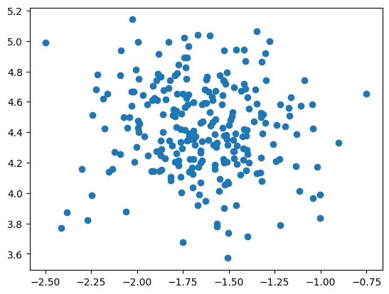
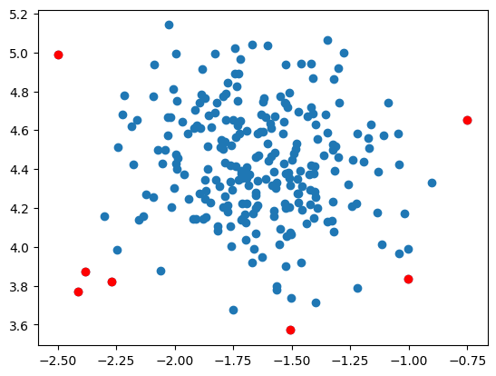
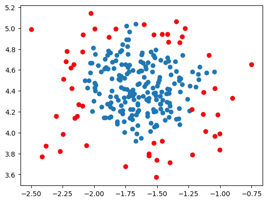
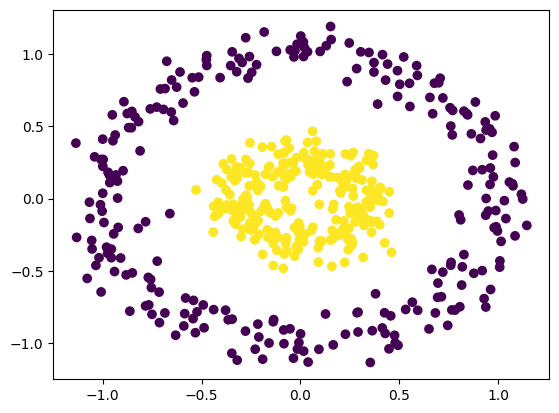
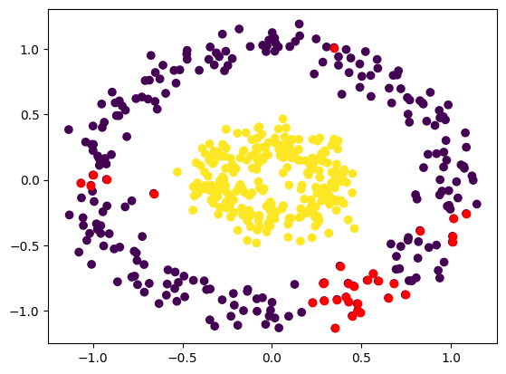
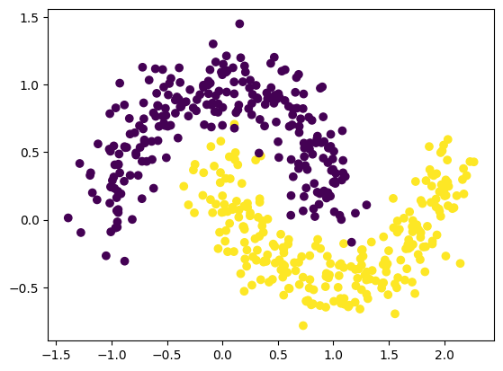
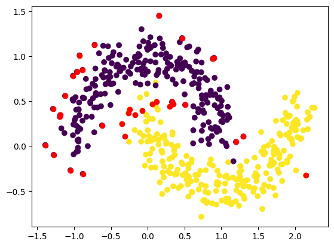
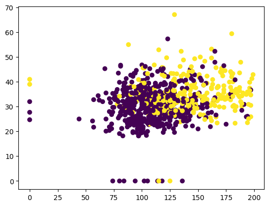
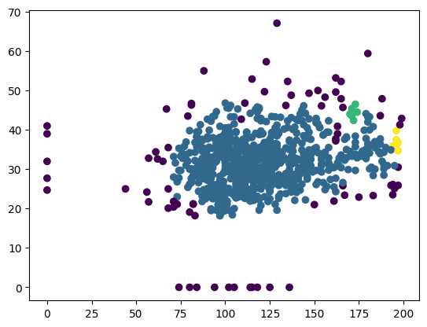
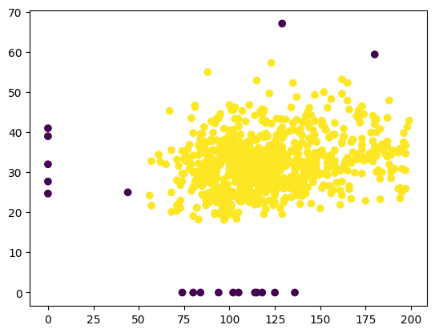

# DBSCAN Clustering Algorithm

This README file provides information on the DBSCAN (Density-Based Spatial Clustering of Applications with Noise) algorithm and its implementation. DBSCAN is a density-based clustering algorithm that groups together data points that are close to each other in dense regions and identifies outliers as points in low-density regions. Below is a breakdown of the content covered in this README.

## Table of Contents
1. [Part A: DBSCAN Clustering Algorithm](#part-a)
2. [Part B: Implementing DBSCAN](#part-b)
3. [Part C: Handling Outliers](#part-c)
4. [Part D: Exploring Different Parameters](#part-d)
5. [Part E: DBSCAN on Circular Dataset](#part-e)
6. [Part F: DBSCAN on Moon-shaped Dataset](#part-f)
7. [Part G: DBSCAN on Diabetes Dataset](#part-g)

<a name="part-a"></a>
## Part A: DBSCAN Clustering Algorithm
In this section, the DBSCAN algorithm is introduced. The `make_blobs` function from `sklearn.datasets` is used to generate a synthetic dataset for demonstration purposes.

<a name="part-b"></a>
## Part B: Implementing DBSCAN
The DBSCAN algorithm is implemented using the `DBSCAN` class from `sklearn.cluster`. The `eps` (epsilon) and `min_samples` parameters are set to define the clustering behavior.

<a name="part-c"></a>
## Part C: Handling Outliers
This section discusses how DBSCAN identifies outliers as noise points. The outliers are plotted separately to visualize their presence in the dataset.

<a name="part-d"></a>
## Part D: Exploring Different Parameters
The impact of changing the `eps` and `min_samples` parameters on the DBSCAN algorithm is explored. The dataset is visualized with different parameter values to observe the clustering behavior and outlier detection.

<a name="part-e"></a>
## Part E: DBSCAN on Circular Dataset
DBSCAN is applied to a circular dataset generated using the `make_circles` function from `sklearn.datasets`. The resulting clusters are visualized with different colors.

<a name="part-f"></a>
## Part F: DBSCAN on Moon-shaped Dataset
DBSCAN is applied to a moon-shaped dataset generated using the `make_moons` function from `sklearn.datasets`. The resulting clusters are visualized with different colors.

<a name="part-g"></a>
## Part G: DBSCAN on Diabetes Dataset
The DBSCAN algorithm is applied to the diabetes dataset. The steps performed in the previous sections are repeated on this dataset, showcasing how DBSCAN can be used in a real-world scenario.

In this README, you will find code examples, visualizations, and explanations of the DBSCAN algorithm and its application to different datasets. Follow the provided instructions and explore the implementation of DBSCAN for clustering and outlier detection purposes.

```python
# import libraries
import matplotlib.pyplot as plt
import numpy as np
import pandas as pd
import seaborn as sns
```

# DBScan Clustering Algorithm

```python
from sklearn.datasets import make_blobs

# Generating the dataset
# Classes denote the labels here:
dataset, classes = make_blobs(n_samples = 250, n_features = 2, centers = 1, cluster_std = 0.3, random_state = 1)
```

```python
# Dataset:
plt.scatter(dataset[:, 0], dataset[:, 1])
```

    <matplotlib.collections.PathCollection at 0x7f3fa21fa7f0>

    

    

```python
classes
```

    array([0, 0, 0, 0, 0, 0, 0, 0, 0, 0, 0, 0, 0, 0, 0, 0, 0, 0, 0, 0, 0, 0,
           0, 0, 0, 0, 0, 0, 0, 0, 0, 0, 0, 0, 0, 0, 0, 0, 0, 0, 0, 0, 0, 0,
           0, 0, 0, 0, 0, 0, 0, 0, 0, 0, 0, 0, 0, 0, 0, 0, 0, 0, 0, 0, 0, 0,
           0, 0, 0, 0, 0, 0, 0, 0, 0, 0, 0, 0, 0, 0, 0, 0, 0, 0, 0, 0, 0, 0,
           0, 0, 0, 0, 0, 0, 0, 0, 0, 0, 0, 0, 0, 0, 0, 0, 0, 0, 0, 0, 0, 0,
           0, 0, 0, 0, 0, 0, 0, 0, 0, 0, 0, 0, 0, 0, 0, 0, 0, 0, 0, 0, 0, 0,
           0, 0, 0, 0, 0, 0, 0, 0, 0, 0, 0, 0, 0, 0, 0, 0, 0, 0, 0, 0, 0, 0,
           0, 0, 0, 0, 0, 0, 0, 0, 0, 0, 0, 0, 0, 0, 0, 0, 0, 0, 0, 0, 0, 0,
           0, 0, 0, 0, 0, 0, 0, 0, 0, 0, 0, 0, 0, 0, 0, 0, 0, 0, 0, 0, 0, 0,
           0, 0, 0, 0, 0, 0, 0, 0, 0, 0, 0, 0, 0, 0, 0, 0, 0, 0, 0, 0, 0, 0,
           0, 0, 0, 0, 0, 0, 0, 0, 0, 0, 0, 0, 0, 0, 0, 0, 0, 0, 0, 0, 0, 0,
           0, 0, 0, 0, 0, 0, 0, 0])

```python
from sklearn.cluster import DBSCAN
dbscan = DBSCAN(eps = 0.3, min_samples = 20) # Epsilon default value = 0.5.
```

```python
pred = dbscan.fit_predict(dataset)
```

```python
pred
```

    array([ 0,  0,  0,  0,  0,  0,  0,  0,  0,  0,  0,  0,  0,  0,  0,  0,  0,
            0,  0,  0, -1,  0,  0,  0,  0,  0,  0,  0,  0,  0,  0,  0,  0,  0,
            0,  0,  0,  0,  0,  0,  0, -1,  0,  0,  0,  0,  0,  0,  0,  0,  0,
            0,  0,  0,  0,  0, -1,  0,  0,  0,  0,  0,  0,  0,  0,  0,  0,  0,
            0,  0,  0,  0,  0,  0,  0,  0,  0,  0,  0,  0,  0,  0,  0,  0,  0,
            0,  0,  0,  0,  0,  0,  0, -1,  0,  0,  0,  0,  0,  0,  0,  0,  0,
            0,  0,  0,  0,  0,  0,  0,  0,  0,  0,  0,  0,  0,  0,  0,  0,  0,
            0,  0,  0,  0,  0,  0,  0,  0,  0,  0,  0,  0,  0,  0,  0,  0,  0,
            0,  0,  0,  0,  0,  0,  0,  0,  0,  0,  0,  0,  0,  0,  0,  0,  0,
            0, -1,  0,  0,  0,  0,  0,  0,  0,  0,  0,  0,  0,  0,  0,  0,  0,
            0,  0,  0,  0,  0,  0,  0,  0,  0,  0,  0,  0,  0,  0,  0,  0,  0,
            0,  0,  0, -1,  0,  0,  0,  0,  0,  0,  0,  0,  0,  0,  0, -1,  0,
            0,  0,  0,  0,  0,  0,  0,  0,  0,  0,  0,  0,  0,  0,  0,  0,  0,
            0,  0,  0,  0,  0,  0,  0,  0,  0,  0,  0,  0,  0,  0,  0,  0,  0,
            0,  0,  0,  0,  0,  0,  0,  0,  0,  0,  0,  0])

```python
# Plot the data points of the cluster and show the outliers(those with 1 value):
```

```python
# Sample Number of Outliers:
outlier_index = np.where(pred == -1)

# Value of the outlier:
outlier_val = dataset[outlier_index]
```

```python
print("Outlier Index : \n", outlier_index, "\nOutlier Value : \n", outlier_val)
```

    Outlier Index : 
     (array([ 20,  41,  56,  92, 154, 190, 202]),) 
    Outlier Value : 
     [[-0.75030277  4.65386526]
     [-2.4114921   3.77224069]
     [-2.38361081  3.87321996]
     [-1.00234999  3.83758159]
     [-2.27072027  3.82371311]
     [-2.49748541  4.98774851]
     [-1.50503782  3.57172953]]

```python
plt.scatter(dataset[:, 0], dataset[:, 1])
plt.scatter(outlier_val[:, 0], outlier_val[:, 1], color = 'r')
```

    <matplotlib.collections.PathCollection at 0x7f3fa218baf0>

    

    

### On Changing the Eps value and min samples

```python
dbscan = DBSCAN(eps = 0.1, min_samples = 5) # Epsilon default value = 0.5.
pred = dbscan.fit_predict(dataset)

# Sample Number of Outliers:
outlier_index = np.where(pred == -1)

# Value of the outlier:
outlier_val = dataset[outlier_index]
```

```python
plt.scatter(dataset[:, 0], dataset[:, 1])
plt.scatter(outlier_val[:, 0], outlier_val[:, 1], color = 'r')
```

    <matplotlib.collections.PathCollection at 0x7f3fa2271640>

    

    

### Hence from the above values, we see that taking eps value of 0.5 and above helps in eliminating outliers.

```python
from sklearn.datasets import make_circles
```

```python
dataset, classes = make_circles(n_samples = 500, factor = 0.3, noise = 0.1)
```

```python
plt.scatter(dataset[:, 0], dataset[:, 1], c = classes) # c = classes gives different colours to the clusters
```

    <matplotlib.collections.PathCollection at 0x7f3fa057a880>

    

    

```python
dbscan = DBSCAN(eps = 0.2, min_samples = 15) # Epsilon default value = 0.5.
pred = dbscan.fit_predict(dataset)
# Sample Number of Outliers:
outlier_index = np.where(pred == -1)

# Value of the outlier:
outlier_val = dataset[outlier_index]

plt.scatter(dataset[:, 0], dataset[:, 1], c = classes)
plt.scatter(outlier_val[:, 0], outlier_val[:, 1], color = 'r')
```

    <matplotlib.collections.PathCollection at 0x7f3fa04f4580>

    

    

```python
pred
```

    array([ 0,  0,  2,  2,  0,  8,  1,  0,  0,  0,  4,  8,  2,  0,  5,  0,  9,
            1,  0,  0,  0,  0,  1,  0,  9,  0,  1,  0,  0,  0,  0,  0,  0,  7,
            0,  1,  6,  0,  6,  0, -1,  2,  9,  3,  4,  2,  0,  8,  0,  0,  1,
            0,  2,  0,  0,  0,  0,  5,  1,  0,  0,  0,  4,  4,  5, 10, -1,  4,
            6,  0,  2,  0, -1,  6,  0,  0,  2,  3,  0,  0,  0,  5,  9,  0,  0,
            7,  0,  0,  6,  0,  2,  0,  2,  0,  9,  1,  0,  0,  4,  1, 10,  6,
            0,  2,  0,  1,  0,  0,  5,  4,  7,  0,  0, -1,  2,  0,  3,  1,  5,
            2,  0,  0,  0,  0,  0,  7,  6,  4,  0,  0,  8,  0,  0,  0,  4,  0,
            0,  0,  7,  0,  0,  0,  2,  4,  8,  0,  0,  0, -1,  9, 10,  2,  0,
            1,  0,  0, -1,  0, -1,  1,  2,  0,  0,  8,  0,  0,  1,  0,  2,  0,
            0,  0, 10,  8,  0,  8,  0, -1,  0,  0,  9, 10, -1,  0, -1,  2,  0,
            0,  0,  0,  6,  0,  7,  8,  3,  0,  0,  0,  0,  0,  0,  2, 10,  0,
            0, -1,  0,  3,  2,  0,  0,  0,  2,  8,  0,  0,  4,  0, 10,  0,  8,
            6,  9, -1,  7, -1,  0,  0,  2,  0,  9,  8,  0,  0,  0,  0,  0,  0,
            3,  0,  0,  0,  6,  0,  9,  0,  0,  0,  0,  1,  8,  8,  0,  0,  0,
            3,  0,  0,  4,  0,  9,  0,  0,  0,  0,  2,  0,  0,  4,  1,  4,  0,
           -1,  0,  0,  1, 10,  0,  0,  6,  2,  4,  3,  4,  0, -1,  0, -1,  0,
            0,  0,  0,  5,  6,  4,  0,  0, 10,  0, -1, -1,  0,  7,  9,  4,  8,
           10,  0, 10,  0,  0,  7,  5,  8,  0,  6,  5,  0, 10,  6,  2,  3,  5,
            8,  0,  0,  0,  8,  0,  8,  0,  0, -1,  0,  0,  0,  6,  2,  1,  0,
            0,  6,  0,  1,  2, 10,  9,  2,  0,  3,  7,  0,  0,  0,  0,  2,  0,
            9,  0,  1,  0,  8,  2,  1,  0,  0,  0,  0,  0,  2,  0,  0,  0,  9,
            9,  2,  0,  0,  0,  0,  0,  0,  4,  8, 10, -1,  9,  3,  2,  4,  9,
           -1,  0,  0, -1,  0,  0, -1,  2, -1,  0,  0,  0,  0,  0,  0,  9,  1,
           -1,  0,  0, -1, -1,  2, -1,  0,  0,  0,  0, 10,  0,  0,  3,  0,  8,
           -1,  0, -1,  0,  8,  3,  2,  1,  8,  0,  0,  0,  6,  0,  0,  4,  0,
            7, -1,  0,  0,  0,  3,  5,  0, -1,  1,  2, 10,  2,  5,  0,  0,  4,
            8,  6,  7,  0,  0,  6,  0,  6,  0,  6,  0, 10,  2,  0,  0,  0,  5,
            0,  0,  0,  1,  0,  0,  6,  0,  0,  1,  7,  5,  0,  0,  6,  5,  4,
            6,  4,  0,  0,  7,  0,  3])

```python
from sklearn.datasets import make_moons
```

```python
dataset, classes = make_moons(n_samples = 500, random_state = 1, noise = 0.15)
plt.scatter(dataset[:, 0], dataset[:, 1], c = classes) # c = classes gives different colours to the clusters
```

    <matplotlib.collections.PathCollection at 0x7f3fa0455f10>

    

    

```python
dbscan = DBSCAN(eps = 0.2, min_samples = 15) # Epsilon default value = 0.5.
pred = dbscan.fit_predict(dataset)
# Sample Number of Outliers:
outlier_index = np.where(pred == -1)

# Value of the outlier:
outlier_val = dataset[outlier_index]

plt.scatter(dataset[:, 0], dataset[:, 1], c = classes)
plt.scatter(outlier_val[:, 0], outlier_val[:, 1], color = 'r')
```

    <matplotlib.collections.PathCollection at 0x7f3fa22f0c10>

    

    

### On Changing the Eps value and min samples

```python
dbscan = DBSCAN(eps = 0.3, min_samples = 15) # Epsilon default value = 0.5.
pred = dbscan.fit_predict(dataset)
# Sample Number of Outliers:
outlier_index = np.where(pred == -1)

# Value of the outlier:
outlier_val = dataset[outlier_index]

plt.scatter(dataset[:, 0], dataset[:, 1], c = classes)
plt.scatter(outlier_val[:, 0], outlier_val[:, 1], color = 'r')
```

    <matplotlib.collections.PathCollection at 0x7f3f9ffab9a0>

    

    

### Hence from the above values, we see that taking eps value of 0.3 and above helps in eliminating outliers.
### On increasing the number of samples, outliers seem to increase.

# Loading the dataset:

```python
df = pd.read_csv("/content/diabetes.csv")
```

```python
df
```

  <div id="df-633213a4-5b73-49c1-af8c-02b29db5f3f6">
    <div class="colab-df-container">
      <div>
<style scoped>
    .dataframe tbody tr th:only-of-type {
        vertical-align: middle;
    }

    .dataframe tbody tr th {
        vertical-align: top;
    }

    .dataframe thead th {
        text-align: right;
    }
</style>
<table border="1" class="dataframe">
  <thead>
    <tr style="text-align: right;">
      <th></th>
      <th>Glucose</th>
      <th>BMI</th>
      <th>Outcome</th>
    </tr>
  </thead>
  <tbody>
    <tr>
      <th>0</th>
      <td>148</td>
      <td>33.6</td>
      <td>1</td>
    </tr>
    <tr>
      <th>1</th>
      <td>85</td>
      <td>26.6</td>
      <td>0</td>
    </tr>
    <tr>
      <th>2</th>
      <td>183</td>
      <td>23.3</td>
      <td>1</td>
    </tr>
    <tr>
      <th>3</th>
      <td>89</td>
      <td>28.1</td>
      <td>0</td>
    </tr>
    <tr>
      <th>4</th>
      <td>137</td>
      <td>43.1</td>
      <td>1</td>
    </tr>
    <tr>
      <th>...</th>
      <td>...</td>
      <td>...</td>
      <td>...</td>
    </tr>
    <tr>
      <th>763</th>
      <td>101</td>
      <td>32.9</td>
      <td>0</td>
    </tr>
    <tr>
      <th>764</th>
      <td>122</td>
      <td>36.8</td>
      <td>0</td>
    </tr>
    <tr>
      <th>765</th>
      <td>121</td>
      <td>26.2</td>
      <td>0</td>
    </tr>
    <tr>
      <th>766</th>
      <td>126</td>
      <td>30.1</td>
      <td>1</td>
    </tr>
    <tr>
      <th>767</th>
      <td>93</td>
      <td>30.4</td>
      <td>0</td>
    </tr>
  </tbody>
</table>
<p>768 rows × 3 columns</p>
</div>
      <button class="colab-df-convert" onclick="convertToInteractive('df-633213a4-5b73-49c1-af8c-02b29db5f3f6')"
              title="Convert this dataframe to an interactive table."
              style="display:none;">

  <svg xmlns="http://www.w3.org/2000/svg" height="24px"viewBox="0 0 24 24"
       width="24px">
    <path d="M0 0h24v24H0V0z" fill="none"/>
    <path d="M18.56 5.44l.94 2.06.94-2.06 2.06-.94-2.06-.94-.94-2.06-.94 2.06-2.06.94zm-11 1L8.5 8.5l.94-2.06 2.06-.94-2.06-.94L8.5 2.5l-.94 2.06-2.06.94zm10 10l.94 2.06.94-2.06 2.06-.94-2.06-.94-.94-2.06-.94 2.06-2.06.94z"/><path d="M17.41 7.96l-1.37-1.37c-.4-.4-.92-.59-1.43-.59-.52 0-1.04.2-1.43.59L10.3 9.45l-7.72 7.72c-.78.78-.78 2.05 0 2.83L4 21.41c.39.39.9.59 1.41.59.51 0 1.02-.2 1.41-.59l7.78-7.78 2.81-2.81c.8-.78.8-2.07 0-2.86zM5.41 20L4 18.59l7.72-7.72 1.47 1.35L5.41 20z"/>
  </svg>
      </button>

  <style>
    .colab-df-container {
      display:flex;
      flex-wrap:wrap;
      gap: 12px;
    }

    .colab-df-convert {
      background-color: #E8F0FE;
      border: none;
      border-radius: 50%;
      cursor: pointer;
      display: none;
      fill: #1967D2;
      height: 32px;
      padding: 0 0 0 0;
      width: 32px;
    }

    .colab-df-convert:hover {
      background-color: #E2EBFA;
      box-shadow: 0px 1px 2px rgba(60, 64, 67, 0.3), 0px 1px 3px 1px rgba(60, 64, 67, 0.15);
      fill: #174EA6;
    }

    [theme=dark] .colab-df-convert {
      background-color: #3B4455;
      fill: #D2E3FC;
    }

    [theme=dark] .colab-df-convert:hover {
      background-color: #434B5C;
      box-shadow: 0px 1px 3px 1px rgba(0, 0, 0, 0.15);
      filter: drop-shadow(0px 1px 2px rgba(0, 0, 0, 0.3));
      fill: #FFFFFF;
    }
  </style>

      <script>
        const buttonEl =
          document.querySelector('#df-633213a4-5b73-49c1-af8c-02b29db5f3f6 button.colab-df-convert');
        buttonEl.style.display =
          google.colab.kernel.accessAllowed ? 'block' : 'none';

        async function convertToInteractive(key) {
          const element = document.querySelector('#df-633213a4-5b73-49c1-af8c-02b29db5f3f6');
          const dataTable =
            await google.colab.kernel.invokeFunction('convertToInteractive',
                                                     [key], {});
          if (!dataTable) return;

          const docLinkHtml = 'Like what you see? Visit the ' +
            '<a target="_blank" href=https://colab.research.google.com/notebooks/data_table.ipynb>data table notebook</a>'
            + ' to learn more about interactive tables.';
          element.innerHTML = '';
          dataTable['output_type'] = 'display_data';
          await google.colab.output.renderOutput(dataTable, element);
          const docLink = document.createElement('div');
          docLink.innerHTML = docLinkHtml;
          element.appendChild(docLink);
        }
      </script>
    </div>
  </div>

# EDA:

```python
df.head()
```

  <div id="df-5cefb7b3-8099-4c43-9c9a-0020b9880abb">
    <div class="colab-df-container">
      <div>
<style scoped>
    .dataframe tbody tr th:only-of-type {
        vertical-align: middle;
    }

    .dataframe tbody tr th {
        vertical-align: top;
    }

    .dataframe thead th {
        text-align: right;
    }
</style>
<table border="1" class="dataframe">
  <thead>
    <tr style="text-align: right;">
      <th></th>
      <th>Glucose</th>
      <th>BMI</th>
      <th>Outcome</th>
    </tr>
  </thead>
  <tbody>
    <tr>
      <th>0</th>
      <td>148</td>
      <td>33.6</td>
      <td>1</td>
    </tr>
    <tr>
      <th>1</th>
      <td>85</td>
      <td>26.6</td>
      <td>0</td>
    </tr>
    <tr>
      <th>2</th>
      <td>183</td>
      <td>23.3</td>
      <td>1</td>
    </tr>
    <tr>
      <th>3</th>
      <td>89</td>
      <td>28.1</td>
      <td>0</td>
    </tr>
    <tr>
      <th>4</th>
      <td>137</td>
      <td>43.1</td>
      <td>1</td>
    </tr>
  </tbody>
</table>
</div>
      <button class="colab-df-convert" onclick="convertToInteractive('df-5cefb7b3-8099-4c43-9c9a-0020b9880abb')"
              title="Convert this dataframe to an interactive table."
              style="display:none;">

  <svg xmlns="http://www.w3.org/2000/svg" height="24px"viewBox="0 0 24 24"
       width="24px">
    <path d="M0 0h24v24H0V0z" fill="none"/>
    <path d="M18.56 5.44l.94 2.06.94-2.06 2.06-.94-2.06-.94-.94-2.06-.94 2.06-2.06.94zm-11 1L8.5 8.5l.94-2.06 2.06-.94-2.06-.94L8.5 2.5l-.94 2.06-2.06.94zm10 10l.94 2.06.94-2.06 2.06-.94-2.06-.94-.94-2.06-.94 2.06-2.06.94z"/><path d="M17.41 7.96l-1.37-1.37c-.4-.4-.92-.59-1.43-.59-.52 0-1.04.2-1.43.59L10.3 9.45l-7.72 7.72c-.78.78-.78 2.05 0 2.83L4 21.41c.39.39.9.59 1.41.59.51 0 1.02-.2 1.41-.59l7.78-7.78 2.81-2.81c.8-.78.8-2.07 0-2.86zM5.41 20L4 18.59l7.72-7.72 1.47 1.35L5.41 20z"/>
  </svg>
      </button>

  <style>
    .colab-df-container {
      display:flex;
      flex-wrap:wrap;
      gap: 12px;
    }

    .colab-df-convert {
      background-color: #E8F0FE;
      border: none;
      border-radius: 50%;
      cursor: pointer;
      display: none;
      fill: #1967D2;
      height: 32px;
      padding: 0 0 0 0;
      width: 32px;
    }

    .colab-df-convert:hover {
      background-color: #E2EBFA;
      box-shadow: 0px 1px 2px rgba(60, 64, 67, 0.3), 0px 1px 3px 1px rgba(60, 64, 67, 0.15);
      fill: #174EA6;
    }

    [theme=dark] .colab-df-convert {
      background-color: #3B4455;
      fill: #D2E3FC;
    }

    [theme=dark] .colab-df-convert:hover {
      background-color: #434B5C;
      box-shadow: 0px 1px 3px 1px rgba(0, 0, 0, 0.15);
      filter: drop-shadow(0px 1px 2px rgba(0, 0, 0, 0.3));
      fill: #FFFFFF;
    }
  </style>

      <script>
        const buttonEl =
          document.querySelector('#df-5cefb7b3-8099-4c43-9c9a-0020b9880abb button.colab-df-convert');
        buttonEl.style.display =
          google.colab.kernel.accessAllowed ? 'block' : 'none';

        async function convertToInteractive(key) {
          const element = document.querySelector('#df-5cefb7b3-8099-4c43-9c9a-0020b9880abb');
          const dataTable =
            await google.colab.kernel.invokeFunction('convertToInteractive',
                                                     [key], {});
          if (!dataTable) return;

          const docLinkHtml = 'Like what you see? Visit the ' +
            '<a target="_blank" href=https://colab.research.google.com/notebooks/data_table.ipynb>data table notebook</a>'
            + ' to learn more about interactive tables.';
          element.innerHTML = '';
          dataTable['output_type'] = 'display_data';
          await google.colab.output.renderOutput(dataTable, element);
          const docLink = document.createElement('div');
          docLink.innerHTML = docLinkHtml;
          element.appendChild(docLink);
        }
      </script>
    </div>
  </div>

```python
df.info()
```

    <class 'pandas.core.frame.DataFrame'>
    RangeIndex: 768 entries, 0 to 767
    Data columns (total 3 columns):
     #   Column   Non-Null Count  Dtype  
    ---  ------   --------------  -----  
     0   Glucose  768 non-null    int64  
     1   BMI      768 non-null    float64
     2   Outcome  768 non-null    int64  
    dtypes: float64(1), int64(2)
    memory usage: 18.1 KB

```python
df.shape
```

    (768, 3)

```python
df.describe()
```

  <div id="df-c7b13b05-315d-4802-ad90-5d29f753a613">
    <div class="colab-df-container">
      <div>
<style scoped>
    .dataframe tbody tr th:only-of-type {
        vertical-align: middle;
    }

    .dataframe tbody tr th {
        vertical-align: top;
    }

    .dataframe thead th {
        text-align: right;
    }
</style>
<table border="1" class="dataframe">
  <thead>
    <tr style="text-align: right;">
      <th></th>
      <th>Glucose</th>
      <th>BMI</th>
      <th>Outcome</th>
    </tr>
  </thead>
  <tbody>
    <tr>
      <th>count</th>
      <td>768.000000</td>
      <td>768.000000</td>
      <td>768.000000</td>
    </tr>
    <tr>
      <th>mean</th>
      <td>120.894531</td>
      <td>31.992578</td>
      <td>0.348958</td>
    </tr>
    <tr>
      <th>std</th>
      <td>31.972618</td>
      <td>7.884160</td>
      <td>0.476951</td>
    </tr>
    <tr>
      <th>min</th>
      <td>0.000000</td>
      <td>0.000000</td>
      <td>0.000000</td>
    </tr>
    <tr>
      <th>25%</th>
      <td>99.000000</td>
      <td>27.300000</td>
      <td>0.000000</td>
    </tr>
    <tr>
      <th>50%</th>
      <td>117.000000</td>
      <td>32.000000</td>
      <td>0.000000</td>
    </tr>
    <tr>
      <th>75%</th>
      <td>140.250000</td>
      <td>36.600000</td>
      <td>1.000000</td>
    </tr>
    <tr>
      <th>max</th>
      <td>199.000000</td>
      <td>67.100000</td>
      <td>1.000000</td>
    </tr>
  </tbody>
</table>
</div>
      <button class="colab-df-convert" onclick="convertToInteractive('df-c7b13b05-315d-4802-ad90-5d29f753a613')"
              title="Convert this dataframe to an interactive table."
              style="display:none;">

  <svg xmlns="http://www.w3.org/2000/svg" height="24px"viewBox="0 0 24 24"
       width="24px">
    <path d="M0 0h24v24H0V0z" fill="none"/>
    <path d="M18.56 5.44l.94 2.06.94-2.06 2.06-.94-2.06-.94-.94-2.06-.94 2.06-2.06.94zm-11 1L8.5 8.5l.94-2.06 2.06-.94-2.06-.94L8.5 2.5l-.94 2.06-2.06.94zm10 10l.94 2.06.94-2.06 2.06-.94-2.06-.94-.94-2.06-.94 2.06-2.06.94z"/><path d="M17.41 7.96l-1.37-1.37c-.4-.4-.92-.59-1.43-.59-.52 0-1.04.2-1.43.59L10.3 9.45l-7.72 7.72c-.78.78-.78 2.05 0 2.83L4 21.41c.39.39.9.59 1.41.59.51 0 1.02-.2 1.41-.59l7.78-7.78 2.81-2.81c.8-.78.8-2.07 0-2.86zM5.41 20L4 18.59l7.72-7.72 1.47 1.35L5.41 20z"/>
  </svg>
      </button>

  <style>
    .colab-df-container {
      display:flex;
      flex-wrap:wrap;
      gap: 12px;
    }

    .colab-df-convert {
      background-color: #E8F0FE;
      border: none;
      border-radius: 50%;
      cursor: pointer;
      display: none;
      fill: #1967D2;
      height: 32px;
      padding: 0 0 0 0;
      width: 32px;
    }

    .colab-df-convert:hover {
      background-color: #E2EBFA;
      box-shadow: 0px 1px 2px rgba(60, 64, 67, 0.3), 0px 1px 3px 1px rgba(60, 64, 67, 0.15);
      fill: #174EA6;
    }

    [theme=dark] .colab-df-convert {
      background-color: #3B4455;
      fill: #D2E3FC;
    }

    [theme=dark] .colab-df-convert:hover {
      background-color: #434B5C;
      box-shadow: 0px 1px 3px 1px rgba(0, 0, 0, 0.15);
      filter: drop-shadow(0px 1px 2px rgba(0, 0, 0, 0.3));
      fill: #FFFFFF;
    }
  </style>

      <script>
        const buttonEl =
          document.querySelector('#df-c7b13b05-315d-4802-ad90-5d29f753a613 button.colab-df-convert');
        buttonEl.style.display =
          google.colab.kernel.accessAllowed ? 'block' : 'none';

        async function convertToInteractive(key) {
          const element = document.querySelector('#df-c7b13b05-315d-4802-ad90-5d29f753a613');
          const dataTable =
            await google.colab.kernel.invokeFunction('convertToInteractive',
                                                     [key], {});
          if (!dataTable) return;

          const docLinkHtml = 'Like what you see? Visit the ' +
            '<a target="_blank" href=https://colab.research.google.com/notebooks/data_table.ipynb>data table notebook</a>'
            + ' to learn more about interactive tables.';
          element.innerHTML = '';
          dataTable['output_type'] = 'display_data';
          await google.colab.output.renderOutput(dataTable, element);
          const docLink = document.createElement('div');
          docLink.innerHTML = docLinkHtml;
          element.appendChild(docLink);
        }
      </script>
    </div>
  </div>

## Dropping the outcome column as we are building an unsupervised model. So outcome is not required.

```python
X = df.drop(['Outcome'], axis=1)
```

```python
plt.scatter(X["Glucose"], X["BMI"], c = df["Outcome"])
```

    <matplotlib.collections.PathCollection at 0x7f3f9fbaf970>

    

    

```python
dbscan = DBSCAN(eps = 4, min_samples = 6) # Epsilon default value = 0.5.
pred = dbscan.fit_predict(X)
```

```python
pred
```

    array([ 0,  0, -1,  0,  0,  0,  0,  0, -1, -1,  0,  0,  0,  0, -1,  0,  0,
            0,  0,  0,  0,  0,  2,  0,  0,  0,  0,  0,  0,  0,  0,  0,  0,  0,
            0,  0,  0,  0,  0,  0,  0,  0,  0,  1,  0,  0,  0,  0,  0, -1,  0,
            0,  0,  0,  0,  0,  0,  0,  0,  0, -1,  0, -1,  0,  0,  0,  0, -1,
            0,  0,  0,  0,  0,  0,  0, -1, -1,  0,  0,  0,  0, -1,  0,  0, -1,
            0,  0,  0,  0,  0, -1,  0, -1,  0,  0,  0,  0, -1,  0, -1, -1,  0,
            0,  0,  0,  0,  0,  0,  0,  0,  0,  0,  0,  0,  0,  0,  0,  0,  0,
            0, -1,  0,  0,  0,  0, -1,  0,  0,  0,  0,  0,  0,  0,  0,  0,  0,
            0,  0,  0,  0,  0,  0,  0,  0,  0, -1, -1,  0,  0,  0,  0,  0,  0,
            0, -1, -1,  0,  0,  0, -1,  0,  0,  0,  0,  0,  0,  0,  0,  0,  0,
            0,  0,  0, -1,  0,  0,  0, -1,  0,  0,  0,  0, -1,  0,  0,  2,  0,
            0,  0,  0,  0,  0,  0, -1,  0,  0,  0,  0,  0,  0,  0,  0,  0,  0,
            0,  0,  2, -1,  0,  0,  0,  0,  0,  0,  0,  0,  0,  0,  0,  0,  0,
            0,  0,  0,  0,  0,  0, -1,  2,  0,  0, -1,  0,  0,  0,  1,  0,  0,
            0,  0,  0,  0,  0,  0,  0,  0,  0, -1,  0,  0,  0,  0,  0,  0,  0,
            0,  0,  0, -1,  0,  0,  0,  0,  0,  0,  0,  0,  0,  0,  0,  0,  0,
            0,  0,  0,  0,  0,  0,  0,  0,  0,  0,  0,  0,  0,  0,  0,  0,  0,
            0,  0,  0,  0,  0, -1,  0,  0,  0,  0,  0,  0,  0,  0, -1, -1,  0,
            0,  0,  0,  0,  0,  0,  0,  0,  0,  0,  0,  0,  0, -1,  0,  0,  0,
            0,  0,  0,  0,  0,  0,  0,  0,  0,  0,  0,  0, -1,  0,  0,  0,  0,
            0,  0, -1,  0,  0,  0,  0,  0,  0, -1,  0,  0, -1,  0,  0,  0,  0,
            0,  0,  2,  0,  0,  0,  0,  0,  0,  0,  0,  0,  0,  0, -1,  0,  0,
            0,  0,  0,  0, -1,  0,  0,  0,  0,  0,  0,  0,  0,  0,  0,  0,  0,
           -1,  0,  0,  0,  0,  0,  0, -1,  0,  0,  0,  0,  0,  0,  0,  0,  0,
           -1,  1,  0,  0,  0,  0,  0,  0,  0,  0, -1,  0,  0,  0,  0,  0,  0,
            0, -1,  0,  0,  0,  0,  0,  0,  0,  0,  0,  0,  0,  0,  0,  0,  0,
            0,  0,  0, -1,  0,  0,  0,  0, -1,  0,  0,  0,  0,  0,  0,  0,  0,
            0,  0, -1,  0,  0,  0,  0,  0,  0,  0, -1,  0,  0,  0,  0,  0,  0,
            0,  0,  0,  0,  0,  0,  0,  0,  0,  0,  0,  1,  0, -1,  0,  0,  0,
            0, -1,  0,  0,  0, -1,  0,  0,  0, -1,  0,  0,  0,  0,  0,  0,  0,
            0,  0,  0,  0,  0,  0,  0,  0,  0,  0, -1,  0, -1,  0,  0,  0,  0,
            0,  0,  0,  0,  0,  0,  0,  0,  0,  0, -1,  0,  0,  0,  0,  0,  0,
            0,  0, -1,  0,  0,  0,  0,  0,  0,  0,  0,  0,  0,  0,  0,  0,  0,
           -1,  0,  0,  0,  0,  0,  0,  0,  0,  0,  0,  0,  0,  0,  0,  0,  0,
            0,  2,  0,  0,  0,  0,  0,  0,  0,  0,  0, -1, -1,  0,  0,  0,  0,
            0, -1,  0,  0,  0,  0,  0,  0,  0,  0,  0,  0,  0,  0,  0,  0,  0,
            0,  0,  0,  0,  0, -1,  0,  0,  0,  0,  0,  0,  0,  0,  0,  0,  0,
            0,  0,  0,  0,  0,  0,  0,  0,  0,  0,  0,  0,  0,  0,  0,  0,  0,
           -1,  0,  0,  0,  0,  0,  0,  0,  0,  0,  0,  0,  0,  0,  0, -1,  0,
            0,  0,  0,  0,  0,  0,  0,  0,  0, -1, -1,  0,  0,  0,  0,  0,  0,
           -1, -1,  0,  0, -1,  0,  0,  0,  0,  0,  0,  0,  0,  0,  0,  0,  0,
            0,  0,  0,  0,  0,  0,  0,  0,  0, -1,  0,  0,  0,  0,  0,  0,  0,
            0,  0,  0,  0,  0,  0,  0,  0,  0,  0,  0,  0,  0,  0, -1,  0,  0,
            0,  1,  0,  0,  0,  0, -1,  0,  0,  0,  0,  0,  0,  0,  0, -1, -1,
            0,  0,  0,  0,  0,  0,  0,  0,  0,  0,  0,  0,  0,  1,  0,  0,  0,
            0,  0,  0])

```python
plt.scatter(X["Glucose"], X["BMI"], c = pred)
plt.scatter(outlier_val[:, 0], outlier_val[:, 1], color = 'r')
```

    <matplotlib.collections.PathCollection at 0x7f3f9f7de220>

    

    

### Hence for eps value of 14 and samples as 25 helps in getting a clear distinction in the clusters.

```python
dbscan = DBSCAN(eps = 14, min_samples = 25) # Epsilon default value = 0.5.
pred = dbscan.fit_predict(X)

plt.scatter(X["Glucose"], X["BMI"], c = pred)
plt.scatter(outlier_val[:, 0], outlier_val[:, 1], color = 'r')
```

    <matplotlib.collections.PathCollection at 0x7f3f9f764820>

    

    

