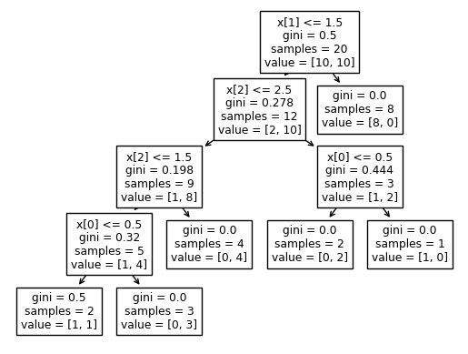
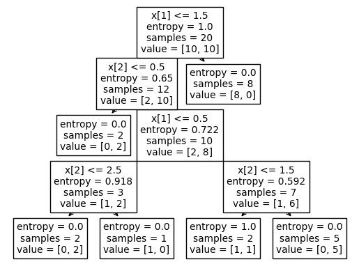
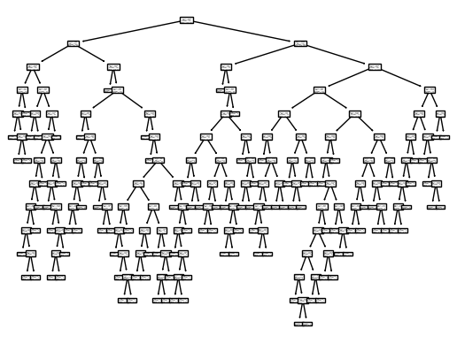
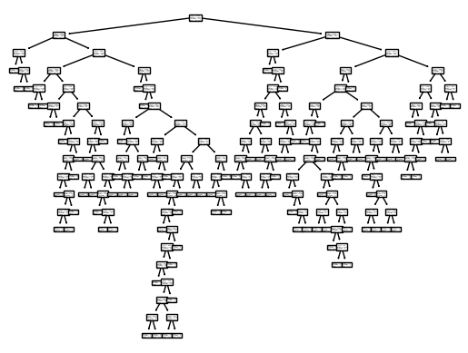

```python
# import libraries
import matplotlib.pyplot as plt
import numpy as np
import pandas as pd
import seaborn as sns
```

# Decision Trees:

Loading the dataset:

```python
df = pd.read_csv("/content/Decision_trees_1.csv")
```

# EDA:

```python
df.head()
```

  <div id="df-77eac7b7-2bd8-454b-a42b-c7544453ffda">
    <div class="colab-df-container">
      <div>
<style scoped>
    .dataframe tbody tr th:only-of-type {
        vertical-align: middle;
    }

    .dataframe tbody tr th {
        vertical-align: top;
    }

    .dataframe thead th {
        text-align: right;
    }
</style>
<table border="1" class="dataframe">
  <thead>
    <tr style="text-align: right;">
      <th></th>
      <th>Customer ID</th>
      <th>Gender</th>
      <th>Car Type</th>
      <th>Shirt Size</th>
      <th>Class</th>
    </tr>
  </thead>
  <tbody>
    <tr>
      <th>0</th>
      <td>1</td>
      <td>M</td>
      <td>Family</td>
      <td>Small</td>
      <td>C0</td>
    </tr>
    <tr>
      <th>1</th>
      <td>2</td>
      <td>M</td>
      <td>Sports</td>
      <td>Medium</td>
      <td>C0</td>
    </tr>
    <tr>
      <th>2</th>
      <td>3</td>
      <td>M</td>
      <td>Sports</td>
      <td>Medium</td>
      <td>C0</td>
    </tr>
    <tr>
      <th>3</th>
      <td>4</td>
      <td>M</td>
      <td>Sports</td>
      <td>Large</td>
      <td>C0</td>
    </tr>
    <tr>
      <th>4</th>
      <td>5</td>
      <td>M</td>
      <td>Sports</td>
      <td>Extra large</td>
      <td>C0</td>
    </tr>
  </tbody>
</table>
</div>
      <button class="colab-df-convert" onclick="convertToInteractive('df-77eac7b7-2bd8-454b-a42b-c7544453ffda')"
              title="Convert this dataframe to an interactive table."
              style="display:none;">

  <svg xmlns="http://www.w3.org/2000/svg" height="24px"viewBox="0 0 24 24"
       width="24px">
    <path d="M0 0h24v24H0V0z" fill="none"/>
    <path d="M18.56 5.44l.94 2.06.94-2.06 2.06-.94-2.06-.94-.94-2.06-.94 2.06-2.06.94zm-11 1L8.5 8.5l.94-2.06 2.06-.94-2.06-.94L8.5 2.5l-.94 2.06-2.06.94zm10 10l.94 2.06.94-2.06 2.06-.94-2.06-.94-.94-2.06-.94 2.06-2.06.94z"/><path d="M17.41 7.96l-1.37-1.37c-.4-.4-.92-.59-1.43-.59-.52 0-1.04.2-1.43.59L10.3 9.45l-7.72 7.72c-.78.78-.78 2.05 0 2.83L4 21.41c.39.39.9.59 1.41.59.51 0 1.02-.2 1.41-.59l7.78-7.78 2.81-2.81c.8-.78.8-2.07 0-2.86zM5.41 20L4 18.59l7.72-7.72 1.47 1.35L5.41 20z"/>
  </svg>
      </button>

  <style>
    .colab-df-container {
      display:flex;
      flex-wrap:wrap;
      gap: 12px;
    }

    .colab-df-convert {
      background-color: #E8F0FE;
      border: none;
      border-radius: 50%;
      cursor: pointer;
      display: none;
      fill: #1967D2;
      height: 32px;
      padding: 0 0 0 0;
      width: 32px;
    }

    .colab-df-convert:hover {
      background-color: #E2EBFA;
      box-shadow: 0px 1px 2px rgba(60, 64, 67, 0.3), 0px 1px 3px 1px rgba(60, 64, 67, 0.15);
      fill: #174EA6;
    }

    [theme=dark] .colab-df-convert {
      background-color: #3B4455;
      fill: #D2E3FC;
    }

    [theme=dark] .colab-df-convert:hover {
      background-color: #434B5C;
      box-shadow: 0px 1px 3px 1px rgba(0, 0, 0, 0.15);
      filter: drop-shadow(0px 1px 2px rgba(0, 0, 0, 0.3));
      fill: #FFFFFF;
    }
  </style>

      <script>
        const buttonEl =
          document.querySelector('#df-77eac7b7-2bd8-454b-a42b-c7544453ffda button.colab-df-convert');
        buttonEl.style.display =
          google.colab.kernel.accessAllowed ? 'block' : 'none';

        async function convertToInteractive(key) {
          const element = document.querySelector('#df-77eac7b7-2bd8-454b-a42b-c7544453ffda');
          const dataTable =
            await google.colab.kernel.invokeFunction('convertToInteractive',
                                                     [key], {});
          if (!dataTable) return;

          const docLinkHtml = 'Like what you see? Visit the ' +
            '<a target="_blank" href=https://colab.research.google.com/notebooks/data_table.ipynb>data table notebook</a>'
            + ' to learn more about interactive tables.';
          element.innerHTML = '';
          dataTable['output_type'] = 'display_data';
          await google.colab.output.renderOutput(dataTable, element);
          const docLink = document.createElement('div');
          docLink.innerHTML = docLinkHtml;
          element.appendChild(docLink);
        }
      </script>
    </div>
  </div>

```python
df.describe()
```

  <div id="df-1cc6f6c9-5a32-4416-8385-ad4ae25ac6c5">
    <div class="colab-df-container">
      <div>
<style scoped>
    .dataframe tbody tr th:only-of-type {
        vertical-align: middle;
    }

    .dataframe tbody tr th {
        vertical-align: top;
    }

    .dataframe thead th {
        text-align: right;
    }
</style>
<table border="1" class="dataframe">
  <thead>
    <tr style="text-align: right;">
      <th></th>
      <th>Customer ID</th>
    </tr>
  </thead>
  <tbody>
    <tr>
      <th>count</th>
      <td>20.00000</td>
    </tr>
    <tr>
      <th>mean</th>
      <td>10.50000</td>
    </tr>
    <tr>
      <th>std</th>
      <td>5.91608</td>
    </tr>
    <tr>
      <th>min</th>
      <td>1.00000</td>
    </tr>
    <tr>
      <th>25%</th>
      <td>5.75000</td>
    </tr>
    <tr>
      <th>50%</th>
      <td>10.50000</td>
    </tr>
    <tr>
      <th>75%</th>
      <td>15.25000</td>
    </tr>
    <tr>
      <th>max</th>
      <td>20.00000</td>
    </tr>
  </tbody>
</table>
</div>
      <button class="colab-df-convert" onclick="convertToInteractive('df-1cc6f6c9-5a32-4416-8385-ad4ae25ac6c5')"
              title="Convert this dataframe to an interactive table."
              style="display:none;">

  <svg xmlns="http://www.w3.org/2000/svg" height="24px"viewBox="0 0 24 24"
       width="24px">
    <path d="M0 0h24v24H0V0z" fill="none"/>
    <path d="M18.56 5.44l.94 2.06.94-2.06 2.06-.94-2.06-.94-.94-2.06-.94 2.06-2.06.94zm-11 1L8.5 8.5l.94-2.06 2.06-.94-2.06-.94L8.5 2.5l-.94 2.06-2.06.94zm10 10l.94 2.06.94-2.06 2.06-.94-2.06-.94-.94-2.06-.94 2.06-2.06.94z"/><path d="M17.41 7.96l-1.37-1.37c-.4-.4-.92-.59-1.43-.59-.52 0-1.04.2-1.43.59L10.3 9.45l-7.72 7.72c-.78.78-.78 2.05 0 2.83L4 21.41c.39.39.9.59 1.41.59.51 0 1.02-.2 1.41-.59l7.78-7.78 2.81-2.81c.8-.78.8-2.07 0-2.86zM5.41 20L4 18.59l7.72-7.72 1.47 1.35L5.41 20z"/>
  </svg>
      </button>

  <style>
    .colab-df-container {
      display:flex;
      flex-wrap:wrap;
      gap: 12px;
    }

    .colab-df-convert {
      background-color: #E8F0FE;
      border: none;
      border-radius: 50%;
      cursor: pointer;
      display: none;
      fill: #1967D2;
      height: 32px;
      padding: 0 0 0 0;
      width: 32px;
    }

    .colab-df-convert:hover {
      background-color: #E2EBFA;
      box-shadow: 0px 1px 2px rgba(60, 64, 67, 0.3), 0px 1px 3px 1px rgba(60, 64, 67, 0.15);
      fill: #174EA6;
    }

    [theme=dark] .colab-df-convert {
      background-color: #3B4455;
      fill: #D2E3FC;
    }

    [theme=dark] .colab-df-convert:hover {
      background-color: #434B5C;
      box-shadow: 0px 1px 3px 1px rgba(0, 0, 0, 0.15);
      filter: drop-shadow(0px 1px 2px rgba(0, 0, 0, 0.3));
      fill: #FFFFFF;
    }
  </style>

      <script>
        const buttonEl =
          document.querySelector('#df-1cc6f6c9-5a32-4416-8385-ad4ae25ac6c5 button.colab-df-convert');
        buttonEl.style.display =
          google.colab.kernel.accessAllowed ? 'block' : 'none';

        async function convertToInteractive(key) {
          const element = document.querySelector('#df-1cc6f6c9-5a32-4416-8385-ad4ae25ac6c5');
          const dataTable =
            await google.colab.kernel.invokeFunction('convertToInteractive',
                                                     [key], {});
          if (!dataTable) return;

          const docLinkHtml = 'Like what you see? Visit the ' +
            '<a target="_blank" href=https://colab.research.google.com/notebooks/data_table.ipynb>data table notebook</a>'
            + ' to learn more about interactive tables.';
          element.innerHTML = '';
          dataTable['output_type'] = 'display_data';
          await google.colab.output.renderOutput(dataTable, element);
          const docLink = document.createElement('div');
          docLink.innerHTML = docLinkHtml;
          element.appendChild(docLink);
        }
      </script>
    </div>
  </div>

```python
df.info()
```

    <class 'pandas.core.frame.DataFrame'>
    RangeIndex: 20 entries, 0 to 19
    Data columns (total 5 columns):
     #   Column       Non-Null Count  Dtype 
    ---  ------       --------------  ----- 
     0   Customer ID  20 non-null     int64 
     1   Gender       20 non-null     object
     2   Car Type     20 non-null     object
     3   Shirt Size   20 non-null     object
     4   Class        20 non-null     object
    dtypes: int64(1), object(4)
    memory usage: 928.0+ bytes

```python
df.shape
```

    (20, 5)

```python
from sklearn import preprocessing
```

### Label Encoding the features (Categorical -> Numerical data).

```python
label_encoder = preprocessing.LabelEncoder()
label_encoder = preprocessing.LabelEncoder()
df["Class"] = label_encoder.fit_transform(df["Class"])
df["Gender"] = label_encoder.fit_transform(df["Gender"])
df["Car Type"] = label_encoder.fit_transform(df["Car Type"])
df["Shirt Size"] = label_encoder.fit_transform(df["Shirt Size"])
```

```python
df
```

  <div id="df-329b65dd-b1e2-4917-abe5-88103383ca92">
    <div class="colab-df-container">
      <div>
<style scoped>
    .dataframe tbody tr th:only-of-type {
        vertical-align: middle;
    }

    .dataframe tbody tr th {
        vertical-align: top;
    }

    .dataframe thead th {
        text-align: right;
    }
</style>
<table border="1" class="dataframe">
  <thead>
    <tr style="text-align: right;">
      <th></th>
      <th>Customer ID</th>
      <th>Gender</th>
      <th>Car Type</th>
      <th>Shirt Size</th>
      <th>Class</th>
    </tr>
  </thead>
  <tbody>
    <tr>
      <th>0</th>
      <td>1</td>
      <td>1</td>
      <td>0</td>
      <td>3</td>
      <td>0</td>
    </tr>
    <tr>
      <th>1</th>
      <td>2</td>
      <td>1</td>
      <td>2</td>
      <td>2</td>
      <td>0</td>
    </tr>
    <tr>
      <th>2</th>
      <td>3</td>
      <td>1</td>
      <td>2</td>
      <td>2</td>
      <td>0</td>
    </tr>
    <tr>
      <th>3</th>
      <td>4</td>
      <td>1</td>
      <td>2</td>
      <td>1</td>
      <td>0</td>
    </tr>
    <tr>
      <th>4</th>
      <td>5</td>
      <td>1</td>
      <td>2</td>
      <td>0</td>
      <td>0</td>
    </tr>
    <tr>
      <th>5</th>
      <td>6</td>
      <td>1</td>
      <td>2</td>
      <td>0</td>
      <td>0</td>
    </tr>
    <tr>
      <th>6</th>
      <td>7</td>
      <td>0</td>
      <td>2</td>
      <td>3</td>
      <td>0</td>
    </tr>
    <tr>
      <th>7</th>
      <td>8</td>
      <td>0</td>
      <td>2</td>
      <td>3</td>
      <td>0</td>
    </tr>
    <tr>
      <th>8</th>
      <td>9</td>
      <td>0</td>
      <td>2</td>
      <td>2</td>
      <td>0</td>
    </tr>
    <tr>
      <th>9</th>
      <td>10</td>
      <td>0</td>
      <td>1</td>
      <td>1</td>
      <td>0</td>
    </tr>
    <tr>
      <th>10</th>
      <td>11</td>
      <td>1</td>
      <td>0</td>
      <td>1</td>
      <td>1</td>
    </tr>
    <tr>
      <th>11</th>
      <td>12</td>
      <td>1</td>
      <td>0</td>
      <td>0</td>
      <td>1</td>
    </tr>
    <tr>
      <th>12</th>
      <td>13</td>
      <td>1</td>
      <td>0</td>
      <td>2</td>
      <td>1</td>
    </tr>
    <tr>
      <th>13</th>
      <td>14</td>
      <td>1</td>
      <td>1</td>
      <td>0</td>
      <td>1</td>
    </tr>
    <tr>
      <th>14</th>
      <td>15</td>
      <td>0</td>
      <td>1</td>
      <td>3</td>
      <td>1</td>
    </tr>
    <tr>
      <th>15</th>
      <td>16</td>
      <td>0</td>
      <td>1</td>
      <td>3</td>
      <td>1</td>
    </tr>
    <tr>
      <th>16</th>
      <td>17</td>
      <td>0</td>
      <td>1</td>
      <td>2</td>
      <td>1</td>
    </tr>
    <tr>
      <th>17</th>
      <td>18</td>
      <td>0</td>
      <td>1</td>
      <td>2</td>
      <td>1</td>
    </tr>
    <tr>
      <th>18</th>
      <td>19</td>
      <td>0</td>
      <td>1</td>
      <td>2</td>
      <td>1</td>
    </tr>
    <tr>
      <th>19</th>
      <td>20</td>
      <td>0</td>
      <td>1</td>
      <td>1</td>
      <td>1</td>
    </tr>
  </tbody>
</table>
</div>
      <button class="colab-df-convert" onclick="convertToInteractive('df-329b65dd-b1e2-4917-abe5-88103383ca92')"
              title="Convert this dataframe to an interactive table."
              style="display:none;">

  <svg xmlns="http://www.w3.org/2000/svg" height="24px"viewBox="0 0 24 24"
       width="24px">
    <path d="M0 0h24v24H0V0z" fill="none"/>
    <path d="M18.56 5.44l.94 2.06.94-2.06 2.06-.94-2.06-.94-.94-2.06-.94 2.06-2.06.94zm-11 1L8.5 8.5l.94-2.06 2.06-.94-2.06-.94L8.5 2.5l-.94 2.06-2.06.94zm10 10l.94 2.06.94-2.06 2.06-.94-2.06-.94-.94-2.06-.94 2.06-2.06.94z"/><path d="M17.41 7.96l-1.37-1.37c-.4-.4-.92-.59-1.43-.59-.52 0-1.04.2-1.43.59L10.3 9.45l-7.72 7.72c-.78.78-.78 2.05 0 2.83L4 21.41c.39.39.9.59 1.41.59.51 0 1.02-.2 1.41-.59l7.78-7.78 2.81-2.81c.8-.78.8-2.07 0-2.86zM5.41 20L4 18.59l7.72-7.72 1.47 1.35L5.41 20z"/>
  </svg>
      </button>

  <style>
    .colab-df-container {
      display:flex;
      flex-wrap:wrap;
      gap: 12px;
    }

    .colab-df-convert {
      background-color: #E8F0FE;
      border: none;
      border-radius: 50%;
      cursor: pointer;
      display: none;
      fill: #1967D2;
      height: 32px;
      padding: 0 0 0 0;
      width: 32px;
    }

    .colab-df-convert:hover {
      background-color: #E2EBFA;
      box-shadow: 0px 1px 2px rgba(60, 64, 67, 0.3), 0px 1px 3px 1px rgba(60, 64, 67, 0.15);
      fill: #174EA6;
    }

    [theme=dark] .colab-df-convert {
      background-color: #3B4455;
      fill: #D2E3FC;
    }

    [theme=dark] .colab-df-convert:hover {
      background-color: #434B5C;
      box-shadow: 0px 1px 3px 1px rgba(0, 0, 0, 0.15);
      filter: drop-shadow(0px 1px 2px rgba(0, 0, 0, 0.3));
      fill: #FFFFFF;
    }
  </style>

      <script>
        const buttonEl =
          document.querySelector('#df-329b65dd-b1e2-4917-abe5-88103383ca92 button.colab-df-convert');
        buttonEl.style.display =
          google.colab.kernel.accessAllowed ? 'block' : 'none';

        async function convertToInteractive(key) {
          const element = document.querySelector('#df-329b65dd-b1e2-4917-abe5-88103383ca92');
          const dataTable =
            await google.colab.kernel.invokeFunction('convertToInteractive',
                                                     [key], {});
          if (!dataTable) return;

          const docLinkHtml = 'Like what you see? Visit the ' +
            '<a target="_blank" href=https://colab.research.google.com/notebooks/data_table.ipynb>data table notebook</a>'
            + ' to learn more about interactive tables.';
          element.innerHTML = '';
          dataTable['output_type'] = 'display_data';
          await google.colab.output.renderOutput(dataTable, element);
          const docLink = document.createElement('div');
          docLink.innerHTML = docLinkHtml;
          element.appendChild(docLink);
        }
      </script>
    </div>
  </div>

```python
X = df[["Gender", "Car Type", "Shirt Size"]]
```

```python
X.head()
```

  <div id="df-ab5e066a-86ff-4f83-81d4-d988bce77f1d">
    <div class="colab-df-container">
      <div>
<style scoped>
    .dataframe tbody tr th:only-of-type {
        vertical-align: middle;
    }

    .dataframe tbody tr th {
        vertical-align: top;
    }

    .dataframe thead th {
        text-align: right;
    }
</style>
<table border="1" class="dataframe">
  <thead>
    <tr style="text-align: right;">
      <th></th>
      <th>Gender</th>
      <th>Car Type</th>
      <th>Shirt Size</th>
    </tr>
  </thead>
  <tbody>
    <tr>
      <th>0</th>
      <td>1</td>
      <td>0</td>
      <td>3</td>
    </tr>
    <tr>
      <th>1</th>
      <td>1</td>
      <td>2</td>
      <td>2</td>
    </tr>
    <tr>
      <th>2</th>
      <td>1</td>
      <td>2</td>
      <td>2</td>
    </tr>
    <tr>
      <th>3</th>
      <td>1</td>
      <td>2</td>
      <td>1</td>
    </tr>
    <tr>
      <th>4</th>
      <td>1</td>
      <td>2</td>
      <td>0</td>
    </tr>
  </tbody>
</table>
</div>
      <button class="colab-df-convert" onclick="convertToInteractive('df-ab5e066a-86ff-4f83-81d4-d988bce77f1d')"
              title="Convert this dataframe to an interactive table."
              style="display:none;">

  <svg xmlns="http://www.w3.org/2000/svg" height="24px"viewBox="0 0 24 24"
       width="24px">
    <path d="M0 0h24v24H0V0z" fill="none"/>
    <path d="M18.56 5.44l.94 2.06.94-2.06 2.06-.94-2.06-.94-.94-2.06-.94 2.06-2.06.94zm-11 1L8.5 8.5l.94-2.06 2.06-.94-2.06-.94L8.5 2.5l-.94 2.06-2.06.94zm10 10l.94 2.06.94-2.06 2.06-.94-2.06-.94-.94-2.06-.94 2.06-2.06.94z"/><path d="M17.41 7.96l-1.37-1.37c-.4-.4-.92-.59-1.43-.59-.52 0-1.04.2-1.43.59L10.3 9.45l-7.72 7.72c-.78.78-.78 2.05 0 2.83L4 21.41c.39.39.9.59 1.41.59.51 0 1.02-.2 1.41-.59l7.78-7.78 2.81-2.81c.8-.78.8-2.07 0-2.86zM5.41 20L4 18.59l7.72-7.72 1.47 1.35L5.41 20z"/>
  </svg>
      </button>

  <style>
    .colab-df-container {
      display:flex;
      flex-wrap:wrap;
      gap: 12px;
    }

    .colab-df-convert {
      background-color: #E8F0FE;
      border: none;
      border-radius: 50%;
      cursor: pointer;
      display: none;
      fill: #1967D2;
      height: 32px;
      padding: 0 0 0 0;
      width: 32px;
    }

    .colab-df-convert:hover {
      background-color: #E2EBFA;
      box-shadow: 0px 1px 2px rgba(60, 64, 67, 0.3), 0px 1px 3px 1px rgba(60, 64, 67, 0.15);
      fill: #174EA6;
    }

    [theme=dark] .colab-df-convert {
      background-color: #3B4455;
      fill: #D2E3FC;
    }

    [theme=dark] .colab-df-convert:hover {
      background-color: #434B5C;
      box-shadow: 0px 1px 3px 1px rgba(0, 0, 0, 0.15);
      filter: drop-shadow(0px 1px 2px rgba(0, 0, 0, 0.3));
      fill: #FFFFFF;
    }
  </style>

      <script>
        const buttonEl =
          document.querySelector('#df-ab5e066a-86ff-4f83-81d4-d988bce77f1d button.colab-df-convert');
        buttonEl.style.display =
          google.colab.kernel.accessAllowed ? 'block' : 'none';

        async function convertToInteractive(key) {
          const element = document.querySelector('#df-ab5e066a-86ff-4f83-81d4-d988bce77f1d');
          const dataTable =
            await google.colab.kernel.invokeFunction('convertToInteractive',
                                                     [key], {});
          if (!dataTable) return;

          const docLinkHtml = 'Like what you see? Visit the ' +
            '<a target="_blank" href=https://colab.research.google.com/notebooks/data_table.ipynb>data table notebook</a>'
            + ' to learn more about interactive tables.';
          element.innerHTML = '';
          dataTable['output_type'] = 'display_data';
          await google.colab.output.renderOutput(dataTable, element);
          const docLink = document.createElement('div');
          docLink.innerHTML = docLinkHtml;
          element.appendChild(docLink);
        }
      </script>
    </div>
  </div>

```python
Y = df["Class"]
```

```python
Y.head()
```

    0    0
    1    0
    2    0
    3    0
    4    0
    Name: Class, dtype: int64

```python
from sklearn.tree import DecisionTreeClassifier
```

```python
clf_gini = DecisionTreeClassifier(criterion = "gini", random_state = 100, max_depth = None, min_samples_leaf = 1)
```

```python
clf_gini.fit(X, Y)
```

<style>#sk-container-id-1 {color: black;background-color: white;}#sk-container-id-1 pre{padding: 0;}#sk-container-id-1 div.sk-toggleable {background-color: white;}#sk-container-id-1 label.sk-toggleable__label {cursor: pointer;display: block;width: 100%;margin-bottom: 0;padding: 0.3em;box-sizing: border-box;text-align: center;}#sk-container-id-1 label.sk-toggleable__label-arrow:before {content: "▸";float: left;margin-right: 0.25em;color: #696969;}#sk-container-id-1 label.sk-toggleable__label-arrow:hover:before {color: black;}#sk-container-id-1 div.sk-estimator:hover label.sk-toggleable__label-arrow:before {color: black;}#sk-container-id-1 div.sk-toggleable__content {max-height: 0;max-width: 0;overflow: hidden;text-align: left;background-color: #f0f8ff;}#sk-container-id-1 div.sk-toggleable__content pre {margin: 0.2em;color: black;border-radius: 0.25em;background-color: #f0f8ff;}#sk-container-id-1 input.sk-toggleable__control:checked~div.sk-toggleable__content {max-height: 200px;max-width: 100%;overflow: auto;}#sk-container-id-1 input.sk-toggleable__control:checked~label.sk-toggleable__label-arrow:before {content: "▾";}#sk-container-id-1 div.sk-estimator input.sk-toggleable__control:checked~label.sk-toggleable__label {background-color: #d4ebff;}#sk-container-id-1 div.sk-label input.sk-toggleable__control:checked~label.sk-toggleable__label {background-color: #d4ebff;}#sk-container-id-1 input.sk-hidden--visually {border: 0;clip: rect(1px 1px 1px 1px);clip: rect(1px, 1px, 1px, 1px);height: 1px;margin: -1px;overflow: hidden;padding: 0;position: absolute;width: 1px;}#sk-container-id-1 div.sk-estimator {font-family: monospace;background-color: #f0f8ff;border: 1px dotted black;border-radius: 0.25em;box-sizing: border-box;margin-bottom: 0.5em;}#sk-container-id-1 div.sk-estimator:hover {background-color: #d4ebff;}#sk-container-id-1 div.sk-parallel-item::after {content: "";width: 100%;border-bottom: 1px solid gray;flex-grow: 1;}#sk-container-id-1 div.sk-label:hover label.sk-toggleable__label {background-color: #d4ebff;}#sk-container-id-1 div.sk-serial::before {content: "";position: absolute;border-left: 1px solid gray;box-sizing: border-box;top: 0;bottom: 0;left: 50%;z-index: 0;}#sk-container-id-1 div.sk-serial {display: flex;flex-direction: column;align-items: center;background-color: white;padding-right: 0.2em;padding-left: 0.2em;position: relative;}#sk-container-id-1 div.sk-item {position: relative;z-index: 1;}#sk-container-id-1 div.sk-parallel {display: flex;align-items: stretch;justify-content: center;background-color: white;position: relative;}#sk-container-id-1 div.sk-item::before, #sk-container-id-1 div.sk-parallel-item::before {content: "";position: absolute;border-left: 1px solid gray;box-sizing: border-box;top: 0;bottom: 0;left: 50%;z-index: -1;}#sk-container-id-1 div.sk-parallel-item {display: flex;flex-direction: column;z-index: 1;position: relative;background-color: white;}#sk-container-id-1 div.sk-parallel-item:first-child::after {align-self: flex-end;width: 50%;}#sk-container-id-1 div.sk-parallel-item:last-child::after {align-self: flex-start;width: 50%;}#sk-container-id-1 div.sk-parallel-item:only-child::after {width: 0;}#sk-container-id-1 div.sk-dashed-wrapped {border: 1px dashed gray;margin: 0 0.4em 0.5em 0.4em;box-sizing: border-box;padding-bottom: 0.4em;background-color: white;}#sk-container-id-1 div.sk-label label {font-family: monospace;font-weight: bold;display: inline-block;line-height: 1.2em;}#sk-container-id-1 div.sk-label-container {text-align: center;}#sk-container-id-1 div.sk-container {/* jupyter's `normalize.less` sets `[hidden] { display: none; }` but bootstrap.min.css set `[hidden] { display: none !important; }` so we also need the `!important` here to be able to override the default hidden behavior on the sphinx rendered scikit-learn.org. See: https://github.com/scikit-learn/scikit-learn/issues/21755 */display: inline-block !important;position: relative;}#sk-container-id-1 div.sk-text-repr-fallback {display: none;}</style><div id="sk-container-id-1" class="sk-top-container"><div class="sk-text-repr-fallback"><pre>DecisionTreeClassifier(random_state=100)</pre><b>In a Jupyter environment, please rerun this cell to show the HTML representation or trust the notebook. <br />On GitHub, the HTML representation is unable to render, please try loading this page with nbviewer.org.</b></div><div class="sk-container" hidden><div class="sk-item"><div class="sk-estimator sk-toggleable"><input class="sk-toggleable__control sk-hidden--visually" id="sk-estimator-id-1" type="checkbox" checked><label for="sk-estimator-id-1" class="sk-toggleable__label sk-toggleable__label-arrow">DecisionTreeClassifier</label><div class="sk-toggleable__content"><pre>DecisionTreeClassifier(random_state=100)</pre></div></div></div></div></div>

```python
from sklearn import tree
```

### Car Type seems to be the Root Node from the given image:

```python
tree.plot_tree(clf_gini)
```

    [Text(0.6666666666666666, 0.9, 'x[1] <= 1.5\ngini = 0.5\nsamples = 20\nvalue = [10, 10]'),
     Text(0.5555555555555556, 0.7, 'x[2] <= 2.5\ngini = 0.278\nsamples = 12\nvalue = [2, 10]'),
     Text(0.3333333333333333, 0.5, 'x[2] <= 1.5\ngini = 0.198\nsamples = 9\nvalue = [1, 8]'),
     Text(0.2222222222222222, 0.3, 'x[0] <= 0.5\ngini = 0.32\nsamples = 5\nvalue = [1, 4]'),
     Text(0.1111111111111111, 0.1, 'gini = 0.5\nsamples = 2\nvalue = [1, 1]'),
     Text(0.3333333333333333, 0.1, 'gini = 0.0\nsamples = 3\nvalue = [0, 3]'),
     Text(0.4444444444444444, 0.3, 'gini = 0.0\nsamples = 4\nvalue = [0, 4]'),
     Text(0.7777777777777778, 0.5, 'x[0] <= 0.5\ngini = 0.444\nsamples = 3\nvalue = [1, 2]'),
     Text(0.6666666666666666, 0.3, 'gini = 0.0\nsamples = 2\nvalue = [0, 2]'),
     Text(0.8888888888888888, 0.3, 'gini = 0.0\nsamples = 1\nvalue = [1, 0]'),
     Text(0.7777777777777778, 0.7, 'gini = 0.0\nsamples = 8\nvalue = [8, 0]')]

    

    

### Using Entropy now, instead of Gini Index:

```python
clf_entropy = DecisionTreeClassifier(criterion = "entropy", random_state = 100, max_depth = None, min_samples_leaf = 1)
```

```python
clf_entropy.fit(X, Y)
```

<style>#sk-container-id-2 {color: black;background-color: white;}#sk-container-id-2 pre{padding: 0;}#sk-container-id-2 div.sk-toggleable {background-color: white;}#sk-container-id-2 label.sk-toggleable__label {cursor: pointer;display: block;width: 100%;margin-bottom: 0;padding: 0.3em;box-sizing: border-box;text-align: center;}#sk-container-id-2 label.sk-toggleable__label-arrow:before {content: "▸";float: left;margin-right: 0.25em;color: #696969;}#sk-container-id-2 label.sk-toggleable__label-arrow:hover:before {color: black;}#sk-container-id-2 div.sk-estimator:hover label.sk-toggleable__label-arrow:before {color: black;}#sk-container-id-2 div.sk-toggleable__content {max-height: 0;max-width: 0;overflow: hidden;text-align: left;background-color: #f0f8ff;}#sk-container-id-2 div.sk-toggleable__content pre {margin: 0.2em;color: black;border-radius: 0.25em;background-color: #f0f8ff;}#sk-container-id-2 input.sk-toggleable__control:checked~div.sk-toggleable__content {max-height: 200px;max-width: 100%;overflow: auto;}#sk-container-id-2 input.sk-toggleable__control:checked~label.sk-toggleable__label-arrow:before {content: "▾";}#sk-container-id-2 div.sk-estimator input.sk-toggleable__control:checked~label.sk-toggleable__label {background-color: #d4ebff;}#sk-container-id-2 div.sk-label input.sk-toggleable__control:checked~label.sk-toggleable__label {background-color: #d4ebff;}#sk-container-id-2 input.sk-hidden--visually {border: 0;clip: rect(1px 1px 1px 1px);clip: rect(1px, 1px, 1px, 1px);height: 1px;margin: -1px;overflow: hidden;padding: 0;position: absolute;width: 1px;}#sk-container-id-2 div.sk-estimator {font-family: monospace;background-color: #f0f8ff;border: 1px dotted black;border-radius: 0.25em;box-sizing: border-box;margin-bottom: 0.5em;}#sk-container-id-2 div.sk-estimator:hover {background-color: #d4ebff;}#sk-container-id-2 div.sk-parallel-item::after {content: "";width: 100%;border-bottom: 1px solid gray;flex-grow: 1;}#sk-container-id-2 div.sk-label:hover label.sk-toggleable__label {background-color: #d4ebff;}#sk-container-id-2 div.sk-serial::before {content: "";position: absolute;border-left: 1px solid gray;box-sizing: border-box;top: 0;bottom: 0;left: 50%;z-index: 0;}#sk-container-id-2 div.sk-serial {display: flex;flex-direction: column;align-items: center;background-color: white;padding-right: 0.2em;padding-left: 0.2em;position: relative;}#sk-container-id-2 div.sk-item {position: relative;z-index: 1;}#sk-container-id-2 div.sk-parallel {display: flex;align-items: stretch;justify-content: center;background-color: white;position: relative;}#sk-container-id-2 div.sk-item::before, #sk-container-id-2 div.sk-parallel-item::before {content: "";position: absolute;border-left: 1px solid gray;box-sizing: border-box;top: 0;bottom: 0;left: 50%;z-index: -1;}#sk-container-id-2 div.sk-parallel-item {display: flex;flex-direction: column;z-index: 1;position: relative;background-color: white;}#sk-container-id-2 div.sk-parallel-item:first-child::after {align-self: flex-end;width: 50%;}#sk-container-id-2 div.sk-parallel-item:last-child::after {align-self: flex-start;width: 50%;}#sk-container-id-2 div.sk-parallel-item:only-child::after {width: 0;}#sk-container-id-2 div.sk-dashed-wrapped {border: 1px dashed gray;margin: 0 0.4em 0.5em 0.4em;box-sizing: border-box;padding-bottom: 0.4em;background-color: white;}#sk-container-id-2 div.sk-label label {font-family: monospace;font-weight: bold;display: inline-block;line-height: 1.2em;}#sk-container-id-2 div.sk-label-container {text-align: center;}#sk-container-id-2 div.sk-container {/* jupyter's `normalize.less` sets `[hidden] { display: none; }` but bootstrap.min.css set `[hidden] { display: none !important; }` so we also need the `!important` here to be able to override the default hidden behavior on the sphinx rendered scikit-learn.org. See: https://github.com/scikit-learn/scikit-learn/issues/21755 */display: inline-block !important;position: relative;}#sk-container-id-2 div.sk-text-repr-fallback {display: none;}</style><div id="sk-container-id-2" class="sk-top-container"><div class="sk-text-repr-fallback"><pre>DecisionTreeClassifier(criterion=&#x27;entropy&#x27;, random_state=100)</pre><b>In a Jupyter environment, please rerun this cell to show the HTML representation or trust the notebook. <br />On GitHub, the HTML representation is unable to render, please try loading this page with nbviewer.org.</b></div><div class="sk-container" hidden><div class="sk-item"><div class="sk-estimator sk-toggleable"><input class="sk-toggleable__control sk-hidden--visually" id="sk-estimator-id-2" type="checkbox" checked><label for="sk-estimator-id-2" class="sk-toggleable__label sk-toggleable__label-arrow">DecisionTreeClassifier</label><div class="sk-toggleable__content"><pre>DecisionTreeClassifier(criterion=&#x27;entropy&#x27;, random_state=100)</pre></div></div></div></div></div>

```python
tree.plot_tree(clf_entropy)
```

    [Text(0.5, 0.9, 'x[1] <= 1.5\nentropy = 1.0\nsamples = 20\nvalue = [10, 10]'),
     Text(0.375, 0.7, 'x[2] <= 0.5\nentropy = 0.65\nsamples = 12\nvalue = [2, 10]'),
     Text(0.25, 0.5, 'entropy = 0.0\nsamples = 2\nvalue = [0, 2]'),
     Text(0.5, 0.5, 'x[1] <= 0.5\nentropy = 0.722\nsamples = 10\nvalue = [2, 8]'),
     Text(0.25, 0.3, 'x[2] <= 2.5\nentropy = 0.918\nsamples = 3\nvalue = [1, 2]'),
     Text(0.125, 0.1, 'entropy = 0.0\nsamples = 2\nvalue = [0, 2]'),
     Text(0.375, 0.1, 'entropy = 0.0\nsamples = 1\nvalue = [1, 0]'),
     Text(0.75, 0.3, 'x[2] <= 1.5\nentropy = 0.592\nsamples = 7\nvalue = [1, 6]'),
     Text(0.625, 0.1, 'entropy = 1.0\nsamples = 2\nvalue = [1, 1]'),
     Text(0.875, 0.1, 'entropy = 0.0\nsamples = 5\nvalue = [0, 5]'),
     Text(0.625, 0.7, 'entropy = 0.0\nsamples = 8\nvalue = [8, 0]')]

    

    

### Loading another dataset:

```python
df = pd.read_csv("/content/diabetes_1.csv")
```

### EDA:

```python
df.head()
```

  <div id="df-7922f685-4940-4cf2-aac0-d0850093d20e">
    <div class="colab-df-container">
      <div>
<style scoped>
    .dataframe tbody tr th:only-of-type {
        vertical-align: middle;
    }

    .dataframe tbody tr th {
        vertical-align: top;
    }

    .dataframe thead th {
        text-align: right;
    }
</style>
<table border="1" class="dataframe">
  <thead>
    <tr style="text-align: right;">
      <th></th>
      <th>Pregnancies</th>
      <th>Glucose</th>
      <th>BloodPressure</th>
      <th>SkinThickness</th>
      <th>Insulin</th>
      <th>BMI</th>
      <th>DiabetesPedigreeFunction</th>
      <th>Age</th>
      <th>Outcome</th>
    </tr>
  </thead>
  <tbody>
    <tr>
      <th>0</th>
      <td>6</td>
      <td>148</td>
      <td>72</td>
      <td>35</td>
      <td>0</td>
      <td>33.6</td>
      <td>0.627</td>
      <td>50</td>
      <td>1</td>
    </tr>
    <tr>
      <th>1</th>
      <td>1</td>
      <td>85</td>
      <td>66</td>
      <td>29</td>
      <td>0</td>
      <td>26.6</td>
      <td>0.351</td>
      <td>31</td>
      <td>0</td>
    </tr>
    <tr>
      <th>2</th>
      <td>8</td>
      <td>183</td>
      <td>64</td>
      <td>0</td>
      <td>0</td>
      <td>23.3</td>
      <td>0.672</td>
      <td>32</td>
      <td>1</td>
    </tr>
    <tr>
      <th>3</th>
      <td>1</td>
      <td>89</td>
      <td>66</td>
      <td>23</td>
      <td>94</td>
      <td>28.1</td>
      <td>0.167</td>
      <td>21</td>
      <td>0</td>
    </tr>
    <tr>
      <th>4</th>
      <td>0</td>
      <td>137</td>
      <td>40</td>
      <td>35</td>
      <td>168</td>
      <td>43.1</td>
      <td>2.288</td>
      <td>33</td>
      <td>1</td>
    </tr>
  </tbody>
</table>
</div>
      <button class="colab-df-convert" onclick="convertToInteractive('df-7922f685-4940-4cf2-aac0-d0850093d20e')"
              title="Convert this dataframe to an interactive table."
              style="display:none;">

  <svg xmlns="http://www.w3.org/2000/svg" height="24px"viewBox="0 0 24 24"
       width="24px">
    <path d="M0 0h24v24H0V0z" fill="none"/>
    <path d="M18.56 5.44l.94 2.06.94-2.06 2.06-.94-2.06-.94-.94-2.06-.94 2.06-2.06.94zm-11 1L8.5 8.5l.94-2.06 2.06-.94-2.06-.94L8.5 2.5l-.94 2.06-2.06.94zm10 10l.94 2.06.94-2.06 2.06-.94-2.06-.94-.94-2.06-.94 2.06-2.06.94z"/><path d="M17.41 7.96l-1.37-1.37c-.4-.4-.92-.59-1.43-.59-.52 0-1.04.2-1.43.59L10.3 9.45l-7.72 7.72c-.78.78-.78 2.05 0 2.83L4 21.41c.39.39.9.59 1.41.59.51 0 1.02-.2 1.41-.59l7.78-7.78 2.81-2.81c.8-.78.8-2.07 0-2.86zM5.41 20L4 18.59l7.72-7.72 1.47 1.35L5.41 20z"/>
  </svg>
      </button>

  <style>
    .colab-df-container {
      display:flex;
      flex-wrap:wrap;
      gap: 12px;
    }

    .colab-df-convert {
      background-color: #E8F0FE;
      border: none;
      border-radius: 50%;
      cursor: pointer;
      display: none;
      fill: #1967D2;
      height: 32px;
      padding: 0 0 0 0;
      width: 32px;
    }

    .colab-df-convert:hover {
      background-color: #E2EBFA;
      box-shadow: 0px 1px 2px rgba(60, 64, 67, 0.3), 0px 1px 3px 1px rgba(60, 64, 67, 0.15);
      fill: #174EA6;
    }

    [theme=dark] .colab-df-convert {
      background-color: #3B4455;
      fill: #D2E3FC;
    }

    [theme=dark] .colab-df-convert:hover {
      background-color: #434B5C;
      box-shadow: 0px 1px 3px 1px rgba(0, 0, 0, 0.15);
      filter: drop-shadow(0px 1px 2px rgba(0, 0, 0, 0.3));
      fill: #FFFFFF;
    }
  </style>

      <script>
        const buttonEl =
          document.querySelector('#df-7922f685-4940-4cf2-aac0-d0850093d20e button.colab-df-convert');
        buttonEl.style.display =
          google.colab.kernel.accessAllowed ? 'block' : 'none';

        async function convertToInteractive(key) {
          const element = document.querySelector('#df-7922f685-4940-4cf2-aac0-d0850093d20e');
          const dataTable =
            await google.colab.kernel.invokeFunction('convertToInteractive',
                                                     [key], {});
          if (!dataTable) return;

          const docLinkHtml = 'Like what you see? Visit the ' +
            '<a target="_blank" href=https://colab.research.google.com/notebooks/data_table.ipynb>data table notebook</a>'
            + ' to learn more about interactive tables.';
          element.innerHTML = '';
          dataTable['output_type'] = 'display_data';
          await google.colab.output.renderOutput(dataTable, element);
          const docLink = document.createElement('div');
          docLink.innerHTML = docLinkHtml;
          element.appendChild(docLink);
        }
      </script>
    </div>
  </div>

```python
df.describe()
```

  <div id="df-1101316d-079b-4cd5-a160-5eb413ae4ad7">
    <div class="colab-df-container">
      <div>
<style scoped>
    .dataframe tbody tr th:only-of-type {
        vertical-align: middle;
    }

    .dataframe tbody tr th {
        vertical-align: top;
    }

    .dataframe thead th {
        text-align: right;
    }
</style>
<table border="1" class="dataframe">
  <thead>
    <tr style="text-align: right;">
      <th></th>
      <th>Pregnancies</th>
      <th>Glucose</th>
      <th>BloodPressure</th>
      <th>SkinThickness</th>
      <th>Insulin</th>
      <th>BMI</th>
      <th>DiabetesPedigreeFunction</th>
      <th>Age</th>
      <th>Outcome</th>
    </tr>
  </thead>
  <tbody>
    <tr>
      <th>count</th>
      <td>768.000000</td>
      <td>768.000000</td>
      <td>768.000000</td>
      <td>768.000000</td>
      <td>768.000000</td>
      <td>768.000000</td>
      <td>768.000000</td>
      <td>768.000000</td>
      <td>768.000000</td>
    </tr>
    <tr>
      <th>mean</th>
      <td>3.845052</td>
      <td>120.894531</td>
      <td>69.105469</td>
      <td>20.536458</td>
      <td>79.799479</td>
      <td>31.992578</td>
      <td>0.471876</td>
      <td>33.240885</td>
      <td>0.348958</td>
    </tr>
    <tr>
      <th>std</th>
      <td>3.369578</td>
      <td>31.972618</td>
      <td>19.355807</td>
      <td>15.952218</td>
      <td>115.244002</td>
      <td>7.884160</td>
      <td>0.331329</td>
      <td>11.760232</td>
      <td>0.476951</td>
    </tr>
    <tr>
      <th>min</th>
      <td>0.000000</td>
      <td>0.000000</td>
      <td>0.000000</td>
      <td>0.000000</td>
      <td>0.000000</td>
      <td>0.000000</td>
      <td>0.078000</td>
      <td>21.000000</td>
      <td>0.000000</td>
    </tr>
    <tr>
      <th>25%</th>
      <td>1.000000</td>
      <td>99.000000</td>
      <td>62.000000</td>
      <td>0.000000</td>
      <td>0.000000</td>
      <td>27.300000</td>
      <td>0.243750</td>
      <td>24.000000</td>
      <td>0.000000</td>
    </tr>
    <tr>
      <th>50%</th>
      <td>3.000000</td>
      <td>117.000000</td>
      <td>72.000000</td>
      <td>23.000000</td>
      <td>30.500000</td>
      <td>32.000000</td>
      <td>0.372500</td>
      <td>29.000000</td>
      <td>0.000000</td>
    </tr>
    <tr>
      <th>75%</th>
      <td>6.000000</td>
      <td>140.250000</td>
      <td>80.000000</td>
      <td>32.000000</td>
      <td>127.250000</td>
      <td>36.600000</td>
      <td>0.626250</td>
      <td>41.000000</td>
      <td>1.000000</td>
    </tr>
    <tr>
      <th>max</th>
      <td>17.000000</td>
      <td>199.000000</td>
      <td>122.000000</td>
      <td>99.000000</td>
      <td>846.000000</td>
      <td>67.100000</td>
      <td>2.420000</td>
      <td>81.000000</td>
      <td>1.000000</td>
    </tr>
  </tbody>
</table>
</div>
      <button class="colab-df-convert" onclick="convertToInteractive('df-1101316d-079b-4cd5-a160-5eb413ae4ad7')"
              title="Convert this dataframe to an interactive table."
              style="display:none;">

  <svg xmlns="http://www.w3.org/2000/svg" height="24px"viewBox="0 0 24 24"
       width="24px">
    <path d="M0 0h24v24H0V0z" fill="none"/>
    <path d="M18.56 5.44l.94 2.06.94-2.06 2.06-.94-2.06-.94-.94-2.06-.94 2.06-2.06.94zm-11 1L8.5 8.5l.94-2.06 2.06-.94-2.06-.94L8.5 2.5l-.94 2.06-2.06.94zm10 10l.94 2.06.94-2.06 2.06-.94-2.06-.94-.94-2.06-.94 2.06-2.06.94z"/><path d="M17.41 7.96l-1.37-1.37c-.4-.4-.92-.59-1.43-.59-.52 0-1.04.2-1.43.59L10.3 9.45l-7.72 7.72c-.78.78-.78 2.05 0 2.83L4 21.41c.39.39.9.59 1.41.59.51 0 1.02-.2 1.41-.59l7.78-7.78 2.81-2.81c.8-.78.8-2.07 0-2.86zM5.41 20L4 18.59l7.72-7.72 1.47 1.35L5.41 20z"/>
  </svg>
      </button>

  <style>
    .colab-df-container {
      display:flex;
      flex-wrap:wrap;
      gap: 12px;
    }

    .colab-df-convert {
      background-color: #E8F0FE;
      border: none;
      border-radius: 50%;
      cursor: pointer;
      display: none;
      fill: #1967D2;
      height: 32px;
      padding: 0 0 0 0;
      width: 32px;
    }

    .colab-df-convert:hover {
      background-color: #E2EBFA;
      box-shadow: 0px 1px 2px rgba(60, 64, 67, 0.3), 0px 1px 3px 1px rgba(60, 64, 67, 0.15);
      fill: #174EA6;
    }

    [theme=dark] .colab-df-convert {
      background-color: #3B4455;
      fill: #D2E3FC;
    }

    [theme=dark] .colab-df-convert:hover {
      background-color: #434B5C;
      box-shadow: 0px 1px 3px 1px rgba(0, 0, 0, 0.15);
      filter: drop-shadow(0px 1px 2px rgba(0, 0, 0, 0.3));
      fill: #FFFFFF;
    }
  </style>

      <script>
        const buttonEl =
          document.querySelector('#df-1101316d-079b-4cd5-a160-5eb413ae4ad7 button.colab-df-convert');
        buttonEl.style.display =
          google.colab.kernel.accessAllowed ? 'block' : 'none';

        async function convertToInteractive(key) {
          const element = document.querySelector('#df-1101316d-079b-4cd5-a160-5eb413ae4ad7');
          const dataTable =
            await google.colab.kernel.invokeFunction('convertToInteractive',
                                                     [key], {});
          if (!dataTable) return;

          const docLinkHtml = 'Like what you see? Visit the ' +
            '<a target="_blank" href=https://colab.research.google.com/notebooks/data_table.ipynb>data table notebook</a>'
            + ' to learn more about interactive tables.';
          element.innerHTML = '';
          dataTable['output_type'] = 'display_data';
          await google.colab.output.renderOutput(dataTable, element);
          const docLink = document.createElement('div');
          docLink.innerHTML = docLinkHtml;
          element.appendChild(docLink);
        }
      </script>
    </div>
  </div>

```python
df.info()
```

    <class 'pandas.core.frame.DataFrame'>
    RangeIndex: 768 entries, 0 to 767
    Data columns (total 9 columns):
     #   Column                    Non-Null Count  Dtype  
    ---  ------                    --------------  -----  
     0   Pregnancies               768 non-null    int64  
     1   Glucose                   768 non-null    int64  
     2   BloodPressure             768 non-null    int64  
     3   SkinThickness             768 non-null    int64  
     4   Insulin                   768 non-null    int64  
     5   BMI                       768 non-null    float64
     6   DiabetesPedigreeFunction  768 non-null    float64
     7   Age                       768 non-null    int64  
     8   Outcome                   768 non-null    int64  
    dtypes: float64(2), int64(7)
    memory usage: 54.1 KB

```python
df.shape
```

    (768, 9)

Since this is a classification dataset (specifically binary), we don't need the Outcomes attribute so we can drop that column from the dataset.

```python
X1 = df.drop("Outcome", axis = 1)
```

```python
X1.head()
```

  <div id="df-d4dfc623-2421-4dcf-b2e0-a3f323ef4ef7">
    <div class="colab-df-container">
      <div>
<style scoped>
    .dataframe tbody tr th:only-of-type {
        vertical-align: middle;
    }

    .dataframe tbody tr th {
        vertical-align: top;
    }

    .dataframe thead th {
        text-align: right;
    }
</style>
<table border="1" class="dataframe">
  <thead>
    <tr style="text-align: right;">
      <th></th>
      <th>Pregnancies</th>
      <th>Glucose</th>
      <th>BloodPressure</th>
      <th>SkinThickness</th>
      <th>Insulin</th>
      <th>BMI</th>
      <th>DiabetesPedigreeFunction</th>
      <th>Age</th>
    </tr>
  </thead>
  <tbody>
    <tr>
      <th>0</th>
      <td>6</td>
      <td>148</td>
      <td>72</td>
      <td>35</td>
      <td>0</td>
      <td>33.6</td>
      <td>0.627</td>
      <td>50</td>
    </tr>
    <tr>
      <th>1</th>
      <td>1</td>
      <td>85</td>
      <td>66</td>
      <td>29</td>
      <td>0</td>
      <td>26.6</td>
      <td>0.351</td>
      <td>31</td>
    </tr>
    <tr>
      <th>2</th>
      <td>8</td>
      <td>183</td>
      <td>64</td>
      <td>0</td>
      <td>0</td>
      <td>23.3</td>
      <td>0.672</td>
      <td>32</td>
    </tr>
    <tr>
      <th>3</th>
      <td>1</td>
      <td>89</td>
      <td>66</td>
      <td>23</td>
      <td>94</td>
      <td>28.1</td>
      <td>0.167</td>
      <td>21</td>
    </tr>
    <tr>
      <th>4</th>
      <td>0</td>
      <td>137</td>
      <td>40</td>
      <td>35</td>
      <td>168</td>
      <td>43.1</td>
      <td>2.288</td>
      <td>33</td>
    </tr>
  </tbody>
</table>
</div>
      <button class="colab-df-convert" onclick="convertToInteractive('df-d4dfc623-2421-4dcf-b2e0-a3f323ef4ef7')"
              title="Convert this dataframe to an interactive table."
              style="display:none;">

  <svg xmlns="http://www.w3.org/2000/svg" height="24px"viewBox="0 0 24 24"
       width="24px">
    <path d="M0 0h24v24H0V0z" fill="none"/>
    <path d="M18.56 5.44l.94 2.06.94-2.06 2.06-.94-2.06-.94-.94-2.06-.94 2.06-2.06.94zm-11 1L8.5 8.5l.94-2.06 2.06-.94-2.06-.94L8.5 2.5l-.94 2.06-2.06.94zm10 10l.94 2.06.94-2.06 2.06-.94-2.06-.94-.94-2.06-.94 2.06-2.06.94z"/><path d="M17.41 7.96l-1.37-1.37c-.4-.4-.92-.59-1.43-.59-.52 0-1.04.2-1.43.59L10.3 9.45l-7.72 7.72c-.78.78-.78 2.05 0 2.83L4 21.41c.39.39.9.59 1.41.59.51 0 1.02-.2 1.41-.59l7.78-7.78 2.81-2.81c.8-.78.8-2.07 0-2.86zM5.41 20L4 18.59l7.72-7.72 1.47 1.35L5.41 20z"/>
  </svg>
      </button>

  <style>
    .colab-df-container {
      display:flex;
      flex-wrap:wrap;
      gap: 12px;
    }

    .colab-df-convert {
      background-color: #E8F0FE;
      border: none;
      border-radius: 50%;
      cursor: pointer;
      display: none;
      fill: #1967D2;
      height: 32px;
      padding: 0 0 0 0;
      width: 32px;
    }

    .colab-df-convert:hover {
      background-color: #E2EBFA;
      box-shadow: 0px 1px 2px rgba(60, 64, 67, 0.3), 0px 1px 3px 1px rgba(60, 64, 67, 0.15);
      fill: #174EA6;
    }

    [theme=dark] .colab-df-convert {
      background-color: #3B4455;
      fill: #D2E3FC;
    }

    [theme=dark] .colab-df-convert:hover {
      background-color: #434B5C;
      box-shadow: 0px 1px 3px 1px rgba(0, 0, 0, 0.15);
      filter: drop-shadow(0px 1px 2px rgba(0, 0, 0, 0.3));
      fill: #FFFFFF;
    }
  </style>

      <script>
        const buttonEl =
          document.querySelector('#df-d4dfc623-2421-4dcf-b2e0-a3f323ef4ef7 button.colab-df-convert');
        buttonEl.style.display =
          google.colab.kernel.accessAllowed ? 'block' : 'none';

        async function convertToInteractive(key) {
          const element = document.querySelector('#df-d4dfc623-2421-4dcf-b2e0-a3f323ef4ef7');
          const dataTable =
            await google.colab.kernel.invokeFunction('convertToInteractive',
                                                     [key], {});
          if (!dataTable) return;

          const docLinkHtml = 'Like what you see? Visit the ' +
            '<a target="_blank" href=https://colab.research.google.com/notebooks/data_table.ipynb>data table notebook</a>'
            + ' to learn more about interactive tables.';
          element.innerHTML = '';
          dataTable['output_type'] = 'display_data';
          await google.colab.output.renderOutput(dataTable, element);
          const docLink = document.createElement('div');
          docLink.innerHTML = docLinkHtml;
          element.appendChild(docLink);
        }
      </script>
    </div>
  </div>

```python
y1 = df["Outcome"]
```

```python
from sklearn.model_selection import train_test_split
X_train, X_test, Y_train, Y_test =  train_test_split(X1, y1, test_size = 0.2, random_state = 0) # 80:20 ratio for train to test.
```

Testing with Gini Index first:

```python
model_gini = DecisionTreeClassifier(criterion = "gini", random_state = 100, max_depth = None, min_samples_leaf = 1)
```

```python
model_gini.fit(X_train, Y_train)
```

<style>#sk-container-id-14 {color: black;background-color: white;}#sk-container-id-14 pre{padding: 0;}#sk-container-id-14 div.sk-toggleable {background-color: white;}#sk-container-id-14 label.sk-toggleable__label {cursor: pointer;display: block;width: 100%;margin-bottom: 0;padding: 0.3em;box-sizing: border-box;text-align: center;}#sk-container-id-14 label.sk-toggleable__label-arrow:before {content: "▸";float: left;margin-right: 0.25em;color: #696969;}#sk-container-id-14 label.sk-toggleable__label-arrow:hover:before {color: black;}#sk-container-id-14 div.sk-estimator:hover label.sk-toggleable__label-arrow:before {color: black;}#sk-container-id-14 div.sk-toggleable__content {max-height: 0;max-width: 0;overflow: hidden;text-align: left;background-color: #f0f8ff;}#sk-container-id-14 div.sk-toggleable__content pre {margin: 0.2em;color: black;border-radius: 0.25em;background-color: #f0f8ff;}#sk-container-id-14 input.sk-toggleable__control:checked~div.sk-toggleable__content {max-height: 200px;max-width: 100%;overflow: auto;}#sk-container-id-14 input.sk-toggleable__control:checked~label.sk-toggleable__label-arrow:before {content: "▾";}#sk-container-id-14 div.sk-estimator input.sk-toggleable__control:checked~label.sk-toggleable__label {background-color: #d4ebff;}#sk-container-id-14 div.sk-label input.sk-toggleable__control:checked~label.sk-toggleable__label {background-color: #d4ebff;}#sk-container-id-14 input.sk-hidden--visually {border: 0;clip: rect(1px 1px 1px 1px);clip: rect(1px, 1px, 1px, 1px);height: 1px;margin: -1px;overflow: hidden;padding: 0;position: absolute;width: 1px;}#sk-container-id-14 div.sk-estimator {font-family: monospace;background-color: #f0f8ff;border: 1px dotted black;border-radius: 0.25em;box-sizing: border-box;margin-bottom: 0.5em;}#sk-container-id-14 div.sk-estimator:hover {background-color: #d4ebff;}#sk-container-id-14 div.sk-parallel-item::after {content: "";width: 100%;border-bottom: 1px solid gray;flex-grow: 1;}#sk-container-id-14 div.sk-label:hover label.sk-toggleable__label {background-color: #d4ebff;}#sk-container-id-14 div.sk-serial::before {content: "";position: absolute;border-left: 1px solid gray;box-sizing: border-box;top: 0;bottom: 0;left: 50%;z-index: 0;}#sk-container-id-14 div.sk-serial {display: flex;flex-direction: column;align-items: center;background-color: white;padding-right: 0.2em;padding-left: 0.2em;position: relative;}#sk-container-id-14 div.sk-item {position: relative;z-index: 1;}#sk-container-id-14 div.sk-parallel {display: flex;align-items: stretch;justify-content: center;background-color: white;position: relative;}#sk-container-id-14 div.sk-item::before, #sk-container-id-14 div.sk-parallel-item::before {content: "";position: absolute;border-left: 1px solid gray;box-sizing: border-box;top: 0;bottom: 0;left: 50%;z-index: -1;}#sk-container-id-14 div.sk-parallel-item {display: flex;flex-direction: column;z-index: 1;position: relative;background-color: white;}#sk-container-id-14 div.sk-parallel-item:first-child::after {align-self: flex-end;width: 50%;}#sk-container-id-14 div.sk-parallel-item:last-child::after {align-self: flex-start;width: 50%;}#sk-container-id-14 div.sk-parallel-item:only-child::after {width: 0;}#sk-container-id-14 div.sk-dashed-wrapped {border: 1px dashed gray;margin: 0 0.4em 0.5em 0.4em;box-sizing: border-box;padding-bottom: 0.4em;background-color: white;}#sk-container-id-14 div.sk-label label {font-family: monospace;font-weight: bold;display: inline-block;line-height: 1.2em;}#sk-container-id-14 div.sk-label-container {text-align: center;}#sk-container-id-14 div.sk-container {/* jupyter's `normalize.less` sets `[hidden] { display: none; }` but bootstrap.min.css set `[hidden] { display: none !important; }` so we also need the `!important` here to be able to override the default hidden behavior on the sphinx rendered scikit-learn.org. See: https://github.com/scikit-learn/scikit-learn/issues/21755 */display: inline-block !important;position: relative;}#sk-container-id-14 div.sk-text-repr-fallback {display: none;}</style><div id="sk-container-id-14" class="sk-top-container"><div class="sk-text-repr-fallback"><pre>DecisionTreeClassifier(random_state=100)</pre><b>In a Jupyter environment, please rerun this cell to show the HTML representation or trust the notebook. <br />On GitHub, the HTML representation is unable to render, please try loading this page with nbviewer.org.</b></div><div class="sk-container" hidden><div class="sk-item"><div class="sk-estimator sk-toggleable"><input class="sk-toggleable__control sk-hidden--visually" id="sk-estimator-id-14" type="checkbox" checked><label for="sk-estimator-id-14" class="sk-toggleable__label sk-toggleable__label-arrow">DecisionTreeClassifier</label><div class="sk-toggleable__content"><pre>DecisionTreeClassifier(random_state=100)</pre></div></div></div></div></div>

```python
tree.plot_tree(model_gini)
```

    [Text(0.4033954326923077, 0.9642857142857143, 'x[1] <= 123.5\ngini = 0.461\nsamples = 614\nvalue = [393, 221]'),
     Text(0.14483173076923078, 0.8928571428571429, 'x[7] <= 28.5\ngini = 0.301\nsamples = 352\nvalue = [287, 65]'),
     Text(0.052884615384615384, 0.8214285714285714, 'x[5] <= 30.95\ngini = 0.162\nsamples = 202\nvalue = [184, 18]'),
     Text(0.028846153846153848, 0.75, 'x[0] <= 7.0\ngini = 0.036\nsamples = 110\nvalue = [108, 2]'),
     Text(0.019230769230769232, 0.6785714285714286, 'x[6] <= 0.672\ngini = 0.018\nsamples = 109\nvalue = [108, 1]'),
     Text(0.009615384615384616, 0.6071428571428571, 'gini = 0.0\nsamples = 99\nvalue = [99, 0]'),
     Text(0.028846153846153848, 0.6071428571428571, 'x[6] <= 0.697\ngini = 0.18\nsamples = 10\nvalue = [9, 1]'),
     Text(0.019230769230769232, 0.5357142857142857, 'gini = 0.0\nsamples = 1\nvalue = [0, 1]'),
     Text(0.038461538461538464, 0.5357142857142857, 'gini = 0.0\nsamples = 9\nvalue = [9, 0]'),
     Text(0.038461538461538464, 0.6785714285714286, 'gini = 0.0\nsamples = 1\nvalue = [0, 1]'),
     Text(0.07692307692307693, 0.75, 'x[2] <= 53.0\ngini = 0.287\nsamples = 92\nvalue = [76, 16]'),
     Text(0.057692307692307696, 0.6785714285714286, 'x[6] <= 0.508\ngini = 0.444\nsamples = 6\nvalue = [2, 4]'),
     Text(0.04807692307692308, 0.6071428571428571, 'gini = 0.0\nsamples = 4\nvalue = [0, 4]'),
     Text(0.0673076923076923, 0.6071428571428571, 'gini = 0.0\nsamples = 2\nvalue = [2, 0]'),
     Text(0.09615384615384616, 0.6785714285714286, 'x[6] <= 1.272\ngini = 0.24\nsamples = 86\nvalue = [74, 12]'),
     Text(0.08653846153846154, 0.6071428571428571, 'x[6] <= 0.501\ngini = 0.225\nsamples = 85\nvalue = [74, 11]'),
     Text(0.0673076923076923, 0.5357142857142857, 'x[5] <= 45.35\ngini = 0.135\nsamples = 55\nvalue = [51, 4]'),
     Text(0.057692307692307696, 0.4642857142857143, 'x[4] <= 36.5\ngini = 0.105\nsamples = 54\nvalue = [51, 3]'),
     Text(0.04807692307692308, 0.39285714285714285, 'x[2] <= 82.5\ngini = 0.266\nsamples = 19\nvalue = [16, 3]'),
     Text(0.038461538461538464, 0.32142857142857145, 'x[1] <= 111.5\ngini = 0.198\nsamples = 18\nvalue = [16, 2]'),
     Text(0.028846153846153848, 0.25, 'gini = 0.0\nsamples = 13\nvalue = [13, 0]'),
     Text(0.04807692307692308, 0.25, 'x[5] <= 34.5\ngini = 0.48\nsamples = 5\nvalue = [3, 2]'),
     Text(0.038461538461538464, 0.17857142857142858, 'gini = 0.0\nsamples = 2\nvalue = [0, 2]'),
     Text(0.057692307692307696, 0.17857142857142858, 'gini = 0.0\nsamples = 3\nvalue = [3, 0]'),
     Text(0.057692307692307696, 0.32142857142857145, 'gini = 0.0\nsamples = 1\nvalue = [0, 1]'),
     Text(0.0673076923076923, 0.39285714285714285, 'gini = 0.0\nsamples = 35\nvalue = [35, 0]'),
     Text(0.07692307692307693, 0.4642857142857143, 'gini = 0.0\nsamples = 1\nvalue = [0, 1]'),
     Text(0.10576923076923077, 0.5357142857142857, 'x[2] <= 69.0\ngini = 0.358\nsamples = 30\nvalue = [23, 7]'),
     Text(0.09615384615384616, 0.4642857142857143, 'x[1] <= 88.5\ngini = 0.492\nsamples = 16\nvalue = [9, 7]'),
     Text(0.08653846153846154, 0.39285714285714285, 'gini = 0.0\nsamples = 7\nvalue = [7, 0]'),
     Text(0.10576923076923077, 0.39285714285714285, 'x[5] <= 32.25\ngini = 0.346\nsamples = 9\nvalue = [2, 7]'),
     Text(0.09615384615384616, 0.32142857142857145, 'gini = 0.0\nsamples = 1\nvalue = [1, 0]'),
     Text(0.11538461538461539, 0.32142857142857145, 'x[0] <= 0.5\ngini = 0.219\nsamples = 8\nvalue = [1, 7]'),
     Text(0.10576923076923077, 0.25, 'x[4] <= 87.0\ngini = 0.444\nsamples = 3\nvalue = [1, 2]'),
     Text(0.09615384615384616, 0.17857142857142858, 'gini = 0.0\nsamples = 2\nvalue = [0, 2]'),
     Text(0.11538461538461539, 0.17857142857142858, 'gini = 0.0\nsamples = 1\nvalue = [1, 0]'),
     Text(0.125, 0.25, 'gini = 0.0\nsamples = 5\nvalue = [0, 5]'),
     Text(0.11538461538461539, 0.4642857142857143, 'gini = 0.0\nsamples = 14\nvalue = [14, 0]'),
     Text(0.10576923076923077, 0.6071428571428571, 'gini = 0.0\nsamples = 1\nvalue = [0, 1]'),
     Text(0.23677884615384615, 0.8214285714285714, 'x[5] <= 26.35\ngini = 0.43\nsamples = 150\nvalue = [103, 47]'),
     Text(0.22716346153846154, 0.75, 'gini = 0.0\nsamples = 29\nvalue = [29, 0]'),
     Text(0.24639423076923078, 0.75, 'x[1] <= 99.5\ngini = 0.475\nsamples = 121\nvalue = [74, 47]'),
     Text(0.17307692307692307, 0.6785714285714286, 'x[1] <= 28.5\ngini = 0.337\nsamples = 42\nvalue = [33, 9]'),
     Text(0.16346153846153846, 0.6071428571428571, 'gini = 0.0\nsamples = 2\nvalue = [0, 2]'),
     Text(0.18269230769230768, 0.6071428571428571, 'x[7] <= 42.5\ngini = 0.289\nsamples = 40\nvalue = [33, 7]'),
     Text(0.16346153846153846, 0.5357142857142857, 'x[6] <= 1.16\ngini = 0.137\nsamples = 27\nvalue = [25, 2]'),
     Text(0.15384615384615385, 0.4642857142857143, 'x[6] <= 0.171\ngini = 0.074\nsamples = 26\nvalue = [25, 1]'),
     Text(0.14423076923076922, 0.39285714285714285, 'x[2] <= 66.0\ngini = 0.375\nsamples = 4\nvalue = [3, 1]'),
     Text(0.1346153846153846, 0.32142857142857145, 'gini = 0.0\nsamples = 1\nvalue = [0, 1]'),
     Text(0.15384615384615385, 0.32142857142857145, 'gini = 0.0\nsamples = 3\nvalue = [3, 0]'),
     Text(0.16346153846153846, 0.39285714285714285, 'gini = 0.0\nsamples = 22\nvalue = [22, 0]'),
     Text(0.17307692307692307, 0.4642857142857143, 'gini = 0.0\nsamples = 1\nvalue = [0, 1]'),
     Text(0.20192307692307693, 0.5357142857142857, 'x[5] <= 30.85\ngini = 0.473\nsamples = 13\nvalue = [8, 5]'),
     Text(0.19230769230769232, 0.4642857142857143, 'gini = 0.0\nsamples = 2\nvalue = [0, 2]'),
     Text(0.21153846153846154, 0.4642857142857143, 'x[3] <= 21.5\ngini = 0.397\nsamples = 11\nvalue = [8, 3]'),
     Text(0.20192307692307693, 0.39285714285714285, 'gini = 0.0\nsamples = 5\nvalue = [5, 0]'),
     Text(0.22115384615384615, 0.39285714285714285, 'x[2] <= 75.0\ngini = 0.5\nsamples = 6\nvalue = [3, 3]'),
     Text(0.21153846153846154, 0.32142857142857145, 'gini = 0.0\nsamples = 3\nvalue = [3, 0]'),
     Text(0.23076923076923078, 0.32142857142857145, 'gini = 0.0\nsamples = 3\nvalue = [0, 3]'),
     Text(0.31971153846153844, 0.6785714285714286, 'x[5] <= 27.55\ngini = 0.499\nsamples = 79\nvalue = [41, 38]'),
     Text(0.31009615384615385, 0.6071428571428571, 'gini = 0.0\nsamples = 5\nvalue = [0, 5]'),
     Text(0.3293269230769231, 0.6071428571428571, 'x[6] <= 0.179\ngini = 0.494\nsamples = 74\nvalue = [41, 33]'),
     Text(0.31971153846153844, 0.5357142857142857, 'gini = 0.0\nsamples = 8\nvalue = [8, 0]'),
     Text(0.3389423076923077, 0.5357142857142857, 'x[0] <= 6.5\ngini = 0.5\nsamples = 66\nvalue = [33, 33]'),
     Text(0.2932692307692308, 0.4642857142857143, 'x[0] <= 1.5\ngini = 0.483\nsamples = 44\nvalue = [26, 18]'),
     Text(0.25961538461538464, 0.39285714285714285, 'x[6] <= 0.894\ngini = 0.475\nsamples = 18\nvalue = [7, 11]'),
     Text(0.25, 0.32142857142857145, 'x[6] <= 0.2\ngini = 0.391\nsamples = 15\nvalue = [4, 11]'),
     Text(0.2403846153846154, 0.25, 'gini = 0.0\nsamples = 2\nvalue = [2, 0]'),
     Text(0.25961538461538464, 0.25, 'x[1] <= 101.0\ngini = 0.26\nsamples = 13\nvalue = [2, 11]'),
     Text(0.25, 0.17857142857142858, 'gini = 0.0\nsamples = 1\nvalue = [1, 0]'),
     Text(0.2692307692307692, 0.17857142857142858, 'x[2] <= 92.0\ngini = 0.153\nsamples = 12\nvalue = [1, 11]'),
     Text(0.25961538461538464, 0.10714285714285714, 'gini = 0.0\nsamples = 11\nvalue = [0, 11]'),
     Text(0.27884615384615385, 0.10714285714285714, 'gini = 0.0\nsamples = 1\nvalue = [1, 0]'),
     Text(0.2692307692307692, 0.32142857142857145, 'gini = 0.0\nsamples = 3\nvalue = [3, 0]'),
     Text(0.3269230769230769, 0.39285714285714285, 'x[7] <= 34.5\ngini = 0.393\nsamples = 26\nvalue = [19, 7]'),
     Text(0.3076923076923077, 0.32142857142857145, 'x[2] <= 63.0\ngini = 0.133\nsamples = 14\nvalue = [13, 1]'),
     Text(0.2980769230769231, 0.25, 'x[3] <= 25.5\ngini = 0.5\nsamples = 2\nvalue = [1, 1]'),
     Text(0.28846153846153844, 0.17857142857142858, 'gini = 0.0\nsamples = 1\nvalue = [0, 1]'),
     Text(0.3076923076923077, 0.17857142857142858, 'gini = 0.0\nsamples = 1\nvalue = [1, 0]'),
     Text(0.3173076923076923, 0.25, 'gini = 0.0\nsamples = 12\nvalue = [12, 0]'),
     Text(0.34615384615384615, 0.32142857142857145, 'x[2] <= 74.5\ngini = 0.5\nsamples = 12\nvalue = [6, 6]'),
     Text(0.33653846153846156, 0.25, 'gini = 0.0\nsamples = 4\nvalue = [0, 4]'),
     Text(0.3557692307692308, 0.25, 'x[5] <= 32.65\ngini = 0.375\nsamples = 8\nvalue = [6, 2]'),
     Text(0.34615384615384615, 0.17857142857142858, 'x[5] <= 29.3\ngini = 0.444\nsamples = 3\nvalue = [1, 2]'),
     Text(0.33653846153846156, 0.10714285714285714, 'gini = 0.0\nsamples = 1\nvalue = [1, 0]'),
     Text(0.3557692307692308, 0.10714285714285714, 'gini = 0.0\nsamples = 2\nvalue = [0, 2]'),
     Text(0.36538461538461536, 0.17857142857142858, 'gini = 0.0\nsamples = 5\nvalue = [5, 0]'),
     Text(0.38461538461538464, 0.4642857142857143, 'x[7] <= 39.0\ngini = 0.434\nsamples = 22\nvalue = [7, 15]'),
     Text(0.375, 0.39285714285714285, 'gini = 0.0\nsamples = 8\nvalue = [0, 8]'),
     Text(0.3942307692307692, 0.39285714285714285, 'x[6] <= 0.587\ngini = 0.5\nsamples = 14\nvalue = [7, 7]'),
     Text(0.38461538461538464, 0.32142857142857145, 'x[5] <= 31.8\ngini = 0.42\nsamples = 10\nvalue = [7, 3]'),
     Text(0.375, 0.25, 'gini = 0.0\nsamples = 4\nvalue = [4, 0]'),
     Text(0.3942307692307692, 0.25, 'x[3] <= 38.0\ngini = 0.5\nsamples = 6\nvalue = [3, 3]'),
     Text(0.38461538461538464, 0.17857142857142858, 'x[7] <= 49.0\ngini = 0.375\nsamples = 4\nvalue = [1, 3]'),
     Text(0.375, 0.10714285714285714, 'gini = 0.0\nsamples = 3\nvalue = [0, 3]'),
     Text(0.3942307692307692, 0.10714285714285714, 'gini = 0.0\nsamples = 1\nvalue = [1, 0]'),
     Text(0.40384615384615385, 0.17857142857142858, 'gini = 0.0\nsamples = 2\nvalue = [2, 0]'),
     Text(0.40384615384615385, 0.32142857142857145, 'gini = 0.0\nsamples = 4\nvalue = [0, 4]'),
     Text(0.6619591346153846, 0.8928571428571429, 'x[5] <= 30.05\ngini = 0.482\nsamples = 262\nvalue = [106, 156]'),
     Text(0.49278846153846156, 0.8214285714285714, 'x[7] <= 26.0\ngini = 0.438\nsamples = 74\nvalue = [50, 24]'),
     Text(0.4831730769230769, 0.75, 'gini = 0.0\nsamples = 19\nvalue = [19, 0]'),
     Text(0.5024038461538461, 0.75, 'x[7] <= 60.5\ngini = 0.492\nsamples = 55\nvalue = [31, 24]'),
     Text(0.49278846153846156, 0.6785714285714286, 'x[1] <= 151.5\ngini = 0.5\nsamples = 47\nvalue = [23, 24]'),
     Text(0.44711538461538464, 0.6071428571428571, 'x[1] <= 125.5\ngini = 0.469\nsamples = 32\nvalue = [20, 12]'),
     Text(0.41346153846153844, 0.5357142857142857, 'x[3] <= 27.0\ngini = 0.375\nsamples = 8\nvalue = [2, 6]'),
     Text(0.40384615384615385, 0.4642857142857143, 'gini = 0.0\nsamples = 5\nvalue = [0, 5]'),
     Text(0.4230769230769231, 0.4642857142857143, 'x[2] <= 74.0\ngini = 0.444\nsamples = 3\nvalue = [2, 1]'),
     Text(0.41346153846153844, 0.39285714285714285, 'gini = 0.0\nsamples = 2\nvalue = [2, 0]'),
     Text(0.4326923076923077, 0.39285714285714285, 'gini = 0.0\nsamples = 1\nvalue = [0, 1]'),
     Text(0.4807692307692308, 0.5357142857142857, 'x[2] <= 73.0\ngini = 0.375\nsamples = 24\nvalue = [18, 6]'),
     Text(0.46153846153846156, 0.4642857142857143, 'x[2] <= 64.5\ngini = 0.5\nsamples = 8\nvalue = [4, 4]'),
     Text(0.4519230769230769, 0.39285714285714285, 'x[7] <= 28.5\ngini = 0.32\nsamples = 5\nvalue = [4, 1]'),
     Text(0.4423076923076923, 0.32142857142857145, 'gini = 0.0\nsamples = 1\nvalue = [0, 1]'),
     Text(0.46153846153846156, 0.32142857142857145, 'gini = 0.0\nsamples = 4\nvalue = [4, 0]'),
     Text(0.47115384615384615, 0.39285714285714285, 'gini = 0.0\nsamples = 3\nvalue = [0, 3]'),
     Text(0.5, 0.4642857142857143, 'x[5] <= 28.0\ngini = 0.219\nsamples = 16\nvalue = [14, 2]'),
     Text(0.49038461538461536, 0.39285714285714285, 'gini = 0.0\nsamples = 9\nvalue = [9, 0]'),
     Text(0.5096153846153846, 0.39285714285714285, 'x[5] <= 29.55\ngini = 0.408\nsamples = 7\nvalue = [5, 2]'),
     Text(0.5, 0.32142857142857145, 'x[2] <= 82.5\ngini = 0.444\nsamples = 3\nvalue = [1, 2]'),
     Text(0.49038461538461536, 0.25, 'gini = 0.0\nsamples = 2\nvalue = [0, 2]'),
     Text(0.5096153846153846, 0.25, 'gini = 0.0\nsamples = 1\nvalue = [1, 0]'),
     Text(0.5192307692307693, 0.32142857142857145, 'gini = 0.0\nsamples = 4\nvalue = [4, 0]'),
     Text(0.5384615384615384, 0.6071428571428571, 'x[5] <= 27.1\ngini = 0.32\nsamples = 15\nvalue = [3, 12]'),
     Text(0.5288461538461539, 0.5357142857142857, 'gini = 0.0\nsamples = 8\nvalue = [0, 8]'),
     Text(0.5480769230769231, 0.5357142857142857, 'x[5] <= 29.1\ngini = 0.49\nsamples = 7\nvalue = [3, 4]'),
     Text(0.5384615384615384, 0.4642857142857143, 'x[7] <= 36.5\ngini = 0.375\nsamples = 4\nvalue = [3, 1]'),
     Text(0.5288461538461539, 0.39285714285714285, 'gini = 0.0\nsamples = 1\nvalue = [0, 1]'),
     Text(0.5480769230769231, 0.39285714285714285, 'gini = 0.0\nsamples = 3\nvalue = [3, 0]'),
     Text(0.5576923076923077, 0.4642857142857143, 'gini = 0.0\nsamples = 3\nvalue = [0, 3]'),
     Text(0.5120192307692307, 0.6785714285714286, 'gini = 0.0\nsamples = 8\nvalue = [8, 0]'),
     Text(0.8311298076923077, 0.8214285714285714, 'x[1] <= 157.5\ngini = 0.418\nsamples = 188\nvalue = [56, 132]'),
     Text(0.7055288461538461, 0.75, 'x[7] <= 28.5\ngini = 0.482\nsamples = 116\nvalue = [47, 69]'),
     Text(0.625, 0.6785714285714286, 'x[2] <= 73.0\ngini = 0.49\nsamples = 42\nvalue = [24, 18]'),
     Text(0.5865384615384616, 0.6071428571428571, 'x[6] <= 0.186\ngini = 0.463\nsamples = 22\nvalue = [8, 14]'),
     Text(0.5769230769230769, 0.5357142857142857, 'gini = 0.0\nsamples = 3\nvalue = [3, 0]'),
     Text(0.5961538461538461, 0.5357142857142857, 'x[1] <= 147.0\ngini = 0.388\nsamples = 19\nvalue = [5, 14]'),
     Text(0.5769230769230769, 0.4642857142857143, 'x[4] <= 365.0\ngini = 0.231\nsamples = 15\nvalue = [2, 13]'),
     Text(0.5673076923076923, 0.39285714285714285, 'x[0] <= 3.5\ngini = 0.133\nsamples = 14\nvalue = [1, 13]'),
     Text(0.5576923076923077, 0.32142857142857145, 'gini = 0.0\nsamples = 11\nvalue = [0, 11]'),
     Text(0.5769230769230769, 0.32142857142857145, 'x[5] <= 33.6\ngini = 0.444\nsamples = 3\nvalue = [1, 2]'),
     Text(0.5673076923076923, 0.25, 'gini = 0.0\nsamples = 2\nvalue = [0, 2]'),
     Text(0.5865384615384616, 0.25, 'gini = 0.0\nsamples = 1\nvalue = [1, 0]'),
     Text(0.5865384615384616, 0.39285714285714285, 'gini = 0.0\nsamples = 1\nvalue = [1, 0]'),
     Text(0.6153846153846154, 0.4642857142857143, 'x[0] <= 2.5\ngini = 0.375\nsamples = 4\nvalue = [3, 1]'),
     Text(0.6057692307692307, 0.39285714285714285, 'gini = 0.0\nsamples = 1\nvalue = [0, 1]'),
     Text(0.625, 0.39285714285714285, 'gini = 0.0\nsamples = 3\nvalue = [3, 0]'),
     Text(0.6634615384615384, 0.6071428571428571, 'x[2] <= 89.0\ngini = 0.32\nsamples = 20\nvalue = [16, 4]'),
     Text(0.6442307692307693, 0.5357142857142857, 'x[0] <= 4.5\ngini = 0.117\nsamples = 16\nvalue = [15, 1]'),
     Text(0.6346153846153846, 0.4642857142857143, 'gini = 0.0\nsamples = 14\nvalue = [14, 0]'),
     Text(0.6538461538461539, 0.4642857142857143, 'x[2] <= 79.0\ngini = 0.5\nsamples = 2\nvalue = [1, 1]'),
     Text(0.6442307692307693, 0.39285714285714285, 'gini = 0.0\nsamples = 1\nvalue = [1, 0]'),
     Text(0.6634615384615384, 0.39285714285714285, 'gini = 0.0\nsamples = 1\nvalue = [0, 1]'),
     Text(0.6826923076923077, 0.5357142857142857, 'x[4] <= 137.5\ngini = 0.375\nsamples = 4\nvalue = [1, 3]'),
     Text(0.6730769230769231, 0.4642857142857143, 'gini = 0.0\nsamples = 3\nvalue = [0, 3]'),
     Text(0.6923076923076923, 0.4642857142857143, 'gini = 0.0\nsamples = 1\nvalue = [1, 0]'),
     Text(0.7860576923076923, 0.6785714285714286, 'x[6] <= 0.429\ngini = 0.428\nsamples = 74\nvalue = [23, 51]'),
     Text(0.7307692307692307, 0.6071428571428571, 'x[5] <= 45.55\ngini = 0.499\nsamples = 38\nvalue = [18, 20]'),
     Text(0.7211538461538461, 0.5357142857142857, 'x[0] <= 1.5\ngini = 0.496\nsamples = 33\nvalue = [18, 15]'),
     Text(0.7115384615384616, 0.4642857142857143, 'gini = 0.0\nsamples = 3\nvalue = [0, 3]'),
     Text(0.7307692307692307, 0.4642857142857143, 'x[5] <= 37.25\ngini = 0.48\nsamples = 30\nvalue = [18, 12]'),
     Text(0.7115384615384616, 0.39285714285714285, 'x[2] <= 89.0\ngini = 0.499\nsamples = 21\nvalue = [10, 11]'),
     Text(0.7019230769230769, 0.32142857142857145, 'x[4] <= 118.5\ngini = 0.499\nsamples = 19\nvalue = [10, 9]'),
     Text(0.6778846153846154, 0.25, 'x[1] <= 137.0\ngini = 0.473\nsamples = 13\nvalue = [5, 8]'),
     Text(0.6586538461538461, 0.17857142857142858, 'x[7] <= 44.5\ngini = 0.219\nsamples = 8\nvalue = [1, 7]'),
     Text(0.6490384615384616, 0.10714285714285714, 'gini = 0.0\nsamples = 6\nvalue = [0, 6]'),
     Text(0.6682692307692307, 0.10714285714285714, 'x[1] <= 126.5\ngini = 0.5\nsamples = 2\nvalue = [1, 1]'),
     Text(0.6586538461538461, 0.03571428571428571, 'gini = 0.0\nsamples = 1\nvalue = [0, 1]'),
     Text(0.6778846153846154, 0.03571428571428571, 'gini = 0.0\nsamples = 1\nvalue = [1, 0]'),
     Text(0.6971153846153846, 0.17857142857142858, 'x[7] <= 67.5\ngini = 0.32\nsamples = 5\nvalue = [4, 1]'),
     Text(0.6875, 0.10714285714285714, 'gini = 0.0\nsamples = 4\nvalue = [4, 0]'),
     Text(0.7067307692307693, 0.10714285714285714, 'gini = 0.0\nsamples = 1\nvalue = [0, 1]'),
     Text(0.7259615384615384, 0.25, 'x[1] <= 146.0\ngini = 0.278\nsamples = 6\nvalue = [5, 1]'),
     Text(0.7163461538461539, 0.17857142857142858, 'gini = 0.0\nsamples = 5\nvalue = [5, 0]'),
     Text(0.7355769230769231, 0.17857142857142858, 'gini = 0.0\nsamples = 1\nvalue = [0, 1]'),
     Text(0.7211538461538461, 0.32142857142857145, 'gini = 0.0\nsamples = 2\nvalue = [0, 2]'),
     Text(0.75, 0.39285714285714285, 'x[1] <= 146.5\ngini = 0.198\nsamples = 9\nvalue = [8, 1]'),
     Text(0.7403846153846154, 0.32142857142857145, 'gini = 0.0\nsamples = 7\nvalue = [7, 0]'),
     Text(0.7596153846153846, 0.32142857142857145, 'x[0] <= 4.5\ngini = 0.5\nsamples = 2\nvalue = [1, 1]'),
     Text(0.75, 0.25, 'gini = 0.0\nsamples = 1\nvalue = [1, 0]'),
     Text(0.7692307692307693, 0.25, 'gini = 0.0\nsamples = 1\nvalue = [0, 1]'),
     Text(0.7403846153846154, 0.5357142857142857, 'gini = 0.0\nsamples = 5\nvalue = [0, 5]'),
     Text(0.8413461538461539, 0.6071428571428571, 'x[4] <= 333.5\ngini = 0.239\nsamples = 36\nvalue = [5, 31]'),
     Text(0.8173076923076923, 0.5357142857142857, 'x[0] <= 0.5\ngini = 0.165\nsamples = 33\nvalue = [3, 30]'),
     Text(0.7980769230769231, 0.4642857142857143, 'x[5] <= 41.8\ngini = 0.48\nsamples = 5\nvalue = [2, 3]'),
     Text(0.7884615384615384, 0.39285714285714285, 'x[2] <= 85.0\ngini = 0.444\nsamples = 3\nvalue = [2, 1]'),
     Text(0.7788461538461539, 0.32142857142857145, 'gini = 0.0\nsamples = 2\nvalue = [2, 0]'),
     Text(0.7980769230769231, 0.32142857142857145, 'gini = 0.0\nsamples = 1\nvalue = [0, 1]'),
     Text(0.8076923076923077, 0.39285714285714285, 'gini = 0.0\nsamples = 2\nvalue = [0, 2]'),
     Text(0.8365384615384616, 0.4642857142857143, 'x[5] <= 40.05\ngini = 0.069\nsamples = 28\nvalue = [1, 27]'),
     Text(0.8269230769230769, 0.39285714285714285, 'gini = 0.0\nsamples = 22\nvalue = [0, 22]'),
     Text(0.8461538461538461, 0.39285714285714285, 'x[5] <= 40.7\ngini = 0.278\nsamples = 6\nvalue = [1, 5]'),
     Text(0.8365384615384616, 0.32142857142857145, 'gini = 0.0\nsamples = 1\nvalue = [1, 0]'),
     Text(0.8557692307692307, 0.32142857142857145, 'gini = 0.0\nsamples = 5\nvalue = [0, 5]'),
     Text(0.8653846153846154, 0.5357142857142857, 'x[6] <= 0.581\ngini = 0.444\nsamples = 3\nvalue = [2, 1]'),
     Text(0.8557692307692307, 0.4642857142857143, 'gini = 0.0\nsamples = 1\nvalue = [0, 1]'),
     Text(0.875, 0.4642857142857143, 'gini = 0.0\nsamples = 2\nvalue = [2, 0]'),
     Text(0.9567307692307693, 0.75, 'x[4] <= 595.0\ngini = 0.219\nsamples = 72\nvalue = [9, 63]'),
     Text(0.9326923076923077, 0.6785714285714286, 'x[6] <= 0.307\ngini = 0.182\nsamples = 69\nvalue = [7, 62]'),
     Text(0.9134615384615384, 0.6071428571428571, 'x[6] <= 0.288\ngini = 0.401\nsamples = 18\nvalue = [5, 13]'),
     Text(0.9038461538461539, 0.5357142857142857, 'x[1] <= 179.5\ngini = 0.305\nsamples = 16\nvalue = [3, 13]'),
     Text(0.8942307692307693, 0.4642857142857143, 'x[1] <= 177.0\ngini = 0.42\nsamples = 10\nvalue = [3, 7]'),
     Text(0.8846153846153846, 0.39285714285714285, 'x[5] <= 45.1\ngini = 0.219\nsamples = 8\nvalue = [1, 7]'),
     Text(0.875, 0.32142857142857145, 'gini = 0.0\nsamples = 7\nvalue = [0, 7]'),
     Text(0.8942307692307693, 0.32142857142857145, 'gini = 0.0\nsamples = 1\nvalue = [1, 0]'),
     Text(0.9038461538461539, 0.39285714285714285, 'gini = 0.0\nsamples = 2\nvalue = [2, 0]'),
     Text(0.9134615384615384, 0.4642857142857143, 'gini = 0.0\nsamples = 6\nvalue = [0, 6]'),
     Text(0.9230769230769231, 0.5357142857142857, 'gini = 0.0\nsamples = 2\nvalue = [2, 0]'),
     Text(0.9519230769230769, 0.6071428571428571, 'x[7] <= 48.0\ngini = 0.075\nsamples = 51\nvalue = [2, 49]'),
     Text(0.9423076923076923, 0.5357142857142857, 'gini = 0.0\nsamples = 42\nvalue = [0, 42]'),
     Text(0.9615384615384616, 0.5357142857142857, 'x[7] <= 50.5\ngini = 0.346\nsamples = 9\nvalue = [2, 7]'),
     Text(0.9519230769230769, 0.4642857142857143, 'gini = 0.0\nsamples = 1\nvalue = [1, 0]'),
     Text(0.9711538461538461, 0.4642857142857143, 'x[5] <= 45.95\ngini = 0.219\nsamples = 8\nvalue = [1, 7]'),
     Text(0.9615384615384616, 0.39285714285714285, 'gini = 0.0\nsamples = 7\nvalue = [0, 7]'),
     Text(0.9807692307692307, 0.39285714285714285, 'gini = 0.0\nsamples = 1\nvalue = [1, 0]'),
     Text(0.9807692307692307, 0.6785714285714286, 'x[7] <= 45.0\ngini = 0.444\nsamples = 3\nvalue = [2, 1]'),
     Text(0.9711538461538461, 0.6071428571428571, 'gini = 0.0\nsamples = 2\nvalue = [2, 0]'),
     Text(0.9903846153846154, 0.6071428571428571, 'gini = 0.0\nsamples = 1\nvalue = [0, 1]')]

    

    

```python
y_pred1 = model_gini.predict(X_test)
```

```python
from sklearn import metrics
print("Accuracy Score : ", metrics.accuracy_score(Y_test, y_pred1))
```

    Accuracy Score :  0.8051948051948052

### Checking for a max depth value of 13.

```python
model_gini1 = DecisionTreeClassifier(criterion = "gini", random_state = 100, max_depth = 13, min_samples_leaf = 1)
```

```python
model_gini1.fit(X_train, Y_train)
```

<style>#sk-container-id-15 {color: black;background-color: white;}#sk-container-id-15 pre{padding: 0;}#sk-container-id-15 div.sk-toggleable {background-color: white;}#sk-container-id-15 label.sk-toggleable__label {cursor: pointer;display: block;width: 100%;margin-bottom: 0;padding: 0.3em;box-sizing: border-box;text-align: center;}#sk-container-id-15 label.sk-toggleable__label-arrow:before {content: "▸";float: left;margin-right: 0.25em;color: #696969;}#sk-container-id-15 label.sk-toggleable__label-arrow:hover:before {color: black;}#sk-container-id-15 div.sk-estimator:hover label.sk-toggleable__label-arrow:before {color: black;}#sk-container-id-15 div.sk-toggleable__content {max-height: 0;max-width: 0;overflow: hidden;text-align: left;background-color: #f0f8ff;}#sk-container-id-15 div.sk-toggleable__content pre {margin: 0.2em;color: black;border-radius: 0.25em;background-color: #f0f8ff;}#sk-container-id-15 input.sk-toggleable__control:checked~div.sk-toggleable__content {max-height: 200px;max-width: 100%;overflow: auto;}#sk-container-id-15 input.sk-toggleable__control:checked~label.sk-toggleable__label-arrow:before {content: "▾";}#sk-container-id-15 div.sk-estimator input.sk-toggleable__control:checked~label.sk-toggleable__label {background-color: #d4ebff;}#sk-container-id-15 div.sk-label input.sk-toggleable__control:checked~label.sk-toggleable__label {background-color: #d4ebff;}#sk-container-id-15 input.sk-hidden--visually {border: 0;clip: rect(1px 1px 1px 1px);clip: rect(1px, 1px, 1px, 1px);height: 1px;margin: -1px;overflow: hidden;padding: 0;position: absolute;width: 1px;}#sk-container-id-15 div.sk-estimator {font-family: monospace;background-color: #f0f8ff;border: 1px dotted black;border-radius: 0.25em;box-sizing: border-box;margin-bottom: 0.5em;}#sk-container-id-15 div.sk-estimator:hover {background-color: #d4ebff;}#sk-container-id-15 div.sk-parallel-item::after {content: "";width: 100%;border-bottom: 1px solid gray;flex-grow: 1;}#sk-container-id-15 div.sk-label:hover label.sk-toggleable__label {background-color: #d4ebff;}#sk-container-id-15 div.sk-serial::before {content: "";position: absolute;border-left: 1px solid gray;box-sizing: border-box;top: 0;bottom: 0;left: 50%;z-index: 0;}#sk-container-id-15 div.sk-serial {display: flex;flex-direction: column;align-items: center;background-color: white;padding-right: 0.2em;padding-left: 0.2em;position: relative;}#sk-container-id-15 div.sk-item {position: relative;z-index: 1;}#sk-container-id-15 div.sk-parallel {display: flex;align-items: stretch;justify-content: center;background-color: white;position: relative;}#sk-container-id-15 div.sk-item::before, #sk-container-id-15 div.sk-parallel-item::before {content: "";position: absolute;border-left: 1px solid gray;box-sizing: border-box;top: 0;bottom: 0;left: 50%;z-index: -1;}#sk-container-id-15 div.sk-parallel-item {display: flex;flex-direction: column;z-index: 1;position: relative;background-color: white;}#sk-container-id-15 div.sk-parallel-item:first-child::after {align-self: flex-end;width: 50%;}#sk-container-id-15 div.sk-parallel-item:last-child::after {align-self: flex-start;width: 50%;}#sk-container-id-15 div.sk-parallel-item:only-child::after {width: 0;}#sk-container-id-15 div.sk-dashed-wrapped {border: 1px dashed gray;margin: 0 0.4em 0.5em 0.4em;box-sizing: border-box;padding-bottom: 0.4em;background-color: white;}#sk-container-id-15 div.sk-label label {font-family: monospace;font-weight: bold;display: inline-block;line-height: 1.2em;}#sk-container-id-15 div.sk-label-container {text-align: center;}#sk-container-id-15 div.sk-container {/* jupyter's `normalize.less` sets `[hidden] { display: none; }` but bootstrap.min.css set `[hidden] { display: none !important; }` so we also need the `!important` here to be able to override the default hidden behavior on the sphinx rendered scikit-learn.org. See: https://github.com/scikit-learn/scikit-learn/issues/21755 */display: inline-block !important;position: relative;}#sk-container-id-15 div.sk-text-repr-fallback {display: none;}</style><div id="sk-container-id-15" class="sk-top-container"><div class="sk-text-repr-fallback"><pre>DecisionTreeClassifier(max_depth=13, random_state=100)</pre><b>In a Jupyter environment, please rerun this cell to show the HTML representation or trust the notebook. <br />On GitHub, the HTML representation is unable to render, please try loading this page with nbviewer.org.</b></div><div class="sk-container" hidden><div class="sk-item"><div class="sk-estimator sk-toggleable"><input class="sk-toggleable__control sk-hidden--visually" id="sk-estimator-id-15" type="checkbox" checked><label for="sk-estimator-id-15" class="sk-toggleable__label sk-toggleable__label-arrow">DecisionTreeClassifier</label><div class="sk-toggleable__content"><pre>DecisionTreeClassifier(max_depth=13, random_state=100)</pre></div></div></div></div></div>

```python
tree.plot_tree(model_gini1)
```

    [Text(0.4033954326923077, 0.9642857142857143, 'x[1] <= 123.5\ngini = 0.461\nsamples = 614\nvalue = [393, 221]'),
     Text(0.14483173076923078, 0.8928571428571429, 'x[7] <= 28.5\ngini = 0.301\nsamples = 352\nvalue = [287, 65]'),
     Text(0.052884615384615384, 0.8214285714285714, 'x[5] <= 30.95\ngini = 0.162\nsamples = 202\nvalue = [184, 18]'),
     Text(0.028846153846153848, 0.75, 'x[0] <= 7.0\ngini = 0.036\nsamples = 110\nvalue = [108, 2]'),
     Text(0.019230769230769232, 0.6785714285714286, 'x[6] <= 0.672\ngini = 0.018\nsamples = 109\nvalue = [108, 1]'),
     Text(0.009615384615384616, 0.6071428571428571, 'gini = 0.0\nsamples = 99\nvalue = [99, 0]'),
     Text(0.028846153846153848, 0.6071428571428571, 'x[6] <= 0.697\ngini = 0.18\nsamples = 10\nvalue = [9, 1]'),
     Text(0.019230769230769232, 0.5357142857142857, 'gini = 0.0\nsamples = 1\nvalue = [0, 1]'),
     Text(0.038461538461538464, 0.5357142857142857, 'gini = 0.0\nsamples = 9\nvalue = [9, 0]'),
     Text(0.038461538461538464, 0.6785714285714286, 'gini = 0.0\nsamples = 1\nvalue = [0, 1]'),
     Text(0.07692307692307693, 0.75, 'x[2] <= 53.0\ngini = 0.287\nsamples = 92\nvalue = [76, 16]'),
     Text(0.057692307692307696, 0.6785714285714286, 'x[6] <= 0.508\ngini = 0.444\nsamples = 6\nvalue = [2, 4]'),
     Text(0.04807692307692308, 0.6071428571428571, 'gini = 0.0\nsamples = 4\nvalue = [0, 4]'),
     Text(0.0673076923076923, 0.6071428571428571, 'gini = 0.0\nsamples = 2\nvalue = [2, 0]'),
     Text(0.09615384615384616, 0.6785714285714286, 'x[6] <= 1.272\ngini = 0.24\nsamples = 86\nvalue = [74, 12]'),
     Text(0.08653846153846154, 0.6071428571428571, 'x[6] <= 0.501\ngini = 0.225\nsamples = 85\nvalue = [74, 11]'),
     Text(0.0673076923076923, 0.5357142857142857, 'x[5] <= 45.35\ngini = 0.135\nsamples = 55\nvalue = [51, 4]'),
     Text(0.057692307692307696, 0.4642857142857143, 'x[4] <= 36.5\ngini = 0.105\nsamples = 54\nvalue = [51, 3]'),
     Text(0.04807692307692308, 0.39285714285714285, 'x[2] <= 82.5\ngini = 0.266\nsamples = 19\nvalue = [16, 3]'),
     Text(0.038461538461538464, 0.32142857142857145, 'x[1] <= 111.5\ngini = 0.198\nsamples = 18\nvalue = [16, 2]'),
     Text(0.028846153846153848, 0.25, 'gini = 0.0\nsamples = 13\nvalue = [13, 0]'),
     Text(0.04807692307692308, 0.25, 'x[5] <= 34.5\ngini = 0.48\nsamples = 5\nvalue = [3, 2]'),
     Text(0.038461538461538464, 0.17857142857142858, 'gini = 0.0\nsamples = 2\nvalue = [0, 2]'),
     Text(0.057692307692307696, 0.17857142857142858, 'gini = 0.0\nsamples = 3\nvalue = [3, 0]'),
     Text(0.057692307692307696, 0.32142857142857145, 'gini = 0.0\nsamples = 1\nvalue = [0, 1]'),
     Text(0.0673076923076923, 0.39285714285714285, 'gini = 0.0\nsamples = 35\nvalue = [35, 0]'),
     Text(0.07692307692307693, 0.4642857142857143, 'gini = 0.0\nsamples = 1\nvalue = [0, 1]'),
     Text(0.10576923076923077, 0.5357142857142857, 'x[2] <= 69.0\ngini = 0.358\nsamples = 30\nvalue = [23, 7]'),
     Text(0.09615384615384616, 0.4642857142857143, 'x[1] <= 88.5\ngini = 0.492\nsamples = 16\nvalue = [9, 7]'),
     Text(0.08653846153846154, 0.39285714285714285, 'gini = 0.0\nsamples = 7\nvalue = [7, 0]'),
     Text(0.10576923076923077, 0.39285714285714285, 'x[5] <= 32.25\ngini = 0.346\nsamples = 9\nvalue = [2, 7]'),
     Text(0.09615384615384616, 0.32142857142857145, 'gini = 0.0\nsamples = 1\nvalue = [1, 0]'),
     Text(0.11538461538461539, 0.32142857142857145, 'x[0] <= 0.5\ngini = 0.219\nsamples = 8\nvalue = [1, 7]'),
     Text(0.10576923076923077, 0.25, 'x[4] <= 87.0\ngini = 0.444\nsamples = 3\nvalue = [1, 2]'),
     Text(0.09615384615384616, 0.17857142857142858, 'gini = 0.0\nsamples = 2\nvalue = [0, 2]'),
     Text(0.11538461538461539, 0.17857142857142858, 'gini = 0.0\nsamples = 1\nvalue = [1, 0]'),
     Text(0.125, 0.25, 'gini = 0.0\nsamples = 5\nvalue = [0, 5]'),
     Text(0.11538461538461539, 0.4642857142857143, 'gini = 0.0\nsamples = 14\nvalue = [14, 0]'),
     Text(0.10576923076923077, 0.6071428571428571, 'gini = 0.0\nsamples = 1\nvalue = [0, 1]'),
     Text(0.23677884615384615, 0.8214285714285714, 'x[5] <= 26.35\ngini = 0.43\nsamples = 150\nvalue = [103, 47]'),
     Text(0.22716346153846154, 0.75, 'gini = 0.0\nsamples = 29\nvalue = [29, 0]'),
     Text(0.24639423076923078, 0.75, 'x[1] <= 99.5\ngini = 0.475\nsamples = 121\nvalue = [74, 47]'),
     Text(0.17307692307692307, 0.6785714285714286, 'x[1] <= 28.5\ngini = 0.337\nsamples = 42\nvalue = [33, 9]'),
     Text(0.16346153846153846, 0.6071428571428571, 'gini = 0.0\nsamples = 2\nvalue = [0, 2]'),
     Text(0.18269230769230768, 0.6071428571428571, 'x[7] <= 42.5\ngini = 0.289\nsamples = 40\nvalue = [33, 7]'),
     Text(0.16346153846153846, 0.5357142857142857, 'x[6] <= 1.16\ngini = 0.137\nsamples = 27\nvalue = [25, 2]'),
     Text(0.15384615384615385, 0.4642857142857143, 'x[6] <= 0.171\ngini = 0.074\nsamples = 26\nvalue = [25, 1]'),
     Text(0.14423076923076922, 0.39285714285714285, 'x[2] <= 66.0\ngini = 0.375\nsamples = 4\nvalue = [3, 1]'),
     Text(0.1346153846153846, 0.32142857142857145, 'gini = 0.0\nsamples = 1\nvalue = [0, 1]'),
     Text(0.15384615384615385, 0.32142857142857145, 'gini = 0.0\nsamples = 3\nvalue = [3, 0]'),
     Text(0.16346153846153846, 0.39285714285714285, 'gini = 0.0\nsamples = 22\nvalue = [22, 0]'),
     Text(0.17307692307692307, 0.4642857142857143, 'gini = 0.0\nsamples = 1\nvalue = [0, 1]'),
     Text(0.20192307692307693, 0.5357142857142857, 'x[5] <= 30.85\ngini = 0.473\nsamples = 13\nvalue = [8, 5]'),
     Text(0.19230769230769232, 0.4642857142857143, 'gini = 0.0\nsamples = 2\nvalue = [0, 2]'),
     Text(0.21153846153846154, 0.4642857142857143, 'x[3] <= 21.5\ngini = 0.397\nsamples = 11\nvalue = [8, 3]'),
     Text(0.20192307692307693, 0.39285714285714285, 'gini = 0.0\nsamples = 5\nvalue = [5, 0]'),
     Text(0.22115384615384615, 0.39285714285714285, 'x[2] <= 75.0\ngini = 0.5\nsamples = 6\nvalue = [3, 3]'),
     Text(0.21153846153846154, 0.32142857142857145, 'gini = 0.0\nsamples = 3\nvalue = [3, 0]'),
     Text(0.23076923076923078, 0.32142857142857145, 'gini = 0.0\nsamples = 3\nvalue = [0, 3]'),
     Text(0.31971153846153844, 0.6785714285714286, 'x[5] <= 27.55\ngini = 0.499\nsamples = 79\nvalue = [41, 38]'),
     Text(0.31009615384615385, 0.6071428571428571, 'gini = 0.0\nsamples = 5\nvalue = [0, 5]'),
     Text(0.3293269230769231, 0.6071428571428571, 'x[6] <= 0.179\ngini = 0.494\nsamples = 74\nvalue = [41, 33]'),
     Text(0.31971153846153844, 0.5357142857142857, 'gini = 0.0\nsamples = 8\nvalue = [8, 0]'),
     Text(0.3389423076923077, 0.5357142857142857, 'x[0] <= 6.5\ngini = 0.5\nsamples = 66\nvalue = [33, 33]'),
     Text(0.2932692307692308, 0.4642857142857143, 'x[0] <= 1.5\ngini = 0.483\nsamples = 44\nvalue = [26, 18]'),
     Text(0.25961538461538464, 0.39285714285714285, 'x[6] <= 0.894\ngini = 0.475\nsamples = 18\nvalue = [7, 11]'),
     Text(0.25, 0.32142857142857145, 'x[6] <= 0.2\ngini = 0.391\nsamples = 15\nvalue = [4, 11]'),
     Text(0.2403846153846154, 0.25, 'gini = 0.0\nsamples = 2\nvalue = [2, 0]'),
     Text(0.25961538461538464, 0.25, 'x[1] <= 101.0\ngini = 0.26\nsamples = 13\nvalue = [2, 11]'),
     Text(0.25, 0.17857142857142858, 'gini = 0.0\nsamples = 1\nvalue = [1, 0]'),
     Text(0.2692307692307692, 0.17857142857142858, 'x[2] <= 92.0\ngini = 0.153\nsamples = 12\nvalue = [1, 11]'),
     Text(0.25961538461538464, 0.10714285714285714, 'gini = 0.0\nsamples = 11\nvalue = [0, 11]'),
     Text(0.27884615384615385, 0.10714285714285714, 'gini = 0.0\nsamples = 1\nvalue = [1, 0]'),
     Text(0.2692307692307692, 0.32142857142857145, 'gini = 0.0\nsamples = 3\nvalue = [3, 0]'),
     Text(0.3269230769230769, 0.39285714285714285, 'x[7] <= 34.5\ngini = 0.393\nsamples = 26\nvalue = [19, 7]'),
     Text(0.3076923076923077, 0.32142857142857145, 'x[2] <= 63.0\ngini = 0.133\nsamples = 14\nvalue = [13, 1]'),
     Text(0.2980769230769231, 0.25, 'x[3] <= 25.5\ngini = 0.5\nsamples = 2\nvalue = [1, 1]'),
     Text(0.28846153846153844, 0.17857142857142858, 'gini = 0.0\nsamples = 1\nvalue = [0, 1]'),
     Text(0.3076923076923077, 0.17857142857142858, 'gini = 0.0\nsamples = 1\nvalue = [1, 0]'),
     Text(0.3173076923076923, 0.25, 'gini = 0.0\nsamples = 12\nvalue = [12, 0]'),
     Text(0.34615384615384615, 0.32142857142857145, 'x[2] <= 74.5\ngini = 0.5\nsamples = 12\nvalue = [6, 6]'),
     Text(0.33653846153846156, 0.25, 'gini = 0.0\nsamples = 4\nvalue = [0, 4]'),
     Text(0.3557692307692308, 0.25, 'x[5] <= 32.65\ngini = 0.375\nsamples = 8\nvalue = [6, 2]'),
     Text(0.34615384615384615, 0.17857142857142858, 'x[5] <= 29.3\ngini = 0.444\nsamples = 3\nvalue = [1, 2]'),
     Text(0.33653846153846156, 0.10714285714285714, 'gini = 0.0\nsamples = 1\nvalue = [1, 0]'),
     Text(0.3557692307692308, 0.10714285714285714, 'gini = 0.0\nsamples = 2\nvalue = [0, 2]'),
     Text(0.36538461538461536, 0.17857142857142858, 'gini = 0.0\nsamples = 5\nvalue = [5, 0]'),
     Text(0.38461538461538464, 0.4642857142857143, 'x[7] <= 39.0\ngini = 0.434\nsamples = 22\nvalue = [7, 15]'),
     Text(0.375, 0.39285714285714285, 'gini = 0.0\nsamples = 8\nvalue = [0, 8]'),
     Text(0.3942307692307692, 0.39285714285714285, 'x[6] <= 0.587\ngini = 0.5\nsamples = 14\nvalue = [7, 7]'),
     Text(0.38461538461538464, 0.32142857142857145, 'x[5] <= 31.8\ngini = 0.42\nsamples = 10\nvalue = [7, 3]'),
     Text(0.375, 0.25, 'gini = 0.0\nsamples = 4\nvalue = [4, 0]'),
     Text(0.3942307692307692, 0.25, 'x[3] <= 38.0\ngini = 0.5\nsamples = 6\nvalue = [3, 3]'),
     Text(0.38461538461538464, 0.17857142857142858, 'x[7] <= 49.0\ngini = 0.375\nsamples = 4\nvalue = [1, 3]'),
     Text(0.375, 0.10714285714285714, 'gini = 0.0\nsamples = 3\nvalue = [0, 3]'),
     Text(0.3942307692307692, 0.10714285714285714, 'gini = 0.0\nsamples = 1\nvalue = [1, 0]'),
     Text(0.40384615384615385, 0.17857142857142858, 'gini = 0.0\nsamples = 2\nvalue = [2, 0]'),
     Text(0.40384615384615385, 0.32142857142857145, 'gini = 0.0\nsamples = 4\nvalue = [0, 4]'),
     Text(0.6619591346153846, 0.8928571428571429, 'x[5] <= 30.05\ngini = 0.482\nsamples = 262\nvalue = [106, 156]'),
     Text(0.49278846153846156, 0.8214285714285714, 'x[7] <= 26.0\ngini = 0.438\nsamples = 74\nvalue = [50, 24]'),
     Text(0.4831730769230769, 0.75, 'gini = 0.0\nsamples = 19\nvalue = [19, 0]'),
     Text(0.5024038461538461, 0.75, 'x[7] <= 60.5\ngini = 0.492\nsamples = 55\nvalue = [31, 24]'),
     Text(0.49278846153846156, 0.6785714285714286, 'x[1] <= 151.5\ngini = 0.5\nsamples = 47\nvalue = [23, 24]'),
     Text(0.44711538461538464, 0.6071428571428571, 'x[1] <= 125.5\ngini = 0.469\nsamples = 32\nvalue = [20, 12]'),
     Text(0.41346153846153844, 0.5357142857142857, 'x[3] <= 27.0\ngini = 0.375\nsamples = 8\nvalue = [2, 6]'),
     Text(0.40384615384615385, 0.4642857142857143, 'gini = 0.0\nsamples = 5\nvalue = [0, 5]'),
     Text(0.4230769230769231, 0.4642857142857143, 'x[2] <= 74.0\ngini = 0.444\nsamples = 3\nvalue = [2, 1]'),
     Text(0.41346153846153844, 0.39285714285714285, 'gini = 0.0\nsamples = 2\nvalue = [2, 0]'),
     Text(0.4326923076923077, 0.39285714285714285, 'gini = 0.0\nsamples = 1\nvalue = [0, 1]'),
     Text(0.4807692307692308, 0.5357142857142857, 'x[2] <= 73.0\ngini = 0.375\nsamples = 24\nvalue = [18, 6]'),
     Text(0.46153846153846156, 0.4642857142857143, 'x[2] <= 64.5\ngini = 0.5\nsamples = 8\nvalue = [4, 4]'),
     Text(0.4519230769230769, 0.39285714285714285, 'x[7] <= 28.5\ngini = 0.32\nsamples = 5\nvalue = [4, 1]'),
     Text(0.4423076923076923, 0.32142857142857145, 'gini = 0.0\nsamples = 1\nvalue = [0, 1]'),
     Text(0.46153846153846156, 0.32142857142857145, 'gini = 0.0\nsamples = 4\nvalue = [4, 0]'),
     Text(0.47115384615384615, 0.39285714285714285, 'gini = 0.0\nsamples = 3\nvalue = [0, 3]'),
     Text(0.5, 0.4642857142857143, 'x[5] <= 28.0\ngini = 0.219\nsamples = 16\nvalue = [14, 2]'),
     Text(0.49038461538461536, 0.39285714285714285, 'gini = 0.0\nsamples = 9\nvalue = [9, 0]'),
     Text(0.5096153846153846, 0.39285714285714285, 'x[5] <= 29.55\ngini = 0.408\nsamples = 7\nvalue = [5, 2]'),
     Text(0.5, 0.32142857142857145, 'x[2] <= 82.5\ngini = 0.444\nsamples = 3\nvalue = [1, 2]'),
     Text(0.49038461538461536, 0.25, 'gini = 0.0\nsamples = 2\nvalue = [0, 2]'),
     Text(0.5096153846153846, 0.25, 'gini = 0.0\nsamples = 1\nvalue = [1, 0]'),
     Text(0.5192307692307693, 0.32142857142857145, 'gini = 0.0\nsamples = 4\nvalue = [4, 0]'),
     Text(0.5384615384615384, 0.6071428571428571, 'x[5] <= 27.1\ngini = 0.32\nsamples = 15\nvalue = [3, 12]'),
     Text(0.5288461538461539, 0.5357142857142857, 'gini = 0.0\nsamples = 8\nvalue = [0, 8]'),
     Text(0.5480769230769231, 0.5357142857142857, 'x[5] <= 29.1\ngini = 0.49\nsamples = 7\nvalue = [3, 4]'),
     Text(0.5384615384615384, 0.4642857142857143, 'x[7] <= 36.5\ngini = 0.375\nsamples = 4\nvalue = [3, 1]'),
     Text(0.5288461538461539, 0.39285714285714285, 'gini = 0.0\nsamples = 1\nvalue = [0, 1]'),
     Text(0.5480769230769231, 0.39285714285714285, 'gini = 0.0\nsamples = 3\nvalue = [3, 0]'),
     Text(0.5576923076923077, 0.4642857142857143, 'gini = 0.0\nsamples = 3\nvalue = [0, 3]'),
     Text(0.5120192307692307, 0.6785714285714286, 'gini = 0.0\nsamples = 8\nvalue = [8, 0]'),
     Text(0.8311298076923077, 0.8214285714285714, 'x[1] <= 157.5\ngini = 0.418\nsamples = 188\nvalue = [56, 132]'),
     Text(0.7055288461538461, 0.75, 'x[7] <= 28.5\ngini = 0.482\nsamples = 116\nvalue = [47, 69]'),
     Text(0.625, 0.6785714285714286, 'x[2] <= 73.0\ngini = 0.49\nsamples = 42\nvalue = [24, 18]'),
     Text(0.5865384615384616, 0.6071428571428571, 'x[6] <= 0.186\ngini = 0.463\nsamples = 22\nvalue = [8, 14]'),
     Text(0.5769230769230769, 0.5357142857142857, 'gini = 0.0\nsamples = 3\nvalue = [3, 0]'),
     Text(0.5961538461538461, 0.5357142857142857, 'x[1] <= 147.0\ngini = 0.388\nsamples = 19\nvalue = [5, 14]'),
     Text(0.5769230769230769, 0.4642857142857143, 'x[4] <= 365.0\ngini = 0.231\nsamples = 15\nvalue = [2, 13]'),
     Text(0.5673076923076923, 0.39285714285714285, 'x[0] <= 3.5\ngini = 0.133\nsamples = 14\nvalue = [1, 13]'),
     Text(0.5576923076923077, 0.32142857142857145, 'gini = 0.0\nsamples = 11\nvalue = [0, 11]'),
     Text(0.5769230769230769, 0.32142857142857145, 'x[5] <= 33.6\ngini = 0.444\nsamples = 3\nvalue = [1, 2]'),
     Text(0.5673076923076923, 0.25, 'gini = 0.0\nsamples = 2\nvalue = [0, 2]'),
     Text(0.5865384615384616, 0.25, 'gini = 0.0\nsamples = 1\nvalue = [1, 0]'),
     Text(0.5865384615384616, 0.39285714285714285, 'gini = 0.0\nsamples = 1\nvalue = [1, 0]'),
     Text(0.6153846153846154, 0.4642857142857143, 'x[0] <= 2.5\ngini = 0.375\nsamples = 4\nvalue = [3, 1]'),
     Text(0.6057692307692307, 0.39285714285714285, 'gini = 0.0\nsamples = 1\nvalue = [0, 1]'),
     Text(0.625, 0.39285714285714285, 'gini = 0.0\nsamples = 3\nvalue = [3, 0]'),
     Text(0.6634615384615384, 0.6071428571428571, 'x[2] <= 89.0\ngini = 0.32\nsamples = 20\nvalue = [16, 4]'),
     Text(0.6442307692307693, 0.5357142857142857, 'x[0] <= 4.5\ngini = 0.117\nsamples = 16\nvalue = [15, 1]'),
     Text(0.6346153846153846, 0.4642857142857143, 'gini = 0.0\nsamples = 14\nvalue = [14, 0]'),
     Text(0.6538461538461539, 0.4642857142857143, 'x[2] <= 79.0\ngini = 0.5\nsamples = 2\nvalue = [1, 1]'),
     Text(0.6442307692307693, 0.39285714285714285, 'gini = 0.0\nsamples = 1\nvalue = [1, 0]'),
     Text(0.6634615384615384, 0.39285714285714285, 'gini = 0.0\nsamples = 1\nvalue = [0, 1]'),
     Text(0.6826923076923077, 0.5357142857142857, 'x[4] <= 137.5\ngini = 0.375\nsamples = 4\nvalue = [1, 3]'),
     Text(0.6730769230769231, 0.4642857142857143, 'gini = 0.0\nsamples = 3\nvalue = [0, 3]'),
     Text(0.6923076923076923, 0.4642857142857143, 'gini = 0.0\nsamples = 1\nvalue = [1, 0]'),
     Text(0.7860576923076923, 0.6785714285714286, 'x[6] <= 0.429\ngini = 0.428\nsamples = 74\nvalue = [23, 51]'),
     Text(0.7307692307692307, 0.6071428571428571, 'x[5] <= 45.55\ngini = 0.499\nsamples = 38\nvalue = [18, 20]'),
     Text(0.7211538461538461, 0.5357142857142857, 'x[0] <= 1.5\ngini = 0.496\nsamples = 33\nvalue = [18, 15]'),
     Text(0.7115384615384616, 0.4642857142857143, 'gini = 0.0\nsamples = 3\nvalue = [0, 3]'),
     Text(0.7307692307692307, 0.4642857142857143, 'x[5] <= 37.25\ngini = 0.48\nsamples = 30\nvalue = [18, 12]'),
     Text(0.7115384615384616, 0.39285714285714285, 'x[2] <= 89.0\ngini = 0.499\nsamples = 21\nvalue = [10, 11]'),
     Text(0.7019230769230769, 0.32142857142857145, 'x[4] <= 118.5\ngini = 0.499\nsamples = 19\nvalue = [10, 9]'),
     Text(0.6778846153846154, 0.25, 'x[1] <= 137.0\ngini = 0.473\nsamples = 13\nvalue = [5, 8]'),
     Text(0.6586538461538461, 0.17857142857142858, 'x[7] <= 44.5\ngini = 0.219\nsamples = 8\nvalue = [1, 7]'),
     Text(0.6490384615384616, 0.10714285714285714, 'gini = 0.0\nsamples = 6\nvalue = [0, 6]'),
     Text(0.6682692307692307, 0.10714285714285714, 'x[1] <= 126.5\ngini = 0.5\nsamples = 2\nvalue = [1, 1]'),
     Text(0.6586538461538461, 0.03571428571428571, 'gini = 0.0\nsamples = 1\nvalue = [0, 1]'),
     Text(0.6778846153846154, 0.03571428571428571, 'gini = 0.0\nsamples = 1\nvalue = [1, 0]'),
     Text(0.6971153846153846, 0.17857142857142858, 'x[7] <= 67.5\ngini = 0.32\nsamples = 5\nvalue = [4, 1]'),
     Text(0.6875, 0.10714285714285714, 'gini = 0.0\nsamples = 4\nvalue = [4, 0]'),
     Text(0.7067307692307693, 0.10714285714285714, 'gini = 0.0\nsamples = 1\nvalue = [0, 1]'),
     Text(0.7259615384615384, 0.25, 'x[1] <= 146.0\ngini = 0.278\nsamples = 6\nvalue = [5, 1]'),
     Text(0.7163461538461539, 0.17857142857142858, 'gini = 0.0\nsamples = 5\nvalue = [5, 0]'),
     Text(0.7355769230769231, 0.17857142857142858, 'gini = 0.0\nsamples = 1\nvalue = [0, 1]'),
     Text(0.7211538461538461, 0.32142857142857145, 'gini = 0.0\nsamples = 2\nvalue = [0, 2]'),
     Text(0.75, 0.39285714285714285, 'x[1] <= 146.5\ngini = 0.198\nsamples = 9\nvalue = [8, 1]'),
     Text(0.7403846153846154, 0.32142857142857145, 'gini = 0.0\nsamples = 7\nvalue = [7, 0]'),
     Text(0.7596153846153846, 0.32142857142857145, 'x[0] <= 4.5\ngini = 0.5\nsamples = 2\nvalue = [1, 1]'),
     Text(0.75, 0.25, 'gini = 0.0\nsamples = 1\nvalue = [1, 0]'),
     Text(0.7692307692307693, 0.25, 'gini = 0.0\nsamples = 1\nvalue = [0, 1]'),
     Text(0.7403846153846154, 0.5357142857142857, 'gini = 0.0\nsamples = 5\nvalue = [0, 5]'),
     Text(0.8413461538461539, 0.6071428571428571, 'x[4] <= 333.5\ngini = 0.239\nsamples = 36\nvalue = [5, 31]'),
     Text(0.8173076923076923, 0.5357142857142857, 'x[0] <= 0.5\ngini = 0.165\nsamples = 33\nvalue = [3, 30]'),
     Text(0.7980769230769231, 0.4642857142857143, 'x[5] <= 41.8\ngini = 0.48\nsamples = 5\nvalue = [2, 3]'),
     Text(0.7884615384615384, 0.39285714285714285, 'x[2] <= 85.0\ngini = 0.444\nsamples = 3\nvalue = [2, 1]'),
     Text(0.7788461538461539, 0.32142857142857145, 'gini = 0.0\nsamples = 2\nvalue = [2, 0]'),
     Text(0.7980769230769231, 0.32142857142857145, 'gini = 0.0\nsamples = 1\nvalue = [0, 1]'),
     Text(0.8076923076923077, 0.39285714285714285, 'gini = 0.0\nsamples = 2\nvalue = [0, 2]'),
     Text(0.8365384615384616, 0.4642857142857143, 'x[5] <= 40.05\ngini = 0.069\nsamples = 28\nvalue = [1, 27]'),
     Text(0.8269230769230769, 0.39285714285714285, 'gini = 0.0\nsamples = 22\nvalue = [0, 22]'),
     Text(0.8461538461538461, 0.39285714285714285, 'x[5] <= 40.7\ngini = 0.278\nsamples = 6\nvalue = [1, 5]'),
     Text(0.8365384615384616, 0.32142857142857145, 'gini = 0.0\nsamples = 1\nvalue = [1, 0]'),
     Text(0.8557692307692307, 0.32142857142857145, 'gini = 0.0\nsamples = 5\nvalue = [0, 5]'),
     Text(0.8653846153846154, 0.5357142857142857, 'x[6] <= 0.581\ngini = 0.444\nsamples = 3\nvalue = [2, 1]'),
     Text(0.8557692307692307, 0.4642857142857143, 'gini = 0.0\nsamples = 1\nvalue = [0, 1]'),
     Text(0.875, 0.4642857142857143, 'gini = 0.0\nsamples = 2\nvalue = [2, 0]'),
     Text(0.9567307692307693, 0.75, 'x[4] <= 595.0\ngini = 0.219\nsamples = 72\nvalue = [9, 63]'),
     Text(0.9326923076923077, 0.6785714285714286, 'x[6] <= 0.307\ngini = 0.182\nsamples = 69\nvalue = [7, 62]'),
     Text(0.9134615384615384, 0.6071428571428571, 'x[6] <= 0.288\ngini = 0.401\nsamples = 18\nvalue = [5, 13]'),
     Text(0.9038461538461539, 0.5357142857142857, 'x[1] <= 179.5\ngini = 0.305\nsamples = 16\nvalue = [3, 13]'),
     Text(0.8942307692307693, 0.4642857142857143, 'x[1] <= 177.0\ngini = 0.42\nsamples = 10\nvalue = [3, 7]'),
     Text(0.8846153846153846, 0.39285714285714285, 'x[5] <= 45.1\ngini = 0.219\nsamples = 8\nvalue = [1, 7]'),
     Text(0.875, 0.32142857142857145, 'gini = 0.0\nsamples = 7\nvalue = [0, 7]'),
     Text(0.8942307692307693, 0.32142857142857145, 'gini = 0.0\nsamples = 1\nvalue = [1, 0]'),
     Text(0.9038461538461539, 0.39285714285714285, 'gini = 0.0\nsamples = 2\nvalue = [2, 0]'),
     Text(0.9134615384615384, 0.4642857142857143, 'gini = 0.0\nsamples = 6\nvalue = [0, 6]'),
     Text(0.9230769230769231, 0.5357142857142857, 'gini = 0.0\nsamples = 2\nvalue = [2, 0]'),
     Text(0.9519230769230769, 0.6071428571428571, 'x[7] <= 48.0\ngini = 0.075\nsamples = 51\nvalue = [2, 49]'),
     Text(0.9423076923076923, 0.5357142857142857, 'gini = 0.0\nsamples = 42\nvalue = [0, 42]'),
     Text(0.9615384615384616, 0.5357142857142857, 'x[7] <= 50.5\ngini = 0.346\nsamples = 9\nvalue = [2, 7]'),
     Text(0.9519230769230769, 0.4642857142857143, 'gini = 0.0\nsamples = 1\nvalue = [1, 0]'),
     Text(0.9711538461538461, 0.4642857142857143, 'x[5] <= 45.95\ngini = 0.219\nsamples = 8\nvalue = [1, 7]'),
     Text(0.9615384615384616, 0.39285714285714285, 'gini = 0.0\nsamples = 7\nvalue = [0, 7]'),
     Text(0.9807692307692307, 0.39285714285714285, 'gini = 0.0\nsamples = 1\nvalue = [1, 0]'),
     Text(0.9807692307692307, 0.6785714285714286, 'x[7] <= 45.0\ngini = 0.444\nsamples = 3\nvalue = [2, 1]'),
     Text(0.9711538461538461, 0.6071428571428571, 'gini = 0.0\nsamples = 2\nvalue = [2, 0]'),
     Text(0.9903846153846154, 0.6071428571428571, 'gini = 0.0\nsamples = 1\nvalue = [0, 1]')]

    

    

```python
y_pred2 = model_gini1.predict(X_test)
print("Accuracy Score : ", metrics.accuracy_score(Y_test, y_pred2))
```

    Accuracy Score :  0.8051948051948052

Trying with Entropy now:

```python
model_entropy = DecisionTreeClassifier(criterion = "entropy", random_state = 100, max_depth = None, min_samples_leaf = 1)
```

```python
model_entropy.fit(X_train, Y_train)
```

<style>#sk-container-id-12 {color: black;background-color: white;}#sk-container-id-12 pre{padding: 0;}#sk-container-id-12 div.sk-toggleable {background-color: white;}#sk-container-id-12 label.sk-toggleable__label {cursor: pointer;display: block;width: 100%;margin-bottom: 0;padding: 0.3em;box-sizing: border-box;text-align: center;}#sk-container-id-12 label.sk-toggleable__label-arrow:before {content: "▸";float: left;margin-right: 0.25em;color: #696969;}#sk-container-id-12 label.sk-toggleable__label-arrow:hover:before {color: black;}#sk-container-id-12 div.sk-estimator:hover label.sk-toggleable__label-arrow:before {color: black;}#sk-container-id-12 div.sk-toggleable__content {max-height: 0;max-width: 0;overflow: hidden;text-align: left;background-color: #f0f8ff;}#sk-container-id-12 div.sk-toggleable__content pre {margin: 0.2em;color: black;border-radius: 0.25em;background-color: #f0f8ff;}#sk-container-id-12 input.sk-toggleable__control:checked~div.sk-toggleable__content {max-height: 200px;max-width: 100%;overflow: auto;}#sk-container-id-12 input.sk-toggleable__control:checked~label.sk-toggleable__label-arrow:before {content: "▾";}#sk-container-id-12 div.sk-estimator input.sk-toggleable__control:checked~label.sk-toggleable__label {background-color: #d4ebff;}#sk-container-id-12 div.sk-label input.sk-toggleable__control:checked~label.sk-toggleable__label {background-color: #d4ebff;}#sk-container-id-12 input.sk-hidden--visually {border: 0;clip: rect(1px 1px 1px 1px);clip: rect(1px, 1px, 1px, 1px);height: 1px;margin: -1px;overflow: hidden;padding: 0;position: absolute;width: 1px;}#sk-container-id-12 div.sk-estimator {font-family: monospace;background-color: #f0f8ff;border: 1px dotted black;border-radius: 0.25em;box-sizing: border-box;margin-bottom: 0.5em;}#sk-container-id-12 div.sk-estimator:hover {background-color: #d4ebff;}#sk-container-id-12 div.sk-parallel-item::after {content: "";width: 100%;border-bottom: 1px solid gray;flex-grow: 1;}#sk-container-id-12 div.sk-label:hover label.sk-toggleable__label {background-color: #d4ebff;}#sk-container-id-12 div.sk-serial::before {content: "";position: absolute;border-left: 1px solid gray;box-sizing: border-box;top: 0;bottom: 0;left: 50%;z-index: 0;}#sk-container-id-12 div.sk-serial {display: flex;flex-direction: column;align-items: center;background-color: white;padding-right: 0.2em;padding-left: 0.2em;position: relative;}#sk-container-id-12 div.sk-item {position: relative;z-index: 1;}#sk-container-id-12 div.sk-parallel {display: flex;align-items: stretch;justify-content: center;background-color: white;position: relative;}#sk-container-id-12 div.sk-item::before, #sk-container-id-12 div.sk-parallel-item::before {content: "";position: absolute;border-left: 1px solid gray;box-sizing: border-box;top: 0;bottom: 0;left: 50%;z-index: -1;}#sk-container-id-12 div.sk-parallel-item {display: flex;flex-direction: column;z-index: 1;position: relative;background-color: white;}#sk-container-id-12 div.sk-parallel-item:first-child::after {align-self: flex-end;width: 50%;}#sk-container-id-12 div.sk-parallel-item:last-child::after {align-self: flex-start;width: 50%;}#sk-container-id-12 div.sk-parallel-item:only-child::after {width: 0;}#sk-container-id-12 div.sk-dashed-wrapped {border: 1px dashed gray;margin: 0 0.4em 0.5em 0.4em;box-sizing: border-box;padding-bottom: 0.4em;background-color: white;}#sk-container-id-12 div.sk-label label {font-family: monospace;font-weight: bold;display: inline-block;line-height: 1.2em;}#sk-container-id-12 div.sk-label-container {text-align: center;}#sk-container-id-12 div.sk-container {/* jupyter's `normalize.less` sets `[hidden] { display: none; }` but bootstrap.min.css set `[hidden] { display: none !important; }` so we also need the `!important` here to be able to override the default hidden behavior on the sphinx rendered scikit-learn.org. See: https://github.com/scikit-learn/scikit-learn/issues/21755 */display: inline-block !important;position: relative;}#sk-container-id-12 div.sk-text-repr-fallback {display: none;}</style><div id="sk-container-id-12" class="sk-top-container"><div class="sk-text-repr-fallback"><pre>DecisionTreeClassifier(criterion=&#x27;entropy&#x27;, random_state=100)</pre><b>In a Jupyter environment, please rerun this cell to show the HTML representation or trust the notebook. <br />On GitHub, the HTML representation is unable to render, please try loading this page with nbviewer.org.</b></div><div class="sk-container" hidden><div class="sk-item"><div class="sk-estimator sk-toggleable"><input class="sk-toggleable__control sk-hidden--visually" id="sk-estimator-id-12" type="checkbox" checked><label for="sk-estimator-id-12" class="sk-toggleable__label sk-toggleable__label-arrow">DecisionTreeClassifier</label><div class="sk-toggleable__content"><pre>DecisionTreeClassifier(criterion=&#x27;entropy&#x27;, random_state=100)</pre></div></div></div></div></div>

```python
tree.plot_tree(model_entropy)
```

    [Text(0.413422131147541, 0.9736842105263158, 'x[1] <= 123.5\nentropy = 0.943\nsamples = 614\nvalue = [393, 221]'),
     Text(0.11031420765027322, 0.9210526315789473, 'x[5] <= 26.45\nentropy = 0.69\nsamples = 352\nvalue = [287, 65]'),
     Text(0.02185792349726776, 0.868421052631579, 'x[6] <= 0.675\nentropy = 0.083\nsamples = 97\nvalue = [96, 1]'),
     Text(0.01092896174863388, 0.8157894736842105, 'entropy = 0.0\nsamples = 79\nvalue = [79, 0]'),
     Text(0.03278688524590164, 0.8157894736842105, 'x[6] <= 0.705\nentropy = 0.31\nsamples = 18\nvalue = [17, 1]'),
     Text(0.02185792349726776, 0.7631578947368421, 'entropy = 0.0\nsamples = 1\nvalue = [0, 1]'),
     Text(0.04371584699453552, 0.7631578947368421, 'entropy = 0.0\nsamples = 17\nvalue = [17, 0]'),
     Text(0.1987704918032787, 0.868421052631579, 'x[7] <= 28.5\nentropy = 0.813\nsamples = 255\nvalue = [191, 64]'),
     Text(0.09836065573770492, 0.8157894736842105, 'x[5] <= 30.95\nentropy = 0.549\nsamples = 134\nvalue = [117, 17]'),
     Text(0.06557377049180328, 0.7631578947368421, 'x[0] <= 7.0\nentropy = 0.162\nsamples = 42\nvalue = [41, 1]'),
     Text(0.0546448087431694, 0.7105263157894737, 'entropy = 0.0\nsamples = 41\nvalue = [41, 0]'),
     Text(0.07650273224043716, 0.7105263157894737, 'entropy = 0.0\nsamples = 1\nvalue = [0, 1]'),
     Text(0.13114754098360656, 0.7631578947368421, 'x[2] <= 53.0\nentropy = 0.667\nsamples = 92\nvalue = [76, 16]'),
     Text(0.09836065573770492, 0.7105263157894737, 'x[6] <= 0.508\nentropy = 0.918\nsamples = 6\nvalue = [2, 4]'),
     Text(0.08743169398907104, 0.6578947368421053, 'entropy = 0.0\nsamples = 4\nvalue = [0, 4]'),
     Text(0.1092896174863388, 0.6578947368421053, 'entropy = 0.0\nsamples = 2\nvalue = [2, 0]'),
     Text(0.16393442622950818, 0.7105263157894737, 'x[6] <= 0.501\nentropy = 0.583\nsamples = 86\nvalue = [74, 12]'),
     Text(0.13114754098360656, 0.6578947368421053, 'x[2] <= 73.0\nentropy = 0.376\nsamples = 55\nvalue = [51, 4]'),
     Text(0.12021857923497267, 0.6052631578947368, 'entropy = 0.0\nsamples = 30\nvalue = [30, 0]'),
     Text(0.14207650273224043, 0.6052631578947368, 'x[5] <= 45.35\nentropy = 0.634\nsamples = 25\nvalue = [21, 4]'),
     Text(0.13114754098360656, 0.5526315789473685, 'x[4] <= 36.5\nentropy = 0.544\nsamples = 24\nvalue = [21, 3]'),
     Text(0.12021857923497267, 0.5, 'x[1] <= 91.0\nentropy = 0.918\nsamples = 9\nvalue = [6, 3]'),
     Text(0.1092896174863388, 0.4473684210526316, 'entropy = 0.0\nsamples = 3\nvalue = [3, 0]'),
     Text(0.13114754098360656, 0.4473684210526316, 'x[7] <= 25.5\nentropy = 1.0\nsamples = 6\nvalue = [3, 3]'),
     Text(0.12021857923497267, 0.39473684210526316, 'x[6] <= 0.172\nentropy = 0.811\nsamples = 4\nvalue = [1, 3]'),
     Text(0.1092896174863388, 0.34210526315789475, 'entropy = 0.0\nsamples = 1\nvalue = [1, 0]'),
     Text(0.13114754098360656, 0.34210526315789475, 'entropy = 0.0\nsamples = 3\nvalue = [0, 3]'),
     Text(0.14207650273224043, 0.39473684210526316, 'entropy = 0.0\nsamples = 2\nvalue = [2, 0]'),
     Text(0.14207650273224043, 0.5, 'entropy = 0.0\nsamples = 15\nvalue = [15, 0]'),
     Text(0.15300546448087432, 0.5526315789473685, 'entropy = 0.0\nsamples = 1\nvalue = [0, 1]'),
     Text(0.19672131147540983, 0.6578947368421053, 'x[5] <= 38.65\nentropy = 0.824\nsamples = 31\nvalue = [23, 8]'),
     Text(0.18579234972677597, 0.6052631578947368, 'x[5] <= 32.7\nentropy = 0.946\nsamples = 22\nvalue = [14, 8]'),
     Text(0.17486338797814208, 0.5526315789473685, 'entropy = 0.0\nsamples = 7\nvalue = [7, 0]'),
     Text(0.19672131147540983, 0.5526315789473685, 'x[1] <= 88.5\nentropy = 0.997\nsamples = 15\nvalue = [7, 8]'),
     Text(0.17486338797814208, 0.5, 'x[2] <= 73.5\nentropy = 0.722\nsamples = 5\nvalue = [4, 1]'),
     Text(0.16393442622950818, 0.4473684210526316, 'entropy = 0.0\nsamples = 4\nvalue = [4, 0]'),
     Text(0.18579234972677597, 0.4473684210526316, 'entropy = 0.0\nsamples = 1\nvalue = [0, 1]'),
     Text(0.2185792349726776, 0.5, 'x[2] <= 70.0\nentropy = 0.881\nsamples = 10\nvalue = [3, 7]'),
     Text(0.20765027322404372, 0.4473684210526316, 'x[4] <= 95.0\nentropy = 0.544\nsamples = 8\nvalue = [1, 7]'),
     Text(0.19672131147540983, 0.39473684210526316, 'entropy = 0.0\nsamples = 5\nvalue = [0, 5]'),
     Text(0.2185792349726776, 0.39473684210526316, 'x[0] <= 1.0\nentropy = 0.918\nsamples = 3\nvalue = [1, 2]'),
     Text(0.20765027322404372, 0.34210526315789475, 'entropy = 0.0\nsamples = 1\nvalue = [1, 0]'),
     Text(0.22950819672131148, 0.34210526315789475, 'entropy = 0.0\nsamples = 2\nvalue = [0, 2]'),
     Text(0.22950819672131148, 0.4473684210526316, 'entropy = 0.0\nsamples = 2\nvalue = [2, 0]'),
     Text(0.20765027322404372, 0.6052631578947368, 'entropy = 0.0\nsamples = 9\nvalue = [9, 0]'),
     Text(0.29918032786885246, 0.8157894736842105, 'x[5] <= 27.55\nentropy = 0.964\nsamples = 121\nvalue = [74, 47]'),
     Text(0.28825136612021857, 0.7631578947368421, 'entropy = 0.0\nsamples = 5\nvalue = [0, 5]'),
     Text(0.31010928961748635, 0.7631578947368421, 'x[6] <= 0.159\nentropy = 0.944\nsamples = 116\nvalue = [74, 42]'),
     Text(0.29918032786885246, 0.7105263157894737, 'entropy = 0.0\nsamples = 10\nvalue = [10, 0]'),
     Text(0.32103825136612024, 0.7105263157894737, 'x[1] <= 91.5\nentropy = 0.969\nsamples = 106\nvalue = [64, 42]'),
     Text(0.26229508196721313, 0.6578947368421053, 'x[1] <= 33.5\nentropy = 0.691\nsamples = 27\nvalue = [22, 5]'),
     Text(0.25136612021857924, 0.6052631578947368, 'entropy = 0.0\nsamples = 2\nvalue = [0, 2]'),
     Text(0.273224043715847, 0.6052631578947368, 'x[6] <= 0.796\nentropy = 0.529\nsamples = 25\nvalue = [22, 3]'),
     Text(0.25136612021857924, 0.5526315789473685, 'x[0] <= 11.5\nentropy = 0.276\nsamples = 21\nvalue = [20, 1]'),
     Text(0.24043715846994534, 0.5, 'entropy = 0.0\nsamples = 18\nvalue = [18, 0]'),
     Text(0.26229508196721313, 0.5, 'x[5] <= 31.25\nentropy = 0.918\nsamples = 3\nvalue = [2, 1]'),
     Text(0.25136612021857924, 0.4473684210526316, 'entropy = 0.0\nsamples = 1\nvalue = [0, 1]'),
     Text(0.273224043715847, 0.4473684210526316, 'entropy = 0.0\nsamples = 2\nvalue = [2, 0]'),
     Text(0.29508196721311475, 0.5526315789473685, 'x[4] <= 28.5\nentropy = 1.0\nsamples = 4\nvalue = [2, 2]'),
     Text(0.28415300546448086, 0.5, 'entropy = 0.0\nsamples = 2\nvalue = [0, 2]'),
     Text(0.30601092896174864, 0.5, 'entropy = 0.0\nsamples = 2\nvalue = [2, 0]'),
     Text(0.3797814207650273, 0.6578947368421053, 'x[2] <= 67.0\nentropy = 0.997\nsamples = 79\nvalue = [42, 37]'),
     Text(0.32786885245901637, 0.6052631578947368, 'x[6] <= 0.405\nentropy = 0.918\nsamples = 18\nvalue = [6, 12]'),
     Text(0.31693989071038253, 0.5526315789473685, 'entropy = 0.0\nsamples = 8\nvalue = [0, 8]'),
     Text(0.33879781420765026, 0.5526315789473685, 'x[0] <= 6.5\nentropy = 0.971\nsamples = 10\nvalue = [6, 4]'),
     Text(0.32786885245901637, 0.5, 'x[5] <= 34.55\nentropy = 0.592\nsamples = 7\nvalue = [6, 1]'),
     Text(0.31693989071038253, 0.4473684210526316, 'entropy = 0.0\nsamples = 6\nvalue = [6, 0]'),
     Text(0.33879781420765026, 0.4473684210526316, 'entropy = 0.0\nsamples = 1\nvalue = [0, 1]'),
     Text(0.34972677595628415, 0.5, 'entropy = 0.0\nsamples = 3\nvalue = [0, 3]'),
     Text(0.43169398907103823, 0.6052631578947368, 'x[1] <= 119.5\nentropy = 0.976\nsamples = 61\nvalue = [36, 25]'),
     Text(0.39344262295081966, 0.5526315789473685, 'x[4] <= 112.0\nentropy = 1.0\nsamples = 47\nvalue = [24, 23]'),
     Text(0.37158469945355194, 0.5, 'x[6] <= 1.074\nentropy = 0.968\nsamples = 38\nvalue = [23, 15]'),
     Text(0.36065573770491804, 0.4473684210526316, 'x[4] <= 100.5\nentropy = 0.928\nsamples = 35\nvalue = [23, 12]'),
     Text(0.34972677595628415, 0.39473684210526316, 'x[1] <= 96.5\nentropy = 0.963\nsamples = 31\nvalue = [19, 12]'),
     Text(0.33879781420765026, 0.34210526315789475, 'entropy = 0.0\nsamples = 4\nvalue = [4, 0]'),
     Text(0.36065573770491804, 0.34210526315789475, 'x[5] <= 43.0\nentropy = 0.991\nsamples = 27\nvalue = [15, 12]'),
     Text(0.34972677595628415, 0.2894736842105263, 'x[2] <= 89.0\nentropy = 0.971\nsamples = 25\nvalue = [15, 10]'),
     Text(0.33879781420765026, 0.23684210526315788, 'x[0] <= 3.0\nentropy = 1.0\nsamples = 20\nvalue = [10, 10]'),
     Text(0.32786885245901637, 0.18421052631578946, 'entropy = 0.0\nsamples = 4\nvalue = [0, 4]'),
     Text(0.34972677595628415, 0.18421052631578946, 'x[5] <= 35.8\nentropy = 0.954\nsamples = 16\nvalue = [10, 6]'),
     Text(0.33879781420765026, 0.13157894736842105, 'x[7] <= 47.0\nentropy = 0.994\nsamples = 11\nvalue = [5, 6]'),
     Text(0.31693989071038253, 0.07894736842105263, 'x[1] <= 100.5\nentropy = 0.65\nsamples = 6\nvalue = [1, 5]'),
     Text(0.30601092896174864, 0.02631578947368421, 'entropy = 0.0\nsamples = 1\nvalue = [1, 0]'),
     Text(0.32786885245901637, 0.02631578947368421, 'entropy = 0.0\nsamples = 5\nvalue = [0, 5]'),
     Text(0.36065573770491804, 0.07894736842105263, 'x[0] <= 5.5\nentropy = 0.722\nsamples = 5\nvalue = [4, 1]'),
     Text(0.34972677595628415, 0.02631578947368421, 'entropy = 0.0\nsamples = 1\nvalue = [0, 1]'),
     Text(0.37158469945355194, 0.02631578947368421, 'entropy = 0.0\nsamples = 4\nvalue = [4, 0]'),
     Text(0.36065573770491804, 0.13157894736842105, 'entropy = 0.0\nsamples = 5\nvalue = [5, 0]'),
     Text(0.36065573770491804, 0.23684210526315788, 'entropy = 0.0\nsamples = 5\nvalue = [5, 0]'),
     Text(0.37158469945355194, 0.2894736842105263, 'entropy = 0.0\nsamples = 2\nvalue = [0, 2]'),
     Text(0.37158469945355194, 0.39473684210526316, 'entropy = 0.0\nsamples = 4\nvalue = [4, 0]'),
     Text(0.3825136612021858, 0.4473684210526316, 'entropy = 0.0\nsamples = 3\nvalue = [0, 3]'),
     Text(0.41530054644808745, 0.5, 'x[3] <= 47.5\nentropy = 0.503\nsamples = 9\nvalue = [1, 8]'),
     Text(0.40437158469945356, 0.4473684210526316, 'entropy = 0.0\nsamples = 8\nvalue = [0, 8]'),
     Text(0.4262295081967213, 0.4473684210526316, 'entropy = 0.0\nsamples = 1\nvalue = [1, 0]'),
     Text(0.46994535519125685, 0.5526315789473685, 'x[0] <= 1.5\nentropy = 0.592\nsamples = 14\nvalue = [12, 2]'),
     Text(0.45901639344262296, 0.5, 'x[3] <= 18.5\nentropy = 1.0\nsamples = 4\nvalue = [2, 2]'),
     Text(0.44808743169398907, 0.4473684210526316, 'entropy = 0.0\nsamples = 1\nvalue = [0, 1]'),
     Text(0.46994535519125685, 0.4473684210526316, 'x[4] <= 210.0\nentropy = 0.918\nsamples = 3\nvalue = [2, 1]'),
     Text(0.45901639344262296, 0.39473684210526316, 'entropy = 0.0\nsamples = 2\nvalue = [2, 0]'),
     Text(0.4808743169398907, 0.39473684210526316, 'entropy = 0.0\nsamples = 1\nvalue = [0, 1]'),
     Text(0.4808743169398907, 0.5, 'entropy = 0.0\nsamples = 10\nvalue = [10, 0]'),
     Text(0.7165300546448088, 0.9210526315789473, 'x[5] <= 30.05\nentropy = 0.974\nsamples = 262\nvalue = [106, 156]'),
     Text(0.5846994535519126, 0.868421052631579, 'x[7] <= 26.0\nentropy = 0.909\nsamples = 74\nvalue = [50, 24]'),
     Text(0.5737704918032787, 0.8157894736842105, 'entropy = 0.0\nsamples = 19\nvalue = [19, 0]'),
     Text(0.5956284153005464, 0.8157894736842105, 'x[7] <= 60.5\nentropy = 0.988\nsamples = 55\nvalue = [31, 24]'),
     Text(0.5846994535519126, 0.7631578947368421, 'x[1] <= 151.5\nentropy = 1.0\nsamples = 47\nvalue = [23, 24]'),
     Text(0.5573770491803278, 0.7105263157894737, 'x[5] <= 29.55\nentropy = 0.954\nsamples = 32\nvalue = [20, 12]'),
     Text(0.546448087431694, 0.6578947368421053, 'x[5] <= 27.35\nentropy = 0.996\nsamples = 26\nvalue = [14, 12]'),
     Text(0.5245901639344263, 0.6052631578947368, 'x[2] <= 93.0\nentropy = 0.65\nsamples = 12\nvalue = [10, 2]'),
     Text(0.5136612021857924, 0.5526315789473685, 'x[7] <= 59.5\nentropy = 0.439\nsamples = 11\nvalue = [10, 1]'),
     Text(0.5027322404371585, 0.5, 'entropy = 0.0\nsamples = 9\nvalue = [9, 0]'),
     Text(0.5245901639344263, 0.5, 'x[4] <= 163.0\nentropy = 1.0\nsamples = 2\nvalue = [1, 1]'),
     Text(0.5136612021857924, 0.4473684210526316, 'entropy = 0.0\nsamples = 1\nvalue = [0, 1]'),
     Text(0.5355191256830601, 0.4473684210526316, 'entropy = 0.0\nsamples = 1\nvalue = [1, 0]'),
     Text(0.5355191256830601, 0.5526315789473685, 'entropy = 0.0\nsamples = 1\nvalue = [0, 1]'),
     Text(0.5683060109289617, 0.6052631578947368, 'x[0] <= 3.5\nentropy = 0.863\nsamples = 14\nvalue = [4, 10]'),
     Text(0.5573770491803278, 0.5526315789473685, 'entropy = 0.0\nsamples = 5\nvalue = [0, 5]'),
     Text(0.5792349726775956, 0.5526315789473685, 'x[7] <= 42.5\nentropy = 0.991\nsamples = 9\nvalue = [4, 5]'),
     Text(0.5683060109289617, 0.5, 'x[0] <= 5.0\nentropy = 0.722\nsamples = 5\nvalue = [4, 1]'),
     Text(0.5573770491803278, 0.4473684210526316, 'entropy = 0.0\nsamples = 4\nvalue = [4, 0]'),
     Text(0.5792349726775956, 0.4473684210526316, 'entropy = 0.0\nsamples = 1\nvalue = [0, 1]'),
     Text(0.5901639344262295, 0.5, 'entropy = 0.0\nsamples = 4\nvalue = [0, 4]'),
     Text(0.5683060109289617, 0.6578947368421053, 'entropy = 0.0\nsamples = 6\nvalue = [6, 0]'),
     Text(0.6120218579234973, 0.7105263157894737, 'x[5] <= 27.1\nentropy = 0.722\nsamples = 15\nvalue = [3, 12]'),
     Text(0.6010928961748634, 0.6578947368421053, 'entropy = 0.0\nsamples = 8\nvalue = [0, 8]'),
     Text(0.6229508196721312, 0.6578947368421053, 'x[5] <= 29.1\nentropy = 0.985\nsamples = 7\nvalue = [3, 4]'),
     Text(0.6120218579234973, 0.6052631578947368, 'x[2] <= 32.0\nentropy = 0.811\nsamples = 4\nvalue = [3, 1]'),
     Text(0.6010928961748634, 0.5526315789473685, 'entropy = 0.0\nsamples = 1\nvalue = [0, 1]'),
     Text(0.6229508196721312, 0.5526315789473685, 'entropy = 0.0\nsamples = 3\nvalue = [3, 0]'),
     Text(0.6338797814207651, 0.6052631578947368, 'entropy = 0.0\nsamples = 3\nvalue = [0, 3]'),
     Text(0.6065573770491803, 0.7631578947368421, 'entropy = 0.0\nsamples = 8\nvalue = [8, 0]'),
     Text(0.8483606557377049, 0.868421052631579, 'x[1] <= 157.5\nentropy = 0.879\nsamples = 188\nvalue = [56, 132]'),
     Text(0.7459016393442623, 0.8157894736842105, 'x[5] <= 46.15\nentropy = 0.974\nsamples = 116\nvalue = [47, 69]'),
     Text(0.7349726775956285, 0.7631578947368421, 'x[6] <= 0.331\nentropy = 0.986\nsamples = 109\nvalue = [47, 62]'),
     Text(0.6775956284153005, 0.7105263157894737, 'x[6] <= 0.302\nentropy = 0.968\nsamples = 43\nvalue = [26, 17]'),
     Text(0.6666666666666666, 0.6578947368421053, 'x[2] <= 23.0\nentropy = 0.992\nsamples = 38\nvalue = [21, 17]'),
     Text(0.6557377049180327, 0.6052631578947368, 'entropy = 0.0\nsamples = 3\nvalue = [0, 3]'),
     Text(0.6775956284153005, 0.6052631578947368, 'x[4] <= 460.0\nentropy = 0.971\nsamples = 35\nvalue = [21, 14]'),
     Text(0.6666666666666666, 0.5526315789473685, 'x[7] <= 34.5\nentropy = 0.946\nsamples = 33\nvalue = [21, 12]'),
     Text(0.6284153005464481, 0.5, 'x[5] <= 31.25\nentropy = 0.619\nsamples = 13\nvalue = [11, 2]'),
     Text(0.6174863387978142, 0.4473684210526316, 'entropy = 0.0\nsamples = 1\nvalue = [0, 1]'),
     Text(0.639344262295082, 0.4473684210526316, 'x[3] <= 37.5\nentropy = 0.414\nsamples = 12\nvalue = [11, 1]'),
     Text(0.6284153005464481, 0.39473684210526316, 'entropy = 0.0\nsamples = 10\nvalue = [10, 0]'),
     Text(0.6502732240437158, 0.39473684210526316, 'x[7] <= 24.0\nentropy = 1.0\nsamples = 2\nvalue = [1, 1]'),
     Text(0.639344262295082, 0.34210526315789475, 'entropy = 0.0\nsamples = 1\nvalue = [0, 1]'),
     Text(0.6612021857923497, 0.34210526315789475, 'entropy = 0.0\nsamples = 1\nvalue = [1, 0]'),
     Text(0.7049180327868853, 0.5, 'x[1] <= 126.0\nentropy = 1.0\nsamples = 20\nvalue = [10, 10]'),
     Text(0.6939890710382514, 0.4473684210526316, 'entropy = 0.0\nsamples = 3\nvalue = [0, 3]'),
     Text(0.7158469945355191, 0.4473684210526316, 'x[6] <= 0.226\nentropy = 0.977\nsamples = 17\nvalue = [10, 7]'),
     Text(0.6939890710382514, 0.39473684210526316, 'x[3] <= 31.0\nentropy = 0.592\nsamples = 7\nvalue = [6, 1]'),
     Text(0.6830601092896175, 0.34210526315789475, 'entropy = 0.0\nsamples = 6\nvalue = [6, 0]'),
     Text(0.7049180327868853, 0.34210526315789475, 'entropy = 0.0\nsamples = 1\nvalue = [0, 1]'),
     Text(0.7377049180327869, 0.39473684210526316, 'x[7] <= 42.0\nentropy = 0.971\nsamples = 10\nvalue = [4, 6]'),
     Text(0.726775956284153, 0.34210526315789475, 'x[6] <= 0.266\nentropy = 0.918\nsamples = 6\nvalue = [4, 2]'),
     Text(0.7158469945355191, 0.2894736842105263, 'entropy = 0.0\nsamples = 3\nvalue = [3, 0]'),
     Text(0.7377049180327869, 0.2894736842105263, 'x[0] <= 9.0\nentropy = 0.918\nsamples = 3\nvalue = [1, 2]'),
     Text(0.726775956284153, 0.23684210526315788, 'entropy = 0.0\nsamples = 2\nvalue = [0, 2]'),
     Text(0.7486338797814208, 0.23684210526315788, 'entropy = 0.0\nsamples = 1\nvalue = [1, 0]'),
     Text(0.7486338797814208, 0.34210526315789475, 'entropy = 0.0\nsamples = 4\nvalue = [0, 4]'),
     Text(0.6885245901639344, 0.5526315789473685, 'entropy = 0.0\nsamples = 2\nvalue = [0, 2]'),
     Text(0.6885245901639344, 0.6578947368421053, 'entropy = 0.0\nsamples = 5\nvalue = [5, 0]'),
     Text(0.7923497267759563, 0.7105263157894737, 'x[7] <= 29.5\nentropy = 0.902\nsamples = 66\nvalue = [21, 45]'),
     Text(0.7486338797814208, 0.6578947368421053, 'x[2] <= 73.0\nentropy = 0.996\nsamples = 28\nvalue = [15, 13]'),
     Text(0.726775956284153, 0.6052631578947368, 'x[1] <= 138.5\nentropy = 0.619\nsamples = 13\nvalue = [2, 11]'),
     Text(0.7158469945355191, 0.5526315789473685, 'entropy = 0.0\nsamples = 8\nvalue = [0, 8]'),
     Text(0.7377049180327869, 0.5526315789473685, 'x[6] <= 0.484\nentropy = 0.971\nsamples = 5\nvalue = [2, 3]'),
     Text(0.726775956284153, 0.5, 'entropy = 0.0\nsamples = 3\nvalue = [0, 3]'),
     Text(0.7486338797814208, 0.5, 'entropy = 0.0\nsamples = 2\nvalue = [2, 0]'),
     Text(0.7704918032786885, 0.6052631578947368, 'x[6] <= 0.373\nentropy = 0.567\nsamples = 15\nvalue = [13, 2]'),
     Text(0.7595628415300546, 0.5526315789473685, 'entropy = 0.0\nsamples = 2\nvalue = [0, 2]'),
     Text(0.7814207650273224, 0.5526315789473685, 'entropy = 0.0\nsamples = 13\nvalue = [13, 0]'),
     Text(0.8360655737704918, 0.6578947368421053, 'x[4] <= 333.5\nentropy = 0.629\nsamples = 38\nvalue = [6, 32]'),
     Text(0.8142076502732241, 0.6052631578947368, 'x[4] <= 109.0\nentropy = 0.513\nsamples = 35\nvalue = [4, 31]'),
     Text(0.8032786885245902, 0.5526315789473685, 'x[2] <= 74.0\nentropy = 0.764\nsamples = 18\nvalue = [4, 14]'),
     Text(0.7923497267759563, 0.5, 'entropy = 0.0\nsamples = 6\nvalue = [0, 6]'),
     Text(0.8142076502732241, 0.5, 'x[5] <= 32.95\nentropy = 0.918\nsamples = 12\nvalue = [4, 8]'),
     Text(0.8032786885245902, 0.4473684210526316, 'entropy = 0.0\nsamples = 4\nvalue = [0, 4]'),
     Text(0.825136612021858, 0.4473684210526316, 'x[1] <= 132.5\nentropy = 1.0\nsamples = 8\nvalue = [4, 4]'),
     Text(0.8032786885245902, 0.39473684210526316, 'x[4] <= 54.0\nentropy = 0.811\nsamples = 4\nvalue = [1, 3]'),
     Text(0.7923497267759563, 0.34210526315789475, 'entropy = 0.0\nsamples = 3\nvalue = [0, 3]'),
     Text(0.8142076502732241, 0.34210526315789475, 'entropy = 0.0\nsamples = 1\nvalue = [1, 0]'),
     Text(0.8469945355191257, 0.39473684210526316, 'x[7] <= 55.5\nentropy = 0.811\nsamples = 4\nvalue = [3, 1]'),
     Text(0.8360655737704918, 0.34210526315789475, 'entropy = 0.0\nsamples = 3\nvalue = [3, 0]'),
     Text(0.8579234972677595, 0.34210526315789475, 'entropy = 0.0\nsamples = 1\nvalue = [0, 1]'),
     Text(0.825136612021858, 0.5526315789473685, 'entropy = 0.0\nsamples = 17\nvalue = [0, 17]'),
     Text(0.8579234972677595, 0.6052631578947368, 'x[2] <= 64.0\nentropy = 0.918\nsamples = 3\nvalue = [2, 1]'),
     Text(0.8469945355191257, 0.5526315789473685, 'entropy = 0.0\nsamples = 1\nvalue = [0, 1]'),
     Text(0.8688524590163934, 0.5526315789473685, 'entropy = 0.0\nsamples = 2\nvalue = [2, 0]'),
     Text(0.7568306010928961, 0.7631578947368421, 'entropy = 0.0\nsamples = 7\nvalue = [0, 7]'),
     Text(0.9508196721311475, 0.8157894736842105, 'x[4] <= 595.0\nentropy = 0.544\nsamples = 72\nvalue = [9, 63]'),
     Text(0.9234972677595629, 0.7631578947368421, 'x[6] <= 0.307\nentropy = 0.474\nsamples = 69\nvalue = [7, 62]'),
     Text(0.9016393442622951, 0.7105263157894737, 'x[5] <= 31.4\nentropy = 0.852\nsamples = 18\nvalue = [5, 13]'),
     Text(0.8907103825136612, 0.6578947368421053, 'entropy = 0.0\nsamples = 2\nvalue = [2, 0]'),
     Text(0.912568306010929, 0.6578947368421053, 'x[1] <= 179.5\nentropy = 0.696\nsamples = 16\nvalue = [3, 13]'),
     Text(0.9016393442622951, 0.6052631578947368, 'x[1] <= 177.0\nentropy = 0.881\nsamples = 10\nvalue = [3, 7]'),
     Text(0.8907103825136612, 0.5526315789473685, 'x[3] <= 38.0\nentropy = 0.544\nsamples = 8\nvalue = [1, 7]'),
     Text(0.8797814207650273, 0.5, 'entropy = 0.0\nsamples = 7\nvalue = [0, 7]'),
     Text(0.9016393442622951, 0.5, 'entropy = 0.0\nsamples = 1\nvalue = [1, 0]'),
     Text(0.912568306010929, 0.5526315789473685, 'entropy = 0.0\nsamples = 2\nvalue = [2, 0]'),
     Text(0.9234972677595629, 0.6052631578947368, 'entropy = 0.0\nsamples = 6\nvalue = [0, 6]'),
     Text(0.9453551912568307, 0.7105263157894737, 'x[7] <= 48.0\nentropy = 0.239\nsamples = 51\nvalue = [2, 49]'),
     Text(0.9344262295081968, 0.6578947368421053, 'entropy = 0.0\nsamples = 42\nvalue = [0, 42]'),
     Text(0.9562841530054644, 0.6578947368421053, 'x[0] <= 0.5\nentropy = 0.764\nsamples = 9\nvalue = [2, 7]'),
     Text(0.9453551912568307, 0.6052631578947368, 'entropy = 0.0\nsamples = 1\nvalue = [1, 0]'),
     Text(0.9672131147540983, 0.6052631578947368, 'x[7] <= 50.5\nentropy = 0.544\nsamples = 8\nvalue = [1, 7]'),
     Text(0.9562841530054644, 0.5526315789473685, 'entropy = 0.0\nsamples = 1\nvalue = [1, 0]'),
     Text(0.9781420765027322, 0.5526315789473685, 'entropy = 0.0\nsamples = 7\nvalue = [0, 7]'),
     Text(0.9781420765027322, 0.7631578947368421, 'x[5] <= 33.4\nentropy = 0.918\nsamples = 3\nvalue = [2, 1]'),
     Text(0.9672131147540983, 0.7105263157894737, 'entropy = 0.0\nsamples = 1\nvalue = [0, 1]'),
     Text(0.9890710382513661, 0.7105263157894737, 'entropy = 0.0\nsamples = 2\nvalue = [2, 0]')]

    

    

```python
y_pred3 = model_entropy.predict(X_test)
print("Accuracy Score : ", metrics.accuracy_score(Y_test, y_pred3))
```

    Accuracy Score :  0.7272727272727273

### Hence from the above results, we see that for this dataset, the Gini performs better due to better accuracy results.
