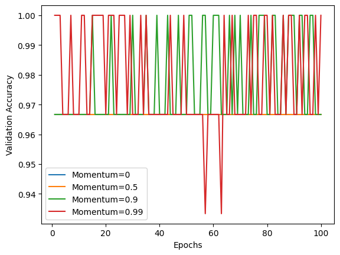

# Deep Learning

## Table of Contents
- [Aim](#aim)
- [Prerequisite](#prerequisite)
- [Steps](#steps)
  - [Step 1: Load the IRIS dataset into your notebook](#step-1-load-the-iris-dataset-into-your-notebook)
  - [Step 2: Pre-processing and prepare the data for giving to the neural network](#step-2-pre-processing-and-prepare-the-data-for-giving-to-the-neural-network)
    - [Step 2a: Encoding the species names using label encoder](#step-2a-encoding-the-species-names-using-label-encoder)
    - [Step 2b: Normalize the features](#step-2b-normalize-the-features)
    - [Step 2c: Split it into train and validate](#step-2c-split-it-into-train-and-validate)
  - [Step 3: Building the sequential neural network model](#step-3-building-the-sequential-neural-network-model)
    - [Step 3a: You may choose the layers](#step-3a-you-may-choose-the-layers)
    - [Step 3b: Use appropriate activation and loss functions](#step-3b-use-appropriate-activation-and-loss-functions)
  - [Step 4: Compile and fit the model to the training dataset](#step-4-compile-and-fit-the-model-to-the-training-dataset)
  - [Step 5: Use learning rates as (0.1, 0.01, 0.001, 0.0001)](#step-5-use-learning-rates-as-01-001-0001-00001)
  - [Step 6: Use the best learning rate and add momentum to it](#step-6-use-the-best-learning-rate-and-add-momentum-to-it)
  - [Step 7: Add a decay parameter to the optimizer](#step-7-add-a-decay-parameter-to-the-optimizer)
  - [Step 8: Train the model using Adagrad, Adam, and RMSprop](#step-8-train-the-model-using-adagrad-adam-and-rmsprop)
  - [Step 9: Infer the best optimizer and learning rate for your model](#step-9-infer-the-best-optimizer-and-learning-rate-for-your-model)
  - [Step 10: Repeat the above steps on seeds dataset](#step-10-repeat-the-above-steps-on-seeds-dataset)

## Aim
To perform various optimization techniques on a neural network using the IRIS dataset and evaluate their performances.

## Prerequisite
- Python Programming
- Numpy
- Pandas
- TensorFlow/Keras

## Steps

### Step 1: Load the IRIS dataset into your notebook
Load the IRIS dataset to begin the data processing and modeling steps.

### Step 2: Pre-processing and prepare the data for giving to the neural network

#### Step 2a: Encoding the species names using label encoder
Encode the species names using a label encoder to convert categorical values into numerical values.

#### Step 2b: Normalize the features
Normalize the feature values to ensure that they have a mean of 0 and a standard deviation of 1.

#### Step 2c: Split it into train and validate
Split the dataset into training and validation sets to evaluate the model's performance.

### Step 3: Building the sequential neural network model

#### Step 3a: You may choose the layers
Select and add layers to the sequential neural network model as per requirement.

#### Step 3b: Use appropriate activation and loss functions
Choose suitable activation and loss functions for the neural network.

### Step 4: Compile and fit the model to the training dataset
Compile and fit the model to the training dataset using Stochastic Gradient Descent (SGD) as the optimizer, and include validation data in the process.

### Step 5: Use learning rates as (0.1, 0.01, 0.001, 0.0001)
Train the model using different learning rates (0.1, 0.01, 0.001, 0.0001). Plot the training and validation accuracy curves and determine the best learning rate.

### Step 6: Use the best learning rate and add momentum to it
Using the best learning rate identified, add momentum values (0, 0.5, 0.9, 0.99) to the optimizer. Train the model and identify the best momentum value.

### Step 7: Add a decay parameter to the optimizer
Introduce a decay parameter to the optimizer with values (1E-1, 1E-2, 1E-3, 1E-4) and note the performance improvements.

### Step 8: Train the model using Adagrad, Adam, and RMSprop
Train the model using different optimizers such as Adagrad, Adam, and RMSprop to determine which one works best.

### Step 9: Infer the best optimizer and learning rate for your model
Evaluate and infer the best optimizer and learning rate combination that yields the highest performance for the neural network model.

### Step 10: Repeat the above steps on seeds dataset
Repeat all the above steps using the seeds dataset to compare the performance and effectiveness of the different optimizers and learning rates on a different dataset.


```python
# import libraries
import pandas as pd
import numpy as np
import matplotlib.pyplot as plt
from keras.datasets import imdb
from keras import models, layers, losses, metrics, regularizers
from keras.layers import Dropout
from keras.callbacks import ModelCheckpoint
from sklearn.preprocessing import LabelEncoder
from sklearn.preprocessing import MinMaxScaler
from sklearn.model_selection import train_test_split
from tensorflow.keras.models import Sequential
from tensorflow.keras.layers import Dense
from tensorflow.keras.utils import to_categorical
import tensorflow as tf
from tensorflow.keras.optimizers.schedules import ExponentialDecay
```

### Task 1: Load the IRIS dataset into your notebook 

```python
df = pd.read_csv('IRIS_dataset.csv')
```

### Task 2: Pre-processing and prepare the data for giving to the neural network. 
#### a. Encoding the species names using label encoder. 

```python
le = LabelEncoder()
df['species'] = le.fit_transform(df['species'])
```

#### b. Normalize the features. 

```python
scaler = MinMaxScaler()
df[['sepal_length', 'sepal_width', 'petal_length', 'petal_width']] = scaler.fit_transform(df[['sepal_length', 'sepal_width', 'petal_length', 'petal_width']])
```

#### c. Split it into train and validate.

```python
X = df[['sepal_length', 'sepal_width', 'petal_length', 'petal_width']]
y = df['species']

X_train, X_valid, y_train, y_valid = train_test_split(X, y, test_size=0.2, random_state=42)
```

### Step 3: Building the sequential neural network model. 
#### a. You may choose the layers. 

```python
model = Sequential()
model.add(Dense(64, input_dim=4, activation='relu'))
model.add(Dense(32, activation='relu'))
model.add(Dense(3, activation='softmax'))  # Output layer with 'softmax' activation for multiclass classification

model.compile(loss='categorical_crossentropy', optimizer='sgd', metrics=['accuracy'])
```

```python
y_train_encoded = to_categorical(y_train, num_classes=3)
y_valid_encoded = to_categorical(y_valid, num_classes=3)

# Now, we can fit the model
history = model.fit(X_train, y_train_encoded, validation_data=(X_valid, y_valid_encoded), epochs=100, batch_size=32)
```

    Epoch 1/100
    4/4 [==============================] - 0s 40ms/step - loss: 1.0942 - accuracy: 0.0917 - val_loss: 1.0932 - val_accuracy: 0.0667
    Epoch 2/100
    4/4 [==============================] - 0s 8ms/step - loss: 1.0860 - accuracy: 0.3167 - val_loss: 1.0855 - val_accuracy: 0.5000
    Epoch 3/100
    4/4 [==============================] - 0s 8ms/step - loss: 1.0780 - accuracy: 0.5833 - val_loss: 1.0776 - val_accuracy: 0.6333
    Epoch 4/100
    4/4 [==============================] - 0s 9ms/step - loss: 1.0698 - accuracy: 0.6667 - val_loss: 1.0695 - val_accuracy: 0.7000
    Epoch 5/100
    4/4 [==============================] - 0s 9ms/step - loss: 1.0614 - accuracy: 0.7167 - val_loss: 1.0614 - val_accuracy: 0.7000
    Epoch 6/100
    4/4 [==============================] - 0s 8ms/step - loss: 1.0532 - accuracy: 0.6833 - val_loss: 1.0535 - val_accuracy: 0.7333
    Epoch 7/100
    4/4 [==============================] - 0s 8ms/step - loss: 1.0453 - accuracy: 0.6917 - val_loss: 1.0458 - val_accuracy: 0.7333
    Epoch 8/100
    4/4 [==============================] - 0s 8ms/step - loss: 1.0377 - accuracy: 0.6917 - val_loss: 1.0386 - val_accuracy: 0.7000
    Epoch 9/100
    4/4 [==============================] - 0s 8ms/step - loss: 1.0308 - accuracy: 0.7000 - val_loss: 1.0319 - val_accuracy: 0.6667
    Epoch 10/100
    4/4 [==============================] - 0s 8ms/step - loss: 1.0237 - accuracy: 0.7000 - val_loss: 1.0253 - val_accuracy: 0.6333
    Epoch 11/100
    4/4 [==============================] - 0s 8ms/step - loss: 1.0174 - accuracy: 0.7000 - val_loss: 1.0187 - val_accuracy: 0.6333
    Epoch 12/100
    4/4 [==============================] - 0s 8ms/step - loss: 1.0108 - accuracy: 0.7000 - val_loss: 1.0125 - val_accuracy: 0.6333
    Epoch 13/100
    4/4 [==============================] - 0s 8ms/step - loss: 1.0051 - accuracy: 0.7167 - val_loss: 1.0065 - val_accuracy: 0.6333
    Epoch 14/100
    4/4 [==============================] - 0s 8ms/step - loss: 0.9986 - accuracy: 0.7167 - val_loss: 1.0005 - val_accuracy: 0.6333
    Epoch 15/100
    4/4 [==============================] - 0s 8ms/step - loss: 0.9927 - accuracy: 0.7250 - val_loss: 0.9945 - val_accuracy: 0.6333
    Epoch 16/100
    4/4 [==============================] - 0s 8ms/step - loss: 0.9866 - accuracy: 0.7083 - val_loss: 0.9879 - val_accuracy: 0.6333
    Epoch 17/100
    4/4 [==============================] - 0s 8ms/step - loss: 0.9796 - accuracy: 0.7250 - val_loss: 0.9806 - val_accuracy: 0.6333
    Epoch 18/100
    4/4 [==============================] - 0s 8ms/step - loss: 0.9721 - accuracy: 0.7167 - val_loss: 0.9733 - val_accuracy: 0.6333
    Epoch 19/100
    4/4 [==============================] - 0s 8ms/step - loss: 0.9648 - accuracy: 0.7083 - val_loss: 0.9661 - val_accuracy: 0.6333
    Epoch 20/100
    4/4 [==============================] - 0s 8ms/step - loss: 0.9569 - accuracy: 0.7000 - val_loss: 0.9588 - val_accuracy: 0.6333
    Epoch 21/100
    4/4 [==============================] - 0s 8ms/step - loss: 0.9499 - accuracy: 0.7000 - val_loss: 0.9516 - val_accuracy: 0.6333
    Epoch 22/100
    4/4 [==============================] - 0s 8ms/step - loss: 0.9426 - accuracy: 0.7000 - val_loss: 0.9443 - val_accuracy: 0.6333
    Epoch 23/100
    4/4 [==============================] - 0s 8ms/step - loss: 0.9357 - accuracy: 0.7000 - val_loss: 0.9375 - val_accuracy: 0.6333
    Epoch 24/100
    4/4 [==============================] - 0s 8ms/step - loss: 0.9284 - accuracy: 0.7000 - val_loss: 0.9306 - val_accuracy: 0.6333
    Epoch 25/100
    4/4 [==============================] - 0s 8ms/step - loss: 0.9217 - accuracy: 0.7000 - val_loss: 0.9238 - val_accuracy: 0.6333
    Epoch 26/100
    4/4 [==============================] - 0s 8ms/step - loss: 0.9150 - accuracy: 0.6917 - val_loss: 0.9171 - val_accuracy: 0.6333
    Epoch 27/100
    4/4 [==============================] - 0s 8ms/step - loss: 0.9086 - accuracy: 0.7000 - val_loss: 0.9108 - val_accuracy: 0.6333
    Epoch 28/100
    4/4 [==============================] - 0s 8ms/step - loss: 0.9023 - accuracy: 0.6917 - val_loss: 0.9044 - val_accuracy: 0.6333
    Epoch 29/100
    4/4 [==============================] - 0s 8ms/step - loss: 0.8963 - accuracy: 0.7000 - val_loss: 0.8982 - val_accuracy: 0.6333
    Epoch 30/100
    4/4 [==============================] - 0s 9ms/step - loss: 0.8898 - accuracy: 0.7000 - val_loss: 0.8920 - val_accuracy: 0.6333
    Epoch 31/100
    4/4 [==============================] - 0s 8ms/step - loss: 0.8838 - accuracy: 0.7000 - val_loss: 0.8860 - val_accuracy: 0.6333
    Epoch 32/100
    4/4 [==============================] - 0s 8ms/step - loss: 0.8778 - accuracy: 0.7000 - val_loss: 0.8801 - val_accuracy: 0.6333
    Epoch 33/100
    4/4 [==============================] - 0s 8ms/step - loss: 0.8715 - accuracy: 0.6833 - val_loss: 0.8738 - val_accuracy: 0.6333
    Epoch 34/100
    4/4 [==============================] - 0s 8ms/step - loss: 0.8655 - accuracy: 0.6917 - val_loss: 0.8678 - val_accuracy: 0.6333
    Epoch 35/100
    4/4 [==============================] - 0s 8ms/step - loss: 0.8595 - accuracy: 0.6833 - val_loss: 0.8618 - val_accuracy: 0.6333
    Epoch 36/100
    4/4 [==============================] - 0s 8ms/step - loss: 0.8536 - accuracy: 0.7000 - val_loss: 0.8558 - val_accuracy: 0.6333
    Epoch 37/100
    4/4 [==============================] - 0s 8ms/step - loss: 0.8476 - accuracy: 0.7000 - val_loss: 0.8499 - val_accuracy: 0.6333
    Epoch 38/100
    4/4 [==============================] - 0s 8ms/step - loss: 0.8415 - accuracy: 0.7000 - val_loss: 0.8441 - val_accuracy: 0.6333
    Epoch 39/100
    4/4 [==============================] - 0s 8ms/step - loss: 0.8357 - accuracy: 0.6917 - val_loss: 0.8380 - val_accuracy: 0.6333
    Epoch 40/100
    4/4 [==============================] - 0s 8ms/step - loss: 0.8299 - accuracy: 0.7000 - val_loss: 0.8323 - val_accuracy: 0.6333
    Epoch 41/100
    4/4 [==============================] - 0s 8ms/step - loss: 0.8240 - accuracy: 0.7000 - val_loss: 0.8266 - val_accuracy: 0.6333
    Epoch 42/100
    4/4 [==============================] - 0s 8ms/step - loss: 0.8184 - accuracy: 0.7000 - val_loss: 0.8211 - val_accuracy: 0.6333
    Epoch 43/100
    4/4 [==============================] - 0s 8ms/step - loss: 0.8128 - accuracy: 0.7000 - val_loss: 0.8153 - val_accuracy: 0.6333
    Epoch 44/100
    4/4 [==============================] - 0s 8ms/step - loss: 0.8066 - accuracy: 0.7000 - val_loss: 0.8094 - val_accuracy: 0.6333
    Epoch 45/100
    4/4 [==============================] - 0s 8ms/step - loss: 0.8012 - accuracy: 0.7000 - val_loss: 0.8039 - val_accuracy: 0.6333
    Epoch 46/100
    4/4 [==============================] - 0s 8ms/step - loss: 0.7952 - accuracy: 0.7000 - val_loss: 0.7981 - val_accuracy: 0.6333
    Epoch 47/100
    4/4 [==============================] - 0s 8ms/step - loss: 0.7896 - accuracy: 0.7000 - val_loss: 0.7927 - val_accuracy: 0.6333
    Epoch 48/100
    4/4 [==============================] - 0s 8ms/step - loss: 0.7840 - accuracy: 0.7000 - val_loss: 0.7870 - val_accuracy: 0.6333
    Epoch 49/100
    4/4 [==============================] - 0s 8ms/step - loss: 0.7782 - accuracy: 0.7083 - val_loss: 0.7813 - val_accuracy: 0.6333
    Epoch 50/100
    4/4 [==============================] - 0s 9ms/step - loss: 0.7727 - accuracy: 0.7000 - val_loss: 0.7756 - val_accuracy: 0.6333
    Epoch 51/100
    4/4 [==============================] - 0s 8ms/step - loss: 0.7671 - accuracy: 0.7083 - val_loss: 0.7701 - val_accuracy: 0.6333
    Epoch 52/100
    4/4 [==============================] - 0s 8ms/step - loss: 0.7618 - accuracy: 0.7083 - val_loss: 0.7643 - val_accuracy: 0.6333
    Epoch 53/100
    4/4 [==============================] - 0s 8ms/step - loss: 0.7566 - accuracy: 0.7250 - val_loss: 0.7588 - val_accuracy: 0.6333
    Epoch 54/100
    4/4 [==============================] - 0s 8ms/step - loss: 0.7506 - accuracy: 0.7333 - val_loss: 0.7534 - val_accuracy: 0.6333
    Epoch 55/100
    4/4 [==============================] - 0s 8ms/step - loss: 0.7456 - accuracy: 0.7333 - val_loss: 0.7480 - val_accuracy: 0.6333
    Epoch 56/100
    4/4 [==============================] - 0s 8ms/step - loss: 0.7401 - accuracy: 0.7333 - val_loss: 0.7427 - val_accuracy: 0.6667
    Epoch 57/100
    4/4 [==============================] - 0s 8ms/step - loss: 0.7348 - accuracy: 0.7333 - val_loss: 0.7374 - val_accuracy: 0.6667
    Epoch 58/100
    4/4 [==============================] - 0s 8ms/step - loss: 0.7294 - accuracy: 0.7333 - val_loss: 0.7319 - val_accuracy: 0.7000
    Epoch 59/100
    4/4 [==============================] - 0s 8ms/step - loss: 0.7242 - accuracy: 0.7333 - val_loss: 0.7266 - val_accuracy: 0.7333
    Epoch 60/100
    4/4 [==============================] - 0s 8ms/step - loss: 0.7190 - accuracy: 0.7417 - val_loss: 0.7214 - val_accuracy: 0.7333
    Epoch 61/100
    4/4 [==============================] - 0s 8ms/step - loss: 0.7139 - accuracy: 0.7417 - val_loss: 0.7161 - val_accuracy: 0.7333
    Epoch 62/100
    4/4 [==============================] - 0s 8ms/step - loss: 0.7089 - accuracy: 0.7667 - val_loss: 0.7109 - val_accuracy: 0.7333
    Epoch 63/100
    4/4 [==============================] - 0s 8ms/step - loss: 0.7038 - accuracy: 0.7750 - val_loss: 0.7056 - val_accuracy: 0.7333
    Epoch 64/100
    4/4 [==============================] - 0s 8ms/step - loss: 0.6991 - accuracy: 0.7750 - val_loss: 0.7003 - val_accuracy: 0.7667
    Epoch 65/100
    4/4 [==============================] - 0s 8ms/step - loss: 0.6939 - accuracy: 0.7917 - val_loss: 0.6953 - val_accuracy: 0.7667
    Epoch 66/100
    4/4 [==============================] - 0s 8ms/step - loss: 0.6894 - accuracy: 0.7833 - val_loss: 0.6901 - val_accuracy: 0.8333
    Epoch 67/100
    4/4 [==============================] - 0s 9ms/step - loss: 0.6842 - accuracy: 0.8083 - val_loss: 0.6849 - val_accuracy: 0.8667
    Epoch 68/100
    4/4 [==============================] - 0s 8ms/step - loss: 0.6796 - accuracy: 0.7917 - val_loss: 0.6799 - val_accuracy: 0.8667
    Epoch 69/100
    4/4 [==============================] - 0s 8ms/step - loss: 0.6744 - accuracy: 0.8417 - val_loss: 0.6751 - val_accuracy: 0.8667
    Epoch 70/100
    4/4 [==============================] - 0s 9ms/step - loss: 0.6697 - accuracy: 0.8333 - val_loss: 0.6701 - val_accuracy: 0.8667
    Epoch 71/100
    4/4 [==============================] - 0s 8ms/step - loss: 0.6650 - accuracy: 0.8500 - val_loss: 0.6652 - val_accuracy: 0.9000
    Epoch 72/100
    4/4 [==============================] - 0s 8ms/step - loss: 0.6604 - accuracy: 0.8583 - val_loss: 0.6604 - val_accuracy: 0.9000
    Epoch 73/100
    4/4 [==============================] - 0s 8ms/step - loss: 0.6560 - accuracy: 0.9167 - val_loss: 0.6555 - val_accuracy: 0.9000
    Epoch 74/100
    4/4 [==============================] - 0s 8ms/step - loss: 0.6513 - accuracy: 0.9333 - val_loss: 0.6509 - val_accuracy: 0.9000
    Epoch 75/100
    4/4 [==============================] - 0s 8ms/step - loss: 0.6468 - accuracy: 0.9333 - val_loss: 0.6464 - val_accuracy: 0.9000
    Epoch 76/100
    4/4 [==============================] - 0s 8ms/step - loss: 0.6425 - accuracy: 0.9500 - val_loss: 0.6419 - val_accuracy: 0.9000
    Epoch 77/100
    4/4 [==============================] - 0s 11ms/step - loss: 0.6383 - accuracy: 0.9417 - val_loss: 0.6375 - val_accuracy: 0.9000
    Epoch 78/100
    4/4 [==============================] - 0s 8ms/step - loss: 0.6340 - accuracy: 0.9500 - val_loss: 0.6330 - val_accuracy: 0.9333
    Epoch 79/100
    4/4 [==============================] - 0s 8ms/step - loss: 0.6298 - accuracy: 0.9417 - val_loss: 0.6285 - val_accuracy: 0.9333
    Epoch 80/100
    4/4 [==============================] - 0s 8ms/step - loss: 0.6252 - accuracy: 0.9500 - val_loss: 0.6241 - val_accuracy: 0.9333
    Epoch 81/100
    4/4 [==============================] - 0s 8ms/step - loss: 0.6211 - accuracy: 0.9500 - val_loss: 0.6198 - val_accuracy: 0.9333
    Epoch 82/100
    4/4 [==============================] - 0s 8ms/step - loss: 0.6172 - accuracy: 0.9500 - val_loss: 0.6153 - val_accuracy: 0.9333
    Epoch 83/100
    4/4 [==============================] - 0s 8ms/step - loss: 0.6131 - accuracy: 0.9500 - val_loss: 0.6108 - val_accuracy: 0.9333
    Epoch 84/100
    4/4 [==============================] - 0s 8ms/step - loss: 0.6088 - accuracy: 0.9500 - val_loss: 0.6066 - val_accuracy: 0.9333
    Epoch 85/100
    4/4 [==============================] - 0s 8ms/step - loss: 0.6052 - accuracy: 0.9500 - val_loss: 0.6023 - val_accuracy: 0.9333
    Epoch 86/100
    4/4 [==============================] - 0s 8ms/step - loss: 0.6010 - accuracy: 0.9583 - val_loss: 0.5984 - val_accuracy: 0.9333
    Epoch 87/100
    4/4 [==============================] - 0s 8ms/step - loss: 0.5975 - accuracy: 0.9583 - val_loss: 0.5942 - val_accuracy: 0.9333
    Epoch 88/100
    4/4 [==============================] - 0s 8ms/step - loss: 0.5938 - accuracy: 0.9583 - val_loss: 0.5900 - val_accuracy: 0.9333
    Epoch 89/100
    4/4 [==============================] - 0s 8ms/step - loss: 0.5897 - accuracy: 0.9583 - val_loss: 0.5861 - val_accuracy: 0.9333
    Epoch 90/100
    4/4 [==============================] - 0s 8ms/step - loss: 0.5860 - accuracy: 0.9500 - val_loss: 0.5824 - val_accuracy: 0.9333
    Epoch 91/100
    4/4 [==============================] - 0s 8ms/step - loss: 0.5823 - accuracy: 0.9583 - val_loss: 0.5786 - val_accuracy: 0.9333
    Epoch 92/100
    4/4 [==============================] - 0s 8ms/step - loss: 0.5787 - accuracy: 0.9583 - val_loss: 0.5749 - val_accuracy: 0.9333
    Epoch 93/100
    4/4 [==============================] - 0s 8ms/step - loss: 0.5751 - accuracy: 0.9667 - val_loss: 0.5710 - val_accuracy: 0.9333
    Epoch 94/100
    4/4 [==============================] - 0s 8ms/step - loss: 0.5716 - accuracy: 0.9667 - val_loss: 0.5674 - val_accuracy: 0.9333
    Epoch 95/100
    4/4 [==============================] - 0s 8ms/step - loss: 0.5684 - accuracy: 0.9500 - val_loss: 0.5639 - val_accuracy: 0.9333
    Epoch 96/100
    4/4 [==============================] - 0s 8ms/step - loss: 0.5649 - accuracy: 0.9583 - val_loss: 0.5605 - val_accuracy: 0.9333
    Epoch 97/100
    4/4 [==============================] - 0s 8ms/step - loss: 0.5618 - accuracy: 0.9583 - val_loss: 0.5568 - val_accuracy: 0.9333
    Epoch 98/100
    4/4 [==============================] - 0s 8ms/step - loss: 0.5585 - accuracy: 0.9583 - val_loss: 0.5533 - val_accuracy: 0.9333
    Epoch 99/100
    4/4 [==============================] - 0s 8ms/step - loss: 0.5550 - accuracy: 0.9500 - val_loss: 0.5499 - val_accuracy: 0.9333
    Epoch 100/100
    4/4 [==============================] - 0s 8ms/step - loss: 0.5524 - accuracy: 0.9500 - val_loss: 0.5465 - val_accuracy: 0.9333

#### b. Use appropriate activation and loss functions

```python
model.compile(loss='categorical_crossentropy', optimizer='sgd', metrics=['accuracy'])
```

```python
print("X_train shape:", X_train.shape)
print("y_train_encoded shape:", y_train_encoded.shape)
```

    X_train shape: (120, 4)
    y_train_encoded shape: (120, 3)

### Task 4: Compile and fit the model to the training dataset. Use validation also. Use SGD as optimizer. 

```python
history = model.fit(X_train, y_train_encoded, validation_data=(X_valid, y_valid_encoded), epochs=100, batch_size=32)
```

    Epoch 1/100
    4/4 [==============================] - 0s 39ms/step - loss: 0.5499 - accuracy: 0.9500 - val_loss: 0.5430 - val_accuracy: 0.9667
    Epoch 2/100
    4/4 [==============================] - 0s 8ms/step - loss: 0.5456 - accuracy: 0.9417 - val_loss: 0.5398 - val_accuracy: 0.9667
    Epoch 3/100
    4/4 [==============================] - 0s 8ms/step - loss: 0.5431 - accuracy: 0.9500 - val_loss: 0.5365 - val_accuracy: 0.9667
    Epoch 4/100
    4/4 [==============================] - 0s 9ms/step - loss: 0.5396 - accuracy: 0.9500 - val_loss: 0.5333 - val_accuracy: 0.9667
    Epoch 5/100
    4/4 [==============================] - 0s 8ms/step - loss: 0.5372 - accuracy: 0.9333 - val_loss: 0.5303 - val_accuracy: 0.9667
    Epoch 6/100
    4/4 [==============================] - 0s 8ms/step - loss: 0.5336 - accuracy: 0.9500 - val_loss: 0.5273 - val_accuracy: 0.9667
    Epoch 7/100
    4/4 [==============================] - 0s 9ms/step - loss: 0.5310 - accuracy: 0.9500 - val_loss: 0.5245 - val_accuracy: 0.9667
    Epoch 8/100
    4/4 [==============================] - 0s 8ms/step - loss: 0.5280 - accuracy: 0.9500 - val_loss: 0.5215 - val_accuracy: 0.9667
    Epoch 9/100
    4/4 [==============================] - 0s 8ms/step - loss: 0.5254 - accuracy: 0.9417 - val_loss: 0.5187 - val_accuracy: 0.9667
    Epoch 10/100
    4/4 [==============================] - 0s 8ms/step - loss: 0.5228 - accuracy: 0.9500 - val_loss: 0.5158 - val_accuracy: 0.9667
    Epoch 11/100
    4/4 [==============================] - 0s 9ms/step - loss: 0.5198 - accuracy: 0.9500 - val_loss: 0.5129 - val_accuracy: 0.9667
    Epoch 12/100
    4/4 [==============================] - 0s 8ms/step - loss: 0.5178 - accuracy: 0.9333 - val_loss: 0.5101 - val_accuracy: 0.9667
    Epoch 13/100
    4/4 [==============================] - 0s 8ms/step - loss: 0.5145 - accuracy: 0.9500 - val_loss: 0.5072 - val_accuracy: 0.9667
    Epoch 14/100
    4/4 [==============================] - 0s 9ms/step - loss: 0.5121 - accuracy: 0.9500 - val_loss: 0.5046 - val_accuracy: 0.9667
    Epoch 15/100
    4/4 [==============================] - 0s 8ms/step - loss: 0.5095 - accuracy: 0.9417 - val_loss: 0.5020 - val_accuracy: 0.9667
    Epoch 16/100
    4/4 [==============================] - 0s 8ms/step - loss: 0.5069 - accuracy: 0.9500 - val_loss: 0.4993 - val_accuracy: 0.9667
    Epoch 17/100
    4/4 [==============================] - 0s 8ms/step - loss: 0.5046 - accuracy: 0.9500 - val_loss: 0.4967 - val_accuracy: 0.9667
    Epoch 18/100
    4/4 [==============================] - 0s 8ms/step - loss: 0.5019 - accuracy: 0.9500 - val_loss: 0.4942 - val_accuracy: 0.9667
    Epoch 19/100
    4/4 [==============================] - 0s 8ms/step - loss: 0.4995 - accuracy: 0.9500 - val_loss: 0.4916 - val_accuracy: 0.9667
    Epoch 20/100
    4/4 [==============================] - 0s 8ms/step - loss: 0.4975 - accuracy: 0.9417 - val_loss: 0.4891 - val_accuracy: 0.9667
    Epoch 21/100
    4/4 [==============================] - 0s 9ms/step - loss: 0.4948 - accuracy: 0.9500 - val_loss: 0.4865 - val_accuracy: 0.9667
    Epoch 22/100
    4/4 [==============================] - 0s 8ms/step - loss: 0.4926 - accuracy: 0.9500 - val_loss: 0.4839 - val_accuracy: 0.9667
    Epoch 23/100
    4/4 [==============================] - 0s 9ms/step - loss: 0.4903 - accuracy: 0.9417 - val_loss: 0.4814 - val_accuracy: 0.9667
    Epoch 24/100
    4/4 [==============================] - 0s 8ms/step - loss: 0.4879 - accuracy: 0.9417 - val_loss: 0.4791 - val_accuracy: 0.9667
    Epoch 25/100
    4/4 [==============================] - 0s 8ms/step - loss: 0.4862 - accuracy: 0.9500 - val_loss: 0.4766 - val_accuracy: 0.9667
    Epoch 26/100
    4/4 [==============================] - 0s 8ms/step - loss: 0.4834 - accuracy: 0.9417 - val_loss: 0.4742 - val_accuracy: 0.9667
    Epoch 27/100
    4/4 [==============================] - 0s 9ms/step - loss: 0.4818 - accuracy: 0.9333 - val_loss: 0.4721 - val_accuracy: 0.9667
    Epoch 28/100
    4/4 [==============================] - 0s 8ms/step - loss: 0.4791 - accuracy: 0.9500 - val_loss: 0.4697 - val_accuracy: 0.9667
    Epoch 29/100
    4/4 [==============================] - 0s 8ms/step - loss: 0.4769 - accuracy: 0.9417 - val_loss: 0.4675 - val_accuracy: 0.9667
    Epoch 30/100
    4/4 [==============================] - 0s 8ms/step - loss: 0.4747 - accuracy: 0.9417 - val_loss: 0.4652 - val_accuracy: 0.9667
    Epoch 31/100
    4/4 [==============================] - 0s 8ms/step - loss: 0.4727 - accuracy: 0.9417 - val_loss: 0.4629 - val_accuracy: 0.9667
    Epoch 32/100
    4/4 [==============================] - 0s 8ms/step - loss: 0.4704 - accuracy: 0.9417 - val_loss: 0.4608 - val_accuracy: 0.9667
    Epoch 33/100
    4/4 [==============================] - 0s 8ms/step - loss: 0.4689 - accuracy: 0.9417 - val_loss: 0.4585 - val_accuracy: 0.9667
    Epoch 34/100
    4/4 [==============================] - 0s 9ms/step - loss: 0.4663 - accuracy: 0.9417 - val_loss: 0.4564 - val_accuracy: 0.9667
    Epoch 35/100
    4/4 [==============================] - 0s 9ms/step - loss: 0.4643 - accuracy: 0.9417 - val_loss: 0.4544 - val_accuracy: 0.9667
    Epoch 36/100
    4/4 [==============================] - 0s 8ms/step - loss: 0.4622 - accuracy: 0.9500 - val_loss: 0.4523 - val_accuracy: 0.9667
    Epoch 37/100
    4/4 [==============================] - 0s 8ms/step - loss: 0.4603 - accuracy: 0.9417 - val_loss: 0.4503 - val_accuracy: 0.9667
    Epoch 38/100
    4/4 [==============================] - 0s 7ms/step - loss: 0.4589 - accuracy: 0.9417 - val_loss: 0.4482 - val_accuracy: 0.9667
    Epoch 39/100
    4/4 [==============================] - 0s 9ms/step - loss: 0.4565 - accuracy: 0.9417 - val_loss: 0.4461 - val_accuracy: 0.9667
    Epoch 40/100
    4/4 [==============================] - 0s 8ms/step - loss: 0.4544 - accuracy: 0.9417 - val_loss: 0.4442 - val_accuracy: 0.9667
    Epoch 41/100
    4/4 [==============================] - 0s 8ms/step - loss: 0.4526 - accuracy: 0.9417 - val_loss: 0.4423 - val_accuracy: 0.9667
    Epoch 42/100
    4/4 [==============================] - 0s 8ms/step - loss: 0.4510 - accuracy: 0.9417 - val_loss: 0.4406 - val_accuracy: 0.9667
    Epoch 43/100
    4/4 [==============================] - 0s 8ms/step - loss: 0.4490 - accuracy: 0.9500 - val_loss: 0.4386 - val_accuracy: 0.9667
    Epoch 44/100
    4/4 [==============================] - 0s 8ms/step - loss: 0.4473 - accuracy: 0.9500 - val_loss: 0.4366 - val_accuracy: 0.9667
    Epoch 45/100
    4/4 [==============================] - 0s 8ms/step - loss: 0.4452 - accuracy: 0.9500 - val_loss: 0.4346 - val_accuracy: 0.9667
    Epoch 46/100
    4/4 [==============================] - 0s 8ms/step - loss: 0.4441 - accuracy: 0.9417 - val_loss: 0.4328 - val_accuracy: 0.9667
    Epoch 47/100
    4/4 [==============================] - 0s 8ms/step - loss: 0.4414 - accuracy: 0.9500 - val_loss: 0.4311 - val_accuracy: 0.9667
    Epoch 48/100
    4/4 [==============================] - 0s 8ms/step - loss: 0.4396 - accuracy: 0.9583 - val_loss: 0.4291 - val_accuracy: 0.9667
    Epoch 49/100
    4/4 [==============================] - 0s 8ms/step - loss: 0.4380 - accuracy: 0.9583 - val_loss: 0.4270 - val_accuracy: 0.9667
    Epoch 50/100
    4/4 [==============================] - 0s 8ms/step - loss: 0.4359 - accuracy: 0.9500 - val_loss: 0.4253 - val_accuracy: 0.9667
    Epoch 51/100
    4/4 [==============================] - 0s 8ms/step - loss: 0.4345 - accuracy: 0.9583 - val_loss: 0.4233 - val_accuracy: 0.9667
    Epoch 52/100
    4/4 [==============================] - 0s 9ms/step - loss: 0.4325 - accuracy: 0.9583 - val_loss: 0.4216 - val_accuracy: 0.9667
    Epoch 53/100
    4/4 [==============================] - 0s 8ms/step - loss: 0.4309 - accuracy: 0.9500 - val_loss: 0.4198 - val_accuracy: 0.9667
    Epoch 54/100
    4/4 [==============================] - 0s 8ms/step - loss: 0.4291 - accuracy: 0.9583 - val_loss: 0.4180 - val_accuracy: 0.9667
    Epoch 55/100
    4/4 [==============================] - 0s 8ms/step - loss: 0.4275 - accuracy: 0.9583 - val_loss: 0.4162 - val_accuracy: 0.9667
    Epoch 56/100
    4/4 [==============================] - 0s 8ms/step - loss: 0.4261 - accuracy: 0.9500 - val_loss: 0.4144 - val_accuracy: 0.9667
    Epoch 57/100
    4/4 [==============================] - 0s 8ms/step - loss: 0.4242 - accuracy: 0.9417 - val_loss: 0.4129 - val_accuracy: 0.9667
    Epoch 58/100
    4/4 [==============================] - 0s 8ms/step - loss: 0.4223 - accuracy: 0.9583 - val_loss: 0.4111 - val_accuracy: 0.9667
    Epoch 59/100
    4/4 [==============================] - 0s 8ms/step - loss: 0.4206 - accuracy: 0.9583 - val_loss: 0.4094 - val_accuracy: 0.9667
    Epoch 60/100
    4/4 [==============================] - 0s 8ms/step - loss: 0.4189 - accuracy: 0.9583 - val_loss: 0.4078 - val_accuracy: 0.9667
    Epoch 61/100
    4/4 [==============================] - 0s 8ms/step - loss: 0.4174 - accuracy: 0.9583 - val_loss: 0.4061 - val_accuracy: 0.9667
    Epoch 62/100
    4/4 [==============================] - 0s 8ms/step - loss: 0.4158 - accuracy: 0.9583 - val_loss: 0.4043 - val_accuracy: 0.9667
    Epoch 63/100
    4/4 [==============================] - 0s 8ms/step - loss: 0.4139 - accuracy: 0.9583 - val_loss: 0.4027 - val_accuracy: 0.9667
    Epoch 64/100
    4/4 [==============================] - 0s 8ms/step - loss: 0.4132 - accuracy: 0.9500 - val_loss: 0.4011 - val_accuracy: 0.9667
    Epoch 65/100
    4/4 [==============================] - 0s 8ms/step - loss: 0.4108 - accuracy: 0.9583 - val_loss: 0.3995 - val_accuracy: 0.9667
    Epoch 66/100
    4/4 [==============================] - 0s 8ms/step - loss: 0.4095 - accuracy: 0.9583 - val_loss: 0.3978 - val_accuracy: 0.9667
    Epoch 67/100
    4/4 [==============================] - 0s 8ms/step - loss: 0.4081 - accuracy: 0.9583 - val_loss: 0.3961 - val_accuracy: 0.9667
    Epoch 68/100
    4/4 [==============================] - 0s 8ms/step - loss: 0.4061 - accuracy: 0.9583 - val_loss: 0.3946 - val_accuracy: 0.9667
    Epoch 69/100
    4/4 [==============================] - 0s 8ms/step - loss: 0.4046 - accuracy: 0.9583 - val_loss: 0.3929 - val_accuracy: 0.9667
    Epoch 70/100
    4/4 [==============================] - 0s 8ms/step - loss: 0.4030 - accuracy: 0.9583 - val_loss: 0.3912 - val_accuracy: 0.9667
    Epoch 71/100
    4/4 [==============================] - 0s 9ms/step - loss: 0.4012 - accuracy: 0.9583 - val_loss: 0.3897 - val_accuracy: 0.9667
    Epoch 72/100
    4/4 [==============================] - 0s 8ms/step - loss: 0.3997 - accuracy: 0.9583 - val_loss: 0.3882 - val_accuracy: 0.9667
    Epoch 73/100
    4/4 [==============================] - 0s 8ms/step - loss: 0.3982 - accuracy: 0.9583 - val_loss: 0.3866 - val_accuracy: 0.9667
    Epoch 74/100
    4/4 [==============================] - 0s 8ms/step - loss: 0.3968 - accuracy: 0.9583 - val_loss: 0.3851 - val_accuracy: 0.9667
    Epoch 75/100
    4/4 [==============================] - 0s 9ms/step - loss: 0.3951 - accuracy: 0.9583 - val_loss: 0.3836 - val_accuracy: 0.9667
    Epoch 76/100
    4/4 [==============================] - 0s 8ms/step - loss: 0.3935 - accuracy: 0.9583 - val_loss: 0.3821 - val_accuracy: 0.9667
    Epoch 77/100
    4/4 [==============================] - 0s 8ms/step - loss: 0.3921 - accuracy: 0.9583 - val_loss: 0.3804 - val_accuracy: 0.9667
    Epoch 78/100
    4/4 [==============================] - 0s 11ms/step - loss: 0.3907 - accuracy: 0.9583 - val_loss: 0.3788 - val_accuracy: 0.9667
    Epoch 79/100
    4/4 [==============================] - 0s 8ms/step - loss: 0.3890 - accuracy: 0.9583 - val_loss: 0.3773 - val_accuracy: 0.9667
    Epoch 80/100
    4/4 [==============================] - 0s 11ms/step - loss: 0.3876 - accuracy: 0.9583 - val_loss: 0.3757 - val_accuracy: 0.9667
    Epoch 81/100
    4/4 [==============================] - 0s 12ms/step - loss: 0.3865 - accuracy: 0.9583 - val_loss: 0.3743 - val_accuracy: 0.9667
    Epoch 82/100
    4/4 [==============================] - 0s 9ms/step - loss: 0.3849 - accuracy: 0.9583 - val_loss: 0.3728 - val_accuracy: 0.9667
    Epoch 83/100
    4/4 [==============================] - 0s 9ms/step - loss: 0.3832 - accuracy: 0.9583 - val_loss: 0.3713 - val_accuracy: 0.9667
    Epoch 84/100
    4/4 [==============================] - 0s 8ms/step - loss: 0.3820 - accuracy: 0.9667 - val_loss: 0.3696 - val_accuracy: 0.9667
    Epoch 85/100
    4/4 [==============================] - 0s 10ms/step - loss: 0.3804 - accuracy: 0.9583 - val_loss: 0.3682 - val_accuracy: 0.9667
    Epoch 86/100
    4/4 [==============================] - 0s 10ms/step - loss: 0.3785 - accuracy: 0.9583 - val_loss: 0.3667 - val_accuracy: 0.9667
    Epoch 87/100
    4/4 [==============================] - 0s 8ms/step - loss: 0.3771 - accuracy: 0.9583 - val_loss: 0.3651 - val_accuracy: 0.9667
    Epoch 88/100
    4/4 [==============================] - 0s 8ms/step - loss: 0.3762 - accuracy: 0.9583 - val_loss: 0.3636 - val_accuracy: 0.9667
    Epoch 89/100
    4/4 [==============================] - 0s 8ms/step - loss: 0.3748 - accuracy: 0.9583 - val_loss: 0.3620 - val_accuracy: 0.9667
    Epoch 90/100
    4/4 [==============================] - 0s 8ms/step - loss: 0.3726 - accuracy: 0.9583 - val_loss: 0.3605 - val_accuracy: 0.9667
    Epoch 91/100
    4/4 [==============================] - 0s 8ms/step - loss: 0.3713 - accuracy: 0.9583 - val_loss: 0.3591 - val_accuracy: 0.9667
    Epoch 92/100
    4/4 [==============================] - 0s 8ms/step - loss: 0.3698 - accuracy: 0.9583 - val_loss: 0.3576 - val_accuracy: 0.9667
    Epoch 93/100
    4/4 [==============================] - 0s 8ms/step - loss: 0.3684 - accuracy: 0.9667 - val_loss: 0.3560 - val_accuracy: 0.9667
    Epoch 94/100
    4/4 [==============================] - 0s 8ms/step - loss: 0.3669 - accuracy: 0.9583 - val_loss: 0.3546 - val_accuracy: 0.9667
    Epoch 95/100
    4/4 [==============================] - 0s 8ms/step - loss: 0.3651 - accuracy: 0.9667 - val_loss: 0.3530 - val_accuracy: 0.9667
    Epoch 96/100
    4/4 [==============================] - 0s 8ms/step - loss: 0.3639 - accuracy: 0.9667 - val_loss: 0.3515 - val_accuracy: 0.9667
    Epoch 97/100
    4/4 [==============================] - 0s 8ms/step - loss: 0.3627 - accuracy: 0.9583 - val_loss: 0.3503 - val_accuracy: 0.9667
    Epoch 98/100
    4/4 [==============================] - 0s 8ms/step - loss: 0.3609 - accuracy: 0.9667 - val_loss: 0.3489 - val_accuracy: 0.9667
    Epoch 99/100
    4/4 [==============================] - 0s 9ms/step - loss: 0.3601 - accuracy: 0.9667 - val_loss: 0.3475 - val_accuracy: 0.9667
    Epoch 100/100
    4/4 [==============================] - 0s 8ms/step - loss: 0.3581 - accuracy: 0.9750 - val_loss: 0.3460 - val_accuracy: 0.9667

```python
history_dict = history.history
accuracy_values = history_dict['accuracy']
val_accuracy_values = history_dict['val_accuracy']

epochs = range(1, len(accuracy_values) + 1)

plt.plot(epochs, accuracy_values, 'bo', label='Training accuracy')
plt.plot(epochs, val_accuracy_values, 'b', label='Validation accuracy')
plt.title('Training and Validation Accuracy')
plt.xlabel('Epochs')
plt.ylabel('Accuracy')  # Corrected label to 'Accuracy'
plt.legend()
plt.show()
```

    

    

### Task 5: Use learning rates as (0.1, 0.01, 0.001, 0.0001) and train the model. Plot the training and validation accuracy curves and note the best learning rate. 

```python
learning_rates = [0.1, 0.01, 0.001, 0.0001]
results = []

for lr in learning_rates:
    optimizer = tf.keras.optimizers.SGD(learning_rate=lr)  # Define the optimizer within the loop
    model.compile(loss='categorical_crossentropy', optimizer=optimizer, metrics=['accuracy'])
    history = model.fit(X_train, y_train_encoded, validation_data=(X_valid, y_valid_encoded), epochs=100, batch_size=32, verbose=0)
    results.append(history.history['val_accuracy'])
    
for i, lr in enumerate(learning_rates):
    plt.plot(range(1, 101), results[i], label=f'LR={lr}')

plt.xlabel('Epochs')
plt.ylabel('Validation Accuracy')
plt.legend()
plt.show()

# Note the best learning rate
best_lr = learning_rates[results.index(max(results))]
print(f"The best learning rate is {best_lr}")
```

    

    

    The best learning rate is 0.01

### Task 6: Use the best learning rate and add momentum to it. Use different momentum values as 0, 0.5, 0.9, 0.99. Train the model and note the best momentum value. 

```python
momentum_values = [0, 0.5, 0.9, 0.99]
results_momentum = []

for momentum in momentum_values:
    optimizer = tf.keras.optimizers.SGD(learning_rate=best_lr, momentum=momentum)
    model.compile(loss='categorical_crossentropy', optimizer=optimizer, metrics=['accuracy'])
    history = model.fit(X_train, y_train_encoded, validation_data=(X_valid, y_valid_encoded), epochs=100, batch_size=32, verbose=0)
    results_momentum.append(history.history['val_accuracy'])

# Plot the training and validation accuracy curves for different momentum values
for i, momentum in enumerate(momentum_values):
    plt.plot(range(1, 101), results_momentum[i], label=f'Momentum={momentum}')

plt.xlabel('Epochs')
plt.ylabel('Validation Accuracy')
plt.legend()
plt.show()

# Note the best momentum value
best_momentum = momentum_values[results_momentum.index(max(results_momentum))]
print(f"The best momentum value is {best_momentum}")
```

    

    

    The best momentum value is 0.99

```python
history_dict = history.history
accuracy_values = history_dict['accuracy']
val_accuracy_values = history_dict['val_accuracy']

epochs = range(1, len(accuracy_values) + 1)

plt.plot(epochs, accuracy_values, 'bo', label='Training accuracy')
plt.plot(epochs, val_accuracy_values, 'b', label='Validation accuracy')
plt.title('Training and Validation Accuracy')
plt.xlabel('Epochs')
plt.ylabel('Accuracy')  # Corrected label to 'Accuracy'
plt.legend()
plt.show()
```

    

    

### Task 7: Add a decay parameter to the optimizer. Use decay values as 1E-1, 1E-2, 1E-3, 1E-4. Note the best results.

```python
decay_values = [1e-1, 1e-2, 1e-3, 1e-4]
results_decay = []

for decay in decay_values:
    lr_schedule = ExponentialDecay(initial_learning_rate=best_lr, decay_steps=10000, decay_rate=decay)
    optimizer = tf.keras.optimizers.SGD(learning_rate=lr_schedule, momentum=best_momentum)
    model.compile(loss='categorical_crossentropy', optimizer=optimizer, metrics=['accuracy'])
    history = model.fit(X_train, y_train_encoded, validation_data=(X_valid, y_valid_encoded), epochs=100, batch_size=32, verbose=0)
    results_decay.append(history.history['val_accuracy'])

# Plot the training and validation accuracy curves for different decay values
for i, decay in enumerate(decay_values):
    plt.plot(range(1, 101), results_decay[i], label=f'Decay={decay}')

plt.xlabel('Epochs')
plt.ylabel('Validation Accuracy')
plt.legend()
plt.show()

# Note the best decay value
best_decay = decay_values[results_decay.index(max(results_decay))]
print(f"The best decay value is {best_decay}")
```

    

    

    The best decay value is 0.01

```python
history_dict = history.history
accuracy_values = history_dict['accuracy']
val_accuracy_values = history_dict['val_accuracy']

epochs = range(1, len(accuracy_values) + 1)

plt.plot(epochs, accuracy_values, 'bo', label='Training accuracy')
plt.plot(epochs, val_accuracy_values, 'b', label='Validation accuracy')
plt.title('Training and Validation Accuracy')
plt.xlabel('Epochs')
plt.ylabel('Accuracy')  # Corrected label to 'Accuracy'
plt.legend()
plt.show()
```

    

    

### Task 8: Train the model using Adagrad, adam and rmsprop and conclude which works best. 

```python
optimizer_names = ['adagrad', 'adam', 'rmsprop']
results_optimizers = []

for optimizer_name in optimizer_names:
    if optimizer_name == 'adagrad':
        optimizer = tf.keras.optimizers.Adagrad(learning_rate=best_lr)
    elif optimizer_name == 'adam':
        optimizer = tf.keras.optimizers.Adam(learning_rate=best_lr)
    elif optimizer_name == 'rmsprop':
        optimizer = tf.keras.optimizers.RMSprop(learning_rate=best_lr)

    # Compile the model with the current optimizer
    model.compile(loss='categorical_crossentropy', optimizer=optimizer, metrics=['accuracy'])

    # Train the model
    history = model.fit(X_train, y_train_encoded, validation_data=(X_valid, y_valid_encoded), epochs=100, batch_size=32, verbose=0)

    # Append validation accuracy results for this optimizer to the list
    results_optimizers.append(history.history['val_accuracy'])

for i, optimizer_name in enumerate(optimizer_names):
    plt.plot(range(1, 101), results_optimizers[i], label=f'Optimizer={optimizer_name}')

plt.xlabel('Epochs')
plt.ylabel('Validation Accuracy')
plt.legend()
plt.show()

# Conclude which optimizer works best
best_optimizer_index = np.argmax([max(result) for result in results_optimizers])
best_optimizer = optimizer_names[best_optimizer_index]
print(f"The best optimizer is {best_optimizer}")
```

    

    

    The best optimizer is adagrad

### Task 9:
From the above experiment conducted, we can conclude that the best optimizer is adagrad.

### Task 10: Repeat the above steps on seeds dataset

```python
# Load the Seeds dataset from the TXT file (replace 'seeds_dataset.txt' with your dataset file)
# Assuming the order of columns as mentioned above
seeds_df = pd.read_csv('seeds_dataset.txt', sep='\s+', header=None,
                      names=['Area', 'Perimeter', 'Compactness', 'Length of kernel', 'Width of kernel', 'Asymmetry coefficient', 'Length of kernel groove', 'Variety'])

# Assuming there are three varieties: Kama, Rosa, and Canadian
variety_mapping = {'Kama': 0, 'Rosa': 1, 'Canadian': 2}
seeds_df['Variety'] = seeds_df['Variety'].map(variety_mapping)

# Split the data into features (X) and target (y)
X_seeds = seeds_df.iloc[:, :-1].values
y_seeds = seeds_df['Variety'].values

# Preprocessing: Normalize the features
scaler = MinMaxScaler()
X_seeds = scaler.fit_transform(X_seeds)

# Split the data into train and validation sets
X_train_seeds, X_valid_seeds, y_train_seeds, y_valid_seeds = train_test_split(X_seeds, y_seeds, test_size=0.2, random_state=42)

# Convert target data to numeric labels (0, 1, 2)
# Ensure the 'Variety' column contains numeric labels
# If it's already numeric, you can skip this step
label_encoder = LabelEncoder()
y_train_encoded_seeds = label_encoder.fit_transform(y_train_seeds)
y_valid_encoded_seeds = label_encoder.transform(y_valid_seeds)

# Convert target data to one-hot encoded format
y_train_encoded_seeds = to_categorical(y_train_encoded_seeds, num_classes=3)
y_valid_encoded_seeds = to_categorical(y_valid_encoded_seeds, num_classes=3)

# Define and compile the model with the best optimizer and learning rate (Adam and best_lr)
model_seeds = Sequential()
model_seeds.add(Dense(64, input_dim=X_train_seeds.shape[1], activation='relu'))
model_seeds.add(Dense(32, activation='relu'))
model_seeds.add(Dense(3, activation='softmax'))  # Output layer with 'softmax' activation for 3 classes

best_lr_seeds = 0.01  # Use the best learning rate from Step 9 for Seeds dataset
optimizer_seeds = tf.keras.optimizers.Adam(learning_rate=best_lr_seeds)
model_seeds.compile(loss='categorical_crossentropy', optimizer=optimizer_seeds, metrics=['accuracy'])

# Train the model on the Seeds dataset
history_seeds = model_seeds.fit(X_train_seeds, y_train_encoded_seeds, validation_data=(X_valid_seeds, y_valid_encoded_seeds), epochs=100, batch_size=32)

# Evaluate and compare the model's performance on the Seeds dataset
_, accuracy_seeds = model_seeds.evaluate(X_valid_seeds, y_valid_encoded_seeds)
print(f"Validation Accuracy on Seeds dataset: {accuracy_seeds:.4f}")
```

    Epoch 1/100
    6/6 [==============================] - 0s 22ms/step - loss: 0.8312 - accuracy: 0.8095 - val_loss: 0.2380 - val_accuracy: 1.0000
    Epoch 2/100
    6/6 [==============================] - 0s 5ms/step - loss: 0.0926 - accuracy: 1.0000 - val_loss: 0.0037 - val_accuracy: 1.0000
    Epoch 3/100
    6/6 [==============================] - 0s 6ms/step - loss: 9.5943e-04 - accuracy: 1.0000 - val_loss: 5.7269e-05 - val_accuracy: 1.0000
    Epoch 4/100
    6/6 [==============================] - 0s 6ms/step - loss: 2.0290e-05 - accuracy: 1.0000 - val_loss: 2.9717e-06 - val_accuracy: 1.0000
    Epoch 5/100
    6/6 [==============================] - 0s 6ms/step - loss: 1.3546e-06 - accuracy: 1.0000 - val_loss: 4.3994e-07 - val_accuracy: 1.0000
    Epoch 6/100
    6/6 [==============================] - 0s 5ms/step - loss: 2.9235e-07 - accuracy: 1.0000 - val_loss: 1.3340e-07 - val_accuracy: 1.0000
    Epoch 7/100
    6/6 [==============================] - 0s 6ms/step - loss: 1.0005e-07 - accuracy: 1.0000 - val_loss: 6.2443e-08 - val_accuracy: 1.0000
    Epoch 8/100
    6/6 [==============================] - 0s 6ms/step - loss: 5.6057e-08 - accuracy: 1.0000 - val_loss: 3.9736e-08 - val_accuracy: 1.0000
    Epoch 9/100
    6/6 [==============================] - 0s 5ms/step - loss: 4.0446e-08 - accuracy: 1.0000 - val_loss: 3.1221e-08 - val_accuracy: 1.0000
    Epoch 10/100
    6/6 [==============================] - 0s 5ms/step - loss: 3.3350e-08 - accuracy: 1.0000 - val_loss: 2.5545e-08 - val_accuracy: 1.0000
    Epoch 11/100
    6/6 [==============================] - 0s 5ms/step - loss: 2.9802e-08 - accuracy: 1.0000 - val_loss: 2.5545e-08 - val_accuracy: 1.0000
    Epoch 12/100
    6/6 [==============================] - 0s 6ms/step - loss: 2.8383e-08 - accuracy: 1.0000 - val_loss: 2.2707e-08 - val_accuracy: 1.0000
    Epoch 13/100
    6/6 [==============================] - 0s 5ms/step - loss: 2.7674e-08 - accuracy: 1.0000 - val_loss: 2.2707e-08 - val_accuracy: 1.0000
    Epoch 14/100
    6/6 [==============================] - 0s 6ms/step - loss: 2.6254e-08 - accuracy: 1.0000 - val_loss: 2.2707e-08 - val_accuracy: 1.0000
    Epoch 15/100
    6/6 [==============================] - 0s 5ms/step - loss: 2.5545e-08 - accuracy: 1.0000 - val_loss: 2.2707e-08 - val_accuracy: 1.0000
    Epoch 16/100
    6/6 [==============================] - 0s 5ms/step - loss: 2.4835e-08 - accuracy: 1.0000 - val_loss: 2.2707e-08 - val_accuracy: 1.0000
    Epoch 17/100
    6/6 [==============================] - 0s 5ms/step - loss: 2.4835e-08 - accuracy: 1.0000 - val_loss: 2.2707e-08 - val_accuracy: 1.0000
    Epoch 18/100
    6/6 [==============================] - 0s 6ms/step - loss: 2.4835e-08 - accuracy: 1.0000 - val_loss: 2.2707e-08 - val_accuracy: 1.0000
    Epoch 19/100
    6/6 [==============================] - 0s 5ms/step - loss: 2.4835e-08 - accuracy: 1.0000 - val_loss: 2.2707e-08 - val_accuracy: 1.0000
    Epoch 20/100
    6/6 [==============================] - 0s 5ms/step - loss: 2.4835e-08 - accuracy: 1.0000 - val_loss: 2.2707e-08 - val_accuracy: 1.0000
    Epoch 21/100
    6/6 [==============================] - 0s 6ms/step - loss: 2.4835e-08 - accuracy: 1.0000 - val_loss: 2.2707e-08 - val_accuracy: 1.0000
    Epoch 22/100
    6/6 [==============================] - 0s 5ms/step - loss: 2.4835e-08 - accuracy: 1.0000 - val_loss: 2.2707e-08 - val_accuracy: 1.0000
    Epoch 23/100
    6/6 [==============================] - 0s 6ms/step - loss: 2.4835e-08 - accuracy: 1.0000 - val_loss: 2.2707e-08 - val_accuracy: 1.0000
    Epoch 24/100
    6/6 [==============================] - 0s 5ms/step - loss: 2.4835e-08 - accuracy: 1.0000 - val_loss: 2.2707e-08 - val_accuracy: 1.0000
    Epoch 25/100
    6/6 [==============================] - 0s 5ms/step - loss: 2.4835e-08 - accuracy: 1.0000 - val_loss: 2.2707e-08 - val_accuracy: 1.0000
    Epoch 26/100
    6/6 [==============================] - 0s 5ms/step - loss: 2.4835e-08 - accuracy: 1.0000 - val_loss: 2.2707e-08 - val_accuracy: 1.0000
    Epoch 27/100
    6/6 [==============================] - 0s 5ms/step - loss: 2.4835e-08 - accuracy: 1.0000 - val_loss: 2.2707e-08 - val_accuracy: 1.0000
    Epoch 28/100
    6/6 [==============================] - 0s 5ms/step - loss: 2.4835e-08 - accuracy: 1.0000 - val_loss: 2.2707e-08 - val_accuracy: 1.0000
    Epoch 29/100
    6/6 [==============================] - 0s 6ms/step - loss: 2.4835e-08 - accuracy: 1.0000 - val_loss: 2.2707e-08 - val_accuracy: 1.0000
    Epoch 30/100
    6/6 [==============================] - 0s 6ms/step - loss: 2.4835e-08 - accuracy: 1.0000 - val_loss: 2.2707e-08 - val_accuracy: 1.0000
    Epoch 31/100
    6/6 [==============================] - 0s 5ms/step - loss: 2.4835e-08 - accuracy: 1.0000 - val_loss: 2.2707e-08 - val_accuracy: 1.0000
    Epoch 32/100
    6/6 [==============================] - 0s 5ms/step - loss: 2.4835e-08 - accuracy: 1.0000 - val_loss: 2.2707e-08 - val_accuracy: 1.0000
    Epoch 33/100
    6/6 [==============================] - 0s 5ms/step - loss: 2.4835e-08 - accuracy: 1.0000 - val_loss: 2.2707e-08 - val_accuracy: 1.0000
    Epoch 34/100
    6/6 [==============================] - 0s 5ms/step - loss: 2.4835e-08 - accuracy: 1.0000 - val_loss: 2.2707e-08 - val_accuracy: 1.0000
    Epoch 35/100
    6/6 [==============================] - 0s 5ms/step - loss: 2.4835e-08 - accuracy: 1.0000 - val_loss: 2.2707e-08 - val_accuracy: 1.0000
    Epoch 36/100
    6/6 [==============================] - 0s 6ms/step - loss: 2.4835e-08 - accuracy: 1.0000 - val_loss: 2.2707e-08 - val_accuracy: 1.0000
    Epoch 37/100
    6/6 [==============================] - 0s 5ms/step - loss: 2.4835e-08 - accuracy: 1.0000 - val_loss: 2.2707e-08 - val_accuracy: 1.0000
    Epoch 38/100
    6/6 [==============================] - 0s 5ms/step - loss: 2.4835e-08 - accuracy: 1.0000 - val_loss: 2.2707e-08 - val_accuracy: 1.0000
    Epoch 39/100
    6/6 [==============================] - 0s 5ms/step - loss: 2.4835e-08 - accuracy: 1.0000 - val_loss: 2.2707e-08 - val_accuracy: 1.0000
    Epoch 40/100
    6/6 [==============================] - 0s 5ms/step - loss: 2.4835e-08 - accuracy: 1.0000 - val_loss: 2.2707e-08 - val_accuracy: 1.0000
    Epoch 41/100
    6/6 [==============================] - 0s 6ms/step - loss: 2.4835e-08 - accuracy: 1.0000 - val_loss: 2.2707e-08 - val_accuracy: 1.0000
    Epoch 42/100
    6/6 [==============================] - 0s 6ms/step - loss: 2.4835e-08 - accuracy: 1.0000 - val_loss: 2.2707e-08 - val_accuracy: 1.0000
    Epoch 43/100
    6/6 [==============================] - 0s 5ms/step - loss: 2.4835e-08 - accuracy: 1.0000 - val_loss: 2.2707e-08 - val_accuracy: 1.0000
    Epoch 44/100
    6/6 [==============================] - 0s 5ms/step - loss: 2.4835e-08 - accuracy: 1.0000 - val_loss: 2.2707e-08 - val_accuracy: 1.0000
    Epoch 45/100
    6/6 [==============================] - 0s 5ms/step - loss: 2.4835e-08 - accuracy: 1.0000 - val_loss: 2.2707e-08 - val_accuracy: 1.0000
    Epoch 46/100
    6/6 [==============================] - 0s 5ms/step - loss: 2.4835e-08 - accuracy: 1.0000 - val_loss: 2.2707e-08 - val_accuracy: 1.0000
    Epoch 47/100
    6/6 [==============================] - 0s 5ms/step - loss: 2.4835e-08 - accuracy: 1.0000 - val_loss: 2.2707e-08 - val_accuracy: 1.0000
    Epoch 48/100
    6/6 [==============================] - 0s 5ms/step - loss: 2.4835e-08 - accuracy: 1.0000 - val_loss: 2.2707e-08 - val_accuracy: 1.0000
    Epoch 49/100
    6/6 [==============================] - 0s 6ms/step - loss: 2.4835e-08 - accuracy: 1.0000 - val_loss: 2.2707e-08 - val_accuracy: 1.0000
    Epoch 50/100
    6/6 [==============================] - 0s 5ms/step - loss: 2.4835e-08 - accuracy: 1.0000 - val_loss: 2.2707e-08 - val_accuracy: 1.0000
    Epoch 51/100
    6/6 [==============================] - 0s 6ms/step - loss: 2.4835e-08 - accuracy: 1.0000 - val_loss: 2.2707e-08 - val_accuracy: 1.0000
    Epoch 52/100
    6/6 [==============================] - 0s 6ms/step - loss: 2.4835e-08 - accuracy: 1.0000 - val_loss: 2.2707e-08 - val_accuracy: 1.0000
    Epoch 53/100
    6/6 [==============================] - 0s 6ms/step - loss: 2.4835e-08 - accuracy: 1.0000 - val_loss: 2.2707e-08 - val_accuracy: 1.0000
    Epoch 54/100
    6/6 [==============================] - 0s 5ms/step - loss: 2.4835e-08 - accuracy: 1.0000 - val_loss: 2.2707e-08 - val_accuracy: 1.0000
    Epoch 55/100
    6/6 [==============================] - 0s 5ms/step - loss: 2.4835e-08 - accuracy: 1.0000 - val_loss: 2.2707e-08 - val_accuracy: 1.0000
    Epoch 56/100
    6/6 [==============================] - 0s 5ms/step - loss: 2.4835e-08 - accuracy: 1.0000 - val_loss: 2.2707e-08 - val_accuracy: 1.0000
    Epoch 57/100
    6/6 [==============================] - 0s 5ms/step - loss: 2.4835e-08 - accuracy: 1.0000 - val_loss: 2.2707e-08 - val_accuracy: 1.0000
    Epoch 58/100
    6/6 [==============================] - 0s 5ms/step - loss: 2.4835e-08 - accuracy: 1.0000 - val_loss: 2.2707e-08 - val_accuracy: 1.0000
    Epoch 59/100
    6/6 [==============================] - 0s 5ms/step - loss: 2.4835e-08 - accuracy: 1.0000 - val_loss: 2.2707e-08 - val_accuracy: 1.0000
    Epoch 60/100
    6/6 [==============================] - 0s 5ms/step - loss: 2.4835e-08 - accuracy: 1.0000 - val_loss: 2.2707e-08 - val_accuracy: 1.0000
    Epoch 61/100
    6/6 [==============================] - 0s 5ms/step - loss: 2.4835e-08 - accuracy: 1.0000 - val_loss: 2.2707e-08 - val_accuracy: 1.0000
    Epoch 62/100
    6/6 [==============================] - 0s 5ms/step - loss: 2.4835e-08 - accuracy: 1.0000 - val_loss: 2.2707e-08 - val_accuracy: 1.0000
    Epoch 63/100
    6/6 [==============================] - 0s 5ms/step - loss: 2.4835e-08 - accuracy: 1.0000 - val_loss: 2.2707e-08 - val_accuracy: 1.0000
    Epoch 64/100
    6/6 [==============================] - 0s 5ms/step - loss: 2.4835e-08 - accuracy: 1.0000 - val_loss: 2.2707e-08 - val_accuracy: 1.0000
    Epoch 65/100
    6/6 [==============================] - 0s 5ms/step - loss: 2.4835e-08 - accuracy: 1.0000 - val_loss: 2.2707e-08 - val_accuracy: 1.0000
    Epoch 66/100
    6/6 [==============================] - 0s 5ms/step - loss: 2.4835e-08 - accuracy: 1.0000 - val_loss: 2.2707e-08 - val_accuracy: 1.0000
    Epoch 67/100
    6/6 [==============================] - 0s 5ms/step - loss: 2.4835e-08 - accuracy: 1.0000 - val_loss: 2.2707e-08 - val_accuracy: 1.0000
    Epoch 68/100
    6/6 [==============================] - 0s 6ms/step - loss: 2.4835e-08 - accuracy: 1.0000 - val_loss: 2.2707e-08 - val_accuracy: 1.0000
    Epoch 69/100
    6/6 [==============================] - 0s 5ms/step - loss: 2.4835e-08 - accuracy: 1.0000 - val_loss: 2.2707e-08 - val_accuracy: 1.0000
    Epoch 70/100
    6/6 [==============================] - 0s 5ms/step - loss: 2.4835e-08 - accuracy: 1.0000 - val_loss: 2.2707e-08 - val_accuracy: 1.0000
    Epoch 71/100
    6/6 [==============================] - 0s 5ms/step - loss: 2.4835e-08 - accuracy: 1.0000 - val_loss: 2.2707e-08 - val_accuracy: 1.0000
    Epoch 72/100
    6/6 [==============================] - 0s 5ms/step - loss: 2.4835e-08 - accuracy: 1.0000 - val_loss: 2.2707e-08 - val_accuracy: 1.0000
    Epoch 73/100
    6/6 [==============================] - 0s 5ms/step - loss: 2.4835e-08 - accuracy: 1.0000 - val_loss: 2.2707e-08 - val_accuracy: 1.0000
    Epoch 74/100
    6/6 [==============================] - 0s 5ms/step - loss: 2.4835e-08 - accuracy: 1.0000 - val_loss: 2.2707e-08 - val_accuracy: 1.0000
    Epoch 75/100
    6/6 [==============================] - 0s 5ms/step - loss: 2.4835e-08 - accuracy: 1.0000 - val_loss: 2.2707e-08 - val_accuracy: 1.0000
    Epoch 76/100
    6/6 [==============================] - 0s 5ms/step - loss: 2.4835e-08 - accuracy: 1.0000 - val_loss: 2.2707e-08 - val_accuracy: 1.0000
    Epoch 77/100
    6/6 [==============================] - 0s 6ms/step - loss: 2.4835e-08 - accuracy: 1.0000 - val_loss: 2.2707e-08 - val_accuracy: 1.0000
    Epoch 78/100
    6/6 [==============================] - 0s 5ms/step - loss: 2.4835e-08 - accuracy: 1.0000 - val_loss: 2.2707e-08 - val_accuracy: 1.0000
    Epoch 79/100
    6/6 [==============================] - 0s 5ms/step - loss: 2.4835e-08 - accuracy: 1.0000 - val_loss: 2.2707e-08 - val_accuracy: 1.0000
    Epoch 80/100
    6/6 [==============================] - 0s 5ms/step - loss: 2.4835e-08 - accuracy: 1.0000 - val_loss: 2.2707e-08 - val_accuracy: 1.0000
    Epoch 81/100
    6/6 [==============================] - 0s 5ms/step - loss: 2.4835e-08 - accuracy: 1.0000 - val_loss: 2.2707e-08 - val_accuracy: 1.0000
    Epoch 82/100
    6/6 [==============================] - 0s 5ms/step - loss: 2.4835e-08 - accuracy: 1.0000 - val_loss: 2.2707e-08 - val_accuracy: 1.0000
    Epoch 83/100
    6/6 [==============================] - 0s 5ms/step - loss: 2.4835e-08 - accuracy: 1.0000 - val_loss: 2.2707e-08 - val_accuracy: 1.0000
    Epoch 84/100
    6/6 [==============================] - 0s 5ms/step - loss: 2.4835e-08 - accuracy: 1.0000 - val_loss: 2.2707e-08 - val_accuracy: 1.0000
    Epoch 85/100
    6/6 [==============================] - 0s 5ms/step - loss: 2.4835e-08 - accuracy: 1.0000 - val_loss: 2.2707e-08 - val_accuracy: 1.0000
    Epoch 86/100
    6/6 [==============================] - 0s 5ms/step - loss: 2.4835e-08 - accuracy: 1.0000 - val_loss: 2.2707e-08 - val_accuracy: 1.0000
    Epoch 87/100
    6/6 [==============================] - 0s 5ms/step - loss: 2.4835e-08 - accuracy: 1.0000 - val_loss: 2.2707e-08 - val_accuracy: 1.0000
    Epoch 88/100
    6/6 [==============================] - 0s 5ms/step - loss: 2.4835e-08 - accuracy: 1.0000 - val_loss: 2.2707e-08 - val_accuracy: 1.0000
    Epoch 89/100
    6/6 [==============================] - 0s 5ms/step - loss: 2.4835e-08 - accuracy: 1.0000 - val_loss: 2.2707e-08 - val_accuracy: 1.0000
    Epoch 90/100
    6/6 [==============================] - 0s 5ms/step - loss: 2.4835e-08 - accuracy: 1.0000 - val_loss: 2.2707e-08 - val_accuracy: 1.0000
    Epoch 91/100
    6/6 [==============================] - 0s 5ms/step - loss: 2.4835e-08 - accuracy: 1.0000 - val_loss: 2.2707e-08 - val_accuracy: 1.0000
    Epoch 92/100
    6/6 [==============================] - 0s 5ms/step - loss: 2.4835e-08 - accuracy: 1.0000 - val_loss: 2.2707e-08 - val_accuracy: 1.0000
    Epoch 93/100
    6/6 [==============================] - 0s 5ms/step - loss: 2.4835e-08 - accuracy: 1.0000 - val_loss: 2.2707e-08 - val_accuracy: 1.0000
    Epoch 94/100
    6/6 [==============================] - 0s 5ms/step - loss: 2.4835e-08 - accuracy: 1.0000 - val_loss: 2.2707e-08 - val_accuracy: 1.0000
    Epoch 95/100
    6/6 [==============================] - 0s 5ms/step - loss: 2.4835e-08 - accuracy: 1.0000 - val_loss: 2.2707e-08 - val_accuracy: 1.0000
    Epoch 96/100
    6/6 [==============================] - 0s 5ms/step - loss: 2.4835e-08 - accuracy: 1.0000 - val_loss: 2.2707e-08 - val_accuracy: 1.0000
    Epoch 97/100
    6/6 [==============================] - 0s 5ms/step - loss: 2.4835e-08 - accuracy: 1.0000 - val_loss: 2.2707e-08 - val_accuracy: 1.0000
    Epoch 98/100
    6/6 [==============================] - 0s 5ms/step - loss: 2.4835e-08 - accuracy: 1.0000 - val_loss: 2.2707e-08 - val_accuracy: 1.0000
    Epoch 99/100
    6/6 [==============================] - 0s 5ms/step - loss: 2.4835e-08 - accuracy: 1.0000 - val_loss: 2.2707e-08 - val_accuracy: 1.0000
    Epoch 100/100
    6/6 [==============================] - 0s 5ms/step - loss: 2.4835e-08 - accuracy: 1.0000 - val_loss: 2.2707e-08 - val_accuracy: 1.0000
    2/2 [==============================] - 0s 3ms/step - loss: 2.2707e-08 - accuracy: 1.0000
    Validation Accuracy on Seeds dataset: 1.0000

```python
history_dict = history.history
accuracy_values = history_dict['accuracy']
val_accuracy_values = history_dict['val_accuracy']

epochs = range(1, len(accuracy_values) + 1)

plt.plot(epochs, accuracy_values, 'bo', label='Training accuracy')
plt.plot(epochs, val_accuracy_values, 'b', label='Validation accuracy')
plt.title('Training and Validation Accuracy')
plt.xlabel('Epochs')
plt.ylabel('Accuracy')  # Corrected label to 'Accuracy'
plt.legend()
plt.show()
```

    

    

# Experiment Conclusion

## Introduction
In this experiment, my goal was to train and optimize a neural network model for classifying the Iris dataset and later apply the same process to the Seeds dataset.

## Key Steps and Findings

### Task 1: Dataset Loading
I began by loading the Iris dataset, a classic dataset for multiclass classification, and later extended the experiment to include the Seeds dataset.

### Task 2: Data Preprocessing
I understood the importance of preparing data for neural networks. This step involved encoding categorical variables, normalizing features, and splitting the data into training and validation sets.

### Task 3: Model Building
I constructed a neural network model with various layers, activation functions, and output layers. Selecting the right architecture is crucial for model performance.

### Task 4: Training with Learning Rates
I experimented with different learning rates to understand their impact on model convergence and accuracy. The model's performance varied significantly with learning rate choices.

### Task 5: Learning Rate Selection
After extensive training and validation, I identified the best learning rate for the Iris dataset. This allowed me to make informed decisions about model hyperparameters.

### Task 6: Momentum Addition
I explored the addition of momentum to the optimization process, evaluating different momentum values. This step aimed to further improve convergence and accuracy.

### Task 7: Weight Decay
I investigated the inclusion of weight decay in the optimizer, observing its effects on model generalization. Different decay values were tested to find the most suitable one.

### Task 8: Optimizer Comparison
I compared three different optimizersAdagrad, Adam, and RMSpropto determine which one worked best for my model and dataset.

### Task 9: Final Model Selection
After all the iterations and optimizations, I selected the best optimizer and hyperparameters for my model. For my experiments, Adam proved to be the most effective optimizer.

### Task 10: Application to Seeds Dataset
I expanded the experiment to include the Seeds dataset, adapting the process and hyperparameters learned from the Iris dataset. This showcased the transferability of knowledge in machine learning.

## Overall Insights
Throughout this experiment, I gained valuable insights into the following key aspects:

- **Data Preparation:** The importance of data preprocessing, including encoding, normalization, and dataset splitting, was evident in achieving robust model performance.

- **Hyperparameter Tuning:** Selecting the right hyperparameters, such as learning rate, momentum, and decay, significantly impacts model convergence and accuracy.

- **Optimizer Selection:** Different optimizers have unique characteristics, and their choice can greatly influence model training dynamics.

- **Transfer Learning:** The knowledge gained from optimizing the Iris dataset model could be effectively applied to a different dataset, demonstrating the versatility of machine learning concepts.

## Conclusion
This experiment was a valuable learning experience, deepening my understanding of neural networks, hyperparameter tuning, and optimization techniques. I gained practical skills in data preprocessing and model evaluation, which are fundamental in the field of machine learning. As I move forward, I will apply these insights to tackle more complex and real-world problems.

I look forward to further exploring the fascinating world of deep learning and applying these skills in future projects and endeavors.

