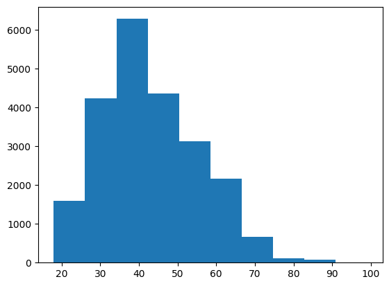
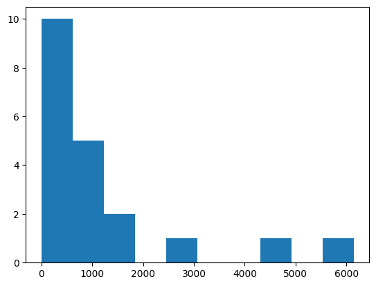
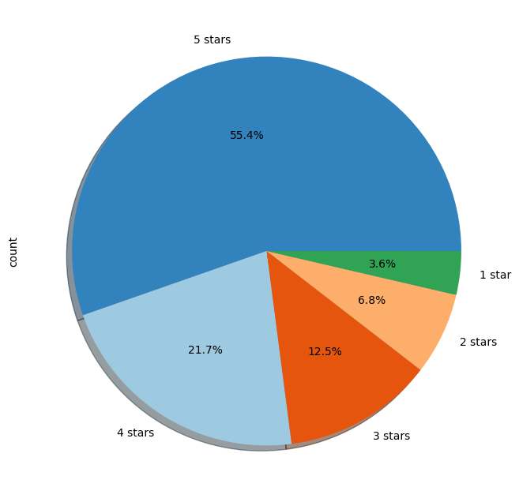

# Natural Language Processing

## Table of Contents
- [Aim](#aim)
- [Prerequisite](#prerequisite)
- [Outcome](#outcome)
- [Theory](#theory)
- [Task to be completed in PART B](#task-to-be-completed-in-part-b)
- [References](#references)

## Aim
### Exploratory data analysis of textual data
- To obtain most frequent words distribution, average chapter length, most frequent phrases (bi, tri and quadgrams), names of characters, places, and events for any two books/novel.
- To interpret findings through word-clouds, bar plots and histograms.
- To perform EDA on some available textual dataset.

## Prerequisite
- Python

## Outcome
After successful completion of this experiment, students will be able to:
1. Explore, analyse and interpret the textual data.
2. Establish a precursor for sentiment analysis.

## Theory
### Exploratory Data Analysis of Textual Data
Exploratory Data Analysis (EDA) is the process of exploring data, generating insights, testing hypotheses, checking assumptions, and revealing underlying hidden patterns in the data. Textual data requires similar EDA techniques where we can describe the data using summary statistics, plot charts like histograms and heatmaps, calculate term frequencies, extract n-grams (bi, tri, and quadgrams), and visualize them using word-clouds, bar plots, and histograms. 

### Performing EDA
To perform EDA on textual data, we can use libraries like pandas for data description, seaborn or plotly for plotting, nltk for extracting n-grams, and matplotlib or plotly for visualizations. Various tasks include obtaining word distributions, average chapter lengths, extracting frequent phrases, and identifying entities like characters, places, and events.

## Task to be completed in PART B
### Task
#### A.5.1. Task
- To access two books or novels and perform the following tasks:
  i. Obtain most frequent words distribution.
  ii. Calculate average chapter length.
  iii. Extract most frequent phrases (bi, tri, and quadgrams), names of characters, and places.
- To select a dataset from real-world examples (e.g., reviews of firms/products/books/hotels) and perform the following tasks:
  i. Read the dataset in CSV or Excel format.
  ii. Understand the dataset and formulate a problem statement.
  iii. Perform EDA on the dataset.

For further information and examples, refer to:
- [Kaggle - NLP Time Machine Novel EDA](https://www.kaggle.com/code/alincijov/nlp-time-machine-novel-eda)
- [KDnuggets - Complete Exploratory Data Analysis & Visualization of Text Data](https://www.kdnuggets.com/2019/05/complete-exploratory-data-analysis-visualization-text-data.html)
- [Analytics Vidhya - Beginner's Guide to Exploratory Data Analysis of Text Data](https://www.analyticsvidhya.com/blog/2020/04/beginners-guide-exploratory-data-analysis-text-data/)
- [Kaggle - Complete Guide to EDA on Text Data](https://www.kaggle.com/code/harshsingh2209/complete-guide-to-eda-on-text-data)
- [Regenerative Today - Exploratory Data Analysis of Text Data including Visualization and Sentiment Analysis](https://regenerativetoday.com/exploratory-data-analysis-of-text-data-including-visualization-and-sentiment-analysis/)
- [Jovian - EDA on Books Project](https://jovian.com/beekaysh/eda-on-books-project)

```python
# import libraries used
import numpy as np
import nltk
from nltk.corpus import gutenberg
from nltk.corpus import brown
from urllib import request
from nltk import sent_tokenize, word_tokenize
from nltk.collocations import BigramCollocationFinder
from nltk.metrics import BigramAssocMeasures
from nltk.corpus import stopwords
from nltk.corpus import webtext
from bs4 import BeautifulSoup
from bs4 import BeautifulSoup
import requests
from nltk.text import Text
import matplotlib.pyplot as plt
from wordcloud import WordCloud

from nltk.util import bigrams, trigrams, ngrams
import pandas as pd
import matplotlib.pyplot as plt
import plotly as py
import cufflinks as cf
from plotly.offline import iplot
from sklearn.feature_extraction.text import CountVectorizer
from textblob import TextBlob
import string
from wordcloud import WordCloud

from sklearn.model_selection import train_test_split
from sklearn.naive_bayes import MultinomialNB
```


```python
pip install textblob
```

    Requirement already satisfied: textblob in c:\users\leosr\appdata\local\packages\pythonsoftwarefoundation.python.3.9_qbz5n2kfra8p0\localcache\local-packages\python39\site-packages (0.17.1)
    Requirement already satisfied: nltk>=3.1 in c:\users\leosr\appdata\local\packages\pythonsoftwarefoundation.python.3.9_qbz5n2kfra8p0\localcache\local-packages\python39\site-packages (from textblob) (3.8.1)
    Requirement already satisfied: regex>=2021.8.3 in c:\users\leosr\appdata\local\packages\pythonsoftwarefoundation.python.3.9_qbz5n2kfra8p0\localcache\local-packages\python39\site-packages (from nltk>=3.1->textblob) (2023.6.3)
    Requirement already satisfied: joblib in c:\users\leosr\appdata\local\packages\pythonsoftwarefoundation.python.3.9_qbz5n2kfra8p0\localcache\local-packages\python39\site-packages (from nltk>=3.1->textblob) (1.1.0)
    Requirement already satisfied: tqdm in c:\users\leosr\appdata\local\packages\pythonsoftwarefoundation.python.3.9_qbz5n2kfra8p0\localcache\local-packages\python39\site-packages (from nltk>=3.1->textblob) (4.64.1)
    Requirement already satisfied: click in c:\users\leosr\appdata\local\packages\pythonsoftwarefoundation.python.3.9_qbz5n2kfra8p0\localcache\local-packages\python39\site-packages (from nltk>=3.1->textblob) (8.1.3)
    Requirement already satisfied: colorama in c:\users\leosr\appdata\local\packages\pythonsoftwarefoundation.python.3.9_qbz5n2kfra8p0\localcache\local-packages\python39\site-packages (from click->nltk>=3.1->textblob) (0.4.5)
    Note: you may need to restart the kernel to use updated packages.

    
    [notice] A new release of pip available: 22.2.1 -> 23.2.1
    [notice] To update, run: C:\Users\leosr\AppData\Local\Microsoft\WindowsApps\PythonSoftwareFoundation.Python.3.9_qbz5n2kfra8p0\python.exe -m pip install --upgrade pip

# Tasks
### a. To access two books or novels and perform the following task:
#### i. Obtain most frequent words distribution,
#### ii. Average chapter length
#### iii. Most frequent phrases (bi, tri and quadgrams), names of characters, places

```python
def compareCategories():
    categories = brown.categories()
    for category in categories:
        num_words = len(brown.words(categories=category))
        sents = len(brown.sents(categories=category))
        freq_dist = nltk.FreqDist(brown.words(categories=category))
        
        print("Category:", category)
        print("Total words:", num_words)
        print("Total sentences:", sents)
        print("Most common words:", freq_dist.most_common(10))
        print("-" * 50)
        
compareCategories()
# brown.categories()
```

    Category: adventure
    Total words: 69342
    Total sentences: 4637
    Most common words: [('.', 4057), (',', 3488), ('the', 3370), ('and', 1622), ('a', 1354), ('of', 1322), ('to', 1309), ('``', 998), ("''", 995), ('was', 914)]
    --------------------------------------------------
    Category: belles_lettres
    Total words: 173096
    Total sentences: 7209
    Most common words: [('the', 9726), (',', 9166), ('.', 6397), ('of', 6289), ('and', 4282), ('to', 4084), ('a', 3308), ('in', 3089), ('that', 1896), ('is', 1799)]
    --------------------------------------------------
    Category: editorial
    Total words: 61604
    Total sentences: 2997
    Most common words: [('the', 3508), (',', 2766), ('.', 2481), ('of', 1976), ('to', 1554), ('and', 1302), ('a', 1095), ('in', 1001), ('is', 744), ('that', 578)]
    --------------------------------------------------
    Category: fiction
    Total words: 68488
    Total sentences: 4249
    Most common words: [(',', 3654), ('.', 3639), ('the', 3423), ('and', 1696), ('to', 1489), ('of', 1419), ('a', 1281), ('was', 1082), ('in', 916), ('he', 813)]
    --------------------------------------------------
    Category: government
    Total words: 70117
    Total sentences: 3032
    Most common words: [('the', 4143), (',', 3405), ('of', 3031), ('.', 2493), ('and', 1923), ('to', 1829), ('in', 1319), ('a', 867), ('for', 806), ('is', 649)]
    --------------------------------------------------
    Category: hobbies
    Total words: 82345
    Total sentences: 4193
    Most common words: [('the', 4300), (',', 3849), ('.', 3453), ('of', 2390), ('and', 2144), ('to', 1797), ('a', 1737), ('in', 1427), ('is', 959), ('for', 776)]
    --------------------------------------------------
    Category: humor
    Total words: 21695
    Total sentences: 1053
    Most common words: [(',', 1331), ('the', 930), ('.', 877), ('of', 515), ('and', 512), ('a', 505), ('to', 463), ('``', 343), ("''", 340), ('in', 334)]
    --------------------------------------------------
    Category: learned
    Total words: 181888
    Total sentences: 7734
    Most common words: [('the', 11079), (',', 8242), ('of', 7418), ('.', 6773), ('and', 4237), ('to', 3882), ('in', 3644), ('a', 3215), ('is', 2403), ('that', 1695)]
    --------------------------------------------------
    Category: lore
    Total words: 110299
    Total sentences: 4881
    Most common words: [('the', 6328), (',', 5519), ('.', 4367), ('of', 3668), ('and', 2758), ('to', 2530), ('a', 2304), ('in', 2001), ('is', 1007), ('that', 984)]
    --------------------------------------------------
    Category: mystery
    Total words: 57169
    Total sentences: 3886
    Most common words: [('.', 3326), (',', 2805), ('the', 2573), ('to', 1284), ('and', 1215), ('a', 1136), ('of', 903), ('was', 820), ('``', 740), ("''", 738)]
    --------------------------------------------------
    Category: news
    Total words: 100554
    Total sentences: 4623
    Most common words: [('the', 5580), (',', 5188), ('.', 4030), ('of', 2849), ('and', 2146), ('to', 2116), ('a', 1993), ('in', 1893), ('for', 943), ('The', 806)]
    --------------------------------------------------
    Category: religion
    Total words: 39399
    Total sentences: 1716
    Most common words: [('the', 2295), (',', 1913), ('of', 1494), ('.', 1382), ('and', 921), ('to', 882), ('in', 724), ('a', 655), ('is', 533), ('that', 475)]
    --------------------------------------------------
    Category: reviews
    Total words: 40704
    Total sentences: 1751
    Most common words: [(',', 2318), ('the', 2048), ('.', 1549), ('of', 1299), ('and', 1103), ('a', 874), ('to', 706), ('in', 656), ('is', 513), ('``', 390)]
    --------------------------------------------------
    Category: romance
    Total words: 70022
    Total sentences: 4431
    Most common words: [(',', 3899), ('.', 3736), ('the', 2758), ('and', 1776), ('to', 1502), ('a', 1335), ('of', 1186), ('``', 1045), ("''", 1044), ('was', 993)]
    --------------------------------------------------
    Category: science_fiction
    Total words: 14470
    Total sentences: 948
    Most common words: [(',', 791), ('.', 786), ('the', 652), ('of', 321), ('to', 305), ('and', 278), ('``', 235), ("''", 235), ('a', 222), ('was', 198)]
    --------------------------------------------------

```python
nltk.download('words')
```

    [nltk_data] Downloading package words to
    [nltk_data]     C:\Users\leosr\AppData\Roaming\nltk_data...
    [nltk_data]   Package words is already up-to-date!

    True

```python
url = "http://www.gutenberg.org/files/2554/2554-0.txt"
response = request.urlopen(url)
raw = response.read().decode('utf8')
```

```python
def book_analysis(text):
    words = nltk.word_tokenize(text)
    sentences = nltk.sent_tokenize(text)
    chapters = text.split('\n\n')  # Split chapters based on double line breaks since that's the format that is usually followed.
    
    # Word frequency distribution
    freq_dist = nltk.FreqDist(words)
    most_common_words = freq_dist.most_common(10)
    
    # Average chapter length
    avg_chapter_length = sum(len(nltk.word_tokenize(chapter)) for chapter in chapters) / len(chapters)
    
    # Most frequent phrases (bi, tri, and quadgrams)
    bi_grams = list(ngrams(words, 2))
    tri_grams = list(ngrams(words, 3))
    quad_grams = list(ngrams(words, 4))
    most_common_bi_grams = nltk.FreqDist(bi_grams).most_common(10)
    most_common_tri_grams = nltk.FreqDist(tri_grams).most_common(10)
    most_common_quad_grams = nltk.FreqDist(quad_grams).most_common(10)
    
    # Find names of characters and places (using named entity recognition)
    sentences = nltk.sent_tokenize(text)
    named_entities = []
    for sent in sentences:
        words = nltk.word_tokenize(sent)
        tagged_words = nltk.pos_tag(words)
        named_entities.extend(nltk.ne_chunk(tagged_words))
    
    # Print the analysis results
    print("\n\nMost common words:", most_common_words)
    print("-" * 50)
    print("\n\nAverage chapter length:", avg_chapter_length)
    print("-" * 50)
    print("\n\nMost common bigrams:", most_common_bi_grams)
    print("-" * 50)
    print("\n\nMost common trigrams:", most_common_tri_grams)
    print("-" * 50)
    print("\n\nMost common quadgrams:", most_common_quad_grams)
    print("-" * 50)
    print("\n\nNamed entities:", named_entities)
    print("-" * 50)
```

```python
print(f"Analysis of Book:")
book_analysis(raw[1000:20000])
```

    Analysis of Book:
    
    
    Most common words: [(',', 241), ('the', 167), ('.', 139), ('and', 114), ('of', 99), ('a', 99), ('to', 84), ('in', 80), ('was', 70), ('he', 68)]
    --------------------------------------------------
    
    
    Average chapter length: 3967.0
    --------------------------------------------------
    
    
    Most common bigrams: [((',', 'and'), 38), (('’', 's'), 27), (('in', 'the'), 21), (('of', 'the'), 21), (('.', 'He'), 21), (('.', '“'), 21), (('.', 'The'), 20), ((',', '”'), 16), (('young', 'man'), 16), (('on', 'the'), 15)]
    --------------------------------------------------
    
    
    Most common trigrams: [(('.', 'He', 'was'), 9), (('the', 'young', 'man'), 9), (('the', 'old', 'woman'), 9), (('.', 'He', 'had'), 6), ((',', '”', 'he'), 6), (('The', 'young', 'man'), 6), (('.', '“', 'I'), 5), (('.', 'The', 'young'), 5), (('The', 'old', 'woman'), 5), (('man', '’', 's'), 4)]
    --------------------------------------------------
    
    
    Most common quadgrams: [(('.', 'The', 'young', 'man'), 5), (('.', 'The', 'old', 'woman'), 4), ((',', '”', 'he', 'thought'), 3), (('the', 'young', 'man', '’'), 3), (('young', 'man', '’', 's'), 3), (('to', 'be', 'seen', 'in'), 3), (('be', 'seen', 'in', 'the'), 3), ((',', 'in', 'spite', 'of'), 3), (('.', 'It', 'was', 'a'), 3), (('the', 'old', 'woman', '’'), 3)]
    --------------------------------------------------
    
    
    Named entities: [('CE', 'NNP'), ('A', 'NNP'), ('few', 'JJ'), ('words', 'NNS'), ('about', 'IN'), Tree('PERSON', [('Dostoevsky', 'NNP')]), ('himself', 'PRP'), ('may', 'MD'), ('help', 'VB'), ('the', 'DT'), Tree('GPE', [('English', 'JJ')]), ('reader', 'NN'), ('to', 'TO'), ('understand', 'VB'), ('his', 'PRP$'), ('work', 'NN'), ('.', '.'), Tree('PERSON', [('Dostoevsky', 'NNP')]), ('was', 'VBD'), ('the', 'DT'), ('son', 'NN'), ('of', 'IN'), ('a', 'DT'), ('doctor', 'NN'), ('.', '.'), ('His', 'PRP$'), ('parents', 'NNS'), ('were', 'VBD'), ('very', 'RB'), ('hard-working', 'JJ'), ('and', 'CC'), ('deeply', 'RB'), ('religious', 'JJ'), ('people', 'NNS'), (',', ','), ('but', 'CC'), ('so', 'RB'), ('poor', 'JJ'), ('that', 'IN'), ('they', 'PRP'), ('lived', 'VBD'), ('with', 'IN'), ('their', 'PRP$'), ('five', 'CD'), ('children', 'NNS'), ('in', 'IN'), ('only', 'RB'), ('two', 'CD'), ('rooms', 'NNS'), ('.', '.'), ('The', 'DT'), ('father', 'NN'), ('and', 'CC'), ('mother', 'NN'), ('spent', 'VBN'), ('their', 'PRP$'), ('evenings', 'NNS'), ('in', 'IN'), ('reading', 'VBG'), ('aloud', 'NN'), ('to', 'TO'), ('their', 'PRP$'), ('children', 'NNS'), (',', ','), ('generally', 'RB'), ('from', 'IN'), ('books', 'NNS'), ('of', 'IN'), ('a', 'DT'), ('serious', 'JJ'), ('character', 'NN'), ('.', '.'), ('Though', 'NNP'), ('always', 'RB'), ('sickly', 'RB'), ('and', 'CC'), ('delicate', 'VB'), Tree('PERSON', [('Dostoevsky', 'NNP')]), ('came', 'VBD'), ('out', 'RP'), ('third', 'JJ'), ('in', 'IN'), ('the', 'DT'), ('final', 'JJ'), ('examination', 'NN'), ('of', 'IN'), ('the', 'DT'), Tree('ORGANIZATION', [('Petersburg', 'NNP')]), ('school', 'NN'), ('of', 'IN'), Tree('GPE', [('Engineering', 'NNP')]), ('.', '.'), ('There', 'EX'), ('he', 'PRP'), ('had', 'VBD'), ('already', 'RB'), ('begun', 'VBN'), ('his', 'PRP$'), ('first', 'JJ'), ('work', 'NN'), (',', ','), ('“', 'JJ'), Tree('PERSON', [('Poor', 'NNP')]), ('Folk.', 'NNP'), ('”', 'NNP'), ('This', 'DT'), ('story', 'NN'), ('was', 'VBD'), ('published', 'VBN'), ('by', 'IN'), ('the', 'DT'), ('poet', 'NN'), Tree('PERSON', [('Nekrassov', 'NNP')]), ('in', 'IN'), ('his', 'PRP$'), ('review', 'NN'), ('and', 'CC'), ('was', 'VBD'), ('received', 'VBN'), ('with', 'IN'), ('acclamations', 'NNS'), ('.', '.'), ('The', 'DT'), ('shy', 'NN'), (',', ','), ('unknown', 'JJ'), ('youth', 'NN'), ('found', 'VBD'), ('himself', 'PRP'), ('instantly', 'RB'), ('something', 'NN'), ('of', 'IN'), ('a', 'DT'), ('celebrity', 'NN'), ('.', '.'), ('A', 'DT'), ('brilliant', 'NN'), ('and', 'CC'), ('successful', 'JJ'), ('career', 'NN'), ('seemed', 'VBD'), ('to', 'TO'), ('open', 'VB'), ('before', 'IN'), ('him', 'PRP'), (',', ','), ('but', 'CC'), ('those', 'DT'), ('hopes', 'NNS'), ('were', 'VBD'), ('soon', 'RB'), ('dashed', 'VBN'), ('.', '.'), ('In', 'IN'), ('1849', 'CD'), ('he', 'PRP'), ('was', 'VBD'), ('arrested', 'VBN'), ('.', '.'), ('Though', 'IN'), ('neither', 'RB'), ('by', 'IN'), ('temperament', 'JJ'), ('nor', 'CC'), ('conviction', 'NN'), ('a', 'DT'), ('revolutionist', 'NN'), (',', ','), Tree('PERSON', [('Dostoevsky', 'NNP')]), ('was', 'VBD'), ('one', 'CD'), ('of', 'IN'), ('a', 'DT'), ('little', 'JJ'), ('group', 'NN'), ('of', 'IN'), ('young', 'JJ'), ('men', 'NNS'), ('who', 'WP'), ('met', 'VBD'), ('together', 'RB'), ('to', 'TO'), ('read', 'VB'), Tree('PERSON', [('Fourier', 'NNP')]), ('and', 'CC'), Tree('PERSON', [('Proudhon', 'NNP')]), ('.', '.'), ('He', 'PRP'), ('was', 'VBD'), ('accused', 'VBN'), ('of', 'IN'), ('“', 'NNP'), ('taking', 'VBG'), ('part', 'NN'), ('in', 'IN'), ('conversations', 'NNS'), ('against', 'IN'), ('the', 'DT'), ('censorship', 'NN'), (',', ','), ('of', 'IN'), ('reading', 'VBG'), ('a', 'DT'), ('letter', 'NN'), ('from', 'IN'), Tree('GPE', [('Byelinsky', 'NNP')]), ('to', 'TO'), Tree('GPE', [('Gogol', 'NNP')]), (',', ','), ('and', 'CC'), ('of', 'IN'), ('knowing', 'NN'), ('of', 'IN'), ('the', 'DT'), ('intention', 'NN'), ('to', 'TO'), ('set', 'VB'), ('up', 'RP'), ('a', 'DT'), ('printing', 'NN'), ('press.', 'NN'), ('”', 'NN'), ('Under', 'IN'), Tree('PERSON', [('Nicholas', 'NNP')]), ('I', 'PRP'), ('.', '.'), ('(', '('), ('that', 'IN'), ('“', 'NNP'), ('stern', 'JJ'), ('and', 'CC'), ('just', 'RB'), ('man', 'NN'), (',', ','), ('”', 'CC'), ('as', 'IN'), Tree('ORGANIZATION', [('Maurice', 'NNP'), ('Baring', 'NNP')]), ('calls', 'VBZ'), ('him', 'PRP'), (')', ')'), ('this', 'DT'), ('was', 'VBD'), ('enough', 'JJ'), (',', ','), ('and', 'CC'), ('he', 'PRP'), ('was', 'VBD'), ('condemned', 'VBN'), ('to', 'TO'), ('death', 'NN'), ('.', '.'), ('After', 'IN'), ('eight', 'CD'), ('months', 'NNS'), ('’', 'JJ'), ('imprisonment', 'NN'), ('he', 'PRP'), ('was', 'VBD'), ('with', 'IN'), ('twenty-one', 'JJ'), ('others', 'NNS'), ('taken', 'VBN'), ('out', 'RP'), ('to', 'TO'), ('the', 'DT'), Tree('FACILITY', [('Semyonovsky', 'NNP'), ('Square', 'NNP')]), ('to', 'TO'), ('be', 'VB'), ('shot', 'VBN'), ('.', '.'), ('Writing', 'VBG'), ('to', 'TO'), ('his', 'PRP$'), ('brother', 'NN'), Tree('PERSON', [('Mihail', 'NNP')]), (',', ','), Tree('PERSON', [('Dostoevsky', 'NNP')]), ('says', 'VBZ'), (':', ':'), ('“', 'NN'), ('They', 'PRP'), ('snapped', 'VBD'), ('words', 'NNS'), ('over', 'IN'), ('our', 'PRP$'), ('heads', 'NNS'), (',', ','), ('and', 'CC'), ('they', 'PRP'), ('made', 'VBD'), ('us', 'PRP'), ('put', 'VB'), ('on', 'IN'), ('the', 'DT'), ('white', 'JJ'), ('shirts', 'NNS'), ('worn', 'VBN'), ('by', 'IN'), ('persons', 'NNS'), ('condemned', 'VBN'), ('to', 'TO'), ('death', 'NN'), ('.', '.'), ('Thereupon', 'IN'), ('we', 'PRP'), ('were', 'VBD'), ('bound', 'VBN'), ('in', 'IN'), ('threes', 'NNS'), ('to', 'TO'), ('stakes', 'NNS'), (',', ','), ('to', 'TO'), ('suffer', 'VB'), ('execution', 'NN'), ('.', '.'), ('Being', 'VBG'), ('the', 'DT'), ('third', 'NN'), ('in', 'IN'), ('the', 'DT'), ('row', 'NN'), (',', ','), ('I', 'PRP'), ('concluded', 'VBD'), ('I', 'PRP'), ('had', 'VBD'), ('only', 'RB'), ('a', 'DT'), ('few', 'JJ'), ('minutes', 'NNS'), ('of', 'IN'), ('life', 'NN'), ('before', 'IN'), ('me', 'PRP'), ('.', '.'), ('I', 'PRP'), ('thought', 'VBD'), ('of', 'IN'), ('you', 'PRP'), ('and', 'CC'), ('your', 'PRP$'), ('dear', 'JJ'), ('ones', 'NNS'), ('and', 'CC'), ('I', 'PRP'), ('contrived', 'VBD'), ('to', 'TO'), ('kiss', 'VB'), Tree('PERSON', [('Plestcheiev', 'NNP')]), ('and', 'CC'), Tree('PERSON', [('Dourov', 'NNP')]), (',', ','), ('who', 'WP'), ('were', 'VBD'), ('next', 'JJ'), ('to', 'TO'), ('me', 'PRP'), (',', ','), ('and', 'CC'), ('to', 'TO'), ('bid', 'VB'), ('them', 'PRP'), ('farewell', 'RB'), ('.', '.'), ('Suddenly', 'RB'), ('the', 'DT'), ('troops', 'NNS'), ('beat', 'VBP'), ('a', 'DT'), ('tattoo', 'NN'), (',', ','), ('we', 'PRP'), ('were', 'VBD'), ('unbound', 'JJ'), (',', ','), ('brought', 'VBD'), ('back', 'RP'), ('upon', 'IN'), ('the', 'DT'), ('scaffold', 'NN'), (',', ','), ('and', 'CC'), ('informed', 'VBD'), ('that', 'IN'), ('his', 'PRP$'), Tree('PERSON', [('Majesty', 'NNP')]), ('had', 'VBD'), ('spared', 'VBN'), ('us', 'PRP'), ('our', 'PRP$'), ('lives.', 'NN'), ('”', 'VBZ'), ('The', 'DT'), ('sentence', 'NN'), ('was', 'VBD'), ('commuted', 'VBN'), ('to', 'TO'), ('hard', 'VB'), ('labour', 'NN'), ('.', '.'), ('One', 'CD'), ('of', 'IN'), ('the', 'DT'), ('prisoners', 'NNS'), (',', ','), Tree('PERSON', [('Grigoryev', 'NNP')]), (',', ','), ('went', 'VBD'), ('mad', 'JJ'), ('as', 'RB'), ('soon', 'RB'), ('as', 'IN'), ('he', 'PRP'), ('was', 'VBD'), ('untied', 'JJ'), (',', ','), ('and', 'CC'), ('never', 'RB'), ('regained', 'VBD'), ('his', 'PRP$'), ('sanity', 'NN'), ('.', '.'), ('The', 'DT'), ('intense', 'JJ'), ('suffering', 'NN'), ('of', 'IN'), ('this', 'DT'), ('experience', 'NN'), ('left', 'VBD'), ('a', 'DT'), ('lasting', 'JJ'), ('stamp', 'NN'), ('on', 'IN'), Tree('PERSON', [('Dostoevsky', 'NNP')]), ('’', 'NNP'), ('s', 'NN'), ('mind', 'NN'), ('.', '.'), ('Though', 'IN'), ('his', 'PRP$'), ('religious', 'JJ'), ('temper', 'NN'), ('led', 'VBD'), ('him', 'PRP'), ('in', 'IN'), ('the', 'DT'), ('end', 'NN'), ('to', 'TO'), ('accept', 'VB'), ('every', 'DT'), ('suffering', 'NN'), ('with', 'IN'), ('resignation', 'NN'), ('and', 'CC'), ('to', 'TO'), ('regard', 'VB'), ('it', 'PRP'), ('as', 'IN'), ('a', 'DT'), ('blessing', 'NN'), ('in', 'IN'), ('his', 'PRP$'), ('own', 'JJ'), ('case', 'NN'), (',', ','), ('he', 'PRP'), ('constantly', 'RB'), ('recurs', 'VBZ'), ('to', 'TO'), ('the', 'DT'), ('subject', 'NN'), ('in', 'IN'), ('his', 'PRP$'), ('writings', 'NNS'), ('.', '.'), ('He', 'PRP'), ('describes', 'VBZ'), ('the', 'DT'), ('awful', 'JJ'), ('agony', 'NN'), ('of', 'IN'), ('the', 'DT'), ('condemned', 'JJ'), ('man', 'NN'), ('and', 'CC'), ('insists', 'VBZ'), ('on', 'IN'), ('the', 'DT'), ('cruelty', 'NN'), ('of', 'IN'), ('inflicting', 'VBG'), ('such', 'JJ'), ('torture', 'NN'), ('.', '.'), ('Then', 'RB'), ('followed', 'VBD'), ('four', 'CD'), ('years', 'NNS'), ('of', 'IN'), ('penal', 'JJ'), ('servitude', 'NN'), (',', ','), ('spent', 'VBN'), ('in', 'IN'), ('the', 'DT'), ('company', 'NN'), ('of', 'IN'), ('common', 'JJ'), ('criminals', 'NNS'), ('in', 'IN'), Tree('GPE', [('Siberia', 'NNP')]), (',', ','), ('where', 'WRB'), ('he', 'PRP'), ('began', 'VBD'), ('the', 'DT'), ('“', 'NNP'), ('Dead', 'NNP'), Tree('ORGANIZATION', [('House', 'NNP')]), (',', ','), ('”', 'NNP'), ('and', 'CC'), ('some', 'DT'), ('years', 'NNS'), ('of', 'IN'), ('service', 'NN'), ('in', 'IN'), ('a', 'DT'), ('disciplinary', 'JJ'), ('battalion', 'NN'), ('.', '.'), ('He', 'PRP'), ('had', 'VBD'), ('shown', 'VBN'), ('signs', 'NNS'), ('of', 'IN'), ('some', 'DT'), ('obscure', 'JJ'), ('nervous', 'JJ'), ('disease', 'NN'), ('before', 'IN'), ('his', 'PRP$'), ('arrest', 'NN'), ('and', 'CC'), ('this', 'DT'), ('now', 'RB'), ('developed', 'VBN'), ('into', 'IN'), ('violent', 'JJ'), ('attacks', 'NNS'), ('of', 'IN'), ('epilepsy', 'NN'), (',', ','), ('from', 'IN'), ('which', 'WDT'), ('he', 'PRP'), ('suffered', 'VBD'), ('for', 'IN'), ('the', 'DT'), ('rest', 'NN'), ('of', 'IN'), ('his', 'PRP$'), ('life', 'NN'), ('.', '.'), ('The', 'DT'), ('fits', 'NNS'), ('occurred', 'VBD'), ('three', 'CD'), ('or', 'CC'), ('four', 'CD'), ('times', 'NNS'), ('a', 'DT'), ('year', 'NN'), ('and', 'CC'), ('were', 'VBD'), ('more', 'JJR'), ('frequent', 'JJ'), ('in', 'IN'), ('periods', 'NNS'), ('of', 'IN'), ('great', 'JJ'), ('strain', 'NN'), ('.', '.'), ('In', 'IN'), ('1859', 'CD'), ('he', 'PRP'), ('was', 'VBD'), ('allowed', 'VBN'), ('to', 'TO'), ('return', 'VB'), ('to', 'TO'), Tree('GPE', [('Russia', 'NNP')]), ('.', '.'), ('He', 'PRP'), ('started', 'VBD'), ('a', 'DT'), ('journal', 'NN'), ('--', ':'), ('“', 'JJ'), Tree('GPE', [('Vremya', 'NNP')]), (',', ','), ('”', 'NNP'), ('which', 'WDT'), ('was', 'VBD'), ('forbidden', 'VBN'), ('by', 'IN'), ('the', 'DT'), Tree('ORGANIZATION', [('Censorship', 'NNP')]), ('through', 'IN'), ('a', 'DT'), ('misunderstanding', 'NN'), ('.', '.'), ('In', 'IN'), ('1864', 'CD'), ('he', 'PRP'), ('lost', 'VBD'), ('his', 'PRP$'), ('first', 'JJ'), ('wife', 'NN'), ('and', 'CC'), ('his', 'PRP$'), ('brother', 'NN'), Tree('PERSON', [('Mihail', 'NNP')]), ('.', '.'), ('He', 'PRP'), ('was', 'VBD'), ('in', 'IN'), ('terrible', 'JJ'), ('poverty', 'NN'), (',', ','), ('yet', 'CC'), ('he', 'PRP'), ('took', 'VBD'), ('upon', 'RP'), ('himself', 'PRP'), ('the', 'DT'), ('payment', 'NN'), ('of', 'IN'), ('his', 'PRP$'), ('brother', 'NN'), ('’', 'NNP'), ('s', 'NN'), ('debts', 'NNS'), ('.', '.'), ('He', 'PRP'), ('started', 'VBD'), ('another', 'DT'), ('journal', 'NN'), ('--', ':'), ('“', 'VB'), ('The', 'DT'), Tree('GPE', [('Epoch', 'NNP')]), (',', ','), ('”', 'NNP'), ('which', 'WDT'), ('within', 'IN'), ('a', 'DT'), ('few', 'JJ'), ('months', 'NNS'), ('was', 'VBD'), ('also', 'RB'), ('prohibited', 'VBN'), ('.', '.'), ('He', 'PRP'), ('was', 'VBD'), ('weighed', 'VBN'), ('down', 'RP'), ('by', 'IN'), ('debt', 'NN'), (',', ','), ('his', 'PRP$'), ('brother', 'NN'), ('’', 'NNP'), ('s', 'VBD'), ('family', 'NN'), ('was', 'VBD'), ('dependent', 'JJ'), ('on', 'IN'), ('him', 'PRP'), (',', ','), ('he', 'PRP'), ('was', 'VBD'), ('forced', 'VBN'), ('to', 'TO'), ('write', 'VB'), ('at', 'IN'), ('heart-breaking', 'JJ'), ('speed', 'NN'), (',', ','), ('and', 'CC'), ('is', 'VBZ'), ('said', 'VBD'), ('never', 'RB'), ('to', 'TO'), ('have', 'VB'), ('corrected', 'VBN'), ('his', 'PRP$'), ('work', 'NN'), ('.', '.'), ('The', 'DT'), ('later', 'JJ'), ('years', 'NNS'), ('of', 'IN'), ('his', 'PRP$'), ('life', 'NN'), ('were', 'VBD'), ('much', 'RB'), ('softened', 'VBN'), ('by', 'IN'), ('the', 'DT'), ('tenderness', 'NN'), ('and', 'CC'), ('devotion', 'NN'), ('of', 'IN'), ('his', 'PRP$'), ('second', 'JJ'), ('wife', 'NN'), ('.', '.'), ('In', 'IN'), ('June', 'NNP'), ('1880', 'CD'), ('he', 'PRP'), ('made', 'VBD'), ('his', 'PRP$'), ('famous', 'JJ'), ('speech', 'NN'), ('at', 'IN'), ('the', 'DT'), ('unveiling', 'NN'), ('of', 'IN'), ('the', 'DT'), ('monument', 'NN'), ('to', 'TO'), Tree('GPE', [('Pushkin', 'NNP')]), ('in', 'IN'), Tree('GPE', [('Moscow', 'NNP')]), ('and', 'CC'), ('he', 'PRP'), ('was', 'VBD'), ('received', 'VBN'), ('with', 'IN'), ('extraordinary', 'JJ'), ('demonstrations', 'NNS'), ('of', 'IN'), ('love', 'NN'), ('and', 'CC'), ('honour', 'NN'), ('.', '.'), ('A', 'DT'), ('few', 'JJ'), ('months', 'NNS'), ('later', 'RB'), Tree('PERSON', [('Dostoevsky', 'NNP')]), ('died', 'VBD'), ('.', '.'), ('He', 'PRP'), ('was', 'VBD'), ('followed', 'VBN'), ('to', 'TO'), ('the', 'DT'), ('grave', 'NN'), ('by', 'IN'), ('a', 'DT'), ('vast', 'JJ'), ('multitude', 'NN'), ('of', 'IN'), ('mourners', 'NNS'), (',', ','), ('who', 'WP'), ('“', 'VBP'), ('gave', 'VBD'), ('the', 'DT'), ('hapless', 'NN'), ('man', 'NN'), ('the', 'DT'), ('funeral', 'NN'), ('of', 'IN'), ('a', 'DT'), ('king.', 'NN'), ('”', 'NN'), ('He', 'PRP'), ('is', 'VBZ'), ('still', 'RB'), ('probably', 'RB'), ('the', 'DT'), ('most', 'RBS'), ('widely', 'RB'), ('read', 'JJ'), ('writer', 'NN'), ('in', 'IN'), Tree('GPE', [('Russia', 'NNP')]), ('.', '.'), ('In', 'IN'), ('the', 'DT'), ('words', 'NNS'), ('of', 'IN'), ('a', 'DT'), Tree('GPE', [('Russian', 'JJ')]), ('critic', 'NN'), (',', ','), ('who', 'WP'), ('seeks', 'VBZ'), ('to', 'TO'), ('explain', 'VB'), ('the', 'DT'), ('feeling', 'NN'), ('inspired', 'VBN'), ('by', 'IN'), Tree('PERSON', [('Dostoevsky', 'NNP')]), (':', ':'), ('“', 'NN'), ('He', 'PRP'), ('was', 'VBD'), ('one', 'CD'), ('of', 'IN'), ('ourselves', 'PRP'), (',', ','), ('a', 'DT'), ('man', 'NN'), ('of', 'IN'), ('our', 'PRP$'), ('blood', 'NN'), ('and', 'CC'), ('our', 'PRP$'), ('bone', 'NN'), (',', ','), ('but', 'CC'), ('one', 'CD'), ('who', 'WP'), ('has', 'VBZ'), ('suffered', 'VBN'), ('and', 'CC'), ('has', 'VBZ'), ('seen', 'VBN'), ('so', 'RB'), ('much', 'RB'), ('more', 'JJR'), ('deeply', 'RB'), ('than', 'IN'), ('we', 'PRP'), ('have', 'VBP'), ('his', 'PRP$'), ('insight', 'NN'), ('impresses', 'VBZ'), ('us', 'PRP'), ('as', 'IN'), ('wisdom', 'NN'), ('...', ':'), ('that', 'IN'), ('wisdom', 'NN'), ('of', 'IN'), ('the', 'DT'), ('heart', 'NN'), ('which', 'WDT'), ('we', 'PRP'), ('seek', 'VBP'), ('that', 'IN'), ('we', 'PRP'), ('may', 'MD'), ('learn', 'VB'), ('from', 'IN'), ('it', 'PRP'), ('how', 'WRB'), ('to', 'TO'), ('live', 'VB'), ('.', '.'), ('All', 'PDT'), ('his', 'PRP$'), ('other', 'JJ'), ('gifts', 'NNS'), ('came', 'VBD'), ('to', 'TO'), ('him', 'PRP'), ('from', 'IN'), ('nature', 'NN'), (',', ','), ('this', 'DT'), ('he', 'PRP'), ('won', 'VBD'), ('for', 'IN'), ('himself', 'PRP'), ('and', 'CC'), ('through', 'IN'), ('it', 'PRP'), ('he', 'PRP'), ('became', 'VBD'), ('great.', 'JJ'), ('”', 'NNP'), ('CRIME', 'NNP'), ('AND', 'NNP'), Tree('ORGANIZATION', [('PUNISHMENT', 'NNP')]), ('PART', 'NNP'), ('I', 'PRP'), ('CHAPTER', 'VBP'), ('I', 'PRP'), ('On', 'IN'), ('an', 'DT'), ('exceptionally', 'RB'), ('hot', 'JJ'), ('evening', 'VBG'), ('early', 'JJ'), ('in', 'IN'), ('July', 'NNP'), ('a', 'DT'), ('young', 'JJ'), ('man', 'NN'), ('came', 'VBD'), ('out', 'IN'), ('of', 'IN'), ('the', 'DT'), ('garret', 'NN'), ('in', 'IN'), ('which', 'WDT'), ('he', 'PRP'), ('lodged', 'VBD'), ('in', 'IN'), ('S.', 'NNP'), ('Place', 'NNP'), ('and', 'CC'), ('walked', 'VBD'), ('slowly', 'RB'), (',', ','), ('as', 'IN'), ('though', 'IN'), ('in', 'IN'), ('hesitation', 'NN'), (',', ','), ('towards', 'NNS'), ('K.', 'NNP'), ('bridge', 'NN'), ('.', '.'), ('He', 'PRP'), ('had', 'VBD'), ('successfully', 'RB'), ('avoided', 'VBN'), ('meeting', 'VBG'), ('his', 'PRP$'), ('landlady', 'NN'), ('on', 'IN'), ('the', 'DT'), ('staircase', 'NN'), ('.', '.'), ('His', 'PRP$'), ('garret', 'NN'), ('was', 'VBD'), ('under', 'IN'), ('the', 'DT'), ('roof', 'NN'), ('of', 'IN'), ('a', 'DT'), ('high', 'JJ'), (',', ','), ('five-storied', 'JJ'), ('house', 'NN'), ('and', 'CC'), ('was', 'VBD'), ('more', 'RBR'), ('like', 'IN'), ('a', 'DT'), ('cupboard', 'NN'), ('than', 'IN'), ('a', 'DT'), ('room', 'NN'), ('.', '.'), ('The', 'DT'), ('landlady', 'NN'), ('who', 'WP'), ('provided', 'VBD'), ('him', 'PRP'), ('with', 'IN'), ('garret', 'NN'), (',', ','), ('dinners', 'NNS'), (',', ','), ('and', 'CC'), ('attendance', 'NN'), (',', ','), ('lived', 'VBD'), ('on', 'IN'), ('the', 'DT'), ('floor', 'NN'), ('below', 'IN'), (',', ','), ('and', 'CC'), ('every', 'DT'), ('time', 'NN'), ('he', 'PRP'), ('went', 'VBD'), ('out', 'IN'), ('he', 'PRP'), ('was', 'VBD'), ('obliged', 'VBN'), ('to', 'TO'), ('pass', 'VB'), ('her', 'PRP$'), ('kitchen', 'NN'), (',', ','), ('the', 'DT'), ('door', 'NN'), ('of', 'IN'), ('which', 'WDT'), ('invariably', 'RB'), ('stood', 'VBD'), ('open', 'JJ'), ('.', '.'), ('And', 'CC'), ('each', 'DT'), ('time', 'NN'), ('he', 'PRP'), ('passed', 'VBD'), (',', ','), ('the', 'DT'), ('young', 'JJ'), ('man', 'NN'), ('had', 'VBD'), ('a', 'DT'), ('sick', 'JJ'), (',', ','), ('frightened', 'VBD'), ('feeling', 'NN'), (',', ','), ('which', 'WDT'), ('made', 'VBD'), ('him', 'PRP'), ('scowl', 'NN'), ('and', 'CC'), ('feel', 'NN'), ('ashamed', 'NNS'), ('.', '.'), ('He', 'PRP'), ('was', 'VBD'), ('hopelessly', 'RB'), ('in', 'IN'), ('debt', 'NN'), ('to', 'TO'), ('his', 'PRP$'), ('landlady', 'NN'), (',', ','), ('and', 'CC'), ('was', 'VBD'), ('afraid', 'VBN'), ('of', 'IN'), ('meeting', 'VBG'), ('her', 'PRP$'), ('.', '.'), ('This', 'DT'), ('was', 'VBD'), ('not', 'RB'), ('because', 'IN'), ('he', 'PRP'), ('was', 'VBD'), ('cowardly', 'RB'), ('and', 'CC'), ('abject', 'VB'), (',', ','), ('quite', 'PDT'), ('the', 'DT'), ('contrary', 'JJ'), (';', ':'), ('but', 'CC'), ('for', 'IN'), ('some', 'DT'), ('time', 'NN'), ('past', 'IN'), ('he', 'PRP'), ('had', 'VBD'), ('been', 'VBN'), ('in', 'IN'), ('an', 'DT'), ('overstrained', 'JJ'), ('irritable', 'JJ'), ('condition', 'NN'), (',', ','), ('verging', 'VBG'), ('on', 'IN'), ('hypochondria', 'NN'), ('.', '.'), ('He', 'PRP'), ('had', 'VBD'), ('become', 'VBN'), ('so', 'RB'), ('completely', 'RB'), ('absorbed', 'VBN'), ('in', 'IN'), ('himself', 'PRP'), (',', ','), ('and', 'CC'), ('isolated', 'VBD'), ('from', 'IN'), ('his', 'PRP$'), ('fellows', 'NNS'), ('that', 'IN'), ('he', 'PRP'), ('dreaded', 'VBD'), ('meeting', 'NN'), (',', ','), ('not', 'RB'), ('only', 'RB'), ('his', 'PRP$'), ('landlady', 'NN'), (',', ','), ('but', 'CC'), ('anyone', 'NN'), ('at', 'IN'), ('all', 'DT'), ('.', '.'), ('He', 'PRP'), ('was', 'VBD'), ('crushed', 'VBN'), ('by', 'IN'), ('poverty', 'NN'), (',', ','), ('but', 'CC'), ('the', 'DT'), ('anxieties', 'NNS'), ('of', 'IN'), ('his', 'PRP$'), ('position', 'NN'), ('had', 'VBD'), ('of', 'IN'), ('late', 'JJ'), ('ceased', 'VBN'), ('to', 'TO'), ('weigh', 'VB'), ('upon', 'IN'), ('him', 'PRP'), ('.', '.'), ('He', 'PRP'), ('had', 'VBD'), ('given', 'VBN'), ('up', 'RP'), ('attending', 'VBG'), ('to', 'TO'), ('matters', 'NNS'), ('of', 'IN'), ('practical', 'JJ'), ('importance', 'NN'), (';', ':'), ('he', 'PRP'), ('had', 'VBD'), ('lost', 'VBN'), ('all', 'DT'), ('desire', 'NN'), ('to', 'TO'), ('do', 'VB'), ('so', 'RB'), ('.', '.'), ('Nothing', 'NN'), ('that', 'IN'), ('any', 'DT'), ('landlady', 'NN'), ('could', 'MD'), ('do', 'VB'), ('had', 'VBD'), ('a', 'DT'), ('real', 'JJ'), ('terror', 'NN'), ('for', 'IN'), ('him', 'PRP'), ('.', '.'), ('But', 'CC'), ('to', 'TO'), ('be', 'VB'), ('stopped', 'VBN'), ('on', 'IN'), ('the', 'DT'), ('stairs', 'NNS'), (',', ','), ('to', 'TO'), ('be', 'VB'), ('forced', 'VBN'), ('to', 'TO'), ('listen', 'VB'), ('to', 'TO'), ('her', 'PRP$'), ('trivial', 'JJ'), (',', ','), ('irrelevant', 'JJ'), ('gossip', 'NN'), (',', ','), ('to', 'TO'), ('pestering', 'VBG'), ('demands', 'NNS'), ('for', 'IN'), ('payment', 'NN'), (',', ','), ('threats', 'NNS'), ('and', 'CC'), ('complaints', 'NNS'), (',', ','), ('and', 'CC'), ('to', 'TO'), ('rack', 'VB'), ('his', 'PRP$'), ('brains', 'NNS'), ('for', 'IN'), ('excuses', 'NNS'), (',', ','), ('to', 'TO'), ('prevaricate', 'VB'), (',', ','), ('to', 'TO'), ('lie', 'VB'), ('--', ':'), ('no', 'DT'), (',', ','), ('rather', 'RB'), ('than', 'IN'), ('that', 'DT'), (',', ','), ('he', 'PRP'), ('would', 'MD'), ('creep', 'VB'), ('down', 'RP'), ('the', 'DT'), ('stairs', 'NNS'), ('like', 'IN'), ('a', 'DT'), ('cat', 'NN'), ('and', 'CC'), ('slip', 'NN'), ('out', 'RP'), ('unseen', 'JJ'), ('.', '.'), ('This', 'DT'), ('evening', 'NN'), (',', ','), ('however', 'RB'), (',', ','), ('on', 'IN'), ('coming', 'VBG'), ('out', 'RP'), ('into', 'IN'), ('the', 'DT'), ('street', 'NN'), (',', ','), ('he', 'PRP'), ('became', 'VBD'), ('acutely', 'RB'), ('aware', 'JJ'), ('of', 'IN'), ('his', 'PRP$'), ('fears', 'NNS'), ('.', '.'), ('“', 'NN'), ('I', 'PRP'), ('want', 'VBP'), ('to', 'TO'), ('attempt', 'VB'), ('a', 'DT'), ('thing', 'NN'), ('_like', 'NN'), ('that_', 'NN'), ('and', 'CC'), ('am', 'VBP'), ('frightened', 'VBN'), ('by', 'IN'), ('these', 'DT'), ('trifles', 'NNS'), (',', ','), ('”', 'IN'), ('he', 'PRP'), ('thought', 'VBD'), (',', ','), ('with', 'IN'), ('an', 'DT'), ('odd', 'JJ'), ('smile', 'NN'), ('.', '.'), ('“', 'NN'), ('Hm', 'NNP'), ('...', ':'), ('yes', 'UH'), (',', ','), ('all', 'DT'), ('is', 'VBZ'), ('in', 'IN'), ('a', 'DT'), ('man', 'NN'), ('’', 'NN'), ('s', 'JJ'), ('hands', 'NNS'), ('and', 'CC'), ('he', 'PRP'), ('lets', 'VBZ'), ('it', 'PRP'), ('all', 'DT'), ('slip', 'NN'), ('from', 'IN'), ('cowardice', 'NN'), (',', ','), ('that', 'IN'), ('’', 'NNP'), ('s', 'VBD'), ('an', 'DT'), ('axiom', 'NN'), ('.', '.'), ('It', 'PRP'), ('would', 'MD'), ('be', 'VB'), ('interesting', 'VBG'), ('to', 'TO'), ('know', 'VB'), ('what', 'WP'), ('it', 'PRP'), ('is', 'VBZ'), ('men', 'NNS'), ('are', 'VBP'), ('most', 'JJS'), ('afraid', 'JJ'), ('of', 'IN'), ('.', '.'), ('Taking', 'VBG'), ('a', 'DT'), ('new', 'JJ'), ('step', 'NN'), (',', ','), ('uttering', 'VBG'), ('a', 'DT'), ('new', 'JJ'), ('word', 'NN'), ('is', 'VBZ'), ('what', 'WP'), ('they', 'PRP'), ('fear', 'VBP'), ('most', 'RBS'), ('....', 'JJ'), ('But', 'CC'), ('I', 'PRP'), ('am', 'VBP'), ('talking', 'VBG'), ('too', 'RB'), ('much', 'JJ'), ('.', '.'), ('It', 'PRP'), ('’', 'VBD'), ('s', 'NN'), ('because', 'IN'), ('I', 'PRP'), ('chatter', 'VBP'), ('that', 'IN'), ('I', 'PRP'), ('do', 'VBP'), ('nothing', 'NN'), ('.', '.'), ('Or', 'CC'), ('perhaps', 'RB'), ('it', 'PRP'), ('is', 'VBZ'), ('that', 'IN'), ('I', 'PRP'), ('chatter', 'VBP'), ('because', 'IN'), ('I', 'PRP'), ('do', 'VBP'), ('nothing', 'NN'), ('.', '.'), ('I', 'PRP'), ('’', 'VBP'), ('ve', 'RB'), ('learned', 'VBN'), ('to', 'TO'), ('chatter', 'VB'), ('this', 'DT'), ('last', 'JJ'), ('month', 'NN'), (',', ','), ('lying', 'VBG'), ('for', 'IN'), ('days', 'NNS'), ('together', 'RB'), ('in', 'IN'), ('my', 'PRP$'), ('den', 'NN'), ('thinking', 'NN'), ('...', ':'), ('of', 'IN'), ('Jack', 'NNP'), ('the', 'DT'), ('Giant-killer', 'NNP'), ('.', '.'), ('Why', 'WRB'), ('am', 'VBP'), ('I', 'PRP'), ('going', 'VBG'), ('there', 'RB'), ('now', 'RB'), ('?', '.'), ('Am', 'NNP'), ('I', 'PRP'), ('capable', 'JJ'), ('of', 'IN'), ('_that_', 'NN'), ('?', '.'), ('Is', 'VBZ'), ('_that_', 'RBR'), ('serious', 'JJ'), ('?', '.'), ('It', 'PRP'), ('is', 'VBZ'), ('not', 'RB'), ('serious', 'JJ'), ('at', 'IN'), ('all', 'DT'), ('.', '.'), ('It', 'PRP'), ('’', 'VBZ'), ('s', 'RB'), ('simply', 'RB'), ('a', 'DT'), ('fantasy', 'NN'), ('to', 'TO'), ('amuse', 'VB'), ('myself', 'PRP'), (';', ':'), ('a', 'DT'), ('plaything', 'NN'), ('!', '.'), ('Yes', 'UH'), (',', ','), ('maybe', 'RB'), ('it', 'PRP'), ('is', 'VBZ'), ('a', 'DT'), ('plaything.', 'JJ'), ('”', 'NN'), ('The', 'DT'), ('heat', 'NN'), ('in', 'IN'), ('the', 'DT'), ('street', 'NN'), ('was', 'VBD'), ('terrible', 'JJ'), (':', ':'), ('and', 'CC'), ('the', 'DT'), ('airlessness', 'NN'), (',', ','), ('the', 'DT'), ('bustle', 'NN'), ('and', 'CC'), ('the', 'DT'), ('plaster', 'NN'), (',', ','), ('scaffolding', 'VBG'), (',', ','), ('bricks', 'NNS'), (',', ','), ('and', 'CC'), ('dust', 'VB'), ('all', 'DT'), ('about', 'IN'), ('him', 'PRP'), (',', ','), ('and', 'CC'), ('that', 'IN'), ('special', 'JJ'), Tree('ORGANIZATION', [('Petersburg', 'NNP')]), ('stench', 'NN'), (',', ','), ('so', 'RB'), ('familiar', 'JJ'), ('to', 'TO'), ('all', 'DT'), ('who', 'WP'), ('are', 'VBP'), ('unable', 'JJ'), ('to', 'TO'), ('get', 'VB'), ('out', 'IN'), ('of', 'IN'), ('town', 'NN'), ('in', 'IN'), ('summer', 'NN'), ('--', ':'), ('all', 'DT'), ('worked', 'VBD'), ('painfully', 'RB'), ('upon', 'IN'), ('the', 'DT'), ('young', 'JJ'), ('man', 'NN'), ('’', 'VBZ'), ('s', 'JJ'), ('already', 'RB'), ('overwrought', 'JJ'), ('nerves', 'NNS'), ('.', '.'), ('The', 'DT'), ('insufferable', 'JJ'), ('stench', 'NN'), ('from', 'IN'), ('the', 'DT'), ('pot-houses', 'NNS'), (',', ','), ('which', 'WDT'), ('are', 'VBP'), ('particularly', 'RB'), ('numerous', 'JJ'), ('in', 'IN'), ('that', 'DT'), ('part', 'NN'), ('of', 'IN'), ('the', 'DT'), ('town', 'NN'), (',', ','), ('and', 'CC'), ('the', 'DT'), ('drunken', 'JJ'), ('men', 'NNS'), ('whom', 'WP'), ('he', 'PRP'), ('met', 'VBD'), ('continually', 'RB'), (',', ','), ('although', 'IN'), ('it', 'PRP'), ('was', 'VBD'), ('a', 'DT'), ('working', 'JJ'), ('day', 'NN'), (',', ','), ('completed', 'VBD'), ('the', 'DT'), ('revolting', 'VBG'), ('misery', 'NN'), ('of', 'IN'), ('the', 'DT'), ('picture', 'NN'), ('.', '.'), ('An', 'DT'), ('expression', 'NN'), ('of', 'IN'), ('the', 'DT'), ('profoundest', 'JJS'), ('disgust', 'NN'), ('gleamed', 'VBN'), ('for', 'IN'), ('a', 'DT'), ('moment', 'NN'), ('in', 'IN'), ('the', 'DT'), ('young', 'JJ'), ('man', 'NN'), ('’', 'NNP'), ('s', 'NN'), ('refined', 'VBD'), ('face', 'NN'), ('.', '.'), ('He', 'PRP'), ('was', 'VBD'), (',', ','), ('by', 'IN'), ('the', 'DT'), ('way', 'NN'), (',', ','), ('exceptionally', 'RB'), ('handsome', 'JJ'), (',', ','), ('above', 'IN'), ('the', 'DT'), ('average', 'NN'), ('in', 'IN'), ('height', 'NN'), (',', ','), ('slim', 'JJ'), (',', ','), ('well-built', 'JJ'), (',', ','), ('with', 'IN'), ('beautiful', 'JJ'), ('dark', 'JJ'), ('eyes', 'NNS'), ('and', 'CC'), ('dark', 'JJ'), ('brown', 'JJ'), ('hair', 'NN'), ('.', '.'), ('Soon', 'RB'), ('he', 'PRP'), ('sank', 'VBD'), ('into', 'IN'), ('deep', 'JJ'), ('thought', 'NN'), (',', ','), ('or', 'CC'), ('more', 'RBR'), ('accurately', 'RB'), ('speaking', 'VBG'), ('into', 'IN'), ('a', 'DT'), ('complete', 'JJ'), ('blankness', 'NN'), ('of', 'IN'), ('mind', 'NN'), (';', ':'), ('he', 'PRP'), ('walked', 'VBD'), ('along', 'RB'), ('not', 'RB'), ('observing', 'VBG'), ('what', 'WP'), ('was', 'VBD'), ('about', 'IN'), ('him', 'PRP'), ('and', 'CC'), ('not', 'RB'), ('caring', 'VBG'), ('to', 'TO'), ('observe', 'VB'), ('it', 'PRP'), ('.', '.'), ('From', 'IN'), ('time', 'NN'), ('to', 'TO'), ('time', 'NN'), (',', ','), ('he', 'PRP'), ('would', 'MD'), ('mutter', 'VB'), ('something', 'NN'), (',', ','), ('from', 'IN'), ('the', 'DT'), ('habit', 'NN'), ('of', 'IN'), ('talking', 'VBG'), ('to', 'TO'), ('himself', 'PRP'), (',', ','), ('to', 'TO'), ('which', 'WDT'), ('he', 'PRP'), ('had', 'VBD'), ('just', 'RB'), ('confessed', 'VBN'), ('.', '.'), ('At', 'IN'), ('these', 'DT'), ('moments', 'NNS'), ('he', 'PRP'), ('would', 'MD'), ('become', 'VB'), ('conscious', 'JJ'), ('that', 'IN'), ('his', 'PRP$'), ('ideas', 'NNS'), ('were', 'VBD'), ('sometimes', 'RB'), ('in', 'IN'), ('a', 'DT'), ('tangle', 'NN'), ('and', 'CC'), ('that', 'IN'), ('he', 'PRP'), ('was', 'VBD'), ('very', 'RB'), ('weak', 'JJ'), (';', ':'), ('for', 'IN'), ('two', 'CD'), ('days', 'NNS'), ('he', 'PRP'), ('had', 'VBD'), ('scarcely', 'RB'), ('tasted', 'VBN'), ('food', 'NN'), ('.', '.'), ('He', 'PRP'), ('was', 'VBD'), ('so', 'RB'), ('badly', 'RB'), ('dressed', 'VBN'), ('that', 'IN'), ('even', 'RB'), ('a', 'DT'), ('man', 'NN'), ('accustomed', 'VBN'), ('to', 'TO'), ('shabbiness', 'VB'), ('would', 'MD'), ('have', 'VB'), ('been', 'VBN'), ('ashamed', 'VBN'), ('to', 'TO'), ('be', 'VB'), ('seen', 'VBN'), ('in', 'IN'), ('the', 'DT'), ('street', 'NN'), ('in', 'IN'), ('such', 'JJ'), ('rags', 'NNS'), ('.', '.'), ('In', 'IN'), ('that', 'DT'), ('quarter', 'NN'), ('of', 'IN'), ('the', 'DT'), ('town', 'NN'), (',', ','), ('however', 'RB'), (',', ','), ('scarcely', 'RB'), ('any', 'DT'), ('shortcoming', 'NN'), ('in', 'IN'), ('dress', 'NN'), ('would', 'MD'), ('have', 'VB'), ('created', 'VBN'), ('surprise', 'NN'), ('.', '.'), ('Owing', 'VBG'), ('to', 'TO'), ('the', 'DT'), ('proximity', 'NN'), ('of', 'IN'), ('the', 'DT'), Tree('ORGANIZATION', [('Hay', 'NNP'), ('Market', 'NNP')]), (',', ','), ('the', 'DT'), ('number', 'NN'), ('of', 'IN'), ('establishments', 'NNS'), ('of', 'IN'), ('bad', 'JJ'), ('character', 'NN'), (',', ','), ('the', 'DT'), ('preponderance', 'NN'), ('of', 'IN'), ('the', 'DT'), ('trading', 'NN'), ('and', 'CC'), ('working', 'VBG'), ('class', 'NN'), ('population', 'NN'), ('crowded', 'VBD'), ('in', 'IN'), ('these', 'DT'), ('streets', 'NNS'), ('and', 'CC'), ('alleys', 'NNS'), ('in', 'IN'), ('the', 'DT'), ('heart', 'NN'), ('of', 'IN'), Tree('GPE', [('Petersburg', 'NNP')]), (',', ','), ('types', 'NNS'), ('so', 'RB'), ('various', 'JJ'), ('were', 'VBD'), ('to', 'TO'), ('be', 'VB'), ('seen', 'VBN'), ('in', 'IN'), ('the', 'DT'), ('streets', 'NNS'), ('that', 'WDT'), ('no', 'DT'), ('figure', 'NN'), (',', ','), ('however', 'RB'), ('queer', 'NN'), (',', ','), ('would', 'MD'), ('have', 'VB'), ('caused', 'VBN'), ('surprise', 'NN'), ('.', '.'), ('But', 'CC'), ('there', 'EX'), ('was', 'VBD'), ('such', 'JJ'), ('accumulated', 'JJ'), ('bitterness', 'NN'), ('and', 'CC'), ('contempt', 'NN'), ('in', 'IN'), ('the', 'DT'), ('young', 'JJ'), ('man', 'NN'), ('’', 'NNP'), ('s', 'JJ'), ('heart', 'NN'), (',', ','), ('that', 'DT'), (',', ','), ('in', 'IN'), ('spite', 'NN'), ('of', 'IN'), ('all', 'PDT'), ('the', 'DT'), ('fastidiousness', 'NN'), ('of', 'IN'), ('youth', 'NN'), (',', ','), ('he', 'PRP'), ('minded', 'VBD'), ('his', 'PRP$'), ('rags', 'JJ'), ('least', 'JJS'), ('of', 'IN'), ('all', 'DT'), ('in', 'IN'), ('the', 'DT'), ('street', 'NN'), ('.', '.'), ('It', 'PRP'), ('was', 'VBD'), ('a', 'DT'), ('different', 'JJ'), ('matter', 'NN'), ('when', 'WRB'), ('he', 'PRP'), ('met', 'VBD'), ('with', 'IN'), ('acquaintances', 'NNS'), ('or', 'CC'), ('with', 'IN'), ('former', 'JJ'), ('fellow', 'NN'), ('students', 'NNS'), (',', ','), ('whom', 'WP'), (',', ','), ('indeed', 'RB'), (',', ','), ('he', 'PRP'), ('disliked', 'VBD'), ('meeting', 'NN'), ('at', 'IN'), ('any', 'DT'), ('time', 'NN'), ('.', '.'), ('And', 'CC'), ('yet', 'RB'), ('when', 'WRB'), ('a', 'DT'), ('drunken', 'JJ'), ('man', 'NN'), ('who', 'WP'), (',', ','), ('for', 'IN'), ('some', 'DT'), ('unknown', 'JJ'), ('reason', 'NN'), (',', ','), ('was', 'VBD'), ('being', 'VBG'), ('taken', 'VBN'), ('somewhere', 'RB'), ('in', 'IN'), ('a', 'DT'), ('huge', 'JJ'), ('waggon', 'NN'), ('dragged', 'VBN'), ('by', 'IN'), ('a', 'DT'), ('heavy', 'JJ'), ('dray', 'NN'), ('horse', 'NN'), (',', ','), ('suddenly', 'RB'), ('shouted', 'VBN'), ('at', 'IN'), ('him', 'PRP'), ('as', 'IN'), ('he', 'PRP'), ('drove', 'VBD'), ('past', 'NN'), (':', ':'), ('“', 'NN'), ('Hey', 'NNP'), ('there', 'RB'), (',', ','), Tree('GPE', [('German', 'JJ')]), ('hatter', 'NN'), ('”', 'NN'), ('bawling', 'NN'), ('at', 'IN'), ('the', 'DT'), ('top', 'NN'), ('of', 'IN'), ('his', 'PRP$'), ('voice', 'NN'), ('and', 'CC'), ('pointing', 'VBG'), ('at', 'IN'), ('him', 'PRP'), ('--', ':'), ('the', 'DT'), ('young', 'JJ'), ('man', 'NN'), ('stopped', 'VBD'), ('suddenly', 'RB'), ('and', 'CC'), ('clutched', 'VBD'), ('tremulously', 'RB'), ('at', 'IN'), ('his', 'PRP$'), ('hat', 'NN'), ('.', '.'), ('It', 'PRP'), ('was', 'VBD'), ('a', 'DT'), ('tall', 'JJ'), ('round', 'NN'), ('hat', 'NN'), ('from', 'IN'), Tree('PERSON', [('Zimmerman', 'NNP')]), ('’', 'NNP'), ('s', 'NN'), (',', ','), ('but', 'CC'), ('completely', 'RB'), ('worn', 'VBD'), ('out', 'RP'), (',', ','), ('rusty', 'JJ'), ('with', 'IN'), ('age', 'NN'), (',', ','), ('all', 'DT'), ('torn', 'NNS'), ('and', 'CC'), ('bespattered', 'VBD'), (',', ','), ('brimless', 'NN'), ('and', 'CC'), ('bent', 'NN'), ('on', 'IN'), ('one', 'CD'), ('side', 'NN'), ('in', 'IN'), ('a', 'DT'), ('most', 'RBS'), ('unseemly', 'JJ'), ('fashion', 'NN'), ('.', '.'), ('Not', 'RB'), ('shame', 'NN'), (',', ','), ('however', 'RB'), (',', ','), ('but', 'CC'), ('quite', 'RB'), ('another', 'DT'), ('feeling', 'NN'), ('akin', 'NN'), ('to', 'TO'), ('terror', 'VB'), ('had', 'VBN'), ('overtaken', 'VBN'), ('him', 'PRP'), ('.', '.'), ('“', 'NN'), ('I', 'PRP'), ('knew', 'VBD'), ('it', 'PRP'), (',', ','), ('”', 'VBZ'), ('he', 'PRP'), ('muttered', 'VBD'), ('in', 'IN'), ('confusion', 'NN'), (',', ','), ('“', 'NNP'), ('I', 'PRP'), ('thought', 'VBD'), ('so', 'RB'), ('!', '.'), ('That', 'DT'), ('’', 'VBZ'), ('s', 'VBZ'), ('the', 'DT'), ('worst', 'JJS'), ('of', 'IN'), ('all', 'DT'), ('!', '.'), ('Why', 'WRB'), (',', ','), ('a', 'DT'), ('stupid', 'JJ'), ('thing', 'NN'), ('like', 'IN'), ('this', 'DT'), (',', ','), ('the', 'DT'), ('most', 'RBS'), ('trivial', 'JJ'), ('detail', 'NN'), ('might', 'MD'), ('spoil', 'VB'), ('the', 'DT'), ('whole', 'JJ'), ('plan', 'NN'), ('.', '.'), ('Yes', 'UH'), (',', ','), ('my', 'PRP$'), ('hat', 'NN'), ('is', 'VBZ'), ('too', 'RB'), ('noticeable', 'JJ'), ('....', 'NN'), ('It', 'PRP'), ('looks', 'VBZ'), ('absurd', 'JJ'), ('and', 'CC'), ('that', 'DT'), ('makes', 'VBZ'), ('it', 'PRP'), ('noticeable', 'JJ'), ('....', 'NN'), ('With', 'IN'), ('my', 'PRP$'), ('rags', 'NNS'), ('I', 'PRP'), ('ought', 'MD'), ('to', 'TO'), ('wear', 'VB'), ('a', 'DT'), ('cap', 'NN'), (',', ','), ('any', 'DT'), ('sort', 'NN'), ('of', 'IN'), ('old', 'JJ'), ('pancake', 'NN'), (',', ','), ('but', 'CC'), ('not', 'RB'), ('this', 'DT'), ('grotesque', 'JJ'), ('thing', 'NN'), ('.', '.'), Tree('GPE', [('Nobody', 'NN')]), ('wears', 'NNS'), ('such', 'JJ'), ('a', 'DT'), ('hat', 'NN'), (',', ','), ('it', 'PRP'), ('would', 'MD'), ('be', 'VB'), ('noticed', 'VBN'), ('a', 'DT'), ('mile', 'NN'), ('off', 'RP'), (',', ','), ('it', 'PRP'), ('would', 'MD'), ('be', 'VB'), ('remembered', 'VBN'), ('....', 'NNP'), ('What', 'WP'), ('matters', 'VBZ'), ('is', 'VBZ'), ('that', 'IN'), ('people', 'NNS'), ('would', 'MD'), ('remember', 'VB'), ('it', 'PRP'), (',', ','), ('and', 'CC'), ('that', 'DT'), ('would', 'MD'), ('give', 'VB'), ('them', 'PRP'), ('a', 'DT'), ('clue', 'NN'), ('.', '.'), ('For', 'IN'), ('this', 'DT'), ('business', 'NN'), ('one', 'CD'), ('should', 'MD'), ('be', 'VB'), ('as', 'IN'), ('little', 'RB'), ('conspicuous', 'JJ'), ('as', 'IN'), ('possible', 'JJ'), ('....', 'NN'), Tree('PERSON', [('Trifles', 'NNP')]), (',', ','), ('trifles', 'NNS'), ('are', 'VBP'), ('what', 'WP'), ('matter', 'NN'), ('!', '.'), ('Why', 'WRB'), (',', ','), ('it', 'PRP'), ('’', 'VBZ'), ('s', 'JJ'), ('just', 'RB'), ('such', 'JJ'), ('trifles', 'NNS'), ('that', 'WDT'), ('always', 'RB'), ('ruin', 'VBP'), ('everything', 'NN'), ('....', 'NN'), ('”', 'NN'), ('He', 'PRP'), ('had', 'VBD'), ('not', 'RB'), ('far', 'RB'), ('to', 'TO'), ('go', 'VB'), (';', ':'), ('he', 'PRP'), ('knew', 'VBD'), ('indeed', 'RB'), ('how', 'WRB'), ('many', 'JJ'), ('steps', 'NNS'), ('it', 'PRP'), ('was', 'VBD'), ('from', 'IN'), ('the', 'DT'), ('gate', 'NN'), ('of', 'IN'), ('his', 'PRP$'), ('lodging', 'NN'), ('house', 'NN'), (':', ':'), ('exactly', 'RB'), ('seven', 'CD'), ('hundred', 'VBD'), ('and', 'CC'), ('thirty', 'NN'), ('.', '.'), ('He', 'PRP'), ('had', 'VBD'), ('counted', 'VBN'), ('them', 'PRP'), ('once', 'RB'), ('when', 'WRB'), ('he', 'PRP'), ('had', 'VBD'), ('been', 'VBN'), ('lost', 'VBN'), ('in', 'IN'), ('dreams', 'NNS'), ('.', '.'), ('At', 'IN'), ('the', 'DT'), ('time', 'NN'), ('he', 'PRP'), ('had', 'VBD'), ('put', 'VBN'), ('no', 'DT'), ('faith', 'NN'), ('in', 'IN'), ('those', 'DT'), ('dreams', 'NNS'), ('and', 'CC'), ('was', 'VBD'), ('only', 'RB'), ('tantalising', 'VBG'), ('himself', 'PRP'), ('by', 'IN'), ('their', 'PRP$'), ('hideous', 'JJ'), ('but', 'CC'), ('daring', 'VBG'), ('recklessness', 'NN'), ('.', '.'), ('Now', 'RB'), (',', ','), ('a', 'DT'), ('month', 'NN'), ('later', 'RB'), (',', ','), ('he', 'PRP'), ('had', 'VBD'), ('begun', 'VBN'), ('to', 'TO'), ('look', 'VB'), ('upon', 'IN'), ('them', 'PRP'), ('differently', 'RB'), (',', ','), ('and', 'CC'), (',', ','), ('in', 'IN'), ('spite', 'NN'), ('of', 'IN'), ('the', 'DT'), ('monologues', 'NNS'), ('in', 'IN'), ('which', 'WDT'), ('he', 'PRP'), ('jeered', 'VBD'), ('at', 'IN'), ('his', 'PRP$'), ('own', 'JJ'), ('impotence', 'NN'), ('and', 'CC'), ('indecision', 'NN'), (',', ','), ('he', 'PRP'), ('had', 'VBD'), ('involuntarily', 'RB'), ('come', 'VBN'), ('to', 'TO'), ('regard', 'VB'), ('this', 'DT'), ('“', 'NNP'), ('hideous', 'JJ'), ('”', 'NNP'), ('dream', 'NN'), ('as', 'IN'), ('an', 'DT'), ('exploit', 'NN'), ('to', 'TO'), ('be', 'VB'), ('attempted', 'VBN'), (',', ','), ('although', 'IN'), ('he', 'PRP'), ('still', 'RB'), ('did', 'VBD'), ('not', 'RB'), ('realise', 'VB'), ('this', 'DT'), ('himself', 'PRP'), ('.', '.'), ('He', 'PRP'), ('was', 'VBD'), ('positively', 'RB'), ('going', 'VBG'), ('now', 'RB'), ('for', 'IN'), ('a', 'DT'), ('“', 'JJ'), ('rehearsal', 'NN'), ('”', 'NN'), ('of', 'IN'), ('his', 'PRP$'), ('project', 'NN'), (',', ','), ('and', 'CC'), ('at', 'IN'), ('every', 'DT'), ('step', 'NN'), ('his', 'PRP$'), ('excitement', 'NN'), ('grew', 'VBD'), ('more', 'JJR'), ('and', 'CC'), ('more', 'RBR'), ('violent', 'JJ'), ('.', '.'), ('With', 'IN'), ('a', 'DT'), ('sinking', 'JJ'), ('heart', 'NN'), ('and', 'CC'), ('a', 'DT'), ('nervous', 'JJ'), ('tremor', 'NN'), (',', ','), ('he', 'PRP'), ('went', 'VBD'), ('up', 'RB'), ('to', 'TO'), ('a', 'DT'), ('huge', 'JJ'), ('house', 'NN'), ('which', 'WDT'), ('on', 'IN'), ('one', 'CD'), ('side', 'NN'), ('looked', 'VBD'), ('on', 'IN'), ('to', 'TO'), ('the', 'DT'), ('canal', 'NN'), (',', ','), ('and', 'CC'), ('on', 'IN'), ('the', 'DT'), ('other', 'JJ'), ('into', 'IN'), ('the', 'DT'), ('street', 'NN'), ('.', '.'), ('This', 'DT'), ('house', 'NN'), ('was', 'VBD'), ('let', 'VBN'), ('out', 'RP'), ('in', 'IN'), ('tiny', 'JJ'), ('tenements', 'NNS'), ('and', 'CC'), ('was', 'VBD'), ('inhabited', 'VBN'), ('by', 'IN'), ('working', 'VBG'), ('people', 'NNS'), ('of', 'IN'), ('all', 'DT'), ('kinds', 'NNS'), ('--', ':'), ('tailors', 'NNS'), (',', ','), ('locksmiths', 'NNS'), (',', ','), ('cooks', 'NNS'), (',', ','), Tree('GPE', [('Germans', 'NNPS')]), ('of', 'IN'), ('sorts', 'NNS'), (',', ','), ('girls', 'NNS'), ('picking', 'VBG'), ('up', 'RP'), ('a', 'DT'), ('living', 'NN'), ('as', 'IN'), ('best', 'JJS'), ('they', 'PRP'), ('could', 'MD'), (',', ','), ('petty', 'RB'), ('clerks', 'NNS'), (',', ','), ('etc', 'FW'), ('.', '.'), ('There', 'EX'), ('was', 'VBD'), ('a', 'DT'), ('continual', 'JJ'), ('coming', 'NN'), ('and', 'CC'), ('going', 'VBG'), ('through', 'IN'), ('the', 'DT'), ('two', 'CD'), ('gates', 'NNS'), ('and', 'CC'), ('in', 'IN'), ('the', 'DT'), ('two', 'CD'), ('courtyards', 'NNS'), ('of', 'IN'), ('the', 'DT'), ('house', 'NN'), ('.', '.'), ('Three', 'CD'), ('or', 'CC'), ('four', 'CD'), ('door-keepers', 'NNS'), ('were', 'VBD'), ('employed', 'VBN'), ('on', 'IN'), ('the', 'DT'), ('building', 'NN'), ('.', '.'), ('The', 'DT'), ('young', 'JJ'), ('man', 'NN'), ('was', 'VBD'), ('very', 'RB'), ('glad', 'JJ'), ('to', 'TO'), ('meet', 'VB'), ('none', 'NN'), ('of', 'IN'), ('them', 'PRP'), (',', ','), ('and', 'CC'), ('at', 'IN'), ('once', 'RB'), ('slipped', 'VBD'), ('unnoticed', 'JJ'), ('through', 'IN'), ('the', 'DT'), ('door', 'NN'), ('on', 'IN'), ('the', 'DT'), ('right', 'NN'), (',', ','), ('and', 'CC'), ('up', 'RB'), ('the', 'DT'), ('staircase', 'NN'), ('.', '.'), ('It', 'PRP'), ('was', 'VBD'), ('a', 'DT'), ('back', 'JJ'), ('staircase', 'NN'), (',', ','), ('dark', 'NN'), ('and', 'CC'), ('narrow', 'JJ'), (',', ','), ('but', 'CC'), ('he', 'PRP'), ('was', 'VBD'), ('familiar', 'JJ'), ('with', 'IN'), ('it', 'PRP'), ('already', 'RB'), (',', ','), ('and', 'CC'), ('knew', 'VBD'), ('his', 'PRP$'), ('way', 'NN'), (',', ','), ('and', 'CC'), ('he', 'PRP'), ('liked', 'VBD'), ('all', 'PDT'), ('these', 'DT'), ('surroundings', 'NNS'), (':', ':'), ('in', 'IN'), ('such', 'JJ'), ('darkness', 'NN'), ('even', 'RB'), ('the', 'DT'), ('most', 'RBS'), ('inquisitive', 'JJ'), ('eyes', 'NNS'), ('were', 'VBD'), ('not', 'RB'), ('to', 'TO'), ('be', 'VB'), ('dreaded', 'VBN'), ('.', '.'), ('“', 'NN'), ('If', 'IN'), ('I', 'PRP'), ('am', 'VBP'), ('so', 'RB'), ('scared', 'JJ'), ('now', 'RB'), (',', ','), ('what', 'WP'), ('would', 'MD'), ('it', 'PRP'), ('be', 'VB'), ('if', 'IN'), ('it', 'PRP'), ('somehow', 'RB'), ('came', 'VBD'), ('to', 'TO'), ('pass', 'VB'), ('that', 'IN'), ('I', 'PRP'), ('were', 'VBD'), ('really', 'RB'), ('going', 'VBG'), ('to', 'TO'), ('do', 'VB'), ('it', 'PRP'), ('?', '.'), ('”', 'IN'), ('he', 'PRP'), ('could', 'MD'), ('not', 'RB'), ('help', 'VB'), ('asking', 'VBG'), ('himself', 'PRP'), ('as', 'IN'), ('he', 'PRP'), ('reached', 'VBD'), ('the', 'DT'), ('fourth', 'JJ'), ('storey', 'NN'), ('.', '.'), ('There', 'EX'), ('his', 'PRP$'), ('progress', 'NN'), ('was', 'VBD'), ('barred', 'VBN'), ('by', 'IN'), ('some', 'DT'), ('porters', 'NNS'), ('who', 'WP'), ('were', 'VBD'), ('engaged', 'VBN'), ('in', 'IN'), ('moving', 'VBG'), ('furniture', 'NN'), ('out', 'IN'), ('of', 'IN'), ('a', 'DT'), ('flat', 'JJ'), ('.', '.'), ('He', 'PRP'), ('knew', 'VBD'), ('that', 'IN'), ('the', 'DT'), ('flat', 'JJ'), ('had', 'VBD'), ('been', 'VBN'), ('occupied', 'VBN'), ('by', 'IN'), ('a', 'DT'), Tree('GPE', [('German', 'JJ')]), ('clerk', 'NN'), ('in', 'IN'), ('the', 'DT'), ('civil', 'JJ'), ('service', 'NN'), (',', ','), ('and', 'CC'), ('his', 'PRP$'), ('family', 'NN'), ('.', '.'), ('This', 'DT'), Tree('GPE', [('German', 'JJ')]), ('was', 'VBD'), ('moving', 'VBG'), ('out', 'RP'), ('then', 'RB'), (',', ','), ('and', 'CC'), ('so', 'RB'), ('the', 'DT'), ('fourth', 'JJ'), ('floor', 'NN'), ('on', 'IN'), ('this', 'DT'), ('staircase', 'NN'), ('would', 'MD'), ('be', 'VB'), ('untenanted', 'VBN'), ('except', 'IN'), ('by', 'IN'), ('the', 'DT'), ('old', 'JJ'), ('woman', 'NN'), ('.', '.'), ('“', 'NN'), ('That', 'DT'), ('’', 'VBZ'), ('s', 'VBZ'), ('a', 'DT'), ('good', 'JJ'), ('thing', 'NN'), ('anyway', 'RB'), (',', ','), ('”', 'IN'), ('he', 'PRP'), ('thought', 'VBD'), ('to', 'TO'), ('himself', 'PRP'), (',', ','), ('as', 'IN'), ('he', 'PRP'), ('rang', 'VBZ'), ('the', 'DT'), ('bell', 'NN'), ('of', 'IN'), ('the', 'DT'), ('old', 'JJ'), ('woman', 'NN'), ('’', 'VBZ'), ('s', 'JJ'), ('flat', 'JJ'), ('.', '.'), ('The', 'DT'), ('bell', 'NN'), ('gave', 'VBD'), ('a', 'DT'), ('faint', 'NN'), ('tinkle', 'NN'), ('as', 'IN'), ('though', 'IN'), ('it', 'PRP'), ('were', 'VBD'), ('made', 'VBN'), ('of', 'IN'), ('tin', 'NN'), ('and', 'CC'), ('not', 'RB'), ('of', 'IN'), ('copper', 'NN'), ('.', '.'), ('The', 'DT'), ('little', 'JJ'), ('flats', 'NNS'), ('in', 'IN'), ('such', 'JJ'), ('houses', 'NNS'), ('always', 'RB'), ('have', 'VBP'), ('bells', 'NNS'), ('that', 'IN'), ('ring', 'VBG'), ('like', 'IN'), ('that', 'DT'), ('.', '.'), ('He', 'PRP'), ('had', 'VBD'), ('forgotten', 'VBN'), ('the', 'DT'), ('note', 'NN'), ('of', 'IN'), ('that', 'DT'), ('bell', 'NN'), (',', ','), ('and', 'CC'), ('now', 'RB'), ('its', 'PRP$'), ('peculiar', 'NN'), ('tinkle', 'NN'), ('seemed', 'VBD'), ('to', 'TO'), ('remind', 'VB'), ('him', 'PRP'), ('of', 'IN'), ('something', 'NN'), ('and', 'CC'), ('to', 'TO'), ('bring', 'VB'), ('it', 'PRP'), ('clearly', 'RB'), ('before', 'IN'), ('him', 'PRP'), ('....', 'VBP'), ('He', 'PRP'), ('started', 'VBD'), (',', ','), ('his', 'PRP$'), ('nerves', 'NNS'), ('were', 'VBD'), ('terribly', 'RB'), ('overstrained', 'VBN'), ('by', 'IN'), ('now', 'RB'), ('.', '.'), ('In', 'IN'), ('a', 'DT'), ('little', 'JJ'), ('while', 'NN'), (',', ','), ('the', 'DT'), ('door', 'NN'), ('was', 'VBD'), ('opened', 'VBN'), ('a', 'DT'), ('tiny', 'JJ'), ('crack', 'NN'), (':', ':'), ('the', 'DT'), ('old', 'JJ'), ('woman', 'NN'), ('eyed', 'VBD'), ('her', 'PRP$'), ('visitor', 'NN'), ('with', 'IN'), ('evident', 'JJ'), ('distrust', 'NN'), ('through', 'IN'), ('the', 'DT'), ('crack', 'NN'), (',', ','), ('and', 'CC'), ('nothing', 'NN'), ('could', 'MD'), ('be', 'VB'), ('seen', 'VBN'), ('but', 'CC'), ('her', 'PRP$'), ('little', 'JJ'), ('eyes', 'NNS'), (',', ','), ('glittering', 'VBG'), ('in', 'IN'), ('the', 'DT'), ('darkness', 'NN'), ('.', '.'), ('But', 'CC'), (',', ','), ('seeing', 'VBG'), ('a', 'DT'), ('number', 'NN'), ('of', 'IN'), ('people', 'NNS'), ('on', 'IN'), ('the', 'DT'), ('landing', 'NN'), (',', ','), ('she', 'PRP'), ('grew', 'VBD'), ('bolder', 'NN'), (',', ','), ('and', 'CC'), ('opened', 'VBD'), ('the', 'DT'), ('door', 'NN'), ('wide', 'JJ'), ('.', '.'), ('The', 'DT'), ('young', 'JJ'), ('man', 'NN'), ('stepped', 'VBD'), ('into', 'IN'), ('the', 'DT'), ('dark', 'JJ'), ('entry', 'NN'), (',', ','), ('which', 'WDT'), ('was', 'VBD'), ('partitioned', 'VBN'), ('off', 'RP'), ('from', 'IN'), ('the', 'DT'), ('tiny', 'JJ'), ('kitchen', 'NN'), ('.', '.'), ('The', 'DT'), ('old', 'JJ'), ('woman', 'NN'), ('stood', 'VBD'), ('facing', 'VBG'), ('him', 'PRP'), ('in', 'IN'), ('silence', 'NN'), ('and', 'CC'), ('looking', 'VBG'), ('inquiringly', 'RB'), ('at', 'IN'), ('him', 'PRP'), ('.', '.'), ('She', 'PRP'), ('was', 'VBD'), ('a', 'DT'), ('diminutive', 'JJ'), (',', ','), ('withered', 'VBD'), ('up', 'RP'), ('old', 'JJ'), ('woman', 'NN'), ('of', 'IN'), ('sixty', 'NN'), (',', ','), ('with', 'IN'), ('sharp', 'JJ'), ('malignant', 'JJ'), ('eyes', 'NNS'), ('and', 'CC'), ('a', 'DT'), ('sharp', 'JJ'), ('little', 'JJ'), ('nose', 'NN'), ('.', '.'), ('Her', 'PRP$'), ('colourless', 'NN'), (',', ','), ('somewhat', 'RB'), ('grizzled', 'VBD'), ('hair', 'NN'), ('was', 'VBD'), ('thickly', 'RB'), ('smeared', 'VBN'), ('with', 'IN'), ('oil', 'NN'), (',', ','), ('and', 'CC'), ('she', 'PRP'), ('wore', 'VBD'), ('no', 'DT'), ('kerchief', 'NN'), ('over', 'IN'), ('it', 'PRP'), ('.', '.'), ('Round', 'IN'), ('her', 'PRP$'), ('thin', 'JJ'), ('long', 'JJ'), ('neck', 'NN'), (',', ','), ('which', 'WDT'), ('looked', 'VBD'), ('like', 'IN'), ('a', 'DT'), ('hen', 'NN'), ('’', 'NNP'), ('s', 'NN'), ('leg', 'NN'), (',', ','), ('was', 'VBD'), ('knotted', 'VBN'), ('some', 'DT'), ('sort', 'NN'), ('of', 'IN'), ('flannel', 'NN'), ('rag', 'NN'), (',', ','), ('and', 'CC'), (',', ','), ('in', 'IN'), ('spite', 'NN'), ('of', 'IN'), ('the', 'DT'), ('heat', 'NN'), (',', ','), ('there', 'EX'), ('hung', 'VBZ'), ('flapping', 'VBG'), ('on', 'IN'), ('her', 'PRP$'), ('shoulders', 'NNS'), (',', ','), ('a', 'DT'), ('mangy', 'NN'), ('fur', 'NN'), ('cape', 'NN'), (',', ','), ('yellow', 'JJ'), ('with', 'IN'), ('age', 'NN'), ('.', '.'), ('The', 'DT'), ('old', 'JJ'), ('woman', 'NN'), ('coughed', 'VBD'), ('and', 'CC'), ('groaned', 'VBD'), ('at', 'IN'), ('every', 'DT'), ('instant', 'NN'), ('.', '.'), ('The', 'DT'), ('young', 'JJ'), ('man', 'NN'), ('must', 'MD'), ('have', 'VB'), ('looked', 'VBN'), ('at', 'IN'), ('her', 'PRP'), ('with', 'IN'), ('a', 'DT'), ('rather', 'RB'), ('peculiar', 'JJ'), ('expression', 'NN'), (',', ','), ('for', 'IN'), ('a', 'DT'), ('gleam', 'NN'), ('of', 'IN'), ('mistrust', 'NN'), ('came', 'VBD'), ('into', 'IN'), ('her', 'PRP$'), ('eyes', 'NNS'), ('again', 'RB'), ('.', '.'), ('“', 'NN'), Tree('PERSON', [('Raskolnikov', 'NNP')]), (',', ','), ('a', 'DT'), ('student', 'NN'), (',', ','), ('I', 'PRP'), ('came', 'VBD'), ('here', 'RB'), ('a', 'DT'), ('month', 'NN'), ('ago', 'RB'), (',', ','), ('”', 'VBD'), ('the', 'DT'), ('young', 'JJ'), ('man', 'NN'), ('made', 'VBD'), ('haste', 'NN'), ('to', 'TO'), ('mutter', 'VB'), (',', ','), ('with', 'IN'), ('a', 'DT'), ('half', 'NN'), ('bow', 'NN'), (',', ','), ('remembering', 'VBG'), ('that', 'IN'), ('he', 'PRP'), ('ought', 'MD'), ('to', 'TO'), ('be', 'VB'), ('more', 'JJR'), ('polite', 'JJ'), ('.', '.'), ('“', 'NN'), ('I', 'PRP'), ('remember', 'VBP'), (',', ','), ('my', 'PRP$'), ('good', 'JJ'), ('sir', 'NN'), (',', ','), ('I', 'PRP'), ('remember', 'VBP'), ('quite', 'RB'), ('well', 'RB'), ('your', 'PRP$'), ('coming', 'VBG'), ('here', 'RB'), (',', ','), ('”', 'VBP'), ('the', 'DT'), ('old', 'JJ'), ('woman', 'NN'), ('said', 'VBD'), ('distinctly', 'RB'), (',', ','), ('still', 'RB'), ('keeping', 'VBG'), ('her', 'PRP$'), ('inquiring', 'VBG'), ('eyes', 'NNS'), ('on', 'IN'), ('his', 'PRP$'), ('face', 'NN'), ('.', '.'), ('“', 'NN'), ('And', 'CC'), ('here', 'RB'), ('...', ':'), ('I', 'PRP'), ('am', 'VBP'), ('again', 'RB'), ('on', 'IN'), ('the', 'DT'), ('same', 'JJ'), ('errand', 'NN'), (',', ','), ('”', 'NNP'), Tree('PERSON', [('Raskolnikov', 'NNP')]), ('continued', 'VBD'), (',', ','), ('a', 'DT'), ('little', 'JJ'), ('disconcerted', 'JJ'), ('and', 'CC'), ('surprised', 'VBD'), ('at', 'IN'), ('the', 'DT'), ('old', 'JJ'), ('woman', 'NN'), ('’', 'NNP'), ('s', 'NN'), ('mistrust', 'NN'), ('.', '.'), ('“', 'NN'), ('Perhaps', 'RB'), ('she', 'PRP'), ('is', 'VBZ'), ('always', 'RB'), ('like', 'IN'), ('that', 'DT'), ('though', 'NN'), (',', ','), ('only', 'RB'), ('I', 'PRP'), ('did', 'VBD'), ('not', 'RB'), ('notice', 'VB'), ('it', 'PRP'), ('the', 'DT'), ('other', 'JJ'), ('time', 'NN'), (',', ','), ('”', 'CC'), ('he', 'PRP'), ('thought', 'VBD'), ('with', 'IN'), ('an', 'DT'), ('uneasy', 'JJ'), ('feeling', 'NN'), ('.', '.'), ('The', 'DT'), ('old', 'JJ'), ('woman', 'NN'), ('paused', 'VBD'), (',', ','), ('as', 'IN'), ('though', 'IN'), ('hesitating', 'NN'), (';', ':'), ('then', 'RB'), ('stepped', 'VBD'), ('on', 'IN'), ('one', 'CD'), ('side', 'NN'), (',', ','), ('and', 'CC'), ('pointing', 'VBG'), ('to', 'TO'), ('the', 'DT'), ('door', 'NN'), ('of', 'IN'), ('the', 'DT'), ('room', 'NN'), (',', ','), ('she', 'PRP'), ('said', 'VBD'), (',', ','), ('letting', 'VBG'), ('her', 'PRP$'), ('visitor', 'NN'), ('pass', 'NN'), ('in', 'IN'), ('front', 'NN'), ('of', 'IN'), ('her', 'PRP$'), (':', ':'), ('“', 'JJ'), ('Step', 'NN'), ('in', 'IN'), (',', ','), ('my', 'PRP$'), ('good', 'JJ'), ('sir.', 'NN'), ('”', 'VBD'), ('The', 'DT'), ('little', 'JJ'), ('room', 'NN'), ('into', 'IN'), ('which', 'WDT'), ('the', 'DT'), ('young', 'JJ'), ('man', 'NN'), ('walked', 'VBD'), (',', ','), ('with', 'IN'), ('yellow', 'JJ'), ('paper', 'NN'), ('on', 'IN'), ('the', 'DT'), ('walls', 'NNS'), (',', ','), ('geraniums', 'NNS'), ('and', 'CC'), ('muslin', 'NN'), ('curtains', 'NNS'), ('in', 'IN'), ('the', 'DT'), ('windows', 'NNS'), (',', ','), ('was', 'VBD'), ('brightly', 'RB'), ('lighted', 'VBN'), ('up', 'RP'), ('at', 'IN'), ('that', 'DT'), ('moment', 'NN'), ('by', 'IN'), ('the', 'DT'), ('setting', 'NN'), ('sun', 'NN'), ('.', '.'), ('“', 'NNS'), ('So', 'RB'), ('the', 'DT'), ('sun', 'NN'), ('will', 'MD'), ('shine', 'VB'), ('like', 'IN'), ('this', 'DT'), ('_then_', 'NNP'), ('too', 'RB'), ('!', '.'), ('”', 'RB'), ('flashed', 'VBD'), ('as', 'IN'), ('it', 'PRP'), ('were', 'VBD'), ('by', 'IN'), ('chance', 'NN'), ('through', 'IN'), Tree('PERSON', [('Raskolnikov', 'NNP')]), ('’', 'NNP'), ('s', 'NN'), ('mind', 'NN'), (',', ','), ('and', 'CC'), ('with', 'IN'), ('a', 'DT'), ('rapid', 'JJ'), ('glance', 'NN'), ('he', 'PRP'), ('scanned', 'VBD'), ('everything', 'NN'), ('in', 'IN'), ('the', 'DT'), ('room', 'NN'), (',', ','), ('trying', 'VBG'), ('as', 'RB'), ('far', 'RB'), ('as', 'IN'), ('possible', 'JJ'), ('to', 'TO'), ('notice', 'VB'), ('and', 'CC'), ('remember', 'VB'), ('its', 'PRP$'), ('arrangement', 'NN'), ('.', '.'), ('But', 'CC'), ('there', 'EX'), ('was', 'VBD'), ('nothing', 'NN'), ('special', 'JJ'), ('in', 'IN'), ('the', 'DT'), ('room', 'NN'), ('.', '.'), ('The', 'DT'), ('furniture', 'NN'), (',', ','), ('all', 'DT'), ('very', 'RB'), ('old', 'JJ'), ('and', 'CC'), ('of', 'IN'), ('yellow', 'JJ'), ('wood', 'NN'), (',', ','), ('consisted', 'VBN'), ('of', 'IN'), ('a', 'DT'), ('sofa', 'NN'), ('with', 'IN'), ('a', 'DT'), ('huge', 'JJ'), ('bent', 'NN'), ('wooden', 'NN'), ('back', 'RB'), (',', ','), ('an', 'DT'), ('oval', 'NN'), ('table', 'NN'), ('in', 'IN'), ('front', 'NN'), ('of', 'IN'), ('the', 'DT'), ('sofa', 'NN'), (',', ','), ('a', 'DT'), ('dressing-table', 'JJ'), ('with', 'IN'), ('a', 'DT'), ('looking-glass', 'JJ'), ('fixed', 'VBN'), ('on', 'IN'), ('it', 'PRP'), ('between', 'IN'), ('the', 'DT'), ('windows', 'NNS'), (',', ','), ('chairs', 'NNS'), ('along', 'IN'), ('the', 'DT'), ('walls', 'NNS'), ('and', 'CC'), ('two', 'CD'), ('or', 'CC'), ('three', 'CD'), ('half-penny', 'JJ'), ('prints', 'NNS'), ('in', 'IN'), ('yellow', 'JJ'), ('frames', 'NNS'), (',', ','), ('representing', 'VBG'), Tree('GPE', [('German', 'JJ')]), ('damsels', 'NNS'), ('with', 'IN'), ('birds', 'NNS'), ('in', 'IN'), ('their', 'PRP$'), ('hands', 'NNS'), ('--', ':'), ('that', 'DT'), ('was', 'VBD'), ('all', 'DT'), ('.', '.'), ('In', 'IN'), ('the', 'DT'), ('corner', 'NN'), ('a', 'DT'), ('light', 'NN'), ('was', 'VBD'), ('burning', 'VBG'), ('before', 'IN'), ('a', 'DT'), ('small', 'JJ'), ('ikon', 'NN'), ('.', '.'), ('Everything', 'NN'), ('was', 'VBD'), ('very', 'RB'), ('clean', 'JJ'), (';', ':'), ('the', 'DT'), ('floor', 'NN'), ('and', 'CC'), ('the', 'DT'), ('furniture', 'NN'), ('were', 'VBD'), ('brightly', 'RB'), ('polished', 'VBN'), (';', ':'), ('everything', 'NN'), ('shone', 'NN'), ('.', '.'), ('“', 'JJ'), Tree('ORGANIZATION', [('Lizaveta', 'NNP')]), ('’', 'NNP'), ('s', 'NN'), ('work', 'NN'), (',', ','), ('”', 'NNP'), ('thought', 'VBD'), ('the', 'DT'), ('young', 'JJ'), ('man', 'NN'), ('.', '.'), ('There', 'EX'), ('was', 'VBD'), ('not', 'RB'), ('a', 'DT'), ('speck', 'NN'), ('of', 'IN'), ('dust', 'NN'), ('to', 'TO'), ('be', 'VB'), ('seen', 'VBN'), ('in', 'IN'), ('the', 'DT'), ('whole', 'JJ'), ('flat', 'NN'), ('.', '.'), ('“', 'VB'), ('It', 'PRP'), ('’', 'JJ'), ('s', 'NN'), ('in', 'IN'), ('the', 'DT'), ('houses', 'NNS'), ('of', 'IN'), ('spiteful', 'JJ'), ('old', 'JJ'), ('widows', 'NNS'), ('that', 'WDT'), ('one', 'CD'), ('finds', 'VBZ'), ('such', 'JJ'), ('cleanliness', 'NN'), (',', ','), ('”', 'NNP'), Tree('PERSON', [('Raskolnikov', 'NNP')]), ('thought', 'VBD'), ('again', 'RB'), (',', ','), ('and', 'CC'), ('he', 'PRP'), ('stole', 'VBD'), ('a', 'DT'), ('curious', 'JJ'), ('glance', 'NN'), ('at', 'IN'), ('the', 'DT'), ('cotton', 'NN'), ('curtain', 'NN'), ('over', 'IN'), ('the', 'DT'), ('door', 'NN'), ('leading', 'VBG'), ('into', 'IN'), ('another', 'DT'), ('tiny', 'JJ'), ('room', 'NN'), (',', ','), ('in', 'IN'), ('which', 'WDT'), ('stood', 'VBD'), ('the', 'DT'), ('old', 'JJ'), ('woman', 'NN'), ('’', 'NNP'), ('s', 'NN'), ('bed', 'NN'), ('and', 'CC'), ('chest', 'NN'), ('of', 'IN'), ('drawers', 'NNS'), ('and', 'CC'), ('into', 'IN'), ('which', 'WDT'), ('he', 'PRP'), ('had', 'VBD'), ('never', 'RB'), ('looked', 'VBN'), ('before', 'IN'), ('.', '.'), ('These', 'DT'), ('two', 'CD'), ('rooms', 'NNS'), ('made', 'VBD'), ('up', 'RP'), ('the', 'DT'), ('whole', 'JJ'), ('flat', 'NN'), ('.', '.'), ('“', 'VB'), ('What', 'WP'), ('do', 'VBP'), ('you', 'PRP'), ('want', 'VB'), ('?', '.'), ('”', 'VB'), ('the', 'DT'), ('old', 'JJ'), ('woman', 'NN'), ('said', 'VBD'), ('severely', 'RB'), (',', ','), ('coming', 'VBG'), ('into', 'IN'), ('the', 'DT'), ('room', 'NN'), ('and', 'CC'), (',', ','), ('as', 'IN'), ('before', 'RB'), (',', ','), ('standing', 'VBG'), ('in', 'IN'), ('front', 'NN'), ('of', 'IN'), ('him', 'PRP'), ('so', 'RB'), ('as', 'IN'), ('to', 'TO'), ('look', 'VB'), ('him', 'PRP'), ('straight', 'RB'), ('in', 'IN'), ('the', 'DT'), ('face', 'NN'), ('.', '.'), ('“', 'NN'), ('I', 'PRP'), ('’', 'VBP'), ('ve', 'JJ'), ('brought', 'VBD'), ('something', 'NN'), ('to', 'TO'), ('pawn', 'VB'), ('here', 'RB'), (',', ','), ('”', 'NNP'), ('and', 'CC'), ('he', 'PRP'), ('drew', 'VBD'), ('out', 'RP'), ('of', 'IN'), ('his', 'PRP$'), ('pocket', 'NN'), ('an', 'DT'), ('old-fashioned', 'JJ'), ('flat', 'JJ'), ('silver', 'NN'), ('watch', 'NN'), (',', ','), ('on', 'IN'), ('the', 'DT'), ('back', 'NN'), ('of', 'IN'), ('which', 'WDT'), ('was', 'VBD'), ('engraved', 'VBN'), ('a', 'DT'), ('globe', 'NN'), (';', ':'), ('the', 'DT'), ('chain', 'NN'), ('was', 'VBD'), ('of', 'IN'), ('steel', 'NN'), ('.', '.'), ('“', 'NN'), ('But', 'CC'), ('the', 'DT'), ('time', 'NN'), ('is', 'VBZ'), ('up', 'RP'), ('for', 'IN'), ('your', 'PRP$'), ('last', 'JJ'), ('pledge', 'NN'), ('.', '.'), ('The', 'DT'), ('month', 'NN'), ('was', 'VBD'), ('up', 'RP'), ('the', 'DT'), ('day', 'NN'), ('before', 'IN'), ('yesterday.', 'NN'), ('”', 'NN'), ('“', 'NN'), ('I', 'PRP'), ('will', 'MD'), ('bring', 'VB'), ('you', 'PRP'), ('the', 'DT'), ('interest', 'NN'), ('for', 'IN'), ('another', 'DT'), ('month', 'NN'), (';', ':'), ('wait', 'CC'), ('a', 'DT'), ('little.', 'JJ'), ('”', 'NN'), ('“', 'NN'), ('But', 'CC'), ('that', 'IN'), ('’', 'NNP'), ('s', 'NN'), ('for', 'IN'), ('me', 'PRP'), ('to', 'TO'), ('do', 'VB'), ('as', 'IN'), ('I', 'PRP'), ('please', 'VBP'), (',', ','), ('my', 'PRP$'), ('good', 'JJ'), ('sir', 'NN'), (',', ','), ('to', 'TO'), ('wait', 'VB'), ('or', 'CC'), ('to', 'TO'), ('sell', 'VB'), ('your', 'PRP$'), ('pledge', 'NN'), ('at', 'IN'), ('once.', 'JJ'), ('”', 'NNP'), ('“', 'NNP'), ('How', 'NNP'), ('much', 'RB'), ('will', 'MD'), ('you', 'PRP'), ('give', 'VB'), ('me', 'PRP'), ('for', 'IN'), ('the', 'DT'), ('watch', 'NN'), (',', ','), Tree('PERSON', [('Alyona', 'NNP'), ('Ivanovna', 'NNP')]), ('?', '.'), ('”', "''"), ('“', 'IN'), ('You', 'PRP'), ('come', 'VBP'), ('with', 'IN'), ('such', 'JJ'), ('trifles', 'NNS'), (',', ','), ('my', 'PRP$'), ('good', 'JJ'), ('sir', 'NN'), (',', ','), ('it', 'PRP'), ('’', 'VBZ'), ('s', 'RBR'), ('scarcely', 'RB'), ('worth', 'JJ'), ('anything', 'NN'), ('.', '.'), ('I', 'PRP'), ('gave', 'VBD'), ('you', 'PRP'), ('two', 'CD'), ('roubles', 'NNS'), ('last', 'JJ'), ('time', 'NN'), ('for', 'IN'), ('your', 'PRP$'), ('ring', 'NN'), ('and', 'CC'), ('one', 'NN'), ('could', 'MD'), ('buy', 'VB'), ('it', 'PRP'), ('quite', 'RB'), ('new', 'JJ'), ('at', 'IN'), ('a', 'DT'), ('jeweler', 'NN'), ('’', 'NN'), ('s', 'NN'), ('for', 'IN'), ('a', 'DT'), ('rouble', 'JJ'), ('and', 'CC'), ('a', 'DT'), ('half.', 'NN'), ('”', 'NNP'), ('“', 'NNP'), ('Give', 'NNP'), ('me', 'PRP'), ('four', 'CD'), ('roubles', 'NNS'), ('for', 'IN'), ('it', 'PRP'), (',', ','), ('I', 'PRP'), ('shall', 'MD'), ('redeem', 'VB'), ('it', 'PRP'), (',', ','), ('it', 'PRP'), ('was', 'VBD'), ('my', 'PRP$'), ('father', 'NN'), ('’', 'NN'), ('s', 'NN'), ('.', '.'), ('I', 'PRP'), ('shall', 'MD'), ('be', 'VB'), ('getting', 'VBG'), ('some', 'DT'), ('money', 'NN'), ('soon.', 'NN'), ('”', 'NNP'), ('“', 'VBZ'), ('A', 'NNP'), ('rouble', 'JJ'), ('and', 'CC'), ('a', 'DT'), ('half', 'NN'), (',', ','), ('and', 'CC'), ('interest', 'NN'), ('in', 'IN'), ('advance', 'NN'), (',', ','), ('if', 'IN'), ('you', 'PRP'), ('like', 'VBP'), ('!', '.'), ('”', 'FW'), ('“', 'VBZ'), ('A', 'NNP'), ('rouble', 'JJ'), ('and', 'CC'), ('a', 'DT'), ('half', 'NN'), ('!', '.'), ('”', 'NN'), ('cried', 'VBD'), ('the', 'DT'), ('young', 'JJ'), ('man', 'NN'), ('.', '.'), ('“', 'JJ'), ('Please', 'NNP'), ('yourself', 'PRP'), ('”', 'NNP'), ('--', ':'), ('and', 'CC'), ('the', 'DT'), ('old', 'JJ'), ('woman', 'NN'), ('handed', 'VBD'), ('him', 'PRP'), ('back', 'RP'), ('the', 'DT'), ('watch', 'NN'), ('.', '.'), ('The', 'DT'), ('young', 'JJ'), ('man', 'NN'), ('took', 'VBD'), ('it', 'PRP'), (',', ','), ('and', 'CC'), ('was', 'VBD'), ('so', 'RB'), ('angry', 'JJ'), ('that', 'IN'), ('he', 'PRP'), ('was', 'VBD'), ('on', 'IN'), ('the', 'DT'), ('point', 'NN'), ('of', 'IN'), ('going', 'VBG'), ('away', 'RB'), (';', ':'), ('but', 'CC'), ('checked', 'VBD'), ('himself', 'PRP'), ('at', 'IN'), ('once', 'RB'), (',', ','), ('remembering', 'VBG'), ('that', 'IN'), ('there', 'EX'), ('was', 'VBD'), ('nowhere', 'RB'), ('else', 'RB'), ('he', 'PRP'), ('could', 'MD'), ('go', 'VB'), (',', ','), ('and', 'CC'), ('that', 'IN'), ('he', 'PRP'), ('had', 'VBD'), ('had', 'VBN'), ('another', 'DT'), ('object', 'NN'), ('also', 'RB'), ('in', 'IN'), ('coming', 'VBG'), ('.', '.'), ('“', 'JJ'), ('Hand', 'NNP'), ('it', 'PRP'), ('over', 'RP'), (',', ','), ('”', 'NN'), ('he', 'PRP'), ('said', 'VBD'), ('roughly', 'RB'), ('.', '.'), ('The', 'DT'), ('old', 'JJ'), ('woman', 'NN'), ('fumbled', 'VBD'), ('in', 'IN'), ('her', 'PRP$'), ('pocket', 'NN'), ('for', 'IN'), ('her', 'PRP$'), ('keys', 'NNS'), (',', ','), ('and', 'CC'), ('disappeared', 'VBD'), ('behind', 'IN'), ('the', 'DT'), ('curtain', 'NN'), ('into', 'IN'), ('the', 'DT'), ('other', 'JJ'), ('room', 'NN'), ('.', '.'), ('The', 'DT'), ('young', 'JJ'), ('man', 'NN'), (',', ','), ('left', 'VBD'), ('standing', 'VBG'), ('alone', 'RB'), ('in', 'IN'), ('the', 'DT'), ('middle', 'NN'), ('of', 'IN'), ('the', 'DT'), ('room', 'NN'), (',', ','), ('listened', 'VBD'), ('inquisitively', 'RB'), (',', ','), ('thinking', 'VBG'), ('.', '.'), ('He', 'PRP'), ('could', 'MD'), ('hear', 'VB'), ('her', 'PRP'), ('unlocking', 'VBG'), ('the', 'DT'), ('chest', 'NN'), ('of', 'IN'), ('drawers', 'NNS'), ('.', '.'), ('“', 'VB'), ('It', 'PRP'), ('must', 'MD'), ('be', 'VB'), ('the', 'DT'), ('top', 'JJ'), ('drawer', 'NN'), (',', ','), ('”', 'NN'), ('he', 'PRP'), ('reflected', 'VBD'), ('.', '.'), ('“', 'NNS'), ('So', 'RB'), ('she', 'PRP'), ('carries', 'VBZ'), ('the', 'DT'), ('keys', 'NNS'), ('in', 'IN'), ('a', 'DT'), ('pocket', 'NN'), ('on', 'IN'), ('the', 'DT'), ('right', 'NN'), ('.', '.'), ('All', 'DT'), ('in', 'IN'), ('one', 'CD'), ('bunch', 'NN'), ('on', 'IN'), ('a', 'DT'), ('steel', 'NN'), ('ring', 'NN'), ('....', 'NN'), ('And', 'CC'), ('there', 'EX'), ('’', 'NNP'), ('s', 'VBD'), ('one', 'CD'), ('key', 'NN'), ('there', 'RB'), (',', ','), ('three', 'CD'), ('times', 'NNS'), ('as', 'RB'), ('big', 'JJ'), ('as', 'IN'), ('all', 'PDT'), ('the', 'DT'), ('others', 'NNS'), (',', ','), ('with', 'IN'), ('deep', 'JJ'), ('notches', 'NNS'), (';', ':'), ('that', 'WDT'), ('can', 'MD'), ('’', 'VB'), ('t', 'RB'), ('be', 'VB'), ('the', 'DT'), ('key', 'NN'), ('of', 'IN'), ('the', 'DT'), ('chest', 'NN'), ('of', 'IN'), ('drawers', 'NNS'), ('...', ':'), ('then', 'RB'), ('there', 'EX'), ('must', 'MD'), ('be', 'VB'), ('some', 'DT'), ('other', 'JJ'), ('chest', 'NN'), ('or', 'CC'), ('strong-box', 'NN'), ('...', ':'), ('that', 'IN'), ('’', 'NNP'), ('s', 'VBD'), ('worth', 'JJ'), ('knowing', 'NN'), ('.', '.'), ('Strong-boxes', 'NNP'), ('always', 'RB'), ('have', 'VBP'), ('keys', 'NNS'), ('like', 'IN'), ('that', 'DT'), ('...', ':'), ('but', 'CC'), ('how', 'WRB'), ('degrading', 'VBG'), ('it', 'PRP'), ('all', 'DT'), ('is.', 'JJ'), ('”', 'VBP'), ('The', 'DT'), ('old', 'JJ'), ('woman', 'NN'), ('came', 'VBD'), ('back', 'RB'), ('.', '.'), ('“', 'NN'), ('Here', 'RB'), (',', ','), ('sir', 'NN'), (':', ':'), ('as', 'IN'), ('we', 'PRP'), ('say', 'VBP'), ('ten', 'JJ'), ('copecks', 'VBZ'), ('the', 'DT'), ('rouble', 'JJ'), ('a', 'DT'), ('month', 'NN'), (',', ','), ('so', 'IN'), ('I', 'PRP'), ('must', 'MD'), ('take', 'VB'), ('fifteen', 'JJ'), ('copecks', 'NNS'), ('from', 'IN'), ('a', 'DT'), ('rouble', 'JJ'), ('and', 'CC'), ('a', 'DT'), ('half', 'NN'), ('for', 'IN'), ('the', 'DT'), ('month', 'NN'), ('in', 'IN'), ('advance', 'NN'), ('.', '.'), ('But', 'CC'), ('for', 'IN'), ('the', 'DT'), ('two', 'CD'), ('roubles', 'NNS'), ('I', 'PRP'), ('lent', 'VBP'), ('you', 'PRP'), ('before', 'IN'), (',', ','), ('you', 'PRP'), ('owe', 'VBP'), ('me', 'PRP'), ('now', 'RB'), ('twenty', 'VBP'), ('copecks', 'NNS'), ('on', 'IN'), ('the', 'DT'), ('same', 'JJ'), ('reckoning', 'NN'), ('in', 'IN'), ('advance', 'NN'), ('.', '.'), ('That', 'DT'), ('makes', 'VBZ'), ('thirty-five', 'JJ'), ('copecks', 'NNS'), ('altogether', 'RB'), ('.', '.'), ('So', 'RB'), ('I', 'PRP'), ('must', 'MD'), ('give', 'VB'), ('you', 'PRP'), ('a', 'DT'), ('rouble', 'JJ'), ('and', 'CC'), ('fifteen', 'JJ'), ('copecks', 'NNS'), ('for', 'IN'), ('the', 'DT'), ('watch', 'NN'), ('.', '.'), ('Here', 'RB'), ('it', 'PRP'), ('is.', 'VBZ'), ('”', 'JJ'), ('“', 'NNP'), ('What', 'WP'), ('!', '.'), ('only', 'RB'), ('a', 'DT'), ('rouble', 'JJ'), ('and', 'CC'), ('fifteen', 'JJ'), ('copecks', 'NNS'), ('now', 'RB'), ('!', '.'), ('”', 'JJ'), ('“', 'NN'), ('Just', 'NNP'), ('so.', 'NN'), ('”', 'VBD'), ('The', 'DT'), ('young', 'JJ'), ('man', 'NN'), ('did', 'VBD'), ('not', 'RB'), ('dispute', 'VB'), ('it', 'PRP'), ('and', 'CC'), ('took', 'VBD'), ('the', 'DT'), ('money', 'NN'), ('.', '.'), ('He', 'PRP'), ('looked', 'VBD'), ('at', 'IN'), ('the', 'DT'), ('old', 'JJ'), ('woman', 'NN'), (',', ','), ('and', 'CC'), ('was', 'VBD'), ('in', 'IN'), ('no', 'DT'), ('hurry', 'NN'), ('to', 'TO'), ('get', 'VB'), ('away', 'RB'), (',', ','), ('as', 'IN'), ('though', 'IN'), ('there', 'EX'), ('was', 'VBD'), ('still', 'RB'), ('something', 'NN'), ('he', 'PRP'), ('wanted', 'VBD'), ('to', 'TO'), ('say', 'VB'), ('or', 'CC'), ('to', 'TO'), ('do', 'VB'), (',', ','), ('but', 'CC'), ('he', 'PRP'), ('did', 'VBD'), ('not', 'RB'), ('himself', 'PRP'), ('quite', 'RB'), ('know', 'VBP'), ('what', 'WP'), ('.', '.'), ('“', 'NN'), ('I', 'PRP'), ('may', 'MD'), ('be', 'VB'), ('bringing', 'VBG'), ('you', 'PRP'), ('something', 'NN'), ('else', 'RB'), ('in', 'IN'), ('a', 'DT')]
    --------------------------------------------------

# Task 2:
### b. To select a dataset from real world example having reviews of any firm/product/books/hotel reviews etc and perform the following tasks
#### i. Read the dataset which is in csv or excel format
#### ii. Understand the dataset, comprehend and formulate problem statement for the given dataset
#### iii. Perform EDA on the dataset

##### Kaggle Dataset Link: https://www.kaggle.com/datasets/nicapotato/womens-ecommerce-clothing-reviews

```python
df = pd.read_csv(r"F:\New_Laptop_Documents\NMIMS_College_Docs\3rd_Year\1st_Semester\NLP\Practicals\Lab4\Womens Clothing E-Commerce Reviews\Womens Clothing E-Commerce Reviews.csv")
```

### Performing basic EDA:

```python
df.info()
```

    <class 'pandas.core.frame.DataFrame'>
    RangeIndex: 23486 entries, 0 to 23485
    Data columns (total 11 columns):
     #   Column                   Non-Null Count  Dtype 
    ---  ------                   --------------  ----- 
     0   Unnamed: 0               23486 non-null  int64 
     1   Clothing ID              23486 non-null  int64 
     2   Age                      23486 non-null  int64 
     3   Title                    19676 non-null  object
     4   Review Text              22641 non-null  object
     5   Rating                   23486 non-null  int64 
     6   Recommended IND          23486 non-null  int64 
     7   Positive Feedback Count  23486 non-null  int64 
     8   Division Name            23472 non-null  object
     9   Department Name          23472 non-null  object
     10  Class Name               23472 non-null  object
    dtypes: int64(6), object(5)
    memory usage: 2.0+ MB

```python
df.head()
```

<div>
<style scoped>
    .dataframe tbody tr th:only-of-type {
        vertical-align: middle;
    }

    .dataframe tbody tr th {
        vertical-align: top;
    }

    .dataframe thead th {
        text-align: right;
    }
</style>
<table border="1" class="dataframe">
  <thead>
    <tr style="text-align: right;">
      <th></th>
      <th>Unnamed: 0</th>
      <th>Clothing ID</th>
      <th>Age</th>
      <th>Title</th>
      <th>Review Text</th>
      <th>Rating</th>
      <th>Recommended IND</th>
      <th>Positive Feedback Count</th>
      <th>Division Name</th>
      <th>Department Name</th>
      <th>Class Name</th>
    </tr>
  </thead>
  <tbody>
    <tr>
      <th>0</th>
      <td>0</td>
      <td>767</td>
      <td>33</td>
      <td>NaN</td>
      <td>Absolutely wonderful - silky and sexy and comf...</td>
      <td>4</td>
      <td>1</td>
      <td>0</td>
      <td>Initmates</td>
      <td>Intimate</td>
      <td>Intimates</td>
    </tr>
    <tr>
      <th>1</th>
      <td>1</td>
      <td>1080</td>
      <td>34</td>
      <td>NaN</td>
      <td>Love this dress!  it's sooo pretty.  i happene...</td>
      <td>5</td>
      <td>1</td>
      <td>4</td>
      <td>General</td>
      <td>Dresses</td>
      <td>Dresses</td>
    </tr>
    <tr>
      <th>2</th>
      <td>2</td>
      <td>1077</td>
      <td>60</td>
      <td>Some major design flaws</td>
      <td>I had such high hopes for this dress and reall...</td>
      <td>3</td>
      <td>0</td>
      <td>0</td>
      <td>General</td>
      <td>Dresses</td>
      <td>Dresses</td>
    </tr>
    <tr>
      <th>3</th>
      <td>3</td>
      <td>1049</td>
      <td>50</td>
      <td>My favorite buy!</td>
      <td>I love, love, love this jumpsuit. it's fun, fl...</td>
      <td>5</td>
      <td>1</td>
      <td>0</td>
      <td>General Petite</td>
      <td>Bottoms</td>
      <td>Pants</td>
    </tr>
    <tr>
      <th>4</th>
      <td>4</td>
      <td>847</td>
      <td>47</td>
      <td>Flattering shirt</td>
      <td>This shirt is very flattering to all due to th...</td>
      <td>5</td>
      <td>1</td>
      <td>6</td>
      <td>General</td>
      <td>Tops</td>
      <td>Blouses</td>
    </tr>
  </tbody>
</table>
</div>

```python
df.dtypes
```

    Unnamed: 0                  int64
    Clothing ID                 int64
    Age                         int64
    Title                      object
    Review Text                object
    Rating                      int64
    Recommended IND             int64
    Positive Feedback Count     int64
    Division Name              object
    Department Name            object
    Class Name                 object
    dtype: object

```python
df.describe()
```

<div>
<style scoped>
    .dataframe tbody tr th:only-of-type {
        vertical-align: middle;
    }

    .dataframe tbody tr th {
        vertical-align: top;
    }

    .dataframe thead th {
        text-align: right;
    }
</style>
<table border="1" class="dataframe">
  <thead>
    <tr style="text-align: right;">
      <th></th>
      <th>Unnamed: 0</th>
      <th>Clothing ID</th>
      <th>Age</th>
      <th>Rating</th>
      <th>Recommended IND</th>
      <th>Positive Feedback Count</th>
    </tr>
  </thead>
  <tbody>
    <tr>
      <th>count</th>
      <td>23486.000000</td>
      <td>23486.000000</td>
      <td>23486.000000</td>
      <td>23486.000000</td>
      <td>23486.000000</td>
      <td>23486.000000</td>
    </tr>
    <tr>
      <th>mean</th>
      <td>11742.500000</td>
      <td>918.118709</td>
      <td>43.198544</td>
      <td>4.196032</td>
      <td>0.822362</td>
      <td>2.535936</td>
    </tr>
    <tr>
      <th>std</th>
      <td>6779.968547</td>
      <td>203.298980</td>
      <td>12.279544</td>
      <td>1.110031</td>
      <td>0.382216</td>
      <td>5.702202</td>
    </tr>
    <tr>
      <th>min</th>
      <td>0.000000</td>
      <td>0.000000</td>
      <td>18.000000</td>
      <td>1.000000</td>
      <td>0.000000</td>
      <td>0.000000</td>
    </tr>
    <tr>
      <th>25%</th>
      <td>5871.250000</td>
      <td>861.000000</td>
      <td>34.000000</td>
      <td>4.000000</td>
      <td>1.000000</td>
      <td>0.000000</td>
    </tr>
    <tr>
      <th>50%</th>
      <td>11742.500000</td>
      <td>936.000000</td>
      <td>41.000000</td>
      <td>5.000000</td>
      <td>1.000000</td>
      <td>1.000000</td>
    </tr>
    <tr>
      <th>75%</th>
      <td>17613.750000</td>
      <td>1078.000000</td>
      <td>52.000000</td>
      <td>5.000000</td>
      <td>1.000000</td>
      <td>3.000000</td>
    </tr>
    <tr>
      <th>max</th>
      <td>23485.000000</td>
      <td>1205.000000</td>
      <td>99.000000</td>
      <td>5.000000</td>
      <td>1.000000</td>
      <td>122.000000</td>
    </tr>
  </tbody>
</table>
</div>

```python
df.drop(["Clothing ID", "Title"], axis=1, inplace=True)
df.head()
```

<div>
<style scoped>
    .dataframe tbody tr th:only-of-type {
        vertical-align: middle;
    }

    .dataframe tbody tr th {
        vertical-align: top;
    }

    .dataframe thead th {
        text-align: right;
    }
</style>
<table border="1" class="dataframe">
  <thead>
    <tr style="text-align: right;">
      <th></th>
      <th>Unnamed: 0</th>
      <th>Age</th>
      <th>Review Text</th>
      <th>Rating</th>
      <th>Recommended IND</th>
      <th>Positive Feedback Count</th>
      <th>Division Name</th>
      <th>Department Name</th>
      <th>Class Name</th>
    </tr>
  </thead>
  <tbody>
    <tr>
      <th>0</th>
      <td>0</td>
      <td>33</td>
      <td>Absolutely wonderful - silky and sexy and comf...</td>
      <td>4</td>
      <td>1</td>
      <td>0</td>
      <td>Initmates</td>
      <td>Intimate</td>
      <td>Intimates</td>
    </tr>
    <tr>
      <th>1</th>
      <td>1</td>
      <td>34</td>
      <td>Love this dress!  it's sooo pretty.  i happene...</td>
      <td>5</td>
      <td>1</td>
      <td>4</td>
      <td>General</td>
      <td>Dresses</td>
      <td>Dresses</td>
    </tr>
    <tr>
      <th>2</th>
      <td>2</td>
      <td>60</td>
      <td>I had such high hopes for this dress and reall...</td>
      <td>3</td>
      <td>0</td>
      <td>0</td>
      <td>General</td>
      <td>Dresses</td>
      <td>Dresses</td>
    </tr>
    <tr>
      <th>3</th>
      <td>3</td>
      <td>50</td>
      <td>I love, love, love this jumpsuit. it's fun, fl...</td>
      <td>5</td>
      <td>1</td>
      <td>0</td>
      <td>General Petite</td>
      <td>Bottoms</td>
      <td>Pants</td>
    </tr>
    <tr>
      <th>4</th>
      <td>4</td>
      <td>47</td>
      <td>This shirt is very flattering to all due to th...</td>
      <td>5</td>
      <td>1</td>
      <td>6</td>
      <td>General</td>
      <td>Tops</td>
      <td>Blouses</td>
    </tr>
  </tbody>
</table>
</div>

### General data cleaning to ensure consistency and efficient usage:

```python
df.isnull().sum()
```

    Unnamed: 0                   0
    Age                          0
    Review Text                845
    Rating                       0
    Recommended IND              0
    Positive Feedback Count      0
    Division Name               14
    Department Name             14
    Class Name                  14
    dtype: int64

```python
df.dropna(subset=["Review Text", "Division Name"], inplace=True)
```

```python
df.isnull().sum()
```

    Unnamed: 0                 0
    Age                        0
    Review Text                0
    Rating                     0
    Recommended IND            0
    Positive Feedback Count    0
    Division Name              0
    Department Name            0
    Class Name                 0
    dtype: int64

```python
df["Review Text"].tolist()
```

    ['Absolutely wonderful - silky and sexy and comfortable',
     'Love this dress!  it\'s sooo pretty.  i happened to find it in a store, and i\'m glad i did bc i never would have ordered it online bc it\'s petite.  i bought a petite and am 5\'8".  i love the length on me- hits just a little below the knee.  would definitely be a true midi on someone who is truly petite.',
     'I had such high hopes for this dress and really wanted it to work for me. i initially ordered the petite small (my usual size) but i found this to be outrageously small. so small in fact that i could not zip it up! i reordered it in petite medium, which was just ok. overall, the top half was comfortable and fit nicely, but the bottom half had a very tight under layer and several somewhat cheap (net) over layers. imo, a major design flaw was the net over layer sewn directly into the zipper - it c',
     "I love, love, love this jumpsuit. it's fun, flirty, and fabulous! every time i wear it, i get nothing but great compliments!",
     'This shirt is very flattering to all due to the adjustable front tie. it is the perfect length to wear with leggings and it is sleeveless so it pairs well with any cardigan. love this shirt!!!',
     'I love tracy reese dresses, but this one is not for the very petite. i am just under 5 feet tall and usually wear a 0p in this brand. this dress was very pretty out of the package but its a lot of dress. the skirt is long and very full so it overwhelmed my small frame. not a stranger to alterations, shortening and narrowing the skirt would take away from the embellishment of the garment. i love the color and the idea of the style but it just did not work on me. i returned this dress.',
     'I aded this in my basket at hte last mintue to see what it would look like in person. (store pick up). i went with teh darkler color only because i am so pale :-) hte color is really gorgeous, and turns out it mathced everythiing i was trying on with it prefectly. it is a little baggy on me and hte xs is hte msallet size (bummer, no petite). i decided to jkeep it though, because as i said, it matvehd everything. my ejans, pants, and the 3 skirts i waas trying on (of which i ]kept all ) oops.',
     "I ordered this in carbon for store pick up, and had a ton of stuff (as always) to try on and used this top to pair (skirts and pants). everything went with it. the color is really nice charcoal with shimmer, and went well with pencil skirts, flare pants, etc. my only compaint is it is a bit big, sleeves are long and it doesn't go in petite. also a bit loose for me, but no xxs... so i kept it and wil ldecide later since the light color is already sold out in hte smallest size...",
     'I love this dress. i usually get an xs but it runs a little snug in bust so i ordered up a size. very flattering and feminine with the usual retailer flair for style.',
     'I\'m 5"5\' and 125 lbs. i ordered the s petite to make sure the length wasn\'t too long. i typically wear an xs regular in retailer dresses. if you\'re less busty (34b cup or smaller), a s petite will fit you perfectly (snug, but not tight). i love that i could dress it up for a party, or down for work. i love that the tulle is longer then the fabric underneath.',
     'Dress runs small esp where the zipper area runs. i ordered the sp which typically fits me and it was very tight! the material on the top looks and feels very cheap that even just pulling on it will cause it to rip the fabric. pretty disappointed as it was going to be my christmas dress this year! needless to say it will be going back.',
     'This dress is perfection! so pretty and flattering.',
     'More and more i find myself reliant on the reviews written by savvy shoppers before me and for the most past, they are right on in their estimation of the product. in the case of this dress-if it had not been for the reveiws-i doubt i would have even tried this. the dress is beautifully made, lined and reminiscent of the old retailer quality. it is lined in the solid periwinkle-colored fabric that matches the outer fabric print. tts and very form-fitting. falls just above the knee and does not rid',
     'Bought the black xs to go under the larkspur midi dress because they didn\'t bother lining the skirt portion (grrrrrrrrrrr).\r\nmy stats are 34a-28/29-36 and the xs fit very smoothly around the chest and was flowy around my lower half, so i would say it\'s running big.\r\nthe straps are very pretty and it could easily be nightwear too.\r\ni\'m 5\'6" and it came to just below my knees.',
     'This is a nice choice for holiday gatherings. i like that the length grazes the knee so it is conservative enough for office related gatherings. the size small fit me well - i am usually a size 2/4 with a small bust. in my opinion it runs small and those with larger busts will definitely have to size up (but then perhaps the waist will be too big). the problem with this dress is the quality. the fabrics are terrible. the delicate netting type fabric on the top layer of skirt got stuck in the zip',
     "I took these out of the package and wanted them to fit so badly, but i could tell before i put them on that they wouldn't. these are for an hour-glass figure. i am more straight up and down. the waist was way too small for my body shape and even if i sized up, i could tell they would still be tight in the waist and too roomy in the hips - for me. that said, they are really nice. sturdy, linen-like fabric, pretty color, well made. i hope they make someone very happy!",
     "Material and color is nice.  the leg opening is very large.  i am 5'1 (100#) and the length hits me right above my ankle.  with a leg opening the size of my waist and hem line above my ankle, and front pleats to make me fluffy, i think you can imagine that it is not a flattering look.  if you are at least average height or taller, this may look good on you.",
     "Took a chance on this blouse and so glad i did. i wasn't crazy about how the blouse is photographed on the model. i paired it whit white pants and it worked perfectly. crisp and clean is how i would describe it. launders well. fits great. drape is perfect. wear tucked in or out - can't go wrong.",
     "A flattering, super cozy coat.  will work well for cold, dry days and will look good with jeans or a dressier outfit.  i am 5' 5'', about 135 and the small fits great.",
     "I love the look and feel of this tulle dress. i was looking for something different, but not over the top for new year's eve. i'm small chested and the top of this dress is form fitting for a flattering look. once i steamed the tulle, it was perfect! i ordered an xsp. length was perfect too.",
     "If this product was in petite, i would get the petite. the regular is a little long on me but a tailor can do a simple fix on that. \r\n\r\nfits nicely! i'm 5'4, 130lb and pregnant so i bough t medium to grow into. \r\n\r\nthe tie can be front or back so provides for some nice flexibility on form fitting.",
     "I'm upset because for the price of the dress, i thought it was embroidered! no, that is a print on the fabric. i think i cried a little when i opened the box. it is still ver pretty. i would say it is true to size, it is a tad bit big on me, but i am very tiny, but i can still get away with it. the color is vibrant. the style is unique. skirt portion is pretty poofy. i keep going back and forth on it mainly because of the price, although the quality is definitely there. except i wish it were emb",
     "First of all, this is not pullover styling. there is a side zipper. i wouldn't have purchased it if i knew there was a side zipper because i have a large bust and side zippers are next to impossible for me.\n\nsecond of all, the tulle feels and looks cheap and the slip has an awkward tight shape underneath.\n\nnot at all what is looks like or is described as. sadly will be returning, but i'm sure i will find something to exchange it for!",
     "Cute little dress fits tts. it is a little high waisted. good length for my 5'9 height. i like the dress, i'm just not in love with it. i dont think it looks or feels cheap. it appears just as pictured.",
     "I love this shirt because when i first saw it, i wasn't sure if it was a shirt or dress. since it is see-through if you wear it like a dress you will need a slip or wear it with leggings. i bought a slip, wore the tie in the back, and rocked it with white wedges. you could also wear it as a vest. be careful with the buttons. i haven't had any fall off yet, but i feel like they will. overall it's great for any occasion and it's fun to wear!",
     'Loved the material, but i didnt really look at how long the dress was before i purchased both a large and a medium. im 5\'5" and there was atleast 5" of material at my feet. the gaps in the front are much wider than they look. felt like the dress just fell flat. both were returned. im usually a large and the med fit better. 36d 30 in jeans',
     "I have been waiting for this sweater coat to ship for weeks and i was so excited for it to arrive. this coat is not true to size and made me look short and squat. the sleeves are very wide (although long). as a light weight fall coat the sleeves don't need to be as wide because you wouldn't be layerng too much underneath. the buttons need to be moved at least three inches in for a nicer fit. i thought about redoing the buttons myself but the sleeves looked even more out of proportion with a tigh",
     "The colors weren't what i expected either. the dark blue is much more vibrant and i just couldn't find anything to really go with it. fabric is thick and good quality. has nice weight and movement to it. the skirt just wasn't for me, in the end.",
     "I have several of goodhyouman shirts and i get so many compliments on them. especially the one that says forehead kisses are underrated. don't hesitate. buy this shirt. you won't be sorry.....",
     "This sweater is so comfy and classic - it balances a quirky hand-knit look with a beautiful color and practical fit. it is a bit cropped and boxy as part of the style, and as others mentioned, there are gaps in the knit that make it see-through. in my opinion this makes it perfect for layering! i like having a longer camisole showing underneath, or wearing it over a little dress. it's warm but still thin enough to fit under a jacket or coat.",
     'Beautifully made pants and on trend with the flared crop. so much cuter in person. love these!',
     "I never would have given these pants a second look online, in person they are much cuter! the stripes are brighter and the fit more flattering. the crop has a cute flare which is right on trend. this brand has always run small for me, i am 5'8 about 140lbs and carry some chubbiness in the belly. i paired it with a collarless loose navy blazer",
     'These pants are even better in person. the only downside is that they need to be dry cleaned.',
     'I ordered this 3 months ago, and it finally came off back order. a huge disappointment. the fit wasn&#39;t so much the issue for me. the quality of the wool is subpar. someone else mentioned a &quot;felted wool&quot;...i guess, is that what you call it?  it does literally feel like felt! super thin, itchy, doesn&#39;t drape very well, and feels cheap (made in china). i got it on sale, but still not worth what i paid. definitely going back.',
     'This is such a neat dress. the color is great and the fabric is super soft. i am tall so the long length was an added bonus. it definitely needs something underneath since the front gaps. i am going to pair it with a funky tank top, necklaces and boots. super cute!!',
     "Wouldn't have given them a second look but tried them on in store of a whim. love, love!!",
     'This is a comfortable skirt that can span seasons easily. while not the most exciting design, it is a good work skirt that can be paired with many tops.',
     'Just ordered this in a small for me (5\'6", 135, size 4) and medium for my mom (5\'3", 130, size 8) and it is gorgeous - beautifully draped, all the weight/warmth i\'ll need for houston fall and winter, looks polished snapped or unsnapped. age-appropriate for both my mom (60\'s) and myself (30\'s). will look amazing with skinny jeans or leggings. we ordered the gray which is true to the photos.',
     'Super cute and comfy pull over. sizing is accurate. material has a little bit of stretch.',
     'Great casual top with flare. looks cute with grey pilcro stet jeans. flattering with peplum in back. nice cut for shoulders and neckline.',
     'Pretty and unique. great with jeans or i have worn it to work with slacks and heels. the colors, print, and embroidery are lovely. reasonably priced!',
     "This is a beautiful top. it's unique and not so ordinary. i bought my usual medium and i found that it fits tight across my chest. although i had a baby this year and i am nursing, so that could be why. if i bought again i would size up.",
     'This poncho is so cute i love the plaid check design, the colors look like sorbet & cream and it will pair well with a turtleneck and jeans or pencil skirt and heels. i love this look for fall and it can roll right into spring. great buy!!',
     'First, this is thermal ,so naturally i didn\'t expect super sheer, but it is. really sheer light fabric. i like it, but be prepared for considering who you might run into if you walk around the house in it. second, it is large. i ordered the size 0 and it\'s a nice oversized fit for my 5\'3" 125 pounds. i wouldn\'t want to go larger. along with being sheer, the fabric is easily stretched, which i don\'t mind in this case. finally, the color. it looks white on my monitor and shows a colorful blue dot',
     'Tried this on today at my local retailer and had to have it. it is so comfortable and flattering. it\'s too bad the picture online has the model tucking it into the skirt because you can\'t see the ruching across the front. a little dressier alternative to a plain tee and reasonably priced for retailer. 5\'8"" and i generally wear a 6, the small fit well. will probably be back for the black!',
     'I bought this item from online... the fit on the model looked a little loose but when i got mine it seemed a bit tight! so i took it back to the store & ordered a larger size. for the sale price this is a great top.',
     "I love this top. i wear it all the time.  the problem is that you can tell i wear it all the time as the fabric has started to fade.  i'd still recommend it as it is so comfortable.",
     'Very comfortable, material is good, cut out on sleeves flattering',
     "This sweater is perfect for fall...it's roomy, warm, super comfy and the color really pops.",
     "Really cute top! the embroidery on the collar & bib of this top is beautiful and unique, received lots of compliments & questions about where i got it. i'm rather busty up top and the medium fit well, a small probably would've fit better but it's still super adorable.",
     "This is a cute top that can transition easily from summer to fall. it fits well, nice print and it's comfortable. i tried this on in the store, but did not purchase it because the color washed me out. this is not the best color for a blonde. would look much better on a brunette. if this was in a different color i most likely would have purchased it.",
     'I absolutely love this bib tee! it\'s probably my favorite retailer purchase of all time. i\'m 5\'7", 140 pounds and the small was a perfect fit for me. i typically wear either a s or m tops.',
     'Love the color and style, but material snags easily',
     "Very soft and comfortable. the shirt has an unusual, asymmetrical seam that appears along the front, right-hand side of the garment. (the model is positioned so that you can't see this detail from the picture. i attached a picture that includes the front seam.) i actually like the seam - it creates more visual interest, and adds a little bit of ruching that helps hide my belly. the cowl neck is very well done - there are two layers that form the cowl, and i've found that it means wardrobe malfun",
     "Nice top. armholes are a bit oversized but as an older woman, i'm picky about that. the print is pretty and unusual. it just didn't look great on me. there's a slight peplum in the back that hangs nicely. it's a lightweight tee fabric that's opaque. i tried it on with a black bra which was barely visible. great for warmer climates but there are so many gorgeous tops out now, that i decided to return since summer is winding down. i do recommend.",
     "This is an adorable top that i find to be extremely comfortable. i don't usually buy prints but this one is so feminine and looks great with dark wash jeans. i am a 36d and the medium was a perfect fit.",
     "I am pregnant and i thought this would be a great sleep bra. it's soft and fits okay, but it has zero support or shape. i would only buy if you are a b cup or smaller and can get away without support. if i would have seen this is the store, i would have passed over it. however, i was too lazy to return so i am wearing it. it's comfortable so that's a redeeming quality. i would not recommend for larger chested ladies, though!",
     'This tank fit well and i loved the ruffle in the back and how it layed. but the front was not a good look and i will be retuning it.',
     "I got this in the petite length, size o, and it fit just right. i like that i didn't have to have it altered in the length; can wear with flats with plenty of clearance to the floor from the bottom hem. my only beef with the design is the height of the waist. i personally think that the elastic waistband looks cheap, and really needs to be concealed with a belt, yet because it sits so high, literally right under the bustline, it's a tricky one to pull off. i have a wide belt that sort of does th",
     "I've been looking for bralettes that provide some support but not binding/tight for night time and casual wear. this is a light weight bra, could be a little more supportive. pretty color, with nice lines. only downside is the retailer tag on the back - itchy (i need to remove it.)",
     "This dress is simply beautiful and stunning. it is so figure flattering and i can't wait to wear it. size small worked for me, and since i'm tall it fell right to my ankle which is perfect for me. i could not be happier with the purchase and the keyhole in the back is a beautiful detail.",
     "3 tags sewn in, 2 small (about 1'' long) and 1 huge (about 2'' x 3''). very itchy so i cut them out. then the thread left behind was plasticy and even more itchy! how can you make an intimates item with such itchy tags? not comfortable at all! also - i love bralettes and wear them all the time including to work. i am a b cup. however, this one is so thin and flimsy that it gives no support even to a b cup - so for me this would only be a lounging bralette - if it wasn't so itchy!",
     "I recently got this on sale after looking at it forever on my wish list. i'm so happy with it. its very comfortable and just long enough for my torso (5'3). the pattern on the front is very flattering.",
     'Very comfortable shirt, light weight top with lovely floral colors. great for spring/summer with white jeans. love everything one september makes!',
     'Loved this top and was really happy to find it on sale!',
     "Beautiful top, but delicate! i wore it to school and the straps on my backpack caused some pilling. other than that it is beautiful and vibrant! just make sure you aren't doing/wearing anything that will rub it continuously since the fabric is delicate",
     "Just received this in the mail, tried it on and am smitten. i'm usually a l, but sometimes i'm a xl (if no stretch), in retailer tops. i bought this one in l and i'm sure glad i did. very flowy, stretchy and comfortable. i also bought the meda lace top from one september and they are very similar expect this is more of a t-shirt and the other is more of a blouse. i almost think i could've gotten a m in this because there is a lot of extra fabric at the chest which is usually never the issue for me",
     'Love this top! i kept eyeing it online and wavering on size, since my post-baby body is a little wonky. i went with the xsp, and miraculously, it works perfectly! so, i would say it does run just a little large..... i love the length, and usually do not go with petite sizes at retailer because i like the longer lengths of the regular. but this is perfect on me, and there is give up top, so it looks lovely. and it is very soft and comfortable. this will be a go-to top this season!',
     'I really loved this top online and wanted to love it in person. it is soft and the patter is okay in person. the neckline is higher than i am used to. also, there are two buttons in the back that must be unbuttoned in order to wear the top. it is difficult to button them behind your neck with the top on. unfortunately i had to return this item...',
     'I really wanted this to work. alas, it had a strange fit for me. the straps would not stay up, and it had a weird fit under the breast. it worked standing up, but the minute i sat down it fell off my shoulders. the fabric was beautiful! and i loved that it had pockets.',
     'This top is so cute, but it is massively babydoll shaped (a- line) which is not apparent from the pictures. i measured the xs i have and the chest is about 42" and sweep is over 70". i would definitely keep this top if it hung straighter. the craftsmanship is lovely and fabric is so natural and handwoven looking. i\'m thinking about asking my tailor if she can take the sides in, but that might ruin it as the fabric layout is cut and proportioned to this swing style.',
     "Why do designers keep making crop tops??!! i can't imagine this would be flattering on anyone, especially someone average height and well endowed on top. i looked like a football player. the pattern and fabric are gorgeous, so if you are like 4' tall and super tiny and can fit xxs this may work? i am between a 6-8 and fit a small and it was huge on me and almost was bigger at the bottom than the top. such a weird cut. there is a cami underneath so if it rides up that will show but that is so 80s",
     "I have a short torso and this works well for me. 34c, bought the 0. there's not much stretch to the fabric so it is fitted to my chest, but not in an uncomfortable way. definitely doesn't hang and have extra fabric like on the model. \r\n\r\nzipper goes almost all the way down to the bottom so it's easier to get on and off which makes up for the lack of stretch n the fabric.\r\n\r\nunlike another reviewer, i found it went really well with navy pants and i wore it to a business meeting under a blazer. wi",
     "I love this top. it is loose and comfortable. it is not sheer so you don't need a cami. it runs a little large so size down if you want a more tailored fit. 1 criticism, it catches on sharp jewelry or belts and can pull if you are not careful.",
     'I passed up this dress so many times in the store and finally tried it on today because i wanted a casual dress while traveling in the cape. i was surprised how much cuter it is on than on hanger. i sized down to get a more fitting look and really made a difference for me in style. i was not a fan of the way it looked so loose on model. it looks really cute fitted and a bit sexy even. it is lined and very comfy and can be dressed up a but for work with a cardi. i believe i will get a lot of wear',
     'I am so drawn to baby doll and boxy shirts so i immediately tried this on in the store. i am petite and only 5\'2", so usually shirts with a lot of fabric swallow me whole but this one was still cute. there is a lot more fabric than the picture lets on, but i think it is still super cute and flattering. i would definitely check the size chart and read comments to see if someone with your same size description has recommended a specific size for your body type. i am petite and weigh about 110 lbs',
     'I would have loved this dress if the bust and waist were just a little more fitted. i am 32c and the top was too big. fit perfectly on hips. the lace material means it cannot be easily altered, so i chose to return the dress. i would have definitely kept it if it were a better fit.',
     "The zipper broke on this piece the first time i wore it. very disappointing since i love the design. i'm actually going to try to replace the zipper myself with something stronger, but annoying that it's come to that.",
     'I usually size up with this brand. small was perfect for me at 135lbs. this top has a luxurious but casual feel and beautiful. i am obsessed and want to wear it everyday. it wears a little long and drapey but a little tight where it rolls up in the arms.',
     "This dress is adorable - it's a perfect casual look for summer and the quality is nice with the lining (though still overpriced, in my opinion). the tie detail is somewhat adjustable, and i found my normal size s to fit fine (5'7, 128#). where this gets me is the fact that it's dry clean...totally doesn't make sense for a dress that is essentially a fancy tshirt for summer. i might bring it back for that alone, since i originally planned to wear it a lot. :(",
     'I am usually a petite 6 but since this dress did not come in petites i tried on 4 and it fit. i\'m 5\'1" -112lbs so dress hit rt below knee -will have it hemmed up a bit do not so overwhelming.\n\nthis dress looks stunning on! great vibrant color ( i have dark hair) makes this classic elegant dress look contemporary and stylish. when i tried it on in store, salesperson and others who happen to see it on me raved and told me to grab it! i did and am glad.\n\ni plan to wear it this spring for my daughte',
     'Loved this top. great design. comfortable and unique. soft material',
     "The rest of the reviewers are right about the color being in accurately pictured. i ordered the dark orange color and i recieved more of a dark cedar brown colored jacket. the print is great, i love it! it's so different than any other jackets ive seen. while the jacket is ã¼ber cute, it is a bit bulky (though the waist tie helps with that) and its not heavy winter appropriate ( it's not waterproof or heavily insulated). for your average winter day though, it will be a fun option! the removable v",
     "I purchased this top in an antro store last week. the quality is wonderful and the greenish blue color is very unique. the blouse has a beautiful stretchy camsiole that is attached at the shoulders, but can be removed by snaps. i tooks great when worn two different ways. i wore it with the campole out, and it peeks through the blouse at the bottom. it also looks great when the camisole is worn in. my only wish is that it would come in a petite size as it's a touch big at the shoulders and neckli",
     'I received this shirt in my typical xs and it fits perfectly. i?m not crazy in love with it but i also don?t dislike. the shirt is on the thin side. do i need to wear a cami underneath it, no. my concern is holes. it does remind me of a material that could develop some holes after some wear and washes. with that being said i?ll wash this shirt in cold water and hang dry and hopefully that will prevent holes from developing. the length is fine and i do like the slits in front?it adds a little dim',
     'I was really hoping to like this, but it did not look the way it does on the model, at least not on me. the sharkbite hem is much more pronounced and looser. the one in the photo looks like it was pinned back. i am 5\'8" and usually wear a medium or large. i got a medium and there was a lot more material on the bottom half than the photo shows. it made me look bigger and was not flattering. material has a nice weave but it\'s thin and delicate. i bought the (holly) deep olive and the blue. colors',
     'I tried this on from the sale section, and they only had a 2 (i usually do 0), and surprisingly, that size was the right fit. it is fitted, with just enough room to eat :-) \r\nte blue is a light blue, almost neutral, with the white embroidery, i think it looked stylish, and decided to keep it. the peplum part hit just in the right spot, i am short (petite) but my torso is normal size...',
     'I debated n that as i think it looks loose on the model, but if i was to tighten it, it looks a lot more flattering... i tried on the xs in the store (i usually do that to decide if i need petite), and it looked huge, when we pinched the back to see if xxs would work, it was a lot of fabric, and looser didn\'t look as good on me... but i like the dress overall, so still recommend. and for those who like the looser look, this is great. i would, however, order eptite for 5\'1.5". (115 lbs, 03 dd che',
     "Really cute piece, but it's huge. i ordered an xxs petite and it was unfortunately extremely wide and not flattering. returning.",
     'I bought this top online in the burnt orange color and was so excited to get it. when i tried it on, the fit was fine but it just lacked...something. the back was a little bit too long, the front was a little bit too short and it lacked the overall tailored look that i was after. gorgeous fabric and top, but not for me. i wanted something more for $150! bought the velvet tunic instead ;)',
     'I love cute summer dresses and this one, especially because it is made out of linen, is unique. it is very well-made with a design that is quite flattering. i am 5 foot 6 and a little curvy with a 38 c bust and i got a size 10. it fits well although it is difficult to zip up because the material has no give. the perfect dress to wear to italy or france! now i just have to book my tickets!',
     'This top is so much prettier in real life than it is on the model. the pattern and texture are both lovely, and the peplum is surprisingly flattering. it is definitely on the short side, but i think that gives it a modern look. the fabric does not stretch at all, but i still think it fits tts. if you have a very large chest you may want to go up a size, but otherwise i would order your normal size.',
     "This shirt caught my eye because of how beautiful it was. i love the shape, design, and and the color. it's perfect for spring and summer with some white pants. unfortunately, i don't see any possibilities for this shirt to be worn any other way. so far, it doesn't work with any of my jeans, skirts, or shorts. i usually prefer items with more versatility for outfits, so i'm still on the fence if i'm going to keep it or not. with that aside, it seriously is a great quality shirt with a beautiful",
     'Purchased this top online, and when i received it was very pleased.\r\nit has and elegant cut and yet is a casual fabric.\r\nlove that the sleeves run longer......ads to the overall look.\r\nalso loved the v neckline.........enhances the feel of the overall style.\r\nwith various necklaces this top has limitless options!\r\nthe color states moss....which i usually think of as greenish brown......i found it to be more of a taupe.\r\nwould have liked it to have a green tones, however it is still a fantastic f',
     'I usually wear a medium and bought a small. it fit ok, but had no shape and was not flattering. i love baby doll dresses and tops, but this was a tent. my daughter saw me try it on and said "that\'s a piece of tablecloth." it\'s going back.',
     "I was very excited to order this top in red xs. so cute, but it was huge, shapeless and support thin! it had to go back. i should've looked at other reviews.",
     "I am in need of easy comfortable tops for everyday wear. i bought this top mostly because of the cute buttons. when i received it, it looked exactly as it does in the picture online, however, the buttons kept slipping out of their homes because the holes were slightly too big. the shirt fit but was just a tad snug near the upper arms, which would stretch and loosen up throughout the day. it's definitely a comfortable shirt, but it felt more like a pajama top. it's going back.",
     "At first i wasn't sure about it. the neckline is much lower and wavy than i thought. but after wearing it, it really is comfortable. it stretches a lot, so i wear a cami underneath so when i lean forward i'm not showing the world my torso.",
     'I find that this brand can be a little bit all-over-the-place with sizes. had i tried this on in person i may have bought it in a small instead of a m. despite being a bit big it still looks great and hides my flaws well. i bought a m in another shirt from them (the seamed scoop neck) and that shirt was a full 2 inches smaller in the bust than this. just something to keep in mind. still a great shirt, love the neutral color.',
     'This top is absolutely stunning. i purchased the white one. just received and it fits nicely-a little on the big side but i believe it looks better that way. this will look great with everything. it is well constructed and looks very unique. love it!',
     "The fabric felt cheap and i didn't find it to be a flattering top. for reference i am wearing a medium in the photos and my measurements are 38-30-40.",
     'Runs big and looked unflattering. i am petite, might work on someone taller.',
     'I bought this lovely silk/velvet shirt in the &quot;sky&quot; color but it is more on the teal blue side than sky blue, which disappointed me. it is definitely darker than appears in photo. still a luxurious well-made beauty with sassy appeal. it drapes like a snake slithering down your body. it comes with attitude.',
     "Was so excited to order this beautiful shirt!  and the color sky is gorgeous!  but as another reviewer said--it runs small.  it was also way too short.  so sadly i will be returning this.  i gave it 5 stars because it is beautiful and great quality--it just didn't fit me.",
     "I ordered ivory in xl because this brand tends to run tight if you're well endowed. it's a beautiful color and i love the contrasting plaid lining the inside of the collar and cuffs. haven't decided about keeping it because it looks oversized (but cozy) and it's really long. it almost touches the top of my knees in back. sooooo pretty though.",
     'The shirt is exactly as it is pictured, i have the burnt orange color and love it! i received numerous compliments both paired with jeans and tucked into a fun skirt. it fits true to size, as i normally wear a small in all retailer however it is the slightest bit tight in the shoulders. i would give this top a 5/5.',
     'Perfect dress for hot, humid, sticky weather.',
     'This is so thin and poor quality. especially for the price. it felt like a thin pajama top. the buttons are terrible little shell buttons. this could not have been returned faster.',
     'I didn\'t end up keeping this dress...it just wasn\'t right for me. it is very cute and fit well but the fabric was very thin (partially lined which is a plus) and the hem line coming up on the sides made it just too short for me. i ordered the petite xs and liked the length in front and back well but the side slit/vent was just too high for my liking. the tie part hit at the perfect spot for me at only 5\'4" (~118#). i guess i just didn\'t "love" it and would rather save my funds for something i ca',
     'I read the first review on this and ordered both a small and a medium as i thought this would run small. i have to totally disagree with the reviewer! i find that this top runs true to size or even generous! the sky color is so pretty and this top can be dressed up with some nice heels and a necklace or it can be comfy casual! i usually wear a small in hh brand and this one was true to fit (5"2", broad shoulders, 120 lb)',
     'This dress is comfortable and stylish at the same time. it runs true to size. i\'m 5\'1" 113 lbs and got the xs petite. wore it once so far for a few hours and got a few compliments on it!',
     'The design/shape of the dress are quite flattering, flirty and feminine. but.... there is no way that the dress i received is new. the color is a faded washed out red and there are black stains all over the belt area. there is no tag... the fabric looks droopy and laundered and is not crisp, stiff or new. i am very disappointed by the quality of the item that i received. undoubtedly this one is going back.\n\ndear retailer - please make sure that you do not send pre-owend clothing articles to',
     'This one totally worked for me. love the color, length, and style.',
     'Prior reviewer nailed it with the summary of this dress. it definitely needs heels. i\'m 5\'4", 120#, 34d and this is a size 36. i usually wear a size s or 4 with most retailer stuff.',
     'This is the perfect summer dress. it can be dressed up or down. the quality of the linen fabric is very nice. i\'m 5\'1" and it hit right below my knees. i found it to run true to size. those with a smaller bust might want to go down a size, but the tie in the front can be adjusted. it\'s lovely.',
     'First, the fabric is beautiful and lovely for spring and summer. i really wanted to like this top, but the fitting is so awkward for me. i typically where a 0/xs, and sized up in the shirt to a size 2. it was very tight and pulled funny across the chest (size 32/a). i also found the cut at the shoulders very narrow (need a strapless bra) and made it look unflattering overall. had to return this one back to the store.',
     "The color is perfect for fall and into winter. only the inside collar on the photo shows the subtle plaid lining. the lining was an unexpected bonus, and adds even more dimension to the shirt if the sleeves are turned up.\r\nthe fit is true to size and the 'stressed' velvet fabric is current for this season.\r\ni'm going to enjoy wearing this shirt.",
     'The perfect striped t-shirt, and the cute little buttons down the front are a wonderful accent with each one being different. i love it!',
     "Great look and you can wear this vest with almost everything . i normally wear a small but they only had mediums and it fit fine( i like it tied). this will stay in my closet all year round . it does look like it will wrinkle easily but that doesn't bother me . a must buy !",
     'This is a great pull over dress that can easily be dressed to wear to work, to a bbq, or to happy hour. i have a large chest which sometimes makes this fit look like a tent but this fabric drapes nicely. the only thing i would note is the neckline was slightly higher on me than for the model.',
     'After reading the previous reviews, i ordered a size larger. i am so glad i did it! it fits perfectly! i am 5\'4"/115/32dd and went with the s regular. so beautiful! i can\'t wait to wear it!',
     'I was so excited to try out this top since it was such a bargain and neutral. unfortunately, the shape is "a" line and accentuates the hip area a bit more than i find flattering. so, it will be returned.',
     "Like others reviewers mentioned on here, this dress is extremely well made. but there were too many cons for me, as well. this would most certainly work on a petite/shorter frame, but for tall, busty, and curvier girls, it just sits wrong on all places unfortunately. the color is lovely along with the nice collar that ties in the back really made this dress stand out.\n\nhowever, i'm a 36c and found that the arm/shoulder part so large and bulky that is made me look bigger on top. there was entirel",
     'I read the previous reviews and had hoped that the exclamations about the color being inaccurate were exaggerated- however they are sadly very true. let me be clear that this is a beautiful, comfortable piece of clothing- when you put it on it feels thick and of very good quality. and while the pattern is interesting and pretty, the "dark orange" color i was expecting is actually a mud brown. i think it\'s unfortunate that retailer misrepresented such a key element of the jacket, but i digress. the',
     "This coat is beautiful! i love the color and the design. it definitely runs a little large. i usually wear a small or a zero and i can wear a small wth a large sweater underneath no problem. i might have wanted an extra small but i just stuck with the small because i needed the coat already. the vest keeps it warm, but the sleeves aren't lined so it's cold unless you have a nice sweater underneath it if you're going to be in cold weather.",
     'Nice vest, pretty olive color, hangs nice but...its just kinda funny. just hangs and really looks odd when tied. i like the laying piece just wished it had more "umph".',
     'This top is super comfy and casual. the slit/design in the front gives it more of a stylish look than your average white long sleeve tee. would definitely recommend.',
     "Intrepid soul that i am, i washed it in the machine in cold water on a 25 minute cycle, then put it in the dryer for 8 minutes, shook it out, hung it up, and it is just the same as when it went in. doesn't need to be ironed and didn't shrink. yes, the swing is vast, but that is part of its charm. pair it with a fitted piece on the bottom and no one will think that you are actually needing that much material to cover anything! i think it is fun, something i will use for years, wonderfully comfort",
     'It\'s ok, fit doesn\'t wow me because of my body. chest is too wide, hips look too narrow. drapes across my back fat in an especially non-flattering way. basically made my square-apple body look more square-apple. great part about this dress is that it\'s comfy and hides the tummy pooch. construction is poorly done...contrasting liner at v-neck is rolling out on one side only and then doing the same at the hem contralaterally. another negative point is dry clean only. boo. i\'m 5\'3" 140# 39-28-35 an',
     "In my retailer this was hung over in the pj section, and it really has more of a jammie top feel... soft, thin and stretchy. it's super cozy and comfortable and it drapes really nice. mine seems to have stretched out a little, especially the neckline (and the little buttons have a hard time staying closed). i'm happy with it though for what it is - a great, casual day t.",
     "I love this vest! there are so many ways to style it...open or tied closed, over a dress or with a tshirt and jeans. i get compliments every time i wear it. it's soft and light enough to add interest to an outfit without being too heavy/hot to wear all day.",
     "This blouse is a perfect creation: perfect-weight cotton, many, many details, and color, all perfectly executed. there's fullness to the body, so this will definitely be easy to wear in hot, humid locations this summer, and it would be easy to pair with many things you have already for a casual yet collected look. there's no mistaking quality when you look at this piece! i bought the medium for my 130#, 34f, size 8 blouse/tee frame. this is the blouse you will have for years, and you will enjoy",
     "Love this vest! the color looks a little more brown in the picture than it really is--it's a deep forest green that goes great with jeans or black pants. a great piece for polished but casual style, and the fabric has a nice, soft suede-like finish.\n\nif only the was *slightly* higher to hit my true natural waist, it would get that fifth star (but sometimes i wear petite sizes, so that might be the issue here--still looks good tied).",
     'I received the sky color in m online.  am definetly keeping it as it is beautiful.  however i wish they had made it a little less wide and more long.  i am 5 3 and could totally size down to a s but even at my height it would be too short.  i like crop tops and waist hitting tops a lot.  but the shortness on this one just looks like it shrunk in the dryer',
     'I am obsessed with peplum down coats because the ones you usually see have no shape and are extremely unflattering. i was excited for this to arrive. this is quite nice and it looks more feminine than the other down coats out there. the coat itself runs just true to my shirt size but not what i want for a coat. i will be returning this for a size up because i will want to wear a sweater or at least maybe a thicker shirt under this especially for winter or fall. the fabric is decent and the weigh',
     "The silhouette and length of this skirt and length are flattering, classic and comfortable! the colors and weight of this skirt make it versatile - could be worn year-round (so long as it's not 100 degrees out - there is a bit of weight to it). it's one of my favorite pieces in my closet. can be styled 20 different ways. pair with a higher-end tee, tank, denim jacket or body-hugging sweater. i sized down.",
     'Perfect for work or going out. i layered this with the reversible tank in medium pink so it would be work appropriate. it did not feel scratchy to me, maybe because i layered it. great buy especially with the discounts. feel like i lucked out.',
     "It's a pretty top, but it runs very short. the back is also pretty see through so i'm not sure i will keep it. it's called off the shoulder but it is so tight when you try and actually wear it off the shoulder. great design, just not sure i will keep it due to length",
     "Ii'm not usually big on lace but this is so unique and versatile that i went for it. looks good dressed up w/a nice top or casual w/a tee. can be worn practically all year. love it!",
     'My firned tried this on and her first comment was "take it off, it is scratchy", so i didn\'t bother trying it on. it is, however, beautiful, if you are not sensitive to scratchy material.\nfit was true to size.',
     "The stylist had me try this top on off the shoulders, but that was kind of snug, perhaps why it didn't fit right, it is not off the shoulders on this picture. the cut is loose, so it looked big on me, but going smaller would not have worked the way i had it on... may give it another try on. xs was big, so would need to try the xxs next time. but off the shoulders looked nice on the lady who was smaller built next to me!\r\n\r\ncolors are nice, light, but appropriate for fall (or summer!) light fabri",
     'Some reviewers found this skirt to be on the smaller side, but for me, it was big,,, too bad the smaller size is sold out (well, all peittes are sold out). the length is also pretty long, below the knee, but in the narrow part still...so able to keep it. the colors are great. i brought it in the store to try on in front fo the stylists, adn they all loved it and told me to keep it... winner for sure!',
     "I purchased this skirt at retailer store in texas. i fell in love since i saw it. the fabric is nice and the colors are pretty and cheerful for this spring/summer !! and it has pockets on the sides! don't we love pockets? very practical and lightweight",
     "This is a very pretty skirt and the colors are better in real life. sizing was mostly true to size for me, slightly tight in the waist but i have a thicker waist compared to my hips. i'm 5'7 and 138# and ordered a size 4 (i usually size up to a 6 with retailer pencil skirts.) a 6 probably would have fit as well, especially in the waist but didn't want it too big in the hips. length was perfect, to my knees.",
     'This skirt is wonderful! the price point seems a bit high for the average office gal, but the quality is impeccable. i really enjoy looking at myself in the mirror when wearing this skirt. it can be dressed up, dressed down, worn during all seasons. the design/pattern is artsy and whimsical without being too "out-there" (unless you want it to be, of course!). the fit is true to size, and the delicate details are just lovely.',
     "Like other reviewers noted, the pics don't do this skirt justice. it is truly beautiful with an intricate lace pattern and rich colors. can't wait to wear this to work!",
     "Love this skirt. the detail is amazing. runs small i ordered a 12 i'm usually a 10, but still a little snug.",
     "Not keeping this one. the fabric is a bit tacky-looking in person, the cut is odd and it's just not me. fit is fine and there are snaps to keep the neckline flat and shaped, the colors are as shown and it is a good length (falls to top of hip). i simply did not like it. too metallic looking maybe...",
     "The top as with most of ap's tops is well stitched. material is very uncomfortable. if you have large bust it is a little divulging. this may prompt you to wear something underneath to look modest and change the shape of the top!",
     "I love the metallic colors of this top and figured i could wear it under a ruched jacket and circle skirt for work. welp, that's out the window. this design is poor. for one, this is not a piece for a petite woman with no torso and i don't know how anyone with a longer torso wears t his. this hits above my belly botton on and i got apetite 2. i have no torso. so, without a jacket, i would never wear this. it's very low cut..the back is very low..it's a little loose but i run between a 2 and a 4.",
     'This top is so much better in person. i do not agree with some of the other reviews about the fabric being scratchy. it is not and i have sensitive skin. i love this top and have got lots of compliments.',
     'This is a lovely pencil skirt that is well-made and really brightens a work day. like a lot skirts with multiple colors, a lot of tops feel like they should match but you have to try a few that really work with the skirt and your look to get the right impact.',
     "So  disappointed that no where in the limiting did it mention this suit is australian in size!! i ordered the 10 (i'm usually an 8 but that was sold out) and the suit arrives and doesn't even fir over my hips. -- the label clearly says 10 australian us 6!  gutted that i have to return this suit because of this sizing issue.  the suit looks to be well made and the design is adorable of it only for.",
     'I saw this top online and read the reviews so i passed when i went into the store. when i went in again i thought i would give it a try. so glad i did ! it fits great and is way way prettier in person ! i ended up buying it and so glad i did !',
     "This is a very pretty top with vibrant metallic colors. i would be perfect for a holiday party or going out to dinner. it wasn't as scratchy as i thought it would be based on the reviews, however, it ran a little big. i'm 5.3 and about 130 pounds and i almost always wear a size 6, but the six was too big. i'd recommend sizing down. it was also lower cut than i thought it would be....showed a lot of cleavage (i'm a 34d) so it's not work appropriate. .",
     "Love everything about this beautiful coat except the way it fits on me.  it is just perfect in the shoulders but once it flares out at the bottom, i look like a clown costume.  if i size down it will not fit in my shoulders.  perhaps a tailor can install buckles that match the neckline buckle to the sides of the coat to fold in the flare.  on another note the buckle at the neckline feels very hard and fake, not sure if it's real leather.",
     'The title says it all....this fabric of this top is both the best and worst part of the design. the colors are vibrant and the combination of materials (shoulder is a knit, sweater-like navy fabric) is interesting. however, that is where the positive comments end on this one. the top is so scratchy,, stiff, and, frankly, uncomfortable. i cannot imagine wanting to wear it. it could benefit from a lining, and that might have solved the problem of scratchy, itchy fabric.\n\nthe stiff fabric of the bo',
     "My usual size 6 fits perfectly... yes the metallic fibers on the inside are scratchy. a cami solves that problem. when ordering, i realized i cld not go strapless & wld have to wear a one of my wider strap cami's in navy or black to cover the bra strap area. it was obvious some sort of cover-up swtr or jacket w/b needed & wld cover the strap area anyway. so, i also ordered the 'faux-fur cardi' in the ivory to wear over this top. it's a shrug-like cardi w/ 3/4 slvs. comes in the plum also if you",
     "The online picture does not do this skirt justice. it's very pretty and unique in design. i think it should be worn with a tighter shirt that is tucked in unlike the picture. this is truly a pretty pencil skirt.",
     "I bought this and like other reviews, agree that the quality probably could be better, but i still love it enough to keep. the buckle fell apart, but i was able to fix it and the zipper seems a little weak. it has pilled, but the fabric is textured, so i didn't even notice until i read the other reviews and then looked back at my jacket.  it is a perfect medium coat for 40's & 50's before i am ready to bust out my ugly down north face for winter.  i get compliments every time i wear it!  love!!",
     'I bought a petite, size 2. i am 5\'3", 111 lb - it fit perfect with a tiny bit of room. looks just like the one pictured. length on me was about 1 inch lower than the model. very bright with multiple colors. has a nice stretch. very cute.',
     "This will be perfect for the mild fall weather in texas. it's light weight and i love that the top is a little more fitted and the bottom swings out.",
     "I love the dresses by maeve and this one is no exception. i was pleasantly surprised upon receiving this dress because i wasn't sure about the print size and colors when i saw it online, but the print is beautiful. it's a very simple but elegant style and the ruffle on the back adds an extra touch of interest. i like that it has enough coverage at the top (front and back), the underarms do not fall very low, and it is lined. the a-line skirt will flatter most body types. the fabric and overall q",
     'These pants are fun! i use them as sleep pants. i had to size up because the waist band was a little tight for comfort.',
     'I ordered this in xs, i\'m 5\'4", around 115lbs, and it fits perfectly. the material is very soft, but not see-through, and the romper is well-made. i wish it came in other colours, i\'d buy more!',
     "I purchased these for something other than sweats to wear for a girls get away weekend. they were so comfortable and flattering, friends told me i could wear them out for dinner.\r\n\r\nthe fabric is beautiful, and i loved the way they draped. the angled cut on the legs is very cute, and something a bit different. these could be perfect for a hot summer evening dinner, because the fabric is very light and breezy. dress it up with a tank top and ballet flats and you're good to go.",
     "Love this cream sleeveless top....it goes with everything and you can dress it up or down! this will be a go to top all summer long and probably wear thru the fall as well with a layered sweater, if needed. i typically wear small or medium size and got the medium hoping for a little longer length. i am 5'7, 34c, and overall wt. of approx. 128 lbs...it fits very nicely . thank you retailer!",
     "This skirt is beautiful (especially the color) and looks well made. however, i am very pear shaped and this skirt is just too straight to be flattering on me. i agree that it runs small but even when i sized up it still wasn't flattering. i imagine that those who were not bestowed with massive hips will look lovely in this.",
     "Happy with this top- slightly thinner material than i was expecting but that'll be fine with our hot summers. got the navy striped one- very pretty and extremely soft. washes well. i do wear an tank underneath though bc the armholes are slightly large and you can see part of my bra.",
     'Love the fit of this sweater! it almost fits like a sweatshirt and definitely not as long as on the model. it hits me just below the hips( for ref. im 5-3"). im considering getting all the other colors because its so cute and comfortable. could be dressed up or down. runs true to size-im always a small and this fits perfectly roomy.',
     "I love this sweater!! i like sweaters that are narrow on top and taper out so it doesn't look like a sack on me. plus, it is the perfect weight. i wish i would have bought one in a different color because it is so comfortable.",
     'The colors are vivid and perfectly autumnal but the fit is a mess. it was overall too large, the waistline curves up in the front and then falls into small pleats which was maternityish, the waistband was thicker than the dress and sat away from my body and the material was a cheapish poly. had the outer dress been made from the same material as the lining, i would have liked it better. the modesty closure was a plus but the dress was already unraveling when i took it out. #returned',
     "Love this tunic! i am a curvy gal (with a few extra 'curves' in the middle) and this is a perfect top for accentuating the good and masking the negative. i purchased the pink color and it is a gorgeous peachy- pink, a much deeper color than what is portrayed in the picture. i found it true to size. typically i wear a medium or large, depending on the structure and the medium fit well. a little more fitted on top and looser around the waist. i came back to buy another in the ivory but alas, it is",
     'Loved the green color, the cut is super flattering, but alas, i do need hte petite, ti was a bit long and i looked a little lost. unfrotuantely, the color is sold out in petite :-(',
     "But i thought this was lace or with texture, it is more a pattern on regular fabric.\r\n\r\ncolors are nice, there are subtle flowers with bright colors in the pattern, the fit is nice, the 0p fit snugly enough, i don't think there was much give but that was comfortable enough. petite length did end below the knee as shown. i think it would have been nicer shorter but don't want to have to pay extra to ehm so i left that one behind...maybe on sale :-)",
     'I like this sweater so much i just bought it in a second color! the pleats make the sweater conform to my shape just enough to be flattering. i wore it over three different dresses this week that might have felt too bare for work or cooler weather. i live in a hot climate so this is the right weight for our cooler months. the metallic threads give it a little bit of flair and the grey color goes with everything. i\'m 5\'7" size 10-12 and the large fit just right.',
     'Beautiful color,, great quality, and great fit if you size up! i learned my lesson with previous purchases and sized up when i read it runs small. i usually wear a 0/2 and i took a risk and went for the 4. it fits perfectly. i have a 25 in waist.',
     "Online, this looks like a great sweater. i ordered an xxsp and found that this sweater is much wider in the middle than pictured. in fact, i'm pretty sure they pinned the shirt in the back for the picture to make it appear slimmer. unfortunately, this sweater will not work for me, as i am an hourglass shape and this shirt makes me look 20 pounds heavier.",
     "I was worried about this item when i ordered it because of how it looks in the picture, but i had wishful thinking. i should have gone with my gut! this shirt does not have the same quality as all my other retailer purchases. it is see-through and flimsy. the bottom is just like the picture, it hangs in an odd rumpled way. the top is very flattering though, so it's a shame! if the bottom fit nicer like their other products i could have gotten away with wearing a cami under it to make up for the qu",
     'This skirt is a great length and nice piece for fall/winter. i love the color. it fits like a high waisted skirt would which is why i purchased the next size up.',
     'This easel caftan is simply amazing! the silhouette fits all sizes and shapes while providing a unique dress.',
     'Just came today: the print is gorgeous.  very bohemian. it\'s a dressier dress with the chiffon.  on the con side, the chiffon is very delicate, snagged easily while trying on. there\'s raw edges on the waistband, needed trimming fresh out of the package.  sz 10 fit in the waist, too small for 36d bust; sz 12 fits bust but is big in the waist.  sz 10 ankle length for 5\'7", 12 hits the floor.  haven\'t decided if i\'ll keep the 12 and try to alter.',
     'My waist measures 28" and the size 4 is a snug fit. i normally buy size 2 in retailer skirts, but the 2 was unbearably tight. cute skirt though! i like that it\'s machine washable, and the quality looks good.',
     'I love the fabric and color (i bought the green one). my only complaint is that the base is wider than the picture shows. it looks more fitted on the model. it is more of an a shape (significantly wider at the hips.)',
     "I was minimally torn over whether to return this but ultimately it's going back because the knit is just too thin. i thought it would be cozy and be of normal sweater weight but it's not. and because it's so light, the swing effect doesn't really come off. nothing special.",
     'I love the color of this skirt, and the fabric is wonderful. it was a bit longer than anticipated, but fit well.',
     'Dress ran very large in every way. beautiful design, lining and quality material. i should have sized down 2 sizes. item is now sold out.',
     'Finally a "swing top" that doesn\'t look like a sack on me! i\'ve been wanting to partake of this current style, but everything i\'ve tried so far just looks "dumpy" on me. not this top -- it is very feminine and flattering. i am 5\'7" 118 lbs and have a small waist -- and although this is a "swing" style, it still shows my waist and doesn\'t overpower me. it is also a lovely fabric -- especially in the soft pink which i got. i\'m thinking of going back for more colors!',
     "I bought this shirt in the neutral and white and love it. so many people compliment it. i usually pair it with white pants and cute wedges to dress it up (obviously with a statement necklace too). but the greatest thing about this shirt is the fact that you can also dress it down. the material is fabulous but i have not washed it yet so i am not sure if it is going to shrink (which i hope it doesn't because it is one of my favorite pieces). \r\n\r\nunlike the other reviewer i did not think that the",
     'Unlike the other reviewers, i did not have any problem with the sizing, fit or length of this skirt. it is a midi skirt so i think it\'s suppose to be a little bit longer?? for me it fit true to size. for reference i am 5\'8", 135 pounds and the size 6 fit perfectly. i think the color is beautiful and the quality is good.',
     'For a now feel, that comfy and well made, this was a great choice!',
     'This skirt looks exactly as pictured and fits great. i purchased it a few weeks ago and got lots of compliments on it. however, on the third wear, the side zipper split wide open. needless to say, it was returned.',
     "Dang, i got a small and was still swimming in it. it's made of the fabric that increasingly seems to be the fabric of choice for all things t-shirty- soft and thin-ish, a bit translucent. i'd rather wait for something more formfitting and flattering- back it went.",
     'Bought this item on sale and was very disappointed in the quality for the cost. fabric feels cheap, like it will snag easily and will stretch out quickly. did not flatter the female form- felt like a burlap sack. gorgeous blue color but not worth the price tag. returned it.',
     "Nice weight sweater that allows one to wear leggings or ultra skinny jeans without looking like i'm pregnant (not that there's anything wrong with that) very feminine and light weight enough to wear with a cami underneath and a pretty scarf.",
     'I loved this top; it reminded me of one i have from retailer from circa 2008 in black and white; however, on this one, the chest area is too big, in both the 14 and 16, and i even found myself tugging downward on the fabric to keep it in place because the waist is elastic and also too big. i probably need a size 12, but then i fear it would be too short-waisted on me, for i am 5\'10". unfortunately, it is not for me. also, the sleeves are much bigger and flouncier than they appear in the photo on t',
     'I love the rich deep color and the style but once again this brand runs really small in the waist. i am normally a 8/10 in retailer skirts and the size 10 was tight at the waist enough so i could not button it and feel comfortable. the quality is ok, something i feel i would see at another type of discount store. for me this skirt did not work but the color and softness of the fabric was a plus.',
     "Great shirt to wear with white pants and wedges. i'm a teacher and this is perfect for warmer months for school or for casual evening out. it runs big but falls in such a way that it doesn't make the wearer look big; it falls elegantly and in a flattering way.\r\n\r\ngreat, versatile shirt.",
     'I loved this skirt on but just the other reviewers, it runs small in the waist throwing off the dimension of the skirt. i ended up getting the 0 despite the fact that it was tighter in the waist because the 2 at this length (with my height) and amount of material became overwhelming on me. it would have looked better in a slightly shorter cut as another reviewer stated as well.',
     "Gorgeous top, very nice. detail work, soft and flattering. i don't think its too full on the bottom at all - mine has a loose but pretty straight silhouette. word of warning: soft pink is not pink it is peach with some pink - and definitely not my color. if peach isn't flattering on you, heed this and other reviewers comments they are weighing correctly! i will have to either return for the white or dye the fabric myself to a more flattering shade, bummer that i thought the other reviewers might",
     'Love the fabric of this shirt even though it was thinner than i expected. it is soft to the skin and flattering. however i returned it because it is made for women with long torso and shorter shoulders.',
     'I have already worn this several times. it is very flattering, lightweight, and easy to wear. dressy but also very soft and comfortable.',
     'Very pretty fabric and beautiful color, but i agree with the other reviewer here, the fit is a bit strange. the waist is very small - need to size up at least one size for that to fit - while the rest fits nicely. it\'s also a little longer than i had expected...sort of looks like it should be a couple inches shorter (and i\'m 5\'11"!).',
     'I was so excited about the arrival of my maza dress. much to my surprise the material was not has structured as i thought it would be from the photos. the fit was very tight and did not fall as nicely as i anticipated. because i loved the classic design i decided to give it another chance so i returned it for the next size up and fell in love, the open sleeve was a nice surprise with a touch if elegance. the front buttons added a bit of old charm and feminine\nappeal. while the material was not v',
     'I\'m 5\'4", 130 lbs. 34 d. i bought the medium. i think i could have gotten the small but i didn\'t have time to re-order. it fit fine but could have been a little more snug around my top half. i love the length and the fabric.!',
     'The skirt that i received had very little blue or green in it, and was mostly white, yellow and some red. the fit was fine but the quality for the price was not there for me. the lack of quality and the disappointment in the quality equals a return.',
     "Ranna designs richly detailed dresses and this is no exception.  looks just like the pictures (colors/cut/drape) with the exception of a modesty hook at the deep v-neck.  sleeves are sheer with an elastic cuff.  this dress does not stretch--the bodice felt very fitted and tight, especially at the waist band.  runs tts or small; if you're busty/broad shouldered, size up.  it has a dreadful side zip, is fully lined and all synthetic fabric (boo!)  i purchased size 10p, my stats 36c/38-27-35/135#.",
     "Bought a large, could barely pull up over my butt. runs extremely small. it's cute but if your not a stick figure, this is not the suit for you.",
     "Adorable... too chilly now to wear alone & too cute to cover it up! my navy parka or jean jacket will prob be ok w/ it though. size 6 fits me perfectly & looks pretty much on me as in the pic. love plaid & cotton blend tops anyways. ruffles - adorable, & i'm not too big on that but do love this look. when i first removed this top from the packaging it had an odd 'smoky'-like odor, but it's the dye i think. after hanging it for a few days the smell disappeared. i have in mind to wear w/ the pilcr",
     'This dress makes you feel like a bohemian goddess.  falls in the right area and absolutely adorable.  the dress is very fragile, handle with care.',
     'This is my new favorite top! looks and fits as described.',
     'Last minute i needed a family-friendly top for a chilly night, so i tried on a couple of flowy sweaters at retailer and this was the keeper. while i found other styles a bit too boxy or bulky for my short torso, this has a nice a-line shape that gave me a slim profile while still being forgiving, plus the detail up top is feminine and i liked not having fabric piled up around my neck. i am usually a small but wanted this to fit like the model so i sized up to a medium and voila, i am a model. just',
     'Love all the colors in this skirt and that i can wear it with a tee and flat sandals or a black jacket and heels. easy piece to wear many ways. great quality too.',
     "This tunic trumped any other i have seen this season. the style, with the delicate open stitchwork around the upper chest gave it quite a feminine appeal. i especially love the weight of the fabric being on the light side. won't have to worry about hot flashes like when wearing a thicker fabric! it's warm without being bulky. and to top it off, it was on sale and i was able to grab two colors. this tunic is also age appropriate and flattering for most anyone. extraordinary to say the least.",
     'I needed a dress that was easy to throw on for summer days and this dress is perfect for that. it\'s flattering, light weight and unique. i\'ve received a handful of compliments while wearing this dress. i am 5\' 6" 150 lbs, hourglass figure and typically purchase a small or medium (8-10) and chose a small for this dress. i\'d say it\'s still loose on me- which is what i prefer. the scoop neck and cut out allows you wear a normal bra. however, i\'ve noticed i\'m more comfortable wearing a camisole or s',
     'The inseam is advertised as 28", but they are more like 38". i was hoping they were for short people, but they are for someone with very long legs, event in my tallest heels, i\'d have to get them hemmed! just a warning to my short friends out there. the quality, fit, look was great, but way way way too long.',
     'I love paige brand pants-they are soft, comfortable, and forgiving. i love these, and want them badly. the are still tight all the way to the knee and then go out into a flattering flare-it is difficult to find the perfect fit on something like this-and paige has done a wonderful job for my body.\n\nmy store does not carry petite so i tried these on in regular length. they were significantly too long for me (5\'3") probably 3-4 inches to long. i am hoping for a sale so i can buy them in petite for',
     'This top is really pretty and nice quality. runs big - i went down a size, and its perfect. coloring is more subtle in person than in the photo.',
     'So i love pilcro, i wear them all the time and usually size down because they "grow" after wearing them. i tried on my usual size in these and felt like they are too tight, not sure if they will get any looser. the material feels really good, lightweight and the stripes are subtle but cute. not sure if i\'ll keep them or maybe size up,',
     'This is a cute top with jeans for spring and summer, or warmer climates - very fresh and airy. the fabric hangs nicely and although it is lightweight, it is not too thin or see through. ii does not get overly wrinkled either. the style is flattering for most body types and it can be dressed up or down. the v neck is just right: not too deep that you feel like you are showing too much cleavage, but deep enough to be feminine and slimming. i normally wear a size s in retailer tops and blouses',
     "Petite pants hsould be able to fit short peple, but a 32 inch inseam on pants with buttons at the nottom, can't even gegt them hemmed, what a bummer. my inseam is 27 inchess, so i would need a 5 inch heel. otherwise, gorgeous, and waiat fits true to size. thighs a bit snug for musclea, but stretchy enough to fit. thinking about keeping them, but have to find big plaform heeks...",
     'I tried on the petite size in my usual xs, adn i actually have to go down to xxs, i looked overtaken by the shirt. i\'m 5\'2" and 115lbs)\n\ncut is flowy and not close to the body, sleeves are narrower, but still ok with athletic built.\n\ncolor: light one is great for gals with darker complexion and hair, but for my pale self, the darker one was better... but can\'t go wrong, i ordered both colors and liked both of them.\n\nruffle is a great addition too...',
     'I tried these on on a whim because i liked the shirt that they were displayed with in the store and was surprised how much i liked them! they are a great lighter weight alternative to the pilcro hyphen chino. great for hot days of summer.\r\nthe subtle vertical stripes go with everything and help elongate the leg. overall a really flattering cut. the waist is not too low and does not create muffin top.',
     'The shirt is absolutely cute looking. but that\'s just that....looks. i\'m 5\'2" size 6 & wears m to l top. i tried on the medium in the store, it was rather flowing. i liked it. but i didn\'t like how it fit on the underarm area. it hung very low. so i ordered a petite m. still the same. plus the store the lighting was dark so i didn\'t realize how see through the shirt was too. had to return it.',
     "These jeans! i tried these on, in addition to the high rise paige denim, and these won out hands down. classic flattering fit from mother, with an element of edginess with the frayed hem. these are long enough on me (i'm 5'5') to cuff at the ankle if i don't want a distressed look on a particular day. they are slightly stretchy like other mother denim but not so much that i would size down. i have muscular calves and thighs, but someone who does not could likely size down and be happy with the a",
     'I ordered this top in my usual size and am exchanging it for one size smaller.\r\nit runs very generous, and so the sizing is a little off.\r\nthe style and quality are beautiful, so i am anxious to receive the smaller size.',
     'The blush stripes are subtle but they definitely give elongating effect to your legs.\r\n\r\nvery comfortable pair of crop pants but my calves are definitely feeling tight in there!',
     'I got a small mauve. the fit is great and the length is perfect for me, just few inches above my knees.\r\ncute and cozy! what more can i aske for!?',
     'I have a similar pair of capris from retailer and when i ordered these i thought they were the same in a different color. these are less flattering and i may not keep them.',
     "Fun detail with the beading and lace! arms are a little longer while the body of the sweatshirt is a little shorter than expected, but that's the style of the piece. the fit was tts with those proportions mind.  the ladies at the store said that if i ordered the size up, it might be a little longer in the body, but that the arms and shoulders would have been the biggest change. the material isn't too thick, so it's a nice lighter layer for fall/spring. really love it!",
     "I love the style of this top, and the longer length would be great with leggings and fitted shorts. it's somewhat fitted on the top yet it's a-line shape gives a full swing at the bottom. the ruffled v-neckline is pretty, and i like the longer length of the short sleeves. but with all these attributes, unfortunately they cut the armholes really big, so when you put your arms forward, the sleeves pull against your arms. i was trying to decide if i should keep it anyway, but for $98 dollars i thin",
     'Ordered these online and they fit perfectly. i was looking for lightweight pants for hot and humid summer days and this pair is exactly what i needed. the striped pattern is cute and adds some color.',
     "I loved this dress from the moment i tried it on. so flattering to my postpartum body without being a huge tent. soft fabric, and for a white/lightly striped dress, not sheer. i'm bummed because after washing only twice (followed the instructions to wash) on gentle cycle and low tumble dry, holes started appearing everywhere, both on the cream ribbed hem in the front bottom and all across the chest, in the white part of the fabric only (it looks like the black stripes are holding the holes toget",
     "I went ahead and ordered a size up based on previous reviews, but i should have ordered my own size, as they're a bit loose around the waist. the pants are adorable and the pinstripes very flattering, so i definitely recommend them!",
     "I really want to love this shirt, but the small is just way too big on me. for reference, i'm a 32d (which is why i didn't want to size down much more than a small), 5'6' and 125 and i'm drowning in this. i'm going to try it with different bottoms and ultimately will keep it because i do love the quality. just size down a couple of sizes!!",
     'Love pilcro, love the stripes and the length - but this particular pair of capris/crops are super tight fitting. i went up a size from my usual and still felt tight. i guess its just the cut/fabric combo. i wanted it to be a slightly less form fitting feel ...... may work for you, however!',
     "This is exactly what i was expecting. cute, comfortable and casual. there are some gold sequins in the scroll work that i didn't see online. they are super pretty in person.",
     'I tried these on in the store, and they are super cute but run small. i typically wear a size 25 (i\'m 5\' 5" and 108 lbs.) and they were too tight for me. i like the fabric and the cut; i think they\'d be great one size up. (my store didn\'t have them.)',
     "Really nice, substantial, fully lined sweater coat. i love the structured look and the faux-leather piping around the zipper and the pockets. quality seems to be very good. it runs true to size, maybe slightly on the small side (especially for larger hips/busts) so if you are in between sizes, go up. i chose small and it's just right; i wouldn't be able to zip around my hips with xsmall. besides the price, which is why i dropped one star, i cannot really find any fault in this sweater coat.",
     'Really pretty, but runs at least a full size small.',
     "I love these pants. i have worn them a number of times already this season. i am 5' so i did have to have them hemmed. i lost the bottom button in the process but there are still 3 or 4 on the pants so i don't think they look odd. i also wear very high boots with these pants so that helps. a crisp white blouse and black leather jacket and i felt like a million bucks!",
     'I love this tunic the natural color is just that, this is a tunic so the fit is a little large. i kept it and had it altered because i really do love this top',
     "These cropped pants are very light weight and super cute. they seem to run just a bit small (i sized up one size from my usual) and don't seem to stretch so a size larger than you generally take may be necessary. the thin pin stripe design is very light in color so they are quite versatile.",
     'I have this dress on today in white and i am coming back to buy the second color even though pink is not my favorite. great comfy, casual dress that pairs well with a variety of shoes and jewelry to dress it up. highly recommend for summer!',
     'Size down! i love this item. it goes perfect with leggings but if you are typically a small you would need to order an extra small and so forth. hopefully once i wash this it will shrink some.',
     "Cute, swing top that would be flattering on most. i love the print on the white color and it's so soft. doesn't wrinkle easy. but it does run big! i'm usually a s in retailer but i was drowning in it. so, size down!",
     'I purchased this top in a regular small and surprisingly, it fits me very well (i\'m 5\'2", 34b, 26 waist, 36 hips). the hem falls about two inches longer than shown on the model. i like the v-neck the most because the ruffles are not too much, and it\'s not too low cut. i purchased the white color because i think the pattern is unique and it\'s brighter for spring/summer. i think skinny jeans and ankle boots or wedges would make the look very stylish. by the way, the fabric is super soft (but not w',
     "This skirt is really beautiful but i agree with the other reviewers; it runs very small. i'm typically an 8 or 10. if i get a 10, there is usually a bit of room in the item. i decided to get a 10 in this skirt, just in case. i got it zipped but would have trouble breathing as the evening wore on. the pockets are wonderful and the fabric is weighty and really lovely.",
     'Fits well through the shoulders and arms, but there is zero waist, and it just looks like a bunch of extra fabric hanging from the top. super cute, but have to return because of that.',
     "From the picture i wasn't sure how it would fit. got in the mail and i love it. fits snug when you first put it on and get looser as you wear it. definitely should of gotten a large.",
     "I was hesitant to purchase this coat because of the price, and when i received it i have to admit i was a little disappointed with the quality of the coat. the sleeves are made out of a soft felted material but i can see this pilling easily. other than that, the silhouette of the coat is perfect...not too boxy! it's also not too heavy so that you can wear it through fall and into the first months of winter. i love it!",
     'This top is very cute. got it in the lighter color. the fit is great and it will go with many things. if size medium were not out of stock in the blue color i would have purchased that one also.',
     "I really wanted to love this t and was excited to receive it in the mail. i thought i was being realistic in assuming that is would be somewhat sheer given that there doesn't seem to be a woman's white t on the planet that isn't these days, however it was really sheer. the fit was also short and boxy (this coming from a 5'3 woman who is short-waisted) on the plus size the material is extremely soft and the design is cute. maybe if you are younger and don't mind the sheerness it's worth the gambl",
     'This is a perfect jacket over any shirt, tee, or dress. jacket is well made and goes with anything!',
     "I ordered this dress in both colors. the peach color is so beautiful in person. i'm planning to wear this dress for our rehearsal dinner at the end of the summer, if i can hold off until then! definitely worth the price.",
     "This dress is incredible. i saw a sales girl wearing it in my local retailer and loved it! i bought it in the navy color, it's gorgeous in person, very bright, vibrant colors. i am 5'9 34 c bra 27 inch waist and the s was quite big on my waist. i kept it anyway because the xs has been sold out, and got it taken in a bit. i wore it while vacationing in mexico and it definitely turned heads, if you're thinking about buying this dress, do it, you won't regret it!",
     'Love the look and quality of this jacket. i&amp;#39;d say it fits true to size but it is way too short for me (i&amp;#39;m just under 6&amp;#39; tall). wish these came in tall sizes!',
     "I really love the front of this shirt. however, the back of the shirt is more of a jersey material so it doesn't seem to match the front of the shirt. i still wear it and it looks cute, but it threw me off a bit at first.",
     'Absolutely love this dress! fits true to size and makes anyone look fabulous',
     "I liked the color of this top but i didn't really like the ruffled stitching around the middle. it looks like someone just tacked on the bottom half. i bought this for my daughter and she likes it. i think it is comfortable and a good top to knock around in.",
     'Per other reviewers, i sized up from a small to a medium and the jacket fits me just right with room for layers. it is short (cropped), but i like where it hits me and is versatile for jeans and dresses.',
     "I have alst year's version,a dn they are essentially the smae, minus some leather parts removed... this jacket is great, the back si a little shorter, so it goes so well with peplum tops an ddresses with higher waists (without looking bigger from the back when the hem is longer and hits where the skirt aprts bulge out). i love hte darker color, i wish it came is super dark rinse...\n\ni usually buy petites, but i never tired on the eptite in this jacket... i am holding myself back to order this on",
     'Bought both colors in xs and soooooo glad i did. this dress is absolutely gorgeous in either color... will have (do to the nice quality) and wear (very stylish) for a loooooong time.\r\n\r\na must have for the summer!!!!!!',
     'Comfy sweatshirt with fun polka dot details. soft and not baggy. a little on the shorter side so i think i will layer a lace cami underneath and it will look even prettier. i\'m 5\'7", 140 pounds with an athletic, hourglass shape, 32dd. i bought the "2" which equates to a medium since i wanted it a little looser being a sweatshirt (i\'m normally an retailer small but i don\'t think that would have worked in this case as it would have been too fitted). great comfy weekend piece!',
     'I could wear this every day, it is stylish and comfortable',
     'Pretty top. love the color and the large ruffle. makes it great for layering or with a pretty necklace.',
     'Love this top!\nit is a full/ swing top, but the slightly shorter length balances out the fullness perfectly.\ni have been wearing it with a contrasting fitted cami and get tons of compliments.\nlove both colors, and having fun wearing them.\nand after one washing the fullness is softer and looks like the pic.\nruns true to size and in the arms slightly tight, so i went with my usual med and fits perfect.\nif you have issues with sleeve size would recommend going up a size, otherwise very true to size',
     "The styling of this top is really cute. it fits perfectly on the shoulders and gets bigger at the hem for the baby doll look. my biggest complaint is the quality! it's really cheap and feels like the quality i would expect to see at a cheap retailer. it catches lint like crazy and because the hem is just a pearl edge, it curls really badly. i buy quite a bit from here and this is the worst quality item i have seen in a long time. not worth the $$ if paying full price.",
     'Love, love, love this dress. it is very slimming. it hugs you without really touching you. leaving the tie and a few buttons open gives it more of a casual feel.',
     "I'm 5'3 130# with a 32dd bust. i usually wear small in retailer/ cloth and stone/ running horses. the small fit me fine, but with no room for layers underneath. the small was very snug. would be perfect for california evenings. but, i live in the north east! the medium still has a great shape on me, still fitted at the waist (27inches), but enough room to wear a light sweater or flannel under. the medium still also looks great over my maxi dress.",
     'This dress is gorgeous!!! i love it! i bought it to wear to a july wedding. i got the navy and it is so fresh and crisp in color. the sizing is on spot! i slipped it on and it was comfortable, easy and stylish. i am 5\'7" and typically xs. it falls exactly as portrayed in the online photos. it is lined in the skirt and the top is stretch jersey in the best weight! i am in love!',
     'This shirt is one of my favorite retailer purchases ever! it is well made and is perfect for work or the weekend. the first time i wore it, i received so many compliments!',
     "I want to live in this sweatshirt. it's so comfy, but also well-cut and lays nicely, not boxy at all. i'm typically a 10-12 or l in tops and the 3 is roomy without looking sloppy.",
     "I liked this top even though it was a definite 'swing' style. i ended up altering it to remove some of the fullness.\r\nlooks great with jeans as well as black pants for a dressier look. very soft and comfortable fabric. wish it was just a little bit longer.",
     "After missing out on last year's similar dress, i am so glad i finally purchased this one! it is beautiful in person. i bought to wear to a wedding, but i am curious if others think it might be too white? i bought the peach color. i will keep this dress no matter what. hope they come out with more next season!",
     "Like the other reviewer said this top is extremely wide and boxy. it must be pinned in the picture online. it's very frustrating when they do that. thank goodness i didn't pay for shipping! for reference, i'm 5'2 and 135 pounds and bought the xxs, it's going back for sure. i'm trying to lose baby weight, not trying to look pregnant!",
     "I read the reviews and because this jacket is pilcro i took a chance. i was thrilled when i rceived this jacket. darker color of denim with weathered edges. i absolutely love it. don't let it get away. great jean jackets are hard to come by.",
     "I wanted to love this sweatshirt, but alas, it is going back. upon opening and unfolding, the first thing i noticed: the dots and not solid. they are sort of distressed looking, with parts of them missing. secondly, it doesn't have a lot of structure. it's soft and kind of floppy but in a weird way. it's just not flattering on me. it looks more like a pajama top than something i would wear out of the house. for reference, i ordered the 3, and i'm usually a 10/12 in tops.",
     "Love this denim jacket (also have it in white) the reason i didn't give it 5 stars all around is the distressing is just a bit too much (none on the back which is kind of strange). i'd love it even more if it wasn't distressed at all, then it could be dressed up much more for work. but overall it's my favorite, great fit and a bit of stretch so very comfy. please make this in some other denim colors!",
     'The cut is brilliant-the wash is subtle-the weight of the denim is sturdy but not stuff-and the stretch is just right. love it. the perfect staple. a scarf in the fall and rolled sleeves in the spring.',
     'Love it; the bit of stretch in the denim makes it less stiff than traditional denim.',
     "I love these. i'm between a 29 and 30 and as the 30s were sold out i had to go with the 29s. they fit well. as expected. very nice fabric. good design. have to wear a short shirt or one tucked in. fabric has a bit of stretch which is also nice.",
     "I've been looking at this jacket on line and finally went to the store to try it on. i really liked the styling but the denim was quite stiff. i'd prefer a softer kind of fabric. i wonder if it would soften if it was washed. also, it ran surprisingly small. i usually take an xsmall or small but the small didn't leave me enough room to comfortably bend my arms. the medium worked better. i wonder how others feel about the fabric and and the sizing. i think i'll wait and see if this one goes on sal",
     "I lost my favorite denim jacket on a trip a few years ago and haven't found one i really liked again...until now. great quality - just heavy enough but not too heavy, just stretchy enough but not too stretchy, great color/design. no complaints. i read the other reviews and was happy to have ordered one size larger than my normal. i typically take a small but the medium in this is perfect. it is possible i actually like this jacket better than the one i lost several years ago, which is a big endo",
     'Beautiful colors and silhouette (i got the navy). the skirt is lined and flows wonderfully when you walk. i\'ve gotten a ton of compliments on it. i\'m 5\'9" and the high hem falls a few inches below my knee, and the low hem falls to my ankles.',
     'I love these culottes and i think they will be everywhere this coming spring / summer. the high waist is perfect and looks great with shorter shirts or tucked-in. the denim is high quality and a nice medium dark color.',
     "I'm glad i listened to the other reviewers...i ordered a large instead of my usual medium. it's roomy enough for a sweater underneath. i love the denim! it's very soft and has some stretch. my other denim jackets are stiff even after years of washing. i also love the darker denim.",
     'I\'m 5\'4" 125 lbs ordered small. fits perfect. super soft denim. love the color love the worn in feel',
     "This dress is stunning- vibrant colors and flirty feel to it. i got the small and i am a 34b/27 pants, 132 lbs- great fit. i only question two things- am i tall enough to pull off the extra fabric in the back and what the heck do you where for a bra? those two considerations are why i didn't give it 5 stars.",
     'I have been searching for the perfect denim jacket and this it! i love the darker color, more modern day less 80s. it runs a little small. i am always either a s or xs at retailer. lately, their clothes seem to be running a little bigger, so i have been an xs in most tops. when i order online, i never know which size to get. i ordered an xs, however it was very tight in the arms and across the shoulders. i wanted to be able to roll the sleeves up, so i returned it for a s and it fits great. i was',
     "I have received so many compliments. it's my favorite",
     'I wore this dress for the first time yesterday... i have never received so many compliments on a dress before! several people even stopped me in the streets of nyc to tell me how beautiful this dress was!\r\nit is an absolute must-have!',
     'I love the pattern on this jacket and enjoy the bell shape. a fun jacket to through on and add quick style to a skinny pants.',
     "I love this little jean jacket! i am petite and usually get a xxsp , but went for a size up. i'm glad i did. it fits a little snug. the color is true to the photo and the material is a medium to heavy denim. the arm length in the petite size is perfect for me. i love this - over maxi dresses, tanks, etc... adorable jacket - great buy!!",
     "This dress first caught my eye online. due to the price i resisted. then i saw in store and tried on...i decided to hold off for a sale, but my will was getting thin. once i saw it start to sell out online, i had to take the plunge. i knew this dress was a must have. it is super flattering and comfy! the best of both worlds. i'm small-chested so both the s and m fit, but the seam on the s fit a bit higher, which was more flattering on me, so s is what i got. it can be dressed up or slightly down",
     "I love this blouse! i just bought it recently and have yet to wear it out other than trying it on. this blouse looked very nice on me which can be challenging. i don't live near an retailer so i have to order online exclusively. i have larger hips (135lbs, 5'6) and finding flattering tops can be tough. sometimes they look amazing online and then once i try them on, they just don't look right. some shirts have a tendency to accentuate my hips too much making me look shorter. this top looked great a",
     "First i ordered a m. i'm normally a 8-10. the m was too small so i returned and ordered a lg. the lg fits great but there is a huge area of distressing on the shoulder that will turn into a hole. i love this jacket but cannot keep it in its condition. hopefully i will make it to the store soon (there are none w/in an hour of me) and look before i buy.",
     'I purchased the navy color of this dress. not only did it look good, but felt good as well. since it is for a wedding, i also purchased a white crochet cropped "sweater" to wear over as well, making the perfect dress for the mother of the groom. could not have been happier.',
     "This top looks pretty much like it does not the model. the sleeves are a nice length and are not too tight. the fabric is light weight, but not see-through. it does not wrinkle a lot. i've gotten several compliments on it and it goes with lots of different bottoms and will work under jackets too. the v-neck is pretty deep, but doesn't show so much cleavage that you couldn't wear it to work.",
     'Looks beautiful online but has too much material and the zipper catches on the lace. also runs very large, i am normally a small but would need and xs in this dress',
     'True to size on the neckline and arms but extremely large and puffy in the torso. very unflattering cut!',
     "I purchased the floral patterned version and get complimented every time i wear it. i found it to be pretty true to size, even after washing. it's a little sheer, so you'd definitely want to wear a camisole underneath for work. it's a great top for spring/summer!",
     'I thought this top was adorable in the store and online. it just didn\'t work for me. although it fit, it flares out too much in the front and just wasn\'t flattering on me. i am 5\' 5" and 128 lbs. and ordered the small.',
     'Love this top! made with 100% cotton, a vintage look, and flattering details this top is a winner for me. i think it fits true to size (got my regular size 0) and i did not need the petite and i am fairly short (5\'3"). it is somewhat see through, but with wearing a nude bra and not wearing it to work, i think it can be worn without a cami. the perfect lightweight, comfortable, standout piece for the summer time :)',
     'I really like this blouse a lot. very very easy to wear!! i wore with pencil skirt to work and with skort as shown similar on model with sandals on weekend. very flattering and great blue color!!! very happy with this purchase. highly recommend. i am 5\'6" short torso and my usual 6 worked.',
     'I just purchased this beautiful printed blouse in the pink color and love it! i almost always wear a size small at retailer (34d-27-35) and the fit and length are both perfect on me. if you are smaller chested you can easily go down a size. i absolutely had to have this whe i first saw it at the store and noticed how popular it was as i had to order it due to it selling out like hot cakes there. what i like about it is the texture and the ruffles at the front plus the length of the sleeves stop ri',
     "Bought this on a whim and it exceeded my expectations. i didn't know what to expect with the quality of the fabric but this is incredibly soft and warm. haven't worn it outside yet but i can see this already as one of my favorite items. i'm usually an extra-small but the xxs also fits. it's a great buy especially since it's on sale now.",
     "This is an awesome vest - so soft, cozy, and i cannot wait to wear it through fall and winter. for sake of not repeating all the positive aspects that the previous reviewers did, i'll mention the one flaw...no pockets :( still totally worth full price in my mind though.",
     "I find that maeve shirts tend to run a little small. i'm usually an 8 but needed this in a 10. this shirt is reallly just perfect. great sleeve length. just the right amount of v neck. beautiful pattern with a vintage feel. i love the combo of stripes, polka dots and sweet flowers.",
     'This blouse is so pretty. i love the long tie. the pattern is very unique. it is a thin, light weight fabric so you can easily wear it underneath a leather jacket.',
     "This is a beautiful blouse...sheer and feminine. i am small busted and slender so i need a size smaller than usual. it is a full top...can't tell exactly how full in the photos but with a small chest there is just too much under the arms. so if your chest is more ample you could prob order your regular size. this is supposed to be a full, shorter fit...i would say the style is going to look better on someone who is a little taller with a medium sized bust rather than someone who is shorter and b",
     'The photo of these is truly misleading - they are a beautiful vibrant print - see the close-up photo. they are much longer on a regular person - they come a few inches above my ankle and i am 5\'5"there is a neat slit off to the side on the front of each (like a pleat) that really allows a nice flow. these look great with boots, flats and do sit lower on the waste as i think they run slightly large. not lined, but drape beautifully. there are pockets (sewn closed upon purchase) and pack pockets.',
     'Like another reviewer mentioned, this shirt is way too short. i\'m only 5\'2" (xs) and there is no way this top would tuck in like on the model. also, the quality isn\'t great as it\'s very thin and there are strings hanging from some of the seams in the front. it\'s a shame b/c the print is really pretty and there is this cute little bicycle charm on the tag which makes it feel more unique. sadly, it\'s going back!',
     'I didn\'t think anything of this top online (i really don\'t care for how they styled it) but in store it was more interesting. i\'m currently anywhere between a 2-4-6 / xs-s-m, depending on the style, 5\'3" 120lb 34b. size 2 regular in this top fit me perfectly. for some reason, on me, the sleeves were elongating and flattering (closer to my elbow) and the overall length hit me perfectly at the hip like on the model, the fabric is lightweight and therefore slightly sheer but, due to the color and p',
     'Nice fabric and cute design. a little low cut.',
     "I absolutely love this sweater!! it's soft, easy to wash, and looks great!",
     'The blue motif is a gorgeous indigo with an interesting pattern. a short tunic that drapes nicely and is flattering. very happy with this purchase. i plan to buy a 2nd for my mom to keep her cool and stylish.',
     'I had high hopes for this top. really boxy, short',
     'This dress has potential, but it didn\'t work for me. it runs true to size to a little big, i ordered medium, my usual size for maeve). as for length it fit me as the model (5\'9"). the reason i\'m not keeping it is that i wish it had some darts in the back to help define the waist a bit,',
     "I love this tee! the material is thick but not too thick. it's highly flattering- i love that the sleeves are a longer short sleeve to cover up the bingo wings. the shimmer on the front adds something special.",
     "I got this top in the black and i love it. the bottom is a silky material that's really beautiful, and the cutout details are really pretty. so many of retailer's sweaters are enormous, but this one fits tts. \r\n\r\nmy one complaint is that the bottom white part wrinkles really easily.",
     "This top was way too short (i'm only 5'1) and way too wide. the cut of this top was so wide, it looked like a tent on me. i really wanted to love this top because the material and style (sleeves, ruffle) are beautiful, unfortunately there is something wrong with the cut. i've have several blouses made by one fine day, which fit nicely, for some reason this top did not. i ordered in my usual s size, even going to an xs would not work because the cut is wrong.",
     'My daughter and i both purchased this vest at an retailer store. this vest is so flattering on and is so much cuter in person than in the online picture. it is chic and stylish and will definitely be a staple for fall and winter.',
     "This is a great piece to help ease on in to the chillier days of fall and winter. it's versatile- i can see myself wearing it with plain short or long sleeved tees or even tops with more elaborate padderns or button downs! there's so many options i cannot wait to put this gorgeous piece to use! just as an fyi, the sleeve openings are slightly unfinished and have a frayed effect to them. this may not even be noticeable if you're not looking right up close. for me, this adds to the unique quality",
     "I just got this dress in the mail today and it is even better in person! the description didn't give as much information as i wanted so i'm going to be very detailed in this review. i did take off one star for quality because some of the beads are already loose (two fell off when i picked the dress up for the first time), and i'll have to hand sew others on more tightly. my usual size is a pxs or p0, and there were no petite sizes available. however the size 0 fits perfectly, no alterations need",
     'When i received this blouse, ai noticed that there were gold dots all over the blouse and they were very sticky. some of the fabric would stick to these dots. i thought it was because the weather was sticky and humid. however, after hanging on my closet door, the dots are still sticky. i do love the design and fabric so i will try not to let the sticky dots bother me.',
     "Wasn't sure about this top based on reviews, but glad i purchased! pretty print, looks great with denim. very loose, flowy top. hangs a little short, but that's the style of this blouse. fit true to size. i usually wear a 2/4 and xs/sm with 30dd. size small worked for me.",
     'Ordered the shirt online. beautiful print and good quality material. runs very large - size down 1 may be 2 sizes as the material on the body is very wide. i will be exchanging it in the store.',
     'This too is so beautiful in person. there is gold dots all over the blouse that are not overwhelming. i love this top with business attire and denim. fits tts.',
     "I tried this in the store and i like it - nice and soft, good basic design that will pair with many pieces. but i decided to wait because of the price. i'm sure i would get a lot of use out of this top, but ultimately it didn't thrill me enough to make it my top priority purchase. i bought a sweater that was on sale instead. still, a very nice top. i may buy it eventually, especially if it goes on sale.",
     'Gorgeous in every way except its length and how it hangs at the bottom. i prefer a shirt i can wear tucked in or out. this one will work well tucked in but not out so i am returning disappointed it was so well done in other particulars.',
     'I bought this in a petite size s after trying on the regular size in the store. it was a good move because the proportions in length and width are more flattering. the pattern is busy but works well with patterns in the same color group. it has no finished seams on any edge but that makes it drape nicely. it is a soft, soft fabric, almost fleece-like but not plush.',
     'I love how soft the sweater materials is and that the built in layer piece falls so nicely. i purchased a small in black and have already worn it with jeans and heels for a dinner and with cropped work pants for the office. the bottom piece does wrinkle a lot but you can easily smooth it out. really quality materials and on sale this is quite a steal!',
     'I am 5.6", 138 pounds. i purchased this in a size small. it is flowy and not too short. it has a comfortable, but still feminine and beautiful fit. one of my favorite new blouses...the red print is gorgeous',
     "This top light and airy, which is perfect for spring. i'm usually into these types of blouses; however, this didn't quite fit right on me. it's a little too boxy and too low cut in the front for some reason. i loved the design and really wanted to like it... i just didn't love it enough to purchase it.",
     'This blouse is so beautiful - the collar, sleeves, material...everything except the cut! it was like a tent. it needed to be more tapered, which would be easy to do while still maintaining the beautiful breezy flow, and be about two inches longer.\r\n\r\ni had been drooling over this top for awhile and was so disappointed! please fix it and then i will buy again. i am 5\'4", 140lbs and busty...a small was perfect, with the exception of the massive amount of material.',
     'Very pretty blouse. i love the print, and color of the pink floral. tts, i ordered the xs, because of the roomy cut of the blouse. i\'m 5\'8", 117 lbs. it fit great. the cut is a little wider then pictured, but still cute. not to short as mentioned by another review, and i have a longer torso, i wasn\'t crazy about the victorian collar, so tucked it under, and it looks great!',
     "I normally wear a large or extra-large; the medium is still very billowy on me. this blouse is ethereal and lovely, though - pretty and funky at the same time. it's sheer but somehow not revealing. perfect for when you want to look composed and cool on the hottest day of the summer.",
     "Not a coat by any means, merely a thin wool boucle like sweater with a cheap thin synthetic lining ---and i also would never want the lining to be seen by anyone if i were to set the sweater on a chair or be helped in putting the thing on. the length and bulk is hard to layer under anything else and isn't pretty enough for a spring coat..sizing is also 2 sizes larger than anticipated.",
     'I saw this in-store, tried it on, and was sold. it is not just super soft but very flattering on. i am petite, 105 lbs and bought the xs in black- the sleeves are short enough that no petite size was needed. i will wear this a lot with both skirts and jeans.',
     "Love this. it's heavy/warm, stylish and a great throw on any outfit. oversized style.",
     "The fabric was nothing special (i usually like a cotton/silk blend woven fabric, but this was stiff feeling) and the pattern was cute. but what made me return it was the fact that 1) the rose gold glitter dots are puffy paint. literally. puffy. paint. and 2) the dots were not quite dry on my top when it arrived. parts of the paint came off on my fingers and the top was stuck to itself because of it. i could barely unfold it.\n\ni'm sure this could have been cute, but who wants a top that looks lik",
     "Tts. i'm wearing a small. the black goes with so many of my charlie print pants. washed nicely. layers flat to dry. had to iron the shell underneath. great for casual office.",
     "This top is good quality and cute. it runs large- i'm usually a medium and needed a small. the reason i will be returning it is because it flares out at the bottom on the black which is very unflattering on. it makes me look wide in the waist or like i'm wearing a maternity top. unfortunate because i really liked everything else about it.",
     "I'm a pretty solid 10/12 in this brand. i went with the 12 since some thought the top to run small...and i agree. while i can wear it and think it will actually stretch out with wear, it's tight in the shoulders and chest. for the record, those are 2 areas i never have problems with. i'm a 36b and it was flattening my chest. it was also quite short on me. i have a short torso and it was barely hitting below my belly button. the shirt felt more like a size 8 than 12.",
     "I gave this four stars only because the lining has some polyester (poly/rayon blend) in it and i don't like polyester; still, i couldn't pass it up due to the chic look and the oh so warm feel of the coat. it's like wrapping yourself in a warm blanket and the wine color looks amazing! it's a little on the pricey side. since i consider it more of a sweater than a coat, i would have liked the price better if it was $100 less. it was one of those items that was hard to take off once i put it on. i",
     "I like this sleeveless sweater - it adds warmth and visual interest without adding a lot of bulk. paired with black/white patterns it's pretty versatile (as seen in the pics) - a great staple for a more casual office environment. being a taller girl i love the length on it, and find it's flattering for my curvy figure.",
     "This blouse is super cute but oddly sized. i bought a size up and still i squeezed into the top around the bust. the front slit is too low and shows a bit too much cleavage, so this had to go back. i really tried because the fabric is wonderful and the shirt is light and breezy for summer, i just couldn't make it work\r\n.",
     "I love the sweatshirt \r\n clay color is very different it's a nice light fabric with nice detailed edges \r\n although it is an oversized piece it hangs and fits well although i am petite\r\n great light sweatshirt for spring and summer",
     "Love the patterns and the length.  i basically would agree with all the reviewers including the person who noted no pockets. \r\nit's really a special piece and on sale, very worth it!",
     'Very comfy and light. can be casual with jeans and boots or dress it up with a nice necklace and pencil skirt.',
     "I got the navy stripe version of this shirt and it has a very cute nautical vibe to it. i am either an xs or s in antho, and went with the xs for this shirt as i think the s would be too boxy. normally i would have overlooked this shirt as it's rather unimpressive on the hanger, but it was on sale so i tried it on. very cute when tried on! it fits well across the shoulders but isn't too clingy in the body, which i like. the fabric is very comfortable and the shoulder detail gives it a little mor",
     'Not sure why this shirt is getting bad reviews. i am tall and have a long torso, so perhaps that is the issue for some who find it not so flattering? maybe if your taller it hangs better? i have to say... i love everything about it. it is a fantastic print, it is very flowy but i don\'t think it\'s too much in that regard. i think it is fitting with the romantic, girly style of the garment. in my opinion not too short, just right. i took a medium, i am 5\'8" and athletic.',
     'I love maeve and was so excited for this top which looked like an update from a last season favorite. unfortunately the fabric was stiff, it was tight in the chest and went straight down from there. returned.',
     "All the rave reviews are true!  this vest is plush and funky and i love wearing it. i'm having fun figuring out different outfits to wear with this. this is a great three season layering piece and i'm thrilled i was able to get it on sale.  my only regret was the lack of a petite selection.",
     "I love this top. i got it on sale and am so glad that i did. it is a short too but still super flattering. it isn't too boxy on me.",
     "I tried this on the other day at the local store in a size xs/s. although it's wool i didn't notice that is was itchy & usually wool bothers me. i am of small build but i did like the long & oversized look. i admit i am drawn to the print anyways. i noticed the right armhole was larger than the left so i tried on another xs/s - it was the same. probably the armholes will be smaller in the petite sizes. i decided to make other purchases but will order the petite xs/s in a few wks since the invent",
     "This has great drape, length, the pattern is super versatile with solids or prints. i am finding the wool to be itchy around the neck, so not sure if i will keep, though i don't seem to want to take it off! has a lightweight, boiled wool texture, contrasting print and design so cool!",
     'I was skeptical about this duster and had to see it in person, and it was love at first sight. the black and white makes it versatile, and the pattern makes it interesting and fashion forward. more importantly, the pattern is cleverly designed which doesn\'t compete with your wardrobe should you wear a bright color or a similar pattern (as shown on model). i purchased the regular xs/s and it fit me fine (i\'m 5\'2", 34b, 26 waist, and 36 hips) and the hem falls about two inches below my knees. the',
     "Surprisingly flattering on, especially with pants/jeans. extremely figure flattering because it enhances the figure and hides flaws: the pleating enhances the bust, the v-cut provides a touch of a peekaboo (not enough to show cleavage but it's there in a super flattering way), the hem flares out a bit to hide the tummy and enhance the bust even more; the short sleeves are versatile so it can be worn in the office, under a jacket, or just plain for going out. the material is not too thick but not",
     'The top runs small, it is a very sexy and slimming top. i tried in l, it was too small so i have ordered it in xl. i hope it fits because it is very fitted and i am worried that the bottom will roll to the top with a fabric like this. but it is a very sexy, good looking, and slimming top. i love it!!',
     'I was looking for a basic tee, but this one was just ok...the quality is okay, but it us not as soft as i would have liked. unfortunately,  i will be returning this item.',
     "An excellent going out to dinner, to a lounge, etc. piece. super flattering, sexy, feminine and trendy! can be dressed up or down with some nice accessories. i'm only 5 feet and very wary of jumpsuits, but this was excellent!",
     "I would've looked right over this online but i saw it in store and had to try on. the navy and the white were both cute but i tried the navy. i'm usually a m but went with the s b/c it looked better fitted. this shirt has a very vintage feel to it and is slinky and comfy. i can't wait to wear. would look great with white jeans!",
     'This elegant white lace dress attracted compliments everywhere i wore it. it is classic with just the right amount of quirkiness . i like everything about it!',
     "I've been looking for the perfect work-appropriate lace dress (for a casual/creative work environment) for a while, and this was just the ticket! the pointed collar and demure shape add some structure to the feminine lace. i rolled the sleeves to a short-sleeve length just to tone done the cutesy factor a tiny bit more (although the sleeves, worn long, are absolutely gorgeous!). the lace isn't exactly the highest quality lace that retailer has ever used, but pretty nonetheless. i'm 5'5 /125 and th",
     'Disappointed in the quality of the dress. love the style and especially the colors. the fabric of the body of the dress is very very thin and just poorly made. the top bodice is more substantial. not worth the price tag of $148.00. dress does run short.',
     'Comfy cozy and a bit on the big size, even for an oversized piece. order a size down, even if you want a boxier look. unsure how the fabric will hold up-but if it does it will be a great get.',
     "This dress is not what i expected. the bottom half is wool-like material-looks like someone has worn it. the top snags easily so you must be careful when wearing jewelry. when i received the dress i noticed there were two small holes under the arms. i wouldn't of paid full price but for the amount, i sewed up the holes and packed it away for winter.",
     'I ordered the sweater in a medium but it was too large - so reordered it in the small and it fits perfectly. love the length- it hits mid hip. it is more of an a-line than straight as show in the picture. the detail is fun and the sweater is well made. highly recommend it- i have received lots of compliments on this sweater.',
     "I love this top, it's design is very pretty and like nothing that i have. i think this top runs true to size, i'm usually an xs/s in tops and i went with the s for this one and it fits great. i will say that the top layer of material will snag very easily, so while wearing it you have to be very careful!!",
     "This skirt is very short. i ordered my usual xs petite and it was so short that the longest part ended above my ankle. that's quite off because i'm only 5 feet tall, and i wore it pretty low on the hips. it also flares out awkwardly below the knee. there are 2 vertical seems and they exacerbate the jagged appearance of the hem. i was drawn to the edgy style shown in the photo but in person it looks like my 5 year old cut up a skirt. plus, the fabric--while thick and beautiful and stretchy--has a",
     'This sweater is of nice quality and has such great detail to it - love the pattern to the knit and the ribbon detail is unique and beautiful. the knit itself is of mid to thicker weight, so definitely appropriate for winter, fall, and cooler spring days. i bought my normal size small and felt like it had more of a slub fit than pictured in the model shot - it was wider down the torso and a little shorter (not tunic length like picture). i\'m 5\'7" with a longer torso and this hit maybe mid-bum and',
     'I really like the appearance of this item, and it looks pleasing with many different styles of leggings. it does run a little large. i am a "true to size" small, and this hangs on me a little, but i love the design of the back. it is so soft and comfortable!',
     "I don't normally review my purchases, but i was so amazed at how poorly this dress was made, i couldn't help myself but to post a review. the neck line isn't even hemmed down so it flaps up. the material is thin and feel cheap. this dress isnt even worth $20 in my opinion. i was expecting a well made, good quality dress for the high price tag.",
     "Ordered this dress online, and i love it! i was looking for an understated but fun new years dress and this was exactly what i was looking for. the only minor qualm i had about the dress was that the velvet dots that hit where the seams met made the dress look puffier than it should some parts around the waist, but for the most part, the dress fit very well and was very flattering, may just need a little bit of ironing. i am 5'9 and usually am more conscious of how things fit around my hips, and",
     'I saw this online but it never struck me as something i would wear. however, after seeing it in the store it really caught my eye with its detailing, so i tried it on. what a great decision because it is so much more beautiful in person, and very soft and warm. it\'s a perfect winter sweater to start the new year. i am 5\'-7", 138 lbs. and the medium fit perfectly, though it\'s a little shorter on me than shown in the photos.',
     "If your hips are bigger than a size 6 us you can't fully close this robe. the model must be wearing the larger of the two sizes to have such a nice oversized fit. the fabric is soft and lux and amazing, but the weird dart in the back and the closure is right over my sadly size 8 hips and butt. if i was taller and thinner i would have kept this and worn it every day.",
     "Like the reviewers before me, this dress runs small in the rib cage. i normally take a 12 and am a 32b. the max size that this dress comes in is a 12 so i could only order a 12. it just fit but that is because i am a smaller 12 on the top. there is no wiggle room in the dress. \r\n\r\nthat being said, it is a really cute style and shape - rather like a 50's style dress if you will with a sexy back. i am curvy on the bottom and this dress hides the flaws there for sure. however, because it is a fulle",
     'I should have exchanged it for a smaller size, but i wanted to wear it, so my mistake. i tend to wear size 12-14, and the large is entirely too big. it also had piling right out of the bag. but it is just so soft that i tore the tag off and wore it anyway. if you get this, size down for sure.',
     "I'm surprised other reviewers loved this one so much. it's completely different then how it looks on the model. it's much shorter, which others do mention, but it flares a lot. enough to feel maternity-ish on me. it looks fitted on the model. maybe it's my shape, i have a short torso and carry weight in my hips. i ordered an xs too. i will say the material\r\nis very nice and it's well made, but it's going back.",
     "This sweater is fine for the casual days. i bought this in cream and i have to say after one wash it looks old. i'm a huge retailer lover and buy a lot of clothes from them. this is just not the best quality and looks tired after a few wears. very soft, but poor material. not my favorite purchase.",
     'Great fit! no bagging and sagging and they fit true to size. very cute! for reference, i&#39;m 5&#39;2, 115 lbs and take a 26p. they look just like they do on the model. i highly recommend!',
     'Just tried \'layered sadie top\' and it felt so nice on. good hand feel for both materials but note that the knit on top is a little too delicate for machine wash but can be hand washed. this item is definitely "vanity-sized". i\'m 5\'1, 113lbs and the xs looked nothing like how it does on the model. it was flowy as depicted but it came down much lower on me and looked a little maternity-esque. highly recommend because it\'s gorgeous and well made but i would definitely come in and try it out for you',
     'The length is perfect. the cut of the hemline makes it off the charts cute. i love it w ghillie type flats or booties. pair w a big warm sweater, or a sleek turtleneck, and watch heads turn as you enter the room! i promise! love this skirt.',
     'This dress is beautifully constructed. it is very fitted and does run on the small side. it will be a perfect derby dress. the lace is lovely and the pearl buttons are great touch. age appropriate for anyone..a very \r\npretty dress. simple, classic and gorgeous!',
     "I really wanted this dress to work out, but i was slightly disappointed in the fabric for the sleeves. the fit was accurate. i'm 5'7 and ordered a 6, however, my husband said it looked too little girl like. i did end up returning it :(",
     "I got this top to wear with shorts as the color goes with a lot of different prints. the quality is excellent. this top runs very large, as in three (3) sizes too large. for the record i am a 34.25.35 and ordered my regular size the xs and this top makes me like i'm pregnant with twins. also, the layering looks nothing like it does on the model, it looks sloppy, unkept and a general. i think this would still be great for ladies who are bigger in the chest and waist, otherwise it just doesn't wor",
     'The color is a very soft peach, and the knit top over the gauze is a very light, summer-weight knit. i can see this being worn casual, or dressed up with a statement necklace and nice skirt / pants.',
     'I bought the dress that has the cream skirt with large flowers. i wore it for a wedding and was not only very comfortable with the pockets and the cotton top, i looked good. i got a lot of compliments on the outfit. people thought it was a shirt and blouse rather than a dress. i loved the high low skirt. the sizing was accurate and the dress is easy to clean.',
     "I got this dress in hopes of having a really nice winter formal dress. it was not well made at all! the lining didn't line up with the top layer and the waist puffed out in uneven places. i am curvy so a puffy waistline in the last thing i need! the fabric itself is very nice, but just not well made. i do not recommend this dress.",
     'Soft, comfortable, stylish. i eagerly awaited the arrival of this beautiful sweater and was not disappointed. the sizing was accurate for a perfect fit and i love the feminine detailing and shape of the necklne. the ribbons add an extra touch of style to a sweater that is both casual and elegant at the same time. very versatile.',
     'This is my first pair of mcguire jeans, and i like the fabric and fit.  thank goodness for petite sizing!  these 32p fit just right on my hips, with no gap between the waistband and my body.  fits through thigh and hips and pretty slim all the way down.  nice stretch.  of course, the proof will be after wearing a few times and washing.  i will update my review if i do not like them so much after that,',
     "Adorable sweater with a loose knit that helps slim down my man-back appearance. cut is tapered to the body but with a soft flare at the bottom hem. not clingy, very soft fabric doesn't accentuate bulges so i am happy about it's forgiving silhouette.",
     "I walked into retailer with low hopes of finding a dress for a friend's spring wedding, as a lot of this season's dresses are more casual, but was drawn to this pretty number for multiple reasons: it can certainly be dressed up or down depending upon accessories, the fabric feels incredible, it has pockets, and it's really fun yet classy as heck. typically i wear a 10/m in dresses, but they only had a 12 in store, so i took it and made it work by tightening the sash a bit extra and wearing a bra w",
     'I was able to snatch this dress up just before it sold out (and i see it\'s now back in stock!). the quality of the fabrics is outstanding, not flimsy at all. the top is stretchy. normally i would wear a 2 at retailer, but the only choice i had was 0 and it fit. i am 5\'5" tall, 125 lbs. everything about this dress makes me smile and i can\'t wait to wear it to my holiday party! don\'t hesitate if you are on the fence.',
     'I saw this dress online and immediately went to the store to try on! it took three sales asscoaites to help me zip the dress but once it was on it was beautiful! the bodice fits really nicely. true to size. there was extra fabric around the waist bust nothing that made the fit look weird. love love love!!! wearing for christmas eve!',
     'I got he green color with gray accent stitching, looks awesome with gray tone leggings. super soft, definitely runs a little big (5\'6" 140 lbs i ordered the small) but not in an unflattering way.',
     "Love this tunic, it's super comfy & cute. i have in cream and love so much i ordered in mint. looks great with jeans and boots",
     'I thought this dress was worth reviewing since my opinion differs from many others.\ni agree that the fabric is quite thin compared to what you may be used to with byron lars dresses, but the flattering fit and quality (has a nice built in slip) i found to be what you may expect from the brand. if you go in thinking it\'s more of a spring/summer dress, you will not be disappointed.\nhowever, i find the sizing to be slightly off. i usually wear a 2p (i\'m 5\'2"), or a 0 regular.\ni ordered several size',
     'I really love this lace-up shirt, but i only liked it in black on me. i like it open like the model is wearing it, but i had to have it a little more closed because the lace part does go down a ways-and i felt like i was revealing a little too much. i would likely wear it open, but then have to pair it with a cami underneath to feel comfortable. i absolutely love the whole outfit as-pictured, and also reviewed the polka dot pants. i wish the laces were a little longer than they are-if you have i',
     'I love byron lars dresses, and this design is on-point. the ruffle at the neckline is so pretty, and the dress fits like a dream. however -- the fabric!!! i would have loved it if this dress had a heavier feel. this is, sadly, going back today.',
     'Love this blouse, it;s super comfy, looks awesome with jeans. this blouse runs true to size i purchased in my normal size small.',
     'I fell in love with this dress when i saw it online and due to the "slim fit," i ordered a size up -- a 2 petite up from my normal 0 petite. when i received it, i was surprised about two things: 1) the material was kind of puffy (not bad, just weird), and 2) it was too big on top - rare for a petite size - even though it fit everywhere else. i wanted to love it, but had to return. would be gorgeous for someone else!',
     "I was hesitant based on the reviews, but i'm glad i ordered this dress (in blue). the material is like a french dot texture that is soft but still a bit structured. i had no issues with the fit. it's appropriately just a little oversized. the styling is very mod!",
     'Great feature...perfect lacing...do not need to worry that it is too low since there is material behind the bottom of the lacing. like 3/4 length sleeve. gives top the right proportion.',
     'I purchased this jacket in green, x-small a while back and wasn?t 100% sure about it due to the size. i?m 5?3?, 117 lbs and a 33a and thought it was a little snug so i tried on the small and that was way too big so i kept the xs. i have worn it a few times and it does look great however i can only wear thin tops with it. recently i purchased the black, x-small and this i love. it?s looser then the green so i can get away with thicker tops. \r\ni do recommend both jackets. they are pricey for what',
     'I love this dress, i mean it si really pretty in person, however, the breast area is just too small... i can\'t wear a bra with it, and my "older" breasts just droop, not flattering. they are barely covered... i am a bit disappointed at that, but if you are smaller up there, i say give it a try... i am 115 lbs, 26.5 ion waist, 30dd and xs petite was great everywhere but chest.\r\n\r\ncolors and fabric are great, i love that the different colors are different types of fabric... too bad.',
     'I love the lace up design and bought the red xsp, fabric is a bit thin and mediocre quality, but over all happy with purchase. wish this top came in navy and white as well. even a navy/white stripe would be a fun option too. thanks you for offering this top in a petite size. :)',
     "I got this shirt in the mail today and was really excited to try it on. other reviewers said that it ran large so i ordered a size down and it fit perfect. i looked in the mirror and noticed the ruffles were misaligned and obviously so. i want to exchange it in the store but seeing that the size is not longer available online, i'm not really sure i'll find another one in my size.",
     "I love this jacket over a dress! it's snug fitting so can't wear anything bulky under it, but super stylish and comfy stretchy material. it's a bit pricey but i get a lot of wear out of it so worth it to me.",
     "I'm 5'1 and 110 lbs.  i ordered this in a xsp and i could barely zip it up.  and when i did i couldn't breathe. i tried again and ordered a sp and it's perfect! now i just need somewhere to wear it.",
     'Beautiful shirt, hits me a little higher. i\'m not sure i\'m going to keep it just because i have something similar but its a beautiful top. i\'m 5\'6" and carrying a little extra baby weight right now so i\'m an 8-10 instead of my usual 6-8. i ordered an 8 and it fit well.',
     "I love this blouse because it's great for work with cardigan over it, and great for going out with skirt, pants or jeans. it is tts and very flattering, light weight, and comfortable.",
     "I happened upon this in my local store despite the fact that it is an online exclusive. i love finding returns so i can see them in person. i loved the soft colors right away. my hesitation was the standup collar but it actually folds down just fine and gives the vest lapels too. it also looks nice belted, left slightly open. i usually wear small or xs in tops and the small fits nicely. it doesn't need to close since there are no built-in fasteners. i will wear it with a long button down shirt o",
     'I found this to fit tts. i sometimes wear petite, but found the petite sizing to be a little off. i have a pretty short torso, but found the petite to be too short. i opted for the regular sizing and got a 6; it fits great. this top is great for work (styled with a cardigan or blazer) or for play. i can see it dressing up or down very easily.',
     "I ordered the mustard yellow in 10 and found the shirt to fit true to size. it works great with a skirt and with jeans but i did need to wear it with high rise jeans otherwise it came right to the top of my normal jeans and i didn't want to risk showing any skin at work. \r\n\r\nthe color is amazing and looks good with just about any color bottom so there is a lot of room to have fun with the top. \r\n\r\nbeing larger on top the ruffles did not bother me at all, but rather act like an accessory - i find",
     "I just tried this top in red in xs and i think it's cute. it's fairly fitted in my opinion; the sleeves are pretty snug but there's stretch to them. i was fine with the fabric and the size xs (i'm ~105 lbs, 34aa) even though sometimes i fit better in xspetite. the only downside is that the washing instructions say to remove the tie before machine washing, and i guess that put me off a little (the idea of re-lacing it every time). so i haven't yet bought it. the red is vibrant, tomato red and the",
     'The cut of this shirt is lovely and well thought out, the opening for the arm are not too big like some other shirts. i liked the material and the melon/ salmon color which i ordered was more vibrant in person. this does run large so i wished i had ordered one size down.',
     '5\'6" 113lbs purchased size small in rich navy. so soft and comfy and i like that the cuffs help the pants not ride (even during sleep). i like that the fit is slim but not constricting on legs as all my yoga pants. tested this at my local vinyasa class and it held up without making me too hot (and i sweat a lot).\n\nmy biggest complaint is that the fabric pills right out of the packaging. actually their tag says the fabric does this and over time will continue to do this more and more because of i',
     "Great looking jacket with attitude. the color is more like a faded black or deep charcoal grey. i'm usually a large petite but this is snug in the chest. luckily it's a knit so i can make it work by zipping it partway and leaving the top half open.",
     'These jeans are so cute! they are perfect for petites too! i am fit, look way younger than my age and get so many compliments when i wear these jeans. i\'m. i\'m 5\'2", 115 libs and they definitely fit tight in a good way. just like the photo pretty much. they are not small like the white mother ankle fray jeans for sale on the site now. those definitely run smaller so these are true to size with a tight fit.',
     "I live in los angeles and this is the perfect beginning of fall jacket! i've worn it with dresses and with jeans. definitely has enough extra room to slip a hoodie or small seater on underneath when it gets colder. it's soft and stylish. the only downside is that the pockets aren't really deep enough to put anything in.",
     'I loved this dress as soon as i tried it on, but... it bunched up weird in the front around my hips. i ordered a second size 4, hoping that it would fit better. but same thing. if i tried to go to a size 6 it would be too big every where else. fyi - i\'m 5\'8" 129lbs and i\'m a runner. it\'s not like i have a huge backside or anything. my guess is sizing is off. i\'ve tried another of his dresses and it fit perfectly.',
     "I really like this top. it's super cute - perfect for a football game or fairly casual event. the material is ribbed and is thick enough that you can't see through. i purchased this top in red and initially in petite but ended up returning it for the regular size. i love this top!",
     'Nice tee, true red,3/4 sleeves, lacing is a nice touch. good quality and great sale price.',
     'Feminine and lovely flutters indeed. i am on the fence. i ordered in a petite - had to size down - and something about bust and arm holes not completely right. given the light and airiness of this tank it does not seem right to have to wear a camisole underneath which is what it would need for work wear.',
     'Very nice casual, inexpensive shirt and the laced neckline is great....not too revealing and easily worn tied \r\nwithout looking prudish. and of course, open as well',
     'When i ordered this little jacket i knew i would like it, upon arrival i fell in love. it is a little edgy with leather detailing and with stretch in all the right places, the crop is super flattering. appeared online to be a bit more of a sweatshirt material but it has so much structure and holds its shape!',
     "I'm usually an xs for most retailer dresses and shirts. i ordered up per other reviews and got a small. the small fits comfortably around my waist. the chest area is not made for large chests. my 34ds were barely contained. sad to say, i won't be keeping the dress. the layers, fabric, and colors are truly pretty but the design/fit is disappointing.",
     'I really like how this looks on the model, but in real life this top is much tighter. i was hoping for a good layering top and have been playing around with the trend of lace up tops. i bought it without trying on figuring a small would work, but it was much too tight and the lace top reminded me of vans shoes. i returned it, a girl much tinier than myself has it and it is very cute on her. so, best works on a model body type figure than someone with even slight hips.',
     'I got this shirt in red and black. both colors vibrant and material of shirt is nice cotton blend. will get lots of use from both shirts.',
     'This is the most flattering shirt--love the fit and color!',
     'Three strikes and retailer is out for me! i am so disappointed. i really liked this dress and was looking for a fun, distinctive new shift dress. got it, tried it on, took it off, went back to look at the listing online...nowhere does it mention that it has a drop-seam in the shoulders. i guess you can see it if you zoom in closely on the image, but it\'s not mentioned in the text. who on god\'s green earth actually looks good with a drop-shoulder?! it hits every woman under 5\'10" right in the middl',
     'This vest is very warm and soft. it is actually a fleece that almost appears as wool. the plaid is beautiful-a pretty soft pink with the black and charcoal colors. i ordered a size large and the fit is okay. an xl would have been too big under the arms and in the bust area however, i would have liked it a little looser in the bottom half. i kept the large as there is no closure to the vest. it just hangs open.',
     "I love this shirt so much that i've now bought it in 2 colors -- the olive green and the red. probably would have bought it in black too if i didn't already have enough black shirts. it's both a plain and simple tee, but with the fun lace-up detail at the neckline that keeps it from being boring.\n\nit runs true to size but is very fitted. however, due to the thickness of the material, i didn't feel like any unflattering bumps or lumps were being highlighted, despite how close the shirt fit to my",
     "Don't try this on, if you don't plan to buy it. it feels amazing!!! i bought the black and it is a lovely charcoal color and matches so much.",
     'I like the lace-up trend, but most designs are too revealing. this shirt is super sexy, but not immodest. i bought it in black and am now buying another color. to me, the fabric feels soft and thick, very nice.',
     "I have these pants in navy and they're amazing! i cuff the hem in half and they look like joggers. they're ridiculously comfortable and tts but are not very thick so i'm pretty sure ivory would be see through; especially if you wear them during practice.",
     'I got this top in navy and i love it. it\'s loose and flowy and comfortable, yet dressy enough to wear for work (or dress down with jeans). i\'m 5\'4", 125lbs and the 6 was a bit large on me. i could\'ve sized down a little but i actually liked the loose fit, and the length was long enough to tuck in if i wanted to. definitely recommend.',
     'I purchased the navy in this top and i really like the design and the style for the price (i believe the navy is on sale). my issue is that i do have to wear either a camisole or a little bralette or bandeau or something under it because it is too low cut in the front on me and the arm holes are ridiculously large. i might have been better off sizing down, but i bought it online, so i just decided to live with it. pretty top, though i do think it runs large.',
     'Great shirt. the neckline is super flattering. the fabric has some weight to it. right now i am in a "fat stage"...and it still looked good. it will look even better without the midriff bulge! i bought the shirt in black. i\'m thinking of ordering it in red...it\'s that good.',
     "This is a great shirt that goes with everything. it's super sexy and i have to say....the girls look great in it! i bought the black first and went back for the green. the quality of the shirt is great...not cheap and no smell, at least not in my experience,  like was mentioned by another reviewer. i can't say enough about how cute this shirt is!",
     'I purchased this blouse because i love a 70\'s vibe in my tops. it is a beautiful, colorful top, but the colors weren\'t flattering on me. having said that, the cut is nice, the fabric is lightweight and flows nicely, and the fit was fine on me. i am a curvy 5\'5" with a 36 c cup. go for it if this is a style you like. one other note, i wish it had been a bit longer, but i am older and prefer a little more coverage. it\'s just a personal preference. i think the picture is an accurate depiction.',
     "It's hard enough for women to find clothing that will make them look as beautiful as they feel but add a bigger bust size (i'm a 36dd) and it makes it this much harder. i ordered this top because of how beautiful it looked on the model and the price. when it arrived i was so excited! retailer does such a beautiful job with the way they handle their items! it was wrapped beautiful and no damage. i ordered a size 8 knowing that my chest could be a potential problem. the too itself is gorgeous! i did",
     'Ordered this in white. it is really nice and sexy but very body hugging and unforgiving. perhaps it is my large stomach, but it hugs a bit too much for my liking. yet i think overall the design is very nice so i am keeping it and hoping i can lose some weight in my tum.',
     'This is one of those you have to try it on to appreciate the lovely unique design. it is a very unique, flowing, romantic piece. it is sheer and i would wear a nude camisole underneath. i am normally a size small and bought a size 2 (i tried on a 6 in the store just to see what it looked like, fell in love with the look and the retailer associate recommended i buy a size 2). love it!',
     'I got to try this on today and i really like it. the fabric is a normal t-shirt kind of fabric (i was hoping it would have been kind of special) and the v-neck in the front does go down a ways so that some cleavage is showing. i would feel comfortable wearing it as-is outside of work, but would have to pair it with a cami if i would going to wear it to work. normally, i am not a huge fan of v-neck in the back and it drives me crazy thanks cami\'s these days are often made with a "versatile" v and',
     'A breath of fresh air. spring flowers! easy to wear. very feminine and flattering. looks great with denim, orange, reds , etc. very happy with this purchase.',
     'Nice fit and flare style, not clingy at all. i got the grey color, petite large, fits perfect. will wear with tights/boots or booties. lots of color options to accessorize with.',
     'This top is soo pretty with a cool edge.\r\nit looks and feels like really good quality.',
     'This dress is flattering in all the right places. it has a gorgeous skirt with a comfortable, form-fitting top. it provides just the right amount of coverage. i love it so much i bought it in two colors!',
     "When i first opened this dress and tried it on i thought it was adorable. it is very flattering on my hourglass figure and hides my recent baby weight. the problem is the hem. it was already rolling up when i took it out of the package, and i should have noticed and returned it, but i figured the problem would be easily solved by a good ironing. well, it wasn't, and it gets worse every time i wash the dress. it's like the hem isn't constructed properly.",
     "I simply love this jacket. it's comfortable, soft and has a relaxed fit that is easy to wear. i wish i had bought mine while it was on sale.",
     "I love this top! it's easily both day and night-worthy with a splash of sexiness in a front peek-a-boo design. lovely embossed design all over.",
     'This bra is extremely comfortable and surprisingly supportive considering the lack of padding or firm material. it also runs large.',
     'I love this sweater dress and get compliments every time i wear it.. i bought the navy in size xs. the pattern and colors are just fun and youthful, although you don\'t have to be young to look good in this dress. the dress is fitted, but the skirt flares, making it flattering if you have hips like me. the material is not too heavy so you can wear this 3 seasons fall, winter, spring. as other reviews have mentioned the dress is short. i am 5\'9" so it does hit well above my knees. this isn\'t an is',
     'I bought this in the white, size m (140lbs., 5\'8", 34b) because i wanted a baggy fit, which i got, so this is tts. the white is more of an off-white rather than a bright white, which i like because i happen to be looking for an off-white tee. and the shape is good--even in a larger size, this tee nips in at the waist.however, the quality of this tee is lacking, as it is the typical, cheap, marled, slightly see-through material that seems to be everywhere these days and the band on the back of th',
     'Extremely flattering. an easy dress to wear - good choice for both day and evening',
     'I took a chance and tried on this jacket today at the store. at first i was worried that it might look boxy on me but as soon as i put it on, it was love at first sight! it\'s so cute and very comfy! the sleeves are slightly long on me but that\'s been a recurrent issue regarding all my jackets. i\'m only 5\'3" about 124 lbs. and it fit me very well. because it\'s a bit cropped, it makes me look taller. glad the weather is starting to warm up so i can find more excuses to wear it. i didn\'t need anoth',
     'Bought this in an xs and i liked the style of the skirt. it was long enough to wear to work. \r\nhowever the waist was too large and would not stay up on my waist. returned.',
     'I ordered this top in the solid navy. the quality seemed very good, and my overall impression was favorable. what i liked was that the top stayed off the shoulders even when i was moving. so many of the on-trend "cold shoulder" tops simply do not stay put with even the slightest movement. unfortunately, this top ran quite a bit large. if you are in between sizes - i definitely recommend sizing down. i\'ve not seen the printed floral option, but the dark navy is lovely and looks chic with white bo',
     "Nice fabric, very versatile but the knit top and style accentuates your bust. probably not an issue for most but if your a d or up it's more attention than you may want.",
     'I tried on the usual xs in the patterned style, and it fit really nicely. the colors are very nice in person, vibrant. teh cut is flatering and gives a nice definition at the waist i also love the lace up neck detailing. the sleeves flutter out, and will give a bit more volume, if i would change something that would be it. i would make the sleeves more fitter or perhaps shirter with the flutter. i am 115 lbs for reference...',
     'I had it on my wish list for a long time, not sure whether i should purchase, i even hesitated when it went on sale, but boy, am i glad i did order it... it is crazy comfortable, flattering, and love that it looks black but is blue... i ordered both xs and xs p and decided to go with the petite as it will look super cute in the fall with boots. not too short (i am 5 foot 1.5)... the fake leather part concerned me at first, but i like it now... nothing bad ot say about it!',
     "I tried this on in store and since my usual size 6 wasn't available i tried on a 4. it was a little snug in the upper sleeves and shoulders but was lovely otherwise. i passed on it and waited for it to go on sale to order it online. i got it in my usual size 6 but it seemed to me like it was 2 sizes bigger than the 4. i have decided to keep it but i just wasn't thrilled with the fit.",
     "I agree that this blouse is boxy, but because it's not too long in length it evens it out. any longer or shorter would make it look too boxy. it's great for work to dinner during the week & goes great with jeans too.",
     "Soft cotton in very stylish yet simple style. regrettably, i listened to reviews that said it ran tts and ended up w a baggy long one that won't work even if i shrink it. that will teach me-- always order multiple sizes!",
     "I ordered this dress in size xl in the grey/red/yellow combination. i love everything about this dress. it's comfortable. the colors are cheerful. the proportions of where the stripes are placed works. but, i have to return this dress. it's too short for what i'm comfortable wearing. i saw from the photos that this comes mid-thigh on the taller models. i hoped that would mean it would be more knee-length for me. unfortunately, it's just too short and i'd feel self-conscious. i don't want to deal",
     "I had to order this blouse since it is named after the town i live in. it does not disappoint. the flowers are so pretty and it has great style. there is a little piece in the neckline so it is not too revealing. the sleeves are loose and cover the bra strap underneath. the back has a little bit of elastic so it does not look like a maternity shirt and it gives you some shape. i can't wait for it to warm up and to wear this!",
     'Perfect trans top.  skinnies or boyfriend and booties.  love the mixed prints',
     'This top reminds me of the special tops i got "once upon a time"...when retailer adopted a more curatorial approach to their store. this is a beautifully-made top...quite dramatic but comfortable. i\'ve received many compliments each time i\'ve worn it. it has wonderful drapery and movement.',
     'This blouse is so pretty and well made. it will be a new favorite with dark jeans and boots. it is very boho and a lovely blouse to feel dressed up a bit on a jeans day. loose in a flattering way (it does not look like a maternity top). very happy!',
     'I love the layered look of this jacket. i got it in navy which matches everything. i think it\'s a little on the large side for me. i ordered a small. i\'m 5\'2" 130 lbs. super comfortable. the inner layer is very soft. once you wash it, the outside is soft too. i\'ve already worn mine several times. happy.',
     'I really wanted to love this dress, but it was so short! i\'m only 5\'6" so i don\'t consider myself really tall, but the dress only came a couple of inches lower than my butt! way too short for me. my husband asked if it was a shirt or dress haha. but i think this would look adorable on someone a few inches shorter. or someone younger who can pull of a short shirt :)',
     'I ordered size small and medium because i can go either way depending on brands. and both look great! there is no significant difference except medium fell about 1 inch longer. i am 5\'4" and size small hem fell about 1" above knee. size medium felt tab bit more loose but i thought fabric may stretch a bit after wear so i\'m keeping size small. what a beautiful dress! although the body of dress is jersey material, it is lined so there is good coverage. i tend to not like "faux leather" since they',
     "...there's enough room for a small family to live under the chest and trunk area of the blouse! sorry-had to say that! all kidding aside-since it's been thirty plus years ago since we were wearing these, many of us have forgotten what peasant blouses truly fit like. this is no exception- it is very billowy, flouncy, and roomy-more so even than today's peasant styles, i think. it is lovely and quite fitted across the chest -so that's how i ordered my size and it worked. i think if one sizes down",
     'This top is so pretty and feminine. the different floral patterns work very well together and add an interesting flare to this unique blouse. the fit is very comfortable yet still very flattering due to the empire waist and flared sleeves. the fit is true to size, i usually wear a size medium or 10 in retailer tops and the size 10 fit quite nicely. this top is a great addition to any spring wardrobe and should transition nicely into summer as well.',
     'Very cute, very comfortable. for me aesthetics and comfort must go hand in hand. this dress fits the bill.',
     'Cropped and wide- would look cuter on someone who is more petite. was too wide and cropped for me. very sheer.',
     "The fun colors drew me to this but it sure fit weird. the top was fine but it became a bit tent-like in the waist. the material doesn't feel great either.",
     "I really like the style of this top, and it's delicate but well made, but i wish it were longer and less boxy. it's nice that it comes with a separate cami to layer, but the cami is very cropped. when i raise my arms you can see a lot of midriff (and the top is see through so a layer underneath is necessary). a longer cami probably wouldn't work because the top is also very short. i'm 5'0'' with an average torso length, and ordered the xxs petite. also, you would have to cut the tag off if you d",
     'This is a pretty top that is conservative enough for the office, with a modest neckline. there is a little hidden snap or button under the bow at the neck so you don\'t have to keep fussing with the tie the fit is loose in the waist and high at the neck, so the sheer parts are the only thing to give it a little flirtiness. there is a matching camisole underneath that snaps in at the shoulders. overall, i thought it was nice when i tried it at the store, but it didn\'t have enough extra "wow" to ge',
     'Very comfortable and versatile. got lots of compliments.',
     'Is not a place i want to be, even if the style of a sweater is great.  yes, this sweater is very cropped, but i think it&amp;#39;s definitely intended to be worn off the shoulder to drop the waist a bit.  it&amp;#39;s the itchiness that makes it an immediate &amp;quot;no&amp;quot;, and that&amp;#39;s coming from someone who has serious fiber itch tolerance.',
     "The combination of vintage and bohemian styles seems as if it would be flattering on all figure types. and i love the combination of smaller and larger prints. the only thing i didn't like is that on the blouse i received, placement of the larger print on the bodice is asymmetrical (unlike the photo). it might not bother some customers, but it wasn't what i was expecting, so i ordered a new one. i may keep it even if the second one is off, because other than that small thing, i think the top wou",
     'Love the fabric & lace on this top. like other reviews said the arm area is tight where the lace meets the fabric which makes the fit uncomfortable. sadly this top is going back. if you have very skinny upper arms this top will fit fine.',
     "This dress is really cute in person. however, it did not fit me like it does the model in the pic at all. first of all i'm 5 feet 1 and it was wayyy too short on me. i didn't have the petit on either-- i had the regular xs. it just hits a couple of inches too short for me. i am 50. it would be adorable if i were more comfortable in shorter dresses. i wear short things a lot, but this was just too high on me. it was probably a good 8 inches above my knee. also it flared too dramatically at the wa",
     "Saw this online and had to try it on when i found it in the store. i usually wear an 8 or a 10 depending on how things run, (i'm a 34 dd), so i tried on both sizes. i really could not see much of a difference between the two and was torn as to which size to get. the 10 was just a tad looser so i went with that one, but seriously i could not find or feel much of a difference. it is a very figure flattering top, and a plus that you can machine wash it. simply awesome!",
     'This knit dress is very comfortable. i liked the various colors used in the stripes. my only issue with it, is that the skirt of the dress flares out oddly and is quite short. in my opinion, this dress, with its sturdy fabric and long sleeves, would appear more proportional with a longer skirt. skirt length, along with horizontal stripes just did not work for me. regrettably, i sent it back.',
     "Love love this dress. fits so great. i normally wouldn't have picked this dress. more preppy than my normal style. fits amazing. my hubby has complimented me more on this dress than anything else i've ever owned. the fit & flare style is super flattering i felt it fit tts.",
     "This is one of my absolute favorites! the design is perfect, and the fabric is so beautiful. i don't love the coral color, but the mixed pattern is amazing. it runs a little large. i sized down one size and it fit perfectly. it's very flowy and comfortable. it's these unique, special designs that end of being my favorite retailer purchases. i've gotten so many compliments. very highly recommend!",
     'I\'m assuming the model showing the sweater is at least 5\'9", it is slightly cropped on her , but it certainly doesn\'t look super cropped. i\'m 5\'4" and its super cropped on me. even with high waist jeans.\r\nalso, it is incredibly itchy. i even tried it with a cami under but the itchy wool came right through the cami.\r\ntoo bad, its a cute design, just needs some tweaking.',
     'Beautiful colors, especially the pink. i am 5\'3" and about 124 lb. i got the small petite but am thinking of exchanging it for the regular xs. not only is it short hem-wise, which i don\'t really mind, but it is short in the waist. very pretty and good fabric.',
     "I love the style of this top. i just wish there were a slimmer version of it. unfortunately, this top doesn't suit my long, slim midsection. it is so wide, it completely hides the waist. i think it would look adorable on a different body type.",
     "This dress caught my eye because i don't have anything like it. i wear between a m & l and preferred the large in this dress because i have a large bust. i usually wear a 10 in slacks and 12 in tops. i love the lace on this dress because it looks very delicate in the picture but it is very heavy and well sewn onto the fabric. it is durable while still looking elegant. i also like that it is in navy and not black. it is also nicely lined. i plan on wearing a colorful scarf with this dress.",
     'A beautiful combination of eyelet with a soft fabric which lays beautifully. this does not make you look bigger then you are and i kept tts so the eyelet did not pull. mine fits perfectly. i personally will wear a cami under it as it is a bit sheer for me. it has an almost peacock print to it in colors of brown and tan. the black buttons down the back adds interest and charm. just adore it!',
     "This dress looks great on me. it gives a slender appearance which hides a lot and it's easy and comfortable to wear.",
     "Overall, gorgeous blouse; very flattering. i love the sleeves; very unique and also flattering. i love how the blouse is a fit-and-flare from the bust. it's fitted at the bust (but not tight) and drapes with an a-line style. the fit of this blouse is truly flattering to the figure. no issues with inappropriate amounts of cleavage showing or anything. the ties are weighted on the end with metal tubes, which i really like because it makes the strings drape nicely. the back drapes beautifully. i fe",
     "Color is not like photo and fit doesn't work if you're busty",
     "I first saw this jacket hanging at the store and it didn't look very cute. i saw it again on sale so i decided to try it on. i'm so glad i did! the inside gray material is so soft. i have broad shoulders and this jacket did not hinder my arms at all. it is very comfortable. i bought the x-small and was very surprised at how roomy it was. the sleeves are a tad bit long but the gray inner lining has an elastic cuff so it can be pushed up. not sure if the xx-small would've been too small or if the",
     'Good quality material. i got size 10 which is a little too big - size 8 would probably be better. very pretty, feminine top. a little too full in the waist/skirt area.',
     'For me, the tag sale is an opportunity to take a second look at items that i may have overlooked earlier, to pick up something fun at a good price. i found this dress in two colors in my size in the store! i took my usual xxsp at 32-24.5-32. length is perfect - just above the knee and the top is flattering with not too much fabric in the skirt. overall, this is a really cute staple dress. looking forward to wearing it in the spring. larger busted ladies size up. it is meant to be fitted in the t',
     'I absolutely love everything about this dress. it can be dressed up or down. no complaints.',
     'The horizontal lines on the skirt and top gives the wearer and very nice dress. i am short so i got the 6 petite and it fits perfectly. the fabric is thick and stretchy.',
     'This is a great top to pair with jeans to step a casual night up a notch.',
     'Slouchy relaxed fit. well sewn together and hangs well on the body. bottom hem hits upper thigh. good length and soft, easy fabric. light layering option as well. good spring jacket, can be kept on indoors without getting too hot.',
     'The colors are more vibrant than the photo indicates. indeed, though, the dress is very short and does pair well with leggings and boots.\n\ni like that the dress highlights my hour glass figure, but with a generous nod to my curves with the accommodating skater skirt.\n\nlove it! will be easy to wear casually and work appropriate, too. the sale price was a huge bonus.',
     'Top of the line! very well made and on sale to boot. i love the style and received a compliment from my sister when i wore it. i love the layered look.',
     'Perfect little summer tunic that is very flattering. paired with a skirt, jeans or cropped black pants- this top is perfect! the cut in the front is not overly deep- so a cami is not necessary. i am usually a l or xl or 12 in retailer tops and i have a 10 in this top. so it is sized slightly larger than usual.',
     'This shirt is really pretty but the sleeves are so small. i normally wear between a 4 to a 6 or a size medium and i could not get this shirt on. i wish it fit but a size large would have been way to long and loose.',
     'I love this dress because its very playful and bouncy. it puts me in a light hearted mood when i wear it. i originally wanted to buy the grey color but my store only had the navy, so i tried it on. the navy is brighter and more colorful than it looks on line and the stripes are more varied in color than in the picture - so its quite appealing and vibrant. the lines of the dress are also quite flattering. all in all, its a fun dress!',
     'This blouse fit better than i expected. looks great with jeans and is an easy go to top!',
     'This dress is so comfortable, and i love the unique faux leather skirt and lace design. it really adds a special touch to the dress. i only gave it four stars because the top half is pretty boring...i wish the neckline wasn\'t so matronly. i\'ll definitely need a bib necklace or scarf to dress it up. i\'m 5\'5" and 115 and ordered the xs. i wish the dress cut in a little more at the sides to accentuate an hourglass figure, also. my husband loved it.',
     'I love this top! not sure if i would picked it up in the store; i received it as a gift from my husband. kudos to him as it was a great choice. i love that the sheerness and lace make me feel a little sexy but the long sleeves and camisole offer the modesty i tend to crave. really beautiful and can be worn either with jeans or a dressier skinny pant for a night out. hd in paris never fails to please with their aesthetic and quality.',
     "This top is great for spring- it's super light and can be dressed up or down depending on what you're wearing it for. fits true to size and is great quality.",
     "I've admired the various iterations of this dress and finally found one in the sale room, much to my delight! i'm generally a sale shopper, so this doesn't mean i didn't think it was priced well. i have the oatmeal top with yellow/gold/orange pattern on the skirt in xs. the small fits comfortably up top, but on my petite frame, the top just looked too big, so i went with xs. i suppose the straps are a bit confusing, but their easy to figure out if you just look at them for a moment before puttin",
     'This dress is comfortable as well as flattering, which does not happen very often!\nlooks good with navy tights too!',
     'Love love love this jacket!! great spring and fall weather.. very stylish!!',
     "Based on some reviews i decided to get the regular xs, even tho i am an xs petite (5'2, 107 lb, 32c) i found the fit to be flattering -- fitted enough but not too loose or tight. the length is perfect and work appropriate, and the material has some weight to it. the grey one is colorful and cute. the only problem is the bagginess of the arms -- very unflattering. if i push the sleeves up, it hides the bagginess a little, but i would like to have the option to wear the dress with long sleeves., s",
     'I purchased this dress because i have a similar one with a linen skirt from the spring. the skirt on this dress is a heavier fabric and it lays very nicely. the top provides good coverage for my larger chest and i took my typical xs size. i would definitely recommend this purchase.',
     "This jacket looked so good and felt so comfortable on- i almost didn't send back the first one that arrived with a little bit of damage at the bottom of the inner zippered sweatshirt, but i did exchange it and am just as happy with the fit and feel of the second one. it hangs well no matter how you fasten the front, or leave it open. great looking, casual but stylish and neat. a good grey, and a good blue.",
     "I went to my local store and they only had the blue dress in stock, i had seen it online and i didn't expect to like the blue one. i tried it on anyway, and it was adorable! i struggled to choose, but i ordered the gray one at the store and they shipped it directly to me. it arrived quickly and i love it!",
     'This jacket has a nautical look which is a refreshing change for this year. it is double breasted & a stretchy cotton, which i love. i am a big fan of cotton. it appealed to me so much that i ordered both the white & the navy in the regular size small. i am of small build at 5\'3", 117# & expected that the sleeves c/b a little long. i avoid ordering petite size jackets b/c sometimes they are snug in the shoulders. ok, so the regular s was a good length at the bottom of my hips, but arms were bagg',
     "Absolutely love this blouse but if your a woman cursed with larger arms for your body size than this is not for you. i couldn't get the lace part of the upper arms past my elbows.\n\noh well, it's going back!",
     'This top is gorgeous and versatile. i wear it with jeans and dress it up with a skirt. so happy to have this in my wardrobe.',
     'I thought that it looked like it belonged on a 15 year-old. i can almost see why they styled the model in what looks like ankle socks....ready for cheerleading. for reference it fits true to size, but is very short. i am 5\'2" and tried on a regular small - it was at least 5 inches above my knee.',
     'I loved this dress when i saw it. however the fit was way off. i am 5\'7" 120 lbs and the small was way too big from the waist down. when the xs arrived i was sure it would be perfect. unfortunately the waist hit way too high, above my rib cage and the dress was too short. it was as if it was a petite size. i was very disappointed as this is such a pretty, easy dress to just throw on for school. unfortunately neither size looked right on me and i had to return both. the material is also not the s',
     'The jacket is great, the quality is very good and the fit too, the best part is how it looks !',
     'So pretty, but does run large. i am an 8-10 , got the 8 and big through the chest. had to return for this reason. if you are on the busty side it will look fab on you.',
     'I was looking for a stylish spring/fall jacket and this one seemed to fit the bill. i was shocked by the quality and softness of the material and construction of this jacket. i could honestly not believe how comfortable and cute this felt and looked on me. i can\'t wear it enough! i am a short 5\'2" but 36d and have 31" waist so i ordered a size m and l to see which would work best. as it turned out the m fit with plenty of room! i am normally a 12/14 so i was surprised by this. if you are on the',
     "Love the detail and the way it hangs. i sometimes struggle with blousy tops because i have a larger chest, but this one didn't make me look pregnant! i purchased this with the 30% off... i wouldn't have paid full price for it.",
     "I really wanted this to work. for me the arm cutout was too wide. a cap or lace flutter sleeve would've worked . also expected a little more length felt like the petite length.",
     'I just received these pants and i am very pleased.  they are a little longer than i expected them to be, but that actually works out well because now i can wear them to the office.',
     'Cute and pretty, runs a little wide and short, just slightly. i feel like i have that issue with all retailer clothes though. love the back.',
     "I was hoping this would go on sale and now it finally has! i loved this dress just as much in person as i have online. the fabric is interesting-it looks almost plastic in the online pictures but don't be fooled, it is still a comfortable fabric. it is almost like lots of diamond pieces were actually sewn together to make this dress and i love it. there is a sipper down the side to make it easier to get into, but also in the back there is bunched up fabric which is made to be ore bendable for th",
     'I tried this dress on and felt amazing in it.  i got home and showed my husband my purchases.  i told him i wasn\'t sure if i should have bought this one and told him to be honest with me.  he said it looked great and he was glad i bought it.  so great for a spring wedding. fits true to size.  i am 125 5\'4" c-cup and i bought my normal size 0.  this made my waist look really small.',
     'Wow the mixed reviews on this dress would make someone not get it at all.\nit is true to size. i\'m a 6 and the six fit as a glove on me.\nthe material is not at all stiff. i actually wished it was a bit more structured. but that didn\'t bother me.\ni was able to close the zipper by myself.\ni\'m 5\'7" 144lb 36a.\nthe top feels confortable to me as well. i don\'t considered myself curve like jlo but i have hips. the dress does not make me feel bigger at all.\nthe only down side is that it looks more expens',
     "This is a very nice jumpsuit; reviewers were correct stating that torso is long & fit better a taller person. as soon as i read the reviews i went on and placed an order for size 8, i'm 6ft tall 160lb and it has been very difficult to find a jumpsuit to fit my long torso. this one however turned out to be perfect! true to size and fit, not only that, the fabric is very soft and good quality, very interesting style of the jumpsuit, looks much better in person! i particularly liked cropped, wide-l",
     'This top runs super small in the upper arms, shoulder area..could not even stretch out my arms! ...other then that major problem, the length and body fit were perfect...i am true med and/or large in all retailer tops so i tried sizes 10, 12 and neither worked for me due to arm/shoulder fit...disappointed because it really is a beautiful top...',
     'A nice alternative to jeans, good fit. i like the casual but edgy rocker look they have. will look good with booties and full length boots. i took the same size that i do in all pilcro pants.',
     "I love , love this top !! it looks just like the picture on model. the front is a soft t-shirt and the back is so cute and flattering . super unique and comfortable style.!! i am 5'4 -105 and xs fits perfect.",
     "This is a very cute and unique top!! i absolutely love the back, which makes up for my indifference of the front. i'm a little heavier in the middle, so it hides it a bit, but the light blue from the back that shows on the sides makes me feel a little wider. it's not perfect, but i like it enough to keep it. i got lots of compliments on it when i wore it. it's very comfortable too. i just wish the front had a little more to it or was a tad longer. overall very happy.",
     'This top is so lovely, i was worried of the color on my pale skin, but it is complementary, nice warm tones. yes, it is a tank, but i can see this as a transition piece into fall with a nice blazer, jeans, boots... the xs regular is perfect for me, length is adequate. if i were to go with petite, i might think it is too short. it is flowy, but still has shape, more than a swing top, so very flattering. the back is really cute too, definitely need a strapless for me, due to the thin straps...',
     "Great pants, like the edginess of the design in the material. kinda rocker like. soft material that's stretchy and hopefully will hold its shape during the day. the color is listed as black but it's more of a dark gray with a slight blue hint.",
     'I love these! they are a perfect addition to my fall wardrobe, and just like all other pilcro jeans, they are a great fit and true to size.',
     'I often have a hard time finding items that fit true to size, but this top fits perfectly. it is cut really well and very flattering.',
     'I\'m surprised i\'m the first to review this dress! it is a must for the holidays and any special occasion! it is absolutely gorgeous! it is so feminine and seductive; it\'s one of those dresses that would be stunning on anyone! it is a quality dress, beautifully made, looks just like the photo. i\'m 5\'9" & the hemline falls at the top of my knees. the neckline is exquisite & really "makes" the dress. i purchased the black version but if i was younger i\'d get it in red as it would garner quite a bit',
     "This shirt is very nice quality and looks stunning. it does run tight in the shoulder area and is a bit of a challenge getting off, but as long as i don't rip it one of these times all will be well! it looks so nice on that i overlook that design flaw.",
     'The material is very soft and it looks just like it does on the model with the exception that it gets a little wrinkly at the hem and turns up at the corners. i like it and have already worn it a few times.',
     'Was drawn to this dress in the store. my location had it displayed well (one mannequin with the dress & a jean jacket...another with the faux fur cardigan). the dress is a very vibrant red. but the fit is not for me. i am busty (34c) with a short torso, and the dress made me look like dolly pardon on top. but there was a lot of room on the bottom. i tried on a size 6 and felt like i needed a size larger on the top and a size smaller on the bottom. having said that, the material is a very good qu',
     "I was really excited about this top since i have others from retailer that are similar in styling. unfortunately, it just didn't work out. i am petite with a short torso and ordered my usual size and it was way too short in the front. the top was also boxy and didn't sit right. it just wasn't flattering. cute top on the hanger, but just not on me.",
     'The back of this t-shirt looks cute but the front looks really weird. the material in the back is quite stiff but the grey material is soft, so the front gray area ends up hanging weirdly and looking uneven and messy. i appreciate asymmetrical clothing but to me it looked like a patched up rag from the front. it fits true to size.',
     "Well, this top just did not do anything for me - it's a very conservative style with the high neckline and blousy fit. you'd need to go a little lower in size if you want any of your figure to show through. i guess it might be good for a church function or some other conservative event, but it was too buttoned-up for my style. i also had a hard time getting it off even though the size i tried on was large for me. i didn't care for the feel of the fabric either, although the lace is nice.",
     "Well made. made my hips looks giant. just not my style unfortunately. i'd have to work at preschool or on a ship to pull this off. i'm 5'3 120-123lbssize 6-8. i got the size 6 (not petite cuz they were sold out).",
     "I love the color and the style, however it doesn't look as well as the model as i don't have a small waist like the model does. still overall, i love this dress and it is well made and comfortable",
     'Love this blouse! its so darn cute. the fabric is soft, flows nicely and is just absolutely stunning without being over the top. it falls at the lower part of my hip. the softness of the fabric would make this easy to tuck in. the body of the shirt, sleeves, cuffs and placket are contrasting florals in black and creamy white. the top part is a brownish burgundy color and the flowers/butterflies are embroidered in goldenrod yellow, peach, creamy white, two mauve tones, turquoise and brown. the li',
     'I am 5\'3" 130 and curvy and this dress fit me perfectly. it\'s great for parties and weddings (depending on how formal). the only reason i gave it four stars is because the fabric is a little strange; the ribbing for the squares is almost like a pillowy fabric, and it feels a little bit on the cheaper side but luckily it doesn\'t look cheap. nonetheless, i love this dress and would definitely recommend!',
     'Love this dress! just wore it last night to an early valentine\'s dinner. very classy, simple, but gorgeous. i\'m a size 2 in just about everything but i always buy a size 4 in retailer dresses because i\'m tall (5\'9") and have broad shoulders and a long torso, and sizing up in dresses works better all around. i am also not busty (32b). i did get this in a 4. this dress was a little awkward at first trying to hook and then zip but once i got that down it worked. the hook is right up under your',
     'Fits very strange. odd cut. does not look well on.',
     'This is a beautiful top. it extended longer than i had hoped and a petite size was not available, so i ended up returning it. but it is beautiful and the tassels on the sides make it truly unique.',
     'Love this blouse! i took a chance on ordering it and wasn\'t sure what i would think. this blouse is fabulous!!! it has a boho-chic flair to it in a sophisticated way. it\'s one of those "special" pieces from retailer; elegant, quirky, sophisticated.\r\nthe details are great, too. of course the embroidery is beautiful; but there are a couple more fun details. the cuffs on the sleeve have multiple buttons; so that you can button them tight or just enough to roll the cuff once. when the cuff is r',
     'This is a timeless top. i loved the overall look of the top and after eyeing it for several days decided to purchase it. warning, the shoulder area is cut small due to the fabric at the top. i am usually a size 12 (because of ddd chest) but i bumped up to a 14 and it was perfect.',
     'Love this top! it is super flattering with a long floaty body. i usually wear a 4 but sized up to a 6 due to the reviews and am happy with it but think a 4 would have fit as well.',
     "Love tanks and this one is sweet and flowy. great with jeans/shorts or slacks with a jacket for the office. beautiful yellow floral with fun straps in the back that you can wear with a bra. front neckline is cut narrow so bra straps show but with nude or plastic straps it's not that big a deal.",
     'This is truly unique top, the  detail around the neck is a nice change!!!',
     'I am 5\'2" 125 pounds and i bought the 4p. the fabric is high quality and does not cling at all but instead drapes and in a very flattering way. add that to the cut of this jumpsuit and you have elongating, very flattering lines. i could not be more pleased and regret not having bought this item earlier, since i would have enjoyed wearing it during the holidays. as other reviewers said, it is adorable and a winner.',
     'Very nice fabric but disappointed in the stitching on the knees. it looks nice but makes the pants very uncomfortable and tight around the knees. too bad because i love the style and hoped they would work!',
     'Very cute flowy fit. i am generally a size small, 32-d chest. because the material has no give it fits perfectly (just barely) if it was any smaller or i was any larger it would be too small. very cute design.',
     "My store had this and i was so intrigued with its nearly $400 price tag that i decided to play dress up. the colors in person match the colors online, so that was nice to see consistency. overall though, i feel like a dress of that price would need to make me feel like a million bucks, which it did not. most items that fit my slender frame are too short, and this was no exception. the xs fit but i wouldn't be doing much moving, walking or dancing in this dress, which brings me to the question of",
     "I saw this online and thought, hmm, no. then saw it in the store, touched it, and the fabric felt so soft. i am normally an 8 petite in cartonnier, but the only sizes available were 4 and 2 regulars in-store. the 4 just looked promising. i thought i'd try it on for laughs. but it is soooo cute i ended up taking it home. the 4 regular fits perfectly on my curvy on the bottom, 5'2, 145 lb figure. my measurements are 34(b)-29-38, and i was shocked how well this fits in a 4 regular! perfect length a",
     "Great little transitional piece. i bought the blk/blk floral one & it's not your usual top. sort of quirky & one of a kind looking. i think it's crazy comfortable & i just love it! even its a bit chilly outdoors, toss on a scarf round one's neck & head on out. not the kind of top you'd wear with a jacket.",
     'This top has a western look with lots of black and some burgundy shades.  it is very cute and the fabric is soft.',
     'I was lucky enough to get a hold of this intarsia sweater dress after the sale and i wish i had purchased this the first time round. it is absolutely stunning, flattering, comfortable and unique! i am 5\'3" and the regular hem fit me just fine at the ankles. i think this dress runs both tts to a bit large so i would size down if your small framed and stay your usual if your busty or broad shouldered. perfectly complements my taupe booties that i already owned and a my taupe maxi sweater that has',
     "These run very small!! they are also short, almost like a crop pant. the fit was so weird that i won't even exchange for a bigger size.",
     'I purchased this top in a great sale! fits great,true to size i am xsmall-small for reference, purchased small. i ended up putting a bandeau bra on with it to feel more comfortable. it would be great in the fall with a cardigan/ sweater, or a blazer. super cute to wear alone in summer with jeans!!',
     'I am returning the dress because it smells heavily of the last purchaser\'s deodorant and perfume. it was actually nauseating to put on. i am disappointed with retailer that i was sold this dress, full price, in this condition. otherwise, the dress is lovely. it is true to size. i am 5\'5" 110 lbs and the size 0 was perfect.',
     'First, my husband had to help me zip up in this interesting but awkward design. the materials is nice, but stiff, so the skirt is quite full. the shoulder idea is interesting, but i would not want to spend an evening in it. to me, not up to the usual ms standard.',
     'This is as beautiful in person as online, but the length is shorter than the description, and the arms are tight! although i am 5\'1", i normally wear regular sizes in retailer just fine; however, the 28" length scared me off, so i ordered a 2p. it says it\'s 26.25" long, but it\'s actually just about 24". and my normal sized arms struggled to fit into the sleeves - yikes! but it\'s gorgeous and was purchased with a gift card, so i will keep :-)',
     "These pants are so soft and so comfortable! i was absolutely in love at first sight. however, i got the petite, because i am 5'3, and they were still a little longer than i like my pants to be. i wanted them to hit right above the ankle, just like the photo, however, they are a tad longer. i still love them and they are still as comfy as ever, so i am gonna deal with the length!!",
     'I just tried on this dress in the store, in red, and i loved the off the shoulder design. the color is just as pictured online (a light poppy red). the neckline began a few inches below my collarbone and was super flattering. however, the skirt portion of this dress flared awkwardly at the hips, causing my hips to look much wider than they really are (and also disturbing the otherwise clean lines of the dress). it seemed to me that there was too much fabric at the back portion of the skirt than',
     'It looks like you are wearing cargo shorts. really unflattering. avoid buying this skirt',
     'I ordered a petite medium in black, and it fit great great. some of the other reviews said it was tight, but i found it pretty loose and flowy. also felt it was plenty of coverage - wore it to work (casual workplace) and transitioned to happy hour beautifully.',
     'I had been on the hunt for a plaid bomber to rock this fall and this retailer edition bomber surpassed all of my expectations! it literally pairs great with everything fall.. chokers, boots, dresses; you name it! it also fits very true to size. not too fit to your body, and a little loose, but not too loose.. just like a bomber jacket should! i highly recommend this product.',
     'I am pear-shaped and often have a hard time finding pants that fit just right. these did the trick!! they are slim in the waist, but have plenty of room for bigger hips. the overall fit is body skimming/hugging, but they are not tight or uncomfortable in any way! and i have no gapping at the waist. the fabric has a slight sheen to it and a little stretch, but they will be a perfect pant for the office. for reference, i am 5\'4", 34/26/38, and i got a 6 regular.',
     'This jacket is well-made and smart looking. it gave me just the boost i needed today at a difficult meeting. thank you retailer!',
     'Perfect fit. did not lose its shape. thicker material. great quality for a great price. definitely  a wardrobe  staple. can be dressed up or down. work (business) appropriate. fits tts. for reference,  i am 5\'0", 109lbs, and the 00 petite fits perfect. falls right above ankle like pictured. if they had more colours, i would get them too :)',
     "This is a great lounging dress or a great beach cover up. i ordered up a size after reading other reviews. although, i feel like my normal size would have been fine probably. i ordered the black and it is not see through. it's very light weight and comfortable. i may even order in another color just because it's so great to wear around the house.",
     "The fit on these pants is just right for me. i have curvy hips and a slender waste and legs. these pants don't gap in the back, as fitted pants often can. easy to dress up or down. the color hasn't held up as well as i hoped, so take care when laundering.",
     'Ordered the navy and aqua in medium. the aqua fit a lot tighter than the navy seemed to be a different fabric and less stretchy. loved the color on both but returning the the aqua. normally wear size 6',
     'Very comfortable fabric and fits nicely. i am 5\'10" like it states the model is, and it falls shorter on me that viewed, but still looks nice. it will be an easy dress to use for different looks.',
     "When i tried on this bathing suit, i decided to not try on any others. it was just right! i usually find bathing suit shopping difficult and no fun--as i can never find a suitable bathing suit. this suit looks nice/flattering, and i can also move around in it and it stays in place. i purchased it in the navy and i'm going to order it in another pattern as well. it looks modern and classic; it's a chic style. i'm a size 6 in dresses, and i purchased a size 10 in this bathing suit.",
     'I have bought other leggings at retailer and they were fine. these run small. i have to return.',
     'Love love love these leggings and what an amazing price point!!!',
     "This is a great beach/pool or lounge piece. i debated keeping but couldn't pass up how comfortable it was. hugging without being tight. i will probably only wear it with some sort of layer like a jean jack or tied shirt rather than undone unless on on the beach but it's so comfortable. straps are a bit long.",
     'The colors and fit of this suit are even better than described. it is the most comfortable and flattering one-piece i have ever tried on. \r\n\r\nas noted by other reviewers, there is limited support in the chest; this suit will keep you covered but does not provide lift.',
     'I had been looking for a one-piece that is fashionable yet practical. fabric is beautiful, fit is impeccable, no complaints on lack of support. i find if you tie it tight up top it\'s very practical. this was the perfect choice for me. i am 5\'3" 120 lbs and ordered the small.',
     'This is a very comfortable and sexy sleep dress, the way it drapes. i can see that the type of fabric is not suitable for out and about activities and can catch on snags, etc. very easily. once i relegated it to the nightgown category it became my favorite item to wear and lounge in.',
     'These sold out in my size 16 before i even knew they existed! (probably a great indication that your in-between and plus-size customers are hungry for more options from you). please restock so i can get in on this apparently-perfect pant!',
     "I love this top! i gave it a four star because i wish it were a tad longer. i am short... 5'-1 and it does work for me, but i do tend to like my tops longer. very cute and airy in the back!",
     "This suit fits like a glove! i've had five kids and am currently nursing my last baby so i was looking for a suit to wear to the beach this summer when i'm just not feeling a bikini. this is it! it's comfortable and not binding easy to nursing and swim in. overall worth the extra splurge. i'm tall too so it was plenty long on my torso.",
     'Cute top! the bright red crochet shoulders and back add the perfect pop of color to the light blue pinstriped front. it\'s a little loose and boxy around the bust area but overall i think it\'s a flattering shape. i got the regular s and don\'t find it too short. for reference i\'m 5\'2", 134 lb, 34b. i often wear petite sizes but due to other reviews mentioning that the top is short i ordered the regular size and am happy with the length and fit.',
     'This top looked super cute online but when it came it was super short and boxy. looked like a tent on me. this one went back the same day it came!',
     "Comfy easy dress. i bought the black version. fabric is so soft. i wear this around house, but don't hesitate to run out in it if needed. i bought medium so it was roomier and for length since i'm tall. small also fit, but was shorter than i wanted.",
     'Uncertain about sizing i got both the 4 & the 6...both made me look like a no-asser :( neither fit quite right in the leg. both hit at a weird point in my calf, not cute-short, just off. (i\'m 5\'8" and 125#) to quote my husband, "nope. not feeling these." that said, they feel great on, seem to be made well, but are heading back to an retailer near you :( sigh. the quest continues :)',
     "I love this dress for day and night time. the back detail is cute and works well with a racerback bra. it runs big though. i'm normally a small in dresses and the arm holes are too big in the size small on me. it was also generally too big all over. i like the length and the weight of the fabric. i purchased in the off black color.",
     'I had my reservations given that i\'m petite (5\'2", 108lbs) and it\'s midi style. i\'m glad that i took a chance. i bought the red motif and it\'s beautiful. it\'s wrinkle-free right out of the package. the color is vibrant and the style is classic and effortless. fits true-to-size. great for work with a black tee as shown in the picture.',
     'Cute comfortable top. fits well and will look great with skinny jeans.',
     "I got the shorts and the blue motif they're really comfortable and will look cute with a tank top for the weekend.   they true to size them usually a size 4 to 6 and i got a small and that works.",
     'I purchased this dress in black and love it. its hot where i live so i am always looking for a lightweight dress that i can throw on either after the pool or out and about. i wore it to an outside concert with sandals and a simple braid, it was perfect! considering ordering it in another color!',
     'Perfect fit! can be dressed up or down! more colors please!',
     'This is a great pant to wear to business and when you just need something more than a jean. not so skinny a 50+ woman can wear comfortably..',
     'These are great pants. i love the fit and the taper of the leg. these will be my "go to" black pants for the fall season!',
     'I got this to wear as a beach cover-up over bathing suits. if you purchased a darker color and were small chested (i.e., you could go braless, since a bra won\'t work well with the low back and armholes), you might be able to pull this off as a very casual dress. i bought this in a xs in the coral/peach (i\'m 5\'7", 129 lbs., 32dd) and it\'s not super see-through, but i\'d never be comfortable wearing it as a dress on its own. as a beach cover-up it\'s cute and comfortable, but as a dress it would be',
     "I love the fit of these pants -- they're the perfect slim black pants. however, i wore these pants exactly three times before the seams split the middle of the pant in not just one, but multiple places. disappointed by the workmanship/quality of the product, especially since the pants fit amazingly and don't sag like other slim fitting black pants tend to do. i hope retailer will take this into consideration and improve the quality of future iterations of this product.",
     "This is a great casual summer dress. cute as a cover up but in the black you can definitely wear it for daytime. if you're feeling bare throw on a white button down or chambray.",
     "I waited three months for these pants. when they finally arrived, i was mostly pleased. they seemed like the staple pant everyone is raving about. and they should have been.\r\nproblem one: they bag out. i got one wear out of them before i needed to wash and hang to dry (regained shape then).\r\nproblem two: the crotch split! in the front! i'm a teacher. i sincerely hope no one noticed! i read other reviews about this problem and don't know if i got a bad batch or if a similar fate is awaiting other",
     "This is a great silhouette and the red/black plaid will be perfect for fall. it will look great with black bottoms or with jeans. the only reason i gave it 4 instead of 5 stars is that the outer shell fabric (the plaid) is a rayon twill that is a little bit lightweight for the silhouette, so it is bagging out a little around the zipper and the pockets. i'm hoping the quality will hold up. i bought this same jacket in a heavier weight camoflage printed tencel this spring from the same brand, and",
     'This swimsuit fits exactly as i had hoped. i purchased it in the teal dot and it is a little brighter than in the photos, but i ended up liking that better. it is well made with thick (but not too thick) lined material. also, i was initially worried that the deep v-neck may be too deep for my liking, but once i had it on,it looked classic and not showy. i love the suit.',
     'I love these pants. i bought as basic pants to dress up or down and they look good with flats or heels. also i like you can wash instead of dry clean.',
     'These pants are awesome - please make them in other colors besides black and navy!',
     "This is an amazing swimsuit. i had been on the hunt for the perfect one piece. i wanted something a bit on the modest side, but still sexy, and i hoped for a unique print that would make it stand out. the icing on the cake would be a suit that is functional enough to either lay poolside or scuba dive. enter this swimsuit from retailer. i fell in love with the teal dot print as it's unlike anything else i've seen - it's absolutely spectacular in person. i love the vibrant blue and the chic d",
     'I really love these pants. just the right fabric, not too thick. so comfy. i do feel they run a bit big. they stretch out quickly so if you are in between sized, choose the smaller one.',
     "Like others, i finally received my size 6p black pants after months of waiting.  for starters, these pants run small, so i ordered a size up but still in petite, because i adored the red ones i got this past summer.  when the black pants arrived, they were a full three inches shorter than the red ones (which were also 6p), and the fabric did not feel anywhere close to the same quality.  i'm debating ordering the regular length, but i'm not sure i'll bother, based on some of the other reviews.",
     'I had been searching for a swimsuit that flattered my baby bump and this is it - i\'m in love! for reference, i am 5\'6",170-180, 10-12 or m-l depending on the item. however, i\'m currently 19 weeks pregnant so im about 185 and growing - so i went with the xl swimsuit. i have a 36c/38d bust and although there is no true support in the top of this suit, it holds the girls in and the deep plunge is just the right amount of sexy. the bottom has modest coverage, showing just a little bit of cheek. i go',
     'I bought the first skirt at the store. loved it so much i went online and found this one and bought it too!',
     "I put this runs small but it's a little more tts, except the arms are very slim! if you like to push your sleeves up like this model, you will have to wait for a while to see if the sweater loosens up. length wise it fit me a bit longer than this model and i'm a petite. the color is also darker and not as red as in this sweaters, which i actually prefer. the sweater is much thicker than my other cashmere sweaters. some of the stitching seems stick out as if the sweater is worn inside out, but th",
     "So i recognized the fact that this dress was likely intended more for lounging than for wearing out and about, but i once had a lot of luck with dresses of this price point (and intent) at retailer, so i had hopes. i was just wanting it to be a great addition for vacations and beach days, but it's honestly so thin i couldn't even see it working that well for that. it's also cut smaller than i was anticipating judging by the way it fits the model; my usual small was way more bodycon than i was anti",
     'Love the fabric fit and cut of this skirt. it hits at just the perfect spot but runs a little large and is more flattering when sizing down (atleast on me) .',
     "This is by far the cutest, most glamorous one piece i have ever tried on! it fits perfectly and is flattering in the right places, it doesn't show too much cleavage and is modest enough for family events. absolutely love this suit in navy. wasn't in love with the rest of the patterns, hoping they come out in more solid colors someday soon!",
     "I don't normally try on tops like this but i liked the product shot so much that i wanted to repeat the outfit. i grabbed a large because it wasa shorter blouse. it was huge. i sized down to the medium and it was still loose but if i were to purchase, it would be that size. the red against the blue was very pretty but i didn't know if felt like a little kid in a uniform. the back did not lie flat, not sure if it was because of my 36d chest or because of the shirt design. it is well made and i th",
     'I love this ankle length pant. it is so comfortable wear it with a tunic or tee. i can wear this for 3 seasons!',
     'I think this is the first time i\'ve successfully purchased pants online. i normally have to try a bunch of styles and sizes on before i find the right ones. i gave it a shot with these, and bingo! they are great! they are a bit longer on me than on the model, because i am 5\'3" and did not order a petite. i still like how they look, hitting just above my ankle. just the right blend of conservative and cool for lecturing in front of college undergrads.',
     'Such cute, soft and comfortable shorts. can be worn as night wear or out and about.',
     "I saw these in an email and immediately went to the web to look at them. they fit well and have nice slim look. the bottom of the legs seems to fit a little slimmer on me than in the picture, but they aren't too tight.",
     'Received many compliments the first day i wore them.. amazing fit. disagree with the other post. the\nquality is amazing. i wish they had other colors. bought xs',
     'This is one of the most comfortable swimsuits i own. i purchased it in the turquoise dots print and found that it was colorful and perfect for a beach getaway. the adjustable halter style makes it really comfortable, yet cute. i highly recommend this suit to those looking for a unique, yet whimsical swimsuit style.',
     'Great swimsuit, love the fabric and pattern. the top lacks support.',
     'This dress is the best casual find. goes with everything- flips flops, tennys, jean jacket. feels little sporty and the orange was a cool addition to my closet.',
     "I tried this on in the store and was disappointed because it looked so fresh and vibrant on the hanger. but it's basically cut for model-sized people only. it's short and wide, and if you have any boobs at all it'll make the back pucker. i can't imagine this will look good on most women.",
     "I really wanted this skirt to work but it didn't look very flattering on me. a great midi length and very cool pattern, so hopefully will work for others!",
     'These are really cute. nice fabric. i love the rise...not to low, not too high. but they are going back. i\'m a size 4. i got these in a 4. they fit fine in the waist and bum but they are tight around my calves. also, they were more like "high waters" on me than cropped so a petite in the length probably would have worked better for me had these fit.',
     "This top is gorgeous! this is why i love retailer the quality is amazing. i just love how unique this top is. it's a light jean blue and white pin striped shirt with these beautiful red crochet sleeves. i'm a 34ddd i ordered the large and it's perfect. it is a bit shorter probably because of my chest but i was going to wear it with high waisted shorts anyways.  it's a must buy!",
     'Sale price is a great price for a cute cover-up.  so this is not a polite company dress.  this is a "i want to show off my cute underwear/bikini/cross-fit bod while i go get a cold pressed juice in venice" kind of dress.  or you can just wear it at home like i do.  runs small btw, so size up.',
     'These fit me really well. i tend to have a problem finding trousers that fit my more muscular legs and my waist. usually, if it fits my legs the waist is too big. the trousers have some stretch for a better fit. the only downside is that i had go them hemmed (bought regular size).',
     'I am normally between a size 0 and 2, so i ordered these pants in both sizes to make sure i would have a nice pair of black crops to wear to work. the 0 seemed pretty tight all around, so i returned the 0 and kept the 2 even though there was a little bit of room in the waist. of course the size 2 after a few hours of wearing had completely stretched out, was bagging in the crotch area, sliding around on my waist and creasing badly behind the knees. i doubt i will wear these pants more than the o',
     'The material and construction of the pants are great, but the length is just plain awkward. i\'m 5\'4" and the regular came to just above my ankles, and looked as though they had shrunk in the wash in a really bad way. a couple of inches longer and they would\'ve been fine, or i could\'ve gotten them in petite and worn them as true ankle-length pants, but the regular just didn\'t do it for me. also i\'m usually a size 6 (5\'4", 125lbs) and these were a little baggy around the waist and hips.',
     "I often find wearing anything described as 'slim' difficult, but these pants are absolutely wonderful. i bought in a size 12 regular length. they are perfect, both in fit and quality.",
     "This midi skirt has a really nice drape with great seasonal colors! can't wait to pair it with my wine color booties!",
     'I ordered these in a size small on sale, thinking that because of the material, they might not fit. they are actually very cute, and fit in the waist/legs, but in the crotch area, as another reviewer mentioned, they could fit a little better. they look fine with a longer top so i decided to keep them.',
     'Unique design. love the collar and broad cuffs. the xs regular fits me better than the s petite, which is a bit short.',
     'I bought this dress in the cream color. it was sold out online in most sizes but i stumbled upon it in person and immediately had to have it. i\'m usually xs or small, and bought the small. they did not have an xs available so i can\'t compare, but the small was flattering and comfortable. i\'m 5\'5" 120 (34c) and it falls perfectly at my ankles (no dragging) and looks great with simple, neutral sandals. as some reviewers have mentioned it has some weight to it, so it\'s probably not great for hot da',
     'This is a fabulous style top! highly recommend this top. comfortable material. retailer is consistently tried and true to a classy style!',
     'This dress is gorgeous, but i should warn all the tall ladies out there that it fits quite awkwardly. i\'m 5\'10" and tried both the petite (thinking it would fall more like a midi), and the regular, hoping it would fit like a maxi should. both hit at a very awkward spot on my mid-shin... as much as i loved and wanted it, it looked too weird to justify buying.',
     'Love the coral color - so pretty in person. it is slightly lower cut on the chest than i expected. \r\nthis is a great top for the weekends!',
     "These are the perfect leggings. they're so soft, and they don't stretch and droop throughout a day of wearing them. i ordered the grey and moss, and they have different textures, which is fun.",
     "This cardigan is very cute in the picture and i really wanted to love it but it just didn't seem worth the price. the material is kind of itchy to me and i wasn't a huge fan of the wide edges in the front. the colour is very nice and feminine.",
     "I never buy anything at retailer full price, but had to get this when i tried it at my local store, especially since it's back ordered for so long. it's very flattering, and super comfortable. fully lined, not see- through at all. elastic waist that's hidden under the sweater top. will be so easy to throw on and dress up for an evening out, or lounge in after a day at the pool or beach. looking at the model pics, i was concerned the arm pit holes came too low, but on me that is not the case. the t",
     'This sweater is unique and really pretty.  i got so many compliments and i felt really girlie wearing it - it is so fun.',
     "I just saw this in the store and loved it! it is shorter than pictured on the model, but it's not short. with a long shirt underneath, i'll wear it with leggings. the color is beautiful!! the size does run large - i normally wear a large at retailer, and i got this in a medium. i can't wait to wear it all fall and winter long!",
     'Very fun and comfortable pants that will bring you many compliments. they do fall open when you sit down, though they have liner shorts inside for coverage. they are not appropriate for work but will become a wardrobe favorite.',
     "I don't typically write bad reviews, but this dress is so bad and i want to save someone else from buying it. i read the mostly bad reviews and still purchased anyway (my fault i know). the dress is super stiff ( i know denim can be that way and it is possible it would soften up after a few washes). i'm typically a 6/8 and the size small swallowed me, and the xs was big everywhere except through the bust (i ordered both sizes to try). i wouldn't recommend buying this if you are a size 8 or small",
     "These pants! great casual pants, i've received so many compliments! mainly because they are flowy, and the open panels make them different! with the weather so hot, they are perfect for keeping you cool. very pleased with this purchase!",
     "After reviewing the comments for this dress i was really hesitant about buying it online, so i finally went to the store and all of the reviews are 100% true. this dress is amazing in terms of quality, but the sizing makes zero sense. i'm normally a size 12, but based on the reviews i initially tried on a medium. even that was huge, arm holes so long you could see my entire bra. so i tried on the small and that fit perfectly. unfortunately, unless you're normally an 8(maybe) or above in sizing,",
     'Loved the style, ordered my normal m- fit tts though i thought i would potentially taper the sides to make less boxy (with a larger bust and shoulders, boxiness is unflattering). the slight boxiness looked perfect with stretchy, fitted business slacks. midday, i held my ipad up to my chest and the velcro from the cover pulled an entire lychnis delicate threads. not just snagged- i had to gently separate the threads from velcro grip. needless to say, it pulled the threads out by at least 1/2 an i',
     'Nice basic top...i will get plenty of use out of this! love the neckline.',
     "I'd been eyeing this dress since i first saw it in the dress catalog when it came out. when i saw it in person, it was just as beautiful as i remembered! i'm about 140 lbs and usually wear a size s or m, but i tried the s on and decided to size down to an xs, because the linen flowy fabric lays a bit wide when on the body; however, the s would have worked, too! i'd say size down if you prefer your clothes a tiny bit more fitted. the fabric is beautiful and lightweight, even though there is more",
     'I have been searching for a pale pink sweater for fall. the color and fit is much prettier than the way it is photographed here. i think it will look great over denim, grey, or olive green dresses and shirts.',
     "Don't buy this dress unless you are normally a medium or larger. order it one or two sizes smaller than your normal size. i ordered an xs and it's more like a medium or large.",
     "I got this in blue and also in white, both size medium. it's a very comfy casual top and i love the horseshoe neckline and front facing seaming which makes it just a bit different. however....i can't figure out why the blue color fits quite a bit smaller than the white. but it does, so consider this when you order, depending upon how you want it to fit. i'm keeping both but will wear the blue in a different way, definitely not with leggings.",
     'I think the model is wearing a larger size, per the first review. i am 5\'2" and 105 lbs and the xs fits about the same in length but not nearly voluminous. so you should order up if that is what you want. this will be perfect for some long summer flights instead of a wrap, since the sleeves will be more convenient and i always look schlumpy rather than elegant in a shawl! if it had some cashmere or another softer fiber i would be totally in love with it.',
     "I ordered the white solid & the white w/blue stripes versions in size xl. both fit me true to size. the fit matches the model's photos. i got these on sale and they're worth that price. they're great basics to have. the white/blue striped one is my favorite. it such a pretty combo. i love the unique neckline too. fun details for a basic tee.",
     'I found this at my local store and ended up buying both colors. the fabric is thicker than a t-shirt. these will go with so many things....jeans to dressy skirts. i normally wear a small but ended up buying the medium (2). the small fit me but was a little too short (for reference i am 5\'8"). these will be a staple in my wardrobe all year round. love!',
     "The colors and print are absolutely beautiful and i'm quite heartbroken that this suit just doesn't fit. i don't have a long torso but the v was just so plunging that i wouldn't feel comfortable leaving the backyard lounge chair in this bathing suit. no matter how much i tied the halter it still revealed a v halfway down to my naval. the strange thing is that there seemed to be too much fabric on top, lots of ruching and thicker straps than i would normally go for, and while i'm only around a b",
     'This sweater has the perfect slouchy shape for fall. i wish it were a little bit softer and heavier - the fabric is pretty lightweight - but it layers beautifully and will be a staple for me this season.',
     "The overall styling was great, and the dress is super-cute, if a little thick (it's made of denim, after all). i ordered a size down from my normal, and even then, i was swimming in it. the worst part, and the aspect that will make me return it, is that the arm holes hang down so low that i'd have to wear a tank top under the dress. i'm returning it, though it is really cute and i love this brand. the arm holes killed it for me.",
     'Marking down one star because these pants do gape quite a bit when you sit down, though i appreciate the shorts underneath that prevent any indecent exposure. these could have done with a little stitch in the front or side somewhere on the leg to limit that. that said, my other similar (non-retailer) pants that are much worse and are also are bulkier on top, which does not look great at my size/with my body shape. these are more flattering (i love the band on top) and comfortable. i am normally a',
     'It is seldom that i write a review about a tee, but after receiving the jessa tee in the mail today, i just felt compelled to do so! the deal is, this tee is pricey for sure, but in my opinion, it is worth it! as another reviewer said, the cotton fabric is hefty; in fact, it could also be called a "lightweight sweater." everything about this tee is perfect and classic: the elbow sleeves, the nice neckline, and the semi-boxy, semi-cropped fit. it will go with everything from jeans, to nice slacks',
     'These leggings are some of the softest i own. i ordered both the black and the moss and each has a distinct pattern. they are perfect for colder climates and fit me like a glove.',
     "I took this sweater on a recent vacation up north. i wore it 3 evenings because the weather changed from hot to cool. loved the feel of being wrapped in a warm blanket. cocoon cardigan is an apt name. wasn't sure about pink but it is exactly as pictured. this will become a go-to in my sweater wardrobe.",
     'I normally wear a size 2 so i ordered a small and an small petite, i will be keeping the small because the small petite looks like a shirt on me, my height is 5\'4". it runs very big underneath the arms as well. the design is so unique i will be keeping it.',
     'This dress is still super cute despite its shortcomings. i agree with other reviewers that it definitely runs large, and very small petite/thinner ladies might feel it\'s overwhelming. it worked for me in my usual size l though. for reference i\'m 5\'3 and this hit just above the knee. and while the dress is "roomy," a smaller size would likely have been tighter or pulled on my fuller (36d) chest as there\'s not much give in that area. i agree that the armpit holes are ridiculous, but a thin camisol',
     "So comfy and stylish. love the color, i purchased the indigo/blue. nice fit, relaxed fit....not fitted. might have to get another color. it's fun to have a tee with a different design detail (neckline). i'm 5'7 145-150 lbs and ordered the medium. a smaill probably would have worked too, since my shoulders are a bit narrow. but mediumd is fine:)",
     'I love this sweater! it is true to size and not itchy at all. i am 5\'5" and i bought the small. other reviews said it wasn\'t as long as it looks pictures but it is the same length on me as it shows on the model. you can wear this with so many things! i can\'t wait for fall so i can wear it.',
     "The coral is stunning. the shirt has a slight flare at the bottom that you can't see in the picture, it isn't a straight cut. the sewn edges are rough style making the shirt right for casual wear with jeans, or dressing down something fancier.",
     'I received this sweater in last week, when i opened the package i thought for sure that this sweater was going to be itchy , it is not , the styling is great and very flattering for the price this is a great value.',
     "I'm a 110 lb, shorty with a short torso and long arms so the standard xs was huge. i had the opportunity to try on both the xxs petite and xs petite. the xxs petite was almost perfect but i wanted it more flowy - probably best for those that are even shorter and more lightweight than me, othewise, it looks a little too boxy. the petite xs fit me the best and draped nicely, similar to the model in the pink. i had a sweater with this exact silhouette 5+ years ago and wore it to death even though i",
     "I bought it in the cream color and loved it so much that i bought it in black too. super cute with jeans! can dress it up too. the only slight negative, if i had to find one, is that i feel like i have to pull it forward, at the neckline every once in a while...it doesn't choke me but just feels like it's heavier in the back so pulls a bit. worth it though! :)",
     'This sweater is like a giant hug. i wore it today and received so many compliments.',
     "This is a perfect saturday t shirt for the colder days. great fit; not form fitting with no elastic or rayon, soft cotton with great details. im 5'8 140 ish and the medium fit great. i bought a washed denimy blue in the store but may be coming back for more colors now! the white was to sheer for my taste though",
     "I can never resist a peter pan collar, so i bought this top in the ivory. it's so cute! i wore it for the first time today and received many compliments. it's very comfortable, fits well, and looks expensive. highly recommend it!",
     'This is absolutely adorable and so flattering! i have the patterned shirt, and i just purchased the white one and the orange one because i like it so much. i am 5 ft. 9" and 155 lbs. and the medium fits nicely. hope this helps!',
     'I love this dress. i\'m 5\'8" and it fits me exactly like the model in the picture. i have slim hips and waist, so that helps. i don\'t think this would be as flattering on someone curvy. i wish it came in another color i like, i would absolutely buy in another color. i got a medium and it fits like a glove.',
     'I bought this a little ago in the denim color. it has become a favorite so much that i bought another in white.',
     'This is a cool relaxed style with the benefit of an open neckline to add a bit of femininity. i tried on the faded blue and striped colors in the store. the faded blue goes well with the style, but the stripe is cute too. the sleeves are quite long and too tight to roll up, so if you are petite like me you will definitely want to order the petite size- and probably even those you who are in between petites and regular sizes. the sleeves may also be too narrow for some people.',
     "This is a very pretty dress and looks just as it's pictured.  however, there is a lot of fabric - the lower half is very full and runs very large.",
     "I wanted to love this dress. the colors are heavenly and it looks light and airy. it isn't, it is very heavy, much too heavy for florida heat. the top layer is a beautiful sand color and while the fabric is nice, the heaviness of the top really weighs the whole dress down. i felt like it added ten pounds to my appearance, easily. back it went, boo hoo. if you are between sizes, i would size down, runs a bit big.",
     "I was not impressed with this dress online but when i tried it on at the store i fell in love. it's a great summer / fall dress. i love the sweater top and linen bottom. so many compliments on it!",
     'Absolutely in love with this shirt. the neckline is extremely flattering, and the shirt naturally comes away from the body.',
     "I needed a tee refresher, i had a good feeling about this one so ordered all three colors when they were on a promo, and i'm not disappointed. the neckline is different and works great to emphasize your favorite necklace. the tee holds shape after washing and drying. my favorite is the blue which i like to wear with dark wash jeans as styled on the model. the white has a cream tinge to it and i'm able to wear it with a nude bra without looking indecent. there is a cute little button detail at th",
     "The fabric and detailing of this dress is of superior quality, but unfortunately it runs huge-- you definitely need to wear a tank or cami underneath. i am 5'9 145lbs with massive shoulders/smaller bust and i got the xs petite!",
     "I think in general it is just hard to buy a bathing suit online, but i really underestimated the v-neck of this suit. i read the reviews and noted it was not recommended for girls with larger size breast. as i'm basically an a cup, i figured i would be fine. the top portion basically has no coverage or hold. even when tied very tight, the top still opened making me feel exposed and like my entire breast would fall out of the suit. needless to say my fiancã© was not a fan of the suit either. even",
     "I found this sweater to fit me just as pictured. i am 5'8'', 128lbs and ordered a small. it hits length wise the same as pictured and is just as flowy with a lot of fabric. super cute with a grey top, white skinnys and brown leather sandals. love it!",
     "This runs small, i got the size 3 which fits like a medium, not a large. its a bit of an aline shaped knit in a beautiful saturated navy. i loved the elbow length sleeves. i have a large 34g bust and although this fit, it came to the top of my waist and i'm short-waisted. it's a great basic for someone less busty or who likes a shorter length.",
     "This dress is everything. i'm 5'4, athletic build, 36d and the medium fit me perfectly. the colors are really understated and beautiful and can easily be dressed up or down. i wish the elastic around the waist fell a little lower but that's one of those things only i notice and definitely didn't keep me from falling in love and buying it. can't wait to wear it on vacation next week!",
     "I love this cardigan! i ordered the pink and it's a really pretty color. i wish it didn't run so big but xs will be cozy all winter.",
     "I purchased in store to avoid shipping costs. my local stores don't carry xxs, so they are mailing it to me. i usually wear an xs, but it was roomier than i cared for and made it look a bit sloppy on me. this tee is more distressed looking in person than online, as well. i wish it were more refined because the neckline is very feminine & interesting; i would have liked the ability to dress it up more. also, the solid blue and coral are lighter in color than they appear on my monitor. the blue st",
     'Very soft and comfy tee. like the interesting neckline. wish the petite neckline was slightly higher, but sleeves are right length and have great cuffs.',
     'Ordered the xsp (5\'4" about 118-120#, athletic build)...this was huge all over. big in the armholes, too much fabric hanging in the skirt (cream fabric) front and back, not flattering at all from the sides and as long on me as it shows on the model. i love the idea of this and for the right body type (of course) this will be beautiful. it also would not be a very versatile piece for me...the top sweater part is quite thick (lovely) and heavy. in oklahoma this would not work for very many weeks..',
     'Love the color, but the fit is just odd and frumpy. the sleeves are shorter than the should be. when i lift my arms, the entire sweater gets lifted. going back.',
     'Yikes!  quite a smell off of this one- like wet/hot wool.  the color was beautiful, but the sweater is enormous!  strange fit under the arms as well.  this one went back the same day.',
     'I love the way this t-shirt fits. the horseshoe opening in front is deep enough to add interest, but not too revealing. will look great with layered, dainty necklaces. the sleeves are nice and long - and i have long arms. the length of the shirt itself could be an inch or two longer, but overall the design is nice. not too tight, not too loose. i\'m 5\' 5" and 125 lbs - 34c and the small fits me well. fabric is medium weight - could be a little thicker. the brick color is nice and works great with',
     "This sweater tee is made from a fine but substantial knit which hangs beautifully and flows over imperfections in your figure. the cut is very 1950's through the sleeves and neckline. it's a little cropped and boxy, just so that it hides your belly and accentuates your hips. it looks phenomenal with a crinolined a-line skirt.",
     "The blue is a very flattering color. the fit is not. it does not lay in the back like in the photo on the model. instead, there is a lot of fabric that falls in horizontal folds because it does not fall straight because the sides at the bottom are narrower than the mid section. i think i'm going to return it. the neckline is very nice and faltering. the sleeve at the wrist is kind of constricting, though, and long. it doesn't run big at the chest section, just the mid section, then tapers in at",
     'This top has a comfy cozy feel while still being flattering. i especially like the generous neckline--adds a uniqueness to it. great shirt for dressing down, but still feeling feminine. i bought two! my husband always compliments me when i wear it.',
     'I love this sweater. it has quickly become a staple in my wardrobe. i live in minnesota, so a fashionable throw-on-and-go sweater is essential. this sweater fits the bill. i love how soft and warm it is, the cocoon styling adds a fashionable element while the acrylic/nylon/wool material keep it functional (warm and cozy). i love anything with pockets, which this has. i somewhat disagree with the other reviewers who say this runs small or short. i did not find that to be true for me, and i ordere',
     "Can be a bit itchy sometimes, i guess depending on your skin. haven't had a problem with the sweater up to now!",
     "This dress is perfect. i'm literally wearing it right now. it's crazy comfortable while still being flattering. it looks and feels high quality, and just barely doesn't hit the floor. it makes me feel like a goddess. plenty of room in the bust area, even for me (36dd), and doesn't show bra straps or underwear. highly recommended!",
     'I had tried this on in the beige & loved it but could not find it in my size so i got it in the pink.\r\ndid not look at good as the beige.',
     'I love retailer and fell in love as soon as i saw this dress online. being 5\'10" i love a quality maxi dress and this one did not disappoint. however, being 5\'10" also means the top sweater overlay hits me way short. it looks ridiculous. i also thought that this was very heavy for a maxi dress and could not imagine wearing it in 80 degree weather. unfortunately after waiting so long for it\'s arrival this is going back.',
     "I love this shirt. it would be a fairly basic tee but the neckline makes it fun. it's very soft and comfortable. i bought the white with blue pattern and will probably purchase additional colors.",
     'I love this shirt. the neckline is flattering and the overall feel is very comfy.',
     "I wasn't going to purchase this dress because it was given 1 star. however, i ordered it and i was so glad i did!!! i'm 5'1, 105lbs this dress fit me perfectly, it really compliment my petite body. i get so much compliments! it is not easy to order anything for a petite frame but this dress really show off my body without showing too much.",
     "I tried this on in the store and had to have it. this is the kind of sweater that you just want to cozy up with on a nice fall or winter day with a cup of coffee in hand. i love the neutral pink color as it will go with everything. i'm a dress and skirt girl and this will go well with those items. it will cover your bum and i love the dolman sleeves. i highly recommend it!!",
     'Bought this today - cant speak to wear - but overall design is so incredibly cute and flattering. i am usually a small or medium, but went with a medium. so different and wearable! white is sheer so opted for a denimy blue color that i dont see listed available online.',
     'The sweater is cute, but scratchy.',
     "It was cute. i didn't keep it because it wasn't soft and hung a bit different than pictured. i thought it would be softer material. it was itchy",
     "I am on the fence about this dress, as you'll see the reasons below, but it is really breathable fabric and extremely comfortable!\r\n_________\r\npros:\r\n- tons of stretch to the top part. i'm a 36c, so a lot of retailer tops are too snug for women with some bust. however, i fit into a medium here without it being too snug. you could actually go down or up depending on how loose or tight you'd like it to be on you.\r\n- the bottom half, the skirt, feels so nice on the skin. very breezy. it is layered an",
     "I love these tights so much i almost want to buy another few pair and save them for when these wear out. the lining is like clouds on your calves. they're thick enough that you don't need to be totally covered by a tunic but slim enough that they don't add bulk. love, love them!",
     "I am a curvy woman and leggings are new to my world. i am sorry that i did not discover these leggings sooner because they are lovely. they are comfortable and cozy with a great fit. i am 150 lbs and 5'7 and the m/l fit perfectly. i have the black and plum colors. great purchase!",
     'I was so in love with this dress when i saw it in the store but so disappointed when i put it on. i am 5\'10" with curves and usually buy a large in dresses. this dress looked like a sack on me. the top was way too big and loose making the dress a boxy cut rather than a maxi cut like i was expecting. the dress is lovely to look at on the hanger and feels good on but i don\'t think it flatters hourglass figures. it was the right length for me unlike many other reviewers. \r\nobviously, based off the',
     "This is huge. i understand that's the style, but it looked like i was wearing my husband's size xxl. i tried to imagine a really cold day when all that extra fabric would be nice... but then it started to itch, and itch and itch!",
     'The fit is not as shown on the website. will be returning.',
     "The detail on this dress is lovely -- it's unusual and well-made from soft fabric. it is big though -- i would usually wear a medium and ordered a petite small. to give you a sense of how large it is, i am currently 33 weeks pregnant, and bought this to wear after the pregnancy. i can actually get it on now, over the considerable baby bump. it doesn't look good, but i can in fact get it on. hoping it won't be way too large post-pregnancy, but it seems to fit fine in the shoulders now. definitely",
     'I saw the cream color in size regular small in the "only one left" section at my local store. i had my heart set on this dress all summer but it was sold out, so i was super excited to see it. the color is true cream, like linen color. i was surprised that the dress is very heavy, as heavy as a medium sized coat. i can\'t understand why it\'s so heavy because the top is sleeveless and the dress part is pretty sheer. the dress is about 2" pass my feet which i wouldn\'t mind having it hemmed, but the',
     "There's are just what i was looking for! these are perfect in texture and thickness...not too thick but not too thin. super soft fleece on the inside. i both both the black and green...i will most likely but the grey soon enough.",
     'I am floored by the amount of positive reviews on this dress! when i received it, it looked nothing like it does on the model. the bottom looked like dirty sand and was completely wrinkled. if you have anything above a c cup, the top looks completely unflattering. i looked so top heavy in this dress! definitely not worth the price. so disappointed.',
     'Adorable, comfortable dress. the denim is super soft with a bit of stretch. please be advised this dress runs very large, especially through the hips. i normally wear a size 12 and the large was swimming on me. i will definitely be exchanging it for a smaller size.',
     "This didn't work for me. im normally a m (8/10). got this in xs. that was the correct size for me, i believe. however, the armholes were huge. husband said the top of the dress looked like the autobots symbol from transformers and he wanted me to keep it. but, i sent it back.",
     "I am long waisted and 5' 120 lbs. 34c. that being said, i purchased a size s regular and it fit perfectly. a petite would have been far too short. so i would recommend a regular size if you're a petite. also i have a big chest and this was very flattering. because of my chest size i usually do best with a v neck, but this classic peter pan collar looks great! i purchased the black. i agree with one of the reviewers who said that the nude color looked like a mess of a weave. the black and white o",
     'This is a bit pricey, but it\'s the most beautiful sweater that i own. it fits beautifully, and the material is soft, not itchy, which is important for a sweater with a cowl neck. the cowl sits beautifully, no matter how you "fold" it. and, the pattern both at the neck and the bottom is vibrant and bright, and is just lovely. i ordered a small and it covers my butt, which is perfect for leggings, or even with tights and boots. it\'s not shapeless, but seems to graze your thighs, and has a mild tur',
     'This product i better than the pic. nice fit and a nice throw on with boots nap glad i took a chance one it',
     'I bought this a month ago and returned it. but kept thinking about it so ordered it. it arrived on wed and i wore it on thursday as a dress with tights. i got so many compliments on it. it was perfect for the cool weather and was not too warm.\n\nthis knitter thinks the quality of the jacquard knit is excellent. yarn used is top notch.',
     'I just received this in the mail today. first of all there was no slip included and the fabric is totally sheer. the description says "viscose lining" so i assume there was a slip and from the picture it looks like it was a beige color. second of all, it was obviously sent from a store where they lost the slip and it was squished into the smallest possible retailer envelope. the fabric is beautiful but the dress is humongous like the previous reviewers said. i ordered a size smaller than us',
     'I am six feet tall so this will definitely be a tunic with jeans or leggings but if you are shorter it could easily be a dress. lovely pattern with soft cozy fabric. nice weight and hangs well. definitely a keeper!',
     'I was so excited to order this sweater but was so disappointed when it came. the knit is somewhat stiff and the sleeves are not as bell shaped as pictured on the model. overall i would of kept it if it were much less money, for the price it is just an ordinary sweater with no style.',
     "After reading the reviews i decided to give this a try, but it just didn't work on me. i'm 5'8, smaller on top, and usually wear m in retailer sizes. this was ok in the shoulder and arm area but a little too snug for me in the hips. also, the diagonal striping made my boobs disappear and the pattern at the bottom emphasized my tummy and rear. not exactly the look i was going for. back it goes.",
     "I loved this in the store, but had to order my size. it is true to size - a great length - but the material is very thin and very sheer. i don't think it will carry over into fall - it is more of a summer weight fabric. it is also a little pricey for that same reason - still - its a great basic and i will keep my eye out for it to go on sale.",
     "I absolutely love this sweater! first of all, it's extremely comfortable. i have been wearing it around the house all day and have no desire to take it off. it's cute as a casual around the house top, but also adorable dressed up with jeans and boots. it drapes beautifully for an effortless chic look. the color is pretty close to the photo and very nice in person. the possibilities are endless for colors to accessorize and match with. this sweater is definitely cropped in length, which i normall",
     "Haha, the unifying theme in these reviews seems to be don't trust the picture! i was misled by the neckline, i thought i saw a structured kind of asian-inspired mockneck/funnel thing and instead the top has a foldover cowl which, with my full bust underneath it, refuses to pose as a mockneck for me. overall there isn't much structure here at all. but the print is beautiful and the sweater cozy without being itchy.",
     'Love the shape and cut of this top but it is so sheer you could see my belly button through it. if it was a dark color i would buy it. wore my regular size small. i\'m 5\'5"130lbs  and 32dd.',
     "Has quickly become one of my 'go to' tops. comfortable, cute, looks just like the picture.",
     "It is the perfect top to wear in the summer, it is nice and you can be somewhat dressy or super casual. i don't like anything too tight around my stomach and this has a nice flow with just the right amount of material.",
     "This is a beautiful tunic. i wanted it to work so much but i couldn't get past the itch factor. also, the sleeves were shorter than i expected. when i wore a light tee underneath, it didn't move well and looked bulky so sadly it went back to the store. if the material doesn't bother you, buy this. would look great w/ tights/leggings and boots.",
     "I saw this dress in the window at the portland store, and had to try it on. i was a bit horrified at how huge it was once i got it on--sort of like wearing a tent. no shape at all. one of the awesome dressing room attendants brought me a belt, and suddenly it was the most beautiful dress i've ever had on. it's romantic, elegant, feminine... the fabric is so lovely and the flowy sleeves with the lower scooped back just look fantastic. i can't say enough about how amazing it makes me feel. i wore",
     "I ordered size large and find it too boxy and long. love the hem, although the top is too long in this size so it's a bit hard to judge how it'll look in the right size. the sleeves are cute and different, a bit wide and flowing. be warned, it's sheer which is more apparent from the side view. i could clearly see the garment cleaning instruction tag through the bottom side hem. has potential but not enough for me to reorder in a smaller size.",
     'This sweater was a big let down. i am 5\'2" so i ordered it in a petite. it was so short that if i lifted my arms, you\'d see my bra!! there is no way i could wear it without something under it- even with high waisted bottoms. and the bell sleeves look nothing like the pic. the entire sleeve is just wide, and it continues with little increase into the cuff. it is just short and boxy. it is going back for sure.',
     "I was excited to see this top in person, but once i got a close up look at it (and also tried it on) i was disappointed. first, the color is much more persimmon orangey in person and that's a hard color to pull off for a lot of people. it just pulls any pink or red in your skin and highlights it. \r\n\r\nsecond, the top was poorly finished. i had to pick up two to try on because the lace was wonky across the front of the first one i grabbed. so much so that the lace was puckered because it had been",
     'Love this blouse! the top is true to size...i\'m generally a m and decided to try a pl which fit great. the pm was just a bit snug...looked fine but i felt a little constricted in the bust area and thought the pl was better for me. i\'m 5\'1" for reference and curvier on top than on bottom. i wore a nude bra when trying on and it totally worked with this blouse. the lace detail is a bit sheer in some parts near the bust line but nothing too inappropriate. i can\'t wait to wear it down to dinner for',
     'This is a beautiful and fashionable blouse. it feels good on as it is made of viscose, it is pretty and feminine. color is great, of course it needs to be your color. i love it and recommend it!!',
     "I fell in love with this top when i tried it on at the store. it's a great fall piece. it is see-through around the bust, so a nude bra or any color camisole would have to be worn. my only thing is that it seems a little dressy, so i'm wondering how much i'll wear it. i work from home so everything has to be somewhat casual. so, i do recommend it, but i'm undecided as to if i'm going to keep it. for reference, i'm a 34d with a thin upper body and took a size medium.",
     'This dress is light, airy easy and comfortable to wear. i love the colors and pattern. it looks wonderful with or without a belt. i sized down from a 6 to a 4. i position the front of the dress material closer to the neck so it flows longer at the back. although i am a size 6 the under slip fits perfectly in a size 4. i prefer the dress without a belt but it also looks good with a belt or a jacket or long cardigan. \r\nthis dress is a keeper!',
     'Very attractive and easy to wear. i wore it the night it arrived and wore it again the next night! i love the colors, the pattern and design. this is a stylish tunic sweater. the sleeves are not full length, which i prefer. the sweater is dense - the weave is tight, making the sweater quite warm, but not too warm.',
     'Great tank to wear to work or a night out. fits true to size.',
     'Stylist at my local retailer recommended i try on this top. as soon as i put it on, i was amazed at how pretty it is. i\'m 5\'3" and curvy size medium and the fit is true to size. i would say if you are between sizes, you may want to size down. i didn\'t have any issues with the lace and the slight v-neck falls perfectly on me. no need to wear any cami. \r\nmy only concern was how wrinkled the top was. i requested to have the blouse steamed before i left the store so that i could see if all of the wrin',
     'Not only a beautiful knit but can be worn as both tunic and dress on my short frame. it does not look like a sack tent when worn. very soft and flattering. collar is styled well and can be shaped different ways. pattern and color combo is the similar to the exquisite eira dress. i am 5\'3" and i chose the regular over petite. i only wish the sleeves were longer.',
     "As others have said, this is even prettier in person. beautifully made, colors are really pretty. it's unique and special. in sweaters i go between sizes small and medium, depending on the cut. i went with the small here because the medium had a bit too much fabric around the hips where i don't need it. it doesn't run large, it's just that i wanted it to be closer fit as i'll wear it with skinny jeans or leggings.",
     'I wanted to love this. however, the fit was funky and the colors were muted. this is definitely something you must try on in the store. too risky to buy online due to weird fit.',
     'Ladies this top shrinks!!! i am very disappointed, i was in love with this top and the first time i washed it it shrunk a significant amount. i did not use a dryer, i laid this piece out to dry as i do with the majority of my knit tops and it shrunk. it is a lot shorter and much tighter, especially in my arms. if you love this top i might suggest buying a size up and washing it to fit.',
     "I bought this in black. it's a great long length. i have long arms so the sleeve length is great. it's really soft. only issue is seems to sag a little in the middle instead of being flowy. overall a good tunic.",
     'I love this top! the sizing was great, and i have already worn it so many times, and received so many compliments! it is great to dress up or down! such a great purchase!',
     'Purchased in the blue. the color is a little darker than it shows. more of a slate blue. loved the fit. i am tall so it covered perfectly.',
     'Very slimming, lovely dress.\r\na nice addition to your fall/ winter wardrobe.\r\nthe embroidery is lovely, fabric soft and comfortable. sized perfectly. \r\nso happy with this beautiful black dress!!!',
     'New fav lbd. i am 5 months postpartum and this dress makes me feel like my old self again. it fits right above the waist, with a bow to cinch the waist. love the fit and flare. the top is warm, great for a cold evening out. and the taffeta really dresses it up. love',
     "This sweater looks soft and flowy on the model, but in the store it is rather stiff lace in the back and very plain in the front. i did not like the ribbing on the front bottom of the sweater because it pulled in places and didn't lie flat. way too expensive for what you are getting.",
     "Again, bought this while wearing my retailer colored glasses. i loved the flowiness and color of the dark pink, and was convinced in the dressing room that this top made me look like a chic goddess, mid-vacation on the amalfi coast. i tried it on at home, and it straight up looked like i was wearing a maternity top. since i'm not with child, this one's going back!",
     "I love the back detail but doesn't feel that comfortable on. i bought in green. it's fitted so get size larger if you plan to layer up. i'm 107 and bought xs size. i should have ordered the s.",
     "I was on the fence about this jumpsuit at first.  i feel the pockets in the back are a little high on my bum.  kind of an unnatural placement.  i sized up so it wasn't so tight fitting at the waist and hips so it made the placement of the back pockets a little better.",
     'Great for layering and staying warm in the winter. definitely stay on the larger size, the fabric has very little give but is comfortable.',
     "This shirt is not a good look for a gal with hips. the fit at the top is tight (i ordered a small) but there is so much material at the bottom and if you are a little taller (i am 5'7), it hits at a place that is not flattering. i was hoping for something that hung straight down and would be good with leggings. this is not it...also the material is a little stiffer then i was expecting.",
     'Way to v necked- other than that would be a nice go to top. needs a cami.',
     "After reading the reviews, i was hesitant to purchase, but glad i did. i'm usually an xs or s depending on the brand, but i got this in a xxs. it fits perfectly and is so cute. does not look like a bathrobe at all. i love it because it's almost like a cardigan blazer...looks like a blazer but feels like a cardigan!",
     'I tried this tunic on in my local retailer store. they do not carry petites, so i tried on a regular small (i\'m 5\'2", 130lb). the proportions were a bit off. the v-neck fell way too low and there was extra material puckering across the bodice. i definitely think a petite would work better for my height. alas, no petites in-store or online in the color(s) i would purchase. i didn\'t find the shirt too thin, as some have commented. it\'s essentially a midweight t-shirt material (but rayon, so beware o',
     "Comfortable,t eh fabric is very soft. the embroidery adds a little to the otherwise plain black tunic. lace up neck on trend too. \r\n\r\ni ordered the xxs p, as it is likely loose... that was just fine for me, xs p would have been not as flattering. theo nly problem with that is the sleeves then became a little more snug (workout arms). not too snug that i can't wear the dress, but decided not to keep it only because there are way too many things i like at retailer! (and have to pick). in my wish lis",
     'I do think the fabric could be a little more substantial for the price, and was disappoitned that even petites, were again, too long... the color is nice enough (neutral), and they definitely look like work pants. they are true to sice, but i could do the low end of my size range.',
     'I bought this in black and it did require me to wear a shirt underneath as it was a little sheer/see through. i usually wear an xs and i wore the same in this top. the black is very pretty and goes well with some skinny jeans.',
     "After seeing this on anthto's facebook page i was so excited to order. i ended up going to a store and trying on. i couldn't believe it was the same shirts when i first saw it. i thought this ran quite big. and the shape was odd. lots of material in the middle. i am a mom of 3 young kids and didn't want people to think #4 was on the way.",
     'I ordered this sweater in black and thought it was a pretty design and something different in a cardigan. when i tried it on, it was an odd fit and very boxy and unflattering. i wanted to like it and keep it, but i knew i would not wear it so, unfortunately, it went back.',
     "I ordered the green, black and ivory because i thought they were so cute. the sweater is short but still cute. the ivory one i will return though. it has sparkle that's not noticeable in the online picture plus when it arrived it had a huge snag in the fabric. i'm actually quite surprised they sent it to me in such poor condition.",
     'I ordered the pink in size xl. the color was pretty. the problem is the material was too thin and tight. it ran at least a size smaller than shown in the photos online.',
     'I ordered the in the emerald green and it was sent to me with a dime size hole in the sleeve. i am very disappointed, because i love the sweater. by the time it arrived, it was sold out in my size. now, i cannot exchange it for one that is not damaged. if the sweater was not damaged, i would recommend this product.',
     'This is a very pretty sweater, a bit boxy and short but cute. i am 5\'1" and ordered the regular xs in black. the thing i did not like about this sweater was the gold thread through the back lace. i would have kept this if it was plain black lace. just did not like that look.',
     'I was obsessed with this dress from the moment i saw it online and was so excited to buy it for my company christmas party. i\'m 5\'4", 36c, 145lbs and i ordered a 6. the size was great but the whole cut of the dress was completely off for me. i have a fairly short torso but the top portion of the dress (which is a sweater-like material) hit me far too low on my waist to be flattering; the petite may have fixed it, but then the skirt would\'ve been too short. the pleats were cute but flared out too',
     "This tunic is very pretty in black. it is lighter weight than the picture appears and drapes nicely. i'm 5'2 so i ordered the petite, but would have been ok with the extra length of the regular for when worn with leggings, with jeans the petite length will work well. i recommend using the size chart provided. i general wear an xs, but ordered the s, based on the size chart, it's a perfect fit.",
     'Great, special cardigan. fits like a shrug and a little short but is perfect over a tight fitting sheath. great for broad shoulders.',
     'Cute cute. simple tank with a little something to add interest.',
     'This sweater is a cute design but did not work for me. i am 5\'9" and this is way to short/cropped and looks awkward. the quality was so so, it looked stretched out in the front. it\'s getting returned.',
     'Beautiful top, loved the color but shoulders were totally messed up and not sure if it was from\r\nhanging at store or the way it was sewn.',
     'I ordered this in two colors, in my regular size. i washed and laid flat to dry....it shrunk like crazy. i held the one i washed up to the other unworn/unwashed one and it was at least two inches shorter. they may both be going back. i am so sad.',
     "I purchased this top in blue and liked it so i ordered the red color. i hated the way the second one fit. i'm concerned the blue will not wear well after seeing the way the second one looked!",
     "It is so simple but elegant and beautiful! i am 5'3 and 120 lb and extra small fits me perfectly",
     "I love this shirtdress. the lace and collar design pops off the black. super comfortable and love that it has pockets! a keeper, this one not going back ever. i am 5'9 and 140 lbs and the 6 fits perfect. the length comes above my knee, so most likely i will be wearing tights or skinny's underneath.",
     "This cardigan is nice and the lace at the back is pretty. just be aware that it's definitely a cropped length, which is good for wearing over a dress that you don't want to cover up too much. size up if you want room to layer. the one i tried on at the store had the top button almost falling off, so i didn't buy it.",
     'You guys, i love this so much! however, within one hour of wearing it, the back seam completely ripped. it fit me perfectly... sadly i&#39;ll have to return the damaged item. really sad it&#39;s all sold out too!',
     "I love the soft, slouchy feel of this draped yet constructed jacket. don't expect a crisp fit. i'm not a fan of the menswear look so this jacket is the boho answer to a classic blazer. the one-button closure is easy to wear; the hem curves for a more feminine look. i hesitated before ordering (hoping it would turn up at my local retailer). by the time i was ready to order, the green version had sold out. as it turns out, the copper is even better. it was 86 degrees today, but i wore it anyway!",
     'Love this shirt with leggings. if you are in between sizes- size down',
     'Unusual color. expensive even on sale.',
     'I am 5\'4" 140 pounds and ordered the 8 petite. it fits perfectly and is very flattering. the embroidery and lace up neckline thing is really awesome. it gives the dress some character... i am also a fan of the roll-up sleeves. i wish it came in other colors because i would certainly order more than one. the one and only potentially negative aspect, and i say potential because i\'m not sure if its an issue or not as i haven\'t worn/washed it yet is it appears to be something that i may have to iron',
     "Oh elevenses, i love your pants..the fabrics, the details, the length. i've found elevenses to be classic work pants. reliable, professional, well made. these are none of those things. the cardinal trousers are thin and the rise feels much higher that's it appears in the picture. the red pair are thin, stretchy and cheap. both pairs have to go back. i'm truly sad.",
     'I can understand the concerns of another reviewer about shrinkage. i have a few retailer tops made of similar fabric and they have shrunk a bit. this too fits very well, but once i wash it, it will likely get a bit smaller. i ordered a small, but plan to size up to a medium. for ref. 32ddd bust, and the small fit perfectly with a camo underneath...the shoulders seem to be cut small. so if you are busty like me, size up.',
     'The lokka tunic is a perfect go-to top for casual days or nights! pair it with skinny jeans or leggings and you are set! the long sleeves are fitted and long-so they can be bunched at the wrist. i ordered it in both the black and the the pale grey/blue shade. it is a winner.',
     "I got two of these when they went on sale because i hate paying $68 for a basic top like this.. but for the sale price they are great! comfortable, lightweight, and flattering. the black is a little sheer, but nothing a tank underneath can't solve. a good buy!",
     'I bought this in my usual medium and it fits great (fitted at the shoulder, loose below). it looks great with skinny jeans and can be worn casually or dressed up with accessories.',
     'Ordered this dress online and wasn\'t sure about the criss-cross neckline feature but i love it! it\'s absolutely adorable and unbelievably comfortable. the fabric is very soft and lays nicely without feeling too "baggy" or frumpy. the embroidery is beautiful. i\'m wearing it to a fall event in october and pairing it with my favorite cowboy boots, but it would also look great with flats, heels or booties. totally in love with this dress!',
     'I was not shopping for a dress and somehow came home with this. in person the material and embroidery are just so stunning that i found myself picking it up. i was sold after trying it on. the material is very soft, both feels and looks extremely high quality. and for a basic shirtdress, it is amazingly flattering. follows curves without clinging to them. i\'m 5\'4", 123 lbs, usually wear a small in tops/dresses & purchased the size 4, which fit perfectly. i\'m slightly chesty (34d) so sometimes ha',
     'Love this dress! it is super-flattering, and the embroidery is beautiful.',
     'I am going to disagree with reviewers who say this runs small. i found it very short and wide. that being said, it is meant to be cropped. i ordered a size small and it fit perfectly, albeit a little short. for reference, i am usually a size 6/medium in retailer shirts and dresses.',
     'Beautiful sweater but the material is a bit thinner than i was expecting. but it hangs nicely and the sleeves are nice and long!',
     "Absolutely gorgeous skirt! so feminine and curve hugging. wish i hadn't found this so late! want it in every imaginable color, but i will settle for the off white.\r\n\r\nplease bring this style back!",
     "Love the design and the gold color, but the seams between knit and lace were a little weird and bunched/weren't smooth. maybe the one i tried on just needed to be ironed or something...",
     'Great style!',
     'This top is great - lightweight and flattering.\r\ni can wear it to work with skinny white pants or to the grocery store with jeans. \r\ni purchased another color because i love the first i got so much.',
     'Can be dressed up or down. the top part is tight, while the bottom has a beautiful skirt. i\'m slightly busty and about 5\'6" and the size 6 is perfect for me.',
     "The fabric is beautiful, even the lining is lovely. i ordered the green color in a large, as i'm curvy and have long arms. but it just doesn't lay correctly at all - the collar has no structure, even though it's a lapel, and the side vents just pop out - the jacket added about 10lbs, and just looked frumpy. it looks much more tailored on the model. too bad, as i have been looking for a velvet blazer in the color for a long time.",
     'Love this shirt! i bought the light blue color and its amazing, fits well i love that its long in the back. very comfortable and loose. thinking of buying it in both pinks.',
     'Great material. a bit loose in the middle / lower half. doesn\'t belt well. it could be 3" shorter, considering alterations. i\'m 5\'7" the model is 5\'10", so yeah 3" shorter would be cute!',
     'Love this cardigan. fits just as i expected. very structured in the front with a bit of flair in the back.',
     "I loved the cut of these pants and the button accent on the pockets. however, the material was quite thin and the quality was not great- there were multiple snags along the seams. additionally, at 5'8, 130lbs i was swimming in the size 4. i would have tried sizing down if the quality was better.",
     'This is a pretty sweater. i ordered the red and it is a plum color, not close to red, but it will work well with black, gray and denim. i found the sweater looks boxy from the front but the back is spectacular. it is very well made. no raw edges or seams that are threatening to unravel. this will be nice for casual holiday dressing. i found a longer tank in white works well under this.',
     'This is silly, but the moss is not brown as pictured but olive green. with that "said," i am going more casual, and i love the "flex" of this coat. the shape is beautiful and the lining is fun. i waited two months to get this in close to my size 00. for my style it is a keeper, but this back order situation is not acceptable. don\'t know whose fault that is?',
     'I bought this tunic in black and am seriously considering buying it in more colors. it is so comfortable and very flattering. i am 5\'11", so many tunics are more like shirts on me, but this one is the perfect length to wear with leggings or pants. the v neck is a nice, feminine touch and i love the change in material around the edges.',
     'I am 5 feet and 120. i ordered a petite small in moss. i have posted a photo below. it\'s a pretty green. the lining is pretty. the reason i deducted a star is because the lining is very thin and "slips" a little when putting the jacket on. but it doesn\'t effect the way the jacket falls and i wear it comfortably. it\'s floppy, but not sloppy. i was surprised that each side the fabric is like a tulip. it was a nice surprise. i\'m curvy and busty. i have zero problem with it being unflattering. the s',
     "I ordered this shirt to wear with a pair of pants that i had to return - which is one reason the top went back as well. it really is cute and i like the exaggerated key hole in the back. i certainly could have found other things to pair with this top, but it came down to the price. i just didn't think it said $118. hopefully its still around when it goes on sale. its very cute. fits true to size.",
     'These leggings are soft, comfortable and go with everything. love the way they feel.',
     "Why is it so difficult to find a shirt that doesn't expose half of my bra if i lift my arm? \r\n\r\nthis is cute (beyond the arm hole issue) but overpriced. going back.",
     "I wanted these culottes to work so much! the fabric is gorgeous, but the size i ordered didn't fit. i'm normally a size 28 in pants, and i ordered a size 8. it was way too tight and made me look like i had a pooch in the zipper area. not what i wanted it to be. had to return them unfortunately.",
     'This dress is most definitely not a maxi! barely goes below the knees. also you do not get the cute detail shown on bodice. there are no folds which were an added plus on picture. waist is higher, not at natural waist. very pretty silk though and still cute. just not as pictured.',
     'I just adore this top! it is so comfy and stylish. i wear it with a little purple cardigan and feel like an iris in bloom. like other reviewers have mentioned though, the straps are way too long. i had to cut them down and re-sew to make it wearable. before that it just slouched in front and looked sloppy and awful. i tried layering under it, which looked absurd.',
     "I read the reviews prior to purchasing but loved the pattern so much i had to have it. i was not disappointed however, had i not read the reviews i would have been. it is true the top of the dress is flat and does not have the detail as shown on the model. it also appears to be disproportionate. i am 5'1 and curvy the bottom fits well but the top is large however rectified by wearing a padded bra. since i ordered the petite i was surprised the dress was above the ankle (usually their items are l",
     "This is more beautiful in person. i love the detail and color. i usually don't like ponchos but this one's shape with the square front definitely sets this apart.",
     "I rarely write reviews but had to comment on these pants. these pilcro pants are my favorite for the fall and winter. they fit beautifully and are a great alternative to jeans. the pants are so comfortable and flattering. love the print and they are so versatile as they can be worn as very casual pants and can be dressed up. i am in my 60's and am always looking for clothes that are stylish without being too young looking for a woman my age. retailer is my favorite store!",
     "Ditto what the first reviewer said, unfortunately. i was so looking forward to receiving this dress but the one received is not the one in the photos. the graphics are fantastic - still love the boats- but the top is not the same and they've added a fabric belt to the finished dress. the fit was perfect except for gapping under the arms (similar, i suspect, to what the first reviewer reported). i was also surprised by the fabric. based on the photos i was expecting something light and semi trans",
     "I ordered these in both the grey and moss, and i love both. they are very soft, very easy, loose fitting casual shorts. i wear them a bit lower on my waist than pictured, so they hit lower on my leg than on the model, which i prefer in these. i am 5'3, 105 lbs, ordered xs. the dark grey ones feel more versatile, like you could throw on anything with them and go. the moss look cute with white/cream summery tops. they washed well (machine, cold, laid flat to dry), touched up with light steam from",
     'These culottes are adorable on....if you order up two whole sizes! they run extremely small. fabric is thick, high quality and a beautiful color.',
     "Quality is fantastic but i feel like a 14 would have barely made it's way around one leg! this pant is way small in terms of sizing and not a style fit for anyone over a 6. a lot of fabric in the legs. nice pant but not for this girl!",
     "Love these pants. corduroy leggings that fit like a skinny pant. comfortable. not too stretchy. maintains shape, even with multiple wears between cleaning. pairs nicely with black, neutral, or buttery yellow tops. fun print. received compliments first time i wore them. sizing is just right also. i'm 5'3. usually wear 26 in denim but have to go up a size for super skinny so i ordered a 27p which fits me just fine.",
     'Skirt in med fit fine, cute,lightweight, swingy, flirty, fun, almost knee length\ni am typically a 10-12\nbut the pattern which swings up, across, and down made me look wide in the hips as opposed to other clothes i own already\nmore petite, less curvy girls enjoy!\nits going back,sorry!',
     "Got the small petite. length is perfect, love the color, super comfy, very pretty. the problem is that you cannot wear a bra because under the armpits is so low that either shows your bra (a lot) or if u wear sans bra you may show your breasts (it's loose all around on top, so very easy to show everything. if i adjust the straps it works but then the waist goes up and it looks like i have a belly. i'm taking to a seamstress to see if she can take in under armpits, if not it's going back. i'm 5',",
     'These run small (i am 110 and got a size 4), they were a tad tight on top. the waist fit but felt a little too snug, short from waist to crotch and then bloomed out in a nice but stiff ish material. they are a dark blue animal print. i felt like bozo the clown goes to the jungle. they looked so silly i had to laugh. even with the 20% off, these are going back. not even comfortable to lounge around the house in never mind being seen by anyone in person!',
     "These cords are seriously fantastic. worth the price indeed. they are very comfy, have a lot of stretch but do not loose shape! the fun yet muted color design allows an average outfit to have a fun pop. they do run big, i got a 26 and i'm usually a 27. they are also very long! nothing a little trip to tailors can't fix. overall, highly recommended.",
     'I loved the photo of this dress. upon examination of the dress (and trying it on) after receiving in the mail, the dress shown online is nothing like the dress i received save for the pattern. the dress i received has a side zip as well as a belt and no pleats on the top. the bottom is also cut straight across not as it appears in the photo. turns out it is not as flattering as it should appear.',
     'Beautiful pajama bottoms. i purchased these as a special treat for myself. luckily, i found a review on another site, stating that these run small, before pirchasing. no one wants tight pjs. order a size up! also, i\'m 5\'8" tall and the length is just right. if you are taller, you may find this style too short. i haven\'t ordered the top, because i\'m not sure of the fit, but i\'m guessing it also runs small, based on the photo.',
     "I bought this top in my usual size in a small. i'm a 34 d 26 waist. i absolutely love it. i pair it with a red cardigan. very cute.",
     'I love this sweater combo! as a larger woman, i am always looking for flattering tops. the draping in front covers all the right areas! i wish they made them in more colors!',
     "I did not realize that this knitted vest had an attached gauzy under-layer. i can see it now in the photo, but i just thought it wasn't part of the actual vest. when the vest arrived i realized sadly that this flowing under-layer was part of the design. i don't know why because the yarn and vest are lovely without it. in my opinion, the under-layer takes away from the beautiful vest. i guess i could have spent some time and removed it, but at that price i just sent it back. too bad because the m",
     "This is a perfect fit! i was worried that it would be too short and or boxy. i usually  wear an xs. i have a slightly longer waist though and often xs tops run short or they are overwhelming! this was perfect! it is roomy and long enough without swallowing my frame. it looks nice enough to dress up and wear out and about. great value at the sale price as well!! it is well made and doesn't just look like a run of the mill pullover.",
     'I like the skirt. that said it is going to the tailor to have some of the fullness taken out. just a lot of material going on, and heavier than you might have imagined. i will wear it fall & winter with white & navy cardigans.',
     'I think this may almost make it back to the more classic pieces retailer used to have. i tried on the xs in store so i ordered the xxs and xs petite... i felt the usual xs was a little big (again, i think retailer is making things bigger...) my verdict is iliked the length on the regular size better and the xxs fit well. but not much difference (the xs petite was a similar size be the arm hole was higher).\r\ncolors are very neutral and warm. i like the addition of the inner layer to make this more wh',
     "I ordered these in my usual pilcro petite size 6. they were impossible to button, which is interesting 'cause i also ordered the pilcro wide leg chinos in the same size and they fit perfectly, as usual. but it ended up being ok because i don't care for the speckled, slightly rough material or the contrasting piping. back they go!",
     'When i saw this online, i thought it was going to be a thin, summery kind of skirt with a fall pattern to it. it is not thin and wispy, but lined with a nicely weighted navy material and the fabric of the skirt is kind of a thick cotton with a nice swing to it. definitely would work for the fall and cool days or evenings. the zipper pockets look cool too, would definitely recommend!',
     'I was excited to see these jeans since they came in petite sizes and had a short inseam... unfortunately after ordering/returning several pairs, i found out that these are actually not petite jeans. please beware that if you are ordering these for the shorter inseam, they are actually 28 in... not 24 in as in the description. other than the inseam issues, they fit like typical paige denim.',
     'This top is super cute, however the bottom hem is all frayed....couldn\'t really tell that from the pictures. the "flutter" sleeves are too big...looks funny with the fraying...runs a little large as well. loved the color! perfect with white denim!',
     'I was looking for a shirt of this style. i thought it was very cute, but it is not "red\' as advertised. it is really a brick orange-y color, which is definitely not what i wanted. very disappointed. sent it right back.',
     "These lightweight, wide leg pilcro summer jeans are really cute, but did not look good on me. i love the fabric-a slightly 'nubby' no stretch chambray that is perfect for hot weather. the waist was a bit large and there was fabric to spare in the hip area. the legs are very wide, adding to the comfort factor of these! the details are really cute-contrasting fabric at the slash front and rear pockets. i got a size ten in these and they were big-i can imagine they will stretch out with wear so it",
     'This is a great skirt that could be worn to a wedding or worn more casually with a cool tshirt. it is not too puffy and the inner skirt is stretchy and more fitted. i had to size 1 size down. really nice.',
     "Wow, i can't believe there were some sizes left at my local store. it was on sale and i maxed out with additional discount for black friday week-end. the size 6 fit perfect and i can't wait to wear. this is a gorgeous skirt and will sell out for sure.",
     "I love the fabric, since it's fall wasn't expecting it to be light. but its not heavy either. just the right balance.\r\nthis is one of those classics. i love the collage like pattern of the fabric.\r\nthe fit is true to size and looks great with bootie/boots. (dressed up or down).",
     "This is one of those 'i need one in every color' kind of shirts. need - not simply want. it is very well constructed. the fabric is the perfect weight and is sooooooo comfortable. the raspberry is a little more dusty rose than pictured online, but it works. i've only had the shirt a couple of day. in addition to wanting to wear it every day, the fabric has not pilled. i'm short-waisted, and i have not had any issue with the high-low hem or cropped length.",
     "I really like this skirt - so colorful! the interesting pattern and multiple colors will make this a great fall skirt. i can wear it with pink, burgundy, gray, white, black, and probably many more. can't wait for the temps to drop!",
     "This was on display when walked into my local retailer, it's just a beautiful in person. my mistake was trying it on, instant love! i tried on my usual size small & it fit perfectly. i would usually wait for something in this price range to go on sale, but i just had to have this. worth the splurge!",
     "These are the best fitting jeans i've ever owned! no puckering near the crotch, and i don't need to have the waistband taken in. they probably run small.",
     "This dress is so beautiful, the color is even more vibrant in person, a stunning emerald green. it is well made and doesn't go too low under your arm, which sometimes happens with halters. the halter material is a thicker band that gives nice support. the skirt does a little poof near your hips at the top, look at the back view photo online, you can see it there. at first i was surprised by it because i didn't see that on the front view, but then i decided it was fun and flirty. i received numer",
     'These pants are perfect!!! they are exactly what i was looking for, and worth every penny! the fabric is more lightweight than any other sort of denim, but still i think i could wear these any season. they look so cute with simple heels and a classic blouse, but they can be dressed down with nice sneakers and a plain white t! so excited to have these in my closet!! love a good pair of fun pants.',
     "Too big and it's not secure enough to wear for swimming.",
     "I received this skirt today and was very disappointed. i don't know what i expected but it is not as i thought. even though the quality is very good and the fit is true to size, i may return it. the fabric of the skirt is just too busy, at least for me. i am just uncertain and even though i have many tops, the colors are just not matching. white looks better than any colored top with this particular print. i am going to try it on one more time and make a definite decision.",
     'This top will be perfect for autumn and even winter down in the southeast. i purchased the "red" and hoped that it was more of a rust color-lucked in! the material is very soft and more on the thinner side for layering-which is alway a plus. i have spare tires in my belly area and this does not grab aholed of them,in fact the stripes do the work and disguise! and the lace up nautical feel brings the attention to my money maker! you won\'t be disappointed',
     "I ordered this on a whim during retailer days sale and i'm glad i did. it's now one of those shirts that calls my name every morning. i've worn it with denim skinnies and a knee length black knit pencil skirt. so soft and flattering. i got it in the red, but am tempted by the blue!",
     "These pants are 100% true to size (whatever that means anymore...i'm a 26 in paige and ag.  i'm 5''6, weigh around 115, have long legs and i ordered the 0p.  the zero petite are still a little long, with a slight heel they're perfect.  they don't have stretch in them, but do to the fit and fabric...the material does expand, because they're thin and breezy.  i absolutely love them.  can't wait to order other colors of the same style.  these are my new favorite pants.",
     'I ordered this skirt online in a size 8 but returned for a 10 so it could sit a bit lower.\r\n\r\nthe fabric is so beautiful and a bit heavier so it can be worn all year long.\r\nso glad i made this purchase.',
     'The wide leg was fun, not too wide, but the long pocket seem to shorten leg so i returned. great for a taller person. bottom & trim cute',
     "Don't pay attention to the less-than-flattering photo. these jeans are super cute and very flattering. they are actually long, not ankle length as the photo implies. high waisted with a 70s bell bottom vibe. nice light denim for year round wear. they fit like a dream.",
     "I got this skirt in the dove grey, which is a lovely shade of light grey and silver. it has one layer underneath that is a sparkly silver netting which is really pretty that you can't see in the photo. the other layer is the grey netting. it has a very soft light grey silky cotton liner. i got the petite xs and it fits just as it should. i'm 5'3, 102. the skirt looks just as it is pictured, i think it can be dressy or dressed down a bit. very very pretty and well made. i'm happy with the purchas",
     "Really loved this - so soft and snuggly. was unsure about ordering shirt size - (s) or jacket size for layering (m). ordered a small. fits perfect! definitely wouldn't have wanted the medium. 5'4, 135 lbs for reference. love this one!!! great find.",
     'Love these jeans! they are the perfect relaxed fit; not too baggy, and a straight style. i did size down, because i wanted to wear them as shown. i was afraid that they would ride too low on my hips. glad i did! i usually wear size 29/6 and took a 28 in this pair. the color and denim weight is also great.',
     'I ordered this dress for my daughter. she wore it to a wedding and it was beautiful. looks just as it does in photo. fabric is a nice weight and hangs great. my daughter had her hair done and look right out of an retailer catalog. well made true to size beautiful dress!!!!!!!',
     'Layered this with a chunky sweater and a pair of kicks. it can be low key or dressed up with a pair of heels, multi-functionality not just occasional. it&#39;s feminine, funky, and fabulous!! i bought the last one in the store!',
     "I saw this skirt online and went to the store immediately to try on. i was a bit disappointed. the size is tts but the prints were prettier online. the material is ok. the regular is long so probably won't look good on a shorter person\r\nif it is still available when the price comes down, i might buy it.",
     'The colors are richer than shown- very vibrant. this piece is very unique and everthing that i love about retailer! i usually wear a medium in jackets and vest. i tried the small and there was very little difference from the small or the medium fit, so i went a size up, just for a looser look. it is very flattering and will be a great addition to my fall wardrobe!',
     "An interesting design in a high-quality garment.  fits true to size on me and is great for layering.  very soft knit with the drapey attachment and a collar you can adjust to look the way you want. i feel lucky that i got this on sale but i would've gladly paid full price since this is a three season piece.",
     "I was so excited to receive these jeans. typically, wide leg jeans are a no brainer for me--super flattering and in chambray, i thought, they would be stylish and comfortable. but i found these to be verging on mom jean. something about them seems not so cool. maybe the color of the wash, the weight of the fabric? not sure, but they don't lend themselves to current looks. sadly, i will be sending them back.",
     "I bought this tee in all 3 colors, and wish there were more!  fabulous quality, material and style.  can dress up or down; wear with jeans, pants or skirts.  wear alone or layer.  don't miss out on this addition to your wardrobe!",
     "I'm very short and thus not usually into maxi skirts since most of them make me look frumpy, but i ordered this skirt based upon all the great reviews. this skirt is more amazing in person. at first, the material feels a bit stiff and the gold is a lot more shiny in person. but, as usual, moulinette knows how to put things together. when worn, everything comes together, the pleats and the length flow beautifully and the gold shimmers in a subtle way. the skirt runs large (i'm 34b, 26 waist, 36 h",
     'Sits at waist, length is perfect for petite, quality is very good, looks very nice on me, very recommend',
     'I found these to fit odd. i am also use to wearing the skinny jeans so trying a wide leg was a bit weird anyway. the placement of the pockets and the way it hit my waist was awkward and not flattering. i am usually a 8/10 and the 8 fit but just did not look good.',
     'Cute jeans! flattering and slimming. tts. the cut of the top makes my butt look flat, but oh well, they are super comfy. they are not as short on me as they look on the model. i\'m 5;9"',
     'Love it! the pants is absolutely beautiful, rich material, it\'s not your cheap jogger!\ni am really considering buying a second pair just in case i used my a little to much.\nfits perfect, i am 5\'4" 114lbs and purchase the regular small.',
     "I loved this dress and it fit great on me: 5'7, 115 lbs, wore an xs. it was a little tighter than i wish, but the s would have been too loose. unfortunately, when i received the dress the arms were already pilling. it is made of a mix of polyester, and while it's machine washable (yay), i can imagine this dress would be pilling very easily, and i wish the fabric was a higher quality for the price, so i returned it.",
     'This coat is gorgeous but it runs huge! i am typically a s so that is the size i purchased and it was swimming on me. i sadly had to return for an xs so fingers crossed it fits. the coral color is gorgeous and looks nice with my olive skin. very unique coat and as long as the xs fits i will be one happy lady.',
     "Purchased these jeans in a 27 and i am usually a 28 in skinny jeans. i got the 26's on but they were snug. these jeans are so comfy and sit higher on the waist. great jeans!",
     'I purchased the coral version, and the color is wonderful and vibrant. it fit my daughter beautifully, and she is 5\'10". i think she will be wearing this coat often, she loves it!!! she is 23 years old and has a professional job, so she will look the part.',
     'I\'m in love, i\'m in love.\n\nthis dress was gifted to me, because i was gawking at it so often. i love it!!! i am petite, 5\'3" 118 pounds and i could do either the small or extra small. the small was a little more comfortable, because the extra small was a bit tight in the arms-but i went with the extra small anyway. in both cases the neckline showed a small amount of tasteful cleavage and i felt like a model with how many people complimented me on it. many people even took the extra step in compl',
     'The dress arrived with a few snags and the fabric already pilling. the fabric will only get worse with wear. return. cute concept; poor fabric quality.',
     "I love the design and pattern of this top. it runs big so an xs was roomy on me but still cute. the neck is wide. i returned it bc the material of the top isn't for me. the texture is too soft.",
     "Very comfortable dress, with a gorgeous pattern. it comes with a self liner in navy that is very smoothing - i was worried a figure hugging sweater knit would be unflattering. cut is perfect. i'm a size 10/12 on top and 12/14 on bottom, and the m was the best fit. the neckline is a deep scoop so if you are not busty it may come down too far for comfort.",
     'I was so excited when this dress went on sale.  it is very soft and the print is so distinctive.  it is super comfy but not slimming or flattering at all.  i am a curvy girl,  wear a medium 8/10 and this made me look so wide!  the skirt is quit full,  a small would have fit but the top was tight.  so disappointing.',
     'This top is stunning. the colors are vivid and it is extremely cozy and soft. however it seems delicate and would need to only be worn once in a while. it is not an everyday top. the material has a cotton candy like appearance. it really is unique and one of a kind.',
     'I love this skirt. i was happy with the quality of the fabric and style. i originally ordered a small, but returned and exchanged for a medium, which fits great. (i typically wear a size 6-8 in pants). i look forward to wearing this skirt to work this fall.',
     "After reading the reviews i placed an order because it was the only top that caught my eye on the entire price downs. lately all my usual l/10 sizes from retailer turn out huge so i ordered a size smaller from what i usually wear. all would have been ok if the top wasn't so darn short. for reference i'm 6 ft tall, 160 lb. it's weird that this top looks completely the opposite of the model on the photo, from a loose looking fit with longer sleeves looking like a stylized sweatshirt that is not what",
     'Was looking for a replacement coat and saw this lovely. tried on large but was more roomy than needed, even for a coat. tried petite version but found it too short for my taste. decided on medium in green and cannot complain. comfy & stylish. more car coat than main winter coat. have been wearing it daily over light layers so far in our mildish nw winter.',
     "Another great dress by retailer. i've worn it with tall boots with heels, riding boots and booties...all look really good. i've also added a cream/beige cardigan and even a fuzzy/furry vest. very versatile. the only few things that i would have liked even more is that design of the dress be actual stitching and not just a flat print and also the material does shrink a tat when you wash it. it's a staple and keeper.",
     "These are both adorable and practical?they're versatile enough to dress up or down, and they are just warm enough for fall temperatures. these will definitely be my go-to tights this season.",
     "Luv these jeans! they felt so comfy the first time i put them on. it's like butter! i'm a 26 but went down a size and wear a belt. they said they r high rise but i can't see how - but no complaints as i can breathe in them :)",
     "Love this! easy to dress up and down, has a great length on the torso but the sleeves are about 2-3 inches from my wrist bone, i see why the model has them pushed/rolled up- which is how i wear the shirt now too. but then it's hard to layer under a coat.",
     'This is an absolutely gorgeous dress that stands out everywhere i go. it runs true to size and has a slimming effect because of the detail running down the sides.',
     "5'1'' 43-31-43. i really wanted to love this coat: the material is nice, the green color is dark and rich, it has a hood. however, the cut is bad for me (and probably a lot of other people). the shoulders were cut too wide and impeded movement, and the bust and hips were cut too tight, overall it was just boxy. i have another boiled wool coat that i bought at retailer about 7 years ago and though it's cut oversize like this one, it has a much fuller sweep, so the proportions still seem right. also",
     'First, i\'ve been in love with this dress for months. when it went on sale i absolutely had to have it! i\'m 5\'4" and 150 pounds and typically wear large stuff from retailer but after reading other reviews i decided to get the medium. it\'s more generous than i expected and wonder if i could\'ve even gone with a small. i might try a belt. either way i\'m very very happy with the dress. the sleeves are not too long - and i didn\'t get the petite because i wanted the length in the skirt. the lining makes',
     'The sweater coat is a must try on! it\'s a great fall to winter coat, that you can leave on all day if you need. i bought the dark green, which is very dark yet gorgeous and have the beautiful coral saved in my cart as well. i am 5\'5", 135lbs, 34c, ordered the size small and have plenty of room (did not want it tight and wanted to be able to wear over thick layers).',
     "Just purchased this coral coat today. the color is beautiful. the quality is excellent and the coat itself is lightweight,great for travel. great purchase and would recommend buying. going to new york and can't wait to wear it . love, love this coat",
     'I guess this is a true to size, i am usually a 30dd and ordered 32d, fits great. the back is really pretty, so even though it is a tiny bit looser, i decided to keep it...',
     "I tried these on as a return at my store and sadly, they fit great everywhere ecept at the waist. i had almost 2 inches gaping at the waist... my usual size. the rest of the pant was absolutely awesome though. for reference, i tried n a 25 and am 115 lbs and short... bummer htey don't come in petite or 24...",
     'Saw this in store in coral color and new i had to try. love. it\'s the perfect, cozy cute sweater, color is beautiful and fit is great. i am 5 5" 135 lbs and i tried both the small and extra small. i went with the xs for a more flattering fit. i love it.',
     'I love the feel and design of this pullover. it is extremely soft and comfy to wear. however, i did find that it runs slightly large, is a bit boxy and the sleeves are a bit lengthy. probably not the best for a petite frame. i am trying to decide if i should keep it though simply for the softness and ease of wearing that it provides.',
     "I originally got these in a 29 petite and thought they fit great right out of the bag (i'm usually a 6/8).. and within an hour of wearing them (to retailer, actually), the knees had gotten so baggy that they looked absolutely ridiculous; i've never had jeans do this. the salesperson at retailer agreed that they seemed very odd. i exchanged for a 28p at her suggestion, and i just hate them. i'd say the smaller size seems every so slightly small, but nothing major - but the waist actually folds over a",
     "I love this as a lounge-at-home top. the colors and pattern are really pretty, it's soft and warm. very comfy and cozy. but it's also boxy and thick so not a flattering cut.",
     "This skirt is not what i was expecting at all. for starters it runs large, i expected it to sit at the natural waist and it is definitely made to do so, but it was a good two inches too big and therefore wouldn't lay flat and gaped at the front. no bueno. my biggest gripe, though, is that the color looks nothing like it does in the picture. they have it paired with an ivory top and the two look like they match so well but do not be fooled, the background color of this skirt is not even close to",
     "I really did not need another coat at all, but i couldn't resist. got it in green - it's dark and woodsy,something robin hood and his merry men could wear in the forest to look and feel their most stylish. the structure is just right - this coat is soft, cozy and fluid, but also tailored enough to wear in a business casual environment... equally well-suited to wear on winter eve dog walks, to a football game, or at the coffee shop for a latte at an outside table. works with most of my wardrobe -",
     'I wanted to love these pants, but they were larger than i expected and the fabric is very heavy. almost like a thick sweater.',
     "It pills a little under the arms and picks up lint, but it's totally worth it. this is a fabulous sweater coat. i receive compliments on it wherever i go. so cozy, warm & delicious. not too hot to wear indoors either. it's breathable. love it. bought in green during black friday sale. highly recommend.",
     'Omg - wish it came in more colors,,',
     'This dress has a beautiful fit; eyed it for awhile--snatched it up at the dress sale! only drawback was the edging around the neck; on some, the cream-patterned fabric was used and it was distracting. hunted around at stores, but ended up getting lucky with online purchase.',
     'Absolutely beautiful. as soon as i saw the color i had to have it. looks great. i am 5 ft 2 in the color is beautiful. excellently made. very comfy. hood is not bulky',
     'Very cheap looking material. looks cheap to cost $158.',
     "I've been a fan of the pilcro chinos for years but the jeans have not been the right fit for me - usually wind up too big in the waist to accommodate the hips. well the em is aptly named as they are made to fit a girl! ! i usually wear a 29 and the 29 fit comfortably and i could probably even go down a size. thank you retailer - please make more in this style!",
     'What a well-designed dress! the cut is a slight a-line without adding bulk and the pattern is very slimming. the lining makes this a pretty good option for cooler weather. the neck is pretty wide, as others have noted, but i find that a heavy cream colored scarf is a pretty good accent. it does run a little large. i\'m 5\'5"/130lbs and went with the xsp.',
     'I was initially attracted to the colors',
     "This coat is a perfect fall to winter transition coat. it is surprisingly warm in 50 degree weather, so i'm sure it will be warm enough in 30-40 degree weather with some added layers. the only thing to note is that it is unlined and the material is soft so it may be prone to pilling. can be worn casually, to work, and dressed up.",
     'I tried this dress on in the store and ended up ordering it online during the dress sale. it is extremely flattering and really accentuates the waist. it is very comfortable, and made of a nice, soft fabric. i am a 34a and it just barely reveals a tiny bit of cleavage so i don\'t find the neckline too low. i plan to wear it with tights and booties. i am 5\' 4" and the regular xs comes to a bit below my knees. going to enjoy wearing this lovely dress!',
     "This is way cuter in person than on model. it is a super soft and fluffy sweater. the colors are so pretty and feminine. i received it as a christmas gift and have already worn it twice. it's perfect with skinny jeans and ugg boots. i vary between xs and small in retailer sweaters. this is a bit boxy so i sized down with the xs and it fits perfect!",
     'The colors in this dress are much less vibrant in person. the scoop of the neckline is very wide and deep. i know others have posted that this is a great dress for work, but not in my workplace.',
     "I adore this hooded boiled wool sweatercoat in rich, deep green. quality is great aside from the buttons being sawn on very loosely. it's a great outer layer in the warm northern california fall/winter. i'm wearing it today with a short sleeved boiled wool dress in burgundy for pre-christmas eve cocktails and feeling classy, festive, cozy, and warm.",
     'Every year i\'m excited when the weather gets cool enough for sweater dresses. i love this one, with the longer length, slimming fit and pattern placement, and cozy soft fabric. delightful, inspires reveries of castles and legends (yes i looked up what "eira" stands for and went with it). highly recommended. fit is generously tts.',
     'I adore this sweater coat! i first bought the green color in my normal size online on a whim mostly due to the positive reviews. i was not disappointed at all! this sweater coat is soft boiled wool.. the green color is a deep forest that looks incredible with black, grays and berry colors.\n\nthe fit appears to be magical. it manages to be both roomy and figure flattering, which is tricky with my figure (hourglass). i tend to need a defined waist, but somehow this coat manages to be very slimming',
     "This sweater dress is lovely, quirky and comfortable. because i have broader shoulders, the neckline was perfect on me, although i probably will end up wearing a scarf to keep my neck warm! the dress skims in a very flattering way. at first i was dissapointed it wasn't more formfitting, but it drapes very nicely. (i usually wear a size four in dresses and chose the small in this dress which was best i think.) it has a built in slip that is a bit flimsy, so i will probably wear a long silk one th",
     'Cute and comfortable! i loved the colors and how soft the shirt is!',
     "So different than anything in my closet. it's wide with a beautiful drape. fabric is soft but substantial. it has the cutest coral color lining the placket and inside of the lower sleeves. i sized down to a medium and could have gone to a small but i love the length and drape which might not translate in fit in the smaller size. so cute on.",
     "I really like these jeans, but order a size down. i'm typically a 14 and these were just too big. they stretch as it is and although they should have a baggier fit, they are just too baggie.",
     "This jacket is worth every penny! it is light enough to wear when like 55/60 out or good when it is in the 40s with a sweater underneath. the fit and design of the coat is amazing! i love the full collar look - that's my favorite detail of the jacket. loved the green so much, i bought the coral too! i normally wear a 12/14 in clothes and the large was perfect!",
     'I ordered this coat in the "pink" color. actually, it is a coal color (papaya) and will be wonderful with gray, black, khaki, and great with animal print accessories. the fit is just as it looks online, no surprises. this coat is attractive buttoned or unbuttoned. the collar is just as attractive buttoned as unbuttoned. the boiled wool is light weight and has some stretch to it. (much softer than the boiled wool geiger jackets, for anyone who remembers them)\n\none concern: since the wool is light',
     "Here's the thing: this is a sweatercoat. it's not a coat. it's not something i'll be able to wear independently by the end of november, though i'm enjoying doing so now. it's boiled wool, and not lined, and though it's cozy and warm enough for a morning walk to the train in the high 40s, its role is going to end up being a mid layer. i'm also enjoying wearing it over both dresses and pants at work, serving as a kind of cardigan/blazer combination.\ni purchased the pink, which i saw online first a",
     "Best jeans ever! it's so hard to find a good petite jean. you shop and shiop and then pay $30 more to get them altered. the fit and length on these are perfect. love, love, love!!!",
     "I really like the sundry brand. however. this is thin and to me out of character for an retailer tee. it look adorable in picture. however the coloring is way off. the navy is almost black it's so dark and the kaki stripe is a green. it's nothing like i had hoped it would be. fabric in very thin and more like a pajama top. so disappointed. it will go back. i do not make it a habit to bash a product. however with tax, shipping and 83.00 price tag. 103.11 is absolutely terrible.",
     'This is a comfortable sweater dress, and the quality of the material seems good. the solid blue strip down the front makes it look very bland. i think it would need some dressing up with a necklace or scarf. i decided to pass.',
     'I ordered this in the orange color from online. they were sold out of petite so i ordered medium (regular). i liked it, but just not flattering. i am 5\'2" and the coat was too big. sleeves were past my hands. i think because i\'m "curvy" the straight cut of coat would not have looked good on me in a size small. it was a nice coat, just not for me.',
     "Received these as a christmas gift from my daughter. just wonderful - warm and cozy and cute. size m is just a tad baggy; i'm sure i could have worn small, but no matter. i wear these often and love them! such a treat!",
     "Every year around this time, our beloved retailer comes out with a wool sweater coat. i've seen every style over the last five years and this year they have outdone themselves!!! this coat is a dream. not too thin and not too thick...it's the perfect layering piece. the fabric has perfect stretch in it. the colors are lovely (i ended up with the cream color, but i loved the green too!!) in many sweater coats i prefer an xl, but because of the stretch the l was just perfect. i'm 5'8 and it hits wel",
     'I tried on this sweater in the store and immediately ordered my size. i got the petite small in natural delivered to my door several days later and am extremely pleased. the fit is roomy enough to layer, but not too large or boxy. the wool is fluffy and luxurious and has terrific appeal. i get compliments every time i wear it..."classic," "fancy," "jackie o." are all terms i heard used to describe my favorite new sweater. the coat is made from a medium weight wool and is probably not meant for e',
     'Super soft and comfortable. runs a little large. very cozy.',
     "Wear the collar down & it favors grace kelly. pull it up and it's an oversized hood. this lightweight cozy piece combines everything i love about a sweater & a coat in one.",
     'Warn and super soft. love it !',
     "Love the high waist, prewashed softness, and relaxed fit. i normally wear a 27 in pilcro but sized down to a 26. for the first time in ages i have a pair of jeans that won's slide down because of the high waistline. i would never tuck anything in so it doesn't matter that it's high waisted but i don't have to worry about them sliding down over my muffin top. worth every penny.",
     'Nice jeans, but had to return. too tight in hips/thighs and big in waist.',
     'Im 5\'1" and about 110lbs. ordered the small because i do have some curves- it was huge- more like a large and didnt have much structure at all. the wool was very soft and stretchy. and like others have said- kinda orange- not true coral color. it fit me like a throw blanket- its going back for sure. might purchase again if the petite xs is back in stock and on sale- this should def be under $100.',
     "I am 5'8 154 pounds and ordered a medium. the coat is a bit bigger than expected and should have gone down a size. i'm keeping this size however because it is incredibly comfortable, roomy and perfect for mild winters. the wool does keep you warm in 50 degree weather.",
     'I saw this and tried to wait for it to go on sale, but it sold so fast, i wanted the black and i check everyday until they had my size, i love this coat main because of the wait it goes around the neck since i am not a scarf person, this is very cute, im glad i got it, even at the full price.',
     'These joggers are gorgeous--you can even dress them up! the quality and softness is amazing and very expensive looking. the fit is perfect not to mention the fact that they are very flattering.\nreally, i knew the minute i saw them, i would love them. but, i do have to say that the lovely model\nwearing them ---the model with the wine colored shirt and the awesome red bag (i bought that too!!!)and that big smile sold me!. many thanks to retailer--personal stylists carolyn and blair. always so helpfu',
     'I love sweater knit dresses and this the first one i\'ve owned with a flare style that works. pattern placement is gorgeously done and is very slimming in a non-obvious way. i think the fabric is soft and warm. i wish the scoop neckline was a tad bit higher from a modesty standpoint. you may want to size down if you\'re not busty. i am 5\'3" and m petite was the perfect length on me. shout out to the reno distribution center for getting this amazing dress to me in 1.5 days?!?!?!!!',
     'I have this wonderful sweater coat in three sizes (s,sp,m) in the coral, green',
     'Oh my goodness! i just received this coat tonight. i love it! it is beautiful and stylish. i got the green which is amazing. i\'m 5\'2" - weigh 115. ordered both s and xs. i\'m keeping the s - more room in case a heavier sweater. get this! it\'s a classic! you will smile!',
     "I wasn't sure what to expect with these pants. i couldn't figure out from the pictures what the material would actually be like. is it jersey? is it french terry? is it more traditional sweatshirt-type material? nope, turns out, they're like wearing pants made out of a fuzzy, flecked sweater. or like the thickest, loosest sweater-knit tights ever. surprise! they are the strangest pants i've ever owned, for sure, but i actually really like them. they're super comfortable and cozy warm. slightly i",
     "This dress hung so nicely on my figure (small up top, bigger in the hips) that i couldn't pass it up. the lines are more flattering in person than in the photos. it might run a little small...i'm normally an extra small, but it was a little snug in the arms. however, the small was too big, so i would suggest sticking with your usual size. the saleslady said would stretch a little. i would have loved to try a petite, but the store didn't carry petite sizes. it will be my go-to holiday dress.",
     'I coveted this item since i first saw it on instagram. i finally bought it in coral. it\'s a beautiful coat, the color is lovely and i like the way the hood makes a cute collar when worn down. the only problem is it looks like a bathrobe on me. i am 5\'5" and wear a size 8. i bought a medium, worried a small would not button. the sleeves are far too long. i do not want to go through the trouble of returning, so gave it to my daughter who is four inches taller. it looks cute in her.',
     'Love this as a lightweight coat for cool to cold days. i love the squishy soft feel of the material. it works well with sweaters. love the deep pockets which works with my iphone plus and wallet. i love how simple and practical this coat is. the hood when not used as a hood makes a nice collar for the neck and head.',
     "I have broader shoulders and thick arms, this dress does an amazing job slimming my arms and not making me appear top heavy!\r\ni'm 5'4 125 lbs, the xs fit perfectly",
     "I'll start with saying that it's a beautiful coat- i get tons of compliments and love the color. it runs a little big but it's meant to have to a slouchy, oversized quality to it. my only complaint is that i've had it for about 3 weeks and already one button has completely fallen off and the two inside fasteners already feel loose and very delicate. there's no extra buttons to replace the old one with and i'm worried more of the coat is going to fall apart. super bummed about the construction qu",
     'This bra is so well made and fits beautifully.',
     'Snapped this sweet puppy up at my local retailer-in the sale room!!!!! it is beyond fabulous and the coral color is divine!!!! brightens up the drearriest of days-i did size down. i am short and the small sleeves were way too long on my 5ft3in frame. it runs a bit large but if you were to wear a heavier something under it i could see getting your "normal" size. the quality is great and the style is just lovely. great jacket-love love love',
     'Love this coat - great fall piece! i bought the green color and it looks as shown in the picture. great retailer purchase!',
     "I bought it to mainly wear as a coat but i think it'd be great with some leggings and boots as well. if you want a more structured look go a size smaller. i plan on wearing this more as outer wear so i went with large. the coral is beautiful",
     'This tunic is very nice. flattering, good design, worn in winter and spring, and fits well. i have a curvy figure, and this fits well. i wish it came in more colors.it does show flaws slightly but fits well and is stretchy.',
     "The top i received was large, really long in length, pockets in the front along the seam, and lots of volume in the back without any princess seams to give it shape. the id #'s matched, but that's about it. returned!",
     "At first, i thought this sweater might be too boxy, but fastened at the waist, it's very flattering and the collar is face-framing, and the coral in particular (really more of a mango sorbet shade) is unexpected but cheery for winter.\n\nbut the big selling point is the warmth and the giant pockets. brought a new puppy home just after christmas, and this sweater is perfect for layering for late- night trips out with an easy place to stash my phone and treats. bought it in coral and pink.",
     "I love this sweater! pros: great shape (it's supposed to be a little oversized looking), great color (i have the ivory and it's beautiful), and fits well (the sweater looks boxy until you put it on and it flows in all the right places). the sweater is not soft. that is my only con. it looks so soft in the photos, but the sweater i received is not at all soft and cozy. it is warm. it will be great for the winter - great pair with leggings, skirts or just jeans.",
     'I love this dress. will be wearing it for the first time tomorrow. it fits well. the neck line is a bit low on me. i think it would look best on someone with more of a chest than i have. i will be wearing a winter white infinity scarf with it (as shown on model). i am 5\' 6.5" and 120 lbs and the small is just right.',
     "Love this sweater jacket! super comfortable and warm. i am 5'2 and i got a xs petite. it fit perfectly both in length and in the sleeve. the green color is super rich and is perfect for the season. it's easy to wear it up and wear it down. i appreciate that it's not super bulky, which was what i was afraid of. my favorite jacket of the season so far.",
     'I am 5\'6", 130 lbs with an athletic body type and i ordered a size small. these were really baggy in the thigh/quadricep area and made my thighs look bulky. the fabric quality is very nice and i like the idea of them for curvier body types. my son commented that they looked like pajama pants and i agreed.',
     'This is a beautiful dress but if you have any hips at all you may find it difficult to find the right size. i usually wear a 0-2 p and found that that the op was too snug on the bottom while the 2p was too loose on top. ( for reference 32-26-35). so if you are perfectly proportioned it could work for you.\r\nalso, note that this is a pencil dress....very slim fitting.....probably best suited for a cocktail party.',
     'Purchased this sweater in the blue color which is a gray/blue. it runs large as the xs is still quite roomy on me in the body. although the arms are more snug. great quality.',
     "I bought this as a birthday gift for my daughter, and i am so glad i did. the colors are beautiful, and the material is so soft. i'm sure she's going to love it!",
     "So when i saw a sweater with a big llama face on the front of it, i knew it must be mine. i ordered it and eagerly awaited its arrival. while the llama print and color of the sweater are ah-mazing, the fit of the sweater leaves something to be desired. i'm a 36 dd and mostly a size l, so that's what i ordered. it wasn't snug, but it didn't have the cut to pull off the oversized drapey look, so the areas where it was loose looked...strange. the sleeves were really long too, but i could have rolle",
     'I fell in love with this top (sweater) before it could even be ordered - was on model for pants that were available to order. in any case, i later ordered the blue motif online and the colors are even more beautiful in person. the blue also contains fibers of wine - so very pretty. the gray is a soft shade. the quality is lovely too. the only cons are that the seater is rather heavy, but should be great for colder winter months and the zipper on the back is quite conspicuous. however, that said,',
     "Love the feminine styling of a classic tunic tee! i'll wear it with black leggings this fall. super cute to wear casually or dress up a bit with some jewelry and/or a scarf.",
     'This top is full of amazing details. the photos really don\'t do it justice. it is very flowy and does run large but is so pretty and soft and in beautiful shades of blue. i bought a small and it is fairly long in back on my 5\'5" frame but because of the detailing...it just works.',
     'Unlike the first three reviews, i loved this sweater. the colors were beautiful and i paired it with green cords. i did not find the sweater to be itchy but very comfortable. fits trus to size.',
     "Great fit even for busty women. ordered an 8 because i usually need the room in the chest area on dresses.(36d-dd) fit nicely without being tight. might have been able to size down but i didn't want to risk being too tight. flattering especially on curves. nice for contemporary office or special occasion. if you like his designs, you won't be disappointed!",
     "Love this top, purchased it in the coral color now i'm definitely wanting it in the blue since it is such a great blouse for transitioning into fall. the weight of the top it good since i live in south texas so definitely needing lightweight long sleeves for our weather. i'm sure when the time comes adding a long cardigan or blazer over it as needed for the cooler weather it will look great. fit true to size.",
     "Absolutely love this suit. the bottoms are very comfortable and covers everything id like it to. it does not ride up at all, which almost never happens with swim suits. i'm going to order this in a different color next season. i paired the bottoms with the peplum top and received many compliments.",
     'I just love this dress.  took me ordering a number of sizes- petite and regular to find the best fit.  i might still have the top altered.  i received a lot of compliements.  work it with some black leather wedges for daytime/work.',
     'I got the purple color and absolutely love it. i am 5\'2" but decided against the petite size and i wanted it to be a bit longer. i also went with the xxs as the xs was a bit too loose on the arm. it was definitely a splurge to buy the sweater but it looked so lovely!',
     "Love the color! very soft. unique look. can't wait to wear it this fall",
     "I got the rooster version and the colors are simply gorgeous.  i'm not so much into wearing a farm animal image, but the colors are just too striking to pass this up. the sweater is tts, but with a slightly baggy fit. i did not find it scratchy.",
     ...]

```python
punctuation = '"#$%&\'()*+-/:;<=>?@[\\]^_`{|}~'
numbers = "0123456789"

def text_cleaning(text):
    clean_list = [x for x in text if x not in punctuation]
    clean_list = [x for x in clean_list if x not in numbers]
    clean_list = [x.lower() for x in clean_list]
    cleaned_text = ''.join(clean_list)
    return cleaned_text
```

```python
df["Review Text"] = df["Review Text"].apply(text_cleaning)
df["Review Text"].tolist()
```

    ['absolutely wonderful  silky and sexy and comfortable',
     'love this dress!  its sooo pretty.  i happened to find it in a store, and im glad i did bc i never would have ordered it online bc its petite.  i bought a petite and am .  i love the length on me hits just a little below the knee.  would definitely be a true midi on someone who is truly petite.',
     'i had such high hopes for this dress and really wanted it to work for me. i initially ordered the petite small my usual size but i found this to be outrageously small. so small in fact that i could not zip it up! i reordered it in petite medium, which was just ok. overall, the top half was comfortable and fit nicely, but the bottom half had a very tight under layer and several somewhat cheap net over layers. imo, a major design flaw was the net over layer sewn directly into the zipper  it c',
     'i love, love, love this jumpsuit. its fun, flirty, and fabulous! every time i wear it, i get nothing but great compliments!',
     'this shirt is very flattering to all due to the adjustable front tie. it is the perfect length to wear with leggings and it is sleeveless so it pairs well with any cardigan. love this shirt!!!',
     'i love tracy reese dresses, but this one is not for the very petite. i am just under  feet tall and usually wear a p in this brand. this dress was very pretty out of the package but its a lot of dress. the skirt is long and very full so it overwhelmed my small frame. not a stranger to alterations, shortening and narrowing the skirt would take away from the embellishment of the garment. i love the color and the idea of the style but it just did not work on me. i returned this dress.',
     'i aded this in my basket at hte last mintue to see what it would look like in person. store pick up. i went with teh darkler color only because i am so pale  hte color is really gorgeous, and turns out it mathced everythiing i was trying on with it prefectly. it is a little baggy on me and hte xs is hte msallet size bummer, no petite. i decided to jkeep it though, because as i said, it matvehd everything. my ejans, pants, and the  skirts i waas trying on of which i kept all  oops.',
     'i ordered this in carbon for store pick up, and had a ton of stuff as always to try on and used this top to pair skirts and pants. everything went with it. the color is really nice charcoal with shimmer, and went well with pencil skirts, flare pants, etc. my only compaint is it is a bit big, sleeves are long and it doesnt go in petite. also a bit loose for me, but no xxs... so i kept it and wil ldecide later since the light color is already sold out in hte smallest size...',
     'i love this dress. i usually get an xs but it runs a little snug in bust so i ordered up a size. very flattering and feminine with the usual retailer flair for style.',
     'im  and  lbs. i ordered the s petite to make sure the length wasnt too long. i typically wear an xs regular in retailer dresses. if youre less busty b cup or smaller, a s petite will fit you perfectly snug, but not tight. i love that i could dress it up for a party, or down for work. i love that the tulle is longer then the fabric underneath.',
     'dress runs small esp where the zipper area runs. i ordered the sp which typically fits me and it was very tight! the material on the top looks and feels very cheap that even just pulling on it will cause it to rip the fabric. pretty disappointed as it was going to be my christmas dress this year! needless to say it will be going back.',
     'this dress is perfection! so pretty and flattering.',
     'more and more i find myself reliant on the reviews written by savvy shoppers before me and for the most past, they are right on in their estimation of the product. in the case of this dressif it had not been for the reveiwsi doubt i would have even tried this. the dress is beautifully made, lined and reminiscent of the old retailer quality. it is lined in the solid periwinklecolored fabric that matches the outer fabric print. tts and very formfitting. falls just above the knee and does not rid',
     'bought the black xs to go under the larkspur midi dress because they didnt bother lining the skirt portion grrrrrrrrrrr.\r\nmy stats are a and the xs fit very smoothly around the chest and was flowy around my lower half, so i would say its running big.\r\nthe straps are very pretty and it could easily be nightwear too.\r\nim  and it came to just below my knees.',
     'this is a nice choice for holiday gatherings. i like that the length grazes the knee so it is conservative enough for office related gatherings. the size small fit me well  i am usually a size  with a small bust. in my opinion it runs small and those with larger busts will definitely have to size up but then perhaps the waist will be too big. the problem with this dress is the quality. the fabrics are terrible. the delicate netting type fabric on the top layer of skirt got stuck in the zip',
     'i took these out of the package and wanted them to fit so badly, but i could tell before i put them on that they wouldnt. these are for an hourglass figure. i am more straight up and down. the waist was way too small for my body shape and even if i sized up, i could tell they would still be tight in the waist and too roomy in the hips  for me. that said, they are really nice. sturdy, linenlike fabric, pretty color, well made. i hope they make someone very happy!',
     'material and color is nice.  the leg opening is very large.  i am   and the length hits me right above my ankle.  with a leg opening the size of my waist and hem line above my ankle, and front pleats to make me fluffy, i think you can imagine that it is not a flattering look.  if you are at least average height or taller, this may look good on you.',
     'took a chance on this blouse and so glad i did. i wasnt crazy about how the blouse is photographed on the model. i paired it whit white pants and it worked perfectly. crisp and clean is how i would describe it. launders well. fits great. drape is perfect. wear tucked in or out  cant go wrong.',
     'a flattering, super cozy coat.  will work well for cold, dry days and will look good with jeans or a dressier outfit.  i am  , about  and the small fits great.',
     'i love the look and feel of this tulle dress. i was looking for something different, but not over the top for new years eve. im small chested and the top of this dress is form fitting for a flattering look. once i steamed the tulle, it was perfect! i ordered an xsp. length was perfect too.',
     'if this product was in petite, i would get the petite. the regular is a little long on me but a tailor can do a simple fix on that. \r\n\r\nfits nicely! im , lb and pregnant so i bough t medium to grow into. \r\n\r\nthe tie can be front or back so provides for some nice flexibility on form fitting.',
     'im upset because for the price of the dress, i thought it was embroidered! no, that is a print on the fabric. i think i cried a little when i opened the box. it is still ver pretty. i would say it is true to size, it is a tad bit big on me, but i am very tiny, but i can still get away with it. the color is vibrant. the style is unique. skirt portion is pretty poofy. i keep going back and forth on it mainly because of the price, although the quality is definitely there. except i wish it were emb',
     'first of all, this is not pullover styling. there is a side zipper. i wouldnt have purchased it if i knew there was a side zipper because i have a large bust and side zippers are next to impossible for me.\n\nsecond of all, the tulle feels and looks cheap and the slip has an awkward tight shape underneath.\n\nnot at all what is looks like or is described as. sadly will be returning, but im sure i will find something to exchange it for!',
     'cute little dress fits tts. it is a little high waisted. good length for my  height. i like the dress, im just not in love with it. i dont think it looks or feels cheap. it appears just as pictured.',
     'i love this shirt because when i first saw it, i wasnt sure if it was a shirt or dress. since it is seethrough if you wear it like a dress you will need a slip or wear it with leggings. i bought a slip, wore the tie in the back, and rocked it with white wedges. you could also wear it as a vest. be careful with the buttons. i havent had any fall off yet, but i feel like they will. overall its great for any occasion and its fun to wear!',
     'loved the material, but i didnt really look at how long the dress was before i purchased both a large and a medium. im  and there was atleast  of material at my feet. the gaps in the front are much wider than they look. felt like the dress just fell flat. both were returned. im usually a large and the med fit better. d  in jeans',
     'i have been waiting for this sweater coat to ship for weeks and i was so excited for it to arrive. this coat is not true to size and made me look short and squat. the sleeves are very wide although long. as a light weight fall coat the sleeves dont need to be as wide because you wouldnt be layerng too much underneath. the buttons need to be moved at least three inches in for a nicer fit. i thought about redoing the buttons myself but the sleeves looked even more out of proportion with a tigh',
     'the colors werent what i expected either. the dark blue is much more vibrant and i just couldnt find anything to really go with it. fabric is thick and good quality. has nice weight and movement to it. the skirt just wasnt for me, in the end.',
     'i have several of goodhyouman shirts and i get so many compliments on them. especially the one that says forehead kisses are underrated. dont hesitate. buy this shirt. you wont be sorry.....',
     'this sweater is so comfy and classic  it balances a quirky handknit look with a beautiful color and practical fit. it is a bit cropped and boxy as part of the style, and as others mentioned, there are gaps in the knit that make it seethrough. in my opinion this makes it perfect for layering! i like having a longer camisole showing underneath, or wearing it over a little dress. its warm but still thin enough to fit under a jacket or coat.',
     'beautifully made pants and on trend with the flared crop. so much cuter in person. love these!',
     'i never would have given these pants a second look online, in person they are much cuter! the stripes are brighter and the fit more flattering. the crop has a cute flare which is right on trend. this brand has always run small for me, i am  about lbs and carry some chubbiness in the belly. i paired it with a collarless loose navy blazer',
     'these pants are even better in person. the only downside is that they need to be dry cleaned.',
     'i ordered this  months ago, and it finally came off back order. a huge disappointment. the fit wasnt so much the issue for me. the quality of the wool is subpar. someone else mentioned a quotfelted woolquot...i guess, is that what you call it  it does literally feel like felt! super thin, itchy, doesnt drape very well, and feels cheap made in china. i got it on sale, but still not worth what i paid. definitely going back.',
     'this is such a neat dress. the color is great and the fabric is super soft. i am tall so the long length was an added bonus. it definitely needs something underneath since the front gaps. i am going to pair it with a funky tank top, necklaces and boots. super cute!!',
     'wouldnt have given them a second look but tried them on in store of a whim. love, love!!',
     'this is a comfortable skirt that can span seasons easily. while not the most exciting design, it is a good work skirt that can be paired with many tops.',
     'just ordered this in a small for me , , size  and medium for my mom , , size  and it is gorgeous  beautifully draped, all the weightwarmth ill need for houston fall and winter, looks polished snapped or unsnapped. ageappropriate for both my mom s and myself s. will look amazing with skinny jeans or leggings. we ordered the gray which is true to the photos.',
     'super cute and comfy pull over. sizing is accurate. material has a little bit of stretch.',
     'great casual top with flare. looks cute with grey pilcro stet jeans. flattering with peplum in back. nice cut for shoulders and neckline.',
     'pretty and unique. great with jeans or i have worn it to work with slacks and heels. the colors, print, and embroidery are lovely. reasonably priced!',
     'this is a beautiful top. its unique and not so ordinary. i bought my usual medium and i found that it fits tight across my chest. although i had a baby this year and i am nursing, so that could be why. if i bought again i would size up.',
     'this poncho is so cute i love the plaid check design, the colors look like sorbet  cream and it will pair well with a turtleneck and jeans or pencil skirt and heels. i love this look for fall and it can roll right into spring. great buy!!',
     'first, this is thermal ,so naturally i didnt expect super sheer, but it is. really sheer light fabric. i like it, but be prepared for considering who you might run into if you walk around the house in it. second, it is large. i ordered the size  and its a nice oversized fit for my   pounds. i wouldnt want to go larger. along with being sheer, the fabric is easily stretched, which i dont mind in this case. finally, the color. it looks white on my monitor and shows a colorful blue dot',
     'tried this on today at my local retailer and had to have it. it is so comfortable and flattering. its too bad the picture online has the model tucking it into the skirt because you cant see the ruching across the front. a little dressier alternative to a plain tee and reasonably priced for retailer.  and i generally wear a , the small fit well. will probably be back for the black!',
     'i bought this item from online... the fit on the model looked a little loose but when i got mine it seemed a bit tight! so i took it back to the store  ordered a larger size. for the sale price this is a great top.',
     'i love this top. i wear it all the time.  the problem is that you can tell i wear it all the time as the fabric has started to fade.  id still recommend it as it is so comfortable.',
     'very comfortable, material is good, cut out on sleeves flattering',
     'this sweater is perfect for fall...its roomy, warm, super comfy and the color really pops.',
     'really cute top! the embroidery on the collar  bib of this top is beautiful and unique, received lots of compliments  questions about where i got it. im rather busty up top and the medium fit well, a small probably wouldve fit better but its still super adorable.',
     'this is a cute top that can transition easily from summer to fall. it fits well, nice print and its comfortable. i tried this on in the store, but did not purchase it because the color washed me out. this is not the best color for a blonde. would look much better on a brunette. if this was in a different color i most likely would have purchased it.',
     'i absolutely love this bib tee! its probably my favorite retailer purchase of all time. im ,  pounds and the small was a perfect fit for me. i typically wear either a s or m tops.',
     'love the color and style, but material snags easily',
     'very soft and comfortable. the shirt has an unusual, asymmetrical seam that appears along the front, righthand side of the garment. the model is positioned so that you cant see this detail from the picture. i attached a picture that includes the front seam. i actually like the seam  it creates more visual interest, and adds a little bit of ruching that helps hide my belly. the cowl neck is very well done  there are two layers that form the cowl, and ive found that it means wardrobe malfun',
     'nice top. armholes are a bit oversized but as an older woman, im picky about that. the print is pretty and unusual. it just didnt look great on me. theres a slight peplum in the back that hangs nicely. its a lightweight tee fabric thats opaque. i tried it on with a black bra which was barely visible. great for warmer climates but there are so many gorgeous tops out now, that i decided to return since summer is winding down. i do recommend.',
     'this is an adorable top that i find to be extremely comfortable. i dont usually buy prints but this one is so feminine and looks great with dark wash jeans. i am a d and the medium was a perfect fit.',
     'i am pregnant and i thought this would be a great sleep bra. its soft and fits okay, but it has zero support or shape. i would only buy if you are a b cup or smaller and can get away without support. if i would have seen this is the store, i would have passed over it. however, i was too lazy to return so i am wearing it. its comfortable so thats a redeeming quality. i would not recommend for larger chested ladies, though!',
     'this tank fit well and i loved the ruffle in the back and how it layed. but the front was not a good look and i will be retuning it.',
     'i got this in the petite length, size o, and it fit just right. i like that i didnt have to have it altered in the length can wear with flats with plenty of clearance to the floor from the bottom hem. my only beef with the design is the height of the waist. i personally think that the elastic waistband looks cheap, and really needs to be concealed with a belt, yet because it sits so high, literally right under the bustline, its a tricky one to pull off. i have a wide belt that sort of does th',
     'ive been looking for bralettes that provide some support but not bindingtight for night time and casual wear. this is a light weight bra, could be a little more supportive. pretty color, with nice lines. only downside is the retailer tag on the back  itchy i need to remove it.',
     'this dress is simply beautiful and stunning. it is so figure flattering and i cant wait to wear it. size small worked for me, and since im tall it fell right to my ankle which is perfect for me. i could not be happier with the purchase and the keyhole in the back is a beautiful detail.',
     ' tags sewn in,  small about  long and  huge about  x . very itchy so i cut them out. then the thread left behind was plasticy and even more itchy! how can you make an intimates item with such itchy tags not comfortable at all! also  i love bralettes and wear them all the time including to work. i am a b cup. however, this one is so thin and flimsy that it gives no support even to a b cup  so for me this would only be a lounging bralette  if it wasnt so itchy!',
     'i recently got this on sale after looking at it forever on my wish list. im so happy with it. its very comfortable and just long enough for my torso . the pattern on the front is very flattering.',
     'very comfortable shirt, light weight top with lovely floral colors. great for springsummer with white jeans. love everything one september makes!',
     'loved this top and was really happy to find it on sale!',
     'beautiful top, but delicate! i wore it to school and the straps on my backpack caused some pilling. other than that it is beautiful and vibrant! just make sure you arent doingwearing anything that will rub it continuously since the fabric is delicate',
     'just received this in the mail, tried it on and am smitten. im usually a l, but sometimes im a xl if no stretch, in retailer tops. i bought this one in l and im sure glad i did. very flowy, stretchy and comfortable. i also bought the meda lace top from one september and they are very similar expect this is more of a tshirt and the other is more of a blouse. i almost think i couldve gotten a m in this because there is a lot of extra fabric at the chest which is usually never the issue for me',
     'love this top! i kept eyeing it online and wavering on size, since my postbaby body is a little wonky. i went with the xsp, and miraculously, it works perfectly! so, i would say it does run just a little large..... i love the length, and usually do not go with petite sizes at retailer because i like the longer lengths of the regular. but this is perfect on me, and there is give up top, so it looks lovely. and it is very soft and comfortable. this will be a goto top this season!',
     'i really loved this top online and wanted to love it in person. it is soft and the patter is okay in person. the neckline is higher than i am used to. also, there are two buttons in the back that must be unbuttoned in order to wear the top. it is difficult to button them behind your neck with the top on. unfortunately i had to return this item...',
     'i really wanted this to work. alas, it had a strange fit for me. the straps would not stay up, and it had a weird fit under the breast. it worked standing up, but the minute i sat down it fell off my shoulders. the fabric was beautiful! and i loved that it had pockets.',
     'this top is so cute, but it is massively babydoll shaped a line which is not apparent from the pictures. i measured the xs i have and the chest is about  and sweep is over . i would definitely keep this top if it hung straighter. the craftsmanship is lovely and fabric is so natural and handwoven looking. im thinking about asking my tailor if she can take the sides in, but that might ruin it as the fabric layout is cut and proportioned to this swing style.',
     'why do designers keep making crop tops!! i cant imagine this would be flattering on anyone, especially someone average height and well endowed on top. i looked like a football player. the pattern and fabric are gorgeous, so if you are like  tall and super tiny and can fit xxs this may work i am between a  and fit a small and it was huge on me and almost was bigger at the bottom than the top. such a weird cut. there is a cami underneath so if it rides up that will show but that is so s',
     'i have a short torso and this works well for me. c, bought the . theres not much stretch to the fabric so it is fitted to my chest, but not in an uncomfortable way. definitely doesnt hang and have extra fabric like on the model. \r\n\r\nzipper goes almost all the way down to the bottom so its easier to get on and off which makes up for the lack of stretch n the fabric.\r\n\r\nunlike another reviewer, i found it went really well with navy pants and i wore it to a business meeting under a blazer. wi',
     'i love this top. it is loose and comfortable. it is not sheer so you dont need a cami. it runs a little large so size down if you want a more tailored fit.  criticism, it catches on sharp jewelry or belts and can pull if you are not careful.',
     'i passed up this dress so many times in the store and finally tried it on today because i wanted a casual dress while traveling in the cape. i was surprised how much cuter it is on than on hanger. i sized down to get a more fitting look and really made a difference for me in style. i was not a fan of the way it looked so loose on model. it looks really cute fitted and a bit sexy even. it is lined and very comfy and can be dressed up a but for work with a cardi. i believe i will get a lot of wear',
     'i am so drawn to baby doll and boxy shirts so i immediately tried this on in the store. i am petite and only , so usually shirts with a lot of fabric swallow me whole but this one was still cute. there is a lot more fabric than the picture lets on, but i think it is still super cute and flattering. i would definitely check the size chart and read comments to see if someone with your same size description has recommended a specific size for your body type. i am petite and weigh about  lbs',
     'i would have loved this dress if the bust and waist were just a little more fitted. i am c and the top was too big. fit perfectly on hips. the lace material means it cannot be easily altered, so i chose to return the dress. i would have definitely kept it if it were a better fit.',
     'the zipper broke on this piece the first time i wore it. very disappointing since i love the design. im actually going to try to replace the zipper myself with something stronger, but annoying that its come to that.',
     'i usually size up with this brand. small was perfect for me at lbs. this top has a luxurious but casual feel and beautiful. i am obsessed and want to wear it everyday. it wears a little long and drapey but a little tight where it rolls up in the arms.',
     'this dress is adorable  its a perfect casual look for summer and the quality is nice with the lining though still overpriced, in my opinion. the tie detail is somewhat adjustable, and i found my normal size s to fit fine , . where this gets me is the fact that its dry clean...totally doesnt make sense for a dress that is essentially a fancy tshirt for summer. i might bring it back for that alone, since i originally planned to wear it a lot. ',
     'i am usually a petite  but since this dress did not come in petites i tried on  and it fit. im  lbs so dress hit rt below knee will have it hemmed up a bit do not so overwhelming.\n\nthis dress looks stunning on! great vibrant color  i have dark hair makes this classic elegant dress look contemporary and stylish. when i tried it on in store, salesperson and others who happen to see it on me raved and told me to grab it! i did and am glad.\n\ni plan to wear it this spring for my daughte',
     'loved this top. great design. comfortable and unique. soft material',
     'the rest of the reviewers are right about the color being in accurately pictured. i ordered the dark orange color and i recieved more of a dark cedar brown colored jacket. the print is great, i love it! its so different than any other jackets ive seen. while the jacket is ã¼ber cute, it is a bit bulky though the waist tie helps with that and its not heavy winter appropriate  its not waterproof or heavily insulated. for your average winter day though, it will be a fun option! the removable v',
     'i purchased this top in an antro store last week. the quality is wonderful and the greenish blue color is very unique. the blouse has a beautiful stretchy camsiole that is attached at the shoulders, but can be removed by snaps. i tooks great when worn two different ways. i wore it with the campole out, and it peeks through the blouse at the bottom. it also looks great when the camisole is worn in. my only wish is that it would come in a petite size as its a touch big at the shoulders and neckli',
     'i received this shirt in my typical xs and it fits perfectly. im not crazy in love with it but i also dont dislike. the shirt is on the thin side. do i need to wear a cami underneath it, no. my concern is holes. it does remind me of a material that could develop some holes after some wear and washes. with that being said ill wash this shirt in cold water and hang dry and hopefully that will prevent holes from developing. the length is fine and i do like the slits in frontit adds a little dim',
     'i was really hoping to like this, but it did not look the way it does on the model, at least not on me. the sharkbite hem is much more pronounced and looser. the one in the photo looks like it was pinned back. i am  and usually wear a medium or large. i got a medium and there was a lot more material on the bottom half than the photo shows. it made me look bigger and was not flattering. material has a nice weave but its thin and delicate. i bought the holly deep olive and the blue. colors',
     'i tried this on from the sale section, and they only had a  i usually do , and surprisingly, that size was the right fit. it is fitted, with just enough room to eat  \r\nte blue is a light blue, almost neutral, with the white embroidery, i think it looked stylish, and decided to keep it. the peplum part hit just in the right spot, i am short petite but my torso is normal size...',
     'i debated n that as i think it looks loose on the model, but if i was to tighten it, it looks a lot more flattering... i tried on the xs in the store i usually do that to decide if i need petite, and it looked huge, when we pinched the back to see if xxs would work, it was a lot of fabric, and looser didnt look as good on me... but i like the dress overall, so still recommend. and for those who like the looser look, this is great. i would, however, order eptite for ..  lbs,  dd che',
     'really cute piece, but its huge. i ordered an xxs petite and it was unfortunately extremely wide and not flattering. returning.',
     'i bought this top online in the burnt orange color and was so excited to get it. when i tried it on, the fit was fine but it just lacked...something. the back was a little bit too long, the front was a little bit too short and it lacked the overall tailored look that i was after. gorgeous fabric and top, but not for me. i wanted something more for ! bought the velvet tunic instead ',
     'i love cute summer dresses and this one, especially because it is made out of linen, is unique. it is very wellmade with a design that is quite flattering. i am  foot  and a little curvy with a  c bust and i got a size . it fits well although it is difficult to zip up because the material has no give. the perfect dress to wear to italy or france! now i just have to book my tickets!',
     'this top is so much prettier in real life than it is on the model. the pattern and texture are both lovely, and the peplum is surprisingly flattering. it is definitely on the short side, but i think that gives it a modern look. the fabric does not stretch at all, but i still think it fits tts. if you have a very large chest you may want to go up a size, but otherwise i would order your normal size.',
     'this shirt caught my eye because of how beautiful it was. i love the shape, design, and and the color. its perfect for spring and summer with some white pants. unfortunately, i dont see any possibilities for this shirt to be worn any other way. so far, it doesnt work with any of my jeans, skirts, or shorts. i usually prefer items with more versatility for outfits, so im still on the fence if im going to keep it or not. with that aside, it seriously is a great quality shirt with a beautiful',
     'purchased this top online, and when i received it was very pleased.\r\nit has and elegant cut and yet is a casual fabric.\r\nlove that the sleeves run longer......ads to the overall look.\r\nalso loved the v neckline.........enhances the feel of the overall style.\r\nwith various necklaces this top has limitless options!\r\nthe color states moss....which i usually think of as greenish brown......i found it to be more of a taupe.\r\nwould have liked it to have a green tones, however it is still a fantastic f',
     'i usually wear a medium and bought a small. it fit ok, but had no shape and was not flattering. i love baby doll dresses and tops, but this was a tent. my daughter saw me try it on and said thats a piece of tablecloth. its going back.',
     'i was very excited to order this top in red xs. so cute, but it was huge, shapeless and support thin! it had to go back. i shouldve looked at other reviews.',
     'i am in need of easy comfortable tops for everyday wear. i bought this top mostly because of the cute buttons. when i received it, it looked exactly as it does in the picture online, however, the buttons kept slipping out of their homes because the holes were slightly too big. the shirt fit but was just a tad snug near the upper arms, which would stretch and loosen up throughout the day. its definitely a comfortable shirt, but it felt more like a pajama top. its going back.',
     'at first i wasnt sure about it. the neckline is much lower and wavy than i thought. but after wearing it, it really is comfortable. it stretches a lot, so i wear a cami underneath so when i lean forward im not showing the world my torso.',
     'i find that this brand can be a little bit allovertheplace with sizes. had i tried this on in person i may have bought it in a small instead of a m. despite being a bit big it still looks great and hides my flaws well. i bought a m in another shirt from them the seamed scoop neck and that shirt was a full  inches smaller in the bust than this. just something to keep in mind. still a great shirt, love the neutral color.',
     'this top is absolutely stunning. i purchased the white one. just received and it fits nicelya little on the big side but i believe it looks better that way. this will look great with everything. it is well constructed and looks very unique. love it!',
     'the fabric felt cheap and i didnt find it to be a flattering top. for reference i am wearing a medium in the photos and my measurements are .',
     'runs big and looked unflattering. i am petite, might work on someone taller.',
     'i bought this lovely silkvelvet shirt in the quotskyquot color but it is more on the teal blue side than sky blue, which disappointed me. it is definitely darker than appears in photo. still a luxurious wellmade beauty with sassy appeal. it drapes like a snake slithering down your body. it comes with attitude.',
     'was so excited to order this beautiful shirt!  and the color sky is gorgeous!  but as another reviewer saidit runs small.  it was also way too short.  so sadly i will be returning this.  i gave it  stars because it is beautiful and great qualityit just didnt fit me.',
     'i ordered ivory in xl because this brand tends to run tight if youre well endowed. its a beautiful color and i love the contrasting plaid lining the inside of the collar and cuffs. havent decided about keeping it because it looks oversized but cozy and its really long. it almost touches the top of my knees in back. sooooo pretty though.',
     'the shirt is exactly as it is pictured, i have the burnt orange color and love it! i received numerous compliments both paired with jeans and tucked into a fun skirt. it fits true to size, as i normally wear a small in all retailer however it is the slightest bit tight in the shoulders. i would give this top a .',
     'perfect dress for hot, humid, sticky weather.',
     'this is so thin and poor quality. especially for the price. it felt like a thin pajama top. the buttons are terrible little shell buttons. this could not have been returned faster.',
     'i didnt end up keeping this dress...it just wasnt right for me. it is very cute and fit well but the fabric was very thin partially lined which is a plus and the hem line coming up on the sides made it just too short for me. i ordered the petite xs and liked the length in front and back well but the side slitvent was just too high for my liking. the tie part hit at the perfect spot for me at only  . i guess i just didnt love it and would rather save my funds for something i ca',
     'i read the first review on this and ordered both a small and a medium as i thought this would run small. i have to totally disagree with the reviewer! i find that this top runs true to size or even generous! the sky color is so pretty and this top can be dressed up with some nice heels and a necklace or it can be comfy casual! i usually wear a small in hh brand and this one was true to fit , broad shoulders,  lb',
     'this dress is comfortable and stylish at the same time. it runs true to size. im   lbs and got the xs petite. wore it once so far for a few hours and got a few compliments on it!',
     'the designshape of the dress are quite flattering, flirty and feminine. but.... there is no way that the dress i received is new. the color is a faded washed out red and there are black stains all over the belt area. there is no tag... the fabric looks droopy and laundered and is not crisp, stiff or new. i am very disappointed by the quality of the item that i received. undoubtedly this one is going back.\n\ndear retailer  please make sure that you do not send preowend clothing articles to',
     'this one totally worked for me. love the color, length, and style.',
     'prior reviewer nailed it with the summary of this dress. it definitely needs heels. im , , d and this is a size . i usually wear a size s or  with most retailer stuff.',
     'this is the perfect summer dress. it can be dressed up or down. the quality of the linen fabric is very nice. im  and it hit right below my knees. i found it to run true to size. those with a smaller bust might want to go down a size, but the tie in the front can be adjusted. its lovely.',
     'first, the fabric is beautiful and lovely for spring and summer. i really wanted to like this top, but the fitting is so awkward for me. i typically where a xs, and sized up in the shirt to a size . it was very tight and pulled funny across the chest size a. i also found the cut at the shoulders very narrow need a strapless bra and made it look unflattering overall. had to return this one back to the store.',
     'the color is perfect for fall and into winter. only the inside collar on the photo shows the subtle plaid lining. the lining was an unexpected bonus, and adds even more dimension to the shirt if the sleeves are turned up.\r\nthe fit is true to size and the stressed velvet fabric is current for this season.\r\nim going to enjoy wearing this shirt.',
     'the perfect striped tshirt, and the cute little buttons down the front are a wonderful accent with each one being different. i love it!',
     'great look and you can wear this vest with almost everything . i normally wear a small but they only had mediums and it fit fine i like it tied. this will stay in my closet all year round . it does look like it will wrinkle easily but that doesnt bother me . a must buy !',
     'this is a great pull over dress that can easily be dressed to wear to work, to a bbq, or to happy hour. i have a large chest which sometimes makes this fit look like a tent but this fabric drapes nicely. the only thing i would note is the neckline was slightly higher on me than for the model.',
     'after reading the previous reviews, i ordered a size larger. i am so glad i did it! it fits perfectly! i am dd and went with the s regular. so beautiful! i cant wait to wear it!',
     'i was so excited to try out this top since it was such a bargain and neutral. unfortunately, the shape is a line and accentuates the hip area a bit more than i find flattering. so, it will be returned.',
     'like others reviewers mentioned on here, this dress is extremely well made. but there were too many cons for me, as well. this would most certainly work on a petiteshorter frame, but for tall, busty, and curvier girls, it just sits wrong on all places unfortunately. the color is lovely along with the nice collar that ties in the back really made this dress stand out.\n\nhowever, im a c and found that the armshoulder part so large and bulky that is made me look bigger on top. there was entirel',
     'i read the previous reviews and had hoped that the exclamations about the color being inaccurate were exaggerated however they are sadly very true. let me be clear that this is a beautiful, comfortable piece of clothing when you put it on it feels thick and of very good quality. and while the pattern is interesting and pretty, the dark orange color i was expecting is actually a mud brown. i think its unfortunate that retailer misrepresented such a key element of the jacket, but i digress. the',
     'this coat is beautiful! i love the color and the design. it definitely runs a little large. i usually wear a small or a zero and i can wear a small wth a large sweater underneath no problem. i might have wanted an extra small but i just stuck with the small because i needed the coat already. the vest keeps it warm, but the sleeves arent lined so its cold unless you have a nice sweater underneath it if youre going to be in cold weather.',
     'nice vest, pretty olive color, hangs nice but...its just kinda funny. just hangs and really looks odd when tied. i like the laying piece just wished it had more umph.',
     'this top is super comfy and casual. the slitdesign in the front gives it more of a stylish look than your average white long sleeve tee. would definitely recommend.',
     'intrepid soul that i am, i washed it in the machine in cold water on a  minute cycle, then put it in the dryer for  minutes, shook it out, hung it up, and it is just the same as when it went in. doesnt need to be ironed and didnt shrink. yes, the swing is vast, but that is part of its charm. pair it with a fitted piece on the bottom and no one will think that you are actually needing that much material to cover anything! i think it is fun, something i will use for years, wonderfully comfort',
     'its ok, fit doesnt wow me because of my body. chest is too wide, hips look too narrow. drapes across my back fat in an especially nonflattering way. basically made my squareapple body look more squareapple. great part about this dress is that its comfy and hides the tummy pooch. construction is poorly done...contrasting liner at vneck is rolling out on one side only and then doing the same at the hem contralaterally. another negative point is dry clean only. boo. im    an',
     'in my retailer this was hung over in the pj section, and it really has more of a jammie top feel... soft, thin and stretchy. its super cozy and comfortable and it drapes really nice. mine seems to have stretched out a little, especially the neckline and the little buttons have a hard time staying closed. im happy with it though for what it is  a great, casual day t.',
     'i love this vest! there are so many ways to style it...open or tied closed, over a dress or with a tshirt and jeans. i get compliments every time i wear it. its soft and light enough to add interest to an outfit without being too heavyhot to wear all day.',
     'this blouse is a perfect creation perfectweight cotton, many, many details, and color, all perfectly executed. theres fullness to the body, so this will definitely be easy to wear in hot, humid locations this summer, and it would be easy to pair with many things you have already for a casual yet collected look. theres no mistaking quality when you look at this piece! i bought the medium for my , f, size  blousetee frame. this is the blouse you will have for years, and you will enjoy',
     'love this vest! the color looks a little more brown in the picture than it really isits a deep forest green that goes great with jeans or black pants. a great piece for polished but casual style, and the fabric has a nice, soft suedelike finish.\n\nif only the was slightly higher to hit my true natural waist, it would get that fifth star but sometimes i wear petite sizes, so that might be the issue herestill looks good tied.',
     'i received the sky color in m online.  am definetly keeping it as it is beautiful.  however i wish they had made it a little less wide and more long.  i am   and could totally size down to a s but even at my height it would be too short.  i like crop tops and waist hitting tops a lot.  but the shortness on this one just looks like it shrunk in the dryer',
     'i am obsessed with peplum down coats because the ones you usually see have no shape and are extremely unflattering. i was excited for this to arrive. this is quite nice and it looks more feminine than the other down coats out there. the coat itself runs just true to my shirt size but not what i want for a coat. i will be returning this for a size up because i will want to wear a sweater or at least maybe a thicker shirt under this especially for winter or fall. the fabric is decent and the weigh',
     'the silhouette and length of this skirt and length are flattering, classic and comfortable! the colors and weight of this skirt make it versatile  could be worn yearround so long as its not  degrees out  there is a bit of weight to it. its one of my favorite pieces in my closet. can be styled  different ways. pair with a higherend tee, tank, denim jacket or bodyhugging sweater. i sized down.',
     'perfect for work or going out. i layered this with the reversible tank in medium pink so it would be work appropriate. it did not feel scratchy to me, maybe because i layered it. great buy especially with the discounts. feel like i lucked out.',
     'its a pretty top, but it runs very short. the back is also pretty see through so im not sure i will keep it. its called off the shoulder but it is so tight when you try and actually wear it off the shoulder. great design, just not sure i will keep it due to length',
     'iim not usually big on lace but this is so unique and versatile that i went for it. looks good dressed up wa nice top or casual wa tee. can be worn practically all year. love it!',
     'my firned tried this on and her first comment was take it off, it is scratchy, so i didnt bother trying it on. it is, however, beautiful, if you are not sensitive to scratchy material.\nfit was true to size.',
     'the stylist had me try this top on off the shoulders, but that was kind of snug, perhaps why it didnt fit right, it is not off the shoulders on this picture. the cut is loose, so it looked big on me, but going smaller would not have worked the way i had it on... may give it another try on. xs was big, so would need to try the xxs next time. but off the shoulders looked nice on the lady who was smaller built next to me!\r\n\r\ncolors are nice, light, but appropriate for fall or summer! light fabri',
     'some reviewers found this skirt to be on the smaller side, but for me, it was big,,, too bad the smaller size is sold out well, all peittes are sold out. the length is also pretty long, below the knee, but in the narrow part still...so able to keep it. the colors are great. i brought it in the store to try on in front fo the stylists, adn they all loved it and told me to keep it... winner for sure!',
     'i purchased this skirt at retailer store in texas. i fell in love since i saw it. the fabric is nice and the colors are pretty and cheerful for this springsummer !! and it has pockets on the sides! dont we love pockets very practical and lightweight',
     'this is a very pretty skirt and the colors are better in real life. sizing was mostly true to size for me, slightly tight in the waist but i have a thicker waist compared to my hips. im  and  and ordered a size  i usually size up to a  with retailer pencil skirts. a  probably would have fit as well, especially in the waist but didnt want it too big in the hips. length was perfect, to my knees.',
     'this skirt is wonderful! the price point seems a bit high for the average office gal, but the quality is impeccable. i really enjoy looking at myself in the mirror when wearing this skirt. it can be dressed up, dressed down, worn during all seasons. the designpattern is artsy and whimsical without being too outthere unless you want it to be, of course!. the fit is true to size, and the delicate details are just lovely.',
     'like other reviewers noted, the pics dont do this skirt justice. it is truly beautiful with an intricate lace pattern and rich colors. cant wait to wear this to work!',
     'love this skirt. the detail is amazing. runs small i ordered a  im usually a , but still a little snug.',
     'not keeping this one. the fabric is a bit tackylooking in person, the cut is odd and its just not me. fit is fine and there are snaps to keep the neckline flat and shaped, the colors are as shown and it is a good length falls to top of hip. i simply did not like it. too metallic looking maybe...',
     'the top as with most of aps tops is well stitched. material is very uncomfortable. if you have large bust it is a little divulging. this may prompt you to wear something underneath to look modest and change the shape of the top!',
     'i love the metallic colors of this top and figured i could wear it under a ruched jacket and circle skirt for work. welp, thats out the window. this design is poor. for one, this is not a piece for a petite woman with no torso and i dont know how anyone with a longer torso wears t his. this hits above my belly botton on and i got apetite . i have no torso. so, without a jacket, i would never wear this. its very low cut..the back is very low..its a little loose but i run between a  and a .',
     'this top is so much better in person. i do not agree with some of the other reviews about the fabric being scratchy. it is not and i have sensitive skin. i love this top and have got lots of compliments.',
     'this is a lovely pencil skirt that is wellmade and really brightens a work day. like a lot skirts with multiple colors, a lot of tops feel like they should match but you have to try a few that really work with the skirt and your look to get the right impact.',
     'so  disappointed that no where in the limiting did it mention this suit is australian in size!! i ordered the  im usually an  but that was sold out and the suit arrives and doesnt even fir over my hips.  the label clearly says  australian us !  gutted that i have to return this suit because of this sizing issue.  the suit looks to be well made and the design is adorable of it only for.',
     'i saw this top online and read the reviews so i passed when i went into the store. when i went in again i thought i would give it a try. so glad i did ! it fits great and is way way prettier in person ! i ended up buying it and so glad i did !',
     'this is a very pretty top with vibrant metallic colors. i would be perfect for a holiday party or going out to dinner. it wasnt as scratchy as i thought it would be based on the reviews, however, it ran a little big. im . and about  pounds and i almost always wear a size , but the six was too big. id recommend sizing down. it was also lower cut than i thought it would be....showed a lot of cleavage im a d so its not work appropriate. .',
     'love everything about this beautiful coat except the way it fits on me.  it is just perfect in the shoulders but once it flares out at the bottom, i look like a clown costume.  if i size down it will not fit in my shoulders.  perhaps a tailor can install buckles that match the neckline buckle to the sides of the coat to fold in the flare.  on another note the buckle at the neckline feels very hard and fake, not sure if its real leather.',
     'the title says it all....this fabric of this top is both the best and worst part of the design. the colors are vibrant and the combination of materials shoulder is a knit, sweaterlike navy fabric is interesting. however, that is where the positive comments end on this one. the top is so scratchy,, stiff, and, frankly, uncomfortable. i cannot imagine wanting to wear it. it could benefit from a lining, and that might have solved the problem of scratchy, itchy fabric.\n\nthe stiff fabric of the bo',
     'my usual size  fits perfectly... yes the metallic fibers on the inside are scratchy. a cami solves that problem. when ordering, i realized i cld not go strapless  wld have to wear a one of my wider strap camis in navy or black to cover the bra strap area. it was obvious some sort of coverup swtr or jacket wb needed  wld cover the strap area anyway. so, i also ordered the fauxfur cardi in the ivory to wear over this top. its a shruglike cardi w  slvs. comes in the plum also if you',
     'the online picture does not do this skirt justice. its very pretty and unique in design. i think it should be worn with a tighter shirt that is tucked in unlike the picture. this is truly a pretty pencil skirt.',
     'i bought this and like other reviews, agree that the quality probably could be better, but i still love it enough to keep. the buckle fell apart, but i was able to fix it and the zipper seems a little weak. it has pilled, but the fabric is textured, so i didnt even notice until i read the other reviews and then looked back at my jacket.  it is a perfect medium coat for s  s before i am ready to bust out my ugly down north face for winter.  i get compliments every time i wear it!  love!!',
     'i bought a petite, size . i am ,  lb  it fit perfect with a tiny bit of room. looks just like the one pictured. length on me was about  inch lower than the model. very bright with multiple colors. has a nice stretch. very cute.',
     'this will be perfect for the mild fall weather in texas. its light weight and i love that the top is a little more fitted and the bottom swings out.',
     'i love the dresses by maeve and this one is no exception. i was pleasantly surprised upon receiving this dress because i wasnt sure about the print size and colors when i saw it online, but the print is beautiful. its a very simple but elegant style and the ruffle on the back adds an extra touch of interest. i like that it has enough coverage at the top front and back, the underarms do not fall very low, and it is lined. the aline skirt will flatter most body types. the fabric and overall q',
     'these pants are fun! i use them as sleep pants. i had to size up because the waist band was a little tight for comfort.',
     'i ordered this in xs, im , around lbs, and it fits perfectly. the material is very soft, but not seethrough, and the romper is wellmade. i wish it came in other colours, id buy more!',
     'i purchased these for something other than sweats to wear for a girls get away weekend. they were so comfortable and flattering, friends told me i could wear them out for dinner.\r\n\r\nthe fabric is beautiful, and i loved the way they draped. the angled cut on the legs is very cute, and something a bit different. these could be perfect for a hot summer evening dinner, because the fabric is very light and breezy. dress it up with a tank top and ballet flats and youre good to go.',
     'love this cream sleeveless top....it goes with everything and you can dress it up or down! this will be a go to top all summer long and probably wear thru the fall as well with a layered sweater, if needed. i typically wear small or medium size and got the medium hoping for a little longer length. i am , c, and overall wt. of approx.  lbs...it fits very nicely . thank you retailer!',
     'this skirt is beautiful especially the color and looks well made. however, i am very pear shaped and this skirt is just too straight to be flattering on me. i agree that it runs small but even when i sized up it still wasnt flattering. i imagine that those who were not bestowed with massive hips will look lovely in this.',
     'happy with this top slightly thinner material than i was expecting but thatll be fine with our hot summers. got the navy striped one very pretty and extremely soft. washes well. i do wear an tank underneath though bc the armholes are slightly large and you can see part of my bra.',
     'love the fit of this sweater! it almost fits like a sweatshirt and definitely not as long as on the model. it hits me just below the hips for ref. im . im considering getting all the other colors because its so cute and comfortable. could be dressed up or down. runs true to sizeim always a small and this fits perfectly roomy.',
     'i love this sweater!! i like sweaters that are narrow on top and taper out so it doesnt look like a sack on me. plus, it is the perfect weight. i wish i would have bought one in a different color because it is so comfortable.',
     'the colors are vivid and perfectly autumnal but the fit is a mess. it was overall too large, the waistline curves up in the front and then falls into small pleats which was maternityish, the waistband was thicker than the dress and sat away from my body and the material was a cheapish poly. had the outer dress been made from the same material as the lining, i would have liked it better. the modesty closure was a plus but the dress was already unraveling when i took it out. returned',
     'love this tunic! i am a curvy gal with a few extra curves in the middle and this is a perfect top for accentuating the good and masking the negative. i purchased the pink color and it is a gorgeous peachy pink, a much deeper color than what is portrayed in the picture. i found it true to size. typically i wear a medium or large, depending on the structure and the medium fit well. a little more fitted on top and looser around the waist. i came back to buy another in the ivory but alas, it is',
     'loved the green color, the cut is super flattering, but alas, i do need hte petite, ti was a bit long and i looked a little lost. unfrotuantely, the color is sold out in petite ',
     'but i thought this was lace or with texture, it is more a pattern on regular fabric.\r\n\r\ncolors are nice, there are subtle flowers with bright colors in the pattern, the fit is nice, the p fit snugly enough, i dont think there was much give but that was comfortable enough. petite length did end below the knee as shown. i think it would have been nicer shorter but dont want to have to pay extra to ehm so i left that one behind...maybe on sale ',
     'i like this sweater so much i just bought it in a second color! the pleats make the sweater conform to my shape just enough to be flattering. i wore it over three different dresses this week that might have felt too bare for work or cooler weather. i live in a hot climate so this is the right weight for our cooler months. the metallic threads give it a little bit of flair and the grey color goes with everything. im  size  and the large fit just right.',
     'beautiful color,, great quality, and great fit if you size up! i learned my lesson with previous purchases and sized up when i read it runs small. i usually wear a  and i took a risk and went for the . it fits perfectly. i have a  in waist.',
     'online, this looks like a great sweater. i ordered an xxsp and found that this sweater is much wider in the middle than pictured. in fact, im pretty sure they pinned the shirt in the back for the picture to make it appear slimmer. unfortunately, this sweater will not work for me, as i am an hourglass shape and this shirt makes me look  pounds heavier.',
     'i was worried about this item when i ordered it because of how it looks in the picture, but i had wishful thinking. i should have gone with my gut! this shirt does not have the same quality as all my other retailer purchases. it is seethrough and flimsy. the bottom is just like the picture, it hangs in an odd rumpled way. the top is very flattering though, so its a shame! if the bottom fit nicer like their other products i could have gotten away with wearing a cami under it to make up for the qu',
     'this skirt is a great length and nice piece for fallwinter. i love the color. it fits like a high waisted skirt would which is why i purchased the next size up.',
     'this easel caftan is simply amazing! the silhouette fits all sizes and shapes while providing a unique dress.',
     'just came today the print is gorgeous.  very bohemian. its a dressier dress with the chiffon.  on the con side, the chiffon is very delicate, snagged easily while trying on. theres raw edges on the waistband, needed trimming fresh out of the package.  sz  fit in the waist, too small for d bust sz  fits bust but is big in the waist.  sz  ankle length for ,  hits the floor.  havent decided if ill keep the  and try to alter.',
     'my waist measures  and the size  is a snug fit. i normally buy size  in retailer skirts, but the  was unbearably tight. cute skirt though! i like that its machine washable, and the quality looks good.',
     'i love the fabric and color i bought the green one. my only complaint is that the base is wider than the picture shows. it looks more fitted on the model. it is more of an a shape significantly wider at the hips.',
     'i was minimally torn over whether to return this but ultimately its going back because the knit is just too thin. i thought it would be cozy and be of normal sweater weight but its not. and because its so light, the swing effect doesnt really come off. nothing special.',
     'i love the color of this skirt, and the fabric is wonderful. it was a bit longer than anticipated, but fit well.',
     'dress ran very large in every way. beautiful design, lining and quality material. i should have sized down  sizes. item is now sold out.',
     'finally a swing top that doesnt look like a sack on me! ive been wanting to partake of this current style, but everything ive tried so far just looks dumpy on me. not this top  it is very feminine and flattering. i am   lbs and have a small waist  and although this is a swing style, it still shows my waist and doesnt overpower me. it is also a lovely fabric  especially in the soft pink which i got. im thinking of going back for more colors!',
     'i bought this shirt in the neutral and white and love it. so many people compliment it. i usually pair it with white pants and cute wedges to dress it up obviously with a statement necklace too. but the greatest thing about this shirt is the fact that you can also dress it down. the material is fabulous but i have not washed it yet so i am not sure if it is going to shrink which i hope it doesnt because it is one of my favorite pieces. \r\n\r\nunlike the other reviewer i did not think that the',
     'unlike the other reviewers, i did not have any problem with the sizing, fit or length of this skirt. it is a midi skirt so i think its suppose to be a little bit longer for me it fit true to size. for reference i am ,  pounds and the size  fit perfectly. i think the color is beautiful and the quality is good.',
     'for a now feel, that comfy and well made, this was a great choice!',
     'this skirt looks exactly as pictured and fits great. i purchased it a few weeks ago and got lots of compliments on it. however, on the third wear, the side zipper split wide open. needless to say, it was returned.',
     'dang, i got a small and was still swimming in it. its made of the fabric that increasingly seems to be the fabric of choice for all things tshirty soft and thinish, a bit translucent. id rather wait for something more formfitting and flattering back it went.',
     'bought this item on sale and was very disappointed in the quality for the cost. fabric feels cheap, like it will snag easily and will stretch out quickly. did not flatter the female form felt like a burlap sack. gorgeous blue color but not worth the price tag. returned it.',
     'nice weight sweater that allows one to wear leggings or ultra skinny jeans without looking like im pregnant not that theres anything wrong with that very feminine and light weight enough to wear with a cami underneath and a pretty scarf.',
     'i loved this top it reminded me of one i have from retailer from circa  in black and white however, on this one, the chest area is too big, in both the  and , and i even found myself tugging downward on the fabric to keep it in place because the waist is elastic and also too big. i probably need a size , but then i fear it would be too shortwaisted on me, for i am . unfortunately, it is not for me. also, the sleeves are much bigger and flouncier than they appear in the photo on t',
     'i love the rich deep color and the style but once again this brand runs really small in the waist. i am normally a  in retailer skirts and the size  was tight at the waist enough so i could not button it and feel comfortable. the quality is ok, something i feel i would see at another type of discount store. for me this skirt did not work but the color and softness of the fabric was a plus.',
     'great shirt to wear with white pants and wedges. im a teacher and this is perfect for warmer months for school or for casual evening out. it runs big but falls in such a way that it doesnt make the wearer look big it falls elegantly and in a flattering way.\r\n\r\ngreat, versatile shirt.',
     'i loved this skirt on but just the other reviewers, it runs small in the waist throwing off the dimension of the skirt. i ended up getting the  despite the fact that it was tighter in the waist because the  at this length with my height and amount of material became overwhelming on me. it would have looked better in a slightly shorter cut as another reviewer stated as well.',
     'gorgeous top, very nice. detail work, soft and flattering. i dont think its too full on the bottom at all  mine has a loose but pretty straight silhouette. word of warning soft pink is not pink it is peach with some pink  and definitely not my color. if peach isnt flattering on you, heed this and other reviewers comments they are weighing correctly! i will have to either return for the white or dye the fabric myself to a more flattering shade, bummer that i thought the other reviewers might',
     'love the fabric of this shirt even though it was thinner than i expected. it is soft to the skin and flattering. however i returned it because it is made for women with long torso and shorter shoulders.',
     'i have already worn this several times. it is very flattering, lightweight, and easy to wear. dressy but also very soft and comfortable.',
     'very pretty fabric and beautiful color, but i agree with the other reviewer here, the fit is a bit strange. the waist is very small  need to size up at least one size for that to fit  while the rest fits nicely. its also a little longer than i had expected...sort of looks like it should be a couple inches shorter and im !.',
     'i was so excited about the arrival of my maza dress. much to my surprise the material was not has structured as i thought it would be from the photos. the fit was very tight and did not fall as nicely as i anticipated. because i loved the classic design i decided to give it another chance so i returned it for the next size up and fell in love, the open sleeve was a nice surprise with a touch if elegance. the front buttons added a bit of old charm and feminine\nappeal. while the material was not v',
     'im ,  lbs.  d. i bought the medium. i think i could have gotten the small but i didnt have time to reorder. it fit fine but could have been a little more snug around my top half. i love the length and the fabric.!',
     'the skirt that i received had very little blue or green in it, and was mostly white, yellow and some red. the fit was fine but the quality for the price was not there for me. the lack of quality and the disappointment in the quality equals a return.',
     'ranna designs richly detailed dresses and this is no exception.  looks just like the pictures colorscutdrape with the exception of a modesty hook at the deep vneck.  sleeves are sheer with an elastic cuff.  this dress does not stretchthe bodice felt very fitted and tight, especially at the waist band.  runs tts or small if youre bustybroad shouldered, size up.  it has a dreadful side zip, is fully lined and all synthetic fabric boo!  i purchased size p, my stats c.',
     'bought a large, could barely pull up over my butt. runs extremely small. its cute but if your not a stick figure, this is not the suit for you.',
     'adorable... too chilly now to wear alone  too cute to cover it up! my navy parka or jean jacket will prob be ok w it though. size  fits me perfectly  looks pretty much on me as in the pic. love plaid  cotton blend tops anyways. ruffles  adorable,  im not too big on that but do love this look. when i first removed this top from the packaging it had an odd smokylike odor, but its the dye i think. after hanging it for a few days the smell disappeared. i have in mind to wear w the pilcr',
     'this dress makes you feel like a bohemian goddess.  falls in the right area and absolutely adorable.  the dress is very fragile, handle with care.',
     'this is my new favorite top! looks and fits as described.',
     'last minute i needed a familyfriendly top for a chilly night, so i tried on a couple of flowy sweaters at retailer and this was the keeper. while i found other styles a bit too boxy or bulky for my short torso, this has a nice aline shape that gave me a slim profile while still being forgiving, plus the detail up top is feminine and i liked not having fabric piled up around my neck. i am usually a small but wanted this to fit like the model so i sized up to a medium and voila, i am a model. just',
     'love all the colors in this skirt and that i can wear it with a tee and flat sandals or a black jacket and heels. easy piece to wear many ways. great quality too.',
     'this tunic trumped any other i have seen this season. the style, with the delicate open stitchwork around the upper chest gave it quite a feminine appeal. i especially love the weight of the fabric being on the light side. wont have to worry about hot flashes like when wearing a thicker fabric! its warm without being bulky. and to top it off, it was on sale and i was able to grab two colors. this tunic is also age appropriate and flattering for most anyone. extraordinary to say the least.',
     'i needed a dress that was easy to throw on for summer days and this dress is perfect for that. its flattering, light weight and unique. ive received a handful of compliments while wearing this dress. i am    lbs, hourglass figure and typically purchase a small or medium  and chose a small for this dress. id say its still loose on me which is what i prefer. the scoop neck and cut out allows you wear a normal bra. however, ive noticed im more comfortable wearing a camisole or s',
     'the inseam is advertised as , but they are more like . i was hoping they were for short people, but they are for someone with very long legs, event in my tallest heels, id have to get them hemmed! just a warning to my short friends out there. the quality, fit, look was great, but way way way too long.',
     'i love paige brand pantsthey are soft, comfortable, and forgiving. i love these, and want them badly. the are still tight all the way to the knee and then go out into a flattering flareit is difficult to find the perfect fit on something like thisand paige has done a wonderful job for my body.\n\nmy store does not carry petite so i tried these on in regular length. they were significantly too long for me  probably  inches to long. i am hoping for a sale so i can buy them in petite for',
     'this top is really pretty and nice quality. runs big  i went down a size, and its perfect. coloring is more subtle in person than in the photo.',
     'so i love pilcro, i wear them all the time and usually size down because they grow after wearing them. i tried on my usual size in these and felt like they are too tight, not sure if they will get any looser. the material feels really good, lightweight and the stripes are subtle but cute. not sure if ill keep them or maybe size up,',
     'this is a cute top with jeans for spring and summer, or warmer climates  very fresh and airy. the fabric hangs nicely and although it is lightweight, it is not too thin or see through. ii does not get overly wrinkled either. the style is flattering for most body types and it can be dressed up or down. the v neck is just right not too deep that you feel like you are showing too much cleavage, but deep enough to be feminine and slimming. i normally wear a size s in retailer tops and blouses',
     'petite pants hsould be able to fit short peple, but a  inch inseam on pants with buttons at the nottom, cant even gegt them hemmed, what a bummer. my inseam is  inchess, so i would need a  inch heel. otherwise, gorgeous, and waiat fits true to size. thighs a bit snug for musclea, but stretchy enough to fit. thinking about keeping them, but have to find big plaform heeks...',
     'i tried on the petite size in my usual xs, adn i actually have to go down to xxs, i looked overtaken by the shirt. im  and lbs\n\ncut is flowy and not close to the body, sleeves are narrower, but still ok with athletic built.\n\ncolor light one is great for gals with darker complexion and hair, but for my pale self, the darker one was better... but cant go wrong, i ordered both colors and liked both of them.\n\nruffle is a great addition too...',
     'i tried these on on a whim because i liked the shirt that they were displayed with in the store and was surprised how much i liked them! they are a great lighter weight alternative to the pilcro hyphen chino. great for hot days of summer.\r\nthe subtle vertical stripes go with everything and help elongate the leg. overall a really flattering cut. the waist is not too low and does not create muffin top.',
     'the shirt is absolutely cute looking. but thats just that....looks. im  size   wears m to l top. i tried on the medium in the store, it was rather flowing. i liked it. but i didnt like how it fit on the underarm area. it hung very low. so i ordered a petite m. still the same. plus the store the lighting was dark so i didnt realize how see through the shirt was too. had to return it.',
     'these jeans! i tried these on, in addition to the high rise paige denim, and these won out hands down. classic flattering fit from mother, with an element of edginess with the frayed hem. these are long enough on me im  to cuff at the ankle if i dont want a distressed look on a particular day. they are slightly stretchy like other mother denim but not so much that i would size down. i have muscular calves and thighs, but someone who does not could likely size down and be happy with the a',
     'i ordered this top in my usual size and am exchanging it for one size smaller.\r\nit runs very generous, and so the sizing is a little off.\r\nthe style and quality are beautiful, so i am anxious to receive the smaller size.',
     'the blush stripes are subtle but they definitely give elongating effect to your legs.\r\n\r\nvery comfortable pair of crop pants but my calves are definitely feeling tight in there!',
     'i got a small mauve. the fit is great and the length is perfect for me, just few inches above my knees.\r\ncute and cozy! what more can i aske for!',
     'i have a similar pair of capris from retailer and when i ordered these i thought they were the same in a different color. these are less flattering and i may not keep them.',
     'fun detail with the beading and lace! arms are a little longer while the body of the sweatshirt is a little shorter than expected, but thats the style of the piece. the fit was tts with those proportions mind.  the ladies at the store said that if i ordered the size up, it might be a little longer in the body, but that the arms and shoulders would have been the biggest change. the material isnt too thick, so its a nice lighter layer for fallspring. really love it!',
     'i love the style of this top, and the longer length would be great with leggings and fitted shorts. its somewhat fitted on the top yet its aline shape gives a full swing at the bottom. the ruffled vneckline is pretty, and i like the longer length of the short sleeves. but with all these attributes, unfortunately they cut the armholes really big, so when you put your arms forward, the sleeves pull against your arms. i was trying to decide if i should keep it anyway, but for  dollars i thin',
     'ordered these online and they fit perfectly. i was looking for lightweight pants for hot and humid summer days and this pair is exactly what i needed. the striped pattern is cute and adds some color.',
     'i loved this dress from the moment i tried it on. so flattering to my postpartum body without being a huge tent. soft fabric, and for a whitelightly striped dress, not sheer. im bummed because after washing only twice followed the instructions to wash on gentle cycle and low tumble dry, holes started appearing everywhere, both on the cream ribbed hem in the front bottom and all across the chest, in the white part of the fabric only it looks like the black stripes are holding the holes toget',
     'i went ahead and ordered a size up based on previous reviews, but i should have ordered my own size, as theyre a bit loose around the waist. the pants are adorable and the pinstripes very flattering, so i definitely recommend them!',
     'i really want to love this shirt, but the small is just way too big on me. for reference, im a d which is why i didnt want to size down much more than a small,  and  and im drowning in this. im going to try it with different bottoms and ultimately will keep it because i do love the quality. just size down a couple of sizes!!',
     'love pilcro, love the stripes and the length  but this particular pair of capriscrops are super tight fitting. i went up a size from my usual and still felt tight. i guess its just the cutfabric combo. i wanted it to be a slightly less form fitting feel ...... may work for you, however!',
     'this is exactly what i was expecting. cute, comfortable and casual. there are some gold sequins in the scroll work that i didnt see online. they are super pretty in person.',
     'i tried these on in the store, and they are super cute but run small. i typically wear a size  im   and  lbs. and they were too tight for me. i like the fabric and the cut i think theyd be great one size up. my store didnt have them.',
     'really nice, substantial, fully lined sweater coat. i love the structured look and the fauxleather piping around the zipper and the pockets. quality seems to be very good. it runs true to size, maybe slightly on the small side especially for larger hipsbusts so if you are in between sizes, go up. i chose small and its just right i wouldnt be able to zip around my hips with xsmall. besides the price, which is why i dropped one star, i cannot really find any fault in this sweater coat.',
     'really pretty, but runs at least a full size small.',
     'i love these pants. i have worn them a number of times already this season. i am  so i did have to have them hemmed. i lost the bottom button in the process but there are still  or  on the pants so i dont think they look odd. i also wear very high boots with these pants so that helps. a crisp white blouse and black leather jacket and i felt like a million bucks!',
     'i love this tunic the natural color is just that, this is a tunic so the fit is a little large. i kept it and had it altered because i really do love this top',
     'these cropped pants are very light weight and super cute. they seem to run just a bit small i sized up one size from my usual and dont seem to stretch so a size larger than you generally take may be necessary. the thin pin stripe design is very light in color so they are quite versatile.',
     'i have this dress on today in white and i am coming back to buy the second color even though pink is not my favorite. great comfy, casual dress that pairs well with a variety of shoes and jewelry to dress it up. highly recommend for summer!',
     'size down! i love this item. it goes perfect with leggings but if you are typically a small you would need to order an extra small and so forth. hopefully once i wash this it will shrink some.',
     'cute, swing top that would be flattering on most. i love the print on the white color and its so soft. doesnt wrinkle easy. but it does run big! im usually a s in retailer but i was drowning in it. so, size down!',
     'i purchased this top in a regular small and surprisingly, it fits me very well im , b,  waist,  hips. the hem falls about two inches longer than shown on the model. i like the vneck the most because the ruffles are not too much, and its not too low cut. i purchased the white color because i think the pattern is unique and its brighter for springsummer. i think skinny jeans and ankle boots or wedges would make the look very stylish. by the way, the fabric is super soft but not w',
     'this skirt is really beautiful but i agree with the other reviewers it runs very small. im typically an  or . if i get a , there is usually a bit of room in the item. i decided to get a  in this skirt, just in case. i got it zipped but would have trouble breathing as the evening wore on. the pockets are wonderful and the fabric is weighty and really lovely.',
     'fits well through the shoulders and arms, but there is zero waist, and it just looks like a bunch of extra fabric hanging from the top. super cute, but have to return because of that.',
     'from the picture i wasnt sure how it would fit. got in the mail and i love it. fits snug when you first put it on and get looser as you wear it. definitely should of gotten a large.',
     'i was hesitant to purchase this coat because of the price, and when i received it i have to admit i was a little disappointed with the quality of the coat. the sleeves are made out of a soft felted material but i can see this pilling easily. other than that, the silhouette of the coat is perfect...not too boxy! its also not too heavy so that you can wear it through fall and into the first months of winter. i love it!',
     'this top is very cute. got it in the lighter color. the fit is great and it will go with many things. if size medium were not out of stock in the blue color i would have purchased that one also.',
     'i really wanted to love this t and was excited to receive it in the mail. i thought i was being realistic in assuming that is would be somewhat sheer given that there doesnt seem to be a womans white t on the planet that isnt these days, however it was really sheer. the fit was also short and boxy this coming from a  woman who is shortwaisted on the plus size the material is extremely soft and the design is cute. maybe if you are younger and dont mind the sheerness its worth the gambl',
     'this is a perfect jacket over any shirt, tee, or dress. jacket is well made and goes with anything!',
     'i ordered this dress in both colors. the peach color is so beautiful in person. im planning to wear this dress for our rehearsal dinner at the end of the summer, if i can hold off until then! definitely worth the price.',
     'this dress is incredible. i saw a sales girl wearing it in my local retailer and loved it! i bought it in the navy color, its gorgeous in person, very bright, vibrant colors. i am   c bra  inch waist and the s was quite big on my waist. i kept it anyway because the xs has been sold out, and got it taken in a bit. i wore it while vacationing in mexico and it definitely turned heads, if youre thinking about buying this dress, do it, you wont regret it!',
     'love the look and quality of this jacket. iampd say it fits true to size but it is way too short for me iampm just under amp tall. wish these came in tall sizes!',
     'i really love the front of this shirt. however, the back of the shirt is more of a jersey material so it doesnt seem to match the front of the shirt. i still wear it and it looks cute, but it threw me off a bit at first.',
     'absolutely love this dress! fits true to size and makes anyone look fabulous',
     'i liked the color of this top but i didnt really like the ruffled stitching around the middle. it looks like someone just tacked on the bottom half. i bought this for my daughter and she likes it. i think it is comfortable and a good top to knock around in.',
     'per other reviewers, i sized up from a small to a medium and the jacket fits me just right with room for layers. it is short cropped, but i like where it hits me and is versatile for jeans and dresses.',
     'i have alst years version,a dn they are essentially the smae, minus some leather parts removed... this jacket is great, the back si a little shorter, so it goes so well with peplum tops an ddresses with higher waists without looking bigger from the back when the hem is longer and hits where the skirt aprts bulge out. i love hte darker color, i wish it came is super dark rinse...\n\ni usually buy petites, but i never tired on the eptite in this jacket... i am holding myself back to order this on',
     'bought both colors in xs and soooooo glad i did. this dress is absolutely gorgeous in either color... will have do to the nice quality and wear very stylish for a loooooong time.\r\n\r\na must have for the summer!!!!!!',
     'comfy sweatshirt with fun polka dot details. soft and not baggy. a little on the shorter side so i think i will layer a lace cami underneath and it will look even prettier. im ,  pounds with an athletic, hourglass shape, dd. i bought the  which equates to a medium since i wanted it a little looser being a sweatshirt im normally an retailer small but i dont think that would have worked in this case as it would have been too fitted. great comfy weekend piece!',
     'i could wear this every day, it is stylish and comfortable',
     'pretty top. love the color and the large ruffle. makes it great for layering or with a pretty necklace.',
     'love this top!\nit is a full swing top, but the slightly shorter length balances out the fullness perfectly.\ni have been wearing it with a contrasting fitted cami and get tons of compliments.\nlove both colors, and having fun wearing them.\nand after one washing the fullness is softer and looks like the pic.\nruns true to size and in the arms slightly tight, so i went with my usual med and fits perfect.\nif you have issues with sleeve size would recommend going up a size, otherwise very true to size',
     'the styling of this top is really cute. it fits perfectly on the shoulders and gets bigger at the hem for the baby doll look. my biggest complaint is the quality! its really cheap and feels like the quality i would expect to see at a cheap retailer. it catches lint like crazy and because the hem is just a pearl edge, it curls really badly. i buy quite a bit from here and this is the worst quality item i have seen in a long time. not worth the  if paying full price.',
     'love, love, love this dress. it is very slimming. it hugs you without really touching you. leaving the tie and a few buttons open gives it more of a casual feel.',
     'im   with a dd bust. i usually wear small in retailer cloth and stone running horses. the small fit me fine, but with no room for layers underneath. the small was very snug. would be perfect for california evenings. but, i live in the north east! the medium still has a great shape on me, still fitted at the waist inches, but enough room to wear a light sweater or flannel under. the medium still also looks great over my maxi dress.',
     'this dress is gorgeous!!! i love it! i bought it to wear to a july wedding. i got the navy and it is so fresh and crisp in color. the sizing is on spot! i slipped it on and it was comfortable, easy and stylish. i am  and typically xs. it falls exactly as portrayed in the online photos. it is lined in the skirt and the top is stretch jersey in the best weight! i am in love!',
     'this shirt is one of my favorite retailer purchases ever! it is well made and is perfect for work or the weekend. the first time i wore it, i received so many compliments!',
     'i want to live in this sweatshirt. its so comfy, but also wellcut and lays nicely, not boxy at all. im typically a  or l in tops and the  is roomy without looking sloppy.',
     'i liked this top even though it was a definite swing style. i ended up altering it to remove some of the fullness.\r\nlooks great with jeans as well as black pants for a dressier look. very soft and comfortable fabric. wish it was just a little bit longer.',
     'after missing out on last years similar dress, i am so glad i finally purchased this one! it is beautiful in person. i bought to wear to a wedding, but i am curious if others think it might be too white i bought the peach color. i will keep this dress no matter what. hope they come out with more next season!',
     'like the other reviewer said this top is extremely wide and boxy. it must be pinned in the picture online. its very frustrating when they do that. thank goodness i didnt pay for shipping! for reference, im  and  pounds and bought the xxs, its going back for sure. im trying to lose baby weight, not trying to look pregnant!',
     'i read the reviews and because this jacket is pilcro i took a chance. i was thrilled when i rceived this jacket. darker color of denim with weathered edges. i absolutely love it. dont let it get away. great jean jackets are hard to come by.',
     'i wanted to love this sweatshirt, but alas, it is going back. upon opening and unfolding, the first thing i noticed the dots and not solid. they are sort of distressed looking, with parts of them missing. secondly, it doesnt have a lot of structure. its soft and kind of floppy but in a weird way. its just not flattering on me. it looks more like a pajama top than something i would wear out of the house. for reference, i ordered the , and im usually a  in tops.',
     'love this denim jacket also have it in white the reason i didnt give it  stars all around is the distressing is just a bit too much none on the back which is kind of strange. id love it even more if it wasnt distressed at all, then it could be dressed up much more for work. but overall its my favorite, great fit and a bit of stretch so very comfy. please make this in some other denim colors!',
     'the cut is brilliantthe wash is subtlethe weight of the denim is sturdy but not stuffand the stretch is just right. love it. the perfect staple. a scarf in the fall and rolled sleeves in the spring.',
     'love it the bit of stretch in the denim makes it less stiff than traditional denim.',
     'i love these. im between a  and  and as the s were sold out i had to go with the s. they fit well. as expected. very nice fabric. good design. have to wear a short shirt or one tucked in. fabric has a bit of stretch which is also nice.',
     'ive been looking at this jacket on line and finally went to the store to try it on. i really liked the styling but the denim was quite stiff. id prefer a softer kind of fabric. i wonder if it would soften if it was washed. also, it ran surprisingly small. i usually take an xsmall or small but the small didnt leave me enough room to comfortably bend my arms. the medium worked better. i wonder how others feel about the fabric and and the sizing. i think ill wait and see if this one goes on sal',
     'i lost my favorite denim jacket on a trip a few years ago and havent found one i really liked again...until now. great quality  just heavy enough but not too heavy, just stretchy enough but not too stretchy, great colordesign. no complaints. i read the other reviews and was happy to have ordered one size larger than my normal. i typically take a small but the medium in this is perfect. it is possible i actually like this jacket better than the one i lost several years ago, which is a big endo',
     'beautiful colors and silhouette i got the navy. the skirt is lined and flows wonderfully when you walk. ive gotten a ton of compliments on it. im  and the high hem falls a few inches below my knee, and the low hem falls to my ankles.',
     'i love these culottes and i think they will be everywhere this coming spring  summer. the high waist is perfect and looks great with shorter shirts or tuckedin. the denim is high quality and a nice medium dark color.',
     'im glad i listened to the other reviewers...i ordered a large instead of my usual medium. its roomy enough for a sweater underneath. i love the denim! its very soft and has some stretch. my other denim jackets are stiff even after years of washing. i also love the darker denim.',
     'im   lbs ordered small. fits perfect. super soft denim. love the color love the worn in feel',
     'this dress is stunning vibrant colors and flirty feel to it. i got the small and i am a b pants,  lbs great fit. i only question two things am i tall enough to pull off the extra fabric in the back and what the heck do you where for a bra those two considerations are why i didnt give it  stars.',
     'i have been searching for the perfect denim jacket and this it! i love the darker color, more modern day less s. it runs a little small. i am always either a s or xs at retailer. lately, their clothes seem to be running a little bigger, so i have been an xs in most tops. when i order online, i never know which size to get. i ordered an xs, however it was very tight in the arms and across the shoulders. i wanted to be able to roll the sleeves up, so i returned it for a s and it fits great. i was',
     'i have received so many compliments. its my favorite',
     'i wore this dress for the first time yesterday... i have never received so many compliments on a dress before! several people even stopped me in the streets of nyc to tell me how beautiful this dress was!\r\nit is an absolute musthave!',
     'i love the pattern on this jacket and enjoy the bell shape. a fun jacket to through on and add quick style to a skinny pants.',
     'i love this little jean jacket! i am petite and usually get a xxsp , but went for a size up. im glad i did. it fits a little snug. the color is true to the photo and the material is a medium to heavy denim. the arm length in the petite size is perfect for me. i love this  over maxi dresses, tanks, etc... adorable jacket  great buy!!',
     'this dress first caught my eye online. due to the price i resisted. then i saw in store and tried on...i decided to hold off for a sale, but my will was getting thin. once i saw it start to sell out online, i had to take the plunge. i knew this dress was a must have. it is super flattering and comfy! the best of both worlds. im smallchested so both the s and m fit, but the seam on the s fit a bit higher, which was more flattering on me, so s is what i got. it can be dressed up or slightly down',
     'i love this blouse! i just bought it recently and have yet to wear it out other than trying it on. this blouse looked very nice on me which can be challenging. i dont live near an retailer so i have to order online exclusively. i have larger hips lbs,  and finding flattering tops can be tough. sometimes they look amazing online and then once i try them on, they just dont look right. some shirts have a tendency to accentuate my hips too much making me look shorter. this top looked great a',
     'first i ordered a m. im normally a . the m was too small so i returned and ordered a lg. the lg fits great but there is a huge area of distressing on the shoulder that will turn into a hole. i love this jacket but cannot keep it in its condition. hopefully i will make it to the store soon there are none win an hour of me and look before i buy.',
     'i purchased the navy color of this dress. not only did it look good, but felt good as well. since it is for a wedding, i also purchased a white crochet cropped sweater to wear over as well, making the perfect dress for the mother of the groom. could not have been happier.',
     'this top looks pretty much like it does not the model. the sleeves are a nice length and are not too tight. the fabric is light weight, but not seethrough. it does not wrinkle a lot. ive gotten several compliments on it and it goes with lots of different bottoms and will work under jackets too. the vneck is pretty deep, but doesnt show so much cleavage that you couldnt wear it to work.',
     'looks beautiful online but has too much material and the zipper catches on the lace. also runs very large, i am normally a small but would need and xs in this dress',
     'true to size on the neckline and arms but extremely large and puffy in the torso. very unflattering cut!',
     'i purchased the floral patterned version and get complimented every time i wear it. i found it to be pretty true to size, even after washing. its a little sheer, so youd definitely want to wear a camisole underneath for work. its a great top for springsummer!',
     'i thought this top was adorable in the store and online. it just didnt work for me. although it fit, it flares out too much in the front and just wasnt flattering on me. i am   and  lbs. and ordered the small.',
     'love this top! made with  cotton, a vintage look, and flattering details this top is a winner for me. i think it fits true to size got my regular size  and i did not need the petite and i am fairly short . it is somewhat see through, but with wearing a nude bra and not wearing it to work, i think it can be worn without a cami. the perfect lightweight, comfortable, standout piece for the summer time ',
     'i really like this blouse a lot. very very easy to wear!! i wore with pencil skirt to work and with skort as shown similar on model with sandals on weekend. very flattering and great blue color!!! very happy with this purchase. highly recommend. i am  short torso and my usual  worked.',
     'i just purchased this beautiful printed blouse in the pink color and love it! i almost always wear a size small at retailer d and the fit and length are both perfect on me. if you are smaller chested you can easily go down a size. i absolutely had to have this whe i first saw it at the store and noticed how popular it was as i had to order it due to it selling out like hot cakes there. what i like about it is the texture and the ruffles at the front plus the length of the sleeves stop ri',
     'bought this on a whim and it exceeded my expectations. i didnt know what to expect with the quality of the fabric but this is incredibly soft and warm. havent worn it outside yet but i can see this already as one of my favorite items. im usually an extrasmall but the xxs also fits. its a great buy especially since its on sale now.',
     'this is an awesome vest  so soft, cozy, and i cannot wait to wear it through fall and winter. for sake of not repeating all the positive aspects that the previous reviewers did, ill mention the one flaw...no pockets  still totally worth full price in my mind though.',
     'i find that maeve shirts tend to run a little small. im usually an  but needed this in a . this shirt is reallly just perfect. great sleeve length. just the right amount of v neck. beautiful pattern with a vintage feel. i love the combo of stripes, polka dots and sweet flowers.',
     'this blouse is so pretty. i love the long tie. the pattern is very unique. it is a thin, light weight fabric so you can easily wear it underneath a leather jacket.',
     'this is a beautiful blouse...sheer and feminine. i am small busted and slender so i need a size smaller than usual. it is a full top...cant tell exactly how full in the photos but with a small chest there is just too much under the arms. so if your chest is more ample you could prob order your regular size. this is supposed to be a full, shorter fit...i would say the style is going to look better on someone who is a little taller with a medium sized bust rather than someone who is shorter and b',
     'the photo of these is truly misleading  they are a beautiful vibrant print  see the closeup photo. they are much longer on a regular person  they come a few inches above my ankle and i am there is a neat slit off to the side on the front of each like a pleat that really allows a nice flow. these look great with boots, flats and do sit lower on the waste as i think they run slightly large. not lined, but drape beautifully. there are pockets sewn closed upon purchase and pack pockets.',
     'like another reviewer mentioned, this shirt is way too short. im only  xs and there is no way this top would tuck in like on the model. also, the quality isnt great as its very thin and there are strings hanging from some of the seams in the front. its a shame bc the print is really pretty and there is this cute little bicycle charm on the tag which makes it feel more unique. sadly, its going back!',
     'i didnt think anything of this top online i really dont care for how they styled it but in store it was more interesting. im currently anywhere between a   xssm, depending on the style,  lb b. size  regular in this top fit me perfectly. for some reason, on me, the sleeves were elongating and flattering closer to my elbow and the overall length hit me perfectly at the hip like on the model, the fabric is lightweight and therefore slightly sheer but, due to the color and p',
     'nice fabric and cute design. a little low cut.',
     'i absolutely love this sweater!! its soft, easy to wash, and looks great!',
     'the blue motif is a gorgeous indigo with an interesting pattern. a short tunic that drapes nicely and is flattering. very happy with this purchase. i plan to buy a nd for my mom to keep her cool and stylish.',
     'i had high hopes for this top. really boxy, short',
     'this dress has potential, but it didnt work for me. it runs true to size to a little big, i ordered medium, my usual size for maeve. as for length it fit me as the model . the reason im not keeping it is that i wish it had some darts in the back to help define the waist a bit,',
     'i love this tee! the material is thick but not too thick. its highly flattering i love that the sleeves are a longer short sleeve to cover up the bingo wings. the shimmer on the front adds something special.',
     'i got this top in the black and i love it. the bottom is a silky material thats really beautiful, and the cutout details are really pretty. so many of retailers sweaters are enormous, but this one fits tts. \r\n\r\nmy one complaint is that the bottom white part wrinkles really easily.',
     'this top was way too short im only  and way too wide. the cut of this top was so wide, it looked like a tent on me. i really wanted to love this top because the material and style sleeves, ruffle are beautiful, unfortunately there is something wrong with the cut. ive have several blouses made by one fine day, which fit nicely, for some reason this top did not. i ordered in my usual s size, even going to an xs would not work because the cut is wrong.',
     'my daughter and i both purchased this vest at an retailer store. this vest is so flattering on and is so much cuter in person than in the online picture. it is chic and stylish and will definitely be a staple for fall and winter.',
     'this is a great piece to help ease on in to the chillier days of fall and winter. its versatile i can see myself wearing it with plain short or long sleeved tees or even tops with more elaborate padderns or button downs! theres so many options i cannot wait to put this gorgeous piece to use! just as an fyi, the sleeve openings are slightly unfinished and have a frayed effect to them. this may not even be noticeable if youre not looking right up close. for me, this adds to the unique quality',
     'i just got this dress in the mail today and it is even better in person! the description didnt give as much information as i wanted so im going to be very detailed in this review. i did take off one star for quality because some of the beads are already loose two fell off when i picked the dress up for the first time, and ill have to hand sew others on more tightly. my usual size is a pxs or p, and there were no petite sizes available. however the size  fits perfectly, no alterations need',
     'when i received this blouse, ai noticed that there were gold dots all over the blouse and they were very sticky. some of the fabric would stick to these dots. i thought it was because the weather was sticky and humid. however, after hanging on my closet door, the dots are still sticky. i do love the design and fabric so i will try not to let the sticky dots bother me.',
     'wasnt sure about this top based on reviews, but glad i purchased! pretty print, looks great with denim. very loose, flowy top. hangs a little short, but thats the style of this blouse. fit true to size. i usually wear a  and xssm with dd. size small worked for me.',
     'ordered the shirt online. beautiful print and good quality material. runs very large  size down  may be  sizes as the material on the body is very wide. i will be exchanging it in the store.',
     'this too is so beautiful in person. there is gold dots all over the blouse that are not overwhelming. i love this top with business attire and denim. fits tts.',
     'i tried this in the store and i like it  nice and soft, good basic design that will pair with many pieces. but i decided to wait because of the price. im sure i would get a lot of use out of this top, but ultimately it didnt thrill me enough to make it my top priority purchase. i bought a sweater that was on sale instead. still, a very nice top. i may buy it eventually, especially if it goes on sale.',
     'gorgeous in every way except its length and how it hangs at the bottom. i prefer a shirt i can wear tucked in or out. this one will work well tucked in but not out so i am returning disappointed it was so well done in other particulars.',
     'i bought this in a petite size s after trying on the regular size in the store. it was a good move because the proportions in length and width are more flattering. the pattern is busy but works well with patterns in the same color group. it has no finished seams on any edge but that makes it drape nicely. it is a soft, soft fabric, almost fleecelike but not plush.',
     'i love how soft the sweater materials is and that the built in layer piece falls so nicely. i purchased a small in black and have already worn it with jeans and heels for a dinner and with cropped work pants for the office. the bottom piece does wrinkle a lot but you can easily smooth it out. really quality materials and on sale this is quite a steal!',
     'i am .,  pounds. i purchased this in a size small. it is flowy and not too short. it has a comfortable, but still feminine and beautiful fit. one of my favorite new blouses...the red print is gorgeous',
     'this top light and airy, which is perfect for spring. im usually into these types of blouses however, this didnt quite fit right on me. its a little too boxy and too low cut in the front for some reason. i loved the design and really wanted to like it... i just didnt love it enough to purchase it.',
     'this blouse is so beautiful  the collar, sleeves, material...everything except the cut! it was like a tent. it needed to be more tapered, which would be easy to do while still maintaining the beautiful breezy flow, and be about two inches longer.\r\n\r\ni had been drooling over this top for awhile and was so disappointed! please fix it and then i will buy again. i am , lbs and busty...a small was perfect, with the exception of the massive amount of material.',
     'very pretty blouse. i love the print, and color of the pink floral. tts, i ordered the xs, because of the roomy cut of the blouse. im ,  lbs. it fit great. the cut is a little wider then pictured, but still cute. not to short as mentioned by another review, and i have a longer torso, i wasnt crazy about the victorian collar, so tucked it under, and it looks great!',
     'i normally wear a large or extralarge the medium is still very billowy on me. this blouse is ethereal and lovely, though  pretty and funky at the same time. its sheer but somehow not revealing. perfect for when you want to look composed and cool on the hottest day of the summer.',
     'not a coat by any means, merely a thin wool boucle like sweater with a cheap thin synthetic lining and i also would never want the lining to be seen by anyone if i were to set the sweater on a chair or be helped in putting the thing on. the length and bulk is hard to layer under anything else and isnt pretty enough for a spring coat..sizing is also  sizes larger than anticipated.',
     'i saw this instore, tried it on, and was sold. it is not just super soft but very flattering on. i am petite,  lbs and bought the xs in black the sleeves are short enough that no petite size was needed. i will wear this a lot with both skirts and jeans.',
     'love this. its heavywarm, stylish and a great throw on any outfit. oversized style.',
     'the fabric was nothing special i usually like a cottonsilk blend woven fabric, but this was stiff feeling and the pattern was cute. but what made me return it was the fact that  the rose gold glitter dots are puffy paint. literally. puffy. paint. and  the dots were not quite dry on my top when it arrived. parts of the paint came off on my fingers and the top was stuck to itself because of it. i could barely unfold it.\n\nim sure this could have been cute, but who wants a top that looks lik',
     'tts. im wearing a small. the black goes with so many of my charlie print pants. washed nicely. layers flat to dry. had to iron the shell underneath. great for casual office.',
     'this top is good quality and cute. it runs large im usually a medium and needed a small. the reason i will be returning it is because it flares out at the bottom on the black which is very unflattering on. it makes me look wide in the waist or like im wearing a maternity top. unfortunate because i really liked everything else about it.',
     'im a pretty solid  in this brand. i went with the  since some thought the top to run small...and i agree. while i can wear it and think it will actually stretch out with wear, its tight in the shoulders and chest. for the record, those are  areas i never have problems with. im a b and it was flattening my chest. it was also quite short on me. i have a short torso and it was barely hitting below my belly button. the shirt felt more like a size  than .',
     'i gave this four stars only because the lining has some polyester polyrayon blend in it and i dont like polyester still, i couldnt pass it up due to the chic look and the oh so warm feel of the coat. its like wrapping yourself in a warm blanket and the wine color looks amazing! its a little on the pricey side. since i consider it more of a sweater than a coat, i would have liked the price better if it was  less. it was one of those items that was hard to take off once i put it on. i',
     'i like this sleeveless sweater  it adds warmth and visual interest without adding a lot of bulk. paired with blackwhite patterns its pretty versatile as seen in the pics  a great staple for a more casual office environment. being a taller girl i love the length on it, and find its flattering for my curvy figure.',
     'this blouse is super cute but oddly sized. i bought a size up and still i squeezed into the top around the bust. the front slit is too low and shows a bit too much cleavage, so this had to go back. i really tried because the fabric is wonderful and the shirt is light and breezy for summer, i just couldnt make it work\r\n.',
     'i love the sweatshirt \r\n clay color is very different its a nice light fabric with nice detailed edges \r\n although it is an oversized piece it hangs and fits well although i am petite\r\n great light sweatshirt for spring and summer',
     'love the patterns and the length.  i basically would agree with all the reviewers including the person who noted no pockets. \r\nits really a special piece and on sale, very worth it!',
     'very comfy and light. can be casual with jeans and boots or dress it up with a nice necklace and pencil skirt.',
     'i got the navy stripe version of this shirt and it has a very cute nautical vibe to it. i am either an xs or s in antho, and went with the xs for this shirt as i think the s would be too boxy. normally i would have overlooked this shirt as its rather unimpressive on the hanger, but it was on sale so i tried it on. very cute when tried on! it fits well across the shoulders but isnt too clingy in the body, which i like. the fabric is very comfortable and the shoulder detail gives it a little mor',
     'not sure why this shirt is getting bad reviews. i am tall and have a long torso, so perhaps that is the issue for some who find it not so flattering maybe if your taller it hangs better i have to say... i love everything about it. it is a fantastic print, it is very flowy but i dont think its too much in that regard. i think it is fitting with the romantic, girly style of the garment. in my opinion not too short, just right. i took a medium, i am  and athletic.',
     'i love maeve and was so excited for this top which looked like an update from a last season favorite. unfortunately the fabric was stiff, it was tight in the chest and went straight down from there. returned.',
     'all the rave reviews are true!  this vest is plush and funky and i love wearing it. im having fun figuring out different outfits to wear with this. this is a great three season layering piece and im thrilled i was able to get it on sale.  my only regret was the lack of a petite selection.',
     'i love this top. i got it on sale and am so glad that i did. it is a short too but still super flattering. it isnt too boxy on me.',
     'i tried this on the other day at the local store in a size xss. although its wool i didnt notice that is was itchy  usually wool bothers me. i am of small build but i did like the long  oversized look. i admit i am drawn to the print anyways. i noticed the right armhole was larger than the left so i tried on another xss  it was the same. probably the armholes will be smaller in the petite sizes. i decided to make other purchases but will order the petite xss in a few wks since the invent',
     'this has great drape, length, the pattern is super versatile with solids or prints. i am finding the wool to be itchy around the neck, so not sure if i will keep, though i dont seem to want to take it off! has a lightweight, boiled wool texture, contrasting print and design so cool!',
     'i was skeptical about this duster and had to see it in person, and it was love at first sight. the black and white makes it versatile, and the pattern makes it interesting and fashion forward. more importantly, the pattern is cleverly designed which doesnt compete with your wardrobe should you wear a bright color or a similar pattern as shown on model. i purchased the regular xss and it fit me fine im , b,  waist, and  hips and the hem falls about two inches below my knees. the',
     'surprisingly flattering on, especially with pantsjeans. extremely figure flattering because it enhances the figure and hides flaws the pleating enhances the bust, the vcut provides a touch of a peekaboo not enough to show cleavage but its there in a super flattering way, the hem flares out a bit to hide the tummy and enhance the bust even more the short sleeves are versatile so it can be worn in the office, under a jacket, or just plain for going out. the material is not too thick but not',
     'the top runs small, it is a very sexy and slimming top. i tried in l, it was too small so i have ordered it in xl. i hope it fits because it is very fitted and i am worried that the bottom will roll to the top with a fabric like this. but it is a very sexy, good looking, and slimming top. i love it!!',
     'i was looking for a basic tee, but this one was just ok...the quality is okay, but it us not as soft as i would have liked. unfortunately,  i will be returning this item.',
     'an excellent going out to dinner, to a lounge, etc. piece. super flattering, sexy, feminine and trendy! can be dressed up or down with some nice accessories. im only  feet and very wary of jumpsuits, but this was excellent!',
     'i wouldve looked right over this online but i saw it in store and had to try on. the navy and the white were both cute but i tried the navy. im usually a m but went with the s bc it looked better fitted. this shirt has a very vintage feel to it and is slinky and comfy. i cant wait to wear. would look great with white jeans!',
     'this elegant white lace dress attracted compliments everywhere i wore it. it is classic with just the right amount of quirkiness . i like everything about it!',
     'ive been looking for the perfect workappropriate lace dress for a casualcreative work environment for a while, and this was just the ticket! the pointed collar and demure shape add some structure to the feminine lace. i rolled the sleeves to a shortsleeve length just to tone done the cutesy factor a tiny bit more although the sleeves, worn long, are absolutely gorgeous!. the lace isnt exactly the highest quality lace that retailer has ever used, but pretty nonetheless. im   and th',
     'disappointed in the quality of the dress. love the style and especially the colors. the fabric of the body of the dress is very very thin and just poorly made. the top bodice is more substantial. not worth the price tag of .. dress does run short.',
     'comfy cozy and a bit on the big size, even for an oversized piece. order a size down, even if you want a boxier look. unsure how the fabric will hold upbut if it does it will be a great get.',
     'this dress is not what i expected. the bottom half is woollike materiallooks like someone has worn it. the top snags easily so you must be careful when wearing jewelry. when i received the dress i noticed there were two small holes under the arms. i wouldnt of paid full price but for the amount, i sewed up the holes and packed it away for winter.',
     'i ordered the sweater in a medium but it was too large  so reordered it in the small and it fits perfectly. love the length it hits mid hip. it is more of an aline than straight as show in the picture. the detail is fun and the sweater is well made. highly recommend it i have received lots of compliments on this sweater.',
     'i love this top, its design is very pretty and like nothing that i have. i think this top runs true to size, im usually an xss in tops and i went with the s for this one and it fits great. i will say that the top layer of material will snag very easily, so while wearing it you have to be very careful!!',
     'this skirt is very short. i ordered my usual xs petite and it was so short that the longest part ended above my ankle. thats quite off because im only  feet tall, and i wore it pretty low on the hips. it also flares out awkwardly below the knee. there are  vertical seems and they exacerbate the jagged appearance of the hem. i was drawn to the edgy style shown in the photo but in person it looks like my  year old cut up a skirt. plus, the fabricwhile thick and beautiful and stretchyhas a',
     'this sweater is of nice quality and has such great detail to it  love the pattern to the knit and the ribbon detail is unique and beautiful. the knit itself is of mid to thicker weight, so definitely appropriate for winter, fall, and cooler spring days. i bought my normal size small and felt like it had more of a slub fit than pictured in the model shot  it was wider down the torso and a little shorter not tunic length like picture. im  with a longer torso and this hit maybe midbum and',
     'i really like the appearance of this item, and it looks pleasing with many different styles of leggings. it does run a little large. i am a true to size small, and this hangs on me a little, but i love the design of the back. it is so soft and comfortable!',
     'i dont normally review my purchases, but i was so amazed at how poorly this dress was made, i couldnt help myself but to post a review. the neck line isnt even hemmed down so it flaps up. the material is thin and feel cheap. this dress isnt even worth  in my opinion. i was expecting a well made, good quality dress for the high price tag.',
     'ordered this dress online, and i love it! i was looking for an understated but fun new years dress and this was exactly what i was looking for. the only minor qualm i had about the dress was that the velvet dots that hit where the seams met made the dress look puffier than it should some parts around the waist, but for the most part, the dress fit very well and was very flattering, may just need a little bit of ironing. i am  and usually am more conscious of how things fit around my hips, and',
     'i saw this online but it never struck me as something i would wear. however, after seeing it in the store it really caught my eye with its detailing, so i tried it on. what a great decision because it is so much more beautiful in person, and very soft and warm. its a perfect winter sweater to start the new year. i am ,  lbs. and the medium fit perfectly, though its a little shorter on me than shown in the photos.',
     'if your hips are bigger than a size  us you cant fully close this robe. the model must be wearing the larger of the two sizes to have such a nice oversized fit. the fabric is soft and lux and amazing, but the weird dart in the back and the closure is right over my sadly size  hips and butt. if i was taller and thinner i would have kept this and worn it every day.',
     'like the reviewers before me, this dress runs small in the rib cage. i normally take a  and am a b. the max size that this dress comes in is a  so i could only order a . it just fit but that is because i am a smaller  on the top. there is no wiggle room in the dress. \r\n\r\nthat being said, it is a really cute style and shape  rather like a s style dress if you will with a sexy back. i am curvy on the bottom and this dress hides the flaws there for sure. however, because it is a fulle',
     'i should have exchanged it for a smaller size, but i wanted to wear it, so my mistake. i tend to wear size , and the large is entirely too big. it also had piling right out of the bag. but it is just so soft that i tore the tag off and wore it anyway. if you get this, size down for sure.',
     'im surprised other reviewers loved this one so much. its completely different then how it looks on the model. its much shorter, which others do mention, but it flares a lot. enough to feel maternityish on me. it looks fitted on the model. maybe its my shape, i have a short torso and carry weight in my hips. i ordered an xs too. i will say the material\r\nis very nice and its well made, but its going back.',
     'this sweater is fine for the casual days. i bought this in cream and i have to say after one wash it looks old. im a huge retailer lover and buy a lot of clothes from them. this is just not the best quality and looks tired after a few wears. very soft, but poor material. not my favorite purchase.',
     'great fit! no bagging and sagging and they fit true to size. very cute! for reference, im ,  lbs and take a p. they look just like they do on the model. i highly recommend!',
     'just tried layered sadie top and it felt so nice on. good hand feel for both materials but note that the knit on top is a little too delicate for machine wash but can be hand washed. this item is definitely vanitysized. im , lbs and the xs looked nothing like how it does on the model. it was flowy as depicted but it came down much lower on me and looked a little maternityesque. highly recommend because its gorgeous and well made but i would definitely come in and try it out for you',
     'the length is perfect. the cut of the hemline makes it off the charts cute. i love it w ghillie type flats or booties. pair w a big warm sweater, or a sleek turtleneck, and watch heads turn as you enter the room! i promise! love this skirt.',
     'this dress is beautifully constructed. it is very fitted and does run on the small side. it will be a perfect derby dress. the lace is lovely and the pearl buttons are great touch. age appropriate for anyone..a very \r\npretty dress. simple, classic and gorgeous!',
     'i really wanted this dress to work out, but i was slightly disappointed in the fabric for the sleeves. the fit was accurate. im  and ordered a , however, my husband said it looked too little girl like. i did end up returning it ',
     'i got this top to wear with shorts as the color goes with a lot of different prints. the quality is excellent. this top runs very large, as in three  sizes too large. for the record i am a .. and ordered my regular size the xs and this top makes me like im pregnant with twins. also, the layering looks nothing like it does on the model, it looks sloppy, unkept and a general. i think this would still be great for ladies who are bigger in the chest and waist, otherwise it just doesnt wor',
     'the color is a very soft peach, and the knit top over the gauze is a very light, summerweight knit. i can see this being worn casual, or dressed up with a statement necklace and nice skirt  pants.',
     'i bought the dress that has the cream skirt with large flowers. i wore it for a wedding and was not only very comfortable with the pockets and the cotton top, i looked good. i got a lot of compliments on the outfit. people thought it was a shirt and blouse rather than a dress. i loved the high low skirt. the sizing was accurate and the dress is easy to clean.',
     'i got this dress in hopes of having a really nice winter formal dress. it was not well made at all! the lining didnt line up with the top layer and the waist puffed out in uneven places. i am curvy so a puffy waistline in the last thing i need! the fabric itself is very nice, but just not well made. i do not recommend this dress.',
     'soft, comfortable, stylish. i eagerly awaited the arrival of this beautiful sweater and was not disappointed. the sizing was accurate for a perfect fit and i love the feminine detailing and shape of the necklne. the ribbons add an extra touch of style to a sweater that is both casual and elegant at the same time. very versatile.',
     'this is my first pair of mcguire jeans, and i like the fabric and fit.  thank goodness for petite sizing!  these p fit just right on my hips, with no gap between the waistband and my body.  fits through thigh and hips and pretty slim all the way down.  nice stretch.  of course, the proof will be after wearing a few times and washing.  i will update my review if i do not like them so much after that,',
     'adorable sweater with a loose knit that helps slim down my manback appearance. cut is tapered to the body but with a soft flare at the bottom hem. not clingy, very soft fabric doesnt accentuate bulges so i am happy about its forgiving silhouette.',
     'i walked into retailer with low hopes of finding a dress for a friends spring wedding, as a lot of this seasons dresses are more casual, but was drawn to this pretty number for multiple reasons it can certainly be dressed up or down depending upon accessories, the fabric feels incredible, it has pockets, and its really fun yet classy as heck. typically i wear a m in dresses, but they only had a  in store, so i took it and made it work by tightening the sash a bit extra and wearing a bra w',
     'i was able to snatch this dress up just before it sold out and i see its now back in stock!. the quality of the fabrics is outstanding, not flimsy at all. the top is stretchy. normally i would wear a  at retailer, but the only choice i had was  and it fit. i am  tall,  lbs. everything about this dress makes me smile and i cant wait to wear it to my holiday party! dont hesitate if you are on the fence.',
     'i saw this dress online and immediately went to the store to try on! it took three sales asscoaites to help me zip the dress but once it was on it was beautiful! the bodice fits really nicely. true to size. there was extra fabric around the waist bust nothing that made the fit look weird. love love love!!! wearing for christmas eve!',
     'i got he green color with gray accent stitching, looks awesome with gray tone leggings. super soft, definitely runs a little big   lbs i ordered the small but not in an unflattering way.',
     'love this tunic, its super comfy  cute. i have in cream and love so much i ordered in mint. looks great with jeans and boots',
     'i thought this dress was worth reviewing since my opinion differs from many others.\ni agree that the fabric is quite thin compared to what you may be used to with byron lars dresses, but the flattering fit and quality has a nice built in slip i found to be what you may expect from the brand. if you go in thinking its more of a springsummer dress, you will not be disappointed.\nhowever, i find the sizing to be slightly off. i usually wear a p im , or a  regular.\ni ordered several size',
     'i really love this laceup shirt, but i only liked it in black on me. i like it open like the model is wearing it, but i had to have it a little more closed because the lace part does go down a waysand i felt like i was revealing a little too much. i would likely wear it open, but then have to pair it with a cami underneath to feel comfortable. i absolutely love the whole outfit aspictured, and also reviewed the polka dot pants. i wish the laces were a little longer than they areif you have i',
     'i love byron lars dresses, and this design is onpoint. the ruffle at the neckline is so pretty, and the dress fits like a dream. however  the fabric!!! i would have loved it if this dress had a heavier feel. this is, sadly, going back today.',
     'love this blouse, its super comfy, looks awesome with jeans. this blouse runs true to size i purchased in my normal size small.',
     'i fell in love with this dress when i saw it online and due to the slim fit, i ordered a size up  a  petite up from my normal  petite. when i received it, i was surprised about two things  the material was kind of puffy not bad, just weird, and  it was too big on top  rare for a petite size  even though it fit everywhere else. i wanted to love it, but had to return. would be gorgeous for someone else!',
     'i was hesitant based on the reviews, but im glad i ordered this dress in blue. the material is like a french dot texture that is soft but still a bit structured. i had no issues with the fit. its appropriately just a little oversized. the styling is very mod!',
     'great feature...perfect lacing...do not need to worry that it is too low since there is material behind the bottom of the lacing. like  length sleeve. gives top the right proportion.',
     'i purchased this jacket in green, xsmall a while back and wasnt  sure about it due to the size. im ,  lbs and a a and thought it was a little snug so i tried on the small and that was way too big so i kept the xs. i have worn it a few times and it does look great however i can only wear thin tops with it. recently i purchased the black, xsmall and this i love. its looser then the green so i can get away with thicker tops. \r\ni do recommend both jackets. they are pricey for what',
     'i love this dress, i mean it si really pretty in person, however, the breast area is just too small... i cant wear a bra with it, and my older breasts just droop, not flattering. they are barely covered... i am a bit disappointed at that, but if you are smaller up there, i say give it a try... i am  lbs, . ion waist, dd and xs petite was great everywhere but chest.\r\n\r\ncolors and fabric are great, i love that the different colors are different types of fabric... too bad.',
     'i love the lace up design and bought the red xsp, fabric is a bit thin and mediocre quality, but over all happy with purchase. wish this top came in navy and white as well. even a navywhite stripe would be a fun option too. thanks you for offering this top in a petite size. ',
     'i got this shirt in the mail today and was really excited to try it on. other reviewers said that it ran large so i ordered a size down and it fit perfect. i looked in the mirror and noticed the ruffles were misaligned and obviously so. i want to exchange it in the store but seeing that the size is not longer available online, im not really sure ill find another one in my size.',
     'i love this jacket over a dress! its snug fitting so cant wear anything bulky under it, but super stylish and comfy stretchy material. its a bit pricey but i get a lot of wear out of it so worth it to me.',
     'im  and  lbs.  i ordered this in a xsp and i could barely zip it up.  and when i did i couldnt breathe. i tried again and ordered a sp and its perfect! now i just need somewhere to wear it.',
     'beautiful shirt, hits me a little higher. im not sure im going to keep it just because i have something similar but its a beautiful top. im  and carrying a little extra baby weight right now so im an  instead of my usual . i ordered an  and it fit well.',
     'i love this blouse because its great for work with cardigan over it, and great for going out with skirt, pants or jeans. it is tts and very flattering, light weight, and comfortable.',
     'i happened upon this in my local store despite the fact that it is an online exclusive. i love finding returns so i can see them in person. i loved the soft colors right away. my hesitation was the standup collar but it actually folds down just fine and gives the vest lapels too. it also looks nice belted, left slightly open. i usually wear small or xs in tops and the small fits nicely. it doesnt need to close since there are no builtin fasteners. i will wear it with a long button down shirt o',
     'i found this to fit tts. i sometimes wear petite, but found the petite sizing to be a little off. i have a pretty short torso, but found the petite to be too short. i opted for the regular sizing and got a  it fits great. this top is great for work styled with a cardigan or blazer or for play. i can see it dressing up or down very easily.',
     'i ordered the mustard yellow in  and found the shirt to fit true to size. it works great with a skirt and with jeans but i did need to wear it with high rise jeans otherwise it came right to the top of my normal jeans and i didnt want to risk showing any skin at work. \r\n\r\nthe color is amazing and looks good with just about any color bottom so there is a lot of room to have fun with the top. \r\n\r\nbeing larger on top the ruffles did not bother me at all, but rather act like an accessory  i find',
     'i just tried this top in red in xs and i think its cute. its fairly fitted in my opinion the sleeves are pretty snug but theres stretch to them. i was fine with the fabric and the size xs im  lbs, aa even though sometimes i fit better in xspetite. the only downside is that the washing instructions say to remove the tie before machine washing, and i guess that put me off a little the idea of relacing it every time. so i havent yet bought it. the red is vibrant, tomato red and the',
     'the cut of this shirt is lovely and well thought out, the opening for the arm are not too big like some other shirts. i liked the material and the melon salmon color which i ordered was more vibrant in person. this does run large so i wished i had ordered one size down.',
     ' lbs purchased size small in rich navy. so soft and comfy and i like that the cuffs help the pants not ride even during sleep. i like that the fit is slim but not constricting on legs as all my yoga pants. tested this at my local vinyasa class and it held up without making me too hot and i sweat a lot.\n\nmy biggest complaint is that the fabric pills right out of the packaging. actually their tag says the fabric does this and over time will continue to do this more and more because of i',
     'great looking jacket with attitude. the color is more like a faded black or deep charcoal grey. im usually a large petite but this is snug in the chest. luckily its a knit so i can make it work by zipping it partway and leaving the top half open.',
     'these jeans are so cute! they are perfect for petites too! i am fit, look way younger than my age and get so many compliments when i wear these jeans. im. im ,  libs and they definitely fit tight in a good way. just like the photo pretty much. they are not small like the white mother ankle fray jeans for sale on the site now. those definitely run smaller so these are true to size with a tight fit.',
     'i live in los angeles and this is the perfect beginning of fall jacket! ive worn it with dresses and with jeans. definitely has enough extra room to slip a hoodie or small seater on underneath when it gets colder. its soft and stylish. the only downside is that the pockets arent really deep enough to put anything in.',
     'i loved this dress as soon as i tried it on, but... it bunched up weird in the front around my hips. i ordered a second size , hoping that it would fit better. but same thing. if i tried to go to a size  it would be too big every where else. fyi  im  lbs and im a runner. its not like i have a huge backside or anything. my guess is sizing is off. ive tried another of his dresses and it fit perfectly.',
     'i really like this top. its super cute  perfect for a football game or fairly casual event. the material is ribbed and is thick enough that you cant see through. i purchased this top in red and initially in petite but ended up returning it for the regular size. i love this top!',
     'nice tee, true red, sleeves, lacing is a nice touch. good quality and great sale price.',
     'feminine and lovely flutters indeed. i am on the fence. i ordered in a petite  had to size down  and something about bust and arm holes not completely right. given the light and airiness of this tank it does not seem right to have to wear a camisole underneath which is what it would need for work wear.',
     'very nice casual, inexpensive shirt and the laced neckline is great....not too revealing and easily worn tied \r\nwithout looking prudish. and of course, open as well',
     'when i ordered this little jacket i knew i would like it, upon arrival i fell in love. it is a little edgy with leather detailing and with stretch in all the right places, the crop is super flattering. appeared online to be a bit more of a sweatshirt material but it has so much structure and holds its shape!',
     'im usually an xs for most retailer dresses and shirts. i ordered up per other reviews and got a small. the small fits comfortably around my waist. the chest area is not made for large chests. my ds were barely contained. sad to say, i wont be keeping the dress. the layers, fabric, and colors are truly pretty but the designfit is disappointing.',
     'i really like how this looks on the model, but in real life this top is much tighter. i was hoping for a good layering top and have been playing around with the trend of lace up tops. i bought it without trying on figuring a small would work, but it was much too tight and the lace top reminded me of vans shoes. i returned it, a girl much tinier than myself has it and it is very cute on her. so, best works on a model body type figure than someone with even slight hips.',
     'i got this shirt in red and black. both colors vibrant and material of shirt is nice cotton blend. will get lots of use from both shirts.',
     'this is the most flattering shirtlove the fit and color!',
     'three strikes and retailer is out for me! i am so disappointed. i really liked this dress and was looking for a fun, distinctive new shift dress. got it, tried it on, took it off, went back to look at the listing online...nowhere does it mention that it has a dropseam in the shoulders. i guess you can see it if you zoom in closely on the image, but its not mentioned in the text. who on gods green earth actually looks good with a dropshoulder! it hits every woman under  right in the middl',
     'this vest is very warm and soft. it is actually a fleece that almost appears as wool. the plaid is beautifula pretty soft pink with the black and charcoal colors. i ordered a size large and the fit is okay. an xl would have been too big under the arms and in the bust area however, i would have liked it a little looser in the bottom half. i kept the large as there is no closure to the vest. it just hangs open.',
     'i love this shirt so much that ive now bought it in  colors  the olive green and the red. probably would have bought it in black too if i didnt already have enough black shirts. its both a plain and simple tee, but with the fun laceup detail at the neckline that keeps it from being boring.\n\nit runs true to size but is very fitted. however, due to the thickness of the material, i didnt feel like any unflattering bumps or lumps were being highlighted, despite how close the shirt fit to my',
     'dont try this on, if you dont plan to buy it. it feels amazing!!! i bought the black and it is a lovely charcoal color and matches so much.',
     'i like the laceup trend, but most designs are too revealing. this shirt is super sexy, but not immodest. i bought it in black and am now buying another color. to me, the fabric feels soft and thick, very nice.',
     'i have these pants in navy and theyre amazing! i cuff the hem in half and they look like joggers. theyre ridiculously comfortable and tts but are not very thick so im pretty sure ivory would be see through especially if you wear them during practice.',
     'i got this top in navy and i love it. its loose and flowy and comfortable, yet dressy enough to wear for work or dress down with jeans. im , lbs and the  was a bit large on me. i couldve sized down a little but i actually liked the loose fit, and the length was long enough to tuck in if i wanted to. definitely recommend.',
     'i purchased the navy in this top and i really like the design and the style for the price i believe the navy is on sale. my issue is that i do have to wear either a camisole or a little bralette or bandeau or something under it because it is too low cut in the front on me and the arm holes are ridiculously large. i might have been better off sizing down, but i bought it online, so i just decided to live with it. pretty top, though i do think it runs large.',
     'great shirt. the neckline is super flattering. the fabric has some weight to it. right now i am in a fat stage...and it still looked good. it will look even better without the midriff bulge! i bought the shirt in black. im thinking of ordering it in red...its that good.',
     'this is a great shirt that goes with everything. its super sexy and i have to say....the girls look great in it! i bought the black first and went back for the green. the quality of the shirt is great...not cheap and no smell, at least not in my experience,  like was mentioned by another reviewer. i cant say enough about how cute this shirt is!',
     'i purchased this blouse because i love a s vibe in my tops. it is a beautiful, colorful top, but the colors werent flattering on me. having said that, the cut is nice, the fabric is lightweight and flows nicely, and the fit was fine on me. i am a curvy  with a  c cup. go for it if this is a style you like. one other note, i wish it had been a bit longer, but i am older and prefer a little more coverage. its just a personal preference. i think the picture is an accurate depiction.',
     'its hard enough for women to find clothing that will make them look as beautiful as they feel but add a bigger bust size im a dd and it makes it this much harder. i ordered this top because of how beautiful it looked on the model and the price. when it arrived i was so excited! retailer does such a beautiful job with the way they handle their items! it was wrapped beautiful and no damage. i ordered a size  knowing that my chest could be a potential problem. the too itself is gorgeous! i did',
     'ordered this in white. it is really nice and sexy but very body hugging and unforgiving. perhaps it is my large stomach, but it hugs a bit too much for my liking. yet i think overall the design is very nice so i am keeping it and hoping i can lose some weight in my tum.',
     'this is one of those you have to try it on to appreciate the lovely unique design. it is a very unique, flowing, romantic piece. it is sheer and i would wear a nude camisole underneath. i am normally a size small and bought a size  i tried on a  in the store just to see what it looked like, fell in love with the look and the retailer associate recommended i buy a size . love it!',
     'i got to try this on today and i really like it. the fabric is a normal tshirt kind of fabric i was hoping it would have been kind of special and the vneck in the front does go down a ways so that some cleavage is showing. i would feel comfortable wearing it asis outside of work, but would have to pair it with a cami if i would going to wear it to work. normally, i am not a huge fan of vneck in the back and it drives me crazy thanks camis these days are often made with a versatile v and',
     'a breath of fresh air. spring flowers! easy to wear. very feminine and flattering. looks great with denim, orange, reds , etc. very happy with this purchase.',
     'nice fit and flare style, not clingy at all. i got the grey color, petite large, fits perfect. will wear with tightsboots or booties. lots of color options to accessorize with.',
     'this top is soo pretty with a cool edge.\r\nit looks and feels like really good quality.',
     'this dress is flattering in all the right places. it has a gorgeous skirt with a comfortable, formfitting top. it provides just the right amount of coverage. i love it so much i bought it in two colors!',
     'when i first opened this dress and tried it on i thought it was adorable. it is very flattering on my hourglass figure and hides my recent baby weight. the problem is the hem. it was already rolling up when i took it out of the package, and i should have noticed and returned it, but i figured the problem would be easily solved by a good ironing. well, it wasnt, and it gets worse every time i wash the dress. its like the hem isnt constructed properly.',
     'i simply love this jacket. its comfortable, soft and has a relaxed fit that is easy to wear. i wish i had bought mine while it was on sale.',
     'i love this top! its easily both day and nightworthy with a splash of sexiness in a front peekaboo design. lovely embossed design all over.',
     'this bra is extremely comfortable and surprisingly supportive considering the lack of padding or firm material. it also runs large.',
     'i love this sweater dress and get compliments every time i wear it.. i bought the navy in size xs. the pattern and colors are just fun and youthful, although you dont have to be young to look good in this dress. the dress is fitted, but the skirt flares, making it flattering if you have hips like me. the material is not too heavy so you can wear this  seasons fall, winter, spring. as other reviews have mentioned the dress is short. i am  so it does hit well above my knees. this isnt an is',
     'i bought this in the white, size m lbs., , b because i wanted a baggy fit, which i got, so this is tts. the white is more of an offwhite rather than a bright white, which i like because i happen to be looking for an offwhite tee. and the shape is goodeven in a larger size, this tee nips in at the waist.however, the quality of this tee is lacking, as it is the typical, cheap, marled, slightly seethrough material that seems to be everywhere these days and the band on the back of th',
     'extremely flattering. an easy dress to wear  good choice for both day and evening',
     'i took a chance and tried on this jacket today at the store. at first i was worried that it might look boxy on me but as soon as i put it on, it was love at first sight! its so cute and very comfy! the sleeves are slightly long on me but thats been a recurrent issue regarding all my jackets. im only  about  lbs. and it fit me very well. because its a bit cropped, it makes me look taller. glad the weather is starting to warm up so i can find more excuses to wear it. i didnt need anoth',
     'bought this in an xs and i liked the style of the skirt. it was long enough to wear to work. \r\nhowever the waist was too large and would not stay up on my waist. returned.',
     'i ordered this top in the solid navy. the quality seemed very good, and my overall impression was favorable. what i liked was that the top stayed off the shoulders even when i was moving. so many of the ontrend cold shoulder tops simply do not stay put with even the slightest movement. unfortunately, this top ran quite a bit large. if you are in between sizes  i definitely recommend sizing down. ive not seen the printed floral option, but the dark navy is lovely and looks chic with white bo',
     'nice fabric, very versatile but the knit top and style accentuates your bust. probably not an issue for most but if your a d or up its more attention than you may want.',
     'i tried on the usual xs in the patterned style, and it fit really nicely. the colors are very nice in person, vibrant. teh cut is flatering and gives a nice definition at the waist i also love the lace up neck detailing. the sleeves flutter out, and will give a bit more volume, if i would change something that would be it. i would make the sleeves more fitter or perhaps shirter with the flutter. i am  lbs for reference...',
     'i had it on my wish list for a long time, not sure whether i should purchase, i even hesitated when it went on sale, but boy, am i glad i did order it... it is crazy comfortable, flattering, and love that it looks black but is blue... i ordered both xs and xs p and decided to go with the petite as it will look super cute in the fall with boots. not too short i am  foot .... the fake leather part concerned me at first, but i like it now... nothing bad ot say about it!',
     'i tried this on in store and since my usual size  wasnt available i tried on a . it was a little snug in the upper sleeves and shoulders but was lovely otherwise. i passed on it and waited for it to go on sale to order it online. i got it in my usual size  but it seemed to me like it was  sizes bigger than the . i have decided to keep it but i just wasnt thrilled with the fit.',
     'i agree that this blouse is boxy, but because its not too long in length it evens it out. any longer or shorter would make it look too boxy. its great for work to dinner during the week  goes great with jeans too.',
     'soft cotton in very stylish yet simple style. regrettably, i listened to reviews that said it ran tts and ended up w a baggy long one that wont work even if i shrink it. that will teach me always order multiple sizes!',
     'i ordered this dress in size xl in the greyredyellow combination. i love everything about this dress. its comfortable. the colors are cheerful. the proportions of where the stripes are placed works. but, i have to return this dress. its too short for what im comfortable wearing. i saw from the photos that this comes midthigh on the taller models. i hoped that would mean it would be more kneelength for me. unfortunately, its just too short and id feel selfconscious. i dont want to deal',
     'i had to order this blouse since it is named after the town i live in. it does not disappoint. the flowers are so pretty and it has great style. there is a little piece in the neckline so it is not too revealing. the sleeves are loose and cover the bra strap underneath. the back has a little bit of elastic so it does not look like a maternity shirt and it gives you some shape. i cant wait for it to warm up and to wear this!',
     'perfect trans top.  skinnies or boyfriend and booties.  love the mixed prints',
     'this top reminds me of the special tops i got once upon a time...when retailer adopted a more curatorial approach to their store. this is a beautifullymade top...quite dramatic but comfortable. ive received many compliments each time ive worn it. it has wonderful drapery and movement.',
     'this blouse is so pretty and well made. it will be a new favorite with dark jeans and boots. it is very boho and a lovely blouse to feel dressed up a bit on a jeans day. loose in a flattering way it does not look like a maternity top. very happy!',
     'i love the layered look of this jacket. i got it in navy which matches everything. i think its a little on the large side for me. i ordered a small. im   lbs. super comfortable. the inner layer is very soft. once you wash it, the outside is soft too. ive already worn mine several times. happy.',
     'i really wanted to love this dress, but it was so short! im only  so i dont consider myself really tall, but the dress only came a couple of inches lower than my butt! way too short for me. my husband asked if it was a shirt or dress haha. but i think this would look adorable on someone a few inches shorter. or someone younger who can pull of a short shirt ',
     'i ordered size small and medium because i can go either way depending on brands. and both look great! there is no significant difference except medium fell about  inch longer. i am  and size small hem fell about  above knee. size medium felt tab bit more loose but i thought fabric may stretch a bit after wear so im keeping size small. what a beautiful dress! although the body of dress is jersey material, it is lined so there is good coverage. i tend to not like faux leather since they',
     '...theres enough room for a small family to live under the chest and trunk area of the blouse! sorryhad to say that! all kidding asidesince its been thirty plus years ago since we were wearing these, many of us have forgotten what peasant blouses truly fit like. this is no exception it is very billowy, flouncy, and roomymore so even than todays peasant styles, i think. it is lovely and quite fitted across the chest so thats how i ordered my size and it worked. i think if one sizes down',
     'this top is so pretty and feminine. the different floral patterns work very well together and add an interesting flare to this unique blouse. the fit is very comfortable yet still very flattering due to the empire waist and flared sleeves. the fit is true to size, i usually wear a size medium or  in retailer tops and the size  fit quite nicely. this top is a great addition to any spring wardrobe and should transition nicely into summer as well.',
     'very cute, very comfortable. for me aesthetics and comfort must go hand in hand. this dress fits the bill.',
     'cropped and wide would look cuter on someone who is more petite. was too wide and cropped for me. very sheer.',
     'the fun colors drew me to this but it sure fit weird. the top was fine but it became a bit tentlike in the waist. the material doesnt feel great either.',
     'i really like the style of this top, and its delicate but well made, but i wish it were longer and less boxy. its nice that it comes with a separate cami to layer, but the cami is very cropped. when i raise my arms you can see a lot of midriff and the top is see through so a layer underneath is necessary. a longer cami probably wouldnt work because the top is also very short. im  with an average torso length, and ordered the xxs petite. also, you would have to cut the tag off if you d',
     'this is a pretty top that is conservative enough for the office, with a modest neckline. there is a little hidden snap or button under the bow at the neck so you dont have to keep fussing with the tie the fit is loose in the waist and high at the neck, so the sheer parts are the only thing to give it a little flirtiness. there is a matching camisole underneath that snaps in at the shoulders. overall, i thought it was nice when i tried it at the store, but it didnt have enough extra wow to ge',
     'very comfortable and versatile. got lots of compliments.',
     'is not a place i want to be, even if the style of a sweater is great.  yes, this sweater is very cropped, but i think itamps definitely intended to be worn off the shoulder to drop the waist a bit.  itamps the itchiness that makes it an immediate ampquotnoampquot, and thatamps coming from someone who has serious fiber itch tolerance.',
     'the combination of vintage and bohemian styles seems as if it would be flattering on all figure types. and i love the combination of smaller and larger prints. the only thing i didnt like is that on the blouse i received, placement of the larger print on the bodice is asymmetrical unlike the photo. it might not bother some customers, but it wasnt what i was expecting, so i ordered a new one. i may keep it even if the second one is off, because other than that small thing, i think the top wou',
     'love the fabric  lace on this top. like other reviews said the arm area is tight where the lace meets the fabric which makes the fit uncomfortable. sadly this top is going back. if you have very skinny upper arms this top will fit fine.',
     'this dress is really cute in person. however, it did not fit me like it does the model in the pic at all. first of all im  feet  and it was wayyy too short on me. i didnt have the petit on either i had the regular xs. it just hits a couple of inches too short for me. i am . it would be adorable if i were more comfortable in shorter dresses. i wear short things a lot, but this was just too high on me. it was probably a good  inches above my knee. also it flared too dramatically at the wa',
     'saw this online and had to try it on when i found it in the store. i usually wear an  or a  depending on how things run, im a  dd, so i tried on both sizes. i really could not see much of a difference between the two and was torn as to which size to get. the  was just a tad looser so i went with that one, but seriously i could not find or feel much of a difference. it is a very figure flattering top, and a plus that you can machine wash it. simply awesome!',
     'this knit dress is very comfortable. i liked the various colors used in the stripes. my only issue with it, is that the skirt of the dress flares out oddly and is quite short. in my opinion, this dress, with its sturdy fabric and long sleeves, would appear more proportional with a longer skirt. skirt length, along with horizontal stripes just did not work for me. regrettably, i sent it back.',
     'love love this dress. fits so great. i normally wouldnt have picked this dress. more preppy than my normal style. fits amazing. my hubby has complimented me more on this dress than anything else ive ever owned. the fit  flare style is super flattering i felt it fit tts.',
     'this is one of my absolute favorites! the design is perfect, and the fabric is so beautiful. i dont love the coral color, but the mixed pattern is amazing. it runs a little large. i sized down one size and it fit perfectly. its very flowy and comfortable. its these unique, special designs that end of being my favorite retailer purchases. ive gotten so many compliments. very highly recommend!',
     'im assuming the model showing the sweater is at least , it is slightly cropped on her , but it certainly doesnt look super cropped. im  and its super cropped on me. even with high waist jeans.\r\nalso, it is incredibly itchy. i even tried it with a cami under but the itchy wool came right through the cami.\r\ntoo bad, its a cute design, just needs some tweaking.',
     'beautiful colors, especially the pink. i am  and about  lb. i got the small petite but am thinking of exchanging it for the regular xs. not only is it short hemwise, which i dont really mind, but it is short in the waist. very pretty and good fabric.',
     'i love the style of this top. i just wish there were a slimmer version of it. unfortunately, this top doesnt suit my long, slim midsection. it is so wide, it completely hides the waist. i think it would look adorable on a different body type.',
     'this dress caught my eye because i dont have anything like it. i wear between a m  l and preferred the large in this dress because i have a large bust. i usually wear a  in slacks and  in tops. i love the lace on this dress because it looks very delicate in the picture but it is very heavy and well sewn onto the fabric. it is durable while still looking elegant. i also like that it is in navy and not black. it is also nicely lined. i plan on wearing a colorful scarf with this dress.',
     'a beautiful combination of eyelet with a soft fabric which lays beautifully. this does not make you look bigger then you are and i kept tts so the eyelet did not pull. mine fits perfectly. i personally will wear a cami under it as it is a bit sheer for me. it has an almost peacock print to it in colors of brown and tan. the black buttons down the back adds interest and charm. just adore it!',
     'this dress looks great on me. it gives a slender appearance which hides a lot and its easy and comfortable to wear.',
     'overall, gorgeous blouse very flattering. i love the sleeves very unique and also flattering. i love how the blouse is a fitandflare from the bust. its fitted at the bust but not tight and drapes with an aline style. the fit of this blouse is truly flattering to the figure. no issues with inappropriate amounts of cleavage showing or anything. the ties are weighted on the end with metal tubes, which i really like because it makes the strings drape nicely. the back drapes beautifully. i fe',
     'color is not like photo and fit doesnt work if youre busty',
     'i first saw this jacket hanging at the store and it didnt look very cute. i saw it again on sale so i decided to try it on. im so glad i did! the inside gray material is so soft. i have broad shoulders and this jacket did not hinder my arms at all. it is very comfortable. i bought the xsmall and was very surprised at how roomy it was. the sleeves are a tad bit long but the gray inner lining has an elastic cuff so it can be pushed up. not sure if the xxsmall wouldve been too small or if the',
     'good quality material. i got size  which is a little too big  size  would probably be better. very pretty, feminine top. a little too full in the waistskirt area.',
     'for me, the tag sale is an opportunity to take a second look at items that i may have overlooked earlier, to pick up something fun at a good price. i found this dress in two colors in my size in the store! i took my usual xxsp at .. length is perfect  just above the knee and the top is flattering with not too much fabric in the skirt. overall, this is a really cute staple dress. looking forward to wearing it in the spring. larger busted ladies size up. it is meant to be fitted in the t',
     'i absolutely love everything about this dress. it can be dressed up or down. no complaints.',
     'the horizontal lines on the skirt and top gives the wearer and very nice dress. i am short so i got the  petite and it fits perfectly. the fabric is thick and stretchy.',
     'this is a great top to pair with jeans to step a casual night up a notch.',
     'slouchy relaxed fit. well sewn together and hangs well on the body. bottom hem hits upper thigh. good length and soft, easy fabric. light layering option as well. good spring jacket, can be kept on indoors without getting too hot.',
     'the colors are more vibrant than the photo indicates. indeed, though, the dress is very short and does pair well with leggings and boots.\n\ni like that the dress highlights my hour glass figure, but with a generous nod to my curves with the accommodating skater skirt.\n\nlove it! will be easy to wear casually and work appropriate, too. the sale price was a huge bonus.',
     'top of the line! very well made and on sale to boot. i love the style and received a compliment from my sister when i wore it. i love the layered look.',
     'perfect little summer tunic that is very flattering. paired with a skirt, jeans or cropped black pants this top is perfect! the cut in the front is not overly deep so a cami is not necessary. i am usually a l or xl or  in retailer tops and i have a  in this top. so it is sized slightly larger than usual.',
     'this shirt is really pretty but the sleeves are so small. i normally wear between a  to a  or a size medium and i could not get this shirt on. i wish it fit but a size large would have been way to long and loose.',
     'i love this dress because its very playful and bouncy. it puts me in a light hearted mood when i wear it. i originally wanted to buy the grey color but my store only had the navy, so i tried it on. the navy is brighter and more colorful than it looks on line and the stripes are more varied in color than in the picture  so its quite appealing and vibrant. the lines of the dress are also quite flattering. all in all, its a fun dress!',
     'this blouse fit better than i expected. looks great with jeans and is an easy go to top!',
     'this dress is so comfortable, and i love the unique faux leather skirt and lace design. it really adds a special touch to the dress. i only gave it four stars because the top half is pretty boring...i wish the neckline wasnt so matronly. ill definitely need a bib necklace or scarf to dress it up. im  and  and ordered the xs. i wish the dress cut in a little more at the sides to accentuate an hourglass figure, also. my husband loved it.',
     'i love this top! not sure if i would picked it up in the store i received it as a gift from my husband. kudos to him as it was a great choice. i love that the sheerness and lace make me feel a little sexy but the long sleeves and camisole offer the modesty i tend to crave. really beautiful and can be worn either with jeans or a dressier skinny pant for a night out. hd in paris never fails to please with their aesthetic and quality.',
     'this top is great for spring its super light and can be dressed up or down depending on what youre wearing it for. fits true to size and is great quality.',
     'ive admired the various iterations of this dress and finally found one in the sale room, much to my delight! im generally a sale shopper, so this doesnt mean i didnt think it was priced well. i have the oatmeal top with yellowgoldorange pattern on the skirt in xs. the small fits comfortably up top, but on my petite frame, the top just looked too big, so i went with xs. i suppose the straps are a bit confusing, but their easy to figure out if you just look at them for a moment before puttin',
     'this dress is comfortable as well as flattering, which does not happen very often!\nlooks good with navy tights too!',
     'love love love this jacket!! great spring and fall weather.. very stylish!!',
     'based on some reviews i decided to get the regular xs, even tho i am an xs petite ,  lb, c i found the fit to be flattering  fitted enough but not too loose or tight. the length is perfect and work appropriate, and the material has some weight to it. the grey one is colorful and cute. the only problem is the bagginess of the arms  very unflattering. if i push the sleeves up, it hides the bagginess a little, but i would like to have the option to wear the dress with long sleeves., s',
     'i purchased this dress because i have a similar one with a linen skirt from the spring. the skirt on this dress is a heavier fabric and it lays very nicely. the top provides good coverage for my larger chest and i took my typical xs size. i would definitely recommend this purchase.',
     'this jacket looked so good and felt so comfortable on i almost didnt send back the first one that arrived with a little bit of damage at the bottom of the inner zippered sweatshirt, but i did exchange it and am just as happy with the fit and feel of the second one. it hangs well no matter how you fasten the front, or leave it open. great looking, casual but stylish and neat. a good grey, and a good blue.',
     'i went to my local store and they only had the blue dress in stock, i had seen it online and i didnt expect to like the blue one. i tried it on anyway, and it was adorable! i struggled to choose, but i ordered the gray one at the store and they shipped it directly to me. it arrived quickly and i love it!',
     'this jacket has a nautical look which is a refreshing change for this year. it is double breasted  a stretchy cotton, which i love. i am a big fan of cotton. it appealed to me so much that i ordered both the white  the navy in the regular size small. i am of small build at ,   expected that the sleeves cb a little long. i avoid ordering petite size jackets bc sometimes they are snug in the shoulders. ok, so the regular s was a good length at the bottom of my hips, but arms were bagg',
     'absolutely love this blouse but if your a woman cursed with larger arms for your body size than this is not for you. i couldnt get the lace part of the upper arms past my elbows.\n\noh well, its going back!',
     'this top is gorgeous and versatile. i wear it with jeans and dress it up with a skirt. so happy to have this in my wardrobe.',
     'i thought that it looked like it belonged on a  yearold. i can almost see why they styled the model in what looks like ankle socks....ready for cheerleading. for reference it fits true to size, but is very short. i am  and tried on a regular small  it was at least  inches above my knee.',
     'i loved this dress when i saw it. however the fit was way off. i am   lbs and the small was way too big from the waist down. when the xs arrived i was sure it would be perfect. unfortunately the waist hit way too high, above my rib cage and the dress was too short. it was as if it was a petite size. i was very disappointed as this is such a pretty, easy dress to just throw on for school. unfortunately neither size looked right on me and i had to return both. the material is also not the s',
     'the jacket is great, the quality is very good and the fit too, the best part is how it looks !',
     'so pretty, but does run large. i am an  , got the  and big through the chest. had to return for this reason. if you are on the busty side it will look fab on you.',
     'i was looking for a stylish springfall jacket and this one seemed to fit the bill. i was shocked by the quality and softness of the material and construction of this jacket. i could honestly not believe how comfortable and cute this felt and looked on me. i cant wear it enough! i am a short  but d and have  waist so i ordered a size m and l to see which would work best. as it turned out the m fit with plenty of room! i am normally a  so i was surprised by this. if you are on the',
     'love the detail and the way it hangs. i sometimes struggle with blousy tops because i have a larger chest, but this one didnt make me look pregnant! i purchased this with the  off... i wouldnt have paid full price for it.',
     'i really wanted this to work. for me the arm cutout was too wide. a cap or lace flutter sleeve wouldve worked . also expected a little more length felt like the petite length.',
     'i just received these pants and i am very pleased.  they are a little longer than i expected them to be, but that actually works out well because now i can wear them to the office.',
     'cute and pretty, runs a little wide and short, just slightly. i feel like i have that issue with all retailer clothes though. love the back.',
     'i was hoping this would go on sale and now it finally has! i loved this dress just as much in person as i have online. the fabric is interestingit looks almost plastic in the online pictures but dont be fooled, it is still a comfortable fabric. it is almost like lots of diamond pieces were actually sewn together to make this dress and i love it. there is a sipper down the side to make it easier to get into, but also in the back there is bunched up fabric which is made to be ore bendable for th',
     'i tried this dress on and felt amazing in it.  i got home and showed my husband my purchases.  i told him i wasnt sure if i should have bought this one and told him to be honest with me.  he said it looked great and he was glad i bought it.  so great for a spring wedding. fits true to size.  i am   ccup and i bought my normal size .  this made my waist look really small.',
     'wow the mixed reviews on this dress would make someone not get it at all.\nit is true to size. im a  and the six fit as a glove on me.\nthe material is not at all stiff. i actually wished it was a bit more structured. but that didnt bother me.\ni was able to close the zipper by myself.\nim  lb a.\nthe top feels confortable to me as well. i dont considered myself curve like jlo but i have hips. the dress does not make me feel bigger at all.\nthe only down side is that it looks more expens',
     'this is a very nice jumpsuit reviewers were correct stating that torso is long  fit better a taller person. as soon as i read the reviews i went on and placed an order for size , im ft tall lb and it has been very difficult to find a jumpsuit to fit my long torso. this one however turned out to be perfect! true to size and fit, not only that, the fabric is very soft and good quality, very interesting style of the jumpsuit, looks much better in person! i particularly liked cropped, widel',
     'this top runs super small in the upper arms, shoulder area..could not even stretch out my arms! ...other then that major problem, the length and body fit were perfect...i am true med andor large in all retailer tops so i tried sizes ,  and neither worked for me due to armshoulder fit...disappointed because it really is a beautiful top...',
     'a nice alternative to jeans, good fit. i like the casual but edgy rocker look they have. will look good with booties and full length boots. i took the same size that i do in all pilcro pants.',
     'i love , love this top !! it looks just like the picture on model. the front is a soft tshirt and the back is so cute and flattering . super unique and comfortable style.!! i am   and xs fits perfect.',
     'this is a very cute and unique top!! i absolutely love the back, which makes up for my indifference of the front. im a little heavier in the middle, so it hides it a bit, but the light blue from the back that shows on the sides makes me feel a little wider. its not perfect, but i like it enough to keep it. i got lots of compliments on it when i wore it. its very comfortable too. i just wish the front had a little more to it or was a tad longer. overall very happy.',
     'this top is so lovely, i was worried of the color on my pale skin, but it is complementary, nice warm tones. yes, it is a tank, but i can see this as a transition piece into fall with a nice blazer, jeans, boots... the xs regular is perfect for me, length is adequate. if i were to go with petite, i might think it is too short. it is flowy, but still has shape, more than a swing top, so very flattering. the back is really cute too, definitely need a strapless for me, due to the thin straps...',
     'great pants, like the edginess of the design in the material. kinda rocker like. soft material thats stretchy and hopefully will hold its shape during the day. the color is listed as black but its more of a dark gray with a slight blue hint.',
     'i love these! they are a perfect addition to my fall wardrobe, and just like all other pilcro jeans, they are a great fit and true to size.',
     'i often have a hard time finding items that fit true to size, but this top fits perfectly. it is cut really well and very flattering.',
     'im surprised im the first to review this dress! it is a must for the holidays and any special occasion! it is absolutely gorgeous! it is so feminine and seductive its one of those dresses that would be stunning on anyone! it is a quality dress, beautifully made, looks just like the photo. im   the hemline falls at the top of my knees. the neckline is exquisite  really makes the dress. i purchased the black version but if i was younger id get it in red as it would garner quite a bit',
     'this shirt is very nice quality and looks stunning. it does run tight in the shoulder area and is a bit of a challenge getting off, but as long as i dont rip it one of these times all will be well! it looks so nice on that i overlook that design flaw.',
     'the material is very soft and it looks just like it does on the model with the exception that it gets a little wrinkly at the hem and turns up at the corners. i like it and have already worn it a few times.',
     'was drawn to this dress in the store. my location had it displayed well one mannequin with the dress  a jean jacket...another with the faux fur cardigan. the dress is a very vibrant red. but the fit is not for me. i am busty c with a short torso, and the dress made me look like dolly pardon on top. but there was a lot of room on the bottom. i tried on a size  and felt like i needed a size larger on the top and a size smaller on the bottom. having said that, the material is a very good qu',
     'i was really excited about this top since i have others from retailer that are similar in styling. unfortunately, it just didnt work out. i am petite with a short torso and ordered my usual size and it was way too short in the front. the top was also boxy and didnt sit right. it just wasnt flattering. cute top on the hanger, but just not on me.',
     'the back of this tshirt looks cute but the front looks really weird. the material in the back is quite stiff but the grey material is soft, so the front gray area ends up hanging weirdly and looking uneven and messy. i appreciate asymmetrical clothing but to me it looked like a patched up rag from the front. it fits true to size.',
     'well, this top just did not do anything for me  its a very conservative style with the high neckline and blousy fit. youd need to go a little lower in size if you want any of your figure to show through. i guess it might be good for a church function or some other conservative event, but it was too buttonedup for my style. i also had a hard time getting it off even though the size i tried on was large for me. i didnt care for the feel of the fabric either, although the lace is nice.',
     'well made. made my hips looks giant. just not my style unfortunately. id have to work at preschool or on a ship to pull this off. im  lbssize . i got the size  not petite cuz they were sold out.',
     'i love the color and the style, however it doesnt look as well as the model as i dont have a small waist like the model does. still overall, i love this dress and it is well made and comfortable',
     'love this blouse! its so darn cute. the fabric is soft, flows nicely and is just absolutely stunning without being over the top. it falls at the lower part of my hip. the softness of the fabric would make this easy to tuck in. the body of the shirt, sleeves, cuffs and placket are contrasting florals in black and creamy white. the top part is a brownish burgundy color and the flowersbutterflies are embroidered in goldenrod yellow, peach, creamy white, two mauve tones, turquoise and brown. the li',
     'i am   and curvy and this dress fit me perfectly. its great for parties and weddings depending on how formal. the only reason i gave it four stars is because the fabric is a little strange the ribbing for the squares is almost like a pillowy fabric, and it feels a little bit on the cheaper side but luckily it doesnt look cheap. nonetheless, i love this dress and would definitely recommend!',
     'love this dress! just wore it last night to an early valentines dinner. very classy, simple, but gorgeous. im a size  in just about everything but i always buy a size  in retailer dresses because im tall  and have broad shoulders and a long torso, and sizing up in dresses works better all around. i am also not busty b. i did get this in a . this dress was a little awkward at first trying to hook and then zip but once i got that down it worked. the hook is right up under your',
     'fits very strange. odd cut. does not look well on.',
     'this is a beautiful top. it extended longer than i had hoped and a petite size was not available, so i ended up returning it. but it is beautiful and the tassels on the sides make it truly unique.',
     'love this blouse! i took a chance on ordering it and wasnt sure what i would think. this blouse is fabulous!!! it has a bohochic flair to it in a sophisticated way. its one of those special pieces from retailer elegant, quirky, sophisticated.\r\nthe details are great, too. of course the embroidery is beautiful but there are a couple more fun details. the cuffs on the sleeve have multiple buttons so that you can button them tight or just enough to roll the cuff once. when the cuff is r',
     'this is a timeless top. i loved the overall look of the top and after eyeing it for several days decided to purchase it. warning, the shoulder area is cut small due to the fabric at the top. i am usually a size  because of ddd chest but i bumped up to a  and it was perfect.',
     'love this top! it is super flattering with a long floaty body. i usually wear a  but sized up to a  due to the reviews and am happy with it but think a  would have fit as well.',
     'love tanks and this one is sweet and flowy. great with jeansshorts or slacks with a jacket for the office. beautiful yellow floral with fun straps in the back that you can wear with a bra. front neckline is cut narrow so bra straps show but with nude or plastic straps its not that big a deal.',
     'this is truly unique top, the  detail around the neck is a nice change!!!',
     'i am   pounds and i bought the p. the fabric is high quality and does not cling at all but instead drapes and in a very flattering way. add that to the cut of this jumpsuit and you have elongating, very flattering lines. i could not be more pleased and regret not having bought this item earlier, since i would have enjoyed wearing it during the holidays. as other reviewers said, it is adorable and a winner.',
     'very nice fabric but disappointed in the stitching on the knees. it looks nice but makes the pants very uncomfortable and tight around the knees. too bad because i love the style and hoped they would work!',
     'very cute flowy fit. i am generally a size small, d chest. because the material has no give it fits perfectly just barely if it was any smaller or i was any larger it would be too small. very cute design.',
     'my store had this and i was so intrigued with its nearly  price tag that i decided to play dress up. the colors in person match the colors online, so that was nice to see consistency. overall though, i feel like a dress of that price would need to make me feel like a million bucks, which it did not. most items that fit my slender frame are too short, and this was no exception. the xs fit but i wouldnt be doing much moving, walking or dancing in this dress, which brings me to the question of',
     'i saw this online and thought, hmm, no. then saw it in the store, touched it, and the fabric felt so soft. i am normally an  petite in cartonnier, but the only sizes available were  and  regulars instore. the  just looked promising. i thought id try it on for laughs. but it is soooo cute i ended up taking it home. the  regular fits perfectly on my curvy on the bottom, ,  lb figure. my measurements are b, and i was shocked how well this fits in a  regular! perfect length a',
     'great little transitional piece. i bought the blkblk floral one  its not your usual top. sort of quirky  one of a kind looking. i think its crazy comfortable  i just love it! even its a bit chilly outdoors, toss on a scarf round ones neck  head on out. not the kind of top youd wear with a jacket.',
     'this top has a western look with lots of black and some burgundy shades.  it is very cute and the fabric is soft.',
     'i was lucky enough to get a hold of this intarsia sweater dress after the sale and i wish i had purchased this the first time round. it is absolutely stunning, flattering, comfortable and unique! i am  and the regular hem fit me just fine at the ankles. i think this dress runs both tts to a bit large so i would size down if your small framed and stay your usual if your busty or broad shouldered. perfectly complements my taupe booties that i already owned and a my taupe maxi sweater that has',
     'these run very small!! they are also short, almost like a crop pant. the fit was so weird that i wont even exchange for a bigger size.',
     'i purchased this top in a great sale! fits great,true to size i am xsmallsmall for reference, purchased small. i ended up putting a bandeau bra on with it to feel more comfortable. it would be great in the fall with a cardigan sweater, or a blazer. super cute to wear alone in summer with jeans!!',
     'i am returning the dress because it smells heavily of the last purchasers deodorant and perfume. it was actually nauseating to put on. i am disappointed with retailer that i was sold this dress, full price, in this condition. otherwise, the dress is lovely. it is true to size. i am   lbs and the size  was perfect.',
     'first, my husband had to help me zip up in this interesting but awkward design. the materials is nice, but stiff, so the skirt is quite full. the shoulder idea is interesting, but i would not want to spend an evening in it. to me, not up to the usual ms standard.',
     'this is as beautiful in person as online, but the length is shorter than the description, and the arms are tight! although i am , i normally wear regular sizes in retailer just fine however, the  length scared me off, so i ordered a p. it says its . long, but its actually just about . and my normal sized arms struggled to fit into the sleeves  yikes! but its gorgeous and was purchased with a gift card, so i will keep ',
     'these pants are so soft and so comfortable! i was absolutely in love at first sight. however, i got the petite, because i am , and they were still a little longer than i like my pants to be. i wanted them to hit right above the ankle, just like the photo, however, they are a tad longer. i still love them and they are still as comfy as ever, so i am gonna deal with the length!!',
     'i just tried on this dress in the store, in red, and i loved the off the shoulder design. the color is just as pictured online a light poppy red. the neckline began a few inches below my collarbone and was super flattering. however, the skirt portion of this dress flared awkwardly at the hips, causing my hips to look much wider than they really are and also disturbing the otherwise clean lines of the dress. it seemed to me that there was too much fabric at the back portion of the skirt than',
     'it looks like you are wearing cargo shorts. really unflattering. avoid buying this skirt',
     'i ordered a petite medium in black, and it fit great great. some of the other reviews said it was tight, but i found it pretty loose and flowy. also felt it was plenty of coverage  wore it to work casual workplace and transitioned to happy hour beautifully.',
     'i had been on the hunt for a plaid bomber to rock this fall and this retailer edition bomber surpassed all of my expectations! it literally pairs great with everything fall.. chokers, boots, dresses you name it! it also fits very true to size. not too fit to your body, and a little loose, but not too loose.. just like a bomber jacket should! i highly recommend this product.',
     'i am pearshaped and often have a hard time finding pants that fit just right. these did the trick!! they are slim in the waist, but have plenty of room for bigger hips. the overall fit is body skimminghugging, but they are not tight or uncomfortable in any way! and i have no gapping at the waist. the fabric has a slight sheen to it and a little stretch, but they will be a perfect pant for the office. for reference, i am , , and i got a  regular.',
     'this jacket is wellmade and smart looking. it gave me just the boost i needed today at a difficult meeting. thank you retailer!',
     'perfect fit. did not lose its shape. thicker material. great quality for a great price. definitely  a wardrobe  staple. can be dressed up or down. work business appropriate. fits tts. for reference,  i am , lbs, and the  petite fits perfect. falls right above ankle like pictured. if they had more colours, i would get them too ',
     'this is a great lounging dress or a great beach cover up. i ordered up a size after reading other reviews. although, i feel like my normal size would have been fine probably. i ordered the black and it is not see through. its very light weight and comfortable. i may even order in another color just because its so great to wear around the house.',
     'the fit on these pants is just right for me. i have curvy hips and a slender waste and legs. these pants dont gap in the back, as fitted pants often can. easy to dress up or down. the color hasnt held up as well as i hoped, so take care when laundering.',
     'ordered the navy and aqua in medium. the aqua fit a lot tighter than the navy seemed to be a different fabric and less stretchy. loved the color on both but returning the the aqua. normally wear size ',
     'very comfortable fabric and fits nicely. i am  like it states the model is, and it falls shorter on me that viewed, but still looks nice. it will be an easy dress to use for different looks.',
     'when i tried on this bathing suit, i decided to not try on any others. it was just right! i usually find bathing suit shopping difficult and no funas i can never find a suitable bathing suit. this suit looks niceflattering, and i can also move around in it and it stays in place. i purchased it in the navy and im going to order it in another pattern as well. it looks modern and classic its a chic style. im a size  in dresses, and i purchased a size  in this bathing suit.',
     'i have bought other leggings at retailer and they were fine. these run small. i have to return.',
     'love love love these leggings and what an amazing price point!!!',
     'this is a great beachpool or lounge piece. i debated keeping but couldnt pass up how comfortable it was. hugging without being tight. i will probably only wear it with some sort of layer like a jean jack or tied shirt rather than undone unless on on the beach but its so comfortable. straps are a bit long.',
     'the colors and fit of this suit are even better than described. it is the most comfortable and flattering onepiece i have ever tried on. \r\n\r\nas noted by other reviewers, there is limited support in the chest this suit will keep you covered but does not provide lift.',
     'i had been looking for a onepiece that is fashionable yet practical. fabric is beautiful, fit is impeccable, no complaints on lack of support. i find if you tie it tight up top its very practical. this was the perfect choice for me. i am   lbs and ordered the small.',
     'this is a very comfortable and sexy sleep dress, the way it drapes. i can see that the type of fabric is not suitable for out and about activities and can catch on snags, etc. very easily. once i relegated it to the nightgown category it became my favorite item to wear and lounge in.',
     'these sold out in my size  before i even knew they existed! probably a great indication that your inbetween and plussize customers are hungry for more options from you. please restock so i can get in on this apparentlyperfect pant!',
     'i love this top! i gave it a four star because i wish it were a tad longer. i am short...  and it does work for me, but i do tend to like my tops longer. very cute and airy in the back!',
     'this suit fits like a glove! ive had five kids and am currently nursing my last baby so i was looking for a suit to wear to the beach this summer when im just not feeling a bikini. this is it! its comfortable and not binding easy to nursing and swim in. overall worth the extra splurge. im tall too so it was plenty long on my torso.',
     'cute top! the bright red crochet shoulders and back add the perfect pop of color to the light blue pinstriped front. its a little loose and boxy around the bust area but overall i think its a flattering shape. i got the regular s and dont find it too short. for reference im ,  lb, b. i often wear petite sizes but due to other reviews mentioning that the top is short i ordered the regular size and am happy with the length and fit.',
     'this top looked super cute online but when it came it was super short and boxy. looked like a tent on me. this one went back the same day it came!',
     'comfy easy dress. i bought the black version. fabric is so soft. i wear this around house, but dont hesitate to run out in it if needed. i bought medium so it was roomier and for length since im tall. small also fit, but was shorter than i wanted.',
     'uncertain about sizing i got both the   the ...both made me look like a noasser  neither fit quite right in the leg. both hit at a weird point in my calf, not cuteshort, just off. im  and  to quote my husband, nope. not feeling these. that said, they feel great on, seem to be made well, but are heading back to an retailer near you  sigh. the quest continues ',
     'i love this dress for day and night time. the back detail is cute and works well with a racerback bra. it runs big though. im normally a small in dresses and the arm holes are too big in the size small on me. it was also generally too big all over. i like the length and the weight of the fabric. i purchased in the off black color.',
     'i had my reservations given that im petite , lbs and its midi style. im glad that i took a chance. i bought the red motif and its beautiful. its wrinklefree right out of the package. the color is vibrant and the style is classic and effortless. fits truetosize. great for work with a black tee as shown in the picture.',
     'cute comfortable top. fits well and will look great with skinny jeans.',
     'i got the shorts and the blue motif theyre really comfortable and will look cute with a tank top for the weekend.   they true to size them usually a size  to  and i got a small and that works.',
     'i purchased this dress in black and love it. its hot where i live so i am always looking for a lightweight dress that i can throw on either after the pool or out and about. i wore it to an outside concert with sandals and a simple braid, it was perfect! considering ordering it in another color!',
     'perfect fit! can be dressed up or down! more colors please!',
     'this is a great pant to wear to business and when you just need something more than a jean. not so skinny a  woman can wear comfortably..',
     'these are great pants. i love the fit and the taper of the leg. these will be my go to black pants for the fall season!',
     'i got this to wear as a beach coverup over bathing suits. if you purchased a darker color and were small chested i.e., you could go braless, since a bra wont work well with the low back and armholes, you might be able to pull this off as a very casual dress. i bought this in a xs in the coralpeach im ,  lbs., dd and its not super seethrough, but id never be comfortable wearing it as a dress on its own. as a beach coverup its cute and comfortable, but as a dress it would be',
     'i love the fit of these pants  theyre the perfect slim black pants. however, i wore these pants exactly three times before the seams split the middle of the pant in not just one, but multiple places. disappointed by the workmanshipquality of the product, especially since the pants fit amazingly and dont sag like other slim fitting black pants tend to do. i hope retailer will take this into consideration and improve the quality of future iterations of this product.',
     'this is a great casual summer dress. cute as a cover up but in the black you can definitely wear it for daytime. if youre feeling bare throw on a white button down or chambray.',
     'i waited three months for these pants. when they finally arrived, i was mostly pleased. they seemed like the staple pant everyone is raving about. and they should have been.\r\nproblem one they bag out. i got one wear out of them before i needed to wash and hang to dry regained shape then.\r\nproblem two the crotch split! in the front! im a teacher. i sincerely hope no one noticed! i read other reviews about this problem and dont know if i got a bad batch or if a similar fate is awaiting other',
     'this is a great silhouette and the redblack plaid will be perfect for fall. it will look great with black bottoms or with jeans. the only reason i gave it  instead of  stars is that the outer shell fabric the plaid is a rayon twill that is a little bit lightweight for the silhouette, so it is bagging out a little around the zipper and the pockets. im hoping the quality will hold up. i bought this same jacket in a heavier weight camoflage printed tencel this spring from the same brand, and',
     'this swimsuit fits exactly as i had hoped. i purchased it in the teal dot and it is a little brighter than in the photos, but i ended up liking that better. it is well made with thick but not too thick lined material. also, i was initially worried that the deep vneck may be too deep for my liking, but once i had it on,it looked classic and not showy. i love the suit.',
     'i love these pants. i bought as basic pants to dress up or down and they look good with flats or heels. also i like you can wash instead of dry clean.',
     'these pants are awesome  please make them in other colors besides black and navy!',
     'this is an amazing swimsuit. i had been on the hunt for the perfect one piece. i wanted something a bit on the modest side, but still sexy, and i hoped for a unique print that would make it stand out. the icing on the cake would be a suit that is functional enough to either lay poolside or scuba dive. enter this swimsuit from retailer. i fell in love with the teal dot print as its unlike anything else ive seen  its absolutely spectacular in person. i love the vibrant blue and the chic d',
     'i really love these pants. just the right fabric, not too thick. so comfy. i do feel they run a bit big. they stretch out quickly so if you are in between sized, choose the smaller one.',
     'like others, i finally received my size p black pants after months of waiting.  for starters, these pants run small, so i ordered a size up but still in petite, because i adored the red ones i got this past summer.  when the black pants arrived, they were a full three inches shorter than the red ones which were also p, and the fabric did not feel anywhere close to the same quality.  im debating ordering the regular length, but im not sure ill bother, based on some of the other reviews.',
     'i had been searching for a swimsuit that flattered my baby bump and this is it  im in love! for reference, i am ,,  or ml depending on the item. however, im currently  weeks pregnant so im about  and growing  so i went with the xl swimsuit. i have a cd bust and although there is no true support in the top of this suit, it holds the girls in and the deep plunge is just the right amount of sexy. the bottom has modest coverage, showing just a little bit of cheek. i go',
     'i bought the first skirt at the store. loved it so much i went online and found this one and bought it too!',
     'i put this runs small but its a little more tts, except the arms are very slim! if you like to push your sleeves up like this model, you will have to wait for a while to see if the sweater loosens up. length wise it fit me a bit longer than this model and im a petite. the color is also darker and not as red as in this sweaters, which i actually prefer. the sweater is much thicker than my other cashmere sweaters. some of the stitching seems stick out as if the sweater is worn inside out, but th',
     'so i recognized the fact that this dress was likely intended more for lounging than for wearing out and about, but i once had a lot of luck with dresses of this price point and intent at retailer, so i had hopes. i was just wanting it to be a great addition for vacations and beach days, but its honestly so thin i couldnt even see it working that well for that. its also cut smaller than i was anticipating judging by the way it fits the model my usual small was way more bodycon than i was anti',
     'love the fabric fit and cut of this skirt. it hits at just the perfect spot but runs a little large and is more flattering when sizing down atleast on me .',
     'this is by far the cutest, most glamorous one piece i have ever tried on! it fits perfectly and is flattering in the right places, it doesnt show too much cleavage and is modest enough for family events. absolutely love this suit in navy. wasnt in love with the rest of the patterns, hoping they come out in more solid colors someday soon!',
     'i dont normally try on tops like this but i liked the product shot so much that i wanted to repeat the outfit. i grabbed a large because it wasa shorter blouse. it was huge. i sized down to the medium and it was still loose but if i were to purchase, it would be that size. the red against the blue was very pretty but i didnt know if felt like a little kid in a uniform. the back did not lie flat, not sure if it was because of my d chest or because of the shirt design. it is well made and i th',
     'i love this ankle length pant. it is so comfortable wear it with a tunic or tee. i can wear this for  seasons!',
     'i think this is the first time ive successfully purchased pants online. i normally have to try a bunch of styles and sizes on before i find the right ones. i gave it a shot with these, and bingo! they are great! they are a bit longer on me than on the model, because i am  and did not order a petite. i still like how they look, hitting just above my ankle. just the right blend of conservative and cool for lecturing in front of college undergrads.',
     'such cute, soft and comfortable shorts. can be worn as night wear or out and about.',
     'i saw these in an email and immediately went to the web to look at them. they fit well and have nice slim look. the bottom of the legs seems to fit a little slimmer on me than in the picture, but they arent too tight.',
     'received many compliments the first day i wore them.. amazing fit. disagree with the other post. the\nquality is amazing. i wish they had other colors. bought xs',
     'this is one of the most comfortable swimsuits i own. i purchased it in the turquoise dots print and found that it was colorful and perfect for a beach getaway. the adjustable halter style makes it really comfortable, yet cute. i highly recommend this suit to those looking for a unique, yet whimsical swimsuit style.',
     'great swimsuit, love the fabric and pattern. the top lacks support.',
     'this dress is the best casual find. goes with everything flips flops, tennys, jean jacket. feels little sporty and the orange was a cool addition to my closet.',
     'i tried this on in the store and was disappointed because it looked so fresh and vibrant on the hanger. but its basically cut for modelsized people only. its short and wide, and if you have any boobs at all itll make the back pucker. i cant imagine this will look good on most women.',
     'i really wanted this skirt to work but it didnt look very flattering on me. a great midi length and very cool pattern, so hopefully will work for others!',
     'these are really cute. nice fabric. i love the rise...not to low, not too high. but they are going back. im a size . i got these in a . they fit fine in the waist and bum but they are tight around my calves. also, they were more like high waters on me than cropped so a petite in the length probably would have worked better for me had these fit.',
     'this top is gorgeous! this is why i love retailer the quality is amazing. i just love how unique this top is. its a light jean blue and white pin striped shirt with these beautiful red crochet sleeves. im a ddd i ordered the large and its perfect. it is a bit shorter probably because of my chest but i was going to wear it with high waisted shorts anyways.  its a must buy!',
     'sale price is a great price for a cute coverup.  so this is not a polite company dress.  this is a i want to show off my cute underwearbikinicrossfit bod while i go get a cold pressed juice in venice kind of dress.  or you can just wear it at home like i do.  runs small btw, so size up.',
     'these fit me really well. i tend to have a problem finding trousers that fit my more muscular legs and my waist. usually, if it fits my legs the waist is too big. the trousers have some stretch for a better fit. the only downside is that i had go them hemmed bought regular size.',
     'i am normally between a size  and , so i ordered these pants in both sizes to make sure i would have a nice pair of black crops to wear to work. the  seemed pretty tight all around, so i returned the  and kept the  even though there was a little bit of room in the waist. of course the size  after a few hours of wearing had completely stretched out, was bagging in the crotch area, sliding around on my waist and creasing badly behind the knees. i doubt i will wear these pants more than the o',
     'the material and construction of the pants are great, but the length is just plain awkward. im  and the regular came to just above my ankles, and looked as though they had shrunk in the wash in a really bad way. a couple of inches longer and they wouldve been fine, or i couldve gotten them in petite and worn them as true anklelength pants, but the regular just didnt do it for me. also im usually a size  , lbs and these were a little baggy around the waist and hips.',
     'i often find wearing anything described as slim difficult, but these pants are absolutely wonderful. i bought in a size  regular length. they are perfect, both in fit and quality.',
     'this midi skirt has a really nice drape with great seasonal colors! cant wait to pair it with my wine color booties!',
     'i ordered these in a size small on sale, thinking that because of the material, they might not fit. they are actually very cute, and fit in the waistlegs, but in the crotch area, as another reviewer mentioned, they could fit a little better. they look fine with a longer top so i decided to keep them.',
     'unique design. love the collar and broad cuffs. the xs regular fits me better than the s petite, which is a bit short.',
     'i bought this dress in the cream color. it was sold out online in most sizes but i stumbled upon it in person and immediately had to have it. im usually xs or small, and bought the small. they did not have an xs available so i cant compare, but the small was flattering and comfortable. im   c and it falls perfectly at my ankles no dragging and looks great with simple, neutral sandals. as some reviewers have mentioned it has some weight to it, so its probably not great for hot da',
     'this is a fabulous style top! highly recommend this top. comfortable material. retailer is consistently tried and true to a classy style!',
     'this dress is gorgeous, but i should warn all the tall ladies out there that it fits quite awkwardly. im  and tried both the petite thinking it would fall more like a midi, and the regular, hoping it would fit like a maxi should. both hit at a very awkward spot on my midshin... as much as i loved and wanted it, it looked too weird to justify buying.',
     'love the coral color  so pretty in person. it is slightly lower cut on the chest than i expected. \r\nthis is a great top for the weekends!',
     'these are the perfect leggings. theyre so soft, and they dont stretch and droop throughout a day of wearing them. i ordered the grey and moss, and they have different textures, which is fun.',
     'this cardigan is very cute in the picture and i really wanted to love it but it just didnt seem worth the price. the material is kind of itchy to me and i wasnt a huge fan of the wide edges in the front. the colour is very nice and feminine.',
     'i never buy anything at retailer full price, but had to get this when i tried it at my local store, especially since its back ordered for so long. its very flattering, and super comfortable. fully lined, not see through at all. elastic waist thats hidden under the sweater top. will be so easy to throw on and dress up for an evening out, or lounge in after a day at the pool or beach. looking at the model pics, i was concerned the arm pit holes came too low, but on me that is not the case. the t',
     'this sweater is unique and really pretty.  i got so many compliments and i felt really girlie wearing it  it is so fun.',
     'i just saw this in the store and loved it! it is shorter than pictured on the model, but its not short. with a long shirt underneath, ill wear it with leggings. the color is beautiful!! the size does run large  i normally wear a large at retailer, and i got this in a medium. i cant wait to wear it all fall and winter long!',
     'very fun and comfortable pants that will bring you many compliments. they do fall open when you sit down, though they have liner shorts inside for coverage. they are not appropriate for work but will become a wardrobe favorite.',
     'i dont typically write bad reviews, but this dress is so bad and i want to save someone else from buying it. i read the mostly bad reviews and still purchased anyway my fault i know. the dress is super stiff  i know denim can be that way and it is possible it would soften up after a few washes. im typically a  and the size small swallowed me, and the xs was big everywhere except through the bust i ordered both sizes to try. i wouldnt recommend buying this if you are a size  or small',
     'these pants! great casual pants, ive received so many compliments! mainly because they are flowy, and the open panels make them different! with the weather so hot, they are perfect for keeping you cool. very pleased with this purchase!',
     'after reviewing the comments for this dress i was really hesitant about buying it online, so i finally went to the store and all of the reviews are  true. this dress is amazing in terms of quality, but the sizing makes zero sense. im normally a size , but based on the reviews i initially tried on a medium. even that was huge, arm holes so long you could see my entire bra. so i tried on the small and that fit perfectly. unfortunately, unless youre normally an maybe or above in sizing,',
     'loved the style, ordered my normal m fit tts though i thought i would potentially taper the sides to make less boxy with a larger bust and shoulders, boxiness is unflattering. the slight boxiness looked perfect with stretchy, fitted business slacks. midday, i held my ipad up to my chest and the velcro from the cover pulled an entire lychnis delicate threads. not just snagged i had to gently separate the threads from velcro grip. needless to say, it pulled the threads out by at least  an i',
     'nice basic top...i will get plenty of use out of this! love the neckline.',
     'id been eyeing this dress since i first saw it in the dress catalog when it came out. when i saw it in person, it was just as beautiful as i remembered! im about  lbs and usually wear a size s or m, but i tried the s on and decided to size down to an xs, because the linen flowy fabric lays a bit wide when on the body however, the s would have worked, too! id say size down if you prefer your clothes a tiny bit more fitted. the fabric is beautiful and lightweight, even though there is more',
     'i have been searching for a pale pink sweater for fall. the color and fit is much prettier than the way it is photographed here. i think it will look great over denim, grey, or olive green dresses and shirts.',
     'dont buy this dress unless you are normally a medium or larger. order it one or two sizes smaller than your normal size. i ordered an xs and its more like a medium or large.',
     'i got this in blue and also in white, both size medium. its a very comfy casual top and i love the horseshoe neckline and front facing seaming which makes it just a bit different. however....i cant figure out why the blue color fits quite a bit smaller than the white. but it does, so consider this when you order, depending upon how you want it to fit. im keeping both but will wear the blue in a different way, definitely not with leggings.',
     'i think the model is wearing a larger size, per the first review. i am  and  lbs and the xs fits about the same in length but not nearly voluminous. so you should order up if that is what you want. this will be perfect for some long summer flights instead of a wrap, since the sleeves will be more convenient and i always look schlumpy rather than elegant in a shawl! if it had some cashmere or another softer fiber i would be totally in love with it.',
     'i ordered the white solid  the white wblue stripes versions in size xl. both fit me true to size. the fit matches the models photos. i got these on sale and theyre worth that price. theyre great basics to have. the whiteblue striped one is my favorite. it such a pretty combo. i love the unique neckline too. fun details for a basic tee.',
     'i found this at my local store and ended up buying both colors. the fabric is thicker than a tshirt. these will go with so many things....jeans to dressy skirts. i normally wear a small but ended up buying the medium . the small fit me but was a little too short for reference i am . these will be a staple in my wardrobe all year round. love!',
     'the colors and print are absolutely beautiful and im quite heartbroken that this suit just doesnt fit. i dont have a long torso but the v was just so plunging that i wouldnt feel comfortable leaving the backyard lounge chair in this bathing suit. no matter how much i tied the halter it still revealed a v halfway down to my naval. the strange thing is that there seemed to be too much fabric on top, lots of ruching and thicker straps than i would normally go for, and while im only around a b',
     'this sweater has the perfect slouchy shape for fall. i wish it were a little bit softer and heavier  the fabric is pretty lightweight  but it layers beautifully and will be a staple for me this season.',
     'the overall styling was great, and the dress is supercute, if a little thick its made of denim, after all. i ordered a size down from my normal, and even then, i was swimming in it. the worst part, and the aspect that will make me return it, is that the arm holes hang down so low that id have to wear a tank top under the dress. im returning it, though it is really cute and i love this brand. the arm holes killed it for me.',
     'marking down one star because these pants do gape quite a bit when you sit down, though i appreciate the shorts underneath that prevent any indecent exposure. these could have done with a little stitch in the front or side somewhere on the leg to limit that. that said, my other similar nonretailer pants that are much worse and are also are bulkier on top, which does not look great at my sizewith my body shape. these are more flattering i love the band on top and comfortable. i am normally a',
     'it is seldom that i write a review about a tee, but after receiving the jessa tee in the mail today, i just felt compelled to do so! the deal is, this tee is pricey for sure, but in my opinion, it is worth it! as another reviewer said, the cotton fabric is hefty in fact, it could also be called a lightweight sweater. everything about this tee is perfect and classic the elbow sleeves, the nice neckline, and the semiboxy, semicropped fit. it will go with everything from jeans, to nice slacks',
     'these leggings are some of the softest i own. i ordered both the black and the moss and each has a distinct pattern. they are perfect for colder climates and fit me like a glove.',
     'i took this sweater on a recent vacation up north. i wore it  evenings because the weather changed from hot to cool. loved the feel of being wrapped in a warm blanket. cocoon cardigan is an apt name. wasnt sure about pink but it is exactly as pictured. this will become a goto in my sweater wardrobe.',
     'i normally wear a size  so i ordered a small and an small petite, i will be keeping the small because the small petite looks like a shirt on me, my height is . it runs very big underneath the arms as well. the design is so unique i will be keeping it.',
     'this dress is still super cute despite its shortcomings. i agree with other reviewers that it definitely runs large, and very small petitethinner ladies might feel its overwhelming. it worked for me in my usual size l though. for reference im  and this hit just above the knee. and while the dress is roomy, a smaller size would likely have been tighter or pulled on my fuller d chest as theres not much give in that area. i agree that the armpit holes are ridiculous, but a thin camisol',
     'so comfy and stylish. love the color, i purchased the indigoblue. nice fit, relaxed fit....not fitted. might have to get another color. its fun to have a tee with a different design detail neckline. im   lbs and ordered the medium. a smaill probably would have worked too, since my shoulders are a bit narrow. but mediumd is fine',
     'i love this sweater! it is true to size and not itchy at all. i am  and i bought the small. other reviews said it wasnt as long as it looks pictures but it is the same length on me as it shows on the model. you can wear this with so many things! i cant wait for fall so i can wear it.',
     'the coral is stunning. the shirt has a slight flare at the bottom that you cant see in the picture, it isnt a straight cut. the sewn edges are rough style making the shirt right for casual wear with jeans, or dressing down something fancier.',
     'i received this sweater in last week, when i opened the package i thought for sure that this sweater was going to be itchy , it is not , the styling is great and very flattering for the price this is a great value.',
     'im a  lb, shorty with a short torso and long arms so the standard xs was huge. i had the opportunity to try on both the xxs petite and xs petite. the xxs petite was almost perfect but i wanted it more flowy  probably best for those that are even shorter and more lightweight than me, othewise, it looks a little too boxy. the petite xs fit me the best and draped nicely, similar to the model in the pink. i had a sweater with this exact silhouette  years ago and wore it to death even though i',
     'i bought it in the cream color and loved it so much that i bought it in black too. super cute with jeans! can dress it up too. the only slight negative, if i had to find one, is that i feel like i have to pull it forward, at the neckline every once in a while...it doesnt choke me but just feels like its heavier in the back so pulls a bit. worth it though! ',
     'this sweater is like a giant hug. i wore it today and received so many compliments.',
     'this is a perfect saturday t shirt for the colder days. great fit not form fitting with no elastic or rayon, soft cotton with great details. im   ish and the medium fit great. i bought a washed denimy blue in the store but may be coming back for more colors now! the white was to sheer for my taste though',
     'i can never resist a peter pan collar, so i bought this top in the ivory. its so cute! i wore it for the first time today and received many compliments. its very comfortable, fits well, and looks expensive. highly recommend it!',
     'this is absolutely adorable and so flattering! i have the patterned shirt, and i just purchased the white one and the orange one because i like it so much. i am  ft.  and  lbs. and the medium fits nicely. hope this helps!',
     'i love this dress. im  and it fits me exactly like the model in the picture. i have slim hips and waist, so that helps. i dont think this would be as flattering on someone curvy. i wish it came in another color i like, i would absolutely buy in another color. i got a medium and it fits like a glove.',
     'i bought this a little ago in the denim color. it has become a favorite so much that i bought another in white.',
     'this is a cool relaxed style with the benefit of an open neckline to add a bit of femininity. i tried on the faded blue and striped colors in the store. the faded blue goes well with the style, but the stripe is cute too. the sleeves are quite long and too tight to roll up, so if you are petite like me you will definitely want to order the petite size and probably even those you who are in between petites and regular sizes. the sleeves may also be too narrow for some people.',
     'this is a very pretty dress and looks just as its pictured.  however, there is a lot of fabric  the lower half is very full and runs very large.',
     'i wanted to love this dress. the colors are heavenly and it looks light and airy. it isnt, it is very heavy, much too heavy for florida heat. the top layer is a beautiful sand color and while the fabric is nice, the heaviness of the top really weighs the whole dress down. i felt like it added ten pounds to my appearance, easily. back it went, boo hoo. if you are between sizes, i would size down, runs a bit big.',
     'i was not impressed with this dress online but when i tried it on at the store i fell in love. its a great summer  fall dress. i love the sweater top and linen bottom. so many compliments on it!',
     'absolutely in love with this shirt. the neckline is extremely flattering, and the shirt naturally comes away from the body.',
     'i needed a tee refresher, i had a good feeling about this one so ordered all three colors when they were on a promo, and im not disappointed. the neckline is different and works great to emphasize your favorite necklace. the tee holds shape after washing and drying. my favorite is the blue which i like to wear with dark wash jeans as styled on the model. the white has a cream tinge to it and im able to wear it with a nude bra without looking indecent. there is a cute little button detail at th',
     'the fabric and detailing of this dress is of superior quality, but unfortunately it runs huge you definitely need to wear a tank or cami underneath. i am  lbs with massive shoulderssmaller bust and i got the xs petite!',
     'i think in general it is just hard to buy a bathing suit online, but i really underestimated the vneck of this suit. i read the reviews and noted it was not recommended for girls with larger size breast. as im basically an a cup, i figured i would be fine. the top portion basically has no coverage or hold. even when tied very tight, the top still opened making me feel exposed and like my entire breast would fall out of the suit. needless to say my fiancã© was not a fan of the suit either. even',
     'i found this sweater to fit me just as pictured. i am , lbs and ordered a small. it hits length wise the same as pictured and is just as flowy with a lot of fabric. super cute with a grey top, white skinnys and brown leather sandals. love it!',
     'this runs small, i got the size  which fits like a medium, not a large. its a bit of an aline shaped knit in a beautiful saturated navy. i loved the elbow length sleeves. i have a large g bust and although this fit, it came to the top of my waist and im shortwaisted. its a great basic for someone less busty or who likes a shorter length.',
     'this dress is everything. im , athletic build, d and the medium fit me perfectly. the colors are really understated and beautiful and can easily be dressed up or down. i wish the elastic around the waist fell a little lower but thats one of those things only i notice and definitely didnt keep me from falling in love and buying it. cant wait to wear it on vacation next week!',
     'i love this cardigan! i ordered the pink and its a really pretty color. i wish it didnt run so big but xs will be cozy all winter.',
     'i purchased in store to avoid shipping costs. my local stores dont carry xxs, so they are mailing it to me. i usually wear an xs, but it was roomier than i cared for and made it look a bit sloppy on me. this tee is more distressed looking in person than online, as well. i wish it were more refined because the neckline is very feminine  interesting i would have liked the ability to dress it up more. also, the solid blue and coral are lighter in color than they appear on my monitor. the blue st',
     'very soft and comfy tee. like the interesting neckline. wish the petite neckline was slightly higher, but sleeves are right length and have great cuffs.',
     'ordered the xsp  about , athletic build...this was huge all over. big in the armholes, too much fabric hanging in the skirt cream fabric front and back, not flattering at all from the sides and as long on me as it shows on the model. i love the idea of this and for the right body type of course this will be beautiful. it also would not be a very versatile piece for me...the top sweater part is quite thick lovely and heavy. in oklahoma this would not work for very many weeks..',
     'love the color, but the fit is just odd and frumpy. the sleeves are shorter than the should be. when i lift my arms, the entire sweater gets lifted. going back.',
     'yikes!  quite a smell off of this one like wethot wool.  the color was beautiful, but the sweater is enormous!  strange fit under the arms as well.  this one went back the same day.',
     'i love the way this tshirt fits. the horseshoe opening in front is deep enough to add interest, but not too revealing. will look great with layered, dainty necklaces. the sleeves are nice and long  and i have long arms. the length of the shirt itself could be an inch or two longer, but overall the design is nice. not too tight, not too loose. im   and  lbs  c and the small fits me well. fabric is medium weight  could be a little thicker. the brick color is nice and works great with',
     'this sweater tee is made from a fine but substantial knit which hangs beautifully and flows over imperfections in your figure. the cut is very s through the sleeves and neckline. its a little cropped and boxy, just so that it hides your belly and accentuates your hips. it looks phenomenal with a crinolined aline skirt.',
     'the blue is a very flattering color. the fit is not. it does not lay in the back like in the photo on the model. instead, there is a lot of fabric that falls in horizontal folds because it does not fall straight because the sides at the bottom are narrower than the mid section. i think im going to return it. the neckline is very nice and faltering. the sleeve at the wrist is kind of constricting, though, and long. it doesnt run big at the chest section, just the mid section, then tapers in at',
     'this top has a comfy cozy feel while still being flattering. i especially like the generous necklineadds a uniqueness to it. great shirt for dressing down, but still feeling feminine. i bought two! my husband always compliments me when i wear it.',
     'i love this sweater. it has quickly become a staple in my wardrobe. i live in minnesota, so a fashionable throwonandgo sweater is essential. this sweater fits the bill. i love how soft and warm it is, the cocoon styling adds a fashionable element while the acrylicnylonwool material keep it functional warm and cozy. i love anything with pockets, which this has. i somewhat disagree with the other reviewers who say this runs small or short. i did not find that to be true for me, and i ordere',
     'can be a bit itchy sometimes, i guess depending on your skin. havent had a problem with the sweater up to now!',
     'this dress is perfect. im literally wearing it right now. its crazy comfortable while still being flattering. it looks and feels high quality, and just barely doesnt hit the floor. it makes me feel like a goddess. plenty of room in the bust area, even for me dd, and doesnt show bra straps or underwear. highly recommended!',
     'i had tried this on in the beige  loved it but could not find it in my size so i got it in the pink.\r\ndid not look at good as the beige.',
     'i love retailer and fell in love as soon as i saw this dress online. being  i love a quality maxi dress and this one did not disappoint. however, being  also means the top sweater overlay hits me way short. it looks ridiculous. i also thought that this was very heavy for a maxi dress and could not imagine wearing it in  degree weather. unfortunately after waiting so long for its arrival this is going back.',
     'i love this shirt. it would be a fairly basic tee but the neckline makes it fun. its very soft and comfortable. i bought the white with blue pattern and will probably purchase additional colors.',
     'i love this shirt. the neckline is flattering and the overall feel is very comfy.',
     'i wasnt going to purchase this dress because it was given  star. however, i ordered it and i was so glad i did!!! im , lbs this dress fit me perfectly, it really compliment my petite body. i get so much compliments! it is not easy to order anything for a petite frame but this dress really show off my body without showing too much.',
     'i tried this on in the store and had to have it. this is the kind of sweater that you just want to cozy up with on a nice fall or winter day with a cup of coffee in hand. i love the neutral pink color as it will go with everything. im a dress and skirt girl and this will go well with those items. it will cover your bum and i love the dolman sleeves. i highly recommend it!!',
     'bought this today  cant speak to wear  but overall design is so incredibly cute and flattering. i am usually a small or medium, but went with a medium. so different and wearable! white is sheer so opted for a denimy blue color that i dont see listed available online.',
     'the sweater is cute, but scratchy.',
     'it was cute. i didnt keep it because it wasnt soft and hung a bit different than pictured. i thought it would be softer material. it was itchy',
     'i am on the fence about this dress, as youll see the reasons below, but it is really breathable fabric and extremely comfortable!\r\n\r\npros\r\n tons of stretch to the top part. im a c, so a lot of retailer tops are too snug for women with some bust. however, i fit into a medium here without it being too snug. you could actually go down or up depending on how loose or tight youd like it to be on you.\r\n the bottom half, the skirt, feels so nice on the skin. very breezy. it is layered an',
     'i love these tights so much i almost want to buy another few pair and save them for when these wear out. the lining is like clouds on your calves. theyre thick enough that you dont need to be totally covered by a tunic but slim enough that they dont add bulk. love, love them!',
     'i am a curvy woman and leggings are new to my world. i am sorry that i did not discover these leggings sooner because they are lovely. they are comfortable and cozy with a great fit. i am  lbs and  and the ml fit perfectly. i have the black and plum colors. great purchase!',
     'i was so in love with this dress when i saw it in the store but so disappointed when i put it on. i am  with curves and usually buy a large in dresses. this dress looked like a sack on me. the top was way too big and loose making the dress a boxy cut rather than a maxi cut like i was expecting. the dress is lovely to look at on the hanger and feels good on but i dont think it flatters hourglass figures. it was the right length for me unlike many other reviewers. \r\nobviously, based off the',
     'this is huge. i understand thats the style, but it looked like i was wearing my husbands size xxl. i tried to imagine a really cold day when all that extra fabric would be nice... but then it started to itch, and itch and itch!',
     'the fit is not as shown on the website. will be returning.',
     'the detail on this dress is lovely  its unusual and wellmade from soft fabric. it is big though  i would usually wear a medium and ordered a petite small. to give you a sense of how large it is, i am currently  weeks pregnant, and bought this to wear after the pregnancy. i can actually get it on now, over the considerable baby bump. it doesnt look good, but i can in fact get it on. hoping it wont be way too large postpregnancy, but it seems to fit fine in the shoulders now. definitely',
     'i saw the cream color in size regular small in the only one left section at my local store. i had my heart set on this dress all summer but it was sold out, so i was super excited to see it. the color is true cream, like linen color. i was surprised that the dress is very heavy, as heavy as a medium sized coat. i cant understand why its so heavy because the top is sleeveless and the dress part is pretty sheer. the dress is about  pass my feet which i wouldnt mind having it hemmed, but the',
     'theres are just what i was looking for! these are perfect in texture and thickness...not too thick but not too thin. super soft fleece on the inside. i both both the black and green...i will most likely but the grey soon enough.',
     'i am floored by the amount of positive reviews on this dress! when i received it, it looked nothing like it does on the model. the bottom looked like dirty sand and was completely wrinkled. if you have anything above a c cup, the top looks completely unflattering. i looked so top heavy in this dress! definitely not worth the price. so disappointed.',
     'adorable, comfortable dress. the denim is super soft with a bit of stretch. please be advised this dress runs very large, especially through the hips. i normally wear a size  and the large was swimming on me. i will definitely be exchanging it for a smaller size.',
     'this didnt work for me. im normally a m . got this in xs. that was the correct size for me, i believe. however, the armholes were huge. husband said the top of the dress looked like the autobots symbol from transformers and he wanted me to keep it. but, i sent it back.',
     'i am long waisted and   lbs. c. that being said, i purchased a size s regular and it fit perfectly. a petite would have been far too short. so i would recommend a regular size if youre a petite. also i have a big chest and this was very flattering. because of my chest size i usually do best with a v neck, but this classic peter pan collar looks great! i purchased the black. i agree with one of the reviewers who said that the nude color looked like a mess of a weave. the black and white o',
     'this is a bit pricey, but its the most beautiful sweater that i own. it fits beautifully, and the material is soft, not itchy, which is important for a sweater with a cowl neck. the cowl sits beautifully, no matter how you fold it. and, the pattern both at the neck and the bottom is vibrant and bright, and is just lovely. i ordered a small and it covers my butt, which is perfect for leggings, or even with tights and boots. its not shapeless, but seems to graze your thighs, and has a mild tur',
     'this product i better than the pic. nice fit and a nice throw on with boots nap glad i took a chance one it',
     'i bought this a month ago and returned it. but kept thinking about it so ordered it. it arrived on wed and i wore it on thursday as a dress with tights. i got so many compliments on it. it was perfect for the cool weather and was not too warm.\n\nthis knitter thinks the quality of the jacquard knit is excellent. yarn used is top notch.',
     'i just received this in the mail today. first of all there was no slip included and the fabric is totally sheer. the description says viscose lining so i assume there was a slip and from the picture it looks like it was a beige color. second of all, it was obviously sent from a store where they lost the slip and it was squished into the smallest possible retailer envelope. the fabric is beautiful but the dress is humongous like the previous reviewers said. i ordered a size smaller than us',
     'i am six feet tall so this will definitely be a tunic with jeans or leggings but if you are shorter it could easily be a dress. lovely pattern with soft cozy fabric. nice weight and hangs well. definitely a keeper!',
     'i was so excited to order this sweater but was so disappointed when it came. the knit is somewhat stiff and the sleeves are not as bell shaped as pictured on the model. overall i would of kept it if it were much less money, for the price it is just an ordinary sweater with no style.',
     'after reading the reviews i decided to give this a try, but it just didnt work on me. im , smaller on top, and usually wear m in retailer sizes. this was ok in the shoulder and arm area but a little too snug for me in the hips. also, the diagonal striping made my boobs disappear and the pattern at the bottom emphasized my tummy and rear. not exactly the look i was going for. back it goes.',
     'i loved this in the store, but had to order my size. it is true to size  a great length  but the material is very thin and very sheer. i dont think it will carry over into fall  it is more of a summer weight fabric. it is also a little pricey for that same reason  still  its a great basic and i will keep my eye out for it to go on sale.',
     'i absolutely love this sweater! first of all, its extremely comfortable. i have been wearing it around the house all day and have no desire to take it off. its cute as a casual around the house top, but also adorable dressed up with jeans and boots. it drapes beautifully for an effortless chic look. the color is pretty close to the photo and very nice in person. the possibilities are endless for colors to accessorize and match with. this sweater is definitely cropped in length, which i normall',
     'haha, the unifying theme in these reviews seems to be dont trust the picture! i was misled by the neckline, i thought i saw a structured kind of asianinspired mockneckfunnel thing and instead the top has a foldover cowl which, with my full bust underneath it, refuses to pose as a mockneck for me. overall there isnt much structure here at all. but the print is beautiful and the sweater cozy without being itchy.',
     'love the shape and cut of this top but it is so sheer you could see my belly button through it. if it was a dark color i would buy it. wore my regular size small. im lbs  and dd.',
     'has quickly become one of my go to tops. comfortable, cute, looks just like the picture.',
     'it is the perfect top to wear in the summer, it is nice and you can be somewhat dressy or super casual. i dont like anything too tight around my stomach and this has a nice flow with just the right amount of material.',
     'this is a beautiful tunic. i wanted it to work so much but i couldnt get past the itch factor. also, the sleeves were shorter than i expected. when i wore a light tee underneath, it didnt move well and looked bulky so sadly it went back to the store. if the material doesnt bother you, buy this. would look great w tightsleggings and boots.',
     'i saw this dress in the window at the portland store, and had to try it on. i was a bit horrified at how huge it was once i got it onsort of like wearing a tent. no shape at all. one of the awesome dressing room attendants brought me a belt, and suddenly it was the most beautiful dress ive ever had on. its romantic, elegant, feminine... the fabric is so lovely and the flowy sleeves with the lower scooped back just look fantastic. i cant say enough about how amazing it makes me feel. i wore',
     'i ordered size large and find it too boxy and long. love the hem, although the top is too long in this size so its a bit hard to judge how itll look in the right size. the sleeves are cute and different, a bit wide and flowing. be warned, its sheer which is more apparent from the side view. i could clearly see the garment cleaning instruction tag through the bottom side hem. has potential but not enough for me to reorder in a smaller size.',
     'this sweater was a big let down. i am  so i ordered it in a petite. it was so short that if i lifted my arms, youd see my bra!! there is no way i could wear it without something under it even with high waisted bottoms. and the bell sleeves look nothing like the pic. the entire sleeve is just wide, and it continues with little increase into the cuff. it is just short and boxy. it is going back for sure.',
     'i was excited to see this top in person, but once i got a close up look at it and also tried it on i was disappointed. first, the color is much more persimmon orangey in person and thats a hard color to pull off for a lot of people. it just pulls any pink or red in your skin and highlights it. \r\n\r\nsecond, the top was poorly finished. i had to pick up two to try on because the lace was wonky across the front of the first one i grabbed. so much so that the lace was puckered because it had been',
     'love this blouse! the top is true to size...im generally a m and decided to try a pl which fit great. the pm was just a bit snug...looked fine but i felt a little constricted in the bust area and thought the pl was better for me. im  for reference and curvier on top than on bottom. i wore a nude bra when trying on and it totally worked with this blouse. the lace detail is a bit sheer in some parts near the bust line but nothing too inappropriate. i cant wait to wear it down to dinner for',
     'this is a beautiful and fashionable blouse. it feels good on as it is made of viscose, it is pretty and feminine. color is great, of course it needs to be your color. i love it and recommend it!!',
     'i fell in love with this top when i tried it on at the store. its a great fall piece. it is seethrough around the bust, so a nude bra or any color camisole would have to be worn. my only thing is that it seems a little dressy, so im wondering how much ill wear it. i work from home so everything has to be somewhat casual. so, i do recommend it, but im undecided as to if im going to keep it. for reference, im a d with a thin upper body and took a size medium.',
     'this dress is light, airy easy and comfortable to wear. i love the colors and pattern. it looks wonderful with or without a belt. i sized down from a  to a . i position the front of the dress material closer to the neck so it flows longer at the back. although i am a size  the under slip fits perfectly in a size . i prefer the dress without a belt but it also looks good with a belt or a jacket or long cardigan. \r\nthis dress is a keeper!',
     'very attractive and easy to wear. i wore it the night it arrived and wore it again the next night! i love the colors, the pattern and design. this is a stylish tunic sweater. the sleeves are not full length, which i prefer. the sweater is dense  the weave is tight, making the sweater quite warm, but not too warm.',
     'great tank to wear to work or a night out. fits true to size.',
     'stylist at my local retailer recommended i try on this top. as soon as i put it on, i was amazed at how pretty it is. im  and curvy size medium and the fit is true to size. i would say if you are between sizes, you may want to size down. i didnt have any issues with the lace and the slight vneck falls perfectly on me. no need to wear any cami. \r\nmy only concern was how wrinkled the top was. i requested to have the blouse steamed before i left the store so that i could see if all of the wrin',
     'not only a beautiful knit but can be worn as both tunic and dress on my short frame. it does not look like a sack tent when worn. very soft and flattering. collar is styled well and can be shaped different ways. pattern and color combo is the similar to the exquisite eira dress. i am  and i chose the regular over petite. i only wish the sleeves were longer.',
     'as others have said, this is even prettier in person. beautifully made, colors are really pretty. its unique and special. in sweaters i go between sizes small and medium, depending on the cut. i went with the small here because the medium had a bit too much fabric around the hips where i dont need it. it doesnt run large, its just that i wanted it to be closer fit as ill wear it with skinny jeans or leggings.',
     'i wanted to love this. however, the fit was funky and the colors were muted. this is definitely something you must try on in the store. too risky to buy online due to weird fit.',
     'ladies this top shrinks!!! i am very disappointed, i was in love with this top and the first time i washed it it shrunk a significant amount. i did not use a dryer, i laid this piece out to dry as i do with the majority of my knit tops and it shrunk. it is a lot shorter and much tighter, especially in my arms. if you love this top i might suggest buying a size up and washing it to fit.',
     'i bought this in black. its a great long length. i have long arms so the sleeve length is great. its really soft. only issue is seems to sag a little in the middle instead of being flowy. overall a good tunic.',
     'i love this top! the sizing was great, and i have already worn it so many times, and received so many compliments! it is great to dress up or down! such a great purchase!',
     'purchased in the blue. the color is a little darker than it shows. more of a slate blue. loved the fit. i am tall so it covered perfectly.',
     'very slimming, lovely dress.\r\na nice addition to your fall winter wardrobe.\r\nthe embroidery is lovely, fabric soft and comfortable. sized perfectly. \r\nso happy with this beautiful black dress!!!',
     'new fav lbd. i am  months postpartum and this dress makes me feel like my old self again. it fits right above the waist, with a bow to cinch the waist. love the fit and flare. the top is warm, great for a cold evening out. and the taffeta really dresses it up. love',
     'this sweater looks soft and flowy on the model, but in the store it is rather stiff lace in the back and very plain in the front. i did not like the ribbing on the front bottom of the sweater because it pulled in places and didnt lie flat. way too expensive for what you are getting.',
     'again, bought this while wearing my retailer colored glasses. i loved the flowiness and color of the dark pink, and was convinced in the dressing room that this top made me look like a chic goddess, midvacation on the amalfi coast. i tried it on at home, and it straight up looked like i was wearing a maternity top. since im not with child, this ones going back!',
     'i love the back detail but doesnt feel that comfortable on. i bought in green. its fitted so get size larger if you plan to layer up. im  and bought xs size. i should have ordered the s.',
     'i was on the fence about this jumpsuit at first.  i feel the pockets in the back are a little high on my bum.  kind of an unnatural placement.  i sized up so it wasnt so tight fitting at the waist and hips so it made the placement of the back pockets a little better.',
     'great for layering and staying warm in the winter. definitely stay on the larger size, the fabric has very little give but is comfortable.',
     'this shirt is not a good look for a gal with hips. the fit at the top is tight i ordered a small but there is so much material at the bottom and if you are a little taller i am , it hits at a place that is not flattering. i was hoping for something that hung straight down and would be good with leggings. this is not it...also the material is a little stiffer then i was expecting.',
     'way to v necked other than that would be a nice go to top. needs a cami.',
     'after reading the reviews, i was hesitant to purchase, but glad i did. im usually an xs or s depending on the brand, but i got this in a xxs. it fits perfectly and is so cute. does not look like a bathrobe at all. i love it because its almost like a cardigan blazer...looks like a blazer but feels like a cardigan!',
     'i tried this tunic on in my local retailer store. they do not carry petites, so i tried on a regular small im , lb. the proportions were a bit off. the vneck fell way too low and there was extra material puckering across the bodice. i definitely think a petite would work better for my height. alas, no petites instore or online in the colors i would purchase. i didnt find the shirt too thin, as some have commented. its essentially a midweight tshirt material but rayon, so beware o',
     'comfortable,t eh fabric is very soft. the embroidery adds a little to the otherwise plain black tunic. lace up neck on trend too. \r\n\r\ni ordered the xxs p, as it is likely loose... that was just fine for me, xs p would have been not as flattering. theo nly problem with that is the sleeves then became a little more snug workout arms. not too snug that i cant wear the dress, but decided not to keep it only because there are way too many things i like at retailer! and have to pick. in my wish lis',
     'i do think the fabric could be a little more substantial for the price, and was disappoitned that even petites, were again, too long... the color is nice enough neutral, and they definitely look like work pants. they are true to sice, but i could do the low end of my size range.',
     'i bought this in black and it did require me to wear a shirt underneath as it was a little sheersee through. i usually wear an xs and i wore the same in this top. the black is very pretty and goes well with some skinny jeans.',
     'after seeing this on anthtos facebook page i was so excited to order. i ended up going to a store and trying on. i couldnt believe it was the same shirts when i first saw it. i thought this ran quite big. and the shape was odd. lots of material in the middle. i am a mom of  young kids and didnt want people to think  was on the way.',
     'i ordered this sweater in black and thought it was a pretty design and something different in a cardigan. when i tried it on, it was an odd fit and very boxy and unflattering. i wanted to like it and keep it, but i knew i would not wear it so, unfortunately, it went back.',
     'i ordered the green, black and ivory because i thought they were so cute. the sweater is short but still cute. the ivory one i will return though. it has sparkle thats not noticeable in the online picture plus when it arrived it had a huge snag in the fabric. im actually quite surprised they sent it to me in such poor condition.',
     'i ordered the pink in size xl. the color was pretty. the problem is the material was too thin and tight. it ran at least a size smaller than shown in the photos online.',
     'i ordered the in the emerald green and it was sent to me with a dime size hole in the sleeve. i am very disappointed, because i love the sweater. by the time it arrived, it was sold out in my size. now, i cannot exchange it for one that is not damaged. if the sweater was not damaged, i would recommend this product.',
     'this is a very pretty sweater, a bit boxy and short but cute. i am  and ordered the regular xs in black. the thing i did not like about this sweater was the gold thread through the back lace. i would have kept this if it was plain black lace. just did not like that look.',
     'i was obsessed with this dress from the moment i saw it online and was so excited to buy it for my company christmas party. im , c, lbs and i ordered a . the size was great but the whole cut of the dress was completely off for me. i have a fairly short torso but the top portion of the dress which is a sweaterlike material hit me far too low on my waist to be flattering the petite may have fixed it, but then the skirt wouldve been too short. the pleats were cute but flared out too',
     'this tunic is very pretty in black. it is lighter weight than the picture appears and drapes nicely. im  so i ordered the petite, but would have been ok with the extra length of the regular for when worn with leggings, with jeans the petite length will work well. i recommend using the size chart provided. i general wear an xs, but ordered the s, based on the size chart, its a perfect fit.',
     'great, special cardigan. fits like a shrug and a little short but is perfect over a tight fitting sheath. great for broad shoulders.',
     'cute cute. simple tank with a little something to add interest.',
     'this sweater is a cute design but did not work for me. i am  and this is way to shortcropped and looks awkward. the quality was so so, it looked stretched out in the front. its getting returned.',
     'beautiful top, loved the color but shoulders were totally messed up and not sure if it was from\r\nhanging at store or the way it was sewn.',
     'i ordered this in two colors, in my regular size. i washed and laid flat to dry....it shrunk like crazy. i held the one i washed up to the other unwornunwashed one and it was at least two inches shorter. they may both be going back. i am so sad.',
     'i purchased this top in blue and liked it so i ordered the red color. i hated the way the second one fit. im concerned the blue will not wear well after seeing the way the second one looked!',
     'it is so simple but elegant and beautiful! i am  and  lb and extra small fits me perfectly',
     'i love this shirtdress. the lace and collar design pops off the black. super comfortable and love that it has pockets! a keeper, this one not going back ever. i am  and  lbs and the  fits perfect. the length comes above my knee, so most likely i will be wearing tights or skinnys underneath.',
     'this cardigan is nice and the lace at the back is pretty. just be aware that its definitely a cropped length, which is good for wearing over a dress that you dont want to cover up too much. size up if you want room to layer. the one i tried on at the store had the top button almost falling off, so i didnt buy it.',
     'you guys, i love this so much! however, within one hour of wearing it, the back seam completely ripped. it fit me perfectly... sadly ill have to return the damaged item. really sad its all sold out too!',
     'i love the soft, slouchy feel of this draped yet constructed jacket. dont expect a crisp fit. im not a fan of the menswear look so this jacket is the boho answer to a classic blazer. the onebutton closure is easy to wear the hem curves for a more feminine look. i hesitated before ordering hoping it would turn up at my local retailer. by the time i was ready to order, the green version had sold out. as it turns out, the copper is even better. it was  degrees today, but i wore it anyway!',
     'love this shirt with leggings. if you are in between sizes size down',
     'unusual color. expensive even on sale.',
     'i am   pounds and ordered the  petite. it fits perfectly and is very flattering. the embroidery and lace up neckline thing is really awesome. it gives the dress some character... i am also a fan of the rollup sleeves. i wish it came in other colors because i would certainly order more than one. the one and only potentially negative aspect, and i say potential because im not sure if its an issue or not as i havent wornwashed it yet is it appears to be something that i may have to iron',
     'oh elevenses, i love your pants..the fabrics, the details, the length. ive found elevenses to be classic work pants. reliable, professional, well made. these are none of those things. the cardinal trousers are thin and the rise feels much higher thats it appears in the picture. the red pair are thin, stretchy and cheap. both pairs have to go back. im truly sad.',
     'i can understand the concerns of another reviewer about shrinkage. i have a few retailer tops made of similar fabric and they have shrunk a bit. this too fits very well, but once i wash it, it will likely get a bit smaller. i ordered a small, but plan to size up to a medium. for ref. ddd bust, and the small fit perfectly with a camo underneath...the shoulders seem to be cut small. so if you are busty like me, size up.',
     'the lokka tunic is a perfect goto top for casual days or nights! pair it with skinny jeans or leggings and you are set! the long sleeves are fitted and longso they can be bunched at the wrist. i ordered it in both the black and the the pale greyblue shade. it is a winner.',
     'i got two of these when they went on sale because i hate paying  for a basic top like this.. but for the sale price they are great! comfortable, lightweight, and flattering. the black is a little sheer, but nothing a tank underneath cant solve. a good buy!',
     'i bought this in my usual medium and it fits great fitted at the shoulder, loose below. it looks great with skinny jeans and can be worn casually or dressed up with accessories.',
     'ordered this dress online and wasnt sure about the crisscross neckline feature but i love it! its absolutely adorable and unbelievably comfortable. the fabric is very soft and lays nicely without feeling too baggy or frumpy. the embroidery is beautiful. im wearing it to a fall event in october and pairing it with my favorite cowboy boots, but it would also look great with flats, heels or booties. totally in love with this dress!',
     'i was not shopping for a dress and somehow came home with this. in person the material and embroidery are just so stunning that i found myself picking it up. i was sold after trying it on. the material is very soft, both feels and looks extremely high quality. and for a basic shirtdress, it is amazingly flattering. follows curves without clinging to them. im ,  lbs, usually wear a small in topsdresses  purchased the size , which fit perfectly. im slightly chesty d so sometimes ha',
     'love this dress! it is superflattering, and the embroidery is beautiful.',
     'i am going to disagree with reviewers who say this runs small. i found it very short and wide. that being said, it is meant to be cropped. i ordered a size small and it fit perfectly, albeit a little short. for reference, i am usually a size medium in retailer shirts and dresses.',
     'beautiful sweater but the material is a bit thinner than i was expecting. but it hangs nicely and the sleeves are nice and long!',
     'absolutely gorgeous skirt! so feminine and curve hugging. wish i hadnt found this so late! want it in every imaginable color, but i will settle for the off white.\r\n\r\nplease bring this style back!',
     'love the design and the gold color, but the seams between knit and lace were a little weird and bunchedwerent smooth. maybe the one i tried on just needed to be ironed or something...',
     'great style!',
     'this top is great  lightweight and flattering.\r\ni can wear it to work with skinny white pants or to the grocery store with jeans. \r\ni purchased another color because i love the first i got so much.',
     'can be dressed up or down. the top part is tight, while the bottom has a beautiful skirt. im slightly busty and about  and the size  is perfect for me.',
     'the fabric is beautiful, even the lining is lovely. i ordered the green color in a large, as im curvy and have long arms. but it just doesnt lay correctly at all  the collar has no structure, even though its a lapel, and the side vents just pop out  the jacket added about lbs, and just looked frumpy. it looks much more tailored on the model. too bad, as i have been looking for a velvet blazer in the color for a long time.',
     'love this shirt! i bought the light blue color and its amazing, fits well i love that its long in the back. very comfortable and loose. thinking of buying it in both pinks.',
     'great material. a bit loose in the middle  lower half. doesnt belt well. it could be  shorter, considering alterations. im  the model is , so yeah  shorter would be cute!',
     'love this cardigan. fits just as i expected. very structured in the front with a bit of flair in the back.',
     'i loved the cut of these pants and the button accent on the pockets. however, the material was quite thin and the quality was not great there were multiple snags along the seams. additionally, at , lbs i was swimming in the size . i would have tried sizing down if the quality was better.',
     'this is a pretty sweater. i ordered the red and it is a plum color, not close to red, but it will work well with black, gray and denim. i found the sweater looks boxy from the front but the back is spectacular. it is very well made. no raw edges or seams that are threatening to unravel. this will be nice for casual holiday dressing. i found a longer tank in white works well under this.',
     'this is silly, but the moss is not brown as pictured but olive green. with that said, i am going more casual, and i love the flex of this coat. the shape is beautiful and the lining is fun. i waited two months to get this in close to my size . for my style it is a keeper, but this back order situation is not acceptable. dont know whose fault that is',
     'i bought this tunic in black and am seriously considering buying it in more colors. it is so comfortable and very flattering. i am , so many tunics are more like shirts on me, but this one is the perfect length to wear with leggings or pants. the v neck is a nice, feminine touch and i love the change in material around the edges.',
     'i am  feet and . i ordered a petite small in moss. i have posted a photo below. its a pretty green. the lining is pretty. the reason i deducted a star is because the lining is very thin and slips a little when putting the jacket on. but it doesnt effect the way the jacket falls and i wear it comfortably. its floppy, but not sloppy. i was surprised that each side the fabric is like a tulip. it was a nice surprise. im curvy and busty. i have zero problem with it being unflattering. the s',
     'i ordered this shirt to wear with a pair of pants that i had to return  which is one reason the top went back as well. it really is cute and i like the exaggerated key hole in the back. i certainly could have found other things to pair with this top, but it came down to the price. i just didnt think it said . hopefully its still around when it goes on sale. its very cute. fits true to size.',
     'these leggings are soft, comfortable and go with everything. love the way they feel.',
     'why is it so difficult to find a shirt that doesnt expose half of my bra if i lift my arm \r\n\r\nthis is cute beyond the arm hole issue but overpriced. going back.',
     'i wanted these culottes to work so much! the fabric is gorgeous, but the size i ordered didnt fit. im normally a size  in pants, and i ordered a size . it was way too tight and made me look like i had a pooch in the zipper area. not what i wanted it to be. had to return them unfortunately.',
     'this dress is most definitely not a maxi! barely goes below the knees. also you do not get the cute detail shown on bodice. there are no folds which were an added plus on picture. waist is higher, not at natural waist. very pretty silk though and still cute. just not as pictured.',
     'i just adore this top! it is so comfy and stylish. i wear it with a little purple cardigan and feel like an iris in bloom. like other reviewers have mentioned though, the straps are way too long. i had to cut them down and resew to make it wearable. before that it just slouched in front and looked sloppy and awful. i tried layering under it, which looked absurd.',
     'i read the reviews prior to purchasing but loved the pattern so much i had to have it. i was not disappointed however, had i not read the reviews i would have been. it is true the top of the dress is flat and does not have the detail as shown on the model. it also appears to be disproportionate. i am  and curvy the bottom fits well but the top is large however rectified by wearing a padded bra. since i ordered the petite i was surprised the dress was above the ankle usually their items are l',
     'this is more beautiful in person. i love the detail and color. i usually dont like ponchos but this ones shape with the square front definitely sets this apart.',
     'i rarely write reviews but had to comment on these pants. these pilcro pants are my favorite for the fall and winter. they fit beautifully and are a great alternative to jeans. the pants are so comfortable and flattering. love the print and they are so versatile as they can be worn as very casual pants and can be dressed up. i am in my s and am always looking for clothes that are stylish without being too young looking for a woman my age. retailer is my favorite store!',
     'ditto what the first reviewer said, unfortunately. i was so looking forward to receiving this dress but the one received is not the one in the photos. the graphics are fantastic  still love the boats but the top is not the same and theyve added a fabric belt to the finished dress. the fit was perfect except for gapping under the arms similar, i suspect, to what the first reviewer reported. i was also surprised by the fabric. based on the photos i was expecting something light and semi trans',
     'i ordered these in both the grey and moss, and i love both. they are very soft, very easy, loose fitting casual shorts. i wear them a bit lower on my waist than pictured, so they hit lower on my leg than on the model, which i prefer in these. i am ,  lbs, ordered xs. the dark grey ones feel more versatile, like you could throw on anything with them and go. the moss look cute with whitecream summery tops. they washed well machine, cold, laid flat to dry, touched up with light steam from',
     'these culottes are adorable on....if you order up two whole sizes! they run extremely small. fabric is thick, high quality and a beautiful color.',
     'quality is fantastic but i feel like a  would have barely made its way around one leg! this pant is way small in terms of sizing and not a style fit for anyone over a . a lot of fabric in the legs. nice pant but not for this girl!',
     'love these pants. corduroy leggings that fit like a skinny pant. comfortable. not too stretchy. maintains shape, even with multiple wears between cleaning. pairs nicely with black, neutral, or buttery yellow tops. fun print. received compliments first time i wore them. sizing is just right also. im . usually wear  in denim but have to go up a size for super skinny so i ordered a p which fits me just fine.',
     'skirt in med fit fine, cute,lightweight, swingy, flirty, fun, almost knee length\ni am typically a \nbut the pattern which swings up, across, and down made me look wide in the hips as opposed to other clothes i own already\nmore petite, less curvy girls enjoy!\nits going back,sorry!',
     'got the small petite. length is perfect, love the color, super comfy, very pretty. the problem is that you cannot wear a bra because under the armpits is so low that either shows your bra a lot or if u wear sans bra you may show your breasts its loose all around on top, so very easy to show everything. if i adjust the straps it works but then the waist goes up and it looks like i have a belly. im taking to a seamstress to see if she can take in under armpits, if not its going back. im ,',
     'these run small i am  and got a size , they were a tad tight on top. the waist fit but felt a little too snug, short from waist to crotch and then bloomed out in a nice but stiff ish material. they are a dark blue animal print. i felt like bozo the clown goes to the jungle. they looked so silly i had to laugh. even with the  off, these are going back. not even comfortable to lounge around the house in never mind being seen by anyone in person!',
     'these cords are seriously fantastic. worth the price indeed. they are very comfy, have a lot of stretch but do not loose shape! the fun yet muted color design allows an average outfit to have a fun pop. they do run big, i got a  and im usually a . they are also very long! nothing a little trip to tailors cant fix. overall, highly recommended.',
     'i loved the photo of this dress. upon examination of the dress and trying it on after receiving in the mail, the dress shown online is nothing like the dress i received save for the pattern. the dress i received has a side zip as well as a belt and no pleats on the top. the bottom is also cut straight across not as it appears in the photo. turns out it is not as flattering as it should appear.',
     'beautiful pajama bottoms. i purchased these as a special treat for myself. luckily, i found a review on another site, stating that these run small, before pirchasing. no one wants tight pjs. order a size up! also, im  tall and the length is just right. if you are taller, you may find this style too short. i havent ordered the top, because im not sure of the fit, but im guessing it also runs small, based on the photo.',
     'i bought this top in my usual size in a small. im a  d  waist. i absolutely love it. i pair it with a red cardigan. very cute.',
     'i love this sweater combo! as a larger woman, i am always looking for flattering tops. the draping in front covers all the right areas! i wish they made them in more colors!',
     'i did not realize that this knitted vest had an attached gauzy underlayer. i can see it now in the photo, but i just thought it wasnt part of the actual vest. when the vest arrived i realized sadly that this flowing underlayer was part of the design. i dont know why because the yarn and vest are lovely without it. in my opinion, the underlayer takes away from the beautiful vest. i guess i could have spent some time and removed it, but at that price i just sent it back. too bad because the m',
     'this is a perfect fit! i was worried that it would be too short and or boxy. i usually  wear an xs. i have a slightly longer waist though and often xs tops run short or they are overwhelming! this was perfect! it is roomy and long enough without swallowing my frame. it looks nice enough to dress up and wear out and about. great value at the sale price as well!! it is well made and doesnt just look like a run of the mill pullover.',
     'i like the skirt. that said it is going to the tailor to have some of the fullness taken out. just a lot of material going on, and heavier than you might have imagined. i will wear it fall  winter with white  navy cardigans.',
     'i think this may almost make it back to the more classic pieces retailer used to have. i tried on the xs in store so i ordered the xxs and xs petite... i felt the usual xs was a little big again, i think retailer is making things bigger... my verdict is iliked the length on the regular size better and the xxs fit well. but not much difference the xs petite was a similar size be the arm hole was higher.\r\ncolors are very neutral and warm. i like the addition of the inner layer to make this more wh',
     'i ordered these in my usual pilcro petite size . they were impossible to button, which is interesting cause i also ordered the pilcro wide leg chinos in the same size and they fit perfectly, as usual. but it ended up being ok because i dont care for the speckled, slightly rough material or the contrasting piping. back they go!',
     'when i saw this online, i thought it was going to be a thin, summery kind of skirt with a fall pattern to it. it is not thin and wispy, but lined with a nicely weighted navy material and the fabric of the skirt is kind of a thick cotton with a nice swing to it. definitely would work for the fall and cool days or evenings. the zipper pockets look cool too, would definitely recommend!',
     'i was excited to see these jeans since they came in petite sizes and had a short inseam... unfortunately after orderingreturning several pairs, i found out that these are actually not petite jeans. please beware that if you are ordering these for the shorter inseam, they are actually  in... not  in as in the description. other than the inseam issues, they fit like typical paige denim.',
     'this top is super cute, however the bottom hem is all frayed....couldnt really tell that from the pictures. the flutter sleeves are too big...looks funny with the fraying...runs a little large as well. loved the color! perfect with white denim!',
     'i was looking for a shirt of this style. i thought it was very cute, but it is not red as advertised. it is really a brick orangey color, which is definitely not what i wanted. very disappointed. sent it right back.',
     'these lightweight, wide leg pilcro summer jeans are really cute, but did not look good on me. i love the fabrica slightly nubby no stretch chambray that is perfect for hot weather. the waist was a bit large and there was fabric to spare in the hip area. the legs are very wide, adding to the comfort factor of these! the details are really cutecontrasting fabric at the slash front and rear pockets. i got a size ten in these and they were bigi can imagine they will stretch out with wear so it',
     'this is a great skirt that could be worn to a wedding or worn more casually with a cool tshirt. it is not too puffy and the inner skirt is stretchy and more fitted. i had to size  size down. really nice.',
     'wow, i cant believe there were some sizes left at my local store. it was on sale and i maxed out with additional discount for black friday weekend. the size  fit perfect and i cant wait to wear. this is a gorgeous skirt and will sell out for sure.',
     'i love the fabric, since its fall wasnt expecting it to be light. but its not heavy either. just the right balance.\r\nthis is one of those classics. i love the collage like pattern of the fabric.\r\nthe fit is true to size and looks great with bootieboots. dressed up or down.',
     'this is one of those i need one in every color kind of shirts. need  not simply want. it is very well constructed. the fabric is the perfect weight and is sooooooo comfortable. the raspberry is a little more dusty rose than pictured online, but it works. ive only had the shirt a couple of day. in addition to wanting to wear it every day, the fabric has not pilled. im shortwaisted, and i have not had any issue with the highlow hem or cropped length.',
     'i really like this skirt  so colorful! the interesting pattern and multiple colors will make this a great fall skirt. i can wear it with pink, burgundy, gray, white, black, and probably many more. cant wait for the temps to drop!',
     'this was on display when walked into my local retailer, its just a beautiful in person. my mistake was trying it on, instant love! i tried on my usual size small  it fit perfectly. i would usually wait for something in this price range to go on sale, but i just had to have this. worth the splurge!',
     'these are the best fitting jeans ive ever owned! no puckering near the crotch, and i dont need to have the waistband taken in. they probably run small.',
     'this dress is so beautiful, the color is even more vibrant in person, a stunning emerald green. it is well made and doesnt go too low under your arm, which sometimes happens with halters. the halter material is a thicker band that gives nice support. the skirt does a little poof near your hips at the top, look at the back view photo online, you can see it there. at first i was surprised by it because i didnt see that on the front view, but then i decided it was fun and flirty. i received numer',
     'these pants are perfect!!! they are exactly what i was looking for, and worth every penny! the fabric is more lightweight than any other sort of denim, but still i think i could wear these any season. they look so cute with simple heels and a classic blouse, but they can be dressed down with nice sneakers and a plain white t! so excited to have these in my closet!! love a good pair of fun pants.',
     'too big and its not secure enough to wear for swimming.',
     'i received this skirt today and was very disappointed. i dont know what i expected but it is not as i thought. even though the quality is very good and the fit is true to size, i may return it. the fabric of the skirt is just too busy, at least for me. i am just uncertain and even though i have many tops, the colors are just not matching. white looks better than any colored top with this particular print. i am going to try it on one more time and make a definite decision.',
     'this top will be perfect for autumn and even winter down in the southeast. i purchased the red and hoped that it was more of a rust colorlucked in! the material is very soft and more on the thinner side for layeringwhich is alway a plus. i have spare tires in my belly area and this does not grab aholed of them,in fact the stripes do the work and disguise! and the lace up nautical feel brings the attention to my money maker! you wont be disappointed',
     'i ordered this on a whim during retailer days sale and im glad i did. its now one of those shirts that calls my name every morning. ive worn it with denim skinnies and a knee length black knit pencil skirt. so soft and flattering. i got it in the red, but am tempted by the blue!',
     'these pants are  true to size whatever that means anymore...im a  in paige and ag.  im , weigh around , have long legs and i ordered the p.  the zero petite are still a little long, with a slight heel theyre perfect.  they dont have stretch in them, but do to the fit and fabric...the material does expand, because theyre thin and breezy.  i absolutely love them.  cant wait to order other colors of the same style.  these are my new favorite pants.',
     'i ordered this skirt online in a size  but returned for a  so it could sit a bit lower.\r\n\r\nthe fabric is so beautiful and a bit heavier so it can be worn all year long.\r\nso glad i made this purchase.',
     'the wide leg was fun, not too wide, but the long pocket seem to shorten leg so i returned. great for a taller person. bottom  trim cute',
     'dont pay attention to the lessthanflattering photo. these jeans are super cute and very flattering. they are actually long, not ankle length as the photo implies. high waisted with a s bell bottom vibe. nice light denim for year round wear. they fit like a dream.',
     'i got this skirt in the dove grey, which is a lovely shade of light grey and silver. it has one layer underneath that is a sparkly silver netting which is really pretty that you cant see in the photo. the other layer is the grey netting. it has a very soft light grey silky cotton liner. i got the petite xs and it fits just as it should. im , . the skirt looks just as it is pictured, i think it can be dressy or dressed down a bit. very very pretty and well made. im happy with the purchas',
     'really loved this  so soft and snuggly. was unsure about ordering shirt size  s or jacket size for layering m. ordered a small. fits perfect! definitely wouldnt have wanted the medium. ,  lbs for reference. love this one!!! great find.',
     'love these jeans! they are the perfect relaxed fit not too baggy, and a straight style. i did size down, because i wanted to wear them as shown. i was afraid that they would ride too low on my hips. glad i did! i usually wear size  and took a  in this pair. the color and denim weight is also great.',
     'i ordered this dress for my daughter. she wore it to a wedding and it was beautiful. looks just as it does in photo. fabric is a nice weight and hangs great. my daughter had her hair done and look right out of an retailer catalog. well made true to size beautiful dress!!!!!!!',
     'layered this with a chunky sweater and a pair of kicks. it can be low key or dressed up with a pair of heels, multifunctionality not just occasional. its feminine, funky, and fabulous!! i bought the last one in the store!',
     'i saw this skirt online and went to the store immediately to try on. i was a bit disappointed. the size is tts but the prints were prettier online. the material is ok. the regular is long so probably wont look good on a shorter person\r\nif it is still available when the price comes down, i might buy it.',
     'the colors are richer than shown very vibrant. this piece is very unique and everthing that i love about retailer! i usually wear a medium in jackets and vest. i tried the small and there was very little difference from the small or the medium fit, so i went a size up, just for a looser look. it is very flattering and will be a great addition to my fall wardrobe!',
     'an interesting design in a highquality garment.  fits true to size on me and is great for layering.  very soft knit with the drapey attachment and a collar you can adjust to look the way you want. i feel lucky that i got this on sale but i wouldve gladly paid full price since this is a three season piece.',
     'i was so excited to receive these jeans. typically, wide leg jeans are a no brainer for mesuper flattering and in chambray, i thought, they would be stylish and comfortable. but i found these to be verging on mom jean. something about them seems not so cool. maybe the color of the wash, the weight of the fabric not sure, but they dont lend themselves to current looks. sadly, i will be sending them back.',
     'i bought this tee in all  colors, and wish there were more!  fabulous quality, material and style.  can dress up or down wear with jeans, pants or skirts.  wear alone or layer.  dont miss out on this addition to your wardrobe!',
     'im very short and thus not usually into maxi skirts since most of them make me look frumpy, but i ordered this skirt based upon all the great reviews. this skirt is more amazing in person. at first, the material feels a bit stiff and the gold is a lot more shiny in person. but, as usual, moulinette knows how to put things together. when worn, everything comes together, the pleats and the length flow beautifully and the gold shimmers in a subtle way. the skirt runs large im b,  waist,  h',
     'sits at waist, length is perfect for petite, quality is very good, looks very nice on me, very recommend',
     'i found these to fit odd. i am also use to wearing the skinny jeans so trying a wide leg was a bit weird anyway. the placement of the pockets and the way it hit my waist was awkward and not flattering. i am usually a  and the  fit but just did not look good.',
     'cute jeans! flattering and slimming. tts. the cut of the top makes my butt look flat, but oh well, they are super comfy. they are not as short on me as they look on the model. im ',
     'love it! the pants is absolutely beautiful, rich material, its not your cheap jogger!\ni am really considering buying a second pair just in case i used my a little to much.\nfits perfect, i am  lbs and purchase the regular small.',
     'i loved this dress and it fit great on me ,  lbs, wore an xs. it was a little tighter than i wish, but the s would have been too loose. unfortunately, when i received the dress the arms were already pilling. it is made of a mix of polyester, and while its machine washable yay, i can imagine this dress would be pilling very easily, and i wish the fabric was a higher quality for the price, so i returned it.',
     'this coat is gorgeous but it runs huge! i am typically a s so that is the size i purchased and it was swimming on me. i sadly had to return for an xs so fingers crossed it fits. the coral color is gorgeous and looks nice with my olive skin. very unique coat and as long as the xs fits i will be one happy lady.',
     'purchased these jeans in a  and i am usually a  in skinny jeans. i got the s on but they were snug. these jeans are so comfy and sit higher on the waist. great jeans!',
     'i purchased the coral version, and the color is wonderful and vibrant. it fit my daughter beautifully, and she is . i think she will be wearing this coat often, she loves it!!! she is  years old and has a professional job, so she will look the part.',
     'im in love, im in love.\n\nthis dress was gifted to me, because i was gawking at it so often. i love it!!! i am petite,   pounds and i could do either the small or extra small. the small was a little more comfortable, because the extra small was a bit tight in the armsbut i went with the extra small anyway. in both cases the neckline showed a small amount of tasteful cleavage and i felt like a model with how many people complimented me on it. many people even took the extra step in compl',
     'the dress arrived with a few snags and the fabric already pilling. the fabric will only get worse with wear. return. cute concept poor fabric quality.',
     'i love the design and pattern of this top. it runs big so an xs was roomy on me but still cute. the neck is wide. i returned it bc the material of the top isnt for me. the texture is too soft.',
     'very comfortable dress, with a gorgeous pattern. it comes with a self liner in navy that is very smoothing  i was worried a figure hugging sweater knit would be unflattering. cut is perfect. im a size  on top and  on bottom, and the m was the best fit. the neckline is a deep scoop so if you are not busty it may come down too far for comfort.',
     'i was so excited when this dress went on sale.  it is very soft and the print is so distinctive.  it is super comfy but not slimming or flattering at all.  i am a curvy girl,  wear a medium  and this made me look so wide!  the skirt is quit full,  a small would have fit but the top was tight.  so disappointing.',
     'this top is stunning. the colors are vivid and it is extremely cozy and soft. however it seems delicate and would need to only be worn once in a while. it is not an everyday top. the material has a cotton candy like appearance. it really is unique and one of a kind.',
     'i love this skirt. i was happy with the quality of the fabric and style. i originally ordered a small, but returned and exchanged for a medium, which fits great. i typically wear a size  in pants. i look forward to wearing this skirt to work this fall.',
     'after reading the reviews i placed an order because it was the only top that caught my eye on the entire price downs. lately all my usual l sizes from retailer turn out huge so i ordered a size smaller from what i usually wear. all would have been ok if the top wasnt so darn short. for reference im  ft tall,  lb. its weird that this top looks completely the opposite of the model on the photo, from a loose looking fit with longer sleeves looking like a stylized sweatshirt that is not what',
     'was looking for a replacement coat and saw this lovely. tried on large but was more roomy than needed, even for a coat. tried petite version but found it too short for my taste. decided on medium in green and cannot complain. comfy  stylish. more car coat than main winter coat. have been wearing it daily over light layers so far in our mildish nw winter.',
     'another great dress by retailer. ive worn it with tall boots with heels, riding boots and booties...all look really good. ive also added a creambeige cardigan and even a fuzzyfurry vest. very versatile. the only few things that i would have liked even more is that design of the dress be actual stitching and not just a flat print and also the material does shrink a tat when you wash it. its a staple and keeper.',
     'these are both adorable and practicaltheyre versatile enough to dress up or down, and they are just warm enough for fall temperatures. these will definitely be my goto tights this season.',
     'luv these jeans! they felt so comfy the first time i put them on. its like butter! im a  but went down a size and wear a belt. they said they r high rise but i cant see how  but no complaints as i can breathe in them ',
     'love this! easy to dress up and down, has a great length on the torso but the sleeves are about  inches from my wrist bone, i see why the model has them pushedrolled up which is how i wear the shirt now too. but then its hard to layer under a coat.',
     'this is an absolutely gorgeous dress that stands out everywhere i go. it runs true to size and has a slimming effect because of the detail running down the sides.',
     ' . i really wanted to love this coat the material is nice, the green color is dark and rich, it has a hood. however, the cut is bad for me and probably a lot of other people. the shoulders were cut too wide and impeded movement, and the bust and hips were cut too tight, overall it was just boxy. i have another boiled wool coat that i bought at retailer about  years ago and though its cut oversize like this one, it has a much fuller sweep, so the proportions still seem right. also',
     'first, ive been in love with this dress for months. when it went on sale i absolutely had to have it! im  and  pounds and typically wear large stuff from retailer but after reading other reviews i decided to get the medium. its more generous than i expected and wonder if i couldve even gone with a small. i might try a belt. either way im very very happy with the dress. the sleeves are not too long  and i didnt get the petite because i wanted the length in the skirt. the lining makes',
     'the sweater coat is a must try on! its a great fall to winter coat, that you can leave on all day if you need. i bought the dark green, which is very dark yet gorgeous and have the beautiful coral saved in my cart as well. i am , lbs, c, ordered the size small and have plenty of room did not want it tight and wanted to be able to wear over thick layers.',
     'just purchased this coral coat today. the color is beautiful. the quality is excellent and the coat itself is lightweight,great for travel. great purchase and would recommend buying. going to new york and cant wait to wear it . love, love this coat',
     'i guess this is a true to size, i am usually a dd and ordered d, fits great. the back is really pretty, so even though it is a tiny bit looser, i decided to keep it...',
     'i tried these on as a return at my store and sadly, they fit great everywhere ecept at the waist. i had almost  inches gaping at the waist... my usual size. the rest of the pant was absolutely awesome though. for reference, i tried n a  and am  lbs and short... bummer htey dont come in petite or ...',
     'saw this in store in coral color and new i had to try. love. its the perfect, cozy cute sweater, color is beautiful and fit is great. i am    lbs and i tried both the small and extra small. i went with the xs for a more flattering fit. i love it.',
     'i love the feel and design of this pullover. it is extremely soft and comfy to wear. however, i did find that it runs slightly large, is a bit boxy and the sleeves are a bit lengthy. probably not the best for a petite frame. i am trying to decide if i should keep it though simply for the softness and ease of wearing that it provides.',
     'i originally got these in a  petite and thought they fit great right out of the bag im usually a .. and within an hour of wearing them to retailer, actually, the knees had gotten so baggy that they looked absolutely ridiculous ive never had jeans do this. the salesperson at retailer agreed that they seemed very odd. i exchanged for a p at her suggestion, and i just hate them. id say the smaller size seems every so slightly small, but nothing major  but the waist actually folds over a',
     'i love this as a loungeathome top. the colors and pattern are really pretty, its soft and warm. very comfy and cozy. but its also boxy and thick so not a flattering cut.',
     'this skirt is not what i was expecting at all. for starters it runs large, i expected it to sit at the natural waist and it is definitely made to do so, but it was a good two inches too big and therefore wouldnt lay flat and gaped at the front. no bueno. my biggest gripe, though, is that the color looks nothing like it does in the picture. they have it paired with an ivory top and the two look like they match so well but do not be fooled, the background color of this skirt is not even close to',
     'i really did not need another coat at all, but i couldnt resist. got it in green  its dark and woodsy,something robin hood and his merry men could wear in the forest to look and feel their most stylish. the structure is just right  this coat is soft, cozy and fluid, but also tailored enough to wear in a business casual environment... equally wellsuited to wear on winter eve dog walks, to a football game, or at the coffee shop for a latte at an outside table. works with most of my wardrobe ',
     'i wanted to love these pants, but they were larger than i expected and the fabric is very heavy. almost like a thick sweater.',
     'it pills a little under the arms and picks up lint, but its totally worth it. this is a fabulous sweater coat. i receive compliments on it wherever i go. so cozy, warm  delicious. not too hot to wear indoors either. its breathable. love it. bought in green during black friday sale. highly recommend.',
     'omg  wish it came in more colors,,',
     'this dress has a beautiful fit eyed it for awhilesnatched it up at the dress sale! only drawback was the edging around the neck on some, the creampatterned fabric was used and it was distracting. hunted around at stores, but ended up getting lucky with online purchase.',
     'absolutely beautiful. as soon as i saw the color i had to have it. looks great. i am  ft  in the color is beautiful. excellently made. very comfy. hood is not bulky',
     'very cheap looking material. looks cheap to cost .',
     'ive been a fan of the pilcro chinos for years but the jeans have not been the right fit for me  usually wind up too big in the waist to accommodate the hips. well the em is aptly named as they are made to fit a girl! ! i usually wear a  and the  fit comfortably and i could probably even go down a size. thank you retailer  please make more in this style!',
     'what a welldesigned dress! the cut is a slight aline without adding bulk and the pattern is very slimming. the lining makes this a pretty good option for cooler weather. the neck is pretty wide, as others have noted, but i find that a heavy cream colored scarf is a pretty good accent. it does run a little large. im lbs and went with the xsp.',
     'i was initially attracted to the colors',
     'this coat is a perfect fall to winter transition coat. it is surprisingly warm in  degree weather, so im sure it will be warm enough in  degree weather with some added layers. the only thing to note is that it is unlined and the material is soft so it may be prone to pilling. can be worn casually, to work, and dressed up.',
     'i tried this dress on in the store and ended up ordering it online during the dress sale. it is extremely flattering and really accentuates the waist. it is very comfortable, and made of a nice, soft fabric. i am a a and it just barely reveals a tiny bit of cleavage so i dont find the neckline too low. i plan to wear it with tights and booties. i am   and the regular xs comes to a bit below my knees. going to enjoy wearing this lovely dress!',
     'this is way cuter in person than on model. it is a super soft and fluffy sweater. the colors are so pretty and feminine. i received it as a christmas gift and have already worn it twice. its perfect with skinny jeans and ugg boots. i vary between xs and small in retailer sweaters. this is a bit boxy so i sized down with the xs and it fits perfect!',
     'the colors in this dress are much less vibrant in person. the scoop of the neckline is very wide and deep. i know others have posted that this is a great dress for work, but not in my workplace.',
     'i adore this hooded boiled wool sweatercoat in rich, deep green. quality is great aside from the buttons being sawn on very loosely. its a great outer layer in the warm northern california fallwinter. im wearing it today with a short sleeved boiled wool dress in burgundy for prechristmas eve cocktails and feeling classy, festive, cozy, and warm.',
     'every year im excited when the weather gets cool enough for sweater dresses. i love this one, with the longer length, slimming fit and pattern placement, and cozy soft fabric. delightful, inspires reveries of castles and legends yes i looked up what eira stands for and went with it. highly recommended. fit is generously tts.',
     'i adore this sweater coat! i first bought the green color in my normal size online on a whim mostly due to the positive reviews. i was not disappointed at all! this sweater coat is soft boiled wool.. the green color is a deep forest that looks incredible with black, grays and berry colors.\n\nthe fit appears to be magical. it manages to be both roomy and figure flattering, which is tricky with my figure hourglass. i tend to need a defined waist, but somehow this coat manages to be very slimming',
     'this sweater dress is lovely, quirky and comfortable. because i have broader shoulders, the neckline was perfect on me, although i probably will end up wearing a scarf to keep my neck warm! the dress skims in a very flattering way. at first i was dissapointed it wasnt more formfitting, but it drapes very nicely. i usually wear a size four in dresses and chose the small in this dress which was best i think. it has a built in slip that is a bit flimsy, so i will probably wear a long silk one th',
     'cute and comfortable! i loved the colors and how soft the shirt is!',
     'so different than anything in my closet. its wide with a beautiful drape. fabric is soft but substantial. it has the cutest coral color lining the placket and inside of the lower sleeves. i sized down to a medium and could have gone to a small but i love the length and drape which might not translate in fit in the smaller size. so cute on.',
     'i really like these jeans, but order a size down. im typically a  and these were just too big. they stretch as it is and although they should have a baggier fit, they are just too baggie.',
     'this jacket is worth every penny! it is light enough to wear when like  out or good when it is in the s with a sweater underneath. the fit and design of the coat is amazing! i love the full collar look  thats my favorite detail of the jacket. loved the green so much, i bought the coral too! i normally wear a  in clothes and the large was perfect!',
     'i ordered this coat in the pink color. actually, it is a coal color papaya and will be wonderful with gray, black, khaki, and great with animal print accessories. the fit is just as it looks online, no surprises. this coat is attractive buttoned or unbuttoned. the collar is just as attractive buttoned as unbuttoned. the boiled wool is light weight and has some stretch to it. much softer than the boiled wool geiger jackets, for anyone who remembers them\n\none concern since the wool is light',
     'heres the thing this is a sweatercoat. its not a coat. its not something ill be able to wear independently by the end of november, though im enjoying doing so now. its boiled wool, and not lined, and though its cozy and warm enough for a morning walk to the train in the high s, its role is going to end up being a mid layer. im also enjoying wearing it over both dresses and pants at work, serving as a kind of cardiganblazer combination.\ni purchased the pink, which i saw online first a',
     'best jeans ever! its so hard to find a good petite jean. you shop and shiop and then pay  more to get them altered. the fit and length on these are perfect. love, love, love!!!',
     'i really like the sundry brand. however. this is thin and to me out of character for an retailer tee. it look adorable in picture. however the coloring is way off. the navy is almost black its so dark and the kaki stripe is a green. its nothing like i had hoped it would be. fabric in very thin and more like a pajama top. so disappointed. it will go back. i do not make it a habit to bash a product. however with tax, shipping and . price tag. . is absolutely terrible.',
     'this is a comfortable sweater dress, and the quality of the material seems good. the solid blue strip down the front makes it look very bland. i think it would need some dressing up with a necklace or scarf. i decided to pass.',
     'i ordered this in the orange color from online. they were sold out of petite so i ordered medium regular. i liked it, but just not flattering. i am  and the coat was too big. sleeves were past my hands. i think because im curvy the straight cut of coat would not have looked good on me in a size small. it was a nice coat, just not for me.',
     'received these as a christmas gift from my daughter. just wonderful  warm and cozy and cute. size m is just a tad baggy im sure i could have worn small, but no matter. i wear these often and love them! such a treat!',
     'every year around this time, our beloved retailer comes out with a wool sweater coat. ive seen every style over the last five years and this year they have outdone themselves!!! this coat is a dream. not too thin and not too thick...its the perfect layering piece. the fabric has perfect stretch in it. the colors are lovely i ended up with the cream color, but i loved the green too!! in many sweater coats i prefer an xl, but because of the stretch the l was just perfect. im  and it hits wel',
     'i tried on this sweater in the store and immediately ordered my size. i got the petite small in natural delivered to my door several days later and am extremely pleased. the fit is roomy enough to layer, but not too large or boxy. the wool is fluffy and luxurious and has terrific appeal. i get compliments every time i wear it...classic, fancy, jackie o. are all terms i heard used to describe my favorite new sweater. the coat is made from a medium weight wool and is probably not meant for e',
     'super soft and comfortable. runs a little large. very cozy.',
     'wear the collar down  it favors grace kelly. pull it up and its an oversized hood. this lightweight cozy piece combines everything i love about a sweater  a coat in one.',
     'warn and super soft. love it !',
     'love the high waist, prewashed softness, and relaxed fit. i normally wear a  in pilcro but sized down to a . for the first time in ages i have a pair of jeans that wons slide down because of the high waistline. i would never tuck anything in so it doesnt matter that its high waisted but i dont have to worry about them sliding down over my muffin top. worth every penny.',
     'nice jeans, but had to return. too tight in hipsthighs and big in waist.',
     'im  and about lbs. ordered the small because i do have some curves it was huge more like a large and didnt have much structure at all. the wool was very soft and stretchy. and like others have said kinda orange not true coral color. it fit me like a throw blanket its going back for sure. might purchase again if the petite xs is back in stock and on sale this should def be under .',
     'i am   pounds and ordered a medium. the coat is a bit bigger than expected and should have gone down a size. im keeping this size however because it is incredibly comfortable, roomy and perfect for mild winters. the wool does keep you warm in  degree weather.',
     'i saw this and tried to wait for it to go on sale, but it sold so fast, i wanted the black and i check everyday until they had my size, i love this coat main because of the wait it goes around the neck since i am not a scarf person, this is very cute, im glad i got it, even at the full price.',
     'these joggers are gorgeousyou can even dress them up! the quality and softness is amazing and very expensive looking. the fit is perfect not to mention the fact that they are very flattering.\nreally, i knew the minute i saw them, i would love them. but, i do have to say that the lovely model\nwearing them the model with the wine colored shirt and the awesome red bag i bought that too!!!and that big smile sold me!. many thanks to retailerpersonal stylists carolyn and blair. always so helpfu',
     'i love sweater knit dresses and this the first one ive owned with a flare style that works. pattern placement is gorgeously done and is very slimming in a nonobvious way. i think the fabric is soft and warm. i wish the scoop neckline was a tad bit higher from a modesty standpoint. you may want to size down if youre not busty. i am  and m petite was the perfect length on me. shout out to the reno distribution center for getting this amazing dress to me in . days!!!!!',
     'i have this wonderful sweater coat in three sizes s,sp,m in the coral, green',
     'oh my goodness! i just received this coat tonight. i love it! it is beautiful and stylish. i got the green which is amazing. im   weigh . ordered both s and xs. im keeping the s  more room in case a heavier sweater. get this! its a classic! you will smile!',
     'i wasnt sure what to expect with these pants. i couldnt figure out from the pictures what the material would actually be like. is it jersey is it french terry is it more traditional sweatshirttype material nope, turns out, theyre like wearing pants made out of a fuzzy, flecked sweater. or like the thickest, loosest sweaterknit tights ever. surprise! they are the strangest pants ive ever owned, for sure, but i actually really like them. theyre super comfortable and cozy warm. slightly i',
     'this dress hung so nicely on my figure small up top, bigger in the hips that i couldnt pass it up. the lines are more flattering in person than in the photos. it might run a little small...im normally an extra small, but it was a little snug in the arms. however, the small was too big, so i would suggest sticking with your usual size. the saleslady said would stretch a little. i would have loved to try a petite, but the store didnt carry petite sizes. it will be my goto holiday dress.',
     'i coveted this item since i first saw it on instagram. i finally bought it in coral. its a beautiful coat, the color is lovely and i like the way the hood makes a cute collar when worn down. the only problem is it looks like a bathrobe on me. i am  and wear a size . i bought a medium, worried a small would not button. the sleeves are far too long. i do not want to go through the trouble of returning, so gave it to my daughter who is four inches taller. it looks cute in her.',
     'love this as a lightweight coat for cool to cold days. i love the squishy soft feel of the material. it works well with sweaters. love the deep pockets which works with my iphone plus and wallet. i love how simple and practical this coat is. the hood when not used as a hood makes a nice collar for the neck and head.',
     'i have broader shoulders and thick arms, this dress does an amazing job slimming my arms and not making me appear top heavy!\r\nim   lbs, the xs fit perfectly',
     'ill start with saying that its a beautiful coat i get tons of compliments and love the color. it runs a little big but its meant to have to a slouchy, oversized quality to it. my only complaint is that ive had it for about  weeks and already one button has completely fallen off and the two inside fasteners already feel loose and very delicate. theres no extra buttons to replace the old one with and im worried more of the coat is going to fall apart. super bummed about the construction qu',
     'this bra is so well made and fits beautifully.',
     'snapped this sweet puppy up at my local retailerin the sale room!!!!! it is beyond fabulous and the coral color is divine!!!! brightens up the drearriest of daysi did size down. i am short and the small sleeves were way too long on my ftin frame. it runs a bit large but if you were to wear a heavier something under it i could see getting your normal size. the quality is great and the style is just lovely. great jacketlove love love',
     'love this coat  great fall piece! i bought the green color and it looks as shown in the picture. great retailer purchase!',
     'i bought it to mainly wear as a coat but i think itd be great with some leggings and boots as well. if you want a more structured look go a size smaller. i plan on wearing this more as outer wear so i went with large. the coral is beautiful',
     'this tunic is very nice. flattering, good design, worn in winter and spring, and fits well. i have a curvy figure, and this fits well. i wish it came in more colors.it does show flaws slightly but fits well and is stretchy.',
     'the top i received was large, really long in length, pockets in the front along the seam, and lots of volume in the back without any princess seams to give it shape. the id s matched, but thats about it. returned!',
     'at first, i thought this sweater might be too boxy, but fastened at the waist, its very flattering and the collar is faceframing, and the coral in particular really more of a mango sorbet shade is unexpected but cheery for winter.\n\nbut the big selling point is the warmth and the giant pockets. brought a new puppy home just after christmas, and this sweater is perfect for layering for late night trips out with an easy place to stash my phone and treats. bought it in coral and pink.',
     'i love this sweater! pros great shape its supposed to be a little oversized looking, great color i have the ivory and its beautiful, and fits well the sweater looks boxy until you put it on and it flows in all the right places. the sweater is not soft. that is my only con. it looks so soft in the photos, but the sweater i received is not at all soft and cozy. it is warm. it will be great for the winter  great pair with leggings, skirts or just jeans.',
     'i love this dress. will be wearing it for the first time tomorrow. it fits well. the neck line is a bit low on me. i think it would look best on someone with more of a chest than i have. i will be wearing a winter white infinity scarf with it as shown on model. i am  . and  lbs and the small is just right.',
     'love this sweater jacket! super comfortable and warm. i am  and i got a xs petite. it fit perfectly both in length and in the sleeve. the green color is super rich and is perfect for the season. its easy to wear it up and wear it down. i appreciate that its not super bulky, which was what i was afraid of. my favorite jacket of the season so far.',
     'i am ,  lbs with an athletic body type and i ordered a size small. these were really baggy in the thighquadricep area and made my thighs look bulky. the fabric quality is very nice and i like the idea of them for curvier body types. my son commented that they looked like pajama pants and i agreed.',
     'this is a beautiful dress but if you have any hips at all you may find it difficult to find the right size. i usually wear a  p and found that that the op was too snug on the bottom while the p was too loose on top.  for reference . so if you are perfectly proportioned it could work for you.\r\nalso, note that this is a pencil dress....very slim fitting.....probably best suited for a cocktail party.',
     'purchased this sweater in the blue color which is a grayblue. it runs large as the xs is still quite roomy on me in the body. although the arms are more snug. great quality.',
     'i bought this as a birthday gift for my daughter, and i am so glad i did. the colors are beautiful, and the material is so soft. im sure shes going to love it!',
     'so when i saw a sweater with a big llama face on the front of it, i knew it must be mine. i ordered it and eagerly awaited its arrival. while the llama print and color of the sweater are ahmazing, the fit of the sweater leaves something to be desired. im a  dd and mostly a size l, so thats what i ordered. it wasnt snug, but it didnt have the cut to pull off the oversized drapey look, so the areas where it was loose looked...strange. the sleeves were really long too, but i could have rolle',
     'i fell in love with this top sweater before it could even be ordered  was on model for pants that were available to order. in any case, i later ordered the blue motif online and the colors are even more beautiful in person. the blue also contains fibers of wine  so very pretty. the gray is a soft shade. the quality is lovely too. the only cons are that the seater is rather heavy, but should be great for colder winter months and the zipper on the back is quite conspicuous. however, that said,',
     'love the feminine styling of a classic tunic tee! ill wear it with black leggings this fall. super cute to wear casually or dress up a bit with some jewelry andor a scarf.',
     'this top is full of amazing details. the photos really dont do it justice. it is very flowy and does run large but is so pretty and soft and in beautiful shades of blue. i bought a small and it is fairly long in back on my  frame but because of the detailing...it just works.',
     'unlike the first three reviews, i loved this sweater. the colors were beautiful and i paired it with green cords. i did not find the sweater to be itchy but very comfortable. fits trus to size.',
     'great fit even for busty women. ordered an  because i usually need the room in the chest area on dresses.ddd fit nicely without being tight. might have been able to size down but i didnt want to risk being too tight. flattering especially on curves. nice for contemporary office or special occasion. if you like his designs, you wont be disappointed!',
     'love this top, purchased it in the coral color now im definitely wanting it in the blue since it is such a great blouse for transitioning into fall. the weight of the top it good since i live in south texas so definitely needing lightweight long sleeves for our weather. im sure when the time comes adding a long cardigan or blazer over it as needed for the cooler weather it will look great. fit true to size.',
     'absolutely love this suit. the bottoms are very comfortable and covers everything id like it to. it does not ride up at all, which almost never happens with swim suits. im going to order this in a different color next season. i paired the bottoms with the peplum top and received many compliments.',
     'i just love this dress.  took me ordering a number of sizes petite and regular to find the best fit.  i might still have the top altered.  i received a lot of compliements.  work it with some black leather wedges for daytimework.',
     'i got the purple color and absolutely love it. i am  but decided against the petite size and i wanted it to be a bit longer. i also went with the xxs as the xs was a bit too loose on the arm. it was definitely a splurge to buy the sweater but it looked so lovely!',
     'love the color! very soft. unique look. cant wait to wear it this fall',
     'i got the rooster version and the colors are simply gorgeous.  im not so much into wearing a farm animal image, but the colors are just too striking to pass this up. the sweater is tts, but with a slightly baggy fit. i did not find it scratchy.',
     ...]

#### Question for the ii sub part would be:
Whether age really tends to affect one's opinion of the clothes (with relation to the dataset).

```python
plt.hist(df["Age"])
```

    (array([1598., 4227., 6278., 4358., 3132., 2171.,  673.,  111.,   68.,
              12.]),
     array([18. , 26.1, 34.2, 42.3, 50.4, 58.5, 66.6, 74.7, 82.8, 90.9, 99. ]),
     <BarContainer object of 10 artists>)

    

    

#### From the above plot:
This indicates that younger people make up a higher percentage of our consumer base, with the median age of our age groupings being approximately 38 years old. Still, a sizable portion of the clientele are over 40.

```python
plt.hist(df["Class Name"].value_counts())
```

    (array([10.,  5.,  2.,  0.,  1.,  0.,  0.,  1.,  0.,  1.]),
     array([1.0000e+00, 6.1540e+02, 1.2298e+03, 1.8442e+03, 2.4586e+03,
            3.0730e+03, 3.6874e+03, 4.3018e+03, 4.9162e+03, 5.5306e+03,
            6.1450e+03]),
     <BarContainer object of 10 artists>)

    

    

```python
plt.figure(figsize=(8,8))
labels = ["5 stars", "4 stars", "3 stars", "2 stars", "1 star"]
cmap = plt.get_cmap("tab20c")
df["Rating"].value_counts().plot.pie(autopct='%1.1f%%', shadow=True, labels=labels, colors = cmap(np.arange(5)*2))
```

    <Axes: ylabel='count'>

    

    

# Conclusion:
Most reviews are positive, with more than 77% rating it a 4 out of 5. Furthermore, it appears that all age groups receive our reviews equally, whether they are favorable or unfavorable (i.e., no age group seems to favor our clothes more than others).

**Conclusion of Textual Data EDA Experiment:**

- **Objective Achieved:** Explored two books/novels, extracting word distribution, chapter length, common phrases, character names, places, and events.

- **Approach:** Employed Python tools like NLTK, pandas, and visualization libraries, enabling tokenization, n-grams, and named entity recognition.

- **Visualization Impact:** Word clouds, bar plots, and histograms visually communicated data patterns, enhancing comprehension.

- **Real-world Application:** Extended EDA to real datasets, mastering diverse textual sources.

- **Outcome:** Proficiently analyzed text data, paving the way for sentiment analysis endeavors.

- **Future Prospect:** Prepared for advanced analyses and sentiment analysis tasks, armed with valuable text understanding skills.
