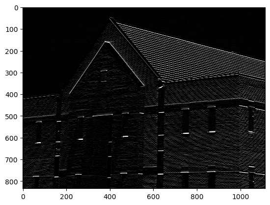
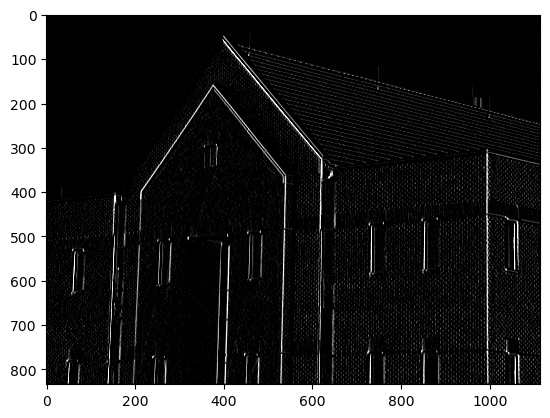
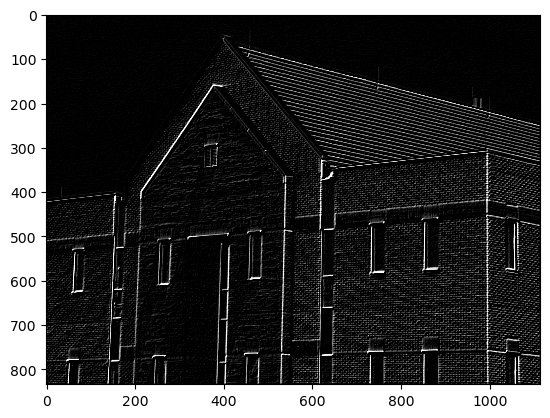
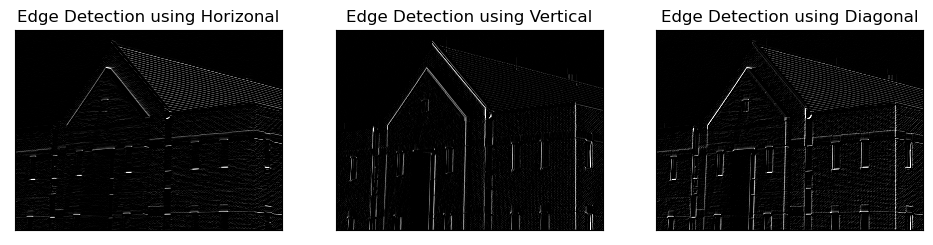
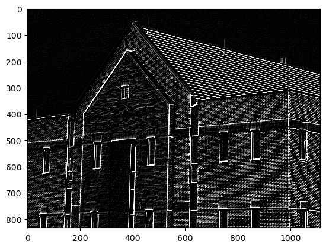
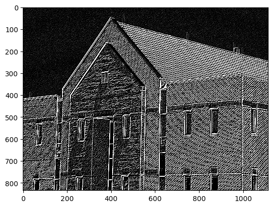
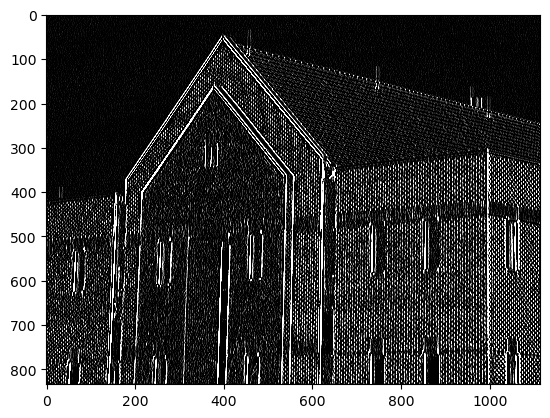
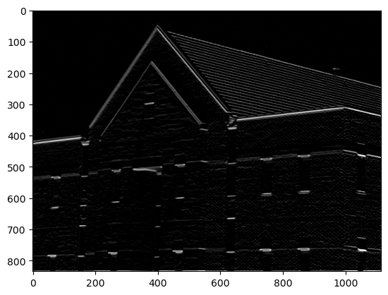

```python
# import libraries
import numpy as np
import pandas as pd
import matplotlib.pyplot as plt
import cv2
from scipy.signal import convolve
```

```python
img = cv2.imread(r"C:\Users\mpstme.student\Documents\I066\SIP\Experiment_7\Fig1016(a)(building_original).tif", 0)
```

```python
cv2.imshow("Image", img)
cv2.waitKey(0)
cv2.destroyAllWindows()
```

## Defining Horizontal and vertical masks and adding the result of the two to form a diagonal mask.

```python
Fy = np.array([[-1, 0, 1], [-2, 0, 2], [-1, 0, 1]])
```

```python
Fx = np.array([[-1, -2, -1], [0, 0, 0], [1, 2, 1]])
```

```python
Fx
```

    array([[-1, -2, -1],
           [ 0,  0,  0],
           [ 1,  2,  1]])

```python
Fy
```

    array([[-1,  0,  1],
           [-2,  0,  2],
           [-1,  0,  1]])

```python
diagonal = Fx + Fy
```

```python
diagonal
```

    array([[-2, -2,  0],
           [-2,  0,  2],
           [ 0,  2,  2]])

```python
# Horizontal Edge Detection using list slicing:
img_horizontal = np.zeros([m, n])
m, n = img.shape
a = 1

for i in range(a, m - a):
  for j in range(a, n - a):
    temp = img[i - a:i + a + 1, j - a:j + a + 1]
    img_horizontal[i, j] = np.sum(np.multiply(temp, Fx))
    
plt.imshow(img_horizontal, cmap = "gray", vmin = 0, vmax = 255)
```

    <matplotlib.image.AxesImage at 0x247ae368910>

    

    

```python
# Horizontal Edge Detection by hardcoding the formula:
m, n = img.shape
img_horizontal = img.copy()
for i in range(1, m - 1):
  for j in range(1, n - 1):

    temp = img[i - 1, j - 1] * Fx[0, 0] + img[i - 1, j] * Fx[0, 1] + img[i - 1, j + 1] * Fx[0, 2] + \
    img[i, j - 1] * Fx[1, 0] + img[i, j] * Fx[1, 1] + img[i, j + 1] * Fx[1, 2] + \
    img[i + 1, j - 1] * Fx[2, 0] + img[i + 1, j] * Fx[2, 1] + img[i + 1, j + 1] * Fx[2, 2]
    
    temp = abs(temp)
    img_horizontal[i, j] = temp

    # Using List comprehension:
    # temp = [img[i - 1, j - 1] * mask[0, 0] + img[i - 1, j] * mask[0, 1] + img[i - 1, j + 1] * mask[0, 2] + \
    # img[i, j - 1] * mask[1, 0] + img[i, j] * mask[1, 1] + img[i, j + 1] * mask[1, 2] + \
    # img[i + 1, j - 1] * mask[2, 0] + img[i + 1, j] * mask[2, 1] + img[i + 1, j + 1] * mask[2, 2] for i in range(1, m - 1) for j in range(1, n - 1)]
```

```python
# Vertical Edge Detection using list slicing:
img_vertical = np.zeros([m, n])
m, n = img.shape
a = 1

for i in range(a, m - a):
  for j in range(a, n - a):
    temp = img[i - a:i + a + 1, j - a:j + a + 1]
    img_vertical[i, j] = np.sum(np.multiply(temp, Fy))
    
plt.imshow(img_vertical, cmap = "gray", vmin = 0, vmax = 255)
```

    <matplotlib.image.AxesImage at 0x247ae3d6970>

    

    

```python
# Vertical Edge Detection by hardcoding the formula:
m, n = img.shape
img_vertical = img.copy()
for i in range(1, m - 1):
  for j in range(1, n - 1):

    temp = img[i - 1, j - 1] * Fy[0, 0] + img[i - 1, j] * Fy[0, 1] + img[i - 1, j + 1] * Fy[0, 2] + \
    img[i, j - 1] * Fy[1, 0] + img[i, j] * Fy[1, 1] + img[i, j + 1] * Fy[1, 2] + \
    img[i + 1, j - 1] * Fy[2, 0] + img[i + 1, j] * Fy[2, 1] + img[i + 1, j + 1] * Fy[2, 2]
    
    temp = abs(temp)
    img_vertical[i, j] = temp

    # Using List comprehension:
    # temp = [img[i - 1, j - 1] * mask[0, 0] + img[i - 1, j] * mask[0, 1] + img[i - 1, j + 1] * mask[0, 2] + \
    # img[i, j - 1] * mask[1, 0] + img[i, j] * mask[1, 1] + img[i, j + 1] * mask[1, 2] + \
    # img[i + 1, j - 1] * mask[2, 0] + img[i + 1, j] * mask[2, 1] + img[i + 1, j + 1] * mask[2, 2] for i in range(1, m - 1) for j in range(1, n - 1)]
```

```python
# Diagonal Edge Detection using list slicing:
img_diagonal = np.zeros([m, n])
m, n = img.shape
a = 1

for i in range(a, m - a):
  for j in range(a, n - a):
    temp = img[i - a:i + a + 1, j - a:j + a + 1]
    img_diagonal[i, j] = np.sum(np.multiply(temp, diagonal))
    
plt.imshow(img_diagonal, cmap = "gray", vmin = 0, vmax = 255)
```

    <matplotlib.image.AxesImage at 0x247ae830af0>

    

    

```python
# Diagonal Edge Detection by hardcoding the formula:
m, n = img.shape
img_diagonal = img.copy()
for i in range(1, m - 1):
  for j in range(1, n - 1):

    temp = img[i - 1, j - 1] * diagonal[0, 0] + img[i - 1, j] * diagonal[0, 1] + img[i - 1, j + 1] * diagonal[0, 2] + \
    img[i, j - 1] * diagonal[1, 0] + img[i, j] * diagonal[1, 1] + img[i, j + 1] * diagonal[1, 2] + \
    img[i + 1, j - 1] * diagonal[2, 0] + img[i + 1, j] * diagonal[2, 1] + img[i + 1, j + 1] * diagonal[2, 2]
    
    temp = abs(temp)
    img_diagonal[i, j] = temp

    # Using List comprehension:
    # temp = [img[i - 1, j - 1] * mask[0, 0] + img[i - 1, j] * mask[0, 1] + img[i - 1, j + 1] * mask[0, 2] + \
    # img[i, j - 1] * mask[1, 0] + img[i, j] * mask[1, 1] + img[i, j + 1] * mask[1, 2] + \
    # img[i + 1, j - 1] * mask[2, 0] + img[i + 1, j] * mask[2, 1] + img[i + 1, j + 1] * mask[2, 2] for i in range(1, m - 1) for j in range(1, n - 1)]
```

# Showing the differences of Edge detection using various masks defined above (horizonal, vertical and diagonal).

```python
radii = ["Horizonal", "Vertical", "Diagonal"]
images = [img_horizontal, img_vertical, img_diagonal]
plt.figure(figsize = (20, 10))
for i in range(len(radii)):    
    plt.subplot(1, 5, i + 1)
    plt.imshow(images[i], cmap = "gray", vmin = 0, vmax = 255)
    plt.title("Edge Detection using {}".format(radii[i]))
    plt.xticks([])
    plt.yticks([])
```

    

    

```python
all_images = img_horizontal + img_vertical + img_diagonal
```

```python
plt.imshow(all_images, cmap = "gray", vmin = 0, vmax = 255)
```

    <matplotlib.image.AxesImage at 0x247ae9a41f0>

    

    

```python
# Built in Function:
signal_x = convolve(img_horizontal, Fx, mode = "same")
signal_y = convolve(img_vertical, Fy, mode = "same")
signal_diagonal = convolve(img_diagonal, diagonal, mode = "same")
plt.imshow(signal_x, cmap = "gray", vmin = 0, vmax = 255)
plt.imshow(signal_y, cmap = "gray", vmin = 0, vmax = 255)
plt.imshow(signal_diagonal, cmap = "gray", vmin = 0, vmax = 255)
```

    <matplotlib.image.AxesImage at 0x247bb186580>

    

    

```python
plt.imshow(signal_y, cmap = "gray", vmin = 0, vmax = 255)
```

    <matplotlib.image.AxesImage at 0x247bb21cfd0>

    

    

```python
plt.imshow(signal_diagonal, cmap = "gray", vmin = 0, vmax = 255)
```

    <matplotlib.image.AxesImage at 0x247bb254f40>

    

    

```python
# For different sizes of masks provided from user:
size_of_mask = int(input("Enter the size of the Mask : "))
img_new = img.copy()
m, n = img.shape
print("You have requested for Mask of Size :  ", size_of_mask ,"x", size_of_mask)
a = size_of_mask//2

for i in range(a, m - a):
    for j in range(a, n - a):
        temp = np.sum(img[i - a:i + a + 1, j - a:j + a + 1])
        img_new[i, j] = temp//size_of_mask**2
signal_x = convolve(img_new, Fx, mode = "same")
plt.imshow(signal_x, cmap = "gray", vmin = 0, vmax = 255)
```

    Enter the size of the Mask : 5
    You have requested for Mask of Size :   5 x 5

    <matplotlib.image.AxesImage at 0x247b1de6a30>

    

    

# Conclusion:
## As we see from the image shown above and in the cell where the difference between three types of images are shown (horizontal, vertical and diagonal, we see that the above image where we applied Averaging filter to the original image and then applied convolution seemed to detect the horizontal images better than the one in which Averaging filter wasn't applied.

