# Elementary Signals and Operations in Python

## Aim

The aim of this project is to plot various elementary signals in Python and perform simple operations on discrete time signals.

## Table of Contents

- [Aim](#aim)
- [Software](#software)
- [Prerequisite](#prerequisite)
- [Outcome](#outcome)
- [Theory](#theory)
  - [Elementary Signals](#elementary-signals)
  - [Operations on Signals](#operations-on-signals)
- [Instructions](#instructions)
- [Examples](#examples)

## Software

This project is implemented using Python.

## Prerequisite

To understand and work with this project, you should be familiar with the following concepts:

| Sr. No | Concepts          |
| ------ | ----------------- |
| 1.     | Elementary signals |

## Outcome

After successful completion of this experiment, students will be able to:

- Identify and generate various types of elementary signals.
- Perform simple operations on the signals.
- Can be found [here](https://github.com/Haleshot/Signal_Image_Processing/blob/main/Elementary_Signals/Elementary_Signals.ipynb).

## Theory

### Elementary Signals

In this project, we will work with the following elementary signals:

1. Sine wave: A sinusoidal signal with a specified frequency and amplitude.
2. Unit step: A signal that is 1 for n ≥ 0 and 0 otherwise.
3. Unit ramp: A signal that is equal to the index n for n ≥ 0 and 0 otherwise.
4. Unit impulse: A signal that is 1 at n = 0 and 0 otherwise.
5. Exponential signal: A signal of the form x(n) = a^n, where a is a constant and n ≥ 0.

### Operations on Signals

We will perform the following operations on discrete time signals:

1. Time shifting: Shifting a signal by k units in time.
2. Time reversal: Reversing the order of the signal.
3. Time scaling: Scaling the time axis of the signal by a factor of k.
4. Scalar multiplication: Multiplying the signal by a constant scalar.

## Instructions

To work with this project, follow the instructions below:

1. Understand the concepts of elementary signals and operations on signals.
2. Use Python to implement the required functionalities.
3. Run the code to generate plots for the elementary signals.
4. Perform the specified operations on the discrete time signals.
5. Observe the results and analyze the differences between continuous time, discrete time, and digital signals.

## Examples

Here are some examples of the elementary signals and operations on signals that you can explore in this project:

1. Sine wave: Generate and plot a sine wave signal with a specific frequency and amplitude.
2. Unit step: Create a discrete time signal that represents a unit step function.
3. Unit ramp: Generate a discrete time signal that represents a unit ramp function.
4. Unit impulse: Create a discrete time signal that represents a unit impulse function.
5. Exponential signal: Generate a discrete time signal using the exponential function.
6. Time shifting: Shift a discrete time signal by a specified number of units.
7. Time reversal: Reverse the order of a discrete time signal.
8. Time scaling: Scale the time axis of a discrete time signal by a factor.
9. Scalar multiplication: Multiply a discrete time signal by a constant scalar.

```python
# import libraries
import numpy as np
import matplotlib.pyplot as plt
```

```python
t = np.arange(0, 1, 0.001)
f = int(input("Enter the Frequency : ")) # Enter it as 5
x = 5 * np.sin(2 * np.pi * f * t)
y = np.cos(2 * np.pi * f * t)
```

    Enter the Frequency : 5

```python
# Plotting the Sine Curve

plt.title("Sine Curve")
plt.plot(t, x)
```

    [<matplotlib.lines.Line2D at 0x7f7e34c2ee80>]

    
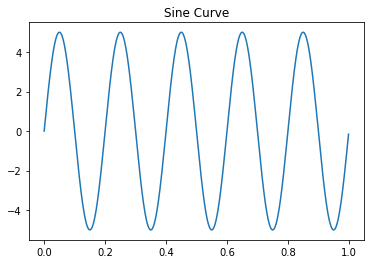
    

```python
# Plotting the Cosine Curve

plt.title("Cosine Curve")
plt.plot(t, y)
```

    [<matplotlib.lines.Line2D at 0x7f7e34a96df0>]

    
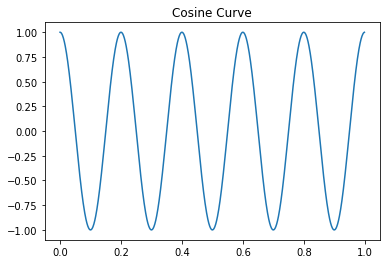
    

```python
plt.plot(t, x, t, y)
```

    [<matplotlib.lines.Line2D at 0x7fc344eb2ca0>,
     <matplotlib.lines.Line2D at 0x7fc344eb2cd0>]

    
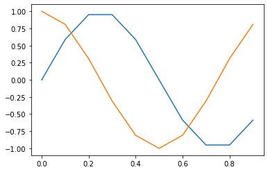
    

```python
# Plotting plots and stem graph using subplots.

plt.subplot(2, 2, 1)
plt.plot(t, x)
plt.subplot(2, 2, 2)
plt.stem(t, x)

plt.subplot(2, 2, 3)
plt.plot(t, y)
plt.subplot(2, 2, 4)
plt.stem(t, y)
```

    <ipython-input-99-908459db4892>:6: UserWarning: In Matplotlib 3.3 individual lines on a stem plot will be added as a LineCollection instead of individual lines. This significantly improves the performance of a stem plot. To remove this warning and switch to the new behaviour, set the "use_line_collection" keyword argument to True.
      plt.stem(t, x)
    <ipython-input-99-908459db4892>:11: UserWarning: In Matplotlib 3.3 individual lines on a stem plot will be added as a LineCollection instead of individual lines. This significantly improves the performance of a stem plot. To remove this warning and switch to the new behaviour, set the "use_line_collection" keyword argument to True.
      plt.stem(t, y)

    <StemContainer object of 3 artists>

    
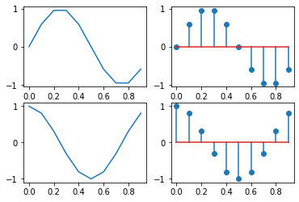
    

```python
# Unit Step Function using If else and where.

t = np.arange(0, 11)
u = []
for i in t:
  if i <= 5:
    u.append(1)
  elif i > 5:
    u.append(0)
print(t)
print(u)

plt.subplot(1, 2, 1)
plt.plot(t, u)

plt.subplot(1, 2, 2)
plt.stem(t, u)

u = np.where(t <= 5, 1, 0)
print(u)
```

    [ 0  1  2  3  4  5  6  7  8  9 10]
    [1, 1, 1, 1, 1, 1, 0, 0, 0, 0, 0]
    [1 1 1 1 1 1 0 0 0 0 0]

    <ipython-input-100-3fc8be03d516>:18: UserWarning: In Matplotlib 3.3 individual lines on a stem plot will be added as a LineCollection instead of individual lines. This significantly improves the performance of a stem plot. To remove this warning and switch to the new behaviour, set the "use_line_collection" keyword argument to True.
      plt.stem(t, u)

    
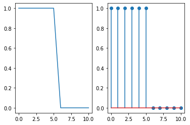
    

```python
# Ramp - Continuos and Discrete difference plots.
t = np.arange(0, 11)
u = []
for i in t:
  if i >= 0:
    r = t
    u.append(i)
print(t)
print(u)

plt.subplot(2, 2, 1)
plt.plot(r, t)

plt.subplot(2, 2, 2)
plt.stem(r, t)
```

    [ 0  1  2  3  4  5  6  7  8  9 10]
    [0, 1, 2, 3, 4, 5, 6, 7, 8, 9, 10]

    <ipython-input-101-d37660e44038>:15: UserWarning: In Matplotlib 3.3 individual lines on a stem plot will be added as a LineCollection instead of individual lines. This significantly improves the performance of a stem plot. To remove this warning and switch to the new behaviour, set the "use_line_collection" keyword argument to True.
      plt.stem(r, t)

    <StemContainer object of 3 artists>

    
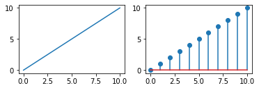
    

```python
# Impulse operations

t = np.arange(-11, 11)
u = np.where(t == 0, 1, 0)
plt.subplot(2, 2, 1)
plt.plot(t, u)

plt.subplot(2, 2, 2)
plt.stem(t, u)
```

    <ipython-input-102-b821b88f812a>:9: UserWarning: In Matplotlib 3.3 individual lines on a stem plot will be added as a LineCollection instead of individual lines. This significantly improves the performance of a stem plot. To remove this warning and switch to the new behaviour, set the "use_line_collection" keyword argument to True.
      plt.stem(t, u)

    <StemContainer object of 3 artists>

    
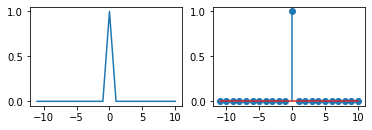
    

```python
# Exponential operations

a = np.exp(t)
b = -np.exp(t)

plt.subplot(2, 2, 1)
plt.plot(t, a)

plt.subplot(2, 2, 2)
plt.stem(t, a)

plt.subplot(2, 2, 3)
plt.plot(t, b)

plt.subplot(2, 2, 4)
plt.stem(t, b)
```

    <ipython-input-103-6c9302fafa13>:10: UserWarning: In Matplotlib 3.3 individual lines on a stem plot will be added as a LineCollection instead of individual lines. This significantly improves the performance of a stem plot. To remove this warning and switch to the new behaviour, set the "use_line_collection" keyword argument to True.
      plt.stem(t, a)
    <ipython-input-103-6c9302fafa13>:16: UserWarning: In Matplotlib 3.3 individual lines on a stem plot will be added as a LineCollection instead of individual lines. This significantly improves the performance of a stem plot. To remove this warning and switch to the new behaviour, set the "use_line_collection" keyword argument to True.
      plt.stem(t, b)

    <StemContainer object of 3 artists>

    
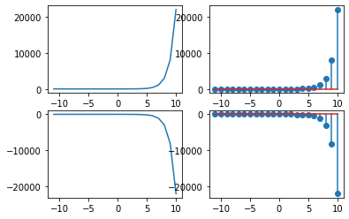
    

# Discrete Time Signal for x(n) = a^n

```python
n = np.arange(0, 11, 1)

case1 = -0.5
case2 = -2
case3 = 2
case4 = 0.5

# Discrete Time Sginal for x(n) = a^n
x1 = case1 ** n
x2 = case2 ** n
x3 = case3 ** n
x4 = case4 ** n

plt.subplot(2, 2, 1)
plt.stem(n, x1)

plt.subplot(2, 2, 2)
plt.stem(n, x2)

plt.subplot(2, 2, 3)
plt.stem(n, x3)

plt.subplot(2, 2, 4)
plt.stem(n, x4)
```

    <ipython-input-14-5c301ce11c65>:15: UserWarning: In Matplotlib 3.3 individual lines on a stem plot will be added as a LineCollection instead of individual lines. This significantly improves the performance of a stem plot. To remove this warning and switch to the new behaviour, set the "use_line_collection" keyword argument to True.
      plt.stem(n, x1)
    <ipython-input-14-5c301ce11c65>:18: UserWarning: In Matplotlib 3.3 individual lines on a stem plot will be added as a LineCollection instead of individual lines. This significantly improves the performance of a stem plot. To remove this warning and switch to the new behaviour, set the "use_line_collection" keyword argument to True.
      plt.stem(n, x2)
    <ipython-input-14-5c301ce11c65>:21: UserWarning: In Matplotlib 3.3 individual lines on a stem plot will be added as a LineCollection instead of individual lines. This significantly improves the performance of a stem plot. To remove this warning and switch to the new behaviour, set the "use_line_collection" keyword argument to True.
      plt.stem(n, x3)
    <ipython-input-14-5c301ce11c65>:24: UserWarning: In Matplotlib 3.3 individual lines on a stem plot will be added as a LineCollection instead of individual lines. This significantly improves the performance of a stem plot. To remove this warning and switch to the new behaviour, set the "use_line_collection" keyword argument to True.
      plt.stem(n, x4)

    <StemContainer object of 3 artists>

    
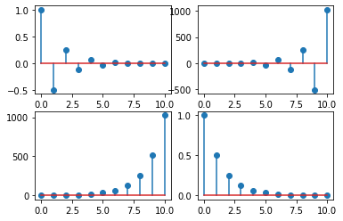
    

# Continuos Time Signal for x(n) = a^n

```python
n = np.arange(0, 11, 1)

case1 = -0.5
case2 = -2
case3 = 2
case4 = 0.5

# Discrete Time Sginal for x(n) = a^n
x1 = case1 ** n
x2 = case2 ** n
x3 = case3 ** n
x4 = case4 ** n

plt.subplot(2, 2, 1)
plt.plot(n, x1)

plt.subplot(2, 2, 2)
plt.plot(n, x2)

plt.subplot(2, 2, 3)
plt.plot(n, x3)

plt.subplot(2, 2, 4)
plt.plot(n, x4)
```

    [<matplotlib.lines.Line2D at 0x7f7e34812040>]

    
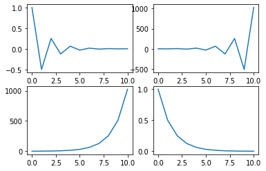
    

# Time Shifting Operation:

## Time Reverse and Delay:

    y(n) = x(-n + 1)

```python
n = np.arange(0, 5)

for i in n:
  x = n + 1
  y = - n + 2

plt.subplot(1, 2, 1)
plt.stem(x, n)

plt.subplot(1, 2, 2)
plt.stem(y, n)
```

    <ipython-input-25-2f9449f78dec>:9: UserWarning: In Matplotlib 3.3 individual lines on a stem plot will be added as a LineCollection instead of individual lines. This significantly improves the performance of a stem plot. To remove this warning and switch to the new behaviour, set the "use_line_collection" keyword argument to True.
      plt.stem(x, n)
    <ipython-input-25-2f9449f78dec>:12: UserWarning: In Matplotlib 3.3 individual lines on a stem plot will be added as a LineCollection instead of individual lines. This significantly improves the performance of a stem plot. To remove this warning and switch to the new behaviour, set the "use_line_collection" keyword argument to True.
      plt.stem(y, n)

    <StemContainer object of 3 artists>

    
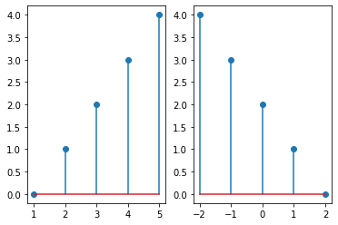
    

# Time Scaling

1) Upscaling

    y = [x(n)]/2

```python
n = np.arange(1, 6)
x = [1, 2, 3, 4, 5, 6, 7, 8, 9, 10]
y = []

for i in range(len(x)):
  if i % 2 == 0:
    y.append(i)

plt.stem(y, n)
```

    <ipython-input-35-4c4f831bc243>:9: UserWarning: In Matplotlib 3.3 individual lines on a stem plot will be added as a LineCollection instead of individual lines. This significantly improves the performance of a stem plot. To remove this warning and switch to the new behaviour, set the "use_line_collection" keyword argument to True.
      plt.stem(y, n)

    <StemContainer object of 3 artists>

    
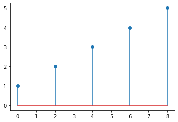
    

# Amplitude Scaling
Amplification

    y(n) = 2x(n)
    

```python
n = np.arange(0, 11)
x = [1, 2, 3, 4, 5, 6, 7, 8, 9, 10, 11]
y = []

for i in x:
  a = 2 * i
  y.append(a)

plt.stem(y, n)
```

    <ipython-input-39-3a18891cbb5a>:9: UserWarning: In Matplotlib 3.3 individual lines on a stem plot will be added as a LineCollection instead of individual lines. This significantly improves the performance of a stem plot. To remove this warning and switch to the new behaviour, set the "use_line_collection" keyword argument to True.
      plt.stem(y, n)

    <StemContainer object of 3 artists>

    
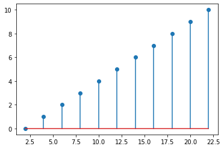
    

# Addition and Subtraction operations:
## Subtraction operation:
    z(n) = x(n) - y(n)

```python
n = np.arange(0, 4)
x = [1, 2, 3, 4]
y = [5, 6, 7, 8]
z = []

for i in range(4):
  a = x[i] - y[i]
  z.append(a)
plt.stem(n, z)
```

    <ipython-input-46-6e1da068612c>:9: UserWarning: In Matplotlib 3.3 individual lines on a stem plot will be added as a LineCollection instead of individual lines. This significantly improves the performance of a stem plot. To remove this warning and switch to the new behaviour, set the "use_line_collection" keyword argument to True.
      plt.stem(n, z)

    <StemContainer object of 3 artists>

    
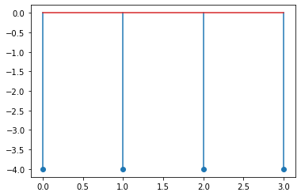
    

# Multiplication Operations:
    z(n) = x(n) * y(n)

```python
n = np.arange(0, 4)
x = [1, 2, 3, 4]
y = [5, 6, 7, 8]
z = []

for i in range(4):
  a = x[i] * y[i]
  z.append(a)
plt.stem(n, z)
```

    <ipython-input-47-a4047f453fdf>:9: UserWarning: In Matplotlib 3.3 individual lines on a stem plot will be added as a LineCollection instead of individual lines. This significantly improves the performance of a stem plot. To remove this warning and switch to the new behaviour, set the "use_line_collection" keyword argument to True.
      plt.stem(n, z)

    <StemContainer object of 3 artists>

    
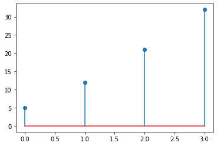
    

# Conclusion:
### From the experiment conducted, I could understand the following:
1. Identify and generate various types of elementary signals.

2. Perform simple operations on the signals.
3. Understanding Continuos and Discrete depiction of signals.
