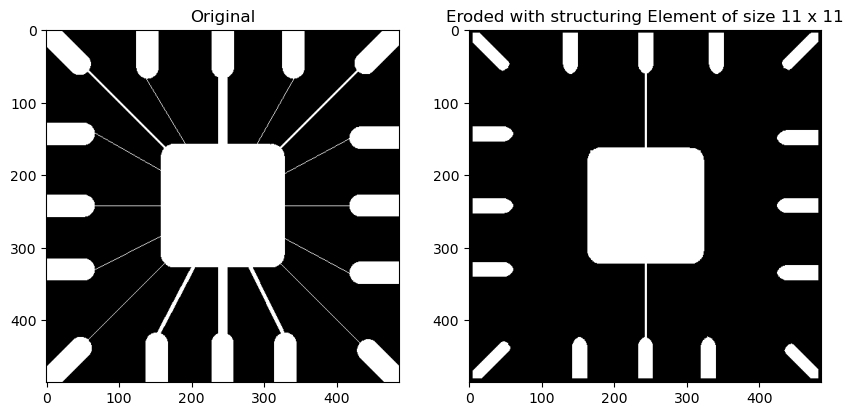

# Image Morphological Operations

## Aim

The aim of this project is to perform erosion on the given test image using different structuring elements. The structuring elements include a square-shaped structuring element of sizes 11x11, 15x15, and 45x45, as well as a circular-shaped structuring element of the same sizes. Additionally, the project involves analyzing the effect of changing the structuring element and increasing its size on the eroded image. Finally, dilation is performed on the given test image with broken text characters using a suitable structuring element to demonstrate the joining of the broken segments.

## Table of Contents

- [Aim](#aim)
- [Software](#software)
- [Prerequisite](#prerequisite)
- [Outcome](#outcome)
- [Theory](#theory)

## Software

This project is implemented using Python.

## Prerequisite

To understand and work with this project, you should be familiar with the following concepts:

| Sr. No | Concepts                               |
| ------ | -------------------------------------- |
| 1.     | Morphological operations (dilation, erosion, opening, and closing) |

## Outcome

After successfully completing this experiment, students will be able to:

- Implement dilation and erosion operations on images.
- Analyze the effects of changing the size and shape of the structuring element on the eroded image.

## Theory

### Dilation

Dilation is a morphological operation that expands the boundaries of objects in an image. It is defined as follows:

A ⊕ B = { Z | [(B ⊖ Z) ∩ A] ∈ A }

In the above equation, A represents the image, and B is the structuring element. The symbol ⊕ denotes dilation. The operation involves taking the reflection of B about its origin and shifting it by Z. Dilation of A with B yields a set of all displacements, Z, such that the overlap of (B ⊖ Z) and A contains at least one element.

### Erosion

Erosion is a morphological operation that erodes or shrinks the boundaries of objects in an image. It is defined as follows:

A ⊖ B = { Z | (B ⊖ Z) ∈ A }

In the above equation, A represents the image, and B is the structuring element. The symbol ⊖ denotes erosion. The operation involves taking the reflection of B about its origin and shifting it by Z. Erosion of A by B yields a set of all points where B, translated (shifted by Z), is entirely contained within A. Erosion reduces the number of pixels from the object boundary.

Note: The code implementation is provided in the [ipynb](https://github.com/Haleshot/Signal_Image_Processing/blob/main/Erosion_Dilation/Erosion_Dilation.ipynb) file.


```python
# import libraries
import cv2
import pandas as pd
import numpy as np
import matplotlib.pyplot as plt
```

# Erosion:

## Importing the image:

```python
img = cv2.imread(r"C:\Users\mpstme.student\Documents\I066\SIP\Exp_8\Fig0905(a)(wirebond-mask).tif", 0)
```

```python
plt.imshow(img, cmap = "gray")
```

    <matplotlib.image.AxesImage at 0x1c2b77f9f40>

    

    

```python
# cv2.imshow("Image", img)
# cv2.waitKey(0)
# cv2.destroyAllWindows()
```

```python
m, n = img.shape
print("The Size of the image is :", m, "x", n)
```

    The Size of the image is : 486 x 486

```python
struct_element_size = int(input("Enter Structuring Element Size : "))
```

    Enter Structuring Element Size : 11

```python
SE = np.ones((struct_element_size, struct_element_size))
constant = (struct_element_size - 1)//2
```

```python
# Creating an image for Erosion Image
img_erode = np.zeros((m, n))
```

```python
# Creating a user defined function for Erosion:
for i in range(constant, m - constant):
    for j in range(constant, n - constant):
        temp = img[i-constant:i+constant+1, j-constant:j+constant+1]
        product = temp * SE
        img_erode[i, j] = np.min(product) # Selects the minimum from product.
```

```python
plt.figure(figsize=(10, 10))
plt.subplot(1, 2, 1)
plt.imshow(img, cmap = "gray")
plt.title("Original")

plt.subplot(1, 2, 2)
plt.imshow(img_erode, cmap = "gray")
plt.title("Eroded with structuring Element of size {} x {}".format(struct_element_size, struct_element_size))
```

    Text(0.5, 1.0, 'Eroded with structuring Element of size 11 x 11')

    

    

```python
# Erosion using CV2 built in function:

# Defining the SE:
SE1 = cv2.getStructuringElement(cv2.MORPH_RECT, (11,11))

# Using the built in Erode operation:
img_erode_new = cv2.erode(img, SE1, 1)

# Plot 3 images together:
fig = plt.figure(figsize = (20, 20))
plt.subplot(1, 3, 1)
plt.imshow(img, cmap = "gray")
plt.title("Original")
plt.subplot(1, 3, 2)
plt.title("Eroded with structuring Element of size {} x {}".format(struct_element_size, struct_element_size))
plt.imshow(img_erode, cmap = "gray")
plt.subplot(1, 3, 3)
plt.title("Eroded image with built in function")
plt.imshow(img_erode_new, cmap = "gray")
```

    <matplotlib.image.AxesImage at 0x1c2b862edf0>

    

    

## Conclusion:
### We can see that the image returned by our user defined function and the built in function of cv2 yield the same result

# Dilation:

## Reading another image:

```python
img_2 = cv2.imread(r"C:\Users\mpstme.student\Documents\I066\SIP\Exp_8\Fig0907(a)(text_gaps_1_and_2_pixels).tif", 0)
u, v = img_2.shape
plt.imshow(img_2, cmap="gray")
```

    <matplotlib.image.AxesImage at 0x1c2b8dded00>

    

    

```python
# Defining the structuring element:
SED = np.array([[0, 1, 0], [1, 1, 1], [0, 1, 0]])
constant_2 = 1
```

```python
# Define new image for dilation 
img_dilate= np.zeros((u, v))
```

```python
# Creating a user defined function for Dilation:
for i in range(constant_2, u-constant_2):
  for j in range(constant_2, v-constant_2):
    temp = img_2[i-constant_2:i+constant_2+1, j-constant_2:j+constant_2+1]
    product = temp * SED
    img_dilate[i,j]= np.max(product)
```

```python
fig=plt.figure(figsize = (10, 10))
plt.subplot(1, 2, 1)
plt.imshow(img_2, cmap="gray")
plt.subplot(1,2,2)
plt.imshow(img_dilate, cmap= "gray")
```

    <matplotlib.image.AxesImage at 0x1c2b8e205e0>

    

    

## Conclusion:
###  We can see that the letters in the left image which have gaps in them had it sharpened/filled by applying the dilation matrix.
