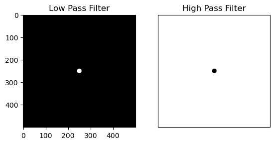
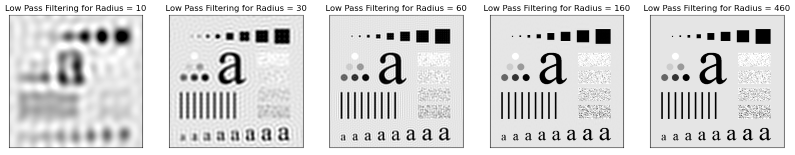
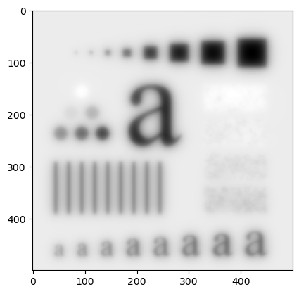

# Frequency Domain Filtering with Butterworth Filter

## Aim

The aim of this project is to implement a suitable frequency domain Butterworth filter to blur the given test image. The objectives include:

- Implementing the Butterworth filter in the frequency domain.
- Changing the filter order and summarizing the findings when the filter order increases.

## Table of Contents

- [Aim](#aim)
- [Software](#software)
- [Prerequisite](#prerequisite)
- [Outcome](#outcome)
- [Theory](#theory)

## Software

This project is implemented using Python.

## Prerequisite

To understand and work with this project, you should be familiar with the following concepts:

| Sr. No | Concepts                                |
| ------ | --------------------------------------- |
| 1.     | Frequency domain filtering concepts      |

## Outcome

After successful completion of this experiment, students will be able to:

- Implement frequency domain filtering using the Butterworth filter.
- Comprehend the effects of frequency domain filtering on an image.
- Summarize the findings when the filter order increases.
- Can be found [here](https://github.com/Haleshot/Signal_Image_Processing/blob/main/Frequency_Domain_Filtering/Frequency_Domain_Filtering.ipynb).

## Theory

### Basic steps in frequency domain filtering:

1. Multiply the input image by (-1)^(x+y).
2. Compute the Discrete Fourier Transform (DFT) of the image obtained in step (1) to obtain F(u,v).
3. Multiply F(u,v) by a filter function H(u,v).
4. Compute the inverse DFT of the result obtained in step (3).
5. Take the real part of the result obtained in step (4).
6. Multiply the result in (5) by (-1)^(x+y).

### Butterworth Filter:

For Butterworth High Pass Filter (HPF):

H(u,v) = 1 / [1 + (D_0 / D(u,v))^2n]

For Butterworth Low Pass Filter (LPF):

H(u,v) = 1 / [1 + (D(u,v) / D_0)^2n]

where:
- D(u,v) is the distance from the point (u,v) to the origin of the frequency rectangle for an MxN image.
- D(u,v) = [(u - M/2)^2 + (v - N/2)^2]^0.5
- D_0 is the cutoff frequency.
- n is the filter order.

The filter transfer function H(u,v) is the filter response in the frequency domain.

Note: The code implementation is provided in the ipynb file.

```python
# import libraries
import cv2
import numpy as np
import matplotlib.pyplot as plt
```

### Reading the Image

```python
img = cv2.imread(r"C:\Users\mpstme.student\Documents\I066\Images\DIP3E_Original_Images_CH03\Fig0333(a)(test_pattern_blurring_orig).tif", 0)
```

```python
cv2.imshow("Image", img)
cv2.waitKey(0)
cv2.destroyAllWindows()

# Above code is used for displaying the image read from the path above.
```

```python
img_fft = np.fft.fft2(img, s = None, axes = (-2, -1), norm = None)
img_fft = np.fft.fftshift(img_fft)
m, n = img_fft.shape
```

```python
print(m, n)
```

    500 500

```python
def mask(d0, m, n):
    lpf = np.zeros((m, n))
    hpf = np.zeros((m, n))
    
    for i in range(m):
        for j in range(n):
            d1 = np.sqrt((i - m//2)**2 + (j - n//2)**2)
            if d1 > d0:
                lpf[i, j] = 0
                hpf[i, j] = 1
            else:
                lpf[i, j] = 1
                hpf[i, j] = 0
    return lpf, hpf
```

```python
lpf, hpf = mask(10, m, n)
```

```python
plt.subplot(1, 2, 1)
plt.imshow(lpf, cmap = "gray")
plt.title("Low Pass Filter")
plt.subplot(1, 2, 2)
plt.imshow(hpf, cmap = "gray")
plt.title("High Pass Filter")
plt.xticks([])
plt.yticks([])
```

    ([], [])

    

    

```python
radii = [10, 30, 60, 160, 460]
plt.figure(figsize = (20, 10))
for i in range(len(radii)):
    lpf, hpf = mask(radii[i], m, n)
    
    img_lpf = img_fft*lpf
    img_lpf = np.fft.fftshift(img_lpf)
    imgnew_lpf = np.real(np.fft.ifft2(img_lpf))
    
    img_hpf = img_fft*hpf
    img_hpf = np.fft.fftshift(img_hpf)
    imgnew_hpf = np.real(np.fft.ifft2(img_hpf))
    
    
    plt.subplot(1, 5, i + 1)
    plt.imshow(imgnew_lpf, cmap = "gray", vmin = 0, vmax = 255)
    plt.title("Low Pass Filtering for Radius = {}".format(radii[i]))
    plt.xticks([])
    plt.yticks([])
```

    

    

As we can see, there are concentric circles formed around various features in the images. Known as the ringing effect.

```python
# Butterworth
def  butt_mask(d0, m, n):
    lpf = np.zeros((m, n))
    hpf = np.zeros((m, n))
    
    for i in range(m):
        for j in range(n):
            d1 = np.sqrt((i - m//2)**2 + (j - n//2)**2)
            lpf[i, j] = 1/(1 + (d1/d0)**2)
            
    return lpf, hpf
```

```python
lpf, hpf = butt_mask(10, m, n)
blur_img = np.real(np.fft.ifft2(np.fft.fftshift(img_fft * lpf)))
plt.imshow(blur_img, cmap = "gray")
```

    <matplotlib.image.AxesImage at 0x12851d62a60>

    

    

Butterworth removes the ringing effect which occurs in Ideal LPF.

## Conclusion:
### From the above experiment, I learnt the following:
    a.	Implement suitable frequency domain Butterworth filter to blur the given test image
    b.	Change the filter order and summarize your findings when the filter order increases

