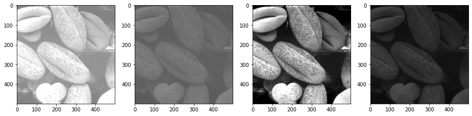

# Image Classification and Histogram Equalization

## Aim

The aim of this project is to classify test images as low contrast, high contrast, dark, and bright images by plotting their histograms. The objectives include:

- Implementing histogram equalization on the low contrast, dark, and bright images.
- Examining the effect of equalization on the test images by comparing the histograms of the original images with the equalized images.

## Table of Contents

- [Aim](#aim)
- [Software](#software)
- [Prerequisite](#prerequisite)
- [Outcome](#outcome)
- [Theory](#theory)

## Software

This project is implemented using Python.

## Prerequisite

To understand and work with this project, you should be familiar with the following concepts:

| Sr. No | Concepts                                    |
| ------ | ------------------------------------------- |
| 1.     | Histograms for various types of images       |
| 2.     | Histogram equalization                       |

## Outcome

After successful completion of this experiment, students will be able to:

- Understand the concept of histograms and their role in image classification.
- Implement histogram equalization for enhancing image contrast.
- Can be found [here](https://github.com/Haleshot/Signal_Image_Processing/blob/main/Histogram_Processing/Histogram_Processing.ipynb).

## Theory

### Histogram

A histogram is a graph that represents the distribution of pixel intensities in an image. The x-axis represents the intensity values, and the y-axis represents the frequency of occurrence of each intensity value.

### Histogram Stretching

Histogram stretching is a technique used to enhance image contrast. It involves stretching the range of pixel intensities in an image. The modified pixel value is calculated using the following formula:

s = ((s_max - s_min) / (r_max - r_min)) * (r - r_min) + s_min

where:
- s is the modified pixel value
- s_max is the maximum grey level of the output image
- s_min is the minimum grey level of the output image
- r_max is the maximum grey level of the input image
- r_min is the minimum grey level of the input image
- r is the original pixel value

### Histogram Equalization

Histogram equalization is a technique used to redistribute the intensity values in an image to achieve a more uniform histogram. The steps involved in histogram equalization are as follows:

1. Plot the histogram of the original image.
2. Calculate the probability density function (PDF) of the image.
3. Calculate the cumulative distribution function (CDF) of the image.
4. Perform mapping of pixel values based on the CDF to obtain the output image.
5. Plot the histogram of the output image.

Note: The code implementation is provided in the ipynb file.

# Import libraries

```python
import cv2
import pandas as pd
import numpy as np
import matplotlib.pyplot as plt
import time
from google.colab.patches import cv2_imshow
```

# Reading all the image files

```python
img_1 = cv2.imread(r"/content/Fig0316(1)(top_left).tif", 0)
img_2 = cv2.imread(r"/content/Fig0316(2)(2nd_from_top).tif", 0)
img_3 = cv2.imread(r"/content/Fig0316(3)(third_from_top).tif", 0)
img_4 = cv2.imread(r"/content/Fig0316(4)(bottom_left).tif", 0)
images = [img_1, img_2, img_3, img_4]
```

```python
plt.figure(figsize = (20, 15))
plt.xticks([])
plt.yticks([])

for i in range(len(images)):
    plt.subplot(1, len(images) + 1, i + 1)
    plt.imshow(images[i], cmap = "gray", vmin = 0, vmax = 255)
```

    

    

```python
cv2_imshow(img_1)
```

    

    

```python
cv2_imshow(img_2)
```

    

    

```python
cv2_imshow(img_3)
```

    

    

```python
cv2_imshow(img_4)
```

    

    

```python
img_1.shape
```

    (500, 500, 3)

```python
print("YES")
print(time.time())
```

    YES
    1675833739.7078853

# Method 1:
## Creating a built in function for plotting Histograms.

```python
def histogram_plot(og_img):
    r = np.arange(0, 256, dtype = int)
    c = np.zeros(len(r), dtype = int)
    for k in r:
        c[k] = (og_img == k).sum()
    return (r, c)
```

```python
plt.figure(figsize = (40, 20))

plt.subplot(2, 4, 1)
r, c = histogram_plot(img_1)
plt.stem(r, c)

plt.subplot(2, 4, 2)
r, c = histogram_plot(img_2)
plt.stem(r, c)

plt.subplot(2, 4, 3)
r, c = histogram_plot(img_3)
plt.stem(r, c)

plt.subplot(2, 4, 4)
r, c = histogram_plot(img_4)
plt.stem(r, c)

plt.subplot(2, 4, 5)
plt.imshow(img_1)
plt.xticks([])
plt.yticks([])

plt.subplot(2, 4, 6)
plt.imshow(img_2)
plt.xticks([])
plt.yticks([])

plt.subplot(2, 4, 7)
plt.imshow(img_3)
plt.xticks([])
plt.yticks([])

plt.subplot(2, 4, 8)
plt.imshow(img_4)
plt.xticks([])
plt.yticks([])
```

    <ipython-input-41-3e8b53d44ef3>:6: UserWarning: In Matplotlib 3.3 individual lines on a stem plot will be added as a LineCollection instead of individual lines. This significantly improves the performance of a stem plot. To remove this warning and switch to the new behaviour, set the "use_line_collection" keyword argument to True.
      plt.stem(r, c)
    <ipython-input-41-3e8b53d44ef3>:10: UserWarning: In Matplotlib 3.3 individual lines on a stem plot will be added as a LineCollection instead of individual lines. This significantly improves the performance of a stem plot. To remove this warning and switch to the new behaviour, set the "use_line_collection" keyword argument to True.
      plt.stem(r, c)
    <ipython-input-41-3e8b53d44ef3>:14: UserWarning: In Matplotlib 3.3 individual lines on a stem plot will be added as a LineCollection instead of individual lines. This significantly improves the performance of a stem plot. To remove this warning and switch to the new behaviour, set the "use_line_collection" keyword argument to True.
      plt.stem(r, c)
    <ipython-input-41-3e8b53d44ef3>:18: UserWarning: In Matplotlib 3.3 individual lines on a stem plot will be added as a LineCollection instead of individual lines. This significantly improves the performance of a stem plot. To remove this warning and switch to the new behaviour, set the "use_line_collection" keyword argument to True.
      plt.stem(r, c)

    ([], <a list of 0 Text major ticklabel objects>)

    

    

# Method 2:
## Checking the plots displayed above by using built in histogram function of plt by plotting Histograms for the 4 given images.

```python
images = [img_1, img_2, img_3, img_4]
plt.figure(figsize = (40, 10))

for i in range(len(images)):
    plt.subplot(1, len(images) + 1, i + 1)
    plt.hist(images[i].ravel(), 256, [0, 256])
```

    

    

## Using the cv2 hist function

```python
hist = cv2.calcHist([img_1], [0], None, [256], [0, 256])
plt.stem(hist)
```

    <ipython-input-43-149490f865a3>:2: UserWarning: In Matplotlib 3.3 individual lines on a stem plot will be added as a LineCollection instead of individual lines. This significantly improves the performance of a stem plot. To remove this warning and switch to the new behaviour, set the "use_line_collection" keyword argument to True.
      plt.stem(hist)
    /usr/local/lib/python3.8/dist-packages/numpy/core/shape_base.py:65: VisibleDeprecationWarning: Creating an ndarray from ragged nested sequences (which is a list-or-tuple of lists-or-tuples-or ndarrays with different lengths or shapes) is deprecated. If you meant to do this, you must specify 'dtype=object' when creating the ndarray.
      ary = asanyarray(ary)

    <StemContainer object of 3 artists>

    

    

# Histogram equalization

```python
r, Nk = histogram_plot(img_1)
m, n = img_1.shape
```

```python
print(m, n)
```

    500 500

```python
PDF = Nk/(m*n)
PDF1 = PDF.copy()
CDF = np.array(np.zeros(len(PDF)))
CDF[0] = PDF[0]

# Obtain CDF
for i in range(1, len(PDF)):
  CDF[i] = CDF[i - 1] + PDF[i]

Sk = CDF * 255
Sk = Sk.astype(int) # Rounding Sk Value
```

```python
print(PDF)
```

    [0.       0.       0.       0.       0.       0.       0.       0.
     0.       0.       0.       0.       0.       0.       0.       0.
     0.       0.       0.       0.       0.       0.       0.       0.
     0.       0.       0.       0.       0.       0.       0.       0.
     0.       0.       0.       0.       0.       0.       0.       0.
     0.       0.       0.       0.       0.       0.       0.       0.
     0.       0.       0.       0.       0.       0.       0.       0.
     0.       0.       0.       0.       0.       0.       0.       0.
     0.       0.       0.       0.       0.       0.       0.       0.
     0.       0.       0.       0.       0.       0.       0.       0.
     0.       0.       0.       0.       0.       0.       0.       0.
     0.       0.       0.       0.       0.       0.       0.       0.
     0.       0.       0.       0.       0.       0.       0.       0.
     0.       0.       0.       0.       0.       0.       0.       0.
     0.       0.       0.       0.       0.       0.       0.       0.
     0.       0.       0.       0.       0.       0.       0.       0.
     0.       0.       0.       0.       0.070872 0.       0.       0.
     0.000384 0.       0.002024 0.       0.       0.       0.007    0.037764
     0.       0.006568 0.       0.       0.       0.065828 0.       0.041524
     0.       0.       0.01178  0.       0.024596 0.       0.004152 0.
     0.       0.       0.018264 0.       0.003844 0.       0.018248 0.
     0.       0.009784 0.       0.010564 0.       0.       0.       0.02344
     0.       0.007444 0.       0.0154   0.       0.       0.008064 0.
     0.01716  0.       0.       0.       0.012324 0.       0.024124 0.01132
     0.       0.       0.019472 0.       0.02874  0.       0.016788 0.
     0.       0.       0.014784 0.015644 0.       0.       0.       0.027256
     0.       0.005516 0.       0.028376 0.       0.       0.       0.00518
     0.027248 0.       0.       0.       0.039776 0.       0.011592 0.
     0.02246  0.       0.       0.       0.011164 0.020472 0.       0.015276
     0.       0.       0.       0.014132 0.       0.013928 0.       0.
     0.022716 0.       0.023732 0.       0.004032 0.       0.       0.
     0.018396 0.       0.010184 0.       0.       0.016028 0.       0.114636]

```python
print(Sk)
```

    [  0   0   0   0   0   0   0   0   0   0   0   0   0   0   0   0   0   0
       0   0   0   0   0   0   0   0   0   0   0   0   0   0   0   0   0   0
       0   0   0   0   0   0   0   0   0   0   0   0   0   0   0   0   0   0
       0   0   0   0   0   0   0   0   0   0   0   0   0   0   0   0   0   0
       0   0   0   0   0   0   0   0   0   0   0   0   0   0   0   0   0   0
       0   0   0   0   0   0   0   0   0   0   0   0   0   0   0   0   0   0
       0   0   0   0   0   0   0   0   0   0   0   0   0   0   0   0   0   0
       0   0   0   0   0   0  18  18  18  18  18  18  18  18  18  18  20  30
      30  31  31  31  31  48  48  59  59  59  62  62  68  68  69  69  69  69
      74  74  75  75  79  79  79  82  82  84  84  84  84  90  90  92  92  96
      96  96  98  98 103 103 103 103 106 106 112 115 115 115 120 120 127 127
     131 131 131 131 135 139 139 139 139 146 146 148 148 155 155 155 155 156
     163 163 163 163 173 173 176 176 182 182 182 182 185 190 190 194 194 194
     194 197 197 201 201 201 207 207 213 213 214 214 214 214 219 219 221 221
     221 225 225 255]

```python
Equ_img = np.zeros((m, n), dtype=int)
for i in range(m):
  for j in range(n):
    temp = img_1[i, j]
    Equ_img[i, j] = Sk[temp]

Equ_img = Equ_img.astype('int')
```

# Displaying the difference between the Original Image and the Equalized image.

```python
images = [img_1, Equ_img]
plt.figure(figsize = (40, 10))

for i in range(len(images)):
    plt.subplot(1, len(images), i + 1)
    plt.imshow(images[i], cmap = "gray", vmin = 0, vmax = 255)
```

    

    

## Checking the plots displayed above by using built in histogram function of plt by plotting Histograms for the original image and the histogram plot.

```python
plt.figure(figsize = (40, 10))
for i in range(len(images)):
    plt.subplot(1, len(images) + 1, i + 1)
    plt.hist(images[i].ravel(), 256, [0, 256])
```

    

    

# Seeing whether the built in Equalize Histogram Function matches that of the Equalized image we obtained:

```python
equ =  cv2.equalizeHist(img_1)
plt.imshow(equ, cmap = "gray", vmin = 0, vmax = 255)
```

    <matplotlib.image.AxesImage at 0x7fd53ff05790>

    

    

```python
images = [img_1, Equ_img, equ]
plt.figure(figsize = (40, 10))

for i in range(len(images)):
    plt.subplot(1, len(images), i + 1)
    plt.imshow(images[i], cmap = "gray", vmin = 0, vmax = 255)
```

    

    

# Conclusion:
## From the above experiment, I learnt the following:

1.  Classify the test images as low contrast, high contrast, dark and bright images by plotting their histograms.

2. Implement histogram equalization on the low contrast, dark and bright images.

3. Examine the effect of equalization on the test images by comparing the histograms of the test images with the equalized images.

4. The comparison between user defined functions and built in functions was done and the results proved to be the same.

