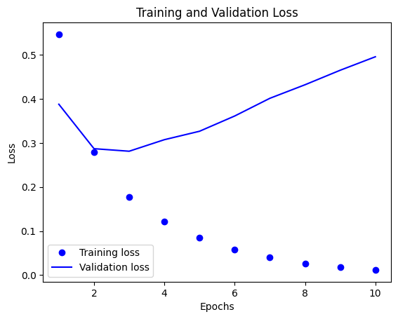
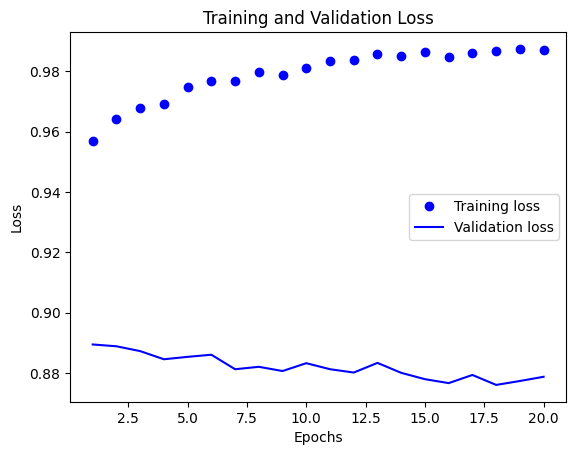
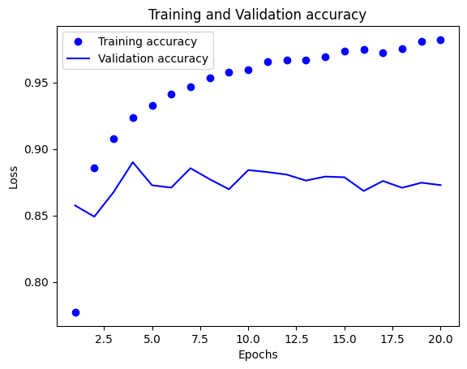
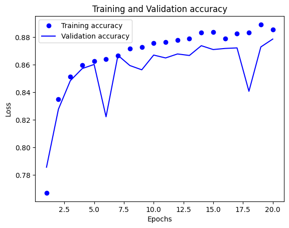
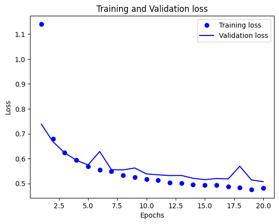

# Deep Learning: Hyperparameter Tuning

## Table of Contents
- [Aim](#aim)
- [Prerequisite](#prerequisite)
- [Steps](#steps)
  - [Step 1: Import the IMDB data from Keras](#step-1-import-the-imdb-data-from-keras)
  - [Step 2: Pre-processing and prepare the data](#step-2-pre-processing-and-prepare-the-data)
    - [Step 2a: Encoding the integer sequences into a binary matrix](#step-2a-encoding-the-integer-sequences-into-a-binary-matrix)
    - [Step 2b: Split it into train and test](#step-2b-split-it-into-train-and-test)
    - [Step 2c: Set aside validation data from the training set](#step-2c-set-aside-validation-data-from-the-training-set)
  - [Step 3: Building the sequential neural network model](#step-3-building-the-sequential-neural-network-model)
    - [Step 3a: You may choose the layers](#step-3a-you-may-choose-the-layers)
    - [Step 3b: Use appropriate activation and loss functions](#step-3b-use-appropriate-activation-and-loss-functions)
  - [Step 4: Compile and fit the model to the training dataset](#step-4-compile-and-fit-the-model-to-the-training-dataset)
  - [Step 5: Plot training and validation loss](#step-5-plot-training-and-validation-loss)
  - [Step 6: Use regularizers to improve the performance](#step-6-use-regularizers-to-improve-the-performance)
  - [Step 7: Record the best performance](#step-7-record-the-best-performance)

## Aim
To perform hyperparameter tuning on a neural network model using the IMDB dataset.

## Prerequisite
- Python Programming
- Numpy
- Pandas
- TensorFlow/Keras

## Steps

### Step 1: Import the IMDB data from Keras
Import the IMDB dataset using Keras.

### Step 2: Pre-processing and prepare the data

#### Step 2a: Encoding the integer sequences into a binary matrix
Encode the integer sequences into a binary matrix for neural network input.

#### Step 2b: Split it into train and test
Split the dataset into training and testing sets.

#### Step 2c: Set aside validation data from the training set
Set aside a portion of the training data to be used as validation data.

### Step 3: Building the sequential neural network model

#### Step 3a: You may choose the layers
Choose the layers for the sequential neural network model.

#### Step 3b: Use appropriate activation and loss functions
Select appropriate activation and loss functions for the neural network.

### Step 4: Compile and fit the model to the training dataset
Compile and fit the model to the training dataset, incorporating validation data as well.

### Step 5: Plot training and validation loss
Plot the training and validation loss to monitor the model's performance over epochs.

### Step 6: Use regularizers to improve the performance
Apply regularizers to the model to enhance performance and prevent overfitting.

### Step 7: Record the best performance
Document the best performance achieved during the tuning process.

```python
# import libraries
import pandas as pd
import numpy as np
import matplotlib.pyplot as plt
from keras.datasets import imdb
from keras import models, layers, losses, metrics, regularizers
from keras.layers import Dropout
from keras.callbacks import ModelCheckpoint
```

## Hyper Parameter Tuning:

# Tasks:
### 1: Import the IMDB data from keras

```python
# Load the IMDB dataset
(train_data, train_labels), (test_data, test_labels) = imdb.load_data(num_words=10000)
```

    Downloading data from https://storage.googleapis.com/tensorflow/tf-keras-datasets/imdb.npz
    17464789/17464789 [==============================] - 32s 2us/step

#### Basic EDA of the dataset:

```python
train_data[1]
```

    [1,
     194,
     1153,
     194,
     8255,
     78,
     228,
     5,
     6,
     1463,
     4369,
     5012,
     134,
     26,
     4,
     715,
     8,
     118,
     1634,
     14,
     394,
     20,
     13,
     119,
     954,
     189,
     102,
     5,
     207,
     110,
     3103,
     21,
     14,
     69,
     188,
     8,
     30,
     23,
     7,
     4,
     249,
     126,
     93,
     4,
     114,
     9,
     2300,
     1523,
     5,
     647,
     4,
     116,
     9,
     35,
     8163,
     4,
     229,
     9,
     340,
     1322,
     4,
     118,
     9,
     4,
     130,
     4901,
     19,
     4,
     1002,
     5,
     89,
     29,
     952,
     46,
     37,
     4,
     455,
     9,
     45,
     43,
     38,
     1543,
     1905,
     398,
     4,
     1649,
     26,
     6853,
     5,
     163,
     11,
     3215,
     2,
     4,
     1153,
     9,
     194,
     775,
     7,
     8255,
     2,
     349,
     2637,
     148,
     605,
     2,
     8003,
     15,
     123,
     125,
     68,
     2,
     6853,
     15,
     349,
     165,
     4362,
     98,
     5,
     4,
     228,
     9,
     43,
     2,
     1157,
     15,
     299,
     120,
     5,
     120,
     174,
     11,
     220,
     175,
     136,
     50,
     9,
     4373,
     228,
     8255,
     5,
     2,
     656,
     245,
     2350,
     5,
     4,
     9837,
     131,
     152,
     491,
     18,
     2,
     32,
     7464,
     1212,
     14,
     9,
     6,
     371,
     78,
     22,
     625,
     64,
     1382,
     9,
     8,
     168,
     145,
     23,
     4,
     1690,
     15,
     16,
     4,
     1355,
     5,
     28,
     6,
     52,
     154,
     462,
     33,
     89,
     78,
     285,
     16,
     145,
     95]

```python
train_data.shape
```

    (25000,)

```python
test_data.shape
```

    (25000,)

```python
test_labels
```

    array([0, 1, 1, ..., 0, 0, 0], dtype=int64)

### Task 2: Pre-processing and prepare the data for giving to the neural network.
#### a. Encoding the integer sequences into a binary matrix.

```python
# Encoding the integer sequences into a binary matrix
def vectorize_sequences(sequences, dimension=10000):
    results = np.zeros((len(sequences), dimension))
    for i, sequence in enumerate(sequences):
        results[i, sequence] = 1.0
    return results

x_train = vectorize_sequences(train_data)
x_test = vectorize_sequences(test_data)
```

```python
x_train
```

    array([[0., 1., 1., ..., 0., 0., 0.],
           [0., 1., 1., ..., 0., 0., 0.],
           [0., 1., 1., ..., 0., 0., 0.],
           ...,
           [0., 1., 1., ..., 0., 0., 0.],
           [0., 1., 1., ..., 0., 0., 0.],
           [0., 1., 1., ..., 0., 0., 0.]])

```python
x_test
```

    array([[0., 1., 1., ..., 0., 0., 0.],
           [0., 1., 1., ..., 0., 0., 0.],
           [0., 1., 1., ..., 0., 0., 0.],
           ...,
           [0., 1., 1., ..., 0., 0., 0.],
           [0., 1., 1., ..., 0., 0., 0.],
           [0., 1., 1., ..., 0., 0., 0.]])

```python
print(x_train.shape, " & ", x_test.shape)
```

    (25000, 10000)  &  (25000, 10000)

#### b. Split it into train and test. (In this case we're taking 10k for training and 10k for testing).

```python
x_val = x_train[:10000]
partial_x_train = x_train[10000:]
y_val = train_labels[:10000]
partial_y_train = train_labels[10000:]

y_train = np.asarray(train_labels).astype('float32')
y_test = np.asarray(test_labels).astype('float32')
```

```python
print(x_val, " ", partial_x_train, " ", y_val, " ", partial_y_train, " ")
```

    [[0. 1. 1. ... 0. 0. 0.]
     [0. 1. 1. ... 0. 0. 0.]
     [0. 1. 1. ... 0. 0. 0.]
     ...
     [0. 1. 1. ... 0. 0. 0.]
     [0. 1. 1. ... 0. 0. 0.]
     [0. 1. 1. ... 1. 0. 0.]]   [[0. 1. 1. ... 0. 0. 0.]
     [0. 1. 0. ... 0. 0. 0.]
     [0. 1. 1. ... 0. 0. 0.]
     ...
     [0. 1. 1. ... 0. 0. 0.]
     [0. 1. 1. ... 0. 0. 0.]
     [0. 1. 1. ... 0. 0. 0.]]   [1 0 0 ... 1 0 0]   [0 0 0 ... 0 1 0]  

```python
y_train[0]
```

    1.0

```python
print(y_train.shape, " & ", y_test.shape)
```

    (25000,)  &  (25000,)

#### c. Set aside validation data from the training set.

```python
model = models.Sequential()
model.add(layers.Dense(16, activation='relu', input_shape=(10000,)))
model.add(layers.Dense(16, activation='relu'))
model.add(layers.Dense(1, activation='sigmoid'))
```

### Task 3: Building the sequential neural network model.
#### a. You may choose the layers.

```python
model = models.Sequential()
model.add(layers.Dense(32, activation='relu', input_shape=(10000,)))
model.add(layers.Dense(16, activation='relu'))
model.add(layers.Dense(1, activation='sigmoid'))
```

#### b. Use appropriate activation and loss functions.

```python
model.compile(optimizer='adam',
              loss='binary_crossentropy',
              metrics=['accuracy'])
```

### Task 4: Compile and fit the model to the training dataset. Use validation also.

```python
history = model.fit(partial_x_train,
                    partial_y_train,
                    epochs=10,
                    batch_size=512,
                    validation_data=(x_val, y_val))
```

    Epoch 1/10
    30/30 [==============================] - 3s 65ms/step - loss: 0.5467 - accuracy: 0.7438 - val_loss: 0.3879 - val_accuracy: 0.8681
    Epoch 2/10
    30/30 [==============================] - 1s 23ms/step - loss: 0.2799 - accuracy: 0.9103 - val_loss: 0.2870 - val_accuracy: 0.8883
    Epoch 3/10
    30/30 [==============================] - 1s 22ms/step - loss: 0.1768 - accuracy: 0.9439 - val_loss: 0.2812 - val_accuracy: 0.8866
    Epoch 4/10
    30/30 [==============================] - 1s 22ms/step - loss: 0.1211 - accuracy: 0.9649 - val_loss: 0.3074 - val_accuracy: 0.8817
    Epoch 5/10
    30/30 [==============================] - 1s 24ms/step - loss: 0.0858 - accuracy: 0.9784 - val_loss: 0.3266 - val_accuracy: 0.8798
    Epoch 6/10
    30/30 [==============================] - 1s 22ms/step - loss: 0.0582 - accuracy: 0.9893 - val_loss: 0.3612 - val_accuracy: 0.8803
    Epoch 7/10
    30/30 [==============================] - 1s 22ms/step - loss: 0.0401 - accuracy: 0.9942 - val_loss: 0.4014 - val_accuracy: 0.8765
    Epoch 8/10
    30/30 [==============================] - 1s 22ms/step - loss: 0.0263 - accuracy: 0.9973 - val_loss: 0.4322 - val_accuracy: 0.8748
    Epoch 9/10
    30/30 [==============================] - 1s 22ms/step - loss: 0.0174 - accuracy: 0.9991 - val_loss: 0.4651 - val_accuracy: 0.8740
    Epoch 10/10
    30/30 [==============================] - 1s 21ms/step - loss: 0.0119 - accuracy: 0.9995 - val_loss: 0.4957 - val_accuracy: 0.8738

### Task 5: Plot training and validation loss.

```python
history_dict = history.history
loss_values = history_dict['loss']
val_loss_values = history_dict['val_loss']

epochs = range(1, len(loss_values) + 1)

plt.plot(epochs, loss_values, 'bo', label='Training loss')
plt.plot(epochs, val_loss_values, 'b', label='Validation loss')
plt.title('Training and Validation Loss')
plt.xlabel('Epochs')
plt.ylabel('Loss')
plt.legend()
plt.show()
```

    

    

### Task 6: Use regularizes to improve the performance.

```python
model = models.Sequential()
model.add(layers.Dense(16, activation='relu', input_shape=(10000,)))
model.add(Dropout(0.5))
model.add(layers.Dense(16, activation='relu'))
model.add(Dropout(0.5))
model.add(layers.Dense(1, activation='sigmoid'))
```

### Task 7: Record the best performance.

```python
# Re-compile the model before training
model.compile(optimizer='adam',
              loss='binary_crossentropy',
              metrics=['accuracy'])

checkpoint = ModelCheckpoint("best_model.h5", monitor="val_loss", save_best_only=True)
history = model.fit(partial_x_train,
                    partial_y_train,
                    epochs=20,
                    batch_size=512,
                    validation_data=(x_val, y_val), # Using validation set here.
                    callbacks=[checkpoint])
```

    Epoch 1/20
    30/30 [==============================] - 3s 68ms/step - loss: 0.1618 - accuracy: 0.9570 - val_loss: 0.3150 - val_accuracy: 0.8895
    Epoch 2/20
    30/30 [==============================] - 1s 22ms/step - loss: 0.1403 - accuracy: 0.9642 - val_loss: 0.3392 - val_accuracy: 0.8889
    Epoch 3/20
    30/30 [==============================] - 1s 22ms/step - loss: 0.1284 - accuracy: 0.9677 - val_loss: 0.3744 - val_accuracy: 0.8873
    Epoch 4/20
    30/30 [==============================] - 1s 23ms/step - loss: 0.1149 - accuracy: 0.9691 - val_loss: 0.3891 - val_accuracy: 0.8846
    Epoch 5/20
    30/30 [==============================] - 1s 22ms/step - loss: 0.1035 - accuracy: 0.9749 - val_loss: 0.4145 - val_accuracy: 0.8854
    Epoch 6/20
    30/30 [==============================] - 1s 22ms/step - loss: 0.0923 - accuracy: 0.9769 - val_loss: 0.4382 - val_accuracy: 0.8861
    Epoch 7/20
    30/30 [==============================] - 1s 23ms/step - loss: 0.0894 - accuracy: 0.9768 - val_loss: 0.4811 - val_accuracy: 0.8813
    Epoch 8/20
    30/30 [==============================] - 1s 22ms/step - loss: 0.0822 - accuracy: 0.9797 - val_loss: 0.4981 - val_accuracy: 0.8821
    Epoch 9/20
    30/30 [==============================] - 1s 22ms/step - loss: 0.0801 - accuracy: 0.9789 - val_loss: 0.5213 - val_accuracy: 0.8807
    Epoch 10/20
    30/30 [==============================] - 1s 23ms/step - loss: 0.0736 - accuracy: 0.9809 - val_loss: 0.4999 - val_accuracy: 0.8833
    Epoch 11/20
    30/30 [==============================] - 1s 23ms/step - loss: 0.0700 - accuracy: 0.9835 - val_loss: 0.5694 - val_accuracy: 0.8813
    Epoch 12/20
    30/30 [==============================] - 1s 22ms/step - loss: 0.0655 - accuracy: 0.9839 - val_loss: 0.6040 - val_accuracy: 0.8802
    Epoch 13/20
    30/30 [==============================] - 1s 23ms/step - loss: 0.0605 - accuracy: 0.9858 - val_loss: 0.5856 - val_accuracy: 0.8834
    Epoch 14/20
    30/30 [==============================] - 1s 23ms/step - loss: 0.0626 - accuracy: 0.9852 - val_loss: 0.6414 - val_accuracy: 0.8801
    Epoch 15/20
    30/30 [==============================] - 1s 22ms/step - loss: 0.0597 - accuracy: 0.9864 - val_loss: 0.6726 - val_accuracy: 0.8780
    Epoch 16/20
    30/30 [==============================] - 1s 22ms/step - loss: 0.0597 - accuracy: 0.9847 - val_loss: 0.7203 - val_accuracy: 0.8767
    Epoch 17/20
    30/30 [==============================] - 1s 23ms/step - loss: 0.0564 - accuracy: 0.9862 - val_loss: 0.7045 - val_accuracy: 0.8794
    Epoch 18/20
    30/30 [==============================] - 1s 22ms/step - loss: 0.0528 - accuracy: 0.9867 - val_loss: 0.7231 - val_accuracy: 0.8761
    Epoch 19/20
    30/30 [==============================] - 1s 23ms/step - loss: 0.0547 - accuracy: 0.9874 - val_loss: 0.7940 - val_accuracy: 0.8774
    Epoch 20/20
    30/30 [==============================] - 1s 23ms/step - loss: 0.0530 - accuracy: 0.9871 - val_loss: 0.7339 - val_accuracy: 0.8788

```python
history_dict = history.history
loss_values = history_dict['accuracy']
val_loss_values = history_dict['val_accuracy']

epochs = range(1, len(loss_values) + 1)

plt.plot(epochs, loss_values, 'bo', label='Training accuracy')
plt.plot(epochs, val_loss_values, 'b', label='Validation accuracy')
plt.title('Training and Validation accuracy')
plt.xlabel('Epochs')
plt.ylabel('Loss')
plt.legend()
plt.show()
```

    

    

```python
model_1 = models.Sequential()
model_1.add(layers.Dense(16, kernel_regularizer = regularizers.l2(0.001), activation='relu', input_shape=(10000,)))
model_1.add(layers.Dense(16, kernel_regularizer = regularizers.l2(0.001), activation='relu'))
model_1.add(layers.Dense(1, activation='sigmoid'))
```

```python
# Re-compile the model before training
model_1.compile(optimizer='rmsprop',
              loss='binary_crossentropy',
              metrics=['accuracy'])

checkpoint = ModelCheckpoint("best_model.h5", monitor="val_loss", save_best_only=True)

history = model_1.fit(partial_x_train,
                    partial_y_train,
                    epochs=20,
                    batch_size=512,
                    validation_data=(x_val, y_val), # Using validation set here.
                    callbacks=[checkpoint])
```

    Epoch 1/20
    30/30 [==============================] - 2s 45ms/step - loss: 0.6005 - accuracy: 0.7773 - val_loss: 0.4819 - val_accuracy: 0.8575
    Epoch 2/20
    30/30 [==============================] - 1s 27ms/step - loss: 0.4062 - accuracy: 0.8858 - val_loss: 0.4202 - val_accuracy: 0.8491
    Epoch 3/20
    30/30 [==============================] - 1s 22ms/step - loss: 0.3226 - accuracy: 0.9077 - val_loss: 0.3675 - val_accuracy: 0.8675
    Epoch 4/20
    30/30 [==============================] - 1s 20ms/step - loss: 0.2756 - accuracy: 0.9235 - val_loss: 0.3307 - val_accuracy: 0.8900
    Epoch 5/20
    30/30 [==============================] - 0s 16ms/step - loss: 0.2495 - accuracy: 0.9327 - val_loss: 0.3659 - val_accuracy: 0.8727
    Epoch 6/20
    30/30 [==============================] - 0s 16ms/step - loss: 0.2289 - accuracy: 0.9413 - val_loss: 0.3710 - val_accuracy: 0.8709
    Epoch 7/20
    30/30 [==============================] - 0s 16ms/step - loss: 0.2143 - accuracy: 0.9469 - val_loss: 0.3402 - val_accuracy: 0.8855
    Epoch 8/20
    30/30 [==============================] - 0s 16ms/step - loss: 0.2030 - accuracy: 0.9533 - val_loss: 0.3767 - val_accuracy: 0.8772
    Epoch 9/20
    30/30 [==============================] - 0s 16ms/step - loss: 0.1952 - accuracy: 0.9577 - val_loss: 0.3857 - val_accuracy: 0.8697
    Epoch 10/20
    30/30 [==============================] - 0s 16ms/step - loss: 0.1876 - accuracy: 0.9593 - val_loss: 0.3588 - val_accuracy: 0.8841
    Epoch 11/20
    30/30 [==============================] - 0s 16ms/step - loss: 0.1783 - accuracy: 0.9653 - val_loss: 0.3719 - val_accuracy: 0.8826
    Epoch 12/20
    30/30 [==============================] - 0s 16ms/step - loss: 0.1720 - accuracy: 0.9667 - val_loss: 0.3776 - val_accuracy: 0.8807
    Epoch 13/20
    30/30 [==============================] - 0s 16ms/step - loss: 0.1698 - accuracy: 0.9665 - val_loss: 0.4065 - val_accuracy: 0.8762
    Epoch 14/20
    30/30 [==============================] - 0s 16ms/step - loss: 0.1653 - accuracy: 0.9695 - val_loss: 0.3974 - val_accuracy: 0.8792
    Epoch 15/20
    30/30 [==============================] - 0s 16ms/step - loss: 0.1591 - accuracy: 0.9737 - val_loss: 0.4047 - val_accuracy: 0.8787
    Epoch 16/20
    30/30 [==============================] - 0s 16ms/step - loss: 0.1518 - accuracy: 0.9747 - val_loss: 0.4209 - val_accuracy: 0.8684
    Epoch 17/20
    30/30 [==============================] - 0s 16ms/step - loss: 0.1558 - accuracy: 0.9725 - val_loss: 0.4127 - val_accuracy: 0.8759
    Epoch 18/20
    30/30 [==============================] - 0s 16ms/step - loss: 0.1505 - accuracy: 0.9753 - val_loss: 0.4350 - val_accuracy: 0.8708
    Epoch 19/20
    30/30 [==============================] - 0s 16ms/step - loss: 0.1420 - accuracy: 0.9806 - val_loss: 0.4254 - val_accuracy: 0.8746
    Epoch 20/20
    30/30 [==============================] - 0s 14ms/step - loss: 0.1371 - accuracy: 0.9821 - val_loss: 0.4325 - val_accuracy: 0.8728

```python
history_dict = history.history
loss_values = history_dict['accuracy']
val_loss_values = history_dict['val_accuracy']

epochs = range(1, len(loss_values) + 1)

plt.plot(epochs, loss_values, 'bo', label='Training accuracy')
plt.plot(epochs, val_loss_values, 'b', label='Validation accuracy')
plt.title('Training and Validation accuracy')
plt.xlabel('Epochs')
plt.ylabel('Loss')
plt.legend()
plt.show()
```

    

    

```python
model_2 = models.Sequential()
model_2.add(layers.Dense(16, kernel_regularizer = regularizers.l1(0.001), activation='relu', input_shape=(10000,)))
model_2.add(layers.Dense(16, kernel_regularizer = regularizers.l1(0.001), activation='relu'))
model_2.add(layers.Dense(1, activation='sigmoid'))
```

```python
# Re-compile the model before training
model_2.compile(optimizer='rmsprop',
              loss='binary_crossentropy',
              metrics=['accuracy'])

checkpoint = ModelCheckpoint("best_model.h5", monitor="val_loss", save_best_only=True)

history = model_2.fit(partial_x_train,
                    partial_y_train,
                    epochs=20,
                    batch_size=512,
                    validation_data=(x_val, y_val), # Using validation set here.
                    callbacks=[checkpoint])
```

    Epoch 1/20
    30/30 [==============================] - 2s 40ms/step - loss: 1.1405 - accuracy: 0.7671 - val_loss: 0.7383 - val_accuracy: 0.7857
    Epoch 2/20
    30/30 [==============================] - 0s 16ms/step - loss: 0.6789 - accuracy: 0.8352 - val_loss: 0.6675 - val_accuracy: 0.8278
    Epoch 3/20
    30/30 [==============================] - 1s 18ms/step - loss: 0.6236 - accuracy: 0.8513 - val_loss: 0.6229 - val_accuracy: 0.8485
    Epoch 4/20
    30/30 [==============================] - 0s 16ms/step - loss: 0.5933 - accuracy: 0.8597 - val_loss: 0.5934 - val_accuracy: 0.8573
    Epoch 5/20
    30/30 [==============================] - 1s 19ms/step - loss: 0.5689 - accuracy: 0.8625 - val_loss: 0.5742 - val_accuracy: 0.8603
    Epoch 6/20
    30/30 [==============================] - 0s 16ms/step - loss: 0.5545 - accuracy: 0.8641 - val_loss: 0.6283 - val_accuracy: 0.8223
    Epoch 7/20
    30/30 [==============================] - 1s 46ms/step - loss: 0.5491 - accuracy: 0.8668 - val_loss: 0.5554 - val_accuracy: 0.8669
    Epoch 8/20
    30/30 [==============================] - 1s 33ms/step - loss: 0.5324 - accuracy: 0.8719 - val_loss: 0.5544 - val_accuracy: 0.8595
    Epoch 9/20
    30/30 [==============================] - 0s 15ms/step - loss: 0.5253 - accuracy: 0.8728 - val_loss: 0.5621 - val_accuracy: 0.8564
    Epoch 10/20
    30/30 [==============================] - 1s 18ms/step - loss: 0.5177 - accuracy: 0.8757 - val_loss: 0.5382 - val_accuracy: 0.8671
    Epoch 11/20
    30/30 [==============================] - 1s 24ms/step - loss: 0.5130 - accuracy: 0.8765 - val_loss: 0.5347 - val_accuracy: 0.8650
    Epoch 12/20
    30/30 [==============================] - 1s 25ms/step - loss: 0.5040 - accuracy: 0.8781 - val_loss: 0.5315 - val_accuracy: 0.8679
    Epoch 13/20
    30/30 [==============================] - 0s 16ms/step - loss: 0.5018 - accuracy: 0.8791 - val_loss: 0.5320 - val_accuracy: 0.8668
    Epoch 14/20
    30/30 [==============================] - 0s 17ms/step - loss: 0.4944 - accuracy: 0.8836 - val_loss: 0.5206 - val_accuracy: 0.8739
    Epoch 15/20
    30/30 [==============================] - 1s 23ms/step - loss: 0.4928 - accuracy: 0.8839 - val_loss: 0.5152 - val_accuracy: 0.8711
    Epoch 16/20
    30/30 [==============================] - 0s 16ms/step - loss: 0.4927 - accuracy: 0.8791 - val_loss: 0.5197 - val_accuracy: 0.8719
    Epoch 17/20
    30/30 [==============================] - 0s 16ms/step - loss: 0.4870 - accuracy: 0.8827 - val_loss: 0.5181 - val_accuracy: 0.8723
    Epoch 18/20
    30/30 [==============================] - 0s 16ms/step - loss: 0.4840 - accuracy: 0.8835 - val_loss: 0.5690 - val_accuracy: 0.8408
    Epoch 19/20
    30/30 [==============================] - 1s 24ms/step - loss: 0.4756 - accuracy: 0.8893 - val_loss: 0.5138 - val_accuracy: 0.8730
    Epoch 20/20
    30/30 [==============================] - 1s 20ms/step - loss: 0.4808 - accuracy: 0.8857 - val_loss: 0.5070 - val_accuracy: 0.8787

```python
history_dict = history.history
loss_values = history_dict['accuracy']
val_loss_values = history_dict['val_accuracy']

epochs = range(1, len(loss_values) + 1)

plt.plot(epochs, loss_values, 'bo', label='Training accuracy')
plt.plot(epochs, val_loss_values, 'b', label='Validation accuracy')
plt.title('Training and Validation accuracy')
plt.xlabel('Epochs')
plt.ylabel('Loss')
plt.legend()
plt.show()
```

    

    

```python
history_dict = history.history
loss_values = history_dict['loss']
val_loss_values = history_dict['val_loss']

epochs = range(1, len(loss_values) + 1)

plt.plot(epochs, loss_values, 'bo', label='Training loss')
plt.plot(epochs, val_loss_values, 'b', label='Validation loss')
plt.title('Training and Validation loss')
plt.xlabel('Epochs')
plt.ylabel('Loss')
plt.legend()
plt.show()
```

    

    

