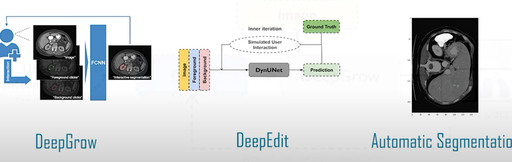
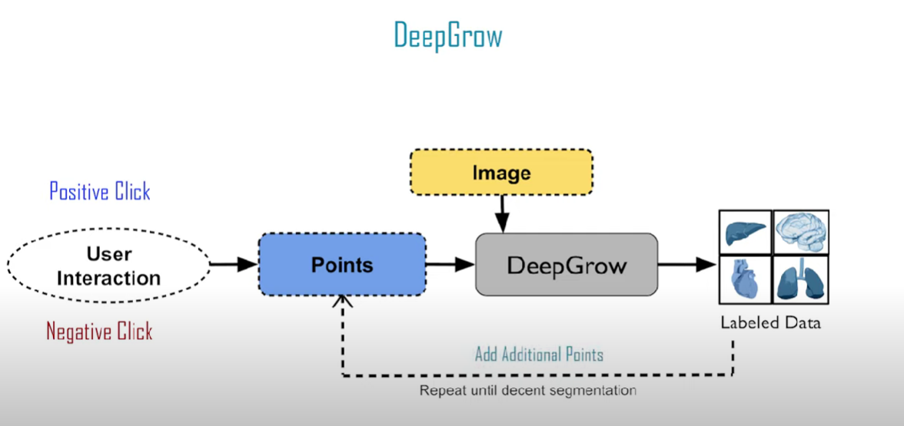
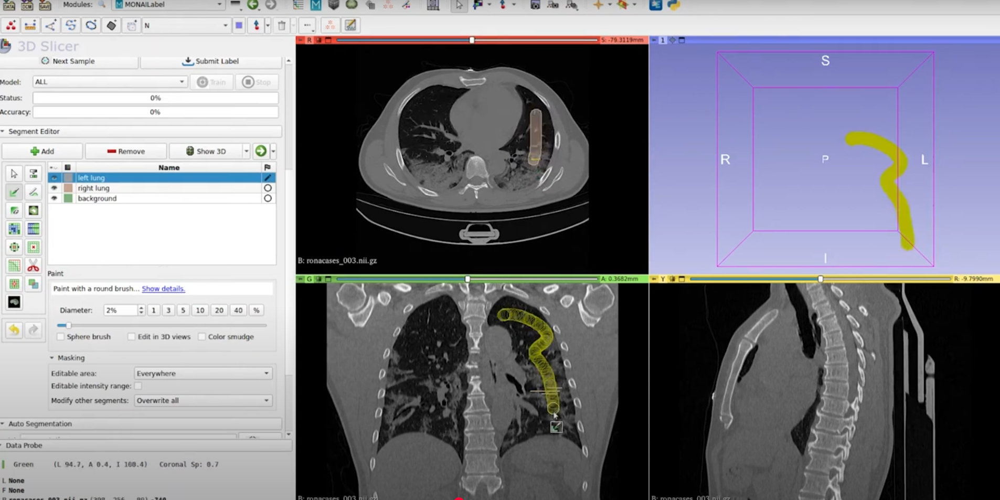

Clinicians don't need another flashy model; they need cleaner labels with fewer clicks. Many imaging teams juggle viewers, folders, and long review queues, and the fatigue shows up in inconsistent masks and stalled projects. This article describes a small, repeatable _loop_ that helps: pre‑annotate scans, route the most informative studies to reviewers, and fold corrections back into the model — steady quality gains without turning workflow upside down.

Why now? Two things converged. First, MONAI Label is a practical toolkit for AI‑assisted annotation: it plugs into familiar viewers (`3D Slicer`, `MITK`, `OHIF`), serves predictions in real time, and learns from user corrections via active learning. Second, notebook workflows make iteration tight—short runs, quick comparisons, easy sharing—so you can measure improvement instead of guessing.

Why that GIS meme fits here (optional note)

Missing sidecar files in GIS have the same energy as incomplete medical image shares: DICOM without key metadata, masks without the paired scan, or half‑pinned environments. The point isn’t the meme—it’s the reminder to prefer shareable, reproducible setups. See the meme: [“missing sidecar files”](https://www.linkedin.com/posts/milan-janosov_i-will-officially-post-this-every-time-i-activity-7378323152818470912-IVz3?utm_source=share&utm_medium=member_desktop&rcm=ACoAADSJzvgBkjBd85IWDyUWA6ttzq8B-NDq-Hs). Background on medical image sharing and setup friction: [1](https://www.mantralabsglobal.com/blog/how-are-medical-images-shared-among-healthcare-enterprises/), [3](https://docs.monai.io/projects/label/en/latest/installation.html), [5](https://monai.io/deploy.html).

We’ll keep terms simple and defined once. The aim here is modest and useful: DICOM (the standard medical‑imaging format) in → suggestion in the viewer → reviewer correction → scheduled update. Accuracy first; any LLM help is optional and scoped to brief triage notes.

### Quick primer

DICOM is the common file and metadata standard for medical images (CT, MRI, etc.); it packages pixels plus context like acquisition details and patient/study identifiers. Active learning is a feedback loop where the model flags uncertain or diverse cases for human review, so each annotation teaches the model where it struggles most. MONAI Label is the glue for this workflow: an annotation server that connects to viewers (`3D Slicer`, `MITK`, `OHIF`), serves interactive segmentations or classifications, captures edits, and supports strategies for selecting what to annotate next. Put together, you get faster annotations without skipping the expert in the loop.

### The loop, in one pass

Start small. Point the server at a [compact study list](https://www.zotero.org/) and connect a viewer. Let the model draft a first pass; reviewers correct in place, and those edits become training signal.

- Selection: surface the next batch by uncertainty and diversity so you don’t re‑label the same easy cases.
- Update: retrain on a cadence (e.g., nightly) and promote only if simple baselines are beaten on held‑out cases.

That’s the shape: DICOM in, suggestions in the viewer, corrections captured, small updates on a schedule. In a shared notebook, this stays visible—short runs, quick comparisons, comments where decisions were made—without changing the tools reviewers use day‑to‑day.

### Human‑in‑the‑loop ergonomics

Keep people in the viewer they already use. Don’t ask for five new tabs or a training course. The draft shows up where they’re looking, and common actions are close at hand: accept a slice, nudge a contour, fix what’s wrong. When time matters, small controls beat clever ones. A couple of well‑placed hotkeys go further than a new panel. If you want extras like push‑to‑talk notes or a controller button for “next case,” make them optional.

Uncertainty should be visible without hunting. If the model isn’t sure, say so and link the cue to the exact slice or region. That context is what speeds up decisions.

The notebook is the workbench off to the side. Pin the environment, keep a short log of runs, compare yesterday's model to today's. Review happens in the viewer; the paper trail lives with the experiments.

Obligatory xkcd (and why human oversight matters)

_[xkcd #1619](https://xkcd.com/1619/): This is what happens when you skip the "reviewer in the loop" step. Our approach keeps humans in the driver's seat; the model suggests, reviewers decide._

### From notebook widgets to clinical viewers

grug see pattern: researcher prototype in notebook widget. click point, model make mask, grug fix. fast! tight loop! widget like `molabel` (see [why this pitch came to mind](#why-this-pitch-came-to-mind)) good for small dataset, quick try.

but grug ask: what when need share with team? what when need handle real DICOM from hospital? what when need audit log for compliance?

MONAI Label take same pattern, put in viewer radiologist already use. `3D Slicer`, `MITK`, `OHIF`—familiar tools, no retraining. same click-draft-fix flow, but now shareable, logged, handles proper medical format. notebook widget prove idea work; MONAI Label make work for team who actually ship.

grug like this: simple idea scale up without add too much complexity demon ([h/t grugbrain.dev](https://grugbrain.dev/)).

### Guardrails

Start with public datasets (`Task09_Spleen`, `KiTS`, `MSD` from the [Medical Segmentation Decathlon](http://medicaldecathlon.com/)) or synthetic data so you can iterate without waiting for clearances. Use deterministic baselines first—`UNet` or `UNETR` architectures that ship with MONAI Label—and only add an LLM layer if you need short triage notes or priority hints. Keep the core segmentation or classification deterministic so you can debug predictions without chasing model drift. GPU speeds things up but isn't required; most workflows run fine on CPU for small batches.

### One case through the loop

Take `spleen_042`, a CT from the [Medical Segmentation Decathlon](http://medicaldecathlon.com/) (`Task09_Spleen`). The baseline `UNet` drafts a mask but flags high uncertainty along the posterior edge. The reviewer opens it in `3D Slicer`, sees the draft clips the tail, and nudges three contours with `DeepEdit`'s interactive brush. The rest looks fine, so they accept and move to the next case. That correction gets logged. Overnight, the model retrains on the growing batch; next morning, similar posterior-edge cases improve—just a tighter mask and one less thing to fix manually next time.

Visual: MONAI Label annotation workflows (DeepGrow, DeepEdit, Automatic)

Visual: Interactive annotation with DeepGrow and DeepEdit

Visual: 3D Slicer with MONAI Label plugin in action

### Trade-offs

This loop isn't magic. You need a seed set of labels to start; cold-start quality depends on how good those first dozen annotations are. Active learning can miss rare cases if the selection strategy favors common patterns, so you still need periodic spot checks. Curator time matters too—reviewers save clicks per case, but someone has to decide when to retrain, what baselines to trust, and how to handle edge-case disagreements. If the model drifts or a bad batch sneaks through, you'll spend time unwinding it. Keep the loop observable: log what was selected and why, compare new models against simple held-out tests, and be ready to roll back if a nightly update regresses.

### Where notebooks fit

A shared notebook workspace (like Deepnote) is where the loop stays reproducible. Pin the Python environment and MONAI Label version so everyone runs the same stack. Track short training runs in-line—loss curves, held-out metrics, which cases were selected—and leave comments next to cells when you adjust a hyperparameter or promote a new baseline. Teammates can compare yesterday's model to today's without hunting through logs. If you need to demo a result or hand off the setup, share the notebook; the code, data paths, and decision trail travel together.

Why this pitch came to mind

I saw a [gamepad-driven annotation demo](https://youtu.be/fYlsew5PGag?si=DXlfTPiRvyihbSZv) where you could zip through examples using controller buttons and speech input—back, forward, label—without touching a mouse. That flow stuck with me. When I started thinking about MONAI Label and active learning, the pieces connected: same "keep reviewers in their tools" energy, but now applied to medical imaging with real clinical utility. There's also [this CV setup demo](https://youtu.be/yxdGw-52M8c?si=mnnU_FyZgqRe7fwi) showing interactive annotation with Meta's segment-anything model in a notebook—reactive UI, instant feedback, practical for dataset work. It felt natural to pull those ideas together and sketch out what a reproducible, shareable annotation loop could look like with MONAI Label at the core.

---

### References

- *MONAI Label project*: [https://monai.io/label.html](https://monai.io/label.html)
- *MONAI Label documentation*: [https://docs.monai.io/projects/label/en/latest/](https://docs.monai.io/projects/label/en/latest/)
- *MONAI Label GitHub*: [https://github.com/Project-MONAI/MONAILabel](https://github.com/Project-MONAI/MONAILabel)
- *Medical Segmentation Decathlon*: [http://medicaldecathlon.com/](http://medicaldecathlon.com/)
- Andres Diaz-Pinto, *"MONAI Label: an open source image labelling and learning tool"* (Hamlyn Centre): [https://youtu.be/yWJfSmEAstA?si=5kRlsTdy-sn0hDnj](https://youtu.be/yWJfSmEAstA?si=5kRlsTdy-sn0hDnj)
- *"MONAI Label - Training from Scratch"*: [https://youtu.be/3HTh2dqZqew?si=IQaZrjpU_B8IkfoD](https://youtu.be/3HTh2dqZqew?si=IQaZrjpU_B8IkfoD)
- *Gamepad-driven annotation demo*: [https://youtu.be/fYlsew5PGag?si=DXlfTPiRvyihbSZv](https://youtu.be/fYlsew5PGag?si=DXlfTPiRvyihbSZv)
- *Interactive CV annotation setup*: [https://youtu.be/yxdGw-52M8c?si=mnnU_FyZgqRe7fwi](https://youtu.be/yxdGw-52M8c?si=mnnU_FyZgqRe7fwi)
- *Zotero* (study organization): [https://www.zotero.org/](https://www.zotero.org/)
- *Deepnote*: [https://deepnote.com/](https://deepnote.com/)
