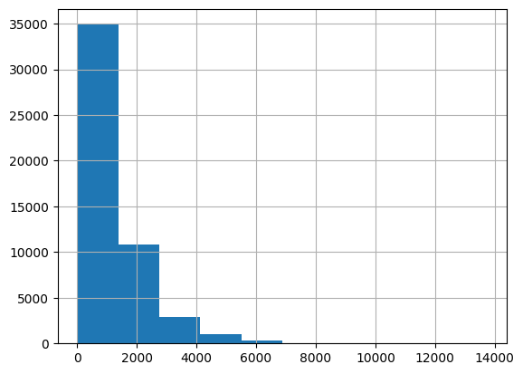
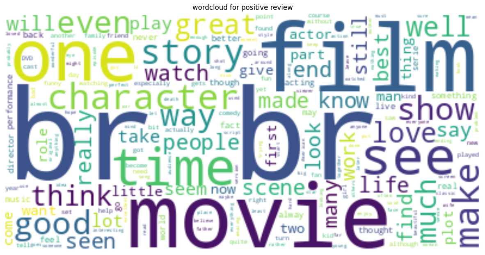

# Natural Language Processing

## Table of Contents
- [Aim](#aim)
- [Prerequisite](#prerequisite)
- [Outcome](#outcome)
- [Theory](#theory)
- [Task to be completed in PART B](#task-to-be-completed-in-part-b)
- [References](#references)

## Aim
### Information Extraction-POS tagging and NER
- Identify Part of Speech such as Noun, Verb, Adjective, Adverb and tag it.
- Identify named entity in the text for Named Entity Recognition.

## Prerequisite
- Python

## Outcome
After successful completion of this experiment, students will be able to:
1. Explore various methods to tag the POS and identify the named entity.
2. Apply the above concepts on datasets to create features for ML/DL models.

## Theory
### POS Tagging
POS tagging is the process of assigning one of the parts of speech to each word in a sentence. Parts of speech include nouns, verbs, adjectives, adverbs, pronouns, conjunctions, and their sub-categories.

### Named Entity Recognition (NER)
Named Entity Recognition (NER) is a method in NLP that extracts important information from text, categorizing entities such as names, locations, companies, events, products, dates, monetary values, and percentages. It is crucial for various NLP applications including chatbots, sentiment analysis, and search engines.

### Information Extraction Architecture

## Task to be completed in PART B
### Task
#### A.5.1. Task
- Implement POS tagging and identify Named Entity in the given text using:
  i. NLTK
  ii. Spacy
- Select a dataset from real-world examples (e.g., reviews of firms/products/books/hotels) and perform the following tasks:
  i. Remove noise (stopwords, punctuation) from predictor columns.
  ii. Create features such as total word length, number of unique words, number of bigrams.
  iii. Create features for POS tags and named entity tags.

For further information and examples, refer to:
- [Kaggle - Named Entity Recognition using NLTK and Spacy](https://www.kaggle.com/code/suruthi41/named-entity-recognition-using-nltk-and-spacy)
- [Kaggle - NLP with Spacy, NLTK, Gensim](https://www.kaggle.com/code/faressayah/nlp-with-spacy-nltk-gensim)
- [Kaggle - NLP Getting Started Competition](https://www.kaggle.com/competitions/nlp-getting-started/data)


```python
# import libraries used:
import nltk
from nltk.tokenize import word_tokenize, sent_tokenize
from nltk import pos_tag, ne_chunk

import spacy
import pandas as pd
import nltk
from nltk.corpus import stopwords
import string

from nltk.util import bigrams
from collections import Counter
from wordcloud import WordCloud
import matplotlib.pyplot as plt
from sklearn.model_selection import train_test_split
```

# Task 1:
### a. Implement POS tagging and identify Named Entity on the given text using:
#### 1. Nltk
#### 2. Spacy

```python
sample_text = "SpaCy is a powerful library for natural language processing (NLP) in Python. It provides pre-trained models for various languages, including English, and allows you to perform tasks such as tokenization, part-of-speech tagging, named entity recognition, and more. SpaCy is known for its speed and efficiency, making it a popular choice for NLP tasks in both research and industry.In addition to its core features, spaCy also offers support for customizing and training models, which can be useful when working with specialized domains or languages. The spaCy library has a user-friendly API that makes it easy to integrate into your NLP workflows.For example, you can use spaCy to analyze text documents, extract meaningful information, and gain insights from textual data. Whether you're working on sentiment analysis, text classification, or information extraction, spaCy can be a valuable tool in your NLP toolkit.To get started with spaCy, you can install it using pip and then load the language model of your choice. Once you have spaCy up and running, you can start experimenting with various NLP tasks and techniques. Happy experimenting!"
```

```python
sample_text # On which we will be performing POS Tagging and NER using both methods
```

    "SpaCy is a powerful library for natural language processing (NLP) in Python. It provides pre-trained models for various languages, including English, and allows you to perform tasks such as tokenization, part-of-speech tagging, named entity recognition, and more. SpaCy is known for its speed and efficiency, making it a popular choice for NLP tasks in both research and industry.In addition to its core features, spaCy also offers support for customizing and training models, which can be useful when working with specialized domains or languages. The spaCy library has a user-friendly API that makes it easy to integrate into your NLP workflows.For example, you can use spaCy to analyze text documents, extract meaningful information, and gain insights from textual data. Whether you're working on sentiment analysis, text classification, or information extraction, spaCy can be a valuable tool in your NLP toolkit.To get started with spaCy, you can install it using pip and then load the language model of your choice. Once you have spaCy up and running, you can start experimenting with various NLP tasks and techniques. Happy experimenting!"

```python
nltk.download('words')
```

    [nltk_data] Downloading package words to /root/nltk_data...
    [nltk_data]   Unzipping corpora/words.zip.

    True

#### 1. Nltk method:

```python
nltk.download('stopwords')
```

    [nltk_data] Downloading package stopwords to /root/nltk_data...
    [nltk_data]   Unzipping corpora/stopwords.zip.

    True

```python
# Tokenize the text into sentences and words
sentences = sent_tokenize(sample_text)
words = [word_tokenize(sentence) for sentence in sentences]
```

```python
# Performing POS tagging
pos_tags = [pos_tag(word) for word in words]
```

```python
# Performing NER
ner_tags = [ne_chunk(pos_tag(word)) for word in words]
```

```python
# Print the results
for i, sentence in enumerate(sentences):
    print(f"Sentence {i+1}:")
    print("POS Tags:")
    print(pos_tags[i])
    print()
    print("Named Entities:")
    print(ner_tags[i])
    print("\n")
```

    Sentence 1:
    POS Tags:
    [('SpaCy', 'NNP'), ('is', 'VBZ'), ('a', 'DT'), ('powerful', 'JJ'), ('library', 'NN'), ('for', 'IN'), ('natural', 'JJ'), ('language', 'NN'), ('processing', 'NN'), ('(', '('), ('NLP', 'NNP'), (')', ')'), ('in', 'IN'), ('Python', 'NNP'), ('.', '.')]
    
    Named Entities:
    (S
      (GPE SpaCy/NNP)
      is/VBZ
      a/DT
      powerful/JJ
      library/NN
      for/IN
      natural/JJ
      language/NN
      processing/NN
      (/(
      (ORGANIZATION NLP/NNP)
      )/)
      in/IN
      (GPE Python/NNP)
      ./.)
    
    
    Sentence 2:
    POS Tags:
    [('It', 'PRP'), ('provides', 'VBZ'), ('pre-trained', 'JJ'), ('models', 'NNS'), ('for', 'IN'), ('various', 'JJ'), ('languages', 'NNS'), (',', ','), ('including', 'VBG'), ('English', 'NNP'), (',', ','), ('and', 'CC'), ('allows', 'VBZ'), ('you', 'PRP'), ('to', 'TO'), ('perform', 'VB'), ('tasks', 'NNS'), ('such', 'JJ'), ('as', 'IN'), ('tokenization', 'NN'), (',', ','), ('part-of-speech', 'JJ'), ('tagging', 'NN'), (',', ','), ('named', 'VBN'), ('entity', 'NN'), ('recognition', 'NN'), (',', ','), ('and', 'CC'), ('more', 'JJR'), ('.', '.')]
    
    Named Entities:
    (S
      It/PRP
      provides/VBZ
      pre-trained/JJ
      models/NNS
      for/IN
      various/JJ
      languages/NNS
      ,/,
      including/VBG
      (GPE English/NNP)
      ,/,
      and/CC
      allows/VBZ
      you/PRP
      to/TO
      perform/VB
      tasks/NNS
      such/JJ
      as/IN
      tokenization/NN
      ,/,
      part-of-speech/JJ
      tagging/NN
      ,/,
      named/VBN
      entity/NN
      recognition/NN
      ,/,
      and/CC
      more/JJR
      ./.)
    
    
    Sentence 3:
    POS Tags:
    [('SpaCy', 'NNP'), ('is', 'VBZ'), ('known', 'VBN'), ('for', 'IN'), ('its', 'PRP$'), ('speed', 'NN'), ('and', 'CC'), ('efficiency', 'NN'), (',', ','), ('making', 'VBG'), ('it', 'PRP'), ('a', 'DT'), ('popular', 'JJ'), ('choice', 'NN'), ('for', 'IN'), ('NLP', 'NNP'), ('tasks', 'NNS'), ('in', 'IN'), ('both', 'DT'), ('research', 'NN'), ('and', 'CC'), ('industry.In', 'JJ'), ('addition', 'NN'), ('to', 'TO'), ('its', 'PRP$'), ('core', 'NN'), ('features', 'NNS'), (',', ','), ('spaCy', 'NN'), ('also', 'RB'), ('offers', 'VBZ'), ('support', 'NN'), ('for', 'IN'), ('customizing', 'VBG'), ('and', 'CC'), ('training', 'NN'), ('models', 'NNS'), (',', ','), ('which', 'WDT'), ('can', 'MD'), ('be', 'VB'), ('useful', 'JJ'), ('when', 'WRB'), ('working', 'VBG'), ('with', 'IN'), ('specialized', 'JJ'), ('domains', 'NNS'), ('or', 'CC'), ('languages', 'NNS'), ('.', '.')]
    
    Named Entities:
    (S
      (GPE SpaCy/NNP)
      is/VBZ
      known/VBN
      for/IN
      its/PRP$
      speed/NN
      and/CC
      efficiency/NN
      ,/,
      making/VBG
      it/PRP
      a/DT
      popular/JJ
      choice/NN
      for/IN
      (ORGANIZATION NLP/NNP)
      tasks/NNS
      in/IN
      both/DT
      research/NN
      and/CC
      industry.In/JJ
      addition/NN
      to/TO
      its/PRP$
      core/NN
      features/NNS
      ,/,
      (ORGANIZATION spaCy/NN)
      also/RB
      offers/VBZ
      support/NN
      for/IN
      customizing/VBG
      and/CC
      training/NN
      models/NNS
      ,/,
      which/WDT
      can/MD
      be/VB
      useful/JJ
      when/WRB
      working/VBG
      with/IN
      specialized/JJ
      domains/NNS
      or/CC
      languages/NNS
      ./.)
    
    
    Sentence 4:
    POS Tags:
    [('The', 'DT'), ('spaCy', 'NN'), ('library', 'NN'), ('has', 'VBZ'), ('a', 'DT'), ('user-friendly', 'JJ'), ('API', 'NNP'), ('that', 'WDT'), ('makes', 'VBZ'), ('it', 'PRP'), ('easy', 'JJ'), ('to', 'TO'), ('integrate', 'VB'), ('into', 'IN'), ('your', 'PRP$'), ('NLP', 'NNP'), ('workflows.For', 'NN'), ('example', 'NN'), (',', ','), ('you', 'PRP'), ('can', 'MD'), ('use', 'VB'), ('spaCy', 'NN'), ('to', 'TO'), ('analyze', 'VB'), ('text', 'JJ'), ('documents', 'NNS'), (',', ','), ('extract', 'JJ'), ('meaningful', 'JJ'), ('information', 'NN'), (',', ','), ('and', 'CC'), ('gain', 'VB'), ('insights', 'NNS'), ('from', 'IN'), ('textual', 'JJ'), ('data', 'NNS'), ('.', '.')]
    
    Named Entities:
    (S
      The/DT
      (ORGANIZATION spaCy/NN)
      library/NN
      has/VBZ
      a/DT
      user-friendly/JJ
      API/NNP
      that/WDT
      makes/VBZ
      it/PRP
      easy/JJ
      to/TO
      integrate/VB
      into/IN
      your/PRP$
      (ORGANIZATION NLP/NNP)
      workflows.For/NN
      example/NN
      ,/,
      you/PRP
      can/MD
      use/VB
      (ORGANIZATION spaCy/NN)
      to/TO
      analyze/VB
      text/JJ
      documents/NNS
      ,/,
      extract/JJ
      meaningful/JJ
      information/NN
      ,/,
      and/CC
      gain/VB
      insights/NNS
      from/IN
      textual/JJ
      data/NNS
      ./.)
    
    
    Sentence 5:
    POS Tags:
    [('Whether', 'IN'), ('you', 'PRP'), ("'re", 'VBP'), ('working', 'VBG'), ('on', 'IN'), ('sentiment', 'NN'), ('analysis', 'NN'), (',', ','), ('text', 'JJ'), ('classification', 'NN'), (',', ','), ('or', 'CC'), ('information', 'NN'), ('extraction', 'NN'), (',', ','), ('spaCy', 'NN'), ('can', 'MD'), ('be', 'VB'), ('a', 'DT'), ('valuable', 'JJ'), ('tool', 'NN'), ('in', 'IN'), ('your', 'PRP$'), ('NLP', 'NNP'), ('toolkit.To', 'NN'), ('get', 'NN'), ('started', 'VBN'), ('with', 'IN'), ('spaCy', 'NN'), (',', ','), ('you', 'PRP'), ('can', 'MD'), ('install', 'VB'), ('it', 'PRP'), ('using', 'VBG'), ('pip', 'NN'), ('and', 'CC'), ('then', 'RB'), ('load', 'VBD'), ('the', 'DT'), ('language', 'NN'), ('model', 'NN'), ('of', 'IN'), ('your', 'PRP$'), ('choice', 'NN'), ('.', '.')]
    
    Named Entities:
    (S
      Whether/IN
      you/PRP
      're/VBP
      working/VBG
      on/IN
      sentiment/NN
      analysis/NN
      ,/,
      text/JJ
      classification/NN
      ,/,
      or/CC
      information/NN
      extraction/NN
      ,/,
      (ORGANIZATION spaCy/NN)
      can/MD
      be/VB
      a/DT
      valuable/JJ
      tool/NN
      in/IN
      your/PRP$
      (ORGANIZATION NLP/NNP)
      toolkit.To/NN
      get/NN
      started/VBN
      with/IN
      (ORGANIZATION spaCy/NN)
      ,/,
      you/PRP
      can/MD
      install/VB
      it/PRP
      using/VBG
      pip/NN
      and/CC
      then/RB
      load/VBD
      the/DT
      language/NN
      model/NN
      of/IN
      your/PRP$
      choice/NN
      ./.)
    
    
    Sentence 6:
    POS Tags:
    [('Once', 'RB'), ('you', 'PRP'), ('have', 'VBP'), ('spaCy', 'VBN'), ('up', 'RP'), ('and', 'CC'), ('running', 'VBG'), (',', ','), ('you', 'PRP'), ('can', 'MD'), ('start', 'VB'), ('experimenting', 'VBG'), ('with', 'IN'), ('various', 'JJ'), ('NLP', 'NNP'), ('tasks', 'NNS'), ('and', 'CC'), ('techniques', 'NNS'), ('.', '.')]
    
    Named Entities:
    (S
      Once/RB
      you/PRP
      have/VBP
      spaCy/VBN
      up/RP
      and/CC
      running/VBG
      ,/,
      you/PRP
      can/MD
      start/VB
      experimenting/VBG
      with/IN
      various/JJ
      (ORGANIZATION NLP/NNP)
      tasks/NNS
      and/CC
      techniques/NNS
      ./.)
    
    
    Sentence 7:
    POS Tags:
    [('Happy', 'JJ'), ('experimenting', 'NN'), ('!', '.')]
    
    Named Entities:
    (S (GPE Happy/JJ) experimenting/NN !/.)
    
    

#### 2. Spacy method:

```python
# Load the spaCy model
nlp = spacy.load("en_core_web_sm")
```

```python
# Process the text with spaCy
doc = nlp(sample_text)

# Perform POS tagging
pos_tags = [(token.text, token.pos_) for token in doc]

# Perform NER
ner_tags = [(ent.text, ent.label_) for ent in doc.ents]
```

```python
# Printing the results
print("POS Tags:")
print(pos_tags)
print()
print("\nNamed Entities:")
print(ner_tags)
```

    POS Tags:
    [('SpaCy', 'PROPN'), ('is', 'AUX'), ('a', 'DET'), ('powerful', 'ADJ'), ('library', 'NOUN'), ('for', 'ADP'), ('natural', 'ADJ'), ('language', 'NOUN'), ('processing', 'NOUN'), ('(', 'PUNCT'), ('NLP', 'PROPN'), (')', 'PUNCT'), ('in', 'ADP'), ('Python', 'PROPN'), ('.', 'PUNCT'), ('It', 'PRON'), ('provides', 'VERB'), ('pre', 'ADJ'), ('-', 'ADJ'), ('trained', 'VERB'), ('models', 'NOUN'), ('for', 'ADP'), ('various', 'ADJ'), ('languages', 'NOUN'), (',', 'PUNCT'), ('including', 'VERB'), ('English', 'PROPN'), (',', 'PUNCT'), ('and', 'CCONJ'), ('allows', 'VERB'), ('you', 'PRON'), ('to', 'PART'), ('perform', 'VERB'), ('tasks', 'NOUN'), ('such', 'ADJ'), ('as', 'ADP'), ('tokenization', 'NOUN'), (',', 'PUNCT'), ('part', 'NOUN'), ('-', 'PUNCT'), ('of', 'ADP'), ('-', 'PUNCT'), ('speech', 'NOUN'), ('tagging', 'NOUN'), (',', 'PUNCT'), ('named', 'VERB'), ('entity', 'NOUN'), ('recognition', 'NOUN'), (',', 'PUNCT'), ('and', 'CCONJ'), ('more', 'ADJ'), ('.', 'PUNCT'), ('SpaCy', 'PROPN'), ('is', 'AUX'), ('known', 'VERB'), ('for', 'ADP'), ('its', 'PRON'), ('speed', 'NOUN'), ('and', 'CCONJ'), ('efficiency', 'NOUN'), (',', 'PUNCT'), ('making', 'VERB'), ('it', 'PRON'), ('a', 'DET'), ('popular', 'ADJ'), ('choice', 'NOUN'), ('for', 'ADP'), ('NLP', 'PROPN'), ('tasks', 'NOUN'), ('in', 'ADP'), ('both', 'DET'), ('research', 'NOUN'), ('and', 'CCONJ'), ('industry', 'NOUN'), ('.', 'PUNCT'), ('In', 'ADP'), ('addition', 'NOUN'), ('to', 'ADP'), ('its', 'PRON'), ('core', 'NOUN'), ('features', 'NOUN'), (',', 'PUNCT'), ('spaCy', 'INTJ'), ('also', 'ADV'), ('offers', 'VERB'), ('support', 'NOUN'), ('for', 'ADP'), ('customizing', 'NOUN'), ('and', 'CCONJ'), ('training', 'NOUN'), ('models', 'NOUN'), (',', 'PUNCT'), ('which', 'PRON'), ('can', 'AUX'), ('be', 'AUX'), ('useful', 'ADJ'), ('when', 'SCONJ'), ('working', 'VERB'), ('with', 'ADP'), ('specialized', 'ADJ'), ('domains', 'NOUN'), ('or', 'CCONJ'), ('languages', 'NOUN'), ('.', 'PUNCT'), ('The', 'DET'), ('spaCy', 'ADJ'), ('library', 'NOUN'), ('has', 'VERB'), ('a', 'DET'), ('user', 'NOUN'), ('-', 'PUNCT'), ('friendly', 'ADJ'), ('API', 'NOUN'), ('that', 'PRON'), ('makes', 'VERB'), ('it', 'PRON'), ('easy', 'ADJ'), ('to', 'PART'), ('integrate', 'VERB'), ('into', 'ADP'), ('your', 'PRON'), ('NLP', 'PROPN'), ('workflows', 'NOUN'), ('.', 'PUNCT'), ('For', 'ADP'), ('example', 'NOUN'), (',', 'PUNCT'), ('you', 'PRON'), ('can', 'AUX'), ('use', 'VERB'), ('spaCy', 'NOUN'), ('to', 'PART'), ('analyze', 'VERB'), ('text', 'NOUN'), ('documents', 'NOUN'), (',', 'PUNCT'), ('extract', 'VERB'), ('meaningful', 'ADJ'), ('information', 'NOUN'), (',', 'PUNCT'), ('and', 'CCONJ'), ('gain', 'VERB'), ('insights', 'NOUN'), ('from', 'ADP'), ('textual', 'ADJ'), ('data', 'NOUN'), ('.', 'PUNCT'), ('Whether', 'SCONJ'), ('you', 'PRON'), ("'re", 'AUX'), ('working', 'VERB'), ('on', 'ADP'), ('sentiment', 'NOUN'), ('analysis', 'NOUN'), (',', 'PUNCT'), ('text', 'NOUN'), ('classification', 'NOUN'), (',', 'PUNCT'), ('or', 'CCONJ'), ('information', 'NOUN'), ('extraction', 'NOUN'), (',', 'PUNCT'), ('spaCy', 'INTJ'), ('can', 'AUX'), ('be', 'AUX'), ('a', 'DET'), ('valuable', 'ADJ'), ('tool', 'NOUN'), ('in', 'ADP'), ('your', 'PRON'), ('NLP', 'NOUN'), ('toolkit', 'NOUN'), ('.', 'PUNCT'), ('To', 'PART'), ('get', 'AUX'), ('started', 'VERB'), ('with', 'ADP'), ('spaCy', 'PROPN'), (',', 'PUNCT'), ('you', 'PRON'), ('can', 'AUX'), ('install', 'VERB'), ('it', 'PRON'), ('using', 'VERB'), ('pip', 'NOUN'), ('and', 'CCONJ'), ('then', 'ADV'), ('load', 'VERB'), ('the', 'DET'), ('language', 'NOUN'), ('model', 'NOUN'), ('of', 'ADP'), ('your', 'PRON'), ('choice', 'NOUN'), ('.', 'PUNCT'), ('Once', 'SCONJ'), ('you', 'PRON'), ('have', 'AUX'), ('spaCy', 'VERB'), ('up', 'ADP'), ('and', 'CCONJ'), ('running', 'VERB'), (',', 'PUNCT'), ('you', 'PRON'), ('can', 'AUX'), ('start', 'VERB'), ('experimenting', 'VERB'), ('with', 'ADP'), ('various', 'ADJ'), ('NLP', 'PROPN'), ('tasks', 'NOUN'), ('and', 'CCONJ'), ('techniques', 'NOUN'), ('.', 'PUNCT'), ('Happy', 'ADJ'), ('experimenting', 'VERB'), ('!', 'PUNCT')]
    
    
    Named Entities:
    [('NLP', 'ORG'), ('English', 'LANGUAGE'), ('SpaCy', 'PERSON'), ('NLP', 'ORG'), ('API', 'ORG'), ('NLP', 'ORG'), ('NLP', 'ORG'), ('NLP', 'ORG')]

# Task 2:
### b.	To select a dataset from real world example having reviews of any firm/product/books/hotel reviews etc and perform the following tasks
#### i.	Remove the noise (stopwords, puctuations) for the predictor columns
#### ii	Create features such as total word length, number of unique words, number of bigrams
#### iii	Create features for POS tags and named entity tags

```python
df = pd.read_csv("/content/Womens Clothing E-Commerce Reviews.csv")
```

### i.	Remove the noise (stopwords, puctuations) for the predictor columns

```python
def preprocess_text(text):
    if isinstance(text, str): # If the text at a given instane is of the string tyoe
        stop_words = set(stopwords.words('english'))
        text = text.lower()  # Convert to lowercase
        text = ''.join([char for char in text if char not in string.punctuation])  # Remove punctuation
        tokens = text.split()
        tokens = [word for word in tokens if word not in stop_words]  # Remove stopwords
        return ' '.join(tokens)
    else:
        return ''  # Handle NaN values by returning an empty string

# Apply preprocessing to the 'Review Text' column
df['cleaned_review'] = df['Review Text'].apply(preprocess_text)
```

### ii. Create features such as total word length, number of unique words, number of bigrams

```python
# Function to calculate total word length, unique words, and bigrams
def create_features(text):
    tokens = text.split()
    total_word_length = len(tokens)
    unique_words = len(set(tokens)) # We cannot have duplicate elements in set.
    bigram_list = list(bigrams(tokens))
    bigram_count = len(bigram_list)
    return total_word_length, unique_words, bigram_count

# Apply feature extraction to the 'cleaned_review' column
df['total_word_length'], df['unique_words'], df['bigram_count'] = zip(*df['cleaned_review'].apply(create_features))

print(df[['total_word_length', 'unique_words', 'bigram_count']])
```

           total_word_length  unique_words  bigram_count
    0                      5             5             4
    1                     31            26            30
    2                     48            42            47
    3                     14            12            13
    4                     16            15            15
    ...                  ...           ...           ...
    23481                 11            11            10
    23482                 24            24            23
    23483                 19            18            18
    23484                 38            37            37
    23485                 11            11            10
    
    [23486 rows x 3 columns]

### iii. Create features for POS tags and named entity tags

```python
# Load the spaCy model
nlp = spacy.load("en_core_web_sm")

# Function to extract POS tags and named entities
def extract_pos_ner(text):
    doc = nlp(text)
    pos_tags = [token.pos_ for token in doc]
    named_entities = [ent.label_ for ent in doc.ents]
    return pos_tags, named_entities

# Apply feature extraction to the 'cleaned_review' column
df['pos_tags'], df['named_entities'] = zip(*df['cleaned_review'].apply(extract_pos_ner))

print(df[['pos_tags', 'named_entities']])
```

                                                    pos_tags        named_entities
    0                              [ADV, ADJ, ADJ, ADJ, ADJ]                    []
    1      [NOUN, NOUN, NOUN, ADV, VERB, VERB, NOUN, PRON...            [CARDINAL]
    2      [ADJ, NOUN, NOUN, ADV, VERB, NOUN, ADV, VERB, ...  [CARDINAL, CARDINAL]
    3      [NOUN, PROPN, PROPN, NOUN, NOUN, NOUN, ADJ, DE...                    []
    4      [NOUN, VERB, ADJ, ADJ, ADJ, NOUN, ADJ, NOUN, N...                    []
    ...                                                  ...                   ...
    23481  [ADJ, PROPN, VERB, ADJ, NOUN, ADJ, NOUN, ADJ, ...                    []
    23482  [VERB, NOUN, NOUN, ADJ, ADJ, ADJ, NOUN, NOUN, ...            [CARDINAL]
    23483  [VERB, ADV, ADJ, VERB, ADV, AUX, VERB, PRON, V...                    []
    23484  [VERB, NOUN, NOUN, NOUN, NOUN, ADV, ADJ, AUX, ...                [DATE]
    23485  [VERB, ADJ, NOUN, NOUN, VERB, ADV, ADJ, NOUN, ...                    []
    
    [23486 rows x 2 columns]

# Part B:
## Movie Review Sentiment Classification Using Naive Bayes with 80-20 Training Split

```python
# import dataset
df1 = pd.read_csv('/content/IMDB Dataset.csv', error_bad_lines=False, engine="python")
```

    <ipython-input-82-ccb062b51fc7>:2: FutureWarning: The error_bad_lines argument has been deprecated and will be removed in a future version. Use on_bad_lines in the future.
    
    
      df1 = pd.read_csv('/content/IMDB Dataset.csv', error_bad_lines=False, engine="python")

#### Performing Basic EDA on the dataset:

```python
df1.head()
```

  <div id="df-ad3419cc-c981-41ad-a3d1-13734fa566a1" class="colab-df-container">
    <div>
<style scoped>
    .dataframe tbody tr th:only-of-type {
        vertical-align: middle;
    }

    .dataframe tbody tr th {
        vertical-align: top;
    }

    .dataframe thead th {
        text-align: right;
    }
</style>
<table border="1" class="dataframe">
  <thead>
    <tr style="text-align: right;">
      <th></th>
      <th>review</th>
      <th>sentiment</th>
    </tr>
  </thead>
  <tbody>
    <tr>
      <th>0</th>
      <td>One of the other reviewers has mentioned that ...</td>
      <td>positive</td>
    </tr>
    <tr>
      <th>1</th>
      <td>A wonderful little production. &lt;br /&gt;&lt;br /&gt;The...</td>
      <td>positive</td>
    </tr>
    <tr>
      <th>2</th>
      <td>I thought this was a wonderful way to spend ti...</td>
      <td>positive</td>
    </tr>
    <tr>
      <th>3</th>
      <td>Basically there's a family where a little boy ...</td>
      <td>negative</td>
    </tr>
    <tr>
      <th>4</th>
      <td>Petter Mattei's "Love in the Time of Money" is...</td>
      <td>positive</td>
    </tr>
  </tbody>
</table>
</div>
    <div class="colab-df-buttons">

  <div class="colab-df-container">
    <button class="colab-df-convert" onclick="convertToInteractive('df-ad3419cc-c981-41ad-a3d1-13734fa566a1')"
            title="Convert this dataframe to an interactive table."
            style="display:none;">

  <svg xmlns="http://www.w3.org/2000/svg" height="24px" viewBox="0 -960 960 960">
    <path d="M120-120v-720h720v720H120Zm60-500h600v-160H180v160Zm220 220h160v-160H400v160Zm0 220h160v-160H400v160ZM180-400h160v-160H180v160Zm440 0h160v-160H620v160ZM180-180h160v-160H180v160Zm440 0h160v-160H620v160Z"/>
  </svg>
    </button>

  <style>
    .colab-df-container {
      display:flex;
      gap: 12px;
    }

    .colab-df-convert {
      background-color: #E8F0FE;
      border: none;
      border-radius: 50%;
      cursor: pointer;
      display: none;
      fill: #1967D2;
      height: 32px;
      padding: 0 0 0 0;
      width: 32px;
    }

    .colab-df-convert:hover {
      background-color: #E2EBFA;
      box-shadow: 0px 1px 2px rgba(60, 64, 67, 0.3), 0px 1px 3px 1px rgba(60, 64, 67, 0.15);
      fill: #174EA6;
    }

    .colab-df-buttons div {
      margin-bottom: 4px;
    }

    [theme=dark] .colab-df-convert {
      background-color: #3B4455;
      fill: #D2E3FC;
    }

    [theme=dark] .colab-df-convert:hover {
      background-color: #434B5C;
      box-shadow: 0px 1px 3px 1px rgba(0, 0, 0, 0.15);
      filter: drop-shadow(0px 1px 2px rgba(0, 0, 0, 0.3));
      fill: #FFFFFF;
    }
  </style>

    <script>
      const buttonEl =
        document.querySelector('#df-ad3419cc-c981-41ad-a3d1-13734fa566a1 button.colab-df-convert');
      buttonEl.style.display =
        google.colab.kernel.accessAllowed ? 'block' : 'none';

      async function convertToInteractive(key) {
        const element = document.querySelector('#df-ad3419cc-c981-41ad-a3d1-13734fa566a1');
        const dataTable =
          await google.colab.kernel.invokeFunction('convertToInteractive',
                                                    [key], {});
        if (!dataTable) return;

        const docLinkHtml = 'Like what you see? Visit the ' +
          '<a target="_blank" href=https://colab.research.google.com/notebooks/data_table.ipynb>data table notebook</a>'
          + ' to learn more about interactive tables.';
        element.innerHTML = '';
        dataTable['output_type'] = 'display_data';
        await google.colab.output.renderOutput(dataTable, element);
        const docLink = document.createElement('div');
        docLink.innerHTML = docLinkHtml;
        element.appendChild(docLink);
      }
    </script>
  </div>

<div id="df-c3ad716a-10b9-4fdc-a550-c5567795d337">
  <button class="colab-df-quickchart" onclick="quickchart('df-c3ad716a-10b9-4fdc-a550-c5567795d337')"
            title="Suggest charts."
            style="display:none;">

<svg xmlns="http://www.w3.org/2000/svg" height="24px"viewBox="0 0 24 24"
     width="24px">
    <g>
        <path d="M19 3H5c-1.1 0-2 .9-2 2v14c0 1.1.9 2 2 2h14c1.1 0 2-.9 2-2V5c0-1.1-.9-2-2-2zM9 17H7v-7h2v7zm4 0h-2V7h2v10zm4 0h-2v-4h2v4z"/>
    </g>
</svg>
  </button>

<style>
  .colab-df-quickchart {
      --bg-color: #E8F0FE;
      --fill-color: #1967D2;
      --hover-bg-color: #E2EBFA;
      --hover-fill-color: #174EA6;
      --disabled-fill-color: #AAA;
      --disabled-bg-color: #DDD;
  }

  [theme=dark] .colab-df-quickchart {
      --bg-color: #3B4455;
      --fill-color: #D2E3FC;
      --hover-bg-color: #434B5C;
      --hover-fill-color: #FFFFFF;
      --disabled-bg-color: #3B4455;
      --disabled-fill-color: #666;
  }

  .colab-df-quickchart {
    background-color: var(--bg-color);
    border: none;
    border-radius: 50%;
    cursor: pointer;
    display: none;
    fill: var(--fill-color);
    height: 32px;
    padding: 0;
    width: 32px;
  }

  .colab-df-quickchart:hover {
    background-color: var(--hover-bg-color);
    box-shadow: 0 1px 2px rgba(60, 64, 67, 0.3), 0 1px 3px 1px rgba(60, 64, 67, 0.15);
    fill: var(--button-hover-fill-color);
  }

  .colab-df-quickchart-complete:disabled,
  .colab-df-quickchart-complete:disabled:hover {
    background-color: var(--disabled-bg-color);
    fill: var(--disabled-fill-color);
    box-shadow: none;
  }

  .colab-df-spinner {
    border: 2px solid var(--fill-color);
    border-color: transparent;
    border-bottom-color: var(--fill-color);
    animation:
      spin 1s steps(1) infinite;
  }

  @keyframes spin {
    0% {
      border-color: transparent;
      border-bottom-color: var(--fill-color);
      border-left-color: var(--fill-color);
    }
    20% {
      border-color: transparent;
      border-left-color: var(--fill-color);
      border-top-color: var(--fill-color);
    }
    30% {
      border-color: transparent;
      border-left-color: var(--fill-color);
      border-top-color: var(--fill-color);
      border-right-color: var(--fill-color);
    }
    40% {
      border-color: transparent;
      border-right-color: var(--fill-color);
      border-top-color: var(--fill-color);
    }
    60% {
      border-color: transparent;
      border-right-color: var(--fill-color);
    }
    80% {
      border-color: transparent;
      border-right-color: var(--fill-color);
      border-bottom-color: var(--fill-color);
    }
    90% {
      border-color: transparent;
      border-bottom-color: var(--fill-color);
    }
  }
</style>

  <script>
    async function quickchart(key) {
      const quickchartButtonEl =
        document.querySelector('#' + key + ' button');
      quickchartButtonEl.disabled = true;  // To prevent multiple clicks.
      quickchartButtonEl.classList.add('colab-df-spinner');
      try {
        const charts = await google.colab.kernel.invokeFunction(
            'suggestCharts', [key], {});
      } catch (error) {
        console.error('Error during call to suggestCharts:', error);
      }
      quickchartButtonEl.classList.remove('colab-df-spinner');
      quickchartButtonEl.classList.add('colab-df-quickchart-complete');
    }
    (() => {
      let quickchartButtonEl =
        document.querySelector('#df-c3ad716a-10b9-4fdc-a550-c5567795d337 button');
      quickchartButtonEl.style.display =
        google.colab.kernel.accessAllowed ? 'block' : 'none';
    })();
  </script>
</div>
    </div>
  </div>

```python
df1.info()
```

    <class 'pandas.core.frame.DataFrame'>
    RangeIndex: 50000 entries, 0 to 49999
    Data columns (total 2 columns):
     #   Column     Non-Null Count  Dtype 
    ---  ------     --------------  ----- 
     0   review     50000 non-null  object
     1   sentiment  50000 non-null  object
    dtypes: object(2)
    memory usage: 781.4+ KB

```python
df1.describe().T
```

  <div id="df-b75c8105-1ef2-4a70-8dd5-afd267cab715" class="colab-df-container">
    <div>
<style scoped>
    .dataframe tbody tr th:only-of-type {
        vertical-align: middle;
    }

    .dataframe tbody tr th {
        vertical-align: top;
    }

    .dataframe thead th {
        text-align: right;
    }
</style>
<table border="1" class="dataframe">
  <thead>
    <tr style="text-align: right;">
      <th></th>
      <th>count</th>
      <th>unique</th>
      <th>top</th>
      <th>freq</th>
    </tr>
  </thead>
  <tbody>
    <tr>
      <th>review</th>
      <td>50000</td>
      <td>49582</td>
      <td>Loved today's show!!! It was a variety and not...</td>
      <td>5</td>
    </tr>
    <tr>
      <th>sentiment</th>
      <td>50000</td>
      <td>2</td>
      <td>positive</td>
      <td>25000</td>
    </tr>
  </tbody>
</table>
</div>
    <div class="colab-df-buttons">

  <div class="colab-df-container">
    <button class="colab-df-convert" onclick="convertToInteractive('df-b75c8105-1ef2-4a70-8dd5-afd267cab715')"
            title="Convert this dataframe to an interactive table."
            style="display:none;">

  <svg xmlns="http://www.w3.org/2000/svg" height="24px" viewBox="0 -960 960 960">
    <path d="M120-120v-720h720v720H120Zm60-500h600v-160H180v160Zm220 220h160v-160H400v160Zm0 220h160v-160H400v160ZM180-400h160v-160H180v160Zm440 0h160v-160H620v160ZM180-180h160v-160H180v160Zm440 0h160v-160H620v160Z"/>
  </svg>
    </button>

  <style>
    .colab-df-container {
      display:flex;
      gap: 12px;
    }

    .colab-df-convert {
      background-color: #E8F0FE;
      border: none;
      border-radius: 50%;
      cursor: pointer;
      display: none;
      fill: #1967D2;
      height: 32px;
      padding: 0 0 0 0;
      width: 32px;
    }

    .colab-df-convert:hover {
      background-color: #E2EBFA;
      box-shadow: 0px 1px 2px rgba(60, 64, 67, 0.3), 0px 1px 3px 1px rgba(60, 64, 67, 0.15);
      fill: #174EA6;
    }

    .colab-df-buttons div {
      margin-bottom: 4px;
    }

    [theme=dark] .colab-df-convert {
      background-color: #3B4455;
      fill: #D2E3FC;
    }

    [theme=dark] .colab-df-convert:hover {
      background-color: #434B5C;
      box-shadow: 0px 1px 3px 1px rgba(0, 0, 0, 0.15);
      filter: drop-shadow(0px 1px 2px rgba(0, 0, 0, 0.3));
      fill: #FFFFFF;
    }
  </style>

    <script>
      const buttonEl =
        document.querySelector('#df-b75c8105-1ef2-4a70-8dd5-afd267cab715 button.colab-df-convert');
      buttonEl.style.display =
        google.colab.kernel.accessAllowed ? 'block' : 'none';

      async function convertToInteractive(key) {
        const element = document.querySelector('#df-b75c8105-1ef2-4a70-8dd5-afd267cab715');
        const dataTable =
          await google.colab.kernel.invokeFunction('convertToInteractive',
                                                    [key], {});
        if (!dataTable) return;

        const docLinkHtml = 'Like what you see? Visit the ' +
          '<a target="_blank" href=https://colab.research.google.com/notebooks/data_table.ipynb>data table notebook</a>'
          + ' to learn more about interactive tables.';
        element.innerHTML = '';
        dataTable['output_type'] = 'display_data';
        await google.colab.output.renderOutput(dataTable, element);
        const docLink = document.createElement('div');
        docLink.innerHTML = docLinkHtml;
        element.appendChild(docLink);
      }
    </script>
  </div>

<div id="df-cb99618c-9df3-4e2c-b5dc-a745bfc2dab3">
  <button class="colab-df-quickchart" onclick="quickchart('df-cb99618c-9df3-4e2c-b5dc-a745bfc2dab3')"
            title="Suggest charts."
            style="display:none;">

<svg xmlns="http://www.w3.org/2000/svg" height="24px"viewBox="0 0 24 24"
     width="24px">
    <g>
        <path d="M19 3H5c-1.1 0-2 .9-2 2v14c0 1.1.9 2 2 2h14c1.1 0 2-.9 2-2V5c0-1.1-.9-2-2-2zM9 17H7v-7h2v7zm4 0h-2V7h2v10zm4 0h-2v-4h2v4z"/>
    </g>
</svg>
  </button>

<style>
  .colab-df-quickchart {
      --bg-color: #E8F0FE;
      --fill-color: #1967D2;
      --hover-bg-color: #E2EBFA;
      --hover-fill-color: #174EA6;
      --disabled-fill-color: #AAA;
      --disabled-bg-color: #DDD;
  }

  [theme=dark] .colab-df-quickchart {
      --bg-color: #3B4455;
      --fill-color: #D2E3FC;
      --hover-bg-color: #434B5C;
      --hover-fill-color: #FFFFFF;
      --disabled-bg-color: #3B4455;
      --disabled-fill-color: #666;
  }

  .colab-df-quickchart {
    background-color: var(--bg-color);
    border: none;
    border-radius: 50%;
    cursor: pointer;
    display: none;
    fill: var(--fill-color);
    height: 32px;
    padding: 0;
    width: 32px;
  }

  .colab-df-quickchart:hover {
    background-color: var(--hover-bg-color);
    box-shadow: 0 1px 2px rgba(60, 64, 67, 0.3), 0 1px 3px 1px rgba(60, 64, 67, 0.15);
    fill: var(--button-hover-fill-color);
  }

  .colab-df-quickchart-complete:disabled,
  .colab-df-quickchart-complete:disabled:hover {
    background-color: var(--disabled-bg-color);
    fill: var(--disabled-fill-color);
    box-shadow: none;
  }

  .colab-df-spinner {
    border: 2px solid var(--fill-color);
    border-color: transparent;
    border-bottom-color: var(--fill-color);
    animation:
      spin 1s steps(1) infinite;
  }

  @keyframes spin {
    0% {
      border-color: transparent;
      border-bottom-color: var(--fill-color);
      border-left-color: var(--fill-color);
    }
    20% {
      border-color: transparent;
      border-left-color: var(--fill-color);
      border-top-color: var(--fill-color);
    }
    30% {
      border-color: transparent;
      border-left-color: var(--fill-color);
      border-top-color: var(--fill-color);
      border-right-color: var(--fill-color);
    }
    40% {
      border-color: transparent;
      border-right-color: var(--fill-color);
      border-top-color: var(--fill-color);
    }
    60% {
      border-color: transparent;
      border-right-color: var(--fill-color);
    }
    80% {
      border-color: transparent;
      border-right-color: var(--fill-color);
      border-bottom-color: var(--fill-color);
    }
    90% {
      border-color: transparent;
      border-bottom-color: var(--fill-color);
    }
  }
</style>

  <script>
    async function quickchart(key) {
      const quickchartButtonEl =
        document.querySelector('#' + key + ' button');
      quickchartButtonEl.disabled = true;  // To prevent multiple clicks.
      quickchartButtonEl.classList.add('colab-df-spinner');
      try {
        const charts = await google.colab.kernel.invokeFunction(
            'suggestCharts', [key], {});
      } catch (error) {
        console.error('Error during call to suggestCharts:', error);
      }
      quickchartButtonEl.classList.remove('colab-df-spinner');
      quickchartButtonEl.classList.add('colab-df-quickchart-complete');
    }
    (() => {
      let quickchartButtonEl =
        document.querySelector('#df-cb99618c-9df3-4e2c-b5dc-a745bfc2dab3 button');
      quickchartButtonEl.style.display =
        google.colab.kernel.accessAllowed ? 'block' : 'none';
    })();
  </script>
</div>
    </div>
  </div>

```python
df1['sentiment'].value_counts()
```

    positive    25000
    negative    25000
    Name: sentiment, dtype: int64

### We can conclude that we have a balanced dataset from the above review ratio distribution.

### Seeing the most used words among the reviews found in the dataset.

```python
dt = pd.DataFrame(dt)
dt['sentiment']=df1['sentiment']
dt
```

  <div id="df-eaee1b99-c545-4924-bd60-95d8fb37a4c2" class="colab-df-container">
    <div>
<style scoped>
    .dataframe tbody tr th:only-of-type {
        vertical-align: middle;
    }

    .dataframe tbody tr th {
        vertical-align: top;
    }

    .dataframe thead th {
        text-align: right;
    }
</style>
<table border="1" class="dataframe">
  <thead>
    <tr style="text-align: right;">
      <th></th>
      <th>text</th>
      <th>sentiment</th>
    </tr>
  </thead>
  <tbody>
    <tr>
      <th>0</th>
      <td>one of the other reviewers has mentioned that ...</td>
      <td>positive</td>
    </tr>
    <tr>
      <th>1</th>
      <td>a wonderful little production the filming tech...</td>
      <td>positive</td>
    </tr>
    <tr>
      <th>2</th>
      <td>i thought this was a wonderful way to spend ti...</td>
      <td>positive</td>
    </tr>
    <tr>
      <th>3</th>
      <td>basically theres a family where a little boy j...</td>
      <td>negative</td>
    </tr>
    <tr>
      <th>4</th>
      <td>petter matteis love in the time of money is a ...</td>
      <td>positive</td>
    </tr>
    <tr>
      <th>...</th>
      <td>...</td>
      <td>...</td>
    </tr>
    <tr>
      <th>49995</th>
      <td>i thought this movie did a down right good job...</td>
      <td>positive</td>
    </tr>
    <tr>
      <th>49996</th>
      <td>bad plot bad dialogue bad acting idiotic direc...</td>
      <td>negative</td>
    </tr>
    <tr>
      <th>49997</th>
      <td>i am a catholic taught in parochial elementary...</td>
      <td>negative</td>
    </tr>
    <tr>
      <th>49998</th>
      <td>im going to have to disagree with the previous...</td>
      <td>negative</td>
    </tr>
    <tr>
      <th>49999</th>
      <td>no one expects the star trek movies to be high...</td>
      <td>negative</td>
    </tr>
  </tbody>
</table>
<p>50000 rows × 2 columns</p>
</div>
    <div class="colab-df-buttons">

  <div class="colab-df-container">
    <button class="colab-df-convert" onclick="convertToInteractive('df-eaee1b99-c545-4924-bd60-95d8fb37a4c2')"
            title="Convert this dataframe to an interactive table."
            style="display:none;">

  <svg xmlns="http://www.w3.org/2000/svg" height="24px" viewBox="0 -960 960 960">
    <path d="M120-120v-720h720v720H120Zm60-500h600v-160H180v160Zm220 220h160v-160H400v160Zm0 220h160v-160H400v160ZM180-400h160v-160H180v160Zm440 0h160v-160H620v160ZM180-180h160v-160H180v160Zm440 0h160v-160H620v160Z"/>
  </svg>
    </button>

  <style>
    .colab-df-container {
      display:flex;
      gap: 12px;
    }

    .colab-df-convert {
      background-color: #E8F0FE;
      border: none;
      border-radius: 50%;
      cursor: pointer;
      display: none;
      fill: #1967D2;
      height: 32px;
      padding: 0 0 0 0;
      width: 32px;
    }

    .colab-df-convert:hover {
      background-color: #E2EBFA;
      box-shadow: 0px 1px 2px rgba(60, 64, 67, 0.3), 0px 1px 3px 1px rgba(60, 64, 67, 0.15);
      fill: #174EA6;
    }

    .colab-df-buttons div {
      margin-bottom: 4px;
    }

    [theme=dark] .colab-df-convert {
      background-color: #3B4455;
      fill: #D2E3FC;
    }

    [theme=dark] .colab-df-convert:hover {
      background-color: #434B5C;
      box-shadow: 0px 1px 3px 1px rgba(0, 0, 0, 0.15);
      filter: drop-shadow(0px 1px 2px rgba(0, 0, 0, 0.3));
      fill: #FFFFFF;
    }
  </style>

    <script>
      const buttonEl =
        document.querySelector('#df-eaee1b99-c545-4924-bd60-95d8fb37a4c2 button.colab-df-convert');
      buttonEl.style.display =
        google.colab.kernel.accessAllowed ? 'block' : 'none';

      async function convertToInteractive(key) {
        const element = document.querySelector('#df-eaee1b99-c545-4924-bd60-95d8fb37a4c2');
        const dataTable =
          await google.colab.kernel.invokeFunction('convertToInteractive',
                                                    [key], {});
        if (!dataTable) return;

        const docLinkHtml = 'Like what you see? Visit the ' +
          '<a target="_blank" href=https://colab.research.google.com/notebooks/data_table.ipynb>data table notebook</a>'
          + ' to learn more about interactive tables.';
        element.innerHTML = '';
        dataTable['output_type'] = 'display_data';
        await google.colab.output.renderOutput(dataTable, element);
        const docLink = document.createElement('div');
        docLink.innerHTML = docLinkHtml;
        element.appendChild(docLink);
      }
    </script>
  </div>

<div id="df-447bdf81-51ab-4b9f-9539-f8e8f8ba91c8">
  <button class="colab-df-quickchart" onclick="quickchart('df-447bdf81-51ab-4b9f-9539-f8e8f8ba91c8')"
            title="Suggest charts."
            style="display:none;">

<svg xmlns="http://www.w3.org/2000/svg" height="24px"viewBox="0 0 24 24"
     width="24px">
    <g>
        <path d="M19 3H5c-1.1 0-2 .9-2 2v14c0 1.1.9 2 2 2h14c1.1 0 2-.9 2-2V5c0-1.1-.9-2-2-2zM9 17H7v-7h2v7zm4 0h-2V7h2v10zm4 0h-2v-4h2v4z"/>
    </g>
</svg>
  </button>

<style>
  .colab-df-quickchart {
      --bg-color: #E8F0FE;
      --fill-color: #1967D2;
      --hover-bg-color: #E2EBFA;
      --hover-fill-color: #174EA6;
      --disabled-fill-color: #AAA;
      --disabled-bg-color: #DDD;
  }

  [theme=dark] .colab-df-quickchart {
      --bg-color: #3B4455;
      --fill-color: #D2E3FC;
      --hover-bg-color: #434B5C;
      --hover-fill-color: #FFFFFF;
      --disabled-bg-color: #3B4455;
      --disabled-fill-color: #666;
  }

  .colab-df-quickchart {
    background-color: var(--bg-color);
    border: none;
    border-radius: 50%;
    cursor: pointer;
    display: none;
    fill: var(--fill-color);
    height: 32px;
    padding: 0;
    width: 32px;
  }

  .colab-df-quickchart:hover {
    background-color: var(--hover-bg-color);
    box-shadow: 0 1px 2px rgba(60, 64, 67, 0.3), 0 1px 3px 1px rgba(60, 64, 67, 0.15);
    fill: var(--button-hover-fill-color);
  }

  .colab-df-quickchart-complete:disabled,
  .colab-df-quickchart-complete:disabled:hover {
    background-color: var(--disabled-bg-color);
    fill: var(--disabled-fill-color);
    box-shadow: none;
  }

  .colab-df-spinner {
    border: 2px solid var(--fill-color);
    border-color: transparent;
    border-bottom-color: var(--fill-color);
    animation:
      spin 1s steps(1) infinite;
  }

  @keyframes spin {
    0% {
      border-color: transparent;
      border-bottom-color: var(--fill-color);
      border-left-color: var(--fill-color);
    }
    20% {
      border-color: transparent;
      border-left-color: var(--fill-color);
      border-top-color: var(--fill-color);
    }
    30% {
      border-color: transparent;
      border-left-color: var(--fill-color);
      border-top-color: var(--fill-color);
      border-right-color: var(--fill-color);
    }
    40% {
      border-color: transparent;
      border-right-color: var(--fill-color);
      border-top-color: var(--fill-color);
    }
    60% {
      border-color: transparent;
      border-right-color: var(--fill-color);
    }
    80% {
      border-color: transparent;
      border-right-color: var(--fill-color);
      border-bottom-color: var(--fill-color);
    }
    90% {
      border-color: transparent;
      border-bottom-color: var(--fill-color);
    }
  }
</style>

  <script>
    async function quickchart(key) {
      const quickchartButtonEl =
        document.querySelector('#' + key + ' button');
      quickchartButtonEl.disabled = true;  // To prevent multiple clicks.
      quickchartButtonEl.classList.add('colab-df-spinner');
      try {
        const charts = await google.colab.kernel.invokeFunction(
            'suggestCharts', [key], {});
      } catch (error) {
        console.error('Error during call to suggestCharts:', error);
      }
      quickchartButtonEl.classList.remove('colab-df-spinner');
      quickchartButtonEl.classList.add('colab-df-quickchart-complete');
    }
    (() => {
      let quickchartButtonEl =
        document.querySelector('#df-447bdf81-51ab-4b9f-9539-f8e8f8ba91c8 button');
      quickchartButtonEl.style.display =
        google.colab.kernel.accessAllowed ? 'block' : 'none';
    })();
  </script>
</div>
    </div>
  </div>

```python
df1['sentiment'].value_counts()
```

    positive    25000
    negative    25000
    Name: sentiment, dtype: int64

```python
df1['review'].str.len().hist()
```

    <Axes: >

    

    

```python
text = " ".join(i for i in df1[df1['sentiment']=='positive']['review'])
wordcloud = WordCloud( background_color="white").generate(text)

plt.figure( figsize=(15,10))
plt.imshow(wordcloud, interpolation='bilinear')
plt.axis("off")
plt.title('wordcloud for positive review')
plt.show()
```

    

    

```python
df1.rename(columns={'review':'text'}, inplace = True)
df1
```

  <div id="df-e5a17a2d-908d-4ca5-937e-dddb9f48ff1e" class="colab-df-container">
    <div>
<style scoped>
    .dataframe tbody tr th:only-of-type {
        vertical-align: middle;
    }

    .dataframe tbody tr th {
        vertical-align: top;
    }

    .dataframe thead th {
        text-align: right;
    }
</style>
<table border="1" class="dataframe">
  <thead>
    <tr style="text-align: right;">
      <th></th>
      <th>text</th>
      <th>sentiment</th>
    </tr>
  </thead>
  <tbody>
    <tr>
      <th>0</th>
      <td>One of the other reviewers has mentioned that ...</td>
      <td>positive</td>
    </tr>
    <tr>
      <th>1</th>
      <td>A wonderful little production. &lt;br /&gt;&lt;br /&gt;The...</td>
      <td>positive</td>
    </tr>
    <tr>
      <th>2</th>
      <td>I thought this was a wonderful way to spend ti...</td>
      <td>positive</td>
    </tr>
    <tr>
      <th>3</th>
      <td>Basically there's a family where a little boy ...</td>
      <td>negative</td>
    </tr>
    <tr>
      <th>4</th>
      <td>Petter Mattei's "Love in the Time of Money" is...</td>
      <td>positive</td>
    </tr>
    <tr>
      <th>...</th>
      <td>...</td>
      <td>...</td>
    </tr>
    <tr>
      <th>49995</th>
      <td>I thought this movie did a down right good job...</td>
      <td>positive</td>
    </tr>
    <tr>
      <th>49996</th>
      <td>Bad plot, bad dialogue, bad acting, idiotic di...</td>
      <td>negative</td>
    </tr>
    <tr>
      <th>49997</th>
      <td>I am a Catholic taught in parochial elementary...</td>
      <td>negative</td>
    </tr>
    <tr>
      <th>49998</th>
      <td>I'm going to have to disagree with the previou...</td>
      <td>negative</td>
    </tr>
    <tr>
      <th>49999</th>
      <td>No one expects the Star Trek movies to be high...</td>
      <td>negative</td>
    </tr>
  </tbody>
</table>
<p>50000 rows × 2 columns</p>
</div>
    <div class="colab-df-buttons">

  <div class="colab-df-container">
    <button class="colab-df-convert" onclick="convertToInteractive('df-e5a17a2d-908d-4ca5-937e-dddb9f48ff1e')"
            title="Convert this dataframe to an interactive table."
            style="display:none;">

  <svg xmlns="http://www.w3.org/2000/svg" height="24px" viewBox="0 -960 960 960">
    <path d="M120-120v-720h720v720H120Zm60-500h600v-160H180v160Zm220 220h160v-160H400v160Zm0 220h160v-160H400v160ZM180-400h160v-160H180v160Zm440 0h160v-160H620v160ZM180-180h160v-160H180v160Zm440 0h160v-160H620v160Z"/>
  </svg>
    </button>

  <style>
    .colab-df-container {
      display:flex;
      gap: 12px;
    }

    .colab-df-convert {
      background-color: #E8F0FE;
      border: none;
      border-radius: 50%;
      cursor: pointer;
      display: none;
      fill: #1967D2;
      height: 32px;
      padding: 0 0 0 0;
      width: 32px;
    }

    .colab-df-convert:hover {
      background-color: #E2EBFA;
      box-shadow: 0px 1px 2px rgba(60, 64, 67, 0.3), 0px 1px 3px 1px rgba(60, 64, 67, 0.15);
      fill: #174EA6;
    }

    .colab-df-buttons div {
      margin-bottom: 4px;
    }

    [theme=dark] .colab-df-convert {
      background-color: #3B4455;
      fill: #D2E3FC;
    }

    [theme=dark] .colab-df-convert:hover {
      background-color: #434B5C;
      box-shadow: 0px 1px 3px 1px rgba(0, 0, 0, 0.15);
      filter: drop-shadow(0px 1px 2px rgba(0, 0, 0, 0.3));
      fill: #FFFFFF;
    }
  </style>

    <script>
      const buttonEl =
        document.querySelector('#df-e5a17a2d-908d-4ca5-937e-dddb9f48ff1e button.colab-df-convert');
      buttonEl.style.display =
        google.colab.kernel.accessAllowed ? 'block' : 'none';

      async function convertToInteractive(key) {
        const element = document.querySelector('#df-e5a17a2d-908d-4ca5-937e-dddb9f48ff1e');
        const dataTable =
          await google.colab.kernel.invokeFunction('convertToInteractive',
                                                    [key], {});
        if (!dataTable) return;

        const docLinkHtml = 'Like what you see? Visit the ' +
          '<a target="_blank" href=https://colab.research.google.com/notebooks/data_table.ipynb>data table notebook</a>'
          + ' to learn more about interactive tables.';
        element.innerHTML = '';
        dataTable['output_type'] = 'display_data';
        await google.colab.output.renderOutput(dataTable, element);
        const docLink = document.createElement('div');
        docLink.innerHTML = docLinkHtml;
        element.appendChild(docLink);
      }
    </script>
  </div>

<div id="df-14368036-aa8f-4585-bc69-027c41857426">
  <button class="colab-df-quickchart" onclick="quickchart('df-14368036-aa8f-4585-bc69-027c41857426')"
            title="Suggest charts."
            style="display:none;">

<svg xmlns="http://www.w3.org/2000/svg" height="24px"viewBox="0 0 24 24"
     width="24px">
    <g>
        <path d="M19 3H5c-1.1 0-2 .9-2 2v14c0 1.1.9 2 2 2h14c1.1 0 2-.9 2-2V5c0-1.1-.9-2-2-2zM9 17H7v-7h2v7zm4 0h-2V7h2v10zm4 0h-2v-4h2v4z"/>
    </g>
</svg>
  </button>

<style>
  .colab-df-quickchart {
      --bg-color: #E8F0FE;
      --fill-color: #1967D2;
      --hover-bg-color: #E2EBFA;
      --hover-fill-color: #174EA6;
      --disabled-fill-color: #AAA;
      --disabled-bg-color: #DDD;
  }

  [theme=dark] .colab-df-quickchart {
      --bg-color: #3B4455;
      --fill-color: #D2E3FC;
      --hover-bg-color: #434B5C;
      --hover-fill-color: #FFFFFF;
      --disabled-bg-color: #3B4455;
      --disabled-fill-color: #666;
  }

  .colab-df-quickchart {
    background-color: var(--bg-color);
    border: none;
    border-radius: 50%;
    cursor: pointer;
    display: none;
    fill: var(--fill-color);
    height: 32px;
    padding: 0;
    width: 32px;
  }

  .colab-df-quickchart:hover {
    background-color: var(--hover-bg-color);
    box-shadow: 0 1px 2px rgba(60, 64, 67, 0.3), 0 1px 3px 1px rgba(60, 64, 67, 0.15);
    fill: var(--button-hover-fill-color);
  }

  .colab-df-quickchart-complete:disabled,
  .colab-df-quickchart-complete:disabled:hover {
    background-color: var(--disabled-bg-color);
    fill: var(--disabled-fill-color);
    box-shadow: none;
  }

  .colab-df-spinner {
    border: 2px solid var(--fill-color);
    border-color: transparent;
    border-bottom-color: var(--fill-color);
    animation:
      spin 1s steps(1) infinite;
  }

  @keyframes spin {
    0% {
      border-color: transparent;
      border-bottom-color: var(--fill-color);
      border-left-color: var(--fill-color);
    }
    20% {
      border-color: transparent;
      border-left-color: var(--fill-color);
      border-top-color: var(--fill-color);
    }
    30% {
      border-color: transparent;
      border-left-color: var(--fill-color);
      border-top-color: var(--fill-color);
      border-right-color: var(--fill-color);
    }
    40% {
      border-color: transparent;
      border-right-color: var(--fill-color);
      border-top-color: var(--fill-color);
    }
    60% {
      border-color: transparent;
      border-right-color: var(--fill-color);
    }
    80% {
      border-color: transparent;
      border-right-color: var(--fill-color);
      border-bottom-color: var(--fill-color);
    }
    90% {
      border-color: transparent;
      border-bottom-color: var(--fill-color);
    }
  }
</style>

  <script>
    async function quickchart(key) {
      const quickchartButtonEl =
        document.querySelector('#' + key + ' button');
      quickchartButtonEl.disabled = true;  // To prevent multiple clicks.
      quickchartButtonEl.classList.add('colab-df-spinner');
      try {
        const charts = await google.colab.kernel.invokeFunction(
            'suggestCharts', [key], {});
      } catch (error) {
        console.error('Error during call to suggestCharts:', error);
      }
      quickchartButtonEl.classList.remove('colab-df-spinner');
      quickchartButtonEl.classList.add('colab-df-quickchart-complete');
    }
    (() => {
      let quickchartButtonEl =
        document.querySelector('#df-14368036-aa8f-4585-bc69-027c41857426 button');
      quickchartButtonEl.style.display =
        google.colab.kernel.accessAllowed ? 'block' : 'none';
    })();
  </script>
</div>
    </div>
  </div>

```python
df1['sentiment']
```

    0        positive
    1        positive
    2        positive
    3        negative
    4        positive
               ...   
    49995    positive
    49996    negative
    49997    negative
    49998    negative
    49999    negative
    Name: sentiment, Length: 50000, dtype: object

```python
dt = pd.DataFrame(dt)
dt['sentiment']=df1['sentiment']
dt
```

  <div id="df-cc06145a-70c8-44a3-82f7-4e26274fa079" class="colab-df-container">
    <div>
<style scoped>
    .dataframe tbody tr th:only-of-type {
        vertical-align: middle;
    }

    .dataframe tbody tr th {
        vertical-align: top;
    }

    .dataframe thead th {
        text-align: right;
    }
</style>
<table border="1" class="dataframe">
  <thead>
    <tr style="text-align: right;">
      <th></th>
      <th>text</th>
      <th>sentiment</th>
    </tr>
  </thead>
  <tbody>
    <tr>
      <th>0</th>
      <td>one of the other reviewers has mentioned that ...</td>
      <td>positive</td>
    </tr>
    <tr>
      <th>1</th>
      <td>a wonderful little production the filming tech...</td>
      <td>positive</td>
    </tr>
    <tr>
      <th>2</th>
      <td>i thought this was a wonderful way to spend ti...</td>
      <td>positive</td>
    </tr>
    <tr>
      <th>3</th>
      <td>basically theres a family where a little boy j...</td>
      <td>negative</td>
    </tr>
    <tr>
      <th>4</th>
      <td>petter matteis love in the time of money is a ...</td>
      <td>positive</td>
    </tr>
    <tr>
      <th>...</th>
      <td>...</td>
      <td>...</td>
    </tr>
    <tr>
      <th>49995</th>
      <td>i thought this movie did a down right good job...</td>
      <td>positive</td>
    </tr>
    <tr>
      <th>49996</th>
      <td>bad plot bad dialogue bad acting idiotic direc...</td>
      <td>negative</td>
    </tr>
    <tr>
      <th>49997</th>
      <td>i am a catholic taught in parochial elementary...</td>
      <td>negative</td>
    </tr>
    <tr>
      <th>49998</th>
      <td>im going to have to disagree with the previous...</td>
      <td>negative</td>
    </tr>
    <tr>
      <th>49999</th>
      <td>no one expects the star trek movies to be high...</td>
      <td>negative</td>
    </tr>
  </tbody>
</table>
<p>50000 rows × 2 columns</p>
</div>
    <div class="colab-df-buttons">

  <div class="colab-df-container">
    <button class="colab-df-convert" onclick="convertToInteractive('df-cc06145a-70c8-44a3-82f7-4e26274fa079')"
            title="Convert this dataframe to an interactive table."
            style="display:none;">

  <svg xmlns="http://www.w3.org/2000/svg" height="24px" viewBox="0 -960 960 960">
    <path d="M120-120v-720h720v720H120Zm60-500h600v-160H180v160Zm220 220h160v-160H400v160Zm0 220h160v-160H400v160ZM180-400h160v-160H180v160Zm440 0h160v-160H620v160ZM180-180h160v-160H180v160Zm440 0h160v-160H620v160Z"/>
  </svg>
    </button>

  <style>
    .colab-df-container {
      display:flex;
      gap: 12px;
    }

    .colab-df-convert {
      background-color: #E8F0FE;
      border: none;
      border-radius: 50%;
      cursor: pointer;
      display: none;
      fill: #1967D2;
      height: 32px;
      padding: 0 0 0 0;
      width: 32px;
    }

    .colab-df-convert:hover {
      background-color: #E2EBFA;
      box-shadow: 0px 1px 2px rgba(60, 64, 67, 0.3), 0px 1px 3px 1px rgba(60, 64, 67, 0.15);
      fill: #174EA6;
    }

    .colab-df-buttons div {
      margin-bottom: 4px;
    }

    [theme=dark] .colab-df-convert {
      background-color: #3B4455;
      fill: #D2E3FC;
    }

    [theme=dark] .colab-df-convert:hover {
      background-color: #434B5C;
      box-shadow: 0px 1px 3px 1px rgba(0, 0, 0, 0.15);
      filter: drop-shadow(0px 1px 2px rgba(0, 0, 0, 0.3));
      fill: #FFFFFF;
    }
  </style>

    <script>
      const buttonEl =
        document.querySelector('#df-cc06145a-70c8-44a3-82f7-4e26274fa079 button.colab-df-convert');
      buttonEl.style.display =
        google.colab.kernel.accessAllowed ? 'block' : 'none';

      async function convertToInteractive(key) {
        const element = document.querySelector('#df-cc06145a-70c8-44a3-82f7-4e26274fa079');
        const dataTable =
          await google.colab.kernel.invokeFunction('convertToInteractive',
                                                    [key], {});
        if (!dataTable) return;

        const docLinkHtml = 'Like what you see? Visit the ' +
          '<a target="_blank" href=https://colab.research.google.com/notebooks/data_table.ipynb>data table notebook</a>'
          + ' to learn more about interactive tables.';
        element.innerHTML = '';
        dataTable['output_type'] = 'display_data';
        await google.colab.output.renderOutput(dataTable, element);
        const docLink = document.createElement('div');
        docLink.innerHTML = docLinkHtml;
        element.appendChild(docLink);
      }
    </script>
  </div>

<div id="df-3498ae0a-389d-400d-ba43-819963e3304e">
  <button class="colab-df-quickchart" onclick="quickchart('df-3498ae0a-389d-400d-ba43-819963e3304e')"
            title="Suggest charts."
            style="display:none;">

<svg xmlns="http://www.w3.org/2000/svg" height="24px"viewBox="0 0 24 24"
     width="24px">
    <g>
        <path d="M19 3H5c-1.1 0-2 .9-2 2v14c0 1.1.9 2 2 2h14c1.1 0 2-.9 2-2V5c0-1.1-.9-2-2-2zM9 17H7v-7h2v7zm4 0h-2V7h2v10zm4 0h-2v-4h2v4z"/>
    </g>
</svg>
  </button>

<style>
  .colab-df-quickchart {
      --bg-color: #E8F0FE;
      --fill-color: #1967D2;
      --hover-bg-color: #E2EBFA;
      --hover-fill-color: #174EA6;
      --disabled-fill-color: #AAA;
      --disabled-bg-color: #DDD;
  }

  [theme=dark] .colab-df-quickchart {
      --bg-color: #3B4455;
      --fill-color: #D2E3FC;
      --hover-bg-color: #434B5C;
      --hover-fill-color: #FFFFFF;
      --disabled-bg-color: #3B4455;
      --disabled-fill-color: #666;
  }

  .colab-df-quickchart {
    background-color: var(--bg-color);
    border: none;
    border-radius: 50%;
    cursor: pointer;
    display: none;
    fill: var(--fill-color);
    height: 32px;
    padding: 0;
    width: 32px;
  }

  .colab-df-quickchart:hover {
    background-color: var(--hover-bg-color);
    box-shadow: 0 1px 2px rgba(60, 64, 67, 0.3), 0 1px 3px 1px rgba(60, 64, 67, 0.15);
    fill: var(--button-hover-fill-color);
  }

  .colab-df-quickchart-complete:disabled,
  .colab-df-quickchart-complete:disabled:hover {
    background-color: var(--disabled-bg-color);
    fill: var(--disabled-fill-color);
    box-shadow: none;
  }

  .colab-df-spinner {
    border: 2px solid var(--fill-color);
    border-color: transparent;
    border-bottom-color: var(--fill-color);
    animation:
      spin 1s steps(1) infinite;
  }

  @keyframes spin {
    0% {
      border-color: transparent;
      border-bottom-color: var(--fill-color);
      border-left-color: var(--fill-color);
    }
    20% {
      border-color: transparent;
      border-left-color: var(--fill-color);
      border-top-color: var(--fill-color);
    }
    30% {
      border-color: transparent;
      border-left-color: var(--fill-color);
      border-top-color: var(--fill-color);
      border-right-color: var(--fill-color);
    }
    40% {
      border-color: transparent;
      border-right-color: var(--fill-color);
      border-top-color: var(--fill-color);
    }
    60% {
      border-color: transparent;
      border-right-color: var(--fill-color);
    }
    80% {
      border-color: transparent;
      border-right-color: var(--fill-color);
      border-bottom-color: var(--fill-color);
    }
    90% {
      border-color: transparent;
      border-bottom-color: var(--fill-color);
    }
  }
</style>

  <script>
    async function quickchart(key) {
      const quickchartButtonEl =
        document.querySelector('#' + key + ' button');
      quickchartButtonEl.disabled = true;  // To prevent multiple clicks.
      quickchartButtonEl.classList.add('colab-df-spinner');
      try {
        const charts = await google.colab.kernel.invokeFunction(
            'suggestCharts', [key], {});
      } catch (error) {
        console.error('Error during call to suggestCharts:', error);
      }
      quickchartButtonEl.classList.remove('colab-df-spinner');
      quickchartButtonEl.classList.add('colab-df-quickchart-complete');
    }
    (() => {
      let quickchartButtonEl =
        document.querySelector('#df-3498ae0a-389d-400d-ba43-819963e3304e button');
      quickchartButtonEl.style.display =
        google.colab.kernel.accessAllowed ? 'block' : 'none';
    })();
  </script>
</div>
    </div>
  </div>

```python
# remove stop word:
dt['no_sw'] = dt['text'].apply(lambda x: ' '.join([word for word in x.split() if word not in (stop_words)]))
```

```python
dt['no_sw'].loc[5]
```

    'probably alltime favorite movie story selflessness sacrifice dedication noble preachy boring despite times years paul lukas performance brings tears eyes bette davis sympathetic roles delight kids grandma dressedup midgets children makes fun watch mothers slow awakening whats happening world roof believable startling dozen thumbs theyd movie'

```python
nb=dt.drop(columns=['text','no_sw'])
nb.columns=['sentiment','review']
nb.sentiment = [0 if each == "negative" else 1 for each in nb.sentiment]
nb
```

  <div id="df-7acde063-bfc7-44b2-8d62-d7386720e65b" class="colab-df-container">
    <div>
<style scoped>
    .dataframe tbody tr th:only-of-type {
        vertical-align: middle;
    }

    .dataframe tbody tr th {
        vertical-align: top;
    }

    .dataframe thead th {
        text-align: right;
    }
</style>
<table border="1" class="dataframe">
  <thead>
    <tr style="text-align: right;">
      <th></th>
      <th>sentiment</th>
      <th>review</th>
    </tr>
  </thead>
  <tbody>
    <tr>
      <th>0</th>
      <td>1</td>
      <td>reviewers mentioned watching oz episode youll ...</td>
    </tr>
    <tr>
      <th>1</th>
      <td>1</td>
      <td>wonderful production filming technique unassum...</td>
    </tr>
    <tr>
      <th>2</th>
      <td>1</td>
      <td>wonderful spend time hot summer weekend sittin...</td>
    </tr>
    <tr>
      <th>3</th>
      <td>0</td>
      <td>basically family boy jake thinks zombie closet...</td>
    </tr>
    <tr>
      <th>4</th>
      <td>1</td>
      <td>petter matteis love time money visually stunni...</td>
    </tr>
    <tr>
      <th>...</th>
      <td>...</td>
      <td>...</td>
    </tr>
    <tr>
      <th>49995</th>
      <td>1</td>
      <td>movie job creative original expecting lotta fu...</td>
    </tr>
    <tr>
      <th>49996</th>
      <td>0</td>
      <td>plot dialogue acting idiotic directing annoyin...</td>
    </tr>
    <tr>
      <th>49997</th>
      <td>0</td>
      <td>catholic taught parochial elementary schools n...</td>
    </tr>
    <tr>
      <th>49998</th>
      <td>0</td>
      <td>disagree previous comment side maltin rate exc...</td>
    </tr>
    <tr>
      <th>49999</th>
      <td>0</td>
      <td>expects star trek movies high art fans expect ...</td>
    </tr>
  </tbody>
</table>
<p>50000 rows × 2 columns</p>
</div>
    <div class="colab-df-buttons">

  <div class="colab-df-container">
    <button class="colab-df-convert" onclick="convertToInteractive('df-7acde063-bfc7-44b2-8d62-d7386720e65b')"
            title="Convert this dataframe to an interactive table."
            style="display:none;">

  <svg xmlns="http://www.w3.org/2000/svg" height="24px" viewBox="0 -960 960 960">
    <path d="M120-120v-720h720v720H120Zm60-500h600v-160H180v160Zm220 220h160v-160H400v160Zm0 220h160v-160H400v160ZM180-400h160v-160H180v160Zm440 0h160v-160H620v160ZM180-180h160v-160H180v160Zm440 0h160v-160H620v160Z"/>
  </svg>
    </button>

  <style>
    .colab-df-container {
      display:flex;
      gap: 12px;
    }

    .colab-df-convert {
      background-color: #E8F0FE;
      border: none;
      border-radius: 50%;
      cursor: pointer;
      display: none;
      fill: #1967D2;
      height: 32px;
      padding: 0 0 0 0;
      width: 32px;
    }

    .colab-df-convert:hover {
      background-color: #E2EBFA;
      box-shadow: 0px 1px 2px rgba(60, 64, 67, 0.3), 0px 1px 3px 1px rgba(60, 64, 67, 0.15);
      fill: #174EA6;
    }

    .colab-df-buttons div {
      margin-bottom: 4px;
    }

    [theme=dark] .colab-df-convert {
      background-color: #3B4455;
      fill: #D2E3FC;
    }

    [theme=dark] .colab-df-convert:hover {
      background-color: #434B5C;
      box-shadow: 0px 1px 3px 1px rgba(0, 0, 0, 0.15);
      filter: drop-shadow(0px 1px 2px rgba(0, 0, 0, 0.3));
      fill: #FFFFFF;
    }
  </style>

    <script>
      const buttonEl =
        document.querySelector('#df-7acde063-bfc7-44b2-8d62-d7386720e65b button.colab-df-convert');
      buttonEl.style.display =
        google.colab.kernel.accessAllowed ? 'block' : 'none';

      async function convertToInteractive(key) {
        const element = document.querySelector('#df-7acde063-bfc7-44b2-8d62-d7386720e65b');
        const dataTable =
          await google.colab.kernel.invokeFunction('convertToInteractive',
                                                    [key], {});
        if (!dataTable) return;

        const docLinkHtml = 'Like what you see? Visit the ' +
          '<a target="_blank" href=https://colab.research.google.com/notebooks/data_table.ipynb>data table notebook</a>'
          + ' to learn more about interactive tables.';
        element.innerHTML = '';
        dataTable['output_type'] = 'display_data';
        await google.colab.output.renderOutput(dataTable, element);
        const docLink = document.createElement('div');
        docLink.innerHTML = docLinkHtml;
        element.appendChild(docLink);
      }
    </script>
  </div>

<div id="df-72cbfa44-022b-4f2d-9e63-6f153b26e015">
  <button class="colab-df-quickchart" onclick="quickchart('df-72cbfa44-022b-4f2d-9e63-6f153b26e015')"
            title="Suggest charts."
            style="display:none;">

<svg xmlns="http://www.w3.org/2000/svg" height="24px"viewBox="0 0 24 24"
     width="24px">
    <g>
        <path d="M19 3H5c-1.1 0-2 .9-2 2v14c0 1.1.9 2 2 2h14c1.1 0 2-.9 2-2V5c0-1.1-.9-2-2-2zM9 17H7v-7h2v7zm4 0h-2V7h2v10zm4 0h-2v-4h2v4z"/>
    </g>
</svg>
  </button>

<style>
  .colab-df-quickchart {
      --bg-color: #E8F0FE;
      --fill-color: #1967D2;
      --hover-bg-color: #E2EBFA;
      --hover-fill-color: #174EA6;
      --disabled-fill-color: #AAA;
      --disabled-bg-color: #DDD;
  }

  [theme=dark] .colab-df-quickchart {
      --bg-color: #3B4455;
      --fill-color: #D2E3FC;
      --hover-bg-color: #434B5C;
      --hover-fill-color: #FFFFFF;
      --disabled-bg-color: #3B4455;
      --disabled-fill-color: #666;
  }

  .colab-df-quickchart {
    background-color: var(--bg-color);
    border: none;
    border-radius: 50%;
    cursor: pointer;
    display: none;
    fill: var(--fill-color);
    height: 32px;
    padding: 0;
    width: 32px;
  }

  .colab-df-quickchart:hover {
    background-color: var(--hover-bg-color);
    box-shadow: 0 1px 2px rgba(60, 64, 67, 0.3), 0 1px 3px 1px rgba(60, 64, 67, 0.15);
    fill: var(--button-hover-fill-color);
  }

  .colab-df-quickchart-complete:disabled,
  .colab-df-quickchart-complete:disabled:hover {
    background-color: var(--disabled-bg-color);
    fill: var(--disabled-fill-color);
    box-shadow: none;
  }

  .colab-df-spinner {
    border: 2px solid var(--fill-color);
    border-color: transparent;
    border-bottom-color: var(--fill-color);
    animation:
      spin 1s steps(1) infinite;
  }

  @keyframes spin {
    0% {
      border-color: transparent;
      border-bottom-color: var(--fill-color);
      border-left-color: var(--fill-color);
    }
    20% {
      border-color: transparent;
      border-left-color: var(--fill-color);
      border-top-color: var(--fill-color);
    }
    30% {
      border-color: transparent;
      border-left-color: var(--fill-color);
      border-top-color: var(--fill-color);
      border-right-color: var(--fill-color);
    }
    40% {
      border-color: transparent;
      border-right-color: var(--fill-color);
      border-top-color: var(--fill-color);
    }
    60% {
      border-color: transparent;
      border-right-color: var(--fill-color);
    }
    80% {
      border-color: transparent;
      border-right-color: var(--fill-color);
      border-bottom-color: var(--fill-color);
    }
    90% {
      border-color: transparent;
      border-bottom-color: var(--fill-color);
    }
  }
</style>

  <script>
    async function quickchart(key) {
      const quickchartButtonEl =
        document.querySelector('#' + key + ' button');
      quickchartButtonEl.disabled = true;  // To prevent multiple clicks.
      quickchartButtonEl.classList.add('colab-df-spinner');
      try {
        const charts = await google.colab.kernel.invokeFunction(
            'suggestCharts', [key], {});
      } catch (error) {
        console.error('Error during call to suggestCharts:', error);
      }
      quickchartButtonEl.classList.remove('colab-df-spinner');
      quickchartButtonEl.classList.add('colab-df-quickchart-complete');
    }
    (() => {
      let quickchartButtonEl =
        document.querySelector('#df-72cbfa44-022b-4f2d-9e63-6f153b26e015 button');
      quickchartButtonEl.style.display =
        google.colab.kernel.accessAllowed ? 'block' : 'none';
    })();
  </script>
</div>
    </div>
  </div>

### Train test split

```python
from sklearn.model_selection import train_test_split
X=text_counts
y=nb['sentiment']
X_train, X_test, y_train, y_test = train_test_split(X, y, test_size=0.20,random_state=30)
```

## Naive Bayes

```python
from sklearn.naive_bayes import ComplementNB
from sklearn.metrics import classification_report, confusion_matrix
CNB = ComplementNB()
CNB.fit(X_train, y_train)

from sklearn import metrics
predicted = CNB.predict(X_test)
accuracy_score = metrics.accuracy_score(predicted, y_test)

print('ComplementNB model accuracy is',str('{:04.2f}'.format(accuracy_score*100))+'%')
print('------------------------------------------------')
print('Confusion Matrix:')
print(pd.DataFrame(confusion_matrix(y_test, predicted)))
print('------------------------------------------------')
print('Classification Report:')
print(classification_report(y_test, predicted))
```

    ComplementNB model accuracy is 86.13%
    ------------------------------------------------
    Confusion Matrix:
          0     1
    0  4332   645
    1   742  4281
    ------------------------------------------------
    Classification Report:
                  precision    recall  f1-score   support
    
               0       0.85      0.87      0.86      4977
               1       0.87      0.85      0.86      5023
    
        accuracy                           0.86     10000
       macro avg       0.86      0.86      0.86     10000
    weighted avg       0.86      0.86      0.86     10000
    

## Conclusion

In this experiment, we achieved our aim of exploring POS tagging and Named Entity Recognition (NER). We learned to tag parts of speech and identify named entities using NLTK and spaCy.

