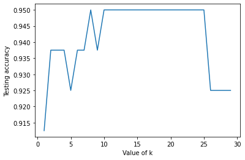

```python
# import libraries
import matplotlib.pyplot as plt
import numpy as np
import pandas as pd
import seaborn as sns
```

```python
# Eucledian Distance Function:
x2 = 1
y2 = 1
def Eucledian(x1, y1):
  result = np.sqrt((x2 - x1)**2 + (y2 - y1)**2)
  return result
```

# Task 1:

```python
x = [[-1, 1], [0, 1], [0, 2], [1, -1], [1, 0], [1, 2], [2, 2], [2, 3]]
```

```python
print(x)
```

    [[-1, 1], [0, 1], [0, 2], [1, -1], [1, 0], [1, 2], [2, 2], [2, 3]]

```python
Euc_list = []
for i in x:
  a, b = i
  temp = Eucledian(a, b)
  Euc_list.append(temp)
```

```python
print(Euc_list)
```

    [2.0, 1.0, 1.4142135623730951, 2.0, 1.0, 1.0, 1.4142135623730951, 2.23606797749979]

```python
c_label = ["N", "P", "N", "N", "P", "P", "P", "N", "P"]
```

```python
dataset_given = [[-1, 1, "N"], [0, 1, "P"], [0, 2, "N"], [1, -1, "N"], [1, 0, "P"], [1, 2, "P"], [2, 2, "N"], [2, 2, "P"]]
```

```python
mapped_list = []
for i in range(len(Euc_list)):
  mapped_list.append([Euc_list[i], dataset_given[i][2]])
```

```python
print(mapped_list)
mapped_list.sort(key = lambda mapped_list: mapped_list[0])
```

    [[1.0, 'P'], [1.0, 'P'], [1.0, 'P'], [1.4142135623730951, 'N'], [1.4142135623730951, 'N'], [2.0, 'N'], [2.0, 'N'], [2.23606797749979, 'P']]

```python
def knn(k, data):
  N_Counter, P_Counter = 0, 0
  print("For k value = ", k)
  for i in range(k):
    x = data[i][1]
    if x == "P":
      P_Counter += 1
    else:
      N_Counter += 1
  if N_Counter > P_Counter:
    print("N")
  else:
    print("P")
```

```python
knn(3, mapped_list)
knn(5, mapped_list)
knn(7, mapped_list)
```

    For k value =  3
    P
    For k value =  5
    P
    For k value =  7
    N

```python
# Doing a similar technique for a dataset which is given.
```

```python
df = pd.read_csv("/content/test_knn.csv")
```

```python
x2, y2 = 2, 2
```

```python
c_label = ["0", "0", "0", "0", "0", "1", "1", "1", "1", "1"]
```

```python
a = df["a"]
b = df["b"]
c = df["c"]
dataset_list = []
for i in range(len(df)):
  data = [a[i], b[i], c[i]]
  dataset_list.append(data)
```

```python
print(dataset_list)
```

    [[2.7810836, 2.550537003, 0], [1.465489372, 2.362125076, 0], [3.396561688, 4.400293529, 0], [1.38807019, 1.850220317, 0], [3.06407232, 3.005305973, 0], [7.627531214, 2.759262235, 1], [5.332441248, 2.088626775, 1], [6.922596716, 1.77106367, 1], [8.675418651, -0.242068655, 1], [7.673756466, 3.508563011, 1]]

```python
Euc_list = []
for i in dataset_list:
  a, b, c = i
  temp = Eucledian(a, b)
  Euc_list.append(temp)
print(Euc_list)
```

    [0.9556058716129691, 0.6456285171156554, 2.777011626505853, 0.6299936871161619, 1.463861332756508, 5.678519763639245, 3.3336195608705412, 4.927917437576228, 7.041880858112566, 5.870883646746391]

To do

```python
mapped_list = []
c = df["c"]
for i in range(len(Euc_list)):
  mapped_list.append([Euc_list[i], c[i]])

mapped_list.sort(key = lambda mapped_list: mapped_list[0])
print(mapped_list)
```

    [[0.6299936871161619, 0], [0.6456285171156554, 0], [0.9556058716129691, 0], [1.463861332756508, 0], [2.777011626505853, 0], [3.3336195608705412, 1], [4.927917437576228, 1], [5.678519763639245, 1], [5.870883646746391, 1], [7.041880858112566, 1]]

```python
def knn(k, data):
  N_Counter, P_Counter = 0, 0
  print("For k value = ", k)
  for i in range(k):
    x = data[i][1]
    if x == 1:
      P_Counter += 1
    else:
      N_Counter += 1
  if N_Counter > P_Counter:
    print("0")
  else:
    print("1")
```

```python
knn(3, mapped_list)
knn(5, mapped_list)
knn(7, mapped_list)
```

    For k value =  3
    0
    For k value =  5
    0
    For k value =  7
    0

# Task 2:

![image.png](data:image/png;base64,iVBORw0KGgoAAAANSUhEUgAAAmwAAADLCAYAAADTE89aAAAAAXNSR0IArs4c6QAAAARnQU1BAACxjwv8YQUAAAAJcEhZcwAADsMAAA7DAcdvqGQAAENJSURBVHhe7Z2/jtXI9raZ7zIQQmg410CABgICmAsgmCEiGokToyEhJOkjYpCIiOijIy4AJkA69BEB18D8hNCI2+Dbj/Hb8/ai7O39r9vdvI9UbbtctWrVqnLVctm7/cOXBedCCCGEEMJs+X/9NoQQQgghzJQ4bCGEEEIIMycOWwghhBDCzInDFkIIIYQwc+KwhRBCCCHMnDhsIYQQQggzJw5bCCGEEMLMicMWQgghhDBz4rCFEEIIIcycOGwhhBBCCDMnDlsIIYQQwsyJwxZCCCGEMHPisIUQQgghzJw4bCGEEEIIMycOWwghhBDCzInDFkIIIYQwc+KwhRBCCCHMnDhsIYQQQggzJw5bCCGEEMLMicMWQgghhDBz4rCFEEIIIcycrTls//rXv8798MMPS8P//d//9TlW55///OehHMqbCmVuSwfh8obCceA2+fe//93H7paff/65K28bdlwXr/c//vGPw7htgB2RO7WPUb50mWIT172W87///e/IueNq03VRX9imrrLBFFv6uKN+MHekL2Hu7TuF2mdr2GYdW9f9SeF9b5X5SLjduI5CG42vYcsrbLdu3Tr35cuXLoh79+51x3/++Wcfsz5Pnjw5d/ny5f5oGgz6Nc+qMlpQp729vf7oXFc/1X1/f7+P3Q0+OKxjk0358OFDt/38+XO3PW4YtJ8+fXpo7z/++KO7oNlug0+fPnXbjx8/dttlrFoubebXw4MHD7rBG3766aeuTrqWfvnlly5+GeSXjOPk1atX/d72ePHiRbd9+fJltx3j999/P3IdngZo13VZxzFYl6lleZ8FjfkHBwfd8a+//rqVmyn04bpnfKWsbcwpm0DfU53XAbudtr57HNR+p3Y+yQWCubBVh42JaIgff/zxRDrn48ePu4GDAcQdqV3e2TLJMmjtAiblZ8+e9UcnAw4b9mTAOQkYtN2+9C1NDtuAgZj6jfXnbeB1uHbtWr/3Feq0Cnfv3u33Tj+0L5x0P58bTFg498cBk+bUG5YhGB/Ux9Wmm/DmzZt+7+uNAtdoOFu05jfambDqmHgW2ZrDxiS3zKBT0myb+/fvHzoWOFJajbpw4UK33Ta6k9zFZM+AXSf27xUmAL8To41v3rzZH50OLl26dOQmYt1HPDxOOenVhm3BjZQmeep0Fh4ZbovjWknH5sflGIYgMr8t58R+dODvvhB8yZyG83Njz/eXvUMz5CD66pBkbLpsz91B6/EYcqUjwZd2Pd6P6+Mt8mjAZiIjTeuRhfJXm1WbjoFcT6tAvNsbHVt1U353QDyd9HadSOvljk3UmtCZVDxtdZJdV0KlpTuydOz9ocryc5vATYRWnmnXIblD7Yder1+/7vYZ7LCj68p+bU9k6b0Q2Y629DRqI3A7kV7HQ7pKNqH242W8ffv2SDs+f/683zuKl9FaCartRZ2HqPaRzt4XCKSr7SAb6Fj2rAz1K8frRPA24Fi4jKo7Mpwq01E7ElQWevIIE7gp4tyqbSjIp5U1f7riOrstXNfaR9lXP0c/6TvUHuDlsK/jek2w7/0FmW6boTatKD2h2qxl6yHI67KUvtZVdtExdfC8Q7guBOSC22QojRiqj+fxY9nDzxNkW+S35rfaJ0S9voXXnzSup7dJzV/rN1u+7AhEExaTax/zN/v7+0fOKe3BwUF3fOvWrS7AovEO92HRqF3axQDQHUvWFJBFWvI4yCe+pesY6EA+D+jnIJN4lamy0AWos+fXsWwhSK+61jJkE4IfS4Zkyo5sqwyhOimt9Je9gWOX30rjtlSdSS9dZA/VSfmH6lhRmR4cLxNkE6H8nFeZ0lnndFzPs6+8oH5FULsug3RuL+lLoDyVBbKZ2oSt7ONlSx9QfZEFqpNkqN7a93Oqr+sneZLJcbWH5JFP+q2C20T6EqpNZSuVJ91UpvRXPtJXGYLyJKvagX3pw3ntu82F27MiuVU/gvJID7Yun32CZBCE0kmu7CI9JVN4mygtciUbXZAp23sfnIJk1oB8Idkqi/2WXZVPaUHydVzrr/Sut+tEORwT6jnyep+jDAL7breKywCvA/ugNJRR66Q2kk46r2PpIBvpPEHoWDLH2s3tD9Kt6qo6e33EWH1cP6XR1sv2dEA5qqvbe5k9gfSSA7IpAZnVxirH5Wl/7vxdyy0jg411HqG0agA1rAzsqHFoBMIU+YK0LZnr4h2DBkf/enH7eVDdpLd33GWdptWhQTbhfOtYZaKvH8veTtWvdnbg2POjt+KAeJVdz+m4Xjyq01Adh5BsBahlAuVxTH1a551qg4ryturP/hRIp/YQkkFwe0ufofZTHm9P9l2O2pEAXrcqX3mVFtSnqs6gtLQdslpppkA+2c91cHmttuM8x+oznndZe4ylG6tzq02GqGlB5eo6cbyOLXsM4X0cdC3VPNWGOlZfkb5jdWqh8sfyqVzVi321m+tFfSuSL5up3VWe55f8MZ2qvVRv2WHKWFRlgMe5TqBjlaE66Fg6SF6r3ZUG/TivY9VR2xaSJfvUvK366DqgvGX1mXrtterVsreXx34tH6rO1ab1eKqOc+TEHomCli/FX3/91W15JLLoQN0SOOdbS9I8DiNM/YUeMki7i1+1ifoe1dgya+vcrt7vU1l6hKjHFLK3w3tVoDx63HTjxo1u2wK9FxdDt4+d3717d/jrRv8lKWUvLsZuX780XRX08iX4RR8+8oMDyh/79Sr1WffXrUP9dVssBo9+76h9Vmk/oUf+XEPoffXq1SNtpHaGVl8U9dzFixf7vW/hURW6+cvhq0D96B/U0d9l8ZeQp7QddVefQB6PP1qM1RtoA/LL7p7+zp073Va6uT0ry8pxaBtdIzC1r6KfHhnqmuUaXEyC3T7neTwE274mp+J2UDuD93tx/vz5fm+YsR9FVLuNtc8uWdXWY31F565fv95teX2AsZb3tIFrj2tdfbMyRXYLHksCv55fpT5D8xnjt1/fY2VXxq6Hsf7gTB0f5siJOWw0Nr9sY8JtgdPGOQzKRODPn2HhNXeBi10D0RB0iIcPHx7pVD7pb5OpPzY4zh9fqCycYGyqIKfK4YchDPJylhkEsDPxY+hXivWdIx94aSuVvcnkwATqcAFqYloGA7frVPvVEMv66zagnVr1WKX9HNLDo0ePOhupjbgWcOCmsEo/RXfdaK16feGokN/rR78D+o3aydtubKCnvpKBPq0xwuv2/v37fu8o9FM5FJqcAPkca/y5fft2f+ZbVM7YhEJd6GNcPypvCnoXhzxyyB36CHagXbiWaZddXJNTcHszYapcwraZ4vDtCtmRa2ybtpb9dN3TntxAEa+217W+Kt42Q1DWJvXhGqavch34Tfa2WMUpnzI+zJETcdhkHFajWoMu5xnAYeilY8CJwOB03DEvmXLoXHQWBR88Nehtu9G4CDRp6s5A9dVd0brQ+WWjZeiODDupfAbuIWcFB1kXImGZswYaROj8PnlhA010/IsVseldDe3lqJ+gBxejBjDVVwOKfqms8/7vMIZ0WtZf16U1gaO/+oxYpf28DyufBmO1EdeCD+o4cCB9tHInh2kVtDqOUz31eqJO6CD9hPc7tZP3JzlZdUUPu6gtkeGOlq5/XTuytV60B+VlZQHdKLNli99++63fG5/w1A56GjDWbqxkj60iADrR/tSB6436UX6dNDkvuX4j6TZcdk1SDuVxbhtjpDsWYui6q6h++j+JGkN1TchutOlYe+wC9UF04frCvlxjq9gapl6LsqP+24FfH0Nwbup85PWhjwHX56r1caQj18OypxND89uysX0KY+PD7FlMyFtl0bEOnw97WHTiPsXRdysWxjp8Bq10i051+GydgEzwOMLCSz+SF1kV4jyPAjoIyUD+VKq8sfxVb7eFx6PHMlQfpa2y3R4EleU2J8imlaH2k22rfAddhupQ2wHQzeOq7JY91T/A07bafkxXaOlU7cTxsv7qclp6VGqbtah1H2s/bzPvW0Ac14lA95ZdSSMZBJdf9fUyqo2rPTg/Ri1XuiLH4xWEx7kO6IoM19nbRHHYU7TqAMjwurgdQTrW+BbeRq3y6nkvVyif6lNt5HVWv/U48jteBkG4XPUDlY28Sm1DBdmx0qo/uD6qo6i6Sq+WDYTblODtVM+5nQhVx1a9gXToMGZnaNm62k11Gop3aFu3kewwpS/Wuno7qd5DbSRa9QGPq3bwcn3f6yG5yuvleLqqn6i2q+mwJWmGyp87P/BnoXQIh9TVK7Ho7JPvYkIIIZwuWHliRS1j/Tw50R8dhPnBI4/F3Qe3LEfC4i5k9IXzEEIIIeyOOGzhCLzLwLtSetdHgXdO6jtG4Vt4r6Laroap7x6eBbgBaNlAQb9ACyGcLLyvqPfVVnkHNRwfeSQaQgghhDBzssIWQgghhDBz4rCFEEIIIcycOGwhhBBCCDMnDlsIIYQQwsyJwxZCCCGEMHPisIUQQgghzJw4bCGEEEIIMycOWwghhBDCzInDFkIIIYQwc+KwhRBCCCHMnDhsIYQQQggzJw5bCCGEEMLMicMWQgghhDBz4rCFEEIIIcycOGwhhBBCCDMnDlsIIYQQwsyJwxZCCCGEMHPisIUQQgghzJw4bCGEEEIIMycOm/Hzzz+f++GHHw7D//73v/7M5lTZhH/84x/duX//+99H4qeW63l2gev8z3/+s49dDvorHzK2zb/+9a9D+bJh+JZ1228u0Lbovgr/93//1+VZt98p/1Cg7+0Kv24I6LIraj23OdZNpY57u6xvCGeBOGzGq1evzv3555/90XZB9sHBQX907tz+/v65Dx8+dPu//PLLuS9fvpy7detWt/3pp5+6+GW4vF2Azug0BQZ8Dfrov7e31+3vgt9//30j+bucdMdggjrOSWmV9hvjpOyla7HabEyfz58/d1tdW6vy448/dtfgvXv3umNdk9LlwYMHO7kJAa6bXV/TgnpuMtZt2icYK3799dfOzrqW1XYhhDZx2GYEg+hp5e7du/3evDnJlSYmqNPGSdoLR4ng18UyfXB6yLOuwzYEOsixeP369Xe9GoSz9ezZs/5oPd69e9fvfb0Bo82m3qiG8L0Shy1sDCsOu1qZ3CasCjx9+rQ/Ol5O46Pbk7RXi7np8z2Co3rt2rX+KIRwnMRhmyHcweq9DpwhvctD4LHaMpRW+R0mPT9fHQkG5KFzLZDPigMwkLfysCoimXVlgvw6t6xuboePHz/2sX9T34khCOrN4yxgyznpUvOM6VHLQK5w2xEEesuhvXz58jdtIsb093PY0+3mNl21/UDpPc+YvWof0qNw8DYivY5lU+/bY/pVOWP6iFbdve+5DcfKboFslc9jPK36uZ4E7w9+rraf4zq+ePGij/0br5eC27y2h2zdwtM+fvy4jz2KyyJIHnrQf4H+zDnV1+tAGOrjQFrZEgectHXM82PwYwW1f83rdUT3Mdt73lX7RAjHzpdwhMVA9AWzEA4ODvrY7YA8yd7f3+9j/2YxEfR7X77s7e0dpkUnWAyWR/RyecKPVZdbt24dOUYOEM8xZQnlJ63bwnVzPI3by/Wnrjp2OaoPMkhTZTjSVXZTXtUFOCYA5bCv8iijVV+lQ27LnhXPr3qB8srWbKWby0WPIZQGqv6gOAIyW2l0nnK8bTyNQ7zbUPtD9lI7Kk46qN28TMWzxVZqY+lCWbJXxeWoLi19Kiqj1kmy/Ji0Q6heNXget0XVFzwO3VtpJEM28XKVRvXGlrV+kim9kDdUL+WVzVW2ZIPKJ63ajgCUVcsHpZPcKfat9QbXB1k6BslEB8WrPPC87EtPAmXITgTZVWmkA2W4zBDmRlbYZs5iADm8m79582a3bd2Fg+6EyQPKxwoYd5IcL9p88P0ez09agmQNoTKGID8/qhB+V7wYOLs7dmRcuHChix9aYdAqnmT99ttv3dahboQWQ3o+efKky+M6joG+rA5wF08e3r8B6X3jxo1uS3nUj3qeP3++i1vGmP7OYoJpvu+zTvtdunSp01OrC+obQ/bSu0tXr17ttuSHR48edVtnMZEfvlOGrZ4/f97FX79+vdtS5tT3wYb0WYXFBN3vTQf7qV1UD6F3r9QHxqCftZA979y5c2Tr8OMRymm1uezC+5G0P7oM9WXZX++b3r59u9s6Y9fDUBuojdFzG3CNIUv2Bfol+8v6Ae1V22PI9pv0xxBOgjhsx8jUiXsITY5DA8qnT5/6vW/566+/+r2v8AhATpAeL47l3zbSB2cBXfReTKtuq/56jIFX7zpNHXxxwPzdnKF8TBxy2tBb6bRVvMqvdp/COvrDOu3H5La3t/fNI64hSNeidRNQ+7vS4Fx4/zvtvw7EUaJPiFXqM2TPFjzO0w9XPJ+cGtl1iFYbDTH1enBIQ/nSbd3xRDcPLXjkqcepq9SnxVntj+HsEofthKiD2SoT8zqrDVrBYsDToFpXXy5evNhtNx0IpyB9gAlHoXWX7hP/mJ30Hg13zqxCTUHvsOC0siI0BeyjSUkTtdqEcr0+Q6sdLdbR31m3/bSSQX9gMtRK3SqMTbJCaXAQ3Uan9deBclBor1UcL0f9Z8yxpz0ohxu2oVVC7Kj+O9QWih9zpNa5HgDZ1AU93HndFnovjdVB+s82OGv9MZx94rBNRAMZYRXnymFS10Ssu0TB48779+/3R3+juz6oj08qehSgCVt6MhEzCDHwI48BFV3qxH7lypVuy+SjvF7+FOpLvUP4oKhVHcps5UdXTQLv37/vtm/evOm2gvbRqhSyl7WRytHjIR6LTFkNY5BHNjr5xKHHKuigsqkXelVadVxV/xbrtB86yv5Dj45AOqvOspVWZx8+fNhtx9DjYu/7yF2nri0bHjfSgXqtuyqj1xzevn3bbf3fXQitqvEYuuVsMSYB/WbM0Zf9de3oWnJWuR7os4wp9B+/AZzivKrfTGl70qjP0MeVd1O22R9DOBYWdxShZ+EUdC+helgMQt05vVhLWAxIXdy6LAbVI2W0ZC4mxi6e8j2dv8jr8dIThuIpw8+5HpLr9SR4+V62I10JlDEmg0B64fHYfwxP6zKpRz3vdVN5rpfq4ul8f0gX0ng/QaZApuIJXk+XPYTnrfpX2dWm67YfsqsNRMteQB7FE9wGbpuWDWvelk7QkjOkj2j1b68bodqtXndVhoLXUXhdkOs6Q61Dq07gOvm+0nic14d4qHWsdXJqfs9Xz/u+66t6qPza5zxfy25VX+RUGdjWcdtVHcfKJ9R6el2m9scQ5sAP/Fl01DAzuGvlzm8x2GztZd4QQgghnE7ySDSEEEIIYeZkhW2G8G6I/0Lr8uXLx/JDgBBCCCHMkzhsIYQQQggzJ49EQwghhBBmThy2EEIIIYSZE4cthBBCCGHmxGELIYQQQpg5cdhCCCGEEGZOHLYQQgghhJkTh63AtyL1zdB1PoI9BF8ukNyh0Pru5Lp4Pebwbbxd6oM8ySZs046nCequD1rvAu/D+v7oLvn5558Py1v326He745D5xb0R9XB++ou22pTpCNhnXFQbZfvcm4H+o7aA9uG75M4bAYD6J/24WI+urytyZ8Ps/u/vLt37153TPAyt8Uff/zR750cPkHuUh8+xL6JDY9zIt9VWZoYd9GXBH2YT6UdF3ySbdPy+IfT/OPpk0QfUaeN6Kv7+/vd8ZzZ9N9z6h99r/tR/HCUJ0+ejH7YP3wfxGHr4S7yt99++8aBevHiRb+3OxjE9/b2+qOzAfZ88+ZNfzRfmET5ZutxgLP28ePH/mi70Id0AxDmxS+//NK1y/f0TWAcNur8008/9TEhhE2Jw9Zz5cqVbgUBmPx0N3Pp0qVuuyv0qIeyz8rgxqokq5OngeNafcGBPS7HMIQQwtkjDlsPTlqLq1ev9nu74enTp/3e3+hdBQIOnb+H89///vdwn3h/z2fK4zaX5e/Q6D0bAjL9WPh7FENlkU/fQX39+nWXtr4D8/79+0E5Xq7r14K8Svv48eM+9iheX4KXx7FgX86z15NQ3xnxc1VHbw/Vm60cWNqbc9TT8XebCFCPAVker/p4HHg66uN6+XtFVZ6CbDGGbNtqJ5fl5XmbEWpet0NL7hRqXx5CaQiuo8ePtS8Bqs5+/J///Odwv6WL97Vqc5dDGKPq5bL8nLd31af2mWW4nT2Pl0eamk7By/d+sazs2mc5FmPnaBvFt/qIjgkCXRSHLJcBta6iVWf1sVq2l+EyQPGEFq7PUJpwhvgSmly+fPnLvXv3+qPtgclraEH5nNvb2/vy559/ftnf3+/PfOn2lffg4KCLu3XrVnesdORRGvZBMnXMPnGCspQHeToGyac8Avuuk0C28pFHuD7E+7FQvWR3dHMZjtLqvOsumyiOrZfHPkH1IAjFSa5sprqim9us7ku+9EMex+TjeKxPKQ8BWvqxT32A9NpvpVWZBM5XHVSe6iB7jemIXSSTeulY9iHOZapMqOeUV3UAjgmkVXrCmE6O5wG3i8oZ05F9xYPvS1/yy1aS6W1HHh17WvUpTyu7VVtIb+Vh67o4kicbSTYyhOIko6ZReTrf0rFCWpVJfm8jl09QvVRPArYB2Z9y1DZKX5FenK/tWO0gu0t/pfc8OiZAbQcgrdIgw+ugurGvtgLlIX3rvOII6DcmgzJA6ZVGeYTqFM4uWWFrwJ3U4kLrXvTcFYtBZfQFcb2kz2O0mzdvdu/BVBYX6OFj1Bs3bnTb58+fd9sKd26URx6tJrJPnN+FAvG8b6MfSnBnyGoZUN758+e7/VZZQyuVTrWr7jwl7/r1692Wu0fK1XlHae/evdttb9++3W0d6a9H3c6QntSPPEPvG/GIHJuhG+jl6mrfCxcudPG8AznFJlNBPn2CFQn6RKtuFfpa63H7p0+fuq3qcvHixW475Qcii8niSL0k6+XLl92WPgt6pYA+RnpsK5tV1A8XE1KXlsD+Kqh86gzUG5s5YzqOtS99Ue071rfIo/fW3EYVZOm6Vj9+9uxZt9W7s7qukYNedQUGVNaU8WpofFB5vMcLrfGmgo1YMWaFCDsPlc857CQbgvcfPWXgtRTFyQ6Vhw8fdluefJDW+1MdP9SflcepfXzhNPV7w5DG23PougJ0Wtb+QP9u2drHE5WhPi1UP62sDV1X4ewQh62Ac8DjKy6WXcPFXC9CwTkGNdDEMoYu3qGLVr9Ua6HJVmiyEv5LLwYHTYDbHiAkD/tTjgb31i/NVimbidgn7Sm/XKMfoIP6gWzExEO7EM95PZKUfRWvx8ItZ3MTqDd1wWmjnE3k1z6jOk7pb0PoRxV69Kv39mof45zaV3lqmnWY8qOOMR2Xte8yvJ9tgtpV7SynZkwPJnnSiqk6wzr9SL/ilR1bzqQjpxQbydH1comX/kPj71A8DI0JY3l2DY881b9WGbOmtB2OnhxN7LbsUXI4/cRhKzBZcYHrzojJftuTruN3pZochCZUBsRlg6GoztYUVM4QWlEDbMOdo9/ZbgvpzoSpMgitu1ilHZvkaTcGMu68Vxm0kc3kQdmtCZjJhnNMVgzG9BGtqIHrvsovA13GGNhd9dnEQWDAPzg46GRhJ+rCDcQmK8tarcI2bgdN0HrnhzLr6tmym44pqPyxa3aZjmPti967GA+qs6zxh/ZwHYdWvrApDhFp1kHlrforZvq3yuQmZcg22FB91lf5VC7QF72uLdTf3717122nsMk1si56J4820Y33Knh/G4P+gK3oJ8wTdQ4JZ4s4bAZ3KFwgXOBcbASW0xlUdPdK2MWAzYXmgyXHb9++PbyD0oqN45NHfURY4cKmXj4AqK5Dk4Cg/hr0/OV+vaw7BgP1VGdTj390Rwq0ScveSqt/HcIPGSq64yTtslU1ysDmBOwiZ8LtBUoD7ti4U6nzyGzd9XJ+Sh9qTUo4k+SlTdaZCCr0F+qoSXITZw30Ix1Wz9Tu9AEFf6xYHTMeiQH6yD5ahRPI4BocujHx8gE5tQ3HdBxrX10DatOh9p2K11P9+M6dO91Wj/WYhJUGvVrXknTA2VPaVVF5elQ45Zrl+le6ZY8U9aMbritdKxo/dK09evSo28LQ2KJHtowRqqvSKr+cX21d7nGAXhrD6NOrOsHg44lsXB/j0l/V9ptet+GUsBikw4LFHUr3AmcNxAMvfipuMdB2cauwmFyPyG0F0oCOFwNZFzwNeiwGx25/MYEceSFW+cHj2RdD8V4/gssSnpcwhtLIfrXcIT2qnajrEN5m1U7gsjjvZQrlkw7VDl4G55DpcaqfUDzB60WfUXzLtsLrUfeB8rwe6AQ6Vlr1EY/zY87XNB5a1LapMqVLy4bgNlC89tXONa+XQRrXQXkqXi9s1bLXkI7rtG+rXqKWg3zVo56r44rXg0CeFrW+bjNk1naqx8JtW9NU3YB61vaBmtftWePFlPJElac2hWoz6QTeD6qdCPUYubWselzzqI28LM/Dfm33IRm1X3k60lA3l835cLb5gT+Lxg6nCO6suGNdDApbfywZvi9YqVpMDP3R3ywmglnftbOywGpU63F5CCGcRfJINITvFB6x4bBxz+Zhcad++J7XHOGGhcdDcdZCCN8TWWE7ZfB+BCtrTpowrAvvg1X29vYOX8CfGzhrvFealeUQwvdGHLYQQgghhJmTR6IhhBBCCDMnDlsIIYQQwsyJwxZCCCGEMHPisIUQQgghzJw4bCGEEEIIMycOWwghhBDCzInDVuA/qOuboZt8J7DCPymVXA/123/8nyk/v2soo36XkW/XuQ5Tviu4DMqQvHW/d1hB1tA3JecCdVW9CbRvWI5fh1O+WXsW8Gtkm2NPCOFsEIfNYJDkY8uC/W1NsPwjUv+Xd3z6h2M+gu3wIfb9JR9S3gR92BrkOPmniYjjQ/P8t3vp8ddff3XbVfGy6oeLN6Wl+3GDI7vMmeWfHBMODg66Y32QehPcrmcVPovFNXJcTGnLdaGvLhtHcErpy+rP6t+bsMs6hRCOnzhsPRogcaII+prA27dvu+1ZgIn+48eP/dG5zllUfcX79+/7va/OI+fYrgoT1Js3b/qj7dPS/bi5e/duv9fGJ0s+o4Sum35BgH764MGD/ihsi2VtuQlTVstev37d730dg169etUfrc8u6xRCOH7isBn+seubN2922+vXr3fb0w4O1HFN9DgqfJz+LKMVkeOmfpYsbM4u2xJnzZ2x4+Kk+mcIYYcs7uZC4eDggGWbL7du3epjtgdyCffu3etjvkJZfk77jsfv7e11cYtB+TBuMZl38Tre39/v0rBVnILqqACel4A814sALo/ynSqXQHrX0/OrHsLzU/4QSkMAl4mdXG/piDxPo31vZ8+HTE/HcU1DaOnp+igIP+dlg+tIcPt4PKHWc0jfGqdjtkLnCd6mVZ8hWu0uOX4OfV0fzjmKJyhdtVHF83haLwc7ev+WXd1+BOrr+XyfIFwWabxNOYaal1Dx60JBNqnnnCrb692q0xR9a5yOvX+7bM6HEI6P4RH4O6UOhNselCRXgySozNYkIhTHYK4JULr5QIuMOtAy8KsML9cnUqG8rQnAbUE5PrEL4jQ5uAyffIj3Y6GypSP6uwynpbvqSOB8rbOXKVtLV7eL0qi+6OHHLodyhpCOPuGpPJXPvsr2c14G+4RWnUFxQ/qC4hTPMeWqHOkom4H0EV6PiuQjT/m87RRHoPxWGsmQTZV+qA+A0oDq0pJJecA5P1Yegrel8klWqy0lS+0n2+kY2ZLjbdGCNATygMpT+WxVdj1Xyxiq0zJ9QXGKJ6hclYN8ymLf5YcQdkseiRZ4LLoYkPqjc92jvW28ADyGfuhw+/btblvfPaF8PVbhXajz5893+8+fP++2YjGgNt+Rqj9sWBU9Kq6POVtyp5Tlj55B9lV99BiaX81R71Xtv5hkOjuNIVtfvXq12/qPTZaxiT2fPXvWbVUubaay9cOUXbShWDgq3TuJHz586Nrh5cuXXbxeAbh06VK35RH6xYsXu31+tQjkGYJz6L5Mz4XT0HwnksfoXHfYQ21HO46hF/mRCSqbPjP1Zftl+upalE7ouC3ZY7x48aLb3rhxo9siS2Xrfcih99w2KVdgU/oHgbb19kH+hQsXunTSM4Swe+KwNWBAYkBkcNo1U5yRz58/93tfJ0/pNTaBbhPsocmTHy4wUcrh2SaqD44h9ZST6vXfNnJ+YdeOOehmgF/iUkcde9nY1/veNusvJ0zoRyg4jeij9xz5Nav/YplzU16e590pyVilf67zS+SxX9yu+8vmMdQmu5BdUX/AltheTr2XTRrvQ9v4BbKoTp/KpSzKpP/CcVwzIYSvxGEbQasO27hjHcJlD03M7lQwYOJMEo7LYYP79+93WyYQJoZd2ET/U41VINWRsGy1bFuoTrt01CUbR8jrSNmagFlp1CQ8hU301YoaKyquj1b59EthHHachqF/KUI8urMiRfutilZsVqn3GJK3i//TJ9nHMS5gd28XrU5SL9qduKntv4m+qjO4Ptv4NWsIYRpx2HpYPWDC0WMW4H+HaYWBRwKcJ2z7rlKPdN69e9dt678SYaDVoPz48eNuC6xmrAOT61AddJdenUF00CqbHudNAXtOfYSkxz/+a1baZRd38fr3JXokOPT4jbKXORFDK0++KiF0E/Dw4cNuC2pHycEOy1bV0KvlPE3R11Fb+mNE2kxBOtXH2A5lqs2uXLly5F/HTMWdcumx7H/3yalUX1U/4XoacvK1ajtEbUtdi/5IcEj2Mn2H+on0BrW7XgvASdZ52hs92KKLxo11++cq/xvR66x+h15DskMIO2BxlxQW6CVaD4uBsD979CV3j58KLzm77CprMREcxi0G4iP7wtMQgPwe53kJC0fkm3R64drTka/qSHkONnB9xpAMle+6s1+PRdWBdmnhadCptl+1A+fdBn6+1sllVV3VXq6n4pxWfxLYxOP14rbLRCcvV0hvt9kyfWt5VV/v2wS1GXI9b7WT42V6HvarfLc9Qf3R24fg6ZSmRc3jjJXdsrtso/pUXZ0xfbEdeNuoPKfK8HS1D8kGtU5u77E6LdO3lqc6OH7e+2AIYff8wJ/FxRfCUrijZmWq9dL4aQD9F5NMt7+YvHb6SCucbnjkSB9ZOC2ntr+HEM4WeSQaRuGxmB4V8zg2k1cIIYRw/MRhC6PoZWN+uXnnzp1u/7Si98eAlbap79aF7wvey2J1Dej3rXcFQwjhuMkj0RBCCCGEmZMVthBCCCGEmROHLYQQQghh5sRhCyGEEEKYOXHYQgghhBBmThy2EEIIIYSZE4cthBBCCGHmxGEbgf92vq3/wYQcfYvUg39HEPSPahV2DWXUD2Tz/8lch238vzLKkLxa5znjtlj32627RLoR5sK6/Yd+oTy1T86R06LnceHXeL4xGsL2icM2gP/zzG3Ah6r9X97du3evO66fR+JLAnwOZ1e4AyrHyetJ3LVr17oPS0sPfcR8VbysVT40vQrrONTUEcd4Cnz0em9vrz+aHwcHB/3ePNik/3At7LLvb5PWtXOS4BRv48aqxZTrhZsZbCF7yD6bQJnbkBPCWSEOWwMGvqdPn/ZHZwecm48fP/ZHXydInEZ3JPlWqMB55Nw6n6NisH3z5k1/tBsYzB88eNAfTSd3/7tjW/1n7rSunZPk7t27/d72mXK9vH79ut8719nk1atX/dH68JWJEMLfxGFrwAqBPhJ+VsCBWse5WQcc3uMYbNdpIyYfn1xCOO1odWsXnNT1kkfNITRY3A0F49atW18ODg6+LJwBbp2/7O3t9We2AzIJ9+7d62O+Qrl+TvuOx0uvxUB9GIfOxOt4f3+/S8NWcQrU0Y/B8xKQ53oRwOVRvlPlEkjvenr+al/PT/lDKI2C29Pj0V+4/RTAdVNADyG7uCzHbeR18/SKI1Ce+peOwePcDpKjY4LwdN5+VddaR+F52F9WV1D6ms5lEcbar6aVvWU/z1vbrerm5zwf6fyc7Axevvcdbz8C6Vp4GvB8yPOyvdwWSkfwunm90cN1ll61jtTf81XbiVr/qj/UvIRK7VcEteVQn4Oqt8oEvw4IpJ2ib43T8VCf4HwIp4lvr8DvGC5gXfwaNDQwbgsNFj5Ase9l+aAiFMdgqElaA44PVMioAxUDp8rwcn2yF8pLeUJlqzygnNZERJwGV5fhgzfxfixUtreByxDkbekOHqcyJINjtavXRfVDZrUdtOpT4bzn0zEywfVFD68/++BxVQ4BpKv6istVXG1rpZH+bL1+kikZHCttRelA+nraVv+pyJ6krbpV+9fzxCsvUEevi/YlR7Ylv/ZlH9KoDrKd73Ne+xW3u5BcAudrO7RwGS17qr7Sg3N+rDwEyhTKJ1nS120lWdKv6otsyZG9hyANQTau7ca2to3KUV7pr7wEyYNl+oLiFE9QuaoLMqWD2yyEuZNHoj28D/Xw4cNzT5486WOOD70vd/v27W5b30dBNz2W4CX48+fPd/vPnz/vtmIxIHU/bqjUHzasimxSH3O25E4pq9pYLxarPtevX++2PBah3vXF46Ey9GL0YmDvtkqHDB7TDuXjfZvFtdDZdlNqm6xL/ZHGYoLp94ZR29+5c6fbql+9ePGi2964caPbYofFpPXNS+qLya2TgT1a7yAts+9U9Gj+ypUrnc2x/dA7T8vOX7p0qauLHqF9+PCh2164cKHbck3Qf8gvfWUXylfcs2fPui3p0Y/3PXn3rnU9LQM7TulL27Cn8gyhsUT6tNp9iGWyxxjrc3q3cWis1fi2CdgU+QT6BOVSPu2LLuof0jOE00Actp6XL192F7R+ls4+aPDeFdUZafH58+d+7+u/EmDQAU1Ou4YBjkkIsAUTjZzLbaL64BhSTzmpXv8xPn361O99y5RfKvK+jpxStf9ZQH2Mvoxd5bBUm+D8jLGpfWFKf29BPr8upQsO1d7e3uG1q2sVB+Wg/wUt14v+JYuXTzx5QHLpg3LaOLeuvlPYhj1XQePGLmRXpvQ5nCjZH7apV3U2JVv9hPeUYZftG8K2icN2wvjAMuSY+B0nAw53p4Tjctjg/v373ZYBmImmDojbQKskTMCqI2HKasUydEfdAgeUQRyHZcpK1jpsY9VgKpqc6soNTrfbdZu/3hyzr+P9xn9ROgb9AmcDneV0ODhtnKO+9E+tXGl1jv6E849D7uXj0MkWBMF1JQeuVd5xIHvu4uV7yd7FNSyW9TmuN1b/3O7L2ERf75+uz9DKbQhzJA5bjwZ9BQ3UDPac090gYdt3ZZpY3717123fvn3bbQUDlfR5/Phxt4V1/5ErqxBDddBdf3UG0UGrbFevXu22U2DynPoIRo9PmHQFk+wye3OeOunxlXRXPuzbcvqQDVpVo15jqx7bZKqzsgqys/qPHofpETOrHLIJ9praLmKKfYf6j6N+5I/Yh/oyeuI86RqRIyU4TwB/xEbdJBO93fGSrEePHnVbUFocJOpFf+fa3yWr9lfQqvMQ6tNCfQF7YDvsMCR72f9KrLKF9AbddI71Ocm5efPmkbxDDJW7yv929Dqrv1D2kOwQZsnCOQkNFgNb91LqYtDujodehJ0KcpTfg2SpPMJiwD6yLzwNAcjvcZ6XsJgcv0mnOnk68lUdKc/BBq7PGJKh8l139uuxqDqMveysulY9PX/VVy8bE/TCsdsMfbVPvLc7QbZzPD+hHosqW/vSv9pkmVx0IyC39gPVTXi9CapHtXfN18LTo5NY1n+cWhf0r3WgXtX+bkPOUabHsQ+yi+KrLq3ygTzeDkP28LzIqvat8sf6sadze0Ktv8uVbm531UN1qHo41d6eVvq2rhenyvB0Q33O42s/93ZQnFimby2P44qfH+ufIcyRH/iz6LwhLIU7UlaGzuI/Qg3hLMFK4cLB6R7x53oN4WyQR6JhFL3fxZbHsRn8QwghhOMnDlsYRS/r8r6R/l1ECGG+8F4Wq2vAdat3tkIIp5s8Eg0hhBBCmDlZYQshhBBCmDlx2EIIIYQQZk4cthBCCCGEmROHLYQQQghh5sRhCyGEEEKYOXHYQgghhBBmThy2EEIIIYSZE4etwD+d1EfeFfgv/5vCx6WrXA/rfsj9rMHHoc+STbyNw7zg801qm2UfAeezbEpLviE0fqz6Yf0pTNVhU3QNVpvwD3hVPkHH2xgfh9ilPUM4bcRhKzx9+rTf+8rly5e38jmmV69enTs4OOiPznX/iZz/Waz/W/z69es4bQt++umnc3t7e/3R6cT/s7y3+aactf9Yz0SPE3IScK1xDeqLAMv0+PHHH7vvci5Dcv76669uu02m6rAp0t1tQls9ePCguzbv3bvXxb1586bbfvr0qdtug9rHd2nPEE4bcdgMBgsmWDlShA8fPvRnd4ccFJy2k5rAwnZYtlKzLkyYmiDPCnw26aTgWhNc59xQbQPkIO80f3MX3atN3r592++dO/fkyZPD82x///33/sxmMPbhFDpnwZ4hbIs4bMazZ8/OXbt2rVuCP6nVLu6iw+kEh7+u0G4DHgedpHOzC3b5SC+cTniaEUIYJg5bD5OiHo8Ad+C7fj9D6K6yPu7QuyQEn+BwJhXfSsNWcXXFzs8NySSA3h9x59XTLbON8iu4LmPnKq4z9a31b6XRvnTXMUHgYCmOfZfhKI7gNnPIr3ZkS9paJ+wlOW470ileQfViy00ELOuTrj8BnUS1mY6VpuowhLeb16faxduA4LqQVtcak7TayCG98lKml8WxqHV2XNdaT0H5VVfSuNzajkNU24COFad9t0cLrz9B/aGFl0uo9vRz3k7eJwjU020hOWx1I0LfpjzXz+vidSTIDlDbyvNxLNinjJY9odZX7aO2JVCW6+j5Qzi1fAkdiwmk3/u6j2kU/NwmHBwcHJGrsHDU+hR/Qxzn7t271x0vJpYvt27d6vbB8wPndYy+5GNf+UFpVB/2iRPIJ871Gcov/ahTC5XP+VoXnVM5Kld67e3tdceqL/EcE1RePfY0qpOOCaBykC8UR0BGTYOubiPfd1p5wdscWTpu2d1tpfPIrfZooTRs3RbsC8URpAfptS/5bIfqCZyTHD9We1Z5qpPsovME168iu9R+o2PVWQzZVOVJP+CYoPKrTi0b1rZpMWQLgrc/YQjVCxlKX20pHer5Wj5lur7alxzVjfzaV/mSCbK92hBkY8VJJseyn8qTTD9HYJ8wZJdWffxYOkh36UCgLB27DUI4rWSFrccfRbK/sM3hy7Xv37/vtttkMcAcPgLgcVe9i3/+/Hm3vX79erfljrH1jttioOv3vrIYpJqPVblzVpk6zz5xuvt8+PDhkS3xd+7c6fZr/gsXLnTxL1686LYOOuqOnB8R6J0Y3n0Bnbty5Uq3lT6PHz/utpvyxx9/9HtfWQza/d4wQ3a7dOlSV2+tTAy909jKW1H9AZlC7+lgq8oUucB7RMiY8j4R9qAspVcb3rhxo9tSJvqNrerAkF2rPPUVrUCeP3++227KxYsXuy0rKKC2of/pHTXqqfJ0TZ0U3v5jyE5cH2onf5/MWXZ+qP+qTbiesRf5p/a1ITRuXL16tZOFXipvrH+uUu7UsYN6TbkWQjhNxGEb4f79+/3ebnDHgmV+RwMdzhwTkiagz58/d9tVGfuVlX7lxeAvJ47JmnjiQPk5hz56TFcdSBjTsZVejJ07KRj0ceZUb3+Ms23oA3pXjfLWASebNhStttBkLWR3PcrVpLjuL/OOq425EZDTiN66hrzOxMseQ872nFjXPuSjruo3uqaH+i/XtW72sE/rsfSqTOmzU/rnEMfVr0KYK3HYRtDdm+7mtg3yNeHgkLkzoDtiBlvuTBXkQG0TrVTAb7/91m3ryplP8q5P687eV1CWrdI4Q3faq9yB7wKtDty6datzarb9PgzymExZDZmyGthCEzarSKs6e7IvK8retrv4Zd4qbTklrVZv0R1Hk2vI+x+2UH3GHLZtrfptitd56so+YwVOEHV0Z0gM9V+tzjHGMP7Um8ZVUdnv3r3rts4m/XMKJz1GhHAcxGHrwbFgQCEIBjYmUAYDP7/NuzkmHD16ZTCVg6PHSXo8Agyo65ZNOQyoPliyT5xPzLdv3+62TH7+SMEdRTmW6NIa5LEXkwPcvXu32wJ38ZxTfXV3rTpNXdFcxQncFOqq+k59pAWrTH5aVeNR0rL/aUWfbNVf5dFvVlm1AD12p83VFtR5XTvr0djHjx+7rVbqcAxaTLVVfdSNLZTX24Y+JufBH5VpFcmvoSFb7eI1iKno+vBfBg+tgNFOXMe63qozNNR/aVvJ5DpvOXqObKY2baGbPcYspVcZq/RP8kpnZxtjRwinmsUdVujBHB4Wg0N/ZvqL0kPo5VgPLn8xYB7GkxYWE9yR9AvnsYuvspDjx/W88oGXw34L8rtujssdyi+8LIJTdZZN3c4EbABui1o/qPWqaeox5VT7DqVxXYfsAq67bK5jQksn8HgvS+fBz7eo9nF7QC27gr5+Xnav1Harcpe1o3A5QyDLZXhZ6EsYshe0+l+VSUBXqLK0j5yar9UO1TZj+ut4iJoWWS0dqp1dh7H+yzmPp46KVxyB/FUX8nl/I7Rs6PGeHnm1f4LKkS5VFvUfi19mb/KFcJr5gT+LzhxCCCGEEGZKHomGEEIIIcycOGwhhBBCCDMnDlsIIYQQwsyJwxZCCCGEMHPisIUQQgghzJw4bCGEEEIIMycOWwghhBDCzInDFkIIIYQwc+KwhRBCCCHMnDhsA/CtPX07tPVdu02RbAV9kHmVb1CG44MPbNNOm0I7q8130dZ8u1Hyj/Obq1PRdZV+Po2TshflqR9pbAohnCxx2BowSF27dq37oDJf7vKPoG8Kzh/y4c8//+zkE96+fdvF+4ep5w4D+a713YWzvA60FWxaX//Y/y549epVvzdP9CH4dex4HP1tbmxir03gQ/GXl3wQPoRwvMRhK8iZOjg42Prkx4Tz4MGDbh8H4Mcff+z2gQFyf3+/Pzod/Prrr/3ebsBZ+/jxY390ssix9jYLq4PDih3XubZ23d/myCb2CiGcLeKwGXrssLe3d+6nn37q9rfJw4cPuy0rd62Jn8H5tDgEPCLcJe7chrDr/hZCCHMnDpvx9OnTboujwEobYVvvASFHj9Vu3LjRbVuw0iZwWqQHgWOhd6oUr305nXr3RYHVKh6r6Fj18nQ+KdZ3oXSMHNKpLjw24dwQLocgqn4EPfahPlpNoU04J329rrXcWpZCKy/B7el5W/XVOX805e/5+Lmxuk3F24rg7zCNnatUe7lusp+nQZbXi/TYQMfsC8URXIancVple1kuw/viWH/ztvE8lVpHtS9BbeO6UIdWvau+Xj64XOrrVPngbYksP/7Pf/5zuO91BsW3zlXGbDRVTu1zUI9rXWqfaLU/uM08z7J6hfDd8SV07O/vf8EcMkk93hSXt7e318cOo/T37t3rjsnDMfGwmMAO5d26devIMftwcHDQHS8mue4YyE+89jmvMkiHLCF5BMlCD+0TVFYLZCmN9FfdKaueU9nEoRNx0g2qDD+vsqr8obpKluwJHCt4fdFH8aqv9CNdy45Kq3Lcrsqr9BWVpzwuT+eIA+npsjgmqO4qT/LGdCJQH6UhsK9yCMLjyN9KU2mVrfopn47VNi5X9ge3C7Avu7TwOiJTx2yFZKInoKcfg+tL2UpDQG6rjkrDedVH9VP/ISBbx8huyVI6cLktpCuoviqXfZ1Tv/JylLelJ6geOgZPU/uEZOvYdVac6tVKE8L3TlbYCosBo9vyeFJw13fcPH/+vNtev3692168eLHb6rGq46tyDo91F4NktzqhOvDjBj3urWVwV/z69evDFQexGIS7PIv+0v0A4/z58/2ZYbibRhb25DEv+ZQfPnz40B23HgEPPRZ+9uxZt7169Wq3RbZWRZEHspNWEt69e9dtV7FnrW8F+6hc0uk9I7XDWN2m8Pjx426rlViX9/Llyy7u5s2b3VZtgT613dZhMcke6fvYeMqPbob64Cpg9xat/kb/ol+rfwH73teHoI66BjYBfb2Nh+TSLlwLwHnVR33Soa3Vn1r9Rytzan/ebSNtq1zsgD0YA4A2Ii3yZSOdU1noWVcG14G2qH1iSh9p2SSE8JU4bCMw6GyLK1eu9Hvnzr1586bfG0YOSIUBeBXu3r3bbRkImTjksIDK4PEjjyA0qXz+/LnbigsXLvR709Gv25bBYw+9qzZUZ6G68wte9NUx9ZKD9unTp24rWXLuVrHnsvpW+wyxSt2cMcdr7EcYU/U6C4z1L/WBueDtQr/VuFL7xJTxZpUf4YzZYezc1Gs3hHC8xGHrkUO1zgQ+Be5guQOH1iqWWLY6sKoTqdUSymTlxldP5OTs7e11d94K21h9kM2wZ6uuej8Ih5Lyp6C6s7Lh+mJbVhqwr94/pNyDg4OldVnHKfcVn9ZqxDp1c7TaMcWxd4ZWPi9dutTvfR9o9XQddE1sE28X+qX67SpOvFBb/vHHH912DNlBN2JTGRrvtjEOhhDWJw5bjztUOE04GQyuPDJg0vcXZsdWQMbgkYAeQVRHAZnIluP46NGjbqs7YW0VvwqqV5249cjNf43Ji9Gr1o88FWymOuo8ciVfZVLfZasGOEDk0WMgf4ypF5NpH9K4I+fO2jbtSV9RO2oFE9Bl1bq1uHPnTrdlopUDr5e279+/3x1TDmj1hjaWo7eMVR3BuUEf4saD/uU3WOwT5zclm7Kqs9OCdtG1oMfdsM5L9bdv3+621FWPR+kjrRs9t4OuQfoQ+fzVBFB/0ng3Bb1uEEI4JhYTWzAWE9/hC6+LwauPHX7xeR1clsJiQO/P/s2+vcBL4FiQ3vPWY0fltfTWS80KKoO6e3zF7TSGy3C9XF+XxT6gq+LQUXhagl5KrvoqSB6M2XOsvkO29XjPM1a3MR2cms5t4LYheB2H6uFxnga5taxq4yqT4zGZOq7Ufk/Zy8pSn/V0zlDbVGodazlqh6qjp+Nc1XeZ/t5urf4y1pYte7XiPU+lyq/tMnSu1kvt4PWr+626+DH1b9nA5RDqcQjhKz/wZ3FRhHCqYeWAd9taLCa4yasGIYQQwhzJI9FwJuDR5H55t21xx9+dG3q3K4QQQjgtZIUtnAl4h6f16SKctqnvdoUQQghzJQ5bCCGEEMLMySPREEIIIYSZE4cthBBCCGHmxGELIYQQQpg5cdhCCCGEEGZOHLYQQgghhJkThy2EEEIIYebEYTP48LO+F+qB/6K/CyhP3wPcBXwfUHXYxUet14X/mSa9Wt8hPat4/zot9VYfWue7lyGEELZHHLYeJib9Z3zn8uXLO/msEU4g5T179qyP2T78w1j++//c4KPU9/oP0u8SHEN91PqkweGhvdXH5qJXC7+J0Mfl9ZHwEEIIJ0Mctp73799335zk/wgr4OzcvHmzT7FdXrx40W2ZwHe1gve90/rywUnx+vXrfq/7mvW5V69e9Ufzoq78cbOCvnHYQgjhZInD1sOqT11Je/78+bk7d+70R7vj0aNH/V7YFnN6BHxaYGXt6dOn/VEIIYQ5EYdtBFZFdvE4lEd1OIJ6LEg5/oiMFTe968SjNH/3ibxT01Q8D0GPvpR36L0qz1MdIcr286KWRVj2GLDKcn3YVzz103FLZ3TUo0ceaSO32suPYUzfmtd14Zyo+pOfwL5AH+WhHp7e281lkV7HtFk9p321jfcFt3ktjyCQ++DBg26fLef++9//HqbzdledFMbaSfu134QQQliRL6HJ/v7+l4VD1R9tF8k9ODjgO65d2Nvb6+IExzq3cD66uMVk3x2TD6akoR4cEw8qU8diqK7Ee1rfv3Xr1mHZ0kX1kB5+jvQCucSpXOmpY/YJqgdIJoH0HLf0drvKLuD2QhcdwzJ9PS9l1zTSX+UR72Urr+JqfSWPeKE8BNWJdPUcuG0oo9oXPH09Tx50Jk5lgPREPpDOj6WXl+O6+LHXLYQQwmpkhW2At2/f7uRxKKsTly5d6vZZvVtMZt3+0I8PFpNo9+MB0Pt0ev9NTEkjKHMxuXYrUFphY/vkyZNuv4KupNUKid5lYmWHlUH0p+zff/+d2bnbAuk4ll7L4JE06Yf0cBYORZeeMlrpz58/3++1QWfeIZPOMFVfbE3ZlQsXLnRbZNPGyB+TxeN2uH79ere9ePFit3348GG3dRaOzuG7ZLKvWDhM/d5XsM1QueRXfStT2+nly5fdVv1MtuZRqq/mAXqHEELYDnHYBmAC2sXj0MePHx8+ciLgDAFbf7zWQo5enRidKWnu37/fbfUIbAwcBJwA9ENfOXl//fVXt10Gj+9UzpQX1/WIT7TKkXOzLmOP51bVV9BX5DzhtCFnjCHZ6g+OnMFtQf31rtpYP2nx8ePHfu9b9IvSEEII2ycOWwPevWEVahcwQWqlg+AT9NCqWGXKashYGs6pfkzet2/f7vaH0EoUq0s4M9hHTgT6tyZ9HDscr7t373YO3xSUfmgVaJeso29Fq2DkZ/Wx9X7dMrTiugv0fhmre7vo38tWNkMIIaxPHLYGrceh/nL3qqsSglWX+sjLnSdWPeoqm/87CD02rbpNSVPRKhsO25hzhyOjVTV//IhzIudCjgl2YZ+tVqmuXLkyuiojJINHbevad4hljtM6+lZoN62q4eC64+X10SqUfhn86dOnI9td/WIY/bSqRtsts/GQzdRvlF/1oQ9PuZEAZHMdLVuFDCGEYHwJ39Ayy9CL7FNZTOCH+ReTWx/794v7Hng5e89eaq/nxLI06OnxXi6Qj3qNQRnkG5Lh8qmjqPX1ffTTMYFjjyOv14l6uAzFjeHpwduPQL2cMX1r3mpvZJHG88kWtQ0IsnnLDqKW4dRz1Tb1vOR6nOeRLbye5BnqP2P9apku3pacCyGEMI0f+LMYPMPMYFWLVZ/FpDb4T1anpBmD/PUl9hBCCCHMjzwS/c7gESiBR2SbvrwfQgghhOMhK2wzBGfq2rVr/dHXF9HrrwqnpGnBe0O887buqlwIIYQQjp84bCGEEEIIMyePREMIIYQQZk4cthBCCCGEmROHLYQQQghh5sRhCyGEEEKYOXHYQgghhBBmzblz/x+rtHbvg35IsgAAAABJRU5ErkJggg==)

```python
df = pd.read_csv("/content/Social_Network_Ads.csv")
```

## EDA:

```python
df
```

  <div id="df-5f72628a-2cf8-497c-8aa8-0d054815b2b3">
    <div class="colab-df-container">
      <div>
<style scoped>
    .dataframe tbody tr th:only-of-type {
        vertical-align: middle;
    }

    .dataframe tbody tr th {
        vertical-align: top;
    }

    .dataframe thead th {
        text-align: right;
    }
</style>
<table border="1" class="dataframe">
  <thead>
    <tr style="text-align: right;">
      <th></th>
      <th>User ID</th>
      <th>Gender</th>
      <th>Age</th>
      <th>EstimatedSalary</th>
      <th>Purchased</th>
    </tr>
  </thead>
  <tbody>
    <tr>
      <th>0</th>
      <td>15624510</td>
      <td>Male</td>
      <td>19</td>
      <td>19000</td>
      <td>0</td>
    </tr>
    <tr>
      <th>1</th>
      <td>15810944</td>
      <td>Male</td>
      <td>35</td>
      <td>20000</td>
      <td>0</td>
    </tr>
    <tr>
      <th>2</th>
      <td>15668575</td>
      <td>Female</td>
      <td>26</td>
      <td>43000</td>
      <td>0</td>
    </tr>
    <tr>
      <th>3</th>
      <td>15603246</td>
      <td>Female</td>
      <td>27</td>
      <td>57000</td>
      <td>0</td>
    </tr>
    <tr>
      <th>4</th>
      <td>15804002</td>
      <td>Male</td>
      <td>19</td>
      <td>76000</td>
      <td>0</td>
    </tr>
    <tr>
      <th>...</th>
      <td>...</td>
      <td>...</td>
      <td>...</td>
      <td>...</td>
      <td>...</td>
    </tr>
    <tr>
      <th>395</th>
      <td>15691863</td>
      <td>Female</td>
      <td>46</td>
      <td>41000</td>
      <td>1</td>
    </tr>
    <tr>
      <th>396</th>
      <td>15706071</td>
      <td>Male</td>
      <td>51</td>
      <td>23000</td>
      <td>1</td>
    </tr>
    <tr>
      <th>397</th>
      <td>15654296</td>
      <td>Female</td>
      <td>50</td>
      <td>20000</td>
      <td>1</td>
    </tr>
    <tr>
      <th>398</th>
      <td>15755018</td>
      <td>Male</td>
      <td>36</td>
      <td>33000</td>
      <td>0</td>
    </tr>
    <tr>
      <th>399</th>
      <td>15594041</td>
      <td>Female</td>
      <td>49</td>
      <td>36000</td>
      <td>1</td>
    </tr>
  </tbody>
</table>
<p>400 rows × 5 columns</p>
</div>
      <button class="colab-df-convert" onclick="convertToInteractive('df-5f72628a-2cf8-497c-8aa8-0d054815b2b3')"
              title="Convert this dataframe to an interactive table."
              style="display:none;">

  <svg xmlns="http://www.w3.org/2000/svg" height="24px"viewBox="0 0 24 24"
       width="24px">
    <path d="M0 0h24v24H0V0z" fill="none"/>
    <path d="M18.56 5.44l.94 2.06.94-2.06 2.06-.94-2.06-.94-.94-2.06-.94 2.06-2.06.94zm-11 1L8.5 8.5l.94-2.06 2.06-.94-2.06-.94L8.5 2.5l-.94 2.06-2.06.94zm10 10l.94 2.06.94-2.06 2.06-.94-2.06-.94-.94-2.06-.94 2.06-2.06.94z"/><path d="M17.41 7.96l-1.37-1.37c-.4-.4-.92-.59-1.43-.59-.52 0-1.04.2-1.43.59L10.3 9.45l-7.72 7.72c-.78.78-.78 2.05 0 2.83L4 21.41c.39.39.9.59 1.41.59.51 0 1.02-.2 1.41-.59l7.78-7.78 2.81-2.81c.8-.78.8-2.07 0-2.86zM5.41 20L4 18.59l7.72-7.72 1.47 1.35L5.41 20z"/>
  </svg>
      </button>

  <style>
    .colab-df-container {
      display:flex;
      flex-wrap:wrap;
      gap: 12px;
    }

    .colab-df-convert {
      background-color: #E8F0FE;
      border: none;
      border-radius: 50%;
      cursor: pointer;
      display: none;
      fill: #1967D2;
      height: 32px;
      padding: 0 0 0 0;
      width: 32px;
    }

    .colab-df-convert:hover {
      background-color: #E2EBFA;
      box-shadow: 0px 1px 2px rgba(60, 64, 67, 0.3), 0px 1px 3px 1px rgba(60, 64, 67, 0.15);
      fill: #174EA6;
    }

    [theme=dark] .colab-df-convert {
      background-color: #3B4455;
      fill: #D2E3FC;
    }

    [theme=dark] .colab-df-convert:hover {
      background-color: #434B5C;
      box-shadow: 0px 1px 3px 1px rgba(0, 0, 0, 0.15);
      filter: drop-shadow(0px 1px 2px rgba(0, 0, 0, 0.3));
      fill: #FFFFFF;
    }
  </style>

      <script>
        const buttonEl =
          document.querySelector('#df-5f72628a-2cf8-497c-8aa8-0d054815b2b3 button.colab-df-convert');
        buttonEl.style.display =
          google.colab.kernel.accessAllowed ? 'block' : 'none';

        async function convertToInteractive(key) {
          const element = document.querySelector('#df-5f72628a-2cf8-497c-8aa8-0d054815b2b3');
          const dataTable =
            await google.colab.kernel.invokeFunction('convertToInteractive',
                                                     [key], {});
          if (!dataTable) return;

          const docLinkHtml = 'Like what you see? Visit the ' +
            '<a target="_blank" href=https://colab.research.google.com/notebooks/data_table.ipynb>data table notebook</a>'
            + ' to learn more about interactive tables.';
          element.innerHTML = '';
          dataTable['output_type'] = 'display_data';
          await google.colab.output.renderOutput(dataTable, element);
          const docLink = document.createElement('div');
          docLink.innerHTML = docLinkHtml;
          element.appendChild(docLink);
        }
      </script>
    </div>
  </div>

```python
df.head
```

    <bound method NDFrame.head of       User ID  Gender  Age  EstimatedSalary  Purchased
    0    15624510    Male   19            19000          0
    1    15810944    Male   35            20000          0
    2    15668575  Female   26            43000          0
    3    15603246  Female   27            57000          0
    4    15804002    Male   19            76000          0
    ..        ...     ...  ...              ...        ...
    395  15691863  Female   46            41000          1
    396  15706071    Male   51            23000          1
    397  15654296  Female   50            20000          1
    398  15755018    Male   36            33000          0
    399  15594041  Female   49            36000          1
    
    [400 rows x 5 columns]>

```python
df.describe()
```

  <div id="df-396001a2-881b-4623-80c4-95b6230a03a8">
    <div class="colab-df-container">
      <div>
<style scoped>
    .dataframe tbody tr th:only-of-type {
        vertical-align: middle;
    }

    .dataframe tbody tr th {
        vertical-align: top;
    }

    .dataframe thead th {
        text-align: right;
    }
</style>
<table border="1" class="dataframe">
  <thead>
    <tr style="text-align: right;">
      <th></th>
      <th>User ID</th>
      <th>Age</th>
      <th>EstimatedSalary</th>
      <th>Purchased</th>
    </tr>
  </thead>
  <tbody>
    <tr>
      <th>count</th>
      <td>4.000000e+02</td>
      <td>400.000000</td>
      <td>400.000000</td>
      <td>400.000000</td>
    </tr>
    <tr>
      <th>mean</th>
      <td>1.569154e+07</td>
      <td>37.655000</td>
      <td>69742.500000</td>
      <td>0.357500</td>
    </tr>
    <tr>
      <th>std</th>
      <td>7.165832e+04</td>
      <td>10.482877</td>
      <td>34096.960282</td>
      <td>0.479864</td>
    </tr>
    <tr>
      <th>min</th>
      <td>1.556669e+07</td>
      <td>18.000000</td>
      <td>15000.000000</td>
      <td>0.000000</td>
    </tr>
    <tr>
      <th>25%</th>
      <td>1.562676e+07</td>
      <td>29.750000</td>
      <td>43000.000000</td>
      <td>0.000000</td>
    </tr>
    <tr>
      <th>50%</th>
      <td>1.569434e+07</td>
      <td>37.000000</td>
      <td>70000.000000</td>
      <td>0.000000</td>
    </tr>
    <tr>
      <th>75%</th>
      <td>1.575036e+07</td>
      <td>46.000000</td>
      <td>88000.000000</td>
      <td>1.000000</td>
    </tr>
    <tr>
      <th>max</th>
      <td>1.581524e+07</td>
      <td>60.000000</td>
      <td>150000.000000</td>
      <td>1.000000</td>
    </tr>
  </tbody>
</table>
</div>
      <button class="colab-df-convert" onclick="convertToInteractive('df-396001a2-881b-4623-80c4-95b6230a03a8')"
              title="Convert this dataframe to an interactive table."
              style="display:none;">

  <svg xmlns="http://www.w3.org/2000/svg" height="24px"viewBox="0 0 24 24"
       width="24px">
    <path d="M0 0h24v24H0V0z" fill="none"/>
    <path d="M18.56 5.44l.94 2.06.94-2.06 2.06-.94-2.06-.94-.94-2.06-.94 2.06-2.06.94zm-11 1L8.5 8.5l.94-2.06 2.06-.94-2.06-.94L8.5 2.5l-.94 2.06-2.06.94zm10 10l.94 2.06.94-2.06 2.06-.94-2.06-.94-.94-2.06-.94 2.06-2.06.94z"/><path d="M17.41 7.96l-1.37-1.37c-.4-.4-.92-.59-1.43-.59-.52 0-1.04.2-1.43.59L10.3 9.45l-7.72 7.72c-.78.78-.78 2.05 0 2.83L4 21.41c.39.39.9.59 1.41.59.51 0 1.02-.2 1.41-.59l7.78-7.78 2.81-2.81c.8-.78.8-2.07 0-2.86zM5.41 20L4 18.59l7.72-7.72 1.47 1.35L5.41 20z"/>
  </svg>
      </button>

  <style>
    .colab-df-container {
      display:flex;
      flex-wrap:wrap;
      gap: 12px;
    }

    .colab-df-convert {
      background-color: #E8F0FE;
      border: none;
      border-radius: 50%;
      cursor: pointer;
      display: none;
      fill: #1967D2;
      height: 32px;
      padding: 0 0 0 0;
      width: 32px;
    }

    .colab-df-convert:hover {
      background-color: #E2EBFA;
      box-shadow: 0px 1px 2px rgba(60, 64, 67, 0.3), 0px 1px 3px 1px rgba(60, 64, 67, 0.15);
      fill: #174EA6;
    }

    [theme=dark] .colab-df-convert {
      background-color: #3B4455;
      fill: #D2E3FC;
    }

    [theme=dark] .colab-df-convert:hover {
      background-color: #434B5C;
      box-shadow: 0px 1px 3px 1px rgba(0, 0, 0, 0.15);
      filter: drop-shadow(0px 1px 2px rgba(0, 0, 0, 0.3));
      fill: #FFFFFF;
    }
  </style>

      <script>
        const buttonEl =
          document.querySelector('#df-396001a2-881b-4623-80c4-95b6230a03a8 button.colab-df-convert');
        buttonEl.style.display =
          google.colab.kernel.accessAllowed ? 'block' : 'none';

        async function convertToInteractive(key) {
          const element = document.querySelector('#df-396001a2-881b-4623-80c4-95b6230a03a8');
          const dataTable =
            await google.colab.kernel.invokeFunction('convertToInteractive',
                                                     [key], {});
          if (!dataTable) return;

          const docLinkHtml = 'Like what you see? Visit the ' +
            '<a target="_blank" href=https://colab.research.google.com/notebooks/data_table.ipynb>data table notebook</a>'
            + ' to learn more about interactive tables.';
          element.innerHTML = '';
          dataTable['output_type'] = 'display_data';
          await google.colab.output.renderOutput(dataTable, element);
          const docLink = document.createElement('div');
          docLink.innerHTML = docLinkHtml;
          element.appendChild(docLink);
        }
      </script>
    </div>
  </div>

```python
df.shape
```

    (400, 5)

```python
df.size
```

    2000

### Binary classification dataset since Purchased is a label category containing 0s and 1s only (0 if the User hasn't purchased, 1 if the user has purchased).

### The values shown below tell us how many samples have 0 and 1 Purchase values respectively.

```python
df["Purchased"].value_counts()
```

    0    257
    1    143
    Name: Purchased, dtype: int64

### Gender Age and Estimated Salary can be considered as Input features.
### Purchased Column can be considered to be the Output feature.

## We'll now use Label Encoding to convert the Gender categorical feature to Numerical feature.

```python
df2 = df
df2
```

  <div id="df-0d07654f-634b-4cff-a4b4-1cd64df25513">
    <div class="colab-df-container">
      <div>
<style scoped>
    .dataframe tbody tr th:only-of-type {
        vertical-align: middle;
    }

    .dataframe tbody tr th {
        vertical-align: top;
    }

    .dataframe thead th {
        text-align: right;
    }
</style>
<table border="1" class="dataframe">
  <thead>
    <tr style="text-align: right;">
      <th></th>
      <th>User ID</th>
      <th>Gender</th>
      <th>Age</th>
      <th>EstimatedSalary</th>
      <th>Purchased</th>
    </tr>
  </thead>
  <tbody>
    <tr>
      <th>0</th>
      <td>15624510</td>
      <td>Male</td>
      <td>19</td>
      <td>19000</td>
      <td>0</td>
    </tr>
    <tr>
      <th>1</th>
      <td>15810944</td>
      <td>Male</td>
      <td>35</td>
      <td>20000</td>
      <td>0</td>
    </tr>
    <tr>
      <th>2</th>
      <td>15668575</td>
      <td>Female</td>
      <td>26</td>
      <td>43000</td>
      <td>0</td>
    </tr>
    <tr>
      <th>3</th>
      <td>15603246</td>
      <td>Female</td>
      <td>27</td>
      <td>57000</td>
      <td>0</td>
    </tr>
    <tr>
      <th>4</th>
      <td>15804002</td>
      <td>Male</td>
      <td>19</td>
      <td>76000</td>
      <td>0</td>
    </tr>
    <tr>
      <th>...</th>
      <td>...</td>
      <td>...</td>
      <td>...</td>
      <td>...</td>
      <td>...</td>
    </tr>
    <tr>
      <th>395</th>
      <td>15691863</td>
      <td>Female</td>
      <td>46</td>
      <td>41000</td>
      <td>1</td>
    </tr>
    <tr>
      <th>396</th>
      <td>15706071</td>
      <td>Male</td>
      <td>51</td>
      <td>23000</td>
      <td>1</td>
    </tr>
    <tr>
      <th>397</th>
      <td>15654296</td>
      <td>Female</td>
      <td>50</td>
      <td>20000</td>
      <td>1</td>
    </tr>
    <tr>
      <th>398</th>
      <td>15755018</td>
      <td>Male</td>
      <td>36</td>
      <td>33000</td>
      <td>0</td>
    </tr>
    <tr>
      <th>399</th>
      <td>15594041</td>
      <td>Female</td>
      <td>49</td>
      <td>36000</td>
      <td>1</td>
    </tr>
  </tbody>
</table>
<p>400 rows × 5 columns</p>
</div>
      <button class="colab-df-convert" onclick="convertToInteractive('df-0d07654f-634b-4cff-a4b4-1cd64df25513')"
              title="Convert this dataframe to an interactive table."
              style="display:none;">

  <svg xmlns="http://www.w3.org/2000/svg" height="24px"viewBox="0 0 24 24"
       width="24px">
    <path d="M0 0h24v24H0V0z" fill="none"/>
    <path d="M18.56 5.44l.94 2.06.94-2.06 2.06-.94-2.06-.94-.94-2.06-.94 2.06-2.06.94zm-11 1L8.5 8.5l.94-2.06 2.06-.94-2.06-.94L8.5 2.5l-.94 2.06-2.06.94zm10 10l.94 2.06.94-2.06 2.06-.94-2.06-.94-.94-2.06-.94 2.06-2.06.94z"/><path d="M17.41 7.96l-1.37-1.37c-.4-.4-.92-.59-1.43-.59-.52 0-1.04.2-1.43.59L10.3 9.45l-7.72 7.72c-.78.78-.78 2.05 0 2.83L4 21.41c.39.39.9.59 1.41.59.51 0 1.02-.2 1.41-.59l7.78-7.78 2.81-2.81c.8-.78.8-2.07 0-2.86zM5.41 20L4 18.59l7.72-7.72 1.47 1.35L5.41 20z"/>
  </svg>
      </button>

  <style>
    .colab-df-container {
      display:flex;
      flex-wrap:wrap;
      gap: 12px;
    }

    .colab-df-convert {
      background-color: #E8F0FE;
      border: none;
      border-radius: 50%;
      cursor: pointer;
      display: none;
      fill: #1967D2;
      height: 32px;
      padding: 0 0 0 0;
      width: 32px;
    }

    .colab-df-convert:hover {
      background-color: #E2EBFA;
      box-shadow: 0px 1px 2px rgba(60, 64, 67, 0.3), 0px 1px 3px 1px rgba(60, 64, 67, 0.15);
      fill: #174EA6;
    }

    [theme=dark] .colab-df-convert {
      background-color: #3B4455;
      fill: #D2E3FC;
    }

    [theme=dark] .colab-df-convert:hover {
      background-color: #434B5C;
      box-shadow: 0px 1px 3px 1px rgba(0, 0, 0, 0.15);
      filter: drop-shadow(0px 1px 2px rgba(0, 0, 0, 0.3));
      fill: #FFFFFF;
    }
  </style>

      <script>
        const buttonEl =
          document.querySelector('#df-0d07654f-634b-4cff-a4b4-1cd64df25513 button.colab-df-convert');
        buttonEl.style.display =
          google.colab.kernel.accessAllowed ? 'block' : 'none';

        async function convertToInteractive(key) {
          const element = document.querySelector('#df-0d07654f-634b-4cff-a4b4-1cd64df25513');
          const dataTable =
            await google.colab.kernel.invokeFunction('convertToInteractive',
                                                     [key], {});
          if (!dataTable) return;

          const docLinkHtml = 'Like what you see? Visit the ' +
            '<a target="_blank" href=https://colab.research.google.com/notebooks/data_table.ipynb>data table notebook</a>'
            + ' to learn more about interactive tables.';
          element.innerHTML = '';
          dataTable['output_type'] = 'display_data';
          await google.colab.output.renderOutput(dataTable, element);
          const docLink = document.createElement('div');
          docLink.innerHTML = docLinkHtml;
          element.appendChild(docLink);
        }
      </script>
    </div>
  </div>

```python
from sklearn import preprocessing
label_encoder = preprocessing.LabelEncoder()
df2['Gender'] = label_encoder.fit_transform(df2['Gender'])
```

```python
df2
```

  <div id="df-9adf9c37-3e03-4bb4-a5f8-cc98a8362de0">
    <div class="colab-df-container">
      <div>
<style scoped>
    .dataframe tbody tr th:only-of-type {
        vertical-align: middle;
    }

    .dataframe tbody tr th {
        vertical-align: top;
    }

    .dataframe thead th {
        text-align: right;
    }
</style>
<table border="1" class="dataframe">
  <thead>
    <tr style="text-align: right;">
      <th></th>
      <th>User ID</th>
      <th>Gender</th>
      <th>Age</th>
      <th>EstimatedSalary</th>
      <th>Purchased</th>
    </tr>
  </thead>
  <tbody>
    <tr>
      <th>0</th>
      <td>15624510</td>
      <td>1</td>
      <td>19</td>
      <td>19000</td>
      <td>0</td>
    </tr>
    <tr>
      <th>1</th>
      <td>15810944</td>
      <td>1</td>
      <td>35</td>
      <td>20000</td>
      <td>0</td>
    </tr>
    <tr>
      <th>2</th>
      <td>15668575</td>
      <td>0</td>
      <td>26</td>
      <td>43000</td>
      <td>0</td>
    </tr>
    <tr>
      <th>3</th>
      <td>15603246</td>
      <td>0</td>
      <td>27</td>
      <td>57000</td>
      <td>0</td>
    </tr>
    <tr>
      <th>4</th>
      <td>15804002</td>
      <td>1</td>
      <td>19</td>
      <td>76000</td>
      <td>0</td>
    </tr>
    <tr>
      <th>...</th>
      <td>...</td>
      <td>...</td>
      <td>...</td>
      <td>...</td>
      <td>...</td>
    </tr>
    <tr>
      <th>395</th>
      <td>15691863</td>
      <td>0</td>
      <td>46</td>
      <td>41000</td>
      <td>1</td>
    </tr>
    <tr>
      <th>396</th>
      <td>15706071</td>
      <td>1</td>
      <td>51</td>
      <td>23000</td>
      <td>1</td>
    </tr>
    <tr>
      <th>397</th>
      <td>15654296</td>
      <td>0</td>
      <td>50</td>
      <td>20000</td>
      <td>1</td>
    </tr>
    <tr>
      <th>398</th>
      <td>15755018</td>
      <td>1</td>
      <td>36</td>
      <td>33000</td>
      <td>0</td>
    </tr>
    <tr>
      <th>399</th>
      <td>15594041</td>
      <td>0</td>
      <td>49</td>
      <td>36000</td>
      <td>1</td>
    </tr>
  </tbody>
</table>
<p>400 rows × 5 columns</p>
</div>
      <button class="colab-df-convert" onclick="convertToInteractive('df-9adf9c37-3e03-4bb4-a5f8-cc98a8362de0')"
              title="Convert this dataframe to an interactive table."
              style="display:none;">

  <svg xmlns="http://www.w3.org/2000/svg" height="24px"viewBox="0 0 24 24"
       width="24px">
    <path d="M0 0h24v24H0V0z" fill="none"/>
    <path d="M18.56 5.44l.94 2.06.94-2.06 2.06-.94-2.06-.94-.94-2.06-.94 2.06-2.06.94zm-11 1L8.5 8.5l.94-2.06 2.06-.94-2.06-.94L8.5 2.5l-.94 2.06-2.06.94zm10 10l.94 2.06.94-2.06 2.06-.94-2.06-.94-.94-2.06-.94 2.06-2.06.94z"/><path d="M17.41 7.96l-1.37-1.37c-.4-.4-.92-.59-1.43-.59-.52 0-1.04.2-1.43.59L10.3 9.45l-7.72 7.72c-.78.78-.78 2.05 0 2.83L4 21.41c.39.39.9.59 1.41.59.51 0 1.02-.2 1.41-.59l7.78-7.78 2.81-2.81c.8-.78.8-2.07 0-2.86zM5.41 20L4 18.59l7.72-7.72 1.47 1.35L5.41 20z"/>
  </svg>
      </button>

  <style>
    .colab-df-container {
      display:flex;
      flex-wrap:wrap;
      gap: 12px;
    }

    .colab-df-convert {
      background-color: #E8F0FE;
      border: none;
      border-radius: 50%;
      cursor: pointer;
      display: none;
      fill: #1967D2;
      height: 32px;
      padding: 0 0 0 0;
      width: 32px;
    }

    .colab-df-convert:hover {
      background-color: #E2EBFA;
      box-shadow: 0px 1px 2px rgba(60, 64, 67, 0.3), 0px 1px 3px 1px rgba(60, 64, 67, 0.15);
      fill: #174EA6;
    }

    [theme=dark] .colab-df-convert {
      background-color: #3B4455;
      fill: #D2E3FC;
    }

    [theme=dark] .colab-df-convert:hover {
      background-color: #434B5C;
      box-shadow: 0px 1px 3px 1px rgba(0, 0, 0, 0.15);
      filter: drop-shadow(0px 1px 2px rgba(0, 0, 0, 0.3));
      fill: #FFFFFF;
    }
  </style>

      <script>
        const buttonEl =
          document.querySelector('#df-9adf9c37-3e03-4bb4-a5f8-cc98a8362de0 button.colab-df-convert');
        buttonEl.style.display =
          google.colab.kernel.accessAllowed ? 'block' : 'none';

        async function convertToInteractive(key) {
          const element = document.querySelector('#df-9adf9c37-3e03-4bb4-a5f8-cc98a8362de0');
          const dataTable =
            await google.colab.kernel.invokeFunction('convertToInteractive',
                                                     [key], {});
          if (!dataTable) return;

          const docLinkHtml = 'Like what you see? Visit the ' +
            '<a target="_blank" href=https://colab.research.google.com/notebooks/data_table.ipynb>data table notebook</a>'
            + ' to learn more about interactive tables.';
          element.innerHTML = '';
          dataTable['output_type'] = 'display_data';
          await google.colab.output.renderOutput(dataTable, element);
          const docLink = document.createElement('div');
          docLink.innerHTML = docLinkHtml;
          element.appendChild(docLink);
        }
      </script>
    </div>
  </div>

```python
df2 = df2.drop(['User ID'], axis = 1)
df2
```

  <div id="df-9d6b2658-ebdf-4efa-969e-3fda0a6a782b">
    <div class="colab-df-container">
      <div>
<style scoped>
    .dataframe tbody tr th:only-of-type {
        vertical-align: middle;
    }

    .dataframe tbody tr th {
        vertical-align: top;
    }

    .dataframe thead th {
        text-align: right;
    }
</style>
<table border="1" class="dataframe">
  <thead>
    <tr style="text-align: right;">
      <th></th>
      <th>Gender</th>
      <th>Age</th>
      <th>EstimatedSalary</th>
      <th>Purchased</th>
    </tr>
  </thead>
  <tbody>
    <tr>
      <th>0</th>
      <td>1</td>
      <td>19</td>
      <td>19000</td>
      <td>0</td>
    </tr>
    <tr>
      <th>1</th>
      <td>1</td>
      <td>35</td>
      <td>20000</td>
      <td>0</td>
    </tr>
    <tr>
      <th>2</th>
      <td>0</td>
      <td>26</td>
      <td>43000</td>
      <td>0</td>
    </tr>
    <tr>
      <th>3</th>
      <td>0</td>
      <td>27</td>
      <td>57000</td>
      <td>0</td>
    </tr>
    <tr>
      <th>4</th>
      <td>1</td>
      <td>19</td>
      <td>76000</td>
      <td>0</td>
    </tr>
    <tr>
      <th>...</th>
      <td>...</td>
      <td>...</td>
      <td>...</td>
      <td>...</td>
    </tr>
    <tr>
      <th>395</th>
      <td>0</td>
      <td>46</td>
      <td>41000</td>
      <td>1</td>
    </tr>
    <tr>
      <th>396</th>
      <td>1</td>
      <td>51</td>
      <td>23000</td>
      <td>1</td>
    </tr>
    <tr>
      <th>397</th>
      <td>0</td>
      <td>50</td>
      <td>20000</td>
      <td>1</td>
    </tr>
    <tr>
      <th>398</th>
      <td>1</td>
      <td>36</td>
      <td>33000</td>
      <td>0</td>
    </tr>
    <tr>
      <th>399</th>
      <td>0</td>
      <td>49</td>
      <td>36000</td>
      <td>1</td>
    </tr>
  </tbody>
</table>
<p>400 rows × 4 columns</p>
</div>
      <button class="colab-df-convert" onclick="convertToInteractive('df-9d6b2658-ebdf-4efa-969e-3fda0a6a782b')"
              title="Convert this dataframe to an interactive table."
              style="display:none;">

  <svg xmlns="http://www.w3.org/2000/svg" height="24px"viewBox="0 0 24 24"
       width="24px">
    <path d="M0 0h24v24H0V0z" fill="none"/>
    <path d="M18.56 5.44l.94 2.06.94-2.06 2.06-.94-2.06-.94-.94-2.06-.94 2.06-2.06.94zm-11 1L8.5 8.5l.94-2.06 2.06-.94-2.06-.94L8.5 2.5l-.94 2.06-2.06.94zm10 10l.94 2.06.94-2.06 2.06-.94-2.06-.94-.94-2.06-.94 2.06-2.06.94z"/><path d="M17.41 7.96l-1.37-1.37c-.4-.4-.92-.59-1.43-.59-.52 0-1.04.2-1.43.59L10.3 9.45l-7.72 7.72c-.78.78-.78 2.05 0 2.83L4 21.41c.39.39.9.59 1.41.59.51 0 1.02-.2 1.41-.59l7.78-7.78 2.81-2.81c.8-.78.8-2.07 0-2.86zM5.41 20L4 18.59l7.72-7.72 1.47 1.35L5.41 20z"/>
  </svg>
      </button>

  <style>
    .colab-df-container {
      display:flex;
      flex-wrap:wrap;
      gap: 12px;
    }

    .colab-df-convert {
      background-color: #E8F0FE;
      border: none;
      border-radius: 50%;
      cursor: pointer;
      display: none;
      fill: #1967D2;
      height: 32px;
      padding: 0 0 0 0;
      width: 32px;
    }

    .colab-df-convert:hover {
      background-color: #E2EBFA;
      box-shadow: 0px 1px 2px rgba(60, 64, 67, 0.3), 0px 1px 3px 1px rgba(60, 64, 67, 0.15);
      fill: #174EA6;
    }

    [theme=dark] .colab-df-convert {
      background-color: #3B4455;
      fill: #D2E3FC;
    }

    [theme=dark] .colab-df-convert:hover {
      background-color: #434B5C;
      box-shadow: 0px 1px 3px 1px rgba(0, 0, 0, 0.15);
      filter: drop-shadow(0px 1px 2px rgba(0, 0, 0, 0.3));
      fill: #FFFFFF;
    }
  </style>

      <script>
        const buttonEl =
          document.querySelector('#df-9d6b2658-ebdf-4efa-969e-3fda0a6a782b button.colab-df-convert');
        buttonEl.style.display =
          google.colab.kernel.accessAllowed ? 'block' : 'none';

        async function convertToInteractive(key) {
          const element = document.querySelector('#df-9d6b2658-ebdf-4efa-969e-3fda0a6a782b');
          const dataTable =
            await google.colab.kernel.invokeFunction('convertToInteractive',
                                                     [key], {});
          if (!dataTable) return;

          const docLinkHtml = 'Like what you see? Visit the ' +
            '<a target="_blank" href=https://colab.research.google.com/notebooks/data_table.ipynb>data table notebook</a>'
            + ' to learn more about interactive tables.';
          element.innerHTML = '';
          dataTable['output_type'] = 'display_data';
          await google.colab.output.renderOutput(dataTable, element);
          const docLink = document.createElement('div');
          docLink.innerHTML = docLinkHtml;
          element.appendChild(docLink);
        }
      </script>
    </div>
  </div>

# Task 3:
![image.png](data:image/png;base64,iVBORw0KGgoAAAANSUhEUgAAAnoAAACzCAYAAAAe0rFZAAAAAXNSR0IArs4c6QAAAARnQU1BAACxjwv8YQUAAAAJcEhZcwAADsMAAA7DAcdvqGQAAC5JSURBVHhe7Z3PihTLm7/L3xXMWkQa+1zArGQQ24UL+1yAC3XlYhD6rA+6EWYjDH0Qhu9GwdkIA/Zh8ALUhQPWwQG3sxw9IyJu5w6mf/lE56fO22Hkn6quqq4OPw9EZ0Rk/HnjjcyMtyIiO88dNkyMMcYYY0x1/L/2aIwxxhhjKsOGnjHGGGNMpdjQM8YYY4ypFBt6xhhjquHcuXOtzxgDNvSMMcYYYyrFhp4xxhhjTKXY0DPGGGOMqZSZoffbb7+lvQ1D7s8//2xzzM8vv/wyK4f65uGnn36a5f3999/b2HGQXnmj++OPP9oUyyfKexKdnTY///zzMZ3h6EegXaVzeVjk6UvXXNRVXta8xProj3UgmfuurajTVV6D64I2qD20bR3onp73ObIK8uu6hj6NxPtwXffREPmzA/SsuXXr1iy+63qM+TfhGsqRbDghmbn245gWn7G1MOb+XqQP47OXOk5KHOfl4hi2KRyb0dvd3Z3w/5Pj/1De29tL4U+fPrUxi/PkyZPJ9vZ2GxoPyoz13759ey5lcuPTBtWtdl69ejWFV8GbN29a3+bTd5O8evVqMp1O29BkcnBwkPoRLl26NOsXXTec4yiePn06u6FIzzmuKfLdv38/hff399N5uHHjRus7ul5Ip2twXqgPedeJrsuvX7+mo4g6RqdnHYwZGTTcR7EP18GXL1/S8fPnz+l4msT7YBHGDlKrYKhuznMPcx/x3DxJO5cFMj148CDJwnMBxwCLnMDzhmdGHzx7aM+mEp+5Qtc61z5j2lAbzzJd93e8Xhfpw2U+e3n+5fcDfcLzYNM4ZuhpAC+B8Ot+mAM37aNHj9LNHJX64cOH1mdOAoYJD81F4KbDMCsZYfEhVDLM85tB6enj/Bfq1tZW69t8eJCgDx7EggfCs2fP2lAd3L17t/WdDvqR0PfMOguc5P47Kdy/Q4by27dvW99f1/Zpw73EAB+fIZtggK4a/Yjm2q+d0v19mvdKCdkl0W3q82hm6KHYIUt0TJplc/ny5dmgSd2alSPenJxFZlhBSyIfP35MxxLxV+lQPb/++uvs1xm/zOMvt7MMD6ednZ02VAf0/Y8wsK6DRe+/k8IP6E0aNOfl9evXx34QMjbUPMNlTu9eKcFznWtQy7WbPl4t/DJGXOvGxZsOJcRzXfskYGjNPBqWKJMBhpnFGK8yFtmroLpxzLzIT1mxHdqbksdF+cd0dqm9sV7OU05Mg1M4b2PMG/fPxL0DXfkJi/xcH8o39MuSJb24dErb+mDGQDczgxBtG4PaJle6jiJRv9Gp//LrN+ol5sWvMG0jnc4hA+WoPVy3yhNhiVd5Yj2x//LrAxTGDRHTxj7I2xLr7IL8POAAAzZecyLqAR1EyK9zff2U94Ec9eXXc9QPjrbE/LqOuu6VXCb5o65KRP09fvy4jT1O1Cku9j9hgV/9H/WHG5Ijps37o6RvjsyyAz+qOFe61yhLfU16ZI9tjuEoo87n8XneKBv9Fdvdd23cu3cvHSU7ZUHfbEqsW3ou0XWNQF9fxrZQhsJ5O+e5viJR/liviLJF3cV4dKyw0uic3Ji8MR5He+P9lvdd1KnSxzD9Ib1Qtvw6B/hFjI9E+eYhtuff//3fZ/4uh/5fvnzZ5j6C8Ypz6GEjOeyAU7jmV1Ib8xfN4H3snNJOp9MU3t3dTQ6aAW7mh2bgS2kbYy2FVdYQyidHuYLyiSvJGlEZUR5kVpnEU67CpAflQ1aQzLjY5pgmliNZVQ5hlaH86EPp8cc6aFepPKVRuylfbYvp83bhx8W29xHTRac+LBH7An/Mk/cTcWpTlBNHeKge0qGLUnukI/UlZRGWnpRfdah+pVeZUWb1tfIRVnnxWqGsvH6h/IpXuKSHPA0OJEeffmJ6lSlZIbaF80NlRrl07YL0iqPNCke9STeUIb3EMkSsA7/6IOpQ/abyS2moQ+WrPqUnXdQD52J+hUvygcpTGbH9yqM4jnmbYrtwQnEqVzqjvhK0J7Y596u+qG/Cuf660PUQ61ccjrYRlryKB7VZ5yDmRRbJgaMOyRnbUSLqW476AL/KVd2SRX0DkoWyQHVLJ8ig/H19KRSHUz+qbMWrXTFdCeXHiVzeqLvYdpzKjbIqniNtVX78pfr68kof0hVwnnMlpFu1P5YtWWNZko0jaUvyQbyeSKdwlxyg9EpDW4autxzqEmobbt5y1sVCM3p6uaHrFxSzbfwS5BcL/q4NkFjG7969S2UNwRJho9A2dHzTvvaOnHR9PJfz+fPnra9M06mzFzquX7+ejl15+BXTXBwpDzq5cOFCin/x4kU6iuZC/W6mrKtdquvatWvpyC8T9J7/qijljzOi80AfICOMnXWjftoN5Ol7UQW5uvq5BGXT93FPXB/ak6T2a/+f9iLpl5rqPX/+fDoye5DrtXkIpb7iuild42N0nF8v3759a31/kesr6qcP/bJWf0kerpG835qH3Sh5h9JQV+wL6Wzs9Q9RB6RVH5C/6xcz9yF1k0bt5tmi+3PsvTJ0zwul017FmzdvpmOEa4NrszTz3aVH5CVP1zMzh+uXNmsWQ1sp+vQ91Idjya//ea839Q3k180Q0q2eK4C/dH1Qt/YSxzpz+q6Rvr7M4f5UP+bpx15f80A/SNf4oXRfNcbSTC50Pc+zM89Lu9A3z0X17fv37zvLIl73J+nZYy9ZyYeOu/Zij7le8+eXXuYYQjODfVuQSsS6aBt6QR99z6jTZOGlW6DDmK4UetOQC4hO5CbhvB4AEQb8oUE/B4WiyE3k4sWL6dh1wUg3yI9OtG/rJBeF6mJZhTLRN5SMhWUSByHaMaYNUS9DfUg/c+PC2P7mR0PcC9clkx4mOi/DT4Z63+b0XK+b/pJI38Mufyt41cxz/cuwA85L7zJaupDRxWBKPg3YsOx7ZZ6BgedfNEjG1In8yKnrv6svGXC5V6RXLeut4nmTk1//67re4rId/RCfEfmSGv1M20kz1PYx18iYvpRRvWnE+yoy5tlZysvLCDqSR2NgF3rGYthxrdy5cyeFebkGw6/0Y2mV0M8YqvGFI913fU73WI70sYksbOjRYB6sWLIl9GuBmwKFln7R6QFVWm/vggc9ZeoX7KbRJVe8+dGL3Nhf7iVUF3qMZfb9al0W/MITQ7NuIuYZggFMMwN96McGBtqY8imXX9z6EcKNjv7yX94luh6UZ5F1D0bzXP/c45wD7nUGIY5DxpVmE+hb9swpDMu+V1Ren3GjQQPDMxojQ1A27UU+jkNw7ZKW+4Ufzxgjq3jenIRlXm/57DrXS9e9j050bug51XeNLNqX60Z6iT9yupj32ZnD/cX1yf3GGB7vtxIy5DDsMArRK/nRJ7PvfT/iVgHjgCakZLzp2dPnusYKrnHas+52jGEhQ0+GGTdOvOEE5zWL1zdVjcK4qbhxuzamcvNxMaoejlwYGJJCm13nMRiXAXJILrWz699OxAFFFxV5TyKzfiHxcBeUV+qTIcjT9UulBO3RwwE96CEpSjKQh/4uUfplPGZQkr55sI2dNeCHR9eNy9u/IPklV1weWRQerKXZ7VWhdslAUpsY/OL1eBLGXr/zXv/E8yBWH42dQdNyUD7btMx7BVSeZgNK/+5JbSPt0CwecqAXHPeTfuTg70N5ID4T59E357v0IL33GbRiHdebYECNMmupsjQrRN08q9Al40QXfdfIPH25buKqmGYhh4wuWOTZmaNZLOmuD56fMuz0XzP0Ys08qyP0h67pk6LVR/q8dG90Qf1cS9Fu4RpUX+h8Pi6eGs1D9BjNQDzbWBhd0zltiu83HzY38rF0jeJmmylxlAkxDtfcfMfyUlZOnqeURmWQtkSUNzrqj2HKofw8LoZpn8ojbUyvdkKMjzIrLsbncuRtzmWI5eX9hWyQ15+HhcqOcZG87pg2jy+5eN2I2E8xban/yB/1mhN1Ff3ISF6Fdb7r+o7tL+UTeX76TsT6cWo7ZRNGl5DrNA+D8uDwD+WJcuTEdJIB8raMLTPmo42l+yiGY//F+KjzSK7/6Kgrv591zYNkke4jeXuVb0i3XcT+LuWJ9XE+9qlQPuki12Wso9Qf1BHTxGsVFI+L+o46jv0TifIqXa7DkkzxPO0Ted78fsl1mLdFqMxcPtEYOcfiS3I3A/uxsNqRp9M1EuNLfZnLHsnP9aUV8Tzpc7mQF/1wjOdiH0OUMz+XXzd5ur68Ec6PBVlpj0B+8sf7tev+lt4kS66TXK+lazNPQ72xnVG2PiR3dPE5JNn69LZOxveQmaELcVM60cxHvDmj4+Y0m0FuBMj5nvvBefr08PB//ufI/2//dni4tXV4+K//eiw8+cd/PBbOz29U+Kef/gqfUfzc3Hxs6C2ADb2zCwYELoe+jL/IzOmhX8s5+WyA+QH5538+PPyHfzg8/K//Ojz8u787PPyP//juOPnf/y3Gb+TxP//z8PDv//5MGXuaDeY5yj1Zmj03m4UNvTmJSx5y5uxQ6j+cjbzNIl9iwdnIM4mHDw8PL1w4PPyXfzkKYyQxU9aG04xeCOfnNy783/99ePhP/3TkPyPonvRs3tngHH+aDjPGGGOMMZVxov+jZ4wxxhhjNhcbesYYY4wxlWJDzxhjjDGmUmzoGWOMMcZUig09Y4wxxphKsaFnjDHGGFMpNvSMMcYYYyrFhp4xxhhjTKXY0DPGGGOMqRQbesYYY4wxlWJDzxhjjDGmUmzoGWOMMcZUig09Y4wxxphKsaFnjDHGGFMpNvSMMcYYYyrFhp4xxhhjTKXY0DPGGGOMqRQbesYYY4wxlWJDzxhjjDGmUqoy9H7++efJuXPnZu6PP/5ozyyPWAd++OWXX9JxDDG/5ONIeJ5yulDZuGUjOeX+/PPP9szZZpn6P23oE9qia3NTiNfN77//3sYaY4xZNVUZeq9evZp8+vSpDS0fBs+PHz9ODg8Pk3v48GEauOYxeJAx5+vXr+mYl4MBImOwj99++631TSbT6bT1LZ+rV6+eqPwo5zpBr33GRZf+x0C5i+SLDMk3D9++fUtHrtNNgvtlLMu8Tk7rmjPGmE3BS7cjYTB+/fr15N69e23MkeFzcHDQhhbn1q1baSDMjcC7d++2vm7OyiwUhszbt2/b0HoZ0lGX/sdw+/bt1rc4y+xDrknasmmG3li4zx48eNCGTgZG3ufPn9uQMcb8mNjQmxMGoTj7gpFw6dKlNrQ8mD0cmp1kIHv69Gkb2lyYlVyGQbQIGFEY6Kvgp59+an2Ls0r5ziLb29ut72Rwjy7LYDTGmDNN8+u/KhrjiDWi5KbTaRu7HHZ3d2dll8pvBqnZub29vZmffBHFkx+Xp8vrodyc/f39Y2lwtD2Wd3BwcMwfifmRtY/YluinPog6l5NuojxykiVvZ58ceR1dOsVJriirXM6Q/qMOY52xr/NzXfE5XfJ1haXTeB4nfUYd6ZqJdcS2lK6pSNQBLvbNGP1APJfLUULn5WKdMV79C3k/QKxXTrozxpgfDRt6c5IPgHHAjHVjSIEMqtKgJfmURgPlmDaQRrKoLiC98lKnwlFODboMiKorlhHJ5VdeHHlBclCXBlnVR5q8faB0Khe/yihB3qif6I/1ST7gnAyBLuMCSvIRjuUqLPminqUHUBxItlhupEu+WDZOYY6x72I6kesfVIfSDelEZfT1jeKG9KPzKhNXqhddlNojHaqc2L/qN6E05FE6tcEYY35UvHQ7J/kLH/hLS3g3b95MxytXrqTjPEusY5aCx6R58uRJ6zuSU0iWy5cvz8p59uxZOuYo/s6dO8eOEXTSXEtpf1hOl5zaFxdl7INyWOJkSRu/9tO9fPkyHW/cuJGOW1tb6cjS3RgdDfH8+fPWd5zz58+3vr/Qkn5j2KWj6kfu0ks1Y+Sj37TvjiP6wo/+5qUxsFpfP/P0TZd+Xrx4kY7a0zokb5cu+vr34sWLyc8LUaB9icvod2OMqQUbeiNhoNZAzkDCQKiBk8G46+3YaBCc9O3MZRBl2N7eng2S0RCMdMWXYL+Z9uKNzYfeJAPoDdgcjI69vb1kNMV/0aHN9hivxGtf1pcvX9JxnfTV2dWuIbqMFvZn7uzstKHVXFtj+6bEsuTp61+MR92DnFvmSy3GGFMLNvTmgH+nEmGg2d/fb0PDbMJMQ5RhOp0mg1WuBMYg9A3yGF0MtMy2jJ01AvLwZnFX3TmazUImDEoMEc3wMIsW23L//v0UvylcuHCh9Z0MGV8YQPTfqpi3b3J0nZ30rdeh/tXsIz8CMAb971SMMeY4P4yhpwESt+hsA7NU+TItS5sYHvmy5YcPH9JRS08MRIsyZqZintkMLS0+evQoHaHrH+xqyezdu3fp+P79+3SMaBaPZeqhmTSMQvpC8lL+mP4gvWbx4nKhlsbj8ijplDayyhkfypbxoSVEtQt9l5a1c8bIp3+5c+3atYVnCYeYt29KIB+8efMmHdU3Y6FejLa+/sVJ1r5lZspZtB3GGHPmaX4NVwObsWlSdM0gm87Fjd6NwZbi5oH8bP4mb6l8iOeIL6WJ8bgoF446QBvNcV3yxrza4K4wLq+rT44+ncS00Y++8/PaBI+L9cXzgLyKo5xYRkkW8sWypSfIdag6INZDupyS/qMsuDwsojyRmDbqoERJvr78sc7oR4f5tcn5mAaXt6Wk66G+ycvIwyJew2PqBaXTtQVd/YucsX3kFVEX8VoxxpgfjXP8aR6GZgkwa9AMUMnfDDQbsVRrjDHGmB8X79EzxhhjjKkUG3pLRPvZgJm9efclGWOMMcYsEy/dGmOMMcZUimf0jDHGGGMqxYaeMcYYY0yl2NAzxhhjjKkUG3rGGGOMMZViQ88YY4wxplJs6BljjDHGVEp1hh7fotU3bUvfO10UvpepcrucPqjOd2MJz/N9zbwsnOTnGONpo+qQi23N0/Md0BjOv9cbddb1zdtVw/8cjDIO6Y7zSpu356yhti/rW7xRNzj/P0djjPlxqcrQY8Dn02OCj+0va5Djg/XxXw7u7e2lsJw+fQb6qP23b9/SUcgQLEEZ+/v7bejoE2q3bt1Kfo4HBwfp4/iko/xXr15NptNpOg+0VcYR6Umn9BgQCgNlR6OC8igfR7mnAR/9j+0Zgs/LIe9pwXW1rGvr69ev6TjPD4M+0E28D+al7zpdNadZtzHG1Eg1hh6zWPfu3UsGTRzkXrx40fpWy5s3b1rfkeGEHBgvAvnevn3bhuaDWbZ3794VjTAMThG/zAH5t3YJy9h7+vTpsVlAuHDhQuszQ9y9e7f1nRwZ5qdlZEcwNh88eNCG1gtG3ufPn9uQMcaYZVCNoXf58uU06wYYNDKAtra20nFVMKuDwUSdqj+HNMy4LQJLbw8fPkzLryWuXbs2mwnEwB1aeo3GxDJnPH8k0PFJZsw2mTgzvU64h07LwDTGmJqpxtDLZ6/ElStXWt9qePToUes7Iu6d0/Lezs5OOvf69esUn8+klfjw4UNKixEXZwZLYGDKsKWOoeWvaKRItj5og9pE+yhfYdqCUzjfZxbT4nLDkvQ61zX7GssfMmRLKG+eP8qGP+5V7IL86BjQHXny/YIxjD+G5aSHXLfAUXHztD225/Hjx23scWIbceQRhAV+9WXsI9yQHDEt9UXytgFH/RBipplz+XVijDFmQQ4rZXt7+7AxftrQ8kBluTs4OGjPHqH46XR62BhVh42xlsK7u7ttijJKlzvKKUF8rJs2xzx5+2OYfEqLXIS76oEoG/6Yn3Jpp8L4Yx6OQDrCqkfnJZfO95UR00sG2t2FygPJGPsBv9JwXmHVlxPbGfUV9YE8Cscy1V9KI9TGKBfhmE7hrj5SuSpDZcY8UZexHfhxpFOcUJzK1TVGfSXom9i23K/6JC/lE1bfq2+NMcYsh+reugVmCJrBo3O5cxk0A1LaV9UMgG1Mma6ZxiGQX4yZdYO4T3AoD/vCaAMwQ8Xy8Bhob75E3aXnZ8+epaNmVbWMrllQnb9z586xYyQvozEW0qzPGDRjpD5SX9DefMaoMX5G9dWYNOzR1L470rNcjn9oZrbE8+fPW18/Sqe9gzdv3kzHiF4oKm0x6GoXMpNn7P5B+phrVzN5ejEJfRNP/1GX9oMyiztGp8YYYxajOkOPZTKWgaKhtErGGkiLMA1voeZLYCUYMGMedNEHBpqMoFXoq6tMDf5j6lQaDFeW9BQeaht8+fKl9X2P3nRdNhgyXbAEqiXKZetbOh0DBnCUM387vISWnyV3l24xIjGaSUd6LQ1L34rXD5Ex/WiMMWZxqjP0ePOUwUSzBAxqqxxMmPFg9mYVUDaDJtCmfP9biZhnDKfxpqeMVhkbfUaX0hwcHKSZJbmTzgKt8w1jrkGMG2a7aMcqkE77jFsZa8z+yWAbA2XTD+i9z5AVmjnkRwQvWND+qO/Yj5vwprExxtRMVYYehhADGIMRAxqOGTeMgrjp/TRnERj05tlorhkSYMkyN/ZKAzt5SkvKXe2Os4DLRHLLkNO/ztAsqP4dDP86Bt6/f5+OEaWJM6dDLwMILVFqtkvtRzeLLKOWGGN8axaP5ec+Q+wkXL9+PR31L3x4mSdHspJ2aBYPXTEbh+OeGjvzqzwQl/SjvnWeOkr64/xp3qPGGFMVza/qKtBm7txpc7c2leOawSrFzUNjtBwrt6usZkA8dl4o3LXZPOaJaaPcXa4xbNtSjlNqO660kZ440pXI8+e6ztsc5cn1ltcR80Z/LCOvjzLQe4zr0ivEdNQhctnydnTpI+ZDjiFZYrmxLcTnuqXsXI483EVedp4nys15dBzPg/JJ/319X9IPdcQ0uS4Uj4t9HHVIGcYYY5bDOf40D1djjDHGGFMZVb51a4wxxhhjbOgZY4wxxlSLDT1jjDHGmEqxoWeMMcYYUyk29IwxxhhjKsWGnjHGGGNMpdjQM8YYY4ypFBt6xhhjjDGVYkPPGGOMMaZSqjP0+Hamvmk75jukY+H7myo3uvybnPqAvdyqoQ590F7E7/ri5vm2bh+0VWXmda4D6lT9y+zbErEfV13XOoj3xdhvBRtjjDn7VGXoMZjx4X+BnwF7GfCB/Pi1uL29vRS+dOlSG3PErVu3JgcHB21o+eiD8CAj81P40DxxOzs76SP0kuPr16/peFJo6yrb1gfGCe1UW1fx0XuuFZVLP9LHqyD24UmI8g7x5MmThdtDHcu6j+ZlWboyxpgflWoMPQ14GF+47e3tFH737l061gCD3ufPn9vQkeGl9ooPHz60viNjhXMczzqvX79ufUd9/OrVqza0PG7fvt36VscyZwfXIS+c1owm9/SDBw/akDHGmEWoakaPWQtx48aNdLx27Vo6nnWYUfGgtzrWsRSNoR5nnE/CupbOMfKikb1O9GPNGGPM4lRj6MUlVPakMaCyfLmu2SyWFrUHqmsWMe6T0pIUsxaKY/AmXmEtl3HU7A3t4ly+Dw/Iq3QMzpQX5VI6ylO4a+kvyoHr2+cX24XL94DFc9FAyWUrySL9CAZ/yRLbgZO+IJZNeoWl9wgyaUmY8nP5IZaXQ/5YVwnqlaHOkbRqb2xHrDtvn2QfI6+I+Uvk/Rz7h36VYcp1pTLiNSvXd33kdcR+6mo7YYH/tGYVjTHmzHNYGXt7e6xjztzBwUF7ZjmoXOoRqnN/fz+FGwNzlk4objqdJodfsnFUespQuBnE0/lmUJ/VEetVOTihvNQnVHfUBfVQbgnOKb3qUHm5bPl54mNdyKu0IL/KkQzk75IHSBvTK7/0EWUWyoOTnOqjSNRjlEE6V36FYxk6D5Kh1A7i1A8xv/IoDr/aFONpl/xd8uaoL0gPyqO+Ii9h9UkuH+fz/gSlo1z1Q+zjiOpQfsqO/lgfftpOnthGY4wxi1PdW7cs3zYDRRs6monomrVaFpr1uHnzZjrevXs3HQX1a/nr6tWrk/Pnzyf/8+fP01E0g2V66SMnf+FjXrSkne/p6ipXM0+XL19O8jbXSeeeuKHzW1tbqT80U/Tx48d0vHDhQjrSZvRD/nnaKd1paf7ixYvp+PDhw3SMNIbFTM6SftUfXTTGR8ovtE9SM1ON4ZOOkuHly5fpGOlq27Nnz9LxypUr6Yg+dD3hpy+YEWNmWrIPyQvMsKF3ypDstCOCTOhEfZLTJTN9Rb6oky5UBtce+qINmmXvavs814Exxph+qjP0QAMYA8eqGWNEfvv2rfUdLUNJrq4BdtmgDw3yGA0MuDJKcxY1islH22Rkf/nyJR0Z2Pf391M857X8iJEwnU6TH330LT+W6NJdNPKFjMplozZixNM2GdLxhZkhJC9vSkf9oU/aiG7ypd4xzPumNeXrx8hY+VlOVZtLehfci0Ba6hF9bTfGGLMcqjT0hF7IWOUMQSw7GnSROAPDYMbA1zeTsgp+/fXXdMRowEDp0kmMj2/w9sFsHQZJl3GNscc5Zr6oXzNhmmXDEMTIWMY+rFL9q0IzeGq7XHwpaAjJy6xjLEP9wDUiA2ietsm47TPAQHsPSaeZySG0r47ZWuQeA22SYa/Z3aG2G2OMOTnVGHp6IUBGBLx582Y2ELGUxXncsmcMNEC+f/8+HfOXMRi4NKg9fvw4HWHeWSzBrFhXGzTLlBuRyKBZPS2VdaF0cam3S1ZkiUZCblhwXrN40QDSCxKAIdhnxMS2yph+9OhROqq9Oir+JIw1OFnaBtqs6452qb19qA79GIlLztILBhFtp+8whrsoyRuXVfWiBPdDBJkxsNE9dQz98FA9ui64jqT3PrjnAJni8nFf2yPoYIxOjTHGFGh+QVdBY9DNNm/LNQNwe3b8BvYutHE8dyqrGSxncY3Rc8wvYhockD/Gxby4ZmD8Ll3cvC5HvlxG6ouggyhPH7kc1J/LimxRr4qTn3PIFOPUHs7F+FxWkdeJIy/kfU5Y5PIPEWWBvOy8PNVV6r8uoq6irLFunNpHfLxmFA+5vCVKsslPv5T6U37JF/Wg+mM5MU9X2/P2Ua/Iz8U2qp6ua8MYY8ww5/jTPEzNDwAzIyzH1vAPlI0xxhgzTNV79Mxf+6k4smxsI88YY4z5cbChVznalM++qjt37iS/McYYY34MvHRrjDHGGFMpntEzxhhjjKkUG3rGGGOMMZViQ88YY4wxplJs6BljjDHGVIoNPWOMMcaYSrGhZ4wxxhhTKVUbenwrdFnfyOQbnPpWbu70kfYx6Ju8+v7oWUPyz9vuEvQN5cTvE9eK/nG1v9lqjDFmnVRr6GGQfMo+sH8SXr16NZlOp23o6EP2/AvC3d3d5GcQjx/f70Jpvn79mo7zcNpGAvU/ffp0cnBwMGv3Sfj8+XM6jvkw/iaC8Tamz0FtVJuNMcaYdVClocdsGQbJOnjy5Enrm0xevnzZ+rrBYMRAnPdTZBgVb9++bUOnQ6xf7TgJ6I4y7t+/38acLfjayFhoI22N14sxxhizaqo09HZ2dibb29tt6OyD4TqPUWFWz0mXrY0xxph1UJ2hx166uMS6algiFszaaN+Z9mMpjFxxf5v2pSmsOPm1TIuRh+EKr1+/nqUrQVrlj2VA37m4/zDKQLzAsKF+wOgkf2wPYVwMC8XhZCB1pY3142JbyRvj5Y99kKM0uKgD8rDsqnBuuOV7MmMdpNWyNT8oSBvLzsO5rLFeXNQFzhhjjFkahxVxcHBwuLe3l/zNAMy64uH+/n4KL4PGgExl5m53d7dNcQRhnaN+wkojuZAVYpnIHsPQGBSpDMJ5PRHlU/tjGTqn/NRNOOpG6ZEvhskr1C7JDrmelUZh5FGZEP15WsmlNqjdqg9dEMaRN4bxl4j6zPNIFrVB9eRyKL10EcuM9UpeHHUpDJSFX2WC0lIfZUZdG2OMMcugmhk9ZkkePny4tj1QzQCf9lzh2K9WohnU0ywf57vSREqyX7p0qfX18+jRo3S8du1aOko2ePHiRTpev349HS9cuJCODx48SMfI8+fPW99y2NraSrrSjNnHjx/TsYTqVhsuXryYjvRrziL9nPdBV1vZP4nuuuo4f/586yvTGI6pLu3L66Ix7NKRGVL67+rVqylsjDHGLItqDD1ehMCg0PIXfsCYiUuD6wQjZ130GVB9b4aOfWt0UTB29vf3Z33T1xddbVBfrhstv4qxb0rny8BdYNjxYwBkhBtjjDHLpMqXMX5EZFy8e/cuHccydsawizFGjWa2dnd3k+Ed992NgRmydYOBd/fu3d4ZuWWgHwPoZdVGtzHGmB+Pagw9GRNyMg6YTeJc3Bx/lgdUjCTakoNRAvxbGZ3Xxn8tfep/uGlmCt3Mg2bc+v7vnV7YEMzgaRZvaLlVy88qX0fFrwu9eHHjxo1R10p8UWMelE/9QH3GGGPMUmmMoirRBns2xEPXBvqx6MWB6OLGekF9MU3cYK8N+XLIEcN5HYSF4kp1irxuvVwAsf046QVK9cYwSJ9yJb3iYl7OkS62W/J36UkvQsjFNkQZ8OfhEjqPQ7a8HXlb6ZMoA+ljGl07sU3Qp9+8TX/7299mfsrJZVrk+jTGGGNKnONPM7gYY4wxxpjK8B49Y4wxxphKsaFnjDHGGFMpNvSMMcYYYyrFhp4xxhhjTKXY0DPGGGOMqRQbesYYY4wxlWJDzxhjjDGmUmzoGWOMMcZUig09Y4wxxphKqc7Q4/uh+qat3Lwf0S/x888/f1eu3JgP+wvJV/perTHGGGPMMqnO0OOj/pHt7e3JrVu32tDivHr1ajKdTtvQZPLp0yc+cjrZ3d1Nfoy3MR/AV5qvX7+m4zz89ttvrc8YY4wxZpiqDD0MIYwxDDC5jx8/tmdXw5MnT1rfZPLy5cvW1w0GI3LNa3wyK/n27ds2ZIwxxhgzTFWG3rNnzyY7Oztpdo2l1lpgmff27dttyBhjjDFmHNUYehhDLKGK169fJ4NvGfvz+mDPnbh//36aVaReHH6FMTzj/kHJpbDi5NcyLe3CeIWhNrFXUPljGYKyus6zpBzPqV1xbyL1ltqQxymsMuJ5XMkIz88PyVMqA3IdRHI54lJ7bCdORDkoO4aVX32Mk5zGGGPMRnBYCY2R1/qO/DRNLp47CdPp9Fi5cru7u22KIwjr3P7+fgorzfb2doo/ODhI4Vjm3t7esTAgO2UQzuuJKA3H2H61XeVSB+g8KH0uo/IqrWTO2wCKUzzh2J6u9gNh4oF0hMkX2xFRG3KkA6EygTwql7rxq5xYJ0hGofQ4zimMfCqXOMmLHMYYY8wmcHwErYw4CC8DGS0a5LuQ4VAySHJDJ5ZZCsMYQy8SDSTJKZlKupCeugwUlaW8eRtAcUNGTp5XbSvpCvLz5OvSPedIi4tEfeSUzklXaktXuaB4yYSfNhpjjDGbQHVv3UZ+/fXX1nc6bG1ttb71wdJpY2i0ocnk27dv6dj3UkpcwjwpFy9ebH3H0ZJnYxCl8JcvX9Lx8+fP6dgFy+HA29SUQb5Lly6luBxecGmMsuSPy6jSQYm+c7lsUa8Q9cY56gS10RhjjDltqjb0ZBBcvnw5HWtGhtTz58+Lhob+19+7d+/SMSI9db3Vmxs480LdlNH8sPiuLBnDb968SccS+/v76Xjjxo3JlStXkr8LjD3q2dvbS8Yh++fOnz/fnj3apziWIUM9GpzT7G1vY4wxZhOo6mUMDB3NqgCzW8zwMCDH88ucwVo3tKlkrGj26vr168VZqrt376Yjxo/ykwdd3LlzJ4V52UMvWGAgleoh/TwzVpRD+t3d3RTO8968eTMdidfLIcggOUCzenD16tXW9z3kkR7iv72h/1W/9AC8gEF5OqfrQrOfsd4ulPfRo0fpCF0vihhjjDFr57AiaE50cd/X2P11XWjfVnSlfWXaUyZHvYL08RxyxHBeB2GhuFKdEOsl33a7Fw4nctnYeybiPjSc9qdBPEe5sWzaUGqXiHrHxbTSTSlNDnFR3hKcj+VH/UGUGxfJdS/yPirJludd5PoyxhhjVsE5/jSDkzEbDbN9Y2bYjDHGGPMXVe/RM2cb/W+7s7zUbowxxpwmNvTMxqKXHXgJw7N5xhhjzPx46dYYY4wxplI8o2eMMcYYUyk29IwxxhhjKsWGnjHGGGNMpdjQM8YYY4ypFBt6xhhjjDGVYkPPGGOMMaZSbOgZY4wxxlRKtYYeH+Tnqwo4fSz/JPz000+z8nB8tSHWIUc6oTwxrgs+yE/aZci6qdA22khb50VfycDhN8YYY8wwVRp6GAM7OzuT3d1dvk6/lK8qfPz4cbK9vZ38HF+9ejW5evVqKj/Gk07g39vbOxbXxZcvX9Lx8+fP6ShqMvzUNrV1LL/88svk9evXk+l0+p2OjTHGGNNNdV/GwMgDjAIMsWXCTNTt27eT/+DgYHLr1q3kj/GxXmb8vn79Oks3L3zjFcPmR/94CTOinz59WkmfGmOMMTVT1YweMz+wv7+/EoMgGmzv3r1rfZPJ5cuXW99k8uLFi9Z35F/UyAPNFBpjjDHGLEJVht7Tp0/T8cGDB7P9XMyqLROWYkF1wcuXL9MyMcT4ra2t1nd8z2C+v0/783AyVvGLGA9xv2BX+3Qepz1tlEG4tI8wj9d+Ohz5SjLmcQrHckQsT8vRCuNiWXG5mjCzecByPOmA2U6lx4m8HoXjvr6S/vK2xD2B1BXp0hnEfJLVGGOMOTVYuq2Bg4MD1jeTK4WXxXQ6nZVLHdAYf8fi8eN0Xuzv78/SNIbhLAyUgZ9jY9gcKy8S45Sf9CWUNp6nfLG9vX3sPH7iBDISpzxRRqE4xeNiGRGVh9wQ20i+rjZLTs6D0lEecCzJjaMuwkqreMj1F9tCHQpzFJIFdF79rHOUp+tPMhtjjDGnQXUvYzSDbTrGJdNlzqywJKw6nj9/nmZ7rl27dmypmCXb9+/fdy7bkp+XOXhJpOmDNvYvLl261PqOo3Y0Rks6Xrx4MR2ZUSzRGBvpqBk4Zq/u3Lkz8zcGSZJF9eEnbhF9IdOTJ0+SW+RlCfKNRcvj169fT0fkR+58drMxxJKO0TVurP7IV1r6Jz/1KD8y03/0c67PCxcupDRxKd8YY4xZN9X+exWQQbZs7t27l468Cfr48eOZQYeBAG/evPnu7dlIaWlzDHpblXpZGtQLIF11IRc6ID2GCManDBheEuli3rdiocs4XQVaStUSvZbL8zbFpXOYV385fXpR3Rh7lM0yM+TLvsYYY8w6qcbQ0wsRDLQ5ml1ZFjdv3mx9x9FsGTIwy7dsNAOF8cZMklzfbNijR4/S8e7du7P8QyjdOo23eZBcGNZRD10zqGIR/UWUH0MxJ15jsWxmEo0xxpjTohpDj8FfM2ossTGTomU2ZrGY0WKmBXfSWRbq0vKdjDuIy31DRsc8IC8vFURjVsuQtCu+vJCjWT3yRJlivMBPXJfszFSeBpJRs2YyopnJU1+ig3zpNmcR/UWiXuJyOPlj36s8ZFM6Y4wx5lQ4rIzG2Eub4HGNMdbGHt/43wz0bezisJG/MYra0F9Qf6xXxPpxeiEBtHFfTpv7KYdwrAfZY9pSXTnUFeuLULbKyttTqkt+ZOySu4RefJDL9RHLVhhiHE515HWrfaV6Il36y8vL5VG9Q/qP50rXhzHGGLNOqvuHyeZ7mL1iNmtTl2KNMcYYsxqqfhnjR4YlQy1T88+dbeQZY4wxPx429CpFb5xub2/P9a9LjDHGGFMPXro1xhhjjKkUz+gZY4wxxlSKDT1jjDHGmEqxoWeMMcYYUyk29IwxxhhjKsWGnjHGGGNMpdjQM8YYY4ypFBt6xhhjjDGVYkPPGGOMMaZSbOgZY4wxxlSKDT1jjDHGmEqxoWeMMcYYUyk29IwxxhhjKsWGnjHGGGNMpdjQM8YYY4ypFBt6xhhjjDGVcu7w8P8OW78xxhhjjFkp59rjOphM/j/R/M45I7OnxAAAAABJRU5ErkJggg==)

```python
from sklearn.model_selection import train_test_split
x = df.iloc[:, [1, 2, 3]].values # Stores the value of input features on which we'll train the Model
print(x)
```

    [[    1    19 19000]
     [    1    35 20000]
     [    0    26 43000]
     ...
     [    0    50 20000]
     [    1    36 33000]
     [    0    49 36000]]

```python
y = df2.iloc[:, -1].values # Stores the value of output feature which we'll predict based on the model value.
print(y)
```

    [0 0 0 0 0 0 0 1 0 0 0 0 0 0 0 0 1 1 1 1 1 1 1 1 1 1 1 1 0 0 0 1 0 0 0 0 0
     0 0 0 0 0 0 0 0 0 0 0 1 0 0 0 0 0 0 0 0 0 0 0 0 0 0 1 0 0 0 0 0 0 0 0 0 0
     0 1 0 0 0 0 0 0 0 0 0 1 0 0 0 0 0 0 0 0 0 0 0 1 0 0 0 0 0 1 0 0 0 0 0 0 0
     0 0 0 0 0 0 0 0 0 0 0 0 0 0 0 0 0 0 0 0 0 0 0 0 0 0 1 0 0 0 0 0 0 0 0 1 0
     0 0 0 0 0 0 0 0 0 0 0 1 1 0 0 0 0 0 0 0 1 0 0 0 0 0 0 0 0 0 0 0 0 0 1 0 0
     0 0 0 0 0 0 0 0 0 0 0 0 0 0 0 0 0 1 0 1 0 1 0 1 0 1 1 0 0 0 1 0 0 0 1 0 1
     1 1 0 0 1 1 0 1 1 0 1 1 0 1 0 0 0 1 1 0 1 1 0 1 0 1 0 1 0 0 1 1 0 1 0 0 1
     1 0 1 1 0 1 1 0 0 1 0 0 1 1 1 1 1 0 1 1 1 1 0 1 1 0 1 0 1 0 1 1 1 1 0 0 0
     1 1 0 1 1 1 1 1 0 0 0 1 1 0 0 1 0 1 0 1 1 0 1 0 1 1 0 1 1 0 0 0 1 1 0 1 0
     0 1 0 1 0 0 1 1 0 0 1 1 0 1 1 0 0 1 0 1 0 1 1 1 0 1 0 1 1 1 0 1 1 1 1 0 1
     1 1 0 1 0 1 0 0 1 1 0 1 1 1 1 1 1 0 1 1 1 1 1 1 0 1 1 1 0 1]

```python
x_train, x_test, y_train, y_test = train_test_split(x, y, test_size = 0.2, random_state = 0)
# We define test_size of the 400 samples to be 0.2 = 20%
# We also define the random_state as 0 for a constant value as different samples will be picked up
# for train and test everytime.
```

```python
x_train.shape
```

    (320, 3)

```python
x_test.shape
```

    (80, 3)

```python
from sklearn.preprocessing import StandardScaler
sc = StandardScaler()
x_train = sc.fit_transform(x_train)
x_test = sc.fit_transform(x_test)
```

```python
x_train
```

    array([[ 1.02532046e+00,  1.92295008e+00,  2.14601566e+00],
           [-9.75304830e-01,  2.02016082e+00,  3.78719297e-01],
           [-9.75304830e-01, -1.38221530e+00, -4.32498705e-01],
           [-9.75304830e-01, -1.18779381e+00, -1.01194013e+00],
           [-9.75304830e-01,  1.92295008e+00, -9.25023920e-01],
           [-9.75304830e-01,  3.67578135e-01,  2.91803083e-01],
           [-9.75304830e-01,  1.73156642e-01,  1.46942725e-01],
           [ 1.02532046e+00,  2.02016082e+00,  1.74040666e+00],
           [-9.75304830e-01,  7.56421121e-01, -8.38107706e-01],
           [-9.75304830e-01,  2.70367388e-01, -2.87638347e-01],
           [ 1.02532046e+00,  3.67578135e-01, -1.71750061e-01],
           [-9.75304830e-01, -1.18475597e-01,  2.20395980e+00],
           [-9.75304830e-01, -1.47942605e+00, -6.35303205e-01],
           [ 1.02532046e+00, -1.28500455e+00, -1.06988428e+00],
           [ 1.02532046e+00, -1.38221530e+00,  4.07691369e-01],
           [-9.75304830e-01, -1.09058306e+00,  7.55356227e-01],
           [ 1.02532046e+00, -1.47942605e+00, -2.00722133e-01],
           [ 1.02532046e+00,  9.50842613e-01, -1.06988428e+00],
           [ 1.02532046e+00,  9.50842613e-01,  5.81523798e-01],
           [ 1.02532046e+00,  3.67578135e-01,  9.87132798e-01],
           [-9.75304830e-01,  5.61999628e-01, -8.96051849e-01],
           [ 1.02532046e+00, -6.04529329e-01,  1.45068594e+00],
           [-9.75304830e-01, -2.12648508e-02, -5.77359062e-01],
           [-9.75304830e-01, -6.04529329e-01,  1.88526701e+00],
           [-9.75304830e-01,  1.33968560e+00, -1.41754914e+00],
           [-9.75304830e-01,  1.43689635e+00,  9.87132798e-01],
           [ 1.02532046e+00,  7.59458956e-02, -8.09135634e-01],
           [ 1.02532046e+00, -2.12648508e-02, -2.58666276e-01],
           [-9.75304830e-01, -2.15686344e-01, -5.77359062e-01],
           [-9.75304830e-01, -2.15686344e-01, -2.00722133e-01],
           [-9.75304830e-01, -3.12897090e-01, -1.30166085e+00],
           [ 1.02532046e+00, -3.12897090e-01, -5.77359062e-01],
           [ 1.02532046e+00,  3.67578135e-01,  8.89985821e-02],
           [-9.75304830e-01,  8.53631867e-01, -6.06331134e-01],
           [-9.75304830e-01,  2.02016082e+00, -1.18577256e+00],
           [ 1.02532046e+00,  1.04805336e+00, -1.42777990e-01],
           [-9.75304830e-01,  6.59210374e-01,  1.76937873e+00],
           [-9.75304830e-01, -7.01740076e-01,  5.52551726e-01],
           [-9.75304830e-01,  7.56421121e-01,  3.49747226e-01],
           [-9.75304830e-01,  8.53631867e-01, -5.48386991e-01],
           [ 1.02532046e+00, -1.18779381e+00, -1.59138156e+00],
           [ 1.02532046e+00,  2.11737157e+00,  9.29188655e-01],
           [-9.75304830e-01, -2.12648508e-02,  1.21890937e+00],
           [ 1.02532046e+00,  1.73156642e-01,  1.07404901e+00],
           [-9.75304830e-01,  3.67578135e-01, -4.90442848e-01],
           [ 1.02532046e+00, -3.12897090e-01, -3.16610419e-01],
           [ 1.02532046e+00,  9.50842613e-01, -8.38107706e-01],
           [-9.75304830e-01,  9.50842613e-01,  1.85629494e+00],
           [-9.75304830e-01, -2.12648508e-02,  1.24788144e+00],
           [ 1.02532046e+00, -8.96161568e-01,  2.26190394e+00],
           [-9.75304830e-01, -1.18779381e+00, -1.59138156e+00],
           [ 1.02532046e+00,  2.11737157e+00, -8.09135634e-01],
           [ 1.02532046e+00, -1.38221530e+00, -1.47549328e+00],
           [ 1.02532046e+00,  3.67578135e-01,  2.29087602e+00],
           [-9.75304830e-01,  7.56421121e-01,  7.55356227e-01],
           [ 1.02532046e+00, -9.93372315e-01, -3.16610419e-01],
           [ 1.02532046e+00,  7.59458956e-02,  7.55356227e-01],
           [ 1.02532046e+00, -9.93372315e-01,  5.52551726e-01],
           [ 1.02532046e+00,  2.70367388e-01,  6.00265106e-02],
           [ 1.02532046e+00,  6.59210374e-01, -1.27268878e+00],
           [-9.75304830e-01, -5.07318583e-01, -2.68897039e-02],
           [-9.75304830e-01, -1.77105829e+00,  3.49747226e-01],
           [ 1.02532046e+00, -7.01740076e-01,  1.17970654e-01],
           [ 1.02532046e+00,  3.67578135e-01,  2.91803083e-01],
           [-9.75304830e-01, -3.12897090e-01,  6.00265106e-02],
           [-9.75304830e-01, -5.07318583e-01,  2.29087602e+00],
           [ 1.02532046e+00,  1.73156642e-01,  3.10544391e-02],
           [-9.75304830e-01,  1.24247485e+00,  2.20395980e+00],
           [ 1.02532046e+00,  7.56421121e-01,  2.62831011e-01],
           [ 1.02532046e+00, -3.12897090e-01,  1.46942725e-01],
           [ 1.02532046e+00, -2.12648508e-02, -5.48386991e-01],
           [-9.75304830e-01, -2.15686344e-01,  1.46942725e-01],
           [-9.75304830e-01, -1.18475597e-01,  2.33858940e-01],
           [ 1.02532046e+00, -2.12648508e-02, -2.58666276e-01],
           [-9.75304830e-01,  2.11737157e+00,  1.10302108e+00],
           [-9.75304830e-01, -1.77105829e+00,  3.49747226e-01],
           [ 1.02532046e+00,  1.82573933e+00,  1.17970654e-01],
           [ 1.02532046e+00,  3.67578135e-01, -1.42777990e-01],
           [ 1.02532046e+00, -1.18779381e+00,  2.91803083e-01],
           [ 1.02532046e+00,  7.56421121e-01,  1.36376973e+00],
           [ 1.02532046e+00, -3.12897090e-01, -2.58666276e-01],
           [-9.75304830e-01, -1.67384754e+00, -5.58617754e-02],
           [-9.75304830e-01, -9.93372315e-01, -7.51191491e-01],
           [ 1.02532046e+00,  2.70367388e-01,  4.94607583e-01],
           [-9.75304830e-01, -1.18475597e-01, -1.06988428e+00],
           [ 1.02532046e+00, -1.09058306e+00,  5.81523798e-01],
           [ 1.02532046e+00,  7.59458956e-02, -8.09135634e-01],
           [ 1.02532046e+00, -9.93372315e-01,  1.53760216e+00],
           [-9.75304830e-01, -7.01740076e-01,  1.39274180e+00],
           [ 1.02532046e+00, -1.28500455e+00,  4.94607583e-01],
           [-9.75304830e-01, -3.12897090e-01,  3.10544391e-02],
           [ 1.02532046e+00, -1.18475597e-01,  2.08236764e-03],
           [ 1.02532046e+00, -3.12897090e-01, -8.96051849e-01],
           [ 1.02532046e+00,  8.53631867e-01, -1.35960499e+00],
           [-9.75304830e-01, -3.12897090e-01,  2.23293187e+00],
           [-9.75304830e-01,  9.50842613e-01,  1.97218323e+00],
           [ 1.02532046e+00, -1.18779381e+00,  4.65635512e-01],
           [ 1.02532046e+00, -1.28500455e+00,  2.62831011e-01],
           [-9.75304830e-01,  1.33968560e+00,  1.97218323e+00],
           [ 1.02532046e+00,  1.24247485e+00, -1.35960499e+00],
           [-9.75304830e-01, -3.12897090e-01, -2.87638347e-01],
           [-9.75304830e-01, -5.07318583e-01,  1.24788144e+00],
           [ 1.02532046e+00, -7.98950822e-01,  1.07404901e+00],
           [ 1.02532046e+00,  9.50842613e-01, -1.06988428e+00],
           [-9.75304830e-01,  2.70367388e-01,  2.91803083e-01],
           [-9.75304830e-01,  9.50842613e-01,  7.55356227e-01],
           [ 1.02532046e+00, -7.01740076e-01, -1.50446535e+00],
           [-9.75304830e-01, -7.01740076e-01,  3.10544391e-02],
           [ 1.02532046e+00,  4.64788881e-01,  1.71143459e+00],
           [-9.75304830e-01,  2.02016082e+00,  1.75914797e-01],
           [-9.75304830e-01, -1.96547978e+00, -7.51191491e-01],
           [ 1.02532046e+00, -2.15686344e-01,  1.39274180e+00],
           [-9.75304830e-01,  3.67578135e-01,  5.81523798e-01],
           [-9.75304830e-01,  8.53631867e-01, -1.15680049e+00],
           [-9.75304830e-01, -1.18779381e+00, -7.80163563e-01],
           [ 1.02532046e+00,  1.73156642e-01,  2.33858940e-01],
           [ 1.02532046e+00,  7.56421121e-01, -3.16610419e-01],
           [-9.75304830e-01,  2.02016082e+00, -8.09135634e-01],
           [-9.75304830e-01,  7.56421121e-01,  1.17970654e-01],
           [ 1.02532046e+00, -3.12897090e-01,  6.10495869e-01],
           [-9.75304830e-01, -9.93372315e-01, -3.16610419e-01],
           [ 1.02532046e+00,  1.73156642e-01, -3.74554562e-01],
           [ 1.02532046e+00,  2.02016082e+00,  2.11704359e+00],
           [-9.75304830e-01,  1.82573933e+00, -1.27268878e+00],
           [-9.75304830e-01,  1.33968560e+00, -9.25023920e-01],
           [-9.75304830e-01,  8.53631867e-01,  1.24788144e+00],
           [-9.75304830e-01,  1.43689635e+00,  2.11704359e+00],
           [ 1.02532046e+00, -3.12897090e-01, -1.24371671e+00],
           [-9.75304830e-01,  1.92295008e+00,  9.00216584e-01],
           [-9.75304830e-01,  6.59210374e-01, -7.22219420e-01],
           [-9.75304830e-01, -1.47942605e+00,  3.49747226e-01],
           [ 1.02532046e+00,  7.56421121e-01, -1.35960499e+00],
           [ 1.02532046e+00,  3.67578135e-01, -1.42777990e-01],
           [-9.75304830e-01, -9.93372315e-01,  4.07691369e-01],
           [ 1.02532046e+00, -2.12648508e-02, -3.16610419e-01],
           [-9.75304830e-01, -1.18779381e+00,  4.07691369e-01],
           [-9.75304830e-01, -8.96161568e-01, -1.21474464e+00],
           [-9.75304830e-01, -1.18475597e-01,  3.10544391e-02],
           [-9.75304830e-01, -1.57663679e+00, -4.32498705e-01],
           [-9.75304830e-01,  9.50842613e-01, -1.01194013e+00],
           [ 1.02532046e+00,  1.04805336e+00, -1.21474464e+00],
           [-9.75304830e-01, -2.12648508e-02, -1.42777990e-01],
           [-9.75304830e-01, -1.09058306e+00, -1.53343742e+00],
           [ 1.02532046e+00,  7.56421121e-01, -1.21474464e+00],
           [ 1.02532046e+00,  9.50842613e-01,  2.05909944e+00],
           [-9.75304830e-01, -1.18779381e+00, -1.53343742e+00],
           [-9.75304830e-01, -3.12897090e-01,  7.84328298e-01],
           [-9.75304830e-01,  7.59458956e-02, -3.16610419e-01],
           [-9.75304830e-01, -1.38221530e+00, -1.24371671e+00],
           [ 1.02532046e+00, -6.04529329e-01, -1.50446535e+00],
           [ 1.02532046e+00,  7.56421121e-01,  5.23579655e-01],
           [ 1.02532046e+00, -3.12897090e-01, -3.45582490e-01],
           [ 1.02532046e+00,  1.72852858e+00, -2.87638347e-01],
           [ 1.02532046e+00,  8.53631867e-01, -1.04091221e+00],
           [-9.75304830e-01,  1.73156642e-01,  6.00265106e-02],
           [ 1.02532046e+00, -6.04529329e-01,  8.71244512e-01],
           [-9.75304830e-01, -1.86826903e+00, -1.41754914e+00],
           [ 1.02532046e+00, -1.28500455e+00,  5.81523798e-01],
           [ 1.02532046e+00, -3.12897090e-01,  5.23579655e-01],
           [ 1.02532046e+00, -9.93372315e-01, -1.09885635e+00],
           [-9.75304830e-01,  1.14526411e+00, -1.44652121e+00],
           [ 1.02532046e+00,  1.73156642e-01, -3.16610419e-01],
           [-9.75304830e-01,  1.14526411e+00, -7.51191491e-01],
           [ 1.02532046e+00, -3.12897090e-01,  6.00265106e-02],
           [-9.75304830e-01,  1.73156642e-01,  2.08807152e+00],
           [-9.75304830e-01,  7.56421121e-01, -1.09885635e+00],
           [-9.75304830e-01,  7.59458956e-02,  3.10544391e-02],
           [ 1.02532046e+00, -1.77105829e+00,  1.17970654e-01],
           [ 1.02532046e+00, -8.96161568e-01,  1.46942725e-01],
           [ 1.02532046e+00, -7.01740076e-01,  1.75914797e-01],
           [ 1.02532046e+00,  8.53631867e-01, -1.30166085e+00],
           [ 1.02532046e+00,  1.73156642e-01, -2.58666276e-01],
           [ 1.02532046e+00, -4.10107836e-01,  1.21890937e+00],
           [-9.75304830e-01, -2.12648508e-02,  2.91803083e-01],
           [-9.75304830e-01,  3.67578135e-01,  1.46942725e-01],
           [-9.75304830e-01,  8.53631867e-01, -6.64275277e-01],
           [-9.75304830e-01,  7.59458956e-02,  1.46942725e-01],
           [ 1.02532046e+00, -1.86826903e+00, -1.30166085e+00],
           [-9.75304830e-01, -1.18475597e-01,  2.91803083e-01],
           [ 1.02532046e+00, -2.15686344e-01, -2.87638347e-01],
           [ 1.02532046e+00,  2.70367388e-01, -5.19414919e-01],
           [ 1.02532046e+00, -2.15686344e-01,  1.59554630e+00],
           [-9.75304830e-01,  9.50842613e-01, -1.18577256e+00],
           [-9.75304830e-01, -2.15686344e-01,  1.62451837e+00],
           [-9.75304830e-01,  1.24247485e+00,  1.85629494e+00],
           [-9.75304830e-01, -1.09058306e+00, -3.74554562e-01],
           [ 1.02532046e+00, -2.12648508e-02,  3.10544391e-02],
           [-9.75304830e-01,  7.59458956e-02, -2.58666276e-01],
           [-9.75304830e-01, -1.57663679e+00, -1.24371671e+00],
           [-9.75304830e-01, -5.07318583e-01, -2.87638347e-01],
           [ 1.02532046e+00,  9.50842613e-01,  1.17970654e-01],
           [-9.75304830e-01,  1.92295008e+00, -1.35960499e+00],
           [ 1.02532046e+00,  1.43689635e+00,  6.00265106e-02],
           [-9.75304830e-01, -6.04529329e-01,  1.36376973e+00],
           [ 1.02532046e+00,  1.53410709e+00,  2.08236764e-03],
           [ 1.02532046e+00, -7.98950822e-01,  2.91803083e-01],
           [-9.75304830e-01,  1.92295008e+00,  7.26384155e-01],
           [-9.75304830e-01, -1.18779381e+00, -5.19414919e-01],
           [ 1.02532046e+00,  6.59210374e-01,  2.62831011e-01],
           [ 1.02532046e+00, -1.38221530e+00, -4.32498705e-01],
           [ 1.02532046e+00,  1.73156642e-01,  1.46942725e-01],
           [-9.75304830e-01, -5.07318583e-01, -1.21474464e+00],
           [-9.75304830e-01,  5.61999628e-01,  2.00115530e+00],
           [ 1.02532046e+00, -1.57663679e+00, -1.50446535e+00],
           [-9.75304830e-01, -5.07318583e-01, -5.48386991e-01],
           [-9.75304830e-01,  4.64788881e-01,  1.82732287e+00],
           [-9.75304830e-01, -1.38221530e+00, -1.09885635e+00],
           [-9.75304830e-01,  7.56421121e-01, -1.38857706e+00],
           [ 1.02532046e+00, -3.12897090e-01, -4.32498705e-01],
           [-9.75304830e-01,  1.53410709e+00,  9.87132798e-01],
           [-9.75304830e-01,  9.50842613e-01,  1.42171387e+00],
           [ 1.02532046e+00, -3.12897090e-01, -4.90442848e-01],
           [ 1.02532046e+00, -1.18475597e-01,  2.14601566e+00],
           [-9.75304830e-01, -1.47942605e+00, -1.13805918e-01],
           [-9.75304830e-01, -1.18475597e-01,  1.94321116e+00],
           [ 1.02532046e+00, -7.01740076e-01, -3.45582490e-01],
           [-9.75304830e-01, -5.07318583e-01, -8.38107706e-01],
           [-9.75304830e-01,  6.59210374e-01, -1.38857706e+00],
           [ 1.02532046e+00, -7.98950822e-01, -1.59138156e+00],
           [ 1.02532046e+00, -1.86826903e+00, -1.47549328e+00],
           [ 1.02532046e+00,  1.04805336e+00,  1.17970654e-01],
           [ 1.02532046e+00,  7.59458956e-02,  1.50863009e+00],
           [ 1.02532046e+00, -3.12897090e-01,  8.89985821e-02],
           [ 1.02532046e+00,  7.59458956e-02,  3.10544391e-02],
           [ 1.02532046e+00, -1.38221530e+00, -1.35960499e+00],
           [-9.75304830e-01,  2.70367388e-01,  6.00265106e-02],
           [-9.75304830e-01, -8.96161568e-01,  3.78719297e-01],
           [-9.75304830e-01,  1.53410709e+00, -1.27268878e+00],
           [-9.75304830e-01, -3.12897090e-01, -7.51191491e-01],
           [ 1.02532046e+00, -1.18475597e-01,  1.46942725e-01],
           [-9.75304830e-01, -8.96161568e-01, -6.64275277e-01],
           [-9.75304830e-01, -7.01740076e-01, -5.58617754e-02],
           [ 1.02532046e+00,  3.67578135e-01, -4.61470776e-01],
           [ 1.02532046e+00, -7.98950822e-01,  1.88526701e+00],
           [-9.75304830e-01,  1.33968560e+00,  1.27685351e+00],
           [-9.75304830e-01,  1.14526411e+00, -9.82968063e-01],
           [ 1.02532046e+00,  1.72852858e+00,  1.82732287e+00],
           [ 1.02532046e+00, -8.96161568e-01, -2.58666276e-01],
           [ 1.02532046e+00, -7.98950822e-01,  5.52551726e-01],
           [ 1.02532046e+00, -1.18779381e+00, -1.56240949e+00],
           [ 1.02532046e+00, -5.07318583e-01, -1.12782842e+00],
           [-9.75304830e-01,  2.70367388e-01,  6.00265106e-02],
           [ 1.02532046e+00, -2.15686344e-01, -1.06988428e+00],
           [-9.75304830e-01,  1.63131784e+00,  1.59554630e+00],
           [-9.75304830e-01,  9.50842613e-01,  1.76937873e+00],
           [-9.75304830e-01,  2.70367388e-01,  3.10544391e-02],
           [-9.75304830e-01, -7.98950822e-01, -2.29694204e-01],
           [ 1.02532046e+00, -1.18475597e-01,  6.00265106e-02],
           [-9.75304830e-01,  2.70367388e-01, -2.00722133e-01],
           [-9.75304830e-01,  1.92295008e+00, -6.64275277e-01],
           [-9.75304830e-01, -7.98950822e-01,  1.33479766e+00],
           [ 1.02532046e+00, -1.77105829e+00, -6.06331134e-01],
           [ 1.02532046e+00, -1.18475597e-01,  1.17970654e-01],
           [ 1.02532046e+00,  2.70367388e-01, -3.16610419e-01],
           [ 1.02532046e+00,  1.04805336e+00,  5.52551726e-01],
           [ 1.02532046e+00, -9.93372315e-01,  2.62831011e-01],
           [-9.75304830e-01,  1.43689635e+00,  3.49747226e-01],
           [ 1.02532046e+00,  1.73156642e-01, -3.74554562e-01],
           [ 1.02532046e+00,  2.11737157e+00, -1.04091221e+00],
           [ 1.02532046e+00, -3.12897090e-01,  1.10302108e+00],
           [ 1.02532046e+00, -1.67384754e+00,  6.00265106e-02],
           [ 1.02532046e+00, -2.12648508e-02,  3.10544391e-02],
           [ 1.02532046e+00,  7.59458956e-02,  1.04507694e+00],
           [-9.75304830e-01, -1.18475597e-01, -3.74554562e-01],
           [-9.75304830e-01, -1.18779381e+00,  6.00265106e-02],
           [-9.75304830e-01, -3.12897090e-01, -1.35960499e+00],
           [-9.75304830e-01,  1.53410709e+00,  1.10302108e+00],
           [ 1.02532046e+00, -7.98950822e-01, -1.53343742e+00],
           [ 1.02532046e+00,  7.59458956e-02,  1.85629494e+00],
           [ 1.02532046e+00, -8.96161568e-01, -7.80163563e-01],
           [ 1.02532046e+00, -5.07318583e-01, -7.80163563e-01],
           [ 1.02532046e+00, -3.12897090e-01, -9.25023920e-01],
           [ 1.02532046e+00,  2.70367388e-01, -7.22219420e-01],
           [-9.75304830e-01,  2.70367388e-01,  6.00265106e-02],
           [-9.75304830e-01,  7.59458956e-02,  1.85629494e+00],
           [-9.75304830e-01, -1.09058306e+00,  1.94321116e+00],
           [-9.75304830e-01, -1.67384754e+00, -1.56240949e+00],
           [ 1.02532046e+00, -1.18779381e+00, -1.09885635e+00],
           [ 1.02532046e+00, -7.01740076e-01, -1.13805918e-01],
           [-9.75304830e-01,  7.59458956e-02,  8.89985821e-02],
           [ 1.02532046e+00,  2.70367388e-01,  2.62831011e-01],
           [-9.75304830e-01,  8.53631867e-01, -5.77359062e-01],
           [-9.75304830e-01,  2.70367388e-01, -1.15680049e+00],
           [-9.75304830e-01, -1.18475597e-01,  6.68440012e-01],
           [-9.75304830e-01,  2.11737157e+00, -6.93247348e-01],
           [ 1.02532046e+00, -1.28500455e+00, -1.38857706e+00],
           [-9.75304830e-01, -9.93372315e-01, -9.53995992e-01],
           [-9.75304830e-01, -2.12648508e-02, -4.32498705e-01],
           [-9.75304830e-01, -2.15686344e-01, -4.61470776e-01],
           [-9.75304830e-01, -1.77105829e+00, -9.82968063e-01],
           [-9.75304830e-01,  1.72852858e+00,  9.87132798e-01],
           [ 1.02532046e+00,  1.73156642e-01, -3.74554562e-01],
           [-9.75304830e-01,  3.67578135e-01,  1.10302108e+00],
           [-9.75304830e-01, -1.77105829e+00, -1.35960499e+00],
           [ 1.02532046e+00,  1.73156642e-01, -1.42777990e-01],
           [ 1.02532046e+00,  8.53631867e-01, -1.44652121e+00],
           [-9.75304830e-01, -1.96547978e+00,  4.65635512e-01],
           [ 1.02532046e+00, -3.12897090e-01,  2.62831011e-01],
           [-9.75304830e-01,  1.82573933e+00, -1.06988428e+00],
           [-9.75304830e-01, -4.10107836e-01,  6.00265106e-02],
           [-9.75304830e-01,  1.04805336e+00, -8.96051849e-01],
           [-9.75304830e-01, -1.09058306e+00, -1.12782842e+00],
           [ 1.02532046e+00, -1.86826903e+00,  2.08236764e-03],
           [-9.75304830e-01,  7.59458956e-02,  2.62831011e-01],
           [ 1.02532046e+00, -1.18779381e+00,  3.20775154e-01],
           [ 1.02532046e+00, -1.28500455e+00,  2.91803083e-01],
           [-9.75304830e-01, -9.93372315e-01,  4.36663440e-01],
           [ 1.02532046e+00,  1.63131784e+00, -8.96051849e-01],
           [-9.75304830e-01,  1.14526411e+00,  5.23579655e-01],
           [ 1.02532046e+00,  1.04805336e+00,  5.23579655e-01],
           [ 1.02532046e+00,  1.33968560e+00,  2.31984809e+00],
           [-9.75304830e-01, -3.12897090e-01, -1.42777990e-01],
           [ 1.02532046e+00,  3.67578135e-01, -4.61470776e-01],
           [ 1.02532046e+00, -4.10107836e-01, -7.80163563e-01],
           [ 1.02532046e+00, -1.18475597e-01, -5.19414919e-01],
           [-9.75304830e-01,  9.50842613e-01, -1.15680049e+00],
           [ 1.02532046e+00, -8.96161568e-01, -7.80163563e-01],
           [ 1.02532046e+00, -2.15686344e-01, -5.19414919e-01],
           [-9.75304830e-01, -1.09058306e+00, -4.61470776e-01],
           [-9.75304830e-01, -1.18779381e+00,  1.39274180e+00]])

```python
x_test
```

    array([[ 1.        , -0.49618606,  0.56021375],
           [-1.        ,  0.2389044 , -0.59133674],
           [ 1.        , -0.03675452,  0.18673792],
           [-1.        , -0.49618606,  0.31122986],
           [-1.        , -0.03675452, -0.59133674],
           [ 1.        , -0.77184498, -1.52502632],
           [-1.        , -0.40429975, -1.68064126],
           [ 1.        ,  0.05513178,  2.33422397],
           [-1.        , -1.59882175, -0.03112299],
           [ 1.        ,  1.06588117, -0.80919764],
           [ 1.        , -0.49618606, -0.62245972],
           [-1.        , -0.67995868, -0.43572181],
           [ 1.        ,  0.14701809, -0.43572181],
           [ 1.        ,  0.33079071,  0.24898389],
           [ 1.        , -1.41504914,  0.52909077],
           [-1.        , -0.31241345,  1.49390334],
           [ 1.        ,  0.14701809,  0.24898389],
           [ 1.        , -1.50693545,  0.49796778],
           [-1.        ,  1.80097163,  1.89850216],
           [ 1.        , -0.03675452, -1.46278035],
           [-1.        , -0.03675452, -0.6847057 ],
           [-1.        ,  1.06588117,  2.33422397],
           [-1.        ,  0.51456332, -0.56021375],
           [ 1.        ,  1.06588117,  1.1204275 ],
           [-1.        , -1.13939022, -1.27604243],
           [-1.        ,  1.24965379,  2.24085501],
           [-1.        , -0.67995868,  0.56021375],
           [ 1.        , -0.58807237,  0.34235285],
           [-1.        ,  0.14701809, -0.2178609 ],
           [-1.        , -0.31241345,  0.52909077],
           [ 1.        , -1.32316283,  0.59133674],
           [ 1.        ,  0.14701809,  0.31122986],
           [ 1.        ,  1.98474425, -0.28010688],
           [ 1.        ,  0.14701809, -0.49796778],
           [ 1.        , -1.04750391, -0.34235285],
           [ 1.        , -1.59882175, -0.52909077],
           [ 1.        , -1.23127652,  0.37347583],
           [-1.        , -0.12864083, -0.80919764],
           [-1.        , -0.40429975, -1.08930452],
           [-1.        ,  1.24965379, -1.02705855],
           [ 1.        , -0.77184498,  0.59133674],
           [ 1.        ,  0.51456332, -0.52909077],
           [-1.        , -0.77184498,  0.46684479],
           [ 1.        , -0.03675452, -1.52502632],
           [-1.        ,  0.69833594,  1.33828841],
           [-1.        , -0.77184498, -0.34235285],
           [-1.        ,  0.14701809,  0.34235285],
           [-1.        ,  1.52531271,  0.65358271],
           [ 1.        , -0.86373129, -1.21379646],
           [ 1.        ,  1.24965379,  0.52909077],
           [-1.        ,  1.98474425,  1.64951827],
           [-1.        , -0.12864083, -1.36941139],
           [-1.        , -0.03675452, -0.37347583],
           [ 1.        , -0.12864083,  1.43165737],
           [-1.        ,  2.16851686,  0.59133674],
           [ 1.        ,  0.88210855, -1.15155049],
           [-1.        , -0.58807237,  0.43572181],
           [-1.        , -0.86373129,  0.34235285],
           [ 1.        ,  1.24965379, -1.27604243],
           [ 1.        , -1.13939022, -1.52502632],
           [ 1.        , -0.31241345, -1.5872723 ],
           [ 1.        ,  2.26040317, -0.84032063],
           [ 1.        , -1.50693545,  0.2178609 ],
           [ 1.        ,  0.05513178,  0.93368959],
           [-1.        , -1.50693545, -1.33828841],
           [ 1.        ,  2.26040317,  0.43572181],
           [-1.        , -1.04750391,  0.62245972],
           [ 1.        , -0.77184498, -0.34235285],
           [ 1.        ,  0.42267702, -0.6847057 ],
           [-1.        ,  0.60644963,  0.03112299],
           [-1.        , -0.31241345,  2.52096188],
           [-1.        , -0.03675452,  0.24898389],
           [-1.        , -1.23127652, -0.18673792],
           [ 1.        ,  0.88210855, -1.46278035],
           [ 1.        , -0.77184498,  0.62245972],
           [ 1.        , -1.59882175,  0.40459882],
           [-1.        ,  0.60644963,  0.31122986],
           [-1.        ,  0.42267702, -0.28010688],
           [-1.        ,  1.61719902, -1.08930452],
           [-1.        ,  1.06588117,  1.18267348]])

```python
from sklearn.neighbors import KNeighborsClassifier
classifier = KNeighborsClassifier(n_neighbors = 5, p = 2) # We mention in the parameters for it to take
# 5 nearest neigbors(default value) and p = 2(default value = Eucledian distance)
classifier.fit(x_train, y_train) # Feed the training data to the classifier.
```

    KNeighborsClassifier()

```python
y_pred = classifier.predict(x_test) # Predicting for x_test data
```

```python
y_pred
```

    array([0, 0, 0, 0, 0, 0, 0, 1, 0, 1, 0, 0, 0, 0, 0, 1, 0, 0, 1, 0, 0, 1,
           1, 1, 0, 1, 0, 0, 0, 1, 0, 0, 1, 0, 0, 0, 0, 0, 0, 1, 0, 0, 0, 0,
           1, 0, 0, 1, 0, 1, 1, 0, 0, 1, 1, 1, 0, 0, 1, 0, 0, 1, 0, 1, 0, 1,
           0, 0, 0, 0, 1, 0, 0, 1, 0, 0, 0, 0, 1, 1])

```python
from sklearn.metrics import confusion_matrix, accuracy_score
cm = confusion_matrix(y_test, y_pred)
ac = accuracy_score(y_test, y_pred)
```

```python
cm
```

    array([[53,  5],
           [ 1, 21]])

```python
ac
```

    0.925

### Now we try the model's accuracy for different values of k

```python
from sklearn import metrics
scores = {}
scores_list = []
for k in range(1, 30):
  classifier1 = KNeighborsClassifier(n_neighbors = k)
  classifier1.fit(x_train, y_train)
  y_pred1 = classifier1.predict(x_test)
  temp = metrics.accuracy_score(y_test, y_pred1)
  scores[k] = temp
  scores_list.append(temp)
```

```python
import matplotlib.pyplot as plt
k_range = range(1, 30)
plt.plot(k_range, scores_list)
plt.xlabel('Value of k')
plt.ylabel('Testing accuracy')
```

    Text(0, 0.5, 'Testing accuracy')

    

    

### Inference from the plot:

1.   The best accuracy we get is 0.95 = 95%
2.   Best k value would be around k = 7 or 8 (betwen 5 and 10) as we get the best accuracy with the least number of computations.
3.   We do however get the best peak value from k = 10 upto k = 20 as well but that has more computations than the value which we already obtained at k = 7 or 8.

# Conclusion:
## From the above experiment, I learn the following:
1.	Implement KNN technique for the classification.
2.  Make inbuilt functions and use functions/methods from built in libraries to obtain the values.
