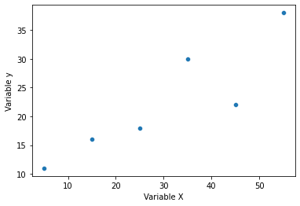
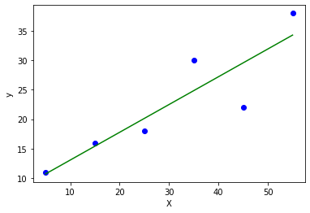
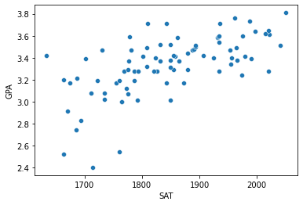
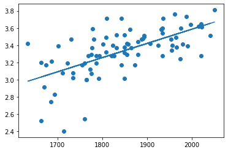

```python
# import libraries
import matplotlib.pyplot as plt
import numpy as np
import pandas as pd
import seaborn as sns
```

# Task 1:


```python
x= np.array([5, 15, 25, 35, 45, 55])
y= np.array([11, 16, 18, 30, 22, 38])
sns.scatterplot(x, y)

plt.xlabel('Variable X')
plt.ylabel('Variable y')
```

    /usr/local/lib/python3.8/dist-packages/seaborn/_decorators.py:36: FutureWarning: Pass the following variables as keyword args: x, y. From version 0.12, the only valid positional argument will be `data`, and passing other arguments without an explicit keyword will result in an error or misinterpretation.
      warnings.warn(

    Text(0, 0.5, 'Variable y')

    

    

## Calculation of b1 and b0 values.

```python
x_mean = np.mean(x)
y_mean = np.mean(y)

xy = x * y

xy_mean = np.mean(xy)
x_square = x**2
x_square_mean = np.mean(x_square)

# Using Formula given in reference PDF:
b1 = ((x_mean * y_mean) - np.mean(xy))/((x_mean)**2 - x_square_mean)
print('Slope b1 is = ', b1)

b0 = y_mean - b1 * x_mean
print('Intercept b0 is = ', b0)
```

    Slope b1 is =  nan
    Intercept b0 is =  nan

    <ipython-input-12-90802575e296>:11: RuntimeWarning: invalid value encountered in double_scalars
      b1 = ((x_mean * y_mean) - np.mean(xy))/((x_mean)**2 - x_square_mean)

## Calculation of r square value.

```python
# Formula:
y_pred = b1 * x + b0
error = y - y_pred
n = np.size(x)

se = (y - y_pred)**2

mse = (y - y_mean)**2

sse = np.sum(se)
ssr = np.sum(mse)

# Using Formula given in reference PDF:
r_sq = 1 - (sse/ssr)

print(se)

print(mse)

print('R square is', r_sq)
```

    [ 0.08163265  0.32653061  4.59183673 26.44897959 57.32653061 13.79591837]
    [132.25  42.25  20.25  56.25   0.25 240.25]
    R square is 0.7913094027030956

```python
plt.scatter(x, y, color = 'blue')
plt.plot(x, y_pred, color = 'green') # Plotting the Regression line
plt.xlabel('X')
plt.ylabel('y')
```

    Text(0, 0.5, 'y')

    

    

```python
# Formula:
x = np.array([20])
y_pred = b1 * x + b0

print(y_pred)
```

    [nan]

# Task 2:


```python
# import libraries
from sklearn.linear_model import LinearRegression
```

```python
# Converting the X array initialized in Task 1 to a 2D array.
x = x.reshape((-1, 1))

print(x)
print()
print(y)
```

    [[ 5]
     [15]
     [25]
     [35]
     [45]
     [55]]
    
    [11 16 18 30 22 38]

```python
reg_model = LinearRegression()
reg_model.fit(x, y)

reg_model = LinearRegression().fit(x, y)
```

### Hence we see that the value of R Square obtained above closely resembles to that which we obtained in Task 1.

```python
r_sq = reg_model.score(x, y)
print("Coefficient of determination (R Square) :", r_sq)
```

    Coefficient of determination (R Square) : 0.7913094027030955

## Intercept and Slope values. 
### Again, these values closely resemble to those values which we obtained in Task 1 for intercept and Slope respectively.

```python
print("Intercept (b0) :", reg_model.intercept_)
print()
print("Slope (b1) :", reg_model.coef_)
```

    Intercept (b0) : [ 8.75 11.5 ]
    
    Slope (b1) : [[0.1375 0.1375]
     [0.275  0.275 ]]

# Task 3:


```python
# import libraries
import statsmodels.api as sm
```

```python
# Reading the File:
df = pd.read_csv("/content/sat_cgpa.csv")
```

```python
# Size
df.size
```

    168

```python
# Shape
df.shape
```

    (84, 2)

```python
# Data Types
df.dtypes
```

    SAT      int64
    GPA    float64
    dtype: object

```python
df.head
```

    <bound method NDFrame.head of      SAT   GPA
    0   1714  2.40
    1   1664  2.52
    2   1760  2.54
    3   1685  2.74
    4   1693  2.83
    ..   ...   ...
    79  1936  3.71
    80  1810  3.71
    81  1987  3.73
    82  1962  3.76
    83  2050  3.81
    
    [84 rows x 2 columns]>

```python
df.describe
```

    <bound method NDFrame.describe of      SAT   GPA
    0   1714  2.40
    1   1664  2.52
    2   1760  2.54
    3   1685  2.74
    4   1693  2.83
    ..   ...   ...
    79  1936  3.71
    80  1810  3.71
    81  1987  3.73
    82  1962  3.76
    83  2050  3.81
    
    [84 rows x 2 columns]>

```python
sat_data = df["SAT"]
gpa_data = df["GPA"]
sns.scatterplot(sat_data, gpa_data)
```

    /usr/local/lib/python3.8/dist-packages/seaborn/_decorators.py:36: FutureWarning: Pass the following variables as keyword args: x, y. From version 0.12, the only valid positional argument will be `data`, and passing other arguments without an explicit keyword will result in an error or misinterpretation.
      warnings.warn(

    <matplotlib.axes._subplots.AxesSubplot at 0x7f2cccf39130>

    

    

```python
x = df["SAT"]
y = df["GPA"]

x_mean = np.mean(x)
y_mean = np.mean(y)

xy = x * y

xy_mean = np.mean(xy)
x_square = x**2
x_square_mean = np.mean(x_square)

# Using Formula given in reference PDF:
b1 = ((x_mean * y_mean) - np.mean(xy))/((x_mean)**2 - x_square_mean)
print('Slope b1 is = ', b1)

b0 = y_mean - b1 * x_mean
print('Intercept b0 is = ', b0)

r_sq = 1 - (np.sum((y - y_pred) ** 2) / np.sum((y - y_mean) ** 2))
print('R Value = ', r_sq)

plt.scatter(x, y)
plt.plot(x, y_pred)

plt.show()
```

    Slope b1 is =  0.0016556880500927249
    Intercept b0 is =  0.27504029966044463
    R Value =  0.40600391479679776

    

    

```python
x = df["SAT"].values.reshape(-1, 1)
```

```python
z = sm.add_constant(x) # Adds one more column with name 'const' to the dataset with value 1. It is an alternative addition to the reshape function which is generally used.
model = sm.OLS(df["GPA"], z) # Using the OLS Function.
# In the above line, you can store df["GPA"] in variable y to make the model syntax look readable:
# It will look like this : model = sm.OLS(y, z)
results = model.fit()
```

```python
print(results.summary())
```

                                OLS Regression Results                            
    ==============================================================================
    Dep. Variable:                    GPA   R-squared:                       0.406
    Model:                            OLS   Adj. R-squared:                  0.399
    Method:                 Least Squares   F-statistic:                     56.05
    Date:                Thu, 02 Feb 2023   Prob (F-statistic):           7.20e-11
    Time:                        05:24:59   Log-Likelihood:                 12.672
    No. Observations:                  84   AIC:                            -21.34
    Df Residuals:                      82   BIC:                            -16.48
    Df Model:                           1                                         
    Covariance Type:            nonrobust                                         
    ==============================================================================
                     coef    std err          t      P>|t|      [0.025      0.975]
    ------------------------------------------------------------------------------
    const          0.2750      0.409      0.673      0.503      -0.538       1.088
    x1             0.0017      0.000      7.487      0.000       0.001       0.002
    ==============================================================================
    Omnibus:                       12.839   Durbin-Watson:                   0.950
    Prob(Omnibus):                  0.002   Jarque-Bera (JB):               16.155
    Skew:                          -0.722   Prob(JB):                     0.000310
    Kurtosis:                       4.590   Cond. No.                     3.29e+04
    ==============================================================================
    
    Notes:
    [1] Standard Errors assume that the covariance matrix of the errors is correctly specified.
    [2] The condition number is large, 3.29e+04. This might indicate that there are
    strong multicollinearity or other numerical problems.

# Interpretation of the result/summary generated:

The OLS regression model shows that there is a positive correlation between SAT scores and GPA. 

The coefficient for SAT (0.0017) is positive, meaning that an increase in SAT score leads to an increase in GPA. 

The R-squared value (0.406) indicates that 40.6% of the variance in GPA is explained by the variance in SAT scores.

We also notice that the R-squared value obtained in the OLS Regression Results summary as well as the value obtained in the cell above (for R Square) is the same. Hence, we verify that the R-squared value calculated using sklearn model and OLS Model Regresssion are the same.

Null Hypothesis is 1, Slope is not 0 as Probability = 0.000 is less than the Level of Significance (L.O.S) and hence we accept alternate hypothesis.

The greater the level of R, better the movel, i.e R should be closer to 1 than 1.
