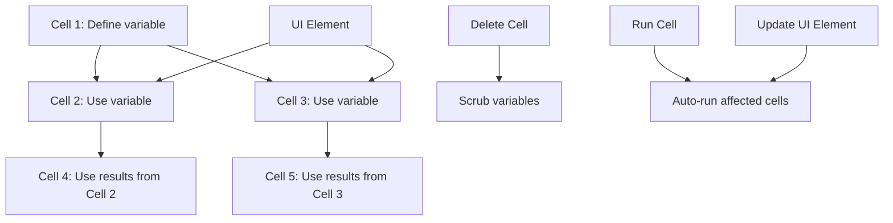



I came across marimo from a TL;DR newsletter (finally going through something regularly with passion pays off!) which I have a habit of going through daily for personal interests, passion and curating of resources to use in personal/group projects as I'm an open-source enthusiast who likes contributing too. This exciting discovery immediately caught my attention, promising to revolutionize the way we interact with Python notebooks. Let's dive into what makes marimo so special and how it's addressing long-standing issues in the notebook ecosystem.



## Table of Contents

1. [What is marimo?](#what-is-marimo)
2. [Key Features of marimo](#key-features-of-marimo)

   2.1. [Consistent State](#consistent-state)

   2.2. [Built-in Interactivity](#built-in-interactivity)

   2.3. [Pure Python Programs](#pure-python-programs)

3. [Solving Common Notebook Problems](#solving-common-notebook-problems)

   3.1. [Reproducibility](#reproducibility)

   3.2. [Maintainability](#maintainability)

   3.3. [Interactivity](#interactivity)

   3.4. [Reusability](#reusability)

   3.5. [Shareability](#shareability)
   
4. [Comparison with Jupyter Notebooks](#comparison-with-jupyter-notebooks)
5. [Getting Started with marimo](#getting-started-with-marimo)
6. [Use Cases and Examples](#use-cases-and-examples)
7. [Community and Support](#community-and-support)
8. [Conclusion](#conclusion)

## What is marimo?

After stumbling upon marimo in my daily newsletter dive (shout out to [TLDR](https://tldr.tech/)), I couldn't help but get excited about its potential. So, what exactly is this intriguing new tool?

**marimo** is a *reactive notebook for Python* that's shaking up the way we think about and interact with computational notebooks. It's not just another Jupyter alternative; it's a ground-up reimagining of what a Python notebook can be.

{}
At its core, marimo models notebooks as **dataflow graphs**, creating a dynamic and interconnected environment for your code.
{}



Imagine a notebook where running a cell or tweaking a UI element automatically updates all affected parts of your code. That's marimo in action! It keeps your code and outputs in perfect harmony, like a well-orchestrated symphony of data and computations.

But marimo isn't just about reactive execution. It's a multifaceted tool designed to address some of the most persistent pain points in the notebook ecosystem:

1. **Consistency is king**: marimo ensures that your code, outputs, and program state are always in sync. No more hidden states or mysterious bugs!

2. **Pure Python power**: Every marimo notebook is stored as pure Python. This means you can easily execute it as a script or even deploy it as a fully-fledged app. Talk about versatility!

3. **Interactive by nature**: Built-in UI elements aren't just add-ons; they're an integral part of the marimo experience, seamlessly synchronized with your Python code.

4. **Reproducibility made easy**: By automatically running affected cells or marking them as stale, marimo takes the guesswork out of reproducing results.

> "marimo was built from the ground up to solve well-known problems associated with traditional notebooks."

As someone who's spent countless hours wrestling with traditional notebooks, I can't overstate how refreshing this approach is. marimo isn't just iterating on existing solutions; it's reimagining the entire notebook paradigm.

In the following sections, we'll dive deeper into marimo's key features and how they address common notebook challenges. Trust me, whether you're a data scientist, a researcher, or just a Python enthusiast, you're in for a treat!

## Key Features of marimo

After diving into marimo, I was blown away by its innovative features. Let's break down the key elements that make this tool a game-changer in the world of Python notebooks.

### 2.1. Consistent State

Remember those frustrating moments when your notebook's outputs didn't match your code? Well, marimo says goodbye to that headache! 

{}
marimo **guarantees** that your code, outputs, and program state are always in sync, solving a major pain point of traditional notebooks like Jupyter.
{}

But how does it achieve this magical consistency? Two words: *reactive programming*.

1. **Smart Cell Execution**: Run a cell, and marimo automatically runs any cells that reference its variables. No more manual re-running and crossing your fingers!
2. **Clean Slate**: Delete a cell, and poof! marimo scrubs its variables from program memory. Say goodbye to hidden states lurking in the shadows.

> "With marimo, what you see is truly what you get. No more surprises!"

### 2.2. Built-in Interactivity

Now, this is where things get really exciting! marimo's interactivity isn't just a bolt-on feature; it's baked into its DNA.

- **UI Elements Galore**: Sliders, dataframe transformers, interactive plots – marimo's got them all, and they're *automatically synchronized* with your Python code. 
- **Real-time Reactivity**: Tweak a UI element, and watch as affected cells update instantly. It's like your notebook is alive!

{}
marimo's reactivity makes these UI elements more useful and ergonomic than Jupyter's ipywidgets. Trust me, once you try it, you'll wonder how you ever lived without it!
{}

### 2.3. Pure Python Programs

Here's where marimo really flexes its muscles:

1. **Python All the Way**: Every marimo notebook is saved as a pure Python file. No more JSON shenanigans!
2. **Script-Ready**: Run your notebooks as regular Python scripts. It's that simple.
3. **App Deployment**: With a single command (`marimo run your_notebook.py`), transform your notebook into an interactive web app. Mind blown yet?

But wait, there's more:

- **Deterministic Execution**: Cells execute based on variable references, not their position. Organize your notebook to tell your data story, your way.
- **Performance Boost**: marimo's smart runtime only runs the cells that need updating, saving you precious computation time.
- **Developer-Friendly**: GitHub Copilot integration, Black code formatting, HTML export, fast code completion, VS Code extension – marimo's got your back at every step.

As I explored these features, I couldn't help but feel like I was glimpsing the future of Python notebooks. marimo isn't just solving problems; it's redefining what's possible in this space.

```markmap
  - marimo
    - Consistent State
      - Guaranteed sync between code, outputs, and state
      - Reactive programming environment
      - Automatic cell re-running
      - Variable scrubbing on cell deletion
    - Built-in Interactivity
      - UI elements
        - Sliders
        - Dataframe transformers
        - Interactive plots
      - Automatic synchronization with Python code
      - Real-time updates of affected cells
    - Pure Python Programs
      - Saved as .py files
      - Executable as scripts
      - Deployable as web apps
    - Advanced Features
      - Deterministic execution order
      - Performance optimizations
        - Selective cell execution
        - Optional disabling of expensive cells
      - Developer tools
        - GitHub Copilot integration
        - Black code formatting
        - HTML export
        - Fast code completion
        - VS Code extension
```
