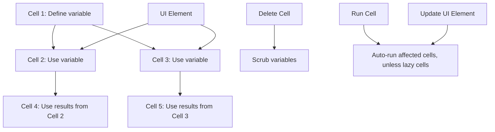



I came across marimo from a TL;DR newsletter (finally going through something regularly with passion pays off!) which I have a habit of going through daily for personal interests, passion and curating of resources to use in personal/group projects as I'm an open-source enthusiast who likes contributing too. This exciting discovery immediately caught my attention, promising to revolutionize the way we interact with Python notebooks. Let's dive into what makes marimo so special and how it's addressing long-standing issues in the notebook ecosystem.



## Table of Contents

1. [What is marimo?](#what-is-marimo)
2. [Key Features of marimo](#key-features-of-marimo)

   2.1. [Consistent State](#consistent-state)

   2.2. [Built-in Interactivity](#built-in-interactivity)

   2.3. [Pure Python Programs](#pure-python-programs)

3. [Solving Common Notebook Problems](#solving-common-notebook-problems)

   3.1. [Reproducibility](#reproducibility)

   3.2. [Maintainability](#maintainability)

   3.3. [Interactivity](#interactivity)

   3.4. [Reusability](#reusability)

   3.5. [Shareability](#shareability)
   
4. [Comparison with Jupyter Notebooks](#comparison-with-jupyter-notebooks)
5. [Getting Started with marimo](#getting-started-with-marimo)
6. [Use Cases and Examples](#use-cases-and-examples)
7. [Community and Support](#community-and-support)
8. [Conclusion](#conclusion)

## What is marimo?

After stumbling upon marimo in my daily newsletter dive (shout out to [TLDR](https://tldr.tech/)), I couldn't help but get excited about its potential. So, what exactly is this intriguing new tool?

**marimo** is a *reactive notebook for Python* that's shaking up the way we think about and interact with computational notebooks. It's not just another Jupyter alternative; it's a ground-up reimagining of what a Python notebook can be.

{}
At its core, marimo models notebooks as **dataflow graphs**, creating a dynamic and interconnected environment for your code.
{}

How I see the dataflow graph working for marimo:



Imagine a notebook where running a cell or tweaking a UI element automatically updates all affected parts of your code. That's marimo in action! It keeps your code and outputs in perfect harmony, like a well-orchestrated symphony of data and computations.

But marimo isn't just about reactive execution. It's a multifaceted tool designed to address some of the most persistent pain points in the notebook ecosystem:

1. **Consistency is king**: marimo ensures that your code, outputs, and program state are always in sync. No more hidden states or mysterious bugs!

2. **Pure Python power**: Every marimo notebook is stored as pure Python. This means you can easily execute it as a script or even deploy it as a fully-fledged app. Talk about versatility!

3. **Interactive by nature**: Built-in UI elements aren't just add-ons; they're an integral part of the marimo experience, seamlessly synchronized with your Python code.

4. **Reproducibility made easy**: By automatically running affected cells or marking them as stale, marimo takes the guesswork out of reproducing results.

> "marimo was built from the ground up to solve well-known problems associated with traditional notebooks."

As someone who's spent countless hours wrestling with traditional notebooks, I can't overstate how refreshing this approach is. marimo isn't just iterating on existing solutions; it's reimagining the entire notebook paradigm.

In the following sections, we'll dive deeper into marimo's key features and how they address common notebook challenges. Trust me, whether you're a data scientist, a researcher, or just a Python enthusiast, you're in for a treat!

## Key Features of marimo

After diving into marimo, I was blown away by its innovative features. Let's break down the key elements that make this tool a game-changer in the world of Python notebooks.

### 2.1. Consistent State

Remember those frustrating moments when your notebook's outputs didn't match your code? Well, marimo says goodbye to that headache! 

{}
marimo **guarantees** that your code, outputs, and program state are always in sync, solving a major pain point of traditional notebooks like Jupyter.
{}

But how does it achieve this magical consistency? Two words: *reactive programming*.

1. **Smart Cell Execution**: Run a cell, and marimo automatically runs any cells that reference its variables. No more manual re-running and crossing your fingers!
2. **Clean Slate**: Delete a cell, and poof! marimo scrubs its variables from program memory. Say goodbye to hidden states lurking in the shadows.

> "With marimo, what you see is truly what you get. No more surprises!"

### 2.2. Built-in Interactivity

Now, this is where things get really exciting! marimo's interactivity isn't just a bolt-on feature; it's baked into its DNA.

- **UI Elements Galore**: Sliders, dataframe transformers, interactive plots – marimo's got them all, and they're *automatically synchronized* with your Python code. 
- **Real-time Reactivity**: Tweak a UI element, and watch as affected cells update instantly. It's like your notebook is alive!

{}
marimo's reactivity makes these UI elements more useful and ergonomic than Jupyter's ipywidgets. Trust me, once you try it, you'll wonder how you ever lived without it!
{}

### 2.3. Pure Python Programs

Here's where marimo really flexes its muscles:

1. **Python All the Way**: Every marimo notebook is saved as a pure Python file. No more JSON shenanigans!
2. **Script-Ready**: Run your notebooks as regular Python scripts. It's that simple.
3. **App Deployment**: With a single command (`marimo run file.py`), transform your notebook into an interactive web app. Mind blown yet?

But wait, there's more:

- **Deterministic Execution**: Cells execute based on variable references, not their position. Organize your notebook to tell your data story, your way.
- **Performance Boost**: marimo's smart runtime only runs the cells that need updating, saving you precious computation time.
- **Developer-Friendly**: GitHub Copilot integration, Black code formatting, HTML export, fast code completion, VS Code extension – marimo's got your back at every step.

As I explored these features, I couldn't help but feel like I was glimpsing the future of Python notebooks. marimo isn't just solving problems; it's redefining what's possible in this space.

```markmap
  - marimo
    - Consistent State
      - Guaranteed sync between code, outputs, and state
      - Reactive programming environment
      - Automatic cell re-running
      - Variable scrubbing on cell deletion
    - Built-in Interactivity
      - UI elements
        - Sliders
        - Dataframe transformers
        - Interactive data visualization tools/plots
        - and [more](https://docs.marimo.io/api/index.html)
      - Automatic synchronization with Python code
      - Real-time updates of affected cells
    - Pure Python Programs
      - Saved as .py files
      - Executable as scripts
      - Deployable as web apps
    - Advanced Features
      - Deterministic execution order
      - Performance optimizations
        - Selective cell execution
        - Optional disabling of expensive cells
      - Developer tools
        - GitHub Copilot integration
        - HTML export
        - Fast code completion
        - VS Code extension
```

## Comparison with Jupyter Notebooks

As someone who's spent countless hours in Jupyter notebooks, I was curious to see how marimo stacks up.

### Reimagining the Notebook

First things first: marimo isn't just an upgrade to Jupyter; it's a complete reimagining of what a Python notebook can be. While Jupyter brought interactive computing to the masses, marimo takes it to the next level by addressing some of Jupyter's long-standing pain points.

### Consistency is Key

One of the biggest headaches with Jupyter notebooks is maintaining consistency between your code, outputs, and program state. We've all been there - running cells out of order, forgetting to re-run affected cells, and ending up with a notebook that's more confusing than helpful.

marimo tackles this head-on:

- **Automatic Reactivity**: Run a cell, and marimo automatically updates all cells that depend on it. No more manual cell juggling!
- **Clean Slate**: Delete a cell, and marimo doesn't just remove the code - it scrubs the associated variables from memory. Say goodbye to hidden states lurking in the shadows!

> "With marimo, what you see is truly what you get. No more 'it works on my machine' moments!"

### Interactivity on Steroids

While Jupyter offers interactivity through ipywidgets, marimo takes it to a whole new level:

- **Built-in UI Elements**: Sliders, dataframe transformers, interactive plots and [more](https://docs.marimo.io/api/index.html) - they're all baked right in.
- **Seamless Synchronization**: These elements aren't just add-ons; they're deeply integrated with your Python code.
- **Real-time Updates**: Tweak a UI element, and watch as affected cells update instantly. It's like your notebook is alive!

{}
marimo's reactive nature makes its UI elements feel more natural and responsive compared to Jupyter's ipywidgets.
{}

### Pure Python Power

Here's where marimo really shines:

- **Python Files, Not JSON**: marimo notebooks are stored as pure Python files, not JSON like Jupyter notebooks.
- **Script-Ready**: Run your marimo notebooks as regular Python scripts without any extra steps.
- **App Deployment**: Transform your notebook into an interactive web app with a single command. Try doing that with a Jupyter notebook!
- **Git-Friendly**: Version control your notebooks as easily as any other Python file. No more JSON diffs!

### The Bottom Line

While Jupyter notebooks have been a game-changer for interactive computing, marimo feels like the next evolutionary step. It addresses many of Jupyter's limitations while introducing powerful new features that make your workflow smoother and more intuitive.

Is marimo perfect for every use case? Probably not. Jupyter's widespread adoption and extensive ecosystem are hard to beat. But for those seeking a more consistent, interactive, and Python-native notebook experience, marimo is a breath of fresh air.

As I've explored marimo, I can't help but feel excited about its potential to reshape how we approach interactive computing in Python. It's not just solving problems; it's opening up new possibilities for how we work with data and code.

## 5. Getting Started with marimo

Ready to dive into the world of marimo? Getting started is a breeze! Here's how you can jump right in:

1. First, let's install marimo. Open your terminal and run:

```bash
pip install marimo
```

2. Once installed, you can kick off with a tutorial:

```bash
marimo tutorial intro
```

This will guide you through the basics of marimo, helping you get familiar with its unique features.

3. Ready to create your own notebook? It's as simple as:

```bash
marimo edit
```

This command will open up a new marimo notebook, ready for your code and ideas!

{}
For a comprehensive guide and detailed documentation, check out the [official marimo documentation](https://docs.marimo.io/getting_started/index.html). It's a treasure trove of information to help you make the most of marimo!
{}

Now that you're set up, let's explore some exciting use cases and examples!

[YouTube Video Placeholder]

## 6. Use Cases and Examples

marimo's versatility shines across various domains. Let's explore some key areas where marimo can supercharge your Python notebooks:

```markmap
- marimo Use Cases
  - Data Science
    - Exploratory Data Analysis
    - Machine Learning Model Development
    - Interactive Visualizations
  - Education
    - Interactive Tutorials
    - Coding Exercises
    - Concept Demonstrations
  - Research
    - Reproducible Experiments
    - Parameter Exploration
    - Result Visualization
  - Software Development
    - Prototyping
    - Documentation
    - Code Demonstrations
  - Business
    - Interactive Reports
    - Data Dashboards
    - Decision Support Tools
  - Pyodide-powered Use Cases
    - Rapid Experimentation
    - Blog Posts and Tutorials
    - Interactive Documentation
    - Custom Tools (e.g., Data Labelers)
    - Bug Reproductions
```

marimo can be used in many ways, from a next-gen replacement for Jupyter notebooks to creating powerful apps, dashboards, and internal tools. Its reactive nature allows you to explore data rapidly and run experiments in an environment that prevents bugs before they happen.

To see marimo in action across these domains, check out these resources:

1. [Official Examples](https://github.com/marimo-team/marimo/tree/main/examples): A collection of notebooks showcasing marimo's features.
2. [Cookbook](https://github.com/marimo-team/cookbook): Practical recipes and use cases for marimo.
3. [Public Gallery](https://marimo.io/@public): A showcase of interactive marimo notebooks across various domains.
4. [Haleshot's marimo-tutorials](https://github.com/Haleshot/marimo-tutorials): A community-driven repository with additional tutorials and examples.

{}
Exciting news! marimo now offers a Pyodide-powered playground at [https://marimo.new](https://marimo.new). This allows you to try marimo directly in your browser without any installation!
{}

### Pyodide Integration and WASM Notebooks

marimo's integration with Pyodide brings several advantages:
- Accessibility: No need to install Python, making scientific computing available to everyone.
- Easy Sharing: Share executable notebooks via URL without deploying backend infrastructure.
- Snappy Development: Eliminate network requests to remote Python runners for a faster experience.

#### Creating and Sharing WASM Notebooks

1. Create new WASM notebooks at [marimo.new](https://marimo.new).
2. Your work is automatically saved in your browser's local storage.
3. Generate shareable permalinks for your notebooks (note: these are publicly accessible).
4. Convert local notebooks to WASM: Use `Share > Create WebAssembly link` in the marimo editor's notebook action menu.

These features open up new possibilities for collaboration, education, and rapid prototyping. Whether you're a data scientist, educator, researcher, or developer, marimo offers tools to make your notebooks more dynamic, interactive, and shareable.

As you explore these examples and features, you'll see how marimo's capabilities come together to create powerful, interactive computational narratives. The ability to easily turn notebooks into web apps or share them via Pyodide, coupled with the consistent state management, opens up new horizons for sharing your work and insights.

In the next section, we'll dive into the community and support around marimo, helping you connect with other users and get help when you need it.
