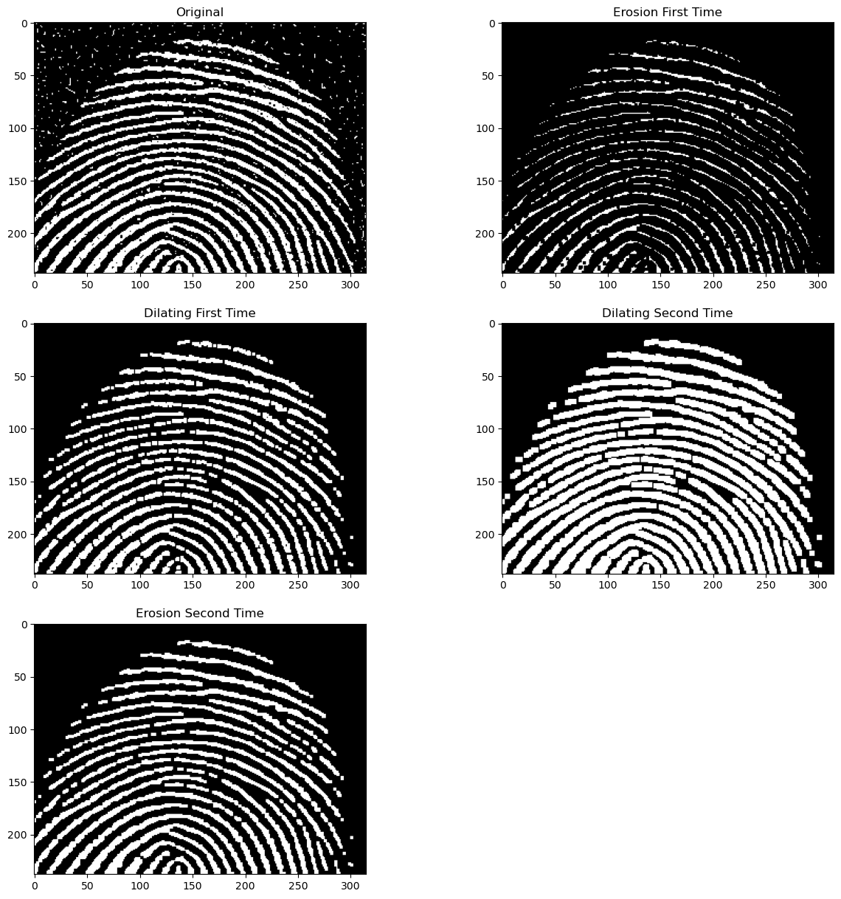
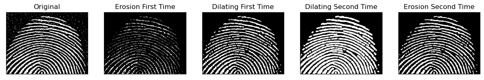
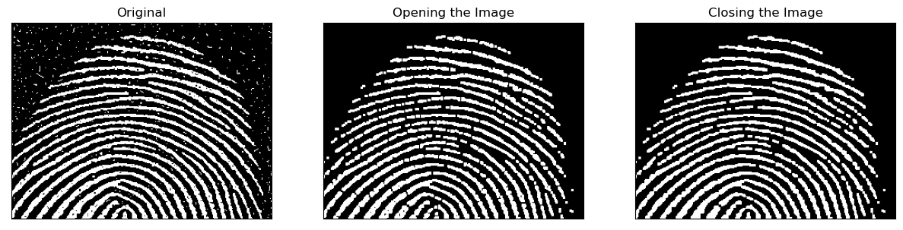

```python
# import libraries
import cv2
import pandas as pd
import numpy as np
import matplotlib.pyplot as plt
```

# Morphology Application:

## Importing the image:

```python
img = cv2.imread(r"F:\New_Laptop_Documents\NMIMS_College_Docs\2nd_Year\2nd Semester\SIP\Practicals\Experiment_9\Fig0911(a)(noisy_fingerprint).tif", 0)
```

```python
# Since we demonstrated the effects of user defined functions with built in functions of cv2 and they yielded the same result,
# we now create built in functions for erosion and dilation to use them for opening and closing of the image
```

```python
# We first erode the image and then dilate it on the image obtained after erosion. This process is called opening.
# Then we again dilate the image which we obtained after dilation and then erode the newly obtained image. This process is called closing.
```

```python
# We define inbuilt functions of erosion and dilation. This is also done to initialize the size of the structuring element.
```

```python
struct_element_size = int(input("Enter Structuring Element Size : "))
SE= np.ones((struct_element_size, struct_element_size))
constant = (struct_element_size - 1)//2
```

    Enter Structuring Element Size : 15

```python
# Defining a function using Built in Function for erosion
def erosion(img, SE):
  img_erode = cv2.erode(img, SE, 1)
  return img_erode

# Defining a function using Built in Function for dilation
def dilation(img, SE):
  img_dilate = cv2.dilate(img, SE, 1)
  return img_dilate
```

```python
# Defining the structuring element
SE = cv2.getStructuringElement(cv2.MORPH_RECT, (3,3))
```

## Opening the image:

```python
# Erode the image for  the first time:
Erosion_First_Time = erosion(img, SE)

# Dilate the eroded image.
Dilating_First_Time = dilation(Erosion_First_Time, SE)
```

```python
# Dilate the opened image followed by ersoion.
Dilating_Second_Time = dilation(Dilating_First_Time, SE)
Erosion_Second_Time = erosion(Dilating_Second_Time, SE)
```

```python
plt.figure(figsize = (15, 15))

plt.subplot(3, 2, 1)
plt.imshow(img, cmap = "gray")
plt.title("Original")

plt.subplot(3, 2, 2)
plt.title("Erosion First Time")
plt.imshow(Erosion_First_Time, cmap = "gray")

plt.subplot(3, 2, 3)
plt.title("Dilating First Time")
plt.imshow(Dilating_First_Time, cmap = "gray")

plt.subplot(3, 2, 4)
plt.title("Dilating Second Time")
plt.imshow(Dilating_Second_Time, cmap = "gray")

plt.subplot(3, 2, 5)
plt.title("Erosion Second Time")
plt.imshow(Erosion_Second_Time, cmap = "gray")
```

    <matplotlib.image.AxesImage at 0x2d1f53eb5e0>

    

    

```python
radii = ["Original", "Erosion First Time", "Dilating First Time", "Dilating Second Time", "Erosion Second Time"]
images = [img, Erosion_First_Time, Dilating_First_Time, Dilating_Second_Time, Erosion_Second_Time]
plt.figure(figsize = (15, 15))
for i in range(len(radii)):    
    plt.subplot(1, 5, i + 1)
    plt.imshow(images[i], cmap = "gray", vmin = 0, vmax = 255)
    plt.title("{}".format(radii[i]))
    plt.xticks([])
    plt.yticks([])
```

    

    

```python
radii = ["Original", "Opening the Image", "Closing the Image"]
images = [img, Dilating_First_Time, Erosion_Second_Time]
plt.figure(figsize = (15, 15))
for i in range(len(radii)):    
    plt.subplot(1, 3, i + 1)
    plt.imshow(images[i], cmap = "gray", vmin = 0, vmax = 255)
    plt.title("{}".format(radii[i]))
    plt.xticks([])
    plt.yticks([])
```

    

    

