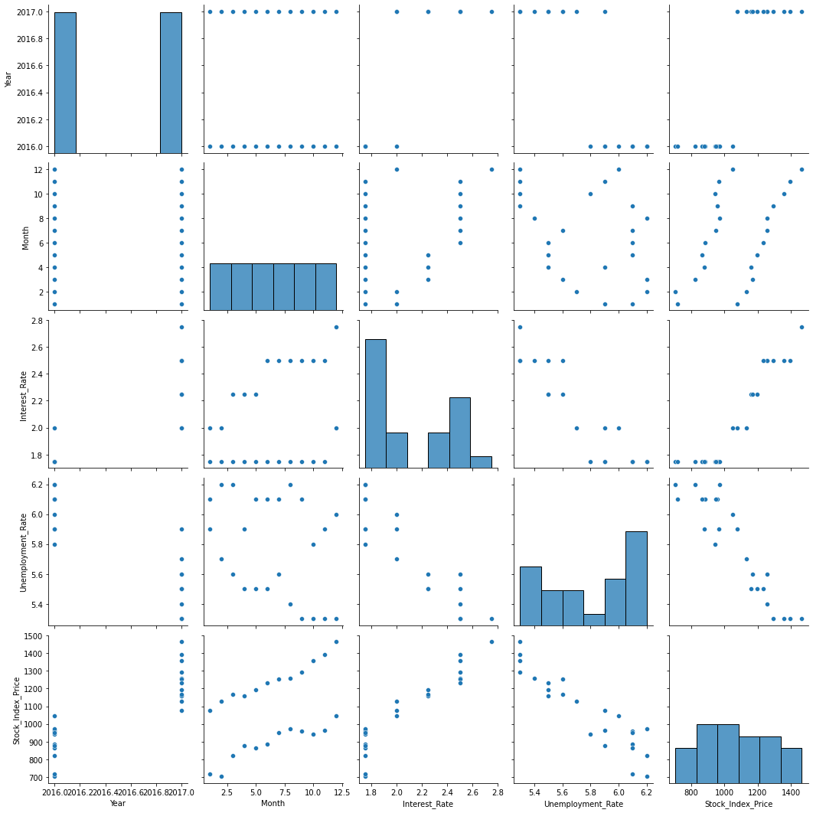
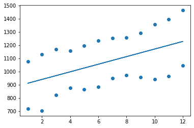
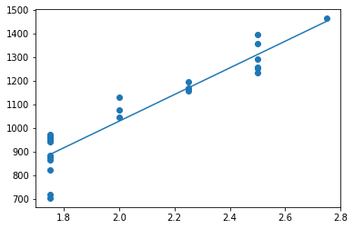
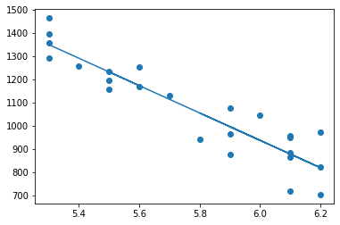
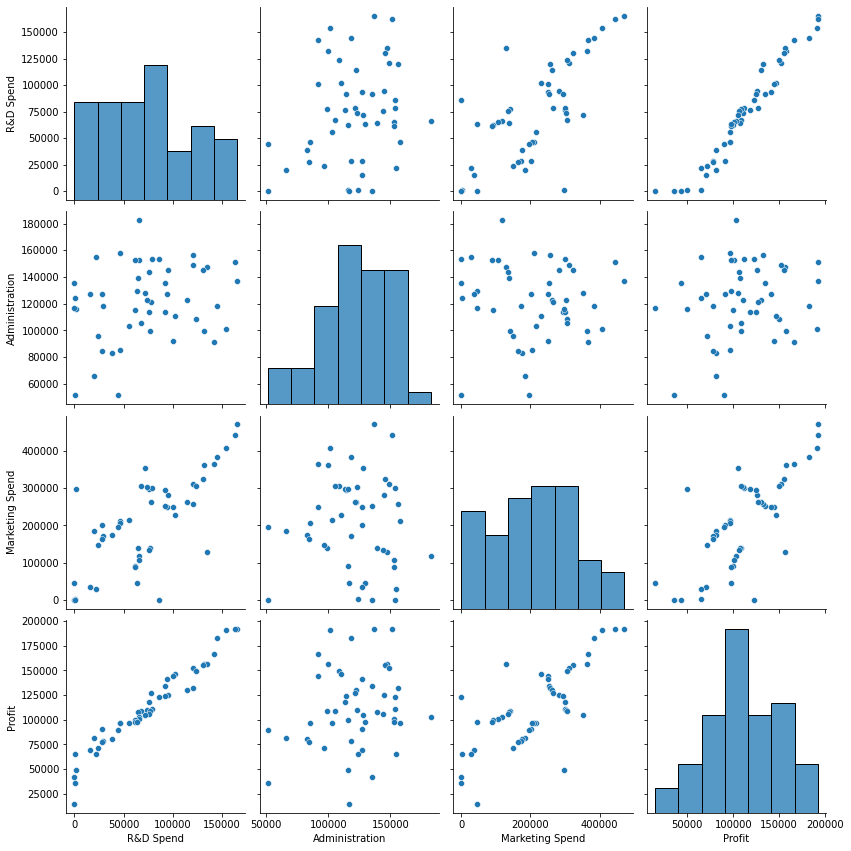

# Multiple Linear Regression

This README file provides instructions and information for implementing multiple linear regression. The experiment requires knowledge of multiple linear regression concepts and aims to develop skills in implementing and interpreting the results of different models.

## Table of Contents
1. [Aim](#aim)
2. [Prerequisite](#prerequisite)
3. [Outcome](#outcome)
4. [Theory](#theory)
5. [Task 1: Relationships between the different features](#task-1)
6. [Task 2: Fitting different simple linear regression models](#task-2)
7. [Task 3: Multiple regression model](#task-3)
8. [Task 4: Multiple regression model on 50 startups dataset](#task-4)

<a name="aim"></a>
## Aim
The aim of this project is to implement multiple linear regression.

<a name="prerequisite"></a>
## Prerequisite
To successfully complete this experiment, you should have a good understanding of multiple linear regression concepts.

<a name="outcome"></a>
## Outcome
After successfully completing this experiment, you will be able to:
1. Implement multiple linear regression using the `sklearn` package and `statsmodels`.
2. Interpret the results obtained from different models and choose the best model for a given dataset.
3. Can be found [here](https://github.com/Haleshot/AI-ML/blob/master/Multiple_Linear_Regression/Multiple_Linear_Regression.ipynb).

<a name="theory"></a>
## Theory
### Linear Regression
Multiple regression is an extension of simple linear regression. In multiple linear regression, a linear regression model contains more than one predictor variable. The model varies linearly with the change in the parameters β0, β1, β2, and so on. The intercept of the plane is represented by the parameter β0, while parameters β1, β2, etc. are referred to as partial regression coefficients.

The steps for multiple linear regression are as follows:
1. Identify the independent and dependent variables.
2. Check the relationships between the independent variables and the dependent variable using scatter plots and correlations.
3. Check the relationships between the independent variables using scatter plots and correlations.
4. Conduct simple linear regression for each independent variable-dependent variable pair.
5. Use the non-redundant independent variables in the analysis to find the best fitting model.
6. Use the best fitting model to make predictions about the dependent variable.

Tasks are provided to help you understand and implement multiple linear regression.

<a name="task-1"></a>
## Task 1: Relationships between the different features
Perform the following tasks to understand the relationships between the different features:

1. Import the relevant libraries.
2. Load the `MLR_data.csv` dataset into your notebook.
3. Perform exploratory data analysis (EDA) on the dataset using the `head()`, `shape`, and `describe()` functions.
4. Identify the independent variables (IV) and dependent variable (DV) and plot scatter plots of IV vs. DV. Write your inferences for each plot.
5. Plot scatter plots for IV vs. IV. Write your inferences for each plot.

<a name="task-2"></a>
## Task 2: Fitting different simple linear regression models
Perform the following tasks to fit different simple linear regression models for each IV/DV pair:

1. Import `LinearRegression` from `sklearn`.
2. Create a model for linear regression.
3. Conduct simple linear regression for each IV/DV pair:
   - Interest rate vs. stock index price
   - Unemployment vs. stock index price
4. Determine and tabulate the values of R2, slope, and intercept for each model.
5. Determine the predicted value of stock index price for an interest rate of 2.75.
6. Determine the predicted value of stock index price for an unemployment rate of 6.
7. Compare both models based on R2 and the mean square error between predicted and actual stock index price.

<a name="task-3"></a>
## Task 3: Multiple regression model
Perform the following tasks to create a multiple regression model:

1. Use both interest rate and unemployment rate as independent variables and create a multiple regression model.
2. Determine the value of R2, slope, and intercept for the model.
3. Determine the predicted value of stock index price for:
   - Interest rate = 2.75 and unemployment rate = 5.3
   - Interest rate = 2 and unemployment rate = 6
4. Compare the model with the models from Task 2.
5. Identify and state the best model for the dataset.

<a name="task-4"></a>
## Task 4: Multiple regression model on 50 startups dataset
Perform the following tasks to create a multiple regression model on the 50 startups dataset:

1. Load the 50 startups dataset.
2. Follow the steps mentioned in the theory for multiple linear regression to determine the best fitting model for this dataset.

> [!NOTE]
> Make sure to follow the instructions provided for each task and analyze the results accordingly to gain a better understanding of multiple linear regression.


```python
# import libraries
import matplotlib.pyplot as plt
import numpy as np
import pandas as pd
import seaborn as sns
```

# Task 1:

```python
# Reading the File:
df = pd.read_csv("/content/MLR_data.csv")
```

## EDA

```python
# Size
df.size
```

    120

```python
# Shape
df.shape
```

    (24, 5)

```python
# Data Types
df.dtypes
```

    Year                   int64
    Month                  int64
    Interest_Rate        float64
    Unemployment_Rate    float64
    Stock_Index_Price      int64
    dtype: object

```python
df.describe()
```

  <div id="df-788e5ed7-4f2a-4876-a38d-c975b44009e3">
    <div class="colab-df-container">
      <div>
<style scoped>
    .dataframe tbody tr th:only-of-type {
        vertical-align: middle;
    }

    .dataframe tbody tr th {
        vertical-align: top;
    }

    .dataframe thead th {
        text-align: right;
    }
</style>
<table border="1" class="dataframe">
  <thead>
    <tr style="text-align: right;">
      <th></th>
      <th>R&amp;D Spend</th>
      <th>Administration</th>
      <th>Marketing Spend</th>
      <th>Profit</th>
    </tr>
  </thead>
  <tbody>
    <tr>
      <th>count</th>
      <td>50.000000</td>
      <td>50.000000</td>
      <td>50.000000</td>
      <td>50.000000</td>
    </tr>
    <tr>
      <th>mean</th>
      <td>73721.615600</td>
      <td>121344.639600</td>
      <td>211025.097800</td>
      <td>112012.639200</td>
    </tr>
    <tr>
      <th>std</th>
      <td>45902.256482</td>
      <td>28017.802755</td>
      <td>122290.310726</td>
      <td>40306.180338</td>
    </tr>
    <tr>
      <th>min</th>
      <td>0.000000</td>
      <td>51283.140000</td>
      <td>0.000000</td>
      <td>14681.400000</td>
    </tr>
    <tr>
      <th>25%</th>
      <td>39936.370000</td>
      <td>103730.875000</td>
      <td>129300.132500</td>
      <td>90138.902500</td>
    </tr>
    <tr>
      <th>50%</th>
      <td>73051.080000</td>
      <td>122699.795000</td>
      <td>212716.240000</td>
      <td>107978.190000</td>
    </tr>
    <tr>
      <th>75%</th>
      <td>101602.800000</td>
      <td>144842.180000</td>
      <td>299469.085000</td>
      <td>139765.977500</td>
    </tr>
    <tr>
      <th>max</th>
      <td>165349.200000</td>
      <td>182645.560000</td>
      <td>471784.100000</td>
      <td>192261.830000</td>
    </tr>
  </tbody>
</table>
</div>
      <button class="colab-df-convert" onclick="convertToInteractive('df-788e5ed7-4f2a-4876-a38d-c975b44009e3')"
              title="Convert this dataframe to an interactive table."
              style="display:none;">

  <svg xmlns="http://www.w3.org/2000/svg" height="24px"viewBox="0 0 24 24"
       width="24px">
    <path d="M0 0h24v24H0V0z" fill="none"/>
    <path d="M18.56 5.44l.94 2.06.94-2.06 2.06-.94-2.06-.94-.94-2.06-.94 2.06-2.06.94zm-11 1L8.5 8.5l.94-2.06 2.06-.94-2.06-.94L8.5 2.5l-.94 2.06-2.06.94zm10 10l.94 2.06.94-2.06 2.06-.94-2.06-.94-.94-2.06-.94 2.06-2.06.94z"/><path d="M17.41 7.96l-1.37-1.37c-.4-.4-.92-.59-1.43-.59-.52 0-1.04.2-1.43.59L10.3 9.45l-7.72 7.72c-.78.78-.78 2.05 0 2.83L4 21.41c.39.39.9.59 1.41.59.51 0 1.02-.2 1.41-.59l7.78-7.78 2.81-2.81c.8-.78.8-2.07 0-2.86zM5.41 20L4 18.59l7.72-7.72 1.47 1.35L5.41 20z"/>
  </svg>
      </button>

  <style>
    .colab-df-container {
      display:flex;
      flex-wrap:wrap;
      gap: 12px;
    }

    .colab-df-convert {
      background-color: #E8F0FE;
      border: none;
      border-radius: 50%;
      cursor: pointer;
      display: none;
      fill: #1967D2;
      height: 32px;
      padding: 0 0 0 0;
      width: 32px;
    }

    .colab-df-convert:hover {
      background-color: #E2EBFA;
      box-shadow: 0px 1px 2px rgba(60, 64, 67, 0.3), 0px 1px 3px 1px rgba(60, 64, 67, 0.15);
      fill: #174EA6;
    }

    [theme=dark] .colab-df-convert {
      background-color: #3B4455;
      fill: #D2E3FC;
    }

    [theme=dark] .colab-df-convert:hover {
      background-color: #434B5C;
      box-shadow: 0px 1px 3px 1px rgba(0, 0, 0, 0.15);
      filter: drop-shadow(0px 1px 2px rgba(0, 0, 0, 0.3));
      fill: #FFFFFF;
    }
  </style>

      <script>
        const buttonEl =
          document.querySelector('#df-788e5ed7-4f2a-4876-a38d-c975b44009e3 button.colab-df-convert');
        buttonEl.style.display =
          google.colab.kernel.accessAllowed ? 'block' : 'none';

        async function convertToInteractive(key) {
          const element = document.querySelector('#df-788e5ed7-4f2a-4876-a38d-c975b44009e3');
          const dataTable =
            await google.colab.kernel.invokeFunction('convertToInteractive',
                                                     [key], {});
          if (!dataTable) return;

          const docLinkHtml = 'Like what you see? Visit the ' +
            '<a target="_blank" href=https://colab.research.google.com/notebooks/data_table.ipynb>data table notebook</a>'
            + ' to learn more about interactive tables.';
          element.innerHTML = '';
          dataTable['output_type'] = 'display_data';
          await google.colab.output.renderOutput(dataTable, element);
          const docLink = document.createElement('div');
          docLink.innerHTML = docLinkHtml;
          element.appendChild(docLink);
        }
      </script>
    </div>
  </div>

### The Dependent variable is the Stock_Index_Price and the other variables are the columns other than the Stock_Index_Price.
### We need to see which Independent variables best describe the Dependent variable by eliminating the redundant ones which don't express the IV at all.

# Conclusion:
## We notice that from the pair plot given below, the correlation of Year and Month (Independent variables) with the Stock_Price_Index(Dependent Variable) doesn't give us essential information to proceed and build models based on them,.

## Whereas, Interest_Rate and Unemployment_Rate on the other hand, give us valuable information to proceed build models with Dependent Variables.

## The graphs of Year and Month show a constant slope with no variations in them, hence they don't describe the independent variable effectively at all.

```python
sns.pairplot(df, height = 3, diag_kind = 'hist')
```

    <seaborn.axisgrid.PairGrid at 0x7ff9c8049610>

    

    

# Task 2:

```python
# import libraries
from sklearn.linear_model import LinearRegression
```

```python
Month_data = df["Month"]
Interest_rate_data = df["Interest_Rate"]
Unemployment_Rate_data = df["Unemployment_Rate"]
Stock_Index_Price_data = df["Stock_Index_Price"]

# Converting the X array initialized in Task 1 to a 2D arrays.
MD = Month_data.values.reshape((-1, 1))
ID = Interest_rate_data.values.reshape((-1, 1))
URD = Unemployment_Rate_data.values.reshape((-1, 1))
```

## We notice a positive correlation between the two variables - Month and Stock Index Price:

```python
reg_model = LinearRegression()
reg_model.fit(MD, Stock_Index_Price_data)

reg_model = LinearRegression().fit(MD, Stock_Index_Price_data)
```

```python
r_sq = reg_model.score(MD, Stock_Index_Price_data)
print("R Square Value : ", r_sq)
b0 = reg_model.intercept_
b1 = reg_model.coef_
print("Intercept (b0) :", reg_model.intercept_)
print()
print("Slope (b1) :", reg_model.coef_)
```

    R Square Value :  0.23163745862450869
    Intercept (b0) : 883.1287878787878
    
    Slope (b1) : [28.76223776]

```python
y_pred = b1 * MD + b0
plt.scatter(MD, Stock_Index_Price_data)
plt.plot(MD, y_pred)

plt.show()
```

    

    

## We notice a positive correlation between the two variables - Interest Rate and Stock Index Price:

```python
reg_model = LinearRegression()
reg_model.fit(ID, Stock_Index_Price_data)

reg_model = LinearRegression().fit(ID, Stock_Index_Price_data)

r_sq = reg_model.score(ID, Stock_Index_Price_data)
print("R Square Value : ", r_sq)
print("Intercept (b0) :", reg_model.intercept_)
print()
print("Slope (b1) :", reg_model.coef_)
```

    R Square Value :  0.8757089547891359
    Intercept (b0) : -99.46431881371655
    
    Slope (b1) : [564.20389249]

```python
b0 = reg_model.intercept_
b1 = reg_model.coef_
y_pred = b1 * ID + b0
plt.scatter(ID, Stock_Index_Price_data)
plt.plot(ID, y_pred)

plt.show()
```

    

    

```python
ID = 2.75
y_pred = b1 * ID + b0
MSE = ((y_pred - 1464 )**2)/2
print(MSE)
```

    [70.84801858]

## We notice a negative correlation between the two variables - Unemployment Rate and Stock Index Price:

```python
reg_model = LinearRegression()
reg_model.fit(URD, Stock_Index_Price_data)

reg_model = LinearRegression().fit(URD, Stock_Index_Price_data)

r_sq = reg_model.score(URD, Stock_Index_Price_data)
print("R Square Value : ", r_sq)
print("Intercept (b0) :", reg_model.intercept_)
print()
print("Slope (b1) :", reg_model.coef_)
```

    R Square Value :  0.850706607677214
    Intercept (b0) : 4471.339321357287
    
    Slope (b1) : [-588.96207585]

```python
b0 = reg_model.intercept_
b1 = reg_model.coef_
y_pred = b1 * URD + b0
plt.scatter(URD, Stock_Index_Price_data)
plt.plot(URD, y_pred)

plt.show()
```

    

    

```python
URD = 6
y_pred = b1 * URD + b0
MSE = ((y_pred - 1047 )**2)/2
print(MSE)
```

    [5987.80537926]

# Task 3:

# Multiple Regression Model of Interest Rate and Unemployment Rate with Stock Index Price:

```python
x = np.array(df[["Interest_Rate", "Unemployment_Rate"]])
y = np.array(df["Stock_Index_Price"])
reg_model.fit(x, y)
r_sq = reg_model.score(x, y)
print("R Square Value : ", r_sq)
b0 = reg_model.intercept_
b1 = reg_model.coef_[0]
b2 = reg_model.coef_[1]

print("Intercept (b0) :", reg_model.intercept_)
print()
print(b1)
print(b2)

r_sq = reg_model.score(x, y)
print("R Square Value : ", r_sq)
b0 = reg_model.intercept_
b1 = reg_model.coef_[0]
b2 = reg_model.coef_[1]

print("Intercept (b0) :", reg_model.intercept_)
print()
print(b1)
print(b2)
y_pred = b0 + b1*2.75 + b2 * 5.3
print(y_pred)
y_pred = b0 + b1*2 + b2 * 6
print(y_pred)
```

    R Square Value :  0.8976335894170216
    Intercept (b0) : 1798.4039776258544
    
    345.54008701056574
    -250.14657136938055
    R Square Value :  0.8976335894170216
    Intercept (b0) : 1798.4039776258544
    
    345.54008701056574
    -250.14657136938055
    1422.8623886471935
    988.6047234307027

# Multiple Regression Model of Interest Rate, Unemployment Rate and Month with Stock Index Price:

```python
x = np.array(df[["Interest_Rate", "Unemployment_Rate", "Month"]])
y = np.array(df["Stock_Index_Price"])
reg_model.fit(x, y)

r_sq = reg_model.score(x, y)
print("R Square Value : ", r_sq)
b0 = reg_model.intercept_
b1 = reg_model.coef_[0]
b2 = reg_model.coef_[1]
b3 = reg_model.coef_[2]

print("Intercept (b0) :", reg_model.intercept_)
print()
print(b1)
print(b2)
print(b3)
y_pred = b0 + b1*2.75 + b2 * 5.3 + b3 * 12
print(y_pred)
y_pred = b0 + b1*2 + b2 * 6 + b3 * 12
print(y_pred)
```

    R Square Value :  0.9230425469229033
    Intercept (b0) : 1591.5963382763719
    
    335.1930601634653
    -222.08250237506545
    10.182486970633022
    1458.529834785651
    1051.677288000506

## Hence we can conclude from the above 2 models that the model which includes month as a independent variable is more suitable as it's R value = 0.923 which is greater than the R value of the model without month as a independent variable (0.897).

# Task 4:

```python
# Reading the File:
df = pd.read_csv("/content/50_Startups.csv")
df1 = pd.read_csv("/content/50_Startups.csv")
```

## EDA

```python
# Size
df.size
```

    250

```python
# Shape
df.shape
```

    (50, 5)

```python
# Data Types
df.dtypes
```

    R&D Spend          float64
    Administration     float64
    Marketing Spend    float64
    State               object
    Profit             float64
    dtype: object

```python
df.describe()
```

  <div id="df-f7641fe5-e1da-4911-9a09-a0935daf9629">
    <div class="colab-df-container">
      <div>
<style scoped>
    .dataframe tbody tr th:only-of-type {
        vertical-align: middle;
    }

    .dataframe tbody tr th {
        vertical-align: top;
    }

    .dataframe thead th {
        text-align: right;
    }
</style>
<table border="1" class="dataframe">
  <thead>
    <tr style="text-align: right;">
      <th></th>
      <th>R&amp;D Spend</th>
      <th>Administration</th>
      <th>Marketing Spend</th>
      <th>Profit</th>
    </tr>
  </thead>
  <tbody>
    <tr>
      <th>count</th>
      <td>50.000000</td>
      <td>50.000000</td>
      <td>50.000000</td>
      <td>50.000000</td>
    </tr>
    <tr>
      <th>mean</th>
      <td>73721.615600</td>
      <td>121344.639600</td>
      <td>211025.097800</td>
      <td>112012.639200</td>
    </tr>
    <tr>
      <th>std</th>
      <td>45902.256482</td>
      <td>28017.802755</td>
      <td>122290.310726</td>
      <td>40306.180338</td>
    </tr>
    <tr>
      <th>min</th>
      <td>0.000000</td>
      <td>51283.140000</td>
      <td>0.000000</td>
      <td>14681.400000</td>
    </tr>
    <tr>
      <th>25%</th>
      <td>39936.370000</td>
      <td>103730.875000</td>
      <td>129300.132500</td>
      <td>90138.902500</td>
    </tr>
    <tr>
      <th>50%</th>
      <td>73051.080000</td>
      <td>122699.795000</td>
      <td>212716.240000</td>
      <td>107978.190000</td>
    </tr>
    <tr>
      <th>75%</th>
      <td>101602.800000</td>
      <td>144842.180000</td>
      <td>299469.085000</td>
      <td>139765.977500</td>
    </tr>
    <tr>
      <th>max</th>
      <td>165349.200000</td>
      <td>182645.560000</td>
      <td>471784.100000</td>
      <td>192261.830000</td>
    </tr>
  </tbody>
</table>
</div>
      <button class="colab-df-convert" onclick="convertToInteractive('df-f7641fe5-e1da-4911-9a09-a0935daf9629')"
              title="Convert this dataframe to an interactive table."
              style="display:none;">

  <svg xmlns="http://www.w3.org/2000/svg" height="24px"viewBox="0 0 24 24"
       width="24px">
    <path d="M0 0h24v24H0V0z" fill="none"/>
    <path d="M18.56 5.44l.94 2.06.94-2.06 2.06-.94-2.06-.94-.94-2.06-.94 2.06-2.06.94zm-11 1L8.5 8.5l.94-2.06 2.06-.94-2.06-.94L8.5 2.5l-.94 2.06-2.06.94zm10 10l.94 2.06.94-2.06 2.06-.94-2.06-.94-.94-2.06-.94 2.06-2.06.94z"/><path d="M17.41 7.96l-1.37-1.37c-.4-.4-.92-.59-1.43-.59-.52 0-1.04.2-1.43.59L10.3 9.45l-7.72 7.72c-.78.78-.78 2.05 0 2.83L4 21.41c.39.39.9.59 1.41.59.51 0 1.02-.2 1.41-.59l7.78-7.78 2.81-2.81c.8-.78.8-2.07 0-2.86zM5.41 20L4 18.59l7.72-7.72 1.47 1.35L5.41 20z"/>
  </svg>
      </button>

  <style>
    .colab-df-container {
      display:flex;
      flex-wrap:wrap;
      gap: 12px;
    }

    .colab-df-convert {
      background-color: #E8F0FE;
      border: none;
      border-radius: 50%;
      cursor: pointer;
      display: none;
      fill: #1967D2;
      height: 32px;
      padding: 0 0 0 0;
      width: 32px;
    }

    .colab-df-convert:hover {
      background-color: #E2EBFA;
      box-shadow: 0px 1px 2px rgba(60, 64, 67, 0.3), 0px 1px 3px 1px rgba(60, 64, 67, 0.15);
      fill: #174EA6;
    }

    [theme=dark] .colab-df-convert {
      background-color: #3B4455;
      fill: #D2E3FC;
    }

    [theme=dark] .colab-df-convert:hover {
      background-color: #434B5C;
      box-shadow: 0px 1px 3px 1px rgba(0, 0, 0, 0.15);
      filter: drop-shadow(0px 1px 2px rgba(0, 0, 0, 0.3));
      fill: #FFFFFF;
    }
  </style>

      <script>
        const buttonEl =
          document.querySelector('#df-f7641fe5-e1da-4911-9a09-a0935daf9629 button.colab-df-convert');
        buttonEl.style.display =
          google.colab.kernel.accessAllowed ? 'block' : 'none';

        async function convertToInteractive(key) {
          const element = document.querySelector('#df-f7641fe5-e1da-4911-9a09-a0935daf9629');
          const dataTable =
            await google.colab.kernel.invokeFunction('convertToInteractive',
                                                     [key], {});
          if (!dataTable) return;

          const docLinkHtml = 'Like what you see? Visit the ' +
            '<a target="_blank" href=https://colab.research.google.com/notebooks/data_table.ipynb>data table notebook</a>'
            + ' to learn more about interactive tables.';
          element.innerHTML = '';
          dataTable['output_type'] = 'display_data';
          await google.colab.output.renderOutput(dataTable, element);
          const docLink = document.createElement('div');
          docLink.innerHTML = docLinkHtml;
          element.appendChild(docLink);
        }
      </script>
    </div>
  </div>

### The Dependent variable is the Profit and the other variables are the columns other than the Stock_Index_Price.
### We need to see which Independent variables best describe the Dependent variable by eliminating the redundant ones which don't express the IV at all.

# Conclusion:
## We notice that from the pair plot given below, the correlation of Administration and State (Independent variables) with the Profit(Dependent Variable) doesn't give us essential information to proceed and build models based on them.

## Whereas, R&D Spend and Marketing Spend on the other hand, give us valuable information to proceed build models with Dependent Variables.

## The graphs of Administration and State show a constant slope with no variations in them, hence they don't describe the independent variable effectively at all.

```python
sns.pairplot(df, height = 3, diag_kind = 'hist')
```

    <seaborn.axisgrid.PairGrid at 0x7ff98945ae20>

    

    

```python
x = np.array(df[['R&D Spend', 'Administration', 'Marketing Spend']])
y = np.array(df['Profit'])
reg_model = LinearRegression()

reg_model.fit(x, y)

r_sq = reg_model.score(x, y)
print("R Square Value : ", r_sq)
b0 = reg_model.intercept_
b1 = reg_model.coef_[0]
b2 = reg_model.coef_[1]
b3 = reg_model.coef_[2]

print("Intercept (b0) :", reg_model.intercept_)
print()
print(b1)
print(b2)
print(b3)
y_pred = b0 + b1*2.75 + b2 * 5.3 + b3 * 12
print(y_pred)
y_pred = b0 + b1*2 + b2 * 6 + b3 * 12
print(y_pred)
```

    R Square Value :  0.9507459940683246
    Intercept (b0) : 50122.19298986524
    
    0.8057150499157437
    -0.02681596839475075
    0.027228064800818817
    50124.59331839763
    50123.970260932314

## Hence we can conclude that the Multiple Regression model with the respective columns are helpful in building a good model (with r value 0.95).

```python
import statsmodels.api as sm
results = sm.OLS(y, x).fit()
print(results.summary())
```

                                     OLS Regression Results                                
    =======================================================================================
    Dep. Variable:                      y   R-squared (uncentered):                   0.987
    Model:                            OLS   Adj. R-squared (uncentered):              0.987
    Method:                 Least Squares   F-statistic:                              1232.
    Date:                Thu, 09 Feb 2023   Prob (F-statistic):                    1.17e-44
    Time:                        12:35:27   Log-Likelihood:                         -545.82
    No. Observations:                  50   AIC:                                      1098.
    Df Residuals:                      47   BIC:                                      1103.
    Df Model:                           3                                                  
    Covariance Type:            nonrobust                                                  
    ==============================================================================
                     coef    std err          t      P>|t|      [0.025      0.975]
    ------------------------------------------------------------------------------
    x1             0.7180      0.065     11.047      0.000       0.587       0.849
    x2             0.3277      0.031     10.458      0.000       0.265       0.391
    x3             0.0822      0.022      3.733      0.001       0.038       0.126
    ==============================================================================
    Omnibus:                        0.665   Durbin-Watson:                   1.361
    Prob(Omnibus):                  0.717   Jarque-Bera (JB):                0.749
    Skew:                          -0.126   Prob(JB):                        0.688
    Kurtosis:                       2.456   Cond. No.                         9.76
    ==============================================================================
    
    Notes:
    [1] R² is computed without centering (uncentered) since the model does not contain a constant.
    [2] Standard Errors assume that the covariance matrix of the errors is correctly specified.

# Conclusion
## From the above experiment, I learnt the following:
1.	Implement multiple linear regression by using sklearn package statsmodels.
2.	Interpret the results obtained from different models and choose the best model for the given data set using R values and P with reference to L.O.S.

