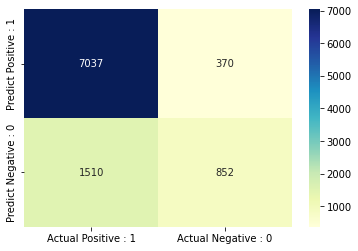

# Naïve Bayes Algorithm for Classification

This README file provides instructions and information for implementing the Naïve Bayes algorithm for classification. The experiment requires prior knowledge of Python programming and the following libraries: Pandas, NumPy, Matplotlib, and Seaborn.

## Table of Contents
1. [Aim](#aim)
2. [Prerequisite](#prerequisite)
3. [Outcome](#outcome)
4. [Theory](#theory)
5. [Tasks](#tasks)

<a name="aim"></a>
## Aim
The aim of this project is to implement the Naïve Bayes algorithm for classification.

<a name="prerequisite"></a>
## Prerequisite
To successfully complete this experiment, you should have knowledge of Python programming and the following libraries: Pandas, NumPy, Matplotlib, and Seaborn.

<a name="outcome"></a>
## Outcome
After successfully completing this experiment, you will be able to:
1. Implement the Naïve Bayes technique for classification.
2. Compare the results of Naïve Bayes and KNN algorithms.
3. Understand and infer the results of different classification metrics.
4. Can be found [here](https://github.com/Haleshot/AI-ML/blob/master/Naive_Bayes_Classification/Naive_Bayes_Classification.ipynb).

<a name="theory"></a>
## Theory
### Naïve Bayes Classifier
The Naïve Bayes algorithm is a supervised learning algorithm based on Bayes' theorem. It is used for solving classification problems and is particularly effective for text classification with high-dimensional training datasets. The Naïve Bayes Classifier is a simple yet effective classification algorithm that can build fast machine learning models for quick predictions. It is a probabilistic classifier that predicts based on the probability of an object. Examples of Naïve Bayes applications include spam filtration, sentiment analysis, and article classification.

### Bayes' Theorem
Bayes' theorem, also known as Bayes' Rule or Bayes' law, is used to determine the probability of a hypothesis given prior knowledge. It relies on conditional probability. The formula for Bayes' theorem is as follows:

```
P(A|B) = (P(B|A) * P(A)) / P(B)
```

Where:
- P(A|B) is the posterior probability: the probability of hypothesis A given the observed event B.
- P(B|A) is the likelihood probability: the probability of the evidence given that the probability of a hypothesis A is true.
- P(A) is the prior probability: the probability of the hypothesis before observing the evidence.
- P(B) is the marginal probability: the probability of the evidence.

### Working of Naïve Bayes Classifier
The working of the Naïve Bayes Classifier involves the following steps:
1. Convert the given dataset into frequency tables.
2. Generate a likelihood table by finding the probabilities of given features.
3. Use Bayes' theorem to calculate the posterior probability.

<a name="tasks"></a>
## Tasks
Perform the following tasks to implement the Naïve Bayes algorithm and compare it with KNN:

Task 1: Implementing Naïve Bayes Algorithm on Car Dataset
- Apply the Naïve Bayes algorithm to the given car dataset.
- Show all the steps of the training phase.
- Identify the class for the test data point (color = Yellow, Type = Sports, Origin = Domestic).
- Solve the answer on paper and upload the image.

Task 2: Operations on Adult.csv Dataset
- Upload the dataset into a dataframe.
- Check the shape of the dataset.
- Find out all the categorical columns from the dataset.
- Check if null values exist in all the categorical columns.
- Identify the problems with the "workclass," "Occupation," and "native_country" columns and rectify them.
- Explore numeric columns and check for any null values.
- Create a feature vector with x = all the columns except income and y = income.
- Implement feature engineering for the train-test split dataset:
  - Check the data types of columns of the input features of the training dataset.
  - Identify categorical columns that have null values and fill them with the most probable value in the dataset.
  - Repeat the above step for the input features of the test dataset.
  - Apply one-hot encoding on all the categorical columns.
  - Apply feature scaling using a robust scaler.

Task 3: Implement KNN Algorithm on Sklearn Dataset with k=5.

Task 4: Implement Naïve Bayes Algorithm on the given dataset.

Task 5: Compare the confusion matrix for both classifiers.

Task 6: Compare the accuracy score of both classifiers.

Task 7: Draw the ROC curve to compare both models.

Follow the instructions provided for each task and analyze the results to gain a better understanding of the Naïve Bayes algorithm and its comparison with KNN.

```python
# import libraries
import matplotlib.pyplot as plt
import numpy as np
import pandas as pd
import seaborn as sns
```

```python
# Reading the Dataset and loading as a dataframe.
df = pd.read_csv("/content/adultPrac7.csv")
```

## EDA:

```python
df.shape
```

    (32561, 15)

```python
df.head(15)
```

  <div id="df-fcb0abcf-ffa6-485a-99ef-105a201cac75">
    <div class="colab-df-container">
      <div>
<style scoped>
    .dataframe tbody tr th:only-of-type {
        vertical-align: middle;
    }

    .dataframe tbody tr th {
        vertical-align: top;
    }

    .dataframe thead th {
        text-align: right;
    }
</style>
<table border="1" class="dataframe">
  <thead>
    <tr style="text-align: right;">
      <th></th>
      <th>age</th>
      <th>workclass</th>
      <th>fnlwgt</th>
      <th>education</th>
      <th>education_num</th>
      <th>marital_status</th>
      <th>occupation</th>
      <th>relationship</th>
      <th>race</th>
      <th>sex</th>
      <th>capital_gain</th>
      <th>capital_loss</th>
      <th>hours_per_week</th>
      <th>native_country</th>
      <th>income</th>
    </tr>
  </thead>
  <tbody>
    <tr>
      <th>0</th>
      <td>39</td>
      <td>State-gov</td>
      <td>77516</td>
      <td>Bachelors</td>
      <td>13</td>
      <td>Never-married</td>
      <td>Adm-clerical</td>
      <td>Not-in-family</td>
      <td>White</td>
      <td>Male</td>
      <td>2174</td>
      <td>0</td>
      <td>40</td>
      <td>United-States</td>
      <td>&lt;=50K</td>
    </tr>
    <tr>
      <th>1</th>
      <td>50</td>
      <td>Self-emp-not-inc</td>
      <td>83311</td>
      <td>Bachelors</td>
      <td>13</td>
      <td>Married-civ-spouse</td>
      <td>Exec-managerial</td>
      <td>Husband</td>
      <td>White</td>
      <td>Male</td>
      <td>0</td>
      <td>0</td>
      <td>13</td>
      <td>United-States</td>
      <td>&lt;=50K</td>
    </tr>
    <tr>
      <th>2</th>
      <td>38</td>
      <td>Private</td>
      <td>215646</td>
      <td>HS-grad</td>
      <td>9</td>
      <td>Divorced</td>
      <td>Handlers-cleaners</td>
      <td>Not-in-family</td>
      <td>White</td>
      <td>Male</td>
      <td>0</td>
      <td>0</td>
      <td>40</td>
      <td>United-States</td>
      <td>&lt;=50K</td>
    </tr>
    <tr>
      <th>3</th>
      <td>53</td>
      <td>Private</td>
      <td>234721</td>
      <td>11th</td>
      <td>7</td>
      <td>Married-civ-spouse</td>
      <td>Handlers-cleaners</td>
      <td>Husband</td>
      <td>Black</td>
      <td>Male</td>
      <td>0</td>
      <td>0</td>
      <td>40</td>
      <td>United-States</td>
      <td>&lt;=50K</td>
    </tr>
    <tr>
      <th>4</th>
      <td>28</td>
      <td>Private</td>
      <td>338409</td>
      <td>Bachelors</td>
      <td>13</td>
      <td>Married-civ-spouse</td>
      <td>Prof-specialty</td>
      <td>Wife</td>
      <td>Black</td>
      <td>Female</td>
      <td>0</td>
      <td>0</td>
      <td>40</td>
      <td>Cuba</td>
      <td>&lt;=50K</td>
    </tr>
    <tr>
      <th>5</th>
      <td>37</td>
      <td>Private</td>
      <td>284582</td>
      <td>Masters</td>
      <td>14</td>
      <td>Married-civ-spouse</td>
      <td>Exec-managerial</td>
      <td>Wife</td>
      <td>White</td>
      <td>Female</td>
      <td>0</td>
      <td>0</td>
      <td>40</td>
      <td>United-States</td>
      <td>&lt;=50K</td>
    </tr>
    <tr>
      <th>6</th>
      <td>49</td>
      <td>Private</td>
      <td>160187</td>
      <td>9th</td>
      <td>5</td>
      <td>Married-spouse-absent</td>
      <td>Other-service</td>
      <td>Not-in-family</td>
      <td>Black</td>
      <td>Female</td>
      <td>0</td>
      <td>0</td>
      <td>16</td>
      <td>Jamaica</td>
      <td>&lt;=50K</td>
    </tr>
    <tr>
      <th>7</th>
      <td>52</td>
      <td>Self-emp-not-inc</td>
      <td>209642</td>
      <td>HS-grad</td>
      <td>9</td>
      <td>Married-civ-spouse</td>
      <td>Exec-managerial</td>
      <td>Husband</td>
      <td>White</td>
      <td>Male</td>
      <td>0</td>
      <td>0</td>
      <td>45</td>
      <td>United-States</td>
      <td>&gt;50K</td>
    </tr>
    <tr>
      <th>8</th>
      <td>31</td>
      <td>Private</td>
      <td>45781</td>
      <td>Masters</td>
      <td>14</td>
      <td>Never-married</td>
      <td>Prof-specialty</td>
      <td>Not-in-family</td>
      <td>White</td>
      <td>Female</td>
      <td>14084</td>
      <td>0</td>
      <td>50</td>
      <td>United-States</td>
      <td>&gt;50K</td>
    </tr>
    <tr>
      <th>9</th>
      <td>42</td>
      <td>Private</td>
      <td>159449</td>
      <td>Bachelors</td>
      <td>13</td>
      <td>Married-civ-spouse</td>
      <td>Exec-managerial</td>
      <td>Husband</td>
      <td>White</td>
      <td>Male</td>
      <td>5178</td>
      <td>0</td>
      <td>40</td>
      <td>United-States</td>
      <td>&gt;50K</td>
    </tr>
    <tr>
      <th>10</th>
      <td>37</td>
      <td>Private</td>
      <td>280464</td>
      <td>Some-college</td>
      <td>10</td>
      <td>Married-civ-spouse</td>
      <td>Exec-managerial</td>
      <td>Husband</td>
      <td>Black</td>
      <td>Male</td>
      <td>0</td>
      <td>0</td>
      <td>80</td>
      <td>United-States</td>
      <td>&gt;50K</td>
    </tr>
    <tr>
      <th>11</th>
      <td>30</td>
      <td>State-gov</td>
      <td>141297</td>
      <td>Bachelors</td>
      <td>13</td>
      <td>Married-civ-spouse</td>
      <td>Prof-specialty</td>
      <td>Husband</td>
      <td>Asian-Pac-Islander</td>
      <td>Male</td>
      <td>0</td>
      <td>0</td>
      <td>40</td>
      <td>India</td>
      <td>&gt;50K</td>
    </tr>
    <tr>
      <th>12</th>
      <td>23</td>
      <td>Private</td>
      <td>122272</td>
      <td>Bachelors</td>
      <td>13</td>
      <td>Never-married</td>
      <td>Adm-clerical</td>
      <td>Own-child</td>
      <td>White</td>
      <td>Female</td>
      <td>0</td>
      <td>0</td>
      <td>30</td>
      <td>United-States</td>
      <td>&lt;=50K</td>
    </tr>
    <tr>
      <th>13</th>
      <td>32</td>
      <td>Private</td>
      <td>205019</td>
      <td>Assoc-acdm</td>
      <td>12</td>
      <td>Never-married</td>
      <td>Sales</td>
      <td>Not-in-family</td>
      <td>Black</td>
      <td>Male</td>
      <td>0</td>
      <td>0</td>
      <td>50</td>
      <td>United-States</td>
      <td>&lt;=50K</td>
    </tr>
    <tr>
      <th>14</th>
      <td>40</td>
      <td>Private</td>
      <td>121772</td>
      <td>Assoc-voc</td>
      <td>11</td>
      <td>Married-civ-spouse</td>
      <td>Craft-repair</td>
      <td>Husband</td>
      <td>Asian-Pac-Islander</td>
      <td>Male</td>
      <td>0</td>
      <td>0</td>
      <td>40</td>
      <td>?</td>
      <td>&gt;50K</td>
    </tr>
  </tbody>
</table>
</div>
      <button class="colab-df-convert" onclick="convertToInteractive('df-fcb0abcf-ffa6-485a-99ef-105a201cac75')"
              title="Convert this dataframe to an interactive table."
              style="display:none;">

  <svg xmlns="http://www.w3.org/2000/svg" height="24px"viewBox="0 0 24 24"
       width="24px">
    <path d="M0 0h24v24H0V0z" fill="none"/>
    <path d="M18.56 5.44l.94 2.06.94-2.06 2.06-.94-2.06-.94-.94-2.06-.94 2.06-2.06.94zm-11 1L8.5 8.5l.94-2.06 2.06-.94-2.06-.94L8.5 2.5l-.94 2.06-2.06.94zm10 10l.94 2.06.94-2.06 2.06-.94-2.06-.94-.94-2.06-.94 2.06-2.06.94z"/><path d="M17.41 7.96l-1.37-1.37c-.4-.4-.92-.59-1.43-.59-.52 0-1.04.2-1.43.59L10.3 9.45l-7.72 7.72c-.78.78-.78 2.05 0 2.83L4 21.41c.39.39.9.59 1.41.59.51 0 1.02-.2 1.41-.59l7.78-7.78 2.81-2.81c.8-.78.8-2.07 0-2.86zM5.41 20L4 18.59l7.72-7.72 1.47 1.35L5.41 20z"/>
  </svg>
      </button>

  <style>
    .colab-df-container {
      display:flex;
      flex-wrap:wrap;
      gap: 12px;
    }

    .colab-df-convert {
      background-color: #E8F0FE;
      border: none;
      border-radius: 50%;
      cursor: pointer;
      display: none;
      fill: #1967D2;
      height: 32px;
      padding: 0 0 0 0;
      width: 32px;
    }

    .colab-df-convert:hover {
      background-color: #E2EBFA;
      box-shadow: 0px 1px 2px rgba(60, 64, 67, 0.3), 0px 1px 3px 1px rgba(60, 64, 67, 0.15);
      fill: #174EA6;
    }

    [theme=dark] .colab-df-convert {
      background-color: #3B4455;
      fill: #D2E3FC;
    }

    [theme=dark] .colab-df-convert:hover {
      background-color: #434B5C;
      box-shadow: 0px 1px 3px 1px rgba(0, 0, 0, 0.15);
      filter: drop-shadow(0px 1px 2px rgba(0, 0, 0, 0.3));
      fill: #FFFFFF;
    }
  </style>

      <script>
        const buttonEl =
          document.querySelector('#df-fcb0abcf-ffa6-485a-99ef-105a201cac75 button.colab-df-convert');
        buttonEl.style.display =
          google.colab.kernel.accessAllowed ? 'block' : 'none';

        async function convertToInteractive(key) {
          const element = document.querySelector('#df-fcb0abcf-ffa6-485a-99ef-105a201cac75');
          const dataTable =
            await google.colab.kernel.invokeFunction('convertToInteractive',
                                                     [key], {});
          if (!dataTable) return;

          const docLinkHtml = 'Like what you see? Visit the ' +
            '<a target="_blank" href=https://colab.research.google.com/notebooks/data_table.ipynb>data table notebook</a>'
            + ' to learn more about interactive tables.';
          element.innerHTML = '';
          dataTable['output_type'] = 'display_data';
          await google.colab.output.renderOutput(dataTable, element);
          const docLink = document.createElement('div');
          docLink.innerHTML = docLinkHtml;
          element.appendChild(docLink);
        }
      </script>
    </div>
  </div>

```python
df.dtypes
```

    age                int64
    workclass         object
    fnlwgt             int64
    education         object
    education_num      int64
    marital_status    object
    occupation        object
    relationship      object
    race              object
    sex               object
    capital_gain       int64
    capital_loss       int64
    hours_per_week     int64
    native_country    object
    income            object
    dtype: object

```python
df.describe
```

    <bound method NDFrame.describe of        age          workclass  fnlwgt    education  education_num  \
    0       39          State-gov   77516    Bachelors             13   
    1       50   Self-emp-not-inc   83311    Bachelors             13   
    2       38            Private  215646      HS-grad              9   
    3       53            Private  234721         11th              7   
    4       28            Private  338409    Bachelors             13   
    ...    ...                ...     ...          ...            ...   
    32556   27            Private  257302   Assoc-acdm             12   
    32557   40            Private  154374      HS-grad              9   
    32558   58            Private  151910      HS-grad              9   
    32559   22            Private  201490      HS-grad              9   
    32560   52       Self-emp-inc  287927      HS-grad              9   
    
                marital_status          occupation    relationship    race  \
    0            Never-married        Adm-clerical   Not-in-family   White   
    1       Married-civ-spouse     Exec-managerial         Husband   White   
    2                 Divorced   Handlers-cleaners   Not-in-family   White   
    3       Married-civ-spouse   Handlers-cleaners         Husband   Black   
    4       Married-civ-spouse      Prof-specialty            Wife   Black   
    ...                    ...                 ...             ...     ...   
    32556   Married-civ-spouse        Tech-support            Wife   White   
    32557   Married-civ-spouse   Machine-op-inspct         Husband   White   
    32558              Widowed        Adm-clerical       Unmarried   White   
    32559        Never-married        Adm-clerical       Own-child   White   
    32560   Married-civ-spouse     Exec-managerial            Wife   White   
    
               sex  capital_gain  capital_loss  hours_per_week  native_country  \
    0         Male          2174             0              40   United-States   
    1         Male             0             0              13   United-States   
    2         Male             0             0              40   United-States   
    3         Male             0             0              40   United-States   
    4       Female             0             0              40            Cuba   
    ...        ...           ...           ...             ...             ...   
    32556   Female             0             0              38   United-States   
    32557     Male             0             0              40   United-States   
    32558   Female             0             0              40   United-States   
    32559     Male             0             0              20   United-States   
    32560   Female         15024             0              40   United-States   
    
           income  
    0       <=50K  
    1       <=50K  
    2       <=50K  
    3       <=50K  
    4       <=50K  
    ...       ...  
    32556   <=50K  
    32557    >50K  
    32558   <=50K  
    32559   <=50K  
    32560    >50K  
    
    [32561 rows x 15 columns]>

```python
df.info()
```

    <class 'pandas.core.frame.DataFrame'>
    RangeIndex: 32561 entries, 0 to 32560
    Data columns (total 15 columns):
     #   Column          Non-Null Count  Dtype 
    ---  ------          --------------  ----- 
     0   age             32561 non-null  int64 
     1   workclass       32561 non-null  object
     2   fnlwgt          32561 non-null  int64 
     3   education       32561 non-null  object
     4   education_num   32561 non-null  int64 
     5   marital_status  32561 non-null  object
     6   occupation      32561 non-null  object
     7   relationship    32561 non-null  object
     8   race            32561 non-null  object
     9   sex             32561 non-null  object
     10  capital_gain    32561 non-null  int64 
     11  capital_loss    32561 non-null  int64 
     12  hours_per_week  32561 non-null  int64 
     13  native_country  32561 non-null  object
     14  income          32561 non-null  object
    dtypes: int64(6), object(9)
    memory usage: 3.7+ MB

```python
# Checking Labels in workclass variable:
df.workclass.unique()
```

    array([' State-gov', ' Self-emp-not-inc', ' Private', ' Federal-gov',
           ' Local-gov', ' ?', ' Self-emp-inc', ' Without-pay',
           ' Never-worked'], dtype=object)

```python
# Showing the Value counts of each category of each workclass category.
df.workclass.value_counts()
```

     Private             22696
     Self-emp-not-inc     2541
     Local-gov            2093
     ?                    1836
     State-gov            1298
     Self-emp-inc         1116
     Federal-gov           960
     Without-pay            14
     Never-worked            7
    Name: workclass, dtype: int64

```python
# To replace the '?' with NaN values as that can be handled by pandas library.
df['workclass'].replace(' ?', np.NaN, inplace = True)
```

```python
df.workclass.value_counts()
```

     Private             22696
     Self-emp-not-inc     2541
     Local-gov            2093
     State-gov            1298
     Self-emp-inc         1116
     Federal-gov           960
     Without-pay            14
     Never-worked            7
    Name: workclass, dtype: int64

```python
df.workclass.unique()
```

    array([' State-gov', ' Self-emp-not-inc', ' Private', ' Federal-gov',
           ' Local-gov', nan, ' Self-emp-inc', ' Without-pay',
           ' Never-worked'], dtype=object)

```python
df.capital_gainreplace(' ?', np.NaN, inplace = True)
```

```python
# Checking for '?' value in other features
df[df == "?"].count()
```

    age               0
    workclass         0
    fnlwgt            0
    education         0
    education_num     0
    marital_status    0
    occupation        0
    relationship      0
    race              0
    sex               0
    capital_gain      0
    capital_loss      0
    hours_per_week    0
    native_country    0
    income            0
    dtype: int64

```python
# X signify the features, Y signify labels
X = df.drop(['income'], axis = 1)
Y = df["income"]
```

```python
X.dtypes
```

    age                int64
    workclass         object
    fnlwgt             int64
    education         object
    education_num      int64
    marital_status    object
    occupation        object
    relationship      object
    race              object
    sex               object
    capital_gain       int64
    capital_loss       int64
    hours_per_week     int64
    native_country    object
    dtype: object

```python
Y.dtypes
```

    dtype('O')

```python
# Displaying the categorical features:
categorical = [col for col in X.columns if X[col].dtypes == 'O']
categorical
```

    ['workclass',
     'education',
     'marital_status',
     'occupation',
     'relationship',
     'race',
     'sex',
     'native_country']

```python
# Displaying the numerical features:
numerical = [col for col in X.columns if X[col].dtypes != 'O']
numerical
```

    ['age',
     'fnlwgt',
     'education_num',
     'capital_gain',
     'capital_loss',
     'hours_per_week']

```python
# Print percentage of missing values in the Categorical variables in the training set
X[categorical].isnull().mean()
```

    workclass         0.056386
    education         0.000000
    marital_status    0.000000
    occupation        0.056601
    relationship      0.000000
    race              0.000000
    sex               0.000000
    native_country    0.017905
    dtype: float64

```python
# Since these are categorical values, we cannot use mean and hence use mode to replace the Nan values:
# Three features - workclass, occupation and native_country have null values and hence we replace them with the highest freuqncy of that respective feature.
# impute the missing categorical variables with most freuqnt value:
for df2 in [X]:
  df2['workclass'].fillna(X['workclass'].mode()[0], inplace = True)
  df2['occupation'].fillna(X['occupation'].mode()[0], inplace = True)
  df2['native_country'].fillna(X['native_country'].mode()[0], inplace = True)
```

```python
# Checking missing values in the feature set:
X.isnull().sum()
```

    age               0
    workclass         0
    fnlwgt            0
    education         0
    education_num     0
    marital_status    0
    occupation        0
    relationship      0
    race              0
    sex               0
    capital_gain      0
    capital_loss      0
    hours_per_week    0
    native_country    0
    dtype: int64

```python
# Now we do label encoding after eliminating all null values from the dataset:
X[categorical].head()
```

  <div id="df-f49295aa-8869-4cdd-8ab9-f3fefae63cc9">
    <div class="colab-df-container">
      <div>
<style scoped>
    .dataframe tbody tr th:only-of-type {
        vertical-align: middle;
    }

    .dataframe tbody tr th {
        vertical-align: top;
    }

    .dataframe thead th {
        text-align: right;
    }
</style>
<table border="1" class="dataframe">
  <thead>
    <tr style="text-align: right;">
      <th></th>
      <th>workclass</th>
      <th>education</th>
      <th>marital_status</th>
      <th>occupation</th>
      <th>relationship</th>
      <th>race</th>
      <th>sex</th>
      <th>native_country</th>
    </tr>
  </thead>
  <tbody>
    <tr>
      <th>0</th>
      <td>State-gov</td>
      <td>Bachelors</td>
      <td>Never-married</td>
      <td>Adm-clerical</td>
      <td>Not-in-family</td>
      <td>White</td>
      <td>Male</td>
      <td>United-States</td>
    </tr>
    <tr>
      <th>1</th>
      <td>Self-emp-not-inc</td>
      <td>Bachelors</td>
      <td>Married-civ-spouse</td>
      <td>Exec-managerial</td>
      <td>Husband</td>
      <td>White</td>
      <td>Male</td>
      <td>United-States</td>
    </tr>
    <tr>
      <th>2</th>
      <td>Private</td>
      <td>HS-grad</td>
      <td>Divorced</td>
      <td>Handlers-cleaners</td>
      <td>Not-in-family</td>
      <td>White</td>
      <td>Male</td>
      <td>United-States</td>
    </tr>
    <tr>
      <th>3</th>
      <td>Private</td>
      <td>11th</td>
      <td>Married-civ-spouse</td>
      <td>Handlers-cleaners</td>
      <td>Husband</td>
      <td>Black</td>
      <td>Male</td>
      <td>United-States</td>
    </tr>
    <tr>
      <th>4</th>
      <td>Private</td>
      <td>Bachelors</td>
      <td>Married-civ-spouse</td>
      <td>Prof-specialty</td>
      <td>Wife</td>
      <td>Black</td>
      <td>Female</td>
      <td>Cuba</td>
    </tr>
  </tbody>
</table>
</div>
      <button class="colab-df-convert" onclick="convertToInteractive('df-f49295aa-8869-4cdd-8ab9-f3fefae63cc9')"
              title="Convert this dataframe to an interactive table."
              style="display:none;">

  <svg xmlns="http://www.w3.org/2000/svg" height="24px"viewBox="0 0 24 24"
       width="24px">
    <path d="M0 0h24v24H0V0z" fill="none"/>
    <path d="M18.56 5.44l.94 2.06.94-2.06 2.06-.94-2.06-.94-.94-2.06-.94 2.06-2.06.94zm-11 1L8.5 8.5l.94-2.06 2.06-.94-2.06-.94L8.5 2.5l-.94 2.06-2.06.94zm10 10l.94 2.06.94-2.06 2.06-.94-2.06-.94-.94-2.06-.94 2.06-2.06.94z"/><path d="M17.41 7.96l-1.37-1.37c-.4-.4-.92-.59-1.43-.59-.52 0-1.04.2-1.43.59L10.3 9.45l-7.72 7.72c-.78.78-.78 2.05 0 2.83L4 21.41c.39.39.9.59 1.41.59.51 0 1.02-.2 1.41-.59l7.78-7.78 2.81-2.81c.8-.78.8-2.07 0-2.86zM5.41 20L4 18.59l7.72-7.72 1.47 1.35L5.41 20z"/>
  </svg>
      </button>

  <style>
    .colab-df-container {
      display:flex;
      flex-wrap:wrap;
      gap: 12px;
    }

    .colab-df-convert {
      background-color: #E8F0FE;
      border: none;
      border-radius: 50%;
      cursor: pointer;
      display: none;
      fill: #1967D2;
      height: 32px;
      padding: 0 0 0 0;
      width: 32px;
    }

    .colab-df-convert:hover {
      background-color: #E2EBFA;
      box-shadow: 0px 1px 2px rgba(60, 64, 67, 0.3), 0px 1px 3px 1px rgba(60, 64, 67, 0.15);
      fill: #174EA6;
    }

    [theme=dark] .colab-df-convert {
      background-color: #3B4455;
      fill: #D2E3FC;
    }

    [theme=dark] .colab-df-convert:hover {
      background-color: #434B5C;
      box-shadow: 0px 1px 3px 1px rgba(0, 0, 0, 0.15);
      filter: drop-shadow(0px 1px 2px rgba(0, 0, 0, 0.3));
      fill: #FFFFFF;
    }
  </style>

      <script>
        const buttonEl =
          document.querySelector('#df-f49295aa-8869-4cdd-8ab9-f3fefae63cc9 button.colab-df-convert');
        buttonEl.style.display =
          google.colab.kernel.accessAllowed ? 'block' : 'none';

        async function convertToInteractive(key) {
          const element = document.querySelector('#df-f49295aa-8869-4cdd-8ab9-f3fefae63cc9');
          const dataTable =
            await google.colab.kernel.invokeFunction('convertToInteractive',
                                                     [key], {});
          if (!dataTable) return;

          const docLinkHtml = 'Like what you see? Visit the ' +
            '<a target="_blank" href=https://colab.research.google.com/notebooks/data_table.ipynb>data table notebook</a>'
            + ' to learn more about interactive tables.';
          element.innerHTML = '';
          dataTable['output_type'] = 'display_data';
          await google.colab.output.renderOutput(dataTable, element);
          const docLink = document.createElement('div');
          docLink.innerHTML = docLinkHtml;
          element.appendChild(docLink);
        }
      </script>
    </div>
  </div>

```python
from sklearn import preprocessing
label_encoder = preprocessing.LabelEncoder()

for i in X[categorical]:
  X[i] = label_encoder.fit_transform(X[i])

# The above for loop eliminates the need for transforming each categorical feature individually like this:
# X['workclass'] = label_encoder.fit_transform(X['workclass'])
# X['education'] = label_encoder.fit_transform(X['workclass'])
# X['marital_status'] = label_encoder.fit_transform(X['workclass'])
# X['occupation'] = label_encoder.fit_transform(X['workclass'])
# X['relationship'] = label_encoder.fit_transform(X['workclass'])
# X['race'] = label_encoder.fit_transform(X['workclass'])
# X['sex'] = label_encoder.fit_transform(X['workclass'])
# X['native_country'] = label_encoder.fit_transform(X['workclass'])
```

```python
X.head(15)
```

  <div id="df-c3973471-34c6-4f17-a92d-092f081e2b47">
    <div class="colab-df-container">
      <div>
<style scoped>
    .dataframe tbody tr th:only-of-type {
        vertical-align: middle;
    }

    .dataframe tbody tr th {
        vertical-align: top;
    }

    .dataframe thead th {
        text-align: right;
    }
</style>
<table border="1" class="dataframe">
  <thead>
    <tr style="text-align: right;">
      <th></th>
      <th>age</th>
      <th>workclass</th>
      <th>fnlwgt</th>
      <th>education</th>
      <th>education_num</th>
      <th>marital_status</th>
      <th>occupation</th>
      <th>relationship</th>
      <th>race</th>
      <th>sex</th>
      <th>capital_gain</th>
      <th>capital_loss</th>
      <th>hours_per_week</th>
      <th>native_country</th>
    </tr>
  </thead>
  <tbody>
    <tr>
      <th>0</th>
      <td>39</td>
      <td>6</td>
      <td>77516</td>
      <td>9</td>
      <td>13</td>
      <td>4</td>
      <td>0</td>
      <td>1</td>
      <td>4</td>
      <td>1</td>
      <td>2174</td>
      <td>0</td>
      <td>40</td>
      <td>38</td>
    </tr>
    <tr>
      <th>1</th>
      <td>50</td>
      <td>5</td>
      <td>83311</td>
      <td>9</td>
      <td>13</td>
      <td>2</td>
      <td>3</td>
      <td>0</td>
      <td>4</td>
      <td>1</td>
      <td>0</td>
      <td>0</td>
      <td>13</td>
      <td>38</td>
    </tr>
    <tr>
      <th>2</th>
      <td>38</td>
      <td>3</td>
      <td>215646</td>
      <td>11</td>
      <td>9</td>
      <td>0</td>
      <td>5</td>
      <td>1</td>
      <td>4</td>
      <td>1</td>
      <td>0</td>
      <td>0</td>
      <td>40</td>
      <td>38</td>
    </tr>
    <tr>
      <th>3</th>
      <td>53</td>
      <td>3</td>
      <td>234721</td>
      <td>1</td>
      <td>7</td>
      <td>2</td>
      <td>5</td>
      <td>0</td>
      <td>2</td>
      <td>1</td>
      <td>0</td>
      <td>0</td>
      <td>40</td>
      <td>38</td>
    </tr>
    <tr>
      <th>4</th>
      <td>28</td>
      <td>3</td>
      <td>338409</td>
      <td>9</td>
      <td>13</td>
      <td>2</td>
      <td>9</td>
      <td>5</td>
      <td>2</td>
      <td>0</td>
      <td>0</td>
      <td>0</td>
      <td>40</td>
      <td>4</td>
    </tr>
    <tr>
      <th>5</th>
      <td>37</td>
      <td>3</td>
      <td>284582</td>
      <td>12</td>
      <td>14</td>
      <td>2</td>
      <td>3</td>
      <td>5</td>
      <td>4</td>
      <td>0</td>
      <td>0</td>
      <td>0</td>
      <td>40</td>
      <td>38</td>
    </tr>
    <tr>
      <th>6</th>
      <td>49</td>
      <td>3</td>
      <td>160187</td>
      <td>6</td>
      <td>5</td>
      <td>3</td>
      <td>7</td>
      <td>1</td>
      <td>2</td>
      <td>0</td>
      <td>0</td>
      <td>0</td>
      <td>16</td>
      <td>22</td>
    </tr>
    <tr>
      <th>7</th>
      <td>52</td>
      <td>5</td>
      <td>209642</td>
      <td>11</td>
      <td>9</td>
      <td>2</td>
      <td>3</td>
      <td>0</td>
      <td>4</td>
      <td>1</td>
      <td>0</td>
      <td>0</td>
      <td>45</td>
      <td>38</td>
    </tr>
    <tr>
      <th>8</th>
      <td>31</td>
      <td>3</td>
      <td>45781</td>
      <td>12</td>
      <td>14</td>
      <td>4</td>
      <td>9</td>
      <td>1</td>
      <td>4</td>
      <td>0</td>
      <td>14084</td>
      <td>0</td>
      <td>50</td>
      <td>38</td>
    </tr>
    <tr>
      <th>9</th>
      <td>42</td>
      <td>3</td>
      <td>159449</td>
      <td>9</td>
      <td>13</td>
      <td>2</td>
      <td>3</td>
      <td>0</td>
      <td>4</td>
      <td>1</td>
      <td>5178</td>
      <td>0</td>
      <td>40</td>
      <td>38</td>
    </tr>
    <tr>
      <th>10</th>
      <td>37</td>
      <td>3</td>
      <td>280464</td>
      <td>15</td>
      <td>10</td>
      <td>2</td>
      <td>3</td>
      <td>0</td>
      <td>2</td>
      <td>1</td>
      <td>0</td>
      <td>0</td>
      <td>80</td>
      <td>38</td>
    </tr>
    <tr>
      <th>11</th>
      <td>30</td>
      <td>6</td>
      <td>141297</td>
      <td>9</td>
      <td>13</td>
      <td>2</td>
      <td>9</td>
      <td>0</td>
      <td>1</td>
      <td>1</td>
      <td>0</td>
      <td>0</td>
      <td>40</td>
      <td>18</td>
    </tr>
    <tr>
      <th>12</th>
      <td>23</td>
      <td>3</td>
      <td>122272</td>
      <td>9</td>
      <td>13</td>
      <td>4</td>
      <td>0</td>
      <td>3</td>
      <td>4</td>
      <td>0</td>
      <td>0</td>
      <td>0</td>
      <td>30</td>
      <td>38</td>
    </tr>
    <tr>
      <th>13</th>
      <td>32</td>
      <td>3</td>
      <td>205019</td>
      <td>7</td>
      <td>12</td>
      <td>4</td>
      <td>11</td>
      <td>1</td>
      <td>2</td>
      <td>1</td>
      <td>0</td>
      <td>0</td>
      <td>50</td>
      <td>38</td>
    </tr>
    <tr>
      <th>14</th>
      <td>40</td>
      <td>3</td>
      <td>121772</td>
      <td>8</td>
      <td>11</td>
      <td>2</td>
      <td>2</td>
      <td>0</td>
      <td>1</td>
      <td>1</td>
      <td>0</td>
      <td>0</td>
      <td>40</td>
      <td>38</td>
    </tr>
  </tbody>
</table>
</div>
      <button class="colab-df-convert" onclick="convertToInteractive('df-c3973471-34c6-4f17-a92d-092f081e2b47')"
              title="Convert this dataframe to an interactive table."
              style="display:none;">

  <svg xmlns="http://www.w3.org/2000/svg" height="24px"viewBox="0 0 24 24"
       width="24px">
    <path d="M0 0h24v24H0V0z" fill="none"/>
    <path d="M18.56 5.44l.94 2.06.94-2.06 2.06-.94-2.06-.94-.94-2.06-.94 2.06-2.06.94zm-11 1L8.5 8.5l.94-2.06 2.06-.94-2.06-.94L8.5 2.5l-.94 2.06-2.06.94zm10 10l.94 2.06.94-2.06 2.06-.94-2.06-.94-.94-2.06-.94 2.06-2.06.94z"/><path d="M17.41 7.96l-1.37-1.37c-.4-.4-.92-.59-1.43-.59-.52 0-1.04.2-1.43.59L10.3 9.45l-7.72 7.72c-.78.78-.78 2.05 0 2.83L4 21.41c.39.39.9.59 1.41.59.51 0 1.02-.2 1.41-.59l7.78-7.78 2.81-2.81c.8-.78.8-2.07 0-2.86zM5.41 20L4 18.59l7.72-7.72 1.47 1.35L5.41 20z"/>
  </svg>
      </button>

  <style>
    .colab-df-container {
      display:flex;
      flex-wrap:wrap;
      gap: 12px;
    }

    .colab-df-convert {
      background-color: #E8F0FE;
      border: none;
      border-radius: 50%;
      cursor: pointer;
      display: none;
      fill: #1967D2;
      height: 32px;
      padding: 0 0 0 0;
      width: 32px;
    }

    .colab-df-convert:hover {
      background-color: #E2EBFA;
      box-shadow: 0px 1px 2px rgba(60, 64, 67, 0.3), 0px 1px 3px 1px rgba(60, 64, 67, 0.15);
      fill: #174EA6;
    }

    [theme=dark] .colab-df-convert {
      background-color: #3B4455;
      fill: #D2E3FC;
    }

    [theme=dark] .colab-df-convert:hover {
      background-color: #434B5C;
      box-shadow: 0px 1px 3px 1px rgba(0, 0, 0, 0.15);
      filter: drop-shadow(0px 1px 2px rgba(0, 0, 0, 0.3));
      fill: #FFFFFF;
    }
  </style>

      <script>
        const buttonEl =
          document.querySelector('#df-c3973471-34c6-4f17-a92d-092f081e2b47 button.colab-df-convert');
        buttonEl.style.display =
          google.colab.kernel.accessAllowed ? 'block' : 'none';

        async function convertToInteractive(key) {
          const element = document.querySelector('#df-c3973471-34c6-4f17-a92d-092f081e2b47');
          const dataTable =
            await google.colab.kernel.invokeFunction('convertToInteractive',
                                                     [key], {});
          if (!dataTable) return;

          const docLinkHtml = 'Like what you see? Visit the ' +
            '<a target="_blank" href=https://colab.research.google.com/notebooks/data_table.ipynb>data table notebook</a>'
            + ' to learn more about interactive tables.';
          element.innerHTML = '';
          dataTable['output_type'] = 'display_data';
          await google.colab.output.renderOutput(dataTable, element);
          const docLink = document.createElement('div');
          docLink.innerHTML = docLinkHtml;
          element.appendChild(docLink);
        }
      </script>
    </div>
  </div>

```python
# Now we need to normalize the data, as each feature has a varying range:
from sklearn.model_selection import train_test_split
X_train, X_test, y_train, y_test = train_test_split(X, Y, test_size = 0.3, random_state = 0)
```

```python
# Checking the shape of training and testing samples after splitting
X_train.shape, X_test.shape
```

    ((22792, 14), (9769, 14))

```python
from sklearn.preprocessing import StandardScaler
scaler = StandardScaler()
X_train = scaler.fit_transform(X_train)
X_test = scaler.fit_transform(X_test)
```

```python
# Train a Gaussian Naive Bayes Classifier on the training set
from sklearn.naive_bayes import GaussianNB

# instantiate the model
gnb = GaussianNB()

# Fit the model:
gnb.fit(X_train, y_train)
```

<style>#sk-container-id-1 {color: black;background-color: white;}#sk-container-id-1 pre{padding: 0;}#sk-container-id-1 div.sk-toggleable {background-color: white;}#sk-container-id-1 label.sk-toggleable__label {cursor: pointer;display: block;width: 100%;margin-bottom: 0;padding: 0.3em;box-sizing: border-box;text-align: center;}#sk-container-id-1 label.sk-toggleable__label-arrow:before {content: "▸";float: left;margin-right: 0.25em;color: #696969;}#sk-container-id-1 label.sk-toggleable__label-arrow:hover:before {color: black;}#sk-container-id-1 div.sk-estimator:hover label.sk-toggleable__label-arrow:before {color: black;}#sk-container-id-1 div.sk-toggleable__content {max-height: 0;max-width: 0;overflow: hidden;text-align: left;background-color: #f0f8ff;}#sk-container-id-1 div.sk-toggleable__content pre {margin: 0.2em;color: black;border-radius: 0.25em;background-color: #f0f8ff;}#sk-container-id-1 input.sk-toggleable__control:checked~div.sk-toggleable__content {max-height: 200px;max-width: 100%;overflow: auto;}#sk-container-id-1 input.sk-toggleable__control:checked~label.sk-toggleable__label-arrow:before {content: "▾";}#sk-container-id-1 div.sk-estimator input.sk-toggleable__control:checked~label.sk-toggleable__label {background-color: #d4ebff;}#sk-container-id-1 div.sk-label input.sk-toggleable__control:checked~label.sk-toggleable__label {background-color: #d4ebff;}#sk-container-id-1 input.sk-hidden--visually {border: 0;clip: rect(1px 1px 1px 1px);clip: rect(1px, 1px, 1px, 1px);height: 1px;margin: -1px;overflow: hidden;padding: 0;position: absolute;width: 1px;}#sk-container-id-1 div.sk-estimator {font-family: monospace;background-color: #f0f8ff;border: 1px dotted black;border-radius: 0.25em;box-sizing: border-box;margin-bottom: 0.5em;}#sk-container-id-1 div.sk-estimator:hover {background-color: #d4ebff;}#sk-container-id-1 div.sk-parallel-item::after {content: "";width: 100%;border-bottom: 1px solid gray;flex-grow: 1;}#sk-container-id-1 div.sk-label:hover label.sk-toggleable__label {background-color: #d4ebff;}#sk-container-id-1 div.sk-serial::before {content: "";position: absolute;border-left: 1px solid gray;box-sizing: border-box;top: 0;bottom: 0;left: 50%;z-index: 0;}#sk-container-id-1 div.sk-serial {display: flex;flex-direction: column;align-items: center;background-color: white;padding-right: 0.2em;padding-left: 0.2em;position: relative;}#sk-container-id-1 div.sk-item {position: relative;z-index: 1;}#sk-container-id-1 div.sk-parallel {display: flex;align-items: stretch;justify-content: center;background-color: white;position: relative;}#sk-container-id-1 div.sk-item::before, #sk-container-id-1 div.sk-parallel-item::before {content: "";position: absolute;border-left: 1px solid gray;box-sizing: border-box;top: 0;bottom: 0;left: 50%;z-index: -1;}#sk-container-id-1 div.sk-parallel-item {display: flex;flex-direction: column;z-index: 1;position: relative;background-color: white;}#sk-container-id-1 div.sk-parallel-item:first-child::after {align-self: flex-end;width: 50%;}#sk-container-id-1 div.sk-parallel-item:last-child::after {align-self: flex-start;width: 50%;}#sk-container-id-1 div.sk-parallel-item:only-child::after {width: 0;}#sk-container-id-1 div.sk-dashed-wrapped {border: 1px dashed gray;margin: 0 0.4em 0.5em 0.4em;box-sizing: border-box;padding-bottom: 0.4em;background-color: white;}#sk-container-id-1 div.sk-label label {font-family: monospace;font-weight: bold;display: inline-block;line-height: 1.2em;}#sk-container-id-1 div.sk-label-container {text-align: center;}#sk-container-id-1 div.sk-container {/* jupyter's `normalize.less` sets `[hidden] { display: none; }` but bootstrap.min.css set `[hidden] { display: none !important; }` so we also need the `!important` here to be able to override the default hidden behavior on the sphinx rendered scikit-learn.org. See: https://github.com/scikit-learn/scikit-learn/issues/21755 */display: inline-block !important;position: relative;}#sk-container-id-1 div.sk-text-repr-fallback {display: none;}</style><div id="sk-container-id-1" class="sk-top-container"><div class="sk-text-repr-fallback"><pre>GaussianNB()</pre><b>In a Jupyter environment, please rerun this cell to show the HTML representation or trust the notebook. <br />On GitHub, the HTML representation is unable to render, please try loading this page with nbviewer.org.</b></div><div class="sk-container" hidden><div class="sk-item"><div class="sk-estimator sk-toggleable"><input class="sk-toggleable__control sk-hidden--visually" id="sk-estimator-id-1" type="checkbox" checked><label for="sk-estimator-id-1" class="sk-toggleable__label sk-toggleable__label-arrow">GaussianNB</label><div class="sk-toggleable__content"><pre>GaussianNB()</pre></div></div></div></div></div>

```python
y_pred = gnb.predict(X_test)
y_pred
```

    array([' <=50K', ' <=50K', ' <=50K', ..., ' >50K', ' <=50K', ' <=50K'],
          dtype='<U6')

```python
from sklearn.metrics import confusion_matrix, accuracy_score
cm = confusion_matrix(y_test, y_pred)
ac = accuracy_score(y_test, y_pred)
```

```python
print(cm, "\n", ac)
```

    [[7037  370]
     [1510  852]] 
     0.8075545091616337

```python
print("True Positives : ", cm[0, 0])
print("True Negatives : ", cm[1, 1])
print("False Positives : ", cm[0, 1])
print("False Negatives : ", cm[1, 0])
```

    True Positives :  7037
    True Negatives :  852
    False Positives :  370
    False Negatives :  1510

```python
cm_matrix = pd.DataFrame(data = cm, columns = ["Actual Positive : 1", "Actual Negative : 0"], index = ["Predict Positive : 1", "Predict Negative : 0"])
import seaborn as sns
sns.heatmap(cm_matrix, annot = True, fmt = 'd', cmap = 'YlGnBu')
```

    <AxesSubplot:>

    

    

```python
from sklearn.metrics import classification_report
print(classification_report(y_test, y_pred))
```

                  precision    recall  f1-score   support
    
           <=50K       0.82      0.95      0.88      7407
            >50K       0.70      0.36      0.48      2362
    
        accuracy                           0.81      9769
       macro avg       0.76      0.66      0.68      9769
    weighted avg       0.79      0.81      0.78      9769
    

```python
from sklearn.neighbors import KNeighborsClassifier
classifier = KNeighborsClassifier(n_neighbors = 5, p = 2) # We mention in the parameters for it to take
# 5 nearest neigbors(default value) and p = 2(default value = Eucledian distance)
classifier.fit(X_train, y_train) # Feed the training data to the classifier.
```

<style>#sk-container-id-2 {color: black;background-color: white;}#sk-container-id-2 pre{padding: 0;}#sk-container-id-2 div.sk-toggleable {background-color: white;}#sk-container-id-2 label.sk-toggleable__label {cursor: pointer;display: block;width: 100%;margin-bottom: 0;padding: 0.3em;box-sizing: border-box;text-align: center;}#sk-container-id-2 label.sk-toggleable__label-arrow:before {content: "▸";float: left;margin-right: 0.25em;color: #696969;}#sk-container-id-2 label.sk-toggleable__label-arrow:hover:before {color: black;}#sk-container-id-2 div.sk-estimator:hover label.sk-toggleable__label-arrow:before {color: black;}#sk-container-id-2 div.sk-toggleable__content {max-height: 0;max-width: 0;overflow: hidden;text-align: left;background-color: #f0f8ff;}#sk-container-id-2 div.sk-toggleable__content pre {margin: 0.2em;color: black;border-radius: 0.25em;background-color: #f0f8ff;}#sk-container-id-2 input.sk-toggleable__control:checked~div.sk-toggleable__content {max-height: 200px;max-width: 100%;overflow: auto;}#sk-container-id-2 input.sk-toggleable__control:checked~label.sk-toggleable__label-arrow:before {content: "▾";}#sk-container-id-2 div.sk-estimator input.sk-toggleable__control:checked~label.sk-toggleable__label {background-color: #d4ebff;}#sk-container-id-2 div.sk-label input.sk-toggleable__control:checked~label.sk-toggleable__label {background-color: #d4ebff;}#sk-container-id-2 input.sk-hidden--visually {border: 0;clip: rect(1px 1px 1px 1px);clip: rect(1px, 1px, 1px, 1px);height: 1px;margin: -1px;overflow: hidden;padding: 0;position: absolute;width: 1px;}#sk-container-id-2 div.sk-estimator {font-family: monospace;background-color: #f0f8ff;border: 1px dotted black;border-radius: 0.25em;box-sizing: border-box;margin-bottom: 0.5em;}#sk-container-id-2 div.sk-estimator:hover {background-color: #d4ebff;}#sk-container-id-2 div.sk-parallel-item::after {content: "";width: 100%;border-bottom: 1px solid gray;flex-grow: 1;}#sk-container-id-2 div.sk-label:hover label.sk-toggleable__label {background-color: #d4ebff;}#sk-container-id-2 div.sk-serial::before {content: "";position: absolute;border-left: 1px solid gray;box-sizing: border-box;top: 0;bottom: 0;left: 50%;z-index: 0;}#sk-container-id-2 div.sk-serial {display: flex;flex-direction: column;align-items: center;background-color: white;padding-right: 0.2em;padding-left: 0.2em;position: relative;}#sk-container-id-2 div.sk-item {position: relative;z-index: 1;}#sk-container-id-2 div.sk-parallel {display: flex;align-items: stretch;justify-content: center;background-color: white;position: relative;}#sk-container-id-2 div.sk-item::before, #sk-container-id-2 div.sk-parallel-item::before {content: "";position: absolute;border-left: 1px solid gray;box-sizing: border-box;top: 0;bottom: 0;left: 50%;z-index: -1;}#sk-container-id-2 div.sk-parallel-item {display: flex;flex-direction: column;z-index: 1;position: relative;background-color: white;}#sk-container-id-2 div.sk-parallel-item:first-child::after {align-self: flex-end;width: 50%;}#sk-container-id-2 div.sk-parallel-item:last-child::after {align-self: flex-start;width: 50%;}#sk-container-id-2 div.sk-parallel-item:only-child::after {width: 0;}#sk-container-id-2 div.sk-dashed-wrapped {border: 1px dashed gray;margin: 0 0.4em 0.5em 0.4em;box-sizing: border-box;padding-bottom: 0.4em;background-color: white;}#sk-container-id-2 div.sk-label label {font-family: monospace;font-weight: bold;display: inline-block;line-height: 1.2em;}#sk-container-id-2 div.sk-label-container {text-align: center;}#sk-container-id-2 div.sk-container {/* jupyter's `normalize.less` sets `[hidden] { display: none; }` but bootstrap.min.css set `[hidden] { display: none !important; }` so we also need the `!important` here to be able to override the default hidden behavior on the sphinx rendered scikit-learn.org. See: https://github.com/scikit-learn/scikit-learn/issues/21755 */display: inline-block !important;position: relative;}#sk-container-id-2 div.sk-text-repr-fallback {display: none;}</style><div id="sk-container-id-2" class="sk-top-container"><div class="sk-text-repr-fallback"><pre>KNeighborsClassifier()</pre><b>In a Jupyter environment, please rerun this cell to show the HTML representation or trust the notebook. <br />On GitHub, the HTML representation is unable to render, please try loading this page with nbviewer.org.</b></div><div class="sk-container" hidden><div class="sk-item"><div class="sk-estimator sk-toggleable"><input class="sk-toggleable__control sk-hidden--visually" id="sk-estimator-id-2" type="checkbox" checked><label for="sk-estimator-id-2" class="sk-toggleable__label sk-toggleable__label-arrow">KNeighborsClassifier</label><div class="sk-toggleable__content"><pre>KNeighborsClassifier()</pre></div></div></div></div></div>

```python
y_pred = classifier.predict(X_test) # Predicting for x_test data
y_pred
```

    array([' <=50K', ' <=50K', ' <=50K', ..., ' >50K', ' >50K', ' <=50K'],
          dtype=object)

```python
cm = confusion_matrix(y_test, y_pred)
ac = accuracy_score(y_test, y_pred)
print(cm, "\n", ac)
```

    [[6685  722]
     [ 990 1372]] 
     0.8247517657897431

# Conclusion:

1.   The accuracy of Naive-Bayes is 80.7%
2.   The accuracy of KNN Neighbours (with k = 5) is 82.4%
From the acquired results, we can conclude that KNN is better for the sample which we took in this case.

## Learnt the following from the above experiment:
1.	Implement Naïve Bayes technique for the classification
2.	Compare results of Naïve Bayes and KNN
3.	Understand and infer results of different classification metrics

