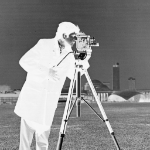
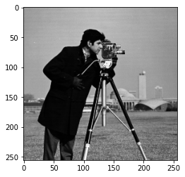
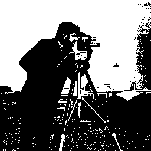
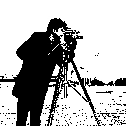
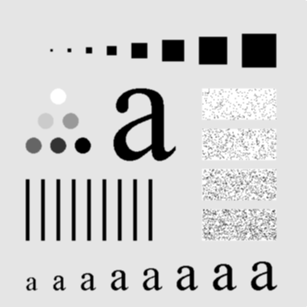
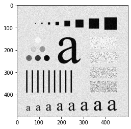
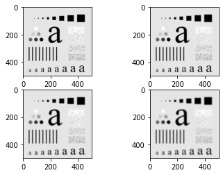

# Image Processing Techniques in Python

## Aim

The aim of this project is to implement various point processing and spatial domain filtering techniques on a given image and comprehend the results. The objectives include:

a. Point Processing Techniques:
   i. Write a program in Python to obtain the negative of an image.
   ii. Write a program in Python to perform thresholding on an image.
   iii. Write a program in Python to perform grey level slicing of an image without background.
   iv. Write a program in Python to perform grey level slicing of an image with background.

b. Spatial Domain Filtering:
   i. Implement blurring on the given image.
   ii. Comment on your choice of a particular filtering technique for the given image.
   iii. Analyze the effect of various mask sizes for the used filter and comprehend the findings.

## Table of Contents

- [Aim](#aim)
- [Software](#software)
- [Prerequisite](#prerequisite)
- [Outcome](#outcome)
- [Theory](#theory)
  - [Point Processing Techniques](#point-processing-techniques)
  - [Spatial Domain Filtering](#spatial-domain-filtering)

## Software

This project is implemented using Python.

## Prerequisite

To understand and work with this project, you should be familiar with the following concepts:

| Sr. No | Concepts                                      |
| ------ | --------------------------------------------- |
| 1.     | Point processing techniques for image enhancement |
| 2.     | Neighborhood processing techniques for image enhancement |

## Outcome

After successful completion of this experiment, students will be able to comprehend:

- The concept of image enhancement in the spatial domain using point processing and neighborhood processing methods.
- Can be found [here](https://github.com/Haleshot/Signal_Image_Processing/blob/main/Point_Processing_Techniques/Point_Processing_Techniques.ipynb).

## Theory

### Point Processing Techniques

Point processing operations are applied to individual pixel values in an image. The following techniques are implemented:

- **Image Negative:** Each pixel value is subtracted from the maximum pixel value (L-1) to obtain the negative of the image.
- **Thresholding:** Pixels with values above a specified threshold are set to the maximum pixel value (L-1), while pixels below the threshold are set to 0.
- **Grey Level Slicing without Background:** Pixels within a specific range (a to b) are set to the maximum pixel value (L-1), while all other pixels are set to 0.
- **Grey Level Slicing with Background:** Pixels within a specific range (a to b) are set to the maximum pixel value (L-1), while other pixels retain their original values.

### Spatial Domain Filtering

Spatial domain filtering involves modifying pixels by considering the values of their neighboring pixels. The following technique is implemented:

- **Low Pass Filtering (Blurring):** It removes high-frequency content from the image, resulting in a smoother image. A common mask used for low pass filtering is the averaging filter, which replaces each pixel value with the average of its surrounding pixels.

Note: The code implementation is provided in the ipynb file.


```python
# import libraries
import pandas as pd
import numpy as np
import matplotlib.pyplot as plt
import cv2 # You can also use PIL as alternative.
from google.colab.patches import cv2_imshow
```

```python
image = cv2.imread("/content/cameraman.png", 0)
plt.imshow(image, cmap="gray") # If we use cv2_imshow then we can just write cv2_imshow(image), for plt you need to explicitly mention cmap = "gray"
```

    <matplotlib.image.AxesImage at 0x7f9857baec40>

    

    

```python
cv2_imshow(image)
```

    

    

# Negative Image

```python
new_image = 255 - image
cv2_imshow(new_image)
```

    

    

# Gray Image

```python
plt.imshow(image, cmap="gray") # If we use cv2_imshow then we can just write cv2_imshow(image), for plt you need to explicitly mention cmap = "gray"
```

    <matplotlib.image.AxesImage at 0x7f9857b33100>

    

    

```python
threshold = int(input("Enter the Threshold : "))
```

    Enter the Threshold : 150

```python
print(image)
image.shape
```

    [[156 159 158 ... 151 152 152]
     [160 154 157 ... 154 155 153]
     [156 159 158 ... 151 152 152]
     ...
     [114 132 123 ... 135 137 114]
     [121 126 130 ... 133 130 113]
     [121 126 130 ... 133 130 113]]

    (256, 256)

```python
# threshold_image = np.zeros((256, 256), dtype=int)
# for i in image:
  
#   for j in i:
#     threshold_image[i][j] = np.where(j > threshold, 250, 0)
```

```python
threshold_image = []
for i in range(len(image)):
  temp = []
  for j in range(len(image)):
    if image[i][j] > threshold: # Threshold entered above is 150
      temp.append(255)
    else:
      temp.append(0)
  threshold_image.append(temp)

threshold_image = np.array(threshold_image)
cv2_imshow(threshold_image)
```

    

    

# Thresholding without Background

```python
threshold_image = []
a = int(input("Enter the Lower Limit : "))
b = int(input("Enter the Upper Limit : "))
for i in range(len(image)):
  temp = []
  for j in range(len(image)):
    if image[i][j] > a and image[i][j] < b:
      temp.append(255)
    else:
      temp.append(0)
  threshold_image.append(temp)

threshold_image = np.array(threshold_image)
cv2_imshow(threshold_image)
```

    Enter the Lower Limit : 100
    Enter the Upper Limit : 200

    

    

# Thresholding with Background

```python
threshold_image = []
a = int(input("Enter the Lower Limit : "))
b = int(input("Enter the Upper Limit : "))
for i in range(len(image)):
  temp = []
  for j in range(len(image)):
    if image[i][j] > a and image[i][j] < b:
      temp.append(255)
    else:
      temp.append(image[i][j])
  threshold_image.append(temp)

threshold_image = np.array(threshold_image)
cv2_imshow(threshold_image)
```

    Enter the Lower Limit : 100
    Enter the Upper Limit : 200

    

    

# Blurring the Image

```python
blured_image = cv2.blur(image, (5, 5))
cv2_imshow(blured_image)
```

    

    

# Neighborhood processing in spatial domain:

### Here we consider the following image for Spatial Filtering:


```python
img = cv2.imread("/content/Fig0333(a)(test_pattern_blurring_orig).tif", 0)
m, n = img.shape
```

```python
# Creating the 3x3 mask which will be applied to the above image (a portion of the image).
mask = np.ones([3, 3], dtype = int)
mask = 1/9 * mask
mask
```

    array([[0.11111111, 0.11111111, 0.11111111],
           [0.11111111, 0.11111111, 0.11111111],
           [0.11111111, 0.11111111, 0.11111111]])

# Averaging/Low Pass Filtering using the Formula:


```python
# Averaging/Low Pass Filtering using the Formula:
img_new = img.copy()
for i in range(1, m - 1):
  for j in range(1, n - 1):

    temp = img[i - 1, j - 1] * mask[0, 0] + img[i - 1, j] * mask[0, 1] + img[i - 1, j + 1] * mask[0, 2] + \
    img[i, j - 1] * mask[1, 0] + img[i, j] * mask[1, 1] + img[i, j + 1] * mask[1, 2] + \
    img[i + 1, j - 1] * mask[2, 0] + img[i + 1, j] * mask[2, 1] + img[i + 1, j + 1] * mask[2, 2]

    img_new[i, j] = temp

    # Using List comprehension:
    # temp = [img[i - 1, j - 1] * mask[0, 0] + img[i - 1, j] * mask[0, 1] + img[i - 1, j + 1] * mask[0, 2] + \
    # img[i, j - 1] * mask[1, 0] + img[i, j] * mask[1, 1] + img[i, j + 1] * mask[1, 2] + \
    # img[i + 1, j - 1] * mask[2, 0] + img[i + 1, j] * mask[2, 1] + img[i + 1, j + 1] * mask[2, 2] for i in range(1, m - 1) for j in range(1, n - 1)]

    
cv2.imwrite('Blurred.png', img_new) # Storing the file in colab in PNG format.
```

    True

```python
cv2_imshow(img_new) # We notice the original image has been blurred after applying LPF.
```

    

    

# Averaging/Low Pass Filtering without using the Formula:

We used a 3x3 mask in the previous step and wrote the explicitly iterated 

1.   We used a 3x3 mask in the previous step and wrote the explicitly iterated 
 through pixel values in the image and multiplied them with mask values which proved to be tedious while coding (9 mulitplication expressions).
2.   While using masks of greater size (5x5, 7x7, etc.), this would prove to be more difficult while also being an inefficient way of programming and evaluating.
3. Hence we use given method:

```python
# Averaging/Low Pass Filtering without using the Formula:
size_of_mask = int(input("Enter the size of the Mask : "))
img_new = img.copy()
m, n = img.shape
print("You have requested for ", size_of_mask ,"x", size_of_mask)
a = size_of_mask//2

for i in range(a, m - a):
  for j in range(a, n - a):
    temp = np.sum(img[i - a:i + a + 1, j - a:j + a + 1])
    img_new[i, j] = temp//size_of_mask**2
```

    Enter the size of the Mask : 3
    You have requested for  3 x 3

```python
cv2_imshow(img_new)
```

    

    

```python
# For different sizes of masks provided from user:
for x in range(1, 5):
  # Averaging/Low Pass Filtering without using the Formula:
  size_of_mask = int(input("Enter the size of the Mask : "))
  img_new = img.copy()
  m, n = img.shape
  print("You have requested for Mask of Size :  ", size_of_mask ,"x", size_of_mask)
  a = size_of_mask//2

  for i in range(a, m - a):
    for j in range(a, n - a):
      temp = np.sum(img[i - a:i + a + 1, j - a:j + a + 1])
      img_new[i, j] = temp//size_of_mask**2
  plt.subplot(2, 2, x)
  plt.imshow(img_new, cmap = "gray")
```

    Enter the size of the Mask : 3
    You have requested for Mask of Size :   3 x 3
    Enter the size of the Mask : 15
    You have requested for Mask of Size :   15 x 15
    Enter the size of the Mask : 45
    You have requested for Mask of Size :   45 x 45
    Enter the size of the Mask : 65
    You have requested for Mask of Size :   65 x 65

    

    

# Median Filtering

```python
# Median Filtering

# Averaging/Low Pass Filtering without using the Formula:

img_new = img.copy()
m, n = img.shape

for i in range(a, m - a):
  for j in range(a, n - a):
    temp = img[i - a:i + a + 1, j - a:j + a + 1]
    img_new[i, j] = np.median(temp)

cv2_imshow(img_new)
```

    

    

# Gaussian Noise

```python
from skimage.util import random_noise
gn_img = cv2.imread("/content/Fig0333(a)(test_pattern_blurring_orig).tif", 0)
noise_img = random_noise(img, mode='gaussian', seed = None, clip = True)
plt.imshow(noise_img, cmap = "gray")
```

    <matplotlib.image.AxesImage at 0x7fb8358b90a0>

    

    

```python
# For different sizes of masks provided from user:
for x in range(1, 5):
  # Averaging/Low Pass Filtering without using the Formula:
  size_of_mask = int(input("Enter the size of the Mask : "))
  img_new = gn_img.copy()
  m, n = img.shape
  print("You have requested for Mask of Size :  ", size_of_mask ,"x", size_of_mask)
  a = size_of_mask//2

  for i in range(a, m - a):
    for j in range(a, n - a):
      temp = np.sum(gn_img[i - a:i + a + 1, j - a:j + a + 1])
      img_new[i, j] = temp//size_of_mask**2
  plt.subplot(2, 2, x)
  plt.imshow(img_new, cmap = "gray")
```

    Enter the size of the Mask : 3
    You have requested for Mask of Size :   3 x 3
    Enter the size of the Mask : 5
    You have requested for Mask of Size :   5 x 5
    Enter the size of the Mask : 7
    You have requested for Mask of Size :   7 x 7
    Enter the size of the Mask : 9
    You have requested for Mask of Size :   9 x 9

    

    

# Conclusion:
From the experiment performed above, I learnt the following:

1.   Concept of image enhancement in spatial domain using point processing  and neighbourhood processing methods
2.   Performing various operations using given images (obtaining negatives of images, gray level slicing with and without background, etc.)

