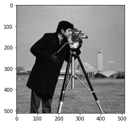
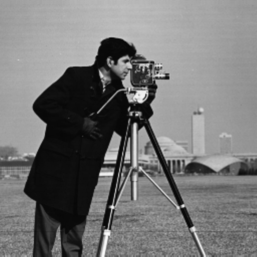
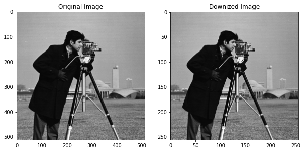
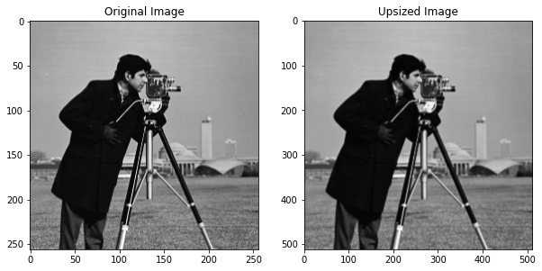
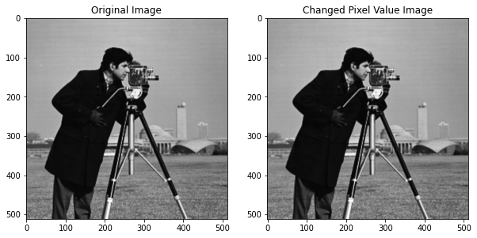

# Spatial and Grey Level Resolution in Python

## Aim

The aim of this project is to apply spatial and grey level resolution techniques on a test image to obtain new images. The objectives include:

a. Apply grayscale resolution on the test image to obtain a new image.
   - Calculate the compression ratio between the test image and the new image.
   - Comment on the subjective quality of the image for various levels of grayscale resolution.

b. Apply sampling resolution on the test image to obtain a new image.
   - Calculate the compression ratio between the test image and the new image.
   - Comment on the subjective quality of the image for various down-sampling rates.

## Table of Contents

- [Aim](#aim)
- [Software](#software)
- [Prerequisite](#prerequisite)
- [Outcome](#outcome)
- [Theory](#theory)
  - [Spatial Resolution](#spatial-resolution)
  - [Grey Level Resolution](#grey-level-resolution)
- [Algorithm](#algorithm)

## Software

This project is implemented using Python.

## Prerequisite

To understand and work with this project, you should be familiar with the following concepts:

| Sr. No | Concepts                          |
| ------ | --------------------------------- |
| 1.     | Spatial resolution and grey level resolution |

## Outcome

After successful completion of this experiment, students will be able to:

1. Understand the effect of varying spatial resolution.
2. Understand the effect of varying grey level resolution.

## Theory

### Spatial Resolution

The term spatial resolution corresponds to the total number of pixels in the given image. Increasing the number of pixels improves the resolution of the image, while decreasing the number of pixels reduces the resolution.

Down-sampling: In this technique, the number of pixels in the given image is reduced depending on the sampling frequency, resulting in decreased resolution and image size.

Up-sampling: The number of pixels in a down-sampled image can be increased using up-sampling interpolation techniques. Up-sampling increases both the resolution and the size of the image. Some commonly used up-sampling techniques include nearest neighbour interpolation, bilinear interpolation, and cubic interpolation.

### Grey Level Resolution

Grey level resolution of an image depends on the number of bits required to represent each pixel. In a regular 8-bit image, each pixel is represented by 8 bits, allowing for grey levels ranging from 0 to 255. Reducing the number of bits required to represent each pixel decreases the grey level resolution.

## Algorithm

The algorithm for applying spatial and grey level resolution techniques is as follows:

Spatial Resolution: Down-sampling
1. Read the original image.
2. Select a down-sampling rate, fs.
3. The new image will consist of pixels as follows:
   - After the pixel in the first column, select every pixel after fs columns.
   - After the first row, select every pixel after fs rows.

Spatial Resolution: Up-sampling
1. Read the down-sampled image.
2. Select the up-sampling rate, fs.
3. Create a new image filled with zeros, with the size of the original image.
4. Fill this new image with pixel values from the down-sampled image by skipping rows and columns at a rate of fs.
5. The remaining values in the new image can be filled using a neighbourhood averaging technique.

Grey Level Resolution
1. Read the original image.
2. Let the number of bits needed to represent each pixel in the original image be k, with a maximum grey level of 2^k.
3. Let the number of bits needed to represent each pixel in the new image be b, with a maximum grey level of 2^b.
4. Let the pixel in the original image be referred to as r.
5. Then, the pixel in the new image corresponding to the pixel in the original image will be mapped as follows:

   ```s[i, j] = ((2^b - 1) / (2^k - 1)) * r[i, j]```

Note: The code implementation is provided in the ipynb file.

```python
# import libraries
import pandas as pd
import numpy as np
import matplotlib.pyplot as plt
import cv2 # You can also use PIL as alternative.
from google.colab.patches import cv2_imshow
```

```python
image = cv2.imread("/content/cameraman.tif", 0)
plt.imshow(image, cmap="gray") # If we use cv2_imshow then we can just write cv2_imshow(image), for plt you need to explicitly mention cmap = "gray"
```

    <matplotlib.image.AxesImage at 0x7ff981c8b910>

    

    

```python
cv2_imshow(image)
```

    

    

```python
image.shape # Shape of the Image
```

    (512, 512)

```python
image.size # Size of the Image
```

    262144

```python
type(image) # Type of the Image
```

    numpy.ndarray

```python
m, n = image.shape
```

```python
m
```

    512

```python
n
```

    512

# Downsampling

```python
print("The original size of the image is ", m, " x ", n)
```

    The original size of the image is  512  x  512

```python
down_sample_rate = int(input("Enter an integer value to downsize/sample the given camerman image : "))
```

    Enter an integer value to downsize/sample the given camerman image : 2

```python
image_downsize = image[::down_sample_rate, ::down_sample_rate]
cv2_imshow(image_downsize)
```

    

    

```python
image_downsize.shape
```

    (256, 256)

```python
m, n = image_downsize.shape
print("The Downized image resolution is ", m, " x ", n)
```

    The Downized image resolution is  256  x  256

```python
# Comparing the two images:
plt.figure(figsize=(10, 10))
plt.subplot(1, 2, 1)
plt.imshow(image, cmap="gray")
plt.title("Original Image")

plt.subplot(1, 2, 2)
plt.imshow(image_downsize, cmap="gray")
plt.title("Downized Image")
```

    Text(0.5, 1.0, 'Downized Image')

    

    

# Upsampling

```python
print("The original size of the image is ", m, " x ", n) # Need to resize/upscale this image
```

    The original size of the image is  256  x  256

```python
up_sample_rate = int(input("Enter an integer value to upsize/sample the given camerman image : "))
img_double = cv2.resize(image_downsize, (0, 0), fx = up_sample_rate, fy = up_sample_rate)
```

    Enter an integer value to downsize/sample the given camerman image : 2

```python
cv2_imshow(img_double)
```

    

    

```python
img_double.shape
```

    (512, 512)

```python
# Comparing the two images:
plt.figure(figsize=(10, 10))
plt.subplot(1, 2, 1)
plt.imshow(image_downsize, cmap="gray")
plt.title("Original Image")

plt.subplot(1, 2, 2)
plt.imshow(img_double, cmap="gray")
plt.title("Upsized Image")
```

    Text(0.5, 1.0, 'Upsized Image')

    

    

# Changing the Intensity Level:

```python
imagearr = np.array(image)
```

```python
imagearr
```

    array([[156, 157, 160, ..., 152, 152, 152],
           [156, 157, 159, ..., 152, 152, 152],
           [158, 157, 156, ..., 152, 152, 152],
           ...,
           [121, 123, 126, ..., 121, 113, 111],
           [121, 123, 126, ..., 121, 113, 111],
           [121, 123, 126, ..., 121, 113, 111]], dtype=uint8)

```python
maximum_pixel_value = np.amax(image)
maximum_pixel_value
```

    255

```python
bits = int(input("Enter an integer value to represent the image in : "))
```

    Enter an integer value to represent the image in : 7

```python
ratio = (2**bits - 1)/(maximum_pixel_value)
changed_pixel_value_image = np.zeros(image.shape)
changed_pixel_value_image = ratio * image
changed_pixel_value_image = np.round(changed_pixel_value_image)
changed_pixel_value_image
```

    array([[78., 78., 80., ..., 76., 76., 76.],
           [78., 78., 79., ..., 76., 76., 76.],
           [79., 78., 78., ..., 76., 76., 76.],
           ...,
           [60., 61., 63., ..., 60., 56., 55.],
           [60., 61., 63., ..., 60., 56., 55.],
           [60., 61., 63., ..., 60., 56., 55.]])

```python
# Comparing the two images:
plt.figure(figsize=(10, 10))
plt.subplot(1, 2, 1)
plt.imshow(image, cmap="gray")
plt.title("Original Image")

plt.subplot(1, 2, 2)
plt.imshow(changed_pixel_value_image, cmap="gray")
plt.title("Changed Pixel Value Image")
```

    Text(0.5, 1.0, 'Changed Pixel Value Image')

    

    

# Conclusion:
## Learnt the following things after having performed this experiment:
a.	Apply grayscale resolution on the test image to obtain new image. 

    i.	Calculate the compression ratio between the test image and new image.

    ii.	Comment on subjective quality of the image for various levels of grayscale resolution
b.	Apply sampling resolution on the test image to obtain the new image. 

    i.	Calculate the compression ratio between the test image and new image.

    ii.	Comment on subjective quality of the image for various down sampling rates.

