# Support Vector Machines (SVM)

This README file provides information on Support Vector Machines (SVM) and its implementation. The SVM algorithm is used for classification and regression analysis. Below is a breakdown of the content covered in this README. Implementation can be found [here](https://github.com/Haleshot/AI-ML/blob/master/Support_Vector_Machines/Support_Vector_Machines.ipynb).

## Table of Contents
1. [Part A: Computing Support Vectors for a Dataset](#part-a)
2. [Part B: Creating an SVM Model with Linear Kernel](#part-b)
3. [Part C: Plotting SVC Decision Function](#part-c)
4. [Part D: Fetching LFW People Dataset](#part-d)
5. [Implementation of SVM with PCA](#implementation)
6. [Displaying Predicted Names and Labels](#displaying-names)
7. [Confusion Matrix and Heatmap](#confusion-matrix)

<a name="part-a"></a>
## Part A: Computing Support Vectors for a Dataset
In this section, we discuss the computation of support vectors for a given dataset. Support vectors are the data points that lie closest to the decision boundary of the SVM classifier.

<a name="part-b"></a>
## Part B: Creating an SVM Model with Linear Kernel
To create an SVM model with a linear kernel, the `SVC` class from the `sklearn.svm` module is used. The `kernel` parameter is set to 'linear', and the `C` parameter controls the regularization strength.

Example:
```python
from sklearn.svm import SVC

model = SVC(kernel='linear', C=1E10)
model.fit(X, y)
```

<a name="part-c"></a>
## Part C: Plotting SVC Decision Function
This section discusses the `plot_svc_decision_function` method, which allows visualizing the decision function of an SVM model.

<a name="part-d"></a>
## Part D: Fetching LFW People Dataset
The LFW People dataset is fetched using the `fetch_lfw_people` function from the `sklearn.datasets` module. This dataset contains face images of different individuals.

Example:
```python
from sklearn.datasets import fetch_lfw_people

faces = fetch_lfw_people(min_faces_per_person=60)
print(faces.target_names)
print(faces.images.shape)
```

<a name="implementation"></a>
## Implementation of SVM with PCA
In this section, an SVM model with a radial basis function (RBF) kernel is implemented using Principal Component Analysis (PCA) for dimensionality reduction. The `RandomizedPCA` class from `sklearn.decomposition` and the `make_pipeline` function from `sklearn.pipeline` are used.

Example:
```python
from sklearn.svm import SVC
from sklearn.decomposition import PCA as RandomizedPCA
from sklearn.pipeline import make_pipeline

pca = RandomizedPCA(n_components=150, whiten=True, random_state=42)
svc = SVC(kernel='rbf', class_weight='balanced')
model = make_pipeline(pca, svc)
```

<a name="displaying-names"></a>
## Displaying Predicted Names and Labels
This section demonstrates how to display predicted names and labels using a subplot layout. The face images are shown, and the predicted names are displayed with incorrect labels highlighted in red.

Example:
```python
fig, ax = plt.subplots(4, 6)
for i, axi in enumerate(ax.flat):
    axi.imshow(Xtest[i].reshape(62, 47), cmap='bone')
    axi.set(xticks=[], yticks=[])
    axi.set_ylabel(faces.target_names[yfit[i]].split()[-1], color='black' if yfit[i] == ytest[i] else 'red')
fig.suptitle('Predicted Names; Incorrect Labels in Red',

 size=14)
```

<a name="confusion-matrix"></a>
## Confusion Matrix and Heatmap
This section demonstrates how to create a confusion matrix using the `confusion_matrix` function from `sklearn.metrics`. The confusion matrix is visualized using a heatmap with labeled axes.

Example:
```python
import seaborn as sns
from sklearn.metrics import confusion_matrix

mat = confusion_matrix(ytest, yfit)
sns.heatmap(mat.T, square=True, annot=True, fmt='d', cbar=False, xticklabels=faces.target_names, yticklabels=faces.target_names)
plt.xlabel('True Label')
plt.ylabel('Predicted Label')
```

Use the provided instructions and code examples to explore and understand the implementation of Support Vector Machines (SVM).

```python
# import libraries
import matplotlib.pyplot as plt
import numpy as np
import pandas as pd
import seaborn as sns
```

# Part A: Computing Support vectors for a dataset.

```python
# Generating the dataset:
from sklearn.datasets import make_blobs
X, y = make_blobs(n_samples = 50, centers = 2, random_state = 0, cluster_std = 0.60) # default samples = 100. Default number of features for each sample is 2.

# 50 samples, two clusters, default 2 factors, for each sample, standard deviation =  0.60
```

```python
# X
X
```

    array([[ 1.41281595,  1.5303347 ],
           [ 1.81336135,  1.6311307 ],
           [ 1.43289271,  4.37679234],
           [ 1.87271752,  4.18069237],
           [ 2.09517785,  1.0791468 ],
           [ 2.73890793,  0.15676817],
           [ 3.18515794,  0.08900822],
           [ 2.06156753,  1.96918596],
           [ 2.03835818,  1.15466278],
           [-0.04749204,  5.47425256],
           [ 1.71444449,  5.02521524],
           [ 0.22459286,  4.77028154],
           [ 1.06923853,  4.53068484],
           [ 1.53278923,  0.55035386],
           [ 1.4949318 ,  3.85848832],
           [ 1.1641107 ,  3.79132988],
           [ 0.74387399,  4.12240568],
           [ 2.29667251,  0.48677761],
           [ 0.44359863,  3.11530945],
           [ 0.91433877,  4.55014643],
           [ 1.67467427,  0.68001896],
           [ 2.26908736,  1.32160756],
           [ 1.5108885 ,  0.9288309 ],
           [ 1.65179125,  0.68193176],
           [ 2.49272186,  0.97505341],
           [ 2.33812285,  3.43116792],
           [ 0.67047877,  4.04094275],
           [-0.55552381,  4.69595848],
           [ 2.16172321,  0.6565951 ],
           [ 2.09680487,  3.7174206 ],
           [ 2.18023251,  1.48364708],
           [ 0.43899014,  4.53592883],
           [ 1.24258802,  4.50399192],
           [ 0.00793137,  4.17614316],
           [ 1.89593761,  5.18540259],
           [ 1.868336  ,  0.93136287],
           [ 2.13141478,  1.13885728],
           [ 1.06269622,  5.17635143],
           [ 2.33466499, -0.02408255],
           [ 0.669787  ,  3.59540802],
           [ 1.07714851,  1.17533301],
           [ 1.54632313,  4.212973  ],
           [ 1.56737975, -0.1381059 ],
           [ 1.35617762,  1.43815955],
           [ 1.00372519,  4.19147702],
           [ 1.29297652,  1.47930168],
           [ 2.94821884,  2.03519717],
           [ 0.3471383 ,  3.45177657],
           [ 2.76253526,  0.78970876],
           [ 0.76752279,  4.39759671]])

```python
# Y
y
```

    array([1, 1, 0, 0, 1, 1, 1, 1, 1, 0, 0, 0, 0, 1, 0, 0, 0, 1, 0, 0, 1, 1,
           1, 1, 1, 0, 0, 0, 1, 0, 1, 0, 0, 0, 0, 1, 1, 0, 1, 0, 1, 0, 1, 1,
           0, 1, 1, 0, 1, 0])

```python
plt.scatter(X[:, 0], X[:, 1], c = y, cmap = "autumn")

# c = y gives colour to the marker, where y contains the labels corresponding to X.
# Different color to each cluster is given.
```

    <matplotlib.collections.PathCollection at 0x7fa82b08bee0>

    
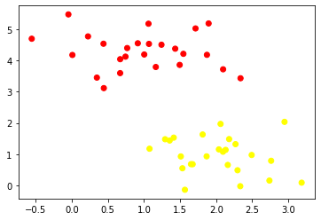
    

```python
# Varying the parameters of centers and standard deviation:
A, b = make_blobs(n_samples = 50, centers = 10, random_state = 0, cluster_std = 0.1) # default samples = 100. Default number of features for each sample is 2.
plt.scatter(A[:, 0], A[:, 1], c = b, cmap = "autumn")
```

    <matplotlib.collections.PathCollection at 0x7fa826168430>

    
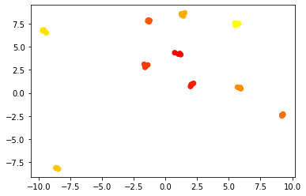
    

## Inference:
### Since the standard deviation is less between the two clusters, the points seem to come closer and tend to even over lap sometimes depending on the value of the centers parameter.

```python
xfit = np.linspace(-1, 3.5)
# linspace returns evenly spaced numbers from -1 to 3.5 which is the parameter mentioned.
# Default number of samples is 50.
```

```python
xfit
```

    array([-1.        , -0.90816327, -0.81632653, -0.7244898 , -0.63265306,
           -0.54081633, -0.44897959, -0.35714286, -0.26530612, -0.17346939,
           -0.08163265,  0.01020408,  0.10204082,  0.19387755,  0.28571429,
            0.37755102,  0.46938776,  0.56122449,  0.65306122,  0.74489796,
            0.83673469,  0.92857143,  1.02040816,  1.1122449 ,  1.20408163,
            1.29591837,  1.3877551 ,  1.47959184,  1.57142857,  1.66326531,
            1.75510204,  1.84693878,  1.93877551,  2.03061224,  2.12244898,
            2.21428571,  2.30612245,  2.39795918,  2.48979592,  2.58163265,
            2.67346939,  2.76530612,  2.85714286,  2.94897959,  3.04081633,
            3.13265306,  3.2244898 ,  3.31632653,  3.40816327,  3.5       ])

```python
for m, b in [(1, 0.65), (0.5, 1.6), (-0.2, 2.9)]:
  # here m and b stand for slope and intercept respectively for the equations to be plotted
  # print(m, "\n", b)
  # print(xfit, m * xfit + b)
  # We have three points for each equation:
  plt.plot(xfit, m * xfit + b, 'k')
  plt.xlim(-1, 3.5)
```

    
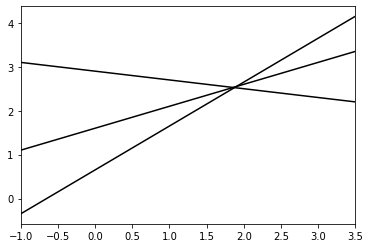
    

```python
plt.scatter(X[:, 0], X[:, 1], c = y, s = 50, cmap = "autumn")
# plt.plot([0.6], [2.1], 'x', color = 'red', markeredgewidth = 2, markersize = 10)

for m, b in [(1, 0.65), (0.5, 1.6), (-0.2, 2.9)]:
  plt.plot(xfit, m * xfit + b, '-k')
  plt.xlim(-1, 3.5)
```

    
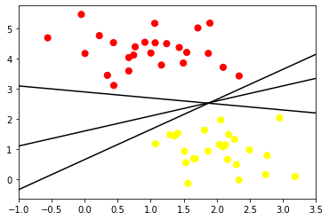
    

```python
xfit = np.linspace(-1, 3.5)
plt.scatter(X[:, 0], X[:, 1], c = y, s = 50, cmap = 'autumn')
for m, b, d in [(1, 0.65, 0.33), (0.5, 1.6, 0.55), (-0.2, 2.9, 0.2)]:
  yfit = m * xfit + b
  plt.plot(xfit, yfit, '-k')
  plt.fill_between(xfit, yfit - d, yfit + d, edgecolor = 'none', color = "#AAAAAA", alpha = 0.4)
  # Fill between fills the area between the two boundaries defined by (xfit , yfit - d) and (xfit, yfit + d)
  plt.xlim(-1, 3.5)
```

    
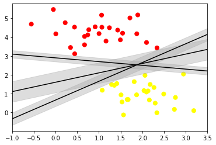
    

## Inference:
### From the above graph, we can conclude that the center line is a good decision boundary as there seems to be 1 red point and 2 yellow points touching on the boundary/width of the decision boundary.

```python
# Creating a SVM model with linear kernel:
from sklearn.svm import SVC # Support vector classifier
model = SVC(kernel = 'linear', C = 1E10)
# C is the regularization parameter.
# The strength of resgularization is inversely proportional to C.
# Kernel used is linear, by default the input is taken as RBF, which is non-linear.

model.fit(X, y)
```

<style>#sk-container-id-2 {color: black;background-color: white;}#sk-container-id-2 pre{padding: 0;}#sk-container-id-2 div.sk-toggleable {background-color: white;}#sk-container-id-2 label.sk-toggleable__label {cursor: pointer;display: block;width: 100%;margin-bottom: 0;padding: 0.3em;box-sizing: border-box;text-align: center;}#sk-container-id-2 label.sk-toggleable__label-arrow:before {content: "▸";float: left;margin-right: 0.25em;color: #696969;}#sk-container-id-2 label.sk-toggleable__label-arrow:hover:before {color: black;}#sk-container-id-2 div.sk-estimator:hover label.sk-toggleable__label-arrow:before {color: black;}#sk-container-id-2 div.sk-toggleable__content {max-height: 0;max-width: 0;overflow: hidden;text-align: left;background-color: #f0f8ff;}#sk-container-id-2 div.sk-toggleable__content pre {margin: 0.2em;color: black;border-radius: 0.25em;background-color: #f0f8ff;}#sk-container-id-2 input.sk-toggleable__control:checked~div.sk-toggleable__content {max-height: 200px;max-width: 100%;overflow: auto;}#sk-container-id-2 input.sk-toggleable__control:checked~label.sk-toggleable__label-arrow:before {content: "▾";}#sk-container-id-2 div.sk-estimator input.sk-toggleable__control:checked~label.sk-toggleable__label {background-color: #d4ebff;}#sk-container-id-2 div.sk-label input.sk-toggleable__control:checked~label.sk-toggleable__label {background-color: #d4ebff;}#sk-container-id-2 input.sk-hidden--visually {border: 0;clip: rect(1px 1px 1px 1px);clip: rect(1px, 1px, 1px, 1px);height: 1px;margin: -1px;overflow: hidden;padding: 0;position: absolute;width: 1px;}#sk-container-id-2 div.sk-estimator {font-family: monospace;background-color: #f0f8ff;border: 1px dotted black;border-radius: 0.25em;box-sizing: border-box;margin-bottom: 0.5em;}#sk-container-id-2 div.sk-estimator:hover {background-color: #d4ebff;}#sk-container-id-2 div.sk-parallel-item::after {content: "";width: 100%;border-bottom: 1px solid gray;flex-grow: 1;}#sk-container-id-2 div.sk-label:hover label.sk-toggleable__label {background-color: #d4ebff;}#sk-container-id-2 div.sk-serial::before {content: "";position: absolute;border-left: 1px solid gray;box-sizing: border-box;top: 0;bottom: 0;left: 50%;z-index: 0;}#sk-container-id-2 div.sk-serial {display: flex;flex-direction: column;align-items: center;background-color: white;padding-right: 0.2em;padding-left: 0.2em;position: relative;}#sk-container-id-2 div.sk-item {position: relative;z-index: 1;}#sk-container-id-2 div.sk-parallel {display: flex;align-items: stretch;justify-content: center;background-color: white;position: relative;}#sk-container-id-2 div.sk-item::before, #sk-container-id-2 div.sk-parallel-item::before {content: "";position: absolute;border-left: 1px solid gray;box-sizing: border-box;top: 0;bottom: 0;left: 50%;z-index: -1;}#sk-container-id-2 div.sk-parallel-item {display: flex;flex-direction: column;z-index: 1;position: relative;background-color: white;}#sk-container-id-2 div.sk-parallel-item:first-child::after {align-self: flex-end;width: 50%;}#sk-container-id-2 div.sk-parallel-item:last-child::after {align-self: flex-start;width: 50%;}#sk-container-id-2 div.sk-parallel-item:only-child::after {width: 0;}#sk-container-id-2 div.sk-dashed-wrapped {border: 1px dashed gray;margin: 0 0.4em 0.5em 0.4em;box-sizing: border-box;padding-bottom: 0.4em;background-color: white;}#sk-container-id-2 div.sk-label label {font-family: monospace;font-weight: bold;display: inline-block;line-height: 1.2em;}#sk-container-id-2 div.sk-label-container {text-align: center;}#sk-container-id-2 div.sk-container {/* jupyter's `normalize.less` sets `[hidden] { display: none; }` but bootstrap.min.css set `[hidden] { display: none !important; }` so we also need the `!important` here to be able to override the default hidden behavior on the sphinx rendered scikit-learn.org. See: https://github.com/scikit-learn/scikit-learn/issues/21755 */display: inline-block !important;position: relative;}#sk-container-id-2 div.sk-text-repr-fallback {display: none;}</style><div id="sk-container-id-2" class="sk-top-container"><div class="sk-text-repr-fallback"><pre>SVC(C=10000000000.0, kernel=&#x27;linear&#x27;)</pre><b>In a Jupyter environment, please rerun this cell to show the HTML representation or trust the notebook. <br />On GitHub, the HTML representation is unable to render, please try loading this page with nbviewer.org.</b></div><div class="sk-container" hidden><div class="sk-item"><div class="sk-estimator sk-toggleable"><input class="sk-toggleable__control sk-hidden--visually" id="sk-estimator-id-2" type="checkbox" checked><label for="sk-estimator-id-2" class="sk-toggleable__label sk-toggleable__label-arrow">SVC</label><div class="sk-toggleable__content"><pre>SVC(C=10000000000.0, kernel=&#x27;linear&#x27;)</pre></div></div></div></div></div>

```python
def plot_svc_decision_function(model, ax = None, plot_support = True):
  ax = plt.gca()
  xlim = ax.get_xlim()
  ylim = ax.get_ylim()
  x = np.linspace(xlim[0], xlim[1], 30)
  y = np.linspace(ylim[0], ylim[1], 30)

  Y, X = np.meshgrid(y, x)
  xy = np.vstack([X.ravel(), Y.ravel()]).T
  P = model.decision_function(xy).reshape(X.shape)

  ax.contour(X, Y, P, colors = 'k', levels = [-1, 0, 1], alpha = 0.5, linestyles = ['--', '-', '--'])

  ax.scatter(model.support_vectors_[:, 0], model.support_vectors_[:, 1], s = 300, linewidth = 1, facecolors = 'none')
  ax.set_xlim(xlim)
  ax.set_ylim(ylim)
```

```python
plt.scatter(X[:, 0], X[:, 1], c = y, s = 50, cmap = 'autumn')
plot_svc_decision_function(model)
```

    
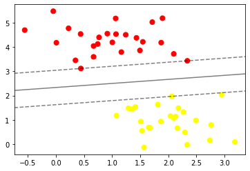
    

```python
model.support_vectors_
```

    array([[0.44359863, 3.11530945],
           [2.33812285, 3.43116792],
           [2.06156753, 1.96918596]])

```python
from sklearn.datasets import make_circles
X, y = make_circles(100, factor = .1, noise = .1)
# clf = SVC(kernel = 'linear').fit(X, y)

plt.scatter(X[:, 0], X[:, 1], c = y, s = 50, cmap = 'autumn')
# plot_svc_decision_function(clf, plot_support = False)
```

    <matplotlib.collections.PathCollection at 0x7fa824e0a160>

    
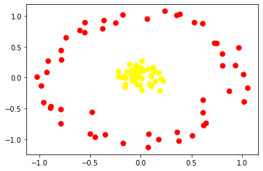
    

If noise is less, points come closer.

```python
clf = SVC(kernel = 'rbf', C = 1E6)
clf.fit(X, y)
```

<style>#sk-container-id-3 {color: black;background-color: white;}#sk-container-id-3 pre{padding: 0;}#sk-container-id-3 div.sk-toggleable {background-color: white;}#sk-container-id-3 label.sk-toggleable__label {cursor: pointer;display: block;width: 100%;margin-bottom: 0;padding: 0.3em;box-sizing: border-box;text-align: center;}#sk-container-id-3 label.sk-toggleable__label-arrow:before {content: "▸";float: left;margin-right: 0.25em;color: #696969;}#sk-container-id-3 label.sk-toggleable__label-arrow:hover:before {color: black;}#sk-container-id-3 div.sk-estimator:hover label.sk-toggleable__label-arrow:before {color: black;}#sk-container-id-3 div.sk-toggleable__content {max-height: 0;max-width: 0;overflow: hidden;text-align: left;background-color: #f0f8ff;}#sk-container-id-3 div.sk-toggleable__content pre {margin: 0.2em;color: black;border-radius: 0.25em;background-color: #f0f8ff;}#sk-container-id-3 input.sk-toggleable__control:checked~div.sk-toggleable__content {max-height: 200px;max-width: 100%;overflow: auto;}#sk-container-id-3 input.sk-toggleable__control:checked~label.sk-toggleable__label-arrow:before {content: "▾";}#sk-container-id-3 div.sk-estimator input.sk-toggleable__control:checked~label.sk-toggleable__label {background-color: #d4ebff;}#sk-container-id-3 div.sk-label input.sk-toggleable__control:checked~label.sk-toggleable__label {background-color: #d4ebff;}#sk-container-id-3 input.sk-hidden--visually {border: 0;clip: rect(1px 1px 1px 1px);clip: rect(1px, 1px, 1px, 1px);height: 1px;margin: -1px;overflow: hidden;padding: 0;position: absolute;width: 1px;}#sk-container-id-3 div.sk-estimator {font-family: monospace;background-color: #f0f8ff;border: 1px dotted black;border-radius: 0.25em;box-sizing: border-box;margin-bottom: 0.5em;}#sk-container-id-3 div.sk-estimator:hover {background-color: #d4ebff;}#sk-container-id-3 div.sk-parallel-item::after {content: "";width: 100%;border-bottom: 1px solid gray;flex-grow: 1;}#sk-container-id-3 div.sk-label:hover label.sk-toggleable__label {background-color: #d4ebff;}#sk-container-id-3 div.sk-serial::before {content: "";position: absolute;border-left: 1px solid gray;box-sizing: border-box;top: 0;bottom: 0;left: 50%;z-index: 0;}#sk-container-id-3 div.sk-serial {display: flex;flex-direction: column;align-items: center;background-color: white;padding-right: 0.2em;padding-left: 0.2em;position: relative;}#sk-container-id-3 div.sk-item {position: relative;z-index: 1;}#sk-container-id-3 div.sk-parallel {display: flex;align-items: stretch;justify-content: center;background-color: white;position: relative;}#sk-container-id-3 div.sk-item::before, #sk-container-id-3 div.sk-parallel-item::before {content: "";position: absolute;border-left: 1px solid gray;box-sizing: border-box;top: 0;bottom: 0;left: 50%;z-index: -1;}#sk-container-id-3 div.sk-parallel-item {display: flex;flex-direction: column;z-index: 1;position: relative;background-color: white;}#sk-container-id-3 div.sk-parallel-item:first-child::after {align-self: flex-end;width: 50%;}#sk-container-id-3 div.sk-parallel-item:last-child::after {align-self: flex-start;width: 50%;}#sk-container-id-3 div.sk-parallel-item:only-child::after {width: 0;}#sk-container-id-3 div.sk-dashed-wrapped {border: 1px dashed gray;margin: 0 0.4em 0.5em 0.4em;box-sizing: border-box;padding-bottom: 0.4em;background-color: white;}#sk-container-id-3 div.sk-label label {font-family: monospace;font-weight: bold;display: inline-block;line-height: 1.2em;}#sk-container-id-3 div.sk-label-container {text-align: center;}#sk-container-id-3 div.sk-container {/* jupyter's `normalize.less` sets `[hidden] { display: none; }` but bootstrap.min.css set `[hidden] { display: none !important; }` so we also need the `!important` here to be able to override the default hidden behavior on the sphinx rendered scikit-learn.org. See: https://github.com/scikit-learn/scikit-learn/issues/21755 */display: inline-block !important;position: relative;}#sk-container-id-3 div.sk-text-repr-fallback {display: none;}</style><div id="sk-container-id-3" class="sk-top-container"><div class="sk-text-repr-fallback"><pre>SVC(C=1000000.0)</pre><b>In a Jupyter environment, please rerun this cell to show the HTML representation or trust the notebook. <br />On GitHub, the HTML representation is unable to render, please try loading this page with nbviewer.org.</b></div><div class="sk-container" hidden><div class="sk-item"><div class="sk-estimator sk-toggleable"><input class="sk-toggleable__control sk-hidden--visually" id="sk-estimator-id-3" type="checkbox" checked><label for="sk-estimator-id-3" class="sk-toggleable__label sk-toggleable__label-arrow">SVC</label><div class="sk-toggleable__content"><pre>SVC(C=1000000.0)</pre></div></div></div></div></div>

```python
plt.scatter(X[:, 0], X[:, 1], c = y, s = 50, cmap = 'autumn')
plot_svc_decision_function(clf)
```

    
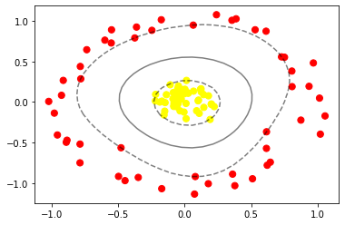
    

```python
from sklearn.datasets import fetch_lfw_people
faces = fetch_lfw_people(min_faces_per_person =60)
print(faces.target_names)
print(faces.images.shape)
```

    ['Ariel Sharon' 'Colin Powell' 'Donald Rumsfeld' 'George W Bush'
     'Gerhard Schroeder' 'Hugo Chavez' 'Junichiro Koizumi' 'Tony Blair']
    (1348, 62, 47)

```python
fig,ax = plt.subplots(3,5)
for i,axi in enumerate(ax.flat):
  axi.imshow(faces.images[i],cmap='bone')
  axi.set(xticks=[],yticks=[],xlabel=faces.target_names[faces.target[i]])
```

    
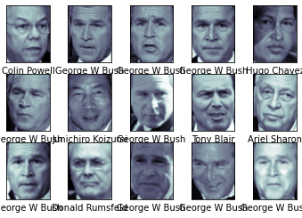
    

```python
from sklearn.svm import SVC
from sklearn.decomposition import PCA as RandomizedPCA
from sklearn.pipeline import make_pipeline

pca = RandomizedPCA(n_components=150 ,whiten = True, random_state = 42)
svc = SVC(kernel='rbf',class_weight='balanced')
model = make_pipeline(pca,svc)
```

## We are using rbf as kernel and in make pipeline will define the order of models

```python
from sklearn.model_selection import train_test_split
Xtrain,Xtest,ytrain,ytest = train_test_split(faces.data,faces.target,random_state =42)
```

```python
model.fit(Xtrain,ytrain)
yfit = model.predict(Xtest)
```

```python
fig,ax = plt.subplots(4,6)
for i,axi in enumerate(ax.flat):
  axi.imshow(Xtest[i].reshape(62,47),cmap = 'bone')
  axi.set(xticks=[],yticks=[])
  axi.set_ylabel(faces.target_names[yfit[i]].split()[-1],color ='black' if yfit[i]==ytest[i] else 'red')
fig.suptitle('Predicted Names; Incorrect Labels in Red',size=14)
```

    Text(0.5, 0.98, 'Predicted Names; Incorrect Labels in Red')

    
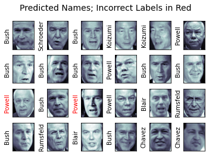
    

```python
from sklearn.metrics import classification_report
print(classification_report(ytest,yfit,target_names = faces.target_names))
```

                       precision    recall  f1-score   support
    
         Ariel Sharon       1.00      0.73      0.85        15
         Colin Powell       0.68      0.96      0.80        68
      Donald Rumsfeld       0.92      0.77      0.84        31
        George W Bush       0.91      0.87      0.89       126
    Gerhard Schroeder       0.89      0.74      0.81        23
          Hugo Chavez       1.00      0.65      0.79        20
    Junichiro Koizumi       1.00      0.92      0.96        12
           Tony Blair       0.86      0.86      0.86        42
    
             accuracy                           0.85       337
            macro avg       0.91      0.81      0.85       337
         weighted avg       0.87      0.85      0.85       337
    

```python
import seaborn as sns 
from sklearn.metrics import confusion_matrix
mat = confusion_matrix (ytest, yfit)
sns.heatmap(mat.T, square=True, annot=True, fmt='d', cbar=False , xticklabels=faces.target_names, yticklabels=faces.target_names)
plt.xlabel('true label')
plt.ylabel ('predicted label')
```

    Text(91.68, 0.5, 'predicted label')

    
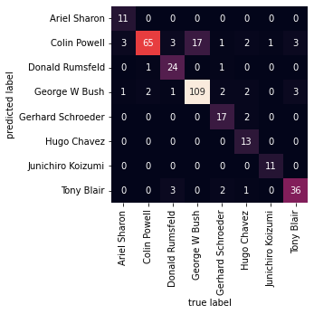
    

