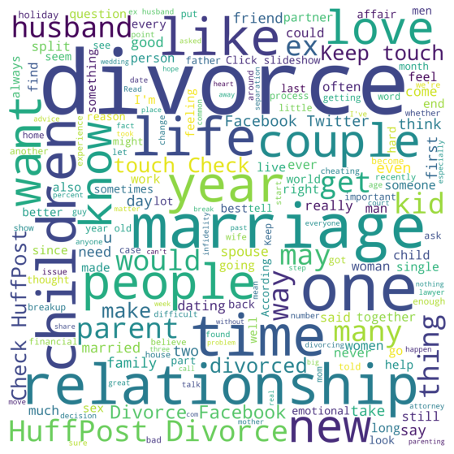
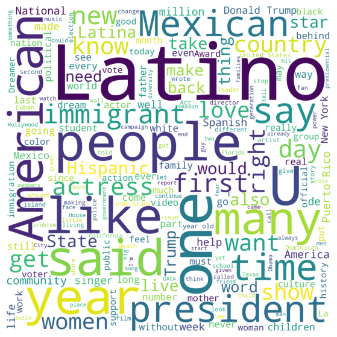

# Natural Language Processing

## Table of Contents
- [Aim](#aim)
- [Prerequisite](#prerequisite)
- [Outcome](#outcome)
- [Theory](#theory)
- [Task to be completed in PART B](#task-to-be-completed-in-part-b)
- [References](#references)

## Aim
### Text Classification
- Implement Text Classification using information retrieval methods.
- Analyze, comprehend, and compare the techniques used.

## Prerequisite
- Python

## Outcome
After successful completion of this experiment, students will be able to:
1. Understand the concept of Information Retrieval and its application in text classification.

## Theory
Text classification is a machine learning technique that assigns a set of predefined categories to open-ended text. It is fundamental in natural language processing with applications such as sentiment analysis, topic labeling, spam detection, and intent detection. Automatic text classification leverages machine learning, NLP, and AI techniques to classify text efficiently and accurately.

### Machine Learning Text Classification Algorithms
- Naive Bayes
- Support Vector Machines
- Deep Learning (Convolutional Neural Networks (CNN) and Recurrent Neural Networks (RNN))

## Task to be completed in PART B
### Task
1. Select a dataset of your choice or use the dataset from [News Category Dataset](https://www.kaggle.com/datasets/rmisra/news-category-dataset).
2. Apply at least two different techniques/algorithms for classifying the text in the given dataset to develop a model.
3. Predict the class of the test dataset using the developed models.
4. Analyze, comprehend, and compare results using appropriate metrics.

For further information and datasets, refer to:
- [MonkeyLearn Text Classification](https://monkeylearn.com/text-classification/)
- [Analytics Vidhya - Text Classification of News Articles](https://www.analyticsvidhya.com/blog/2021/12/text-classification-of-news-articles/)

```python
import pandas as pd
import numpy as np
import matplotlib.pyplot as plt
import seaborn as sns
import re
import nltk
from nltk.corpus import stopwords
from nltk.stem import PorterStemmer
from nltk.stem import WordNetLemmatizer
from nltk.tokenize import word_tokenize
from nltk.tokenize import sent_tokenize
from wordcloud import WordCloud
from sklearn.feature_extraction.text import CountVectorizer
from sklearn.feature_extraction.text import TfidfVectorizer
from sklearn.model_selection import train_test_split
from sklearn.metrics import accuracy_score
from sklearn.metrics import confusion_matrix
from sklearn.metrics import classification_report
from sklearn.metrics import make_scorer, roc_curve, roc_auc_score
from sklearn.metrics import precision_recall_fscore_support as score
from sklearn.metrics.pairwise import cosine_similarity
from sklearn.multiclass import OneVsRestClassifier
from sklearn.linear_model import LogisticRegression
from sklearn.svm import SVC, LinearSVC
from sklearn.tree import DecisionTreeClassifier
from sklearn.ensemble import RandomForestClassifier
from sklearn.neighbors import KNeighborsClassifier
from sklearn.naive_bayes import GaussianNB, MultinomialNB, BernoulliNB

from nltk.corpus import stopwords
```

### Task 1: Select a dataset of your choice or a dataset given in this link.
https://www.kaggle.com/datasets/rmisra/news-category-dataset

#### Performing basic EDA of the dataset (along with Visualization of data):

```python
df = pd.read_json("News_Category_Dataset_v3.json", lines=True)
```

```python
df.shape
```

    (209527, 6)

```python
df.head()
```

<div>
<style scoped>
    .dataframe tbody tr th:only-of-type {
        vertical-align: middle;
    }

    .dataframe tbody tr th {
        vertical-align: top;
    }

    .dataframe thead th {
        text-align: right;
    }
</style>
<table border="1" class="dataframe">
  <thead>
    <tr style="text-align: right;">
      <th></th>
      <th>link</th>
      <th>headline</th>
      <th>category</th>
      <th>short_description</th>
      <th>authors</th>
      <th>date</th>
    </tr>
  </thead>
  <tbody>
    <tr>
      <th>0</th>
      <td>https://www.huffpost.com/entry/covid-boosters-...</td>
      <td>Over 4 Million Americans Roll Up Sleeves For O...</td>
      <td>U.S. NEWS</td>
      <td>Health experts said it is too early to predict...</td>
      <td>Carla K. Johnson, AP</td>
      <td>2022-09-23</td>
    </tr>
    <tr>
      <th>1</th>
      <td>https://www.huffpost.com/entry/american-airlin...</td>
      <td>American Airlines Flyer Charged, Banned For Li...</td>
      <td>U.S. NEWS</td>
      <td>He was subdued by passengers and crew when he ...</td>
      <td>Mary Papenfuss</td>
      <td>2022-09-23</td>
    </tr>
    <tr>
      <th>2</th>
      <td>https://www.huffpost.com/entry/funniest-tweets...</td>
      <td>23 Of The Funniest Tweets About Cats And Dogs ...</td>
      <td>COMEDY</td>
      <td>"Until you have a dog you don't understand wha...</td>
      <td>Elyse Wanshel</td>
      <td>2022-09-23</td>
    </tr>
    <tr>
      <th>3</th>
      <td>https://www.huffpost.com/entry/funniest-parent...</td>
      <td>The Funniest Tweets From Parents This Week (Se...</td>
      <td>PARENTING</td>
      <td>"Accidentally put grown-up toothpaste on my to...</td>
      <td>Caroline Bologna</td>
      <td>2022-09-23</td>
    </tr>
    <tr>
      <th>4</th>
      <td>https://www.huffpost.com/entry/amy-cooper-lose...</td>
      <td>Woman Who Called Cops On Black Bird-Watcher Lo...</td>
      <td>U.S. NEWS</td>
      <td>Amy Cooper accused investment firm Franklin Te...</td>
      <td>Nina Golgowski</td>
      <td>2022-09-22</td>
    </tr>
  </tbody>
</table>
</div>

```python
df.describe()
```

<div>
<style scoped>
    .dataframe tbody tr th:only-of-type {
        vertical-align: middle;
    }

    .dataframe tbody tr th {
        vertical-align: top;
    }

    .dataframe thead th {
        text-align: right;
    }
</style>
<table border="1" class="dataframe">
  <thead>
    <tr style="text-align: right;">
      <th></th>
      <th>date</th>
    </tr>
  </thead>
  <tbody>
    <tr>
      <th>count</th>
      <td>209527</td>
    </tr>
    <tr>
      <th>mean</th>
      <td>2015-04-30 00:44:14.344308736</td>
    </tr>
    <tr>
      <th>min</th>
      <td>2012-01-28 00:00:00</td>
    </tr>
    <tr>
      <th>25%</th>
      <td>2013-08-10 00:00:00</td>
    </tr>
    <tr>
      <th>50%</th>
      <td>2015-03-16 00:00:00</td>
    </tr>
    <tr>
      <th>75%</th>
      <td>2016-11-01 00:00:00</td>
    </tr>
    <tr>
      <th>max</th>
      <td>2022-09-23 00:00:00</td>
    </tr>
  </tbody>
</table>
</div>

```python
df.info()
```

    <class 'pandas.core.frame.DataFrame'>
    RangeIndex: 209527 entries, 0 to 209526
    Data columns (total 6 columns):
     #   Column             Non-Null Count   Dtype         
    ---  ------             --------------   -----         
     0   link               209527 non-null  object        
     1   headline           209527 non-null  object        
     2   category           209527 non-null  object        
     3   short_description  209527 non-null  object        
     4   authors            209527 non-null  object        
     5   date               209527 non-null  datetime64[ns]
    dtypes: datetime64[ns](1), object(5)
    memory usage: 9.6+ MB

```python
df.dtypes
```

    link                         object
    headline                     object
    category                     object
    short_description            object
    authors                      object
    date                 datetime64[ns]
    dtype: object

```python
df["category"].value_counts()
```

    category
    POLITICS          35602
    WELLNESS          17945
    ENTERTAINMENT     17362
    TRAVEL             9900
    STYLE & BEAUTY     9814
    PARENTING          8791
    HEALTHY LIVING     6694
    QUEER VOICES       6347
    FOOD & DRINK       6340
    BUSINESS           5992
    COMEDY             5400
    SPORTS             5077
    BLACK VOICES       4583
    HOME & LIVING      4320
    PARENTS            3955
    THE WORLDPOST      3664
    WEDDINGS           3653
    WOMEN              3572
    CRIME              3562
    IMPACT             3484
    DIVORCE            3426
    WORLD NEWS         3299
    MEDIA              2944
    WEIRD NEWS         2777
    GREEN              2622
    WORLDPOST          2579
    RELIGION           2577
    STYLE              2254
    SCIENCE            2206
    TECH               2104
    TASTE              2096
    MONEY              1756
    ARTS               1509
    ENVIRONMENT        1444
    FIFTY              1401
    GOOD NEWS          1398
    U.S. NEWS          1377
    ARTS & CULTURE     1339
    COLLEGE            1144
    LATINO VOICES      1130
    CULTURE & ARTS     1074
    EDUCATION          1014
    Name: count, dtype: int64

```python
# Convert the 'category' column to categorical
df['category'] = df['category'].astype('category')

# Adding a new column with category codes
df['category_code'] = df['category'].cat.codes
```

```python
df["category_code"]
```

    0         35
    1         35
    2          5
    3         22
    4         35
              ..
    209522    32
    209523    28
    209524    28
    209525    28
    209526    28
    Name: category_code, Length: 209527, dtype: int8

```python
category = df[["category", "category_code"]].drop_duplicates().sort_values("category_code")
category
```

<div>
<style scoped>
    .dataframe tbody tr th:only-of-type {
        vertical-align: middle;
    }

    .dataframe tbody tr th {
        vertical-align: top;
    }

    .dataframe thead th {
        text-align: right;
    }
</style>
<table border="1" class="dataframe">
  <thead>
    <tr style="text-align: right;">
      <th></th>
      <th>category</th>
      <th>category_code</th>
    </tr>
  </thead>
  <tbody>
    <tr>
      <th>44677</th>
      <td>ARTS</td>
      <td>0</td>
    </tr>
    <tr>
      <th>15389</th>
      <td>ARTS &amp; CULTURE</td>
      <td>1</td>
    </tr>
    <tr>
      <th>455</th>
      <td>BLACK VOICES</td>
      <td>2</td>
    </tr>
    <tr>
      <th>162</th>
      <td>BUSINESS</td>
      <td>3</td>
    </tr>
    <tr>
      <th>14783</th>
      <td>COLLEGE</td>
      <td>4</td>
    </tr>
    <tr>
      <th>2</th>
      <td>COMEDY</td>
      <td>5</td>
    </tr>
    <tr>
      <th>107</th>
      <td>CRIME</td>
      <td>6</td>
    </tr>
    <tr>
      <th>8</th>
      <td>CULTURE &amp; ARTS</td>
      <td>7</td>
    </tr>
    <tr>
      <th>133683</th>
      <td>DIVORCE</td>
      <td>8</td>
    </tr>
    <tr>
      <th>94</th>
      <td>EDUCATION</td>
      <td>9</td>
    </tr>
    <tr>
      <th>20</th>
      <td>ENTERTAINMENT</td>
      <td>10</td>
    </tr>
    <tr>
      <th>32</th>
      <td>ENVIRONMENT</td>
      <td>11</td>
    </tr>
    <tr>
      <th>43952</th>
      <td>FIFTY</td>
      <td>12</td>
    </tr>
    <tr>
      <th>280</th>
      <td>FOOD &amp; DRINK</td>
      <td>13</td>
    </tr>
    <tr>
      <th>28033</th>
      <td>GOOD NEWS</td>
      <td>14</td>
    </tr>
    <tr>
      <th>16081</th>
      <td>GREEN</td>
      <td>15</td>
    </tr>
    <tr>
      <th>16252</th>
      <td>HEALTHY LIVING</td>
      <td>16</td>
    </tr>
    <tr>
      <th>394</th>
      <td>HOME &amp; LIVING</td>
      <td>17</td>
    </tr>
    <tr>
      <th>3834</th>
      <td>IMPACT</td>
      <td>18</td>
    </tr>
    <tr>
      <th>2880</th>
      <td>LATINO VOICES</td>
      <td>19</td>
    </tr>
    <tr>
      <th>319</th>
      <td>MEDIA</td>
      <td>20</td>
    </tr>
    <tr>
      <th>1796</th>
      <td>MONEY</td>
      <td>21</td>
    </tr>
    <tr>
      <th>3</th>
      <td>PARENTING</td>
      <td>22</td>
    </tr>
    <tr>
      <th>14868</th>
      <td>PARENTS</td>
      <td>23</td>
    </tr>
    <tr>
      <th>21</th>
      <td>POLITICS</td>
      <td>24</td>
    </tr>
    <tr>
      <th>340</th>
      <td>QUEER VOICES</td>
      <td>25</td>
    </tr>
    <tr>
      <th>1861</th>
      <td>RELIGION</td>
      <td>26</td>
    </tr>
    <tr>
      <th>114</th>
      <td>SCIENCE</td>
      <td>27</td>
    </tr>
    <tr>
      <th>17</th>
      <td>SPORTS</td>
      <td>28</td>
    </tr>
    <tr>
      <th>15967</th>
      <td>STYLE</td>
      <td>29</td>
    </tr>
    <tr>
      <th>260</th>
      <td>STYLE &amp; BEAUTY</td>
      <td>30</td>
    </tr>
    <tr>
      <th>16173</th>
      <td>TASTE</td>
      <td>31</td>
    </tr>
    <tr>
      <th>13</th>
      <td>TECH</td>
      <td>32</td>
    </tr>
    <tr>
      <th>22902</th>
      <td>THE WORLDPOST</td>
      <td>33</td>
    </tr>
    <tr>
      <th>892</th>
      <td>TRAVEL</td>
      <td>34</td>
    </tr>
    <tr>
      <th>0</th>
      <td>U.S. NEWS</td>
      <td>35</td>
    </tr>
    <tr>
      <th>5928</th>
      <td>WEDDINGS</td>
      <td>36</td>
    </tr>
    <tr>
      <th>29</th>
      <td>WEIRD NEWS</td>
      <td>37</td>
    </tr>
    <tr>
      <th>134</th>
      <td>WELLNESS</td>
      <td>38</td>
    </tr>
    <tr>
      <th>439</th>
      <td>WOMEN</td>
      <td>39</td>
    </tr>
    <tr>
      <th>7</th>
      <td>WORLD NEWS</td>
      <td>40</td>
    </tr>
    <tr>
      <th>43296</th>
      <td>WORLDPOST</td>
      <td>41</td>
    </tr>
  </tbody>
</table>
</div>

```python
category_counts = [df[df['category'] == category].shape[0] for category in category_dict]
colors = ["skyblue"]
category_dict = {
    'ARTS': 0,
    'ARTS & CULTURE': 1,
    'BLACK VOICES': 2,
    'BUSINESS': 3,
    'COLLEGE': 4,
    'COMEDY': 5,
    'CRIME': 6,
    'CULTURE & ARTS': 7,
    'DIVORCE': 8,
    'EDUCATION': 9,
    'ENTERTAINMENT': 10,
    'ENVIRONMENT': 11,
    'FIFTY': 12,
    'FOOD & DRINK': 13,
    'GOOD NEWS': 14,
    'GREEN': 15,
    'HEALTHY LIVING': 16,
    'HOME & LIVING': 17,
    'IMPACT': 18,
    'LATINO VOICES': 19,
    'MEDIA': 20,
    'MONEY': 21,
    'PARENTING': 22,
    'PARENTS': 23,
    'POLITICS': 24,
    'QUEER VOICES': 25,
    'RELIGION': 26,
    'SCIENCE': 27,
    'SPORTS': 28,
    'STYLE': 29,
    'STYLE & BEAUTY': 30,
    'TASTE': 31,
    'TECH': 32,
    'THE WORLDPOST': 33,
    'TRAVEL': 34,
    'U.S. NEWS': 35,
    'WEDDINGS': 36, 
    'WEIRD NEWS' :37, 
     "WELLNESS":38, 
     "WOMEN":39, 
     "WORLD NEWS":40, 
     "WORLDPOST":41
}

df.groupby('category').category_code.value_counts().plot(kind = "bar", color = ["pink", "orange", "red", "yellow", "blue"])
plt.xlabel("Category of data")
plt.title("Visulaize numbers of Category of data")
plt.show()
```

    

    

```python
colors = ["skyblue"]
category_dict = {
    'ARTS': 0,
    'ARTS & CULTURE': 1,
    'BLACK VOICES': 2,
    'BUSINESS': 3,
    'COLLEGE': 4,
    'COMEDY': 5,
    'CRIME': 6,
    'CULTURE & ARTS': 7,
    'DIVORCE': 8,
    'EDUCATION': 9,
    'ENTERTAINMENT': 10,
    'ENVIRONMENT': 11,
    'FIFTY': 12,
    'FOOD & DRINK': 13,
    'GOOD NEWS': 14,
    'GREEN': 15,
    'HEALTHY LIVING': 16,
    'HOME & LIVING': 17,
    'IMPACT': 18,
    'LATINO VOICES': 19,
    'MEDIA': 20,
    'MONEY': 21,
    'PARENTING': 22,
    'PARENTS': 23,
    'POLITICS': 24,
    'QUEER VOICES': 25,
    'RELIGION': 26,
    'SCIENCE': 27,
    'SPORTS': 28,
    'STYLE': 29,
    'STYLE & BEAUTY': 30,
    'TASTE': 31,
    'TECH': 32,
    'THE WORLDPOST': 33,
    'TRAVEL': 34,
    'U.S. NEWS': 35,
    'WEDDINGS': 36, 
    'WEIRD NEWS' :37, 
     "WELLNESS":38, 
     "WOMEN":39, 
     "WORLD NEWS":40, 
     "WORLDPOST":41
}

for category in category_dict:
   df_category = df[df['category'] == category]
   print(f"{category} = {df_category}")
```

    ARTS =                                                      link   
    44677   https://www.huffingtonpost.com/entry/an-alert-...  \
    46526   https://www.huffingtonpost.com/entry/stage-doo...   
    47136   https://www.huffingtonpost.com/entry/donna-que...   
    47485   https://www.huffingtonpost.com/entry/top-5-siz...   
    47655   https://www.huffingtonpost.com/entry/defending...   
    ...                                                   ...   
    133555  https://www.huffingtonpost.com/entry/mark-inne...   
    133574  https://www.huffingtonpost.com/entry/boys-in-t...   
    133607  https://www.huffingtonpost.com/entry/first-nig...   
    133631  https://www.huffingtonpost.com/entry/artists-s...   
    133651  https://www.huffingtonpost.com/entry/aisle-vie...   
    
                                                     headline category   
    44677   An Alert, Well-Hydrated Artist in No Acute Dis...     ARTS  \
    46526   Stage Door: Ute Lemper's Songs From The Broken...     ARTS   
    47136                           Donna Quesada: Art Review     ARTS   
    47485   Top 5 Sizzling Hot Winter Music Festivals in F...     ARTS   
    47655         Defending their lives in 'Ride the Cyclone'     ARTS   
    ...                                                   ...      ...   
    133555                   Mark Innerst at DC Moore Gallery     ARTS   
    133574                                  Boys in the Attic     ARTS   
    133607  First Nighter: Moss Hart's "Act One" in Two Gr...     ARTS   
    133631  Artists' Statements: Can't Live With Them, Can...     ARTS   
    133651                    Aisle View: Kiss of the Vampire     ARTS   
    
                                            short_description   
    44677                                                      \
    46526                                                       
    47136                                                       
    47485                                                       
    47655                                                       
    ...                                                   ...   
    133555  I recently spoke to Mark Innerst to ask him a ...   
    133574  Two recent Bay Area productions included chara...   
    133607                                                      
    133631  Artists' statements are a gold mine for someon...   
    133651  The comedic chameleon Arnie Burton first came ...   
    
                                                      authors       date   
    44677   Catherine Armsden, ContributorAuthor, architec... 2017-01-28  \
    46526    Fern Siegel, ContributorDeputy Editor, MediaPost 2017-01-08   
    47136     Ira Israel, ContributorAuthor & Psychotherapist 2017-01-01   
    47485   ZEALnyc, Contributorarts - culture - entertain... 2016-12-28   
    47655   ZEALnyc, Contributorarts - culture - entertain... 2016-12-26   
    ...                                                   ...        ...   
    133555  John Seed, ContributorProfessor of Art and Art... 2014-04-19   
    133574  George Heymont, ContributorSan Francisco-based... 2014-04-19   
    133607      David Finkle, ContributorWriter, Drama Critic 2014-04-18   
    133631  Jane Chafin, ContributorDirector, Offramp Gall... 2014-04-18   
    133651             Steven Suskin, ContributorDrama critic 2014-04-18   
    
            category_code  
    44677               0  
    46526               0  
    47136               0  
    47485               0  
    47655               0  
    ...               ...  
    133555              0  
    133574              0  
    133607              0  
    133631              0  
    133651              0  
    
    [1509 rows x 7 columns]
    ARTS & CULTURE =                                                     link   
    15389  https://www.huffingtonpost.com/entry/modeling-...  \
    16100  https://www.huffingtonpost.com/entry/actor-jef...   
    16372  https://www.huffingtonpost.com/entry/new-yorke...   
    16418  https://www.huffingtonpost.com/entry/jk-rowlin...   
    16602  https://www.huffingtonpost.com/entry/man-girlf...   
    ...                                                  ...   
    94910  https://www.huffingtonpost.com/entry/street-ar...   
    94940  https://www.huffingtonpost.com/entry/breaking-...   
    94960  https://www.huffingtonpost.com/entry/your-favo...   
    94982  https://www.huffingtonpost.com/entry/dance-ban...   
    95466  https://www.huffingtonpost.com/entry/scientolo...   
    
                                                    headline        category   
    15389  Modeling Agencies Enabled Sexual Predators For...  ARTS & CULTURE  \
    16100  Actor Jeff Hiller Talks “Bright Colors And Bol...  ARTS & CULTURE   
    16372  New Yorker Cover Puts Trump 'In The Hole' Afte...  ARTS & CULTURE   
    16418  J. K. Rowling Trolls Trump For Canceled UK Vis...  ARTS & CULTURE   
    16602  Man Surprises Girlfriend By Drawing Them In Di...  ARTS & CULTURE   
    ...                                                  ...             ...   
    94910  Street Art Murals From All 196 Countries In Th...  ARTS & CULTURE   
    94940  What Breaking Up On ‘The Bachelorette’ Reveals...  ARTS & CULTURE   
    94960  Watch An Entire Disney Movie In The Blink Of A...  ARTS & CULTURE   
    94982          Six Countries Where It's Illegal To Dance  ARTS & CULTURE   
    95466  Scientology Leader David Miscavige's Father To...  ARTS & CULTURE   
    
                                           short_description   
    15389  In the 1980s and '90s, Carolyn Kramer said she...  \
    16100  This week I talked with actor Jeff Hiller abou...   
    16372  The president reportedly referred to groups of...   
    16418                                 Not a scaredy-cat.   
    16602                    What a colorful Christmas gift.   
    ...                                                  ...   
    94910  8. Liberia Artist: Nanook Title: N/A Location:...   
    94940  The way we raise boys makes having relationshi...   
    94960  Stunning film visualizations compress feature-...   
    94982  Let's just say Baby could do worse than the co...   
    95466  There are dysfunctional families, and then the...   
    
                                                     authors       date   
    15389                                    Angelina Chapin 2018-01-29  \
    16100  Charlotte Robinson, ContributorEmmy Award Winn... 2018-01-17   
    16372                                       Sara Boboltz 2018-01-12   
    16418                                          Lee Moran 2018-01-12   
    16602                                      Elyse Wanshel 2018-01-10   
    ...                                                  ...        ...   
    94910                             Keith Estiler, Pixable 2015-07-08   
    94940                                      Claire Fallon 2015-07-07   
    94960                                        Maddie Crum 2015-07-07   
    94982                                        Mallika Rao 2015-07-07   
    95466                                   Stephanie Marcus 2015-07-01   
    
           category_code  
    15389              1  
    16100              1  
    16372              1  
    16418              1  
    16602              1  
    ...              ...  
    94910              1  
    94940              1  
    94960              1  
    94982              1  
    95466              1  
    
    [1339 rows x 7 columns]
    BLACK VOICES =                                                      link   
    455     https://www.huffpost.com/entry/mariah-carey-la...  \
    456     https://www.huffpost.com/entry/diddy-bet-award...   
    461     https://www.huffpost.com/entry/bet-awards-2022...   
    1259    https://www.huffpost.com/entry/herbie-husker-o...   
    1525    https://www.huffpost.com/entry/georgia-guarant...   
    ...                                                   ...   
    209422  https://www.huffingtonpost.com/entry/uncf-hono...   
    209423  https://www.huffingtonpost.com/entry/oprah-win...   
    209424  https://www.huffingtonpost.com/entry/max-hardy...   
    209425  https://www.huffingtonpost.com/entry/light-of-...   
    209426  https://www.huffingtonpost.com/entry/martin-lu...   
    
                                                     headline      category   
    455     Mariah Carey Brings Big, Big Energy To Latto's...  BLACK VOICES  \
    456     Diddy Honored With Lifetime Achievement, Star-...  BLACK VOICES   
    461     BET Awards 2022 Red Carpet: See The Best Looks...  BLACK VOICES   
    1259    University Of Nebraska Changes Mascot's Hand S...  BLACK VOICES   
    1525    Hundreds Of Black Women In Georgia Will Get $8...  BLACK VOICES   
    ...                                                   ...           ...   
    209422  UNCF Honors Students With "An Evening With The...  BLACK VOICES   
    209423           Oprah Winfrey's Style Evolution (PHOTOS)  BLACK VOICES   
    209424  Max Hardy, Amare Stoudemire's Personal Chef, A...  BLACK VOICES   
    209425                                Darkness Ain't Cool  BLACK VOICES   
    209426         Would Martin Luther Vote for Barack Obama?  BLACK VOICES   
    
                                            short_description   
    455     The "Queen of Christmas" joined the "Queen of ...  \
    456     The music mogul was presented the highest hono...   
    461     Drip or drown was the motto on the red carpet,...   
    1259                     Herbie Husker cleans up his act.   
    1525    The guaranteed income pilot is set to be one o...   
    ...                                                   ...   
    209422  Still holding true to their motto, "A Mind is ...   
    209423  Regal is the best way to describe Oprah Winfre...   
    209424  Perhaps Michael and Magic had their personal c...   
    209425  If being in the dark sucks so much, why would ...   
    209426  If Luther was living today and had the opportu...   
    
                                                      authors       date   
    455                                   Ruth Etiesit Samuel 2022-06-27  \
    456                                          Taryn Finley 2022-06-27   
    461                                   Ruth Etiesit Samuel 2022-06-26   
    1259                                       Mary Papenfuss 2022-01-30   
    1525                                  Sarah Ruiz-Grossman 2021-12-08   
    ...                                                   ...        ...   
    209422                                                    2012-01-29   
    209423                                       Julee Wilson 2012-01-29   
    209424                       Jessica Cumberbatch Anderson 2012-01-29   
    209425         Alisha L. Gordon, Contributor\nContributor 2012-01-29   
    209426  William E. Flippin, Jr., Contributor\nAdvocate... 2012-01-29   
    
            category_code  
    455                 2  
    456                 2  
    461                 2  
    1259                2  
    1525                2  
    ...               ...  
    209422              2  
    209423              2  
    209424              2  
    209425              2  
    209426              2  
    
    [4583 rows x 7 columns]
    BUSINESS =                                                      link   
    162     https://www.huffpost.com/entry/rei-workers-ber...  \
    353     https://www.huffpost.com/entry/twitter-elon-mu...   
    632     https://www.huffpost.com/entry/starbucks-leave...   
    690     https://www.huffpost.com/entry/coinbase-crypto...   
    727     https://www.huffpost.com/entry/us-april-jobs-r...   
    ...                                                   ...   
    209507  https://www.huffingtonpost.com/entry/four-more...   
    209508  https://www.huffingtonpost.com/entry/bank-fees...   
    209509  https://www.huffingtonpost.comhttp://jobs.aol....   
    209510  https://www.huffingtonpost.com/entry/world-eco...   
    209511  https://www.huffingtonpost.com/entry/positive-...   
    
                                                     headline  category   
    162     REI Workers At Berkeley Store Vote To Unionize...  BUSINESS  \
    353     Twitter Lawyer Calls Elon Musk 'Committed Enem...  BUSINESS   
    632     Starbucks Leaving Russian Market, Shutting 130...  BUSINESS   
    690     Crypto Crash Leaves Trading Platform Coinbase ...  BUSINESS   
    727     US Added 428,000 Jobs In April Despite Surging...  BUSINESS   
    ...                                                   ...       ...   
    209507  Four More Bank Closures Mark the Week of Janua...  BUSINESS   
    209508  Everything You Need To Know About Overdraft Fe...  BUSINESS   
    209509            Walmart Waving Goodbye To Some Greeters  BUSINESS   
    209510  At World Economic Forum, Fear of Global Contag...  BUSINESS   
    209511  Positive Customer Experience: What's the Retur...  BUSINESS   
    
                                            short_description   
    162     They follow in the footsteps of REI workers in...  \
    353     Delaware Chancery Judge Kathaleen McCormick de...   
    632     Starbucks' move follows McDonald's exit from t...   
    690     Cryptocurrency trading platform Coinbase has l...   
    727     At 3.6%, unemployment nearly reached the lowes...   
    ...                                                   ...   
    209507  The general pattern of the FDIC closing banks ...   
    209508  Don't like keeping all of your money stuffed u...   
    209509  After 30 years, "People Greeters" will no long...   
    209510  For decades, as crises have assailed developin...   
    209511  "Analysts at Adobe combined historical purchas...   
    
                                                      authors       date   
    162                                         Dave Jamieson 2022-08-25  \
    353                                        Marita Vlachou 2022-07-20   
    632                                    DEE-ANN DURBIN, AP 2022-05-23   
    690                                          Matt Ott, AP 2022-05-12   
    727                                      Paul Wiseman, AP 2022-05-06   
    ...                                                   ...        ...   
    209507  Dennis Santiago, Contributor\nGlobal Risk and ... 2012-01-28   
    209508                                     Harry Bradford 2012-01-28   
    209509                                                    2012-01-28   
    209510  Peter S. Goodman, Contributor\nExecutive Busin... 2012-01-28   
    209511                Ernan Roman, Contributor\nPresident 2012-01-28   
    
            category_code  
    162                 3  
    353                 3  
    632                 3  
    690                 3  
    727                 3  
    ...               ...  
    209507              3  
    209508              3  
    209509              3  
    209510              3  
    209511              3  
    
    [5992 rows x 7 columns]
    COLLEGE =                                                      link   
    14783   https://www.huffingtonpost.com/entry/cornell-f...  \
    17323   https://www.huffingtonpost.com/entry/norman-pa...   
    18529   https://www.huffingtonpost.com/entry/norman-pa...   
    21887   https://www.huffingtonpost.com/entry/when-ice-...   
    22375   https://www.huffingtonpost.com/entry/as-colleg...   
    ...                                                   ...   
    133458  https://www.huffingtonpost.com/entry/college-f...   
    133460  https://www.huffingtonpost.com/entry/what-to-d...   
    133517  https://www.huffingtonpost.com/entry/bowdoins-...   
    133586  https://www.huffingtonpost.com/entry/rejected-...   
    133639  https://www.huffingtonpost.com/entry/research-...   
    
                                                     headline category   
    14783   Cornell Frat's 'Pig Roast' Gave Points For Sex...  COLLEGE  \
    17323   Norm Pattiz, Accused Of Sexual Harassment, To ...  COLLEGE   
    18529   Radio Mogul Under Pressure To Resign From Powe...  COLLEGE   
    21887            When ICE Comes Calling In The Ivy League  COLLEGE   
    22375   As College Costs Rise, Congress Must Save The ...  COLLEGE   
    ...                                                   ...      ...   
    133458  How Much College Football Players Should Be Ma...  COLLEGE   
    133460  How To Figure Out What You Really Want To Do I...  COLLEGE   
    133517                             Bowdoin's Double Bogey  COLLEGE   
    133586  Why Being Rejected By Your Dream School Isn't ...  COLLEGE   
    133639  'The Only Way I Can Do This Research Project I...  COLLEGE   
    
                                            short_description   
    14783           Zeta Beta Tau was slapped with probation.  \
    17323   The media executive submitted his resignation ...   
    18529   Several women have accused Norman Pattiz of se...   
    21887                                     We must resist.   
    22375   In today’s highly competitive global economy, ...   
    ...                                                   ...   
    133458                                                      
    133460                                                      
    133517  This is American higher education today: an an...   
    133586                                                      
    133639                                                      
    
                                                      authors       date   
    14783                                          Ron Dicker 2018-02-07  \
    17323                                      Carla Herreria 2017-12-29   
    18529                                         Matt Ferner 2017-12-11   
    21887   Center for Community Change Action, Contributo... 2017-10-26   
    22375   Rep. Terri Sewell, ContributorRep. Terri A. Se... 2017-10-20   
    ...                                                   ...        ...   
    133458                                                    2014-04-20   
    133460                                                    2014-04-20   
    133517  Peter W. Wood, ContributorPresident of the Nat... 2014-04-19   
    133586                                       Jessica Kane 2014-04-18   
    133639                                   Allison Bresnick 2014-04-18   
    
            category_code  
    14783               4  
    17323               4  
    18529               4  
    21887               4  
    22375               4  
    ...               ...  
    133458              4  
    133460              4  
    133517              4  
    133586              4  
    133639              4  
    
    [1144 rows x 7 columns]
    COMEDY =                                                      link   
    2       https://www.huffpost.com/entry/funniest-tweets...  \
    344     https://www.huffpost.com/entry/funniest-tweets...   
    466     https://www.huffpost.com/entry/funniest-tweets...   
    510     https://www.huffpost.com/entry/seth-meyers-rud...   
    536     https://www.huffpost.com/entry/funniest-tweets...   
    ...                                                   ...   
    209484  https://www.huffingtonpost.com/entry/tim-erics...   
    209485  https://www.huffingtonpost.com/entry/the-best-...   
    209486  https://www.huffingtonpost.com/entry/daily-sho...   
    209487  https://www.huffingtonpost.com/entry/mitt-romn...   
    209488  https://www.huffingtonpost.com/entry/7-amazing...   
    
                                                     headline category   
    2       23 Of The Funniest Tweets About Cats And Dogs ...   COMEDY  \
    344     23 Of The Funniest Tweets About Cats And Dogs ...   COMEDY   
    466     20 Of The Funniest Tweets About Cats And Dogs ...   COMEDY   
    510     Seth Meyers Has A Field Day With Rudy Giuliani...   COMEDY   
    536     25 Of The Funniest Tweets About Cats And Dogs ...   COMEDY   
    ...                                                   ...      ...   
    209484  Tim & Eric's 'Billion Dollar Movie Pledge' Sig...   COMEDY   
    209485  The Best Late Night Clips of the Week (VIDEO/P...   COMEDY   
    209486  Daily Show Correspondent Clip Of The Week: Al ...   COMEDY   
    209487       Mitt Romney Madness: Florida Edition (VIDEO)   COMEDY   
    209488                 7 Amazing Name Generators (PHOTOS)   COMEDY   
    
                                            short_description   
    2       "Until you have a dog you don't understand wha...  \
    344     “you ever bring ur pet up to a mirror and ur l...   
    466     "Petition to stop ringing the doorbell on TV s...   
    510     “Sorry, buddy. You just gave yourself away. No...   
    536     "i keep hearing this ad for fresh cat food tha...   
    ...                                                   ...   
    209484  The pledge also asks its viewers to not see up...   
    209485  President Obama finally broke through the onsl...   
    209486  If you're like us, by the time Monday rolls ar...   
    209487  The apparent madness that gripped Mitt Romney ...   
    209488  Let's be honest: most of our names are pretty ...   
    
                                                      authors       date   
    2                                           Elyse Wanshel 2022-09-23  \
    344                                         Elyse Wanshel 2022-07-22   
    466                                         Elyse Wanshel 2022-06-25   
    510                                      Josephine Harvey 2022-06-16   
    536                                         Elyse Wanshel 2022-06-10   
    ...                                                   ...        ...   
    209484                                                    2012-01-28   
    209485  Matt Wilstein, Contributor\nEditor, Gotcha Med... 2012-01-28   
    209486                                                    2012-01-28   
    209487                                           Ben Craw 2012-01-28   
    209488                                         Seena Vali 2012-01-28   
    
            category_code  
    2                   5  
    344                 5  
    466                 5  
    510                 5  
    536                 5  
    ...               ...  
    209484              5  
    209485              5  
    209486              5  
    209487              5  
    209488              5  
    
    [5400 rows x 7 columns]
    CRIME =                                                      link   
    107     https://www.huffpost.com/entry/ap-us-jogger-ab...  \
    202     https://www.huffpost.com/entry/trump-org-cfo-t...   
    241     https://www.huffpost.com/entry/united-states-m...   
    258     https://www.huffpost.com/entry/albuquerque-vol...   
    269     https://www.huffpost.com/entry/albuquerque-new...   
    ...                                                   ...   
    207483  https://www.huffingtonpost.com/entry/elizabeth...   
    207545  https://www.huffingtonpost.comhttp://oldnorthe...   
    208133  https://www.huffingtonpost.com/entry/convict-e...   
    208134  https://www.huffingtonpost.com/entry/new-york-...   
    208213  https://www.huffingtonpost.com/entry/karen-swi...   
    
                                                     headline category   
    107     Memphis Police: Arrest Made In Jogger's Disapp...    CRIME  \
    202     Trump Org. CFO To Plead Guilty, Testify Agains...    CRIME   
    241     Officials: NH Missing Girl Case Shifts To Homi...    CRIME   
    258     Albuquerque Police Share Photo Of Car Eyed In ...    CRIME   
    269     Albuquerque Police Tell Muslim Community To Be...    CRIME   
    ...                                                   ...      ...   
    207483  Elizabeth Smart, Former Kidnapping Victim, Mar...    CRIME   
    207545  Hannah Kelly, Pastor's Daughter, Dies After Ac...    CRIME   
    208133  Tim Cole, Convict Exonerated After Death, Gets...    CRIME   
    208134  Even When the Subject Is Gun Control, Our Gove...    CRIME   
    208213  Karen Swift's Funeral Planned For Saturday As ...    CRIME   
    
                                            short_description   
    107     Police in Tennessee say an arrest has been mad...  \
    202     Allen Weisselberg is charged with taking more ...   
    241     Authorities say the search for a New Hampshire...   
    258     Authorities have said that all four of the kil...   
    269     Police are searching for the shooter, or shoot...   
    ...                                                   ...   
    207483  ABC News announced in July it had hired Smart ...   
    207545  20-year-old Hannah Kelley died Saturday mornin...   
    208133  The legislature also created the Timothy Cole ...   
    208134  I'm an advocate of gun control, and a knee-jer...   
    208213  Police have not yet released a cause of death ...   
    
                                                      authors       date   
    107                                                       2022-09-04  \
    202                                  Michael R. Sisak, AP 2022-08-18   
    241                                       Holly Ramer, AP 2022-08-11   
    258                                        Nina Golgowski 2022-08-08   
    269                                          Sara Boboltz 2022-08-06   
    ...                                                   ...        ...   
    207483                                   Reuters, Reuters 2012-02-19   
    207545                                                    2012-02-18   
    208133                                   Reuters, Reuters 2012-02-12   
    208134  Steven Strauss , Contributor\nJohn L. Weinberg... 2012-02-12   
    208213                                         David Lohr 2012-02-11   
    
            category_code  
    107                 6  
    202                 6  
    241                 6  
    258                 6  
    269                 6  
    ...               ...  
    207483              6  
    207545              6  
    208133              6  
    208134              6  
    208213              6  
    
    [3562 rows x 7 columns]
    CULTURE & ARTS =                                                      link   
    8       https://www.huffpost.com/entry/mija-documentar...  \
    16      https://www.huffpost.com/entry/hulu-reboot-sho...   
    45      https://www.huffpost.com/entry/alex-aster-ligh...   
    65      https://www.huffpost.com/entry/ani-liu-art-sci...   
    66      https://www.huffpost.com/entry/sidney-review-t...   
    ...                                                   ...   
    208890  https://www.huffingtonpost.com/entry/the-art-o...   
    208891  https://www.huffingtonpost.com/entry/wonder-wo...   
    209514  https://www.huffingtonpost.com/entry/dont-thin...   
    209515  https://www.huffingtonpost.com/entry/matthew-m...   
    209516  https://www.huffingtonpost.com/entry/allard-va...   
    
                                                     headline        category   
    8       How A New Documentary Captures The Complexity ...  CULTURE & ARTS  \
    16      'Reboot' Is A Clever And Not Too Navel-Gazey L...  CULTURE & ARTS   
    45      Meet Alex Aster, The TikToker Changing The Pub...  CULTURE & ARTS   
    65      How Ani Liu Is Brilliantly Disguising Her Art ...  CULTURE & ARTS   
    66      'Sidney' Tackles The Not-So-Comfortable Conver...  CULTURE & ARTS   
    ...                                                   ...             ...   
    208890  'The Art Of Not Making' Explores The Intention...  CULTURE & ARTS   
    208891  Fictional And Real Life Women Kick Butt In The...  CULTURE & ARTS   
    209514  'Don't Think': A Look At The Chemical Brothers...  CULTURE & ARTS   
    209515         Matthew Marks Discusses His New LA Gallery  CULTURE & ARTS   
    209516  Allard Van Hoorn's 'Urban Songline' Explores R...  CULTURE & ARTS   
    
                                            short_description   
    8       In "Mija," director Isabel Castro combined mus...  \
    16      Starring Keegan-Michael Key, Judy Greer and Jo...   
    45      The Colombian-American author's new book "Ligh...   
    65      The research-based artist has found dynamic wa...   
    66      It’s not about sensationalizing or even tarnis...   
    ...                                                   ...   
    208890  Check out a slideshow of some of the 115 artis...   
    208891  What inspired you to make the film? I'm curiou...   
    209514  Amid cheers and the occasional "Here we go!" f...   
    209515  Was it an obvious choice to recruit Ellsworth ...   
    209516  A recent exhibition at Storefront for Art and ...   
    
                                      authors       date  category_code  
    8                             Marina Fang 2022-09-22              7  
    16      Marina Fang and Candice Frederick 2022-09-20              7  
    45                    Marilyn La Jeunesse 2022-09-15              7  
    65                           Xintian Wang 2022-09-12              7  
    66                      Candice Frederick 2022-09-11              7  
    ...                                   ...        ...            ...  
    208890                                    2012-02-04              7  
    208891                                    2012-02-04              7  
    209514                      Kia Makarechi 2012-01-28              7  
    209515                                    2012-01-28              7  
    209516                                    2012-01-28              7  
    
    [1074 rows x 7 columns]
    DIVORCE =                                                      link   
    133683  https://www.huffingtonpost.comhttp://www.thegl...  \
    133686  https://www.huffingtonpost.comhttp://www.thegl...   
    133696  https://www.huffingtonpost.com/entry/blake-she...   
    133702  https://www.huffingtonpost.com/entry/life-afte...   
    133717  https://www.huffingtonpost.com/entry/how-to-re...   
    ...                                                   ...   
    209337  https://www.huffingtonpost.comhttp://unioncity...   
    209347  https://www.huffingtonpost.comhttp://washingto...   
    209349  https://www.huffingtonpost.comhttp://www.miami...   
    209355  https://www.huffingtonpost.com/entry/finding-l...   
    209379  https://www.huffingtonpost.com/entry/five-unex...   
    
                                                     headline category   
    133683  50 Empowering Songs To Help Get You Through A ...  DIVORCE  \
    133686  I'm Sleeping With A Cheater, Only Complicating...  DIVORCE   
    133696  Blake And Miranda Respond To Divorce Rumors In...  DIVORCE   
    133702  What 'Grey's Anatomy' Taught Me About Moving O...  DIVORCE   
    133717  How to Revitalize Love and Passion With Your P...  DIVORCE   
    ...                                                   ...      ...   
    209337      Local Mom Gives A "Hand Up" To Single Mothers  DIVORCE   
    209347  Fathers Challenge Jail Sentences For Child Sup...  DIVORCE   
    209349            Tips To Help Your Dog Deal With Divorce  DIVORCE   
    209355  Finding Love Again: Advice for the Divorced Woman  DIVORCE   
    209379     Five Unexpected Behaviors That Sink a Marriage  DIVORCE   
    
                                            short_description   
    133683  Breakups are a very special and pointed type o...  \
    133686  I’ve been a sex worker for six years–my entire...   
    133696  Worried about the state of Blake Shelton and M...   
    133702  If there's ever a time you need a little distr...   
    133717  Let's face it, when we fall in love and commit...   
    ...                                                   ...   
    209337  Tricia Ward, 40, was a successful real estate ...   
    209347  After Lance Hendrix returned from military ser...   
    209349  Breaking up is hard to do, and when the family...   
    209355  The legal freedom that comes from a divorce de...   
    209379  In order to fully recover in a healthy way fro...   
    
                                                      authors       date   
    133683                                                    2014-04-17  \
    133686                                                    2014-04-17   
    133696                                      Brittany Wong 2014-04-17   
    133702                                                    2014-04-17   
    133717  Terry Gaspard, Contributor\nLicensed Clinical ... 2014-04-17   
    ...                                                   ...        ...   
    209337                                                    2012-01-30   
    209347                                                    2012-01-30   
    209349                                                    2012-01-30   
    209355  Dr. Janet Page, Contributor\nPsychotherapist, ... 2012-01-30   
    209379  Rachel A. Sussman, LCSW, Contributor\nAuthor, ... 2012-01-30   
    
            category_code  
    133683              8  
    133686              8  
    133696              8  
    133702              8  
    133717              8  
    ...               ...  
    209337              8  
    209347              8  
    209349              8  
    209355              8  
    209379              8  
    
    [3426 rows x 7 columns]
    EDUCATION =                                                      link   
    94      https://www.huffpost.com/entry/ap-us-los-angel...  \
    183     https://www.huffpost.com/entry/united-states-m...   
    764     https://www.huffpost.com/entry/parents-schools...   
    1890    https://www.huffpost.com/entry/nyc-teachers-st...   
    1941    https://www.huffpost.com/entry/federal-judge-s...   
    ...                                                   ...   
    133284  https://www.huffingtonpost.com/entry/the-globa...   
    133334  https://www.huffingtonpost.com/entry/what-to-d...   
    133337  https://www.huffingtonpost.com/entry/californi...   
    133496  https://www.huffingtonpost.com/entry/common-co...   
    133638  https://www.huffingtonpost.com/entry/my-son-on...   
    
                                                     headline   category   
    94      Cyberattack Prompts Los Angeles School Distric...  EDUCATION  \
    183     Minneapolis Teacher Contract Race Language Ign...  EDUCATION   
    764     Despite GOP Attacks, Parents Are Pretty Happy ...  EDUCATION   
    1890    COVID Vaccine Mandate Takes Effect For NYC Tea...  EDUCATION   
    1941    Federal Judge Suspends New York City's Vaccine...  EDUCATION   
    ...                                                   ...        ...   
    133284  The Global Search for Education:  The School o...  EDUCATION   
    133334                        Brainstorming Middle School  EDUCATION   
    133337  Staunch Majority of California Voters Support ...  EDUCATION   
    133496  Why Doesn't the New York Times Understand the ...  EDUCATION   
    133638         My Son Only Read One Book in Middle School  EDUCATION   
    
                                            short_description   
    94      Such attacks have become a growing threat to U...  \
    183     When Minneapolis teachers settled a 14-day str...   
    764     Increasing Republican attacks on the nation's ...   
    1890    Unvaccinated employees will be placed on unpai...   
    1941    But the district is confident that it will pre...   
    ...                                                   ...   
    133284                                                      
    133334  If we want our children to help us preserve, s...   
    133337  Through these proposals, we can provide every ...   
    133496  How can the nation's "newspaper of record" be ...   
    133638  Great reading can be done in middle school if ...   
    
                                                      authors       date   
    94        Stefanie Dazio, Frank Bajak and Zeke Miller, AP 2022-09-07  \
    183                                   Steve Karnowski, AP 2022-08-21   
    764                                          Sara Boboltz 2022-04-30   
    1890                                                      2021-10-04   
    1941                                     Michael Hill, AP 2021-09-25   
    ...                                                   ...        ...   
    133284  C. M. Rubin, ContributorBlogger and author, 'T... 2014-04-22   
    133334  Allison Gaines Pell, ContributorHead of School... 2014-04-22   
    133337      Deborah Kong, ContributorDirector, Early Edge 2014-04-22   
    133496  Diane Ravitch, ContributorResearch Professor o... 2014-04-20   
    133638                     Franchesca Warren, Contributor 2014-04-18   
    
            category_code  
    94                  9  
    183                 9  
    764                 9  
    1890                9  
    1941                9  
    ...               ...  
    133284              9  
    133334              9  
    133337              9  
    133496              9  
    133638              9  
    
    [1014 rows x 7 columns]
    ENTERTAINMENT =                                                      link   
    20      https://www.huffpost.com/entry/golden-globes-r...  \
    28      https://www.huffpost.com/entry/james-cameron-f...   
    39      https://www.huffpost.com/entry/blade-runner-20...   
    43      https://www.huffpost.com/entry/the-phantom-of-...   
    47      https://www.huffpost.com/entry/viola-davis-wom...   
    ...                                                   ...   
    209449  https://www.huffingtonpost.comhttp://www.tmz.c...   
    209450  https://www.huffingtonpost.comhttp://insidetv....   
    209451  https://www.huffingtonpost.comhttp://www.tmz.c...   
    209512  https://www.huffingtonpost.com/entry/sundance-...   
    209513  https://www.huffingtonpost.com/entry/girl-with...   
    
                                                     headline       category   
    20      Golden Globes Returning To NBC In January Afte...  ENTERTAINMENT  \
    28      James Cameron Says He 'Clashed' With Studio Be...  ENTERTAINMENT   
    39      Amazon Greenlights 'Blade Runner 2099' Limited...  ENTERTAINMENT   
    43      'The Phantom Of The Opera' To Close On Broadwa...  ENTERTAINMENT   
    47      Viola Davis Feared A Heart Attack During 'The ...  ENTERTAINMENT   
    ...                                                   ...            ...   
    209449    Bow Wow Has Tax Liens From 2006, 2008, And 2010  ENTERTAINMENT   
    209450  World Preview Of Madonna's 'Give Me All Your L...  ENTERTAINMENT   
    209451  'Terminator 3' Star Nick Stahl Arrested For No...  ENTERTAINMENT   
    209512  Sundance, Ice-T, and Shades of the American Ra...  ENTERTAINMENT   
    209513  'Girl With the Dragon Tattoo' India Release Ca...  ENTERTAINMENT   
    
                                            short_description   
    20      For the past 18 months, Hollywood has effectiv...  \
    28      The "Avatar" director said aspects of his 2009...   
    39      The director of the original 1982 film joins a...   
    43      “The Phantom of the Opera” — Broadway’s longes...   
    47      The Oscar winner said she worked out for five ...   
    ...                                                   ...   
    209449  Bow Wow needs to hire himself a new accountant...   
    209450  Fox and American Idol snagged the exclusive wo...   
    209451  Nick Stahl found himself a little short on cas...   
    209512  Representation of the collective diaspora has ...   
    209513  "Sony Pictures will not be releasing The Girl ...   
    
                                                      authors       date   
    20                                                        2022-09-20  \
    28                                           Ben Blanchet 2022-09-18   
    39                                      Marco Margaritoff 2022-09-16   
    43                                       Mark Kennedy, AP 2022-09-16   
    47                                      Marco Margaritoff 2022-09-15   
    ...                                                   ...        ...   
    209449                                                    2012-01-29   
    209450                                                    2012-01-29   
    209451                                                    2012-01-29   
    209512  Courtney Garcia, Contributor\nI tell stories a... 2012-01-28   
    209513                                                    2012-01-28   
    
            category_code  
    20                 10  
    28                 10  
    39                 10  
    43                 10  
    47                 10  
    ...               ...  
    209449             10  
    209450             10  
    209451             10  
    209512             10  
    209513             10  
    
    [17362 rows x 7 columns]
    ENVIRONMENT =                                                      link   
    32      https://www.huffpost.com/entry/oil-gas-coal-re...  \
    34      https://www.huffpost.com/entry/bc-us-alaska-co...   
    35      https://www.huffpost.com/entry/tropical-storm-...   
    37      https://www.huffpost.com/entry/jackson-water-c...   
    76      https://www.huffpost.com/entry/bc-us-californi...   
    ...                                                   ...   
    209502  https://www.huffingtonpost.com/entry/boxer-pup...   
    209503  https://www.huffingtonpost.com/entry/black-smo...   
    209504  https://www.huffingtonpost.com/entry/green-peo...   
    209505  https://www.huffingtonpost.com/entry/winter-we...   
    209506  https://www.huffingtonpost.com/entry/insects-t...   
    
                                                     headline     category   
    32      First Public Global Database Of Fossil Fuels L...  ENVIRONMENT  \
    34      Alaska Prepares For 'Historic-Level' Storm Bar...  ENVIRONMENT   
    35      Puerto Rico Braces For Landslides And Severe F...  ENVIRONMENT   
    37      Privatization Isn’t The Answer To Jackson’s Wa...  ENVIRONMENT   
    76      Severe Winds Batter Southern California As Hea...  ENVIRONMENT   
    ...                                                   ...          ...   
    209502  Boxer Puppy And Cows Make Friends During Walk ...  ENVIRONMENT   
    209503  'Black Smoker' Vents: New Species Discovered N...  ENVIRONMENT   
    209504                      Green Activists: 50 And Older  ENVIRONMENT   
    209505  Winter Weather Photo Contest: Submit Your Own ...  ENVIRONMENT   
    209506          Insects Top Newly Discovered Species List  ENVIRONMENT   
    
                                            short_description   
    32      On Monday, the world’s first public database o...  \
    34      “In 10 years, people will be referring to the ...   
    35      Puerto Rico was under a hurricane watch Saturd...   
    37      Studies have repeatedly shown that ending publ...   
    76      After a 10-day heat wave that nearly overwhelm...   
    ...                                                   ...   
    209502  This bevy of otters were also filmed having a ...   
    209503  Photos and captions courtesy of University of ...   
    209504  If you look at some of today's most prominent ...   
    209505  While severe winter weather has devastated som...   
    209506  Species IDs need improvement In addition to th...   
    
                                                     authors       date   
    32                                      Drew Costley, AP 2022-09-18  \
    34      BECKY BOHRER, MARK THIESSEN and JOHN ANTCZAK, AP 2022-09-17   
    35                                       DÁNICA COTO, AP 2022-09-17   
    37                                     Nathalie Baptiste 2022-09-17   
    76                     JULIE WATSON and JOHN ANTCZAK, AP 2022-09-10   
    ...                                                  ...        ...   
    209502                                                   2012-01-28   
    209503                                                   2012-01-28   
    209504                                                   2012-01-28   
    209505                                                   2012-01-28   
    209506                                                   2012-01-28   
    
            category_code  
    32                 11  
    34                 11  
    35                 11  
    37                 11  
    76                 11  
    ...               ...  
    209502             11  
    209503             11  
    209504             11  
    209505             11  
    209506             11  
    
    [1444 rows x 7 columns]
    FIFTY =                                                      link   
    43952   https://www.huffingtonpost.com/entry/love-face...  \
    47074   https://www.huffingtonpost.com/entry/boomers-w...   
    47660   https://www.huffingtonpost.com/entry/be-gratef...   
    47711   https://www.huffingtonpost.com/entry/a-no-bull...   
    48303   https://www.huffingtonpost.com/entry/vocabular...   
    ...                                                   ...   
    133470  https://www.huffingtonpost.com/entry/middleage...   
    133509  https://www.huffingtonpost.com/entry/aging-gra...   
    133510  https://www.huffingtonpost.com/entry/inheritan...   
    133522  https://www.huffingtonpost.com/entry/eight-fac...   
    133590  https://www.huffingtonpost.com/entry/spring-fa...   
    
                                                     headline category   
    43952                       Love, Facebook and Infidelity    FIFTY  \
    47074   Boomers Were Time's "Man of the Year" Fifty Ye...    FIFTY   
    47660   Be Grateful At The Holidays For Sprinkles Of H...    FIFTY   
    47711                        A No Bullsh-t Holiday Letter    FIFTY   
    48303               How Our Vocabulary Gives Away Our Age    FIFTY   
    ...                                                   ...      ...   
    133470             Middle-aged and Invisible at Coachella    FIFTY   
    133509     How A Dinner Party Changed My Outlook On Aging    FIFTY   
    133510  What Kind Of Inheritance Do You Really Owe You...    FIFTY   
    133522  Eight Factors To Consider When Choosing Your O...    FIFTY   
    133590         4 Stunning Spring Dresses For Boomer Women    FIFTY   
    
                                            short_description   
    43952                                                      \
    47074                                                       
    47660                                                       
    47711                                                       
    48303   We may look much younger than we really are. W...   
    ...                                                   ...   
    133470  I accept that Coachella has become one of thos...   
    133509  We were invited to a small dinner party -- a b...   
    133510                                                      
    133522  If you're thinking about moving overseas and y...   
    133590  Entering my closet to look for evening wear is...   
    
                                                      authors       date   
    43952   Roz Warren, ContributorAuthor of OUR BODIES, O... 2017-02-05  \
    47074   Candy Leonard, ContributorSociologist, author ... 2017-01-02   
    47660     Honey Good, ContributorFounder of HoneyGood.com 2016-12-26   
    47711   Iris Ruth Pastor, ContributorSlice-of-life col... 2016-12-25   
    48303   Delfín Carbonell, ContributorPh.D. in Philolog... 2016-12-18   
    ...                                                   ...        ...   
    133470  Julie Bergman Sender, ContributorDirector and ... 2014-04-20   
    133509  Cathy Chester, ContributorAward-winning blogge... 2014-04-19   
    133510                                                    2014-04-19   
    133522  Suzan Haskins and Dan Prescher, ContributorInt... 2014-04-19   
    133590  Felice Shapiro, ContributorFounder/Publisher w... 2014-04-18   
    
            category_code  
    43952              12  
    47074              12  
    47660              12  
    47711              12  
    48303              12  
    ...               ...  
    133470             12  
    133509             12  
    133510             12  
    133522             12  
    133590             12  
    
    [1401 rows x 7 columns]
    FOOD & DRINK =                                                      link   
    280     https://www.huffpost.com/entry/stacey-truman-c...  \
    294     https://www.huffpost.com/entry/dan-giusti-voic...   
    395     https://www.huffpost.com/entry/orange-wine_l_6...   
    411     https://www.huffpost.com/entry/how-to-make-a-d...   
    415     https://www.huffpost.com/entry/is-it-safe-to-s...   
    ...                                                   ...   
    209290  https://www.huffingtonpost.com/entry/franks-vs...   
    209300  https://www.huffingtonpost.com/entry/super-bow...   
    209306  https://www.huffingtonpost.com/entry/korean-re...   
    209318  https://www.huffingtonpost.com/entry/leftover-...   
    209332  https://www.huffingtonpost.com/entry/clean-out...   
    
                                                     headline      category   
    280     'Cafeteria Workers Do A Lot More Than People R...  FOOD & DRINK  \
    294     I Cooked For The World's 1%, But I Traded It T...  FOOD & DRINK   
    395     Orange Wine: Everything You Need To Know And P...  FOOD & DRINK   
    411     How To Make A Dirty Shirley, The Unofficial Dr...  FOOD & DRINK   
    415     Is It Safe To Swim Right After Eating? Experts...  FOOD & DRINK   
    ...                                                   ...           ...   
    209290  Frank's vs. Tabasco Buffalo: What's The Best W...  FOOD & DRINK   
    209300           10 Dips, Nibbles And Dishes For Game Day  FOOD & DRINK   
    209306     9 Korean Recipes: Go Outside Your Comfort Zone  FOOD & DRINK   
    209318                       5 Ways To Use Leftover Bread  FOOD & DRINK   
    209332              10 Recipes Made From Common Leftovers  FOOD & DRINK   
    
                                            short_description   
    280     Many of these school employees quietly go abov...  \
    294     Dan Giusti is changing the way institutions li...   
    395                       No, it's not made from oranges.   
    411     The classic “kiddie cocktail” has a new lease ...   
    415     We've all been told to wait 30 minutes after e...   
    ...                                                   ...   
    209290  The two brands are embroiled in a marketing ca...   
    209300  Can't say I love football, but I always love h...   
    209306  Gochujang is a red chili paste that is made fr...   
    209318  There's a reason they call it the daily bread ...   
    209332  Everyone has their share of leftovers sitting ...   
    
                                                      authors       date   
    280                                        Emily Laurence 2022-08-04  \
    294                                        Emily Laurence 2022-08-01   
    395                                         Beth Krietsch 2022-07-11   
    411                                        Julie Kendrick 2022-07-08   
    415                                          Taylor Tobin 2022-07-07   
    ...                                                   ...        ...   
    209290                                                    2012-01-31   
    209300  Jennifer Segal, Contributor\nChef, Cookbook Au... 2012-01-30   
    209306                       Kitchen Daily, Kitchen Daily 2012-01-30   
    209318                    Food52, Contributor\nfood52.com 2012-01-30   
    209332                       Kitchen Daily, Kitchen Daily 2012-01-30   
    
            category_code  
    280                13  
    294                13  
    395                13  
    411                13  
    415                13  
    ...               ...  
    209290             13  
    209300             13  
    209306             13  
    209318             13  
    209332             13  
    
    [6340 rows x 7 columns]
    GOOD NEWS =                                                      link   
    28033   https://www.huffingtonpost.com/entry/what-if-e...  \
    29809   https://www.huffingtonpost.com/entry/lobsterme...   
    30745   https://www.huffingtonpost.com/entry/asheville...   
    31054   https://www.huffingtonpost.com/entry/india-bil...   
    31171   https://www.huffingtonpost.com/entry/80th-wedd...   
    ...                                                   ...   
    132841  https://www.huffingtonpost.com/entry/brave-hea...   
    132951  https://www.huffingtonpost.com/entry/students-...   
    133048  https://www.huffingtonpost.com/entry/purritos-...   
    133140  https://www.huffingtonpost.com/entry/blind-bea...   
    133328  https://www.huffingtonpost.com/entry/global-so...   
    
                                                     headline   category   
    28033                 What If Every School Had This Sign?  GOOD NEWS  \
    29809   Tiny Seal Pup Found Tangled In Fishing Net Sav...  GOOD NEWS   
    30745   North Carolina Cops Respond To Party Complaint...  GOOD NEWS   
    31054   See The Slick Moves That Got India's 'Billy El...  GOOD NEWS   
    31171   Secrets To A Happy Marriage From A 99-Year-Old...  GOOD NEWS   
    ...                                                   ...        ...   
    132841                              Brave: Hearts, Mended  GOOD NEWS   
    132951  These Kids Thought Their School Lacked A Place...  GOOD NEWS   
    133048  Purritos = Cats, Burritos, The Internet. All O...  GOOD NEWS   
    133140  Blind People Describe Beauty As 'Joy,' 'Truth,...  GOOD NEWS   
    133328  Earth Day Project Collecting 1 Million Differe...  GOOD NEWS   
    
                                            short_description   
    28033   The Welcome Your Neighbor signs are transforma...  \
    29809                             Lobstermen for the win!   
    30745   These officers didn't break up the party. They...   
    31054   The son of a welder, 15-year-old Amir Shah has...   
    31171   Lovebirds Donald and Vivian Hart tied the knot...   
    ...                                                   ...   
    132841  Paris was half of one of the couples in our ci...   
    132951                                                      
    133048                                                      
    133140                                                      
    133328                                                      
    
                                                      authors       date   
    28033   Regan Manwell Sowinski, ContributorWoke Teache... 2017-08-09  \
    29809                                      Nina Golgowski 2017-07-19   
    30745                                      Carla Herreria 2017-07-07   
    31054                                 Dominique Mosbergen 2017-07-04   
    31171                                 Dominique Mosbergen 2017-07-02   
    ...                                                   ...        ...   
    132841  Kristin Shaw, ContributorAuthor and blogger, F... 2014-04-28   
    132951                                   Alexandra Zaslow 2014-04-26   
    133048                                  Melissa McGlensey 2014-04-25   
    133140                                Dominique Mosbergen 2014-04-24   
    133328                                  Melissa McGlensey 2014-04-22   
    
            category_code  
    28033              14  
    29809              14  
    30745              14  
    31054              14  
    31171              14  
    ...               ...  
    132841             14  
    132951             14  
    133048             14  
    133140             14  
    133328             14  
    
    [1398 rows x 7 columns]
    GREEN =                                                      link   
    16081   https://www.huffingtonpost.com/entry/mcdonalds...  \
    16386   https://www.huffingtonpost.com/entry/fourth-se...   
    16440   https://www.huffingtonpost.com/entry/californi...   
    16529   https://www.huffingtonpost.com/entry/californi...   
    16551   https://www.huffingtonpost.com/entry/ferc-pipe...   
    ...                                                   ...   
    133478  https://www.huffingtonpost.com/entry/bp-oil-sp...   
    133499  https://www.huffingtonpost.com/entry/story_n_5...   
    133529  https://www.huffingtonpost.com/entry/climate-c...   
    133608  https://www.huffingtonpost.com/entry/throwing-...   
    133622  https://www.huffingtonpost.com/entry/a-way-of-...   
    
                                                     headline category   
    16081   McDonald's Says Its Packaging Will Be 100 Perc...    GREEN  \
    16386   Fourth San Francisco Swimmer In A Month Attack...    GREEN   
    16440   Your Questions About The California Mudslides,...    GREEN   
    16529    Why The California Mudslides Have Been So Deadly    GREEN   
    16551   The Agency That Approves Pipelines Is About To...    GREEN   
    ...                                                   ...      ...   
    133478  Four Years Later, BP Oil Spill Still Taking A ...    GREEN   
    133499              What Big Oil Doesn't Want You To Know    GREEN   
    133529  Keystone XL May Wait on Nebraska, but Climate ...    GREEN   
    133608                           Throwing Away Good Water    GREEN   
    133622  A Way of Life at Risk on the Anniversary of th...    GREEN   
    
                                            short_description   
    16081   All of its restaurants will also feature recyc...  \
    16386   The woman was not seriously injured even thoug...   
    16440   It's not just a tragic coincidence that the re...   
    16529   Unheeded evacuation warnings, late emergency a...   
    16551   Activists have been fighting with this governm...   
    ...                                                   ...   
    133478                                                      
    133499                                                      
    133529                                                      
    133608  Folks, even if this guy is pissing out pure co...   
    133622  On April 20, 2010, an explosion on BP's Deepwa...   
    
                                                      authors       date   
    16081                                      Nina Golgowski 2018-01-17  \
    16386                                      Mary Papenfuss 2018-01-12   
    16440                                      Lydia O'Connor 2018-01-12   
    16529                                    Antonia Blumberg 2018-01-11   
    16551                                        Eoin Higgins 2018-01-10   
    ...                                                   ...        ...   
    133478                                        Nick Visser 2014-04-20   
    133499                                                    2014-04-20   
    133529  Susan Casey-Lefkowitz, ContributorDirector of ... 2014-04-19   
    133608  Peter H. Gleick, ContributorChief Scientist, P... 2014-04-18   
    133622  Jeffrey Buchanan, ContributorSenior Domestic P... 2014-04-18   
    
            category_code  
    16081              15  
    16386              15  
    16440              15  
    16529              15  
    16551              15  
    ...               ...  
    133478             15  
    133499             15  
    133529             15  
    133608             15  
    133622             15  
    
    [2622 rows x 7 columns]
    HEALTHY LIVING =                                                      link   
    16252   https://www.huffingtonpost.com/entry/to-the-pe...  \
    16367   https://www.huffingtonpost.com/entry/eating-sh...   
    16421   https://www.huffingtonpost.com/entry/anxiety-f...   
    16601   https://www.huffingtonpost.com/entry/tweets-ab...   
    16608   https://www.huffingtonpost.com/entry/the-real-...   
    ...                                                   ...   
    133587  https://www.huffingtonpost.com/entry/happy-hea...   
    133588  https://www.huffingtonpost.com/entry/mental-il...   
    133599  https://www.huffingtonpost.com/entry/wake-up-c...   
    133624  https://www.huffingtonpost.com/entry/narcissis...   
    133662  https://www.huffingtonpost.com/entry/happiness...   
    
                                                     headline        category   
    16252   To The People Who Say ‘I’m Tired’ When Someone...  HEALTHY LIVING  \
    16367   Eating Shake Shack Made Me Feel Healthier Than...  HEALTHY LIVING   
    16421   How To Stay Updated On The News Without Losing...  HEALTHY LIVING   
    16601   27 Perfect Tweets About Whole30 That Will Make...  HEALTHY LIVING   
    16608          The Real Reason Your Hands Are Always Cold  HEALTHY LIVING   
    ...                                                   ...             ...   
    133587  Why You Need Both a 'Bouncer' and a 'Bartender...  HEALTHY LIVING   
    133588  How Video Games Can Improve Dialogue on Mental...  HEALTHY LIVING   
    133599  Wake-Up Calls Inspired My Change From Overdriv...  HEALTHY LIVING   
    133624        Loving a Narcissist Without Losing Yourself  HEALTHY LIVING   
    133662                            Reasons Not to Be Happy  HEALTHY LIVING   
    
                                            short_description   
    16252   When you feel like this, it’s important to kno...  \
    16367   I can vividly remember the first time I felt f...   
    16421      Because it's only becoming more of a struggle.   
    16601   "The only Whole30 I want to participate in is ...   
    16608   Essentially, your hands are kept warm thanks t...   
    ...                                                   ...   
    133587  Instead of judging whether you made the right ...   
    133588  While there are strong arguments for the games...   
    133599  My wake-up call marching orders were clear: No...   
    133624  It is very difficult for some people to see an...   
    133662  Our thoughts and feelings are powerful, but ma...   
    
                                                      authors       date   
    16252   The Mighty, ContributorWe face disability, dis... 2018-01-16  \
    16367   Colleen Werner, ContributorCampus Editor-at-Large 2018-01-12   
    16421                                      Lindsay Holmes 2018-01-12   
    16601                                      Lindsay Holmes 2018-01-10   
    16608   Refinery29, ContributorThe #1 new-media brand ... 2018-01-10   
    ...                                                   ...        ...   
    133587  Elizabeth Grace Saunders, ContributorFounder, ... 2014-04-18   
    133588         Mona Shattell, Contributornurse researcher 2014-04-18   
    133599  Jane Shure, ContributorLeadership Coach, Psych... 2014-04-18   
    133624  Nancy Colier, ContributorPsychotherapist, inte... 2014-04-18   
    133662  Mindy Utay, Contributor"Calming Life's Conflicts" 2014-04-18   
    
            category_code  
    16252              16  
    16367              16  
    16421              16  
    16601              16  
    16608              16  
    ...               ...  
    133587             16  
    133588             16  
    133599             16  
    133624             16  
    133662             16  
    
    [6694 rows x 7 columns]
    HOME & LIVING =                                                      link   
    394     https://www.huffpost.com/entry/girl-in-the-pic...  \
    474     https://www.huffpost.com/entry/new-movies-show...   
    867     https://www.huffpost.com/entry/the-call-popula...   
    1353    https://www.huffpost.com/entry/just-go-with-it...   
    1414    https://www.huffpost.com/entry/movies-shows-le...   
    ...                                                   ...   
    209387  https://www.huffingtonpost.com/entry/kelly-wea...   
    209461  https://www.huffingtonpost.com/entry/diy-ideas...   
    209462  https://www.huffingtonpost.com/entry/ikea-shop...   
    209470  https://www.huffingtonpost.com/entry/design-in...   
    209477  https://www.huffingtonpost.com/entry/on-the-fe...   
    
                                                     headline       category   
    394     The Most Popular Movies On Netflix Right Now B...  HOME & LIVING  \
    474     New On Netflix July 2022: 'Persuasion,' 'Virgi...  HOME & LIVING   
    867     The Most Popular Movies On Netflix Right Now B...  HOME & LIVING   
    1353    The Most Popular Movies On Netflix Right Now B...  HOME & LIVING   
    1414        Here's What's Leaving Netflix In January 2022  HOME & LIVING   
    ...                                                   ...            ...   
    209387  Kelly Wearstler Designs New Hollywood Home, St...  HOME & LIVING   
    209461  DIY Ideas: 9 Projects To Enhance Your Home Thi...  HOME & LIVING   
    209462   IKEA Shopping: The Best Items You Can Buy Online  HOME & LIVING   
    209470  Design Inspiration: Francis Ford Coppola Berna...  HOME & LIVING   
    209477                                       On the Fence  HOME & LIVING   
    
                                            short_description   
    394     A new animated film and action comedy are also...  \
    474     The streaming service announced the movies and...   
    867     A new Polish crime drama and SpaceX documentar...   
    1353    Two Adam Sandler movies are trending on the st...   
    1414    "Episodes" and all five films of “The Twilight...   
    ...                                                   ...   
    209387  We've been wondering what designer and the que...   
    209461  Looking to update and refresh your home with s...   
    209462  Long considered the go-to for budget-friendly ...   
    209470  Allow us to dream a little this weekend. Ever ...   
    209477  When designing a home, I generally believe the...   
    
                                                      authors       date   
    394                                      Caroline Bologna 2022-07-11  \
    474                                      Caroline Bologna 2022-06-23   
    867                                      Caroline Bologna 2022-04-11   
    1353                                     Caroline Bologna 2022-01-10   
    1414                                     Caroline Bologna 2021-12-29   
    ...                                                   ...        ...   
    209387                                       Dickson Wong 2012-01-30   
    209461                                    Diana N. Nguyen 2012-01-28   
    209462                                      Kaitlyn Davis 2012-01-28   
    209470                                       Dickson Wong 2012-01-28   
    209477  Ron Radziner and Leo Marmol, Contributor\nDesi... 2012-01-28   
    
            category_code  
    394                17  
    474                17  
    867                17  
    1353               17  
    1414               17  
    ...               ...  
    209387             17  
    209461             17  
    209462             17  
    209470             17  
    209477             17  
    
    [4320 rows x 7 columns]
    IMPACT =                                                      link   
    3834    https://www.huffpost.com/entry/why-you-shouldn...  \
    3931    https://www.huffpost.com/entry/hummingbird-sav...   
    3964    https://www.huffpost.com/entry/companies-clima...   
    4504    https://www.huffpost.com/entry/lisbon-airbnb-l...   
    4534    https://www.huffpost.com/entry/america-history...   
    ...                                                   ...   
    209436  https://www.huffingtonpost.com/entry/texana-ho...   
    209437  https://www.huffingtonpost.com/entry/malarias-...   
    209499  https://www.huffingtonpost.com/entry/hands-on-...   
    209500  https://www.huffingtonpost.com/entry/maternal-...   
    209501  https://www.huffingtonpost.com/entry/tom-brady...   
    
                                                     headline category   
    3834                   Why You Shouldn't Recycle Receipts   IMPACT  \
    3931    How One Of The World's Rarest Hummingbirds Is ...   IMPACT   
    3964    Companies Are Making Major Climate Pledges. He...   IMPACT   
    4504    Lisbon Says Airbnb Forced Out Locals. Here’s I...   IMPACT   
    4534    Behind America’s Mutual Aid Boom Lies A Long H...   IMPACT   
    ...                                                   ...      ...   
    209436  Texana Hollis, 101-Year-Old Evicted Detroit Wo...   IMPACT   
    209437                  Malaria's Defeat, Africa's Future   IMPACT   
    209499                        Tinker and Change the World   IMPACT   
    209500          Pregnant and Displaced: Double the Danger   IMPACT   
    209501  Tom Brady Helps Mentor, Tom Martinez, Find A K...   IMPACT   
    
                                            short_description   
    3834    CVS and other companies are shortening excessi...  \
    3931    The marvelous spatuletail hummingbird inspired...   
    3964    How to decode corporate climate change targets...   
    4504    The mayor of Portugal's capital city plans to ...   
    4534    The tradition of mutual aid is as old as the c...   
    ...                                                   ...   
    209436  A local contracting company offered to install...   
    209437  Africa is taking command of its future by tack...   
    209499  Tinkering -- that hands-on, garage-based tradi...   
    209500  It's time we all step up our efforts to ensure...   
    209501  Since Brady started promoting Martinez's cause...   
    
                                                      authors       date   
    3834                                       Amanda Schupak 2020-10-30  \
    3931                                       Amanda Schupak 2020-10-13   
    3964                                          Kyla Mandel 2020-10-07   
    4504                                       Laura Paddison 2020-07-07   
    4534                                       Amanda Schupak 2020-07-02   
    ...                                                   ...        ...   
    209436                                                    2012-01-29   
    209437  Ellen Johnson-Sirleaf, Contributor\nPresident ... 2012-01-29   
    209499  Larry Bock, Contributor\nFounder and Organizer... 2012-01-28   
    209500  Sarah Costa, Contributor\nExecutive Director o... 2012-01-28   
    209501                                                    2012-01-28   
    
            category_code  
    3834               18  
    3931               18  
    3964               18  
    4504               18  
    4534               18  
    ...               ...  
    209436             18  
    209437             18  
    209499             18  
    209500             18  
    209501             18  
    
    [3484 rows x 7 columns]
    LATINO VOICES =                                                      link   
    2880    https://www.huffpost.com/entry/protest-chicago...  \
    8932    https://www.huffingtonpost.com/entry/aaron-sch...   
    9025    https://www.huffingtonpost.com/entry/fiesta-pr...   
    9130    https://www.huffingtonpost.com/entry/starbucks...   
    9217    https://www.huffingtonpost.com/entry/edward-su...   
    ...                                                   ...   
    133087  https://www.huffingtonpost.com/entry/latin-bil...   
    133108  https://www.huffingtonpost.com/entry/are-depor...   
    133298  https://www.huffingtonpost.com/entry/latina-am...   
    133318  https://www.huffingtonpost.com/entry/latino-wh...   
    133341  https://www.huffingtonpost.com/entry/living-an...   
    
                                                     headline       category   
    2880    Hundreds Protest Police Killing Of 13-Year-Old...  LATINO VOICES  \
    8932    Attorney Aaron Schlossberg Insists Anti-Spanis...  LATINO VOICES   
    9025    Protesters Throw A Fiesta To Razz Lawyer Who R...  LATINO VOICES   
    9130    Latino Man Insulted When Starbucks Barista Wri...  LATINO VOICES   
    9217    Angry White Dude's Rant About People Speaking ...  LATINO VOICES   
    ...                                                   ...            ...   
    133087  LOOK: Latin Billboard Music Awards Fashion Hit...  LATINO VOICES   
    133108  Are Deportations Rising or Falling? A Focus on...  LATINO VOICES   
    133298  When I Chose to Stop Feeling Small: The Story ...  LATINO VOICES   
    133318     More Latino Than White Students Admitted To UC  LATINO VOICES   
    133341        Living and Breathing Gabriel García Márquez  LATINO VOICES   
    
                                            short_description   
    2880    Outraged by video showing the boy with his han...  \
    8932    In the apology, Aaron Schlossberg claims he mo...   
    9025    Aaron Schlossberg was treated to outrage, mari...   
    9130    The coffee giant tried to apologize with a $50...   
    9217    The man tells an employee “Your staff is speak...   
    ...                                                   ...   
    133087                                                      
    133108  Although clear and correct statistics are no d...   
    133298  No woman in my family had ever been this tall,...   
    133318                                                      
    133341  Thirty years ago I lived García Márquez. Maybe...   
    
                                                      authors       date   
    2880                                  Sarah Ruiz-Grossman 2021-04-17  \
    8932                                           David Moye 2018-05-22   
    9025                                       Mary Papenfuss 2018-05-19   
    9130                                           David Moye 2018-05-17   
    9217                                           David Moye 2018-05-16   
    ...                                                   ...        ...   
    133087                                    Carolina Moreno 2014-04-25   
    133108  Laura E. Enriquez, ContributorAssistant Profes... 2014-04-24   
    133298  Laura Elizabeth Hernandez, ContributorWriter a... 2014-04-22   
    133318                                     Lydia O'Connor 2014-04-22   
    133341  Elio Leturia, ContributorAssociate Professor, ... 2014-04-22   
    
            category_code  
    2880               19  
    8932               19  
    9025               19  
    9130               19  
    9217               19  
    ...               ...  
    133087             19  
    133108             19  
    133298             19  
    133318             19  
    133341             19  
    
    [1130 rows x 7 columns]
    MEDIA =                                                      link   
    319     https://www.huffpost.com/entry/chris-cuomo-new...  \
    450     https://www.huffpost.com/entry/alex-wagner-msn...   
    886     https://www.huffpost.com/entry/fox-news-benjam...   
    1036    https://www.huffpost.com/entry/meta-facebook-h...   
    1079    https://www.huffpost.com/entry/new-york-times-...   
    ...                                                   ...   
    133409  https://www.huffingtonpost.com/entry/nbc-news-...   
    133437  https://www.huffingtonpost.com/entry/glenn-gre...   
    133480  https://www.huffingtonpost.com/entry/david-bro...   
    133596  https://www.huffingtonpost.com/entry/otis-care...   
    133661  https://www.huffingtonpost.com/entry/natalie-m...   
    
                                                     headline category   
    319     Chris Cuomo Returning To Cable News After CNN ...    MEDIA  \
    450     MSNBC Names Rachel Maddow's Successor: Alex Wa...    MEDIA   
    886     Fox News Reporter Feels ‘Damn Lucky’ After Los...    MEDIA   
    1036    Meta Grants Exemption To Hate Speech Rules, Al...    MEDIA   
    1079         New York Times Tech Workers Vote To Unionize    MEDIA   
    ...                                                   ...      ...   
    133409  NBC News Makes Bizarre Move To Boost David Gre...    MEDIA   
    133437           Glenn Greenwald Reacts To Pulitzer Prize    MEDIA   
    133480  David Brooks: Obama Has A 'Manhood Problem In ...    MEDIA   
    133596          Magazine Faces Lawsuit For Racist Article    MEDIA   
    133661                              Ouch, Natalie Morales    MEDIA   
    
                                            short_description           authors   
    319     The former head of his own CNN show has taken ...  Josephine Harvey  \
    450     “I’m honored to be anchoring a key hour of tel...  Josephine Harvey   
    886     Benjamin Hall was injured after his vehicle wa...       Nick Visser   
    1036    The rules change applies to Facebook and Insta...    Marita Vlachou   
    1079    Strong opposition from the company did not sto...     Dave Jamieson   
    ...                                                   ...               ...   
    133409                                                       Katherine Fung   
    133437                                                       Katherine Fung   
    133480                                                       Katherine Fung   
    133596                                                       Carla Herreria   
    133661                                                       Katherine Fung   
    
                 date  category_code  
    319    2022-07-27             20  
    450    2022-06-28             20  
    886    2022-04-08             20  
    1036   2022-03-11             20  
    1079   2022-03-03             20  
    ...           ...            ...  
    133409 2014-04-21             20  
    133437 2014-04-20             20  
    133480 2014-04-20             20  
    133596 2014-04-18             20  
    133661 2014-04-18             20  
    
    [2944 rows x 7 columns]
    MONEY =                                                      link   
    1796    https://www.huffpost.com/entry/holiday-shoppin...  \
    3259    https://www.huffpost.com/entry/gamestop-stock-...   
    3335    https://www.huffpost.com/entry/tax-season-dela...   
    4623    https://www.huffpost.com/entry/stimulus-check-...   
    4854    https://www.huffpost.com/entry/pay-taxes-coron...   
    ...                                                   ...   
    206515  https://www.huffingtonpost.com/entry/bad-boss-...   
    206524  https://www.huffingtonpost.com/entry/eating-ou...   
    206528  https://www.huffingtonpost.com/entry/irs-tax-s...   
    206530  https://www.huffingtonpost.com/entry/401k-mist...   
    206531  https://www.huffingtonpost.com/entry/tax-deduc...   
    
                                                     headline category   
    1796    Why You Should Get Your Holiday Shopping Done ...    MONEY  \
    3259    Investors Who Made Money Trading GameStop Have...    MONEY   
    3335    The IRS Delayed Tax Season. Here's How To Get ...    MONEY   
    4623    Where's My Stimulus Check? How To Track Your C...    MONEY   
    4854    Do You Have To Pay Taxes On Your Coronavirus S...    MONEY   
    ...                                                   ...      ...   
    206515          Bad Bosses: 9 Reasons Your Manager Stinks    MONEY   
    206524        Save On Eating Out By Putting The Menu Down    MONEY   
    206528                Tax Scams To Look Out For This Year    MONEY   
    206530                            How To Manage My 401(k)    MONEY   
    206531   Tax Deductions For Students And Other Tax Breaks    MONEY   
    
                                            short_description           authors   
    1796    Supply chain issues are out of your control, b...  Caroline Bologna  \
    3259    Those who recently flipped shares of GameStop,...        Casey Bond   
    3335    Last-minute changes to tax laws in 2020 mean t...        Casey Bond   
    4623    If your check was sent but you never got it, y...        Casey Bond   
    4854    Getting a payment won't mean a higher tax bill...        Casey Bond   
    ...                                                   ...               ...   
    206515  Here are nine signs your superior may not be, ...        Emily Cohn   
    206524  We're not going to tell you to stop eating out...        Emily Cohn   
    206528  7. Schemers file fake forms to claim credits t...        Emily Cohn   
    206530  "A 401(k) in and of itself is no guarantee tha...        Emily Cohn   
    206531  1. Students We might not be able to offer you ...        Emily Cohn   
    
                 date  category_code  
    1796   2021-10-21             21  
    3259   2021-02-04             21  
    3335   2021-01-22             21  
    4623   2020-06-16             21  
    4854   2020-05-08             21  
    ...           ...            ...  
    206515 2012-02-29             21  
    206524 2012-02-29             21  
    206528 2012-02-29             21  
    206530 2012-02-29             21  
    206531 2012-02-29             21  
    
    [1756 rows x 7 columns]
    PARENTING =                                                      link   
    3       https://www.huffpost.com/entry/funniest-parent...  \
    123     https://www.huffpost.com/entry/freeze-drying-b...   
    138     https://www.huffpost.com/entry/breastfeeding-d...   
    409     https://www.huffpost.com/entry/aap-new-breastf...   
    440     https://www.huffpost.com/entry/funniest-tweets...   
    ...                                                   ...   
    209400  https://www.huffingtonpost.com/entry/dicken-sc...   
    209412  https://www.huffingtonpost.com/entry/backyard-...   
    209463  https://www.huffingtonpost.com/entry/mom-frien...   
    209465  https://www.huffingtonpost.com/entry/co-sleepi...   
    209481  https://www.huffingtonpost.com/entry/teaching-...   
    
                                                     headline   category   
    3       The Funniest Tweets From Parents This Week (Se...  PARENTING  \
    123               Should You Freeze-Dry Your Breast Milk?  PARENTING   
    138     This Breastfeeding Condition Makes Moms Feel D...  PARENTING   
    409     The Problem With The AAP's New Breastfeeding G...  PARENTING   
    440     The Funniest Tweets From Parents This Week (Ju...  PARENTING   
    ...                                                   ...        ...   
    209400  Awesomely Geeky Dad Dicken Schrader Collaborat...  PARENTING   
    209412                                      Backyard Boys  PARENTING   
    209463                            With Friends Like These  PARENTING   
    209465    Confession: This Pediatrician Is a Sleep Softie  PARENTING   
    209481  Teen Responsibility Doesn't Happen -- It's Nur...  PARENTING   
    
                                            short_description   
    3       "Accidentally put grown-up toothpaste on my to...  \
    123     If your freezer is overflowing, or you're tire...   
    138     Moms with dysphoric milk-ejection reflex (D-ME...   
    409     The American Academy Of Pediatrics is calling ...   
    440     "Spend $250 on your kid playing soccer so they...   
    ...                                                   ...   
    209400  All the ingredients for a classic embarrassing...   
    209412  Long before leadership courses, sensitivity tr...   
    209463  I didn't appreciate the freedom of introducing...   
    209465  This may not be a great confession to make as ...   
    209481  Do you feel kids today are as responsible as k...   
    
                                                      authors       date   
    3                                        Caroline Bologna 2022-09-23  \
    123                                          Marie Holmes 2022-09-01   
    138                                       Kelsey Borresen 2022-08-30   
    409                                       Kelsey Borresen 2022-07-08   
    440                                         Brittany Wong 2022-07-01   
    ...                                                   ...        ...   
    209400                                                    2012-01-29   
    209412  Janell Burley Hofmann, Contributor\nAuthor of ... 2012-01-29   
    209463  Devon Corneal, Contributor\nMother, writer, la... 2012-01-28   
    209465  Claire McCarthy, M.D., Contributor\nPediatrici... 2012-01-28   
    209481  Gwenn Schurgin O'Keeffe, MD, Contributor\nPedi... 2012-01-28   
    
            category_code  
    3                  22  
    123                22  
    138                22  
    409                22  
    440                22  
    ...               ...  
    209400             22  
    209412             22  
    209463             22  
    209465             22  
    209481             22  
    
    [8791 rows x 7 columns]
    PARENTS =                                                      link   
    14868   https://www.huffingtonpost.com/entry/40-tweets...  \
    15198   https://www.huffingtonpost.com/entry/these-wer...   
    15299   https://www.huffingtonpost.com/entry/hilarious...   
    15522   https://www.huffingtonpost.com/entry/star-wars...   
    15629   https://www.huffingtonpost.com/entry/musician-...   
    ...                                                   ...   
    133583  https://www.huffingtonpost.com/entry/your-dail...   
    133592  https://www.huffingtonpost.com/entry/10-things...   
    133594  https://www.huffingtonpost.com/entry/5-mistake...   
    133640  https://www.huffingtonpost.com/entry/parenting...   
    133648  https://www.huffingtonpost.com/entry/my-toddle...   
    
                                                     headline category   
    14868         40 Tweets That Sum Up Life With 4-Year-Olds  PARENTS  \
    15198   These Were The Trendiest Baby Names In The Lat...  PARENTS   
    15299   These Quotes From Kids Are Hilarious, Adorable...  PARENTS   
    15522   30 'Star Wars'-Inspired Names Parents Are Givi...  PARENTS   
    15629   Parents Are Honoring Their Favorite Musicians ...  PARENTS   
    ...                                                   ...      ...   
    133583  Your Daily Guide to an Awesome Spring Break St...  PARENTS   
    133592  10 Things A Little Girl With Autism Has To Get...  PARENTS   
    133594          5 Mistakes Expecting Mothers Should Avoid  PARENTS   
    133640        Parenting Expert: Breaking Up Is Hard to Do  PARENTS   
    133648               My Toddler Taught Me How to Be Still  PARENTS   
    
                                            short_description   
    14868   "Hell hath no fury like a 4yo whose apple slic...  \
    15198   Shout out to the Jessicas and Ambers of the wo...   
    15299   "Mommy, this song sounds a lot like the McDonn...   
    15522      Get ready to meet some more Kylos and Anakins.   
    15629         From Wilco and Beyonce to Jagger and Bowie.   
    ...                                                   ...   
    133583  Let's face it: Not everyone can go to Bermuda ...   
    133592  My meltdowns are far worse for me than they ar...   
    133594  Having a baby is often one of the most pivotal...   
    133640  There are some really uncomfortable moments wh...   
    133648  How is it that a toddler who is known for bein...   
    
                                                      authors       date   
    14868                                    Caroline Bologna 2018-02-06  \
    15198                                    Caroline Bologna 2018-01-31   
    15299                                    Caroline Bologna 2018-01-30   
    15522                                    Caroline Bologna 2018-01-26   
    15629                                    Caroline Bologna 2018-01-24   
    ...                                                   ...        ...   
    133583  Common Sense Media, ContributorCommonsensemedi... 2014-04-18   
    133592  Shanell Mouland, ContributorI talk about autis... 2014-04-18   
    133594  Napala Pratini, ContributorAmateur thoughts on... 2014-04-18   
    133640  The Next Family, ContributorOnline magazine fo... 2014-04-18   
    133648  Janelle Capra, ContributorBlogger, Speaker, Br... 2014-04-18   
    
            category_code  
    14868              23  
    15198              23  
    15299              23  
    15522              23  
    15629              23  
    ...               ...  
    133583             23  
    133592             23  
    133594             23  
    133640             23  
    133648             23  
    
    [3955 rows x 7 columns]
    POLITICS =                                                      link   
    21      https://www.huffpost.com/entry/biden-us-forces...  \
    24      https://www.huffpost.com/entry/ukraine-festiva...   
    30      https://www.huffpost.com/entry/europe-britain-...   
    40      https://www.huffpost.com/entry/afghan-adjustme...   
    44      https://www.huffpost.com/entry/capitol-riot-in...   
    ...                                                   ...   
    133644  https://www.huffingtonpost.com/entry/why-chris...   
    133652  https://www.huffingtonpost.com/entry/gops-old-...   
    133653  https://www.huffingtonpost.com/entry/photoshop...   
    133654  https://www.huffingtonpost.com/entry/dear-pres...   
    133657  https://www.huffingtonpost.com/entry/the-potus...   
    
                                                     headline  category   
    21      Biden Says U.S. Forces Would Defend Taiwan If ...  POLITICS  \
    24      ‘Beautiful And Sad At The Same Time’: Ukrainia...  POLITICS   
    30      Biden Says Queen's Death Left 'Giant Hole' For...  POLITICS   
    40      Bill To Help Afghans Who Escaped Taliban Faces...  POLITICS   
    44      Mark Meadows Complies With Justice Dept. Subpo...  POLITICS   
    ...                                                   ...       ...   
    133644         Why Chris Christie Should NOT Be President  POLITICS   
    133652  GOP's Old Ploy: Tag President Obama as the Rac...  POLITICS   
    133653  Lawmakers Introduce Bill To Tackle Misleadingl...  POLITICS   
    133654                               Dear President Obama  POLITICS   
    133657                                   The Obama Effect  POLITICS   
    
                                            short_description   
    21      President issues vow as tensions with China rise.  \
    24      An annual celebration took on a different feel...   
    30      U.S. President Joe Biden, in London for the fu...   
    40      Republican outrage over the shoddy U.S. withdr...   
    44      The former White House chief of staff has turn...   
    ...                                                   ...   
    133644  Apparently that's just the way they play polit...   
    133652  The baiting and the assault on Obama will get ...   
    133653                                                      
    133654  I'm assuming you are aware of this issue, Pres...   
    133657                                                      
    
                                                      authors       date   
    21                                                        2022-09-19  \
    24                                     Jonathan Nicholson 2022-09-19   
    30                                 Darlene Superville, AP 2022-09-18   
    40                        Hamed Ahmadi and Arthur Delaney 2022-09-16   
    44                                        ERIC TUCKER, AP 2022-09-15   
    ...                                                   ...        ...   
    133644    Al Eisele, ContributorEditor-at-Large, The Hill 2014-04-18   
    133652  Earl Ofari Hutchinson, ContributorAuthor and p... 2014-04-18   
    133653                                     Shadee Ashtari 2014-04-18   
    133654  Robin Amos Kahn, ContributorWriter, Speaker, L... 2014-04-18   
    133657                                                    2014-04-18   
    
            category_code  
    21                 24  
    24                 24  
    30                 24  
    40                 24  
    44                 24  
    ...               ...  
    133644             24  
    133652             24  
    133653             24  
    133654             24  
    133657             24  
    
    [35602 rows x 7 columns]
    QUEER VOICES =                                                      link   
    340     https://www.huffpost.com/entry/queer-spiritual...  \
    630     https://www.huffpost.com/entry/florida-student...   
    2577    https://www.huffpost.com/entry/hoa-pride-flag-...   
    2583    https://www.huffpost.com/entry/transgender-wom...   
    3558    https://www.huffpost.com/entry/ohio-allow-gend...   
    ...                                                   ...   
    209494  https://www.huffingtonpost.com/entry/gay-divor...   
    209495  https://www.huffingtonpost.com/entry/the-six-p...   
    209496  https://www.huffingtonpost.com/entry/something...   
    209497  https://www.huffingtonpost.com/entry/chris-gre...   
    209498  https://www.huffingtonpost.comhttp://www.windy...   
    
                                                     headline      category   
    340     Spirituality Has A New Face — And It’s Queer A...  QUEER VOICES  \
    630     Florida Student Finds Clever Way To Shred 'Don...  QUEER VOICES   
    2577    HOA Told Man Not To Fly Pride Flag, So He Beat...  QUEER VOICES   
    2583    Murder Of Transgender Woman Shocks El Salvador...  QUEER VOICES   
    3558    Court Rules Ohio Must Allow Gender Changes On ...  QUEER VOICES   
    ...                                                   ...           ...   
    209494  Gay Divorce: How the Collaborative Family Law ...  QUEER VOICES   
    209495              Episode 87: Life Is a Highway (AUDIO)  QUEER VOICES   
    209496  Something To Celebrate: The Best LGBT Moments ...  QUEER VOICES   
    209497  Chris Gregoire, Washington State Governor, Dis...  QUEER VOICES   
    209498  Glenn Close On 'Albert Nobbs', Gender Bending ...  QUEER VOICES   
    
                                            short_description   
    340     Meet three spiritual leaders working hard for ...  \
    630     Zander Moricz, 18, quipped about his curly hai...   
    2577    The homeowner’s solution is so brilliant that ...   
    2583    Threatened because of her gender identity, 27-...   
    3558    The U.S. District Court for the Southern Distr...   
    ...                                                   ...   
    209494  One of the many unjust results of a state lega...   
    209495  On this episode of The Six Pack, we hit up the...   
    209496  Every other week we'll take a look at a few of...   
    209497  Regarding her own journey Gregoire said: “I wi...   
    209498  Twenty-four hours before the Golden Globes cer...   
    
                                                      authors       date   
    340                                    Tracey Anne Duncan 2022-07-23  \
    630                                        Curtis M. Wong 2022-05-24   
    2577                                        Elyse Wanshel 2021-06-07   
    2583                                                      2021-06-06   
    3558                                 Julie Carr Smyth, AP 2020-12-16   
    ...                                                   ...        ...   
    209494  Thomas Greenwald, Contributor\nPartner, Gorans... 2012-01-28   
    209495  The Six Pack, Contributor\nRadio show hosted b... 2012-01-28   
    209496                                                    2012-01-28   
    209497                  Michelangelo Signorile, Columnist 2012-01-28   
    209498                                                    2012-01-28   
    
            category_code  
    340                25  
    630                25  
    2577               25  
    2583               25  
    3558               25  
    ...               ...  
    209494             25  
    209495             25  
    209496             25  
    209497             25  
    209498             25  
    
    [6347 rows x 7 columns]
    RELIGION =                                                      link   
    1861    https://www.huffpost.com/entry/pope-francis-te...  \
    3323    https://www.huffpost.com/entry/el-monte-church...   
    5556    https://www.huffpost.com/entry/pope-christmas-...   
    5621    https://www.huffpost.com/entry/jersey-city-has...   
    5638    https://www.huffpost.com/entry/jersey-city-sho...   
    ...                                                   ...   
    133601  https://www.huffingtonpost.com/entry/my-spirit...   
    133606  https://www.huffingtonpost.com/entry/the-often...   
    133621  https://www.huffingtonpost.com/entry/prophet-m...   
    133626  https://www.huffingtonpost.com/entry/is-jesus-...   
    133628  https://www.huffingtonpost.com/entry/daily-med...   
    
                                                     headline  category   
    1861    Pope Francis Tells Lawmakers To Get Their Act ...  RELIGION  \
    3323    Authorities Investigate Explosion At Anti-Gay ...  RELIGION   
    5556    Pope's Christmas Day Message Offers Hope Again...  RELIGION   
    5621    Hasidic Jews Moved To Jersey City For A Nicer ...  RELIGION   
    5638    These Are The Victims Of The Jersey City Shooting  RELIGION   
    ...                                                   ...       ...   
    133601                         My Spiritual Greek Easter!  RELIGION   
    133606                   The Often Untold Story of Easter  RELIGION   
    133621  Prophet Muhammad's Covenant With Christians to...  RELIGION   
    133626           Is Jesus' Message His Death or His Life?  RELIGION   
    133628                       Daily Meditation: Reflection  RELIGION   
    
                                            short_description   
    1861    “We owe this to the young, to future generatio...  \
    3323    No injuries were reported following the blast ...   
    5556    Pope Francis used his speech in St. Peter's Sq...   
    5621    Satmar Jews' distinctive way of dressing is in...   
    5638    Six people, including two shooters, died durin...   
    ...                                                   ...   
    133601  Throughout Holy Week, Orthodoxy is in grieving...   
    133606  Holy Saturday is a day when hell is emptied ou...   
    133621                                                      
    133626  Holy Week should not be interpreted to mean th...   
    133628                                                      
    
                                                      authors       date   
    1861                                 Frances D'Emilio, AP 2021-10-09  \
    3323                                                      2021-01-24   
    5556                                                      2019-12-25   
    5621    Carol Kuruvilla, Daniel Marans, and Rowaida Ab... 2019-12-13   
    5638                                      Carol Kuruvilla 2019-12-11   
    ...                                                   ...        ...   
    133601  Justine Frangouli-Argyris, ContributorJournali... 2014-04-18   
    133606  Rev. Michael Rogers, S.J., ContributorJesuit P... 2014-04-18   
    133621  Craig Considine, ContributorSociologist at Ric... 2014-04-18   
    133626  Reverend Dr. Malcolm Clemens Young, Contributo... 2014-04-18   
    133628                                   Antonia Blumberg 2014-04-18   
    
            category_code  
    1861               26  
    3323               26  
    5556               26  
    5621               26  
    5638               26  
    ...               ...  
    133601             26  
    133606             26  
    133621             26  
    133626             26  
    133628             26  
    
    [2577 rows x 7 columns]
    SCIENCE =                                                      link   
    114     https://www.huffpost.com/entry/fuel-leak-ruins...  \
    135     https://www.huffpost.com/entry/nasa-artemis-mo...   
    305     https://www.huffpost.com/entry/china-rocket-de...   
    384     https://www.huffpost.com/entry/arthurs-stone-e...   
    389     https://www.huffpost.com/entry/james-webb-spac...   
    ...                                                   ...   
    209428  https://www.huffingtonpost.com/entry/treating-...   
    209489  https://www.huffingtonpost.com/entry/russian-c...   
    209490  https://www.huffingtonpost.com/entry/robots-pl...   
    209491  https://www.huffingtonpost.com/entry/thomas-ed...   
    209492  https://www.huffingtonpost.com/entry/aurora-fr...   
    
                                                     headline category   
    114     Fuel Leak Ruins NASA's 2nd Shot At Launching N...  SCIENCE  \
    135     'Safety Is Always First': NASA Reschedules Art...  SCIENCE   
    305     Chinese Rocket Debris Makes Out-Of-Control Fal...  SCIENCE   
    384     Ancient Tomb Linked By Legend To King Arthur T...  SCIENCE   
    389     ‘Galaxy Gazing Is The New Stargazing’: Cosmolo...  SCIENCE   
    ...                                                   ...      ...   
    209428              Treating a World Without Antibiotics?  SCIENCE   
    209489  Russian Cargo Ship Docks At International Spac...  SCIENCE   
    209490  Robots Play Catch, Starring Agile Justin And R...  SCIENCE   
    209491  Thomas Edison Voted Most Iconic Inventor In U....  SCIENCE   
    209492  Aurora Borealis Caused By Huge Solar Storm Shi...  SCIENCE   
    
                                            short_description   
    114     Part of the space agency's Artemis program, th...  \
    135     “We’re going to play all nine innings here,” t...   
    305     Video shows people apparently spotting the roc...   
    384     Experts already believe the site served as mor...   
    389               "It's going to be fun, this telescope."   
    ...                                                   ...   
    209428  Because of the overuse of antibiotics, antibio...   
    209489  Gallery: Space Station's Expedition 30 Mission...   
    209490  image 1: throw As Hizook reports, DLR started ...   
    209491  That doesn't mean Jobs lacks for fans in the w...   
    209492  Aurora borealis can typically only be seen at ...   
    
                                                      authors       date   
    114                                       Marcia Dunn, AP 2022-09-03  \
    135                                           Nick Visser 2022-08-30   
    305                                          Ben Blanchet 2022-07-31   
    384                                              Ed Mazza 2022-07-13   
    389                                           Nick Visser 2022-07-12   
    ...                                                   ...        ...   
    209428  Stanley M. Bergman, Contributor\nStanley N. Be... 2012-01-29   
    209489                                                    2012-01-28   
    209490                                       Travis Korte 2012-01-28   
    209491                                                    2012-01-28   
    209492                                                    2012-01-28   
    
            category_code  
    114                27  
    135                27  
    305                27  
    384                27  
    389                27  
    ...               ...  
    209428             27  
    209489             27  
    209490             27  
    209491             27  
    209492             27  
    
    [2206 rows x 7 columns]
    SPORTS =                                                      link   
    17      https://www.huffpost.com/entry/dodgers-basebal...  \
    26      https://www.huffpost.com/entry/2022-wnba-final...   
    61      https://www.huffpost.com/entry/boston-marathon...   
    62      https://www.huffpost.com/entry/anthony-varvaro...   
    67      https://www.huffpost.com/entry/carlos-alcaraz-...   
    ...                                                   ...   
    209460  https://www.huffingtonpost.com/entry/time-warn...   
    209523  https://www.huffingtonpost.com/entry/maria-sha...   
    209524  https://www.huffingtonpost.com/entry/super-bow...   
    209525  https://www.huffingtonpost.com/entry/aldon-smi...   
    209526  https://www.huffingtonpost.com/entry/dwight-ho...   
    
                                                     headline category   
    17      Maury Wills, Base-Stealing Shortstop For Dodge...   SPORTS  \
    26      Las Vegas Aces Win First WNBA Title, Chelsea G...   SPORTS   
    61      Boston Marathon To Make Race More Inclusive Fo...   SPORTS   
    62      Anthony Varvaro, MLB Pitcher Turned Transit Co...   SPORTS   
    67      Carlos Alcaraz Wins U.S. Open For 1st Slam Tit...   SPORTS   
    ...                                                   ...      ...   
    209460              Thank You James Dolan and Time Warner   SPORTS   
    209523  Maria Sharapova Stunned By Victoria Azarenka I...   SPORTS   
    209524  Giants Over Patriots, Jets Over Colts Among  M...   SPORTS   
    209525  Aldon Smith Arrested: 49ers Linebacker Busted ...   SPORTS   
    209526  Dwight Howard Rips Teammates After Magic Loss ...   SPORTS   
    
                                            short_description   
    17      Maury Wills, who helped the Los Angeles Dodger...  \
    26      Las Vegas never had a professional sports cham...   
    61      The race's organizers say nonbinary athletes w...   
    62      Varvaro pitched mostly with the Atlanta Braves...   
    67      Carlos Alcaraz defeated Casper Ruud in the U.S...   
    ...                                                   ...   
    209460  Given the Knicks 7-13 record, James Dolan and ...   
    209523  Afterward, Azarenka, more effusive with the pr...   
    209524  Leading up to Super Bowl XLVI, the most talked...   
    209525  CORRECTION: An earlier version of this story i...   
    209526  The five-time all-star center tore into his te...   
    
                                              authors       date  category_code  
    17                                Beth Harris, AP 2022-09-20             28  
    26                             Pat Eaton-Robb, AP 2022-09-19             28  
    61                                Sanjana Karanth 2022-09-12             28  
    62                                                2022-09-12             28  
    67                            HOWARD FENDRICH, AP 2022-09-11             28  
    ...                                           ...        ...            ...  
    209460  Kelli Gail, Contributor\nFreelance writer 2012-01-29             28  
    209523                                            2012-01-28             28  
    209524                                            2012-01-28             28  
    209525                                            2012-01-28             28  
    209526                                            2012-01-28             28  
    
    [5077 rows x 7 columns]
    STYLE =                                                      link   
    15967   https://www.huffingtonpost.com/entry/saoirse-r...  \
    16134   https://www.huffingtonpost.com/entry/glossiers...   
    16135   https://www.huffingtonpost.com/entry/photograp...   
    16150   https://www.huffingtonpost.com/entry/heres-you...   
    16216   https://www.huffingtonpost.com/entry/17-valent...   
    ...                                                   ...   
    133545  https://www.huffingtonpost.com/entry/deborah-l...   
    133557  https://www.huffingtonpost.com/entry/sales-of-...   
    133571  https://www.huffingtonpost.com/entry/2014-mtv-...   
    133577  https://www.huffingtonpost.com/entry/kate-midd...   
    133618  https://www.huffingtonpost.com/entry/kate-midd...   
    
                                                     headline category   
    15967   Saoirse Ronan's Stunning Style Evolution Throu...    STYLE  \
    16134   Glossier Just Dropped Its First-Ever Solution ...    STYLE   
    16135   More Models Come Forward To Accuse Bruce Weber...    STYLE   
    16150   Here's Your 10-Piece Winter Capsule Wardrobe C...    STYLE   
    16216   18 Valentine's Day Gifts For Him That Aren't R...    STYLE   
    ...                                                   ...      ...   
    133545  Deborah Lindquist: Celebrate Earth Month in Style    STYLE   
    133557  The Sales Of The Week Will Make You Forget Tha...    STYLE   
    133571               2014 MTV Movie Awards Gifting Suites    STYLE   
    133577  Kate Middleton Accessorizes Her Blue Poppy Dre...    STYLE   
    133618  Kate Middleton Does Something Seriously Impres...    STYLE   
    
                                            short_description   
    15967   The "Lady Bird" star has been killing it on th...  \
    16134                        Consider this your solution.   
    16135   Some of the alleged incidents occurred more th...   
    16150                        It's all about those layers.   
    16216    You don’t have to get him something lovey-dovey.   
    ...                                                   ...   
    133545                                                      
    133557                                                      
    133571                                                      
    133577                                                      
    133618                                                      
    
                                                      authors       date   
    15967                                   Julia Brucculieri 2018-01-19  \
    16134                                       Brittany Nims 2018-01-17   
    16135                                     Carly Ledbetter 2018-01-17   
    16150                                         Amanda Pena 2018-01-17   
    16216                                         Amanda Pena 2018-01-16   
    ...                                                   ...        ...   
    133545  Red Room, Contributorcontributions and great s... 2014-04-19   
    133557                                      Jamie Feldman 2014-04-19   
    133571  Zorianna Kit, ContributorEntertainment journal... 2014-04-19   
    133577                                        Dana Oliver 2014-04-19   
    133618                                      Jamie Feldman 2014-04-18   
    
            category_code  
    15967              29  
    16134              29  
    16135              29  
    16150              29  
    16216              29  
    ...               ...  
    133545             29  
    133557             29  
    133571             29  
    133577             29  
    133618             29  
    
    [2254 rows x 7 columns]
    STYLE & BEAUTY =                                                      link   
    260     https://www.huffpost.com/entry/how-to-hide-tan...  \
    423     https://www.huffpost.com/entry/jello-skin-tikt...   
    509     https://www.huffpost.com/entry/how-to-treat-bu...   
    555     https://www.huffpost.com/entry/how-to-prevent-...   
    634     https://www.huffpost.com/entry/atypical-mole-d...   
    ...                                                   ...   
    209467  https://www.huffingtonpost.com/entry/camila-al...   
    209469  https://www.huffingtonpost.comhttp://www.delun...   
    209472  https://www.huffingtonpost.comhttp://www.refin...   
    209475  https://www.huffingtonpost.com/entry/louis-vui...   
    209480  https://www.huffingtonpost.com/entry/cheryl-ti...   
    
                                                     headline        category   
    260     How To Hide Even The Worst Tan Lines, Accordin...  STYLE & BEAUTY  \
    423     Jello Skin: The Latest TikTok Skin Care Trend ...  STYLE & BEAUTY   
    509     How To Treat Bug Bites The Way Dermatologists ...  STYLE & BEAUTY   
    555       How To Prevent And Treat Summer Chafing For Men  STYLE & BEAUTY   
    634     If Your Mole Looks Like This, It's Time To See...  STYLE & BEAUTY   
    ...                                                   ...             ...   
    209467             Camila Alves' Style Evolution (PHOTOS)  STYLE & BEAUTY   
    209469  This Blazer Was The Find Of The Century: From ...  STYLE & BEAUTY   
    209472  1 Girl, 4 Looks: Meet NYC's Hottest New Model,...  STYLE & BEAUTY   
    209475  Caroline Sieber And Lauren Santo Domingo In Lo...  STYLE & BEAUTY   
    209480               Cheryl Tiegs In A Sauna: A Look Back  STYLE & BEAUTY   
    
                                            short_description             authors   
    260     Quick solutions to fix your farmer’s tan, from...      Julie Kendrick  \
    423     Jell-O is bouncy, jiggly and always snaps back...  Rebecca Rovenstine   
    509     Here's what to order now so you'll be itch-fre...      Julie Kendrick   
    555     Ditch the discomfort down there with these der...     Katie McPherson   
    634     Experts explain the signs of melanoma to look ...     Kelsey Borresen   
    ...                                                   ...                 ...   
    209467  Camila Alves' style is proof that you don't ha...           Jada Wong   
    209469  From De Lune: Another beautiful day here in NY...                       
    209472  From Refinery29: When we tell you Lily Kwong i...                       
    209475  WHAT: Two of the fashion industry's most styli...         Brooke Bobb   
    209480  "A Look Back" is a daily column that highlight...          Sarah Leon   
    
                 date  category_code  
    260    2022-08-08             30  
    423    2022-07-05             30  
    509    2022-06-16             30  
    555    2022-06-07             30  
    634    2022-05-23             30  
    ...           ...            ...  
    209467 2012-01-28             30  
    209469 2012-01-28             30  
    209472 2012-01-28             30  
    209475 2012-01-28             30  
    209480 2012-01-28             30  
    
    [9814 rows x 7 columns]
    TASTE =                                                      link   
    16173   https://www.huffingtonpost.com/entry/ice-water...  \
    16242   https://www.huffingtonpost.com/entry/pineapple...   
    16516   https://www.huffingtonpost.com/entry/how-to-ge...   
    16599   https://www.huffingtonpost.com/entry/diet-coke...   
    16776   https://www.huffingtonpost.com/entry/sunions-t...   
    ...                                                   ...   
    133595  https://www.huffingtonpost.com/entry/marshmall...   
    133602  https://www.huffingtonpost.com/entry/margarita...   
    133623  https://www.huffingtonpost.com/entry/daniel-bo...   
    133635  https://www.huffingtonpost.com/entry/easter-ch...   
    133659  https://www.huffingtonpost.com/entry/five-tips...   
    
                                                     headline category   
    16173   It's Weird That American Restaurants Serve Ice...    TASTE  \
    16242   Pineapple Casserole, The Southern Dish That's ...    TASTE   
    16516         How To Actually Get A Bartender's Attention    TASTE   
    16599   Diet Coke's Millennial-Inspired Makeover Leave...    TASTE   
    16776   We Tested The New 'Tearless' Onions To See If ...    TASTE   
    ...                                                   ...      ...   
    133595  The Answers To Every Question You've Never Ask...    TASTE   
    133602            Margarita Fanatics, We've Got Your Swag    TASTE   
    133623     Daniel Boulud Awards Scholarship to C-CAP Alum    TASTE   
    133635                              Easter Cheese Crescia    TASTE   
    133659                      Five Tips For Cooking For One    TASTE   
    
                                            short_description   
    16173   But why do we even have ice in our drinks in t...  \
    16242   It's got pineapple, cheddar and a whole lot of...   
    16516               Plus other things they wish you knew.   
    16599     It's not like a regular soda, it's a cool soda.   
    16776                      Put away your goggles, people.   
    ...                                                   ...   
    133595                       Do you love 'em or hate 'em?   
    133602  If Jimmy Buffet's Margaritaville is your happy...   
    133623                                                      
    133635  I collected this recipe from scraps found in m...   
    133659  I often hear people describe cooking for one a...   
    
                                                      authors       date   
    16173                                     Todd Van Luling 2018-01-16  \
    16242                                       Kristen Aiken 2018-01-16   
    16516                                      Taylor Pittman 2018-01-11   
    16599                                    Abigail Williams 2018-01-10   
    16776                                       Kristen Aiken 2018-01-08   
    ...                                                   ...        ...   
    133595                                     Kate Bratskeir 2014-04-18   
    133602                                   Julie R. Thomson 2014-04-18   
    133623  Regina Varolli, ContributorAuthor, '99 Things ... 2014-04-18   
    133635                      Food52, Contributorfood52.com 2014-04-18   
    133659         Food Riot, ContributorPlay with your food. 2014-04-18   
    
            category_code  
    16173              31  
    16242              31  
    16516              31  
    16599              31  
    16776              31  
    ...               ...  
    133595             31  
    133602             31  
    133623             31  
    133635             31  
    133659             31  
    
    [2096 rows x 7 columns]
    TECH =                                                      link   
    13      https://www.huffpost.com/entry/twitch-streamer...  \
    55      https://www.huffpost.com/entry/bc-us-tiktok-mi...   
    103     https://www.huffpost.com/entry/cloudflare-kiwi...   
    452     https://www.huffpost.com/entry/instagram-faceb...   
    529     https://www.huffpost.com/entry/blake-lemoine-l...   
    ...                                                   ...   
    209518  https://www.huffingtonpost.com/entry/google-pl...   
    209519  https://www.huffingtonpost.com/entry/congress-...   
    209520  https://www.huffingtonpost.comhttp://www.engad...   
    209521  https://www.huffingtonpost.com/entry/watch-top...   
    209522  https://www.huffingtonpost.com/entry/rim-ceo-t...   
    
                                                     headline category   
    13      Twitch Bans Gambling Sites After Streamer Scam...     TECH  \
    55      TikTok Search Results Riddled With Misinformat...     TECH   
    103     Citing Imminent Danger Cloudflare Drops Hate S...     TECH   
    452     Instagram And Facebook Remove Posts Offering A...     TECH   
    529     Google Engineer On Leave After He Claims AI Pr...     TECH   
    ...                                                   ...      ...   
    209518    Google+ Now Open for Teens With Some Safeguards     TECH   
    209519                                           Web Wars     TECH   
    209520  First White House Chief Technology Officer, An...     TECH   
    209521         Watch The Top 9 YouTube Videos Of The Week     TECH   
    209522  RIM CEO Thorsten Heins' 'Significant' Plans Fo...     TECH   
    
                                            short_description   
    13      One man's claims that he scammed people on the...  \
    55      A U.S. firm that monitors false online claims ...   
    103     Cloudflare CEO Matthew Prince had previously r...   
    452     Facebook and Instagram began removing some of ...   
    529     Artificially intelligent chatbot generator LaM...   
    ...                                                   ...   
    209518  For the most part, teens' experience on Google...   
    209519  These "Web Wars" threaten to rage on for some ...   
    209520  He was appointed with a fair bit of fanfare as...   
    209521  If you're looking to see the most popular YouT...   
    209522  Verizon Wireless and AT&T are already promotin...   
    
                                                      authors       date   
    13                                           Ben Blanchet 2022-09-21  \
    55                                      DAVID KLEPPER, AP 2022-09-14   
    103                              The Associated Press, AP 2022-09-05   
    452                                      Amanda Seitz, AP 2022-06-28   
    529                                        Mary Papenfuss 2022-06-12   
    ...                                                   ...        ...   
    209518    Larry Magid, Contributor\nTechnology journalist 2012-01-28   
    209519  John Giacobbi, Contributor\nTales from the Int... 2012-01-28   
    209520                                                    2012-01-28   
    209521                                    Catharine Smith 2012-01-28   
    209522                                   Reuters, Reuters 2012-01-28   
    
            category_code  
    13                 32  
    55                 32  
    103                32  
    452                32  
    529                32  
    ...               ...  
    209518             32  
    209519             32  
    209520             32  
    209521             32  
    209522             32  
    
    [2104 rows x 7 columns]
    THE WORLDPOST =                                                     link   
    22902  https://www.huffingtonpost.com/entry/north-kor...  \
    23954  https://www.huffingtonpost.com/entry/weekend-r...   
    23979  https://www.huffingtonpost.com/entry/eu-france...   
    24046  https://www.huffingtonpost.com/entry/macron-me...   
    24460  https://www.huffingtonpost.com/entry/weekend-r...   
    ...                                                  ...   
    94602  https://www.huffingtonpost.com/entry/greece-la...   
    94701  https://www.huffingtonpost.com/entry/yemen-con...   
    94704  https://www.huffingtonpost.com/entry/banglades...   
    94706  https://www.huffingtonpost.com/entry/typhoon-c...   
    94811  https://www.huffingtonpost.comhttp://www.buzzf...   
    
                                                    headline       category   
    22902  It's Too Late To Stop North Korea As A Nuclear...  THE WORLDPOST  \
    23954             Weekend Roundup: The Battle For Europe  THE WORLDPOST   
    23979  The Fate Of Europe Rests On The French-German ...  THE WORLDPOST   
    24046  After Merkel's Victory, Macron Sets Sights On ...  THE WORLDPOST   
    24460  Weekend Roundup: Trump's U.N. Speech Marks The...  THE WORLDPOST   
    ...                                                  ...            ...   
    94602          Greece Lawmakers Approve Bailout Proposal  THE WORLDPOST   
    94701  UN: Main Factions In Yemen Conflict Agree To '...  THE WORLDPOST   
    94704             Deadly Stampede In Bangladesh Kills 23  THE WORLDPOST   
    94706  China Evacuates Tens Of Thousands Ahead Of Sup...  THE WORLDPOST   
    94811      Ghost Students, Ghost Teachers, Ghost Schools  THE WORLDPOST   
    
                                           short_description   
    22902  The window to roll back Pyongyang's weapons pr...  \
    23954  Wary German voters and Catalan separatists are...   
    23979  Macron and Merkel must figure out a common way...   
    24046  France’s transformation under Macron will push...   
    24460  We are leaving the postwar era that saw the U....   
    ...                                                  ...   
    94602  Parliament agrees that while more austerity is...   
    94701  By Mohammed Mukhashaf and Mohammed Ghobari ADE...   
    94704  At least 22 people were killed in a stampede i...   
    94706  Chinese authorities have evacuated tens of tho...   
    94811  The United States trumpets education as one of...   
    
                                                     authors       date   
    22902  Cui Lei, ContributorResearch fellow, China Ins... 2017-10-13  \
    23954  Nathan Gardels, ContributorEditor-in-chief, Th... 2017-09-29   
    23979  Sébastien Maillard, ContributorDirector, Jacqu... 2017-09-29   
    24046  Sylvie Goulard, ContributorFormer French defen... 2017-09-28   
    24460  Nathan Gardels, ContributorEditor-in-chief, Th... 2017-09-23   
    ...                                                  ...        ...   
    94602                                                    2015-07-11   
    94701        Noah Browning and Mohammed Ghobari, Reuters 2015-07-10   
    94704                                                    2015-07-10   
    94706                                                    2015-07-10   
    94811                                                    2015-07-09   
    
           category_code  
    22902             33  
    23954             33  
    23979             33  
    24046             33  
    24460             33  
    ...              ...  
    94602             33  
    94701             33  
    94704             33  
    94706             33  
    94811             33  
    
    [3664 rows x 7 columns]
    TRAVEL =                                                      link   
    892     https://www.huffpost.com/entry/honeymoon-desti...  \
    1237    https://www.huffpost.com/entry/how-to-make-rai...   
    1480    https://www.huffpost.com/entry/airplane-seat-e...   
    1877    https://www.huffpost.com/entry/rudest-things-y...   
    2122    https://www.huffpost.com/entry/passport-renew-...   
    ...                                                   ...   
    209390  https://www.huffingtonpost.com/entry/the-hotte...   
    209395  https://www.huffingtonpost.com/entry/archaeoto...   
    209397  https://www.huffingtonpost.com/entry/1920s-rev...   
    209406  https://www.huffingtonpost.com/entry/timber-lo...   
    209478  https://www.huffingtonpost.com/entry/post_us_5...   
    
                                                     headline category   
    892             Lovely Honeymoon Destinations In The U.S.   TRAVEL  \
    1237    How To Salvage Your Vacation If It Rains Most ...   TRAVEL   
    1480        A Definitive Guide To Airplane Seat Etiquette   TRAVEL   
    1877              The Rudest Things You Can Do At A Hotel   TRAVEL   
    2122    Passport Wait Times Are Awful Right Now. Here'...   TRAVEL   
    ...                                                   ...      ...   
    209390   The Hottest Places To Honeymoon In 2012 (PHOTOS)   TRAVEL   
    209395    Archaeo-Tourists Mob Ancient Aztec, Mayan Ruins   TRAVEL   
    209397         Traveling To The Roaring Twenties (PHOTOS)   TRAVEL   
    209406   Hiding From The Cold In A Quebecois Timber Lodge   TRAVEL   
    209478        Tea Time Beneath The Western Ghats (PHOTOS)   TRAVEL   
    
                                            short_description   
    892     Newlyweds don't have to travel too far for a r...  \
    1237    Travel experts share their advice for finding ...   
    1480    Experts explain what you should know about rec...   
    1877    Etiquette experts share faux pas to avoid whil...   
    2122    Experts share their advice for making the pass...   
    ...                                                   ...   
    209390  Unlike some travelers who wouldn't be caught d...   
    209395  They're checking out Chichen Itza, packing Pal...   
    209397  The fashion and film world is sticking a few j...   
    209406  I had come to ski some of the 65,000 acres of ...   
    209478  As we stepped out of the serene plantation, we...   
    
                                                      authors       date   
    892                                      Caroline Bologna 2022-04-07  \
    1237                                     Caroline Bologna 2022-02-03   
    1480                                     Caroline Bologna 2021-12-16   
    1877                                     Caroline Bologna 2021-10-07   
    2122                                     Caroline Bologna 2021-08-24   
    ...                                                   ...        ...   
    209390  Conde Nast Traveler, Contributor\nConde Nast T... 2012-01-30   
    209395  Bob Schulman, Contributor\nTravel Editor, Watc... 2012-01-30   
    209397  Black Tomato, Contributor\nCutting-edge travel... 2012-01-29   
    209406             AFAR, Contributor\nExperiential Travel 2012-01-29   
    209478  Stefani Jackenthal, Contributor\nAdventure Tra... 2012-01-28   
    
            category_code  
    892                34  
    1237               34  
    1480               34  
    1877               34  
    2122               34  
    ...               ...  
    209390             34  
    209395             34  
    209397             34  
    209406             34  
    209478             34  
    
    [9900 rows x 7 columns]
    U.S. NEWS =                                                    link   
    0     https://www.huffpost.com/entry/covid-boosters-...  \
    1     https://www.huffpost.com/entry/american-airlin...   
    4     https://www.huffpost.com/entry/amy-cooper-lose...   
    5     https://www.huffpost.com/entry/belk-worker-fou...   
    6     https://www.huffpost.com/entry/reporter-gets-a...   
    ...                                                 ...   
    8666  https://www.huffpost.com/entry/battered-woman-...   
    8667  https://www.huffpost.com/entry/flag-minnesota-...   
    8668  https://www.huffpost.com/entry/retired-teacher...   
    8670  https://www.huffpost.com/entry/subtropical-sto...   
    8673  https://www.huffpost.com/entry/lava-flow-power...   
    
                                                   headline   category   
    0     Over 4 Million Americans Roll Up Sleeves For O...  U.S. NEWS  \
    1     American Airlines Flyer Charged, Banned For Li...  U.S. NEWS   
    4     Woman Who Called Cops On Black Bird-Watcher Lo...  U.S. NEWS   
    5     Cleaner Was Dead In Belk Bathroom For 4 Days B...  U.S. NEWS   
    6     Reporter Gets Adorable Surprise From Her Boyfr...  U.S. NEWS   
    ...                                                 ...        ...   
    8666  Battered Woman Slips Note To Dog's Vet About A...  U.S. NEWS   
    8667  Every Grave In Minnesota Military Cemetery Get...  U.S. NEWS   
    8668  Retired English Teacher Corrects Trump-Signed ...  U.S. NEWS   
    8670  Subtropical Storm Alberto Barrels Up Gulf Coas...  U.S. NEWS   
    8673  New Lava Flow Encroaches Onto Power Station Pr...  U.S. NEWS   
    
                                          short_description               authors   
    0     Health experts said it is too early to predict...  Carla K. Johnson, AP  \
    1     He was subdued by passengers and crew when he ...        Mary Papenfuss   
    4     Amy Cooper accused investment firm Franklin Te...        Nina Golgowski   
    5     The 63-year-old woman was seen working at the ...                         
    6     "Who's that behind you?" an anchor for New Yor...         Elyse Wanshel   
    ...                                                 ...                   ...   
    8666  Her quick thinking ended days of domestic terror.            Ron Dicker   
    8667  A nonprofit group raised more than $235,000 an...     Carla Baranauckas   
    8668  “If it had been written in high school, I’d gi...   Dominique Mosbergen   
    8670  Florida, Alabama and Mississippi declared stat...                         
    8673  Authorities have shut down the plant but local...   Jolyn Rosa, Reuters   
    
               date  category_code  
    0    2022-09-23             35  
    1    2022-09-23             35  
    4    2022-09-22             35  
    5    2022-09-22             35  
    6    2022-09-22             35  
    ...         ...            ...  
    8666 2018-05-28             35  
    8667 2018-05-28             35  
    8668 2018-05-27             35  
    8670 2018-05-27             35  
    8673 2018-05-27             35  
    
    [1377 rows x 7 columns]
    WEDDINGS =                                                      link   
    5928    https://www.huffpost.com/entry/bob-harvey-anne...  \
    8138    https://www.huffpost.com/entry/stranger-things...   
    133687  https://www.huffingtonpost.com/entry/cute-kid-...   
    133697  https://www.huffingtonpost.com/entry/prince-ge...   
    133719  https://www.huffingtonpost.com/entry/last-supp...   
    ...                                                   ...   
    209324  https://www.huffingtonpost.com/entry/my-life-a...   
    209325  https://www.huffingtonpost.com/entry/signature...   
    209335  https://www.huffingtonpost.comhttp://timesofin...   
    209377  https://www.huffingtonpost.com/entry/celebrity...   
    209413  https://www.huffingtonpost.com/entry/real-love...   
    
                                                     headline  category   
    5928    High School Sweethearts Marry 63 Years After T...  WEDDINGS  \
    8138    'Stranger Things' Star David Harbour Officiate...  WEDDINGS   
    133687  This Wedding Guest Is The Cutest Little Thief ...  WEDDINGS   
    133697  Girls Are Already Lining Up To Marry Prince Ge...  WEDDINGS   
    133719  Wedding Party Reenacts Leonardo da Vinci's 'La...  WEDDINGS   
    ...                                                   ...       ...   
    209324                        My Life As A Recycled Bride  WEDDINGS   
    209325                        Signature Wedding Cocktails  WEDDINGS   
    209335                     Oddball Indian Wedding Rituals  WEDDINGS   
    209377     Celebrity Weddings: Which Star Couples Eloped?  WEDDINGS   
    209413                    Real Love Is Only What You Give  WEDDINGS   
    
                                            short_description   
    5928    "I’m giddy as can be." Bob Harvey and Annette ...  \
    8138           Chief Jim Hopper is *such* a stand-up guy.   
    133687  We're onto you, little one. [H/T Reddit user b...   
    133697  Keep in touch! Check out HuffPost Weddings on ...   
    133719  "Everyone was great and went with it because t...   
    ...                                                   ...   
    209324  Afterwards, we got drunk on champagne at our f...   
    209325  If you're the average couple who met at a bar,...   
    209335  If you thought wedding ceremonies can't get mo...   
    209377  Not all stars opt for lavish, over-the-top wed...   
    209413  We may have waged a war on drugs but we havent...   
    
                                                      authors       date   
    5928                                           David Moye 2019-10-22  \
    8138                                        Brittany Wong 2018-09-17   
    133687                                       Taryn Hillin 2014-04-17   
    133697                                    Kelsey Borresen 2014-04-17   
    133719                                    Kelsey Borresen 2014-04-17   
    ...                                                   ...        ...   
    209324  Tracy DiNunzio, Contributor\nCEO and Founder, ... 2012-01-30   
    209325         Carter Reum, Contributor\nCo-founder, VeeV 2012-01-30   
    209335                                                    2012-01-30   
    209377                                                    2012-01-30   
    209413     Sheryl Paul, M.A., Contributor\nAnxiety expert 2012-01-29   
    
            category_code  
    5928               36  
    8138               36  
    133687             36  
    133697             36  
    133719             36  
    ...               ...  
    209324             36  
    209325             36  
    209335             36  
    209377             36  
    209413             36  
    
    [3653 rows x 7 columns]
    WEIRD NEWS =                                                      link   
    29      https://www.huffpost.com/entry/french-spiderma...  \
    38      https://www.huffpost.com/entry/african-land-sn...   
    154     https://www.huffpost.com/entry/fisherman-prehi...   
    159     https://www.huffpost.com/entry/canberra-kangar...   
    239     https://www.huffpost.com/entry/wisconsin-polic...   
    ...                                                   ...   
    133464  https://www.huffingtonpost.com/entry/10-surpri...   
    133465  https://www.huffingtonpost.com/entry/video-tel...   
    133473  https://www.huffingtonpost.com/entry/gulag-the...   
    133505  https://www.huffingtonpost.com/entry/this-crui...   
    133537  https://www.huffingtonpost.com/entry/rodolfo-s...   
    
                                                     headline    category   
    29      'French Spider-Man' Celebrates 60th Birthday W...  WEIRD NEWS  \
    38      German Customs Officials Follow Trail Of Slime...  WEIRD NEWS   
    154     A Fisherman Thought He Caught A Rock. He Snagg...  WEIRD NEWS   
    159     FINISH HIM: Fighting Kangaroo Pulls Wild Move ...  WEIRD NEWS   
    239     Feathers Fly As Wild Turkey Dodges Cops In Sla...  WEIRD NEWS   
    ...                                                   ...         ...   
    133464  10 Surprising History Facts That Will Warp You...  WEIRD NEWS   
    133465                                        LEFT TO DIE  WEIRD NEWS   
    133473  Gulag-Themed Holidays Are All the Rage in Sunn...  WEIRD NEWS   
    133505  This Cruise Ship From Hell Will Make You Wish ...  WEIRD NEWS   
    133537  Tailgating Cabbie Dodges Bridge Toll 3,000 Tim...  WEIRD NEWS   
    
                                            short_description   
    29      Alain Robert, known as the "French Spider-Man,...  \
    38      “Never in the history of the Duesseldorf custo...   
    154     The Nebraska man said he initially believed th...   
    159     Two mad marsupials went at it in a Canberra na...   
    239     One officer used a net in an attempt to nab th...   
    ...                                                   ...   
    133464                                                      
    133465                                                      
    133473  The Siberian Times reports  that the latest tr...   
    133505  The Crown Princess's seven-day path of destruc...   
    133537                                                      
    
                                           authors       date  category_code  
    29                                Ben Blanchet 2022-09-18             37  
    38                                             2022-09-16             37  
    154                               Ben Blanchet 2022-08-27             37  
    159                                   Ed Mazza 2022-08-26             37  
    239                               Ben Blanchet 2022-08-11             37  
    ...                                        ...        ...            ...  
    133464                                         2014-04-20             37  
    133465                                         2014-04-20             37  
    133473  Roadtrippers, ContributorTravel local. 2014-04-20             37  
    133505  Roadtrippers, ContributorTravel local. 2014-04-20             37  
    133537                         Andres Jauregui 2014-04-19             37  
    
    [2777 rows x 7 columns]
    WELLNESS =                                                      link   
    134     https://www.huffpost.com/entry/signs-of-teeth-...  \
    195     https://www.huffpost.com/entry/chest-pain-hear...   
    278     https://www.huffpost.com/entry/fertility-treat...   
    299     https://www.huffpost.com/entry/micro-transiton...   
    322     https://www.huffpost.com/entry/can-i-let-cat-o...   
    ...                                                   ...   
    209471  https://www.huffingtonpost.com/entry/shovel-sn...   
    209473  https://www.huffingtonpost.com/entry/overtime-...   
    209474  https://www.huffingtonpost.comhttp://www.oprah...   
    209476  https://www.huffingtonpost.com/entry/pets-seni...   
    209479  https://www.huffingtonpost.com/entry/life-tips...   
    
                                                     headline  category   
    134     6 Signs You’re Grinding Your Teeth At Night (A...  WELLNESS  \
    195     How To Tell If Your Chest Pain Is A Heart Problem  WELLNESS   
    278     Fertility Treatment Puts Many Families In Debt...  WELLNESS   
    299     4 'Micro-Transitions' In Your Day That May Be ...  WELLNESS   
    322                Should I Take My Cat Out In This Heat?  WELLNESS   
    ...                                                   ...       ...   
    209471  Shoveling Snow? How to Protect Your Back (And ...  WELLNESS   
    209473  7 Reasons Working Too Much Is Bad For Your Health  WELLNESS   
    209474   The Sleep Library: 11 Soothing Books For Bedtime  WELLNESS   
    209476                   The Benefits of Caring for a Pet  WELLNESS   
    209479  This Is Only the Beginning: Surprising Advice ...  WELLNESS   
    
                                            short_description   
    134     Beyond toothaches, there are other common red ...  \
    195     Concerned your chest pain might be heart-relat...   
    278     Experts share their advice for easing the fina...   
    299     Certain points during your day can spark stres...   
    322     Certain temperatures are too dangerous for pet...   
    ...                                                   ...   
    209471  Work up to it. Warm up inside, and incorporate...   
    209473  If you're the last one to leave the office, or...   
    209474  Do you toss and turn until you finally sit up ...   
    209476  For the young as well as the old, especially i...   
    209479  My great-aunt Ida loves to say, "This is only ...   
    
                                                      authors       date   
    134                                        Jillian Wilson 2022-08-30  \
    195                                     Ashley Broadwater 2022-08-19   
    278                                      Caroline Bologna 2022-08-05   
    299                                       Alexandra Frost 2022-08-01   
    322                                      Caroline Bologna 2022-07-27   
    ...                                                   ...        ...   
    209471                                                    2012-01-28   
    209473                                        Sarah Klein 2012-01-28   
    209474                                                    2012-01-28   
    209476  Rita Altman, R.N., Contributor\nSenior Vice Pr... 2012-01-28   
    209479  Ellie Knaus, Contributor\nAtomic Moms Podcast ... 2012-01-28   
    
            category_code  
    134                38  
    195                38  
    278                38  
    299                38  
    322                38  
    ...               ...  
    209471             38  
    209473             38  
    209474             38  
    209476             38  
    209479             38  
    
    [17945 rows x 7 columns]
    WOMEN =                                                      link   
    439     https://www.huffpost.com/entry/funniest-tweets...  \
    507     https://www.huffpost.com/entry/funniest-tweets...   
    575     https://www.huffpost.com/entry/funniest-tweets...   
    613     https://www.huffpost.com/entry/the-funniest-tw...   
    689     https://www.huffpost.com/entry/funniest-tweets...   
    ...                                                   ...   
    133589  https://www.huffingtonpost.com/entry/7-ways-to...   
    133629  https://www.huffingtonpost.com/entry/the-power...   
    133641  https://www.huffingtonpost.com/entry/its-compl...   
    133655  https://www.huffingtonpost.com/entry/millennia...   
    133658  https://www.huffingtonpost.com/entry/a-black-g...   
    
                                                     headline category   
    439     The Funniest Tweets From Women This Week (June...    WOMEN  \
    507     The 20 Funniest Tweets From Women This Week (J...    WOMEN   
    575     The 20 Funniest Tweets From Women This Week (M...    WOMEN   
    613     The 20 Funniest Tweets From Women This Week (M...    WOMEN   
    689     The 20 Funniest Tweets From Women This Week (M...    WOMEN   
    ...                                                   ...      ...   
    133589   7 Ways to Cook up Chemistry Through Conversation    WOMEN   
    133629    The Power of the Purse: An Untapped Opportunity    WOMEN   
    133641  'It's Complicated': How I Learned to Fend off ...    WOMEN   
    133655  Millennial Women Don't Lack Confidence -- They...    WOMEN   
    133658             Why I Thought I'd Never Live To See 33    WOMEN   
    
                                            short_description   
    439     "Sending friends tweets I think they might lik...  \
    507     "Free iced coffee today at Dunkin if you let t...   
    575     "sorry i was weird last night. it was to move ...   
    613     "I’ve been described as 'introverted' by dozen...   
    689     "Did it hurt? When I told you to google it and...   
    ...                                                   ...   
    133589  While you can't force attraction, there are de...   
    133629  Women wield a big purse -- and it's getting bi...   
    133641  I will always remember the first time I shored...   
    133655                                                      
    133658                                                      
    
                                                      authors       date   
    439                                         Brittany Wong 2022-07-01  \
    507                                      Caroline Bologna 2022-06-17   
    575                                      Caroline Bologna 2022-06-03   
    613                                      Caroline Bologna 2022-05-27   
    689                                      Caroline Bologna 2022-05-13   
    ...                                                   ...        ...   
    133589                           KnowMore TV, Contributor 2014-04-18   
    133629  Sylvia Ann Hewlett, ContributorEconomist and C... 2014-04-18   
    133641  Amy Lossie, ContributorCo-founder, Beautiful Y... 2014-04-18   
    133655                                                    2014-04-18   
    133658                                                    2014-04-18   
    
            category_code  
    439                39  
    507                39  
    575                39  
    613                39  
    689                39  
    ...               ...  
    133589             39  
    133629             39  
    133641             39  
    133655             39  
    133658             39  
    
    [3572 rows x 7 columns]
    WORLD NEWS =                                                     link   
    7      https://www.huffpost.com/entry/puerto-rico-wat...  \
    9      https://www.huffpost.com/entry/biden-un-russia...   
    10     https://www.huffpost.com/entry/bc-soc-wcup-cap...   
    11     https://www.huffpost.com/entry/man-sets-fire-p...   
    12     https://www.huffpost.com/entry/fiona-threatens...   
    ...                                                  ...   
    34704  https://www.huffingtonpost.com/entry/the-riyad...   
    34713  https://www.huffingtonpost.com/entry/donald-of...   
    34721  https://www.huffingtonpost.com/entry/resistanc...   
    34783  https://www.huffingtonpost.com/entry/turning-t...   
    38431  https://www.huffingtonpost.com/entry/north-kor...   
    
                                                    headline    category   
    7      Puerto Ricans Desperate For Water After Hurric...  WORLD NEWS  \
    9      Biden At UN To Call Russian War An Affront To ...  WORLD NEWS   
    10     World Cup Captains Want To Wear Rainbow Armban...  WORLD NEWS   
    11     Man Sets Himself On Fire In Apparent Protest O...  WORLD NEWS   
    12     Fiona Threatens To Become Category 4 Storm Hea...  WORLD NEWS   
    ...                                                  ...         ...   
    34704  The Riyadh Summits: A Workshop For A Global Fr...  WORLD NEWS   
    34713                                   Donald Of Arabia  WORLD NEWS   
    34721  Resistance Grows Against Hungarian Government'...  WORLD NEWS   
    34783  Trump’s Counter-Extremism Effort Should Addres...  WORLD NEWS   
    38431  What You Need To Know About North Korea's Nucl...  WORLD NEWS   
    
                                           short_description   
    7      More than half a million people remained witho...  \
    9      White House officials say the crux of the pres...   
    10     FIFA has come under pressure from several Euro...   
    11     The incident underscores a growing wave of pro...   
    12     Hurricane Fiona lashed the Turks and Caicos Is...   
    ...                                                  ...   
    34704  Donald Trump’s presidency is currently undergo...   
    34713  If Trump continues on this path, the future is...   
    34721  Budapest is seeing its largest anti-government...   
    34783  The president will have to address incitement ...   
    38431  Experts say the country's nuclear weapons test...   
    
                                                     authors       date   
    7                                        DÁNICA COTO, AP 2022-09-22  \
    9                                      Aamer Madhani, AP 2022-09-21   
    10                                     GRAHAM DUNBAR, AP 2022-09-21   
    11                                    Mari Yamaguchi, AP 2022-09-21   
    12                                       Dánica Coto, AP 2022-09-21   
    ...                                                  ...        ...   
    34704  Raghida Dergham, ContributorFounder and Execut... 2017-05-21   
    34713  Hossein Askari, ContributorProfessor of Busine... 2017-05-21   
    34721  Brian Dooley, ContributorSenior Advisor, Human... 2017-05-21   
    34783  David Andrew Weinberg, ContributorAnti-Defamat... 2017-05-20   
    38431                      Nick Visser and Jesselyn Cook 2017-04-09   
    
           category_code  
    7                 40  
    9                 40  
    10                40  
    11                40  
    12                40  
    ...              ...  
    34704             40  
    34713             40  
    34721             40  
    34783             40  
    38431             40  
    
    [3299 rows x 7 columns]
    WORLDPOST =                                                      link   
    43296   https://www.huffingtonpost.com/entry/a-new-ame...  \
    43300   https://www.huffingtonpost.com/entry/islamic-r...   
    43378   https://www.huffingtonpost.com/entry/brexit-no...   
    43379   https://www.huffingtonpost.com/entry/leave-no-...   
    43393   https://www.huffingtonpost.com/entry/how-to-pu...   
    ...                                                   ...   
    133615  https://www.huffingtonpost.com/entry/the-battl...   
    133616  https://www.huffingtonpost.com/entry/ukraine-s...   
    133617  https://www.huffingtonpost.com/entry/men-must-...   
    133642  https://www.huffingtonpost.com/entry/gabriel-g...   
    133647  https://www.huffingtonpost.com/entry/south-kor...   
    
                                                     headline   category   
    43296          A New American Strategy in the Middle East  WORLDPOST  \
    43300   Islamic Republic of Iran's Lobbyists and Spies...  WORLDPOST   
    43378       Brexit And Northern Ireland: Fact vs. Fiction  WORLDPOST   
    43379            Leave No Person With Disabilities Behind  WORLDPOST   
    43393   How to Put America First--While Engaging the R...  WORLDPOST   
    ...                                                   ...        ...   
    133615  The Battle of Identities and Presidential Elec...  WORLDPOST   
    133616  Pro-Russia Separatists Stay Put Despite Geneva...  WORLDPOST   
    133617  Men Must Play Their Part in the Battle for Ara...  WORLDPOST   
    133642                                        Adios, Gabo  WORLDPOST   
    133647  Investigator: Captain Not At Helm When Ferry C...  WORLDPOST   
    
                                            short_description   
    43296                                                      \
    43300                                                       
    43378   Since the Brexit referendum last summer, there...   
    43379   I am one of many in Bangladesh and around the ...   
    43393                                                       
    ...                                                   ...   
    133615                                                      
    133616                                                      
    133617  The culture that marginalizes women is largely...   
    133642  When a friend dies, you are left with deep pai...   
    133647                                                      
    
                                                      authors       date   
    43296   Raghida Dergham, ContributorColumnist and Seni... 2017-02-12  \
    43300   Dr. Majid Rafizadeh, ContributorPresident of t... 2017-02-12   
    43378   Alastair Hamilton, ContributorChief Executive ... 2017-02-11   
    43379   Leave No One Behind, ContributorLeave No One B... 2017-02-11   
    43393   Doug Bandow, ContributorContributing writer, p... 2017-02-11   
    ...                                                   ...        ...   
    133615  Raghida Dergham, ContributorColumnist and Seni... 2014-04-18   
    133616                                                    2014-04-18   
    133617  Ziad J. Asali, M.D., ContributorPresident, Ame... 2014-04-18   
    133642  Sergio Muñoz Bata, ContributorSyndicated Latin... 2014-04-18   
    133647                                                    2014-04-18   
    
            category_code  
    43296              41  
    43300              41  
    43378              41  
    43379              41  
    43393              41  
    ...               ...  
    133615             41  
    133616             41  
    133617             41  
    133642             41  
    133647             41  
    
    [2579 rows x 7 columns]

```python
category_counts = [df[df['category'] == category].shape[0] for category in category_dict]
pie = plt.pie(category_counts, labels = list(category_dict.keys()),
              autopct = "%1.1f%%",
              shadow = True,
              colors = colors,
              startangle = 45)
fig = plt.gcf()
fig.set_size_inches(5,5)
plt.show()
```

    

    

### Word cloud module to show the category-related words:

```python
for category in category_dict:
   df_category = df[df['category'] == category]
   print(f"{category} related words:")
   words = df_category['short_description'].str.cat(sep=' ')
   cleaned_word = [word for word in words.split() if (word not in stop and word != "news" and word != "text")]
   cleaned_word = " ".join(cleaned_word)
   wordcloud = WordCloud(stopwords = stop, background_color = "white", width = 2500, height = 2500).generate(cleaned_word)
   plt.figure(1, figsize = (10,7))
   plt.imshow(wordcloud)
   plt.axis("off")
   plt.show()
```

    ARTS related words:

    

    

    ARTS & CULTURE related words:

    

    

    BLACK VOICES related words:

    

    

    BUSINESS related words:

    

    

    COLLEGE related words:

    

    

    COMEDY related words:

    

    

    CRIME related words:

    

    

    CULTURE & ARTS related words:

    

    

    DIVORCE related words:

    

    

    EDUCATION related words:

    

    

    ENTERTAINMENT related words:

    

    

    ENVIRONMENT related words:

    

    

    FIFTY related words:

    

    

    FOOD & DRINK related words:

    

    

    GOOD NEWS related words:

    

    

    GREEN related words:

    

    

    HEALTHY LIVING related words:

    

    

    HOME & LIVING related words:

    

    

    IMPACT related words:

    

    

    LATINO VOICES related words:

    

    

    MEDIA related words:

    

    

    MONEY related words:

    

    

    PARENTING related words:

    

    

    PARENTS related words:

    

    

    POLITICS related words:

    

    

    QUEER VOICES related words:

    

    

    RELIGION related words:

    

    

    SCIENCE related words:

    

    

    SPORTS related words:

    

    

    STYLE related words:

    

    

    STYLE & BEAUTY related words:

    

    

    TASTE related words:

    

    

    TECH related words:

    

    

    THE WORLDPOST related words:

    

    

    TRAVEL related words:

    

    

    U.S. NEWS related words:

    

    

    WEDDINGS related words:

    

    

    WEIRD NEWS related words:

    

    

    WELLNESS related words:

    

    

    WOMEN related words:

    

    

    WORLD NEWS related words:

    

    

    WORLDPOST related words:

    

    

### Show Text Column of Dataset:

```python
short_description = df["short_description"]
short_description.head(10)
```

    0    Health experts said it is too early to predict...
    1    He was subdued by passengers and crew when he ...
    2    "Until you have a dog you don't understand wha...
    3    "Accidentally put grown-up toothpaste on my to...
    4    Amy Cooper accused investment firm Franklin Te...
    5    The 63-year-old woman was seen working at the ...
    6    "Who's that behind you?" an anchor for New Yor...
    7    More than half a million people remained witho...
    8    In "Mija," director Isabel Castro combined mus...
    9    White House officials say the crux of the pres...
    Name: short_description, dtype: object

### Show Category Column of Dataset:

```python
category = df['category']
category.head(10)
```

    0         U.S. NEWS
    1         U.S. NEWS
    2            COMEDY
    3         PARENTING
    4         U.S. NEWS
    5         U.S. NEWS
    6         U.S. NEWS
    7        WORLD NEWS
    8    CULTURE & ARTS
    9        WORLD NEWS
    Name: category, dtype: category
    Categories (42, object): ['ARTS', 'ARTS & CULTURE', 'BLACK VOICES', 'BUSINESS', ..., 'WELLNESS', 'WOMEN', 'WORLD NEWS', 'WORLDPOST']

### Remove all codes:

```python
def remove_tags(text):
  remove = re.compile(r'')
  return re.sub(remove, '', text)
df['Text'] = df['short_description'].apply(remove_tags)
```

### Remove special all characters:

```python
def special_char(text):
  reviews = ''
  for x in text:
    if x.isalnum():
      reviews = reviews + x
    else:
      reviews = reviews + ' '
  return reviews
df['Text'] = df['short_description'].apply(special_char)
```

### Converting everything (all articles) into lowercase for uniformity:

```python
def convert_lower(text):
   return text.lower()
df['short_description'] = df['short_description'].apply(convert_lower)
df['short_description'][1]
```

    "he was subdued by passengers and crew when he fled to the back of the aircraft after the confrontation, according to the u.s. attorney's office in los angeles."

### Removing all stopwords:

```python
def remove_stopwords(text):
  stop_words = set(stopwords.words('english'))
  words = word_tokenize(text)
  return [x for x in words if x not in stop_words]
df['short_description'] = df['short_description'].apply(remove_stopwords)
# df['short_description'][1]
```

### Lemmatizing all words:

```python
def lemmatize_word(text):
  wordnet = WordNetLemmatizer()
  return " ".join([wordnet.lemmatize(word) for word in text])
df['short_description'] = df['short_description'].apply(lemmatize_word)
df['short_description'][1]
```

    "subdued passenger crew fled back aircraft confrontation , according u.s. attorney 's office los angeles ."

### After cleaning, our dataset looks like this:

```python
df
```

<div>
<style scoped>
    .dataframe tbody tr th:only-of-type {
        vertical-align: middle;
    }

    .dataframe tbody tr th {
        vertical-align: top;
    }

    .dataframe thead th {
        text-align: right;
    }
</style>
<table border="1" class="dataframe">
  <thead>
    <tr style="text-align: right;">
      <th></th>
      <th>link</th>
      <th>headline</th>
      <th>category</th>
      <th>short_description</th>
      <th>authors</th>
      <th>date</th>
      <th>category_code</th>
      <th>Text</th>
    </tr>
  </thead>
  <tbody>
    <tr>
      <th>0</th>
      <td>https://www.huffpost.com/entry/covid-boosters-...</td>
      <td>Over 4 Million Americans Roll Up Sleeves For O...</td>
      <td>U.S. NEWS</td>
      <td>[health, expert, said, early, predict, whether...</td>
      <td>Carla K. Johnson, AP</td>
      <td>2022-09-23</td>
      <td>35</td>
      <td>Health experts said it is too early to predict...</td>
    </tr>
    <tr>
      <th>1</th>
      <td>https://www.huffpost.com/entry/american-airlin...</td>
      <td>American Airlines Flyer Charged, Banned For Li...</td>
      <td>U.S. NEWS</td>
      <td>[subdued, passenger, crew, fled, back, aircraf...</td>
      <td>Mary Papenfuss</td>
      <td>2022-09-23</td>
      <td>35</td>
      <td>He was subdued by passengers and crew when he ...</td>
    </tr>
    <tr>
      <th>2</th>
      <td>https://www.huffpost.com/entry/funniest-tweets...</td>
      <td>23 Of The Funniest Tweets About Cats And Dogs ...</td>
      <td>COMEDY</td>
      <td>[``, dog, n't, understand, could, eaten, ., ``]</td>
      <td>Elyse Wanshel</td>
      <td>2022-09-23</td>
      <td>5</td>
      <td>Until you have a dog you don t understand wha...</td>
    </tr>
    <tr>
      <th>3</th>
      <td>https://www.huffpost.com/entry/funniest-parent...</td>
      <td>The Funniest Tweets From Parents This Week (Se...</td>
      <td>PARENTING</td>
      <td>[``, accidentally, put, grown-up, toothpaste, ...</td>
      <td>Caroline Bologna</td>
      <td>2022-09-23</td>
      <td>22</td>
      <td>Accidentally put grown up toothpaste on my to...</td>
    </tr>
    <tr>
      <th>4</th>
      <td>https://www.huffpost.com/entry/amy-cooper-lose...</td>
      <td>Woman Who Called Cops On Black Bird-Watcher Lo...</td>
      <td>U.S. NEWS</td>
      <td>[amy, cooper, accused, investment, firm, frank...</td>
      <td>Nina Golgowski</td>
      <td>2022-09-22</td>
      <td>35</td>
      <td>Amy Cooper accused investment firm Franklin Te...</td>
    </tr>
    <tr>
      <th>...</th>
      <td>...</td>
      <td>...</td>
      <td>...</td>
      <td>...</td>
      <td>...</td>
      <td>...</td>
      <td>...</td>
      <td>...</td>
    </tr>
    <tr>
      <th>209522</th>
      <td>https://www.huffingtonpost.com/entry/rim-ceo-t...</td>
      <td>RIM CEO Thorsten Heins' 'Significant' Plans Fo...</td>
      <td>TECH</td>
      <td>[verizon, wireless, &amp;, already, promoting, lte...</td>
      <td>Reuters, Reuters</td>
      <td>2012-01-28</td>
      <td>32</td>
      <td>Verizon Wireless and AT T are already promotin...</td>
    </tr>
    <tr>
      <th>209523</th>
      <td>https://www.huffingtonpost.com/entry/maria-sha...</td>
      <td>Maria Sharapova Stunned By Victoria Azarenka I...</td>
      <td>SPORTS</td>
      <td>[afterward, ,, azarenka, ,, effusive, press, n...</td>
      <td></td>
      <td>2012-01-28</td>
      <td>28</td>
      <td>Afterward  Azarenka  more effusive with the pr...</td>
    </tr>
    <tr>
      <th>209524</th>
      <td>https://www.huffingtonpost.com/entry/super-bow...</td>
      <td>Giants Over Patriots, Jets Over Colts Among  M...</td>
      <td>SPORTS</td>
      <td>[leading, super, bowl, xlvi, ,, talked, game, ...</td>
      <td></td>
      <td>2012-01-28</td>
      <td>28</td>
      <td>Leading up to Super Bowl XLVI  the most talked...</td>
    </tr>
    <tr>
      <th>209525</th>
      <td>https://www.huffingtonpost.com/entry/aldon-smi...</td>
      <td>Aldon Smith Arrested: 49ers Linebacker Busted ...</td>
      <td>SPORTS</td>
      <td>[correction, :, earlier, version, story, incor...</td>
      <td></td>
      <td>2012-01-28</td>
      <td>28</td>
      <td>CORRECTION  An earlier version of this story i...</td>
    </tr>
    <tr>
      <th>209526</th>
      <td>https://www.huffingtonpost.com/entry/dwight-ho...</td>
      <td>Dwight Howard Rips Teammates After Magic Loss ...</td>
      <td>SPORTS</td>
      <td>[five-time, all-star, center, tore, teammate, ...</td>
      <td></td>
      <td>2012-01-28</td>
      <td>28</td>
      <td>The five time all star center tore into his te...</td>
    </tr>
  </tbody>
</table>
<p>209527 rows × 8 columns</p>
</div>

```python
x = df['short_description']
y = df['category_code']
```

### Taks 2: Apply at least two different techniques/algorithm for classifying the text in the given dataset to develop a model.

```python
x = np.array(df.iloc[:,0].values)
y = np.array(df.category_code.values)
cv = CountVectorizer(max_features = 5000)
x = cv.fit_transform(df.Text).toarray()
print("X.shape = ", x.shape)
print("y.shape = ", y.shape)
```

    X.shape =  (209527, 5000)
    y.shape =  (209527,)

```python
x_train, x_test, y_train, y_test = train_test_split(x, y, test_size = 0.3, random_state = 0, shuffle = True)
print(len(x_train))
print(len(x_test))
```

    146668
    62859

```python
perform_list = [ ]
```

```python
def run_model(model_name, est_c, est_pnlty):
    mdl = ''
    if model_name == 'Logistic Regression':
        mdl = LogisticRegression()
    elif model_name == 'Random Forest':
        mdl = RandomForestClassifier(n_estimators=100 ,criterion='entropy' , random_state=0)
    elif model_name == 'Multinomial Naive Bayes':
        mdl = MultinomialNB(alpha=1.0,fit_prior=True)
    elif model_name == 'Support Vector Classifer':
        mdl = SVC()
    elif model_name == 'Decision Tree Classifier':
        mdl = DecisionTreeClassifier()
    elif model_name == 'K Nearest Neighbour':
        mdl = KNeighborsClassifier(n_neighbors=10 , metric= 'minkowski' , p = 4)
    elif model_name == 'Gaussian Naive Bayes':
        mdl = GaussianNB()
    oneVsRest = OneVsRestClassifier(mdl)
    oneVsRest.fit(x_train, y_train)
    y_pred = oneVsRest.predict(x_test)
    
    # Performance metrics
    accuracy = round(accuracy_score(y_test, y_pred) * 100, 2)
    
    # Get precision, recall, f1 scores
    precision, recall, f1score, support = score(y_test, y_pred, average='micro')
    print(f'Test Accuracy Score of Basic {model_name}: % {accuracy}')
    print(f'Precision : {precision}')
    print(f'Recall : {recall}')
    print(f'F1-score : {f1score}')
    
    # Add performance parameters to list
    perform_list.append(dict([
    ('Model', model_name),
    ('Test Accuracy', round(accuracy, 2)),
    ('Precision', round(precision, 2)),
    ('Recall', round(recall, 2)),
    ('F1', round(f1score, 2))
    ]))
```

```python
run_model('Logistic Regression', est_c=None, est_pnlty=None)
```

```python
run_model('Random Forest', est_c=None, est_pnlty=None)
```

```python
run_model('Multinomial Naive Bayes', est_c=None, est_pnlty=None)
```

```python
run_model('Multinomial Naive Bayes', est_c=None, est_pnlty=None)
```

```python
run_model('Decision Tree Classifier', est_c=None, est_pnlty=None)
```

```python
run_model('K Nearest Neighbour', est_c=None, est_pnlty=None)
```

```python
run_model('Gaussian Naive Bayes', est_c=None, est_pnlty=None)
```

```python
model_performance = pd.DataFrame(data=perform_list)
model_performance = model_performance[['Model', 'Test Accuracy', 'Precision', 'Recall', 'F1']]
model_performance
```

```python
model = model_performance["Model"]
max_value = model_performance["Test Accuracy"].max()
print("The best accuracy of model is", max_value,"from Random")
```

```python
classifier = RandomForestClassifier(n_estimators=100 ,criterion='entropy' , random_state=0).fit(x_train, y_train)
classifier
y_pred = classifier.predict(x_test)
```

```python
y_pred1 = cv.transform(['Hour ago, I contemplated retirement for a lot of reasons. I felt like people were not sensitive enough to my injuries. I felt like a lot of people were backed, why not me? I have done no less. I have won a lot of games for the team, and I am not feeling backed, said Ashwin'])
yy = classifier.predict(y_pred1)
result = ""
if yy == [0]:
  result = "Business News"
elif yy == [1]:
  result = "Tech News"
elif yy == [2]:
  result = "Politics News"
elif yy == [3]:
  result = "Sports News"
elif yy == [1]:
  result = "Entertainment News"
print(result)
```

#### Conclusion:
Finally after doing Data cleaning and Data Preprocessing (cleaning data, train_test_split model, creating a bag of words NLP model, and machine learning model) we got the accuracy scores and we can say that Random Forest Classification gives the best accuracy among all machine learning models.

And at last, we also predict the category of different news articles.
