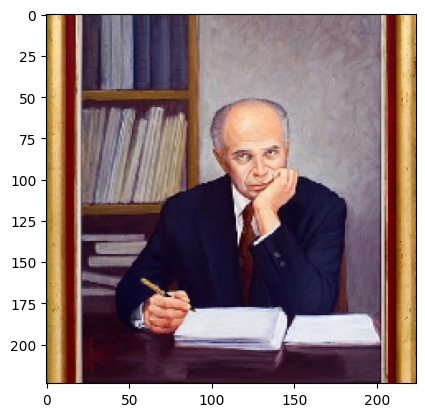
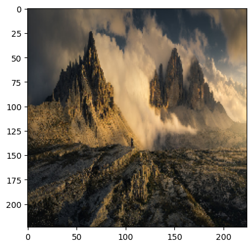
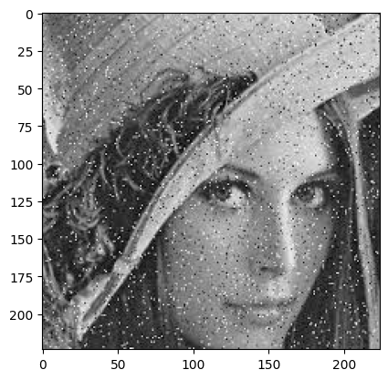

# Transfer Learning with VGG 16 Model

## Table of Contents
- [Introduction](#introduction)
- [Steps](#steps)
  - [Step 1: Explore the VGG 16 model and the data it is trained on](#step-1-explore-the-vgg-16-model-and-the-data-it-is-trained-on)
  - [Step 2: Load the VGG 16 model in your notebook and print the summary of the model](#step-2-load-the-vgg-16-model-in-your-notebook-and-print-the-summary-of-the-model)
    - [Step 2a: Load an image from file and pre-process it](#step-2a-load-an-image-from-file-and-pre-process-it)
    - [Step 2b: Predict the class of the image using VGG 16](#step-2b-predict-the-class-of-the-image-using-vgg-16)
  - [Step 3: Load a few images in your notebook and predict the class](#step-3-load-a-few-images-in-your-notebook-and-predict-the-class)
  - [Step 4: Explore how to remove the last layer of the VGG model](#step-4-explore-how-to-remove-the-last-layer-of-the-vgg-model)
  - [Step 5: Add a few layers to the VGG 16 model](#step-5-add-a-few-layers-to-the-vgg-16-model)
  - [Step 6: Add binary classification data and compile the model](#step-6-add-binary-classification-data-and-compile-the-model)
  - [Step 7: Train the new model for binary classification of images](#step-7-train-the-new-model-for-binary-classification-of-images)
  - [Step 8: Define the layers which are trainable](#step-8-define-the-layers-which-are-trainable)

## Introduction
This README provides a structured guide for implementing Transfer Learning with the VGG 16 model. Transfer learning allows us to leverage pre-trained models like VGG 16, which is trained on large-scale image datasets like ImageNet, and adapt them for specific tasks with relatively smaller datasets.

## Steps

### Step 1: Explore the VGG 16 model and the data it is trained on
Explore the architecture and details of the VGG 16 model, as well as the ImageNet dataset it is trained on.

### Step 2: Load the VGG 16 model in your notebook and print the summary of the model

#### Step 2a: Load an image from file and pre-process it
Load an image from a file, preprocess it according to the requirements of the VGG 16 model (e.g., resize, normalization), and prepare it for inference.

#### Step 2b: Predict the class of the image using VGG 16
Apply the pre-trained VGG 16 model to predict the class label of the loaded image.

### Step 3: Load a few images in your notebook and predict the class
Load multiple images into your notebook, preprocess them similarly, and predict their class labels using the pre-trained VGG 16 model.

### Step 4: Explore how to remove the last layer of the VGG model
Investigate methods to remove the last layer of the VGG 16 model, which is typically the softmax layer for class prediction, in order to adapt it for other tasks.

### Step 5: Add a few layers to the VGG 16 model
Extend the VGG 16 model by adding additional layers (e.g., dense layers) to modify its architecture for specific requirements.

### Step 6: Add binary classification data and compile the model
Integrate binary classification data with the modified VGG 16 model and compile it with appropriate loss function, optimizer, and metrics.

### Step 7: Train the new model for binary classification of images
Train the modified VGG 16 model using the binary classification data, and evaluate its performance.

### Step 8: Define the layers which are trainable
Specify which layers of the modified VGG 16 model are trainable during the training process, and which layers are frozen to retain pre-learned features.

```python
# import libraries
import numpy as np
from keras.preprocessing.image import img_to_array
from keras.applications import VGG16
from keras.applications.vgg16 import preprocess_input, decode_predictions
from keras.models import Model
from keras.layers import Dense, Dropout
from keras.optimizers import Adam
from keras.layers import Flatten
from keras.utils import to_categorical
from PIL import Image
from keras.preprocessing import image
import matplotlib.pyplot as plt
from keras.preprocessing.image import load_img, ImageDataGenerator
```

### Task 2: Load the VGG 16 model in your notebook and print the summary of the model.
#### a.	Load an image from file and pre-process it to prepare it to be applied to the model.

```python
# Load the VGG16 model
model = VGG16(weights='imagenet', include_top=True)
```

```python
model.summary()
```

    Model: "vgg16"
    _________________________________________________________________
     Layer (type)                Output Shape              Param #   
    =================================================================
     input_1 (InputLayer)        [(None, 224, 224, 3)]     0         
                                                                     
     block1_conv1 (Conv2D)       (None, 224, 224, 64)      1792      
                                                                     
     block1_conv2 (Conv2D)       (None, 224, 224, 64)      36928     
                                                                     
     block1_pool (MaxPooling2D)  (None, 112, 112, 64)      0         
                                                                     
     block2_conv1 (Conv2D)       (None, 112, 112, 128)     73856     
                                                                     
     block2_conv2 (Conv2D)       (None, 112, 112, 128)     147584    
                                                                     
     block2_pool (MaxPooling2D)  (None, 56, 56, 128)       0         
                                                                     
     block3_conv1 (Conv2D)       (None, 56, 56, 256)       295168    
                                                                     
     block3_conv2 (Conv2D)       (None, 56, 56, 256)       590080    
                                                                     
     block3_conv3 (Conv2D)       (None, 56, 56, 256)       590080    
                                                                     
     block3_pool (MaxPooling2D)  (None, 28, 28, 256)       0         
                                                                     
     block4_conv1 (Conv2D)       (None, 28, 28, 512)       1180160   
                                                                     
     block4_conv2 (Conv2D)       (None, 28, 28, 512)       2359808   
                                                                     
     block4_conv3 (Conv2D)       (None, 28, 28, 512)       2359808   
                                                                     
     block4_pool (MaxPooling2D)  (None, 14, 14, 512)       0         
                                                                     
     block5_conv1 (Conv2D)       (None, 14, 14, 512)       2359808   
                                                                     
     block5_conv2 (Conv2D)       (None, 14, 14, 512)       2359808   
                                                                     
     block5_conv3 (Conv2D)       (None, 14, 14, 512)       2359808   
                                                                     
     block5_pool (MaxPooling2D)  (None, 7, 7, 512)         0         
                                                                     
     flatten (Flatten)           (None, 25088)             0         
                                                                     
     fc1 (Dense)                 (None, 4096)              102764544 
                                                                     
     fc2 (Dense)                 (None, 4096)              16781312  
                                                                     
     predictions (Dense)         (None, 1000)              4097000   
                                                                     
    =================================================================
    Total params: 138357544 (527.79 MB)
    Trainable params: 138357544 (527.79 MB)
    Non-trainable params: 0 (0.00 Byte)
    _________________________________________________________________

```python
image_path = r"F:\New_Laptop_Documents\NMIMS_College_Docs\3rd_Year\1st_Semester\DL\Practicals\Lab9\Nitro_Wallpaper_5000x2813.jpg"
image = load_img(image_path, target_size=(224, 224))
image = img_to_array(image)
image = preprocess_input(image)
```

#### b.	Predict the class of the image using VGG 16

```python
predictions = model.predict(image.reshape(1, 224, 224, 3))
decoded_predictions = decode_predictions(predictions, top=5)[0]
```

    1/1 [==============================] - 0s 335ms/step

```python
for i, (imagenet_id, label, score) in enumerate(decoded_predictions):
    print(f"{i + 1}: {label} ({score:.2f})")
```

    1: sea_urchin (0.70)
    2: sea_anemone (0.08)
    3: theater_curtain (0.05)
    4: lionfish (0.01)
    5: daisy (0.01)

### Task 3: Load a few images in your notebook and predict the class of the image using the pre- trained model

```python
# Step 3: Load a few images and predict their classes
image_paths = ['Image_1.jpg', 'Image_2.jpg', 'Gaussian.jpeg', 'Salt_Pepper.jpg']

for image_path in image_paths:
    # Load an image from file
    image = load_img(image_path, target_size=(224, 224))
    image = img_to_array(image)
    image = preprocess_input(image)

    # Predict the class of the image using VGG16
    predictions = model.predict(image.reshape(1, 224, 224, 3))
    decoded_predictions = decode_predictions(predictions, top=5)[0]

    print(f"Predictions for {image_path}:")
    for i, (imagenet_id, label, score) in enumerate(decoded_predictions):
        print(f"{i + 1}: {label} ({score:.2f})")
```

    1/1 [==============================] - 0s 109ms/step
    Predictions for Image_1.jpg:
    1: alp (0.78)
    2: geyser (0.15)
    3: volcano (0.03)
    4: valley (0.02)
    5: cliff (0.02)
    1/1 [==============================] - 0s 119ms/step
    Predictions for Image_2.jpg:
    1: groom (0.15)
    2: suit (0.11)
    3: bookcase (0.11)
    4: wardrobe (0.08)
    5: sliding_door (0.05)
    1/1 [==============================] - 0s 123ms/step
    Predictions for Gaussian.jpeg:
    1: shovel (0.08)
    2: bucket (0.07)
    3: great_white_shark (0.07)
    4: ashcan (0.07)
    5: mask (0.03)
    1/1 [==============================] - 0s 115ms/step
    Predictions for Salt_Pepper.jpg:
    1: book_jacket (0.90)
    2: comic_book (0.03)
    3: web_site (0.02)
    4: envelope (0.00)
    5: scuba_diver (0.00)

### Task 4: Explore how to remove the last layer of the VGG model.

```python
model_without_last_layer = Model(inputs=model.input, outputs=model.layers[-2].output)
model_without_last_layer.summary()
```

    Model: "model"
    _________________________________________________________________
     Layer (type)                Output Shape              Param #   
    =================================================================
     input_1 (InputLayer)        [(None, 224, 224, 3)]     0         
                                                                     
     block1_conv1 (Conv2D)       (None, 224, 224, 64)      1792      
                                                                     
     block1_conv2 (Conv2D)       (None, 224, 224, 64)      36928     
                                                                     
     block1_pool (MaxPooling2D)  (None, 112, 112, 64)      0         
                                                                     
     block2_conv1 (Conv2D)       (None, 112, 112, 128)     73856     
                                                                     
     block2_conv2 (Conv2D)       (None, 112, 112, 128)     147584    
                                                                     
     block2_pool (MaxPooling2D)  (None, 56, 56, 128)       0         
                                                                     
     block3_conv1 (Conv2D)       (None, 56, 56, 256)       295168    
                                                                     
     block3_conv2 (Conv2D)       (None, 56, 56, 256)       590080    
                                                                     
     block3_conv3 (Conv2D)       (None, 56, 56, 256)       590080    
                                                                     
     block3_pool (MaxPooling2D)  (None, 28, 28, 256)       0         
                                                                     
     block4_conv1 (Conv2D)       (None, 28, 28, 512)       1180160   
                                                                     
     block4_conv2 (Conv2D)       (None, 28, 28, 512)       2359808   
                                                                     
     block4_conv3 (Conv2D)       (None, 28, 28, 512)       2359808   
                                                                     
     block4_pool (MaxPooling2D)  (None, 14, 14, 512)       0         
                                                                     
     block5_conv1 (Conv2D)       (None, 14, 14, 512)       2359808   
                                                                     
     block5_conv2 (Conv2D)       (None, 14, 14, 512)       2359808   
                                                                     
     block5_conv3 (Conv2D)       (None, 14, 14, 512)       2359808   
                                                                     
     block5_pool (MaxPooling2D)  (None, 7, 7, 512)         0         
                                                                     
     flatten (Flatten)           (None, 25088)             0         
                                                                     
     fc1 (Dense)                 (None, 4096)              102764544 
                                                                     
     fc2 (Dense)                 (None, 4096)              16781312  
                                                                     
    =================================================================
    Total params: 134260544 (512.16 MB)
    Trainable params: 134260544 (512.16 MB)
    Non-trainable params: 0 (0.00 Byte)
    _________________________________________________________________

### Task 5: Add a few layers to the VGG 16 model.

```python
# Define the number of classes (2 for binary classification)
num_classes = 2

custom_top_layer = Dense(256, activation='relu')(model_without_last_layer.output)
custom_top_layer = Dropout(0.5)(custom_top_layer)
output_layer = Dense(num_classes, activation='softmax')(custom_top_layer)

new_model = Model(inputs=model_without_last_layer.input, outputs=output_layer)
new_model.summary()
```

    Model: "model_1"
    _________________________________________________________________
     Layer (type)                Output Shape              Param #   
    =================================================================
     input_1 (InputLayer)        [(None, 224, 224, 3)]     0         
                                                                     
     block1_conv1 (Conv2D)       (None, 224, 224, 64)      1792      
                                                                     
     block1_conv2 (Conv2D)       (None, 224, 224, 64)      36928     
                                                                     
     block1_pool (MaxPooling2D)  (None, 112, 112, 64)      0         
                                                                     
     block2_conv1 (Conv2D)       (None, 112, 112, 128)     73856     
                                                                     
     block2_conv2 (Conv2D)       (None, 112, 112, 128)     147584    
                                                                     
     block2_pool (MaxPooling2D)  (None, 56, 56, 128)       0         
                                                                     
     block3_conv1 (Conv2D)       (None, 56, 56, 256)       295168    
                                                                     
     block3_conv2 (Conv2D)       (None, 56, 56, 256)       590080    
                                                                     
     block3_conv3 (Conv2D)       (None, 56, 56, 256)       590080    
                                                                     
     block3_pool (MaxPooling2D)  (None, 28, 28, 256)       0         
                                                                     
     block4_conv1 (Conv2D)       (None, 28, 28, 512)       1180160   
                                                                     
     block4_conv2 (Conv2D)       (None, 28, 28, 512)       2359808   
                                                                     
     block4_conv3 (Conv2D)       (None, 28, 28, 512)       2359808   
                                                                     
     block4_pool (MaxPooling2D)  (None, 14, 14, 512)       0         
                                                                     
     block5_conv1 (Conv2D)       (None, 14, 14, 512)       2359808   
                                                                     
     block5_conv2 (Conv2D)       (None, 14, 14, 512)       2359808   
                                                                     
     block5_conv3 (Conv2D)       (None, 14, 14, 512)       2359808   
                                                                     
     block5_pool (MaxPooling2D)  (None, 7, 7, 512)         0         
                                                                     
     flatten (Flatten)           (None, 25088)             0         
                                                                     
     fc1 (Dense)                 (None, 4096)              102764544 
                                                                     
     fc2 (Dense)                 (None, 4096)              16781312  
                                                                     
     dense (Dense)               (None, 256)               1048832   
                                                                     
     dropout (Dropout)           (None, 256)               0         
                                                                     
     dense_1 (Dense)             (None, 2)                 514       
                                                                     
    =================================================================
    Total params: 135309890 (516.17 MB)
    Trainable params: 135309890 (516.17 MB)
    Non-trainable params: 0 (0.00 Byte)
    _________________________________________________________________

### Task 6: Add binary classification data and compile the model.

```python
new_model.compile(optimizer=Adam(learning_rate=0.0001), loss='binary_crossentropy', metrics=['accuracy'])
```

### Task 7 and 8: Train the new model for binary classification of images. Further Predict for a random image.

```python
def predict(img1):
  plt.imshow(img1)
  x = image.img_to_array(img1)
  x = np.expand_dims(x,axis=0)
  x - preprocess_input(x)
  img_class = model.predict(x)

  predict_class = decode_predictions(img_class)
  print(predict_class)
```

```python
img_path1 = "Image_1.jpg"

img1 = image.load_img(img_path1, target_size = (224,224))

img_path2 = 'Image_2.jpg'

img2 = image.load_img(img_path2, target_size = (224,224))

img_path3 = 'Gaussian.jpeg'

img3 = image.load_img(img_path3, target_size = (224,224))

img_path4 = 'Salt_Pepper.jpeg'

img4 = image.load_img(img_path3, target_size = (224,224))
```

```python
data = []
data.append(np.array(img1))
data.append(np.array(img2))
data.append(np.array(img3))
data.append(np.array(img4))
data = np.array(data)
```

```python
data
```

    array([[[[ 51,  52,  54],
             [ 52,  53,  55],
             [ 52,  53,  55],
             ...,
             [118, 101,  73],
             [110,  94,  71],
             [ 96,  84,  70]],
    
            [[ 50,  51,  53],
             [ 51,  52,  54],
             [ 51,  52,  54],
             ...,
             [121, 101,  74],
             [112,  94,  72],
             [ 97,  85,  69]],
    
            [[ 50,  51,  53],
             [ 51,  52,  54],
             [ 51,  52,  54],
             ...,
             [123, 104,  74],
             [116,  98,  74],
             [100,  87,  71]],
    
            ...,
    
            [[ 13,  13,  11],
             [ 10,  12,  11],
             [ 13,  15,  14],
             ...,
             [ 15,  16,  18],
             [ 17,  18,  20],
             [ 14,  18,  21]],
    
            [[  8,   8,   8],
             [ 17,  17,  19],
             [  8,   8,   8],
             ...,
             [  8,  12,  15],
             [ 14,  18,  21],
             [ 26,  30,  33]],
    
            [[ 16,  16,  16],
             [ 13,  13,  15],
             [ 47,  47,  47],
             ...,
             [  8,  12,  15],
             [ 33,  37,  40],
             [ 11,  12,  14]]],
    
    
           [[[148, 112,  38],
             [157, 121,  33],
             [175, 140,  48],
             ...,
             [187, 146,  67],
             [169, 128,  46],
             [199, 149,  78]],
    
            [[140, 104,  30],
             [146, 109,  21],
             [169, 133,  39],
             ...,
             [198, 155,  77],
             [182, 137,  54],
             [208, 155,  85]],
    
            [[136, 101,  17],
             [163, 126,  38],
             [160, 123,  34],
             ...,
             [197, 151,  73],
             [183, 136,  54],
             [216, 162,  92]],
    
            ...,
    
            [[124,  87,   9],
             [155, 117,  36],
             [168, 128,  40],
             ...,
             [183, 133,  62],
             [180, 128,  52],
             [172, 115,  44]],
    
            [[106,  68,   0],
             [159, 121,  40],
             [174, 134,  46],
             ...,
             [180, 130,  57],
             [180, 129,  50],
             [167, 110,  41]],
    
            [[119,  80,   3],
             [159, 118,  36],
             [169, 129,  41],
             ...,
             [184, 135,  59],
             [190, 138,  62],
             [172, 115,  48]]],
    
    
           [[[188, 188, 188],
             [161, 161, 161],
             [151, 151, 151],
             ...,
             [191, 191, 191],
             [174, 174, 174],
             [149, 149, 149]],
    
            [[179, 179, 179],
             [174, 174, 174],
             [133, 133, 133],
             ...,
             [158, 158, 158],
             [172, 172, 172],
             [ 66,  66,  66]],
    
            [[175, 175, 175],
             [149, 149, 149],
             [138, 138, 138],
             ...,
             [183, 183, 183],
             [185, 185, 185],
             [214, 214, 214]],
    
            ...,
    
            [[106, 106, 106],
             [107, 107, 107],
             [ 92,  92,  92],
             ...,
             [147, 147, 147],
             [159, 159, 159],
             [167, 167, 167]],
    
            [[106, 106, 106],
             [103, 103, 103],
             [ 92,  92,  92],
             ...,
             [151, 151, 151],
             [168, 168, 168],
             [157, 157, 157]],
    
            [[ 93,  93,  93],
             [122, 122, 122],
             [ 96,  96,  96],
             ...,
             [148, 148, 148],
             [157, 157, 157],
             [156, 156, 156]]],
    
    
           [[[188, 188, 188],
             [161, 161, 161],
             [151, 151, 151],
             ...,
             [191, 191, 191],
             [174, 174, 174],
             [149, 149, 149]],
    
            [[179, 179, 179],
             [174, 174, 174],
             [133, 133, 133],
             ...,
             [158, 158, 158],
             [172, 172, 172],
             [ 66,  66,  66]],
    
            [[175, 175, 175],
             [149, 149, 149],
             [138, 138, 138],
             ...,
             [183, 183, 183],
             [185, 185, 185],
             [214, 214, 214]],
    
            ...,
    
            [[106, 106, 106],
             [107, 107, 107],
             [ 92,  92,  92],
             ...,
             [147, 147, 147],
             [159, 159, 159],
             [167, 167, 167]],
    
            [[106, 106, 106],
             [103, 103, 103],
             [ 92,  92,  92],
             ...,
             [151, 151, 151],
             [168, 168, 168],
             [157, 157, 157]],
    
            [[ 93,  93,  93],
             [122, 122, 122],
             [ 96,  96,  96],
             ...,
             [148, 148, 148],
             [157, 157, 157],
             [156, 156, 156]]]], dtype=uint8)

```python
targets = [0, 0, 1]
targets = to_categorical(targets, num_classes=2)

image_paths = [r"F:\New_Laptop_Documents\NMIMS_College_Docs\3rd_Year\1st_Semester\DL\Practicals\Lab9\Image_1.jpg", r"F:\New_Laptop_Documents\NMIMS_College_Docs\3rd_Year\1st_Semester\DL\Practicals\Lab9\Image_2.jpg", r"F:\New_Laptop_Documents\NMIMS_College_Docs\3rd_Year\1st_Semester\DL\Practicals\Lab9\Gaussian.jpeg", r"F:\New_Laptop_Documents\NMIMS_College_Docs\3rd_Year\1st_Semester\DL\Practicals\Lab9\Salt_Pepper.jpg"]
```

```python
model3 = VGG16(weights='imagenet', include_top=False, input_shape=(224, 224, 3))
x = model3.output
x = Flatten()(x)
x = Dense(1024, activation='relu')(x)
predictions = Dense(2, activation='softmax')(x)
model3 = Model(inputs=model3.input, outputs=predictions)
```

```python
model3.compile(optimizer=Adam(learning_rate=0.0001), loss='categorical_crossentropy', metrics=['accuracy'])
```

```python
def preprocess_img(img_path, target_size=(224, 224)):
    img = image.load_img(img_path, target_size=target_size)
    plt.imshow(img)
    plt.show()
    x = image.img_to_array(img)
    x = np.expand_dims(x, axis=0)
    x = preprocess_input(x)
    return x

def predict_class(model, img_path):
    x = preprocess_img(img_path)
    prediction = model.predict(x)
    class_label = np.argmax(prediction)
    probabilities = prediction[0] * 100
    if class_label == 0:
        print(f"The image is predicted to belong to the first class with {probabilities[0]:.2f}% probability.")
    else:
        print(f"The image is predicted to belong to the second class with {probabilities[1]:.2f}% probability.")
```

```python
predict(img2)
```

    1/1 [==============================] - 0s 128ms/step
    [[('n02870880', 'bookcase', 0.19360466), ('n02883205', 'bow_tie', 0.053831667), ('n02871525', 'bookshop', 0.049464714), ('n04589890', 'window_screen', 0.048883837), ('n04005630', 'prison', 0.030654741)]]

    

    

```python
predict(img1)
```

    1/1 [==============================] - 0s 113ms/step
    [[('n09193705', 'alp', 0.4756926), ('n09288635', 'geyser', 0.31268018), ('n09246464', 'cliff', 0.07910416), ('n09472597', 'volcano', 0.0679643), ('n09468604', 'valley', 0.021801975)]]

    

    

```python
predict(img3)
```

    1/1 [==============================] - 0s 113ms/step
    [[('n02909870', 'bucket', 0.075282775), ('n02747177', 'ashcan', 0.06954469), ('n04208210', 'shovel', 0.06564177), ('n03388043', 'fountain', 0.034990232), ('n03724870', 'mask', 0.032282088)]]

    

    

```python
predict(img4)
```

    1/1 [==============================] - 0s 117ms/step
    [[('n02909870', 'bucket', 0.075282775), ('n02747177', 'ashcan', 0.06954469), ('n04208210', 'shovel', 0.06564177), ('n03388043', 'fountain', 0.034990232), ('n03724870', 'mask', 0.032282088)]]

    

    

# Experiment Conclusion

In this student experiment, we explored transfer learning using the VGG16 model for binary image classification. The key highlights are:

1. **Data Prep:** We resized and preprocessed the MNIST dataset to fit the VGG16 model's input requirements (224x224x3).

2. **Model:** We utilized VGG16, a pre-trained deep learning model, for its transfer learning capabilities.

3. **Customization:** Custom layers were added for binary classification (0 or 1), tailoring the model to our task.

4. **Training:** We trained the model on our data, adjusting labels for binary classification.

5. **Fine-Tuning:** By selectively unfreezing VGG16 layers, we fine-tuned the model for better performance.

In summary, this experiment introduced transfer learning with VGG16 as a valuable approach for students. It showcases the power of leveraging pre-trained models for efficient image classification and how fine-tuning can optimize performance. It's a strong foundation for deeper exploration in deep learning and computer vision.
