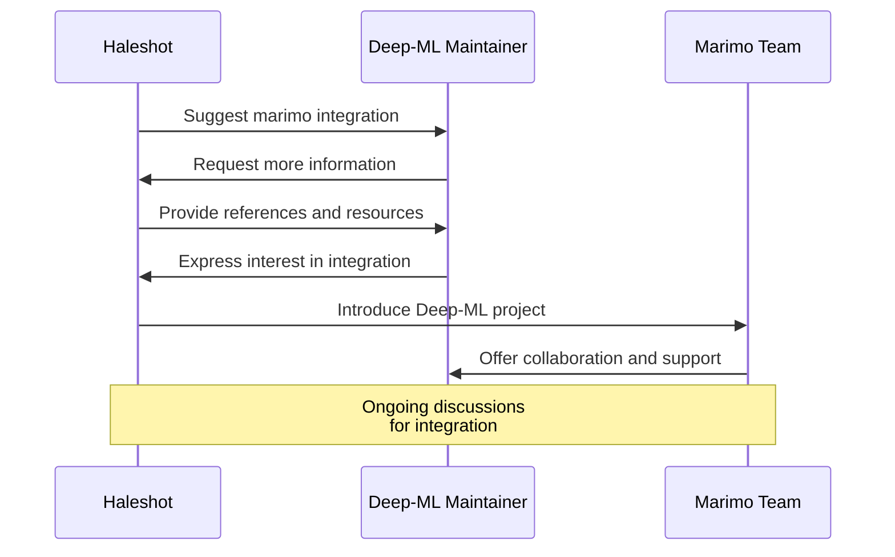

As a B.Tech AI senior undergrad, I'm always on the lookout for resources that offer AI/ML/DL problems from scratch. Enter [deep-ml.com](https://github.com/Open-Deep-ML/DML-OpenProblem) - my latest obsession, courtesy of the TL;DR Newsletter (shoutout to my favorite "procrastination enabler"!). It's like finding a goldmine for an AI nerd like me, perfectly aligning with my *totally healthy* habit of curating resources for future projects and contributions.

{}
The DML-OpenProblem repository is an open-source collection of problems focused on linear algebra, machine learning, and deep learning. It powers the [deep-ml.com](https://github.com/Open-Deep-ML/DML-OpenProblem), providing a platform for solving problems from scratch and offering a robust learning experience.
{}

My Contributions:

1. Fixed bold text highlighting in the Linear Regression problem (Gradient Descent) section.
   PR: [#40](https://github.com/Open-Deep-ML/DML-OpenProblem/pull/40)

2. Added line breaks and improved HTML syntax in the Learn section.
   PR: [#45](https://github.com/Open-Deep-ML/DML-OpenProblem/pull/45)

3. Fixed Matrix transformation problem description rendering and added a test case.
   PR: [#53](https://github.com/Open-Deep-ML/DML-OpenProblem/pull/53)

4. Improved K-means clustering problem (Q_17) with better HTML syntax, clearer description, and additional test cases.
   PR: [#58](https://github.com/Open-Deep-ML/DML-OpenProblem/pull/58)

Future Plans:
- Set up CI/CD for automating website updates from the repository.
- Contribute activation functions from [ML-From-Scratch repository](https://github.com/eriklindernoren/ML-From-Scratch/blob/master/mlfromscratch/deep_learning/activation_functions.py).
- Add [video explanations](https://x.com/real_deep_ml/status/1846537201846214746) for solved problems.
- Integrate marimo with deep-ml.com (stay tuned!).

The marimo integration is particularly exciting. As an active user and [ambassador for marimo](https://marimo.io/ambassadors), I see great potential in linking these platforms. The notebook-based implementation could expand the types of problems on deep-ml.com, making it more industry-oriented. I've initiated discussions with both the marimo team and deep-ml contributors about this integration.

This project not only allows me to contribute to an educational platform but also bridges my interests in deep learning and open-source collaboration. It's a perfect blend of problem-solving, community engagement, and technological integration.

# Next Steps:
 - [ ] Continue contributing problem implementations and explanations.
 - [ ] Assist in setting up .github folder with PR templates and workflows.
 - [ ] Collaborate on marimo integration with both teams.
